# 第1章 绪 论  

信息革命是人类社会经历了农业革命、工业革命之后的又一场社会变革，以数字化、网络 化和智能化为特征的信息化已经全面融入社会生产和人类生活的各个环节。《国家信息化发展 战略纲要》指出，到21世纪中叶，信息化全面支撑富强民主文明和谐的社会主义现代化国家建 设，网络强国地位日益巩固，在引领全球信息化发展方面有更大作为。信息化的核心是信息资 源开发、信息技术应用和信息系统建设，其核心力量是以系统分析师为代表的规模庞大的人才 队伍。系统分析师是负责分析、设计和指导开发企业或组织计算机应用系统的高级复合型人才， 其知识水平和业务工作能力决定了系统的成败。高水平的系统分析师人才队伍建设是助推我国 软件产业发展和信息化变革的重要支撑力量。  

# 1.1 信息与信息系统  

信息是一种客观事物，它与材料、能源一样，都是社会的基础资源。1948年，美国科学家香农（C. E. Shannon）在对通信理论深入研究的基础上，提出了信息的概念，创立了信息理论。此后，人们对信息的研究迅速增加，形成了一个新的学科——信息论。至今，信息论已发展成一个内涵非常丰富的学科，与控制论和系统论并称为现代科学的“三论”。计算机技术和网络技术的迅速发展和普及，更加提高了“三论”在现代科学技术中的地位。同时，信息论为计算机技术和网络技术的发展提供了方向上的指导，为信息化提供了较好的理论支撑。  

# 1.1.1 信息的基本概念  

香农认为, 信息是不确定性的减少。由此可知, 信息就是确定性的增加。香农不但给出了信息的定义, 还给出了信息的定量描述, 并确定了信息量的单位为比特 (bit)。1 比特的信息量,在变异度为 2 的最简单情况下, 就是能消除非此即彼的不确定性所需要的信息量。这里的 “变异度” 是指事物的变化状态空间为 2, 例如, 大和小、高和低、快和慢等。  

香农将热力学中的“熵”引入信息论。在热力学中，熵是系统无序程度的度量，而信息与熵正好相反，信息是系统有序程度的度量，表现为负熵，计算公式如下:  

$$
H ( x ) = - \sum P ( x _ { i } ) \mathrm { l b } P ( x _ { i } )
$$  

式中：$x_{i}$代表$n$个状态中的第$i$个状态，$P(x_{i})$代表出现第$i$个状态的概率，$H(x)$代表用以消除系统不确定性所需的信息量，即以比特为单位的负熵。  

# 1. 信息的特征  

香农关于信息的定义揭示了信息的本质，同时，人们通过深入研究，发现信息还具有很多其他的特征，列举如下:  
 

(1)客观性。信息是客观事物在人脑中的反映, 而反映的对象则有主观和客观的区别, 因此, 信息可分为主观信息 (例如, 决策、指令和计划等) 和客观信息 (例如, 国际形势、经济发展和一年四季等)。主观信息必然要转化成客观信息, 例如, 决策和计划等主观信息要转化成实际行动。因此, 信息具有客观性。  

(2) 普遍性。物质决定精神, 物质的普遍性决定了信息的普遍存在。  

(3) 无限性。客观世界是无限的, 反映客观世界的信息自然也是无限的。无限性可分为两个层次: 一是无限的事物产生无限的信息, 即信息的总量是无限的; 二是每个具体事物或有限个事物的集合所能产生的信息也可以是无限的。  

(4) 动态性。信息是随着时间的变化而变化的。  

(5) 相对性。不同的认识主体从同一事物中获取的信息及信息量可能是不同的。  

(6) 依附性。信息的依附性可以从两个方面来理解: 一方面, 信息是客观世界的反映, 任何信息必然由客观事物所产生, 不存在无源的信息; 另一方面, 任何信息都要依附于一定的载体存在, 需要有物质的承担者, 信息不能完全脱离物质而独立存在。  

(7) 变换性。信息通过处理可以实现变换或转换, 使其形式和内容发生变化, 以适应特定的需要。  

(8) 传递性。信息在时间上的传递就是存储，在空间上的传递就是转移或扩散。  

(9)层次性。客观世界是分层次的，反映它的信息也是分层次的。  

(10) 系统性。信息可以表示为一种集合, 不同类别的信息可以形成不同的整体。因此, 可以形成与现实世界相对应的信息系统。  

(11) 转化性。信息的产生不能没有物质, 信息的传递不能没有能量, 但有效地使用信息,可以将信息转化为物质或能量。  

另外，根据各行业信息的不同，信息还可以具有安全性和及时性等特性，而且，信息应用 的场合不同，其侧重面也不一样。例如，对于金融信息而言，其最重要的特性是安全性；而对 于市场信息而言，其最重要的特性是及时性。  

# 2. 信息的功能  

在人类认识世界和改造世界的过程中，信息与物质、能源一样，发挥着十分重要的作用。信息的主要功能如下:  

(1) 为认识世界提供依据。人们认识世界, 首先要获取认识对象的有关信息, 并通过对这些信息的加工获得有关知识, 从而形成正确的认识。  

(2) 为改造世界提供指导。人们认识世界的目的是改造世界, 而改造世界就必须有正确的观念作指导。这些观念包括活动的计划、环境分析、结果的预测和发展变化的对策等, 这些都离不开信息的指导。  

(3) 为有序的建立提供保证。人们所有活动的目的都是使得客观世界变得更加有序。这种有序至少要包括两种情况: 一是使得本来有序的客观世界得到改善, 变得更加有序; 二是打破原来的有序, 建立一种新的有序。无论哪种情况, 都需要信息的保证。  

(4) 为资源开发提供条件。人类社会的生存和发展要建立在资源之上, 所有这些资源可分  
为两类，即有形资源和无形资源。有形资源包括物质和能量，物质供给材料，能量供给动力，它们是人类发展的基础；无形资源主要是信息资源，信息供给智力，是人类发展的精神力量。无论是开发有形资源还是无形资源，都需要信息。  

(5) 为知识的生产提供材料。生产是人类生存和发展的基础和前提, 既包括物质产品的生产, 也包括精神产品的生产, 其中知识的生产是精神产品生产的主要内容, 而信息则为知识的生产提供材料。  

# 3. 两个相关概念  

与信息相关的概念主要有两个，分别是数据和知识。  

(1) 信息与数据。信息是经过加工后的数据, 数据是信息生成的材料, 是信息的存在形式和状态, 即信息是被解释或被理解的数据。例如, 有一条数据库记录 “张啸杰, 男, 19, 大二, ……”, 其中, “张啸杰” “男” “19” “大二” 等都是数据, 但它们组合起来是关系数据库中的一条记录, 四者之间是有逻辑关系的, 从谓词演算的角度来看, 就容易理解为 “一个名叫张啸杰的男生, 他今年 19 岁, 是大学二年级学生”。至此, 四者就成为信息了。  

(2) 信息与知识。知识是经过加工的信息。例如, 有两条数据库记录, 分别为 “张啸杰, 湖南永州” 和 “李国杰, 湖南邵阳”, 其语义为 “张啸杰是湖南永州人” 和 “李国杰是湖南邵阳人”, 这是信息。如果得出 “张啸杰和李国杰是湖南同乡” 就是知识了。  

# 1.1.2 系统及相关理论  

系统是由相互联系、相互依赖、相互作用的事物或过程组成的具有整体功能和综合行为的统一体。在日常生活中，经常使用“系统”的概念，例如，经济领域中的商业系统和金融系统，自然界中的水利系统和生态系统等。从数学角度来看，系统是一个集合，是由许多相互作用、相互依存的事物（集合元素）为了达到某个目标组成的集合。研究系统的一般理论和方法称为系统论。系统是系统论的主要研究对象，而要研究系统，首先应该认识系统的特性。  

# 1. 系统的特性  

系统的总体特性是系统整体上的属性，系统的这些特性通常是很难提前预测的，只有当所有子系统和元素被整合形成完全的系统之后才能表现出来。系统的特性主要表现为整体性、层次性、目的性、稳定性、突变性、自组织性、相似性、相关性和环境适应性等方面。  

(1) 整体性。系统是一个整体, 元素为了达到一定的目的, 按照一定的原则, 有序地排列起来组成系统, 从而产生出系统的特定功能。  

(2)层次性。系统是由多个元素组成的, 系统和元素是相对的概念。元素是相对于它所处的系统而言的, 系统是从它包含元素的角度来看的, 如果研究问题的角度变一变, 系统就成为更高一级系统的元素, 也称为子系统。  

(3) 目的性。任何一个系统都有一定的目的或目标。  

(4) 稳定性。在外界作用下的开放系统有一定的自我稳定能力, 能够在一定范围内进行自我调节, 从而保持和恢复原来的有序状态, 以及原有的结构和功能。  

(5) 突变性。突变性是指系统通过失稳, 从一种状态进入另一种状态的一种剧变过程, 它  
 

是系统质变的一种基本形式。  

(6) 自组织性。开放系统在系统内外因素的作用下, 自发组织起来, 使系统从无序到有序, 从低级有序到高级有序。  

(7) 相似性。系统具有同构和同态的性质, 体现在系统结构、存在方式和演化过程具有共同性。系统具有相似性, 根本原因在于世界的物质统一性。  

(8) 相关性。元素是可分的和相互联系的, 组成系统的元素必须有明确的边界, 可以与别的元素区分开来。另外, 元素之间是相互联系的, 不是哲学上所说的普遍联系那种联系, 而是实实在在的、具体的联系。  

(9) 环境适应性。系统总处在一定环境中, 与环境发生相互作用。系统和环境之间总是在发生着一定的物质和能量交换。  

# 2. 系统论的任务  

系统论的任务不仅在于认识系统的特点和规律，更重要的还在于利用这些特点和规律去控制、管理、改造或创造系统，使得系统的存在、发展更符合人们的需要。也就是说，研究系统的目的在于调整系统结构，协调各元素的关系，使系统达到优化目标。系统论的作用具体表现为以下几方面:  

(1) 改变人类的思维方式。系统论的出现, 使人类的思维方式发生了深刻的变化。以往研究问题, 一般是将事物分解成若干部分, 抽象出最简单的因素, 然后再以部分的性质去说明复杂事物。这是传统的分析方法, 这种方法的着眼点在局部或元素, 遵循的是单项因果决定论, 虽然这是数百年来在特定范围内行之有效、人们最熟悉的思维方法, 但是它不能如实地说明事物的整体性, 不能反映事物之间的联系和相互作用, 它只适用于认识较为简单的事物, 而不能胜任对复杂问题的研究。在现代科学的整体化和高度综合化的发展趋势下, 在人类面临的许多规模巨大、关系复杂、参数众多的复杂问题面前, 它就显得无能为力了。而系统分析方法能够站在较高的层次上认识问题, 从而做到高屋建领、纵观全局, 为解决复杂问题提供了有效的思维方式。所以, 系统论连同控制论、信息论等其他学科一起, 为人类认识世界提供了新的思路和新的方法, 从而促进了各门学科的发展。  

(2) 提供科学的理论和方法。系统论反映了现代科学发展的趋势和现代社会化大生产的特点, 以及现代社会生活的复杂性, 所以它的理论和方法能够得到广泛的应用。系统论不仅为现代科学的发展提供了理论和方法, 而且也为解决现代社会中的政治、经济、军事、科学和文化等领域的各种复杂问题提供了方法论的基础, 系统观念已经渗透到每个领域。  

(3) 形成统一的系统科学体系。当前, 系统论发展的趋势和方向是朝着建立统一的系统科学体系的目标前进。一般系统论创始人贝塔朗菲 (L. Bertalanffy), 将他的系统论分为两个部分, 分别是狭义系统论和广义系统论。狭义系统论着重对系统本身进行分析与研究; 广义系统论则是对一类相关的系统科学原理进行分析与研究, 其中包括系统科学、系统技术和系统哲学三方面的内容。  

# 3. 系统理论  

系统理论是20世纪人类取得的最伟大的科学成就之一，它为人们提供了一套崭新的科学思  
维方式，同时，还为人们提供了优化的工作方法和定量的数学工具。由于研究的视角不同、研究者的背景不同等，系统论还没有形成一个统一的理论体系，还是处在不停的演变和发展过程中。综合各种研究成果，系统理论大致包括以下8个基本原理:  

(1) 系统的整体性原理。系统是由多个元素组成的, 而且这些元素之间按一定的方式相互联系、相互作用产生了系统的整体性。凡是系统都有整体的形态、整体的结构、整体的边界、整体的特性、整体的行为、整体的功能、整体的空间占有和时间展开。  

(2) 系统的整体突变原理（非加和原理）。系统是由若干元素按一定方式相互联系形成的有机整体，从而产生了它的元素和元素的总和所没有的新性质。这种性质只能在系统中表现，不等于各个元素的性质和功能的简单相加。  

(3) 系统的层次性原理。由于系统组成元素在数量和质量以及结合方式等方面存在差异, 使得系统组织在地位与作用、结构与功能上表现出等级秩序, 形成具有质的差异的系统等级。  

(4) 系统的开放性原理 (开放系统)。系统总是从普遍联系的客观世界中相对地划分出来的, 与外部世界有着密切的联系, 既有元素与外部的直接联系, 也有系统整体与外部的联系,系统具有不断与外界环境交换物质、能量、信息的性质和功能。  

(5) 系统的目的性原理。系统与环境的相互作用中，在一定范围内其发展变化不受或少受条件变化的影响，坚持表现出某种趋向预先确定的状态的特性。  

(6) 系统环境互塑共生原理。系统对环境有两种相反的作用和输出: 一种是积极的、有利的, 称之为功能; 另一种是消极的、不利的, 称之为污染。环境对系统也有两种相反的作用和输入: 一种是积极的、有利于系统发展的资源; 另一种是消极的、不利于系统发展的压力。  

(7) 系统的秩序原理。系统的形成和发展全过程中都存在有序和无序两种形态特征, 有序性是系统内部和内外之间有规则、确定的相互联系, 无序性是系统内部和内外之间无规则、不确定的关系。  

(8) 系统的生命周期原理（演化原理）。系统具有从产生到发展，直至最终消亡的不断演化的 过程。当具备一定条件后，一个系统从内外不分到内外有别，系统在与环境相互作用的过程 中不断发展，最终因为内外因素的作用，导致系统发生病变、消亡。  

# 4. 信息系统  

简单地说, 信息系统就是接受输入数据, 通过加工处理产生信息的系统。面向管理是信息系统的显著特点, 以计算机为基础的信息系统可以定义为, 结合管理理论和方法, 应用信息技术解决管理问题, 为管理决策提供支持的系统。管理模型、信息处理模型和系统实现条件三者的结合产生信息系统, 如图 1-1 所示。  

管理模型指系统服务对象领域的专门知识，  

  
图 1-1 信息系统  

以及分析和处理该领域问题的模型，也称为对象的处理模型。信息处理模型指系统处理信息的结构和方法。管理模型中的理论和分析方法，在信息处理模型中转化为信息获取、存储、传输、  
加工和使用的规则。系统实现条件指可供应用的计算机技术和通信技术、从事对象领域工作的人员，以及对这些资源的控制与融合。  

# 1.1.3 系统工程方法论  

系统工程是从整体出发合理开发、设计、实施和运用系统科学的工程技术。它根据总体协调的需要，综合应用自然科学和社会科学中的有关思想、理论和方法，利用计算机作为工具，对系统的结构、元素、信息和反馈等进行分析，以达到最优规划、最优设计、最优管理和最优控制的目的。  

系统工程方法论是指运用系统工程研究问题的一套程序化的工作方法和策略，也可以理解成为了达到预期目标，运用系统工程思想和技术解决问题的工作程序或步骤。系统工程方法论是在综合应用运筹学、控制论、信息论、管理科学、心理学、经济学和计算机科学等有关学科的理论和方法的基础上形成的科学思想和方法，是用于解决复杂系统问题的一套工作步骤、方法、工具和技术。  

在长期的发展过程中，系统工程专家在从事系统工程的研究和应用中，逐渐形成了具有各自专业特点的工作方法和步骤，它们是系统工程方法论的真正基础。在各种系统工程方法论中，最具代表性的是霍尔（A. D. Hall）的三维结构方法体系和切克兰德（P. B. Checkland）的软系统方法论。  

# 1. 霍尔三维结构  

霍尔三维结构也称为霍尔系统工程，它为解决大型复杂系统的规划、组织和管理问题提供了一种统一的思想方法，它将系统工程的整个活动过程分为前后紧密衔接的7个阶段和7个步骤，同时还考虑了为完成这些阶段和步骤所需要的各种专业知识和技能。这样，就形成了由时间维、逻辑维和知识维所组成的三维空间结构，如图1-2所示。  

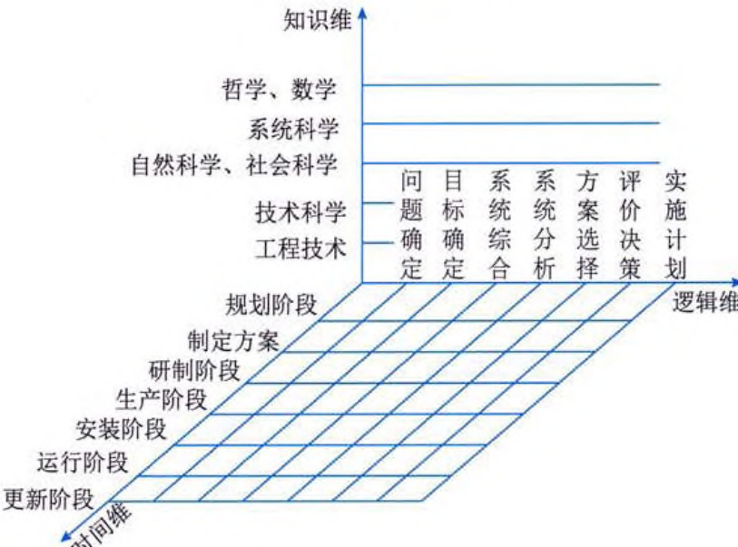  
图 1-2 霍尔三维结构   

(1) 逻辑维。逻辑维就是解决问题的逻辑过程。运用系统工程方法解决某一大型工程项目时, 一般可分为问题确定、目标确定、系统综合、系统分析、方案选择、评价决策和实施计划 7 个步骤。问题确定步骤通过全面收集有关资料和数据, 弄清问题的历史、现状及发展趋势; 目标确定步骤提出解决问题所要达到的目标, 制定评价方案的标准和指标, 以便对方案进行评价; 系统综合步骤按照问题的性质和预期目标, 形成一组可供选择的系统方案; 系统分析步骤对可能入选的方案进一步说明其性质和特点, 以及与整个系统的相互关系, 为了对众多备选方案进行分析比较, 往往要通过构造模型, 将这些方案与系统的评价目标联系起来; 方案选择步骤也就是系统优化阶段, 即在一定的限制条件下, 选择最优方案或确定方案的优劣顺序; 评价决策步骤由决策者根据全面要求, 最后确定一个或几个方案来试行; 实施计划步骤将最后选定方案付诸实施。  

(2)时间维。时间维就是工作进程。对于一个具体的工作项目, 从系统规划起一直到更新为止, 全部过程可分为规划阶段、制定方案、研制阶段、生产阶段、安装阶段、运行阶段和更新阶段。  

(3) 知识维。知识就即是专业科学知识。系统工程除了要求为完成上述各步骤、各阶段所需的某些共性知识外, 还需要其他学科的知识和各种专业技术, 霍尔将这些知识分为工程、医药、建筑、商业、法律、管理、社会科学和艺术等。各类系统工程都需要使用相应的专业基础知识。  

# 2. 软系统方法论  

霍尔三维结构方法体系的特点是强调明确目标，认为对任何系统的分析都必须满足其目标 的需求，其核心内容是模型化和最优化。霍尔认为，现实问题都可以归结为工程问题，从而可 以应用定量分析方法求得最优的系统方案。  

在20世纪60年代, 系统工程主要用来寻求各种战术问题的最优策略, 或用来组织与管理大型工程建设项目。这类项目最适合应用霍尔的三维结构方法体系, 因为工程项目的任务一般比较明确, 问题的结构一般是清楚的, 属于结构化问题。这时可以充分运用自然科学和工程技术方面的知识和经验, 有的项目甚至可以进行试验。属于这类性质的问题都可以应用数学模型进行描述, 用优化方法求出模型的最优解。但是, 从20世纪70年代开始, 系统工程面临的问题与人的因素的关系越来越密切, 与社会、政治、经济和生态等因素纠缠在一起。这些因素多且复杂, 属于非结构化问题。这类问题本身的定义并不清楚, 难以用逻辑严谨的数学模型进行描述。因此, 不少系统工程学者对霍尔三维结构方法体系提出了修正意见, 其中, 切克兰德提出的一种系统工程方法论受到了系统工程学界的重视。  

切克兰德将霍尔三维结构方法体系称为硬系统方法论。他认为，完全按照解决工程问题的思路来解决社会问题和软科学问题将遇到很多困难，至于什么是“最优”，由于人们的立场、利益各异，判断价值观不同，很难简单地取得一致的看法，因此，“可行”和“满意”的概念逐渐代替了“最优”的概念。还有一些问题只有通过概念模型或意识模型的讨论和分析后，才能使得人们对问题的实质有进一步的认识，经过不断磋商，再经过不断地反馈，逐步弄清问题，得出满意的可行解。切克兰德根据以上思路提出他的方法论，并称之为软系统方法论。软系统方法论主要按照以下5个步骤来分析问题：  
(1) 问题现状说明。说明现状的目的是改善现状，弄清问题本身的基本定义。  

(2) 理清问题的关联因素。搞清楚与改善有关的各种因素及其相互关系。  

(3) 建立概念模型。运用系统的观点和系统思想描述系统活动的现状, 可用结构模型或流程图来表达。  

(4) 比较。根据数学模型的理论和方法, 改进所建立的概念模型, 然后将概念模型和现状进行比较, 逐步得出满意的可行解。  

(5) 实施。对改善问题予以实施。  

软系统方法论的核心不是最优化，而是进行比较，强调找出可行、满意的结果。比较的过程要组织讨论，听取各方面有关人员的意见，为了寻求可行、满意的结果，不断地进行多次反馈。因此，它是一个学习的过程。  

# 1.1.4 信息系统工程  

信息系统工程是以系统工程的方法来实现信息系统建设的过程，它是用系统工程的原理、方法来指导信息系统建设与管理的一门工程技术学科。信息系统工程是系统工程的一个分支学科，因此，系统工程的原理、方法、技术和过程都适用于它。同时，信息系统与一般的系统相比，又有其自身的专业特征，这就决定了信息系统工程在研究方法上具有整体性，在技术应用上具有综合性，在工程管理上具有科学性。  

# 1. 信息系统的生命周期  

信息系统与其他事物一样，也要经历产生、发展、成熟和消亡的过程。信息系统从产生到消亡的整个过程称为信息系统的生命周期。一般来说，信息系统的生命周期可分为5个阶段，分别是系统规划、系统分析、系统设计、系统实现、系统运行与维护。  

(1) 系统规划。信息系统规划是系统建设的起始阶段, 其作用是指明信息系统在企业经营战略中的作用和地位, 指导信息系统的开发。一个比较完整的系统规划应当包括信息系统的开发目标、总体架构、组织结构和管理流程、实施计划和技术规范等。有关系统规划的知识将在第9章中详细介绍。  

(2) 系统分析。系统分析阶段的目标是为系统设计阶段提供系统的逻辑模型, 其主要任务是在可行性分析和总体规划的基础上, 对现有系统进行进一步的详细调查, 并整理成规范的文档资料; 对企业的组织结构、业务流程和经营管理, 以及信息需求与处理的现状和问题进行分析, 为系统设计提供依据。有关系统分析的知识将在第 10 章和第 11 章中详细介绍。  

(3) 系统设计。系统设计是信息系统开发过程的另一个重要阶段。在这一阶段, 要根据系统分析的结果, 设计出信息系统的实施方案, 从而为开发人员提供清晰而完整的物理设计说明。有关系统设计的知识将在第 12 章和第 13 章中详细介绍。  

(4) 系统实现。系统实现实阶段的任务是将设计文档变成能在计算机上运行的软件系统。有关系统实现的知识将在第 14 章中详细介绍。  

(5) 系统运行与维护。系统投入运行后, 需要经常进行维护和评价, 记录系统运行的情况, 根据一定的规格对系统进行必要的修改, 评价系统的工作质量和经济效益。有关系统运行与维  
护的知识将在第15章中详细介绍。  

# 2. 信息系统建设的原则  

在信息系统建设过程中，必须要遵守一系列原则，这是系统成功的必要条件。具体原则包括:  

(1) 高层管理人员介入原则。信息系统建设是为企业战略目标服务的, 真正能够理解企业战略目标的人必然是那些企业高层管理人员, 而那些身处某一部分的管理人员和技术人员是无法准确理解的。因此, 信息系统建设必须有企业高层管理人员的介入。当然, 这里的 “介入” 有其特定的含义, 既可以是直接参加, 也可以是决策或指导, 还可以是在经济和人事等方面的支持。高层管理人员介入原则在现阶段已经逐步具体化, 那就是 CIO 的出现。深度介入信息系统建设是 CIO 的职责所在。  

(2) 用户参与开发原则。用户参与开发原则主要包括三方面的含义: 首先, 用户是有确定的范围的, 信息系统的使用者是核心用户, 用户单位的领导是辅助用户或外围用户; 其次, 用户 (特别是核心用户) 不应只参与某一阶段的开发, 而是应当参与开发的全过程, 即用户应当参与从信息系统规划和设计阶段, 直到系统运行的整个过程; 最后, 用户应当深度参与系统开发, 用户以什么身份参与开发是一个很重要的问题, 一般说来, 参与开发的用户人员, 既要以甲方代表的身份出现, 又应成为真正的系统开发人员, 与其他开发人员融为一体。  

(3) 自顶向下规划原则。在信息系统开发的过程中, 经常会出现信息不一致的问题, 这种现象的存在对于信息系统来说往往是致命的。实践表明, 信息的不一致主要是因为缺乏总体规划导致的。因此, 坚持自顶向下规划原则, 对于信息系统建设来说至关重要, 它的一个主要目标是达到信息的一致性。  

(4) 工程化原则。在20世纪70年代, 出现了世界范围内的软件危机。所谓软件危机, 是指软件编制好以后, 谁也无法保证它能够正确地运行, 也就是软件的质量成了问题。经过探索, 人们认识到, 没有按照工程化原则进行软件开发是软件危机发生的根本原因。此后, 发展了软件工程学科, 在一定程度上解决了软件危机问题。信息系统也具有与软件开发大致相同的经历。在信息系统发展的初期, 人们也像软件开发初期一样, 只要做出来就行, 根本不管实现的过程。这时的信息系统大都成了少数开发者的 “专利”, 系统可维护性和可扩展性都非常差。后来, 系统工程等工程化方法被引入信息系统开发过程中, 才使得问题得到一定程度的解决。  

另外，对于信息系统的开发，人们还从不同的角度提出了一系列原则，例如，创新性原则、整体性原则、发展性原则、经济性原则和先进性原则等。在实际的信息系统建设中，需要根据企业的实际情况将这些原则具体落实。  

# 1.2 系统分析师  

信息系统的开发是一项复杂的系统工程，这是因为一个信息系统的建立，往往要投入大量的人力、物力和财力，同时需要大量的时间。在开发过程中，需要将系统中的各构成要素、组织结构、信息交换和反馈控制等有机地组织起来，以求得最佳的系统方案。信息系统的开发是  
一种创造性工作，这是因为任何一个信息系统的开发都没有一成不变的规则可以遵循。一个成功的信息系统的开发取决于很多因素，例如，具体的业务情况和环境、计算机技术的发展水平和开发人员的素质，以及开发人员之间的默契配合等。因此，一个信息系统的成功建设是团队共同创造的结果，而在这个团队中，核心人物就是系统分析师。  

# 1.2.1 系统分析师的角色定位  

当前, 信息系统的建设已呈现出诸多新的特点, 随着全球化和信息化的发展, 企业的竞争环境变得极其复杂和多变。在这种形势下, 信息系统与企业的主营业务不但紧密结合, 而且互相渗透, 其发展的结果是业务系统与信息系统融合在一起, 成为一个系统, 即业务信息系统。另一方面, 随着 Internet 的普及和深度应用, 特别是企业内联网和外联网的发展成熟, 以及虚拟企业、电子商务、企业智能的应用, 都对企业的信息系统建设提出了更高和更新的要求。在企业信息化进程中, 特别是大型、复杂的信息系统建设, 要求有一支训练有素、经验丰富、能适应形势的系统开发队伍, 而这支队伍的领军人物就是系统分析师。系统分析师的水平将影响企业信息化, 特别是信息系统开发和运行的质量, 甚至关乎其成败。当然, 在一支完善的信息系统开发队伍中, 除了需要系统分析师外, 还需要业务专家、技术专家和其他辅助人员。  

# 1. 信息化的人才结构  

在企业信息化建设中，人才是起决定作用的因素，而人才又可以分成不同层次、不同类型，可以从纵、横两种不同的角度分析企业信息化的人才结构。  

从横向的角度分析企业信息化的人才结构，可以分成两种类型，分别是信息技术（Information Technology，IT）人员和非 IT 人员。IT 人员是一个不断扩展的群体，主要包括首席信息官（Chief Information Officer，CIO）、系统分析师、软件工程师、硬件工程师、通信工程师和数据工程师，以及系统操作员、网络维护员和数据管理员等。非 IT 人员是除 IT 人员之外的所有人员。需要说明的是，CIO 和系统分析师既属于 IT 人员，又属于非 IT 人员，即企业管理人员。  

从纵向的角度分析企业信息化的人才结构，可以分成三个层次，这是一个可分为上层、中层和下层的金字塔形结构。最上层是决策层，位于塔尖上的人员是CEO、CFO 和 CIO 等高层领导成员；中层是管理业务层，其组成人员主要有中层经理、系统分析师、经济师和会计师，以及计算机软硬件工程师、通信工程师和数据工程师等；下层是操作层，其人数最多，主要包括计算机和通信操作人员、维护人员和数据处理人员，以及分布在企业计划、财务、劳资等部门和基层单位的业务人员。  

# 2. 系统分析师的角色  

系统分析师在企业信息化和信息系统建设中处于重要地位，根据不同的需要，他们可能身兼多种角色。一名优秀的系统分析师既要是IT专家，又要是管理业务专家。具体来说，系统分析师的角色包括以下几种:  

(1) IT 专家。系统分析师首要的角色应是 IT 专家。信息系统具有极大的复杂性，仅从技术的角度来看，会用到复杂的软件、硬件、通信和网络技术；同时，由于 IT 产品和技术的更新换  
代速度极快，为保证信息系统开发成功并健康地运行，企业必须从应用的角度认识问题，对市场上层出不穷的新产品和新技术有正确的评估与选择。这种评估与选择不仅决定了系统成本的高低，更重要的是决定了系统性能的好坏。由于系统分析师是信息系统建设的领军人物，因此，谱练信息技术，成为IT领域某一个或几个方面的专家，是对系统分析师的基本要求。  

(2) 管理业务专家。企业信息系统的建设是一个极为复杂的管理系统工程, 它的成功不仅取决于信息技术的科学、合理应用, 更为重要的是它还涉及企业的各项管理业务、员工素质、领导的认识能力和决策能力, 以及其他方方面面的因素。因此, 系统分析师要有丰富的管理业务方面的知识和经验, 才能领导好信息系统的建设工作, 也就是说, 系统分析师在成为IT专家的同时, 还要成为管理业务专家。  

(3) IT 人员和非 IT 人员的沟通者。从 IT 角度来看, IT 人员和非 IT 人员之间存在着无形的隔阂。很多信息系统建设项目的失败, 就是因为这种隔阂所造成的。由于系统分析师既是 IT 专家, 又是管理业务专家, 因此, 他们可以作为 IT 人员和非 IT 人员的沟通桥梁。  

(4) 对外谈判者。现代社会的一个最大特点就是社会分工越来越细, 专业化程度越来越高。现在已经很少有企业可以单凭自己的组织队伍开发本企业的信息系统了, 较普遍的做法是将开发工作委托给专业的开发组织, 或在条件具备时直接购买商品化软件。这样既可保证质量, 又能降低成本, 还可避免背上人员的包袱。但是, 这样一来, 就要面临如何与专业开发组织 “讨价还价” 的问题。此时, 企业与专业组织在利益上处于对立地位, 且二者在信息上又处于不对称地位, 特别是在企业领导不懂信息技术的情况下, 很可能使企业处于被动地位。这时, 正是系统分析师发挥作用的时候, 因为他们代表企业利益, 同时又是 IT 专家, 由他们与专业组织 “过招”, 就会得心应手。由系统分析师担任对外部专业组织的谈判代表, 是比较恰当的选择。  

(5) 信息系统运行的指导者。信息系统的价值在于它的运行, 只有能够健康、平稳、安全地运行的信息系统才是好的信息系统, 而要做到这些, 就必须做好系统的运行管理、评价和维护, 以及系统升级、功能扩展和再工程。系统运行管理牵涉技术、业务和人员, 以及制度与规范建设等方面。所有这些问题都应是系统分析师所特别关注和思考的, 也就是说, 系统分析师应当成为信息系统运行的指导者, 从纲领和细节两个方面指导信息系统按要求正常运行。  

(6)信息系统建设项目的技术负责人。从建设单位的角度而言, 企业信息化是 “一把手工程”, 也就是说, 整个信息系统建设项目的负责人应由企业高层领导担任, 而项目的技术负责人应该是系统分析师; 从承建单位的角度而言, 开发项目的负责人应由信息系统项目管理师担任, 由系统分析师担任技术经理或研发经理。因为信息系统建设项目往往比较多地涉及具体技术问题和业务问题, 这些问题的解决对整个项目的成功起着关键作用。  

# 3. 系统分析师的素质要求  

由系统分析师的角色定位可知，系统分析师应具有特殊的素质，这些素质可以归纳为以下几点:  

(1) 具有深入观察问题的能力、逻辑思维能力和归纳能力, 善于透过现象认识问题的本质, 善于从纷繁杂乱的事物中抽取出核心要素, 既能 “从树木中见森林”, 也能 “从森林中见  
树木”。  

(2) 具有丰富的开发实践经验, 具有丰富的想象力和创造力, 敢于接受新鲜事物, 善于从经验的积累中进行创新, 能够灵活运用系统科学的方法解决问题。  

(3) 具有较强的学习能力, 熟练掌握系统开发的基本原理, 精通信息系统开发的各种方法和技术, 熟悉信息系统开发的各种环境和工具。  

(4) 具有很强的谈判和协商能力, 以及人际交往能力, 善于将自己对系统开发的认识介绍给用户, 并说服用户接受自己的主张。  

(5) 具有很强的组织和管理能力, 能在大型系统的开发中担任技术负责人角色, 对工程师和程序员进行指导, 确保项目成功。  

(6) 具有与他人合作共赢的能力, 能带领开发团队的所有成员, 齐心协力、共同完成各自所承担的任务。  

(7) 具有一定的远见和前瞻能力。由于用户的业务环境不断变化, 用户的需求也在不断变化, 计算机软硬件技术的发展日新月异, 因此, 要求所开发的信息系统必须具有较强的适应快速变化的环境的能力。  

总之，系统分析师应是一类有很强的事业心和使命感，并且能从实际出发解决具体问题，具有务实精神的杰出复合型人才。  

# 4. CIO 是系统分析师的代表  

世界上许多系统都是金字塔型的层次结构, 例如, 在军队里, 最下面是成千上万的士兵,中间是各级长官, 最上面则是将军。在工程技术人员队伍中也有同样的结构, 最下面的也是人数最多的是技术员和描图员等, 中间是专业工程师或设计师, 最上面则是总工程师或总设计师。同时, 许多 “运筹于帷幄之中, 决胜于千里之外” 的将军, 都是从士兵成长起来的; 那些知识渊博、经验丰富的总工程师和总设计师往往出身于普通的技术员。  

同样的道理，系统分析师也应当处于一个金字塔结构之中。系统分析师是一个群体，他们处于金字塔的中上层。从信息化的角度来看，最上层是企业的CIO，而且，CIO本身也应该是系统分析师，就像总工程师本身是工程师，总会计师本身是会计师一样。因此，CIO是系统分析师的典型代表。  

# 1.2.2 系统分析师的任务  

由系统分析师的角色定位和素质要求可以看出，他们在企业信息化的整个过程中，以及在信息系统开发的各个阶段，都担负着重要的任务，在信息系统工程中常处于重要的地位。  

# 1. 信息化战略管理中的任务  

系统分析师在信息化战略管理中担负着重要任务，主要体现在以下几个方面：  

(1) 深入理解企业的发展战略目标和业务发展方向，并在此基础上明确企业战略对信息化的需求。  

（2）对企业内外部信息化环境、企业所处行业的信息化水平，以及企业信息化现状进行分 析和评估。  
(3) 与企业高层领导和管理人员一起设计和确定企业信息系统建设的长期目标, 还要对目标进行必要的分解。  

(4) 能够主持制定企业信息化战略规划。  

# 2. 信息化基础建设中的任务  

系统分析师在企业信息化基础建设中担负着重要任务，主要体现在以下几个方面：  

(1) 对计算机系统的发展概况、系统配置和性能有较为清楚的了解, 要对计算机系统的投资和成本等有较为清楚、准确的估算, 对系统性能 / 价格比有恰当的把握。  

(2) 对计算机网络技术有较好的了解和把握, 从企业的实际出发, 对企业计算机网络基础建设提出科学、合理的分析与论证, 对企业的局域网、内联网、外联网和 Internet 建设做出可行性分析报告, 提出科学、合理的建设方案。  

(3) 负责信息系统安全制度和规范的制定, 指导系统安全的运行和管理, 协调和处理系统安全的有关问题, 负责就系统安全的情况和问题进行分析与论证, 并向有关部门或领导报告工作。  

(4) 能够设计出信息系统的评价体系, 包括评价指标、评价方法、评价程序、评价主体和客体, 以及评价结果的使用等。  

(5) 能够主持制定信息化管理制度, 对信息化管理制度的适用性进行动态分析, 并做出相应调整。  

(6) 能够审定企业信息化各种标准规范，制定企业信息化标准规范体系，协调和处理企业信息化标准规范实施中的重大问题。  

# 3. 信息系统建设中的任务  

信息系统建设是信息化的主要内容，系统分析师在系统开发的各个阶段都担负着重要任务，具体包括:  

(1) 系统规划阶段的任务: 在理清企业内、外部现状和环境的基础上, 开展信息系统建设的可行性研究工作; 根据企业所处的环境和所具备的条件, 按照所确定的目标, 制定开发策略; 编写可行性研究报告, 参与或主持制订信息系统开发计划。  

(2) 系统分析阶段的任务: 在充分了解业务需求的情况下, 建立企业的业务模型, 并与企业决策者和业务人员进行交流, 达成共识; 主持系统分析工作, 在深入理解企业的发展战略和企业信息化总体规划的基础上, 完成信息系统的需求分析, 构建出系统的逻辑模型, 为系统设计奠定基础。  

(3) 系统设计阶段的任务: 与系统架构设计师配合, 设计好系统架构; 指导系统设计师和工程师进行系统设计工作, 负责对相关问题进行解释; 对信息系统开发人员的组织机构建立和人员安排, 以及对相关人员的有针对性的培训等提出意见和建议。  

(4) 系统实施阶段的任务: 对按总体设计方案进行的软硬件和网络配置给予指导、协调、检查、验收和评价; 组织并指导应用软件的开发、数据库的建设、基础数据的分析和处理等工作; 组织或指导用户培训; 指导系统开发实施的进度、成本和质量等的控制; 对系统实施过程中出现的问题及时汇总分析, 对重大问题, 特别是方案的修改等提出建议或意见: 对系统实施  
 

效果进行评价。  

(5) 系统运行与维护阶段的任务: 主持制定运行和维护的规章制度, 包括系统运行、软硬件维护和数据维护等管理制度; 对系统运行和维护的日常工作进行检查和指导, 并指导或协助运行人员解决运行中出现的业务和技术等问题; 从技术和经济两方面综合评价信息系统的运行效果: 负责制定信息系统调整、升级和功能扩展的方案。  

# 4. 企业流程管理中的任务  

信息化，特别是信息系统的建设和运行，对企业流程必然产生深刻的影响，这是由流程的 性质所决定的，因为流程是企业行为的重复模式，对企业来说，流程是企业内部与价值创造相 关的经营活动。由此决定了系统分析师在企业流程中担负着特殊且重要的任务，主要体现在以 下三个方面：  

(1) 在信息化过程中, 要特别关注企业流程, 研究和分析有关企业流程的问题。  

(2) 在信息系统建设过程中, 要关注系统与流程的互相影响, 将企业流程改进或重组作为信息系统修正、功能扩展和升级的主要影响因素。  

(3) 关注并熟悉、研究和评价市场上流行的流程分析工具, 当条件具备时, 可选用适当的流程分析软件, 辅助企业进行流程管理。  

# 5. 信息资源开发利用中的任务  

信息资源是企业的重要资源，信息资源管理在支持企业参与市场竞争中处于重要的战略地位。系统分析师是信息资源管理的领导力量，其主要任务如下:  

(1) 对所在企业的信息资源做深入的调查研究和分析论证, 在被授权的条件下, 指导或领导制定企业信息资源开发利用规划和实施方案。  

(2)负责制定组织的信息资源管理基础标准, 组织制定信息资源管理制度, 建立信息获取、生成、处理和使用的责任和协调机制。  

(3) 指导或领导信息资源开发利用工作，并将它纳入信息系统的建设之中。  

(4) 指导、检查和评估日常的信息资源管理工作, 对出现的问题提出解决的方案和建议。  

# 1.3 系统分析师的知识体系  

系统分析师属于复合型人才，知识体系是由其担任的角色和工作任务决定的。首先，系统分析师必须非常熟悉信息系统的建设，这要求其掌握相当多的信息技术，即技术知识与技能；其次，系统分析师需要与各种各样的人交互，进行这些交互需要具备很多良好的素质和技能，可以归纳为经营管理知识与技能；再次，系统分析师需要熟悉其工作的行业，这要求具备较多的业务领域知识，即业务知识与技能；最后，也是最重要的，系统分析师必须具备高尚的人格和道德修养。  

# 1. 技术知识与技能  

系统分析师作为 IT 专家，应具备丰富的专业技术知识和技能，包括计算机系统、计算机科  
学与技术、计算机网络、系统安全、信息系统工程、数学及相关学科、经济管理等方面的知识。  

(1) 计算机系统知识。系统分析师应对现代计算机系统的发展概况、系统配置和系统性能有较清楚的了解, 掌握有关的知识和技术。  

(2) 计算机科学与技术知识。计算机科学与技术学科中的各分支学科, 包括数据结构、操作系统、编译原理和算法设计与分析, 以及程序语言、软件工程、数据库、人工智能等, 都是系统分析师应该掌握的专业知识。  

(3) 计算机网络知识。系统分析师应熟练掌握通信技术、局域网技术、广域网技术、Internet 与 Intranet、网络规划与设计、网络配置与管理等方面的知识。  

(4) 系统安全知识。系统分析师应熟练掌握通信与网络安全、安全管理的实施、应用和系统开发安全、安全架构和模型、计算机操作安全、业务安全、系统灾难的恢复、信息安全机制等方面的知识。  

(5) 信息系统工程知识。系统分析师要掌握系统规划与分析、需求分析、系统设计、架构设计、系统实现与测试、系统运行与维护等方面的知识, 能熟练运用系统工程的原理和方法指导信息系统建设与管理。  

(6) 数学及相关学科知识。系统分析师要掌握微积分、线性代数、概率论、统计学、离散数学和运筹学等与信息系统工程关系最为密切的数学及相关学科知识。  

(7) 经济管理知识。系统分析师要掌握财务会计知识、管理会计知识和技术经济学知识,并将这些知识应用到信息系统建设中。  

# 2. 经营管理知识与技能  

在现实生活中，经营是运营、运作之意；管理是指通过决策、计划、组织、领导、控制和 创新等职能的发挥来分配、协调一切可以调用的资源，以实现单独的个人无法实现的目标。在 经营和管理方面，系统分析师需要具有以下知识：  

(1) 人际沟通知识。系统分析师应该能够有效地和他人沟通, 包括口头沟通和书面沟通。在信息系统开发过程中, 决定系统成败的关键因素往往是沟通技能而不是技术技能。人际沟通知识可以通过学习获取, 多数大学开设了这方面的课程, 例如, 商务写作和技术写作、商务发言和技术讨论等。  

(2) 人际关系知识。由于系统分析师需要与系统开发中的其他人员交互, 因此, 系统分析师需要具备良好的处理人际关系的能力, 以便很好地和其他人员协调开展工作。这方面的知识可以通过人际关系交流培训的课程来获得, 例如, 团队合作、领导艺术、管理变化和冲突等, 有些大学也开设了类似的选修课。  

(3) 项目管理知识。系统分析师作为信息系统项目中的技术负责人, 必须熟悉信息系统项目管理知识, 包括项目管理的理论、方法和相关工具。  

(4) 企业管理知识。系统分析师要对企业战略管理、知识管理和日常运作管理有较深入的了解和较深刻的认识, 以便制订企业信息化战略, 建立企业业务模型, 进行企业业务流程改进或重组。  

(5) 市场营销知识。根据工作性质不同, 系统分析师有时候需要担任谈判者的角色, 有时  
 

候需要从事“售前”的工作，这需要系统分析师具有市场营销方面的知识。  

# 3. 业务知识与技能  

系统分析师的业务知识情况极为复杂，它与系统分析师的个人专业出身和职业经历，以及 供职单位的业务特点和岗位职责等有关。例如，如果某系统分析师供职于保险公司，他就应当 扼握一定的保险业务知识。  

对于供职于IT企业的系统分析师而言，每次承接的项目可能属于不同的行业，因此，需要 系统分析师具有很强的学习能力，能够快速熟悉用户业务领域的专业知识，由外行迅速转变为 “业内人士”。  

# 4. 人文修养  

系统分析师是国家信息化建设和软件产业发展的骨干力量，他们不仅应具有优秀的业务能 力，还应有良好的人文修养。人文修养是指人所具备的高尚的道德品质、健康的生活态度，以 及坚韧的意志和宽广的胸怀的形成、发展和提升过程，是人生阅历、生活经验、道德情操和人 文知识的积淀、内化的结果。一个人的人文修养是思想境界升华和科学文化滋养的综合发展过 程，是知和行的统一。系统分析师应具备的人文修养主要体现在以下几个方面：  

(1) 人格与道德规范。系统分析师经常会接触到一些秘密和敏感信息, 他们分析与设计的产品通常也是属于系统所有者的财产, 这些工作特性需要系统分析师具有优秀的人格和道德规范。  

(2) 遵守法律法规。市场经济是法治经济, 信息化建设必然要走上法制的轨道。随着信息化的发展, 国家和各级政府部门必将不断出台有关信息化建设的法律、法规、制度和政策。作为一名合格的系统分析师, 一定要熟练掌握信息系统开发和应用相关的法律法规, 并在实际工作中运用。  

(3) 诚信道德修养。在现代社会中, 诚信已经变成一种无形资本, 即信用资本。系统分析师经常代表所在单位与客户单位和用户联系, 在与客户交互的过程中, 一定要守时、守信, 否则, 将使所在单位失去信用, 从而失去客户, 也使自己难以立足。  

(4) 职业道德修养。职业道德是与人们的职业活动紧密联系的, 符合职业要求的道德准则、道德情操与道德品质的总和, 它被用来调节在职业活动中人与人之间的关系。对于系统分析师来说, 加强职业道德的修养特别重要, 因为系统分析师作为高级工程师, 负责对企业众多工程师的指导和管理工作, 系统分析师的思想和行为会对其他人员产生很大的影响。  

(5) 健康的心理素质。系统分析师要养成良好的性格和习惯, 例如, 性格应该开朗, 胸襟豁达, 易于与各方人士相处; 应该有坚毅的意志, 能经受挫折和暂时的失败; 应该既有主见, 不优柔寡断, 能果断行事, 又能做到遇事沉着、冷静, 不冲动, 不盲从; 要既有灵活性和应变能力, 不固执, 又不失原则等。  
# 第2章 数学与工程基础  

数学是一门严谨、缜密的学科，学习应用数学知识，可以培养系统分析师的抽象思维能力和逻辑推理能力，使其在从事系统分析工作时思路清晰，在复杂、紊乱的现象中把握住事物的本质，根据已知和未知事物之间的联系推断事物发展趋势和可能的结果；可以培养系统分析师科学、严谨的工作态度和作风，提高系统分析师的职业素养。  

工程学是研究自然科学在各行业中的应用方式、方法的一门学科，它同时也研究工程进行的一般规律，并进行改良研究。在工程领域，系统分析师需要具备一定的工程基础知识，以便能够理解和分析复杂系统的工程方面的问题，并能够与工程师和其他工程专业人员沟通和协作，以实现系统的成功实施和运营。  

# 2.1 数学统计基础  

概率论与数理统计作为一门学科, 主要研究现实生活中的数据和客观世界中的随机现象, 它通过对数据收集、整理、描述和分析, 以及对事件发生可能性的刻画, 来帮助人们做出合理的判断和预测。通过学习概率论与数理统计, 可以培养系统分析师以随机观点来理解丰富多彩的现实世界的思维, 形成数学思考和分析的意识, 提高解决问题的能力。  

# 2.1.1 古典概率应用  

人们在客观世界中所观察到的现象大致可以分为两类: 一类是在一定条件下必然发生的,这类现象是可以事前预言的, 其结果是确定的, 称为确定性现象或必然现象; 另一类是在一定条件下可能发生也可能不发生, 这类现象在观察之前无法预知它的准确结果, 称为随机现象。  

# 1. 事件  

可以在相同的条件下重复进行，并且每次试验的结果事先不可预知的试验称作随机试验。在随机试验中，可能发生也可能不发生的事件称为随机事件，简称事件。随机试验中每一个可能的试验结果称为样本点，样本点的全体称为样本空间，常用$\Omega$表示。  

必然发生的事件称为必然事件，必然事件应包含所有的样本点，因而为$\Omega$；不可能发生的事件称为不可能事件，不可能事件不包含任何样本点，记作$\varnothing$（空集）。  

如果事件A发生必然导致事件B发生，则称A是B的子事件，或称事件B包含事件A，记作A∩B；如果A∩B∩A，即A与B同时发生或同时不发生，则称A等于B，记作A=B。  

(1) 和事件。如果 $A_{1}, A_{2}, \cdots, A_{n}$ 都是事件，则事件 “$A_{1}, A_{2}, \cdots, A_{n}$ 中至少有一个发生” 称作 $A_{1}, A_{2}, \cdots, A_{n}$ 的和事件（或事件、并事件），记作 $\bigcup_{i=1}^{n} A_{i}$。和事件具有以下定律:  

①$A\cup B=B\cup A$  

②$A \cup ( B \cup C ) = ( A \cup B ) \cup C$  
   

③$A\cup A=A$  

④$A \cup \varnothing = A$  

⑤$A \cup \Omega = \Omega$  

⑥如果 $A \subset B$,则  $A\cup B = B$  

(2)积事件。如果$A_{1},A_{2},\cdots,A_{n}$都是事件，则事件“$A_{1},A_{2},\cdots,A_{n}$同时发生”称作$A_{1},A_{2},\cdots,A_{n}$的积事件（与事件、交事件），记作$\bigcap_{i}^{n}A_{i}$。积事件具有以下定律:  

$$
A \cap B = B \cap A
$$  

$$
A \cap ( B \cap C ) = ( A \cap B ) \cap C
$$  

③$A\cap A=A$  

④  

$$
A \cap \Omega = A
$$  

⑤$A\cap\varnothing=\varnothing$  

⑥如果$A\subset B$，则$A\cap B=A$  

(3) 差事件。如果 $A, B$ 是两个事件，则事件 “$A$ 发生且 $B$ 不发生” 称作 $A$ 与 $B$ 的差事件，记作 $A-B$。差事件具有以下定律:  

$$
A - A = \varnothing
$$  

②  

$$
A - \varnothing = A
$$  

③$A-\Omega=\emptyset$  

④  

$$
A - ( B \cup C ) = ( A - B ) \cap ( A - C )
$$  

$$
A \cap ( B - C ) = ( A \cap B ) - ( A \cap C )
$$  

⑥  

$$
A \cap ( B - A ) = \varnothing
$$  

⑦$A\cup(B-A)=A\cup B$  

(4) 逆事件。如果 $\Omega$ 是样本空间, $A$ 是一个事件, 则 $\Omega-A$ 称作 $A$ 的逆事件或对立事件,记作 $\overline{A}$ 。$\overline{A}$ 发生当且仅当 $A$ 不发生。逆事件具有以下定律:  

$$
{ \overline { { A } } } = A
$$  

$$
{ \overline { { A \cap B } } } = { \overline { { A } } } \cup { \overline { { B } } }
$$  

②  

$$
{ \overline { { A \cup B } } } = { \overline { { A } } } \cap { \overline { { B } } }
$$  

④  

$$
A \cup ( { \overline { { A } } } \cap B ) = A \cup B
$$  

$$
A - B = A \cap { \overline { { B } } } = A - ( A \cap B )
$$  

⑥  

$$
A \cap ( { \overline { { A } } } \cup B ) = A \cap B
$$  

(5) 互斥事件。如果 $A, B$ 是两个事件, 且 $A$ 与 $B$ 不可能同时发生, 则称 $A$ 与 $B$ 为互斥事件,也称互不相容事件。逆事件一定是互斥事件, 但互斥事件不一定互为逆事件。  

# 2. 概率  

在不变的条件下，重复做$n$次试验，设$n$次试验中事件$A$发生$m$次。如果当$n$很大时，频率$\frac{m}{n}$稳定地在某一数值$p$的附近摆动，而且随着$n$的增大，这种摆动的幅度变小，则称数值$p$为事件$A$的概率，记作$P(A)=p$。  

(1) 概率的基本性质。具体包括:  

①$P(\emptyset)=0$，$P(\Omega)=1$。  

注意：概率为0的事件不一定是不可能事件．概率为1的事件也不一定是必然事件。  

②对于任何事件$A$，$0\leqslant P(A)\leqslant1$。  

③$P(\overline{A})=1-P(A)$。  

④ $P(A-B)=P(A)-P(AB)$。  

⑤当$B\subseteq A$时，则$P(A-B)=P(A)-P(B)$。  

(2) 条件概率和事件的独立性。  

如果$A$、$B$是两个事件，且$P(A)>0$，称下式为事件$A$发生的条件下事件$B$发生的条件概率。  
$$
P ( B \mid A ) = \frac { P ( A B ) } { P ( A ) }
$$  

如果 $P(AB)=P(A)P(B)$，则称 $A$ 与 $B$ 相互独立。容易推出，$A$ 与 $B$ 相互独立当且仅当 $P(B|A)=P(B)$。也就是说，$A$ 与 $B$ 相互独立意味着 $B$ 发生的概率与 $A$ 是否发生无关。同样，$A$ 发生的概率与 $B$ 是否发生也无关。  

对于n个事件$A_{1},A_{2},\cdots,A_{n}$，如果对任意的$1\leqslant k\leqslant n$和$1\leqslant i_{1}<i_{2}<\cdots+i_{k}\leqslant n$，都有  

$$
P ( A _ { i _ { 1 } } A _ { i _ { 2 } } \cdots A _ { i _ { 2 } } ) = P ( A _ { i _ { 1 } } ) P ( A _ { i _ { 2 } } ) \cdots P ( A _ { i _ { 2 } } )
$$  

则称这 $n$ 个事件 $A_{1}, A_{2}, \cdots, A_{n}$ 相互独立。  

(3) 加法公式。具体如下:  

$$
\begin{array} { r l } { \mathbf { 1 } \, P ( A \cup B ) = P ( A ) + P ( B ) - P ( A B ) } & { } \\ { \mathbf { 2 } \, P ( A \cup B \cup C ) = P ( A ) + P ( B ) + P ( C ) - P ( A B ) - P ( A C ) - P ( B C ) + P ( A B C ) } & { } \end{array}
$$  

(4) 乘法公式。具体如下:  

①设$P(A)>0$，则  

$$
P ( A B ) = P ( A ) P ( B \mid A )
$$  

②设$P(A_{1}A_{2}\cdots A_{n-1})>0$，则  

$$
P ( A _ { 1 } A _ { 2 } \cdots A _ { n } ) = P ( A _ { 1 } ) P ( A _ { 2 } \mid A _ { 1 } ) P ( A _ { 3 } \mid A _ { 1 } A _ { 2 } ) \cdots P ( A _ { n } \mid A _ { 1 } A _ { 2 } \cdots A _ { n - 1 } )
$$  

(5)全概率公式。如果$n$个事件$B_{1},B_{2},\cdots,B_{n}$两两互斥，且$\bigcup_{i=1}^{n}B_{i}=\Omega$，则称这$n$个事件是一个完全事件组。设$B_{1},B_{2},\cdots,B_{n}$是一个完全事件组，且$P(B_{i})>0(1\leqslant i\leqslant n)$，则  

$$
P ( A ) = \sum _ { i = 1 } ^ { n } P ( B _ { i } ) P ( A \mid B _ { i } )
$$  

(6) 贝叶斯 (Bayes) 公式。如果 $B_{1}, B_{2}, \cdots, B_{n}$ 是一个完全事件组, 且 $P(B_{i}) > 0(1 \leqslant i \leqslant n)$ 。又设 $P(A) > 0$, 则对每一个 $k=1,2, \cdots, n$, 有  

$$
P ( B _ { k } \mid A ) = \frac { P ( B _ { k } ) P ( A \mid B _ { k } ) } { P ( A ) }
$$  

(7) 伯努利二项概率公式。在相同的条件下, 将同一试验重复做 $n$ 次, 且这 $n$ 次试验是相互独立的, 每次试验的结果只有两种可能, 这样的 $n$ 次试验称作伯努利 (Bernoulli) 概型。  

在伯努利模型中，如果事件A在每次试验中发生的概率为$p$，则在$n$次试验中事件A恰好发生$k(0\leqslant k\leqslant n)$次的概率为  

$$
P _ { n } ( k ) = C _ { n } ^ { k } p ^ { k } ( 1 - p ) ^ { n - k }
$$  

# 2.1.2 随机变量及其分布  

一种随机现象含有的随机事件不止一个，为了全面刻画随机现象，揭示随机现象的统计规  
 

律，需要引入随机变量的概念。  

设随机试验的样本空间为$\Omega$，若对每一个可能的样本点$\omega\in\Omega$，都有唯一的实数$\xi(\omega)$与之对应，则称$\xi(\omega)$是一个随机变量，简记为$\xi$。随机变量是随机现象的度量化表示。  

给定随机变量$\xi$，它的取值不超过实数x的事件的概率$P(\xi\leqslant x)$可以看作x的函数，称作$\xi$的概率分布函数，记作$F(x)$。即  

$$
F ( x ) = P ( \xi \leqslant x ) \qquad - \infty < x < + \infty
$$  

分布函数具有下述性质:  

$$
\left\{ \begin{array} { l l } { 0 \leqslant F ( x ) \leqslant 1 } & { - \infty < x < \infty } \\ { - \infty < x < \infty } & { } \end{array} \right.
$$  

$$
\operatorname* { l i m } _ { x \rightarrow \infty } F ( x ) = 0 \ , \ \operatorname* { l i m } _ { x \rightarrow \infty } F ( x ) = 1
$$  

$$
x _ { 1 } < x _ { 2 }
$$  

$$
F ( x _ { 1 } ) < F ( x _ { 2 } )
$$  

$$
P ( a < \xi \leqslant b ) = F ( b ) - F ( a )
$$  

# 1. 离散型随机变量  

如果随机变量 $\xi$ 只能取有限个或可数个数值 $x_{1}, x_{2}, \cdots, x_{n}, \cdots$，则称 $\xi$ 为离散型随机变量，而 $\xi$ 的概率分布为  

$$
p _ { k } = P ( \xi = x _ { k } ) \qquad k = 1 , 2 , \cdots , n , \cdots
$$  

离散型随机变量具有下述性质:  

$$
p _ { k } \geqslant 0 \ , \ \sum _ { k } p _ { k } = 1 \qquad k = 1 , 2 , \cdots , n , \cdots
$$  

# 2. 连续型随机变量  

如果存在非负可积函数 $p(x)$，使得随机变量 $\xi$ 的分布函数 $F(x)$ 能够表示为  

$$
F ( x ) = \int _ { - \infty } ^ { x } p ( t ) d t \qquad - \infty < x < \infty
$$  

则称$\xi$为连续型随机变量，而$p(x)$称为$\xi$的分布密度函数。连续型随机变量具有下述性质:  

(1)  

$$
p ( x ) \geqslant 0 , \; \; - \infty < x < \infty ; \; \int _ { - \infty } ^ { \infty } p ( x ) d x = 1 .
$$  

(2) 分布函数 $F(x)$ 在 $(-\infty, \infty)$ 上连续。  

(3) 若 $p(x)$ 在 $x$ 处连续，则 $F'(x)=p(x)$。  

# 3. 二维离散型随机变量  

如果二维随机变量（$\xi$,$\eta$）只能取有限对或可数对数值$(x_i,y_j)$, $i,j=1,2,\cdots$，则称（$\xi$,$\eta$）为二维离散型随机变量，而（$\xi$,$\eta$）的概率分布（或称$\xi$和$\eta$的联合概率分布）为  

$$
p _ { i i } = P ( \xi = x _ { i } , \eta = y _ { i } ) \qquad i , j = 1 , 2 , \cdots
$$  

当（$\xi$,$\eta$）为二维离散型随机变量时，$\xi$和$\eta$都是离散型随机变量。关于$\xi$的概率分布为  

$$
p _ { i } = P ( \xi = x _ { i } ) = \sum _ { j } p _ { i j } \qquad i = 1 , 2 , \cdots
$$  
关于 $\eta$ 的概率分布为  

$$
p _ { j } = P ( \eta = x _ { j } ) = \sum _ { i } p _ { i j } \qquad j = 1 , 2 , \cdots
$$  

二维离散型随机变量具有下述性质:  

$$
p _ { i j } \geqslant 0 \ , \ \sum _ { i } \sum _ { j } p _ { i j } = 1 \qquad i , j = 1 , 2 , \cdots
$$  

# 4. 二维连续型随机变量  

如果存在非负可积函数$p(x,y)$，使得二维随机变量（$\xi$,$\eta$）的分布函数$F(x,y)$能够表示为  

$$
F ( x , y ) = \int _ { - \infty } ^ { y } \int _ { - \infty } ^ { x } p ( u , v ) \, d u d v \qquad - \infty < x , y < \infty
$$  

则称（$\xi$,$\eta$）为二维连续型随机变量，而$p(x,y)$称为（$\xi$,$\eta$）的概率密度函数，或称$\xi$和$\eta$的联合概率密度函数。  

二维连续型随机变量具有下述性质:  

$$
p ( x , y ) \geqslant 0 \qquad - \infty < x , y < \infty ; \quad \int _ { - \infty } ^ { \infty } \int _ { - \infty } ^ { \infty } p ( x , y ) \, d x d y = 1
$$  

# 2.1.3 随机变量的数字特征  

分布函数可以完整地描述随机变量的统计规律，但在实际问题中，要求出分布函数并非易事。在许多常见的分布中都有一些参数，参数确定则分布函数随之确定。所谓数字特征，是指与随机变量分布相关的一些特征数，它们能够反映这些分布在某些方面的重要特性，并且决定这些分布中的参数。  

# 1. 数学期望  

设离散型随机变量$\xi$的概率分布为  

$$
p _ { k } = P ( \xi = x _ { k } ) \qquad k = 1 , 2 , \cdots , n , \cdots
$$  

如果级数$\sum_{k}x_{k}p_{k}$绝对收敛，则称该级数为$\xi$的数学期望（均值），记作$E\xi$。即  

$$
E \xi = \sum _ { k } x _ { k } p _ { k }
$$  

设连续型随机变量$\xi$的密度函数为$p(x)$，如果积分$\int_{-\infty}^{\infty}xp(x)\mathrm{d}x$绝对收敛，则称该积分为$\xi$的数学期望。即  

$$
E \xi = \int _ { - \infty } ^ { \infty } x p ( x ) d x
$$  

数学期望反映了随机变量的取值中心，具有如下性质:  

(1) $E(C)=C$，其中$C$是常数。  

(2) $E(k\xi)=kE(\xi)$, 其中 $k$ 是常数。  
(3) $E(\xi+\eta)=E\xi+E\eta$。  

(4) 若 $\xi, \eta$ 相互独立，则 $E(\xi \eta) = E \xi \bullet E \eta$。  

(5) $|E(\xi\eta)|^2 \leqslant E(\xi^2) \, E(\eta^2)$.  

# 2. 方差  

如果随机变量$(\xi-E\xi)^2$的数学期望存在，则称它为$\xi$的方差，记作$D\xi$。$D\xi$的平方根称为$\xi$的均方差（标准差），记作$\sigma=\sqrt{D\xi}$。  

如果$\vartheta$是离散型随机变量，则  

$$
D \xi = \sum _ { k } ( x _ { k } - E \xi ) ^ { 2 } p _ { k }
$$  

如果$\delta$是连续型随机变量，则  

$$
D \xi = \int _ { - \infty } ^ { \infty } ( x - E \xi ) ^ { 2 } p ( x ) d x
$$  

方差反映了随机变量取值分散的程度。方差越小，取值越集中；方差越大，取值越分散。方差具有以下性质:  

(1) $D\xi\geq0$。  

(2) $D(C)=0$，其中C是常数。  

(3) $D(k\xi)=k^{2}D\xi$，其中$k$是常数。  

(4) 若 $\xi, \eta$ 相互独立，则 $D(\xi \pm \eta) = D\xi + D\eta$。  

(5) $D\xi=0$ 的充分必要条件是 $P(\xi=C)=1$，其中 $C$ 是常数。  

(6) $D\xi=E(\xi^{2})-(E\xi)^{2}$。  

# 2.1.4 常用分布  

为了便于查询，本节把常用的分布及相关数字特征进行归类，包括离散型的分布和连续型的分布。  

# 1. 0-1 分布  

0-1 分布也称为伯努利分布。在实际问题中，凡是只考虑两个可能结果的随机试验，例如， 抛掷一枚硬币观察正反面、测试某系统的质量指标是否合格、新生婴儿的性别登记等，都可以 用0\-1 分布来描述。  

0-1 分布的概率分布函数为:  

$$
p _ { k } = P ( \xi = k ) = { \left\{ \begin{array} { l l } { 1 - p , } & { k = 0 } \\ { p , } & { k = 1 } \end{array} \right. }
$$  

其中$0<p<1$。  

0\-1 分布的数学期望为：  

$$
E \xi = \sum _ { k } x _ { k } p _ { k } = p
$$  
0\-1 分布的方差为：  

$$
D \xi = \sum _ { k } ( x _ { k } - E \xi ) ^ { 2 } p _ { k } = p ( 1 - p )
$$  

# 2. 二项分布  

如果在$n$次重复试验中，每次试验的结果只有两种可能：$A$和$\overline{A}$，且$P(\overline{A})=1-P(A)$，则称这$n$次重复试验为$n$重伯努利试验。假设在每次试验中，事件$A$发生的概率为$p$，则$n$次试验中$A$发生的次数可用服从二项分布$B(n,p)$的随机变量来描述。  

二项分布的概率分布函数为:  

$$
p _ { k } = P ( \xi = k ) = C _ { n } ^ { k } p ^ { k } ( 1 - p ) ^ { n - k } \qquad k = 0 , 1 , \cdots , n
$$  

其中 $n$ 是正整数，$0<p<1$。  

二项分布的数学期望为:  

$$
E \xi = \sum _ { k } x _ { k } p _ { k } = n p
$$  

二项分布的方差为:  

$$
D \xi = \sum _ { k } ( x _ { k } - E \xi ) ^ { 2 } p _ { k } = n p ( 1 - p )
$$  

显然，当 $n=1$ 时，参数为 $p$ 的二项分布便成为 0-1 分布。  

# 3. 几何分布  

设独立重复试验中，每次试验“成功”的概率均为$p$。如果某次试验“成功”，就不再继续试验，则试验次数可用服从几何分布$G(p)$的随机变量来表示。  

几何分布的概率分布函数为:  

$$
p _ { k } = P ( \xi = k ) = p ( 1 - p ) ^ { k - 1 } \qquad k = 0 , 1 , 2 , \cdots
$$  

其中$0<p<1$。  

几何分布的数学期望为:  

$$
E \xi = \sum _ { k } x _ { k } p _ { k } = \frac { 1 } { p }
$$  

几何分布的方差为:  

$$
D \xi = \sum _ { k } ( x _ { k } - E \xi ) ^ { 2 } p _ { k } = \frac { 1 - p } { p ^ { 2 } }
$$  

# 4. 泊松分布  

泊松（Poisson）分布可作为描述大量试验中稀有事件出现次数的概率分布的数学模型。例如，数字通信中的误码数、大批量产品中的不合格品数、原子蜕变放射出的粒子数都可用服从泊松分布的随机变量来表示。  
 

泊松分布的概率分布函数为:  

$$
p _ { k } = P ( \xi = k ) = \frac { \lambda ^ { k } } { k ! } \mathrm { e } ^ { - \lambda } \qquad k = 0 , 1 , 2 , \cdots
$$  

其中$\lambda>0$。  

泊松分布的数学期望为:  

$$
E \xi = \sum _ { k } x _ { k } p _ { k } = \lambda
$$  

泊松分布的方差为:  

$$
D \xi = \sum _ { k } ( x _ { k } - E \xi ) ^ { 2 } p _ { k } = \lambda
$$  

泊松分布的一个重要特征是期望值和方差相等。可以根据这个特征来对一个分布是否适合 泊松分布进行初步识别。  

# 5. 均匀分布  

当随机试验的结果在 [a, b] 均匀分布时, 可用服从均匀分布 $\mu(a,b)$ 的随机变量来描述。在实际问题中, 公共汽车站乘客的候车时间、近似计算中的舍入误差等都服从均匀分布。  

均匀分布的密度函数为:  

$$
p ( x ) = { \left\{ \begin{array} { l l } { { \frac { 1 } { b - a } } , } & { a \leq x \leq b } \\ { 0 , } & { x < a { \mathrm { ~ 或 ~ } } x > b } \end{array} \right. }
$$  

其中$-\infty<a<b<\infty$。  

均匀分布的数学期望为:  

$$
E \xi = \int _ { - \infty } ^ { \infty } x p ( x ) d x = \frac { a + b } { 2 }
$$  

均匀分布的方差为:  

$$
D \xi = \int _ { - \infty } ^ { \infty } ( x - E \xi ) ^ { 2 } p ( x ) d x = \frac { ( b - a ) ^ { 2 } } { 1 2 }
$$  

# 6. 标准正态分布  

正态分布是概率论中最重要的一种分布。例如，测试的误差、一批产品的质量指标、项目的进度等都服从或近似服从正态分布。一般来说，如果影响某一数量指标的随机因素很多，而每个因素相互独立且所起的作用都不太大，则可认为这个指标服从正态分布。  

正态分布有多种类型，其中$\mu=0,\sigma=1$的正态分布$N(0,1)$称作标准正态分布，标准正态分布的密度函数为:  

$$
\phi ( x ) = \frac { 1 } { \sqrt { 2 \pi } } \mathrm { e } ^ { - \frac { x ^ { 2 } } { 2 } } \qquad - \infty < x < \infty
$$  
标准正态分布的数学期望为:  

$$
E \xi = \int _ { - \infty } ^ { \infty } x p ( x ) d x = 0
$$  

标准正态分布的方差为:  

$$
D \xi = \int _ { - \infty } ^ { \infty } ( x - E \xi ) ^ { 2 } p ( x ) d x = 1
$$  

# 2.1.5 常用统计分析方法  

数理统计以概率论为理论基础，收集、整理试验或观察得到的数据，将获得的数据进行分析和推理，从而对研究对象的客观规律做出合理的估计和判断。  

研究某个问题，它的对象的所有可能观测结果称为总体（或母体），记作X。总体中抽取一部分样品$X_{1}, X_{2}, \cdots, X_{n}$，称为总体的一个样本（或子样）。数理统计就是应用概率论的理论，通过样本来了解和判断总体的统计特性的科学方法。  

# 1. 常用的统计量  

设$X_{1}, X_{2}, \cdots, X_{n}$是从总体$X$中取出的一个样本。不含总体分布中任何未知数的样本的函数称为统计量，下面为常用的一些统计量:  

(1)样本均值。也就是样本观察值的平均值，计算公式如下:  

$$
{ \overline { { X } } } = { \frac { 1 } { n } } \sum _ { i = 1 } ^ { n } X _ { i }
$$  

(2)样本方差。样本方差等于构成样本的随机变量对离散中心$\overline{X}$之方差的平方和，计算公式如下（第1个公式称为修正样本方差）：  

$$
S ^ { 2 } = \frac { 1 } { n - 1 } \sum _ { i = 1 } ^ { n } ( X _ { i } - \overline { { X } } ) ^ { 2 } , \; \; B ^ { 2 } = \frac { 1 } { n } \sum _ { i = 1 } ^ { n } ( X _ { i } - \overline { { X } } ) ^ { 2 }
$$  

(3) 样本标准差。样本标准差等于样本方差开平方，计算公式如下（第1个公式称为修正样本标准差）:  

$$
S = \sqrt { \frac { 1 } { n - 1 } \sum _ { i = 1 } ^ { n } ( X _ { i } - \overline { { X } } ) ^ { 2 } } \ , \ B = \sqrt { \frac { 1 } { n } \sum _ { i = 1 } ^ { n } ( X _ { i } - \overline { { X } } ) ^ { 2 } }
$$  

(4)样本$k$阶原点矩。计算公式如下:  

$$
A _ { k } = \frac { 1 } { n } \sum _ { i = 1 } ^ { n } X _ { i } ^ { k } , \quad k = 1 , 2 , \cdots , n
$$  

(5)样本$k$阶中心矩。计算公式如下:  

$$
B _ { k } = \frac { 1 } { n } \sum _ { i = 1 } ^ { n } ( X _ { i } - \overline { { X } } ) ^ { k } , \; \; k = 1 , 2 , \cdots , n
$$  

(6) 次序统计量。设样本$X_{1}, X_{2}, \cdots, X_{n}$的观测值为$x_{1}, x_{2}, \cdots, x_{n}$，现将观测值按由小到大的顺  
序重新排列，得到$x_{(1)}\leqslant x_{(2)}\leqslant\cdots\leqslant x_{(n)}$，记取值为$x_{(k)}$的样本分量为$X_{(k)}$，则$X_{(1)}$,$X_{(2)}$,...,$X_{(n)}$称为样本$X_{1}$,$X_{2}$,...,$X_{n}$的次序统计量。  

# 2. 参数估计  

统计推断的基本问题大致可以分为两类，一类是参数估计问题，另一类是假设检验问题。对于参数估计问题，根据样本所提供的信息，对总体分布中含有的未知常数（称其为参数）进行估计，也就是从样本出发构造一些统计量作为总体某些参数的估计量。当取得一个样本值时，就以相应的统计量的值作为总体参数的估计值。最常估计的参数是总体的数学期望和方差。  

根据实际问题的需要，参数估计的形式又可分为点估计和区间估计。  

(1) 点估计。估计值是一个数, 表现为实数轴上的一个点, 故这种做法通常又称为参数的点估计或定值估计。一般情况下, 不区分估计量与估计值, 统称为估计。点估计给人们一个明确的数量概念, 比较直观, 容易理解和接受, 在实际估计中经常被采用。进行参数的点估计和构造估计量有直接的关系, 同一个参数, 同一组样本值, 采用不同的估计量得到的估计值是不同的。因此, 如何构造估计量至关重要, 常用方法有矩估计法和极大似然估计法。矩估计法是用样本矩作为相应的总体矩的估计, 从而得到总体分布参数估计的一种估计方法。在运用矩估计法时, 并不一定需要事先知道总体的分布, 另外, 一个参数的矩估计量也不一定是唯一的。极大似然估计法是参数估计最重要的方法, 它建立在极大似然原理的基础上。极大似然原理的直观描述是: 一个随机试验如有若干个可能的结果 $A, B, C, \cdots$, 若在一次试验中, 结果 $A$ 出现, 则一般认为试验条件对 $A$ 出现有利, 也即 $A$ 出现的概率很大。  

(2) 区间估计。用数轴上的一个数据区间 $(a, b)$ 表示总体参数的可能范围。区间估计是从点估计值和抽样标准出发, 按给定的概率值建立包含待估计参数的区间, 其中这个给定的概率值称为置信度或置信水平, 这个建立起来的包含待估计函数的区间称为置信区间。置信区间是在某一置信水平下, 样本统计值与总体参数值间的误差范围。置信区间越大, 置信水平就越高。划定置信区间的两个数值分别称为置信下限 $(a)$ 和置信上限 $(b)$。  

# 3. 假设检验  

假设检验是根据原资料做出一个总体指标是否等于某一个数值，某一随机变量是否服从某种概率分布的假设，然后利用样本资料采用一定的统计方法计算出有关检验的统计量，依据一定的概率原则来判断估计数值与总体数值（或者估计分布与实际分布）是否存在显著差异，是否应当接受原假设选择的一种检验方法。  

假设检验主要强调的是根据样本的信息对总体分布是否具有指定的特征进行合理的判断,是接受还是拒绝。一般地,将关于总体的未知分布所做的各种论断称为统计假设,简称为假设。针对总体分布的未知参数做出的假设称为参数假设,针对总体的分布做出的假设称为非参数假设。通常所说的假设检验主要是针对参数假设检验而言的。常用的假设检验方法有U检验法、t检验法、$χ^{2}$检验法、F检验法等。  

用样本指标估计总体指标，其结论有的完全可靠，有的只有不同程度的可靠性，需要进一步加以检验和证实。这里必须明确，进行检验的目的不是怀疑样本指标本身是否计算正确，而是为了分析样本指标和总体指标之间是否存在显著差异。从这个意义上来说，假设检验又称为  
显著性检验。  

# 4. 回归分析  

回归分析是处理两个及两个以上变量之间相关关系的一种基本方法。在现实世界中，变量之间的关系可以分为两类：一类是变量之间有确定性关系，也就是函数关系；另一类是变量之间有一定的关系，由于错综复杂的原因或者不可避免的误差等因素，这种关系无法用定性的模型描述。实际上，即使是具有确定关系的变量之间，由于试验误差、测量误差等随机因素的影响，其表现形式也会具有某种程度的不确定性。  

根据研究目的, 常把具有相关关系的变量区分为因变量和自变量, 这时因变量被看作随机变量, 而自变量可能是随机变量, 也可能是可以人为控制或测量的非随机变量 (一般变量)。回归分析的分类方式有很多, 按照涉及的自变量的多少, 可分为一元回归分析和多元回归分析; 按照自变量和因变量之间的关系类型, 可分为线性回归分析和非线性回归分析。如果在回归分析中, 只包括一个自变量和一个因变量, 且二者的关系可用一条直线近似表示, 这种回归分析称为一元线性回归分析; 如果回归分析中包括两个或两个以上的自变量, 且因变量和自变量之间是线性关系, 则称这种回归分析为多元线性回归分析。  

# 回归分析的主要内容为:  

(1) 从一组数据出发确定某些变量之间的定量关系式, 即建立数学模型并估计其中的未知参数。估计参数的常用方法是最小二乘法。有关数学建模的方法将在 2.4 节中介绍。  

(2) 对这些关系式的可信程度进行检验。  

(3) 在许多自变量共同影响着一个因变量的关系中, 判断哪个 (或哪些) 自变量的影响是显著的, 哪些自变量的影响是不显著的, 将影响显著的自变量选入模型中, 而剔除影响不显著的变量。通常用逐步回归、向前回归和向后回归等方法。  

(4) 利用所求的关系式对某一生产过程进行预测或控制。  

# 5. 方差分析  

一个复杂的事物，其中往往有许多因素互相制约又互相依存。方差分析的目的是通过数据分析找出对该事物有显著影响的因素，各因素之间的交互作用，以及显著影响因素的最佳水平等。方差分析是在可比较的数组中，把数据间的总的“变差”按各指定的变差来源进行分解的一种技术。对变差的度量采用离差平方和。方差分析方法就是从总离差平方和分解出可追溯到指定来源的部分离差平方和，这是一个很重要的思想。  

方差分析的基本思想是，通过分析不同来源的变异对总变异的贡献大小，从而确定可控因素对研究结果影响力的大小。经过方差分析，若拒绝了假设检验，只能说明多个样本总体均值不相等或不全相等。若要得到各组样本均值之间更详细的信息，应在方差分析的基础上进行多个样本均值的两两比较。  

方差分析主要用于均值差别的假设检验、分离各有关因素并估计其对总变异的作用、分析因素间的交互作用、方差齐性检验。应用方差分析对数据进行统计推断之前应注意其使用条件，包括:  

(1) 可比性。如果数据中各组数本身不具可比性，则不适用方差分析。  

(2) 正态性。即偏态分布数据不适用方差分析。对偏态分布的数据应考虑用对数变换、平  
方根变换、倒数变换、平方根反正弦变换等变换方法，把它转换为正态或接近正态后再进行方差分析。  

(3) 方差齐性。若各方差之间在给定显著性水平没有显著性差异, 则称为方差齐性, 也称为等方差性、同方差性或方差一致性。如果数据中各组数之间的方差不齐, 则不适用方差分析。  

根据数据设计类型的不同，有以下两类方差分析的方法，它们的基本步骤相同，只是变异的分解方式不同。  

(1) 单因素方差分析。用于完全随机设计的多个样本均值间的比较, 其统计推断是推断各样本所代表的各总体均值是否相等。完全随机设计不考虑个体差异的影响, 仅涉及一个处理因素, 但可以有两个或多个水平, 所以也称为单因素试验设计。在试验中按随机化原则将受试对象随机分配到一个处理因素的多个水平中去, 然后观察各组的试验效应; 在观察研究 (调查) 中按某个研究因素的不同水平分组, 比较该因素的效应。  

(2) 双因素方差分析。在实际问题的研究中, 有时需要考虑两个因素对试验结果的影响,这就属于双因素方差分析的内容。双因素方差分析是对影响因素进行检验, 究竟是一个因素在起作用, 还是两个因素都起作用, 或是两个因素的影响都不显著。双因素方差分析有两种类型:一个是无交互作用的双因素方差分析, 它假定因素 A 和因素 B 的效应之间是相互独立的, 不存在相互关系; 另一个是有交互作用的双因素方差分析, 它假定因素 A 和因素 B 的结合会产生出一种新的效应。  

# 6. 正交试验法  

在开发和科研中, 为了研制新产品, 改进开发技术, 需要做许多的多因素试验。在方差分析中, 对于一个或两个因素的试验, 可以对不同因素的所有可能的水平组合做试验, 这叫作全面试验。当因素较多时, 虽然理论上仍可采用方差分析, 但是在实际研究中, 有时会遇到试验次数太多的问题, 设计全面的试验往往耗时、费力, 从而很难做到。因此, 如何设计多因素试验方案, 选择合理的试验设计方法, 使之既能减少试验次数, 又能收到较好的效果, 是需要解决的问题。正交试验法就是研究与处理多因素试验的一种有效方法。  

正交试验法利用正交表来对试验进行整体设计、综合比较、统计分析，实现通过少数的试验次数找到较好的生产条件，以达到最高生产工艺效果。在正交表中，每一列中不同的数字出现的次数相等，任意两列中数字的排列方式齐全而且均衡。这充分体现了正交表的两大优越性，即“均衡分散，整齐可比”。通俗地说，每个因素的每个水平与另一个因素的各水平各碰一次，这就是正交性。因此，正交表能够在因素变化范围内均衡抽样，使每次试验都具有较强的代表性。由于正交表具备均衡分散的特点，保证了全面试验的某些要求，这些试验往往能够较好或更好地达到试验的目的。  

# 2.2 图论应用  

在现实世界中，有很多现象、事物、状态都可以用图形来描述，许多学科都以图论作为工具来研究和解决问题。例如，在软件开发中，各项任务之间怎么衔接，才能使开发工作完成得  
既快又好。在信息系统建设中，将庞大而复杂的信息系统工程和管理问题用图来描述，可以解决很多工程设计和管理决策的最优化问题，例如，完成工程任务的时间最少、费用最省等。  

# 2.2.1 最小生成树  

在连通的带权图的所有生成树中，权值和最小的生成树（包含图中所有顶点的树），称作最小生成树。求带权连通无向图的最小生成树的算法有普里姆（Prim）算法、克鲁斯卡尔（Kruskal）算法、博鲁夫卡（Boruvka）算法和反向删除（Reverse-Delete）算法等。  

# 1. 普里姆算法  

设已知 $G=(V,E)$ 是一个带权连通无向图，顶点 $V=\{0,1,2,\cdots,n-1\}$。设 $U$ 是构造生成树过程中已被考虑在生成树上的顶点的集合。初始时，$U$ 只包含一个顶点。设 $T$ 是构造生成树过程中已被考虑在生成树上的边的集合，初始时 $T$ 为空。如果边 $(i,j)$ 具有最小代价，且 $i\in U$，$j\in V-U$，那么最小代价生成树应包含边 $(i,j)$。把 $j$ 加到 $U$ 中，把 $(i,j)$ 加到 $T$ 中。重复上述过程，直到 $U$ 等于 $V$ 为止。这时，$T$ 即为要求的最小代价生成树的边的集合。  

普里姆算法的特点是, 当前形成的集合 $T$ 始终是一棵树。因为每次添加的边是使树中的权尽可能小, 因此, 这是一种贪心的策略。普里姆算法的时间复杂度为 $O(n^2)$, 与图中的边数无关, 适合于稠密图 (边数远远大于顶点数的图)。  

# 2. 克鲁斯卡尔算法  

设 $T$ 的初始状态是只有 $n$ 个顶点而无边的森林 $T=(V,\phi)$，按边长递增的顺序选择 $E$ 中的 $n-1$ 安全边 $(u,v)$ 并加入 $T$，生成最小生成树。所谓安全边，是指两个端点分别是森林 $T$ 里两棵树中的顶点的边。加入安全边，可将森林中的两棵树连接成一棵更大的树，因为每一次添加到 $T$ 中的边均是当前权值最小的安全边，这能保证最终的 $T$ 是一棵最小生成树。  

克鲁斯卡尔算法的特点是当前形成的集合 $T$ 除最后的结果外, 始终是一个森林。该算法的时间复杂度为 $O(\log_{2}e)$, 与图中的顶点数无关, 较适合于稀疏图 (边数远远小于顶点数的图)。  

# 3. 博鲁夫卡算法  

博鲁夫卡算法是一种基于贪心策略的最小生成树算法，其思想是不断寻找每个连通分量连出的权值最小的边，并将连接不同连通分量的最小边添加到最小生成树中，直到所有节点都被连通为止。  

博鲁夫卡算法的具体步骤如下:  

(1) 初始化: 将每个节点作为一个连通分量。  

(2)对于每个连通分量, 找到与该连通分量连接的权值最小的边, 将其加入最小生成树中。  

(3)对于每个节点, 将与其相邻的连通分量中权值最小的边进行比较, 如果该边比当前最小边还要小, 则将其加入最小生成树中。  

(4)重复执行步骤（2）和（3），直到所有节点都被连通。  

博鲁夫卡算法的时间复杂度为 $O(ElogV)$, 其中 $E$ 是边的数量, $V$ 是节点的数量。相对于其他最小生成树算法, 博鲁夫卡算法的优势在于其并行化的能力, 在大规模图上的效率要比其他  
算法更高。  

# 4. 反向删除算法  

反向删除算法是一种基于贪心策略的最小生成树算法，其思想是首先按照边的权值从大到小对所有边进行排序，然后逐步删除边，直到图不再连通为止。在每次删除边的过程中，都需要判断该边的删除是否会导致图不再连通，如果会则保留该边，否则删除该边。  

具体步骤如下:  

(1) 将所有边按照边权从大到小排序。  

(2) 依次遍历所有边, 对于每条边, 先将其从图中删除, 然后检查图是否仍然连通, 如果不连通, 则将该边加回图中, 否则保留该边的删除操作。  

(3) 重复执行步骤 (2), 直到图不再连通为止。  

反向删除算法的时间复杂度为 $O(Elog I)$, 其中 $E$ 是边的数量。该算法相对于其他最小生成树算法的优点在于其实现简单, 且可以在大多数情况下得到接近于最优的结果, 但是在稠密图上可能会出现较差的效果。  

# 2.2.2 最短路径  

带权图的最短路径问题即求两个顶点间长度最短的路径。其中路径长度不是指路径上边数的总和，而是指路径上各边的权值总和。路径长度的具体含义取决于边上权值所代表的意义。下面介绍几种求带权图的最短路径的算法。  

# 1. 迪杰斯特拉算法  

已知有向带权图 $G=(V,E)$，找出从某个源点 $s\in V$ 到 $V$ 中其余各顶点的最短路径，称为单源最短路径。  

目前, 求单源最短路径主要使用迪杰斯特拉 (Dijkstra) 提出的一种按路径长度递增次序产生各顶点最短路径的算法。若按长度递增的次序生成从源点 s 到其他顶点的最短路径, 则当前正在生成的最短路径上除终点以外, 其余顶点的最短路径均已生成 (将源点的最短路径看作已生成的源点到其自身的长度为 0 的路径)。  

迪杰斯特拉算法的基本思想是：设 $S$ 为最短距离已确定的顶点集（看作红点集），$V-S$ 是最短距离尚未确定的顶点集（看作蓝点集）。具体步骤如下:  

(1) 初始化: 初始化时, 只有源点 $s$ 的最短距离是已知的 $(SD(s)=0)$, 故红点集 $S=\{s\}$, 蓝点集包含除源点 $s$ 之外的其余所有顶点。  

(2) 重复以下工作: 在当前蓝点集中选择一个最短距离最小的蓝点来扩充红点集, 以保证算法按路径长度递增的次序产生各顶点的最短路径。当蓝点集中仅剩下最短距离为 $\infty$ 的蓝点, 或者所有蓝点已扩充到红点集时, $s$ 到所有顶点的最短路径就求出来了。  

需要注意的是：  

(1)若从源点到蓝点的路径不存在,则可假设该蓝点的最短路径是一条长度为无穷大的虚拟路径。  

(2) 从源点 $s$ 到终点 $t$ 的最短路径简称为 $t$ 的最短路径: $s$ 到 $t$ 的最短路径长度简称为 $t$ 的最  
短距离，记为 $SD(t)$。  

根据按长度递增次序产生最短路径的思想，当前最短距离最小的蓝点 $k$ 的最短路径是:  

源点，红点1，红点2，…，红点n，蓝点k  

距离为：源点到红点 $n$ 的最短距离 +< 红点 $n$，蓝点 $k>$ 的边长  

为求解方便，可设置一个向量 $D[0..n-1]$，对于每个蓝点 $v\in V-S$，用 $D[v]$ 记录从源点 $s$ 到达 $v$ 且除 $v$ 外中间不经过任何蓝点（若有中间点，则必为红点）的 “最短” 路径长度（简称估计距离）。若 $k$ 是蓝点集中估计距离最小的顶点，则 $k$ 的估计距离就是最短距离，即若 $D[k]=\min\{D[i]\mid i\in V-S\}$，则 $D[k]=SD(k)$。  

初始时，每个蓝点v的$D[c]$值应为权$w<s,v>$，且从s到v的路径上没有中间点，因为该路径仅含一条边$<s,v>$。  

将$k$扩充到红点集后，剩余蓝点集中顶点的估计距离可能由于增加了新红点$k$而减小，此时必须调整相应蓝点的估计距离。对于任意的蓝点$j$，若$k$由蓝变红后使$D[j]$变小，则必定是由于存在一条从$s$到$j$且包含新红点$k$的更短路径：$P=<s，\cdots，k,j>。且$D[j]$减小的新路径$P$只可能是由路径$<s，\cdots，k>$和边$<k,j>$组成。所以，当length($P$)=D[$k$]+w$<k，$j>$小于$D[j]$时，应该用$P$的长度来修改$D[$i$]$的值。  

# 2. 弗洛伊德算法  

对图中的每对顶点 $u$ 和 $v$，找出 $u$ 到 $v$ 的最短路径问题。在实际应用中，这一问题可用每个顶点作为源点调用一次单源最短路径问题的迪杰斯特拉算法予以解决，但更常用的是弗洛伊德（Folvd）提出的求每一对顶点之间的最短路径的算法。  

弗洛伊德算法是一种动态规划算法，用于解决任意两点间的最短路径问题。算法的基本思路是，通过枚举中间节点来逐步更新节点间的最短路径。算法的流程如下:  

(1) 初始化距离矩阵 $d[\Pi]$, $d[i][i]$ 表示节点 $i$ 到节点 $j$ 的最短路径长度, 如果节点 $i$ 和节点 $j$ 之间没有边相连, 则 $d[i][i]$ 为正无穷。  

(2) 对于每个节点对 $(i,j)$, 如果存在一条从节点 $i$ 到节点 $j$ 的边, 则将 $d[i][j]$ 赋值为该边的权值, 否则将 $d[i][j]$ 赋值为正无穷。  

(3) 对于每个节点对 $(k, i, j)$, 如果从节点 $i$ 到节点 $j$ 经过节点 $k$ 的路径比当前从 $i$ 到 $j$ 的路径更短, 则更新 $d[i][n]$ 的值。  

(4) 重复执行步骤 (3)，直到所有的节点对的最短路径被计算出来。  

# 3. 贝尔曼 - 福特算法  

贝尔曼-福特（Bellman-Ford）算法是一种用于解决带有负权边的最短路径问题的动态规划算法。它可以求解从单个源节点到图中所有节点的最短路径，并且能够检测负权回路。该算法的基本思路是利用松弛操作来逐步更新每个节点的最短路径估计值，同时使用动态规划的思想，递推求解最短路径问题。  

具体实现时，贝尔曼-福特算法需要进行$n-1$轮松弛操作，其中$n$是图中节点的个数。在每一轮中，对于每个边$(u,v)$，都要尝试使用$u$的最短路径更新$v$的最短路径估计值。如果某个节点的最短路径估计值在第$n$轮仍然发生了变化，则说明存在负权回路。  
 

贝尔曼 - 福特算法的时间复杂度为 $O(nm)$，其中 $n$ 是节点数，$m$ 是边数。与迪杰斯特拉算法相比，贝尔曼 - 福特算法更加通用，但由于其时间复杂度较高，不适用于边数较多的情况。  

# 4. A*算法  

A*（A-Star）算法是一种启发式搜索算法，常用于解决图上的最短路径问题。它通过估计从当前节点到目标节点的最短距离来指导搜索方向，从而加快搜索速度。A*算法基于启发式函数，该函数将节点从当前位置到目标位置的估计最短距离与从起点到该节点的已知距离相结合，计算出节点的估计距离。然后，在搜索时优先考虑估计距离较短的节点，以尽快找到最短路径。  

具体实现时，A*算法使用一个优先队列来存储候选节点，每次从队列中取出估计距离最小的节点进行扩展，直到找到目标节点为止。在扩展节点时，需要考虑与该节点相邻的所有节点，并计算它们的估计距离，然后将它们加入到优先队列中。  

A*算法的时间复杂度与启发式函数有关，通常情况下为$O(b^d)$，其中$b$是每个节点的平均分支因子，$d$是起点到目标节点的最短距离。与迪杰斯特拉算法和贝尔曼-福特算法相比，A*算法能够更快地找到最短路径，但由于需要计算启发式函数，所以在某些情况下可能会失效。  

# 5. 约翰逊算法  

约翰逊（Johnson）算法是一种用于解决有向图上最短路径问题的算法，它结合了迪杰斯特拉算法和贝尔曼-福特算法的优点，能够在时间复杂度为 $O(VElogV)$ 的情况下求出所有节点之间的最短路径。  

约翰逊算法的基本思路如下:  

(1) 首先, 对原始有向图进行转换, 添加一个新的节点 $s$, 使得 $s$ 到所有节点的边权值均为 0, 并且将所有边权值都变成非负数。  

(2) 使用贝尔曼-福特算法计算出$s$到所有节点的最短路径, 如果有负权环, 则算法结束, 否则继续进行。  

(3) 对于原始有向图中的每一条边 $(u, v)$, 将其边权值更新为原始边权值加上 $s$ 到 $u$ 的最短路径减去 $s$ 到 $v$ 的最短路径。  

(4) 对每个节点 $u$ 运行迪杰斯特拉算法, 计算出它到所有其他节点的最短路径, 这个过程中使用了更新后的边权值。  

(5) 最后, 将所有节点之间的最短路径合并起来, 得到原始有向图中所有节点之间的最短路径。  

总的来说, 约翰逊算法的思路是先利用贝尔曼-福特算法找到图中所有节点到源点 $s$ 的最短路径, 然后根据这个最短路径的结果, 调整边的权重, 使得原图中的所有负边变成非负边。接着, 使用迪杰斯特拉算法计算每个节点到其他所有节点的最短路径, 最后再将迪杰斯特拉算法的结果合并起来, 得到原始有向图中所有节点之间的最短路径。  

# 6. SPFA 算法  

SPFA（Shortest Path Faster Algorithm）算法是一种用于解决带有负权边的图上最短路径问题的算法。它是一种基于贝尔曼-福特算法的改进算法，通过避免重复的松弛操作，使得算法的时间复杂度比贝尔曼-福特算法更优。  
SPFA 算法的基本思路如下:  

(1) 初始化距离数组 $dis[1]$ 为无穷大, 起点 $s$ 的距离 $dis[s]$ 为 0。  

(2)将起点$s$加入队列$O$中。  

(3)对于队列中的每一个节点$u$, 依次遍历其所有邻居节点$v$, 并对$dis[v]$进行松弛操作 (即尝试通过$u$到达$v$, 判断是否可以更新$v$的最短距离), 如果发现有可以更新的最短距离, 则将$v$加入队列$O$中。  

(4)对队列$Q$中的节点进行循环操作, 直到队列为空。在循环的过程中, 需要避免重复地对同一节点进行松弛操作。因此, 可以维护一个数组inqueue[]，表示一个节点是否已经在队列中。  

(5)循环结束后，$dis[1]$数组中保存了起点s到所有节点的最短距离。  

SPFA 算法的时间复杂度最坏情况下为 $O(VE)$，但是在实际应用中，由于算法会剪枝，避免对同一节点进行重复的松弛操作，因此实际运行效率往往比较高。  

# 2.2.3 网络与最大流量  

许多应用中包含流量问题。例如，公路系统中有车辆流，控制系统中有信息流，网络系统中有数据流，金融系统中有现金流等。在实际应用中，很多时候需要求解最大流量问题。  

最大流量问题是一个特殊的线性规划问题。为了便于读者理解和解答相关问题，本节不介绍有关网络与最大流量的理论知识，而是通过一个实际例子来说明最大流量问题的基本概念和解答方法。  

图 2-1 标出了某地区的运输网, 各节点之间的运输能力如表 2-1 所示。  

  
图 2-1 某地区的运输网  
表 2-1 各节点之间的运输能力  

(单位：万吨 / 小时)  

<table><tr><td>节点</td><td>①</td><td>②</td><td>③</td><td>④</td><td>⑤</td><td>⑥</td></tr><tr><td>①</td><td></td><td>6</td><td>10</td><td>10</td><td></td><td></td></tr><tr><td>②</td><td>6</td><td></td><td></td><td>4</td><td>7</td><td></td></tr><tr><td>③</td><td>10</td><td></td><td></td><td>1</td><td>14</td><td></td></tr><tr><td>④</td><td>10</td><td>4</td><td>1</td><td></td><td></td><td>5</td></tr><tr><td>⑤</td><td></td><td>7</td><td>14</td><td></td><td></td><td>21</td></tr><tr><td>⑥</td><td></td><td></td><td></td><td>5</td><td>21</td><td></td></tr></table>  
要计算从节点①到节点⑥的最大运输能力（流量），首先把表2-1中的数据标记到图2-1上，形成图2-2。  

  
图 2-2 新的运输网  

在运输网络的实际问题中可以看出, 对于流有两个明确的要求, 一是每条边 (弧) 上的流量不能超过该边的最大通过能力 (即边的容量), 二是中间节点的流量为 0。对于每个节点, 运出这个节点的产品总量与运进这个节点的产品总量之差, 是这个节点的净输出量, 简称为这个节点的流量。由于中间节点只起到转运作用, 所以中间节点的流量为 0。另外, 起始点的净流出量和终点的净流入量必须相等, 也就是这个方案的总运输量。  

在本例中，从节点①到节点⑥可以同时沿多条路径运输，总的最大流量应是各条路径上的最大流量之和，每条路径上的最大流量应是其各段流量的最小值。  

计算时, 每找出一条路径算出流量后, 该路径上各段线路上的流量应扣除已经算过的流量, 形成剩余流量。剩余流量为 0 的线段应将其删除 (断开)。这种做法比较简单。例如, 路径①③⑤⑥的最大流量为 10 万吨, 计算过后, 该路径上各段流量应都减少 10 万吨。从而①③之间将断开, ③⑤之间的剩余流量是 4 万吨, ⑤⑥之间的剩余流量为 11 万吨, 如图 2-3 所示。  

  
图 2-3 ①③断开后的运输网  

同理，依次执行类似的步骤：  

(1) 路径①②⑤⑥的剩余最大流量为6万吨。计算过后, 该路径上各段流量应都减少6万吨。从而①②之间将断开, ②⑤之间的剩余流量是1万吨, ⑤⑥之间的剩余流量为5万吨, 如图2-4所示。  

(2) 路径①④⑥的剩余最大流量为 5 万吨。计算过后, 该路径上各段流量应都减少 5 万吨。从而④⑥之间将断开, ①④之间的剩余流量是 5 万吨, 如图 2-5 所示。  
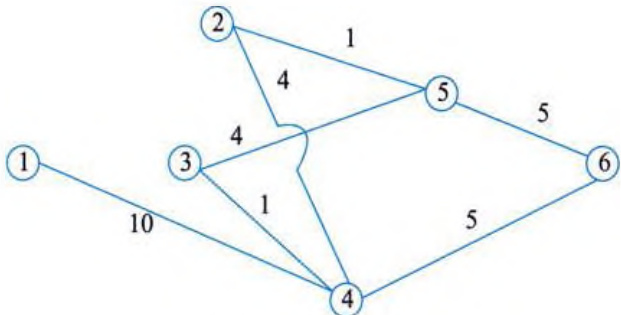  
图 2-4 ①②断开后的运输网  

  
图 2-5 ④⑥断开后的运输网  

(3) 路径①④③⑤⑥的剩余最大流量为 1 万吨。计算过后, 该路径上各段流量应都减少 1 万吨。从而④③之间将断开, ①④之间的剩余流量是 4 万吨, ③⑤之间的剩余流量为 3 万吨, ⑤⑥之间的剩余流量为 4 万吨, 如图 2-6 所示。  

  
图 2-6 ④③断开后的运输网  

(4) 路径①④②⑤⑥的剩余最大流量为1万吨。计算过后, 该路径上各段流量应都减少1万吨。从而②⑤之间将断开, ①④之间、④②之间、⑤⑥之间的剩余流量都是3万吨, 如图2-7所示。  

  
图 2-7 ②⑤断开后的运输网  
 

至此，从节点①到节点⑥已经没有可通的路径，因此，从节点①到节点⑥的最大流量应该是所有可能运输路径上的最大流量之和，即 $10+6+5+1+1=23$ 万吨。  

按照习惯，每次应尽量先找出具有最大流量的路径。理论上可以证明，虽然寻找各种路径的办法可以不同，运输方案也可以有很多种，但总的最大流量是唯一确定的。  

# 2.3 预测与决策  

预测是指对事物的演化预先做出的科学推测。广义的预测既包括在同一时期根据已知事物推测未知事物的静态预测，也包括根据某一事物的历史和现状推测其未来的动态预测。狭义的预测仅指动态预测，也就是对事物的未来演化预先做出的科学推测。预测理论作为通用的方法论，既可以用于研究自然现象，又可以用于研究社会现象。预测在系统分析师的工作中占据着重要的地位。通过对历史数据和当前现状进行分析，系统分析师可以预测未来的趋势和变化。这些预测可以用于制定决策，例如制订战略计划、优化业务流程、改进营销策略、提高生产效率等。系统分析师还可以使用预测来进行风险评估，以确定企业或组织可能面临的风险和机遇。  

总之，预测和系统分析师是密不可分的。预测为系统分析师提供了一种有效的工具，可以帮助他们更好地了解企业或组织的运营情况和未来发展趋势，从而做出更明智的决策。  

# 2.3.1 预测的基本内涵  

科学的预测一般有以下几种途径：一是因果分析，通过研究事物的形成原因来预测事物未来发展变化的必然结果；二是类比分析，比如把单项技术的发展同生物的增长相类比，把正在发展中的事物同历史上的“先导事件”相类比等，通过这种类比分析来预测事物的未来发展；三是统计分析，运用一系列数学方法，通过对事物过去和现在的数据资料进行分析，去伪存真，由表及里，揭示出历史数据背后的必然规律性，明确事物的未来发展趋势。  

  
图 2-8 预测的不同情况  

科学的预测通常是在对所研究系统进行深入分析的基础上, 建立数学模型, 运用数学模型获得所需要的预测结论。必须指出的是, 有时候所建立的数学模型未必能正确地反映系统的发展变化规律, 或许会得出错误的预测结果。为更加清晰地说明科学预测产生的条件, 我们用圆 $S$ 表示系统, 用圆 $M$ 表示模型, 用圆 $C$ 表示结论, 三个相交的圆把它们所围成的部分分成 7 个区域, 分别代表预测的 7 种情况, 如图 2-8 所示。  

$S\cap\bar{M}\cap\bar{C}$：错误的模型和结论：  

$S\cap\bar{M}\cap C$: 错误的模型却碰巧获得了正确的结论:  

$S\cap M\cap\bar{C}$：错误地解释了模型运行的结果；  
$S\cap M\cap C$：正确的模型对系统做出科学预测:  

$\overline{S} \cap \overline{M} \cap C$：系统分析错误，由错误的模型而得出的盲目预测：  

$\overline{S} \cap M \cap C$：系统分析错误，盲目建模，盲目预测：  

$\overline{S} \cap M \cap \overline{C}$：系统分析错误，盲目建模，预测错误。  

显然，只有$S\cap M\cap C$才是我们所追求的正确预测，这时系统、模型与结论完全吻合。其他6种情况皆存在信息失真，在预测中应尽可能避免这些情况发生。  

# 2.3.2 预测的程序  

为保证预测工作顺利进行，必须有组织有计划地安排其工作进程，以期取得应有的成效， 为制定决策、编制计划和提高经营管理水平提供有价值的情报。预测的程序或步骤如下所述：  

(1) 明确预测任务、制订预测计划是首先要解决的问题。明确预测任务, 就是从决策与管理的需求出发, 紧密联系实际需要, 确定预测要解决的问题。预测计划是根据预测任务制订的预测方案, 包括预测的内容、项目, 预测所需要的资料, 准备选用的预测方法, 预测的进程和完成时间, 编制预测的预算, 调配力量, 组织实施等。只有目的明确, 计划科学, 有方向地安排预测内容、方法和工作进程, 才能确定预测的经费和所需要的资料。一项预测若无明确的目的、周密的计划, 就会迷失方向, 无所适从。  

(2) 搜集、审核和整理资料。准确无误的调查统计资料和信息是预测的基础。进行预测需要有大量的历史数据, 掌握与预测目的、内容有关的各种历史资料, 以及影响未来发展的现实资料, 即要从多方面搜集资料。资料按来源不同可分为内部资料和外部资料。内部资料, 对公司和企业来说, 是反映该单位历年经济活动情况的统计资料、市场调查资料和分析研究资料。外部资料, 对公司和企业来说, 是从本单位外部搜集到的统计资料和经济信息, 例如, 政府统计部门公开发表和未公开发表的统计资料, 兄弟单位之间定期交换的经济活动资料, 报纸杂志上发表的资料, 科学研究人员的调查研究报告, 以及国外有关的经济信息和市场商情资料等。从这些资料中筛选出与本单位预测项目有密切关系的资料。筛选资料的标准有三个: ①直接有关性; ②可靠性; ③最新性。把符合这三点的资料搜集到之后, 经过分析研究, 有必要时再搜集其他有关资料。准确无误的资料是确保预测准确性的前提之一。为了保证资料的准确性, 要对资料进行必要的审核和整理。资料的审核, 主要是审核来源是否可靠、准确和齐备, 资料是否可比。资料的可比性包括: 资料在时间间隔、内容范围、计算方法、计量单位和计算价格上是否保持前后一致。如有不同, 应进行调整。资料的整理包括: 对不准确的资料进行查证核实或删除, 对不可比的资料调整为可比, 对短缺的资料进行估计核算, 对总体的资料进行必要的分类组合。对于一项重要预测, 应建立资料档案和数据库, 系统地积累资料, 以便连续地研究事物发展过程和动向。只有根据经济目的和计划, 从多方面搜集必要的资料, 经过审核、整理和分析, 了解事物发展的历史和现状, 认识其发展变化的规律性, 预测才会准确可靠, 预测才有质量保证。  

(3) 选择预测方法和建立数学模型。在掌握资料的基础上, 进一步选择适当的预测方法和建立数学模型, 这是提高预测准确性的关键步骤。对定性预测方法或定量预测方法的选择, 应根据掌握资料的情况而定。当掌握资料不够完备、准确程度较低时, 可采用定性预测方法。如  

 

对新的投资项目、新产品的发展进行预测时, 由于缺乏历史统计资料和经济信息, 一般采用定性预测方法, 凭掌握的情况和预测者的经验进行判断预测。当掌握的资料比较齐全、准确程度较高时, 可采用定量预测方法, 运用一定的数学模型进行定量分析研究。为充分考虑定性因素的影响, 在定量预测的基础上要进行定性分析, 经过调整才能定案。在进行定量预测时, 对时间序列预测法或因果预测法的选择, 除根据掌握资料的情况而定外, 还要根据分析要求而定。当只掌握与预测对象有关的某种经济统计指标的时间序列资料, 并只要求进行简单的动态分析时, 可采用时间序列预测法。当掌握与预测对象有关的、多种相互联系的经济统计指标资料, 并要求进行较复杂的依存关系分析时, 可采用因果预测法。时间序列预测和因果预测都离不开数学模型, 数学模型也称为预测模型, 是指反映经济现象过去和未来之间、原因和结果之间相互联系和发展变化规律性的数学方程式。数学模型可能是单一方程, 也可能是联立方程; 可能是线性模型, 也可能是非线性模型。预测模型的选择是否适当, 是关系预测准确程度的关键问题。要建立数学模型, 还必须估计模型参数 (常数)。估计参数的方法, 除传统的最小二乘法外, 还有多种专门的方法。不同的方法得出不同的参数估计值, 从而得到不同的结果, 应从实际出发, 认真分析, 决定取舍。  

(4) 检验模型。预测模型建立之后必须经过检验才能用于预测。模型检验主要包括考查参数估计值在理论上是否有意义, 统计显著性如何, 模型是否具有良好的超样本特性。当然, 不同类型的模型检验的方法、标准也不同。一般地, 评价模型的基本原则有以下几条: ①理论上合理。参数估计值的符号、大小应和有关的经济理论相一致; 所建立的模型应能恰当地描述预测对象。②统计可靠性高。模型及其参数估计值应当通过必要的统计检验, 以确定其有效性和可靠性。③预测能力强。预测效果好坏是鉴别模型优劣的根本标准。为保证模型的预测能力, 一般要求参数估计值有较高的稳定性, 模型外推检验精度较高。④简单适用。一个模型只要能够正确地描述系统的变化规律, 其数学形式越简单、计算过程越简便, 模型就越好; 模型自身适应能力强, 模型应能在预测要求和条件变化的情况下做调整和修改, 并能在不同情况下进行连续预测。对于经过检验的模型, 按一定的要求对自变量赋值, 可以算出因变量对应的估计值, 称为点预测值。点预测是区间预测的极限情形。如果点预测结果不能满足要求, 则需进行区间预测, 即求出点预测值在一定可靠程度下的误差范围, 称为预测区间或置信区间。精确的定量预测方法能够运用概率论原理计算给定置信度下的预测区间; 较为简单、粗略的定量预测方法虽不能做到这一点, 但也应当尽可能地计算近似的预测区间, 从主观上依据经验估计点预测值可能的误差范围和相应的可靠程度。这样, 人们在使用所得到的预测结果时, 对其可信任程度才能心中有数。  

(5) 分析预测误差, 评价预测结果, 即分析预测值偏离实际值的程度及其产生的原因。如果预测误差未超出允许的范围, 即认为模型的预测功效合乎要求, 否则, 就需要查找原因, 对模型进行修正和调整。由于在预测时, 预测对象的未来实际数值还不知道, 此时的预测误差分析只能是样本数据的历史模拟误差分析或已知数据的事后预测误差分析。因此, 对预测结果进行评价时还要对预测过程的科学性进行综合考察, 这种分析和评价可由有关领域的专家参加的预测评论会议讨论做出。  

(6) 向决策者提交预测报告。最后, 以预测报告的形式将预测评论会议确认可以采纳的预  
测结果提交给决策者，其中应当说明假设前提、所用方法和预测结果合理性判断的依据等。  

# 2.3.3 预测的方法  

系统分析师可以使用多种预测方法，其中，时间序列分析是一种经典的预测方法，它可以基于过去的数据来预测未来的趋势。时间序列分析通常需要进行数据平稳化和拟合合适的时间序列模型，例如 ARIMA（自回归移动平均模型）、季节性 ARIMA（SARIMA）、指数平滑法等。限于篇幅，下面仅介绍一次指数平滑法。  

一次指数平滑法可以较为简单地运用全部历史数据进行平滑预测，并且可以用于实际。其预测模型为:  

$$
\begin{array} { r l } { S _ { t } = \alpha \sum _ { j = 0 } ^ { \infty } ( 1 - \alpha ) ^ { j } y _ { t - j } } \\ { { \hat { y } } _ { t + 1 } = S _ { t } } \end{array}
$$  

即  

$$
{ \hat { y } } _ { t + 1 } = \alpha y _ { t } + ( 1 - \alpha ) { \hat { y } } _ { t }
$$  

其中，$S_{i}$为t期移动平均数，$\alpha$为预测值的平滑系数，$y_{i}$为t时刻的真实值或者观察值，$\hat{y}_{i,t}$为t+1期预测值。  

【例 1】试运用一次指数平滑法预测 2013 年工业生产者出厂价格总指数。  

【解】分别取$\alpha=0.3$，$\alpha=0.8$，初始值$S_0=\frac{y_1+y_2}{2}=100.75$。  

依据一次指数平滑法的预测模型  

$$
\begin{array} { r l } { { \hat { y } } _ { t + 1 } = \alpha y _ { t } + ( 1 - \alpha ) { \hat { y } } _ { t } } \\ { { \hat { y } } _ { t } = S _ { 0 } = 1 0 0 . 7 5 } \end{array}
$$  

计算各期预测值、预测误差，如表 2-2 所示。  

<table><tr><td>年份</td><td>工业生产者出厂价 格分类指数/万元</td><td>预测值 (α=0.3)</td><td>相对误差</td><td>预测值 (α=0.8)</td><td>相对误差</td></tr><tr><td>2000</td><td>102.8</td><td>100.75</td><td>1.99%</td><td>100.75</td><td>1.99%</td></tr><tr><td>2001</td><td>98.7</td><td>101.37</td><td>2.70%</td><td>102.39</td><td>3.74%</td></tr><tr><td>2002</td><td>97.8</td><td>100.57</td><td>2.83%</td><td>99.44</td><td>1.67%</td></tr><tr><td>2003</td><td>102.3</td><td>99.74</td><td>2.51%</td><td>98.13</td><td>4.08%</td></tr><tr><td>2004</td><td>106.1</td><td>100.51</td><td>5.27%</td><td>101.47</td><td>4.37%</td></tr><tr><td>2005</td><td>104.9</td><td>102.18</td><td>2.59%</td><td>105.17</td><td>0.26%</td></tr><tr><td>2006</td><td>103</td><td>103</td><td>0.00%</td><td>104.95</td><td>1.90%</td></tr><tr><td>2007</td><td>103.1</td><td>103</td><td>0.10%</td><td>103.39</td><td>0.28%</td></tr><tr><td>2008</td><td>106.9</td><td>103.03</td><td>3.62%</td><td>103.16</td><td>3.50%</td></tr></table>  
(续表)  

<table><tr><td>年份</td><td>工业生产者出厂价 格分类指数/万元</td><td>预测值 (α=0.3)</td><td>相对误差</td><td>预测值 (α=0.8)</td><td>相对误差</td></tr><tr><td>2009</td><td>94.6</td><td>104.19</td><td>10.14%</td><td>106.15</td><td>12.21%</td></tr><tr><td>2010</td><td>105.5</td><td>101.31</td><td>3.97%</td><td>96.91</td><td>8.14%</td></tr><tr><td>2011</td><td>106</td><td>102.57</td><td>3.24%</td><td>103.78</td><td>2.09%</td></tr><tr><td>2012</td><td>98.3</td><td>103.6</td><td>5.39%</td><td>105.56</td><td>7.38%</td></tr><tr><td>2013</td><td></td><td>102.01</td><td></td><td>99.75</td><td></td></tr></table>  

当$\alpha=0.3$时，平均相对误差为:  

$$
{ \overline { { e } } } = { \frac { 1 } { n } } \sum _ { i = 1 } ^ { n } e _ { i } = { \frac { 1 } { 1 3 } } \sum _ { i = 1 } ^ { n } \left| { \frac { y _ { i } - { \hat { y } } _ { i } } { y _ { i } } } \right| = 3 . 4 1 \%
$$  

当$\alpha=0.8$时，平均相对误差为:  

$$
{ \overline { { e } } } = { \frac { 1 } { n } } \sum _ { i = 1 } ^ { n } e _ { i } = { \frac { 1 } { 1 3 } } \sum _ { i = 1 } ^ { n } \left| { \frac { y _ { i } - { \hat { y } } _ { i } } { y _ { i } } } \right| = 3 . 9 7 \%
$$  

计算结果表明， $\alpha=0.3$ 时，平均相对误差较小，故选取 $\alpha=0.3$ ，预测2013 年工业生产者 出厂价格总指数为：  

$$
\hat{y}_{2013} = 102.01 (万元)
$$  

其他常见的预测方法还包括机器学习算法、模拟、主观判断等。机器学习算法可以使用历史数据来训练模型，以便对未来的数据进行预测。常用的机器学习算法包括线性回归、逻辑回归、决策树、随机森林、神经网络等。在使用机器学习算法进行预测时，需要注意数据预处理和特征选择等问题。模拟是一种基于模型的预测方法，它可以对不同的决策和情况进行模拟和预测。在模拟中，需要定义模型的变量和参数，并运用统计学、运筹学等相关方法进行模拟和预测。模拟可以用于预测各种不同的情况，例如天气、经济发展、人口变化等。主观判断是一种基于专家经验和直觉的预测方法，它可以通过专家的判断和预测来预测未来的趋势。在使用主观判断进行预测时，需要对专家的背景、经验和意见进行评估和权衡。需要注意的是，预测方法的选择应该基于具体情况和数据可用性等因素，同时应该对不同方法的优缺点和局限性有一定的了解和认识。  

# 2.3.4 决策的概念和过程  

决策是指在一定的条件下，从多种可供选择的方案中选择一个方案来达到特定的目标或目的的过程。决策通常涉及权衡不同的因素，包括成本、效益、风险、时间等，同时需要考虑不同方案的技术可行性、经济可行性、法律可行性等因素。决策是管理、商业和个人生活中最基本的活动之一，其过程和结果对个人、组织和社会的影响都十分重要。决策是系统分析师工作中的一个重要方面。系统分析师需要在分析和解决问题的过程中做出决策，他们需要对不同方案进行评估和比较，以选择最佳方案来解决问题。在这个过程中，他们需要考虑不同方案的成  
本、效益、风险等因素，并采取相应的措施来降低风险和最大化效益。因此，系统分析师需要具备良好的决策能力，以便在工作中做出明智的决策。同时，他们还需要掌握一系列工具和技术，例如流程图、数据建模、系统分析和设计等，以支持决策过程。通过合理的决策和科学的分析，系统分析师可以为组织或企业带来更好的效益和收益。  

决策是为了实现特定的目标或目的。目标应该是清晰、具体、可量化和可达成的。在决策过程中，需要从多种可选方案中选择最佳方案来达到目标。方案应该经过评估和比较，以确保其最适合达到目标。决策是在特定条件下做出的，这些条件包括时间、资源、预算、法律法规、市场环境等。在决策过程中需要权衡成本和效益。成本是指为实现目标所需的资源和投入，效益是指实现目标后所获得的收益或回报。决策涉及风险和不确定性，需要考虑可能的风险和后果，并采取相应的风险管理策略。决策需要在一定时间内做出，并且需要考虑时间的压力和限制。决策的结果对个人、组织和社会都有影响，需要考虑责任和道德问题，并采取相应的措施来减轻可能的负面影响。  

决策过程主要分为4个阶段：情报活动、设计活动、抉择活动和实践活动。  

# 1. 情报活动  

情报活动包括决策环境的识别、所需信息获取及分析。情报活动的主要目的是识别问题、理解问题，并在此基础上设定决策的目标，即要判定在什么情况下做出什么样的决策。这是一个决策时机的选择问题。选择什么决策主题则与决策者的偏好、信念有关。有些企业领导者着重于长期发展实力，而有些则强调短期的效益。决策科学研究不可能改变决策者的信念或价值观，但可以促使其所选择的决策主题能够确切地反映决策者的价值观。  

# 2. 设计活动  

设计活动是寻求多种途径解决问题的过程，即确定备选方案。在此过程中，决策者或其咨询人员发掘、构想和分析多种可行的可供选择的行动方案。设计活动强调多方案，如果面对的仅有一种方案，非采用不可，那就无所谓决策了。在每个方案的拟订过程中，还要进行状态分析与后果预测，即搞清楚未来可能出现的所有状态及其发生概率，并定量地预计出不同状态下方案的损益值或效用值。也就是说，这部分包括预测的工作，即预测实际上是为了决策。  

# 3. 执择活动  

抉择活动是指预估各种可供选择方案的后果，并做出结论性的评价，从而选出最满意的方 案。什么样的方案为好，什么样的方案为差，这是一个复杂的问题，并不是弄清各种备选方案 的后果以后就能马上做出回答的。原因包括：①方案后果的多样性和后果评价准则的多样性， 很难找到一个对所有准则来说都满意的方案；②后果往往是风险事件，决策者对风险的态度不 同，导致对同一组方案有不同的选择结果；③抉择最终取决于决策者的习惯、传统、经验和信 念等，这就造成理性评价方案的困难，符合理性准则的方案不一定能使决策者满意。然而，恰 恰是上述这些困难提供了广阔的、引人入胜的决策研究领域。  

# 4. 实施活动  

实践活动是指实施选定的方案，并在此过程中对原有决策进行检查或修正。一旦选出了满  
意的方案，接下来并不仅仅是下达一些命令、指示，还须制订执行计划和资源预算，以满足实 施方案的各种可能的需要和有效措施。决策的实施过程需要跟踪、监督。原计划是否已执行？ 有哪些偏离？执行决策的结果导致内外部环境发生了哪些变化？各下属部门是否按要求完成了 任务？在实施的过程中，需要不断地跟踪、检查、反馈，使选定方案的实施能够实现预定的目 标，并能及时调整、改善原有方案。  

决策是一个动态的过程，一般可按上述情报活动、设计活动、抉择活动和实践活动这4个阶段划分并按顺序进行，但前面的阶段不断从后面的阶段得到反馈信息。设计活动阶段分析研究的结果可能修正情报活动阶段提出的决策主题；抉择活动阶段也可能对各种备选方案提出补充和修改：实施活动阶段的信息就更为重要，其实践结果可能对整个决策做出评价和修正。  

# 2.3.5 决策的方法  

决策的定量计算方法是指通过数学模型和技术，对决策中的各种因素进行量化分析，以便 于决策者对各种方案进行评估和比较，从而做出最佳的决策。常见的定量计算方法有线性规划、 成本效益分析、效用分析、模拟仿真、决策树分析。本节仅对线性规划做简单介绍。  

解线性规划问题的方法有很多，最常用的有图解法和单纯形法。图解法简单直观，有助于了解线性规划问题求解的基本原理，而当变量数多于三个时，它就无能为力了，这时需要使用单纯形法。  

下面通过一个例子来说明图解法的应用。  

【例2】某工厂在计划期内要安排生产Ⅰ、Ⅱ两种产品，已知生产单位产品所需的设备台时及A、B两种原料的消耗，如表2-3所示。  

<table><tr><td>项目</td><td>Ⅰ</td><td>Ⅱ</td><td>总数</td></tr><tr><td>设备</td><td>1台时</td><td>2台时</td><td>8台时</td></tr><tr><td>原材料A</td><td>4kg</td><td>0kg</td><td>16kg</td></tr><tr><td>原材料B</td><td>0kg</td><td>4kg</td><td>12kg</td></tr></table>  

该工厂每生产一件产品Ⅰ可获利2元，每生产一件产品Ⅱ可获利3元，问应该如何安排计划使该工厂获利最多?  

【解】该问题可用以下数学模型来描述，设$x_{1}$、$x_{2}$分别表示在计划期内产品Ⅰ、Ⅱ的产量，因为设备的有效台时是8，这是一个限制产量的条件，所以在确定产品Ⅰ、Ⅱ的产量时，要考虑不超过设备的有效台时数，即可用不等式表示为  

$$
x _ { 1 } + 2 x _ { 2 } \leqslant 8
$$  

同理，因原料A、B的限量，可以得到以下不等式  

$$
\begin{array} { r l } { 4 x _ { 1 } \leqslant 1 6 } \\ { 4 x _ { 2 } \leqslant 1 2 } \end{array}
$$  

该工厂的目标是在不超过所有资源限制的条件下，如何确定产量 $x_{1}$、$x_{2}$，以得到最大的利  
润。若用z表示利润，这时$z=2x_{1}+3x_{2}$。综上所述，该计划问题可用数学模型表示如下。

目标函数:  

$$
\operatorname* { m a x } z = 2 x _ { 1 } + 3 x _ { 2 } ,
$$  

满足约束条件：  

$$
\begin{array} { r l } { x _ { 1 } + 2 x _ { 2 } \leqslant 8 } & { } \\ { 4 x _ { 1 } \leqslant 1 6 } & { } \\ { 4 x _ { 2 } \leqslant 1 2 } & { } \\ { x _ { 1 } , \ x _ { 2 } \geqslant 0 } & { } \end{array}
$$  

在以$x_{1}$，$x_{2}$为坐标轴的直角坐标系中，非负条件$x_{1}$，$x_{2}\geqslant0$是指第一象限。上述每个约束条件都代表一个半平面。例如，约束条件$x_{1}+2x_{2}\leqslant8$代表以直线$x_{1}+2x_{2}=8$为边界的左下方的半平面。同时满足$x_{1}$，$x_{2}\geqslant0$，$x_{1}+2x_{2}\leqslant8$，$4x_{1}\leqslant16$和$4x_{2}\leqslant12$的约束条件的点，必然落在由这三个半平面相交组成的区域内（且位于第一象限），如图2-9中的阴影部分所示。阴影区域中的每一个点（包括边界点）都是这个线性规划问题的解（称可行解），因而此区域是本题的线性规划问题的解的集合，称它为可行域。  

  
图 2-9 图解法  

再分析目标函数$z=2x_{1}+3x_{2}$，在坐标平面上，它可表示以$z$为参数，$-2/3$为斜率的一组平行线:  

$$
x _ { 2 } = - \frac { 2 } { 3 } x _ { 1 } + \frac { z } { 3 }
$$  

位于同一直线上的点具有相同的目标函数值，因此称它为等值线。当z值由小变大时，直线沿其法线方向向右上方移动。当移动到$Q_{2}$点时，使z值在可行域边界上实现最大化，这就得到了本题的最优解$Q_{3}$，$Q_{5}$点的坐标为（4，2）。经过计算，可以得出z=14。  
 

这说明该厂的最优生产计划方案是：生产4件产品Ⅰ、2件产品Ⅱ，可得最大利润为14元。  

在上述例题中，得到的最优解是唯一的，但对一般线性规划问题而言，求解结果还可能出现以下几种情况：无穷多最优解（多重解），无界解（无最优解），无可行解。当求解结果出现后两种情况时，一般说明线性规划问题的数学模型有错误。无界解源于缺乏必要的约束条件，无可行解源于矛盾的约束条件。  

从图解法中直观地看到, 当线性规划问题的可行域非空时, 它是有界或无界凸多边形。若线性规划问题存在最优解, 它一定在可行域的某个顶点得到; 若在两个顶点同时得到最优解, 则它们连线上的任意一点都是最优解, 即有无穷多最优解。  

单纯形法的基本思路是：根据问题的标准，从可行域中某个可行解（一个顶点）开始，转换到另一个可行解（顶点），并且使目标函数达到最大值时，问题就得到了最优解。限于篇幅，本书不再介绍单纯形法的详细求解过程。  

成本效益分析是一种用于评估方案效益和成本之间关系的方法。它通过将方案的效益和成本折算成相同的货币单位，从而使方案之间的比较更加明确和具体化。效用分析是一种用于评估方案效用的方法。它将不同方案的效用转化为数值，从而使不同方案之间的效用比较更加明确和准确。模拟仿真是一种通过计算机模拟来评估方案效果的方法。它可以对不同方案进行多次模拟，从而得出方案的平均效果和概率分布等信息。决策树分析是一种用于分析决策过程的方法。它通过将决策过程建模为一棵决策树，从而明确各个决策节点的决策选项和相应的风险和效益，进而帮助决策者做出最佳决策。以上是一些常见的决策的定量计算方法，不同的方法可以根据具体情况进行选择和应用。  

# 2.4 数学建模  

当需要从定量的角度分析和研究一个实际问题时, 人们就要在深入调查研究、了解对象信息、做出简化假设、分析内在规律等工作的基础上, 用数学的符号和语言, 把它表述为数学式子, 也就是数学模型, 然后用通过计算得到的模型结果来解释实际问题, 并接受实际的检验。这个建立数学模型的全过程就称为数学建模。  

数学建模是一种数学的思考方法，是运用数学的语言和方法，通过抽象和简化，建立能近似刻画并解决实际问题的模型的一种强有力的数学手段。  

# 2.4.1 从现实对象到数学模型  

人类生活在现实世界里，无时无刻不在运用智慧和力量去认识、利用、改造这个世界，从而不断地创造出物质文明和精神文明。与形形色色的模型相对应，现实世界里的原始参照物通称为原型。本节先讨论原型和模型，特别是和数学模型的关系，再介绍数学模型的意义。  

原型（Prototype）和模型（Model）是一对对偶体。原型指人们在现实世界里关心、研究或者从事生产、管理的实际对象。在科技领域通常使用系统（System）、过程（Process）等词汇，如机械系统、电力系统、生态系统、生命系统、社会经济系统，又如钢铁冶炼过程、导弹飞行过程、化学反应过程、污染扩散过程、生产销售过程、计划决策过程等。本书所说的现实对象、  
研究对象、实际问题等均指原型。模型则指为了某个特定目的将原型的某一部分信息简缩、提炼而构造的原型替代物。  

模型不是原型原封不动的复制品，原型有各个方面和各种层次的特征，而模型只要求反映与某种目的有关的那些方面和层次。一个原型，为了不同的目的可以有许多不同的模型。如放在展厅里的飞机模型应该在外形上逼真，但是不一定会飞。而参加航模竞赛的模型飞机要具有良好的飞行性能，在外观上不必苛求。至于在飞机设计、试制过程中用到的数学模型和计算机模拟，则只要求在数量规律上真实反映飞机的飞行动态特性，毫不涉及飞机的实体。所以模型的基本特征是由构造模型的目的决定的。  

我们已经看到模型有各种形式，按照模型替代原型的方式来分类，模型可以分为物质模型（形象模型）和理想模型（抽象模型）。前者包括直观模型、物理模型等，后者包括思维模型、符号模型、数学模型等。  

(1) 直观模型: 指那些供展览用的实物模型, 以及玩具、照片等, 通常是把原型的尺寸按比例缩小或放大, 主要追求外观上的逼真。这类模型的效果是一目了然的。  

(2) 物理模型: 主要指科技工作者为了一定目的根据相似原理构造的模型, 它不仅可以显示原型的外形或某些特征, 而且可以用来进行模拟实验, 间接地研究原型的某些规律。如波浪水箱中的舰艇模型用来模拟波浪冲击下舰艇的航行性能, 风洞中的飞机模型用来试验飞机在气流中的空气动力学特性。有些现象直接用原型研究非常困难, 便可借助于这类模型, 如地震模拟装置、核爆炸反应模拟设备等。应注意验证原型与模型间的相似关系, 以确定模拟实验结果的可靠性。物理模型常可得到很有实用价值的结果, 但也存在成本高、时间长、不灵活等缺点。  

(3)思维模型: 指通过人们对原型的反复认识, 将获取的知识以经验形式直接贮存于人脑中, 从而可以根据思维或直觉做出相应的决策。如汽车司机对方向盘的操纵、一些技艺性较强的工种 (如钳工) 的操作, 大体上是靠这类模型进行的。通常说的某些领导者凭经验做决策也是如此。思维模型便于接受, 也可以在一定条件下获得满意的结果, 但是它往往带有模糊性、片面性、主观性、偶然性等缺点, 难以对它的假设条件进行检验, 并且不便于人们的相互沟通。  

(4)符号模型:在一些约定或假设下借助于专门的符号、线条等,按一定形式组合起来描述原型。如地图、电路图、化学结构式等。符号模型具有简明、方便、目的性强及非量化等特点。  

(5) 数学模型: 指为了某个特定的目的, 根据特有的内在规律, 做出一些必要的简化假设,运用适当的数学工具, 得到的一个数学结构。  

# 2.4.2 数学建模的重要意义  

数学作为一门研究现实世界数量关系和空间形式的科学，在它产生和发展的历史长河中，一直是和人们生活的实际需要密切相关的。作为用数学方法解决实际问题的第一步，数学建模自然有着与数学同样悠久的历史。两千多年以前创立的欧几里得几何，17世纪牛顿发现的万有引力定律，都是科学发展史上数学建模的成功范例。  

进入20世纪以来，随着数学以空前的广度和深度向一切领域渗透，以及电子计算机的出现与飞速发展，数学建模越来越受到人们的重视。可以从以下几方面来看数学建模在现实世界中的重要意义。  
  

 

# 1. 一般工程技术领域  

在以声、光、热、力、电这些物理学科为基础的工程技术领域，诸如机械、电机、土木、水利等，数学建模的普遍性和重要性不言而喻。虽然这里的基本模型是已有的，但是由于新技术、新工艺的不断涌现，提出了许多需要用数学方法解决的新问题；高速、大型计算机的飞速发展，使得过去即便有了数学模型也无法求解的课题（如大型水坝的应力计算，中长期天气预报等）迎刃而解；建立在数学模型和计算机模拟基础上的 CAD 技术，以其快速、经济、方便等优势，在很大程度上替代了传统工程设计中的现场实验、物理模拟等手段。  

# 2. 高新技术领域  

无论是发展通信、航天、微电子、自动化等高新技术本身，还是将高新技术用于传统工业去创造新工艺、开发新产品，计算机技术支持下的建模和模拟都是经常使用的有效手段。数学建模、数值计算和计算机图形学等相结合形成的计算机软件，已经被固化于产品中，在许多高新技术领域起着核心作用，被认为是高新技术的特征之一。在这个意义上，数学不再仅仅作为一门科学和许多技术的基础，而且直接走向了技术的前台。国际上一位学者就提出了“高技术本质上是一种数学技术”的观点。  

# 3. 交叉学科领域  

随着数学向诸如经济、人口、生态、地质等所谓的非物理领域渗透, 一些交叉学科如计量经济学、人口控制论、数学生态学、数学地质学等应运而生。一般来说不存在作为支配关系的物理定律, 当用数学方法研究这些领域中的定量关系时, 数学建模就成为首要的、关键的步骤和这些学科发展与应用的基础。在这些领域建立不同类型、不同方法、不同深浅程度的模型的余地相当大, 为数学建模提供了广阔的新天地。马克思说过: “一门科学只有成功地运用数学时, 才算达到了完善的地步。”21世纪, 数学必将大踏步地进入所有学科, 数学建模将迎来蓬勃发展的新时期。  

今天，在国民经济和社会活动的诸多方面，数学建模都有着非常具体的应用。具体如下:  

(1) 分析与设计: 例如描述药物浓度在人体内的变化规律, 以分析药物的疗效; 建立跨音速流和激波的数学模型, 用数值模拟设计新的飞机翼型。  

(2) 预报与决策: 生产过程中产品质量指标的预报、气象预报、人口预报、经济增长预报等, 都要有预报模型; 使经济效益最大的价格策略、使费用最少的设备维修方案, 都是决策模型的例子。  

(3) 规划与管理: 生产计划、资源配置、运输网络规划、水库优化调度, 以及排队策略、物资管理等, 都可以用数学规划模型解决。  

数学建模与计算机技术的关系密不可分。一方面, 像新型飞机设计、石油勘探数据处理中数学模型的求解当然离不开巨型计算机, 而微型计算机的普及更使数学建模逐步进入人们的日常活动。比如, 当一位公司经理根据客户提出的产品数量、质量、交货期等要求, 用笔记本电脑与客户进行价格谈判时, 人们可以肯定他的计算机中贮存了由公司的各种资源、产品工艺流程及客户需求等数据研制的数学模型——快速报价系统和生产计划系统。另一方面, 以数字化为特征的信息正以爆炸之势涌入计算机, 去伪存真、归纳整理、分析现象、显示结果等, 计算  
机需要人们给它以思维的能力，这些当然要求助于数学模型。因此把计算机技术与数学建模在知识经济中的作用比喻为如虎添翼，是恰如其分的。  

美国国家科学院的一位院士总结了将数学科学转化为生产力过程中的成功和失败经验，得出了“数学是一种关键的、普遍的、可以应用的技术”的结论，认为数学“由研究到工业领域的技术转化，对加强经济竞争力具有重要意义”，而“计算和建模重新成为中心课题，它们是数学科学技术转化的主要途径”。  

# 2.4.3 数学建模的基本方法  

# 1. 数学模型  

一般地说, 数学模型可以描述为: 对于现实世界的一个特定对象, 为了一个特定目的, 根据特有的内在规律, 做出一些必要的简化假设, 运用适当的数学工具, 得到的一个数学结构。  

数学模型是客观世界中的实际事物的一种数学简化，它常常是以某种意义上接近实际事物的抽象形式存在的，但它和真实的事物有着本质的区别。要描述一个实际现象可以有很多方式，例如，录音、录像、比喻等。为了使描述更具科学性、逻辑性、客观性和可重复性，人们采用一种普遍认为比较严格的语言来描述各种现象，这种语言就是数学。使用数学语言描述的事物就称为数学模型。  

模型的一般数学形式可用下列表达式描述。  

目标的评价准则： $U=f(x_{i},y_{i},\xi_{k})$  

约束条件：$g(x_{i},y_{i},\xi_{k})\geqslant0$  

其中：$x_{i}$为可控变量，$y_{i}$为已知参数，$\xi_{k}$为随机因素。  

目标的评价准则一般要求达到最佳（最小或最大）、适中、满意等。准则可以是单一的，也可以是多个的。约束条件可以没有，也可有多个。当$g$是等式时，即为平衡条件。  

当模型中无随机因素时, 称它为确定性模型, 否则为随机模型。随机模型的评价准则可用期望值、方差表示, 也可用某种概率分布来表示。当可控变量只取离散值时, 称为离散模型, 否则称为连续模型。也可按使用的数学工具, 将模型分为代数方程模型、微分方程模型、概率统计模型、逻辑模型等; 若用求解方法来命名, 则有直接最优化模型、数字模拟模型、启发式模型等; 也有按用途来命名的, 例如, 分配模型、运输模型、更新模型、排队模型、存贮模型等; 还可以用研究对象来命名, 例如, 能源模型、教育模型、军事对策模型、宏观经济模型等。  

# 2. 数学建模的过程  

应用数学去解决各类实际问题时, 建立数学模型是十分关键的一步, 同时也是十分困难的一步。建立数学模型的过程, 是把错综复杂的实际问题简化、抽象为合理的数学结构的过程。要通过调查、收集数据资料, 观察和研究实际对象的固有特征和内在规律, 抓住问题的主要矛盾, 建立起反映实际问题的数量关系, 然后利用数学理论和方法去分析和解决问题。这就需要深厚而扎实的数学基础, 敏锐的洞察力和想象力, 对实际问题的浓厚兴趣和广博的知识面。  

虽然面临的各种实际问题不一样，但数学建模的基本过程基本上是一致的，可以遵循以下过程:  
   

(1) 模型准备: 了解问题的实际背景, 明确其实际意义, 掌握对象的各种信息, 用数学语言来描述问题。也就是说, 要了解问题的实际背景, 明确建模目的, 搜集必要的信息, 如现象、数据等, 尽量弄清对象的主要特征, 形成一个比较清晰的 “问题”, 由此初步确定用哪一类模型。明确情况才能用对方法。在模型准备阶段要深入调查研究, 虚心向实际工作者请教, 尽量掌握第一手资料。  

(2) 模型假设: 根据实际对象的特征和建模的目的, 对问题进行必要的简化, 并用精确的语言提出一些恰当的假设。根据对象的特征和建模目的, 抓住问题的本质, 忽略次要因素, 做出必要的、合理的简化假设, 这是非常重要和困难的一步, 关系到建模的成败。假设做得不合理或太简单, 会导致错误的或无用的模型; 假设做得过分详细, 试图把复杂对象的众多因素都考虑进去, 会使你很难或无法继续下一步的工作。常常需要在合理与简化之间做出恰当的折中。通常, 做假设的依据, 一是出于对问题内在规律的认识, 二是来自对现象、数据的分析, 以及二者的综合。想象力、洞察力、判断力以及经验, 在模型假设中起着重要作用。  

(3) 模型建立: 在假设的基础上, 利用适当的数学工具来刻画各变量之间的数学关系, 建立相应的数学结构。只要能够把问题描述清楚, 尽量使用简单的数学工具。根据所做的假设, 用数学的语言、符号描述对象的内在规律, 建立包含常量、变量等的数学模型, 如优化模型、微分方程模型、差分方程模型、图的模型等。这里除了需要一些相关学科的专业知识外, 常常还需要较为广阔地应用数学方面的知识。要善于发挥想象力, 注意使用类比法, 分析对象与熟悉的其他对象的共性, 借用已有的模型。建模时还应遵循的一个原则是: 尽量采用简单的数学工具, 因为你的模型总是希望更多的人了解和使用, 而不是只供少数专家欣赏。  

(4) 模型求解: 利用获取的数据资料, 对模型的所有参数做出计算 (估计)。可以采用解方程、画图形、优化方法、数值计算、统计分析等各种数学方法, 特别是可以利用数学软件和计算机技术。  

(5) 模型分析: 对所得的结果进行数学上的分析。如结果的误差分析、统计分析、模型对数据的灵敏性分析、对假设的强健性分析等。  

(6) 模型检验: 将模型分析结果与实际情况进行比较, 以此来验证模型的准确性、合理性和适用性。如果模型与实际较吻合, 则要对计算结果给出其实际含义, 并进行解释。如果模型与实际吻合较差, 则应该修改假设, 再次重复建模过程。这一步对于模型是否真的有用非常关键, 要以严肃认真的态度对待。有些模型要经过几次反复, 不断完善, 直到检验结果获得某种程度上的满意。  

(7) 模型应用: 应用方式因问题的性质和建模的目的而异。  

# 3. 数学建模的方法  

构造模型是一种创造性劳动，成功的模型往往是科学与艺术的结晶。一般的建模方法和思路有以下4种:  

(1) 直接分析法: 根据对问题内在机理的认识, 直接构造出模型。  

(2) 类比法: 根据类似问题的模型构造新模型。  

(3) 数据分析法: 通过试验, 获得与问题密切相关的大量数据, 用统计分析方法进行建模。  
(4) 构想法: 对将来可能发生的情况给出逻辑上合理的设想和描述, 然后用已有的方法构造模型, 并不断修正完善, 直至比较满意为止。  

# 2.4.4 数学建模的特点和分类  

# 1. 数学建模的特点  

# 1) 模型的逼真性和可行性  

一般来说, 我们总是希望模型尽可能逼近研究对象, 但是一个非常逼真的模型在数学上常常是难以处理的, 因而不容易达到通过建模对现实对象进行分析、预报、决策或者控制的目的, 即实用上不可行。另一方面, 越逼真的模型常常越复杂, 即使数学上能处理, 这样的模型在应用时所需要的 “费用” 也相当高, 而高 “费用” 不一定与复杂模型取得的 “效益” 相匹配。所以, 建模时往往需要在模型的逼真性与可行性, 即 “费用” 与 “效益” 之间做出折中和抉择。  

# 2) 模型的渐进性  

稍微复杂一些的实际问题的建模通常不可能一次成功, 要经过上一节描述的建模过程的反复迭代, 包括由简到繁, 也包括删繁就简, 以获得越来越满意的模型。在科学发展过程中, 随着人们认识和实践能力的提高, 各门学科中的数学模型也存在着不断完善或者推陈出新的过程。从19世纪的力学、热学、电学等许多学科由牛顿力学模型主宰, 到20世纪的爱因斯坦相对论模型的建立, 这是模型渐进性的明显例证。  

# 3) 模型的强健性  

模型的结构和参数常常是由模型假设及对象的信息（如观测数据）确定的，而假设不可能太准确，观测数据也是允许有误差的。一个好的模型应该具有下述意义的强健性：当模型假设改变时，可以导出模型结构的相应变化；当观测数据有微小改变时，模型参数也只有相应的微小变化。  

# 4) 模型的可转移性  

模型是现实对象抽象化、理想化的产物，它不为对象的所属领域所独有，而是可以转移到另外的领域。在生态、经济、社会等领域的建模就常常借用物理领域的模型。模型的这种性质显示了它的应用的极端广泛性。  

# 5) 模型的非预制性  

虽然已经发展了许多应用广泛的模型，但是实际问题是各种各样、变化万千的，不可能要 求把各种模型做成预制品供人们在建模时使用。模型的这种非预制性使得建模本身常常是事先 没有答案的问题（Open-end Problem）。在建立新的模型的过程中甚至会伴随着新的数学方法或 数学概念的产生。  

# 6) 模型的条理性  

从建模的角度考虑问题可以促使人们对现实对象的分析更全面、更深入、更具条理性，这样即使建立的模型由于种种原因尚未达到实用的程度，对问题的研究也是有利的。  
 

# 7) 模型的技艺性  

建模的方法与其他一些数学方法如方程解法、规划问题解法等是根本不同的，无法归纳出若干条普遍适用的建模准则和技巧。有人说，建模目前与其说是一门技术，不如说是一种艺术，是技艺性很强的技巧。经验、想象力、洞察力、判断力，以及直觉、灵感等在建模过程中起的作用往往比一些具体的数学知识更大。  

# 8) 模型的局限性  

模型的局限性有几方面的含义。第一，由数学模型得到的结论虽然具有通用性和精确性， 但是因为模型是现实对象简化、理想化的产物，所以，一旦将模型的结论应用于实际问题，就 回到了现实世界，那些被忽视、简化的因素必须考虑，于是结论的通用性和精确性只是相对的 和近似的。第二，由于受到人们认识能力和科学技术包括数学本身发展水平的限制，还有不少 实际问题很难得到有实用价值的数学模型。如一些内部机理复杂、影响因素众多、测量手段不 够完善、技术性较强的生产过程，像生铁冶炼过程，常常需要开发专家系统，与建立数学模型 相结合才能获得较满意的应用效果。专家系统是一种计算机软件系统，它总结专家的知识和经 验，模拟人类的逻辑思维过程，建立若干规则和推理途径，主要是定性地分析各种实际现象并 做出判断。专家系统可以看成计算机模拟的新发展。第三，还有些领域的问题目前尚未发展到 用建模方法寻求数量规律的阶段，如中医诊断过程，目前所谓的计算机辅助诊断也是总结著名 中医的丰富临床经验的专家系统。  

# 2. 数学建模的分类  

数学模型可以按照不同的方式分类，下面介绍几种常用的分类方法。  

# 1）按照模型的应用领域（或所属学科）分类  

按照应用领域（或所属学科）不同，可对模型进行分类，如人口模型、交通模型、环境模型、生态模型、城镇规划模型、水资源模型、再生资源利用模型、污染模型等。范畴更大一些则形成许多边缘学科，如生物数学、医学数学、地质数学、数量经济学、数学社会学等。  

# 2）按照建立模型的数学方法（或所属数学分支）分类  

按照建立模型的数学方法（或所属数学分支）不同，可对模型进行分类，如初等模型、几何模型、微分方程模型、统计回归模型、数学规划模型等。  

# 3) 按照模型的表现特征分类  

按照模型的表现特征不同，具体可分为:  

(1) 确定性模型和随机性模型: 取决于是否考虑随机因素的影响。近年来随着数学的发展,又有所谓的突变性模型和模糊性模型。  

(2) 静态模型和动态模型: 取决于是否考虑时间因素引起的变化。  

(3) 线性模型和非线性模型: 取决于模型的基本关系, 如微分方程是否是线性的。  

(4) 离散模型和连续模型: 指模型中的变量（主要是时间变量）是离散的还是连续的。  

虽然从本质上讲，大多数实际问题是随机性的、动态的、非线性的，但是由于确定性、静态、线性模型容易处理，并且往往可以作为初步的近似来解决问题，所以建模时常先考虑确定  
性、静态、线性模型。连续模型便于利用微积分方法求解，进行理论分析，而离散模型便于在计算机上做数值计算，所以用哪种模型要看具体问题而定。在具体的建模过程中，将连续模型离散化，或将离散变量视作连续的，也是常采用的方法。  

# 4) 按照建模目的分类  

按照建模目的不同，可对模型进行分类，如描述模型、预报模型、优化模型、决策模型、控制模型等。  

# 5）按照对模型结构的了解程度分类  

按照对模型结构的了解程度不同, 可对模型进行分类, 如白箱模型、灰箱模型、黑箱模型。这是把研究对象比喻成一只箱子里的机关, 要通过建模来揭示它的奥妙。白箱主要包括用力学、热学、电学等一些机理相当清楚的学科描述的现象以及相应的工程技术问题, 这方面的模型大多已经基本确定, 还需深入研究的主要是优化设计和控制等问题。灰箱主要指生态、气象、经济、交通等领域的机理尚不十分清楚的现象, 在建立和改善模型方面都有不同程度的工作要做。至于黑箱则主要指生命科学和社会科学等领域的一些机理（数量关系方面）很不清楚的现象。有些工程技术问题虽然主要基于物理、化学原理, 但出于因素众多、关系复杂和观测困难等原因, 也常作为灰箱或黑箱模型处理。当然, 白箱、灰箱、黑箱之间并没有明显的界限, 而且随着科学技术的发展, 箱子的 “颜色” 必然是逐渐由暗变亮的。  

# 2.5 工程伦理  

探讨工程伦理问题，分析人类工程实践中出现的伦理困境，首先要明确“工程”的概念。然而，在现代社会，人类的工程活动都要以技术为基础，对技术的选择和应用直接或间接地影响工程的进步及发展方向。因此，工程与技术密切相关。在讨论工程伦理的相关问题之前，必须先厘清技术与工程之间的联系与区别。  

# 2.5.1 技术与工程  

技术和工程都起源于人的劳动。在西方语言中，technology（技术）一词出自希腊语中techne（工艺、技能）与 logos（词，讲话）的组合，意指对造型艺术和应用技艺进行论述；当它于17世纪在英国首次出现时，主要指各种应用技艺。在我国《辞海》(1979年版)中，“技术”被解释为“人类在利用自然和改造自然的过程中积累起来并在生产劳动中体现出来的经验和知识，也泛指其他操作方面的技巧”。陈昌曙认为，技术“是指生产过程中的劳动手段（如设备）、工艺流程和加工方法，属于社会的物质财富和创造物质财富的实践领域，是劳动技能、生产经验和科学知识的物化形态”。  

技术与工程之间既相互区别又彼此联系。两者的区别主要表现为以下4个方面：第一,二者的内容和性质不同。技术是以发明为核心的活动，它体现为人类改造世界的方法、技巧和技能；工程则是以建造为核心的活动，“工程的建造过程，也就是科学、技术与社会的互动过程，并最终在工程中发挥科学、技术的社会功能、实现其价值的过程”。第二,二者“成果”的性质和类  
型不同。技术活动成果的主要形式是发明、专利，技术技巧和技能（显现为技术文献或论文）， 它往往是在一定时间内有“产权”的私有知识；工程活动成果的主要形式是物质产品、物质设 施，它直接地显现为物质财富本身。第三,二者的活动主体不同。技术活动的主体是发明，工程 活动的主体是工程师以及工人、管理者、投资方等。第四,二者的任务、对象和思维方式不同。 技术是探索带有普遍性的、可重复性的“特殊方法”，技术活动是利用科学原理和技术手段的发 明创造过程。任何技术方法都必须具有“可重复性”。但是，任何工程项目都是一个相对独立完 整的活动单元，其目的明确，在时间、空间上分布不均匀，规模一般比较大，需要周密的分工 合作和严格的管理，牵涉到组织、管理、体制、文化等因素，具有独一无二的特征。  

工程的概念最初主要用于指代与军事相关的设计和建造活动，比如，工程师最初指设计、创造和建造火炮、弹射器、云梯或其他用于战争的工具的人。近代之后，工程的含义越来越广泛。人们把有目的地控制和改造自然物、建造人工物，以服务于特定人类需要的行为都称为工程。在18世纪，职业化的民用工程师开始出现，他们是道路、桥梁和城市供水系统的设计者。1818年，英国民用工程师学会成立，这是工程师与传统意义上的工匠在职业划分上明确分离的重要标志。现代意义上的工程师们开始反思自身工作的特点和意义，并开始了对工程活动本质的追问，以明确工程师的身份特征。  

1828年, Thomas Tredgold 给英国民用工程师学会的信中, 提出了此后在较长时间内被广泛接受的 “工程” 定义, 即认为工程是驾驭源于自然界的力量以供人类使用并为人类提供便利的艺术。这个定义的特点在于: 第一, 把工程看作通过控制和变革自然界以驾驭和利用自然界力量的工具与技能; 第二, 突出工程的最终目的是为人类服务, 为人们更好地利用自然界提供便利; 第三, 强调工程是一种艺术或创造, 但并不限于军事方面。这一定义也往往被认为预设了 “工程是价值中立的” 这种思想。  

随着工业化进程的推进, 人类对于自然力量的控制和利用越来越紧密地与近代以来的科学发现和技术发明联系在一起, 因此, 工程也往往被视为对科学和技术的应用。一些现代工程师也把是否具备和灵活应用现代科学技术知识作为工程师素养的重要方面, 以进一步区别于传统的工匠与技师, 这样, 对工程的定义就较多地强调工程作为 “科学知识的应用”。比如, 1998年美国工程与技术认证委员会就曾经对工程职业做过这样的界定: 工程是应用通过研究、经验和实践所得到的数学和自然科学知识, 开发有效利用自然的物质和力量为人类利益服务的途径的职业。这种定义突出了工程活动与科学技术日益紧密的联系。但把工程视为科学知识的应用, 往往易于忽视工程活动自身的创造性和自主性。20世纪后, 工程活动在经济社会发展中扮演了起来重要的角色。人们开始进一步反思工程的概念。一方面, 逐步打破了 “工程是价值中立的” 这种观念, 开始从社会和伦理维度对工程活动进行探讨。工程与伦理的关系成为重要的理论和实践问题。另一方面, 进一步探讨科学、技术与工程之间的关系, 逐渐摒弃把工程单纯视为 “是科学的应用” 的这种认识。  

在现代社会, 工程概念的应用更加广泛, 也形成了狭义的工程概念和广义的工程概念。广义的工程概念认为, 工程是由一群人为达到某种目的, 在一个较长时间周期内进行协作活动的过程。这种广义的理解强调众多主体参与的社会性, 如 “希望工程” 等。狭义的工程概念则认为, 工程是以满足人类需求的目标为指向, 应用各种相关的知识和技术手段, 调动多种自然与  
社会资源，通过一群人的相互协作，将某些现有实体（自然的或人造的）汇聚并建造为具有预期使用价值的人造产品的过程。狭义的工程概念不仅强调多主体参与的社会性，而且主要是针对物质对象的，与生产实践密切联系，是运用一定的知识和技术得以实现的人类活动。  

# 2.5.2 主要的工程伦理问题  

工程不是单纯的科学技术在自然界中的运用，而是工程师、科学家、管理者乃至使用者等群体围绕工程这一内核所展开的集成性与建构性的活动。可以说，工程活动集成了多种要素，包括技术要素、经济要素、社会要素、自然要素和伦理要素等。其中，伦理要素关注的是工程师等行为主体在工程实践中如何“正当地行事”，其对于工程实践的顺利开展是必须的。而且工程中的伦理要素常常和其他要素“纠缠”在一起，使问题复杂化。将伦理维度运用到其他要素，就形成了工程伦理所关注的4个方面的问题，即工程的技术伦理问题、工程的利益伦理问题、工程的责任伦理问题和工程的环境伦理问题。  

# 1. 工程的技术伦理问题  

工程活动是一种技术活动，工程技术伦理即工程技术活动所涉及的伦理问题。由于长久以来一直存在技术中立的相关学术主张，对于工程中的技术活动是否涉及道德评价和道德干预也存在较大争议。例如，技术工具论者认为，技术是一种手段，本身并无善恶。技术自主论者则认为，技术具有自主性。技术活动必须遵从自然规律，并不以人的主观意识为转移。与此相对，科学知识社会学等相关领域的学者则认为，不仅技术，就连我们作为客观评价标准的科学知识也是社会建构的产物，与人的主观判断和利益纷争紧密相连。工程中的技术活动本身具有人的参与性，是技术系统通过人与自然、社会等外界因素发生相互作用的过程。同样的技术，因建造者和组织者的不同，建造的工程千差万别，这说明人在应用技术的过程中在如何应用技术方面具有自主权。同时，人还具有选择运用何种技术、将技术运用于何种环境的自由，以上种种都是工程的技术活动中不可或缺的环节。  

因此，在工程的技术活动中必须要考虑到技术运用的主体，而人是道德主体，人有进行道德选择的自由。可见，工程技术活动牵涉到伦理问题，工程中技术的运用和发展离不开道德评判和干预，道德评价标准应该成为工程技术活动的基本标准之一。  

# 2. 工程的利益伦理问题  

从建造方法上来看, 工程是一种技术活动, 从建造目标和应用价值方面来说, 工程则是一种经济活动, 其通过对科学技术的集成, 实现特定的经济价值和社会价值, 因此, 在工程的建造过程中, 涉及各种利益协调和再分配问题。随着科技的进步, 工程建造进入大工程时代, 工程牵涉的利益集团更为复杂, 如工程的投资人和所有者、工程实施的组织者、工程方案的设计者、工程的建造者、工程的使用者, 以及受到工程影响的其他群体。能够尽量公平地协调不同利益群体的相关诉求, 同时争取实现利益最大化, 是工程伦理的重要议题, 也是工程活动所要解决的基本问题之一。  

概括地说，工程活动中的利益关系可以从工程内部和工程外部两个方面进行分析。其中，工程内部的利益关系主要发生在工程活动各主体之间，例如工程计划环节不同出资人之间的利  
益关系，工程建造阶段工程师与管理人员、工人之间的利益关系，工程建成之后建造者与监督 人、使用者的利益关系等。工程外部的利益关系主要是指工程与外部社会环境、自然环境之间的 利益关系，例如工程在给一部分地区、一部分人带来特定利益的同时，也会对另一部分地区 和另一部分人产生不良影响。其中，特定利益包括经济利益、文化利益、环境利益等，这些利 益又可分为短期利益和长期利益、直接利益和间接利益、局部利益和全局利益等。  

工程的基本责任是为人类的生存和发展创造福祉，因此，如何通过工程活动平衡好各方利 益，在争取实现效益最大化的同时，协调好各方利益，兼顾效益与公平两个方面，就成为工程 中的利益伦理问题着力解决的核心问题，同时也是衡量工程实践活动好坏的重要标准。  

# 3. 工程的责任伦理问题  

工程责任不但包括事后责任和追究性责任，还包括事前责任和决策责任。工程师是工程责 任伦理的重要主体，工程伦理研究首先从研究工程师的职业规范和工程师责任开始。随着工程 哲学和工程伦理学的逐步兴起和发展，工程活动内部和外部的相关群体逐渐进入研究者视线， 包括投资人、决策者、企业法人、管理者以及公众都成为工程责任的主体，他们也需要考虑工 程的责任伦理问题。  

不仅工程的责任伦理主体发生着改变，责任伦理的内容也随着时代的变迁而改变。最初， 工程伦理准则主要是对工程师职责进行规范，由于早期的工程源于军事，因此准则中尤其强调 工程师对上级的服从、忠诚和职业良知，即“忠诚责任”。随着工程逐步民用化，加之环境、资 源、污染等问题日益凸显，工程师通过工程建造，在经济、政治甚至文化领域发挥着积极作用， 工程伦理开始强调工程师不仅需要忠于雇主，同时他们对整个社会负有普遍责任，人类福祉成 为工程师伦理责任新的关注点，工程师责任从之前的“忠诚责任”逐步转变为“社会责任”。之 后，随着工业化进程的加快，各国相继出现生态危机。工程师伦理责任也开始从“社会责任” 进一步延伸为“自然责任”。因此，工程的环境伦理问题成为工程伦理关注的另一焦点。  

# 4. 工程的环境伦理问题  

环境污染问题的严重性是与近代工程技术的迅速发展、工业化程度的不断提高、人类对自 然的开发力度逐渐加大直接相关的。工程造成的环境问题，使得可持续发展成为必由之路。工 程的环境伦理也由此受到普遍关注，其不仅涉及工程设计和工程建造的安全与效率等基本准则， 还涉及工程原料的利用和工程从建造到使用过程中对环境的影响，即在工程实践活动的各个环 节都要力争减少对环境的负面影响，实现工程的可持续发展。  

现阶段，我国的环境问题尤为突出，如何协调保护环境与促进经济发展之间的关系，逐步形成节约能源的产业结构，实现经济的可持续发展是亟待解决的基本问题。现在的经济发展模式和企业经营方式大多数是以牺牲能源、消耗环境资源为代价，换取某种经济增长和经济效益，所以，关注环境、保护环境就成为现实而迫切的挑战。  

# 2.5.3 处理工程伦理问题的基本原则  

伦理原则指的是处理人与人、人与社会、社会与社会利益关系的伦理准则。从不同的伦理学思想出发，人们对什么是合乎道德的行为有不同的认识，对应该遵循的伦理原则也有不同的  
态度。但从总体上看，工程伦理要“将公众的安全、健康和福祉放在首位”。由此出发，从处理工程与人、工程与社会和工程与自然的关系这三个层面看，处理工程伦理问题要坚持以下三个基本原则。  

# 1. 人道主义——处理工程与人的关系的基本原则  

人道主义提倡关怀和尊重，主张人格平等，以人为本。其包括两条主要的基本原则，即自主原则和不伤害原则。其中，自主原则指的是所有的人享有平等的价值和普遍尊严，人应该有权决定自己的最佳利益。实现自主原则的必要条件有两点：一是保护隐私，这一点是与互联网、信息相关的工程需遵从的基本原则；二是知情同意，这点在医学工程和计算机工程中被广泛运用。此外，不伤害原则指的是人人具有生存权，工程应该尊重生命，尽可能避免给他人造成伤害。这是道德标准的底线原则，无论何种工程都强调“安全第一”，即必须保证人的健康与人身安全。  

# 2. 社会公正——处理工程与社会的关系的基本原则  

社会公正原则用以协调和处理工程与社会各个群体之间的关系，其建立在社会正义的基础之上，是一种群体的人道主义，即要尽可能公正与平等，尊重和保障每一个人的生存权、发展权、财产权和隐私权等。这里的平等既包括财富的平等，也包括权利和机会的平等。具体到工程领域，社会公正体现为在工程的设计与建造过程中，需兼顾强势群体与弱势群体、主流文化与边缘文化、受益者与利益受损者、直接利益相关者与间接利益相关者等各方的利益。同时，不仅要注重不同群体间资源与经济利益分配上的公平公正，还要兼顾工程对不同群体的身心健康、未来发展、个人隐私等其他方面所产生的影响。  

# 3. 人与自然和谐发展——处理工程与自然的关系的基本原则  

自然是人类赖以生存的物质基础, 人与自然的和谐发展是处理工程伦理问题的重要原则,这种和谐发展不仅意味着在具体的工程实践中注重环保, 尽量减少对环境的破坏, 同时还意味着对待自然方式的转变, 即自然不再是机械自然观视域下的被支配客体与对象, 而是具有自身发展规律和利益诉求。人类的工程实践必须遵从规律, 这种规律又包含两大类: 一类是自然规律, 例如物理定律、化学定律等, 这些规律具有相对确定的因果性, 例如建筑不符合力学原理就会坍塌, 化化工厂排污处理不得当就会污染环境; 另一类是自然的生态规律, 相比于自然规律, 生态规律具有长期性和复杂性, 例如大型水利工程、垃圾填埋场对水系生态系统和土壤生态系统的影响和可能的破坏往往需要多年才得以显现, 与此同时, 对自然环境和生态系统的破坏影响更为深远, 后果也更难以挽回。因此, 人与自然和谐发展需要工程的决策者、设计者、实施者以及使用者都了解和尊重自然的内在发展规律, 不仅注重自然规律, 更要注重生态规律。  

以上三点是在作为整体的工程实践活动中处理工程伦理问题的基本原则。为规范人们的工 程行为，结合不同种类的工程实践活动，如在水利、能源、信息、医疗等工程领域各自形成了 相对独立的行为伦理准则。这些行为准则建立在工程伦理基本原则的基础上，兼顾了不同伦理 思想和其他社会伦理原则的合理之处，结合具体实践的情境和要求制定。  
  

 

# 2.5.4 工程师的职业伦理  

职业伦理在工程师之间及在工程师和公众之间表达了一种内在的一致，即工程师向公众承 诺他们将坚守章程的规范要求：①当涉及专家意见的职业领域时，促进公众的安全、健康与福 社；②确保工程师在他们专业领域中的能力（和持续的能力）。  

作为明确的“工程师”职业，从出现至今已经过了三百余年的发展。工程师群体受到社会进步及科技进步的影响，其职业责任观发生了多次改变，归纳起来经历了从服从雇主命令，到“工程师的反叛”，到承担社会责任，再到对自然和生态负责四种不同的伦理责任观念的演变。工程师职业责任观的演变直接导致了工程师职业伦理章程的发展。在当今欧美国家，几乎所有的工程社团都把“公众的安全、健康与福祉”放在职业伦理章程第一条款的位置，确保工程师个人遵守职业标准并尽职尽责，这成为现代工程师职业伦理章程的核心。无论是西方国家的工程师职业伦理章程，还是中国的工程师职业伦理章程，无一不突出强调工程师职业的责任。“责任的存在意味着某个工程师被指定了一项特别的工作或者有责任去明确事物的特定情形带来什么后果或阻止什么不好的事情发生”。因此，在工程师职业伦理章程中，责任常常归因于一种功利主义的观点，以及对工程造成风险的伤害赔偿问题。  

具体来说，工程师责任包含三个层面的内容，即个人、职业和社会，相应地，责任区分为微观层面（个人）和宏观层面（职业和社会）。责任的微观层面由工程师和工程职业内部的伦理关系所决定；责任的宏观层面一般指的是社会责任，它与技术的社会决策相关。对责任的宏观层面的关注体现在西方国家各职业社团的工程伦理章程的基本准则中，美国全国职业工程师协会（NSPE）伦理准则、IEEE 伦理准则、ASCE 伦理准则等，都把“公众的安全、健康和福祉”作为进行工程活动优先考虑的方面。  

对责任的微观层面的关注体现为: 其一, 各职业社团的工程伦理章程鼓励工程师思考自己的职业责任, 比如 “提高对技术的适当应用以及潜在后果的了解” 或者 “提高能力, 以合理的价格在合理的时间内创造出安全、可靠和有用的高质量的软件”。芬伯格 (Andrew Feenberg) 认为, 工程师通过积极地参与到技术革新进程中, 就能引导技术和工程朝向更为有利的方面发展, 尽可能规避风险。这就期望工程师认真思考自己在当前技术和工程发展中的职业角色并为此承担责任, 即必须能够在较大的技术和工程发展背景中考虑到自己行为的后果。其二, 微观层面的责任要求作为职业伦理规范的一部分, 它体现为促进工程师的诚实责任, 即 “在处理所有关系时, 工程师应当以诚实和正直的最高标准为指导”, 引导工程师在实践中养成诚实、正直的美德。  
  

# 第3章 计算机系统  

计算机系统是由硬件系统和软件系统组成的，通过建立系统软件和应用软件来提供解决现实问题的方法。本章简要介绍计算机系统的结构、存储器系统、输入输出系统、指令系统、多处理机系统、操作系统等基础知识。  

# 3.1 计算机系统概述  

# 3.1.1 计算机系统层次结构  

从不同角度分析，计算机系统有不同的划分层次，但通常可划分为包括硬件层、系统层和应用层的多级层次结构，如图 3-1 所示。  

  
图 3-1 计算机系统的多级层次结构  

(1) 硬件层 (裸机)。该层可细分为硬联逻辑级、微程序级和传统机器级。其中, 硬联逻辑级是计算机的内核, 由门电路、触发器等逻辑电路组成; 微程序级的机器语言是微指令集; 传统机器级的机器语言是该机的指令集。  

(2) 系统层。该层可细分为操作系统级、语言处理程序级（如编译程序、汇编程序和解释程序）。其中，操作系统级要管理计算机系统中的软硬件资源；语言处理程序级的作用是将高级语言或汇编语言编写的程序翻译成某种机器语言程序，使程序可在计算机上运行。  

(3) 应用层。该层是针对不同用户而设计的各种应用程序, 即面向实际用户的各种应用软件。  
 

# 3.1.2 计算机系统硬件  

计算机自1946年诞生以来，虽然其制造技术已经发生了巨大的变化，但就其体系而言，都是基于存储程序的原理，也称为冯·诺依曼体系结构。计算机的硬件由5个基本部分组成：运算器、控制器、存储器、输入设备和输出设备，如图3-2所示。图中实线箭头“$\longrightarrow$”代表数据或指令，在计算机内部表现为二进制数；虚线箭头“$\longrightarrow$”代表控制信号，在计算机内部起控制作用。  

运算器、控制器等部件被集成在一起，统称为中央处理单元（Central Processing Unit, CPU）。CPU 是硬件系统的核心，用于数据的加工处理，能完成各种算术、逻辑运算及控制功能。存储器是计算机系统中的记忆设备，分为内部存储器和外部存储器。前者速度高、容量小，一般用于临时存放程序、数据及中间结果。而后者容量大、速度慢，可以长期保存程序和数据。输入设备和输出设备合称为外部设备（简称外设），输入设备用于输入原始数据及各种命令，而输出设备则用于输出计算机运行的结果。  

# 3.1.3 计算机系统软件  

按照功能，计算机系统中的软件可以分为系统软件和应用软件两大类。  

  
图 3-2 计算机的冯·诺依曼体系结构  

(1) 系统软件: 用于实现计算机系统的管理、调度、监视和服务等功能。通常将系统软件分为 5 类: 操作系统、语言处理程序、服务性程序、数据库管理系统和计算机网络软件。  

（2）应用软件：是为解决某种应用问题而编制的一些程序。应用软件是用户或第三方软件 公司为各自业务开发和使用的各种软件，种类繁多。例如，财务管理软件、项目管理软件、营 销管理软件等。  

另外，还应该注意“固件”（firmware）的概念，它是指那些存储在能永久保存信息的器件（例如，EPROM 或 EEPROM）中的程序，是具有软件功能的硬件。通过固件，操作系统才能按标准的设备驱动程序实现特定机器的运转。固件的性能指标介于硬件与软件之间，其吸收了软、硬件各自的优点，执行速度快于软件，灵活性优于硬件。  
# 3.2 存储器系统  

存储器是用来存放程序和数据的部件，它是一个记忆装置，也是计算机能够实现“存储程序控制”的基础。在计算机系统中，规模较大的存储器往往分成若干级，称为存储器系统。传统的存储器系统一般分为高速缓冲存储器（Cache）、主存储器、辅助存储器三级。存储器中数据常用的存取方式有4种，分别是顺序存取、直接存取、随机存取和相联存取。  

存储器系统主要有4个性能指标，分别是存取时间、存储器带宽、存储器周期和数据传输率。  

# 3.2.1 主存储器  

主存储器（Main Memory）简称主存或内存，是计算机硬件的重要部件，其作用是存放计算机运行时的程序和数据，并能由CPU直接随机地进行读/写。由于CPU要频繁地访问主存，所以主存的性能在很大程度上影响了整个计算机系统的性能。根据工艺和技术不同，主存可分为随机存取存储器（Random Access Memory，RAM）和只读存储器（Read Only Memory，ROM）。  

(1) 随机存取存储器既可以写入也可以读出, 但断电后信息无法保存, 因此只能用于暂存数据。RAM 又可分为 DRAM (Dynamic RAM, 动态 RAM) 和 SRAM (Static RAM, 静态 RAM) 两种。DRAM 的信息会随时间逐渐消失, 因此需要定时对其进行刷新, 以维持信息不丢失: SRAM 在不断电的情况下, 信息能够一直保持而不会丢失信息。  

(2) 只读存储器的内容只能随机读出而不能写入。其特点是信息一旦写入 ROM, 即使断电, 写入的内容也不会丢失。ROM 一般用于存放系统程序 BIOS (Basic Input Output System, 基本输入输出系统)、专用的子程序, 或用作函数发生器、字符发生器及微程序控制器中的控制存储器。  

# 3.2.2 辅助存储器  

辅助存储器简称辅存，用于存放需持久性存储的信息。其特点是存储器容量大、可靠性高、价格低。常用的辅存有磁带存储器、硬盘存储器、磁盘阵列和光盘存储器等。  

# 1. 磁带存储器  

磁带存储器是由磁带机及其控制器组成的，是一种顺序存取的设备。磁带控制器是连接计算机与磁带机之间的接口设备，是计算机在磁带上存取数据用的控制电路设备。磁带的优点是存储容量大、便于携带、价格便宜，缺点是存取速度慢。  

# 2. 硬盘存储器  

硬盘存储器简称硬盘，属于直接存取设备，即存取磁盘上任一物理块的时间不依赖于该物理块所处的位置。硬盘分为三类：机械硬盘（HDD）、固态硬盘（SSD）和混合硬盘（SSHD）。  

(1) 机械硬盘是传统硬盘, 由磁性盘片、驱动系统、读写系统和控制系统组成, 如图 3-3 所示。其信息分布呈以下层次: 记录面、圆柱面、磁道和扇区。也就是其存取地址可表示为:  
   

驱动器号、柱面号、磁头（读写头）号、扇区号。  

  
图 3-3 机械硬盘的结构  

通常硬盘标称的容量是指格式化容量，即用户实际可以使用的存储容量，而非格式化容量是指磁记录介质上全部的磁化单元数。格式化容量一般约为非格式化容量的 60% \~ 70%。格式化存储容量的计算公式是:  

$$
比如：

\text{存储容量} = n × t × s × b
$$  

其中：$n$ 为保存数据的总记录面数，$t$ 为每面的磁道数，$s$ 为每道的扇区数，$b$ 为每个扇区存储的字节数。  

记录密度是指硬盘存储器上单位长度或单位面积所存储的二进制信息量，通常以道密度和位密度表示。道密度是指沿半径方向上单位长度的磁道数目，位密度是指沿磁道方向上单位长度所记录的二进制信息的位数。  

硬盘的存取时间主要包括三个部分：第一部分是指磁头从原先位置移动到目的磁道所需要的时间，称为寻道时间或查找时间；第二部分是指到达目的磁道以后，等待被访问的记录块旋转到磁头下方的等待时间：第三部分是指信息的读写操作时间。  

由于寻找不同磁道和等待不同记录块所花的时间不同，所以通常取它们的平均值。因为读/写操作时间比较快，相对于平均寻道时间 $T_{s}$ 和平均等待时间 $T_{w}$ 来说可以忽略不计。所以，磁盘的平均存取时间 $T_{a}$ 为:  

$$
T _ { \mathrm { a } } \approx T _ { \mathrm { s } } + T _ { \mathrm { w } } = { \frac { t _ { \mathrm { s m i n } } + t _ { \mathrm { s m a x } } } { 2 } } + { \frac { t _ { \mathrm { w m i n } } + t _ { \mathrm { w m a x } } } { 2 } }
$$  

设置硬盘缓存是为了解决硬盘内部与接口之间速度不匹配的问题，从而进一步提高硬盘的 读/写速度。  

(2) 固态硬盘是由多个闪存芯片加主控以及缓存组成的阵列式存储设备, 属于以固态电子存储芯片阵列制成的硬盘。SSD 与 HDD 相比, 读取速度快, 寻道时间可忽略不计, 但其价格更高。  
(3) 混合硬盘是机械硬盘与固态硬盘的结合体, 采用容量较小的闪存用来存储常用文件,而磁盘才是最主要的存储介质, 闪存仅起到缓冲作用, 将更多的常用文件保存到闪存中, 可以减小寻道时间, 进一步提高读/写操作效率。  

# 3. 磁盘阵列  

廉价磁盘冗余阵列（Redundant Array of Inexpensive Disks, RAID）技术旨在缩小日益扩大的 CPU 速度和磁盘存储器速度之间的差距。其策略是用多个较小的磁盘驱动器替换单一的大容量磁盘驱动器，同时合理地在多个磁盘上分布存放数据以支持同时从多个磁盘进行读写，从而改善系统的 I/O 性能。RAID 现在代表独立磁盘冗余阵列（Redundant Array of Independent Disks），“Independent”（独立）强调 RAID 技术所带来的性能改善和更高的可靠性。RAID 应用的主要技术有分块技术、交叉技术和重聚技术。  

# RAID 分为以下 8 个级别:  

(1) RAID 0 (无冗余和无校验的数据分块): 具有最高的 I/O 性能和最高的磁盘空间利用率, 易管理, 但系统的故障率高, 属于非冗余系统。  

(2) RAID 1 (磁盘镜像阵列): 由磁盘对组成, 每一个工作盘都有其对应的镜像盘, 上面保存着与工作盘完全相同的数据拷贝, 具有最高的安全性, 但磁盘空间利用率只有 50%。RAID 1 主要用于存放系统软件、数据以及其他重要文件。  

(3) RAID 2 (采用纠错海明码的磁盘阵列): 采用了海明码纠错技术, 用户需增加校验盘来提供单纠错和双验错功能。对数据的访问涉及阵列中的每一个盘。大量数据传输时 I/O 性能较高, 但不利于小批量数据传输。实际应用中很少使用。  

(4) RAID 3 和 RAID 4 (采用奇偶校验码的磁盘阵列): 把奇偶校验码存放在一个独立的校验盘上。如果有一个盘失效, 其上的数据可以通过对其他盘上的数据进行异或运算得到。读数据很快, 但因为写入数据时要计算校验位, 速度较慢。RAID 3 采用位交叉奇偶校验码, RAID 4 采用块交叉奇偶校验码。  

(5) RAID 5 (无独立校验盘的奇偶校验码磁盘阵列): 与 RAID 4 类似, 但没有独立的校验盘, 校验信息分布在组内所有盘上。RAID 4 和 RAID 5 使用了独立存取技术, 阵列中每一个磁盘都相互独立地操作, 故 I/O 请求可以并行处理。  

(6) RAID 6 (具有独立的数据硬盘与两个独立的分布式校验方案): 在 RAID 6 的阵列中设置了一个专用的、可快速访问的异步校验盘。该盘具有独立的数据访问通路, 但其性能改进有限, 价格却很昂贵。  

(7) RAID 7 (具有最优化的异步高 I/O 速率和高数据传输率的磁盘阵列): 是对 RAID 6 的改进。在这种阵列中的所有磁盘都具有较高的传输速度, 有着优异的性能, 是目前最高档次的磁盘阵列。  

(8) RAID 10 (高可靠性与高性能的组合): 由多个 RAID 等级组合而成, 建立在 RAID 0 和 RAID 1 基础上。RAID 1 是一个冗余的备份阵列, 而 RAID 0 是负责数据读写的阵列, 因此又称为 RAID 0+1。由于利用了 RAID 0 极高的读写效率和 RAID 1 较高的数据保护和恢复能力, 使 RAID 10 成为了一种性价比较高的等级。  
 

在以上级别中，需要根据可用性（数据冗余）、性能和成本进行综合选择。  

# 4. 光盘存储器  

光盘存储器是利用激光束在记录表面存储信息，根据激光束的反射光来读出信息。根据性能和用途的不同，光盘存储器可分为4种类型，分别为CD-ROM、CD-R、CD-RW和DVD-ROM。  

(1) CD-ROM (Compact Disc Read-Only Memory, 只读压缩盘) 又称固定型光盘。它由生产厂家预先写入数据和程序, 使用时用户只能读出, 不能修改或写入新内容。CD-ROM 的读取目前有三种方式, 分别是恒定角速度、恒定线速度和部分恒定角速度。  

(2) CD-R 光盘采用 WORM (Write One Read Many) 标准, 光盘可由用户写入信息, 写入后可以多次读出: 但只能写入一次, 信息写入后将不能再修改。  

(3) CD-RW 光盘是可以写入、擦除、重写的可逆性记录系统, 这种光盘类似于磁盘, 可重复读写。  

(4) DVD-ROM 技术类似于 CD-ROM 技术, 但是可以提供更高的存储容量。DVD 可以分为单面单层、单面双层、双面单层和双面双层 4 种物理结构。  

# 3.2.3 高速缓冲存储器  

Cache 的功能是提高 CPU 数据输入输出的速率, 突破所谓的 “冯·诺依曼瓶颈”, 即 CPU 与存储系统间的数据传送带宽限制。高速存储器能以极高的速率进行数据的访问, 但其价格高昂, 通常在 CPU 和内存之间设置小容量的 Cache, 利用 Cache 速度快的特点, 通过优化调度算法, 使系统的性能得到改善。  

# 1. Cache 的基本原理  

使用 Cache 改善系统性能的依据是程序的局部性原理。程序访问的局部性有两个方面的含义，分别是时间局部性和空间局部性。其中，时间局部性是指如果一个存储单元被访问，则可能该单元会很快被再次访问；空间局部性是指如果一个存储单元被访问，则该单元邻近的单元也可能很快被访问。  

根据程序的局部性原理，可以把目前常用或将要用到的信息预先放在 Cache 中。当 CPU 需要读取数据时，首先在 Cache 中查找是否有所需内容，如果有，则直接从 Cache 中读取；若没有，再从内存中读取该数据，然后同时送往 CPU 和 Cache。  

如果 $h$ 表示对 Cache 的访问命中率（“1-$h$”称为失效率，或者未命中率），$t_1$ 表示 Cache 的周期时间，$t_2$ 表示内存的周期时间，以读操作为例，使用 “Cache+ 主存储器” 的系统的平均周期为 $t_3$。则:  

$$
t _ { 3 } = t _ { 1 } \times h + t _ { 2 } \times ( 1 - h )
$$  

系统的平均存储周期与命中率有很密切的关系，命中率的提高即使很小也能导致性能上的较大改善。例如，设某计算机主存的读/写时间为 100ns，有一个指令和数据合一的 Cache，已知该 Cache 的读/写时间为 10ns，取指令的命中率为 98%，取数的命中率为 95%。在执行某类  
程序时，约有1/5指令需要存/取一个操作数。假设指令流水线在任何时候都不阻塞，则设置Cache后，每条指令的平均访存时间约为:  

$$
( 2 \% \times 1 0 0 \mathrm { n s } + 9 8 \% \times 1 0 \mathrm { n s } ) + 1 / 5 \times ( 5 \% \times 1 0 0 \mathrm { n s } + 9 5 \% \times 1 0 \mathrm { n s } ) = 1 4 . 7 \mathrm { n s }
$$  

# 2. 映射机制  

当CPU发出访存请求后, 存储器地址先被送到Cache 控制器以确定所需数据是否已在 Cache 中, 若命中, 则直接对 Cache 进行访问。这个过程称为 Cache 的地址映射 (映像)。在 Cache 的地址映射中, 主存和 Cache 将均分成容量相同的块 (页)。常见的映射方法有直接映射、全相联映射和组相联映射。  

(1) 直接映射。直接映射方式以随机存取存储器作为 Cache, 硬件电路较简单。直接映射是一种多对一的映射关系, 但一个主存块只能够复制到 Cache 的一个特定位置上去。直接映射的关系可以用下列公式来表示:  

$$
K = I \bmod C
$$  

其中，K 为 Cache 的块号，I 为主存的页号，C 为 Cache 的块数。  

直接映射方式的优点是比较容易实现，缺点是不够灵活，有可能使 Cache 的存储空间得不到充分利用。例如，假设 Cache 有 8 块，则主存的第 1 页与第 17 页需同时复制到 Cache 的第 1 块，即使 Cache 其他块空闲，也有一个主存页不能写入 Cache。  

(2) 全相联映射。全相联映射使用相联存储器组成 Cache。在全相联映射方式中，主存的每一页可以映射到 Cache 的任一块。如果淘汰 Cache 中某一块的内容，则可调入任一主存页的内容，因而较直接映射方式灵活。  

在全相联映射方式中，主存地址不能直接提取 Cache 块号，而是需要将主存页标记与 Cache 各块的标记逐个比较，直到找到标记符合的块（访问 Cache 命中），或者全部比较完后仍无符合的标记（访问 Cache 失败）。该映射方式最大的缺点是速度很慢，失去了高速缓存的作用。如果让主存页标记与各 Cache 标记同时比较，则成本又太高。全相联映射方式因比较器电路难于设计和实现，只适用于小容量的 Cache。  

(3) 组相联映射。组相联映射是直接映射和全相联映射的折中方案。它将 Cache 中的块再分成组, 通过直接映射的方式决定组号, 通过全相联映射的方式决定 Cache 中的块号。在组相联映射方式中, 主存中一个组内的页数与 Cache 的分组数相同。  

例如，容量为64块的Cache采用组相联映射方式，每块大小为128个字，每4块为一组，即Cache分为64/4=16组。若主存容量为4096页，且以字编址。首先，根据主存与 Cache 块的容量一致要求，即每个内存页的大小也是128个字，因此共有$128\times4096$个字（$2^{19}$个字），即主存地址需要19位。因为Cache分为16组，所以主存需要分为4096/16=256组（每组16页），即$2^{8}$组，因此主存组号需8位。  

按照上述划分方法，主存每一组的第1页映射到Cache 的第1组，主存每一组的第2页映射到 Cache 的第2组，以此类推。因为主存中一个组内的页数与 Cache 的分组数相同，所以主存每一组的最后一页映射到 Cache 的最后一组。  

需要注意的是，有关组相联映射的划分方法不止一种。例如，另外一种方式是主存不分组，  
而是根据下列公式直接进行映射。  

$$
J = I \bmod O
$$  

其中，$J$ 为 Cache 的组号，$I$ 为主存的页号，$O$ 为 Cache 的组数。  

在组相联映射中，由于 Cache 中每组有若干可供选择的块，故它在映射定位方面较直接映射方式灵活：每组块数有限，付出的代价小，可以根据设计目标选择组内块数。  

# 3. 替换算法  

当 Cache 产生了一次访问未命中之后，相应的数据应同时读入 CPU 和 Cache。但是当 Cache 已存满数据后，新数据必须替换（淘汰）Cache 中的某些旧数据。最常用的替换算法有随机算法、先进先出算法和近期最少使用算法三种。  

# 4. 写操作  

因为需要保证缓存在 Cache 中的数据与内存中的内容一致，相对读操作而言，Cache 的写 操作比较复杂，常用的有以下几种方法：  

(1) 写直达 (Write Through)。当要写 Cache 时, 数据同时写回内存, 有时也称为写通。当某一块需要替换时, 也不必把这一块写回到主存中去, 新调入的块可以立即把这一块覆盖掉。这种方法实现简单, 并能随时保持主存数据的正确性, 但可能会增加多次不必要的主存写入, 从而降低存取速度。  

(2) 写回 (Write Back)。CPU 修改 Cache 的某一块后, 相应的数据并不立即写入内存单元,而是当该块从 Cache 中被淘汰时, 才把数据写回到内存中。在采用这种更新策略的 Cache 块表中, 一般有一个标志位, 当一块中的任何一个单元被修改时, 标志位被置 “1”。在需要替换掉这一块时, 如果标志位为 1, 则必须先把这一块写回到主存中去, 之后才能再调入新的块; 如果标志位为 0, 则这一块不必写回主存, 只要用新调入的块覆盖掉这一块即可。这种方法的优点是操作速度快, 缺点是因主存中的字块未随时修改而有可能出错。  

(3) 标记法。对 Cache 中的每一个数据设置一个有效位。数据进入 Cache, 有效位置 1; 当 CPU 要对该数据进行修改时, 数据只需写入内存并同时将该有效位置 0。当要从 Cache 中读取数据时需要测试其有效位, 若为 “1”, 则直接从 Cache 中取数, 否则从内存中取数。  

# 3.2.4 网络存储技术  

常用的网络存储技术主要有以下三种：直接附加存储（Direct Attached Storage, DAS）、网 络附加存储（Network Attached Storage, NAS）和存储区域网络（Storage Area Network, SAN）。  

# 1. 直接附加存储  

DAS 是将存储设备通过 SCSI（Small Computer System Interface，小型计算机系统接口）电 缆直接连到服务器，其本身是硬件的堆叠，存储操作依赖于服务器，不带有任何存储操作系统。 因此，有些文献也把DAS 称为SAS（Server Attached Storage，服务器附加存储）。DAS 的适用 情形如下：  

(1) 服务器在地理分布上很分散, 想要通过 SAN 或 NAS 在它们之间进行互连非常困难。  
(2) 存储系统必须被直接连接到应用服务器（例如，Microsoft Cluster Server 或某些数据库使用的“原始分区”）上。  

(3)包括许多数据库应用和应用服务器在内的应用，它们需要直接连接到存储器上。  

目前DAS基本被NAS所代替，主要原因是DAS直接将存储设备连接到服务器上，这导致 它在传递距离、连接数量、传输速率等方面都受到限制；当存储容量增加时，DAS方式很难扩 展，这对存储容量的升级是一个巨大的瓶颈；由于数据的读取都要通过服务器来处理，必然导 致服务器的处理压力增加，数据处理和传输能力将大大降低；此外，当服务器出现宕机等异常 时，也会波及存储数据，使其无法使用。  

# 2. 网络附加存储  

NAS 的存储设备类似于一个专用的文件服务器，它去掉了通用服务器的大多数计算功能，而仅仅提供文件系统功能，从而降低了设备的成本。NAS 以数据为中心，将存储设备与服务器分离，其存储设备在功能上完全独立于网络中的主服务器，客户机与存储设备之间的数据访问不再需要文件服务器的干预，同时，它允许客户机与存储设备之间进行直接的数据访问，所以不仅响应速度快，而且数据传输速率也很高。  

采用 NAS 技术的存储设备不再通过 I/O 总线附属于某个特定的服务器，而是通过网络接口与网络直接相连，由用户通过网络访问。NAS 的系统结构如图 3-4 所示。  

  
图 3-4 NAS 的系统结构  

NAS 技术支持多种 TCP/IP 网络协议，主要是通过网络文件系统（Net File System, NFS）和通用 Internet 文件系统（Common Internet File System, CIFS）来进行文件访问，所以 NAS 的性能特点是进行小文件级的共享存取。在具体使用时，NAS 设备通常配置为文件服务器，通过使用基于 Web 的管理界面来实现系统资源的配置、用户配置管理和用户访问登录等。  

NAS 技术支持即插即用，可以在网络的任一位置建立存储。基于 Web 管理，从而使设备的安装、使用和管理更加容易。NAS 可以很经济地解决存储容量不足的问题，但难以获得满意的性能。  
   

# 3. 存储区域网络  

SAN 是通过专用交换机将磁盘阵列与服务器连接起来的高速专用子网。它没有采用文件共享存取方式，而是采用块（block）级别存储。SAN 是通过专用高速网将一个或多个网络存储设备和服务器连接起来的专用存储系统，其最大特点是将存储设备从传统的以太网中分离出来，成为独立的存储区域网络。SAN 的系统结构如图 3-5 所示。  

  
图 3-5 SAN 的系统结构  

根据数据传输过程采用的协议，其技术划分为 FC SAN、IP SAN 和 IB SAN。  

(1) FC SAN。FC (Fiber Channel, 光纤通道) 和 SCSI 接口一样, 最初也不是为硬盘设计开发的接口技术, 而是专门为网络系统设计的, 随着存储系统对速度的需求, 才逐渐应用到硬盘系统中。光纤通道的主要特性有: 热插拔性、高速带宽、远程连接、连接设备数量大等。它是当今最昂贵和复杂的存储架构, 需要在硬件、软件和人员培训方面进行大量投资。  

FC SAN 由接口（SCSI、FC）、连接设备（交换机、路由器）和协议（IP、SCSI）三个基本的组件构成。这三个组件加上附加的存储设备和服务器就构成了一个 SAN 系统。它是专用、高速、高可靠的网络，允许独立、动态地增加存储设备，使得管理和集中控制更加简化。  

FC SAN 有两个较大的缺陷，分别是成本和复杂性，其原因就是使用了 FC。在光纤通道上部署 SAN，需要每个服务器上有 FC 适配器、专用的 FC 交换机和独立的布线基础架构。这些设施使成本大幅增加，更不用说精通 FC 协议的人员培训成本。  

(2) IP SAN。IP SAN 是基于 IP 网络实现数据块级别存储方式的存储网络。由于设备成本低, 配置技术简单, 可共享和使用大容量的存储空间, 因而逐渐获得广泛的应用。  

在具体应用上，IP 存储主要是指 iSCSI（internet SCSI）。作为一种新兴的存储技术，iSCSI 基于 IP 网络实现 SAN 架构，既具备了 IP 网络配置和管理简单的优势，又提供了 SAN 架构所拥有的强大功能和扩展性。iSCSI 是连接到一个 TCP/IP 网络的直接寻址的存储库，通过使用 TCP/IP 协议对 SCSI 指令进行封装，可以使指令能够通过 IP 网络进行传输，而过程完全不依赖于地点。  

iSCSI 的优势主要表现在三个方面：建立在 SCSI、TCP/IP 这些稳定和熟悉的标准上，因此  
安装成本和维护费用都很低；支持一般的以太网交换机而不是特殊的光纤通道交换机，从而减少了异构网络和电缆：通过IP传输存储命令，因此可以在整个Internet上传输，没有距离限制。  

iSCSI 的缺点是：存储和网络是同一个物理接口，同时协议本身的开销较大，协议本身需要频繁地将 SCSI 命令封装到 IP 包中以及从 IP 包中将 SCSI 命令解析出来，这两个因素都造成了带宽的占用和主处理器的负担。但是，随着专门处理 iSCSI 指令的芯片的开发（解决主处理器的负担问题），以及 10G 以太网的普及（解决带宽问题），iSCSI 将有更好的发展。  

(3) IB SAN。无限带宽 (InfiniBand, IB) 是一种交换结构 I/O 技术, 其设计思路是通过一套中心机构 (IB 交换机) 在远程存储器、网络以及服务器等设备之间建立一个单一的连接链路, 并由 IB 交换机来指挥流量。这种结构设计大大提高了系统的性能、可靠性和有效性, 能缓解各硬件设备之间的数据流量拥塞。而在共享总线环境中没有解决好这个问题, 因为设备之间的连接都必须通过指定的端口建立单独的链路。  

IB 主要支持两种环境: 第一, 模块对模块的计算机系统 (支持 I/O 模块附加插槽); 第二,在数据中心环境中的机箱对机箱的互连系统、外部存储系统和外部局域网 / 广域网访问设备。IB 支持的带宽比现在主流的 I/O 载体 (例如, SCSI、FC 等) 还要高, 另外, 由于使用 IPv6 的报头, IB 还支持与传统 Internet/Intranet 设施的有效连接。  

IB SAN 采用层次结构, 将系统的构成与接入设备的功能定义分开, 不同的主机可通过主机通道适配器 (Host Channel Adapter, HCA)、RAID 等网络存储设备利用目标通道适配器 (Target Channel Adapter, TCA) 接入 IB SAN。  

IB SAN 的主要特性包括：可伸缩的 Switched Fabric 互连结构；由硬件实现的传输层互连高效、可靠；支持多个虚信道；硬件实现自动的路径变换；高带宽，总带宽随 IB Switch 规模成倍增长；支持 SCSI 远程直接内存存取（Direct Memory Access, DMA）协议；具有较高的容错性和抗毁性，支持热插拔。  

# 4. 网络存储技术的选择  

网络存储技术的目的是扩大存储能力，提高存储性能。这些存储技术都能提供集中化的 数据存储并有效存取文件；都支持多种操作系统，并允许用户通过多个操作系统同时使用数据； 都可以从应用服务器上分离存储，并提供数据的高可用性；同时，都能通过集中存储管理来降 低长期的运营成本。  

# 3.2.5 虚拟存储技术  

虚拟存储（Virtual Storage）是指把多个存储介质模块（例如，硬盘、RAID 等）通过一定的手段集中管理，形成统一管理的存储池（Storage Pool），为用户提供大容量、高数据传输性能的存储系统。存储虚拟化是将实际的物理存储实体与存储的逻辑表示实现分离，使用虚拟存储技术，应用服务器只与分配给它们的逻辑卷（虚卷）交互，而不用关心其数据是在哪个物理存储实体上。  

# 1. 虚拟存储的分类  

按照拓扑结构的不同，虚拟存储可以分为对称式和非对称式两种方式。其中，对称式是指  
虚拟存储控制设备与存储软件系统、交换设备集成为一个整体，内嵌在网络数据传输路径中；非对称式是指虚拟存储控制设备独立于数据传输路径之外。  

按照实现原理的不同，虚拟存储也可以分为数据块虚拟和虚拟文件系统两种方式。  

(1) 数据块虚拟。该存储方式着重解决数据传输过程中的冲突和延时问题, 利用虚拟的多端口并行技术, 为多个用户提供极高的带宽, 最大限度减少延时与冲突的发生。  

(2) 虚拟文件系统。该存储方式着重解决大规模网络中文件共享的安全机制问题。通过对不同的站点指定不同的访问权限，保证网络文件的安全。  

# 2. 虚拟存储的实现方式  

虚拟存储要解决的关键问题是逻辑卷与物理存储实体之间的映射关系，这种映射关系可以在计算机层解决，也可以在存储设备层解决，还可以在存储网络层解决。  

(1) 主机级的虚拟化。由安装在应用服务器上的卷管理软件完成存储的虚拟化。基于主机端的虚拟存储几乎都是通过纯软件的方式实现的, 这种实现机制不需要引入新设备, 也不影响现有存储系统的基本架构, 所以实现成本比较低。  

(2) 存储设备级的虚拟化。由存储设备的控制器实现存储的虚拟化。这种虚拟存储一般是存储厂商实施的, 很可能使用厂商独家的存储产品。这种实现机制主要通过大规模的 RAID 子系统和多个 I/O 通道连接到服务器上, 智能控制器提供访问控制、缓存和其他 (例如, 数据复制等) 管理功能。  

(3) 网络级的虚拟化。由加入 SAN 的专用装置实现存储虚拟化。这种机制可以管理不同厂商的存储设备, 实现 SAN 中所有设备的统一管理, 具有较好的开放性。  

总之，不管采用何种虚拟存储技术，其目的都是提供一个高性能、安全、稳定、可靠、可扩展的存储网络平台，满足系统的要求。  

# 3. 虚拟存储的特点  

虚拟存储技术是为了解决复杂、烦琐的存储管理而产生的，广泛应用于数据镜像、数据复制、实时数据恢复、应用集成等方面。虚拟存储主要包含如下几方面的优秀性能:  

(1) 虚拟存储提供了一个大容量存储系统集中管理的手段, 由网络中的一个环节进行统一管理, 避免了由于存储设备扩充所带来的管理方面的麻烦。例如, 增加新的存储设备时, 只需要管理员对存储系统进行较为简单的配置更改, 客户端无需任何操作。  

(2) 虚拟存储可以大大提高存储系统整体访问带宽。存储系统是由多个存储模块组成的,而虚拟存储系统可以很好地进行负载平衡, 把每一次数据访问所需的带宽合理地分配到各个存储模块上, 这样, 系统的整体访问带宽就增大了。  

(3) 虚拟存储技术为存储资源管理提供了更好的灵活性和兼容性, 可以将不同类型的存储设备集中管理使用, 保护用户的已有投资。  

(4) 虚拟存储技术可以通过管理软件, 为网络系统提供一些其他的有用功能, 例如, 无须服务器的远程镜像和数据快照等。  

(5) 虚拟存储技术将计算机的应用系统与存储设备分离, 使各种不同的存储设备具有标准的存储特性, 而应用系统无须关心数据存储的具体设备, 减轻了应用系统的负担。  
# 3.3 输入输出系统  

输入输出系统简称 I/O 系统，它由 I/O 设备、I/O 接口（I/O 控制器）、I/O 控制管理软件等组成。I/O 系统将各种 I/O 设备有效地入计算机系统，将计算机外部信息输入到计算机内部（简称输入操作），以便进行加工处理；将计算机内部存储和加工处理的信息输出到计算机之外（简称为输出操作），以提供给计算机外部设备使用。  

# 3.3.1 输入输出工作方式  

在计算机中，I/O 系统可以有 5 种不同的工作方式，分别是程序控制方式、程序中断方式、DMA 工作方式、通道方式、I/O 处理机。  

# 1. 程序控制方式  

程序控制方式是由 CPU 执行一段 I/O 程序来实现主机与外设之间的数据传送，根据外设的不同性质，可分为无条件传送和程序查询方式两种。  

在无条件传送方式中，I/O 端口总是准备好接收主机的输出数据，或总是准备好向主机输入数据，因而 CPU 无须查询外设的工作状态，而默认外设始终处于准备就绪状态。在 CPU 认为需要时，随时可直接利用 I/O 指令访问相应的 I/O 端口，实现与外设之间的数据交换。这种方式的优点是软、硬件结构都很简单，但要求时序配合精确，一般的外设难以满足要求。所以，只能用于对简单开关量的 I/O 控制。  

许多外设的工作状态是很难事先预知的, 例如, 用户何时按键, 打印机是否能接收新的打印输出信息等。当 CPU 与外设工作不同步时, 很难确保 CPU 在执行输入操作时, 外设一定是 “准备好” 的; 而在执行输出操作时, 外设一定是 “缓冲器空” 的。为了保证数据传送的正确进行, 就要求 CPU 在程序中查询外设的工作状态。如果外设尚未准备就绪, CPU 就循环等待, 只有当外设已做好准备时, CPU 才能执行 I/O 指令进行数据传送, 这就是程序查询方式。由程序主动查询外设, 完成主机与外设间的数据传送, 这种方法简单, 硬件开销小, 但 I/O 能力不高, 严重影响 CPU 的利用率。  

# 2. 程序中断方式  

为了提高 I/O 能力和 CPU 的效率，计算机系统引进了中断方式。程序中断是指计算机执行现行程序的过程中，出现某些急需处理的异常情况或特殊请求，CPU 暂时中止现行程序（保护现场），而转去对随机发生的更紧迫的事件进行处理，在处理完毕后，CPU 将自动返回原来的程序继续执行（恢复现场）。整个中断过程大体上可以分为 5 个阶段，分别是中断请求、中断判优、中断响应、中断处理和中断返回。在系统中具有多个中断源的情况下，常用的处理方法有多中断信号线法、中断软件查询法、维菊链法、总线仲裁法和中断向量表法。  

当 I/O 系统与外设间用中断控制方式交换数据时，CPU 无须等待也不必去查询 I/O 的状态。进行中断响应时，CPU 保存正在执行程序的现场，转入 I/O 中断服务程序完成与 I/O 系统的数据交换，然后返回原主程序继续执行。与程序控制方式相比，中断方式因为 CPU 无须等待而提高了效率。  
 

# 3. DMA 工作方式  

DMA 工作方式是为了在主存与外设之间实现高速、批量数据交换而设置的，使用 DMA 控制器（Direct Memory Access Controller, DMAC）来控制和管理数据传输。DMAC 和 CPU 共享系统总线，并且具有独立访问存储器的能力。在进行 DMA 时，CPU 放弃对系统总线的控制而由 DMAC 控制总线；由 DMAC 提供存储器地址及必需的读写控制信号，实现外设与存储器之间的数据交换。  

DMAC 获取总线的方式主要有三种，分别是 CPU 停止访问主存法（暂停方式）、存储器分时法（共享方式）和周期挪用法（周期窃取方式）。DMA 工作方式具有下列特点:  

(1) 它使主存与 CPU 的固定联系脱钩, 主存既可被 CPU 访问, 又可被外设访问。  

(2) 在数据块传送时, 主存地址的确定、传送数据的计数等都由硬件电路直接实现。  

(3) 主存中要开辟专用缓冲区, 及时供给和接收外设的数据。  

(4) DMA 传送速度快, CPU 和外设并行工作, 提高了系统的效率。  

(5) DMA 在传送前要通过程序进行预处理, 结束后要通过中断方式进行后处理。  

# 4. 通道方式  

通道是一种高级的 I/O 控制部件，它在一定的硬件基础上利用软件手段实现对 I/O 的控制和传送，更多地免去了 CPU 的介入，从而使主机和外设的并行工作程度更高。当然，通道并不能完全脱离 CPU，它还要受到 CPU 的管理，比如启动、停止等，而且通道还应该向 CPU 报告自己的状态，以便 CPU 决定下一步的处理。  

按照所采取的传送方式，可将通道分为字节多路通道、选择通道和数组多路通道。  

(1) 字节多路通道。这是一种简单的共享通道, 用于连接与管理多台低速设备, 以字节交叉方式传送信息。  

(2) 选择通道, 又称为高速通道。该通道在物理上也可以连接多个设备, 但这些设备不能同时工作, 在一段时间内通道只能选择一台设备进行数据传送, 此时该设备可以独占整个通道。  

(3) 数组多路通道。该通道是把字节多路通道和选择通道的特点结合起来的一种通道结构,它有多个子通道, 既可以执行多路通道程序, 即像字节多路通道那样, 所有子通道分时共享总通道, 又可以用选择通道那样的方式成组地传送数据; 既具有多路并行操作的能力, 又具有很高的数据传输速率, 使通道的效率充分得到发挥。  

# 5. I/O 处理机  

I/O 处理机也称为外围处理机，具有丰富的指令系统和完善的中断系统。专用于大型、高效的计算机系统处理外围设备的 I/O，并利用共享存储器或其他共享手段与主机交换信息，从而使大型计算机系统更加高效地工作。  

I/O 处理机具有比较丰富的指令系统，结构接近于一般的处理机，可以有自己的局部存储 器。I/O 处理机除了能够完成通道的全部功能外，还可以进行码制转换、数据校验和校正、故障 处理、文件管理、诊断和显示系统状态、处理人机对话。网络或远程终端可以直接连接到I/O 处理机上，由I/O 处理机完成远程用户服务工作。I/O 处理机还可以根据需要完成分配给它的其 他任务，例如，进行数据库和知识库的管理工作等。  
I/O 处理机基本上是独立于中央处理机异步工作的，它可以与中央处理机共享主存，也可以有自己独立的存储器，不共享主存。每台 I/O 处理机可以有自己独立的运算部件和指令控制部件，也可以由多个 I/O 处理机共享同一个运算部件和指令控制部件。  

# 3.3.2 总线  

总线是一组能为多个部件分时共享的公共信息传送线路。共享是指总线上可以挂接多个部件，各个部件之间相互交换的信息都可以通过这组公共线路传送；分时是指同一时刻只允许有一个部件向总线发送信息，若出现两个或两个以上部件同时向总线发送信息，则会导致信号冲突。但在同一时刻，允许多个部件同时从总线上接收相同的信息。  

# 1. 总线的分类  

按总线相对于 CPU 或其他芯片的位置, 可将总线分为内部总线和外部总线两种。在 CPU 内部, 寄存器之间和算术逻辑部件 (ALU) 与控制部件之间传输数据所用的总线称为内部总线; 外部总线是指 CPU 与内存 RAM、ROM 和输入 / 输出设备接口之间进行通信的通路。由于 CPU 通过总线实现程序取指令、内存 / 外设的数据交换, 在 CPU 与外设一定的情况下, 总线速度是制约计算机整体性能的最大因素。  

总线有不同的分类方式，主要有如下4种分类方法:  

(1) 按总线功能, 可分为地址总线、数据总线、控制总线三类。地址总线用来传送地址信息, 数据总线用来传送数据信息, 控制总线用来传送各种控制信号。例如, 工业标准结构 (Industrial Standard Architecture, ISA) 总线共有 98 条线, 其中数据线有 16 条、地址线有 24 条, 其余为控制信号线、接地线和电源线。  

(2) 按总线在微机系统中的位置, 可分为机内总线和机外总线两种。上面所说的总线都是机内总线, 而机外总线是指与外部设备接口相连的, 是一种外设的接口标准。  

(3) 按总线功用, 主要分为局部总线、系统总线、通信总线三类。局部总线是在传统的 ISA 总线和 CPU 总线之间增加的一级总线或管理层; 系统总线是计算机系统内部各部件 (插板) 之间进行连接和传输信息的一组信号线, 例如, 微通道结构 (Micro Channel Architecture, MCA)、视频电子标准协会 (Video Electronic Standard Association, VESA)、加速图形接口 (Accelerate Graphical Port, AGP) 等; 通信总线是计算机系统之间或计算机系统与其他系统 (例如, 远程通信设备、测试设备等) 之间进行通信的一组信号线。  

(4) 按总线中数据线的多少, 可分为并行总线和串行总线两类。并行总线是含有多条双向数据线的总线, 它可以实现一个数据的多位同时传输, 总线中数据线的数量决定了可传输一个数据的最大位数 (一般为 8 的倍数), 其优点是数据传输速率高; 串行总线是只含有一条双向数据线或两条单向数据线的总线, 可以实现一个数据的各位按照一定的速度和顺序依次传输, 适用于远距离通信。  

# 2. 总线标准  

总线标准是指计算机部件各生产厂家都需要遵守的总线要求，从而使不同厂家生产的部件能够互换。总线标准主要规定总线的机械结构规范、功能结构规范和电气规范。总线标准可以  
分为正式标准和工业标准，其中正式标准是由 IEEE 等国际组织正式确定和承认的标准；工业标准也称为事实标准，是首先由某一厂家提出，然后得到其他厂家广泛使用的标准。  

# 3. 总线的性能指标  

通常，总线规范中会详细描述总线各方面的特性，包括物理特性、功能特性、电气特性和时间特性。物理特性又称为机械特性，它规定了总线的线数，以及总线的插头、插座的形状、尺寸和信号线的排列方式等要素；功能特性描述总线中每一根线的功能；电气特性定义了每根线上信号的传递方向及有效电平范围；时间特性规定了每根线在什么时间有效以及不同信号之间相互配合的时间关系。  

总线的主要性能指标包括如下5种:  

(1) 总线宽度。总线宽度指的是总线的线数, 它决定了总线所占的物理空间和成本。对总线宽度最直接的影响是地址线和数据线的数量。主存空间和 I/O 空间的扩充使地址线数量增加, 并行传输要求有足够的数据线。例如, 32 位的 PCI 总线允许寻址的主存空间的大小为 $2^{32}=4G$ 个单元。  

(2) 总线带宽。总线宽度指总线的最大数据传输速率, 即每秒传输的字节数, 单位可以用字节/秒 (B/s) 表示。在同步通信中, 总线的带宽与总线时钟密不可分, 总线时钟频率的高低决定了总线带宽的大小:  

$$
：

\text{总线带宽} = \text{总线宽度} \times \text{总线频率}
$$  

总线的实际带宽还会受到总线长度（总线延迟）、总线负载、总线收发器性能等多方面因素的影响。例如，假设某系统总线在一个总线周期中并行传输4B信息，一个总线周期占用2个时钟周期，总线时钟频率为10MHz。此时，时钟周期$T=1/10M=0.1\mu$s，总线周期$=2T=0.2\mu$s，则总线带宽为4/0.2=20MB/s。  

(3) 总线负载。总线负载是指连接在总线上的最大设备数量。大多数总线的负载能力是有限的。  

(4) 总线分时复用。总线分时复用是指在不同时段利用总线上同一个信号线传送不同信号。例如, 地址总线和数据总线共用一组信号线。采用这种方式的目的是减少总线数量, 提高总线的利用率。  

(5) 总线猝发传输。猝发式数据传输是一种总线传输方式, 即在一个总线周期中可以传输存储地址连续的多个数据。  

需要注意的是，除了上述性能指标外，总线是否具有即插即用功能，是否支持总线设备的热插拔，是否支持多主控设备，是否具有错误检测能力，是否依赖于特定CPU等，也是评价总线性能的指标。  

# 3.3.3 I/O接口  

主机和外设具有各自的工作特点，无论在信息形式还是在工作速度方面都具有很大的差异，I/O 接口（简称为接口）是为了解决这些差异而设置的。I/O 接口也称为 I/O 控制器，它是主机和外设（外部设备）之间的界面，通过接口可以实现主机和外设之间的信息交换。  
# 1. I/O 接口的功能  

通常，I/O 接口的功能主要包括如下5个方面：  

(1) 实现主机和外设的通信联络控制。接口中的同步控制电路用来解决主机与外设的时间配合问题。通过联络信息可以决定不同工作速度的外设和主机之间交换信息的最佳时刻，以保证整个计算机系统能统一协调地工作。  

(2) 进行地址译码和设备选择。当 CPU 送来选择外设的地址码后, 接口必须对地址进行译码以产生设备选择信息, 使主机能和指定外设交换信息。  

(3) 实现数据缓冲。数据缓冲寄存器用于数据的暂存, 以避免丢失数据。在传送过程中,先将数据送入数据缓冲寄存器中, 然后再送到输出设备或主机中。  

(4)数据格式的变换。为了满足主机或外设的各自要求, 接口电路中必须具有各类数据相互转换的功能。例如, 并串转换、数模转换等。  

(5) 传递控制命令和状态信息。当 CPU 要启动某一外设时, 通过接口中的命令寄存器向外设发出启动命令; 当外设准备就绪时, 则将 “准备好” 的状态信息送回接口中的状态寄存器, 为 CPU 提供外设已经具备与主机交换数据的条件的反馈信息; 当外设向 CPU 提出中断请求和 DMA 请求时, CPU 也应有相应的响应信号反馈给外设。  

# 2. 接口的分类  

I/O 接口有多种分类方法: 按 I/O 的信号分类, 可分为数字接口和模拟接口; 按通用性分类,可分为通用接口和专用接口; 按功能选择的灵活性分类, 可分为可编程接口和不可编程接口; 根据外部设备与 I/O 模块交换数据的方式, 可分为串行接口和并行接口, 串行接口一次只能传送 1 位信息, 而并行接口一次可传送多位信息。  

串行通信又可分为异步通信方式和同步通信方式两种。  

(1) 异步通信。该方式在发送字符时, 所发送字符之间的时间间隔可以是任意的。接收端必须时刻做好接收的准备, 发送端可以在任意时刻开始发送字符, 因此必须在每一个字符的开始和结束的地方加上标志, 即加上开始位和停止位, 以便使接收端能够正确地将每一个字符接收下来。异步通信的好处是通信设备简单、便宜, 但传输效率较低。  

(2) 同步通信。该方式要求收发双方具有同频同相的同步时钟信号, 只需在传送报文的最前面附加特定的同步字符, 使收发双方建立同步, 此后, 便在同步时钟的控制下逐位发送和接收。  

# 3. 常见接口  

常见的设备接口有以下几种:  

(1) IDE。IDE 是最常用的磁盘接口, 分为普通 IDE 接口和增强型 IDE (EIDE) 接口。普通 IDE 接口的数据传输速率不超过 1.5Mb/s, 数据传输宽度为 8 位, 最多可连接 4 个 IDE 设备, 每个 IDE 硬盘容量不超过 528MB; EIDE 接口的数据传输速率可达 150Mb/s, 数据传输宽度为 32 位。  

(2) ATA (Advanced Technology Attachment)。ATA 发展至今经过了多次修改和升级, 新一代的接口都建立在前一代标准之上, 并保持着向后兼容性。ATA-7 是 ATA 接口的最后一个版本,  
也称为 Ultra DMA 133，支持 1064Mb/s（133MB/s）的数据传输速率。  

(3) SATA (Serial ATA)。SATA 是一种基于行业标准的串行硬件驱动器接口。与 ATA 相比, SATA 规范将硬盘的外部传输速率理论值提高到了 1200Mb/s (150MB/s), 而随着后续版本的发展, SATA 接口的速率已经扩展到 3000Mb/s, 有望达到 4800Mb/s。SATA 接口需要硬件芯片的支持, SATA 的优势是支持热插拔、传输速度快、执行效率高。  

(4) eSATA (external SATA)。eSATA 支持 3.2Gb/s 的传输速率, 是一种扩展的 SATA 接口,用来连接外部 SATA 设备。eSATA 是基于标准的 SATA 线缆和接口, 连接处加装了金属弹片来保证物理连接的稳固性, eSATA 线缆能够插拔数千次。  

(5) SCSI。SCSI 是大容量存储设备、音频设备和 CD-ROM 驱动器的一种标准。SCSI 接口通常被看作一种总线, 可用于连接多个外设, 这些 SCSI 设备以菊花链形式接入, 并被分配了唯一的 ID 号, 其中最后一个 ID 分配给 SCSI 控制器。SCSI 设备彼此独立运作, 相互之间可以交换数据, 也可以和主机进行交互。数据以分组消息的形式进行传输。目前, SCSI 的最大同步传输速率为 5Gb/s (640MB/s)。  

(6) PCMCIA。PCMCIA 是一种广泛用于笔记本电脑的接口标准, 体积小, 扩展较方便、灵活。最初 PCMCIA 主要用于笔记本电脑扩展内存, 目前常用作一种存储器卡接口或进行传真、调制解调器功能扩展接口。现在, 用 PCMCIA 代表个人计算机存储卡国际协会, 而 PCMCIA 接口更名为 PC Card 接口。  

(7) IEEE-1394。1394也被称为iLink或FireWire, 是由IEEE于1995年发布的, 它的最初版本被称为1394a, 初始数据传输速率为200Mb/s (25MB/s), 现在 (Fire Wire 800) 的数据传输速率为800Mb/s, 而新的1394b (Fire Wire 3200) 有望支持3200Mb/s的数据传输速率。1394是构建在菊花链或树状拓扑结构上的, 它支持63个节点, 每个节点可以支持多达16台设备的菊花链, 并且还支持最多1023条桥接的总线。1394能够在同一条总线上支持不同速率的设备, 支持设备的热插拔。  

(8) USB。USB接口是一种串行总线式的接口, 在串行接口中可达到较高的数据传输速率,并且也允许设备以菊花链形式接入, 最多可连接127个设备。USB的最大特点是允许热插拔,目前在便携式计算机和台式计算机中已成为标准配置。许多数码相机、闪存、视频摄像头以及打印机等都可通过USB接口接入计算机。USB 1.0的速度是12Mb/s (1.5MB/s), USB 2.0的速度达到了480Mb/s, USB 3.0的速度可达4.8Gb/s。  

# 4. 端口  

I/O 端口（简称为端口）是指接口电路中可以被 CPU 直接访问的寄存器，由若干个端口加上相应的控制逻辑电路组成接口。接口包含数据端口、命令端口和状态端口。CPU 通过输入指令可以从端口读取信息，通过输出指令可以把信息写入端口。CPU 对不同端口的操作有所不同，有的端口只能写或只能读，有的端口既可读又可写。  

端口编址的方式分为独立编址和统一编址两种。  

(1) 独立编址又称为 I/O 映射。在该编址方式中, 主存地址空间和端口地址空间相对独立, 分别单独编址。在指令系统中设置专门的 I/O 指令, 当 CPU 使用 I/O 指令时, 其指令的地址字  
段直接或间接地指示出端口地址。  

(2) 统一编址又称为存储器映射。在该编址方式中, 端口地址和主存单元地址是统一编址的, 把 I/O 接口中的端口视为同主存单元一样进行访问, 不设置专门的 I/O 指令, 就用一般的数据传送类指令来实现 I/O 操作。  

# 3.4 指令系统  

指令是指计算机执行某些操作的命令，一台计算机的所有指令的集合构成指令系统，也 称为指令集。指令系统是计算机系统中软件与硬件分界面的一个主要标志。无论结构多么复杂、 功能多么强大的软件，凡是能够在机器上直接运行的目标程序，都是由若干条机器指令组成的。  

在计算机系统中，指令系统的设计是非常关键的环节，通常由软件设计人员和硬件设计人员共同完成。  

# 3.4.1 基本指令系统  

如果把计算机系统所要实现的任务分解成若干个基本功能，那么在这些基本功能中，只有极少数的基本功能必须用硬件的指令系统来实现，而大多数基本功能既可以用硬件的指令系统来实现，也可以用软件的一段子程序（微程序）来实现。  

在实际的系统设计时, 某项功能是用硬件实现还是用软件实现, 主要考虑三个方面的因素, 分别是速度、价格和灵活性。用硬件的指令来实现, 速度快、价格高、灵活性差; 用软件的子程序来实现, 速度慢、价格低、灵活性好。  

# 1. 设计要求  

设计指令系统时的基本要求包括指令系统的完整性、规整性、高效率和兼容性。  

(1)完整性。完整性是指作为通用计算机所应该具备的基本指令种类。  

(2) 规整性。规整性主要包括对称性和均匀性。其中, 对称性是指各种与指令系统有关的数据存储设备的使用、操作码的设置等都要对称 (例如, 所有通用寄存器要同等对待); 均匀性是指对于各种不同的数据类型、字长、操作种类和数据存储设备, 指令的设置要同等对待 (例如, 某机器有 5 种数据表示、4 种字长、8 种数据存储设备的有效排列, 则设计加法指令时, 指令的种类应该有 $5 \times 4 \times 8 = 160$ 种两地址加法指令)。  

(3) 高效率。高效率是指指令的执行速度要快、使用频率要高。对于那些使用频率比较低的指令, 要尽量少设置; 对于那些比较复杂但又必须设置的指令, 可以采用微程序来实现, 以减少硬件的复杂程度。  

(4) 兼容性。兼容性是计算机系统的生命力所在。如果没有兼容性，大量的系统软件和各种应用软件就无法集成，计算机也就没有了市场。  

# 2. 基本指令  

通用计算机系统的基本指令有数据传送类指令、运算类指令、程序控制类指令、I/O 指令、处理机控制和调试指令。  
   

(1) 数据传送类指令。数据传送类指令是最基本的指令类型, 主要用于实现寄存器与寄存器之间、寄存器与主存单元之间, 以及两个主存单元之间的数据传送。数据传送类指令的种类由三个主要因素决定, 分别是数据存储设备的种类、数据传送单位和采用的寻址方式。数据传送类指令又可以细分为一般传送指令、堆栈操作指令和数据交换指令。  

(2) 运算类指令。运算类指令又分为算术运算指令、逻辑运算指令和移位指令。其中, 移位指令又可分为算术移位、逻辑移位和循环移位。运算类指令在整个指令系统中应该占有比较大的比重 (例如, 超过30%)。如果所占比重过小, 就会影响整个计算机系统的性能。设计运算类指令, 主要考虑操作种类、数据表示、数据长度、数据存储设备, 以及它们的组合。  

(3) 程序控制类指令。程序控制类指令用于控制程序的执行顺序, 并使程序具有测试、分析与判断的能力, 主要包括三类, 即转移指令 (包括无条件转移和有条件转移)、程序调用和返回指令、循环控制指令。其中, 前两类指令在一般计算机中是必须具备的, 最后一类指令用于对循环程序进行优化。  

(4) I/O 指令。I/O 指令用来实现主机与外部设备之间的信息交换, 包括 I/O 数据、主机向外设发控制命令或外设向主机报告工作状态等。I/O 指令通常比较简单, 采用单一的直接寻址方式,数据字长一般以字节为单位。在多用户或多任务环境下, I/O 指令属于特权指令, 必须在管态下运行。当程序需要进行 I/O 操作时, 用系统调用进入操作系统, 由操作系统对设备统一进行管理。  

(5) 处理机控制和调试指令。在一般的计算机系统中, 处理机有两个状态, 即管态和用户态, 或称为主态和从态。在通用计算机系统中, 可以将指令分为两大类, 即一般指令和特权指令。在用户态下, 只能使用一般指令; 在管态下, 可以使用特权指令。特权指令主要用于处理机状态的设置和管理、系统硬件和软件资源的管理、进程的管理等。  

# 3.4.2 复杂指令系统  

为了增强指令的功能，设置一些功能复杂的指令，把一些原来由软件实现的、常用的功能改用硬件来实现，这种计算机系统称为复杂指令系统计算机（Complex Instruction Set Computer, CISC），简称复杂指令系统。  

# 1. CISC 的特点  

CISC 的主要特点如下:  

(1) 指令数量众多。指令系统拥有大量的指令, 通常有 $100 \sim 250$ 条左右。  

(2) 指令使用频率相差悬殊。最常使用的是一些比较简单的指令, 仅占指令总数的 20%,但在程序中出现的频率却占 80%, 而大部分复杂指令却很少使用。  

(3) 支持很多种寻址方式。支持的寻址方式通常有 $5 \sim 20$ 种。  

(4) 变长的指令。指令长度不是固定的, 变长的指令增加了指令译码电路的复杂性。  

(5) 指令可以对主存单元中的数据直接进行处理。典型的 CISC 通常都有指令能够直接对主存单元中的数据进行处理, 其执行速度较慢。  

(6) 以微程序控制为主。CISC 的指令系统很复杂, 难以用硬布线逻辑 (组合逻辑) 电路实现控制器, 通常采用微程序控制。  
# 2. 目标程序的优化  

目标程序是由指令直接组成的，可以在处理机中直接执行，而面向目标程序优化指令系统是提高计算机系统性能的最直接的方法。优化目标程序主要有两个目的：一是缩短程序的长度，即减少程序的空间开销：另一个是缩短程序的执行时间，即减少程序的时间开销。  

优化目标程序的主要途径是增强指令的功能，包括数据传送类指令、运算类指令和程序控制类指令。具体方法为：对大量的程序及其执行情况进行统计分析，找出使用频率高、执行时间长的指令和指令串；对于使用频率高的指令，用硬件加快其执行，以缩短整个程序的执行时间；对于使用频率高的指令串，用一条新的指令来代替它，这样既能缩短整个程序的执行时间，也能缩短整个程序的长度，从而减少程序的空间开销。  

# 3. 对高级语言和编译程序的支持  

用高级语言编写的程序经编译程序编译后生成的目标程序，与直接用机器语言或汇编语言 编写的程序相比，时空开销都要大得多。改进指令系统，增加对高级语言和编译程序的支持， 缩小高级语言与机器语言之间的差距，从而提高整个计算机系统的性能。  

面向高级语言和编译程序增强指令系统的途径主要有两个：一是增强对高级语言和编译程序支持的指令的功能，增强体系结构的规整性，减少体系结构中各种例外情况；二是设计高级语言计算机，在这种计算机中，用高级语言编写的程序不需要经过编译，直接由机器的硬件来执行，例如，LISP 计算机和 PROLOG 计算机等。  

# 4. CISC 的缺陷  

CISC 主要存在如下三个方面的问题:  

(1) 80-20 规律。在 CISC 中, 指令使用频率不均衡, 即各种指令的使用频率相差悬殊。大量统计数字表明, 大约有 20% 的指令使用频率比较高, 占据了 80% 的处理机时间。换句话说, 有 80% 的指令只在 20% 的处理机运行时间内才被用到。  

(2) CISC 结构指令系统的复杂性给 VLSI（超大规模）设计增加了负担, 不利于单片集成。但随着 VLSI 集成度迅速提高, 生产单芯片处理机已成为现实。在单芯片处理机内, 希望采用规整的硬布线控制逻辑, 而不是用微程序。  

(3) 软硬件的功能分配问题。为了支持目标程序的优化, 支持高级语言和编译程序, 在CISC中增加了许多复杂的指令。这些复杂指令简化了目标程序, 缩小了高级语言与机器指令之间的语义差距, 但这是以增加硬件的复杂程度、指令执行周期长为代价的。  

# 3.4.3 精简指令系统  

精简指令系统计算机（Reduced Instruction Set Computer, RISC）简称精简指令系统，该系统不是简单地把指令系统进行简化，而是通过简化指令的途径使计算机的结构更加简单、合理，以减少指令的执行周期数，从而提高运算速度。  

# 1. RISC 的特点  

RISC 要求指令系统简化，操作在单周期内完成，指令格式力求一致，寻址方式尽可能减少，  
并提高编译的效率，最终达到加快机器处理速度的目的。RISC 的主要特点如下:  

(1) 指令数量少。优先选取使用频率最高的一些简单指令和常用指令, 避免使用复杂指令。只提供了 LOAD（从存储器中读数）和 STORE（把数据写入存储器）两条指令对存储器操作, 其余所有的操作都在 CPU 的寄存器之间进行。  

(2) 指令的寻址方式少。通常只支持寄存器寻址、立即数寻址和相对寻址方式。  

(3) 指令长度固定, 指令格式种类少。RISC 指令数量少、格式种类少、相对简单, 其指令长度固定, 指令之间各字段的划分比较一致, 译码相对容易。  

(4) 以硬布线逻辑控制为主。为了提高操作的执行速度, 通常采用硬布线逻辑 (组合逻辑) 来构建控制器。  

(5) 单周期指令执行, 采用流水线技术。因为简化了指令系统, 很容易利用流水线技术, 使得大部分指令都能在一个机器周期内完成。少数指令可能需要多周期, 例如, LOAD/STORE指令因为需要访问存储器, 其执行时间就会长一些。  

(6) 优化的编译器。RISC 的精简指令集使编译工作简单化。因为指令长度固定、格式种类少、寻址方式少, 编译时不必在具有相似功能的许多指令中进行选择, 也不必为寻址方式的选择而费心, 同时易于实现优化, 从而可以生成高效率执行的机器代码。  

(7) CPU 中的通用寄存器数量多, 一般在 32 个以上, 有的可达上千个。  

大多数 RISC 采用了 Cache 方案，使用 Cache 来提高取指令的速度。而且，有的 RISC 使用两个独立的 Cache 来改善性能，一个称为指令 Cache，另一个称为数据 Cache。这样，取指令和取数据可以同时进行，互不干扰。  

# 2. RISC 的核心思想  

计算机执行一个程序所用的时间可表示为:  

$$
P = I \times C P I \times T
$$  

其中，$P$是执行这个程序所使用的总时间，$I$是这个程序所需执行的总的指令条数，CPI是每条指令执行的平均周期数，$T$是一个周期的时间长度。  

(1) 由于 RISC 的指令都比较简单, CISC 中的一条复杂指令所完成的功能在 RISC 中可能要用几条指令才能实现。对于同一个源程序, 编译后生成的动态目标代码, 显然 RISC 的要比 CISC 的多。但是, 由于 CISC 中复杂指令使用的频率很低, 程序中使用的绝大多数指令都是与 RISC 一样的简单指令, 因此, 实际上的统计结果表明, RISC 的 $I$ 长度只比 CISC 的长 $20\% \sim 40\%$。  

(2) 由于 CISC 一般是用微程序实现的, 一条指令往往要用好几个周期才能完成, 一些复杂指令所需要的周期数就更多。根据统计, 大多数 CISC 的指令平均执行周期数 (CPI) 为 4\~10; 而 RISC 的大多数指令都是单周期执行的, 它们的 CPI 应该是 1, 但是, 由于 RISC 中还有 LOAD 和 STORE 指令, 以及少数复杂指令, 所以, 其 CPI 要略大于 1。  

(3) 由于 RISC 一般采用硬布线逻辑实现, 指令要实现的功能都比较简单, 所以, CISC 的 $T$ 通常是 RISC 的 3 倍左右。  

综合以上三点，可以大致计算出，RISC 的处理速度要比同规模的 CISC 提高 3 ～ 5 倍。其中的关键在于 RISC 的指令平均执行周期数（CPI）减小了，这正是 RISC 设计思想的精华。减  
小CPI是多个方面共同努力的结果。在硬件方面，采用硬布线逻辑控制，减少指令和寻址方式的种类，使用固定的指令格式，采用LOAD/STORE结构，指令执行过程中设置多级流水线等；软件方面则十分强调优化编译技术的作用。  

# 3. RISC 的关键技术  

RISC 要达到很高的性能，必须有相应的技术支持。目前，在 RISC 处理机中采用的主要技术有如下几种:  

(1) 延迟转移技术。在 RISC 处理机中, 指令一般采用流水线方式工作。流水线技术所面临的一个问题就是转移指令的出现, 这样有可能使流水线断流。其解决办法是采用延迟转移技术, 该方法是在转移指令之后插入一条有效的指令, 使得转移指令好像被延迟执行了。  

(2) 指令取消技术。采用指令延迟技术, 当遇到条件转移指令时, 调整指令序列非常困难,在许多情况下找不到可以用来调整的指令。有些 RISC 处理机采用指令取消技术。在使用指令取消技术的处理机中, 所有转移指令和数据变换指令都可以决定下面待执行的指令是否应该取消。如果指令被取消, 其效果相当于执行了一条空操作指令, 不影响程序的运行环境。为了提高程序的执行效率, 应该尽量少取消指令, 以保持指令流水线处于充满状态。  

(3) 重叠寄存器窗口技术。在处理机中设置一个数量比较大的寄存器堆, 并把它划分成很多个窗口。每个过程使用其中相邻的三个窗口和一个公共的窗口, 而在这些窗口中, 有一个窗口是与前一个过程共用的, 还有一个窗口是与下一个过程共用的。与前一个过程共用的窗口可以用来存放前一个过程传送给本过程的参数, 同时也存放本过程传送给前一个过程的计算结果; 与下一个过程共用的窗口可以用来存放本过程传送给下一个过程的参数, 同时也存放下一个过程传送给本过程的计算结果。  

(4) 指令流调整技术。为了使 RISC 处理机中的指令流水线高效率地工作, 尽量不断流, 编译器必须分析程序的数据流和控制流, 当发现指令流有断流可能时, 要调整指令序列。对有些可以通过变量重新命名来消除的数据相关, 要尽量消除。这样, 可以提高流水线的执行效率, 缩短程序的执行时间。  

(5) 逻辑实现以硬件为主, 固件为辅。RISC 主要采用硬布线逻辑来实现指令系统。对于那些必需的复杂指令, 也可用固件实现。  

在实际应用中，商品化的 RISC 机器并不是纯粹的 RISC。为了满足应用的需要，实际应用的 RISC 除了保持 RISC 的基本特色之外，还必须辅以一些必不可少的复杂指令（例如，浮点运算、十进制运算指令等）。这种机器实际上是在 RISC 基础上实现了 RISC 与 CISC 的完美结合。  

# 3.5 多处理机系统  

流水线计算机通过多级流水的同时操作来获得高性能，但只能执行单个程序。而且，由于器件本身的限制，任何处理机的速度都是有限的。要想突破这个限制，就必须使用多个处理机并行执行。多处理机结构由若干个独立的处理机组成，每个处理机能够独立执行自己的程序。多处理机结构属于 MIMD 结构，处理机之间按某种形式互连，从而实现程序之间的数据交换和同步。  
  

# 3.5.1 多处理机系统概述  

多处理机（Multi Processor）具有两个或两个以上的处理机，共享I/O子系统，在操作系统统一控制下，通过共享主存或高速通信网络进行通信，协同求解一个个复杂的问题。多处理机通过利用多台处理机进行多任务处理来提高速度，利用系统的重组能力来提高可靠性、适应性和可用性。  

# 1. 多处理机与并行处理机的比较  

并行处理机是基于SIMD结构的，即在增加硬件资源的同时对多个数据进行类似的处理。并行处理机只有一个控制器，但有多个处理单元。在控制器的控制下，所有处理单元进行同样的运算，不同的是进行运算的数据不同。如果是非并行计算的程序部分，则由控制器完成。因此，并行处理机特别适合于矩阵（向量）计算，它也被称为矩阵处理机（向量处理机或阵列处理机）。  

多处理机与并行处理机相比，有很大的差别，其根源就在于两者的并行性的层次不同。下面，从5个方面对并行处理机和多处理机进行比较分析。  

(1) 结构灵活性。并行处理机的结构主要是针对数组（向量）处理算法而设计的，其特点是处理单元众多，但只需设置有限和固定的处理机之间的互连通路，即可满足高并行性算法的需要；多处理机则应有较强的通用性，能适应更为多样的算法，具备更为灵活多变的系统结构，以实现各种复杂的处理机之间的互连模式，同时，还要解决共享资源的冲突问题。  

(2) 程序并行性。并行处理机实现操作一级的并行, 程序并行性的识别较易实现, 可由程序员在编制程序中加以掌握, 或由向量化编译程序协助; 多处理机实现任务级的并行, 再加上系统通用性的要求, 就使程序并行性的识别难度较大。  

(3) 并行任务派生。并行处理机采用 SIMD 方式, 由指令本身就可以启动多个处理部件并行工作; 多处理机采用 MIMD 方式, 一个程序中存在多个并发的程序段, 需要专门的指令来表示它们的并发关系以控制并发执行, 以便一个任务开始被执行时, 就能派生出可与它并行执行的另一些任务。这个过程称为并行任务派生。  

(4) 进程同步。并行处理机所有处于活动状态的处理单元同时执行共同的指令操作, 受同一个控制器控制, 工作自然是同步的; 多处理机在同一时刻, 不同的处理机执行着不同的指令, 由于执行时间互不相等, 故它们的工作进度不会也不必保持相同。  

(5) 资源分配和进程调度。并行处理机的处理单元数目是固定的, 且受同一控制器的控制, 程序员只能利用屏蔽手段来设置部分处理单元为不活动状态, 以改变实际参加操作的处理单元数目; 多处理机需要使用的处理机数目没有固定要求, 各个处理机进入或退出任务的时刻互不相同, 所需共享资源的品种、数量又随时变化, 因此, 存在资源分配和进程调度问题, 该问题能否很好地解决, 直接影响整个多处理机系统的工作效率。  

# 2. 多处理机系统的分类  

多处理机有多个处理单元，这就产生了多个处理单元如何访问内存的问题。通常有两种方式：共享存储方式和分布式存储方式。  
# 1) 共享存储方式  

共享存储方式的多处理机有公共的共享存储器（Shared Memory, SM），各处理机之间通过互连网络共享 SM，并使用 SM 传递共享公共信息和参数等，如图 3-6 所示。  

采用共享存储访问方式的多处理机系统称为紧耦合系统或直接耦合系统。紧耦合系统的每个处理机可自带局部存储器，也可自带 Cache，存储器模块可采用流水工作方式。例如，SMP 就属于紧耦合系统。  

  
图 3-6 共享存储多处理机模型  

按所用处理机类型是否相同及对称，紧耦合系统又可分为同构或异构，以及对称或非对称的形式。常见的组合是同构对称式和异构非对称式多处理机系统。紧耦合系统的特点是容易管理和利用资源，程序员没有划分数据的负担，编程比较容易，能加快大程序的运行速度，常适用于多用户的一般应用和分时应用。但是紧耦合系统的处理机数目有限，扩充比较困难。  

# 2) 分布式存储方式  

在分布式存储方式的多处理机中，每个处理机独占本地存储器（Local Memory, LM），各处理机通过互连网络相连，更像计算机网络的结构，如图 3-7 所示。  

采用分布式存储访问方式的多处理机系统称为松耦合系统或间接耦合系统。松耦合系统的每个处理机带有一个LM和一组I/O设备。例如，MPP就属于松耦合系统。松耦合系统结构灵活、容易扩充，但难以在各个处  

  
图 3-7 分布式存储多处理机模型  

理机之间实现复杂数据结构的数据传送，任务动态分配复杂，现有软件可继承性差，需要设计 新的并行算法。松耦合系统较适合粗粒度的并行计算。  

# 3.5.2 海量并行处理结构  

MPP 系统的定义随着时间推移在不断地变化。按照当前的标准，具有几百或几千台处理机 的任何机器就是MPP。显然，随着计算机技术的快速发展，对并行度的要求会愈来愈高。MPP 系统最重要的特点是进行大规模并行处理。  

在MPP系统中，用的是超大规模集成电路（Very Large Scale Integrated Circuits，VLSIC）、硅片、砷化镓（一种半导体材料，性能比硅更优良）技术、高密度组装和光技术，采用可扩展技术、共享虚拟存储技术、容许时延技术、多线程技术的系统结构。  

MPP 采用分布式存储方式，这种方式可以使系统容易扩展，但因为各处理机不能直接访问非本地存储器，只能使用消息机制来进行共享，这就使得编程困难，并且增加了通信开销。为了解决这个问题，专家们引入了虚拟共享存储器（Shared Virtual Memory, SVM）或共享分布存储器（Distributed Shared Memory, DSM）技术。  

SVM 是在基于分布存储器的多处理机上，实现物理上分布但逻辑上共享的存储系统。其基本思想是，将物理上分散的各个处理机所拥有的 LM，在逻辑上加以统一编址，形成一个统一的虚拟地址空间来实现存储器的共享。每个处理机可以访问全局存储器的任一位置，用户可以  
把它当成全局 SM。这样，用户以前在紧耦合系统上编写的程序就可以不加修改地在 SVM 系统上运行，这给软件的移植带来了方便，同时解决了难以对复杂数据结构进行传递和难以进行进程迁移（Process Migration）的问题。  

显然，SVM 系统可以兼具紧耦合系统和松耦合系统的优点。目前，实现 SVM 系统的途径主要有如下三种，但现有的 SVM 系统大多采用前两种途径。  

(1) 硬件实现。将传统的 Cache 技术扩展应用到松耦合系统中, 这种途径需要在现有的松耦合系统上增加专用部件, 以取得高效的实现。  

(2) 操作系统和库实现。通过虚拟存储管理机制取得共享和一致性, 这种途径在现有松耦合系统上不增加任何专用部件就可以实现。  

(3) 编译实现。自动将共享访问转换成同步和一致原语。它要求用户显式控制全局数据,当传送大量数据时或试图进行迁移时极其复杂。  

# 3.5.3 对称多处理机结构  

SMP 也称为共享存储多处理机，它与 MPP 最大的差别在于存储系统。SMP 有一个统一共享的 SM，而 MPP 则是每个处理机都拥有自己的 LM。  

# 1. 共享存储模型  

共享存储方式有三种模型：均匀存储器存取（Uniform Memory Access, UMA）模型、非均匀存储器存取（Nonuniform Memory Access, NUMA）模型和只用高速缓存的存储器结构（Cache Only Memory Architecture, COMA）模型。这些模型的区别在于存储器和外设如何共享或分布。UMA 多处理机模型如图 3-6 所示，其物理存储器被所有处理机均匀共享。  

NUMA 多处理机模型如图 3-8 所示。其访问时间随存储字的位置不同而变化，其 SM 物理上分布在所有处理机的 LM 上。所有 LM 的集合组成了全局地址空间，可被所有的处理机访问。处理机访问 LM 是比较快的，但访问属于另一台处理机的远程存储器则比较慢，因为通过互连网络会产生附加时延。  

COMA 多处理机模型如图 3-9 所示。COMA 模型是 NUMA 机的一种特例，是将 NUMA 中的分布主存储器换成了高速缓存，在每个处理机结点上没有存储器层次结构，全部高速缓冲存储器组成了全局地址空间。远程高速缓存访问则需要借助于分布高速缓存目录进行。  

  
图 3-8 NUMA 多处理机模型  

  
P：处理机；C：高速缓存；D：目录  
图 3-9 COMA 多处理机模型  
共享存储器系统拥有统一寻址空间，程序员不必参与数据分布和传输，这种实现方式虽 然简单，但是阻碍了系统的扩展能力。于是，有专家提出了一种称为S2MP（Scalable Shared Memory Multi-Processing，可扩展共享存储多处理机）的并行计算机体系结构。S2MP系统从 性能和扩展能力两方面解决了SMP系统所存在的问题，引进了复杂的存储子系统，通过硬件 Cache对系统的共享和私有数据都进行缓存，以达到高性能的目标。  

# 2. S2MP 的体系结构  

S2MP 是一种共享存储的体系结构, 如图 3-10 所示。与 MPP 相比, 它支持简单的编程模型, 系统使用方便, 是对 SMP 系统在支持更高扩展能力方面的发展。共享存储系统降低了通信的额外开销, 因此, 系统也可以运行细粒度的应用。  

从本质上来看，S2MP 是一种 NUMA 结构，每个结点由处理机和存储器两部分组成，存储器靠近处理机，而不是集中在某个地方，处理机可以访问 LM 获  

  
图 3-10 S2MP 体系结构示意图  

取数据。NUMA结构可以降低平均访存时延，并且随处理机数目的增加自动增加存储器带宽，也就是说，存储带宽是可扩展的。  

# 3.5.4 互连网络  

互连网络是用来连接一个计算机系统中的各处理部件、存储模块以及各种外设，在系统软件控制下，使各功能部件相通信的硬件网络结构。目前，互连网络已经成为并行处理系统的的核心组成部分，它对整个计算机系统的性能/价格比有着决定性的影响。  

# 1. 互连函数  

为了反映不同互连网络的连接特性，每种互连网络可用一组函数来描述。如果将互连网络的 $n$ 个输入端和输出端分别用整数 $0$，$1$，$\cdots$，$n-1$ 来表示，则互连函数表示相互连接的输出端和输入端之间的一一对应关系。基本的互连函数主要有以下几种。  

(1) 恒等置换。相同编号的输入端与输出端一一对应互连, 其表达式如下:  

$$
I ( x _ { n - 1 } \cdots x _ { k } \cdots x _ { 1 } x _ { 0 } ) = x _ { n - 1 } \cdots x _ { k } \cdots x _ { 1 } x _ { 0 }
$$  

(2) 交换置换。实现二进制地址编号中第 0 位位值不同的输入端和输出端之间的连接, 其表达式如下:  

$$
E ( x _ { n - 1 } \cdots x _ { k } \cdots x _ { 1 } x _ { 0 } ) = x _ { n - 1 } \cdots x _ { k } \cdots x _ { 1 } \overline { { x } } _ { 0 }
$$  

(3) 方体置换。实现二进制地址编号中第 $k$ 位位值不同的输入端和输出端之间的连接, 其表达式如下:  

$$
C _ { k } \left( x _ { n - 1 } \cdots x _ { k } \cdots x _ { 1 } x _ { 0 } \right) = x _ { n - 1 } \cdots \overline { { x } } _ { k } \cdots x _ { 1 } x _ { 0 }
$$  

(4) 均匀洗牌置换 (Shuffle)。将输入端二进制地址循环左移一位, 得到对应的输出端二进  
制地址，其表达式如下:  

$$
S ( x _ { n - 1 } x _ { n - 2 } \cdots x _ { 1 } x _ { 0 } ) = x _ { n - 2 } x _ { n - 3 } \cdots x _ { 1 } x _ { 0 } x _ { n - 1 }
$$  

(5) 蝶式置换。将输入端二进制地址的最高位和最低位互换位置, 得到对应的输出端二进制地址, 其表达式如下:  

$$
B ( x _ { n - 1 } x _ { n - 2 } \cdots x _ { 1 } x _ { 0 } ) = x _ { 0 } x _ { n - 2 } \cdots x _ { 1 } x _ { n - 1 }
$$  

(6) 位序颠倒置换。将输入端二进制地址的位序颠倒过来, 得到对应的输出端二进制地址,其表达式如下:  

$$
P ( x _ { n - 1 } x _ { n - 2 } \cdots x _ { 1 } x _ { 0 } ) = x _ { 0 } x _ { 1 } \cdots x _ { n - 2 } x _ { n - 1 }
$$  

例如，编号为 0, 1, 2, ..., 15 的 16 个处理机，每个处理机均可用 4 位二进制编码来表示。如果采用单级互连网络连接，当互连函数为 $Cube_{3}(k=3$ 时的方体置换) 时，则 11 号处理机连接到 3 号处理机上。因为 11 号处理机的编码为 1011，它只能与编码为 0011 号的处理机相连接。如果采用 Shuffle 互连函数，则 11 号处理机的编码经过变换后为 0111，即 7 号。也就是说，11 号处理机与 7 号处理机连接。  

# 2. 互连方式  

在多处理机系统中，衡量互连网络性能好坏的主要因素是它的连接度、延时性、带宽、可靠性和成本，对于这些性能的度量，可以结合计算机网络和图论的知识来进行。例如，连接度的概念与图论中的度的概念是一致的，是指一个结点与其他结点的连接程度。如果一个结点直接连接的其他结点数越多，连接度就越高，表明连接性越好。延时性是指从一个结点传送信息到任何另一个结点所需的时间，通常可用结点间最大距离来表示。在设计互连网络时，应综合考虑通信工作方式、控制策略、交换方式和网络拓扑等因素，这也与计算机网络的设计是基本一致的。  

在最典型和最常见的互连网络中，多处理机互连的方式主要有以下5种:  

(1) 总线方式。这是最简单的方法, 通过共享总线把各个处理机连接起来, 再配备各处理机都可访问的全局存储器, 每个处理机都能访问公共总线。该方式争用最严重。  

(2) 交叉开关。该方式可以把争用现象降到最低程度，但连接复杂度最高。  

(3)开关枢纽。由仲裁单元和开关单元组成，前者完成冲突处理，后者完成连接。  

(4) 多端口存储器。它是将交叉点仲裁逻辑移动到存储器去控制的方法。每个存储器模块有多个存取端口, 由存储器负责分解多个处理机的冲突请求。  

(5) 多级互连网络。MIMD 和 SIMD 计算机都用多级互连网络, 各种多级互连网络的区别就在于所用开关模块、控制方式和级间连接模式的不同。多级互连网络是总线方式和交叉开关两者的折中, 其主要优点在于采用模块结构, 因而扩展性好, 然而时延随网络级数而上升。  

# 3.6 操作系统  

传统计算机系统资源分为硬件资源和软件资源。硬件资源包括中央处理机、存储器和输入/输出设备等物理设备：软件资源是以文件形式保存在存储器上的程序和数据等信息。现代计算  
机系统资源管理范围已经扩展到感知、能源、通信资源和服务资源。本节主要介绍传统计算机系统资源管理。  

# 3.6.1 操作系统概述  

# 1. 操作系统的定义及作用  

操作系统（OS）能有效地组织和管理系统中的各种软/硬件资源，合理地组织计算机系统工作流程，控制程序的执行，并且向用户提供一个良好的工作环境和友好的接口。  

操作系统是计算机系统的资源管理者，它含有对系统软/硬件资源实施管理的一组程序。 操作系统有两个重要的作用：第一，通过资源管理提高计算机系统的效率；第二，改善人机界 面，向用户提供友好的工作环境。  

# 2. 操作系统的特征与功能  

操作系统是控制和管理计算机软/硬件资源，以尽可能合理、有效的方法组织多个用户共 享多种资源的程序集合。它具有并发性、共享性、虚拟性和不确定性等特点，一般的操作系统 都具有处理机管理、存储器管理、设备管理、文件管理和用户接口等5种主要功能。  

(1) 处理机管理。负责对处理机的分配和运行实施有效的管理。在多道程序环境下, 处理机的分配和运行是以进程为基本单位的。因此, 处理机管理也称为进程管理。  

(2) 存储器管理。存储器管理的主要任务是对内存进行分配、保护和扩充。  

(3) 设备管理。设备管理应具有设备分配、设备传输控制和设备独立性等功能。其中, 设备分配是指根据一定的原则对设备进行分配, 为了使设备与主机并行工作, 常需采用缓冲技术和虚拟技术; 设备传输控制是指实现物理的输入/输出 (Input/Output) 操作, 如启动设备、中断处理、结束处理等: 设备独立性是指用户向系统申请的设备与实际操作的设备无关。  

(4) 文件管理。负责对文件存储空间进行管理，包括存储空间的分配和回收、目录管理、文件操作管理和文件保护等功能。  

(5) 用户界面。用户界面也称用户接口, 是为了使用户能灵活、方便地使用计算机和系统功能, 操作系统提供的一组友好的使用其功能的手段。用户接口包括程序接口和操作接口, 通常, 程序接口是面向开发人员的, 操作接口是面向普通用户和管理者的。用户通过这些接口能方便地调用操作系统的功能, 有效地组织作业和处理流程, 并使系统能高效地运行。  

# 3. 操作系统的分类  

通常，操作系统可分为批处理操作系统、分时操作系统、实时操作系统、网络操作系统、分布式操作系统和嵌入式操作系统等类型。本节主要介绍后5种。  

# 1) 分时操作系统  

在分时操作系统中，一个计算机系统与多个终端设备连接。分时操作系统是将 CPU 的工作时间划分为许多很短的时间片，轮流为各个终端的用户服务。例如，一个带 20 个终端的分时系统，若每个用户每次分配一个 50ms 的时间片，则每隔 1s 即可为所有的用户服务一遍。因此，尽管各个终端上的作业是断续地运行的，但由于操作系统每次对用户程序都能做出及时的响应，  
因此用户感觉整个系统均归其一人占用。  

分时操作系统主要有4个特点：多路性、独立性、交互性和及时性。  

# 2) 实时操作系统  

实时是指计算机对于外来信息能够以足够快的速度进行处理，并在被控对象允许的时间范围内做出快速反应。实时操作系统（Real Time Operating System）是指对随机发生的外部事件应及时做出响应并对其进行处理。  

实时操作系统分为实时控制系统和实时信息处理系统。实时控制系统主要用于生产过程的自动控制，例如，数据自动采集、武器控制、飞机自动驾驶和导弹的制导系统等；实时信息系统主要用于实时信息处理，例如，飞机订票系统、情报检索系统等。  

实时操作系统与分时操作系统除了应用的环境不同外，主要有以下三点区别:  

(1) 系统的设计目标不同。分时操作系统设计成一个多用户的通用系统，交互能力强；而实时操作系统大多是专用系统。  

(2) 交互性的强弱不同。分时操作系统是多用户的通用系统, 交互能力强; 而实时操作系统是专用系统, 仅允许操作并访问有限的专用程序, 不能随便修改, 且交互能力差。  

(3) 响应时间的敏感程度不同。分时操作系统是以用户能接受的等待时间为系统的设计依据, 而实时操作系统是以被测物体所能接受的延迟为系统的设计依据。因此, 实时操作系统对响应时间的敏感程度更强。  

# 3) 网络操作系统  

网络操作系统是使联网计算机能方便而有效地共享网络资源，为网络用户提供各种服务的 软件和有关协议的集合。因此，网络操作系统的功能主要包括：高效、可靠的网络通信，对网 络中共享资源（在LAN 中有硬盘、打印机等）的有效管理，提供电子邮件、文件传输、共享硬 盘和打印机等服务，网络安全管理，提供互操作能力。  

# 网络操作系统可分为如下三类:  

(1) 集中模式。集中式网络操作系统是由分时操作系统加上网络功能演变而来的, 系统的基本单元由一台主机和若干台与主机相连的终端构成, 将多台主机连接起来形成了网络, 信息的处理和控制是集中的。UNIX 就是这类系统的典型例子。  

(2) 客户端/服务器模式。这是流行的网络工作模式, 该种模式的网络可分为服务器和客户端。服务器是网络的控制中心, 其任务是向客户端提供一种或多种服务, 服务器可有多种类型, 如提供文件/打印服务的文件服务器等。客户端是用于本地处理和访问服务器的站点, 在客户端中包含了本地处理软件和访问服务器上服务程序的软件接口。  

(3) 对等 (Peer-to-Peer) 模式。在采用这种模式的操作系统网络中, 各个站点是对等的。它既可作为客户端去访问其他站点, 又可作为服务器向其他站点提供服务, 在网络中既无服务处理中心, 也无控制中心, 或者说, 网络的服务和控制功能分布在各个站点上。可见, 该模式具有分布处理及分布控制的特征。  

# 4) 分布式操作系统  

分布式计算机系统是由多个分散的计算机经连接而成的计算机系统，系统中的计算机无主  
次之分，任意两台计算机可以通过通信交换信息。通常，为分布式计算机系统配置的操作系统 称为分布式操作系统。  

分布式操作系统能直接对系统中的各类资源进行动态分配和调度，并能进行任务划分、信息传输协调工作，同时为用户提供一个统一的界面、标准的接口，用户通过这一界面实现所需要的操作和使用系统资源，使系统中若干台计算机相互协作完成共同的任务，有效地控制和协调诸任务的并行执行，并向系统提供统一、有效的接口的软件集合。  

分布式操作系统是网络操作系统的更高级形式，它保持网络操作系统所拥有的全部功能，同时又有透明性、可靠性和高性能等特性。  

# 5) 嵌入式操作系统  

嵌入式操作系统运行在嵌入式智能芯片环境中，对整个智能芯片以及它所操作、控制的各 种部件装置等资源进行统一协调、处理、指挥和控制。其主要特点如下：  

(1) 微型化。从性能和成本角度考虑, 希望占用的资源和系统代码量少, 如内存少、字长短、运行速度有限、能源少 (用微小型电池)。  

(2) 可定制。从减少成本和缩短研发周期考虑, 要求嵌入式操作系统能运行在不同的微处理器平台上, 能针对硬件变化进行结构与功能上的配置, 以满足不同应用需要。  

(3) 实时性。嵌入式操作系统主要应用于过程控制、数据采集、传输通信、多媒体信息及关键要害领域需要迅速响应的场合, 所以对实时性要求较高。  

(4)可靠性。系统构件、模块和体系结构必须达到应有的可靠性, 对关键要害应用还要提供容错和防故障措施。  

(5) 易移植性。为了提高系统的易移植性, 通常采用硬件抽象层 (Hardware Abstraction Layer, HAL) 和板级支撑包 (Board Support Package, BSP) 的设计技术。  

嵌入式实时操作系统有很多，常见的有 VxWorks、μ Clinux、PalmOS、Windows CE、μC/OS-II 和 eCos 等。  

# 4. 互联网环境对操作系统的要求  

互联网环境对 OS 有如下 5 个方面的要求:  

(1) 自主配置和自适应协调。在互联网环境下, 由于空间和时间上动态变化的系统组态,导致的问题主要包括如下三个方面: 参与构成系统的节点数量在变化; 系统的节点状态在变化;系统的需求不断变化。为了解决这些问题, Internet 平台对 OS 的要求是能自主配置和自适应协调。  

(2) 支持跨网络的互连、互通和协作。对于当前及未来 Internet 环境, 需要考虑的问题包括: 有线与无线通信能力的结合; 固定和移动节点的动态结合; 数据资源与物理传感资源的结合; 人机交互界面的多元化 (如语音、影像以及各种物理、化学和生物信息的交互)。因此, 面临计算单元的分布、动态、异构, 以及协同和演化特性等问题。  

(3) 管理和协调系统资源的共享。随着 OS 资源管理范围从传统的计算资源（处理器、存储器、外部设备）、数据资源、软件资源等，扩大到感知、能源、通信资源和服务资源，其面临如何管理和协调系统资源的共享。每个参与节点的能源消耗和储备成为资源管理的重要内容，  
高层服务资源也成为 OS 管理对象，这是对系统之上应用层的扩展，例如，Internet 搜索和桌面搜索功能，已成为 OS 的基本功能之一。  

(4) 支持功能、性能和可信性指标动态演化。对运算结果的控制要综合考虑能源消耗、运算精度以及快速处理等三个方面的要求之后, 进行折中处理。  

(5) 可信赖操作系统。开放环境所要求的整体化、多层次的可信性。构造可信赖系统包括私密性、防卫性、可靠性、安全性以及可用性。人们对信息安全给予空前的关注，这就要求 OS 能够支持更高强度的安全性能。  

总之，软硬件之间的异构性促进了软件技术的发展。为屏蔽计算机硬件的异构性，发展了操作系统；为屏蔽操作系统和编程语言的异构性，发展了支撑软件和中间件；为了弥补应用软件与开发平台之间的距离，发展了软件框架、设计模式等技术。  

# 3.6.2 进程管理  

# 1. 程序与进程  

# 1) 前驱图与前驱关系  

前趋图是一个有向无循环图，由结点和有向边组成，结点代表各程序段的操作，而结点间的有向边表示两个程序段操作之间存在的前趋关系（$\rightarrow$）。程序段 $\mathbf{P}_{i}$ 和 $\mathbf{P}_{j}$ 的前趋关系表示成 $\mathbf{P}_{i} \rightarrow \mathbf{P}_{j}$，其中，$\mathbf{P}_{i}$ 是 $\mathbf{P}_{j}$ 的直接前趋，$\mathbf{P}_{j}$ 是 $\mathbf{P}_{i}$ 的直接后继，其含义是 $\mathbf{P}_{i}$ 执行结束后 $\mathbf{P}_{j}$ 才能执行。程序顺序执行时的主要特征包括顺序性、封闭性和可再现性。  

前驱关系“$\rightarrow$”可形式化地记为$\rightarrow$={<P$_{i}$,P$_{j}$>|P$_{i}$必须在P$_{i}$执行前完成}  

【例1】某系统中有一个CPU、一台输入设备和一台输出设备，每个作业具有3个程序段，输入I_{i}、计算C_{i}和输出P_{i}(i=1,2,3)。三个作业的各程序段并发执行的前驱图如图3-11所示。请给出该图的前驱关系。  

【解】从图 3-11 中可以看出, I_{2} 与 C_{1} 并行执行; I_{3}、C_{2} 与 P_{1} 并行执行; C_{3} 与 P_{2} 并行执行。其中, I_{2}、I_{3} 受到 I_{1} 的间接制约, C_{2}、C_{3} 受到 C_{1} 的间接制约, P_{2}、P_{3} 受到 P_{1} 的间接制约, 而 C_{1}、P_{1} 受到 I_{1} 的直接制约, 等等。  

  
图 3-11 程序并发执行的前驱图  

经上分析，图 3-11 中的前驱关系可记为:  

$$
\begin{array} { r l } { \rightarrow = \{ < \mathrm { ~ I _ { 1 } , C _ { 1 } ~ } > , < \mathrm { ~ I _ { 1 } , I _ { 2 } ~ } > , < \mathrm { ~ I _ { 2 } , C _ { 2 } ~ } > , < \mathrm { ~ I _ { 2 } , I _ { 3 } ~ } > , < \mathrm { ~ I _ { 3 } , C _ { 3 } ~ } > , < \mathrm { ~ C _ { 1 } , P _ { 1 } ~ } > , < \mathrm { ~ C _ { 1 } , C _ { 2 } ~ } > , } \\ { < \mathrm { ~ C _ { 2 } , P _ { 2 } ~ } > , < \mathrm { ~ C _ { 2 } , C _ { 3 } ~ } > , < \mathrm { ~ C _ { 3 } , P _ { 3 } ~ } > , < \mathrm { ~ P _ { 1 } , P _ { 2 } ~ } > , < \mathrm { ~ P _ { 2 } , P _ { 3 } ~ } > \} } \end{array}
$$  
或者也可以记为如下形式:  

$$
\begin{array} { r l } { \rightarrow = } & { { } \{ \mathrm { I } _ { 1 } \rightarrow \mathrm { C } _ { 1 } , \mathrm { I } _ { 1 } \rightarrow \mathrm { I } _ { 2 } , \mathrm { I } _ { 2 } \rightarrow \mathrm { C } _ { 2 } , \mathrm { I } _ { 2 } \rightarrow \mathrm { I } _ { 3 } , \mathrm { I } _ { 3 } \rightarrow \mathrm { C } _ { 3 } , \mathrm { C } _ { 1 } \rightarrow \mathrm { P } _ { 1 } , \mathrm { C } _ { 1 } \rightarrow \mathrm { C } _ { 2 } , \mathrm { C } _ { 2 } \rightarrow \mathrm { P } _ { 2 } , \mathrm { C } _ { 2 } \rightarrow \mathrm { C } _ { 3 } , } \\ { } & { { } \qquad \qquad \qquad \qquad \qquad \qquad \qquad \qquad \qquad \qquad \qquad \qquad \qquad \qquad \qquad \qquad \qquad \qquad \qquad \qquad \qquad \qquad \qquad \qquad \qquad \qquad \qquad \qquad \qquad \qquad \qquad \qquad \qquad \qquad \qquad \qquad \qquad \qquad \qquad \qquad \qquad \qquad \qquad \qquad \qquad \qquad \qquad \qquad \qquad \qquad \qquad \qquad \qquad \qquad \qquad \qquad \qquad \qquad \qquad \qquad \qquad \qquad \qquad \qquad \qquad \qquad \qquad \qquad \qquad \qquad \qquad \qquad \qquad \qquad \qquad \qquad \qquad \qquad \qquad \qquad \qquad \qquad \qquad \qquad \qquad \qquad \qquad \qquad \qquad \qquad \qquad \qquad \qquad \qquad \qquad \qquad \qquad \qquad \qquad \qquad \qquad \qquad \qquad \qquad \qquad \qquad \qquad \qquad \qquad \qquad \qquad \qquad \qquad \qquad \qquad \qquad \qquad \qquad \qquad \qquad \qquad \qquad \qquad \qquad \qquad \qquad \qquad \qquad \qquad \qquad \qquad \qquad \qquad \qquad \qquad \qquad \qquad \qquad \qquad \qquad \qquad \qquad \qquad \qquad \qquad \qquad \qquad \qquad \qquad \qquad \qquad \qquad \qquad \qquad \qquad \qquad \qquad \qquad \qquad \qquad \qquad \qquad \qquad \qquad \qquad \qquad \qquad \qquad \qquad \qquad \qquad \qquad \qquad \qquad \qquad \qquad \qquad \qquad \qquad \qquad \qquad \qquad \qquad \qquad \qquad \qquad \qquad \qquad \qquad \qquad \qquad \qquad \qquad \qquad \qquad \qquad \qquad \qquad \qquad \qquad \qquad \qquad \qquad \qquad \qquad \qquad \qquad \qquad \qquad \qquad \qquad \qquad \qquad \qquad \qquad \qquad \qquad \qquad \qquad \qquad \qquad \qquad \qquad \qquad \qquad \qquad \qquad \qquad \qquad \qquad \qquad \qquad \qquad \qquad \qquad \qquad \qquad \qquad \qquad \qquad \qquad \qquad \qquad \qquad \qquad \qquad \qquad \qquad \qquad \qquad \qquad \qquad \qquad \qquad \qquad \qquad \qquad \qquad \qquad \qquad \qquad \qquad \qquad \qquad \qquad \qquad \qquad \qquad \qquad \qquad \qquad \qquad \qquad \qquad \qquad \qquad \qquad \qquad \qquad \qquad \qquad \qquad \qquad \qquad \qquad \qquad \qquad \qquad \qquad \qquad \qquad \qquad \qquad \qquad \qquad \qquad \qquad \qquad \qquad \qquad \qquad \qquad \qquad \qquad \qquad \qquad \qquad \qquad \qquad \qquad \qquad \qquad \qquad \qquad \qquad \qquad \qquad \qquad \qquad \qquad \qquad \qquad \qquad \qquad \qquad \qquad \qquad \qquad \qquad \qquad \qquad \qquad \qquad \qquad \qquad \qquad \qquad \qquad \qquad \qquad \qquad \qquad \qquad \qquad \qquad \qquad \qquad \qquad \qquad \qquad \qquad \qquad \qquad \qquad \qquad \qquad \qquad \qquad \qquad \qquad \qquad \qquad \qquad \qquad \qquad \qquad \qquad \qquad \qquad \qquad \qquad \qquad \qquad \qquad \qquad \qquad \qquad \qquad \qquad \qquad \qquad \qquad \qquad \qquad \qquad \qquad \qquad \qquad \qquad \qquad \qquad \qquad \qquad \qquad \qquad \qquad \qquad \qquad \qquad \qquad \qquad \qquad \qquad \qquad \qquad \qquad \qquad \qquad \qquad \qquad \qquad \qquad \qquad \qquad \qquad \qquad \qquad \qquad \qquad \qquad \qquad \qquad \qquad \qquad \qquad \qquad \qquad \qquad \qquad \qquad \qquad \qquad \qquad \qquad \qquad \qquad \qquad \qquad \qquad \qquad \qquad \qquad \qquad \qquad \qquad \qquad \qquad \qquad \qquad \qquad \qquad \qquad \qquad \qquad \qquad \qquad \qquad \qquad \qquad \qquad \qquad \qquad \qquad \qquad \qquad \qquad \qquad \qquad \qquad \qquad \qquad \qquad \qquad \qquad \qquad \qquad \qquad \qquad \qquad \qquad \qquad \qquad \qquad \qquad \qquad \qquad \qquad \qquad \qquad \qquad \qquad \qquad \qquad \qquad \qquad \qquad \qquad \qquad \qquad \qquad \qquad \qquad \qquad \qquad \qquad \qquad \qquad \qquad \qquad \qquad \qquad \qquad \qquad \qquad \qquad \qquad \qquad \qquad \qquad \qquad \qquad \qquad \qquad \qquad \qquad \qquad \qquad \qquad \qquad \qquad \qquad \qquad \qquad \qquad \qquad \qquad \qquad \qquad \qquad \qquad \qquad \qquad \qquad \qquad \qquad \qquad \qquad \qquad \qquad \qquad \qquad \qquad \qquad \qquad \qquad \qquad \qquad \qquad \qquad \qquad \qquad \qquad \qquad \qquad \qquad \qquad \qquad \qquad \qquad \qquad \qquad \qquad \qquad \qquad \qquad \qquad \qquad \qquad \qquad \qquad \qquad \qquad \qquad \qquad \qquad \qquad \qquad \qquad \qquad \qquad \qquad \qquad \qquad \qquad \qquad \qquad \qquad \qquad \qquad \qquad \qquad \qquad \qquad \qquad \qquad \qquad \qquad \qquad \qquad \qquad \qquad \qquad \qquad \qquad \qquad \qquad \qquad \qquad \qquad \qquad \qquad \qquad \qquad \qquad \qquad \qquad \qquad \qquad \qquad \qquad \qquad \qquad \qquad \qquad \qquad \qquad \qquad \qquad \qquad \qquad \qquad \qquad \qquad \qquad \qquad \qquad \qquad \qquad \qquad \qquad \qquad \qquad \qquad \qquad \qquad \qquad \qquad \qquad \qquad \qquad \qquad \qquad \qquad \qquad \qquad \qquad \qquad \qquad \qquad \qquad \qquad \qquad \qquad \qquad \qquad \qquad \qquad \qquad \qquad \qquad \qquad \qquad \qquad \qquad \qquad \qquad \qquad \qquad \qquad \qquad \qquad \qquad \qquad \qquad \qquad \qquad \qquad \qquad \qquad \qquad \qquad \qquad \qquad \qquad \qquad \qquad \qquad \qquad \qquad \qquad \qquad \qquad \qquad \qquad \qquad \qquad \qquad \qquad \qquad \qquad \qquad \qquad \qquad \qquad \qquad \qquad \qquad \qquad \qquad \qquad \qquad \qquad \qquad \qquad \qquad \qquad \qquad \qquad \qquad \qquad \qquad \qquad \qquad \qquad \qquad \qquad \qquad \qquad \qquad \qquad \qquad \qquad \qquad \qquad \qquad \qquad \qquad \qquad \qquad \qquad \qquad \qquad \qquad \qquad \qquad \qquad \qquad \qquad \qquad \qquad \qquad \qquad \qquad \qquad \qquad \qquad \qquad \qquad \qquad \qquad \qquad \qquad \qquad \qquad \qquad \qquad \qquad \qquad \qquad \qquad \qquad \qquad \qquad \qquad \qquad \qquad \qquad \qquad \qquad \qquad \qquad \qquad \qquad \qquad \qquad \qquad \qquad \qquad \qquad \qquad \qquad \qquad \qquad \qquad \qquad \qquad \qquad \qquad \qquad \qquad \qquad \qquad \qquad \qquad \qquad \qquad \qquad \qquad \qquad \qquad \qquad \qquad \qquad \qquad \qquad \qquad \qquad \qquad \qquad \qquad \qquad \qquad \qquad \qquad \qquad \qquad \qquad \qquad \qquad \qquad \qquad \qquad \qquad \qquad \qquad \qquad \qquad \qquad \qquad \qquad \qquad \qquad \qquad \qquad \qquad \qquad \qquad \qquad \qquad \qquad \qquad \qquad \qquad \qquad \qquad \qquad \qquad \qquad \qquad \qquad \qquad \qquad \qquad \qquad \qquad \qquad \qquad \qquad \qquad \qquad \qquad \qquad \qquad \qquad \qquad \qquad \qquad \qquad \qquad \qquad \qquad \qquad \qquad \qquad \qquad \qquad \qquad \qquad \qquad \qquad \qquad \qquad \qquad \qquad \qquad \qquad \qquad \qquad \qquad \qquad \qquad \qquad \qquad \qquad \qquad \qquad \qquad \qquad \qquad \qquad \qquad \qquad \qquad \qquad \qquad \qquad \qquad \qquad \qquad \qquad \qquad \qquad \qquad \qquad \qquad \qquad \qquad \qquad \qquad \qquad \qquad \qquad \qquad \qquad \qquad \qquad \qquad \qquad \qquad \qquad \qquad \qquad \qquad \qquad \qquad \qquad \qquad \qquad \qquad \qquad \qquad \qquad \qquad \qquad \qquad \qquad \qquad \qquad \qquad \qquad \qquad \qquad \qquad \qquad \qquad \qquad \qquad \qquad \qquad \qquad \qquad \qquad \qquad \qquad \qquad \qquad \qquad \qquad \qquad \qquad \qquad \qquad \qquad \qquad \qquad \qquad \qquad \qquad \qquad \qquad \qquad \qquad \qquad \qquad \qquad \qquad \qquad \qquad \qquad \qquad \qquad \qquad \qquad \qquad \qquad \qquad \qquad \qquad \qquad \qquad \qquad \qquad \qquad \qquad \qquad \qquad \qquad \qquad \qquad \qquad \qquad \qquad \qquad \qquad \qquad \qquad \qquad \qquad \qquad \qquad \qquad \qquad \qquad \qquad \qquad \qquad \qquad \qquad \qquad \qquad \qquad \qquad \qquad \qquad \qquad \qquad \qquad \qquad \qquad \qquad \qquad \qquad \qquad \qquad \qquad \qquad \qquad \qquad \qquad \qquad \qquad \qquad \qquad \qquad \qquad \qquad \qquad \qquad \qquad \qquad \qquad \qquad \qquad \qquad \qquad \qquad \qquad \qquad \qquad \qquad \qquad \qquad \qquad \qquad \qquad \qquad \qquad \qquad \qquad \qquad \qquad \qquad \qquad \qquad \qquad \qquad \qquad \qquad \qquad \qquad \qquad \qquad \qquad \qquad \qquad \qquad \qquad \qquad \qquad \qquad \qquad \qquad \qquad \qquad \qquad \qquad \qquad \qquad \qquad \qquad \qquad \qquad \qquad \qquad \qquad \qquad \qquad \qquad \qquad \qquad \qquad \qquad \qquad \qquad \qquad \qquad \qquad \qquad \qquad \qquad \qquad \qquad \qquad \qquad \qquad \qquad \qquad \qquad \qquad \qquad \qquad \qquad \qquad \qquad \qquad \qquad \qquad \qquad \qquad \qquad \qquad \qquad \qquad \qquad \qquad \qquad \qquad \qquad \qquad \qquad \qquad \qquad \qquad \qquad \qquad \qquad \qquad \qquad \qquad \qquad \qquad \qquad \qquad \qquad \qquad \qquad \qquad \qquad \qquad \qquad \qquad \qquad \qquad \qquad \qquad \qquad \qquad \qquad \qquad \qquad \qquad \qquad \qquad \qquad \qquad \qquad \qquad \qquad \qquad \qquad \qquad \qquad \qquad \qquad \qquad \qquad \qquad \qquad \qquad \qquad \qquad \qquad \qquad \qquad \qquad \qquad \qquad \qquad \qquad \qquad \qquad \qquad \qquad \qquad \qquad \qquad \qquad \qquad \qquad \qquad \qquad \qquad \qquad \qquad \qquad \qquad \qquad \qquad \qquad \qquad \qquad \qquad \qquad \qquad \qquad \qquad \qquad \qquad \qquad \qquad \qquad \qquad \qquad \qquad \qquad \qquad \qquad
$$  

程序并发执行的特征包括三方面：第一，失去了程序的封闭性；第二，程序和机器执行程序的活动不再一一对应：第三，并发程序间的相互制约性。  

# 2）进程的组成  

进程是程序的一次执行，该程序可以和其他程序并发执行。进程通常是由进程控制块（Process Control Block, PCB）、程序和数据组成的。  

(1) PCB。PCB 是进程存在的唯一标志。  

(2) 程序。程序部分描述了进程需要完成的功能。假如一个程序能被多个进程同时共享执行, 那么这一部分就应该以可再入 (纯) 码的形式编制, 它是程序执行时不可修改的部分。  

(3)数据。数据部分包括程序执行时所需的数据及工作区。该部分只能为一个进程专用,是进程的可修改部分。  

# 2. 进程的状态与状态模型图  

# 1) 三杰模型  

在多道程序系统中，进程在处理器上交替运行，状态也不断地发生变化，因此进程一般有三种基本状态：运行、就绪和阻寨。进程的三杰模型如图 3-12 所示。  

(1) 运行。当一个进程在处理机上运行时, 则称该进程处于运行状态。显然, 对于单处理机系统, 处于运行状态的进程只有一个。  

(2) 就绪。一个进程获得了除处理机外的一切所需资源, 一旦得到处理机即可运行, 则称此进程处于就绪状态。  

(3) 阻塞。阻塞也称等待或睡眠状态, 一个进程正在等待某一事件发生 (例如, 请求 I/O、等待 I/O 完成等) 而暂时停止运行, 这时即使把处理机分配给进程也无法运行, 故称该进程处于阻塞状态。  

# 2) 五杰模型  

事实上，对于一个实际的系统，进程的状态及其转换更复杂。例如，引入新建态和终止态，构成了进程的五态模型，如图 3-13 所示。  

  
图 3-12 进程的三态模型  
图 3-13 进程的五态模型  
 

在图 3-13 中, 新建态对应于进程刚刚被创建时没有被提交的状态, 并等待系统完成创建进程的所有必要信息。因为创建进程时分为两个阶段, 第一个阶段为一个新进程创建必要的管理信息, 第二个阶段让该进程进入就绪状态。由于有了新建态操作系统, 往往可以根据系统的性能和主存容量的限制推迟新建态进程的提交。  

类似地，进程的终止也可分为两个阶段，第一个阶段等待操作系统进行善后处理，第二个阶段释放主存。  

# 3. 信号量与 PV 操作  

荷兰学者 Dijkstra 于 1965 年提出的信号量机制是一种有效的进程同步与互斥工具。目前，信号量机制有了很大的发展，主要有整型信号量、记录型信号量和信号量集机制。  

# 1) 整型信号量与 PV 操作  

信号量是一个整型变量，根据控制对象的不同被赋予不同的值。信号量分为如下两类:  

(1) 公用信号量。实现进程间的互斥, 初值为 1 或资源的数目。  

(2) 私用信号量。实现进程间的同步, 初值为 0 或某个正整数。  

信号量S的物理意义：$S\geqslant0$表示某资源的可用数；若$S<0$，则其绝对值表示阻塞队列中等待该资源的进程数。  

对于系统中的每个进程，其工作的正确与否不仅取决于它自身的正确性，而且与它在执行中能否与其他相关进程正确地实施同步与互斥有关。PV 操作是实现进程同步与互斥的常用方法。P 操作和 V 操作是低级通信原语，在执行期间不可分割。其中，P 操作表示申请一个资源，V 操作表示释放一个资源。  

P 操作的定义: S:=S-1, 若 S≥0, 则执行 P 操作的进程继续执行; 若 S<0, 则置该进程为阻塞状态 (因为无可用资源), 并将其插入阻塞队列。P 操作可用如下过程表示。  

Procedure P(Var S:Semaphore): // Semaphore 表示所定义的变量是信号量  

V 操作的定义: S:=S+1, 若 S>0, 则执行 V 操作的进程继续执行; 若 S≤0, 则从阻塞状态唤醒一个进程, 并将其插入就绪队列, 然后执行 V 操作的进程继续。  

V 操作可用如下过程表示。  

# 2) 利用 PV 操作实现进程的互斥  

令信号量 mutex 的初值为 1, 当进入临界区时执行 P 操作, 退出临界区时执行 V 操作。这  
样，利用 PV 操作实现进程互斥的代码段如下:  

P(mutex)  

临界区  

V(mutex)  

# 3) 利用 PV 操作实现进程的同步  

进程的同步是由于进程间合作引起的相互制约的问题，要实现进程的同步可用一个信号量 与消息联系起来，当信号量的值为0时表示希望的消息未产生，当信号量的值为非0时表示希 望的消息已经存在。假定用信号量S表示某条消息，进程可以通过调用P操作测试消息是否 到达，调用V操作通知消息已准备好。最典型的同步问题是缓冲区的生产者和消费者的同步 问题。  

【例2】一个生产者和一个消费者，缓冲区中可存放$n$件产品，生产者不断地生产产品，消费者不断地消费产品，如何用PV操作实现生产者和消费者的同步。  

【解】本题可以通过设置3个信号量S、$S_{1}$和$S_{2}$来解决。其中：  

S 是一个互斥信号量，初值为1。由于缓冲区是一个互斥资源，所以需要进行互斥控制。  

$S_{1}$是一个同步信号量，初值为$n$，表示缓冲区的空闲单元数，即是否可以将产品放入缓冲区。  

S_{2} 是一个同步信号量，表示缓冲区是否存在有产品，初值为 0。  

综上所述，一个生产者、一个消费者的同步过程如图 3-14 所示。  

# 4. 高级通信原语  

  
图 3-14 $n$ 个缓冲区的同步举例  

进程间通信是指进程之间的信息交换，少则一个信息，多则成千上万个信息。根据交换信息量的多少和效率的高低，进程通信的方式分为低级方式和高级方式。PV 操作属于低级通信方式，若用 PV 操作实现进程间通信，则存在如下问题:  

(1) 编程难度大。通信对用户不透明, 即要用户利用低级通信工具实现进程间的同步与互斥。而且, PV 操作使用不当容易引起死锁。  

（2）效率低。在上例中，生产者每次只能向缓冲区送一个产品，消费者每次只能从缓冲区 取一个产品。  

为了提高信号通信的效率，传递大量数据，降低程序编制的复杂度，系统引入了高级通信方式。高级通信方式主要分为共享存储模式、消息传递模式和管道通信。  

(1) 共享存储模式。相互通信的进程可以共享某些数据结构（或存储区）实现进程之间的通信。  

(2) 消息传递模式。进程间的数据交换以消息为单位, 程序员直接利用系统提供的一组通信命令 (原语) 来实现通信, 如 Send(A)、Receive(A)。  
 

(3) 管道通信。所谓管道, 是指用于连接一个读进程和一个写进程, 以实现它们之间通信的共享文件 (pipe 文件)。向管道 (共享文件) 提供输入的发送进程 (即写进程), 以字符流的形式将大量的数据送入管道; 而接收进程可从管道接收大量的数据。由于它们通信时采用管道, 所以称为管道通信。  

# 5. 产生死锁的原因及处理策略  

# 1) 产生死锁的原因  

死锁是指两个以上的进程互相都要求使用对方已经占有的资源而导致无法继续运行下去的现象。产生死锁的主要原因是，系统缺少足够的资源供进程使用，对互斥资源的共享与并发执行的顺序不当，以及资源分配不当。产生死锁的4个必要条件如下:  

(1) 互斥条件。任一时刻只允许一个进程使用资源。  

(2) 不剥夺条件。进程已经占用的资源，不会被强制剥夺。  

(3) 请求与保持条件。进程在请求其余资源时, 不主动释放已经占有的资源。  

(4) 环路条件。环路中每一条边是进程在请求另一个进程已经占有的资源。  

# 2) 死锁的处理策略  

死锁的处理策略主要有4种：鸵鸟策略（即不理国家战略）、预防策略、避免策略和检测与解除死锁。  

(1) 死锁预防。死锁预防是采用某种策略限制并发进程对资源的请求, 破坏死锁产生的 4 个必要条件之一, 使系统在任何时刻都不满足死锁的必要条件。预防死锁的两种策略如下:  

- 预先静态分配法。破坏了“不可剥夺条件”，预先分配所需资源，保证不等待资源。该方法的问题是降低了对资源的利用率，降低进程的并发程度；有时可能无法预先知道所需资源。  

- 资源有序分配法。破坏了“环路条件”，把资源分类按顺序排列，保证不形成环路。该方法存在的问题是限制进程对资源的请求：因资源排序占用系统开销。  

(2) 死锁避免。死锁避免是设法破坏产生死锁的 4 个必要条件之一, 严格防止死锁的产生。死锁避免则不那么严格地限制产生死锁的必要条件。最著名的死锁避免算法是 Dijkstra 提出的银行家算法, 死锁避免算法需要很大的系统开销。  

银行家算法对于进程发出的每一个系统可以满足的资源请求命令加以检测，如果发现分配资源后系统进入不安全状态，则不予分配；若分配资源后系统仍处于安全状态，则实施分配。  

与死锁预防策略相比，它提高了资源的利用率，但检测分配资源后系统是否安全增加了系统开销。安全状态是指系统能按某种顺序，如$<P_1, P_2, \cdots, P_n>$来为每个进程分配其所需资源，直到最大需求，使每个进程都可顺序完成，则称$<P_1, P_2, \cdots, P_n>$序列为安全序列；若系统不存在这样一个安全序列，则称系统处于不安全状态。  

# 3) 死锁检测与解除  

解决死锁的另一条途径是使用死锁检测方法，这种方法对资源的分配不加限制，即允许死  
锁产生。但系统定时地运行一个死锁检测程序，判断系统是否发生死锁，若检测到有死锁，则设法加以解除。死锁解除通常采用资源剥夺法和撤销进程法。资源剥夺法是从一些进程那里强行剥夺足够数量的资源分配给死锁进程；撤销进程法是根据某种策略逐个地撤销死锁进程，直到解除死锁为止。  

# 6. 线程  

传统的进程有两个基本属性：可拥有资源的独立单位；可独立调度和分配的基本单位。引入线程的原因是进程在创建、撤销和切换中，系统必须为之付出较大的时空开销，故在系统中设置的进程数目不宜过多，进程切换的频率不宜太高。  

引入线程后，将传统进程的两个基本属性分开，线程作为调度和分配的基本单位，进程作为独立分配资源的单位。用户可以通过创建线程来完成任务，以减少程序并发执行时付出的时空开销。例如，在文件服务进程中可设置多个服务线程，当一个线程受阻时，第二个线程可以继续运行，当第二个线程受阻时，第三个线程可以继续运行……从而显著地提高文件系统的服务质量及系统的吞吐量。这样，对于拥有资源的基本单位，不用频繁地切换，进一步提高了系统中各程序的并发程度。  

需要说明的是，线程是进程中的一个实体，是被系统独立分配和调度的基本单位。线程基本上不拥有资源，只拥有一点运行中必不可少的资源（如程序计数器、一组寄存器和栈），它可与同属一个进程的其他线程共享进程所拥有的全部资源。  

线程也具有就绪、运行和阻塞3种基本状态。由于线程具有许多传统进程所具有的特性,故称为“轻型进程(Light-Weight Process)”。线程可创建另一个线程,同一个进程中的多个线程可并发执行。线程分为用户级线程（User-Level Threads）和内核支持线程（Kernel-Supported Threads）两类。用户级线程不依赖于内核,该类线程的创建、撤销和切换都不利用系统调用来实现;内核支持线程依赖于内核,即无论是在用户进程中的线程,还是在系统中的线程,它们的创建、撤销和切换都利用系统调用来实现。  

# 3.6.3 存储器管理  

存储器管理的对象是主存存储器，简称为主存或内存。存储器是计算机系统中的关键性资源，是存放各种信息的主要场所。如何对存储器实施有效的管理，不仅直接影响存储器的利用率，而且还对系统性能有很大的影响。存储器管理的主要功能包括主存空间的分配和回收、提高主存的利用率、扩充主存、对主存信息实现有效保护。  

存储器管理的主要目的是解决多个用户使用主存的问题，其存储管理方案主要包括分区存储管理、分页存储管理、分段存储管理、段页式存储管理以及虚拟存储管理。  

# 1. 分区存储管理  

分区存储管理是早期的存储管理方案，其基本思想是把主存的用户区划分成若干个区域，每个区域分配给一个用户作业使用，并限定它们只能在自己的区域中运行。  

按划分方式不同，分区存储管理可分为固定分区、可变分区和可重定位分区。其中，固定分区是一种静态分区方式：可变分区是一种动态分区方式；可重定位分区的基本思想是移动所  
 

有已分配好的分区，使之成为连续区域，以减少内存中的碎片。  

# 2. 分页存储管理  

在分页存储管理中，地址结构由两部分组成：页号 $P$ 和页内地址 $W$。系统为每个进程建立了一张页面映射表（简称页表），记录进程的每个页面对应的物理块号。  

分页存储管理的地址变换机构如图 3-15 所示, 其任务是利用页表把用户程序中的逻辑地址变成主存中的物理地址。  

  
图 3-15 分页存储管理的地址变换机构  

在进行地址变换时, 系统将页号 (页号从 0 开始) 与页表长度寄存器中的 $L$ 进行比较, 若页号大于等于 $L$, 则访问越界, 产生越界中断; 若未越界, 则根据页表寄存器中的页表起始地址和页号计算出该页在页表项中的位置, 得到该页的物理块号, 将此物理块号装入物理地址寄存器中。与此同时, 将有效地址 (逻辑地址) 寄存器中的页内地址直接装入物理地址寄存器的块内地址字段中, 这样便完成了从逻辑地址到物理地址的变换。  

进程在执行时, 系统通过查找页表就可以找到每页所对应的物理块号。例如, 图 3-15 中逻辑页号为 4, 查找页表可得该页的物理块号为 15, 与页内地址 256 拼接得到物理地址 15256。可见, 页表的作用是实现从页号到物理块号的地址映射。  

# 3. 分段存储管理  

在分段存储管理方式中，作业的地址空间被划分为若干个段，每个段是一组完整的逻辑信息，例如有主程序段、子程序段、数据段及堆栈段等，每个段都有自己的名字，都是从0开始编址的一段连续的地址空间，各段的长度是不等的。分段系统的逻辑地址结构由段号（名）和段内地址两部分组成。  

在分段存储管理系统中, 为每个段分配一个连续的分区, 而进程中的各个段可以离散地分配到主存的不同分区中。在系统中为每个进程建立一张段映射表, 简称为段表。每个段在表中占有一个表项, 在其中记录了该段在主存中的起始地址（又称为基址）和段的长度。进程在执行时, 通过查段表来找到每个段所对应的主存区。可见, 段表实现了从逻辑段到物理主存区的映射。分段存储管理的地址变换机构如图 3-16 所示。  
为了实现从逻辑地址到物理地址的变换功能，系统中设置了段表寄存器，用于存放段表始 址和段表长度。在进行地址变换时，系统将逻辑地址中的段号 $S$ 与段表长度 $L$ 进行比较。若 $S \geqslant L$ ，表示段号太大，访问越界，产生越界中断信号；否则，根据段表的始址和该段的段号， 计算出该段对应段表项的位置，从中读出该段在主存中的起始地址，然后再检查段内地址 $d$ 是否超过该段的段长 $SL$ 。若超过，即 $d \geqslant SL$ ，同样发出越界中断信号；否则，将该段的基址 $S'$ 与段内地址 $d$ 相加，得到要访问的主存物理地址。  

在段页式存储管理中，逻辑地址到物理地址的变换过程如下:  

  
图 3-16 分段存储管理的地址变换机构  

# 4. 段页式存储管理  

(1) 根据段号 $S$ 查段表, 得到页表的起始地址:  

(2) 根据页号 $P$ 查页表, 得到物理块号 $b$;  

段页式存储管理的基本原理是先将整个主存划分成大小相等的存储块（页框），将用户程序按程序的逻辑关系分为若干个段，并为每个段赋予一个段名，再将每个段划分成若干页，以页框为单位离散分配。段页式存储管理的地址变换机构如图 3-17 所示。  

地址结构由段号、段内页号和页内地址三部分组成。为了实现从逻辑地址到物理地址的变换，系统中必须同时配置段表和页表，段表中的内容是页表的起始地址和页表长度。  

  
图 3-17 段页式存储管理的地址变换机构  
   

(3) 将物理块号 $b$ 拼页内地址 $W$ 得到物理地址。  

# 5. 虚拟存储管理  

在前面介绍的存储管理方案中，必须为每个作业分配足够的空间，以便装入全部信息。当主存空间不能满足作业要求时，作业无法装入主存执行。  

如果一个作业只部分装入主存便可开始启动运行，其余部分暂时留在磁盘上，在需要时再装入主存，这样可以有效地利用主存空间。从用户角度看，该系统所具有的主存容量将比实际主存容量大得多，人们把这样的存储器称为虚拟存储器。虚拟存储器是为了扩大主存容量而采用的一种设计方法，其容量是由计算机的地址结构决定的。  

# 1) 程序的局限性原理  

早在1968年P.Denning就指出，程序在执行时将呈现出局部性规律，即在一段时间内，程序的执行仅局限于某个部分。相应地，它所访问的存储空间也局限于某个区域内。程序的局限性表现在时间局限性和空间局限性两个方面。  

(1) 时间局限性是指如果程序中的某条指令一旦执行, 则不久的将来该指令可能再次被执行; 如果某个存储单元被访问, 则不久以后该存储单元可能再次被访问。产生时间局限性的典型原因是, 在程序中存在着大量的循环操作。  

(2) 空间局限性是指一旦程序访问了某个存储单元, 则在不久的将来, 其附近的存储单元也最有可能被访问, 即程序在一段时间内所访问的地址可能集中在一定的范围内, 其典型原因是程序的顺序执行。  

# 2) 工作集理论  

事实上，程序在运行中所产生的缺页情况会影响程序的运行速度及系统性能，而缺页率的高低又与每个进程所占用的物理块数目有关。但是，究竟应该为每个进程分配多少个物理块才能把缺页率保持在一个合理的水平上是无法预测的，否则会因为进程频繁地从辅存请求页面而出现“颠簸”（也称抖动）现象。为了解决这一问题，引入了工作集理论。  

工作集的理论是在1968年由P.Denning提出的, 他认为, 虽然程序只需有少量的几页在主存就可以运行, 但为了使程序能够有效地运行, 较少地产生缺页, 必须使程序的工作集驻留在主存中。把某进程在时间t的工作集记为 $w(t, \Delta)$, 变量 $\Delta$ 称为工作集窗口尺寸。正确地选择工作集窗口 ($\Delta$) 的大小, 对存储器的有效利用和系统吞吐量的提高都将产生重大的影响。可见, 工作集就是指在某段时间间隔 ($\Delta$) 里, 进程实际要访问的页面的集合。  

需要注意的是，程序在运行时对页面的访问是不均匀的，如果能够预知程序在某段时间间隔内要访问哪些页面，并能将它们提前调入主存，将会大大地降低缺页率，从而减少置换工作，提高 CPU 的利用率。当每个工作集都已达到最小值时，虚存管理程序跟踪进程的缺页数量，根据主存中自由页面的数量可以适当增加其工作集的大小。  

# 3) 虚拟存储器的实现  

虚拟存储器是具有请求调入功能和置换功能，仅把作业的一部分装入主存便可运行作业的存储器系统，是能从逻辑上对主存容量进行扩充的一种虚拟的存储器系统。其逻辑容量由主存和外存容量之和以及CPU可寻址的范围来决定，其运行速度接近于主存速度，成本也有所下  
降。可见，虚拟存储技术是一种性能非常优越的存储器管理技术，故被广泛地应用于大、中、小型机器和微型机中。虚拟存储器的实现主要有如下3种方式：  

(1) 请求分页系统。该系统是在分页系统的基础上增加了请求调页功能和页面置换功能所形成的页式虚拟存储系统。它允许只装入若干页的用户程序和数据（而非全部程序）就可以启动运行，以后再通过调页功能和页面置换功能陆续把将要使用的页面调入主存，同时把暂不运行的页面置换到外存上，置换时以页面为单位。  

(2) 请求分段系统。该系统是在分段系统的基础上增加了请求调段功能和分段置换功能所形成的段式虚拟存储系统。它允许只装入若干段的用户程序和数据就可以启动运行, 之后再通过调段功能和分段置换功能将不运行的段调出, 同时调入将要运行的段。置换时以段为单位。  

(3) 请求段页式系统。该系统是在段页式系统的基础上增加了请求调页功能和页面置换功能所形成的段页式虚拟存储系统。  

# 4）页面置换算法  

请求分页是在纯分页系统的基础上增加了请求调页功能、页面置换功能所形成的页式虚拟存储系统，它是目前常用的一种虚拟存储器的方式。在进程运行过程中，如果发生缺页，此时主存中又无空闲块时，为了保证进程能正常运行，必须从主存中调出一页程序或数据送到磁盘的对换区。但究竟将哪个页面调出，需要根据一定的页面置换算法来确定。置换算法的好坏将直接影响系统的性能，不适当的算法可能会导致系统发生“抖动”（Thrashing），即刚被换出的页很快又被访问，需重新调入，导致系统频繁地更换页面，以至于一个进程在运行中把大部分时间花费在完成页面置换的工作上，这种现象称为系统发生了“抖动”（也称颠簸）。请求分页系统的核心问题是选择合适的页面置换算法。常用的页面置换算法如下所述：  

(1) 最佳 (Optimal) 置换算法。这是一种理想化的算法, 即选择那些永不使用的, 或者是在最长时间内不再被访问的页面置换出去。这种方法性能最好, 但实际上难以实现, 并且要确定哪一个页面是未来最长时间内不再被访问的是很难的, 所以该算法通常用来评价其他算法。  

(2) 先进先出（FIFO）置换算法。该算法总是淘汰最先进的主存的页面，即选择在主存中驻留时间最久的页面予以淘汰。该算法实现简单，只需把一个进程调入主存的页面，按先后次序链接成一个队列，并设置一个指针即可。FIFO 是一种最直观、性能最差的算法，并且有Belady 异常现象。所谓 Belady 现象，是指如果对一个进程未分配它所要求的全部页面，有时就会出现分配的页面数增多但缺页率反而提高的异常现象。  

(3) 最近最少使用 (Least Recently Used, LRU) 置换算法。LRU 算法是选择最近最少使用的页面予以淘汰, 系统在每个页面设置一个访问字段, 用于记录这个页面自上次被访问以来所经历的时间 $T$, 当要淘汰一个页面时, 选择 $T$ 最大的页面, 但在实现时需要硬件的支持 (寄存器或栈)。  

(4) 最近未用 (Not Used Recently, NUR) 置换算法。NUR 算法将最近一段时间未引用过的页面换出, 这是一种 LRU 的近似算法。该算法为每个页面设置一位访问位, 将主存中的所有页面都通过链接指针链成一个循环队列。当某页被访问时, 其访问位置 1。在选择一页淘汰时, 检查其访问位, 如果是 0 , 则选择该页换出: 若为 1 , 则重新置为 0 , 暂不换出该页, 在循环  
队列中检查下一个页面，直到访问位为0的页面为止。由于该算法只有一位访问位，只能用它表示该页是否已经使用过，而置换时是将未使用过的页面换出去，所以把该算法称为最近未用算法。  

# 3.6.4 设备管理  

在计算机系统中，将负责管理设备和输入/输出的机构称为I/O系统。I/O系统由设备、控制器、通道（具有通道的计算机系统）、总线和I/O软件组成。  

设备管理的目标主要是提高设备的利用率，为用户提供方便、统一的界面。提高设备的利用率，就是提高 CPU 与 I/O 设备之间的并行操作程度。在设备管理中，主要利用的技术有中断技术、DMA 技术、通道技术和缓冲技术。  

# 1. I/O 软件  

I/O 设备管理软件一般分为 4 层: 中断处理程序、设备驱动程序、与设备无关的系统软件和用户级软件。至于一些具体分层时细节上的处理, 是依赖于系统的, 没有严格的划分, 只要有利于设备独立这一目标, 就可以为了提高效率设计不同的层次结构。  

I/O 软件的所有层次及每一层的主要功能如图 3-18 所示, 图中的箭头给出了 I/O 部分的控制流。  

  
图 3-18 I/O 系统的层次结构及各层的主要功能  

例如，读一个硬盘上的文件。用户程序需要通过操作系统实现这一操作，其工作步骤为：与设备无关软件检查高速缓存中有无要读的数据块，若没有，则调用设备驱动程序，向 I/O 硬件发出一个请求；用户进程阻塞并等待磁盘操作的完成；当磁盘操作完成时，硬件产生一个中断，转入中断处理程序；中断处理程序检查中断的原因，认识到这时磁盘读取操作已经完成，于是唤醒用户进程取回从磁盘读取的信息，从而结束此次 I/O 请求；用户进程在得到了所需的硬盘文件内容之后，继续运行。  

# 2. 设备管理采用的关键技术  

设备管理采用的关键技术包括通道技术、DMA 技术、缓冲技术和 SPOOLing 技术。通道技术和 DMA 技术参见 3.3.1 小节。本小节介绍 SPOOLing 技术。  

SPOOLing (Simultaneous Peripheral Operations On Line) 也称外围设备联机操作。实际上, SPOOLing 技术是用一类物理设备模拟另一类物理设备, 使得独占使用的设备变成多台虚拟设备的一种技术。SPOOLing 系统的组成和结构如图 3-19 所示。  
  
图 3-19 SPOOLing 系统的组成和结构  

SPOOLing 系统是由 “预输入程序” “缓输出程序” “井管理程序” 以及输入和输出井组成的。其中，输入井和输出井是为了存放从输入设备输入的信息以及作业执行的结果，输入井和输出井是系统在辅助存储器上开辟的存储区域。  

SPOOLing 系统的工作过程是: 操作系统初启后激活 SPOOLing 预输入程序, 使它处于捕获输入请求的状态, 一旦有输入请求消息, SPOOLing 输入程序立即得到执行, 把装在输入设备上的作业输入到硬盘的输入井中并填写好作业表, 以便在作业执行中要求输入信息时可以随时找到它们的存放位置。当作业需要输出数据时, 可以先将数据送到输出井, 当输出设备空闲时, 由 SPOOLing 输出程序把硬盘上输出井的数据送到慢速的输出设备上。  

SPOOLing 系统中拥有一张作业表，用来登记进入系统的所有作业的作业名、状态和预输入表位置等信息。每个用户作业拥有一张预输入表来登记该作业的各个文件的情况，包括设备类、信息长度及存放位置等。  

输入井中的作业有如下4种状态:  

(1) 提交状态。作业的信息正从输入设备上预输入。  

(2) 后备状态。作业预输入结束但未被选中执行。  

(3) 执行状态。作业已被选中运行，在运行过程中，它可从输入井中读取数据信息，也可向输出并写信息。  

(4) 完成状态。作业已经撤离, 该作业的执行结果等待缓输出。  

# 3. 磁盘调度  

磁盘是可被多个进程共享的设备。当有多个进程请求访问磁盘时, 为了保证信息的安全,系统在每一时刻只允许一个进程启动磁盘进行 I/O 操作, 其余的进程只能等待。因此, 操作系统应采用一种适当的调度算法, 使各进程对磁盘的平均访问 (主要是寻道) 时间最小。磁盘调度分为移臂调度和旋转调度两类, 并且是先进行移臂调度, 然后进行旋转调度。由于访问磁盘最耗时的是寻道时间, 因此, 磁盘调度的目标是使磁盘的平均寻道时间最少。  

常用的磁盘调度算法如下:  

(1) 先来先服务（First-Come First-Served, FCFS）。这是最简单的磁盘调度算法，它根据进  
程请求访问磁盘的先后次序进行调度。此算法的优点是公平、简单，且每个进程的请求都能依次得到处理，不会出现某进程的请求长期得不到满足的情况。但此算法由于未对寻道进行优化，致使平均寻道时间可能较长。  

(2) 最短寻道时间优先 (Shortest Seek Time First, SSTF)。该算法选择这样的进程, 其要求访问的磁道与当前磁头所在的磁道距离最近, 使得每次的寻道时间最短。但这种调度算法不能保证平均寻道时间最短。  

(3) 扫描算法 (SCAN)。扫描算法不仅考虑到要访问的磁道与当前磁道的距离, 更优先考虑的是磁头的当前移动方向。例如, 当磁头正在由里向外移动时, SCAN 所选择的下一个访问对象应是其要访问的磁道既在当前磁道之外, 又是距离最近的。这样由里向外地访问, 直到再无更外的磁道需要访问时才将磁臂换向, 由外向里移动。这时, 同样也是每次选择在当前磁道之内, 且距离最近的进程来调度。这样磁头逐步地向里移动, 直到再无更里面的磁道需要访问。显然, 这种方式避免了饥饿现象的出现。在这种算法中, 磁头移动的规律颇似电梯的运行, 故又被称为电梯调度算法。  

(4) 单向扫描调度算法 (CSCAN)。SCAN 存在这样的问题: 当磁头刚从里向外移动过某一磁道时, 恰有一进程请求访问此磁道, 这时该进程必须等待, 待磁头从里向外, 再从外向里扫描完所有要访问的磁道后才处理该进程的请求, 致使该进程的请求被严重地推迟。为了减少这种延迟, CSCAN 算法规定磁头只做单向移动。  

# 3.6.5 文件管理  

文件管理系统是操作系统中实现文件统一管理的一组软件和相关数据的集合，是专门负责管理和存取文件信息的软件机构，简称文件系统。文件系统的功能包括：按名存取，即用户可以按名存取，而不是按地址存取；统一的用户接口，在不同设备上提供同样的接口，方便用户操作和编程；并发访问和控制，在多道程序系统中支持对文件的并发访问和控制；安全性控制，在多用户系统中的不同用户对同一文件可有不同的访问权限；性能优化，采用相关技术提高系统对文件的存储效率、检索和读/写性能；差错恢复，能够验证文件的正确性，并具有一定的差错恢复能力。  

# 1. 文件的组织结构  

文件的结构是指文件的组织形式。从用户角度看到的文件组织形式称为文件的逻辑结构， 文件系统的用户只要知道所需文件的文件名就可以存取文件中的信息，而无须知道这些文件的实际存储位置。从实现的角度看，文件在文件存储器上的存放方式称为文件的物理结构。  

# 1) 文件的逻辑结构  

文件的逻辑结构可分为两大类：一是有结构的记录式文件，它是由一个以上的记录构成的文件，故又称为记录式文件；二是无结构的流式文件，它是由一串顺序字符流构成的文件。  

# 2) 文件的物理结构  

文件的物理结构是指文件的内部组织形式，即文件在物理存储设备上的存放方法。由于文件的物理结构决定了文件在存储设备上的存放位置，所以文件的逻辑块号到物理块号的转换也  
是由文件的物理结构决定的。根据用户和系统管理上的需要，可采用多种方法来组织文件，常见的文件物理结构有连续结构、链接结构、索引结构和多个物理块的索引表。  

需要说明的是，索引表是在文件创建时由系统自动建立的，并与文件一起存放在同一文件卷上。根据一个文件大小的不同，其索引表占用物理块的个数不等，一般占一个或几个物理块。多个物理块的索引表可以有两种组织方式：链接文件和多重索引方式。  

UNIX 文件系统采用的是三级索引结构，在该文件系统中 inode 是基本的构件，它表示文件系统树状结构的结点。UNIX 文件索引表项分 4 种寻址方式：直接寻址、一级间接寻址、二级间接寻址和三级间接寻址。  

# 2. 文件目录  

为了实现按名存取，系统必须为每个文件设置用于描述和控制文件的数据结构，它至少要包括文件名和存放文件的物理地址，这个数据结构称为文件控制块（FCB），文件控制块的有序集合称为文件目录。换句话说，文件目录是由文件控制块组成的，专门用于文件的检索。文件控制块也称为文件的说明或文件目录项（简称目录项）。  

文件目录结构的组织方式直接影响文件的存取速度，关系到文件的共享性和安全性，因此组织好文件的目录是设计文件系统的重要环节。常见的目录结构有3种：一级目录结构、二级目录结构和多级目录结构。  

在采用多级目录结构的文件系统中，用户要访问一个文件，必须指出文件所在的路径名，路径名是从根目录开始到该文件的通路上所有各级目录名拼起来得到的。在各目录名之间、目录名与文件名之间需要用分隔符隔开。例如，在MS-DOS中分隔符为“”，在UNIX中分隔符为“/”。绝对路径名（Absolute Path Name）是指从根目录“/”开始的完整文件名，即它是由从根目录开始的所有目录名以及文件名构成的。  

# 3. 文件存储空间的管理  

操作系统要将文件保存到外部存储器（简称外存或辅存）上，首先必须知道存储空间的使用情况，即哪些物理块是被“占用”的，哪些是“空闲”的。特别是大容量的磁盘存储空间被多用户共享时，用户执行程序经常要在磁盘上存储文件和删除文件，因此，文件系统必须对磁盘空间进行管理。外存空闲空间管理的数据结构通常称为磁盘分配表（Disk Allocation Table）。常用的空闲空间的管理方法有位示图、空闲区表、空闲区块链和成组链接法4种。  

(1) 位示图。这种方法是在外存上建立一张位示图 (Bitmap), 记录文件存储器的使用情况, 如图 3-20 所示。每一位对应文件存储器上的一个物理块, 取值 0 和 1 分别表示空闲和占用。例如, 某文件存储器上位示图的大小为 $n$, 物理块依次编号为 0, 1, 2, …。假如计算机系统中字长为 32 位, 那么在位示图中的第 0 个字 (逻辑编号) 对应文件存储器上的 0, 1, 2, …, 31 号物理块; 第 1 个字对应文件存储器上的 32, 33, 34, …, 63 号物理块,  

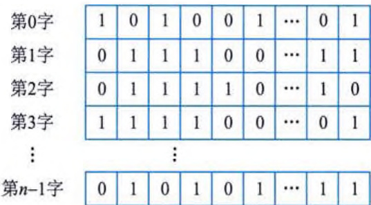  
图 3-20 位示图示例  
 

位示图法的主要特点是位示图的大小由磁盘空间的大小（物理块总数）决定，位示图的描述能力强，适合各种物理结构。  

(2) 空闲区表。将外存空间上的一个连续的未分配区域称为 “空闲区”。操作系统为磁盘外存上的所有空闲区建立一张空闲表, 每个表项对应一个空闲区, 空闲表中包含序号、空闲区的第一块号、空闲块的块数和状态等信息。该方法适用于连续文件结构。  

(3) 空闲区块链。每个空闲物理块中有指向下一个空闲物理块的指针, 所有空闲物理块构成一个链表, 链表的头指针放在文件存储器的特定位置上 (如管理块中), 不需要磁盘分配表, 节省空间。每次申请空闲物理块只需根据链表的头指针取出第一个空闲物理块, 根据第一个空闲物理块的指针可找到第二个空闲物理块, 以此类推。  

(4) 成组链接法。UNIX 系统采用该方法。例如，在实现时系统将空闲块分成若干组，每100个空闲块为一组，每组的第一个空闲块登记了下一组空闲块的物理盘块号和空闲块总数。当某个组的第一个空闲块号等于 0，意味着该组是最后一组空闲块。  

# 4. 文件的共享和保护  

# 1) 文件的共享  

文件共享是指不同用户进程使用同一文件，它不仅是不同用户完成同一任务所必需的功能，还可以节省大量的主存空间，减少由于文件复制而增加的访问外存的次数。文件共享有多种形式，采用文件名和文件说明分离的目录结构有利于实现文件共享。  

常见的文件链接有硬链接和符号链接两种。  

(1) 硬链接, 也称为基于索引结点的链接。采用硬链接可以将两个文件目录表目指向同一个索引结点的链接, 从而达到文件共享的目的。  

(2)符号链接。建立新的文件或目录,并与原来文件或目录的路径名进行映射。当访问一个符号链接时,系统通过该映射找到原文件的路径,再对其进行访问。其优点是可以跨越文件系统,甚至可以通过计算机网络连接到任何地方的计算机中的文件;缺点是其他用户读取符号链接的共享文件会比读取硬链接的共享文件增加读盘的次数。  

# 2) 文件的保护  

文件系统对文件的保护常采用存取控制方式进行。所谓存取控制，就是不同的用户对文件的访问规定不同的权限，以防止文件被未经文件主同意的用户访问。存取控制方法包括以下几种:  

(1) 存取控制矩阵。理论上, 存取控制方法可用存取控制矩阵, 它是一个二维矩阵, 其中一维列出计算机的全部用户, 另一维列出系统中的全部文件, 矩阵中的每个元素 $A_{ij}$ 表示第 $i$ 个用户对第 $j$ 个文件的存取权限。通常, 存取权限有可读 R、可写 W、可执行 X 以及它们的组合。存取控制矩阵在概念上是简单、清楚的, 但在实现上却有困难。当一个系统用户数和文件数很大时, 二维矩阵要占很大的存储空间, 验证过程也将耗费许多系统时间。  

(2) 存取控制表。存取控制矩阵由于太大往往无法实现。一个改进的办法是按用户对文件的访问权限的差别对用户进行分类, 由于某一文件往往只与少数几个用户有关, 所以这种分类方法可使存取控制表大大简化。  
(3) 用户权限表。改进存取控制矩阵的另一种方法是以用户或用户组为单位, 将用户可存取的文件集中起来存入表中, 这个表称为用户权限表。表中的每个表目表示该用户对应文件的存取权限, 这相当于存取控制矩阵一行的简化。  

(4) 密码。在创建文件时, 由用户提供一个密码, 在文件存入磁盘时用该密码对文件内容加密。如果要对文件进行读取操作, 需要将文件解密才能读取文件。  

# 5. 文件系统的安全与可靠性  

# 1) 系统的安全  

系统的安全涉及两类不同的问题，一类涉及技术、管理、法律、道德和政治等问题，另一类涉及操作系统的安全机制。随着计算机应用范围的扩大，在所有稍具规模的系统中都会从多个级别来保证系统的安全性。一般从4个级别上对文件进行安全性管理：系统级、用户级、目录级和文件级。  

# 2) 文件系统的可靠性  

文件系统的可靠性是指系统抵抗和预防各种物理性破坏和人为性破坏的能力。比起计算机的损坏，文件系统的破坏往往后果更加严重，因为文件系统被破坏在很多情况下是无法恢复的。特别是对于程序文件、客户档案、市场计划或其他数据文件丢失的客户来说，这不亚于一场大的灾难。  

保护信息的主要方法有转储和恢复、日志文件和文件系统的一致性检查。文件系统的一致性检查包括块的一致性检查和文件的一致性检查。  

# 3.6.6 作业与用户界面  

# 1. 基本概念  

作业是系统为完成一个用户的计算任务（或一次事务处理）所做的工作总和。例如，对用户编写的源程序，需要经过编译、连接、装入及执行等步骤得到结果，这其中的每一个步骤称为作业步。在操作系统中用来控制作业进入、执行和撤销的一组程序称为作业管理程序。操作系统可以为每个作业创建作业步进程，完成用户的工作。  

# 1) 作业与作业控制方式  

操作系统控制用户作业的运行采用脱机和联机控制两种方式。在脱机控制方式中，作业 运行的过程是无须人工干预的，但用户必须将自己想让计算机干什么的意图用作业控制语言 （JCL）编写成作业说明书，连同作业一起提交给计算机系统；在联机控制方式中，操作系统向 用户提供了一组联机命令，用户可以通过终端输入命令将自己想让计算机干什么的意图告诉计 算机，以控制作业的运行过程。  

作业由程序、数据和作业说明书3个部分组成。作业说明书包括作业基本情况、作业控制、作业资源要求的描述，它体现用户的控制意图。其中，作业基本情况包括用户名、作业名、编程语言和最大处理时间等；作业控制描述包括作业控制方式、作业步的操作顺序、作业执行出错处理：作业资源要求描述包括处理时间、优先级、主存空间、外设类型和数量等。  
# 2）作业状态及转换  

作业状态分为4种：提交、后备（也称收容）、执行和完成。其状态及转换如图3-21所示。  

  
图 3-21 作业的状态及其转换  

(1)提交。作业在其处于输入设备进入外部存储设备的过程时的状态称为提交状态。  

(2) 后备。通过 Spooling 系统将作业输入到计算机系统的后备存储器（磁盘）中，随时等待作业调度程序调度时的状态称为后备状态。  

(3) 执行。一旦作业被作业调度程序选中, 为其分配了必要的资源, 并为其建立相应的进程后, 该作业便进入了执行状态。  

(4) 完成。当作业正常结束或异常终止时, 作业进入完成状态。此时, 由作业调度程序对该作业进行善后处理。如撤销作业的作业控制块, 收回作业所占的系统资源, 将作业的执行结果形成输出文件放到输出井中, 由 Spooling 系统控制输出。  

# 3）作业控制块和作业后备队列  

所谓作业控制块（JCB），是记录与该作业有关的各种信息的登记表。JCB 是作业存在的唯一标志，包括用户名、作业名和状态标志等信息。  

由于在输入井中有较多的后备作业，为了便于作业调度，系统将JCB排成一个或多个队 列，将其称为作业后备队列。换句话说，作业后备队列是由若干个JCB组成的。  

# 2. 作业调度  

在作业管理中，选择调度算法需要考虑三方面的因素：与系统的整个设计目标一致；均衡地使用系统资源：平衡系统和用户的要求。  

# 1) 作业调度算法  

常用的作业调度算法包括先来先服务、短作业优先、优先级调度算法和响应比高优先，前三种调度算法容易理解，本小节重点介绍响应比高优先算法。  

响应比高优先算法是指响应比高的作业优先启动运行。响应比定义如下:  

$$
R _ { p } = \frac { \text { 作业响应时间 } } { \text { 作业执行时间 } }
$$  

其中，作业响应时间为作业进入系统后的等待时间与作业的执行时间之和，即响应比也可记为:  
$$
R_p = 1 + \frac{\text{作业响应时间}}{\text{作业执行时间}}
$$  

对于响应比高优先算法，在每次调度前都要计算所有被选作业（在作业后备队列中）的响应比，然后选择响应比最高的作业执行。该算法比较复杂，系统开销大。  

# 2）作业调度算法性能的衡量指标  

在一个以批量处理为主的系统中，通常用平均周转时间或平均带权周转时间来衡量调度性能的优劣。假设作业$J_{i}(i=1,2,\cdots,n)$的提交时间为$t_{si}$，执行时间为$t_{ri}$，作业完成时间为$t_{oi}$，则作业$J_{i}$的周转时间$T_{i}$和带权周转时间$W_{i}$分别定义为:  

$$
T _ { i } = t _ { \alpha i } - t _ { \alpha i } \quad ( i = 1 , 2 , \cdots , n ) \, , \quad W _ { i } = T _ { i } / t _ { r i } \quad ( i = 1 , 2 , \cdots , n )
$$  

$n$ 个作业的平均周转时间 $T$ 和平均带权周转时间 $W$ 分别定义为:  

$$
T = \frac { 1 } { n } \sum _ { i = 1 } ^ { n } T _ { i } , \quad W = \frac { 1 } { n } \sum _ { i = 1 } ^ { n } W _ { i }
$$  

从用户的角度来说, 总是希望自己的作业在提交后能立即执行, 这意味着当等待时间为 0 时作业的周转时间最短, 即 $T_{i}=t_{ri}$ 。但是, 作业的执行时间 $t_{ri}$ 并不能直观地衡量系统的性能,而带权周转时间 $W_{i}$ 却能直观地反映系统的调度性能。从整个系统的角度来说, 不可能满足每个用户的这种要求, 而只能使系统的平均周转时间或平均带权周转时间最小。  

# 3. 用户界面  

用户界面（User Interface）是计算机中实现用户与计算机通信的软/硬件部分的总称。用户界面也称用户接口或人机界面。操作系统提供命令接口、程序接口和图形界面接口。通常，命令接口和图形界面接口是面向用户和管理者的；程序接口（如系统调用）是面向程序开发人员的。  

用户界面的硬件部分包括用户向计算机输入数据或命令的输入装置，以及由计算机输出供用户观察或处理的输出装置。用户界面的软件部分包括用户与计算机相互通信的协议、约定、操纵命令及其处理软件。目前，常用的输入/输出装置有键盘、鼠标、显示器和打印机等。常用的人机通信方法有命令语言、选项、表格填充及直接操纵等。  

从计算机用户界面的发展过程来看，用户界面可分为控制面板式用户界面、字符用户界面、图形用户界面和新一代用户界面4个阶段。  

虚拟现实技术将用户界面的发展推向一个新阶段: 人将作为参与者, 以自然的方式与计算机生成的虚拟环境进行通信。以用户为中心、自然、高效、高带宽、非精确、无地点限制等是新一代用户界面的特征。多媒体、多通道及智能化是新一代用户界面的技术支持。语音、自然语言、手势、头部跟踪、表情和视线跟踪等新的、更加自然的交互技术将为用户提供更方便的输入技术。计算机将通过多种感知通道来理解用户的意图, 实现用户的要求。计算机不仅以二维屏幕向用户输出, 而且以真实感（立体视觉、听觉、嗅觉和触觉等）的计算机仿真环境向用户提供真实的体验。  
  

 

# 3.6.7 国产操作系统  

国产操作系统主要以开源的 Linux 为基础进行二次开发，目前认知度较高的国产操作系统主要包括银河麒麟、深度、统信、中标麒麟、红旗 Linux、安超 OS、中科方德和 StartOS 等。  

(1) 银河麒麟操作系统 (Kylin OS) 是由国防科技大学、中国软件与技术服务股份有限公司、联想集团、浪潮集团有限公司和民族恒星公司合作研制的。其目标是打破国外操作系统的垄断, 研发一套中国自主知识产权的服务器操作系统。该系统完全版共包括三个版本: 实时版、安全版、服务器版。  

(2) 深度操作系统 (deepin) 是基于 Linux 内核, 以桌面应用为主的开源 GNU/Linux 操作系统, 支持笔记本、台式机和一体机。该系统包含深度桌面环境 (DDE) 和近 30 款深度原创应用, 以及数款来自开源社区的应用软件, 支撑广大用户日常的学习和工作。  

(3) 统信操作系统 (UOS) 是由统信软件技术有限公司研发的, 基于 deepin 进行深度开发, 目前已是一款较为完善的系统。  

(4) 中标麒麟操作系统是由上海中标软件有限公司发布的面向桌面应用的操作系统。采用强化的 Linux 内核, 分桌面版、通用版、高级版和安全版等。  

(5) 红旗 Linux 是由北京中科红旗软件技术有限公司开发的一系列 Linux 发行版, 包括桌面版、工作站版、数据中心服务器版、HA 集群版和红旗 Linux 嵌入式版。红旗 Linux 是国内较大、较成熟的 Linux 发行版, 也是比较出名的国产操作系统之一。  

(6) 安超 OS 2020 是一套基于服务器架构的通用型云操作系统, 具有软硬件解耦、应用优化、支持混合业务负载等特点。为企业提供高性能、高可用、高效率且易于安装维护的 IT 基础设施平台, 加速政府和企业上云进程, 为推动企业数字化转型提供完整的一站式企业上云的云操作系统平台和生态解决方案。  

(7) 中科方德基于核高基（核心电子器件、高端通用芯片及基础软件产品）桌面操作系统基础版，采用核高基安全加固内核，与基于国产兆芯处理器的整机进行全面适配和深度优化，安装简单，易配置。  

(8) StartOS (起点操作系统) 的前身是由广东雨林木风计算机科技有限公司的 ylmfos 开发组所研发的 ylmfos。该系统是从 Linux 底层构建的, 拥有完全自主的核心配置及特色。具有全新的包管理、全新的操作界面, 是一个非常符合中国人操作习惯的桌面 Linux 操作系统。  
  

# 第4章 计算机网络与分布式系统  

计算机网络是计算机技术与通信技术相结合的产物，是信息收集、分发、存储、处理和消费的重要载体，对人类社会的各领域影响深刻。分布式系统在计算机网络的基础上为用户提供了透明的集成应用环境。用户可以用名字或命令调用网络中的任何资源或进行远程的数据处理，而不必考虑这些资源或数据的地理位置。  

# 4.1 计算机网络基础  

计算机网络按照数据通信和数据处理的功能可分为两层：内层通信子网和外层资源子网。通信子网的结点计算机和高速通信线路组成独立的数据系统，承担全网的数据传输、交换、加工和变换等通信处理工作。资源子网包括计算机、终端、通信子网接口设备、外部设备（如打印机、磁带机和绘图机等）及各种软件资源等，它负责全网的数据处理和向网络用户提供网络资源及网络服务。  

# 4.1.1 数据通信基础  

通信中产生和发送信息的一端称为信源，接收信息的一端称为信宿，信源和信宿之间的通信线路称为信道。信息在进入信道时要变换为适合信道传输的形式，在进入信宿时又要变换为适合信宿接收的形式。信道的物理性质不同，对通信的速率和传输质量的影响也不同。另外，信息在传输过程中可能会受到外界的干扰（常称为噪声），不同的物理信道受各种干扰的影响不同，例如，如果信道上传输的是电信号，就会受到外界电磁场的干扰，光纤信道则基本不受电磁场干扰。  

信源产生的信息可能是模拟数据，也可能是数字数据。在数据进入信道之前要变换成适合传输的电磁信号，这些信号可以是模拟的或数字的。模拟信号是随时间连续变化的信号，这种信号的某种参量（如幅度、相位和频率等）可以表示要传送的信息。数字信号只取有限个离散值，而且数字信号之间的转换几乎是瞬时的，数字信号以某一瞬间的状态表示它们传送的信息。  

# 1. 信道带宽和奈奎斯特定理  

模拟信道的带宽 $W=f_{2}-f_{1}$, 其中, $f_{1}$ 是信道能通过的最低频率, $f_{2}$ 是信道能通过的最高频率, 两者都是由信道的物理特性决定的。当组成信道的电路制成时, 信道的带宽也就决定了。为了使信号传输中的失真小一些, 信道要有足够的带宽。  

数字信道是一种离散信道，它只能传送取离散值的数字信号。信道的带宽决定了信道中能不失真地传输的脉冲序列的最高速率。一个数字脉冲称为一个码元，用码元速率表示单位时间内信号波形的变换次数，即单位时间内通过信道传输的码元个数。若信号码元宽度为T秒，则码元速率B=1/T。码元速率的单位为波特（Baud），因此码元速率也叫波特率。  
贝尔实验室的研究员亨利·奈奎斯特（Harry Nyquist）于1924年推导出了有限带宽无噪声信道的极限波特率，称为奈奎斯特定理。若信道带宽为$W$，则奈奎斯特定理指出最大码元速率为  

$$
B { = } 2 W \text{（Baud）}
$$  

奈奎斯特定理指定的信道容量也称为奈奎斯特极限，这是由信道的物理特性决定的。超过奈奎斯特极限传送脉冲信号是不可能的，所以要进一步提高波特率必须改善信道带宽。  

码元携带的信息量由码元取的离散值的个数决定。若码元取两个离散值，则一个码元携带1位信息。若码元可取4种离散值，则一个码元携带两位信息。总之，一个码元携带的信息量n（位）与码元的种类数N有如下关系  

$$
n = \log _ { 2 } N ( N = 2 ^ { n } )
$$  

单位时间内在信道上传送的信息量（位数）称为数据速率。在一定的波特率下提高速率的途径是用一个码元表示更多的位数。如果把两位编码为一个码元，则数据速率可成倍提高。  

下面的公式中，$R$ 表示数据速率，单位是位每秒（b/s）。  

$$
R = B \log _ { 2 } N = 2 W \log _ { 2 } N
$$  

数据速率和波特率是不同的概念，仅当码元取两个离散值时，两者的数值才相等。对于普通电话线路，带宽为3000Hz，最高波特率为6000Baud，最高数据速率可随着调制方式的不同而取不同的值。这些都是在无噪声的理想情况下的极限值。实际信道会受到各种噪声的干扰，因而远远达不到按奈奎斯特定理计算出的数据传送速率。香农（Shannon）的研究表明，有噪声信道的极限数据速率可由下面的公式（称为香农定理）计算确定：  

$$
C = W \log _ { 2 } \left( 1 + \frac { S } { N } \right)
$$  

其中，$W$ 为信道带宽，$S$ 为信号的平均功率，$N$ 为噪声平均功率，$S/N$ 叫作信噪比。由于在实际使用中 $S$ 与 $N$ 的比值太大，故常取其分贝数（dB）。分贝与信噪比的关系为  

$$
\mathrm { d B = 1 0 l o g } _ { 1 0 } \frac { S } { N }
$$  

例如，当 $S/N=1000$ 时，信噪比为 30dB。这个公式与信号取的离散值的个数无关，也就是说，无论用什么方式调制，只要给定了信噪比，则单位时间内最大的信息传输量就确定了。例如，信道带宽为 3000Hz，信噪比为 30dB，则最大数据速率为  

$$
C = 3 0 0 0 \log _ { 3 } ( 1 + 1 0 0 0 ) \approx 3 0 0 0 \times 9 . 9 7 \approx 3 0 0 0 0 b / s
$$  

该极限值只有理论上的意义。实际上，在3000Hz带宽的电话线上数据速率能达到9600b/s就是比较理想的情况了。  

综上所述, 有两种带宽的概念, 在模拟信道, 带宽按照公式 $W=f_{2}-f_{1}$ 计算, 例如 CATV 电缆的带宽为 600MHz 或 1000MHz; 数字信道的带宽为信道能够达到的最大数据速率, 例如以太网的带宽为 10Mb/s 或 100Mb/s。两者可互相转换。  

# 2. 误码率  

在有噪声的信道中，数据速率的增加意味着传输中出现差错的概率增加。用误码率来表示  
传输二进制位时出现差错的概率，具体用下式表示：  

$$
P _ { c } = \frac { N _ { e } \text{（出错的位数）} } { N \text{（传送的总位数）} }
$$  

在计算机通信网络中，误码率一般要求低于 $10^{-6}$，即平均每传送 1Mb 才允许错 1b。在误码 率低于一定的数值时，可以用差错控制的办法进行检查和纠正。  

# 3. 信道延迟  

信号在信道中传播, 从源端到达宿端需要一定的时间。这个时间与源端和宿端的距离有关,也与具体信道中的信号传播速度有关。电信号一般以接近光速的速度（300m/μs）传播, 但随传输介质的不同而略有差别。例如, 在电缆中的传播速度一般为光速的 77%, 即 200m/μs 左右。  

一般来说, 考虑信号从源端到达宿端的时间是没有意义的, 对于一种具体的网络, 人们经常更关注该网络中相距最远的两个站之间的传播时延。这时除了要计算信号传播速度外, 还需要知道网络通信线路的最大长度。例如, 500m 同轴电缆的时延大约是 $2.5\mu s$, 而卫星信道的时延大约是 $270ms$。时延的大小对某些网络应用（例如交互式应用）有很大影响。  

# 4.1.2 数据编码  

在计算机中，数据是以离散的二进制比特流方式表示的，称为数字数据。在网络中传输时，通信信道有模拟信道和数字信道两种类型。计算机数据在模拟信道中传输时，要将数字信号转换成模拟信道能够识别的模拟信号；在数字信道中传输时，要把计算机中的数字信号转换成网络媒体能够识别且利于网络传输的数字信号。  

# 1. 模拟数据编码  

将计算机中的数字数据在网络中用模拟信号表示时，需要进行调制，也就是要进行波形变换，或者是频谱变换，将数字信号的频谱变换成适合于在模拟信道中传输的频谱。最基本的调制方法有调幅、调频和调相3种。  

# 1) 调幅  

调幅（Amplitude Modulator, AM）即载波的振幅随着基带数字信号而变化，例如数字信号1用有载波输出表示，数字信号0用无载波输出表示。这种调幅的方法又称为幅移键控（Amplitude Shift Keving, ASK），其特点是信号容易实现，技术简单，但抗干扰能力差。  

# 2) 调频  

调频（Frequency Modulator, FM）即载波的频率随着基带数字信号而变化，例如数字信号1用频率$f_{1}$表示，数字信号0用频率$f_{2}$表示。这种调频的方法又叫频移键控（Frequency Shift Keying, FSK），其特点是信号容易实现，技术简单，抗干扰能力较强。  

# 3) 调相  

调相（Phase Modulator, PM）即载波的初始相位随着基带数字信号而变化，例如数字信号1对应于相位$180^{\circ}$，数字信号0对应于相位0°。这种调相的方法又叫相移键控（Phase Shift Keying, PSK），其特点是抗干扰能力较强，但信号实现的技术比较复杂。  
 

# 2. 数字数据编码  

在数字信道中传输时，要对计算机中的数字信号重新编码后进行基带传输。在基带传输中，数字信号的编码方式主要有以下几种。  

# 1) 不归零编码  

不归零编码（Non-Return-Zero，NRZ）用低电平表示二进制 0，用高电平表示二进制 1，如图 4-1（a）所示。  

不归零编码的缺点是无法判断每一位的开始与结束，收发双方不能保持同步。为保证收发双方同步，必须在发送不归零编码的同时用另一个信道传送同步信号。  

# 2）曼彻斯特编码  

曼彻斯特编码（Manchester Encoding，ME）不用电平的高低表示二进制，而是用电平的跳变来表示的。在曼彻斯特编码中，每一个比特的中间均有一个跳变，这个跳变既作为时钟信号，又作为数据信号。电平从高到低的跳变表示二进制1，从低到高的跳变表示二进制0，如图4-1（b）所示。  

# 3) 差分曼彻斯特编码  

差分曼彻斯特编码（Differential Manchester Encoding, DME）是对曼彻斯特编码的改进,每比特中间的跳变仅做同步之用, 每比特的值根据其开始边界是否发生跳变来决定。每比特的开始无跳变表示二进制 1, 有跳变表示二进制 0, 如图 4-1 (c) 所示。  

  
图 4-1 数字信号的编码方式  

曼彻斯特编码和差分曼彻斯特编码是数据通信中最常用的数字信号编码方式，它们的优点是无须另发同步信号；缺点是编码效率低，如果传送10Mb/s的数据，将需要20MHz的脉冲。  
# 4) 多电平编码  

这种编码的码元可取多个电平之一，每个码元可代表几个二进制位。例如，令$M=2^n$，设$M=4$，则$n=2$。若表示码元的脉冲取4个电平之一，则一个码元可表示两个二进制位。与双相码相反，多电平码的数据速率大于波特率，因而可提高频带的利用率。但是这种代码的抗噪声特性不好，在传输过程中信号容易畸变到无法区分。  

# 5）4B/5B 编码  

在曼彻斯特编码和差分曼彻斯特编码中，每位中间都有一次电平跳变，因此波特率是数据速率的两倍。对于 100Mb/s 的高速网络，如果采用这类编码方法，就需要 200MBaud（波特率），其硬件成本是 100MBaud 硬件成本的 5\~10 倍。为了提高编码的效率，降低电路成本，可以采用 4B/5B 编码，即用 5bit 的二进制码来代表 4bit 的二进制码。  

在数据通信中，选择什么样的数据编码要根据传输的速度、信道的带宽、线路的质量以及实现的价格等因素综合考虑。  

# 4.1.3 美错控制  

通信过程中出现的差错可大致分为两类：一类是由热噪声引起的随机错误；另一类是由冲击噪声引起的突发错误。  

通信线路中的热噪声是由电子的热运动产生的，热噪声时刻存在，具有很宽的频谱，且幅度较小。通信线路的信噪比越高，热噪声引起的差错越少。这种差错具有随机性，影响个别位。  

冲击噪声源是外界的电磁干扰，例如，打雷闪电时产生的电磁干扰，电焊机引起的电压波动等。冲击噪声持续的时间短而幅度大，往往引起一个位串出错，属于突发性差错。  

此外，由于信号幅度和传播速率与相位、频率有关而引起的信号失真，以及相邻线路之间发生串音等都会产生差错，这些差错也具有突发性的特点。  

突发性差错影响局部，而随机性差错总是断续存在，影响全局。因此要尽量提高通信设备的信噪比，以满足要求的差错率。此外，要进一步提高传输质量，就需要采用有效的差错控制办法。  

# 1. 奇偶校验错码  

奇偶校验是最常用的检错方法，其原理是在7位的ASCII代码后增加一位，使码字中1的个数成奇数（奇校验）或偶数（偶校验）。经过传输后，如果其中一位（甚至奇数个位）出错，则接收端按同样的规则就能发现错误。这种方法简单实用，但只能对付少量的随机性错误。  

为了能检测突发性的位串出错，可以使用校验和的方法。这种方法把数据块中的每个字节当作一个二进制整数，在发送过程中按模 256 相加。数据块发送完后，把得到的和作为校验字节发送出去。接收端在接收过程中进行同样的加法，用所得到的校验和与接收到的校验和比较，从而发现是否出错。实现时可以用更简单的办法，例如在校验字节发送前，对累加器中的数取 2 的补码。这样，如果不出错，接收端在加完整个数据块以及校验和后累加器中是 0。由于进位的关系，一个错误可以影响到更高的位，从而使出错位对校验字节的影响扩大了。可以粗略地认为，随机的突发性错误对校验和的影响也是随机的。  
   

# 2. 海明码  

1950年, 海明 (Hamming) 研究了用冗余数据位来检测和纠正代码差错的理论和方法。按照海明的理论, 可以在数据代码上添加若干冗余位组成码字。码字之间的海明距离是一个码字要变成另一个码字时必须改变的最小位数。例如, 7位 ASCII 码增加一位奇偶位成为 8 位的码字, 这 128 个 8 位的码字之间的海明距离是 2。所以, 当其中一位出错时便能检测出来。两位出错时就变成另外一个码字了。  

海明用数学分析的方法说明了海明距离的几何意义，n位的码字可以用n维空间的超立方 体的一个顶点来表示。两个码字之间的海明距离就是超立方体的两个对应顶点之间的一条边， 而且这是两顶点（两个码字）之间的最短距离，出错的位数小于这个距离都可以被判断为就近 的码字。这就是海明码纠错的原理，它用码位的增加（因而通信量增加）来换取正确率的提高。  

按照海明的理论，纠错码的编码就是要把所有合法的码字尽量安排在$n$维超立方体的顶点上，使得任意一对码字之间的距离尽可能大。如果任意两个码字之间的海明距离是$d$，则所有小于等于$d-1$位的错误都可以检查出来，所有小于$d/2$位的错误都可以纠正。一个自然的推论是，对于某种长度的错误串，要纠正它就要用比仅仅检测它多一倍的冗余位。  

如果对于m位的数据增加k位冗余位，则组成$n=m+k$位的纠错码。对于$2^{m}$个有效码字中的每一个，都有n个无效但可以纠错的码字。这些可纠错的码字与有效码字的距离是1，含单个错误位。这样，对于一个有效的消息总共有$n+1$个可识别的码字。这$n+1$个码字相对于其他$2^{m}-1$个有效消息的距离都大于1。这意味着总共有$2^{m}$（$n+1$）个有效的或者可纠错的码字。显然，这个数应小于等于码字的所有可能的个数，即$2^{n}$。于是，有  

$$
2 ^ { m } ( n + 1 ) < 2 ^ { n }
$$  

因为 $n=m+k$，得出  

$$
m { + } k { + } 1 { < } 2 ^ { k }
$$  

<table><tr><th></th><th>校验位</th></tr><tr><th></th><th>8</th><th>4</th><th>2</th><th>1</th></tr><tr><th rowspan="5">数据 位</th><th>3</th><td>0</td><td>0</td><td>1</td><td>1</td></tr><tr><th>5</th><td>0</td><td>1</td><td>0</td><td>1</td></tr><tr><th>6</th><td>0</td><td>1</td><td>1</td><td>0</td></tr><tr><th>7</th><td>0</td><td>1</td><td>1</td><td>1</td></tr><tr><th>9</th><td>1</td><td>0</td><td>0</td><td>1</td></tr><tr><th>10</th><td>1</td><td>0</td><td>1</td><td>0</td></tr><tr><th>11</th><td>1</td><td>0</td><td>1</td><td>1</td></tr></table>  

对于给定的数据位 $m$，上式给出了 $k$ 的下界，即要纠正单个错误， $k$ 必须取的最小值。海明建议了一种方案可以达到这个下界，并能直 接指出错在哪一位。首先把码字的位从1 到 $n$ 编号，并把这个编号表 示成二进制数，即2 的幂之和。然后对2 的每一个幂设置一个奇偶位。 例如，对于6 号位，由于6=110（二进制），所以6 号位参加第2 位和 第4 位的奇偶校验，而不参加第1 位的奇偶校验。类似地，9 号位参加 第1 位和第8 位的校验，而不参加第2 位或第4 位的校验。海明把奇 偶校验分配在1、2、4、8 等位置上，其他位放置数据。  

下面根据图 4-2 举例说明编码的方法。  

假设传送的信息为1001011，把各个数据位放在3、5、6、7、9、10、11等位置上，1、2、4、8位留作校验位，如下图所示。  

<table><tr><td></td><td></td><td>1</td><td></td><td>0</td><td>0</td><td>1</td><td></td><td>0</td><td>1</td><td></td><td>1</td><td></td></tr><tr><td>1</td><td>2</td><td>3</td><td>4</td><td>5</td><td>6</td><td>7</td><td></td><td>8</td><td></td><td>9</td><td>10</td><td>11</td></tr></table>  
根据图 4-2, 3、5、7、9、11 的二进制编码的第一位为 1, 所以 3、5、7、9、11 号位参加第 1 位校验, 若按偶校验计算, 1 号位应为 1。  

<table><tr><td>1</td><td></td><td>1</td><td></td><td>0</td><td>0</td><td>1</td><td></td><td>0</td><td>1</td><td>1</td><td>1</td></tr><tr><td>1</td><td>2</td><td>3</td><td>4</td><td>5</td><td>6</td><td>7</td><td>8</td><td>9</td><td>10</td><td>11</td><td></td></tr></table>  

类似地，3、6、7、10、11号位参加第2位校验，5、6、7号位参加第4位校验，9、10、11号位参加第8位校验，全部按偶校验计算，最终得到:  

<table><tr><td>1</td><td>0</td><td>1</td><td>1</td><td>0</td><td>0</td><td>1</td><td>0</td><td>0</td><td>1</td></tr><tr><td>1 2</td><td>2 3</td><td>4 5</td><td>6 7</td><td>7 8</td><td>9</td><td>10</td><td>11</td><td>12</td></tr></table>  

如果这个码字传输中出错，比如6号位出错，即变成:  

<table><tr><td>√</td><td>×</td><td></td><td>×</td><td></td><td></td><td></td><td>√</td><td></td><td></td><td></td><td></td><td></td></tr><tr><td>1</td><td>0</td><td>1</td><td>1</td><td>0</td><td>1</td><td>1</td><td>0</td><td>0</td><td>0</td><td>1</td><td></td><td>1</td></tr><tr><td>1 2</td><td>3 4</td><td>5 6</td><td>7 8</td><td>9</td><td>9</td><td>10</td><td>11</td><td></td><td></td><td></td><td></td><td></td></tr></table>  

当接收端按照同样的规则计算奇偶位时，发现1和8号位的奇偶性正确，2和4号位的奇偶性错误，于是$2+4=6$，立即可确认错在6号位。  

在上例中，$k=4$，因而$m<2^{4}-4-1=11$，即数据位可用到11位，共组成15位的码字，可检测出单个位的错误。  

# 3. 循环冗余校验码  

所谓循环码是这样一组代码，其中任一有效码字经过循环移位后得到的码字仍然是有效码字，不论是右移还是左移，也不论移多少位。例如，若（$a_{n-1}$ $a_{n-2}$...$a_1$ $a_0$）是有效码字，则（$a_{n-2}$ $a_{n-3}$...$a_0$ $a_{n-1}$）、（$a_{n-3}$ $a_{n-4}$...$a_{n-1}$ $a_{n-2}$）等都是有效码字。循环冗余校验码（Cyclic Redundancy Check, CRC）是一种循环码，它有很强的检错能力，而且容易用硬件实现，在局域网中有广泛应用。  

CRC 可以用如图 4-3 所示的移位寄存器实现。移位寄存器由 $k$ 位组成，还有几个异或门和一条反馈回路，移位寄存器可以按 CCITT-CRC 标准生成 16 位的校验和。寄存器被初始化为 0，数据从右向左逐位输入。当一位从最左边移出寄存器时就通过反馈回路进入异或门与后续进来的位以及左移的位进行异或运算。当所有 $m$ 位数据从右边输入完之后再输入 $k$ 个 0（本例中 $k=16$）。最后，该过程结束时，移位寄存器中就形成了校验和。 $k$ 位的校验和跟在数据位后边发送，接收端可以按同样的过程计算校验和并与接收到的校验和比较，以检测传输中的差错。  

  
图 4-3 CRC 的实现  

在 CRC 编码中计算校验和方法可以用一种特殊的多项式除法进行分析。$m$ 个数据位可以看作 $m-1$ 阶多项式的系数。例如，数据码字 00101011 可以组成的多项式是 $x^{5}+x^{3}+x+1$。图 4-3 中表示的反馈回路可表示成另外一个多项式 $x^{16}+x^{12}+x^{5}+1$，这就是所谓的生成多项式。所有的运算都按模 2 进行，即  
   

$$
1x^{a}+1x^{a}=0x^{a},\ 0x^{a}+1x^{a}=1,\ 1x^{a}+0x^{a}=1x^{a},\ 0x^{a}+0x^{a}=0x^{a},\ -1x^{a}=1x^{a}
$$  

显然，在这种代数系统中，加法和减法一样，都是异或运算。用x乘一个多项式等于把多项式的系数左移一位。可以看出，按图4-3的反馈回路把一个向左移出寄存器的数据位反馈回去与寄存器中的数据进行异或运算，等同于在数据多项式上加上生成多项式，因而也等同于从数据多项式中减去生成多项式。以上给出的例子，对应于下面的长除法：  

$$
\begin{array} { r } { 0 0 1 0 \quad 1 0 1 1 \quad 0 0 0 0 \quad 0 0 0 0 \quad 0 0 0 0 } \\ { - \quad 1 0 \quad 0 0 1 0 \quad 0 0 0 0 \quad 0 1 0 0 \quad 0 0 1 } \\ { 0 0 \quad 1 0 0 1 \quad 0 0 0 0 \quad 0 1 0 0 \quad 0 0 1 0 \quad 0 0 0 0 } \\ { - \quad 1 0 0 0 \quad 1 0 0 0 \quad 0 0 0 1 \quad 0 0 0 0 } \\ { 0 0 0 1 \quad 1 0 0 0 \quad 0 1 0 1 \quad 0 0 1 0 \quad 1 0 0 0 } \\ { - \quad 1 \quad 0 0 0 1 \quad 0 0 0 0 \quad 0 0 1 0 \quad 0 0 0 1 } \\ { 0 \quad 1 0 0 1 \quad 0 1 0 1 \quad 0 0 0 0 \quad 1 0 0 1 ( \text{余数} ) } \end{array}
$$  

得到的校验和是 9509H。可以看到，在移位寄存器中的处理过程和以上长除法在原理上是相同的，因此可以用多项式理论来分析 CRC 代码，这就使得这种检错码有了严格的数学基础。  

把数据码字形成的多项式称为数据多项式 $D(x)$，按照一定的要求可给出生成多项式 $G(x)$。用 $G(x)$ 除 $x^k D(x)$ 可得到商多项式 $Q(x)$ 和余多项式 $R(x)$，实际传送的码字多项式是  

$$
F ( x ) = x ^ { k } D ( x ) + R ( x )
$$  

由于使用了模 2 算术，$+R(x)=-R(x)$，于是接收端对 $F(x)$ 计算的校验和应为 0。如果有差错，则接收到的码字多项式包含某些出错位 $E$，可表示成  

$$
H ( x ) = F ( x ) + E ( x )
$$  

由于 $F(x)$ 可以被 $G(x)$ 整除, 如果 $H(x)$ 不能被 $G(x)$ 整除, 则说明 $E(x) \neq 0$, 即有错误出现。然而, 若 $E(x)$ 也能被 $G(x)$ 整除, 则有差错而检测不到。  

为了能对不同场合下的各种错误模式进行校验，已经研究出了几种 CRC 生成多项式的国际 标准。  

$$
\begin{array} { r l } { \mathrm { C R C - C C I T T } } & { { } G ( x ) = x ^ { 1 6 } + x ^ { 1 2 } + x ^ { 5 } + 1 } \\ { \mathrm { C R C - 1 6 } } & { { } G ( x ) = x ^ { 1 6 } + x ^ { 1 5 } + x ^ { 2 } + 1 } \\ { \mathrm { C R C - 1 2 } } & { { } G ( x ) = x ^ { 1 2 } + x ^ { 1 1 } + x ^ { 3 } + x ^ { 2 } + x + 1 } \\ { \mathrm { C R C - 3 2 } } & { { } G ( x ) = x ^ { 3 2 } + x ^ { 2 6 } + x ^ { 2 3 } + x ^ { 2 2 } + x ^ { 1 6 } + x ^ { 1 2 } + x ^ { 1 1 } + x ^ { 1 0 } + x ^ { 8 } + x ^ { 7 } + x ^ { 5 } + x ^ { 4 } + x ^ { 2 } + x + 1 } \end{array}
$$  

其中，CRC-32 常被用于局域网中。  

# 4.2 网络体系结构与协议  

网络体系结构是指计算机网络的各层及其协议的集合。计算机之间要交换数据，就必须遵 守一些事先约定好的规则，用于规定信息的格式以及如何发送和接收信息的一套规则就称为网 络协议。  

通常，网络协议由如下3个要素组成:  
(1) 语法, 即控制信息或数据的结构和格式。  

(2)语义, 即需要发出何种控制信息、完成何种动作以及做出何种应答。  

(3) 同步, 即事件实现顺序的详细说明。  

采用分层设计方法，按照信息的传输过程将网络的整体功能分解为多个功能层，不同机器上的同等功能层之间采用相同的协议，同一机器上的相邻功能层之间通过接口进行信息传递。  

# 4.2.1 OSI体系结构  

美国国防部高级研究计划署的分组交换网 ARPANET 的实践经验表明，复杂的计算机网络结构最好是层次型的。根据这一特点，国际标准化组织（ISO）推出了开放系统互连参考模型（Open System Interconnection Reference Model, OSI/RM），该模型定义了不同计算机互连的标准，是设计和描述计算机网络通信的基本框架。开放系统互连参考模型共分 7 层，层与层之间在逻辑上对等通信，最后由物理层实现真正的通信，每一层完成相应的功能，下一层为上一层提供服务，从而把复杂的通信过程分成了多个独立的、比较容易解决的子问题。  

# 1) 物理层  

物理层是 OSI 分层体系结构中最重要、最基础的一层，它建立在传输媒介基础上，实现设备之间的物理接口。物理层的功能是实现实体之间的按位传输，保证按位传输的正确性，并向数据链路层提供一个透明的位流传输。在数据终端设备、数据通信和交换等设备之间完成对数据链路的建立、保持和拆除操作。  

物理层包括对连接到网络上的设备描述其各种机械的、电气的和功能的规定，还定义电位的高低、变化的间隔、电缆的类型、连接器的特性等。  

# 2) 数据链路层  

数据链路层实现实体间数据的可靠传送。通过物理层建立起来的链路，将具有一定意义和结构的信息正确地在实体之间进行传输，同时为其上面的网络层提供有效的服务。在数据链路层中对物理链路上产生的差错进行检测和校正，采用差错控制技术保证数据通信的正确性；数据链路层还提供流量控制服务，以保证发送方不致因为速度快而导致接收方来不及正确接收数据。数据链路层的数据单位是帧。  

数据链路层的功能是实现系统实体间二进制信息块的正确传输，为网络层提供可靠无错误的数据信息。在数据链路中，需要解决的问题包括信息模式、操作模式、差错控制、流量控制、信息交换过程控制和通信控制规程。  

# 3) 网络层  

网络层也称为通信子网层，是高层协议与低层协议之间的界面层，用于控制通信子网的操作，是通信子网与资源子网的接口。网络层的主要任务是提供路由，为信息包的传送选择一条最佳路径。网络层还具有拥塞控制、信息包顺序控制及网络记账等功能。在网络层交换的数据单元是包。  

网络层的功能是向传输层提供服务，同时接受来自数据链路层的服务。其主要功能是实现整个网络系统内连接，为传输层提供整个网络范围内两个终端用户之间进行数据传输的通路。  
它涉及整个网络范围内所有节点、通信双方终端节点和中间节点几方面的相互关系。所以网络层的任务就是提供建立、保持和释放通信连接的手段，包括交换方式、路径选择、流量控制、阻寒与死锁等。  

# 4) 传输层  

传输层建立在网络层和会话层之间，实质上它是网络体系结构中高低层之间衔接的一个接口层。传输层不仅是一个单独的结构层，还是整个分层体系协议的核心，没有传输层，整个分层协议就没有意义。  

传输层获得下层提供的服务包括：发送和接收顺序正确的数据块分组序列，并用其构成传输层数据；获得网络层地址，包括虚拟信道和逻辑信道。  

传输层向上层提供的服务包括：无差错的有序的报文收发，提供传输连接，进行流量控制。  

传输层的功能是从会话层接收数据，根据需要把数据切成较小的数据片，并把数据传送给网络层，确保数据片正确到达网络层，从而实现两层间数据的透明传送。  

# 5) 会话层  

会话层用于建立、管理以及终止两个应用系统之间的会话。它是用户连接到网络的接口，基本任务是负责两主机间的原始报文的传输。  

会话层为表示层提供服务，同时接受传输层的服务。为实现在表示层实体之间传送数据，会话连接必须被映射到传输连接上。  

会话层的功能包括会话层连接到传输层的映射、会话连接的流量控制、数据传输、会话连接恢复与释放以及会话连接管理和差错控制。  

会话层提供给表示层的服务包括数据交换、隔离服务、交互管理、会话连接同步和异常报告。  

会话层最重要的特征是数据交换。与传输连接相似，一个会话分为建立链路、数据交换和释放链路 3 个阶段。  

# 6) 表示层  

表示层向上对应用层服务，向下接受来自会话层的服务。表示层为在应用过程之间传送的信息提供表示方法，它关心的只是发出信息的语法与语义。表示层要完成某些特定的功能，主要有不同数据编码格式的转换，提供数据压缩、解压缩服务，对数据进行加密、解密。  

表示层为应用层提供的服务包括语法选择、语法转换等。语法选择是提供一种初始语法和以后修改这种选择的手段。语法转换涉及代码转换和字符集的转换、数据格式的修改以及对数据结构操作的适配。  

# 7) 应用层  

应用层是通信用户之间的窗口，为用户提供网络管理、文件传输、事务处理等服务，其中 包含若干个独立的、用户通用的服务协议模块。应用层是OSI 的最高层，为网络用户之间的通 信提供专用的程序。应用层的内容主要取决于用户的各自需要，这一层涉及的主要问题是分布 数据库、分布计算技术、网络操作系统和分布操作系统、远程文件传输、电子邮件、终端电话 及远程作业登录与控制等。  
# 4.2.2 TCP/IP协议簇  

TCP/IP 是为了使接入互联网的异种网络、不同设备之间能够进行正常的数据通信而制定的一组需共同遵守的格式和约定，是美国国防部高级研究计划署为建立 ARPANET 开发的，其中两个最知名的协议是传输控制协议（Transfer Control Protocol, TCP）和网际协议（Internet Protocol, IP），因此整个协议集被称为 TCP/IP，另外还包括 UDP、ICMP、RIP、Telnet、FTP、SMTP 及 ARP 等许多协议，对互联网中主机的寻址方式、主机的命名机制、信息的传输规则以及各种各样的服务功能均做了详细约定。  

TCP/IP 协议分为 4 层，由下至上分别是网络接口层、网际层、传输层和应用层，ISO/OSI 模型与 TCP/IP 分层模型的关系如图 4-4 所示。  

  
图 4-4 TCP/IP 模型与 OSI 模型的对比  

TCP/IP 的最上层是应用层，是与用户打交道的部分，如收发电子邮件、文件传输等。简单网络管理协议（Simple Network Management Protocol, SNMP）就是一个典型的应用层协议。  

传输层的主要功能是对应用层传递过来的用户信息进行分段处理，然后在各段信息中加入一些附加说明，如说明各段的顺序等，保证对方收到可靠的信息。该层有两个协议，一个是传输控制协议（TCP），另一个是用户数据报协议（User Datagram Protocol, UDP），SNMP 就是基于 UDP 协议的一个应用协议。  

网际层将传输层形成的一段一段的信息构造为IP数据报，在报头中填入地址信息，然后选 择好发送的路径。  

网络接口层是最底层，也称链路层，其功能是接收和发送IP数据报，负责与网络中的传输媒介打交道。  

TCP/IP 本质上采用的是分组交换技术，其将信息分成一个个不超过一定大小的信息包传送出去。分组交换技术的优点是：一方面可以避免单个用户长时间占用网络线路；另一方面是在传输出错时不必全部重新传送，只需要将出错的包重新传输即可。  

TCP/IP 协议簇允许同层的协议实体间互相调用，从而完成复杂的控制功能，还允许上层过程直接调用不相邻的下层过程，甚至在有些高层协议中控制信息和数据分别传输，而不是共享同一个协议数据单元。如图 4-5 所示为主要协议之间的关系。  
   

  
图 4-5 Internet 的主要协议  

# 1) IP 协议  

在 TCP/IP 的标准中，各种数据格式常以 32 位（即 4 字节）为单位来描述。一个 IP 数据报由首部和数据两部分组成。首部由固定 20 个字节的基本首部和 0～40 字节可变长度的任选项组成，如图 4-6 所示。  

  
图 4-6 IP 协议格式  

其中的字段说明如下:  

- 版本号：协议的版本号，不同版本的协议格式或语义可能不同，目前常用的是IPv4，正在逐渐过渡到IPv6。  
- IHL: IP头长度, 以32位字计数, 最小为5, 即20字节。  

● 服务类型：用于区分不同的可靠性、优先级、延迟和吞吐率的参数。  

- 段总长度：包含IP头在内的数据单元的总长度（字节数）。  

● 标识符：唯一标识数据报的标识符。  

- 标志：包括3个标志，M标志用于分段和重装配；另一个是禁止分段标志，如果认为目标站不具备重装配能力，则可使这个标志置位，这样如果数据报要经过一个最大分组长度较小的网络，就会被丢弃，因而最好使用源路由以避免这种灾难发生；第3个标志当前没有启用。  

● 段偏置值：指明该段处于原来数据报中的位置。  

● 生存期：用经过的路由器个数表示。  

- 协议：上层协议（TCP或UDP）。  

- 头校检和：对IP头的校验序列。在数据报传输过程中IP头中的某些字段可能改变（例如生存期，以及与分段有关的字段），所以校检和要在每一个经过的路由器中进行校验和重新计算。校检和是对IP头中的所有16位字进行1的补码相加得到的，计算时假定校检和字段本身为0。  

- 源地址：给网络和主机地址分别分配若干位，例如7和24、14和16、21和8等。  

目的地址：同上。  

● 任选数据：可变长，包含发送者想要发送的任何数据。  

● 补丁：补齐32位的边界。  

用户数据：以字节为单位的用户数据，和IP头加在一起的长度不超过65 535字节。  

# 2) ICMP 协议  

ICMP (Internet Control Message Protocol) 与 IP 协议同属于网络层, 用于传送有关通信问题的消息, 例如数据报不能到达目标站, 路由器没有足够的缓存空间, 或者路由器向发送主机提供最短通路信息等。ICMP 报文封装在 IP 数据报中传送, 因而不保证可靠的提交。ICMP 报文有 11 种之多, 报文格式如图 4-7 所示。其中的类型字段表示 ICMP 报文的类型, 代码字段可表示报文的少量参数, 当参数较多时写入 32 位的参数字段, ICMP 报文携带的信息包含在可变长的信息字段中, 校验和字段是关于整个 ICMP 报文的校验和。  

  
图 4-7 ICMP 报文格式  

# 3) TCP 协议  

传输控制协议（Transmission Control Protocol，TCP）是面向连接的协议。  

TCP 只有一种类型的传输层协议数据单元（Protocol Data Unit, PDU），叫作 TCP 段，段头（也叫 TCP 头或传输头）的格式如图 4-8 所示。  
   

  
图 4-8 TCP 传输头格式  

其中的字段说明如下:  

● 源端口（16位）：说明源服务访问点。  

● 目标端口（16位）：表示目标服务访问点。  

● 发送顺序号（32位）：本段中第一个数据字节的顺序号。  

- 接收顺序号（32位）：携带接收的顺序号，指明接收方期望接收的下一个数据字节的顺序号。  

● 偏置值（4位）：传输头中32位字的个数。因为传输头有任选部分，长度不固定，所以需要偏置值。  

● 保留字段（6位）：未用，所有实现必须把这个字段置全0。  

- 标志字段（6位）：表示各种控制信息。其中，URG表示紧急指针有效；ACK表示接收顺序号有效；PSH表示推进功能有效；RST表示连接复位为初始状态，通常用于连接故障后的恢复；SYN表示对顺序号同步，用于连接的建立；FIN表示数据发送完，连接可以释放。  

- 窗口（16位）：为流控分配的信息量。  

● 校验和（16位）：段中所有16位字按模$2^{16}$-1相加的和，然后取1的补码。  

- 紧急指针（16位）：从发送顺序号开始的偏置值，指向字节流中的一个位置，此位置之前的数据是紧急数据。  

● 任选项（长度可变）：目前只有一个任选项，即建立连接时指定的最大段长。  

● 补丁：补齐32位字边界。  

端口编号用于标识 TCP 用户，即上层协议，经常使用的上层协议如 Telnet（远程终端协议）、FTP（文件传输协议）或 SMTP（简单邮件传输协议）等都有固定的端口号，这些公用端口号可以在 RFC（Request For Comment）中查到，任何实现都应该按规定保留这些公用端口编号，除此之外的其他端口编号由具体实现分配。  

TCP 是对字节流进行传送, 因而发送顺序号和接收顺序号都是指字节流中的某个字节的顺序号, 而不是指整个段的顺序号。例如, 某个段的发送顺序号为 1000, 其中包含 500 个数据字节, 则段中第一个字节的顺序号为 1000, 按照逻辑顺序, 下一个段必然从第 1500 个数据字节处开始, 其发送顺序号应为 1500。为了提高带宽的利用率, TCP 采用积累接收的机制。例如, 从 A 到 B 传送了 4 个段, 每段包含 20 个字节数据, 这 4 个段的接收顺序号分别为 30、50、70  
和 90。在第 4 次传送结束后，B 向 A 发回一个 ACK 标志置位的段，其中的接收顺序号为 110（即 90+20），一次接收了 4 次发送的所有字节，表示从起始字节到 109 字节都已正确接收。  

同步标志 SYN 用于连接建立阶段。TCP 用三次握手过程建立连接。  

紧急数据是指 TCP 用户认为很重要的数据，例如键盘中断等控制信号。当 TCP 段中的 URG 标志置位时，紧急指针表示距离发送顺序号的偏置值，在这个字节之前的数据都是紧急数据。紧急数据由上层用户使用，TCP 只是尽快地把它提交给上层协议。  

窗口字段表示从应答顺序号开始的数据字节数，即接收端期望接收的字节数，发送端根据这个数字扩大自己的窗口。窗口字段、发送顺序号和应答顺序号共同实现滑动窗口协议。  

校验和的校验范围包括整个 TCP 段和伪段头 (Pseudo-header)。伪段头是 IP 头的一部分。如果 IP 把 TCP 段提交给错误的主机，TCP 实体可根据伪段头中的源地址和目标地址字段检查出错误。  

由于 TCP 是和 IP 配合工作的, 所以有些用户参数由 TCP 直接传送给 IP 层处理, 这些参数包含在 IP 头中, 例如, 优先级、延迟时间、吞吐率、可靠性和安全级别等。TCP 头和 IP 头合在一起, 代表了传送一个数据单元的开销, 共 40 个字节。  

# 4) UDP 协议  

用户数据报协议（User Datagram Protocol, UDP）是无连接的。  

UDP 对应用层提供无连接的传输服务，虽然这种服务是不可靠的、不保证顺序的提交，但 这并没有减少它的使用价值。相反，由于协议开销少而在很多场合相当实用，特别是在网络管 理方面，大多使用UDP 协议。  

UDP 是在 IP 协议之上加上端口寻址功能，这个功能表现在 UDP 头中，如图 4-9 所示。  

UDP 头包含源端口号和目标端口号。段长指整个 UDP 段的长度，包括头部和数据部分。校验和与 TCP 相同，是任选的，如果不使用校验和，则这个字段置 0。由于 IP 的校验和只作用于 IP 头，并不包括数据部分，所以当 UDP 的校验和字段为 0 时，实际上对用户数据不进行校验。  

  
图 4-9 UDP 头  

# 5) ARP 和 RARP  

地址解析协议（Address Resolution Protocol, ARP）及反向地址解析协议（Reverse Address Resolution Protocol, RARP）是驻留在网际层中的重要协议。ARP 的作用是将 IP 地址转换为物理地址，RARP 的作用是将物理地址转换为 IP 地址。网络中的任何设备，主机、路由器和交换机等均有唯一的物理地址，该地址通过网卡给出，每个网卡出厂后都有不同的编号，这意味着用户所购买的网卡有着唯一的物理地址。另一方面，为了屏蔽底层协议及物理地址上的差异，IP 协议采用的是 IP 地址，因此，在数据传输过程中，必须对 IP 地址与物理地址进行相互转换。  

用 ARP 进行 IP 地址到物理地址转换的过程为: 当计算机需要与任何其他的计算机进行通信时, 首先需要查询 ARP 高速缓存, 如果 ARP 高速缓存中这个 IP 地址存在, 便使用与它对应的物理地址直接将数据报发送给所需的物理网卡。如果 ARP 高速缓存中没有该 IP 地址, 那么  
ARP 便在局域网上以广播方式发送一个 ARP 请求包。如果局域网上 IP 地址与某台计算机中的 IP 地址相一致，那么该计算机便生成一个 ARP 应答信息，信息中包含对应的物理地址。ARP 协议软件将 IP 地址与物理地址的组合添加到它的高速缓存中，这时即可开始数据通信。  

RARP 负责物理地址到 IP 地址的转换, 为了完成这个转换过程, 网络中有一个 RARP 服务器,网络管理员事先必须把网卡上的 IP 地址和相应的物理地址存储到 IP RARP 服务器的数据库中。  

# 6) 应用层协议  

随着计算机网络的广泛应用，产生了许多基本的、相同的应用需求。为了让不同平台的计算机能够通过计算机网络获得一些基本的、相同的服务，也就应运而生了一系列应用级的标准，实现这些应用级标准的专用协议被称为应用级协议，相对于 OSI 参考模型来说，它们处于较高的层次，所以也称为高层协议，常用的应用层协议有 NFS、Telnet、SMTP、DNS、SNMP 和 FTP 等。  

# 4.2.3 网络地址  

Internet 依靠 TCP/IP 协议簇在全球范围内实现不同硬件结构、不同操作系统、不同网络系统的互连。在 Internet 上，每个节点都依靠唯一的 IP 地址互相区分和相互联系。  

# 1. IP 地址  

IP 地址是一个32 位的二进制数逻辑地址（这种表示方式称为IPv4），为了人们使用方便， 习惯上将这个32 位的数字划分成4 个字节，并在每个字节之间以“.”来区分。例如，IP 地址 11000000 10101000 11001000 10000000，每字节用十进制数来表示，字节之间用圆点分隔，表 示为192.168.200.128。  

每个IP地址由两部分组成，分别是网络号和主机号。网络号用于唯一标识一个网络，主机号则确定了某个网络上的某一台主机。根据网络号和主机号的不同划分，IP地址可以分为5类，如图4-10所示。  

  
图 4-10 IP 地址分类示意图  

A类IP地址的最高位为0，高8位为网络号，其后的24位用于表示主机号；B类IP地址的最高位为10，其高16位为网络号，后面的16位用于表示主机号；C类IP地址的最高位为110，高24位为网络号，后面的8位为主机号；D类地址也称为组播地址，它是一类特殊的地  
址，用于网络中的组播：E 类地址为保留地址，目前尚未定义和使用。  

另外，为了满足内网的使用需求，保留了一部分不在公网使用的IP地址，如表4-1所示。  

<table><tr><th>类别</th><th>IP 地址范围</th><th>网络号</th><th>网络数</th></tr><tr><td>A</td><td>10.0.0.0 ~ 10.255.255.255</td><td>10</td><td>1</td></tr><tr><td>B</td><td>172.16.0.0 ~ 172.31.255.255</td><td>172.16 ~ 172.31</td><td>16</td></tr><tr><td>C</td><td>192.168.0.0 ~ 192.168.255.255</td><td>192.168.0 ~ 192.168.255</td><td>255</td></tr></table>  

# 2. 子网的划分  

IPv4 采用32位IP地址，限制了地址空间的总容量，随着网络应用的深入，出现了IP地址 紧缺的现象。每个A类地址可连接的计算机超过1000万台，B类地址也超过6万台。然而，有 些网络对连接在网络上的计算机数目有限制，根本用不到这样的数值。例如，有的单位申请到 一个B类地址，但所连接的计算机并不多，但又不愿意申请一个可以够使用的C类地址，这样 就造成了IP地址的浪费尤为严重。  

子网就是用来解决这类问题的，通过灵活定义子网标识的位数，可以控制每个子网的规模，从而解决上述问题。如图 4-11 所示，划分子网的主要思想是将 IP 地址划分成 3 个部分，分别是网络号、子网号和主机号，利用 IP 地址的主机号部分继续划分子网。  

  
表 4-1 保留地址表  
图 4-11 子网划分示意图  

子网由子网掩码进行标识。子网掩码是一个32位的二进制数，其网络标识和子网标识部分全为1，主机标识部分全为0。例如，子网掩码为11111111111111111111111111111111111111111111111111111111111111111111111111111111111111111111111111111111111111111111111111111111111111111111111111111111111111111111111111111111111111111111111111111111111111111111111111111111111111111111111111111111111111111111111111111111111111111111111111111111111111111111111111111111111111111111111111111111111111111111111111111111111111111111111111111111111111111111111111111111111111111111111111111111111111111111111111111111111111111111111111111111111111111111111111111111111111111111111111111111111111111111111111111111111111111111111111111111111111111111111111111111111111111111111111111111111111111111111111111111111111111111111111111111111111111111111111111111111111111111111111111111111111111111111111111111111111111111111111111111111111111111111111111111111111111111111111111111111111111111111111111111111111111111111111111111111111111111111111111111111111111111111111111111111111111111111111111111111111111111111111111111111111111111111111111111111111111111111111111111111111111111111111111111111111111111111111111111111111111111111111111111111111111111111111111111111111111111111111111111111111111111111111111111111111111111111111111111111111111111111111111111111111111111111111111111111111111111111111111111111111111111111111111111111111111111111111111111111111111111111111111111111111111111111111111111111111111111111111111111111111111111111111111111111111111111111111111111111111111111111111111111111111111111111111111111111111111111111111111111111111111111111111111111111111111111111111111111111111111111111111111111111111111111111111111111111111111111111111111111111111111111111111111111111111111111111111111111111111111111111111111111111111111111111111111111111111111111111111111111111111111111111111111111111111111111111111111111111111111111111111111111111111111111111111111111111111111111111111111111111111111111111111111111111111111111111111111111111111111111111111111111111111111111111111111111111111111111111111111111111111111111111111111111111111111111111111111111111111111111111111111111111111111111111111111111111111111111111111111111111111111111111111111111111111111111111111111111111111111111111111111111111111111111111111111111111111111111111111111111111111111111111111111111111111111111111111111111111111111111111111111111111111111111111111111111111111111111111111111111111111111111111111111111111111111111111111111111111111111111111111111111111111111111111111111111111111111111111111111111111111111111111111111111111111111111111111111111111111111111111111111111111111111111111111111111111111111111111111111111111111111111111111111111111111111111111111111111111111111111111111111111111111111111111111111111111111111111111111111111111111111111111111111111111111111111111111111111111111111111111111111111111111111111111111111111111111111111111111111111111111111111111111111111111111111111111111111111111111111111111111111111111111111111111111111111111111111111111111111111111111111111111111111111111111111111111111111111111111111111111111111111111111111111111111111111111111111111111111111111111111111111111111111111111111111111111111111111111111111111111111111111111111111111111111111111111111111111111111111111111111111111111111111111111111111111111111111111111111111111111111111111111111111111111111111111111111111111111111111111111111111111111111111111111111111111111111111111111111111111111111111111111111111111111111111111111111111111111111111111111111111111111111111111111111111111111111111111111111111111111111111111111111111111111111111111111111111111111111111111111111111111111111111111111111111111111111111111111111111111111111111111111111111111111111111111111111111111111111111111111111111111111111111111111111111111111111111111111111111111111111111111111111111111111111111111111111111111111111111111111111111111111111111111111111111111111111111111111111111111111111111111111111111111111111111111111111111111111111111111111111111111111111111111111111111111111111111111111111111111111111111111111111111111111111111111111111111111111111111111111111111111111111111111111111  

与子网掩码11111111111111111000000000000000000000000000000000000000000000000000000000000000000000000000000000000000000000000000000000000000000000000000000000000000000000000000000000000000000000000000000000000000000000000000000000000000000000000000000000000000000000000000000000000000000000000000000000000000000000000000000000000000000000000000000000000000000000000000000000000000000000000000000000000000000000000000000000000000000000000000000000000000000000000000000000000000000000000000000000000000000000000000000000000000000000000000000000000000000000000000000000000000000000000000000000000000000000000000000000000000000000000000000000000000000000000000000000000000000000000000000000000000000000000000000000000000000000000000000000000000000000000000000000000000000000000000000000000000000000000000000000000000000000000000000000000000000000000000000000000000000000000000000000000000000000000000000000000000000000000000000000000000000000000000000000000000000000000000000000000000000000000000000000000000000000000000000000000000000000000000000000000000000000000000000000000000000000000000000000000000000000000000000000000000000000000000000000000000000000000000000000000000000000000000000000000000000000000000000000000000000000000000000000000000000000000000000000000000000000000000000000000000000000000000000000000000000000000000000000000000000000000000000000000000000000000000000000000000000000000000000000000000000000000000000000000000000000000000000000000000000000000000000000000000000000000000000000000000000000000000000000000000000000000000000000000000000000000000000000000000000000000000000000000000000000000000000000000000000000000000000000000000000000000000000000000000000000000000000000000000000000000000000000000000000000000000000000000000000000000000000000000000000000000000000000000000000000000000000000000000000000000000000000000000000000000000000000000000000000000000000000000000000000000000000000000000000000000000000000000000000000000000000000000000000000000000000000000000000000000000000000000000000000000000000000000000000000000000000000000000000000000000000000000000000000000000000000000000000000000000000000000000000000000000000000000000000000000000000000000000000000000000000000000000000000000000000000000000000000000000000000000000000000000000000000000000000000000000000000000000000000000000000000000000000000000000000000000000000000000000000000000000000000000000000000000000000000000000000000000000000000000000000000000000000000000000000000000000000000000000000000000000000000000000000000000000000000000000000000000000000000000000000000000000000000000000000000000000000000000000000000000000000000000000000000000000000000000000000000000000000000000000000000000000000000000000000000000000000000000000000000000000000000000000000000000000000000000000000000000000000000000000000000000000000000000000000000000000000000000000000000000000000000000000000000000000000000000000000000000000000000000000000000000000000000000000000000000000000000000000000000000000000000000000000000000000000000000000000000000000000000000000000000000000000000000000000000000000000000000000000000000000000000000000000000000000000000000000000000000000000000000000000000000000000000000000000000000000000000000000000000000000000000000000000000000000000000000000000000000000000000000000000000000000000000000000000000000000000000000000000000000000000000000000000000000000000000000000000000000000000000000000000000000000000000000000000000000000000000000000000000000000000000000000000000000000000000000000000000000000000000000000000000000000000000000000000000000000000000000000000000000000000000000000000000000000000000000000000000000000000000000000000000000000000000000000000000000000000000000000000000000000000000000000000000000000000000000000000000000000000000000000000000000000000000000000000000000000000000000000000000000000000000000000000000000000000000000000000000000000000000000000000000000000000000000000000000000000000000000000000000000000000000000000000000000000000000000000000000000000000000000000000000000000000000000000000000000000000000000000000000000000000000000000000000000000000000000000000000000000000  

从上面的计算结果可知，IP地址 190.78.240.1 和 190.78.250.1 在一个子网内，而 IP 地址  
   

190.78.230.1 属于另一个子网。  

# 3. 构造超网  

划分子网在一定程度上缓解了 Internet 在发展中遇到的问题, 然而, 各种类别的子网会使得 Internet 路由表中的项目数急速增长。为了解决这个问题, 可以采用无分类编址技术, 即无分类域间路由 (Classless Inter-Domain Routing, CIDR)。CIDR 的特点主要有以下两个:  

(1) CIDR 消除了传统 IP 地址的分类和划分子网的概念, 可以更加有效地分配 IPv4 的地址空间。CIDR 把 32 位的 IP 地址划分为两个部分: 前面的部分为网络前缀, 用来指明网络; 后面的部分用来表示主机。它的记法为在 IP 地址后加上斜线 “/”, 然后在后面写上网络前缀所占的位数, 例如, 128.2.3.4/20 表示网络前缀为高 20 位, 主机号为低 12 位。  

(2) CIDR 将网络前缀都相同的连续的 IP 地址组成一个 CIDR 地址块。只要知道地址块中的任意地址, 就可以得到这个地址块的起始地址 (最小地址) 和结束地址 (最大地址), 以及地址块中的地址数。例如, 已知 IP 地址 128.14.35.7/20 是某 CIDR 地址块中的一个地址, 转换为二进制表达形式为 10000000 00001110 0010 00000111, 其中下画线部分表示其前缀为 20 位, 主机号为 12 位, 其最小地址为 10000000 00001110 0010 00000000 (即 128.14.32.0), 最大地址为 10000000 00001110 0010 1111 11111111 (即 128.14.47.255)。  

由于一个 CIDR 地址块中有很多地址，所以在路由表中就利用 CIDR 地址块来查找目的网络。这种地址的聚合称为路由汇聚。路由汇聚的最终结果和最明显的好处是缩小网络上的路由表的尺寸。这样将减少与每一个路由跳有关的延迟，由于减少了路由登录项数量，查询路由表的平均时间将减少。由于路由登录项广播的数量减少，路由协议的开销也将显著减少。随着整个网络（以及子网的数量）的扩大，路由汇聚将变得更加重要。  

# 4. IPv6  

IP 地址协议的下一个版本就是 IPv6。与 IPv4 相比，IPv6 具有以下几点优势：  

(1) IPv6 具有更大的地址空间。IPv4 中规定 IP 地址长度为 32 位, 而 IPv6 中 IP 地址的长度为 128 位。  

(2) IPv6 使用更小的路由表。IPv6 的地址分配一开始就遵循路由汇聚的原则, 使路由器能在路由表中用一条记录表示一个子网, 大大减小了路由器中路由表的长度, 提高了路由器转发数据包的速度。  

(3) IPv6增加了增强的组播支持和对流的支持, 使网络上的多媒体应用有了长足发展的机会, 为服务质量 (Quality of Service, OoS) 控制提供了良好的网络平台。  

(4) IPv6 加入了对自动配置的支持。这是对 DHCP 协议的改进和扩展, 使得网络（尤其是局域网）的管理更加方便和快捷。  

(5) IPv6 具有更高的安全性。在使用 IPv6 网络时, 用户可以对网络层的数据进行加密, 并对 IP 报文进行校验, 极大地增强了网络的安全性。  

为了使运行 IPv6 的网络与运行 IPv4 的互联网进行通信, IETF 成立了专门的工作组 NGTRANS 来研究从 IPv4 向 IPv6 过渡的问题, 提出了一系列的过渡技术和互连方案。  

在过渡初期，互联网由运行 IPv4 的 “海洋” 和运行 IPv6 的 “孤岛” 组成。随着时间的推  
移，海洋会逐渐变小，孤岛将越来越多，最终 IPv6 会完全取代 IPv4。过渡初期要解决的问题可以分成两类：第一类是解决 IPv6 孤岛之间互相通信的问题，第二类是解决 IPv6 孤岛与 IPv4 海洋之间的通信问题。所提出的过渡技术可以归纳为以下 3 种:  

● 隧道技术：用于解决IPv6节点之间通过IPv4网络进行通信的问题。  

● 双协议栈技术：使得IPv4和IPv6可以共存于同一设备和同一网络中。  

- 翻译技术：使得纯IPv6节点与纯IPv4节点之间可以进行通信。  

# 4.3 局域网与广域网  

局域网（Local Area Network, LAN）是将分散在有限地理范围内的多台计算机通过传输媒体连接起来的通信网络，通过功能完善的网络软件，实现计算机之间的相互通信和资源共享；广域网（Wide Area Network, WAN）是在传输距离较长的前提下所发展的相关技术的集合，用于将大区域范围内的各种计算机设备和通信设备互连在一起，组成一个资源共享的通信网络。  

# 4.3.1 局域网  

局域网通常具备以下特点:  

(1) 地理分布范围较小, 一般为数百米至数公里的区域范围之内。  

(2) 数据传输速率高, 早期的局域网数据传输速率一般为 $10 \sim 100 \mathrm{Mb} / \mathrm{s}$, 目前, $1000 \mathrm{Mb} / \mathrm{s}$ 的局域网已经非常普遍, 可适用于语音、图像、视频等各种业务数据信息的高速交换。  

(3) 数据误码率低, 这是因为局域网通常采用短距离基带传输, 可以使用高质量的传输媒体, 从而提高数据传输质量。  

(4) 一般以 PC 为主体, 还包括终端和各种外设, 网络中一般不架设主骨干网系统。  

(5) 协议相对比较简单、结构灵活, 建网成本低、周期短, 便于管理和扩充。  

构成局域网的网络拓扑结构主要有星形结构、总线结构、环形结构和网状结构。  

# 1. 星形结构  

如图 4-12 (a) 所示, 星形结构的网络在直观上就很容易理解, 就像是一张蜘蛛网, 中间是一个枢纽 (网络交换设备), 所有的节点都连接到这个枢纽上, 最终组成一个星形的拓扑结构的网络。  

# 2. 总线结构  

如图 4-12(b) 所示, 采用总线结构的网络是由一条共享的通信线路将所有节点连接在一起,这条共享的通信线路可以是一根同轴电缆或其他介质。例如, 传统的以太网 (Ethernet) 就属于总线结构。  

# 3. 环形结构  

如图 4-12 (c) 所示, 环形结构的网络与总线结构类似, 也是由一条共享的通信线路将所有节点连接在一起。不同的是, 环形结构中的共享线路是闭合的, 即它将所有的节点排列成一个环, 每个节点只与其两个邻居直接相连。若一个节点想要给另一个节点发送信息, 消息报文必  
须经过它们之间的所有节点。  

# 4. 网状结构  

如图 4-12(d)所示, 网状结构的网络就是任何节点彼此之间都会由一根物理通信线路相连, 任何节点出现故障都不会影响到其他节点。采用这种拓扑结构的网络的布线比较麻烦, 而且网络建设的成本也很高, 控制方法也很复杂。在实际应用中, 一般很少见到这种网络。  

# 4.3.2 以太网  

目前，以太网技术在局域网领域占据主导地位，以太网几乎成为局域网的代名词。  

# 1. 以太网基础  

以太网采用带冲突检测的载波监听多路访问（Carrier-Sense Multiple Access/Collision Detection，CSMA/CD）技术。  

(1) 载波监听。通过精心设计的监听算法来缓解冲突, 载波监听算法如表 4-2 所示。  

  
图 4-12 局域网的拓扑结构  
表 4-2 载波监听算法  

<table><tr><td>听算法</td><td>信道空闲时</td><td>信道忙时</td><td>特点</td></tr><tr><td>非坚持型监听算法</td><td>立即发送</td><td>等待N，再监听</td><td>减少冲突，信道利用率降低</td></tr><tr><td>1-坚持型监听算法</td><td>立即发送</td><td>继续监听</td><td>提高信道利用率，增大了冲突</td></tr><tr><td>P-坚持型监听算法</td><td>以概率P发送</td><td>继续监听</td><td>有效平衡，但复杂</td></tr></table>  

注：非坚持型监听算法的N可取任意随机值；在P-坚持型监听算法中，信道空闲时将以概率（1-P） 延迟一个时间单位（该时间单位为网络传输时延）。  
(2) 冲突检测。载波监听只能减少冲突的概率, 而无法完全避免冲突。为了高效地实现冲突检测, 在 CSMA/CD 中采用 “边发边听” 的冲突检测方法, 即由发送者一边发送数据, 一边自己接收回来, 如果发现结果不同, 马上停止发送, 并发出冲突信号, 这时, 所有的节点都会收到阻塞信息, 并都随机等待一段时间之后再重新监听。  

# 2. 以太网类型  

目前, 以太网主要包括 3 种类型: IEEE 802.3 中定义的标准局域网, 速度为 10Mb/s, 传输介质为细同轴电缆; IEEE 802.3u 中定义的快速以太网, 速度为 100Mb/s, 传输介质为双绞线; IEEE 802.3z 中定义的千兆以太网, 速度为 1000Mb/s, 传输介质为光纤或双绞线。  

# 1) 介质访问技术  

IEEE 802.3 所使用的介质访问协议 CSMA/CD 是让整个网络上的主机都以竞争的方式来抢夺传送数据的权力。工作过程为：首先侦听信道，如果信道空闲，则发送；如果信道忙，则继续侦听，直到信道空闲时立即发送。开始发送后再进行一段时间的检测，方法是边发送边接收，并将收、发信息相比较，若结果不同，表明发送的信息遇到碰撞，于是立即停止发送，并向总线上发出一串阻塞信号，通知信道上各站冲突已发生。已发出信息的各站收到阻塞信号后，等待一段随机时间，等待时间最短的站将重新获得信道，可重新发送。  

在 CSMA/CD 中, 当检测到冲突并发出阻塞信号后, 为了降低再次冲突概率, 需要等待一个退避时间。退避算法有许多种, 常用的一种退避算法称为二进制指数退避算法。  

# 2) IEEE 802.3——10Mb/s 以太网  

IEEE 802.3——10Mb/s 以太网定义过 10Base 5、10Base 2、10Base-T 和 10Base-F 等几种,其中, 10Base-T 与 10Base-F 的最后一项是以线缆类型进行命名的,T 代表双绞线,F 代表光纤。  

10Base-T 标准是一个使用非屏蔽双绞线为传输介质的标准，所用到的非屏蔽双绞线只需3类线标准即可满足要求，是一个成功的标准。10Base-F 标准充分利用了新兴媒体光纤的距离长、传输性能好的优点，大大改进了以太网技术。  

# 3) IEEE 802.3u——100Mb/s 快速以太网  

IEEE 802.3u 充分考虑到了向下兼容性，它采用了非屏蔽双绞线（或屏蔽双绞线、光纤）作为传输媒介，采用与 IEEE 802.3 一样的介质访问控制层——CSMA/CD。IEEE 802.3u 常称为快速以太网。根据实现的介质不同可以分为 3 种，分别为 100BaseTX、100BaseFX 和 100BaseT4。  

100BaseTX 用两对 5 类非屏蔽双绞线（或者 1 类、2 类屏蔽双绞线作为传输媒介）来实现传输速度为 100Mb/s 的网络，最多支持两个中继器。100BaseFX 是两束多模光纤上的标准，在没有中继设备的网络中最大传输距离为 400m。100BaseT4 利用 10Mb/s 的网络中使用的 3 类线有两对是空着没有利用的特点，使用 4 对 3 类非屏蔽双绞线来提供传输速度为 100Mb/s 的网络。  

# 4) IEEE 802.3z——1000Mb/s 千兆以太网  

IEEE 802.3z 对介质访问控制层规范进行了重新定义, 以维持适当的网络传输距离, 介质访问控制方法仍采用 CSMA/CD 协议, 并且重新制定了物理层标准, 使之能提供 1000Mb/s 的原始带宽。因此, 它仍是一种共享介质的局域网, 发送到网上的信号是广播式的, 接收站根据地  
址接收信号。网络接口硬件能监听线路上是否已存在信号，以避免冲突，或在没有冲突时重发数据。  

在物理层，千兆以太网支持以下3种传输介质：  

(1) 光纤系统。支持多模光纤和单模光纤系统, 多模光纤的工作距离为 $500\mathrm{\~m}$, 单模光纤的工作距离为 $2000\mathrm{\~m}$。  

(2) 窯带同轴电缆系统。其传输距离为 $25\mathrm{\~m}$。  

(3) 5 类 UTP 电缆。其传输距离为 100m, 链路操作模式为半双工。  

千兆以太网采用以交换机为中心的星形拓扑结构，主要用于交换机与交换机之间或者交换机与企业超级服务器之间的高速网络连接。  

# 4.3.3 无线局域网  

无线局域网（Wireless Local Area Networks, WLAN）所使用的关键技术除了红外传输技术、扩频技术、窄带微波技术外，还有一些其他技术，如调制技术、加解扰技术、无线分集接收技术、功率控制技术和节能技术。无线局域网在室外主要有以下几种结构：点对点型、点对多点型、多点对点型和混合型。与有线网络相比，无线局域网具有安装便捷、使用灵活、经济节约、易于扩展等优点。  

# 1. WLAN 标准  

IEEE 802.11 是最早的无线局域网技术标准，当时传输速率只有 $1 \sim 2\mathrm{Mb/s}$，采用无连接的协议。  

IEEE 802.11b 标准的速率可达 11Mb/s, IEEE 802.11a 标准的传输速率可达到 54Mb/s。同时还出现了 IEEE 802.11g 标准, 该标准具有与 IEEE 802.11a 标准一样的接入速率, 同时兼容 IEEE 802.11b 标准, 工作于免费的 2.4GHz 频段, 价格比 IEEE 802.11a 更便宜。之后出现了 IEEE 802.11n 新标准, 其传输速率可达 200Mb/s 以上。  

# 2. WLAN 拓扑结构  

在 WLAN 中，通常使用的拓扑结构主要有3种形式：点对点型、HUB 型和完全分布型。 这3 种结构解决问题的方法各有优缺点，目的都是让用户在无线信道中，获得与有线LAN 兼容 或相近的传输速率。  

# 1) 点对点型  

典型的点对点结构是通过单频或扩频微波电台、红外发光二极管、红外激光等方法，连接两个固定的有线 LAN 网段，实际上是作为一种网络互连方案。无线链路与有线 LAN 是通过桥路器或中继器完成连接的。点对点拓扑结构简单，采用这种方案可获得中远距离的高速率链路。由于不存在移动性问题，收发信机的波束宽度可以很窄，虽然这会增加设备调试难度，但可减小由波束发散引起的功率衰耗。  

# 2) HUB 型  

由一个中心节点（HUB）和若干外围节点组成，外围节点既可以是独立的节点，也可与多  
个用户相连。中心 HUB 作为网络管理设备，为访问有线 LAN 或服务器提供逻辑接入点，并监控所有节点对网络的访问，管理外围设备对广播带宽的竞争，其管理功能由软件具体实现。在此拓扑结构中，任何两个外围节点间的数据通信都须经过 HUB，是典型的集中控制式通信。  

采用这种结构的网络，具有用户设备简单、维护费用低、网络管理单一等优点，并可与微蜂窝技术结合，实现空间和频率复用。但是，用户之间的通信延迟增加，网络抗毁性能较差，中心节点的故障容易导致整个网络的瘫痪。  

# 3) 完全分布型  

完全分布结构目前还无具体应用，仅处于理论探讨阶段，它要求相关节点在数据传输过程中发挥作用，类似于分组无线网的概念。对每一个节点而言，一般只有网络的部分拓扑信息，但它可与邻近节点以某种方式分享各自的拓扑结构信息，基于此完成一种分布路由算法，使得传输路径上的每一个节点都要协助源节点数据传送至目的节点。  

分布式结构抗毁性能好，移动能力强，可形成多跳网，适合较低速率的中小型网络，但对于用户节点而言，复杂性和成本较其他结构大幅度提高，网络管理困难，并存在多径干扰问题，同时，随着网络规模的扩大，其性能指标快速下降。但在军事领域，分布式 WLAN 具有很好的应用前景。  

# 4.3.4 广域网  

广域网是一种将分布于更广区域（譬如一个城市、一个国家，甚至国家之间）的计算机设备连接起来的网络。广域网的特点有:  

(1)主要提供面向数据通信的服务，支持用户使用计算机进行远距离的信息交换。  

(2) 覆盖范围广, 通信的距离远, 广域网没有固定拓扑结构。  

(3) 由电信部门或公司负责组建、管理和维护，并向全社会提供面向通信的有偿服务等。  

广域网由通信子网与资源子网组成。通信子网主要是由一些通信节点设备和连接这些设备的链路组成。通信节点设备负责网络中数据的转发。其链路用于承载用户的数据，一般分为传输主干链路和末端用户线路。广域网的通信子网可以利用公用分组交换网、卫星通信网和无线分组交换网来构建，将分布在不同地区的局域网或计算机系统互连起来，达到资源共享的目的。资源子网是指网络中实现资源共享功能的设备及其软件的集合。资源子网主要指网络资源设备，如信息服务或业务服务器、用户计算机、网络存储系统、独立运行的网络数据设备、网络上运行的各种软件资源、数据资源等。  

# 1. 广域网相关技术  

# 1) 同步光网络  

同步光网络（Synchronous Optical Networking, SONET）是使用光纤进行数字化信息通信的一个标准。同步数字体系（Synchronous Digital Hierarchy, SDH）标准从 SONET 发展而来。SONET 是由美国标准化组织颁布的标准，SDH 是国际电信联盟颁布的标准，两者均为传输网络物理层技术。SONET 和 SDH 两种技术都被广泛地应用，SONET 应用在美国和加拿大，SDH 应用于其他国家。SONET 和 SDH 体制都能用来封装较早的数字传输标准，比如 PDH  
(Plesiochronous Digital Hierarchy) 标准, 或者直接用来支持 ATM 以及 SONET 上的分组业务 (Packet Over SONET)。  

# 2) 数字数据网  

数字数据网（Digital Data Network, DDN）利用数字信道提供半永久性连接电路以传输数据。它可以满足各类租用数据专线业务的需要。它具有传输速率高、传输质量高、协议简单、连接方式灵活、电路可靠性高、网络运行管理简便等优点。  

# 3) 帧中继  

帧中继（Frame Relay，FR）是一种高性能广域网技术，运行于OSI/RM的物理层和数据链路层，是一种数据包交换技术，是X.25网络的简化版本，但具有更高的性能和传输效率。  

帧中继采用虚电路技术，充分利用网络资源，具有吞吐量高、时延低、适合突发性业务等特点。  

# 4) 异步传输技术  

异步传输模式（Asynchronous Transfer Mode, ATM）是以信元为基础的面向连接的一种分组交换和复用技术。它具有高速数据传输率，可满足多种业务（如语音、数据、传真、实时视频等）传输的需要。在 ATM 中信元不仅是传输的基本单位，也是交换的信息单位。由于信元长度固定（53 个字节），可高速地进行处理、交换，去除不必要的数据校验，交换速率大大高于其他传统数据网，其典型速率为 150Mb/s。  

# 2. 广域网的分类  

广域网可以分为公共传输网络、专用传输网络和无线传输网络。  

(1) 公共传输网络一般是由政府电信部门组建、管理和控制, 网络内的传输和交换装置可以提供 (或租用) 给任何部门和单位使用。公共传输网络大体可以分为电路交换网络和分组交换网络两类。  

(2) 专用传输网络是由单个组织或团体自己建立、使用、控制和维护的私有通信网络。一个专用传输网络起码要拥有自己的通信和交换设备，它可以建立自己的线路服务，也可以向公用网络或其他专用网络进行租用。专用传输网络主要是数字数据网（DDN）。DDN 可以在两个端点之间建立一条永久的、专用的数字通道。它的特点是在租用该专用线路期间，用户独占该线路的带宽。  

(3) 无线传输网络主要是移动无线网, 典型的有 GSM、TD-SCDMA/WCDMA/CDMA-2000、LTE、5G 等。  

# 4.4 网络工程  

网络工程的建设是一个极其复杂的系统工程，是对计算机网络、信息系统建设和项目管理等领域知识的综合利用的过程，系统分析师必须根据用户单位的需求和具体情况，结合当前网络技术的发展和产品化程度，经过充分的需求分析和市场调研，确定网络建设方案，依据方案  
有计划、分步骤地实施。按照实施过程的先后，网络工程可分为网络规划、网络设计和网络实施3个阶段。  

# 4.4.1 网络规划  

网络规划是网络建设过程中非常重要的环节，同时也是一个系统性的过程。网络规划应该以需求为基础，同时考虑技术和工程的可行性。具体来说，网络规划包括网络需求分析、可行性研究和对现有网络的分析与描述。  

# 1. 网络需求分析  

在网络组建之前，首先要进行需求分析，根据用户提出的要求进行网络的设计，网络建设的成败很大程度上取决于网络实施前的规划工作。  

需求分析的基本任务是深入调查用户网络建设的背景、必要性、上网的人数和信息量等，然后进行纵向的、更加深入细致的需求分析和调研，在确定地理布局、设备类型、网络服务、通信类型和通信量、网络容量和性能，以及网络现状等与网络建设目标相关的几个主要方面情况的基础上形成分析报告，为网络设计提供依据。需求分析通常采用自顶向下的结构化方法，从以下几个方面着手，逐一深入，在调研的基础上进行充分的分解，从而为网络设计提供基础。  

(1) 功能需求。功能需求是指用户希望利用网络来完成什么功能, 然后依据使用需求、实现成本、未来发展和总预算投资等因素对网络的组建方案进行认真的设计和推敲。  

(2)通信需求。通信需求是指了解用户需要的通信类型、通信频度、通信时间和通信量等。  

(3) 性能需求。性能需求包括容量（带宽）、利用率、吞吐量、可提供负载、效率、延迟（等待时间）、延时变化量、响应时间、端到端的差错率和网络效率等。  

(4)可靠性需求。可靠性需求主要包括精确度、错误率、稳定性、无故障时间、数据备份等几个方面。  

(5) 安全需求。衡量网络安全的指标是可用性、完整性（信息的完整、精确和有效，不因人为或非人为的原因而改变信息内容）和保密性（信息只能通过一定方式向有权知道其内容的人员透露）。  

(6) 运行与维护需求。运行与维护需求是指网络运行和维护费用方面的需求。  

(7) 管理需求。管理需求主要包括用户管理（创建和维护用户账户及其访问权限）、资源管理、配置管理、性能管理（监视和跟踪网络活动，维护和增强系统性能）和网络维护（防止、检查和解决网络故障问题）。  

除此之外，系统分析师还应该了解网络的地理位置，以及对运行环境的要求（包括网络操作系统、数据库和应用软件等相关的需求）。  

# 2. 可行性研究  

在网络规划阶段，有一个很重要的活动，那就是系统可行性研究，通常从技术可行性、经济可行性、法律可行性和用户使用可行性等方面进行论证。  
 

# 3. 对现有网络的分析与描述  

如果是在现有网络系统的基础上进行升级，那么，网络规划阶段的一项重要工作就是对现有网络进行分析，并系统化地描述出来。对现有网络系统进行调研，主要从以下几个方面进行:  

(1) 服务器的数量和位置。通常服务器所在的中心机房就是网络瓶颈所在, 因此, 服务器的数量和位置是确定网络瓶颈、解决网络拥塞的前提。  

(2) 客户机的数量和位置。对客户机的数量和位置进行分析, 便于发现在客户机相对集中的地方是否存在瓶颈, 结合地理位置确认客户机的网络接入位置是否合理, 当存在拥堵现象时,可以重新设计该区域及周边区域的网络结构, 均衡网络负载。  

(3) 同时访问的数量。了解网络中并发访问的情况, 并发访问的最大值也就是网络的峰值, 是考验网络负载能力的重要参数。通常该值超过网络负载能力时, 就会出现问题, 需要采取相应措施。可以借助一些工具 (例如网络分析仪) 进行连续多天 24h 全天候跟踪, 以进行分析。  

(4) 每天的用户数。每天的用户数可以从一个侧面反映网络的负载和流量。  

(5) 每次使用的时间。每次网络访问的持续时间将影响整个模型的建立, 对并发的流量预计有很大的影响, 因为其必将对并发人数有影响。  

(6) 每次数据传输的数据量, 即每笔业务所产生的数据流量。  

(7) 网络拥塞的时间段。可以针对网络拥塞的时间段所发生的数据流、用户数、业务类型进行重点分析, 从而找到导致网络拥塞的症结所在。  

(8) 采用的协议。不同的协议对网络的传输介质和使用的设备, 以及应用的规划会有不同方面的影响。  

(9)通信模式。对通信模式的分析，包括双工模式或单工模式、速度和通信地域范围等。  

结合对现有网络系统的调研与分析，并在其基础上进行新的网络规划，可以通过以下措施更有效地保证用户的原始投资：  

● 不要推倒重来，要基于现有设备的基础上进行升级和改造。  

- 将现有的设备降级使用（例如，将原有核心层设备降级为分层级使用等），并新增更先进的设备，以提高网络的性能。  

# 4.4.2 网络设计  

网络设计的工作是在网络规划的基础上，设计一个能够解决用户问题的方案。在整个设计过程中，首先要确定网络总体目标和设计原则，然后设计网络的逻辑结构，再设计网络的物理结构。  

# 1. 网络设计的任务  

完成网络规划之后，将进入网络系统的设计阶段，这个阶段通常包括确定网络总体目标和设计原则，进行网络总体设计和拓扑结构设计，确定网络选型和进行网络安全设计等方面的内容。  

(1) 确定网络总体目标。明确采用哪些网络技术和标准, 构筑一个满足哪些应用的多大规模的网络, 包括是否分期实施、网络的实施成本和运行成本等方面的问题。  
(2) 确定总体设计原则。对主要设计原则进行选择和权衡，并确定其在方案设计中的优先级。网络设计的一些基本原则有实用性原则、开放性原则、高可用性/可靠性原则、安全性原则、先进性原则、易用性原则和可扩展性原则等。  

(3) 通信子网设计。通信子网设计包括拓扑结构与网络总体规划、分层的设计, 以及远程接入访问的设计。其中, 拓扑结构与网络总体规划是整个网络设计的基础, 通常应该结合费用、灵活性和可靠性三个方面综合考虑。  

(4) 资源子网设计。资源子网设计主要考虑服务器的接入和子网连接的问题。服务器通常是网络中的核心设备，包括为全网服务的服务器和为部门业务服务的服务器两类，每类服务器可以采用不同的接入方式。  

(5) 设备选型。设备选型包括网络设备和各个层次的交换机的选择策略。网络设备的选型应考虑厂商选择原则（尽可能选取同一厂商，选择产品线全、技术认证队伍力量强、市场占有率高的网络设备品牌）、扩展性原则（主干要预留扩展，低端够用即可），根据方案实际需要选型（性能、端口类型和端口密度等），选择性价比高、质量好的设备；核心交换机的选型策略是设备应具备高性能和高速率、定位准确、便于升级和扩展、高可靠性、强大的网络控制能力、良好的可管理性等特点；汇聚层/接入层交换机的选型策略是应具备灵活性、高性能，在满足要求的基础上尽量便宜、易用、简单，具备一定的QoS和控制能力，支持多级网络管理等特点。  

(6) 网络操作系统与服务器资源设备。选择服务器时, 首先要看具体的网络应用, 然后确定网络操作系统, 再进行服务器选型。网络操作系统的选要点是, 要结合服务器的性能和兼容性、安全因素、价格因素、第三方软件和市场占有率等方面进行综合考查。根据需要, 还应配置服务器集群或双机容错系统等, 以便实现更好的性能。  

(7) 网络安全设计。网络安全设计的基本原则有木桶原则、整体性原则、有效性与实用性原则、等级性原则、设计为本原则、自主和可控性原则、安全有价原则等。网络安全设计与实施的步骤是, 确定面临的攻击和风险, 明确安全策略, 建立安全模型, 选择并实现安全服务, 对安全产品的选型进行测试。  

# 2. 分层设计  

为了能够更好地分析与设计复杂的大型互连网络，在计算机网络设计中，主要采用分层（分级）设计模型，它类似于软件工程中的结构化设计。通过一些通用规则来设计网络，就可以简化设计、优化带宽的分配和规划。在分层设计中，引入了三个关键层的概念：核心层、汇聚层和接入层。  

通常将网络中直接面向用户连接或访问网络的部分称为接入层，将位于接入层和核心层之 间的部分称为分布层或汇聚层。接入层的目的是允许终端用户连接到网络，因此，接入层交换 机具有低成本和高端口密度特性。  

汇聚层是核心层和接入层的分界面，完成网络访问策略控制、数据包处理、过滤、寻址，以及其他数据处理的任务。汇聚层交换机是多台接入层交换机的汇聚点，它必须能够处理来自接入层设备的所有通信量，并提供到核心层的上行链路，因此，汇聚层交换机与接入层交换机  
 

比较，需要更高的性能、更少的接口和更高的交换速率。  

网络主干部分称为核心层，核心层的主要目的在于通过高速转发通信，提供优化、可靠的骨干传输结构，因此，核心层交换机应拥有更高的可靠性、性能和吞吐量。核心层为网络提供了骨干组件或高速交换组件，在纯粹的分层设计中，核心层只完成数据交换的特殊任务。用户需要根据网络需求的地理距离、信息流量和数据负载的轻重来选择核心层技术，常用的技术包括 ATM、100Base-FX 和千兆以太网等。在主干网中，考虑到高可用性的需求，通常会使用双星（树）结构，即采用两台同样的交换机，与汇聚层交换机分别连接，并使用链路聚合技术实现双机互连。  

# 4.4.3 网络实施  

网络实施是在网络设计的基础上进行设备的购买、安装、调试和系统切换工作。网络实施主要包括以下步骤:  

(1) 工程实施计划。在网络设备安装前, 需要编制工程实施计划, 列出需实施的项目、费用和负责人等, 以便控制投资, 按进度要求完成实施任务。工程实施计划必须包括在网络实施阶段的设备验收、人员培训、系统测试和网络运行维护等具体事务的处理, 必须控制和处理所有可预知的事件, 并调动有关人员的积极性。  

（2）网络设备到货验收。系统中要用到的网络设备到货后，在安装调试前，必须先进行严格的功能和性能测试，以保证购买的产品能很好地满足用户需要。在到货验收的过程中，要做好记录，包括对规格、数量和质量进行核实，以及检查合格证、出厂证、供应商保证书和各种证明文件是否齐全。在必要时利用测试工具进行评估和测试，评估设备能否满足网络建设的需求。如果发现短缺或破损，要求设备提供商补发或免费更换。  

(3) 设备安装。网络系统的安装和调试需要由专门的技术人员负责。安装项目一般分为综合布线系统、机房工程、网络设备、服务器、系统软件和应用软件等几个部分, 不同的部分应分别由专门的工程师进行安装和调试。在这些安装项目中, 尤其要注意综合布线系统的质量,因为综合布线一般会涉及隐蔽工程, 一旦覆盖后发生故障, 查找错误源和恢复故障的代价比较高。  

(4) 系统测试。系统安装完毕, 就要进行系统测试。系统测试是保证网络安全可靠运行的基础。网络测试包括网络设备测试、网络系统测试和网络应用测试三个层次。网络设备测试主要是针对交换机、路由器、防火墙和线缆等传输介质和设备的测试; 网络系统测试主要是针对系统的连通性、链路传输率、吞吐率、传输时延和丢包率、链路利用率、错误率、广播帧及组播帧及冲突率等方面的测试; 网络应用测试主要是针对 DHCP、DNS、Web、E-mail 和 FTP 等服务性能进行测试。  

(5) 系统试运行。系统调试完毕后, 进入试运行阶段。这一阶段是验证系统在功能和性能上是否达到预期目标的重要阶段, 也是对系统进行不断调整, 直至达到用户要求的重要时刻。  

(6) 用户培训。一个规模庞大、结构复杂的网络系统往往需要网络管理员来维护，并协调网络资源的使用。对有关人员的培训是网络建设的重要一环，也是保证系统正常运行的重要因素之一。  
(7) 系统转换。经过一段时间的试运行, 系统达到稳定、可靠的水平, 就可以进行系统转换工作。系统转换可以采用三种方法: 直接转换、并行转换和分段转换。这三种方法的可靠性和成本各不相同, 应视具体情况而定。  

# 4.5 分布式系统  

分布式系统是其组件分布在联网的计算机上，组件之间通过消息传递进行通信和动作协调 的系统。  

分布式系统的关键特征是组件的并发性（进程间并发）、缺乏全局时钟和组件故障的独立性 等。构建和使用分布式系统的主要动力来源于对共享资源的期望。这里的“资源”是抽象的概 念，但它能很好地描述在互联计算机间共享事物的范围。如这里的“资源”可以是硬件（磁盘、 打印机等），也可以是软件（如文件、数据库、应用服务等）。  

构建分布式系统的挑战是处理其组件的异构性（Heterogeneity）、开放性（Openness）（允许增加或替换组件）、安全性（Security）、可伸缩性（Scalability）（用户的负载或数量增加时，系统能正常运行的能力）、故障处理（Failure handling）、并发性（Concurrency）、透明性（Transparency）和服务质量（Quality of Service, QoS）。  

# 1) 异构性  

互联网使得用户能在大量异构计算机和网络上访问服务和运行应用程序。  

虽然互联网由多种不同种类的网络组成，但所有连接到互联网的设备都使用相同的网络协 议来通信，所以这些不同网络的区别被屏蔽了。  

整型等数据类型在不同种类的硬件上可以有不同的表示方法。如数据存储方法有大端存储和小端存储。一般情况下，高级编程语言会屏蔽这部分差异。  

虽然计算机的操作系统需要包含互联网协议的实现，但可以不为这些协议提供相同的接口实现。如 Linux 中消息交换的调用与 Windows 中的调用是不一样的（面向接口编程）。  

不同的编程语言使用不同的方式表示字符和数据结构（如数组和对象）。如果想让这些语言 编写的程序进行通信，必须使用公共的标准。如远程过程通信协议gRPC 等。  

# 2) 开放性  

计算机系统的开放性是决定系统能否以不同方式被扩展和重新实现的特征。分布式系统的开放性主要取决于新的资源共享服务能被增加和供多种客户程序使用的程度。  

除非软件开发者能获得系统组件的关键软件接口的规约和文档，否则无法实现开放性。解 决方法是发布关键接口。这个过程类似于接口的标准化，但它经常避开官方的标准化过程（官 方的标准化过程通常烦琐日进度缓慢）。  

然而，发布接口仅是分布式系统增加和扩展服务的起点。设计者所面临的挑战是解决由不同人构造的、由许多组件组成的分布式系统的复杂性。  

互联网协议的设计者引入了一系列称为“征求意见文档”（Request For Comments, RFC）的文档。该文档包含规约和讨论。  
按上述方式支持资源共享的系统称为开放分布式系统。之所以具备开放性，主要是强调它们是可扩展的。可以通过在网络中增加计算机实现在硬件层次上的扩展，通过引入新的服务、重新实现旧的服务实现在软件层次上的扩展，最终使得应用能共享资源。开放分布式系统有以下特点:  

(1) 发布系统的关键接口。  

(2) 基于一致的通信机制和发布接口访问共享资源。  

(3) 可以基于异构硬件和软件构造系统。注意, 如果期望系统正常工作, 相关的测试是必要的。  

# 3) 安全性  

分布式系统中维护和使用的众多信息资源对用户具有很高的内在价值，因此这些信息资源的安全相当重要。信息资源的安全性包括三个部分：机密性（防止泄露未经授权的个人数据）、完整性（防止被改变或破坏）、可用性（防止对访问资源的干扰，如 DDoS 攻击）。  

# 4) 可伸缩性  

分布式系统可以在不同的规模（从小型企业内部网络到互联网）下有效且高效运转。如果 资源数量和用户数量激增，系统仍能保持其有效性，那么这个系统称为可伸缩的。  

理想状态下，系统规模增加时系统和应用应不需要随之改变，但这一点很难达到。规模问题是分布式系统开发中面临的主要问题。  

# 5) 故障处理  

计算机系统有时会出现故障。当硬件或软件发生故障时，程序可能会产生不正确的结果，或者在它们完成应进行的计算之前停止了。分布式系统的故障是部分的，也就是说，有些组件出了故障，而有些组件运行正常。因此故障的处理相当困难。常见的处理故障的技术有:  

(1)检测故障。有些故障可以被检测到,如校验和可用于检测消息或文件中出错的数据。  

(2) 换盖故障。有些被检测到的故障能被隐藏起来或降低它的严重程度。如消息在不能到达时进行重传: 将文件数据写入两个磁盘, 如果一个磁盘坏掉, 另一个磁盘的数据仍是正确的。  

(3)容错。互联网上的大多数服务确实可能发生故障, 试图检测并隐藏所有故障是不现实的。服务的客户能被设计成容错的, 这通常也涉及客户的错误容忍度。如 Web 服务器不可用时, Web 浏览器不会让用户一直等待, 而是告知用户问题原因。  

(4) 故障恢复。恢复涉及软件的设计, 以便在服务器崩溃后, 永久数据的状态能被恢复或回滚。如数据库领域, 通过实现事务保证单机场景下的故障恢复。而分布式事务则保证多机场景下的事务。  

# 6) 并发性  

在分布式系统中，服务和应用均提供可被客户共享的资源。因此，可能有几个客户同时试 图访问一个共享资源的情况。管理共享资源的进程可以一次接收一个客户请求，但这种方法限 制了吞吐量。因此，服务和应用通常允许并发地处理多个客户请求。如为避免进程间的竞争， 通常可使用分布式锁保证资源服务的顺序性。为避免一个进程中多个线程间的竞争，可使用不 同粒度的锁（读锁、写锁、公平锁、非公平锁）来保证数据的一致性。  
# 7) 透明性  

透明性被定义为对用户和开发人员屏蔽分布式系统的组件分离性，使系统被认为是一个整体，而不是独立组件的集合。透明性的含义对系统软件的设计有重大影响。  

ANSA 参考手册和国际标准化组织的开放分布式处理的参考模型（RM-ODP）识别出8 种透明性。下面将解释最初的ANSA 定义，并使用移动透明性（使用更加广泛）替换迁移透明性。  

(1) 访问透明性 (Access Transparency): 用相同的操作访问本地资源和远程资源, 对不同数据表示形式及资源访问方式进行隐藏。  

(2) 位置透明性 (Location Transparency): 为资源分配逻辑名, 用户不需要知道资源的物理位置或网络位置就能访问它们。  

(3) 并发透明性 (Concurrency Transparency): 几个进程能并发地使用共享资源进行操作且互不干扰, 即对共享资源的并发访问不会破坏资源的一致状态。  

(4) 复制透明性 (Replication Transparency): 使用资源的多个实例提升可靠性和性能, 而用户和开发人员无须知道副本的相关信息。  

(5) 故障透明性 (Failure Transparency): 屏蔽错误, 无论是硬件故障还是软件故障, 用户不会注意到资源的故障以及系统对于该故障的恢复过程。  

(6) 移动透明性 (Mobility Transparency): 资源和客户能够在系统内移动而不会影响用户或程序的操作。  

(7) 性能透明性 (Performance Transparency): 当负载变化时, 系统能被重新配置以适配性能。  

(8) 伸缩透明性 (Scaling Transparency): 系统和应用能够进行扩展而不改变系统结构或应用算法。  

有时，也将访问透明性和位置透明性统称为网络透明性。  

# 8) 服务质量  

一旦给用户提供他们要求的服务的功能，如在一个分布式系统中的文件服务，人们就能继续探究所提供的服务质量。系统的主要非功能特性，即影响客户和用户体验的服务质量是可靠性、安全性和性能。  

可靠性和安全性问题在设计大多数计算机系统时是关键的。服务质量的性能方面源于及时性和计算吞吐量，但它已被重定义成满足及时性保证的能力。  

典型的分布式系统类型有分布式文件系统、分布式数据库、分布式缓存系统、分布式协调服务系统、分布式计算框架等。  

# 1. 分布式文件系统  

分布式存储最早是由谷歌提出的概念，其目的是通过廉价的服务器为大规模、高并发场景下的网页访问场景提供服务。分布式存储扩展能力强，容量随节点数线性上涨，可达到EB（百亿字节）级别，但网络时延会成为分布式存储对外提供服务时的瓶颈。  

目前主流的分布式文件系统（Distributed File System）有 GFS（Google File System）、  
HDFS、TFS（Taobao File System）、Ceph、Lustre、MobileFS、MooseFS、FastDFS、GridFS 等。  

(1) GFS 是 Google 公司为了满足本公司需求而开发的基于 Linux 的专有分布式文件系统, 它运行于廉价的普通硬件上, 并提供容错功能。它可以给大量的用户提供总体性能较高的服务。尽管 Google 公布了该系统的一些技术细节, 但 Google 并没有将该系统的软件部分作为开源软件发布。  

(2) Hadoop 分布式文件系统 (HDFS) 是一个具备高度容错性的系统, 适合部署在廉价的机器上, 系统使用多台计算机存储文件, 并且提供统一的访问接口, 像是访问一个普通文件系统一样。HDFS 采用主从 (Master/Slave) 结构模型, 一个 HDFS 集群是由一个 Node 和若干个 Node 组成的。其中 NameNode 作为主服务器, 管理文件系统的命名空间和客户端对文件的访问操作, 集群中的 Node 管理存储的数据。  

(3) TFS 是一个高可扩展、高可用、高性能、面向互联网服务的分布式文件系统, 主要针对海量的非结构化数据, 它构筑在普通的 Linux 机器集群上, 可为外部提供高可靠和高并发的存储访问。TFS 为淘宝提供海量小文件存储, 通常文件大小不超过 1MB, 满足了淘宝对小文件存储的需求, 被广泛地应用在淘宝各项应用中。它采用了 HA 架构和平滑扩容, 保证了整个文件系统的可用性和扩展性。同时, 扁平化的数据组织结构可将文件名映射到文件的物理地址, 简化了文件的访问流程, 在一定程度上为 TFS 提供了良好的读写性能。  

(4) MooseFS 是一款相对小众的分布式文件系统, 不需要修改上层应用接口即可直接使用。MooseFS 由管理服务器 (Master Server)、数据服务器 (Chunk Server)、元数据备份服务器 (Metallogger Server) 和访问 MooseFS 中文件的客户机 (Client Computers) 4 部分组成。  

管理服务器负责各个数据服务器的管理、文件读写调度、文件空间回收及恢复，可多节点 拦贝。  

数据服务器负责连接管理服务器，听从管理服务器调度，提供存储空间，并为客户提供数据传输。  

元数据备份服务器可以是任何数量的服务器，负责备份管理服务器的变化日志文件，文件类型为 changelog ml.*mfs，以便于在管理服务器宕机时接替其进行工作。  

访问 MooseFS 中文件的客户机是任意数量的机器，使用 mfsmount 过程与管理服务器进行通信（接收和修改文件元数据）和块服务器（实际的文件数据交换）。  

mfsmount 是基于 FUSE 机制（文件系统用户空间）的，所以 MooseFS 对所有采用 FUSE 实现机制的操作系统（Linux、FreeBSD、MacOS X 等）都是有效的。  

元数据存储在管理服务器的内存中，同时还保存至磁盘（定期更新二进制文件，并且立即 更新增量日志）。作为日志的主二进制文件也将被同步到元数据日志服务器（metaloggers）（如果 存在的话）。  

# 2. 分布式缓存系统  

分布式缓存系统是指缓存数据分布在不同的服务器上，通过缓存技术实现数据的快速访问 和高并发的请求处理。  

分布式缓存的典型应用是缓存经过复杂计算得到的数据，或者缓存系统中频繁访问的热点 数据，以减轻数据库压力。  
常见的分布式缓存系统有 Memcache、Redis、Tair 等。  

# 1) Memcache  

不同分布式缓存的实现原理通常有比较大的差异，Memcache 通过在内存里维护一个统一且巨大的哈希（Hash）表，来提高读取速度，它能够用来存储各种格式的数据，包括图像、视频、文件以及数据库检索的结果等。  

Memcache 使用物理内存作为缓存区, 使用键值 (key/value) 对的方式来存储数据, 可独立运行在服务器上。每个进程最大 2GB, 如果想缓存更多的数据, 可以开辟更多的 Memcache 进程 (不同端口) 或者使用分布式 Memcache 进行缓存, 将数据缓存到不同的物理机或者虚拟机上。  

Memcache 采用 LRU 缓存淘汰策略。在 Memcache 内存储数据项时, 可以指定其缓存的失效时间, 默认为永久。当 Memcache 服务器用完分配的内存时, 失效的数据被首先替换, 然后是最近未使用的数据。在 LRU 中, Memcache 使用了一种 Lazy Expiration 策略, 它不会监控存入的键/值（key/value）对是否过期, 而是在获取 key 值时查看记录的时间戳, 检查 key/value 对空间是否过期, 以减轻服务器的负载。  

Memcache 不支持持久化，重启服务会导致数据丢失。  

Memcache 服务器之间彼此不通信, 其分布式能力是依赖客户端来实现的。具体来说, 就是在客户端实现一种算法, 根据 key 计算出数据应该向哪个服务器节点读 / 写。选取集群节点的常见算法如下:  

(1) 哈希取余算法。通过公式 Hash(key)% N 计算出数据映射到的节点。  

(2) 一致性哈希算法。将所有的存储节点排列在首尾相接的 Hash 环上, 每个 key 在计算出 Hash 后按照顺时针方向找到邻接的存储节点存放。当有节点加入或退出时, 仅影响该节点在 Hash 环上顺时针方向相邻的后续节点。  

(3) 虚拟 Hash 槽算法。使用散列性能良好的哈希函数把所有数据映射到一个固定范围的整数集合中, 整数定义为槽 (slot), 这个范围一般远远大于节点数。槽是集群内数据管理和迁移的基本单位。采用大范围槽的主要目的是方便数据拆分和集群扩展。每个节点会负责一定数量的槽。  

# 2) Redis  

Redis 是一个开源的高性能的键值对存储系统。Redis 支持多种数据结构，包括字符串、哈希、列表、集合和有序集合等。  

Redis 的分布式缓存技术使用了一种称为 “一致性哈希” 的算法。该算法将缓存分散在多个节点上，每个节点存储部分缓存数据。当需要读取或写入数据时，客户端会将数据的键值通过哈希函数计算出一个哈希值，然后根据这个哈希值选择一个节点进行读写操作。  

Redis 的特点是快速、可扩展、高效和可靠，可以处理高并发的读写请求。  

Redis 的优点包括高性能读写，多数据类型支持，数据持久化，高可用架构，支持自定义虚拟内存，支持分布式分片集群，单线程读写性能极高。  

Redis 的缺点是多线程读写较 Memcache 慢。  
   

# 3) Tair  

Tair 是由阿里巴巴研发的高性能高可用的分布式 key/value 结构数据存储系统，在阿里内部 有着大规模的应用。Tair 分为持久化和非持久化两种使用方式。非持久化的 Tair 可以看成是一 个分布式缓存，持久化的 Tair 将数据存放于磁盘中。为了避免磁盘损坏导致数据丢失，Tair 可 以配置数据的备份数目，Tair 自动将一份数据的不同备份放到不同的主机上，若主机发生异常 而无法正常提供服务，那么其余备份会继续提供服务。  

Tair 由一个中心控制节点（Config Server）和一系列的服务节点（Data Server）组成。中心控制节点负责管理所有的服务节点，维护服务节点的状态信息。服务节点对外提供各种数据服务，并以心跳的形式将自身状况汇报给中心控制节点。中心控制节点是控制点，而且是单点，目前采用一主一备的形式来保证其可靠性，所有的服务节点地位都是等价的。  

服务节点负责数据的物理存储，并根据中心控制节点构建的对照表完成数据的复制和迁移工作。服务节点具备抽象的存储引擎层，可以很方便地添加新存储引擎。服务节点还有一个插件容器，可以动态地加载/卸载插件。  

Tair 使用一致性哈希作为负载均衡策略。对于所有的 key, 分到 Q 个桶中, 桶是负载均衡和数据迁移的基本单位。中心控制节点根据一定的策略把每个桶指派到不同的服务节点上, 因为数据按照 key 执行 Hash 算法, 所以可认为每个桶中的数据基本是平衡的, 保证了桶分布的均衡性, 就保证了数据分布的均衡性。  

Tair 的存储引擎有一个抽象层，只要满足存储引擎需要的接口，便可以很方便地替换 Tair 底层的存储引擎。例如，用户可以很方便地将 bdb、tc 甚至 MySQL 作为 Tair 的存储引擎，而同时使用 Tair 的分布方式、同步等特性。  

Tair默认包含两个存储引擎: mdb和fdb。 mdb是一个高效的缓存存储引擎, 它有着和 Memcache类似的内存管理方式。 mdb支持使用Share Memory, 这使得我们在重启Tair数据节点的进程时不会导致数据丢失, 从而使升级对应用来说更平滑, 不会导致命中率的较大波动。fdb是一个简单高效的持久化存储引擎, 使用树的方式根据数据key的Hash值索引数据, 加快查找速度。索引文件和数据文件分离, 尽量保持索引文件在内存中, 以便减小输入输出开销。使用空闲空间池管理被删除的空间。  

# 4.6 构件与中间件  

构件又称为组件，是一个自包容、可复用的程序集，通过源程序或二进制代码的方式提供，整体向外提供统一的访问接口，构件外部只能通过接口来访问构件，而不能直接操作构件的内部。构件的两个最重要的特性是自包容与可重用。  

中间件是为应用提供通用服务和功能的软件，数据管理、应用服务、消息传递、身份验证 和 API 管理通常都要通过中间件。中间件可以帮助开发人员更有效地构建应用。  

# 4.6.1 构件  

基于构件的软件工程（Component-Based Software Engineering，CBSE）是一种基于分布对  
象技术、强调通过可复用构件设计与构造软件系统的软件复用途径。基于构件的软件系统中的构件可以是 COTS（Commercial-Off-the-Shelf）构件，也可以是通过其他途径获得的构件（如自行开发）。  

# 1. 构件模型  

构件模型定义了构件实现、文档化以及开发的标准。这些标准是为构件开发者确保构件的互操作性而设立的，也是为那些提供中间件的构件执行基础设施供应商支持构件操作而设立的。目前主流的构件模型是 Web Services 模型、Sun 公司的 EJB 模型和微软的 .NET 模型。  

构件模型包含了一些模型要素，这些要素信息定义了构件接口、在程序中使用构件需要知道的信息，以及构件应该如何部署。  

(1) 接口。构件通过构件接口来定义, 构件模型规定应如何定义构件接口以及在接口定义中应该包含的要素, 如操作名、参数以及异常等。  

(2) 使用信息。为使构件远程分布和访问, 必须给构件一个特定的、全局唯一的名字或句柄。构件元数据是构件本身相关的数据, 比如构件的接口和属性信息。用户可以通过元数据发现构件提供的服务。构件模型的实现通常包括访问构件的元数据的特定方法。构件是通用实体,在部署的时候, 必须对构件进行配置来适应应用系统。  

(3) 部署。构件模型包括一个规格说明, 指出应该如何打包构件使其部署成为一个独立的可执行实体。  

构件模型提供了一组被构件使用的通用服务，包括平台服务和支持服务。平台服务允许构件在分布式环境下通信和互操作。支持服务是很多构件需要的共性服务。例如，身份认证服务。  

中间件实现共性的构件服务，并提供这些服务的接口。为了利用构件模型基础设施提供的 服务，可以认为构件被部署在一个容器中。容器是支持服务的一个实现加上一个接口定义，构 件必须提供该接口定义以便和容器整合在一起。  

# 2. 构件组装  

构件组装是指构件相互直接集成或是用专门编写的“胶水代码”将它们整合在一起来创造一个系统或另一个构件的过程。  

有以下3种常见的构件组装方式。  

# 1) 顺序组装  

通过按顺序调用已经存在的构件，可以用两个已经存在的构件来创造一个新的构件。顺序 组装的方式可能适用于作为程序元素的构件或作为服务的构件。需要特定的胶水代码来保证两 个构件的组装，使上一个构件的输出与下一个构件的输入相兼容。  

# 2) 层次组装  

层次组装发生在一个构件直接调用由另一个构件所提供的服务时。被调用的构件为调用的构件提供所需的服务。因此，被调用构件的“提供”接口必须和调用构件的“请求”接口兼容。如果接口相匹配，则调用构件可以直接调用被调用构件，否则就需要编写专门的胶水代码来实现转换。  
   

# 3）叠加组装  

叠加组装发生在两个或两个以上构件放在一起来创建一个新构件的时候。这个新构件合并 了原构件的功能，从而对外提供了新的接口。外部应用可以通过新接口来调用原有构件的接口， 而原有构件不互相依赖，也不互相调用。这种组装方式适合于构件是程序单元或者构件是服务 的情况。  

当创建一个系统时，可能会用到所有的构件组装方式，对所有情况都必须编写胶水代码来连接构件。而当编写构件时，尤其是为了组装来编写构件时，可能经常会面临接口不兼容的问题，即所要组装的构件的接口不一致。一般会出现3种不兼容情况：  

(1) 参数不兼容。接口每一侧的操作有相同的名字, 但参数类型或参数个数不相同。  

(2) 操作不兼容。提供接口和请求接口的操作名不同。  

(3) 操作不完备。一个构件的提供接口是另一个构件请求接口的一个子集, 或者相反。  

针对上述不兼容情况，必须通过编写适配器构件来解决不兼容的问题，适配器构件使两个可复用构件的接口相一致：适配器构件将一个接口转换为另外一个接口。  

当用户选择组装方式时，必须考虑系统所需要的功能性需求、非功能性需求，以及当系统发生改变时，一个构件能被另一个构件替代的难易程度。  

通过购买商用构件（平台）并遵循其开发标准来进行应用开发，是提高应用软件开发效率 的常见选择。  

# 4.6.2 中间件  

中间件是一种独立的系统软件或服务程序，分布式应用软件借助这种软件在不同的技术之 间共享资源，中间件位于操作系统之上，管理计算资源和网络通信，实现应用之间的互操作。 具体来说，中间件的基本功能包括以下6个方面：  

(1) 负责客户机与服务器之间的连接和通信, 以及客户机与应用层之间的高效率通信机制。  

(2) 提供应用层不同服务之间的互操作机制, 以及应用层与数据库之间的连接和控制机制。  

(3) 提供一个多层架构的应用开发和运行的平台, 以及一个应用开发框架, 支持模块化的应用开发。  

(4) 屏蔽硬件、操作系统、网络和数据库的差异。  

(5) 提供应用的负载均衡和高可用性、安全机制与管理功能, 以及交易管理机制, 保证交易的一致性。  

(6) 提供一组通用的服务去执行不同的功能, 避免重复的工作并使应用之间可以协作。  

# 1. 中间件的分类  

在不同的角度或不同的层次上，对中间件的分类会有所不同。  

采用自底向上的方式来划分，可分为底层中间件、通用型中间件和集成型中间件 3 个层次。底层中间件的主流技术主要有 Java 虚拟机（Java Virtual Machine, JVM）、公共语言运行库（Common Language Runtime, CLR）、自适配通信环境（Adaptive Communication Environment, ACE）等：通用型中间件也称为平台，其主流技术主要有 RPC、ORB、面向消息的中间件  
（Message-Oriented Middleware, MOM）等；集成型中间件的主流技术主要有 WorkFlow、EAI 等。 按照中间件在分布式系统中承担的职责不同，可以将中间件划分成以下几类。  

(1) 通信处理（消息）中间件。正如安装红绿灯、设立交通管理机构、制定交通规则才能保证道路交通畅通一样，在分布式系统中，人们要建网和制定通信协议，以保证系统能在不同平台之间通信，实现分布式系统中可靠的、高效的、实时的跨平台数据传输，这类中间件称为消息中间件，它也是市面上销售额最大的中间件产品，目前主要产品有 BEA 的 eLink、IBM 的 MQSeries、TongLINK 等。实际上，一般的网络操作系统（如 Windows）已包含了其部分功能。  

(2) 事务处理 (交易) 中间件。在分布式事务处理系统中, 经常要处理大量事务, 特别是 OLTP 中, 每项事务常常要多台服务器上的程序按顺序协调完成, 一旦中间发生某种故障, 不但要完成恢复工作, 而且要自动切换系统, 达到系统永不停机, 实现高可靠性运行。要使大量事务在多台应用服务器上能实时并发运行, 并进行负载平衡的调度, 为了实现这个目标, 要求中间件系统具有监视和调度整个系统的功能。  

(3) 数据存取管理中间件。在分布式系统中, 重要的数据都集中存放在数据服务器中, 它们可以是关系型的、复合文档型、具有各种存放格式的多媒体型的, 或者是经过加密或压缩存放的, 该中间件将为在网络上虚拟缓冲存取、格式转换、解压等带来方便。  

(4) Web 服务器中间件。浏览器图形用户界面已成为公认的规范, 然而它的会话能力差、不擅长做数据写入、受 HTTP 协议的限制等, 必须进行修改和扩充, 就形成了 Web 服务器中间件, 如 Silverstream 公司的产品。  

（5）安全中间件。一些军事部门、政府部门和商务部门上网的最大障碍是安全保密问题， 而且不能使用国外提供的安全措施（如防火墙、加密、认证等），必须用国产产品。产生不安全 因素是由操作系统引起的，但必须要用中间件去解决，以适应灵活多变的要求。  

(6) 跨平台和架构的中间件。当前开发大型应用软件通常采用基于架构和构件的技术, 在分布式系统中, 还需要集成各节点上的不同系统平台上的构件或新老版本的构件, 由此产生了架构中间件。比如, CORBA 的功能强大, 可以跨任意平台, 但是过于庞大; JavaBeans 较灵活简单, 很适合于做浏览器, 但运行效率有待改善; COM+ 模型主要适合 Windows 平台, 在桌面系统已广泛使用。由于国内新建系统多基于 UNIX（包括 Linux）和 Windows, 因此, 针对这两个平台建立了相应的中间件市场。  

(7) 专用平台中间件。为特定应用领域设计领域参考模式, 建立相应架构, 配置相应的构件库和中间件, 为应用服务器开发和运行特定领域的关键任务 (如电子商务、网站等)。  

(8) 网络中间件。它包括网管、接入、网络测试、虚拟社区、虚拟缓冲等, 也是当前最热门的研发项目。  

# 2. 中间件的应用  

中间件提供了应用系统基本的运行环境，也为应用系统提供了更多的高级服务功能。例如， 名字服务、事件服务、通告服务、日志服务等。在这些服务之上，还需要考虑不同行业的需求、 不同的应用领域。  
 

中间件技术在企业应用集成中扮演着重要的角色，可以从不同层次采用不同种类、不同技术的中间件产品进行应用集成。  

# 3. 中间件与构件的关系  

从本质上来说，中间件是对分布式应用的抽象，它抛开了与应用相关的业务逻辑细节，保留了典型的分布交互模式的关键特征。经过抽象，将纷繁复杂的分布式系统进行提炼和必要的隔离后，以统一的形式呈现给应用。应用在中间件提供的环境中可以更好地集中于业务逻辑，并以构件的形式存在，最终自然而然地在异构环境中实现良好的协同工作。  

中间件遵循特定的构件标准，为构件互连提供支持，并提供相应的公共服务。中间件支持 的连接子实现有如下优势：  

(1) 中间件提供了构件之间跨平台交互的能力, 且遵循特定的工业标准, 如 CORBA、J2EE、COM 等, 可以有效地保证构件之间的通信完整性。  

(2) 产品化的中间件可以提供强大的公共服务能力, 这样能够更好地保证最终系统的质量属性。随着中间件技术的发展, 也产生了一类新的架构风格, 即中间件导向的体系结构风格 (Middleware-Induced Architectural Style)。  

中间件与软件架构实际上是从两种不同的角度看待软件的中间层次。从某种程度上说，中间件就是架构，是构件存在的基础，中间件促进了构件化的实现。从以下几个方面解释中间件与构件的关系:  

(1) 面向需求。基于架构的构件化软件开发应当是面向需求的, 即设计师将精力集中于业务逻辑本身, 而不必为分布式应用中的非功能质量属性耗费大量的精力, 理想的架构在这些方面应当为软件提供良好的运行环境。事实上, 这些正是中间件所要解决的问题, 因此, 基于中间件开发的应用是真正面向需求的, 从本质上符合构件化设计的思想。  

(2) 业务的分隔和包容性。服务器构件要求有很好的业务自包容性, 应用开发人员可以按照不同的业务进行功能的划分, 体现为不同的接口或交互模式。针对每种业务, 设计和开发是可以独立进行的。在提供业务的分隔和包容性方面, 架构和中间件有同样的目标。例如, 消息中间件规定了消息是有属性的, 其中部分属性则与业务的划分有关。构件只进行相应类型的消息交互, 至于如何保证业务的分类运行与管理, 则是中间件的任务。  

(3) 设计与实现分离。构件对外发生作用或构件间的交互, 都是通过接口进行的, 构件使用者只需要知道构件的接口, 而不必关心其内部实现, 这是设计与实现分离的关键。中间件在分布交互模式上也规定了接口 (或类似) 机制, 例如, IDL (Interface Definition Language, 接口定义语言) 就是描述接口的语言规范, 从早期的分布式计算环境 (Distributed Computing Environment, DCE) 到现在的 CORBA、DCOM、RMI 等都使用 IDL 描述接口, 所不同的只是语言规范。  

(4) 隔离复杂的系统资源。架构很重要的一个功能就是将系统资源与应用构件隔离, 这是保证构件可复用甚至即插即用的基础, 与中间件的意图也是一致的。中间件最大的优势之一就是屏蔽多样的系统资源, 保证良好的互操作性。应用构件开发人员只需要按照中间件规定的模式进行设计开发, 而不必考虑下层的系统平台。因此, 中间件真正提供了与环境隔离的构件开发模式。  

(5) 符合标准的交互模型。架构是一种抽象的模型, 但模型中应当定义一些可操作的成分。  
例如，标准的协议等。中间件则实现了架构的模型，实现了标准的协议。例如，基于CORBA的中间件使用的是CORBA规范作为架构模型，定义了数据表示语法、数据包格式、消息语义等内容，以实现互操作性协议。因此，基于中间件的构件是符合标准模型的。  

(6) 软件复用。软件复用是构件化软件开发的根本目标之一, 中间件提供了构件封装、交互规则、与环境的隔离等机制, 这些都为软件复用提供了方便的解决方案。另外, 中间件可以建立访问过去的应用的通道, 或者在新的中间件体系中建立特殊的运行容器, 封装以往的应用, 从而最终做到对遗留系统的继承性复用。  

(7) 提供对应用构件的管理。基于中间件的软件可以方便地进行管理, 因为构件总可以通过标识机制进行划分。例如, COM 就是利用 Windows 系统注册表配合几种唯一标识构件的方式, 实现构件的登记、注销和定位。CORBA 规范中有接口池、实现池等规范定义, 配合应用登记管理的机制, 也能对应用构件实施管理。  

总之，基于中间件开发的应用是构件化的，中间件提供了构件的架构，提高了应用构件开发的效率和质量。中间件作为应用软件系统集成的关键技术，保证了构件化思想的实施，并为构件提供了真正的运行空间。反之，构件对新一代中间件产品也起到了促进作用，构件化的中间件在市场上具有强大的生命力。  

# 4.7 Web 服务  

所谓 Web 服务是指由企业发布的、完成其特别商务需求的在线应用服务，其他公司或应用 软件能够通过互联网来访问并使用这种在线服务。  

关于 Web 服务的定义有很多种，其核心是面向服务的架构（Service Oriented Architecture, SOA），即通过完善的接口实现远程访问应用。通过提供简单和普遍适用的标准，Web 服务可以作为信息系统集成及系统间自动化信息交换的基础。  

从技术角度来讲，Web 服务是一种可以用来解决跨越网络的应用集成问题的开发模式，这 种模式为实现“软件即服务”提供了技术保障。  

# 1. Web 服务的体系结构  

Web 服务的体系结构如图 4-13 所示, 其中,服务提供者（服务器）和服务请求者（客户端）是必需的, 服务注册中心是可选的角色。  

服务提供者是 Web 服务的所有者，如企业、 ICP（Internet Content Provider，互联网内容提供商） 等，该角色负责定义并实现 Web 服务，使用服务 描述语言对 Web 服务进行详细、准确、规范的描 述，并将该描述发布到服务注册中心，供服务请求 者查找并绑定使用。  

  
图 4-13 Web 服务的体系结构  

服务请求者是 Web 服务的使用者。虽然 Web 服务面向的是程序，但程序的最终使用者仍然  
是企业或用户，因此，服务请求者是查找、绑定并调用服务或与服务进行交互的应用程序，该 角色可由浏览器担当，由人或程序来控制。  

服务注册中心是连接服务提供者和服务请求者的纽带，在某些情况下，该角色是可选的。例如，使用静态绑定的 Web 服务，服务提供者可直接把描述发送给服务请求者。若没有服务注册中心，服务请求者则可以从其他来源得到服务描述，例如文件、FTP 站点、Web 站点等。  

Web 服务模型中的操作包括以下3种：发布服务描述、查找服务描述、根据服务描述绑定或调用服务。  

# 2. Web 服务的技术平台  

Web 服务平台由支持 Web 服务的基本技术和协议组成，主要包括 HTTP、XML、SOAP、  

  
图 4-14 Web 服务栈  

WSDL、UDDI、WSIF 和 WSFL 等。它们构成了发现和调 用一个独立的Web服务所提供功能的标准机制的基础。 Web 服务栈以层次结构来表示，高层在低层的基础之上 构建，如图4\-14所示。  

# 1) HTTP  

超文本传输协议（HTTP）是互联网上应用最为广泛的一 种网络协议。所有的W W W 文件都必须遵守这个标准。  

# 2) XML  

XML(eXtensible Markup Language, 可扩展标记语言)是一种数据存储语言, 使用一系列简单的标记描述数据。XML 是互联网环境中跨平台的、依赖于内容的技术, 是当前处理结构化文档信息的有力工具。  

# 3) SOAP  

SOAP 是目前被广泛接受的消息传输协议，用于在网络应用程序之间交换结构化数据，是一种基于 XML 的机制。SOAP 主要是在分布的、分散的环境中提供了一个跨互联网调用服务的框架结构，并提供了独立于编程语言和分布对象底层基础结构的跨平台集成机制。  

# 4) WSDL  

Web 服务的接口由基于 XML 的 WSDL 定义，它提供了应用访问指定的 Web 服务所必需的全部信息，描述服务提供了什么功能、服务位于何处以及服务如何调用。  

WSDL 以 XML 格式描述网络服务，将服务描述为在包含面向过程或面向文档信息的消息 上进行操作的一组端点。操作和消息是抽象描述的，然后绑定到具体的网络协议和消息格式以 定义一个端点。相关的具体端点被组合成为抽象端点（服务）。WSDL 是可扩展的，允许描述任 何端点和消息，而不考虑通信使用的消息格式或网络协议。  

Web 服务的目标之一是允许应用程序以标准的方式在两个或多个同等的服务之间进行选择,因为有时应用可以由作为支持网络的服务而实现的构件构造而成, 甚至可以从这些服务中进行动态选择。服务描述层定义了为程序提供足够信息所需的描述机制, 使程序能够根据一定的准则选择服务, 如服务的质量、安全性、可靠性等。  
# 5) UDDI  

面对极为丰富的服务，最常出现的问题是“在哪里以及如何找到需要的信息”。UDDI 规范在底层协议的基础上又定义了一层，在这一层，不同的企业能够以相同的方式描述自己提供的服务和查询对方提供的服务。  

UDDI 是一套基于 Web 的、分布式的、为 Web 服务提供的信息注册中心实现标准规范，同时 也包含一组使企业能将自身提供的Web 服务注册以使别的企业能够发现的访问协议的实现标准。  

Web 服务不仅在信息系统间提供了一种新的通信方式，而且还带来了针对软件组件的全新思维方式。在一个系统上所使用的服务将演变成为可在其他系统上重复使用的组件。充分利用现有信息系统中的功能，并将它们转变成可以以全新组合方式重复使用的组件，能够显著降低新应用的构建成本。  

# 4.8 云计算  

云计算指通过计算机网络（多指因特网）形成的计算能力极强的系统，可存储、集合相关 资源，并可按需配置，向用户提供个性化服务。从狭义上讲，云计算就是一种提供资源的网络， 使用者可以随时获取“云”上的资源，按需求量使用，并且“云”可以看成是无限扩展的，只 要按使用量付费。从广义上说，云计算是与信息技术、软件、互联网相关的一种服务，这种计 算资源共享池叫做“云”，云计算把许多计算资源集合起来，通过软件实现自动化管理，只需要 很少的人参与就能快速提供资源。  

# 1. 云计算的服务方式  

产业界和学术界目前一致认为云计算有3类典型的服务方式，自上而下分别为软件即服务（Software as a Service，SaaS）、平台即服务（Platform as a Service，PaaS）和基础设施即服务（Infrastructure as a Service，IaaS）。  

# 1) 软件即服务  

在SaaS 的服务模式下，服务提供商将应用软件统一部署在云计算平台上，客户根据需要通 过互联网向服务提供商订购应用软件服务，服务提供商根据客户所订购软件的数量、时间的长 短等因素收费，并且通过标准浏览器向客户提供应用服务。  

# 2) 平台即服务  

在 PaaS 模式下，服务提供商将分布式开发环境与平台作为一种服务来提供。这是一种分布式平台服务，厂商提供开发环境、服务器平台、硬件资源等服务给客户，客户在服务提供商平台的基础上定制开发自己的应用程序，并通过其服务器和互联网传递给其他客户。  

# 3) 基础设施即服务  

在 IaaS 模式下，服务提供商将多台服务器组成的 “云端” 基础设施作为计量服务提供给客户。具体来说，服务提供商将内存、I/O 设备、存储和计算能力等整合为一个虚拟的资源池，为客户提供所需要的存储资源、虚拟化服务器等服务。  

对这3 种服务方式进行分析后，可以看出这3 种服务模式有如下特征：  
 

(1) 在灵活性方面, SaaS → PaaS → IaaS 灵活性依次增强。这是因为用户可以控制的资源越来越底层, 粒度越来越小, 控制力增强, 灵活性也增强。  

(2) 在方便性方面, IaaS → PaaS → SaaS 方便性依次增强。这是因为 IaaS 只是提供 CPU、存储等底层基本计算能力, 用户必须在此基础上针对自身需求构建应用系统, 工作量较大, 方便性较差。而 SaaS 模式下, 服务提供商直接将具有基本功能的应用软件提供给用户, 用户只要根据自身应用的特定需求进行简单配置后就可以使应用系统上线, 工作量较小, 方便性较好。  

(3) PaaS 是云计算服务模式中最为关键的一层, 在整个云计算体系中起着支撑的作用。PaaS 通常以特定的互联网资源为中心, 采用开放平台的形式, 对外提供基于 Web 的 API 服务。PaaS 的地位相当于系统软件, 需要为上层 SaaS 应用提供 API, 以支持各种 SaaS 应用的开发。除了一些基础性的 API 之外, PaaS 还要提供更多高级的服务型 API。这样, 上层的应用就可以利用这些高级服务, 构建面向最终用户的具体应用。  

# 2. 云计算的部署模式  

根据美国国家标准与技术研究院（National Institute of Standards and Technology, NIST）的定义，云计算从部署模式上看可以分为公有云、社区云、私有云和混合云 4 种类型。  

# 1) 公有云  

在公有云模式下，云基础设施是公开的，可以自由地分配给公众。企业、学术界与政府机构都可以拥有和管理公有云，并实现对公有云的操作。  

公有云能够以低廉的价格为最终用户提供有吸引力的服务，创造新的业务价值。作为支撑 平台，公有云还能够整合上游服务（如增值业务，广告）提供商和下游终端用户，打造新的价 值链和生态系统。  

# 2)社区云  

在社区云模式下，云基础设施分配给一些社区组织所专有，这些组织共同关注任务、安全需求、政策等信息。云基础设施被社区内的一个或多个组织所拥有、管理及操作。  

社区云是公有云范畴内的一个组成部分，指在一定的地域范围内，由云计算服务提供商统一提供计算资源、网络资源、软件和服务能力所形成的云计算形式。即基于社区内的网络互连优势和技术易于整合等特点，通过对区域内各种计算能力进行统一服务形式的整合，结合社区内的用户需求共性，实现面向区域用户需求的云计算服务模式。  

# 3) 私有云  

在私有云模式下，云基础服务设施分配给由多种用户组成的单个组织。它可以被这个组织或其他第三方组织所拥有、管理及操作。  

# 4) 混合云  

混合云是公有云、私有云和社区云的组合。出于安全和控制原因，并非所有的企业信息都能放置在公有云上，因此企业将会使用混合云模式，将公有信息和私有信息分别放置在公有云和私有云环境中。在混合云构建方面，大部分企业选择同时使用公有云和私有云，也有一些会同时建立社区云。  
  

# 第5章 数据库系统  

在当今的知识经济时代，信息是经济发展的战略资源，信息技术已经成为社会生产力中重要组成部分。人们充分认识到，数据库是信息化社会中信息资源管理与开发利用的基础，当今的计算机信息系统也都以数据库技术为基础。对于一个国家来说，数据库的建设规模和使用水平已成为衡量该国信息化程度的重要标志。因此，数据库课程是计算机领域中的一门重要课程，也是系统分析师必须要掌握的专业知识与技能。  

# 5.1 数据库管理系统  

数据库是长期存储在计算机内的、有组织的、可共享的数据集合，数据库系统是指在计算机信息系统中引入数据库后的系统，一般由数据库、数据库管理系统（DataBase Management System，DBMS）、应用系统、数据库管理员（DataBase Administrator，DBA）和用户构成。  

# 5.1.1 概述  

数据库管理系统是一种操纵和管理数据库的大型软件，用于建立、使用和维护数据库。 它对数据库进行统一的管理和控制，以保证数据库的安全性和完整性。用户通过DBMS 访问 数据库中的数据，数据库管理员也通过DBMS 进行数据库的维护工作。DBMS 可以支持多个 应用程序和用户用不同的方法在同时或不同时刻去建立、修改和询问数据库。大部分DBMS 提供数据定义语言（Data Definition Language, DDL）和数据操作语言（Data Manipulation Language, DML），供用户定义数据库的模式结构与权限约束，实现对数据的追加、删除等 操作。  

简单地说，数据库管理系统是一个能够提供数据录入、修改、查询的数据操作软件，具有数据定义、数据操作、数据存储与管理、数据维护、通信等功能，且能够允许许多用户使用。  

# 5.1.2 三级划分法  

数据库系统的结构划分可以有多种不同的层次或不同的角度，典型的是三级划分法，就是把数据库系统划分为三级模式，在三级模式之间提供两级映射，这两级映射保证了数据库中的数据具有较高的物理独立性和逻辑独立性。  

# 1. 三级模式  

数据库系统的三级模式如图 5-1 所示, 从图 5-1 中可以看出, 数据库系统由外模式、概念模式和内模式三级构成。  
   

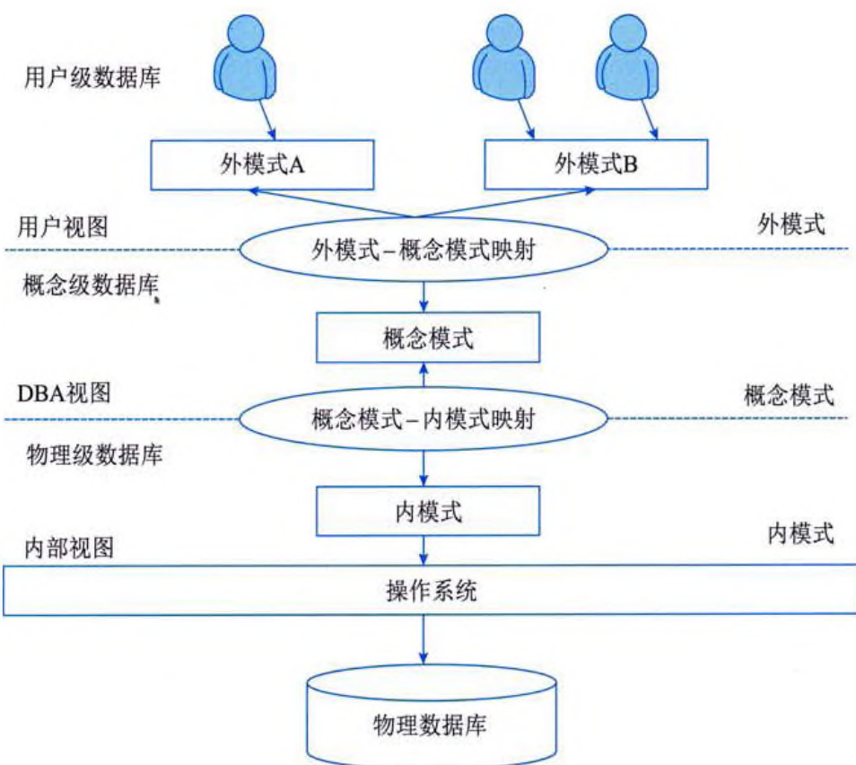  
图 5-1 数据库系统结构层次图  

外模式也称为子模式或用户模式，对应于用户级数据库。外模式用以描述用户（包括程序员和终端用户）看到或使用的那部分数据的逻辑结构，是数据库用户的数据视图，是与某一应用有关的数据的逻辑表示。用户根据外模式用数据操作语句或应用程序去操作数据库中的数据。外模式主要描述组成用户视图的各个记录的组成、相互关系、数据项的特征、数据的安全性和完整性约束条件。一个数据库可以有多个外模式，一个应用程序只能使用一个外模式。  

概念模式也称为模式或逻辑模式，对应于概念级数据库。概念模式是数据库中全体数据的逻辑结构和特征的描述，是所有用户的公共数据视图，用以描述现实世界中的实体及其性质与联系，定义记录、数据项、数据的完整性约束条件及记录之间的联系。概念模式通常还包含访问控制、保密定义和完整性检查等方面的内容，以及概念/物理之间的映射。一个数据库只有一个概念模式。  

内模式对应于物理级数据库，是数据物理结构和存储方式的描述，是数据在数据库内部的表示方式。内模式不同于物理层，它假设外存是一个无限的线性地址空间。内模式定义的是存储记录的类型、存储域的表示和存储记录的物理顺序，以及索引和存储路径等数据的存储组织。一个数据库只有一个内模式。  

在数据库系统的三级模式中，模式是数据库的中心与关键；内模式依赖于模式，独立于外模式和存储设备：外模式面向具体的应用，独立于内模式和存储设备：应用程序依赖于外模式，  
独立于模式和内模式。  

# 2. 两级独立性  

数据库系统的两级独立性是指物理独立性和逻辑独立性。三个抽象级别之间通过两级映射（外模式/模式映射和模式/内模式映射）进行相互转换，使得数据库的三级模式形成一个统一的整体。  

物理独立性是指用户的应用程序与存储在磁盘上的数据库中的数据是相互独立的，当数据的物理存储改变时，应用程序不需要改变。物理独立性存在于概念模式和内模式之间的映射转换，说明物理组织发生变化时应用程序的独立程度。  

逻辑独立性是指用户的应用程序与数据库中的逻辑结构是相互独立的，当数据的逻辑结构改变时，应用程序不需要改变。逻辑独立性存在于外模式和概念模式之间的映射转换，说明概念模式发生变化时应用程序的独立程度。相对来说，逻辑独立性比物理独立性更难实现。  

# 5.1.3 数据模型  

数据模型是现实世界数据特征的抽象。通过这种抽象，可以将现实世界的问题转化到计算机上进行分析与解决。数据模型所描述的内容包括3个部分，分别是数据结构、数据操作和数据约束。其中，数据结构主要描述数据的类型、内容、性质和数据间的联系等。数据结构是数据模型的基础，数据操作和数据约束都建立在数据结构上。不同的数据结构具有不同的操作和约束。数据操作主要描述在相应的数据结构上的操作类型和操作方式。数据约束主要描述数据结构内数据间的语法和词义联系、它们之间的制约和依存关系，以及数据动态变化的规则，以保证数据的正确、有效和相容。人们提出过很多种基本数据模型，其中最著名的有层次模型、网状模型、关系模型和面向对象模型。  

# 1. 层次模型  

层次模型是最早出现的数据模型，由于它采用了树状结构作为数据的组织方式，在这种结构中，每一个结点可以有多个孩子结点，但只能有一个双亲结点，这样，整体结构也是分层状的，所以称其为层次模型。层次模型数据库系统的典型代表是 IBM 公司的 IMS 数据库管理系统，该系统是 1968 年推出的，曾经作为大型商用数据库系统被广泛使用。  

# 2. 网状模型  

网状模型用有向图表示实体类型和实体之间的联系。网状模型的优点是记录之间的联系通过指针实现，多对多的联系容易实现，查询效率高；其缺点是编写应用程序比较复杂，程序员必须熟悉数据库的逻辑结构。由图和树的关系可知，层次模型是网状模型的一个特例。  

# 3. 关系模型  

关系模型用表格结构表达实体集，用外键表示实体之间的联系。关系模型建立在严格的数学概念基础上，概念单一、结构简单、清晰，用户易懂易用；存取路径对用户透明，从而数据独立性和安全性好，能简化数据库开发工作。其缺点主要是由于存取路径透明，查询效率往往不如非关系数据模型。  
 

关系模型是目前应用最广泛的一种数据模型，例如，Oracle、DB2、SQL Server、Sybase 和 MySQL 等都是关系数据库系统。  

# 4. 面向对象模型  

面向对象模型是用面向对象的观点来描述现实世界实体的逻辑组织、对象之间的限制和联系等的模型。目前，已有多种面向对象数据库产品，例如，ObjectStore、Versant Developer、Suite Poet 和 Objectivity 等，但其具体的应用并不多。目前主流的方式是在现有的关系模型数据库系统中增加对对象模型的支持，如 Oracle 等。  

# 5.2 关系数据库  

关系数据库是目前应用非常广泛的数据库之一，有一套完整的理论做支持。关系模型是关系数据库的基础，由关系数据结构、关系操作集合和关系完整性规则三部分组成。本节介绍关系模型的基本概念、关系代数和关系演算以及关系规范化理论方面的内容。  

# 5.2.1 关系的基本概念  

关系数据库应用数学方法来处理数据库中的数据。最早提出将这类方法用于数据处理的是 CODASYL（数据系统语言会议）于 1962 年发表的 “信息代数” 一文，之后 David Child 于 1968 年在 7090 机上实现了集合论数据结构，但系统而严格地提出关系模型的是美国 IBM 公司的 E.F.Codd。  

关系数据库中涉及的基本术语有:  

(1) 属性 (Attribute)。在现实世界中, 要描述一个事物常常取若干特征来表示, 这些特征称为属性。例如, 学生用学号、姓名、性别、系别、年龄、籍贯等属性来描述。  

(2) 域 (Domain)。每个属性的取值范围所对应的值的集合, 称为该属性的域。例如, 学号的域是 6 位整型数, 姓名的域是 10 位字符, 性别的域为 { 男, 女 } 等。一般在关系数据模型中, 对域还加了一个限制, 所有的域都应是原子数据 (Atomic Data)。例如, 整数、字符串是原子数据, 而集合、记录、数组是非原子数据。  

(3) 目或度 (Degree)。二维表关系 $R(D_{1}, D_{2}, \cdots D_{n})$ 中的 $R$ 表示关系的名字, $n$ 是关系的目或度。  

(4) 候选码 (Candidate Key)。若关系中的某一属性或属性组的值能唯一地标识一个元组,则称该属性或属性组为候选码。  

(5) 主码 (Primary Key)。或称主键, 若一个关系有多个候选码, 则选定其中一个为主码。  

(6) 主属性 (Prime Attribute)。包含在任何候选码中的属性称为主属性。不包含在任何候选码中的属性称为非主属性 (Nonprime Attribute)。  

(7) 外码 (Foreign Key)。如果关系模式 R 中的属性或属性组非该关系的码, 但它是其他关系的码, 那么该属性集对关系模式 R 而言是外码。例如, 客户与贷款之间的借贷联系 c-l (c-id, loan-no), 属性 c-id 是客户关系中的码, 所以 c-id 是外码: 属性 loan-no 是贷款关系中的码,  
所以 loan\-no 也是外码。  

(8) 全码 (All-key)。关系模型的所有属性组是这个关系模式的候选码, 称为全码。例如,关系模式 $R(T, C, S)$, 属性 $T$ 表示教师, 属性 $C$ 表示课程, 属性 $S$ 表示学生。假设一个教师可以讲授多门课程, 某门课程可以由多个教师讲授, 学生可以听不同教师讲授的不同课程, 那么, 要想区分关系中的每一个元组, 这个关系模式 $R$ 的码应为全属性 $T$、$C$ 和 $S$, 即 All-key。  

# 5.2.2 关系模型  

在关系模型中，实体以及实体间的联系都是用关系来表示的。在一个给定的现实世界领域中，所有实体及实体间的联系的关系的集合构成了一个关系数据库。关系的描述称为关系模式，关系模式通常可以简记为 $R(A_{1}, A_{2}, \cdots, A_{n})$，其中 $R$ 为关系名，$A_{1}$、$A_{2}$、$\cdots$、$A_{n}$ 为属性名。关系实际上就是关系模式在某一时刻的状态或内容。也就是说，关系模式是型，关系是它的值。关系模式是静态的、稳定的，而关系是动态的、随时间不断变化的，因为关系操作在不断地更新着数据库中的数据。但在实际应用中，通常将关系模式和关系统称为关系，读者可以从上下文中加以区别。  

# 1. 关系运算  

关系代数的基本运算主要有并、差、交、笛卡儿积、投影、选择、连接和除。  

(1) 并。计算两个关系在集合理论上的并集, 即给出关系 $R$ 和 $S$ (两者有相同元 / 列数), $R \cup S$ 的元组包括 $R$ 和 $S$ 所有元组的集合, 形式定义如下:  

$$
R \cup S \equiv \{ t \mid t \in R \vee t \in S \}
$$  

式中 $t$ 是元组变量（下同）。显然，$R\cup S=S\cup R$。  

(2) 差。计算两个关系的区别的集合, 即给出关系 $R$ 和 $S$ (两者有相同元 / 列数), $R-S$ 的元组包括 $R$ 中有而 $S$ 中没有的元组的集合, 形式定义如下:  

$$
R - S \equiv \{ t \mid t \in R \land t \notin S \}
$$  

(3) 交。计算两个关系集合理论上的交集, 即给出关系 $R$ 和 $S$ (两者有相同元 / 列数), $R \cap S$ 的元组包括 $R$ 和 $S$ 相同元组的集合, 形式定义如下:  

$$
R \cap S \equiv \{ t \mid t \in R \land t \in S \}
$$  

显然，$R\cap S=R-(R-S)$ 和 $R\cap S=S-(S-R)$ 成立。  

(4)笛卡儿积。计算两个关系的笛卡儿乘积, 令 $R$ 为有 $m$ 元的关系, $S$ 为有 $n$ 元的关系,则 $R \times S$ 是 $m+n$ 元的元组的集合, 其前 $m$ 个元素来自 $R$ 的一个元组, 而后 $n$ 个元素来自 $S$ 的一个元组。形成定义如下:  

$$
R \times S \equiv \{ t \, | \, t = < t _ { r } , t _ { c } > \land t _ { r } \in R \land t _ { c } \in S \}
$$  

若 $R$ 有 $u$ 个元组，$S$ 有 $v$ 个元组，则 $R \times S$ 有 $u \times v$ 个元组。  

(5) 投影。从一个关系中抽取指明的属性（列）。令 $R$ 为一个包含属性 $A$ 的关系，则  

$$
\pi _ { A } ( R ) \equiv \{ t [ A ] \mid t \in R \}
$$  

(6) 选择。从关系 $R$ 中抽取出满足给定限制条件的记录, 记作  
$$
\sigma _ { \nu } ( R ) \equiv \{ t \mid t \in R \land F ( t ) = \mathrm { t r u e } \}
$$  

其中，$F$ 表示选择条件，是一个逻辑表达式（逻辑运算符 + 算术表达式）。选择运算是从元组（行）的角度进行的运算。  

(7) 连接 (Join)。连接分为 $\theta$ 连接、等值连接和自然连接三种。  

- $\theta$ 连接。从两个关系的笛卡儿积中选取属性之间满足一定条件的元组，记作  

$$
R \triangleq S \equiv \{ t _ { r } t _ { s } \mid t _ { r } \in R \land t _ { s } \in S \land t _ { r } [ A ] \theta t _ { s } [ B ] \}
$$  

其中，$A$ 和 $B$ 分别为 $R$ 和 $S$ 上元数相等且可比的属性组。  

- 等值连接。当$\theta$为“=”时，称为等值连接，记作  

$$
R \triangleright _ { A = B } S \equiv \{ t _ { r } t _ { s } \mid t _ { r } \in R \land t _ { s } \in S \land t _ { r } [ A ] = t _ { s } [ B ] \}
$$  

- 自然连接。自然连接是一种特殊的等值连接，它要求两个关系中进行比较的分量必须是相同的属性组，并且在结果集中将重复属性列去掉。记作  

$$
R \not \gg S \equiv \{ t _ { r } , t _ { c } \mid t _ { r } \in R \wedge t _ { c } \in S \wedge t _ { r } [ A ] = t _ { c } [ B ] \}
$$  

(8)除。设有关系$R(X,Y)$与关系$S(Z)$，$Y$和$Z$具有相同的属性个数，且对应属性出自相同域。关系$R(X,Y)\div S(Z)$所得的商关系是关系$R$在属性$X$上投影的一个子集，该子集和$S(Z)$的笛卡儿积必须包含在$R(X,Y)$中，记为$R\div S$，其具体计算公式为  

$$
R \div S = \pi _ { 1 , 2 \ldots r - s } ( R ) - \pi _ { 1 , 2 \ldots r - s } ( ( \pi _ { 1 , 2 \ldots r - s } ( R ) \times S ) - R )
$$  

例如，有关系 $R$ 与关系 $S$ 如表 5-1 和表 5-2 所示。  

<table><tr><th>U1</th><th>U2</th><th>U3</th><th>U4</th></tr><tr><td>a</td><td>b</td><td>c</td><td>d</td></tr><tr><td>a</td><td>b</td><td>e</td><td>f</td></tr><tr><td>c</td><td>a</td><td>c</td><td>d</td></tr></table>  

<table><tr><td>U3</td><td>U4</td></tr><tr><td>c</td><td>d</td></tr><tr><td>e</td><td>f</td></tr></table>  

则$R\div S$的求解过程为：首先，按除运算定义要求，确定$X$，$Y$，$Z$属性集合。$Y$是关系$R$中的属性集合，$Z$是$S$中全部属性的集合，即$Z=\{U3，U4\}$，由于$Y=Z$，因此，$Y=\{U3，U4\}$，$X=\{U1，U2\}$。也就是说，$R\div S$结果集包含属性$U1$和$U2$。然后，将关系$R$的$U1$、$U2$（共有$<a$，$b$>、$<c$，$a$>两个元组）与关系$S$做笛卡儿积操作，结果如表5-3所示。  

<table><tr><td>U1</td><td>U2</td><td>U3</td><td>U4</td></tr><tr><td>a</td><td>b</td><td>c</td><td>d</td></tr><tr><td>a</td><td>b</td><td>e</td><td>f</td></tr><tr><td>c</td><td>a</td><td>c</td><td>d</td></tr><tr><td>c</td><td>a</td><td>e</td><td>f</td></tr></table>  

通过检查表 5-3, 可以发现元组 $<a, b>$ 与 $S(Z)$ 的笛卡儿积被包含在 $R(X, Y)$ 中, 而元组 $<c, a>$ 与 $S(Z)$ 的笛卡儿积有一个元组未被包含在 $R(X, Y)$ 中, 所以, 结果集中只有元组 $<a, b>$。  
# 2. 元组演算  

在元组演算中，元组演算表达式简称为元组表达式，其一般形式为 {t | P(t)}，其中，t 是元组变量，表示一个元数固定的元组；P(t) 是公式，在数理逻辑中也称为谓词，也就是计算机语言中的条件表达式。{t | P(t)} 表示满足公式 P 的所有元组 t 的集合。  

在元组表达式中，公式由原子公式组成，原子公式有下列两种形式:  

(1) $R(s)$, 其中 $R$ 是关系名, $s$ 是元组变量。其含义是 “$s$ 是关系 $R$ 的一个元组”。  

(2) $s[i]\theta u[j]$, 其中 $s$ 和 $u$ 是元组变量, $\theta$ 是算术比较运算符, $s[i]$ 和 $u[j]$ 分别是 $s$ 的第 $i$ 个分量和 $u$ 的第 $j$ 个分量。原子公式 $s[i]\theta u[j]$ 表示 “元组 $s$ 的第 $i$ 个分量与元组 $u$ 的第 $j$ 个分量之间满足 $\theta$ 运算”。例如, $t[2]<u[3]$ 表示元组 $t$ 的第 2 个分量小于元组 $u$ 的第 3 个分量。这个原子公式的一种简化形式是 $s[i]\theta a$ 或 $a\theta u[j]$, 其中 $a$ 为常量。例如, $t[4]=3$ 表示 $t$ 的第 4 个分量等于 3。  

在一个公式中，如果元组变量未用存在量词“$\exists$”或全称量词“$\forall$”等符号定义，那么称其为自由元组变量，否则称为约束元组变量。公式的递归定义如下:  

(1) 每个原子是一个公式, 其中的元组变量是自由变量。  

(2) 如果 $P_{1}$ 和 $P_{2}$ 是公式, 那么, $\neg P_{1}$、$P_{1} \vee P_{2}$、$P_{1} \wedge P_{2}$ 和 $P_{1} \rightarrow P_{2}$ 也是公式。  

(3) 如果 $P_1$ 是公式, 那么 $(\exists s)(P_1)$ 和 $(\forall s)(P_1)$ 也都是公式。  

(4) 公式中各种运算符的优先级从高到低依次为 $\theta$ 、 $\exists$ 和 $\forall$ 、 $\rightarrow$ 、 $\land$ 和 $\lor$ 、 $\rightarrow$ 。在公式外还可以加括号, 以改变上述优先顺序。  

(5)公式只能由上述4种形式构成, 除此之外构成的都不是公式。  

在元组演算的公式中，有下列4个等价的转换规则:  

(1) $P_{1} \wedge P_{2}$ 等价于 $\neg$ ($\neg P_{1} \vee \neg P_{2}$)。  

(2) $P_{1} \vee P_{2}$ 等价于 $\neg$ ($\neg P_{1} \wedge \neg P_{2}$)。  

(3) ($\forall\ s$)(P$_1(s)$) 等价于 $\neg$ ($\exists\ s$)($\neg P_1(s)$); ($\exists\ s$)(P$_1(s)$) 等价于 $\neg$ ($\forall\ s$)($\neg P_1(s)$)。  

(4) $P_{1} \rightarrow P_{2}$ 等价于 $-P_{1} \vee P_{2}$。  

关系代数表达式可以转换为元组表达式，例如，$R\cup S$可用$\{t|R(t)\vee S(t)\}$表示，$R-S$可用$\{t|R(t)\wedge S(t)\}$表示。  

# 5.2.3 规范化理论  

设有一个关系模式 $R(\text{SNAME}, \text{CNAME}, \text{TNAME}, \text{TADDRESS})$，其属性分别表示学生姓名、选修的课程名、任课教师姓名和任课教师地址。仔细分析一下，就会发现这个模式存在下列异常问题:  

(1)数据冗余。如果某门课程有100个学生选修, 那么在$R$的关系中就要出现100个元组, 这门课程的任课教师姓名和地址也随之重复出现100次。  

(2) 修改异常。由于上述冗余问题, 当需要修改这个教师的地址时, 就要修改 100 个元组中的地址值, 否则就会出现地址值不一致的现象。  

(3) 插入异常。如果不知道听课学生名单, 这个教师的任课情况和家庭地址就无法进入数据库, 否则就要在学生姓名处插入空值。  
 

(4)删除异常。如果某门课程的任课教师要更改, 那么原来任课教师的地址将随之丢失。  

因此，关系模式 $R$ 虽然只有 4 个属性，但却是性能很差的模式。产生这些异常的原因与关系模式属性值之间的联系直接相关。在关系模式 $R$ 中，学生与课程有直接联系，教师与课程有直接联系，而教师与学生无直接联系，这就产生了关系模式 $R$ 的异常问题。如果将 $R$ 分解成下列两个关系模式，即 $R1$ (SNAME, CNAME) 和 $R2$ (CNAME, TNAME, TADDRESS)，则能消除上述的存储异常现象。  

# 1. 函数依赖与键  

函数依赖是数据库的一种约束，决定了关系模式属于哪种范式。设$R(U)$是属性$U$上的一个关系模式，$X$和$Y$是$U$的子集，$r$为$R$的任一关系，如果对于$r$中的任意两个元组$u$、$v$，只要有$u[X]=v[X]$，就有$u[Y]=v[Y]$，则称$X$函数决定$Y$，或称$Y$函数依赖于$X$，记作$X\rightarrow Y$。例如，记录职工信息的属性有职工号（EMP_NO）、职工姓名（EMP_NMAE）和所在部门（DEPT），则EMP_NO函数决定EMP_NMAE和DEPT，或者说EMP_NMAE和DEPT函数依赖于EMP NO，记作EMP_NO$\rightarrow$EMP_NMAE和EMP NO$\rightarrow$DEPT。  

在$R(U)$中，如果$X\to Y$，并且对于$X$的任何一个真子集$X'$，都有$X'\to Y$不成立，则称$Y$对$X$完全函数依赖。若$X\to Y$，但$Y$不完全函数依赖于$X$，则称$Y$对$X$部分函数依赖。在$R(U)$中，如果$X\to Y$（$Y$不是$X$的真子集），且$Y\to X$不成立，$Y\to Z$，则称$Z$对$X$传递函数依赖。  

关系模式的键也称为码或关键字。在关系模式中，如果有$X\rightarrow U$在关系模式$R(U)$上成立，并且不存在$X$的任一真子集$X'$使$X'\rightarrow U$成立，那么称$X$是$R$的一个候选键。也就是说，$X$值唯一决定关系中的所有元组。在关系模式中，若有多个候选键，则选一个作为主键。如果两个关系拥有公共属性（集），且公共属性在一个关系中是主键，则称公共属性是另一个关系的外键。例如，记录职工信息的属性有职工号（EMP_NO）、职工身份证号（EMP/CardID）、职工姓名（EMP_NMAE）、职工性别（EMP SEX）和所在部门编号（DEPT_NO），则在此关系中，EMP_NO或EMP/cardID是候选键，也可以是本关系的主键。一个关系的候选键有多个，但主键只能有一个。通常在候选键中选一个作为主键。  

求关系模式的候选键是进行范式界定的基础，也是系统分析师应该掌握的基本技能。使用候选键的定义来求解一个简单关系模式的候选键尚能应对，但面对复杂一些的关系模式，这种方法就不管用了。在此，引入一种求候选键的快捷方法，即图示法。使用图示法求候选键，主要有两个步骤:  

(1) 将关系模式的函数依赖关系用有向图的方式表示, 其中顶点表示属性, 弧表示属性之间的依赖关系。  

(2) 找出入度为 0 的属性集, 并以该属性集为起点, 尝试遍历有向图, 若能正常遍历图中所有结点, 则该属性集即为关系模式的候选键; 若入度为 0 的属性集不能遍历图中所有结点, 则需要尝试性地将一些中间顶点 (既有入度, 也有出度的顶点) 并到入度为 0 的属性集中, 直至该集合能遍历所有顶点, 则该集合为候选键。  

例如，给定关系$R(A_{1},A_{2},A_{3},A_{4})$上的函数依赖集$F=\{A_{1}\rightarrow A_{2},A_{3}\rightarrow A_{2},A_{2}\rightarrow A_{3},$  
$A_{2} \rightarrow A_{4}\}$，现在要求 $R$ 的候选键。需要针对函数依赖集画出有向图，如图 5-2 所示。  

从图 5-2 中找出入度为 0 的顶点, 即 $A_{1}$。通过尝试, 可以发现从 $A_{1}$ 出发可以遍历所有顶点, 因此, $R$ 的候选键为 $A_{1}$。  

# 2. 范式  

为了设计一个好的数据库，人们定义了一些好的关系模式标准， 称它们为规范的关系模式或范式（Normal Form, NF）。目前共定义了 多个范式，分别为1NF、2NF、3NF、BCNF、4NF和5NF。但在实际 应用中，一般只要达到3NF。  

  
图 5-2 有向图  

(1) 第一范式 (INF)。在关系模式 $R$ 中, 当且仅当所有属性只包含原子值, 即每个分量都是不可再分的数据项, 则称 $R$ 满足 1NF。例如, 如表 5-4 所示的教师职称情况关系就不满足 1NF。原因在于, 该关系模式中的 “高级职称人数” 不是一个原子属性, 若将其拆分为 “教授” 和 “副教授” 两个属性, 则满足 1NF。  

<table><tr><td rowspan="2" colspan="1">系名称</td><td rowspan="1" colspan="3">高级职称人数</td></tr><tr><td>教授</td><td>副教授</td></tr><tr><td>计算机系</td><td>6</td><td>10</td></tr><tr><td>电子系</td><td>3</td><td>5</td></tr><tr></tr></table>  

(2) 第二范式 (2NF)。当且仅当关系模式 $R$ 满足 1NF, 且每个非键属性 (即不属于任何候选键的属性, 也称为非主属性) 完全依赖于候选键时, 则称 $R$ 满足 2NF。例如, 有选课关系模式 $SC$(Sno, Cno, Grade, Credit), 其中, (Sno, Cno) $\rightarrow$ Grade, Cno $\rightarrow$ Credit。因此, $SC$ 的候选键为 (Sno, Cno)。这样, Cno $\rightarrow$ Credit 就构成了 Credit 对候选键 (Sno, Cno) 的部分函数依赖。因此, $SC$ 不满足 2NF。若要将 $SC$ 转化为 2NF, 可以将它拆分为 $SC1$(Sno, Cno, Grade) 和 $SC2$(Cno, Credit)。  

(3) 第三范式 (3NF)。当且仅当关系模式 $R$ 满足 2NF, 且 $R$ 中消除了非键属性传递依赖于候选键时, 则称 $R$ 满足 3NF。例如, 学生关系 $S$ (Sno, Sname, Dno, Dname, Location) 的各属性分别代表学号、姓名、所在系、系名称和系地址, 其数据如表 5-5 所示。  

<table><tr><td>Sno</td><td>Sname </td><td>Dno</td><td>Dname</td><td>Location</td></tr><tr><td>S01</td><td>张三</td><td>D01</td><td>计算机系</td><td>1号楼</td></tr><tr><td>S02</td><td>李四</td><td>D01</td><td>计算机系</td><td>1号楼</td></tr><tr><td>S03</td><td>王五</td><td>D01</td><td>计算机系</td><td>1号楼</td></tr><tr><td>S04</td><td>赵六</td><td>D02</td><td>信息系</td><td>2号楼</td></tr><tr><td>...</td><td>...</td><td>...</td><td>...</td><td>...</td></tr></table>  
   

从各属性之间的联系可以判断出 $S$ 的函数依赖有 $\text{Sno} \rightarrow (\text{Sname}, \text{Dno}, \text{Dname}, \text{Location})$, $\text{Dno} \rightarrow (\text{Dname}, \text{Location})$。显然, $\text{Sno}$ 为候选键。在函数依赖中有 $\text{Sno} \rightarrow \text{Dno} \rightarrow \text{Dname}$ 与 $\text{Sno} \rightarrow \text{Dno} \rightarrow \text{Location}$, 这便是传递函数依赖。由于 $\text{Dname}$ 与 Location 为非键属性, 同时传递依赖于候选键, 因此, 关系模式 $S$ 不满足 3NF。若要使 $S$ 满足 3NF, 需要将其拆分为 $S1(\text{Sno}, \text{Sname}, \text{Dno})$ 和 $S2(\text{Dno}, \text{Dname}, \text{Location})$。  

  
图 5-3 关系模式 $P$ 的函数依赖图  

(4) BCNF。如果关系模式 $R$ 满足 1NF, 且 $R$ 中没有属性传递依赖于候选键时, 则称 $R$ 满足 BCNF。例如, 有关系模式 $P(C, S, T, R)$, 其函数依赖集 $F=\{C \rightarrow T, ST \rightarrow R, TR \rightarrow C\}$, 现在需要判断 $P$ 是否满足 BCNF。先画出相应的函数依赖图, 如图 5-3 所示。  

对图 5-3 进行分析, 可以得知, $P$ 的候选键有 $(S, T)$ 和 $(S, C)$, 键属性 (属于某个候选键的属性, 也称为主属性) 有 $S$、$T$ 和 $C$, 非键属性只有 $R$。但此时由于属性之间的联系错综复杂, 要界定关系模式是否存在传递函数依赖并不容易。为了准确地界定关系模式是否为 BCNF, 需  

要引入一些另外的判别方法。例如，一个BCNF的关系模式必须同时满足以下条件：所有非键属性对每个候选键都是完全函数依赖的，所有的键属性对每个不包含它的候选键也是完全函数依赖的；没有任何属性完全函数依赖于非键属性，即每个函数依赖的左部都必须包含候选键。在关系模式P中，由于有C→T，而C不包含候选键，因此，P不满足BCNF。  

(5) 第四范式 (4NF)。第四范式是 BCNF 的推广, 是针对有多值依赖的关系模型所定义的规范化形式。关系模式 $R(U,F)$ 满足 1NF, $X,Y$ 是 U 的非空子集, $Z=U-X-Y$ 也非空, 若任取一组值对 $(x,z)$, 都可决定一组 $y$ 值, 且此决定与 $z$ 值无关, 就称 $Y$ 多值依赖于 $X$, 记做 $X\rightarrow\rightarrow Y$。关系模式 $R$ 满足 1NF, 若对任一多值依赖 $X\rightarrow\rightarrow Y$, $X$ 必包含 $R$ 的候选键, 称 $R$ 满足 4NF。例如, 如表 5-6 所示的关系 $QY$(ypm, bm, sccj)。  

<table><tr><td>用品名（ypm）</td><td>部门（bm）</td><td>生产厂家（scj）</td></tr><tr><td>办公桌</td><td>生产经营部</td><td>美时办公用品公司</td></tr><tr><td>办公桌</td><td>总经理办公室</td><td>华鹤家具有限公</td></tr><tr><td>办公椅</td><td>生产经营部</td><td>美时办公用品公司</td></tr><tr><td>办公椅</td><td>经理办公室</td><td>华鹤家具有限公</td></tr><tr><td>办公椅</td><td>计划部</td><td>华鹤家具有限公</td></tr></table>  

表 5-6 是实际工作中常见的登记表, 抛开是否规范不说, 这样的登记表一目了然。但从规范化的角度来看, 对 ypm 的一个值, 不论 sccj 取什么值, 总有一组确定的 bm 与之对应, 所以有 ypm → hm。同样, 有 ypm → sccj。$QY$ 是全码关系 (即所有的属性合在一起形成候选键), 这说明 $QY$ 不满足 4NF。可用分解法消除不满足 4NF 的多值依赖, 解决办法是将 $QY$ 分解为 $QY1$(ypm, bm) 和 $QY2$(ypm, sccj)。  
# 3. 关系模式分解  

如果某关系模式存在修改异常等问题，则可通过分解该关系模式来解决问题。将一个关系模式分解成几个子关系模式，需要考虑的是该分解是否保持函数依赖，是否是无损联接。  

无损联接分解的形式定义如下：设$R$是一个关系模式，$F$是$R$上的一个函数依赖集。$R$分解成数据库模式$\delta=\{R_{1},\cdots,R_{k}\}$。如果对$R$中每个满足$F$的关系$r$都有下式成立:  

$$
r = \pi _ { R _ { 1 } } \left( r \right) \bowtie \pi _ { R _ { 2 } } \left( r \right) \bowtie \ldots \bowtie \pi _ { R _ { k } } \left( r \right)
$$  

则称分解 $\delta$ 相对于 $F$ 是无损联接分解，否则称为损失联接分解。  

要根据上述定义来判断一个分解是否是无损联接，这是一件很困难的事情，下面是一个很有用的无损联接分解判定定理：设$\rho=\{R_{1},R_{2}\}$是$R$的一个分解，$F$是$R$上的函数依赖集，那么分解$\rho$相对于$F$是无损联接分解的充要条件是$(R_{1}\cap R_{2})\rightarrow(R_{1}-R_{2})$或$(R_{1}\cap R_{2})\rightarrow(R_{2}-R_{1})$。要注意的是，这两个条件只要有任意一个条件成立就可以了。  

设数据库模式$\delta=\{R_{1},\cdots,R_{k}\}$是关系模式$R$的一个分解，$F$是$R$上的函数依赖集，$\delta$中每个模式$R_{i}$上的函数依赖集是$F_{i}$。如果$\{F_{1},F_{2},\cdots,F_{k}\}$与$F$是等价的（即相互逻辑蕴涵），则称分解$\delta$保持函数依赖。如果分解不能保持函数依赖，则$\delta$的实例上的值就可能有违反函数依赖的现象。  

# 5.3 数据库控制功能  

要想使数据库中的数据达到应用的要求，必须对其进行各种控制，这就是DBMS的控制功能，包括并发控制、性能优化、数据库的完整性和安全性，以及数据备份与恢复等。这些技术虽然给人们的感觉是边缘性技术，但对DBMS的应用而言却是至关重要的。  

# 5.3.1 并发控制  

在多用户共享系统中，许多事务可能同时对同一数据进行操作，称为并发操作。此时， DBMS 的并发控制子系统负责协调并发事务的执行，保证数据库的完整性不受破坏，同时，避免用户得到不正确的数据。  

# 1. 事务的基本概念  

DBMS 运行的基本工作单位是事务，事务是用户定义的一个数据库操作序列，这些操作序列要么全做，要么全不做，是一个不可分割的工作单位。事务具有以下特性:  

(1) 原子性 (Atomicity)。事务是数据库的逻辑工作单位, 事务的原子性保证事务包含的一组更新操作是原子不可分的, 也就是说, 这些操作是一个整体, 不能部分地完成。  

(2) 一致性 (Consistency)。一致性是指使数据库从一个一致性状态变到另一个一致性状态。例如, 在转账的操作中, 各账户金额必须平衡。一致性与原子性是密切相关的, 一致性在逻辑上不是独立的, 它由事务的隔离性来表示。  

(3) 隔离性 (Isolation)。隔离性是指一个事务的执行不能被其他事务干扰, 即一个事务内  
部的操作及使用的数据对并发的其他事务是隔离的，并发执行的各个事务之间不能互相干扰。 它要求即使有多个事务并发执行，但看上去每个事务是按串行调度执行一样。这一性质也称为 可串行性，也就是说，系统允许的任何交错操作调度等价于一个串行调度。  

(4) 持久性 (Durability)。持久性也称为永久性, 是指事务一旦提交, 改变就是永久性的,无论发生何种故障, 都不应该对其有任何影响。  

事务的原子性、一致性、隔离性和持久性通常统称为 ACID 特性。  

# 2. 数据不一致问题  

数据库的并发操作会带来一些数据不一致问题，例如，丢失修改、读“脏数据”和不可重复读等。  

(1) 丢失修改。事务A与事务B从数据库中读入同一数据并修改，事务B的提交结果破坏了事务A提交的结果，导致事务A的修改被丢失。例如，有T1、T2两个事务，其执行顺序如表5-7所示，则“③A=A-5，写回”操作会被“④A=A-8，写回”操作覆盖掉，“③A=A-5，写回”将不起任何作用。  

<table><tr><td>T1</td><td>T2</td></tr><tr><td>①读A=10 ②</td><td>读A=10</td></tr><tr><td>③A=A-5，写回 ④</td><td>A=A-8，写回</td></tr></table>  

(2) 读 “脏数据”。事务 A 修改某一数据, 并将其写回磁盘, 事务 B 读取同一数据后, 事务 A 由于某种原因被撤销, 这时事务 A 已修改过的数据恢复原值, 事务 B 读到的数据就与数据库中的数据不一致, 是不正确的数据, 称为 “脏数据”。例如, 有 T1、T2 两个事务, 其执行顺序如表 5-8 所示, 则 T2 中 “读 A=70” 就是读的 “脏数据”。  

<table><tr><td>T1</td><td>T2</td></tr><tr><td>①读A=20 A=A+50 写回70 ② ③ ROLLBACK A恢复为20</td><td>读A=70</td></tr></table>  

(3) 不可重复读。不可重复读是指事务A读取数据后, 事务B执行了更新操作, 事务A使用的仍是更新前的值, 造成了数据不一致性。例如, 有T1、T2两个事务, 其执行顺序如表5-9所示。  
<table><tr><td>T1</td><td>T2</td></tr><tr><td>①读A=20 读B=30 求和=50 ②</td><td rowspan="3">读A=20 A=A+50 写A=70</td></tr><tr><td>③读A=70 读B=30 求和=100 (验算不对)</td></tr><tr><td></td></tr></table>  

在表 5-9 中, T1 事务为了确保其重要计算无误, 所以采用了验算的方式, 两次独立取出数据并运算, 最后进行验算 (即比较两次运算结果是否相同)。在此处, 虽然两次计算都没错, 但由于在两次操作之间的时间间隔中, T2 对数据进行了修改, 导致验算结果不正确, 这就是不可重复读问题。  

# 3. 封锁协议  

处理并发控制的主要方法是采用封锁技术，主要有两种封锁，分别是X封锁和S封锁。  

(1) 排他型封锁 (X 封锁)。如果事务 T 对数据对象 A（可以是数据项、元组和数据集，以至整个数据库）实现了 X 封锁，那么只允许事务 T 读取和修改数据 A，其他事务要等事务 T 解除 X 封锁以后，才能对数据 A 实现任何类型的封锁。可见，X 封锁只允许一个事务独锁某个数据，具有排他性。  

(2) 共享型封锁 (S 封锁)。X 封锁只允许一个事务独锁和使用数据, 要求太严, 需要适当从宽。例如, 可以允许并发读, 但不允许修改, 这就产生了 S 封锁的概念。S 封锁的含义是, 如果事务 T 对数据 A 实现了 S 封锁, 那么允许事务 T 读取数据 A, 但不能修改数据 A, 在所有 S 封锁解除之前, 决不允许任何事务对数据 A 实现 X 封锁。  

在多个事务并发执行的系统中，主要采取封锁协议来进行处理。常见的封锁协议如下:  

(1) 一级封锁协议。事务 T 在修改数据 R 之前必须先对其加 X 锁, 直到事务结束才释放。一级封锁协议可防止丢失修改, 并保证事务 T 是可恢复的, 但不能保证可重复读和不读 “脏数据”。  

(2) 二级封锁协议。一级封锁协议加上事务 T 在读取数据 R 之前先对其加 S 锁, 读完后即可释放 S 锁。二级封锁协议可防止丢失修改, 还可防止读 “脏数据”, 但不能保证可重复读。  

(3) 三级封锁协议。一级封锁协议加上事务 T 在读取数据 R 之前先对其加 S 锁, 直到事务结束才释放。三级封锁协议可防止丢失修改、读 “脏数据”, 且能保证可重复读。  

(4) 两段锁协议。所有事务必须分两个阶段对数据项加锁和解锁。其中, 扩展阶段是在对任何数据进行读、写操作之前, 首先要申请并获得对该数据的封锁; 收缩阶段是在释放一个封锁之后, 事务不能再申请和获得任何其他封锁。若并发执行的所有事务均遵守两段锁协议, 则  
 

对这些事务的任何并发调度策略都是可串行化的。遵守两段锁协议的事务可能发生死锁。  

显然, 使用封锁技术来解决并发控制问题存在一个封锁粒度问题。所谓封锁粒度, 是指被封锁数据对象的大小, 在关系数据库中封锁粒度有属性值、属性值集、元组、关系、某索引项 (或整个索引)、整个关系数据库、物理页 (块) 等几种。封锁粒度小则并发性高, 但开销大; 封锁粒度大则并发性低, 但开销小。综合平衡照顾不同需求, 以合理选取适当的封锁粒度是很重要的。  

# 4. 死锁问题  

采用封锁的方法虽然可以有效防止数据的不一致性，但封锁本身也会产生一些麻烦，最主要的就是死锁问题。死锁是指多个用户申请不同封锁，由于申请者均拥有一部分封锁权，而又需等待其他用户拥有的部分封锁而引起的永无休止的等待。  

# 5.3.2 数据库的完整性  

数据库的完整性是指数据库中数据的正确性和相容性。数据库的完整性由各种各样的完整性约束来保证，完整性约束可以通过 DBMS 或应用程序来实现，基于 DBMS 的完整性约束作为关系模式的一部分存入数据库中。  

# 1. 完整性约束条件  

完整性约束条件是指对数据库中数据本身的某些语法或语义限制、数据之间的逻辑约束, 以及数据变化时应遵守的规则等。所有这些约束条件一般均以谓词逻辑形式表示, 即以具有真假值的原子公式和命题连接词（并且、或者、否则）所组成的逻辑公式表示。完整性约束条件的作用对象可以是关系、元组或属性三种。数据的完整性约束条件一般在关系模式中给出, 并在运行时做检查, 当不满足条件时立即向用户通报, 以便采取措施。  

数据库中数据的语法、语义限制与数据之间的逻辑约束称为静态约束，它反映了数据及其之间的固有逻辑特性，是最重要的一类完整性约束。静态约束包括静态属性级约束（对数据类型的约束、对数据格式的约束、对取值范围或取值集合的约束、对空值的约束以及其他约束）、静态元组约束和静态关系约束（实体完整性约束、参照完整性约束、函数依赖约束、统计约束）。  

数据库中的数据变化应遵守的规则称为数据动态约束，它反映了数据库状态变迁的约束。动态约束包括动态属性级约束（修改属性定义时的约束、修改属性值时的约束）、动态元组约束和动态关系约束。  

完整性控制机制应该具有定义功能和检查功能，定义功能提供定义完整性约束条件的机制，检查功能检查用户发出的操作请求是否违背了完整性约束条件。如果发现用户的操作请求违背了约束条件，则采取一定的动作来保证数据的完整性。  

# 2. 实体完整性  

实体完整性要求主键中的任一属性不能为空，所谓空值是“不知道”或“无意义”的值。之所以要保证实体完整性，主要是因为在关系中，每个元组的区分是依据主键值的不同，若主  
键值取空值，则不能标明该元组的存在。例如，对于学生关系 S(Sno, Sname, Ssex)，其主键为 Sno，在插入某个元组时，就必须要求 Sno 不能为空。更加严格的 DBMS 还要求 Sno 不能与已经存在的某个元组的 Sno 相同。  

# 3. 参照完整性  

若基本关系R中含有与另一基本关系S的主键PK相对应的属性组FK（FK称为R的外键），则参照完整性要求，对R中的每个元组在FK上的值必须是S中某个元组的PK值，或者为空值。参照完整性的合理性在于，R中的外键只能对S中的主键引用，不能是S中主键没有的值。例如，对于学生关系S（Sno，Sname，Ssex）和选课关系C（Sno，Cno，Grade）两个关系，C中的Sno是外键，它是S的主键，若C中出现了某个S中没有的Sno，即某个学生还没有注册，却已有了选课记录，这显然是不合理的。  

# 4. 用户定义的完整性  

实体完整性和参照完整性适用于任何关系型 DBMS。除此之外，不同的数据库系统根据其应用环境的不同，往往还需要一些特殊的约束条件。用户定义的完整性就是针对某一具体数据库的约束条件，反映某一具体应用所涉及的数据必须满足的语义要求。  

如果在一条语句执行完后立即检查，称为立即执行约束；如果在整个事务执行结束后进行检查，则称延迟执行约束。完整性规则的五元组表示为$(D, O, A, C, P)$，其中，$D$表示约束作用的数据对象，$O$表示触发完整性检查的数据库操作，$A$表示数据对象必须满足的断言或语义约束，$C$表示选择$A$作用的数据对象值的谓词，$P$表示违反完整性规则时触发的过程。  

# 5. 触发器  

触发器是在关系型DBMS中应用得比较多的一种完整性保护措施，其功能比完整性约束要强得多。一般而言，在完整性约束功能中，当系统检查出数据中有违反完整性约束条件时，仅给出必要提示以通知用户。而触发器的功能则不仅起到提示作用，还会引起系统自动进行某些操作，以消除违反完整性约束条件所引起的负面影响。  

所谓触发器, 其抽象的含义是一个事件的发生必然触发 (或导致) 另外一些事件的发生,其中, 前面的事件称为触发事件, 后面的事件称为结果事件。触发事件一般即为完整性约束条件的否定, 而结果事件即为一组操作, 用以消除触发事件所引起的不良影响。目前, 数据库中的事件一般表示为数据的插入、修改、删除等操作。触发器除了有完整性保护功能外, 还有安全性保护功能。  

# 5.3.3 数据库的安全性  

就整个信息系统的安全而言，数据的安全是最重要的。数据库系统的安全性在技术上依赖于两种方式：一种是 DBMS 本身提供的用户身份识别、视图、使用权限控制和审计等管理措施，大型 DBMS 均有此功能；另一种就是靠应用程序来实现对数据库访问进行控制和管理，也就是说，数据的安全控制由应用程序里面的代码来实现。目前，一些大型 DBMS 都提供了一些技术手段来保证数据的安全，如表 5-10 所示。  
 

<table><tr><td>措施</td><td>说明</td></tr><tr><td>用户标识和鉴别</td><td>最外层的安全保护措施，可以使用用户账户、口令和随机数检验等方式</td></tr><tr><td>存取控制（数据授权）</td><td>对用户进行授权，包括操作类型（例如，查找、更新或删除等）和数据对象 的权限</td></tr><tr><td>密码存储和传输</td><td>对远程终端信息用密码传输</td></tr><tr><td>视图的保护</td><td>通过视图的方式进行授权</td></tr><tr><td>审计</td><td>使用一个专用文件或数据库，自动将用户对数据库的所有操作记录下来</td></tr></table>  

下面主要介绍用户标识和鉴别、数据授权、视图以及审计与跟踪等措施。  

# 1. 用户标识和鉴别  

用户的身份认证是用户使用 DBMS 系统的第一个环节，是系统提供的最外层保护。进行用户标识和鉴别的常用方式有口令认证和强身份认证。  

强身份认证指的是在网络环境下，客户端到DBMS服务器可能经过多个环节，在身份认证期间，用户的信息和口令可能会经过很多不安全的节点（例如，路由器和服务器）而被信息的窃听者窃取。强身份认证过程使认证可以结合信息安全领域一些更深入的技术保障措施，来强化用户身份的鉴别，例如，可以与数字证书、智能卡和用户指纹识别等多种身份识别技术相结合。  

# 2. 数据授权  

当用户通过身份认证以后，并不是所有的用户都能操作所有的数据，要分不同的用户角色 来区别对待，例如，普通用户只能查看自己的个人信息，而DBA 则可以查看所有用户的信息。 要达到这一效果，需要对不同用户角色进行不同级别的数据授权。  

一般可以将权限角色分为三类：数据库登录权限类、资源管理权限类和 DBA 权限类。不同的 DBMS 可能对用户角色的定义不尽相同，权限划分的细致程度也远超过上面三种基本的类型。同一类功能操作权限的用户，对数据库中的数据对象管理和使用的范围也可能是不同的，因此，DBMS 除了要提供基于功能角色的操作权限控制外，还提供对数据对象的访问控制，访问控制可以根据对控制用户访问数据对象的范围（或称粒度）从大到小分为 4 个层次，分别是数据库级、关系级、元组级和属性级。  

# 3. 视图  

视图可以被看成是虚拟关系或存储查询，可通过视图访问的数据不作为独特的对象存储在数据库内，数据库内存储的是 SELECT 语句。SELECT 语句的结果集构成视图所返回的虚拟关系。用户可以用引用关系所使用的方法，在 SOL 语句中通过引用视图名称来使用虚拟关系。  

# 4. 审计与跟踪  

如果身份认证是一种事前的防范措施，审计则是一种事后监督的手段。跟踪也是DBMS提供的监视用户动作的功能，然而，审计和跟踪是两个不同的概念，主要是两者的目的不同。跟  
踪主要是满足系统调试的需要，捕捉到的用户行为记录往往只用于分析，而并不长久地保存，而审计作为一种安全检查的措施，会将系统的运行状况和用户访问数据库的行为以日志形式记录并保存下来，这种日志往往作为稽查用户行为的一种证据。  

# 5.3.4 备份与恢复技术  

前面详细介绍了保证数据库安全性的技术和措施，但不管用多么高明的手段，总是难以避免安全事故的发生。安全事故的发生有可能是由于人为因素，也可能是由于硬件设备的故障，甚至是自然灾害。因此，需要备份与恢复技术来进一步保障数据的安全，即当数据被破坏后，在一定时间内将数据库调整到破坏前的状态。  

数据库备份有多种分类方式。按备份的实现方式，可分为物理备份与逻辑备份，而物理备份又可以分为冷备份与热备份。按备份的数据量情况，可分为完全备份、增量备份与差异备份。其中，完全备份是指将整个数据库中的数据进行备份；增量备份是指备份上一次备份（包括完全备份、增量备份和差异备份）后发生变化的数据；差异备份是指备份上一次完全备份后发生变化的所有数据。由于备份方式存在多样性，因此，制定一个合适的可操作的备份和恢复策略至关重要，其基本原则是保证数据丢失得尽量少或完全不丢失，且备份和恢复时间尽量短，保证系统最大的可用性。  

# 1. 物理备份  

物理备份是在操作系统层面上对数据库的数据文件进行备份，可分为冷备份和热备份两种。冷备份也称为静态备份，是将数据库正常关闭，在停止状态下，将数据库的文件全部备份（复制）下来。当数据库发生故障时，将数据文件复制回来进行恢复。冷备份是数据库备份中最快和最安全的方法。热备份也称为动态备份，是利用备份软件，在数据库正常运行的状态下，将数据库中的数据文件备份下来。冷备份与热备份的优缺点如表 5-11 所示。  

<table><tr><th>备份方式</th><th>优点</th><th>缺点</th></tr><tr><td>冷备份</td><td>非常快速的备份方法(只需复制文件);容易归档(简单复制即可);容易恢复到某个时间点上(只需将文件再复制回去);能与归档方法相结合,做数据库“最佳状态”的恢复;低度维护,高度安全</td><td>单独使用时,只能提供到某一时间点上的恢复;在实施备份的全过程中,数据库必须要做备份而不能做其他工作;若磁盘空间有限,只能复制到磁带等其他外部存储设备上,速度会很慢;不能按表或按用户恢复</td></tr><tr><td>热备份</td><td>可在表空间或数据库文件级备份,备份的时间短;备份时数据库仍可使用;可达到秒级恢复(恢复到某一时间点上);可对几乎所有数据库实体做恢复;恢复是快速的</td><td>不能出错,否则后果严重;若热备份不成功,所得结果不可用于时间点的恢复;因难于维护,所以要特别小心,不允许“以失败告终”</td></tr></table>  

为了提高物理备份的效率，通常将完全备份、增量备份和差异备份三种备份方式相组合。一般来说，一个备份周期通常由一个完全备份和多个增量、差异备份组成。由于增量备份或差异备份导出的数据少，所需要的时间也较少。  
 

# 2. 逻辑备份  

逻辑备份是指利用 DBMS 自带的工具软件备份和恢复数据库的内容, 例如, Oracle 的导出工具为 exp, 导入工具为 imp, 可以按照表、表空间、用户和全库 4 个层次备份和恢复数据; Sybase 的全库备份命令是 dump database, 全库恢复命令是 load database, 还可利用 BCP 命令来备份和恢复指定表。  

在数据库容量不大的情况下，逻辑备份是一个非常有效的手段，既简单又方便。但随着数据量越来越大，甚至高达TB级，利用逻辑备份来恢复数据库已力不从心，速度很慢。针对大型数据库的备份和恢复，一般结合磁带库或光盘库，采用物理备份方式。  

# 3. 日志文件  

事务日志是针对数据库改变所做的记录，它可以记录针对数据库的任何操作，并将记录结果保存在独立的文件中。这种文件就称为日志文件。对于任何一个事务，事务日志都有非常全面的记录，根据这些记录可以将数据文件恢复成事务前的状态。从事务动作开始，事务日志就处于记录状态，事务执行过程中对数据库的任何操作都记录在内，直到用户提交或回滚后才结束记录。  

日志文件是用来记录对数据库每一次更新活动的文件，在热备份方式中，必须建立日志文件，后援副本和日志文件综合起来才能有效地恢复数据库；在冷备份方式中，也可以建立日志文件，当数据库毁坏后，可重新装入后援副本，将数据库恢复到备份结束时刻的正确状态，然后利用日志文件，将已完成的事务进行重做处理，对故障发生时尚未完成的事务进行撤销处理。这样，不必重新运行那些已完成的事务程序就可将数据库恢复到故障前某一时刻的正确状态。  

事务在运行过程中，系统将事务开始、事务结束（包括 COMMIT 和 ROLLBACK），以及对数据库的插入、删除和修改等每个操作作为一个登记记录存放到日志文件中。每个记录包括的主要内容有执行操作的事务标识、操作类型、更新前数据的旧值（对插入操作而言此项为空值）、更新后的新值（对删除操作而言此项为空值）。登记的次序严格按并行事务操作执行的时间次序，同时遵循“先写日志文件”的规则。写一个修改到数据库中和写一个表示这个修改的日志记录到日志文件中是两个不同的操作，有可能在这两个操作之间发生故障，即这两个写操作只完成了一个，如果先写了数据库修改，而在日志记录中没有登记这个修改，则以后就无法恢复这个修改了。因此，为了安全，应该先写日志文件，即首先将修改记录写到日志文件上，然后再写数据库的修改。  

# 4. 数据恢复  

将数据库从错误状态恢复到某一个已知的正确状态的功能，称为数据库的恢复。数据恢复的基本原理就是冗余，建立冗余的方法有数据备份和登录日志文件等。可根据故障的不同类型，采用不同的恢复策略。  

(1) 事务故障的恢复。事务故障的恢复是由系统自动完成的, 对用户是透明的 (不需要 DBA 的参与)。其步骤如下: 反向扫描日志文件, 查找该事务的更新操作; 对该事务的更新操作执行逆操作; 继续反向扫描日志文件, 查找该事务的其他更新操作, 并做同样的处理; 如此处理下去, 直至读到此事务的开始标记, 事务故障恢复完成。  
(2) 系统故障的恢复。系统故障的恢复在系统重新启动时自动完成, 不需要用户干预。其步骤如下: 正向扫描日志文件, 找出在故障发生前已经提交的事务, 将其事务标识记入重做(Redo)队列。同时找出故障发生时尚未完成的事务, 将其事务标识记入撤销(Undo)队列。对撤销队列中的各个事务进行撤销处理: 反向扫描日志文件, 对每个Undo 事务的更新操作执行逆操作。对重做队列中的各个事务进行重做处理: 正向扫描日志文件, 对每个Redo 事务重新执行日志文件登记的操作。  

(3) 介质故障与病毒破坏的恢复。介质故障与病毒破坏的恢复步骤如下: 装入最新的数据库后援副本, 使数据库恢复到最近一次备份时的一致性状态; 从故障点开始反向扫描日志文件,找出已提交事务标识并记入 Redo 队列; 从起始点开始正向扫描日志文件, 根据 Redo 队列中的记录, 重做已完成的任务, 将数据库恢复至故障前某一时刻的一致状态。  

(4) 有检查点的恢复技术。检查点记录的内容可包括建立检查点时刻所有正在执行的事务清单, 以及这些事务最近一个日志记录的地址。采用检查点的恢复步骤如下: 从重新开始文件中找到最后一个检查点记录在日志文件中的地址, 由该地址在日志文件中找到最后一个检查点记录; 由该检查点记录得到检查点建立时所有正在执行的事务清单队列 (A); 建立重做队列 (R) 和撤销队列 (U), 将 A 队列放入 U 队列中, R 队列为空; 从检查点开始正向扫描日志文件, 若有新开始的事务 T1, 则将 T1 放入 U 队列, 若有提交的事务 T2, 则将 T2 从 U 队列移到 R 队列, 直至日志文件结束; 对 U 队列的每个事务执行 Undo 操作, 对 R 队列的每个事务执行 Redo 操作。  

# 5.3.5 数据库性能优化  

通常，对一个集中式数据库的性能进行优化，可以从硬件升级、数据库设计、索引优化策略和查询优化等方面入手。  

# 1. 硬件升级  

要提升数据库的运行速度，最直接的方式就是硬件升级，涉及的硬件包括处理器、内存、磁盘子系统和网络。  

处理器的升级主要可以考虑用更高频率的处理器代替现有频率较低的处理器，也可以将单 处理器的计算机系统升级为多处理器系统。  

内存的升级主要是容量的扩充，当容量扩充以后，数据库服务器可以将更多的数据保存在缓冲区，以减少磁盘 I/O 操作，从而提升数据库的整体性能。  

磁盘子系统的性能提升主要体现在两个方面：第一，采用高速磁盘系统替代速度较低的磁盘系统，以减少读盘等待时间，提高响应速度；第二，合理分布磁盘 I/O 到多个设备上，以减少资源竞争，提高并行操作能力。  

网络方面的升级主要是对带宽的升级。  

# 2. 数据库设计  

在数据库设计阶段就可以着手考虑性能优化问题。对数据库进行设计优化，主要可以从逻辑设计和物理设计两个方面入手。  

根据前面的介绍，数据库的规范化程度越高，数据库中的冗余信息就越少。然而，规范化  
同时又引入了新的问题，规范化使得关系模式不断被拆解，这样关系模式之间的结构变得越来越复杂，在使用数据时频繁执行连接操作，而连接操作是最耗时的，是数据库性能的制约因素。因此，从某种意义上来说，非规范化（反规范化）可以改善系统的性能。在进行数据库设计时，可以考虑合理增加冗余属性，以提升系统性能，常用的措施如下:  

(1) 将常用的计算属性（例如，总计和最大值等）存储到数据库实体中。  

(2) 重新定义实体, 以减少外部属性数据或行数据的开支。  

(3) 将关系进行水平或垂直分割, 以提升并行访问度。  

数据库逻辑结构的设计固然重要, 但物理设计也不可忽视, 将数据放在不同的物理位置,有时能对性能提升起到非常关键的作用。例如, 可以遵循以下准则:  

(1) 与每个属性相关的数据类型应该反映数据所需的最小存储空间, 特别是对于被索引的属性更是如此。例如, 能使用 smallint 类型的就不要用 integer 类型, 这样, 索引字段可以被更快地读取, 而且可以在一个数据页上放置更多的数据行, 就相应地减少了 I/O 操作。  

(2) 将一个频繁使用的关系模式分割开, 并放在两个单独的智能型磁盘控制器的数据库设备上, 这样也可以提高性能。因为有多个磁头在查找, 数据分离也能提高性能。  

(3) 将数据库中文本或图像属性的数据存放在一个单独的物理设备上, 也可以提高性能。如果使用专用的智能型控制器, 就能进一步提高性能。  

# 3. 索引优化策略  

索引是提高数据库查询速度的利器，而数据库查询往往是数据库系统中最频繁的操作，因此，索引的建立与选择对数据库性能优化具有重大意义。索引的建立与选择可遵循以下准则:  

(1) 建立索引时, 应选用经常作为查询, 而不常更新的属性。避免对一个经常被更新的属性建立索引, 因为这样会严重影响性能。  

(2) 一个关系上的索引过多会影响 UPDATE、INSERT 和 DELETE 的性能, 因为关系一旦进行更新, 所有的索引都必须跟着做相应的调整。  

(3) 尽量分析出每个重要查询的使用频率, 这样可以找出使用最多的索引, 然后可以先对这些索引进行适当的优化。  

(4) 对于数据量非常小的关系不必建立索引, 因为对于数据量小的关系而言, 关系扫描往往更快, 而且消耗的系统资源更少。  

# 4.查询优化  

查询优化也称为应用程序优化，它是数据库性能优化的最后一个环节，同时也是最重要的 一个环节。查询语句的构造不当，会使之前的优化功亏一簧。SQL 语句优化的策略很多，例如， 建立物化视图或尽可能减少多表查询；以不相干子查询替代相干子查询；只检索需要的属性； 用带 IN 的条件子句等价替换 OR 子句：经常提交（COMMIT），以尽早释放锁等。  

# 5.4 数据库设计与建模  

数据库设计是指对一个给定的应用环境，提供一个确定最优的数据模型与处理模式的逻辑  
设计，以及一个确定数据库存储结构与存取方法的物理设计，建立起能反映现实世界信息和信息联系及满足用户数据要求和加工要求，以能够被某个 DBMS 所接受，同时能实现系统目标，并有效存取数据的数据库。  

# 5.4.1 数据库设计阶段  

基于数据库系统生命周期的数据库设计可分为如下5个阶段：规划、需求分析、概念设计、逻辑设计和物理设计。  

# 1. 规划  

规划阶段的主要任务是进行建立数据库的必要性及可行性分析，确定数据库系统在企业和信息系统中的地位，以及各个数据库之间的联系。有关系统规划方面的知识将在第10章中详细介绍。  

# 2. 需求分析  

需求分析的目标是通过调查研究，了解用户的数据和处理要求，并按一定格式整理成需求说明书。需求说明书包括数据库所涉及的数据、数据的特征、使用频率和数据量的估计，例如，数据名、属性及其类型、主键属性、保密要求、完整性约束条件、更改要求、使用频率和数据量估计等。这些关于数据的数据称为元数据。在设计大型数据库时，这些数据通常由数据字典来管理。用数据字典管理元数据，有利于避免数据的重复或重名，以保持数据的一致性。同时，有利于提高数据库设计的质量，减轻设计者的负担。有关需求分析的知识将在第11章中详细介绍。  

# 3. 概念设计  

概念设计也称为概念结构设计，其任务是在需求分析阶段产生的需求说明书的基础上，按照特定的方法将它们抽象为一个不依赖于任何DBMS的数据模型，即概念模型。概念模型使设计人员的注意力能够从复杂的实现细节中解脱出来，而只集中在最重要的数据的组织结构和处理模式上。为保证所设计的概念模型能正确、完全地反映用户的数据及其相互关系，便于进行所要求的各种处理，在概念设计阶段可邀请用户参与。  

在进行概念设计时，可先设计各个应用的视图，即各个应用所看到的数据及其结构，然后再进行视图集成，以形成一个单一的概念数据模型。  

# 4. 逻辑设计  

逻辑设计也称为逻辑结构设计，其任务是将概念模型转化为某个特定的 DBMS 上的逻辑模型。设计逻辑结构时，首先为概念模型选定一个合适的逻辑模型（例如，关系模型、网状模型或层次模型），然后将其转化为由特定 DBMS 支持的逻辑模型，最后对逻辑模型进行优化。  

逻辑设计的目的是将概念设计阶段设计好的 E-R 图转换为与选用的具体机器上的 DBMS 所支持的数据模型相符合的逻辑结构。  

# 5. 物理设计  

物理设计也称为物理结构设计，其任务是对给定的逻辑模型选取一个最适合应用环境的物  
理结构，所谓数据库的物理结构，主要是指数据库在物理设备上的存储结构和存取方法。物理设计的步骤如下:  

(1) 设计存储记录结构, 包括记录的组成、数据项的类型和长度, 以及逻辑记录到存储记录的映射。  

(2) 确定数据存储安排。  

(3) 设计访问方法, 为存储在物理设备上的数据提供存储和检索的能力。  

(4) 进行完整性和安全性的分析与设计。  

(5) 数据库程序设计。  

# 5.4.2 实体联系模型  

E-R 模型也称为 E-R 图，它是描述概念世界、建立概念模型的实用工具。在 E-R 图中，主要包括以下三个要素:  

(1) 实体 (型)。实体用矩形框表示, 框内标注实体名称。  

(2)属性。单值属性用椭圆形表示，并用连线与实体连接起来；如果是多值属性，在椭圆形虚线外面再套实线椭圆；如果是派生属性，则用虚线椭圆表示。其中，多值属性可以有一个或两个以上的值，例如，学员信息数据库中可能包含关于他们个人兴趣的数据，一个学员可能有运动、电影、投资和烹饪等多个兴趣；派生属性是从基本属性计算出来的属性，例如，学员的总成绩和平均成绩等。  

(3) 实体之间的联系。实体之间的联系用菱形框表示, 框内标注联系名称, 并用连线将菱形框分别与有关实体相连, 并在连线上注明联系类型。  

例如，图 5-4 就是某在线教育平台系统的一个 E-R 图（为了简单起见，省略了部分实体的属性和联系的属性）。  

  
图 5-4 某在线教育平台系统的 E-R 图  
# 1. 联系的类型  

E-R 图中的联系可以归结为三种类型，分别是一对一联系、一对多联系和多对多联系。  

(1) 一对一联系 (1:1)。设 A, B 为两个实体集, 若 A 中的每个实体至多和 B 中的一个实体有联系, 反过来, B 中的每个实体至多和 A 中的一个实体有联系, 则称 A 对 B 或 B 对 A 是 1:1 联系。要注意的是, 1:1 联系不一定都是一一对应的关系, 可能存在着无对应。例如, 在图 5-4 中, 一个班只有一个班主任, 一个辅导老师不能同时兼任两个班的班主任, 由于辅导老师紧缺, 某个班的班主任也可能暂缺。  

(2) 一对多联系 (1: n)。如果实体集 A 中的每个实体可以和 B 中的几个实体有联系, 而 B 中的每个实体至少和 A 中的一个实体有联系, 则 A 对 B 属于 1: n 联系。例如, 在图 5-4 中, 一个班级有多个学员, 而一个学员只能编排在一个班级, 班级与学员之间的关系属于一对多联系。  

(3) 多对多联系 $(m:n)$ 。若实体集A中的每个实体可与B中的多个实体有联系, 反过来, B中的每个实体也可以与A中的多个实体有联系, 则称A对B或B对A是$m:n$联系。例如, 在图5-4中, 一个学员可以选择修多门课程, 一门课程由多个学员选修, 学员和课程之间存在多对多联系。  

# 2. E-R 图的集成  

在数据库的概念设计过程中, 先设计各子系统的局部 E-R 图, 其设计过程是: 首先, 确定局部视图的范围; 然后, 识别实体及其标识, 确定实体之间的联系; 最后, 分配实体及联系的属性。各子系统的局部 E-R 图设计好后, 下一步就是要将所有的分 E-R 图综合成一个系统的总体 E-R 图, 一般称为视图的集成。视图集成通常有两种方式: 一种方式是多个局部 E-R 图一次集成, 这种方式比较复杂, 做起来难度较大; 另一种方式是逐步集成, 用累加的方式一次集成两个局部 E-R 图, 这种方式每次只集成两个局部 E-R 图, 可以降低复杂度。  

由于各子系统应用所面临的问题不同, 且通常是由不同的设计人员进行局部视图设计, 这就导致各个局部 E-R 图之间必定会存在许多不一致的问题, 称之为冲突。因此, 在合并 E-R 图时, 不能简单地将各个局部 E-R 图画到一起, 而是必须着力消除各个局部 E-R 图中的不一致, 以形成一个能为全系统中所有用户共同理解和接受的统一的概念模型。各局部 E-R 图之间的冲突主要有三类: 属性冲突、命名冲突和结构冲突。  

(1) 属性冲突。属性冲突包括属性域冲突和属性取值冲突。属性冲突理论上好解决, 只要换成相同的属性就可以了, 但实际上需要各部门协商, 解决起来并不简单。  

(2) 命名冲突。命名冲突包括同名异义和异名同义。处理命名冲突通常也像处理属性冲突一样, 通过讨论和协商等行政手段加以解决。  

(3) 结构冲突。结构冲突包括同一对象在不同应用中具有不同的抽象, 以及同一实体在不同局部 E-R 图中所包含的属性个数和属性排列次序不完全相同。对于前者, 解决办法是将属性变换为实体或将实体变换为属性, 使同一对象具有相同的抽象。对于后者, 解决办法是使该实体的属性取各局部 E-R 图中属性的并集, 再适当调整属性的次序。  

另外，实体间的联系在不同的局部 E-R 图中可能为不同的类型，其解决方法是根据应用的语义对实体联系的类型进行综合或调整。在初步的 E-R 图中，可能存在一些冗余的数据和实体间冗余  
 

的联系。冗余数据和冗余联系容易破坏数据库的完整性，给数据库维护增加困难，应当予以消除。  

# 3. E-R 图向关系模式的转换  

E-R 图向关系模式的转换属于数据库逻辑设计阶段的工作，该阶段需要将 E-R 模型转换为某种 DBMS 能处理的关系模式，具体转换规则如下:  

(1) 一个实体转换为一个关系模式, 实体的属性就是关系的属性, 实体的主键就是关系的主键。  

(2) 一个1:1联系可以转换为一个独立的关系模式, 也可以与任意一端对应的关系模式合并。如果转换为一个独立的关系模式, 则与该联系相连的各实体的主键和联系本身的属性均转换为关系的属性, 每个实体的主键均是该关系的键属性; 如果与某一端实体对应的关系模式合并, 则需要在该关系模式的属性中加入另一个关系模式的主键和联系本身的属性。  

(3) 一个 $1:n$ 联系可以转换为一个独立的关系模式, 也可以与任意 $n$ 端对应的关系模式合并。如果转换为一个独立的关系模式, 则与该联系相连的各实体的主键和联系本身的属性均转换为关系的属性, 而关系的主键为 $n$ 端实体的主键; 如果与 $n$ 端实体对应的关系模式合并, 则需要在该关系模式的属性中加入 1 端关系模式的主键和联系本身的属性。  

(4) 一个 $m:n$ 联系转换为一个独立的关系模式, 与该联系相连的各实体的主键以及联系本身的属性均转换为关系的属性, 而关系的主键为各实体主键的组合。  

(5) 三个以上实体间的一个多元联系可以转换为一个独立的关系模式, 与该联系相连的各实体的主键和联系本身的属性均转换为关系的属性, 而关系的主键为各实体主键的组合。  

另外，还有4种情况是需要特别注意的:  

(1) 多值属性的处理。如果 E-R 图中某实体具有一个多值属性, 则应该进行优化, 把该属性提升为一个实体, 通常称为弱实体; 或者在转化为关系模式时, 将实体的主键与多值属性单独构成一个关系模式。  

(2) BLOB 型属性的处理。典型的 BLOB 是一张图片或一个声音文件, 由于它们的容量比较大, 必须使用特殊的方式来处理。处理 BLOB 的主要思想就是让文件处理器 (例如, 数据库管理器) 不去理会文件是什么, 而是关心如何去处理它。因此, 从优化的角度考虑, 应采用的设计方案是将 BLOB 属性与关系的主键独立为一个关系模式。  

(3) 派生属性的处理。因为派生属性可由其他属性计算得到, 因此, 在转化成关系模式时, 通常不转换派生属性。  

(4) 在面向对象的模型中, 本节的关系模式就对应类, 关系模式的属性就对应类的属性。  

# 5.5 分布式数据库系统  

分布式数据库系统是数据库技术与网络技术相结合的产物, 其基本思想是将传统的集中式数据库中的数据分布于网络上的多台计算机中。分布式数据库系统通常使用较小的计算机系统, 每台计算机可单独放在一个地方, 每台计算机中都有 DBMS 的一份完整的复制副本, 并具有自己局部的数据库, 位于不同地点的许多计算机通过网络互相连接, 共同组成一个完整的、全局的大型数据库。  
# 5.5.1 分布式数据库概述  

分布式数据库是由一组数据组成的，这组数据分布在计算机网络的不同计算机上，网络中 的每个节点具有独立处理的能力（称为场地自治），它可以执行局部应用，同时，每个节点也能 通过网络通信子系统执行全局应用。分布式数据库系统是在集中式数据库系统技术的基础上发 展起来的，具有如下特点：  

(1)数据独立性。在分布式数据库系统中, 数据独立性这一特性更加重要, 并具有更多的内容。除了数据的逻辑独立性与物理独立性外, 还有数据分布独立性 (分布透明性)。  

(2) 集中与自治共享结合的控制结构。各局部的 DBMS 可以独立地管理局部数据库, 具有自治的功能。同时, 系统又设有集中控制机制, 协调各局部 DBMS 的工作, 执行全局应用。  

(3) 适当增加数据冗余度。在不同的场地存储同一数据的多个副本, 这样可以提高系统的可靠性和可用性, 同时也能提高系统性能。  

(4) 全局的一致性、可串行性和可恢复性。  

# 1. 分布式数据库的体系结构  

分布式数据库的体系结构如图 5-5 所示。在分布式数据库中，局部 DBMS 中的内模式和概念模式与集中数据库中是完全一致的，不同之处在于新增的全局 DBMS，而整个全局 DBMS 可以看作是相对于局部概念模式的外模式。  

  
图 5-5 分布式数据库的体系结构  
外模式部分由一系列的分布模式、分片模式、全局概念模式和全局外模式以及多级映射组成，这样用户在使用分布式数据库时，可以使用与集中式数据库相同的方式。  

(1) 全局外模式。全局外模式是全局应用的用户视图, 是全局概念模式的子集, 该层直接与用户 (或应用程序) 交互。  

(2) 全局概念模式。全局概念模式定义分布式数据库中数据的整体逻辑结构, 数据就如同根本没有分布一样, 可用传统的集中式数据库中所采用的方法进行定义。全局概念模式中所用的数据模型应该易于向其他层次的模式映射, 通常采用关系模型。  

(3) 分片模式。在某些情况下, 需要将一个关系模式分解成几个数据片, 分片模式正是用于完成此项工作的。有关数据分片的详细内容将在 5.5.2 小节中介绍。  

(4) 分布模式。分布式数据库的本质特性就是数据分布在不同的物理位置。分布模式的主要职责是定义数据片段（即分片模式的处理结果）的存放节点。分布模式的映射类型决定了分布式数据库是冗余的还是非冗余的。若映射是一对多的，即一个片段分配到多个节点上存放，则是冗余的分布式数据库，否则是不冗余的分布式数据库。根据分布模式提供的信息，一个全局查询可分解为若干个子查询，每个子查询要访问的数据属于同一场地的局部数据库。由分布模式到各局部数据库的映射（图 5-5 中的映射 4）将存储在局部场地的全局关系（或全局关系的片段）映射为各局部概念模式，采用局部场地的 DBMS 所支持的数据模型。  

(5) 局部概念模式。局部概念模式是局部数据库的概念模式。  

(6) 局部内模式。局部内模式是局部数据库的内模式。  

虽然从理论上来说，分布式数据库的模式结构有图 5-5 所示的 6 个层次，但实际上，并非所有分布式数据库都具有这种结构。  

# 2. 分布式数据库的优点  

分布式数据库的物理层面分布、逻辑层面统一的特色，让它具有一些集中式数据库所不可及的优点：  

(1) 分布式数据库可以解决企业部门分散而数据需要相互联系的问题。例如, 就银行系统而言, 总行与各分行处于不同的城市或城市中的不同地区, 在业务上它们需要处理各自的数据, 也需要彼此之间的交换和处理, 这就需要分布式数据库系统。  

(2) 如果企业需要增加新的相对自主的部门来扩充机构, 则分布式数据库系统可以在对当前机构影响最小的情况下进行扩充。  

(3) 分布式数据库可以满足均衡负载的需要。数据的分片使局部应用达到最大, 这使得各服务器之间的相互干扰降到最低。负载在各服务器之间分担, 可以避免临界瓶颈。  

(4) 当企业已存在几个数据库系统, 而且实现全局应用的必要性增加时, 就可以由这些数据库自下而上构成分布式数据库系统。  

(5) 相等规模的分布式数据库系统在出现故障的概率上不会比集中式数据库系统低, 但由于其故障的影响仅限于局部数据应用, 因此, 就整个系统来说, 它的可靠性是比较高的。  

# 5.5.2 数据分片  

数据分片将数据库整体逻辑结构分解为合适的逻辑单位（片段），然后由分布模式来定义  
片段及其副本在各场地的物理分布，其主要目的是提高访问的局部性，有利于按照用户的需求，组织数据的分布和控制数据的冗余度。  

分片的方式有多种，水平分片和垂直分片是两种基本的分片方式，混合分片和导出分片是较复杂的分片方式。  

(1) 水平分片。水平分片将一个全局关系中的元组分裂成多个子集, 每个子集为一个片段。分片条件由关系中的属性值表示。对于水平分片, 重构全局关系可通过关系的并操作实现。  

(2) 垂直分片。垂直分片将一个全局关系按属性分裂成多个子集, 应满足不相交性 (关键字除外)。对于垂直分片, 重构全局关系可通过连接运算实现。  

(3) 导出分片。导出分片又称为导出水平分片, 即水平分片的条件不是本关系属性的条件,而是其他关系属性的条件。  

(4) 混合分片。混合分片是在分片中采用水平分片和垂直分片两种形式的混合。  

# 5.6 数据仓库技术  

数据仓库是一个面向主题的、集成的、相对稳定的、反映历史变化的数据集合，用于支持管理决策。近年来，人们对数据仓库技术的关注程度越来越高，其原因是过去的几十年中，建设了无数的应用系统，积累了大量的数据，但这些数据没有得到很好的利用，有时反而成为企业的负担。如图 5-6 所示为数据仓库的体系结构。  

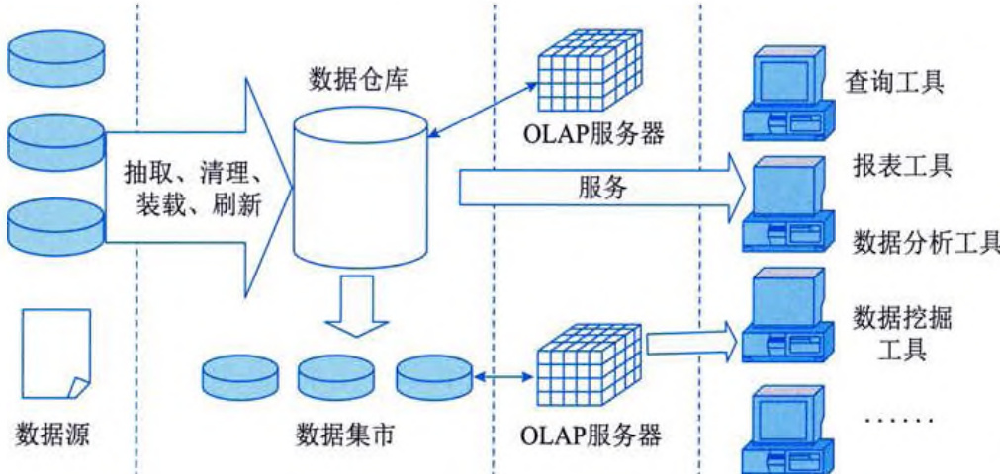  
图 5-6 数据仓库的体系结构  

在图 5-6 中, 数据源是数据仓库系统的基础, 是整个系统的数据源泉。OLAP (On-Line Analytical Processing, 联机分析处理) 服务器对分析需要的数据进行有效集成, 按多维模型予以组织, 以便进行多角度、多层次的分析, 并发现趋势。前端工具主要包括各种报表工具、查询工具、数据分析工具和数据挖掘工具, 以及各种基于数据仓库或数据集市的应用开发工具。其中, 数据分析工具主要针对 OLAP 服务器, 报表工具、数据挖掘工具主要针对数据库。  
 

# 5.6.1 联机分析处理  

数据处理大致可以分成两大类，分别是联机事务处理（On-Line Transaction Processing, OLTP）和联机分析处理（OLAP）。OLTP 是传统数据库的主要应用，支持基本的、日常的事务处理；OLAP 是数据仓库系统的主要应用，支持复杂的分析操作，侧重决策支持，并且提供直观易懂的查询结果。表 5-12 列出了 OLTP 与 OLAP 之间的比较。  

<table><tr><td>项目</td><td>OLTP</td><td>OLAP</td></tr><tr><td>用户</td><td>操作人员，低层管理人员</td><td>决策人员，高层管理人员</td></tr><tr><td>功能</td><td>日常操作处理</td><td>分析决策</td></tr><tr><td>DB设计</td><td>面向应用</td><td>面向主题</td></tr><tr><td>数据</td><td>当前的、最新的、细节的、二维的、分立的</td><td>历史的、聚集的、多维的、集成的、统一的</td></tr><tr><td>存取</td><td>读/写数十条记录</td><td>读上百万条记录</td></tr><tr><td>工作单位</td><td>简单的事务</td><td>复杂的查询</td></tr><tr><td>用户数</td><td>多</td><td>少</td></tr><tr><td>DB大小</td><td>MB或GB级</td><td>GB或TB级</td></tr></table>  

从表 5-12 中可以看出, 在 OLTP 中, 数据是以二维表的形式来进行组织的, 但在 OLAP 中, 数据通常是多维的。这里的 “维” 是人们观察客观世界的角度, 是一种高层次的类型划分。 “维” 一般包含层次关系, 这种层次关系有时会相当复杂。通过将一个实体的多项重要的属性定义为多个维, 使用户能对不同维上的数据进行比较。因此, OLAP 也可以说是多维数据分析工具的集合。  

# 1. 数据立方体  

  
图 5-7 数据立方体示意图  

在多维的数据结构中，三维结构（Data Cube，数据立方体） 最为直观，如图5\-7 所示，该立方体中包含了一个连锁超市在各 地区不同月份的各种饮料的销售情况。  

通过图 5-7 可以发现, 其实绝大多数的应用, 只需要用到立方体的一部分。例如, 需要了解长沙地区的饮料销售情况, 则只要取立方体的最上面的一片数据即可, 若需要了解长沙地区3月份的饮料销售情况, 则只要取立方体最上面一层的最右边一列数据即可。这就涉及数据立方体的相应操作。  

# 2. 多维分析  

OLAP 的基本多维分析操作有钻取、切片和切块、旋转等。  

(1) 钻取 (Drill)。钻取是改变维的层次, 变换分析的粒度。它包括向上钻取 (Drill Up) 和向下钻取 (Drill Down)。向上钻取是在某一维上将低层次的细节数数据概括到高层次的汇总数据, 或者减少维数, 是一种自动生成汇总行的分析方法。通过向导的方式, 用户可以定义和分析因素的汇总行。例如, 要了解各地区各月份的饮料销售情况, 可以生成地区和 (或) 月份的  
合计行。而向下钻取则相反，它从汇总数据深入到细节数据进行观察或增加新的维。例如，用户分析各地区的销售情况时，可以对某个城市的销售额细分为各个月份的销售额。通过钻取功能，用户对数据能更深入地了解，更容易发现问题，做出正确的决策。  

(2) 切片和切块 (Slice and Dice)。切片和切块是在一部分维上选定值后, 关心度量数据在剩余维上的分布。如果剩余的维只有两个, 则是切片; 如果剩余的维有三个以上, 则是切块。例如, 如果需要在图 5-7 中获取按月的销售数据, 则属于数据切片, 因为数据立方体按月份分成了数据片, 形成了二维结构。但如果需要获取的是按地区的数据, 例如, 华东区 (包括上海、南京、杭州等), 华北区 (包括北京、天津等), 则属于数据分块, 因为得到的数据是三维结构的。  

(3) 旋转 (Pivot) 是变换维的方向, 即重新安排维的放置 (例如, 行列互换等)。  

# 3. 实现方法  

OLAP 有多种实现方法, 根据存储数据的方式不同, 可以分为关系型 OLAP (Relational OLAP, ROLAP)、多维型 OLAP (Multidimensional OLAP, MOLAP) 和混合型 OLAP (Hybrid OLAP, HOLAP)。  

ROLAP 表示基于关系数据库的 OLAP 实现。以关系数据库为核心，以关系型结构进行多维数据的表示和存储。ROLAP 将多维数据库的多维结构划分为两类表：一类是事实表，用来存储数据和维关键字；另一类是维表，即对每个维至少使用一个表来存放维的层次和成员类别等维的描述信息。维表和事实表通过主键和外键联系在一起，形成 “星形模式”。对于层次复杂的维，为避免冗余数据占用过大的存储空间，可以使用多个表来描述，这种星形模式的扩展称为 “雪花模式”。  

MOLAP 表示基于多维数据组织的 OLAP 实现, 以多维数据组织方式为核心。也就是说, MOLAP 使用多维数组存储数据。如果是三维数据, 则其在存储中将形成数据立方体结构。  

HOLAP 表示基于混合数据组织的 OLAP 实现, 例如, 低层是关系型的, 高层是多维型的, 这种方式具有更好的灵活性。  

# 5.6.2 数据仓库概述  

企业数据仓库的建设，是以现有企业业务系统和大量业务数据的积累为基础的。数据仓库不是静态的概念，只有将信息及时交给需要这些信息的使用者，供他们做出改善其业务经营的决策，信息才能发挥作用。而将信息加以整理归纳和重组，并及时提供给相应的管理决策人员，是数据仓库的根本任务。因此，从产业界的角度看，数据仓库建设是一个工程，是一个过程。  

# 1. ETL 过程  

针对现有各业务系统的数据，进行抽取、清理，并有效集成，按照主题进行组织，整个过程可以简称为抽取、转换和加载（Extraction-Transformation-Loading，ETL）过程。ETL 负责将分布的、异构数据源中的数据（例如，关系数据、平面数据文件等）抽取到临时中间层后进行清洗、转换和集成，最后加载到数据仓库或数据集市中，成为 OLAP 和数据挖掘的基础。  
 

数据仓库是一个独立的数据环境，需要通过抽取过程将数据从 OLTP 环境、外部数据源和脱机的数据存储介质中导入数据仓库。在技术上，ETL 主要涉及关联、转换、增量、调度和监控等几个方面。数据仓库系统中的数据不要求与 OLTP 系统中的数据实时同步，因此，ETL 可以定时进行。但多个 ETL 的操作时间、顺序和成败对数据仓库中信息的有效性至关重要。  

# 2. 数据仓库的分类  

从结构的角度看，有三种数据仓库模型，分别是企业仓库（Enterprise Warehouse）、数据集市（Datamart）和虚拟仓库（Virtual Warehouse）。  

(1) 企业仓库。企业仓库面向企业级应用, 它搜集了企业的各个主题的所有信息, 提供全企业范围的数据集成, 数据通常来自多个操作型数据库和外部信息提供者, 并且是跨多个功能范围的。企业仓库通常包含详细数据和汇总数据, 数据量可达 TB 级。  

(2) 数据集市。数据集市面向企业部门级应用, 它包含对特定用户有用的、企业范围数据的一个子集, 它的范围限定在选定的主题中。根据数据来源不同, 数据集市可以分为两种, 分别是独立数据集市 (Independent Datamart) 和从属数据集市 (Dependent Datamart)。  

从属数据集市的数据直接来自于中央数据仓库，有利于保持数据的一致性，因为来自同一 数据源，并且已经经过一致性处理和检验。从属数据集市的作用在于，为一些部门建立数据集 市，将需要的数据复制、加工到其中，这样不仅可以提高部门的访问速度，也能满足部门的 些特殊的分析需求。  

独立数据集市的数据直接来自于业务系统，由于为各个部门都建立了各自的数据集市，而当需要从整体上建立数据仓库时，由于各部门的特殊需要不同，不同数据集市中的数据表达也有所不同，将这种不一致的数据整合到一个中心数据仓库时，可能会遇到一些困难，例如，重新设计和各部门协调等。独立数据集市的优点是建立迅速、价格相对低廉。建立独立数据集市的原因往往是出于投资方面的考虑或工期的紧迫，或解决某部门的迫切需要。然而，需要注意的是，在设计其他部门的数据集市或中心数据仓库时，要充分考虑现有数据集市的设计，以避免由于设计的不一致性而造成后期整合的困难及昂贵的费用。  

(3) 虚拟仓库。虚拟仓库是操作型数据库上视图的集合。为了有效地处理查询, 只有一些可能的汇总视图被物化。虚拟仓库易于建立, 但需要操作型数据库服务器具有剩余的工作能力。  

# 3. 非结构化数据与数据仓库  

图 5-6展示了数据仓库的体系结构, 其中, 第一步便是从多个数据源获取数据。这些数据源不仅限于企业内部的应用系统数据库。因为对于一个用于决策分析的系统而言, 仅有企业内部数据是不够的。合理地采用外部数据（例如, 报纸、期刊、电视等媒体的报道, 一些商业机构的调查报告）能使分析和决策更为准确。而这些外部数据通常都是非结构化的数据。因此, 如何用数据仓库管理非结构化数据, 也是数据仓库应用中的一个重要问题。  

为了更好地管理非结构化数据，数据仓库采用了元数据（当然，元数据不仅用于此），元数据可用于记录数据的文件标识符、进入数据仓库的日期、文件描述、文件来源、文件源的取得日期、文件的分类、索引字、清理日期、物理地址引用、文件长度和相关参考等信息。因此，管理人员可以通过元数据来获得非结构化数据的信息，在许多情况下，管理人员甚至不用看源  
文件，只要看元数据即可。在清除不相关的或过时的文件时，浏览元数据可为管理人员减少大量的工作。  

# 5.6.3 数据仓库的设计方法  

数据仓库的设计方法通常有三种，分别是自顶向下的方法、自底向上的方法，以及两者结合的混合方法。  

# 1. 自顶向下的方法  

自顶向下的方法由总体规划和设计开始，在对原始数据进行抽取、转换和迁移等处理之后，将数据输出至一个集中的数据驻留单元。然后，数据和元数据装载进入数据仓库。这样建立起来的数据仓库是企业级的，当建立好数据仓库以后，各个部门再从数据仓库中获取部门所需要的数据，形成数据集市，即从属数据集市。  

自顶向下的方法在实际应用中会遇到很多难题，例如：  

(1) 投资大。因为建立的数据仓库是面向企业的, 涉及面广。  

(2) 应用周期较长。因为项目较大，开发周期相对较长，应用时间也长。  

(3) 需求难以确定。因为建立数据仓库的主要原因是利用其进行决策分析, 这种功能在企业战略的应用范围中通常是很难确定的, 数据仓库的应用往往超出企业当前的实际业务范围。  

# 2. 自底向上的方法  

自底向上的方法的核心思想是从企业中最关键的部门（或功能需求）开始，先以最少的投资完成当前的需求，获得最快的回报，然后再不断扩充、不断完善。以该方法进行数据仓库的设计，最先产生的是独立数据集市，而后从多个独立数据集市中抽取数据，形成企业级的数据仓库。  

自底向上的方法的优点在于企业能够以较小的投入获得较高的数据仓库应用收益。在开发过程中，人员投入较少，也容易获得成效。当然，如果某个项目的开发失败，可能造成企业整个数据仓库系统开发的延迟。该方法一般用于企业希望对数据仓库技术进行评价，以确定该技术的应用方式、地点和时间，或希望了解实现和运行数据仓库所需要的各种费用，或在数据库的应用目标并不是很明确时使用。  

# 3. 混合法  

混合法是自顶向下和自底向上的方法联合使用，具有两种方法的优点，既能快速地完成数据仓库的开发与应用，还可建立具有长远价值的数据仓库方案。  

# 5.7 数据挖掘技术  

数据挖掘是采用数学的、统计的、人工智能和神经网络等领域的科学方法，从大量数据中挖掘出隐含的、先前未知的、对决策有潜在价值的关系、模式和趋势，并用这些知识和规则建立用于决策支持的模型，为商业智能系统服务的各业务领域提供预测性决策支持的方法、工具和过程。  
   

# 5.7.1 数据挖掘概述  

数据挖掘与传统的数据分析（例如，查询、报表、联机应用分析）的本质区别是数据挖掘是在没有明确假设的前提下去挖掘信息、发现知识。数据挖掘所得到的信息应具有先前未知、有效和可实用三个特征。先前未知的信息是指该信息是预先未曾预料到的，即数据挖掘是要发现那些不能靠直觉发现的信息或知识，甚至是违背直觉的信息或知识，挖掘出的信息越是出乎意料，就可能越有价值。  

# 1. 数据挖掘的体系结构  

如图 5-8 所示为数据挖掘的体系结构, 它展示了数据挖掘的流程, 说明了数据挖掘是怎样找到新规律的。  

  
图 5-8 数据挖掘的体系结构  

(1) 知识发现系统管理器。控制并管理知识发现过程, 录入知识库中的信息用于驱动数据选择过程、抽取算法选择, 以及使用过程和发现评价过程。  

(2) 知识库。知识库包含源于多方面的必需的信息, 可以将元数据输入数据仓库中, 以描述数据仓库的数据结构, 输入关键数据属性、规则和数据层次等。  

(3) 数据访问接口。知识发现系统利用数据库的查询机制从数据仓库中提取数据, 可使用 SQL 查询语言, 结合知识库中的数据仓库元数据, 指导从数据仓库中提取需要的数据。  

(4)数据选择。确定从数据仓库中需要抽取的数据及其结构。  

(5) 知识发现引擎。将知识库中的抽取算法提供给抽取的数据, 目的是要抽取数据元素间的模式和关系。  

(6) 发现评价。分析员要寻找关注性的数据模式, 选出那些关注性信息。  

(7) 发现描述。发现描述部分提供两种功能: 一种是以发现评价辅助分析员在知识库中保存所发现的信息, 以备将来引用和使用: 另一种是发现描述为决策提供辅助决策。  
# 2. 数据挖掘的流程  

数据挖掘是一个完整的过程，该过程从大型数据库中挖掘先前未知的、有效的、可实用的信息，并使用这些信息做出决策或丰富知识。数据挖掘的流程大致如下:  

(1) 问题定义。在开始数据挖掘之前最先也是最重要的要求就是熟悉背景知识, 弄清用户的需求。缺少背景知识就不能明确定义要解决的问题, 也就不能为挖掘准备优质的数据, 也很难正确地解释得到的结果。要想充分发挥数据挖掘的价值, 必须要对目标有清晰明确的定义, 即决定到底想干什么。  

(2) 建立数据挖掘库。要进行数据挖掘必须收集要挖掘的数据资源, 一般需要将要挖掘的数据都收集到一个数据库中, 而不是采用原有的数据库或数据仓库。这是因为大部分情况下需要修改要挖掘的数据, 而且还会遇到采用外部数据的情况; 另外, 数据挖掘还要对数据进行各种纷繁复杂的统计分析, 而数据仓库可能不支持这些数据结构。  

(3) 分析数据。分析数据是对数据深入调查的过程。从数据集中找出规律和趋势, 用聚类分析区分类别, 理清多因素相互影响的、十分复杂的关系, 发现诸因素之间的相关性。  

(4) 调整数据。通过上述步骤的操作, 对数据的状态和趋势有了进一步的了解, 这时, 要尽可能对问题解决的要求做进一步明确化和量化。针对问题的需求对数据进行增删, 按照对整个数据挖掘过程的新认识组合或生成一个新的变量, 以体现对状态的有效描述。  

(5) 模型化。在问题进一步明确、数据结构和内容进一步调整的基础上, 就可以建立形成知识的模型。这一步是数据挖掘的核心环节, 一般运用神经网络、决策树和数理统计等方法来建立模型, 有关这些技术与方法的详细内容将在 5.7.2 小节中介绍。  

(6) 评价和解释。所得到的模型有可能是没有实际意义或没有实用价值的, 也有可能不能准确反映数据的真实意义, 甚至在某些情况下是与事实相反的。因此, 需要评估和确定哪些是有效的、有用的模式。评估的方法既可以是直接使用原先建立的挖掘数据库中的数据来进行检验, 也可以另外拿一批数据对其进行检验, 还可以在实际运行的环境中取出新数据进行检验。  

数据挖掘是一个多种专家合作的过程，也是一个在资金上和技术上高投入的过程。这一过程要反复进行，在此过程中不断地趋近事物的本质，不断地优选问题的解决方案。  

# 5.7.2 常用技术与方法  

从技术上来看, 数据挖掘就是从大量的、不完全的、有噪声的、模糊的、随机的实际应用数据中, 提取隐含在其中的、人们事先不知道的、但又是潜在有用的信息和知识的过程。这个定义包括几层含义: 数据源必须是真实的、大量的、含噪声的; 发现的是用户感兴趣的知识; 发现的知识要可接受、可理解、可运用; 并不要求发现放之四海而皆准的知识, 仅支持特定地发现问题即可。  

从商业角度来看，数据挖掘是一种新的商业信息处理技术，其主要特点是对商业数据库中的大量业务数据进行抽取、转换、分析和其他模型化处理，从中提取辅助商业决策的关键性数据。  
 

# 1. 数据挖掘的常用技术  

数据挖掘中的关键技术是进行模式和关系识别的算法。下面介绍几种数据挖掘和知识发现的技术，它们分别从不同的角度进行数据挖掘和知识发现。  

(1)决策树方法。决策树方法利用信息论中的互信息（信息增益）寻找数据库中具有最大信息量的属性，建立决策树的一个结点，再根据属性的不同取值建立树的分支。  

(2) 分类方法。分类方法将数据按照含义划分成组, 可用该方法生成感兴趣的侧面, 可用于自动发现类, 例如, 模式识别、侧面生成、线性聚簇和概念聚簇等。  

(3) 粗糙集 (Rough Set) 方法。粗糙集的研究主要基于分类。分类和概念 (Concept) 同义, 一种类别对应于一个概念。知识由概念组成, 如果某知识中含有不精确概念, 则该知识就不精确, 粗糙集通过上近似概念和下近似概念来表示不精确概念。  

(4) 神经网络。神经网络通过学习待分析数据中的模式来构造模型, 它可对隐式类型进行分析, 适用于对非线性的、复杂的或高噪声的数据进行建模。神经网络技术模拟人脑神经元结构, 由神经元互连或按层组织的结点构成。通常, 神经模型由三个层次组成, 分别是输入层、中间层和输出层。每个神经元求得输入值, 再计算总输入值, 由过滤机制（例如, 阈值）比较总输入, 然后确定它自己的输出值。  

(5) 关联规则。关联规则是指搜索业务系统中的所有细节和事务, 从中找出重复出现概率很高的模式, 它以大的事务数据库为基础, 其中每个事务都被定义为一系列相关数据项。用关联找出所有能将一组事件（或数据项）与另一组事件（或数据项）联系起来的规则。关联算法的目的是成为 SOL 的扩充, 这种算法可以通过规范的查询技术应用于受限的关系数据集。  

(6) 概念树方法。对数据库中记录的属性按归类方式进行抽象, 建立起来的层次结构称为概念树。例如, 某在线教育平台系统中的 “课程” 概念树的最下层是具体课程名称 (例如, 数据结构、系统分析与设计等), 它的直接上层是课程类别 (例如, 软件类、网络类等), 课程类别的直接上层是专业类别 (例如, 计算机科学与技术、通信工程等)。利用概念树提升的方法可以大大浓缩数据库中的记录。对多个属性的概念树进行提升, 将得到高度概括的知识基表, 然后再将它转换成规则。  

(7) 遗传算法。遗传算法是模拟生物进化过程的算法, 由繁殖、交叉和变异三个基本算子组成。繁殖也称为选择, 是从一个旧种群 (父代) 选出生命力强的个体产生新种群 (后代) 的过程; 交叉也称为重组, 是指选择两个不同个体 (染色体) 的部分 (基因) 进行交换, 形成新个体; 变异也称为突变, 是指对某些个体的某些基因进行变异 (1 变 0、0 变 1)。遗传算法可起到产生优良后代的作用, 这些后代需满足适应值, 经过若干代的遗传, 将得到满足要求的后代 (问题的解)。  

(8) 依赖性分析。依赖性分析是指在数据仓库的条目或对象之间抽取依赖性, 它展示了数据之间未知的依赖关系, 依赖性是一个带有置信度因子的可能值。可以用依赖性分析方法从某个数据对象的信息来推断另一个数据对象的信息。  

(9) 公式发现。在工程和科学数据库中, 对若干数据项（变量）进行一定的数学运算, 求得相应的数学公式。其基本思想是, 对数据项进行初等数学运算, 形成组合数据项, 若它的值为常数项, 就得到了组合数据项等于常数的公式。  
(10) 统计分析方法。在数据库属性之间通常存在两种关系，分别是函数关系（能用某个函数表示的确定性关系）和相关关系（不能用函数表示的确定性关系）。对这些关系的分析可以采用回归分析、相关分析或主成分分析等统计分析方法。  

(11) 模糊论方法。利用模糊集合理论对实际问题进行模糊评判、模糊决策、模糊模式识别和模糊聚类分析。模糊性是客观存在的, 系统的复杂性越高, 精确化能力就越低, 即模糊性越强。  

(12) 可视化分析。可视化分析可给出带有多变量的图形化分析数据, 帮助用户进行分析。可视化数据分析技术拓宽了传统的图表功能, 使用用户对数据的剖析更清楚。例如, 将数据库中的多维数据变成多种图形, 这对揭示数据的状况、内在本质及规律性起到了很重要的作用。  

# 2. 数据挖掘的分析方法  

从功能上可以将数据挖掘的分析方法划分为6种，即关联分析、序列分析、分类分析、聚类分析、预测分析和时间序列分析。  

(1) 关联分析。关联分析主要用于发现不同事件之间的关联性, 即一个事件发生的同时,另一个事件也经常发生。关联分析的重点在于快速发现那些有实用价值的关联发生的事件。其主要依据是事件发生的概率和条件概率应该符合一定的统计意义。在进行关联分析的同时, 还需要计算两个参数, 分别是最小置信度 (可信度) 和最小支持度。前者表示规则需满足的最低可靠度, 用以过滤掉可能性过小的规则: 后者则用来表示规则在统计意义上需满足的最低程度。  

(2)序列分析。序列分析主要用于发现一定时间间隔内接连发生的事件, 这些事件构成一个序列, 发现的序列应该具有普遍意义, 其依据除了统计上的概率之外, 还要加上时间的约束。在进行序列分析时, 也应计算置信度和支持度。  

(3) 分类分析。分类分析通过分析具有类别的样本特点, 得到决定样本属于各种类别的规则或方法。利用这些规则和方法对未知类别的样本分类时应该具有一定的准确度。其主要方法有基于统计学的贝叶斯方法、神经网络方法、决策树方法等。分类分析时首先为每个记录赋予一个标记（一组具有不同特征的类别），即按标记分类记录，然后检查这些标定的记录，描述出这些记录的特征。这些描述可能是显式的（例如, 一组规则定义）, 也可能是隐式的（例如, 一个数学模型或公式）。  

(4) 聚类分析。聚类分析是根据 “物以类聚” 的原理, 将本身没有类别的样本聚集成不同的组, 并且对每个这样的组进行描述的过程。其主要依据是聚集到同一个组中的样本应该彼此相似, 而属于不同组的样本应该足够不相似。聚类分析是分类分析的逆过程, 它的输入集是一组未标定的记录, 即输入的记录没有做任何处理, 目的是根据一定的规则, 合理地划分记录集合, 并用显式或隐式的方法描述不同的类别。  

(5) 预测方法。预测方法与分类分析相似, 但预测是根据样本的已知特征估算某个连续类型的变量的取值的过程, 而分类分析则只是用于判别样本所属的离散类别而已。预测方法常用的技术是回归分析。  

(6) 时间序列分析。时间序列分析是随时间而变化的事件序列, 目的是预测未来发展趋势,或者寻找相似发展模式, 或者发现周期性的发展规律。  
   

在实际应用中，以上分析方法有着不同的适用范围，经常被综合运用。  

# 5.7.3 数据挖掘技术的应用  

数据挖掘和数据仓库的协同工作，一方面可以迎合和简化数据挖掘过程中的重要步骤，提高数据挖掘的效率和能力，确保数据挖掘中数据来源的广泛性和完整性；另一方面，数据挖掘技术已经成为数据仓库应用中极为重要和相对独立的一个方面和工具。  

数据挖掘和数据仓库的融合与互动发展，使数据挖掘得到了广泛的应用。目前，数据挖掘已经形成了多个分支，例如，空间数据挖掘（Spatial Data Mining, SDM）、多媒体数据挖掘（Multimedia Data Mining, MDM）和文本数据挖掘（Text Data Mining, TDM）等。  

# 1. 空间数据挖掘  

空间数据挖掘是指从空间数据库中抽取没有清楚表现出来的隐含的知识和空间关系，并发现其中有用的特征和模式的理论、方法和技术。SDM 是在数据挖掘的基础上，结合地理信息系统、遥感图像处理、全球定位系统、模式识别、可视化等相关的研究领域而形成的一个分支学科，也称为空间数据挖掘和知识发现（Spatial Data Mining and Knowledge Discovery, SDMKD）。  

空间数据与其他类型数据的本质区别是其空间属性。空间属性包括空间位置、距离、几何形状和大小等内容，并且可引申为空间个体之间的相互关系，例如，拓扑关系、方位关系和度量关系等，从而使得空间数据比其他类型的数据更为复杂，数据量异常巨大。空间数据的特点是其中隐含着更多、更为复杂的知识，因此，也使空间数据挖掘的研究更加困难和更具挑战性。  

# 2. 多媒体数据挖掘  

多媒体数据挖掘是在大量的多媒体数据中，通过综合分析视听特性和语义，发现隐含的、有效的、有价值的、可理解的模式，进而发现知识，得出事件的发展趋向和关联，为用户提供问题求解层次的决策支持能力。  

MDM 相对于传统的数据挖掘有几个需要解决的问题。首先，多媒体数据为非结构化和异构数据。要在这些非结构化的数据上进行挖掘以获取知识，必须将它们转化为结构化数据，通过特征提取，用特征向量作为元数据建立元数据库，在此基础上进行数据挖掘。其次，多媒体数据的特征向量通常是数十维甚至数百维，如何对高维矢量进行数据挖掘也是需要考虑的重要问题。  

# 3. 文本数据挖掘  

文本数据挖掘是指从文本数据中抽取有价值的信息和知识的计算机处理技术。文本数据挖掘是应用驱动的，它在智能商务、信息检索、生物信息处理等方面都有广泛的应用。例如，客户关系管理、互联网搜索等。  

按照挖掘的对象不同，可以将 TDM 分为基于单文档的数据挖掘和基于文档集的数据挖掘。基于单文档的数据挖掘对文档的分析并不涉及其他文档，其主要的挖掘技术有文本摘要和信息提取（包括名字提取、短语提取和关系提取等）；基于文档集的数据挖掘是对大规模的文档数据进行模式抽取，其主要的技术有文本分类、文本聚类、个性化文本过滤、文档作者归属和因素分析等。  

TDM 可以分为三层：底层是 TDM 的基础领域，包括机器学习、数理统计和自然语言处理:  
在此基础上是 TDM 的基本技术，包括文本信息抽取、文本分类、文本聚类、文本数据压缩和文本数据处理；最上层是两个主要应用领域，分别是信息访问和知识发现，信息访问包括信息检索、信息浏览、信息过滤和信息报告，知识发现包括数据分析和数据预测。  

# 5.8 非关系数据库  

NoSQL 是非关系数据存储的广义定义，它打破了长久以来关系数据库与 ACID 理论大一统的局面。NoSQL 数据存储不需要固定的表结构，通常也不存在连接操作，在大数据存取上具备关系数据库无法比拟的性能优势。该术语在 2009 年初得到了广泛认同。  

# 5.8.1 概述  

随着互联网 Web 2.0 网站的兴起, 非关系数据库成了一个极其热门的新领域, 非关系数据库产品的发展非常迅速。而传统的关系数据库在应对 Web 2.0 网站, 特别是超大规模和高并发的 SNS (Social Network Site, 社交网站) 类型的 Web 2.0 纯动态网站时已经显得力不从心, 暴露了很多难以克服的问题, 例如, 对数据库高并发读写的需求, 对海量数据的高效率存储和访问的需求, 对数据库的高可扩展性和高可用性的需求。  

在基于 Web 的架构中，数据库是最难进行横向扩展的，当一个应用系统的用户量和访问量与日俱增的时候，数据库却没有办法像 Web Server 和 App Server 那样简单地通过添加更多的硬件和服务节点来扩展性能和负载能力。对于很多需要提供 24 小时不间断服务的网站来说，对数据库系统进行升级和扩展是非常痛苦的事情，往往需要停机维护和数据迁移。  

因此，关系数据库在这些越来越多的应用场景下显得不那么合适了，为了解决这类问题，非关系数据库应运而生。  

当今的应用体系结构需要数据存储在横向伸缩性上能够满足需求，而 NoSQL 存储就是为了实现这个需求。Google 的 BigTable 与 Amazon 的 Dynamo 是非常成功的商业 NoSQL 实现。一些开源的 NoSOL 体系，如 Facebook 的 Cassandra，Apache 的 HBase，也得到了广泛认同。  

NoSQL 数据库并没有统一的模型，而且是非关系型的。常见的 NoSQL 数据库通过存储方式划分，可分为文档存储、键值存储、列存储和图存储，其具体分类和特点如表 5-13 所示。两种不同的 NoSQL 数据库之间的差异程度，远远超过两种关系数据库之间的不同。一个优秀的 NoSQL 数据库必然适合某些场合或者某种应用。  

<table><tr><th>分类</th><th>典型产品</th><th>应用场景</th><th>优点</th><th>缺点</th></tr><tr><td>文档存储</td><td>MongoDB、CouchDB</td><td>Web应用, 存储面向文档和半结构化数据</td><td>结构灵活, 可以根据 value 构建索引</td><td>缺乏统一的查询语法, 无事务处理能力</td></tr><tr><td>键值存储</td><td>Memcached、Redis</td><td>内容缓存, 如会话、配置文件、参数等</td><td>扩展性好, 灵活性强, 大量操作时性能高</td><td>数据无结构化, 通常被当成字符串或者二进制数据, 通过键查询值</td></tr></table>  
 

(续表)  

<table><tr><th>分类</th><th>典型产品</th><th>应用场景</th><th>优点</th><th>缺点</th></tr><tr><td>列存储</td><td>BigTable、HBase、Cassandra</td><td>分布式数据存储和管理</td><td>可扩展性强,查找速度快,复杂性低</td><td>功能局限,不支持事务的强一致性</td></tr><tr><td>图存储</td><td>Neo4j、OrientDB</td><td>社交网络、推荐系统,专注于构建系统图谱</td><td>支持复杂的图形算法</td><td>复杂性高,只能支持一定的数据规模</td></tr></table>  

# 5.8.2 相关理论基础  

# 1. CAP 理论  

简单地说，CAP理论就是对于一个分布式系统，一致性（Consistency）、可用性（Availability）和分区容忍性（Partition tolerance）三个特点最多只能三选二。  

(1) 一致性。一致性指系统在执行了某些操作后仍处在一个一致的状态, 这点在分布式的系统中尤其明显。比如, 某用户在一处对共享的数据进行了修改, 那么所有有权使用这些数据的用户都可以看到这一改变。简言之, 就是所有的结点在同一时刻有相同的数据。  

(2) 可用性。可用性指对数据的所有操作都应有成功的返回。高可用性则是在系统升级 (软件或硬件) 或在网络系统中的某些结点发生故障的时候, 仍可以正常返回。简言之, 就是任何请求不管成功或失败都有响应。  

(3) 分区容忍性。这一概念的前提是在网络发生故障的时候。在网络连接上, 一些结点出现故障, 使得原本连通的网络变成了一块一块一块的分区, 若允许系统继续工作, 那么就是分区可容忍的。  

在数据库系统中，事务的 ACID 属性保证了数据库的一致性，比如银行系统中，转账就是一个事务，从原账户扣除金额，以及向目标账户添加金额，这两个数据库操作的总和构成一个完整的逻辑过程，具有原子的不可拆分特性，从而保证了整个系统中的总金额没有变化。然而，ACID 特性对于大型的分布式系统来说，可能并不总是适合，分布式系统更多的是强调可用性和分区容忍性。  

由于 CAP 理论的存在, 为了提高性能, 出现了 ACID 的一种变种 BASE。BASE (Basic Availability, Soft-State, Eventual Consistency), 即是一个弱一致性的理论, 只要求最终一致性。  

- Basic Availability: 基本可用。  

- Soft State: 软状态, 可以理解为 “无连接” 的, 而与之相对应的Hard State就是 “面向连接” 的。  

- Eventual Consistency: 最终一致性, 最终整个系统（时间和系统的要求有关）看到的数据是一致的。  

具体地说, 如果选择了 CP (一致性和分区容忍性), 那么就要考虑 ACID (传统关系数据库的基石, 事务的 4 个特点)。如果选择了 AP (可用性和分区容忍性), 那么就要考虑 BASE。如果选择了 CA (一致性和可用性), 如 Google 的 BigTable, 那么在网络发生分区的时候, 将不能进行完整的操作。  
ACID 和 BASE 的具体对比如表 5-14 所示。  

<table><tr><td>ACID</td><td>BASE</td></tr><tr><td>强一致性</td><td>弱一致性</td></tr><tr><td>隔离性</td><td>优先考虑可用性</td></tr><tr><td>关注“操作提交”</td><td>尽力服务</td></tr><tr><td>允许事务嵌套</td><td>结果对精确度要求不高</td></tr><tr><td>可用性</td><td>更简单、更快速</td></tr><tr><td>比较“保守”</td><td>比较“激进”</td></tr><tr><td>难于演变</td><td>易于演变</td></tr><tr></tr></table>  

# 2. 分区  

现在, 数据量的增加已经使得数据不可以仅在单一的计算机系统中存储 (分布式的应用), 尤其是为了保证数据的可靠性, 有时需要复制备份。同时, 为了一些规模性的操作 (比如负载平衡) 或者考虑到一些动态因素的影响 (存储结点的改变), 在设计中就要考虑 “分区” 的概念。  

# 分区的一些主要方法如下:  

(1) 内存缓存。缓存技术可以看成一种分区。内存中的数据库系统将使用频率最高的数据复制到缓存中, 加快了将数据传递给用户的速度, 同时也大大减轻了数据库服务器的负担。在分布式缓存中, 缓存由很多带有分配好一定内存的进程组成, 它们能够放置到不同的机器上, 并且可以通过配置进行应用。它的协议可以在不同的编程语言中实现, 同时在用户的应用中提供了简单的键值存储 API。它通过将键值哈希散列到缓存中来存储对象。  

(2) 集群。数据库服务器集群在为用户提供服务时的透明性（用户感觉数据像是在同一个地方），是另外一个对数据进行分区的方法。然而，这种方法虽然能在某种程度上扩展系统数据持久层，可是集群本身的特性却仅仅只应用在了数据库管理系统的顶层，而并未在分布式最初的设计中得到应用。  

(3) 读写分离。指定一台或多台主服务器, 所有或部分的写操作被送至此, 同时再设一定数量的副本服务器用以满足读请求。如果主服务器向至少一个用户异步复制数据, 这是没有写延迟的, 但如果主服务器在向最后一个用户写数据还没完成的时候就崩溃了, 那么写操作将是无效的; 如果主服务器向用户同步复制数据, 这是有延迟的, 这种更新不会丢失, 但读请求却不能送达副本服务器。如果对一致性要求很高的话, 无法避免进一步的写延迟。在这种情况下, 如果主服务器崩溃了, 那么有最新的数据的副本服务器将会成为新的主服务器。这种模型（主/从模型）在读写率很高的时候工作得很好。  

(4) 范围分割技术/分片 (Shading)。该方法是对数据按照如下的方式进行分区操作: 对数据的请求和更新在同一个结点上, 并且对于分布在不同服务器上的数据存储和下载的量大致相同。从可靠性和负载平衡的观点看, 数据的碎片也是需要被复制的, 并且允许它们被写入主服务器的副本中和所有需要维护数据分区的副本服务器中。而为了做到这一点, 需要在分区和存  
储结点之间做一个映射。这个映射是动态还是静态取决于用户的应用、主服务器的“映射服务/组件”以及网络中用户应用于网络结点之间的基础结构。在分区场景中，关键在于如何将数据库中的对象映射到服务器上，通常采用哈希散列法。  

# 3. 存储布局  

存储布局确定了如何访问磁盘，以及如何直接影响性能，主要分为4种，分别是基于行的存储布局、列存储布局、带有局部性群组的列存储布局、LSM-Tree。  

# 1）行存储和列存储  

行存储和列存储的主要区别在于，行存储将每条记录的所有字段的数据聚合存储，而列存储将所有记录中相同字段的数据聚合存储。行存储主要适用于 OLTP，或者更新操作，尤其是插入、删除操作频繁的场合；而列存储主要适用于 OLAP、数据仓库、数据挖掘等查询密集型应用。  

列存储相对于行存储的优点主要有两个:  

- 每个字段的数据聚集存储，在查询只需要少数几个字段的时候能大大减少读取的数据量。而查询密集型应用的特点之一就是查询一般只关心少数几个字段，而行存储每次必须读取整条记录。  

- 既然一个字段的数据聚集存储，那就更容易为这种聚集存储设计更好的压缩/解压算法。  

# 2) 带有局部性群组的列存储  

带有局部性群组的列存储和列存储很相似，但是增加了局部性群组的特色。  

局部性群组是在 Google 的关于 BigTable 的论文中第一次提到的。它是指根据需要将原来不存在在一起的数据，以列族为单位存储至单独的子表中。如用户对网站排名、语言等分析信息感兴趣，那么可以将这些列族放在单独的子表中，减少无用信息读取，改善存取效率。  

# 3) LSM-Tree  

LSM-Tree (Log Structured Merge Tree, 日志结构合并树) 与前面介绍的存储结构有所不同,前面介绍的存储结构在描述如何序列化逻辑数据结构, 而 LSM-Tree 描述的则是为了满足高效、高性能、安全地读写的要求, 如何有效地利用内存和磁盘存储。LSM-Tree 的观点是由 Patrick O'Neil 在 1996 年率先提出的。LSM-Tree 的算法思想主要用于解决日志记录索引的问题, 这种应用的特点是数据量大、写速率高 (2000 条 / 秒), 又要建立有效的索引来查找日志中的特定条目。Patrick O'Neil 的做法是, 在内存里维护一个相同的 B 树, 当内存中的 B 树达到阈值时, 批量进行滚动合并。LSM-Tree 的典型例子就是 Google 的 BigTable。  

# 4. 查询模型  

不同的 NoSQL 数据存储提供的查询功能有重大分歧。然而设计的键值存储仅仅提供通过主键或一些 id 字段查找的功能，并且缺乏查询更进一步域的能力，而其他数据存储（如文档数据库 CouchDB 和 MongoDB）则允许某些复杂查询。在许多 NoSQL 数据库的设计中，相对于性能和可扩展性来说，丰富的动态查询功能已被省略的现状并不奇怪。另一方面，在使用 NoSQL 数据库时，有些使用情况下需要至少有一些非主键属性查询功能。  
现在许多 NoSQL 数据库是基于 DHT（Distributed Hash Table，分散哈希表）模型的。为了访问和修改对象数据，客户端要求提供对象的主键，然后数据库再根据提供的主键进行相等匹配。  

# 5.8.3 列数据库  

传统的关系数据库都是以行为单位来进行数据存储的，擅长进行以行为单位的数据处理，比如特定条件数据的获取。因此，关系数据库也被称为面向行的数据库。相反，面向列的数据库是以列作为单位来进行数据存储的，擅长进行以列为单位的数据处理。  

面向列的数据库具有高扩展性，即使数据增加也不会降低相应的处理速度，所以它主要应用于需要处理大量数据的情况。另外，利用面向列的数据库的优势，也可以把它作为批处理程序的存储器，来对大量数据进行更新。  

列存储数据库的主要产品有 Google 的 BigTable、由 BigTable 衍生的 HyperTable 和 HBase、Cassandra 等。  

# 5.8.4 文档数据库  

在传统的数据库中，数据被分割成离散的数据段，而文档存储则是以文档为存储信息的基本单位。文档存储一般用类似 JSON 的格式存储，存储的内容是文档型的。面向文档的数据库具有以下特征：即使不定义表结构，也可以像定义了表结构一样来使用；面向文档的数据库可以通过复杂的查询条件来获取数据。虽然不具备事务处理和 JOIN 等关系数据库所具有的处理能力，但其他的处理基本都可以实现。  

在文档存储中，文档可以很长、很复杂、无结构，可以是任意结构的字段，并且数据具有物理和逻辑上的独立性，这就和具有高度结构化的表存储（关系数据库的主要存储结构）有很大的不同，而最大的不同则在于它不提供对参数完整性和分布事物的支持。不过，它们之间也并不排斥，可以进行数据的交换。  

MongoDB 是 10gen 公司开发的以高性能和可扩展性为特征的文档数据库，也是 NoSQL 文档存储模式数据库中的重要一员。MongoDB 的最大特点就是无表结构。在保存数据和数据结构的时候，会把数据和数据结构都完整地以 BSON 的形式保存起来（BSON 是 JSON 的二进制编码格式，但比 JSON 支持更加复杂的格式，在空间利用上更加高效），并把它作为值和特定的键进行关联。正是由于这种设计，它不需要表结构，因此它被称为文档数据库。  

# MongoDB 具有 4 个主要特征:  

(1) 高性能。提供 JSON、XML 等可嵌入数据快速处理功能；提供文档的索引功能，相对传统数据库而言，大大提高查询速度。  

(2) 丰富的查询语言。为数据聚合、结构文档、地理空间提供丰富的查询功能。  

(3) 高可用性。提供数据冗余处理和故障自动转移的功能。  

(4) 水平扩展能力。通过集群将数据分布到多台机器, 而不是只提升单个节点的性能, 具体处理分为主从和权衡两种处理模式。  

MongoDB 为 C、C#、.NET、Java、PHP 等各种开发语言提供了程序库。  

 

# 5.8.5 键值数据库  

键值存储模型是最简单也是最方便使用的数据模型，它支持简单的键对值的键值存储和提取。根据一个简单的字符串（键）能够返回一个任意类型的数据（值）。键值存储最大的好处是不用为值指定一个特定的数据类型，这样就能在值里存储任意类型的数据。系统将这些信息按照 BLOB 大对象进行存储，当收到检索请求时，返回同样的 BLOB。由应用来决定被使用的数据是什么类型，如字符串、图片和 XML 文件等。键值存储数据库的主要特点是具有极高的并发读写性能。  

键值存储中的键是很灵活的，可以是图片名称、网页 URL 或者文件路径名，它们指向那些图片、网页和对应的文档。  

键值存储中存在三种操作: put、get 和 delete。这三种操作规定了程序员与键值存储交互的基本方式。应用开发者使用 put、get 和 delete 函数访问和操作键值存储:  

- put($key as xs:string, $value as item())对表添加一个新的键值对，并且当键存在时，更新键对应的值。  

- get($key as xs:string) as item()根据给出的任意键返回键对应的值，如果键值存储中没有该键，将返回一个错误信息。  

- delete($key as xs:string) 将键和对应的值从表中删除，如果键值存储中没有该键，将返回一个错误信息。  

根据数据的保存方式，键值存储的数据库可以分为三种，分别是临时性保存、永久性保存和两者兼具型。  

# 1) 临时性保存类型  

临时性的保存有可能丢失数据。这类数据库一般把数据都保存在内存中，这样读和写的速度都非常快，但是当数据库停止或者机器重启后，数据就不存在了。  

# 2) 永久性保存类型  

永久性的保存不会丢失数据。这类数据库一般不把数据保存在内存中，而是把数据保存在硬盘上。与临时性保存在内存中读和写数据比较起来，由于永久性保存牵扯到对硬盘的 I/O 操作，所以性能上的差距是显而易见的，但是它最大的优势是不会丢失数据。  

# 3) 两者兼具型  

这类数据库兼具临时性保存和永久性保存的优点。比如典型的 Redis 系统，它首先把数据保存在内存中，平时都在内存中进行读和写操作。在满足特定条件（默认是 15 min 一次以上，5 min 10 个以上或 1 min 1000 个以上的键发生变化）时，将数据写入硬盘上保存。这样既确保了内存中数据处理的高速性，又通过写入硬盘来保证数据的永久性。这种类型的数据库特别适合处理数组类型的数据。  

键值存储产品主要有亚马逊的 Memcached、Redis、Dynamo、Project Voldemort、Tokyo Tyrant、Riak、Scalaries 这几个数据库，这里主要介绍一下 Redis。  

Redis 是一种主要基于内存存储和运行，能够快速响应的键值数据库。属于临时性保存和永久性保存兼具的类型，有点像 Memcached，整个数据库统统加载在内存当中进行操作，但是通  
过定期异步操作把数据库数据 flush 到硬盘上进行保存。因为是纯内存操作，Redis 的性能非常出色，每秒可以处理超过 10 万次读写操作。  

Redis 的数据库存储模式, 是在键值 (Key-Value) 基本存储原理的基础上进行细化分类,构建了具有自身特点的数据结构类型。像 MySQL 这样的关系数据库, 表的结构比较复杂, 会包含很多字段, 可以通过 SQL 语句来实现非常复杂的查询需求。而 Redis 客户只包含 “键” 和 “值” 两部分, 只能通过 “键” 来查询 “值”。正是因为这样简单的存储结构, 让 Redis 的读写效率非常高。键的数据类型是字符串, 但是为了丰富数据存储的方式, 方便开发者使用, 值的数据类型很多, 它们分别是字符串、列表、字典、集合、有序集合。  

# 5.8.6 图数据库  

图存储在那些需要分析对象之间的关系或者通过一个特定的方式访问图中所有节点的应用中尤为重要。图存储针对有效存储图节点和联系进行了优化，让你可以对这些图结构进行查询。图数据库对于那些对象之间具有复杂关系的业务问题很有用，如社交网络、规则引擎、生成组合和那些需要快速分析复杂网络结果并从中找出模式的图系统。  

图存储是一个包含一连串的节点和关系的系统, 当它们结合在一起时, 就构成了一个图。图存储有三个字段: 节点、关系和属性。图节点通常是现实世界中对象的表现, 如人名、组织、电话号码、网页或计算机节点。而关系可以被认为是这些对象之间的联系, 通常被表示为图中两个节点之间连接线。  

如果图存储的节点众多、关系复杂、属性很多，那么传统的关系数据库将要建很多大型的表，并且表的很多列可能是空的，在查询时还极有可能进行多重 SQL 语句的嵌套。可是图存储就可以很优异，基于图的很多高效的算法可以大大提高执行效率。  
  

# 第6章 企业信息化  

系统分析与设计技术最终是要为企业信息化服务的，企业信息化的广阔领域就是系统分析师的用武之地。因此，作为CIO的最佳候选人，系统分析师必须掌握有关企业信息化的基础知识，熟悉信息系统建设的基本方法和流程。  

企业要应对全球化市场竞争的挑战，特别是大型企业要实现跨地区、跨行业、跨所有制、跨国经营的战略目标，要实施技术创新战略、管理创新战略和市场开拓战略，要将企业工作重点转向技术创新、管理创新和制度创新的方向上来，信息化是必然的选择和必要的手段。  

# 6.1 企业信息化概述  

企业信息化是指企业以业务流程的优化和重构为基础，在一定的深度和广度上利用计算机 技术、网络技术和数据库技术，控制和管理企业生产经营活动中的各种信息，实现企业内、外 部信息的共享和有效利用，以提高企业的经济效益和市场竞争力。从技术角度来看，信息化的 核心和本质是企业运用信息技术，进行隐含知识的挖掘和编码化，进行业务流程的管理。企业 信息化涉及对企业管理理念的创新、管理流程的优化、管理团队的重组和管理手段的革新等 问题。  

企业信息化建设是一项系统工程，而不是单元技术的改造，它涉及企业所处的整个“生态系统”，个别部门或部分业务的信息化并不能代表整个企业的信息化。同时，企业信息化是一个不断发展和完善的过程，随着管理理念和信息技术（含计算机网络和通信技术，下同）的发展而发展，是一个螺旋式上升的过程。  

要注意的是，企业信息化方法并不等同于信息系统建设方法，后者是一个具体的信息化项目的开发方法，而前者是整个企业实现信息化的方法。前者比后者的层次要高，涉及面要广。经过数十年的发展，人们已经总结出了许多非常实用的企业信息化方法，并且还在不断地探索新的方法。下面简单介绍几种常用的方法。  

(1) 业务流程重组方法。在信息技术迅猛发展的时代, 企业必须重新审视生产经营过程,利用信息技术, 对企业的组织结构和工作方法进行 “彻底的、根本性的” 重新设计, 以适应当今市场发展和信息社会的需求。现在, 业务流程重组已经成为企业信息化的重要方法。  

（2）核心业务应用方法。任何一个企业，要想在市场竞争的环境中生存并发展，都必须有 自己的核心业务，否则，必然会被市场所淘汰。围绕核心业务应用信息技术是很多企业信息化 成功的秘诀。  

(3)信息系统建设方法。对大多数企业来说, 企业信息化的重点和关键是建设好信息系统。因此, 信息系统建设成了最具普遍意义的企业信息化方法。  

(4)主题数据库方法。主题数据库就是面向企业业务主题的数据库，也就是面向企业的核  
心业务的数据库。  

(5) 资源管理方法。管理好企业的资源是企业管理的永恒主题。信息技术的应用为企业资源管理提供了强大的支持。因此，企业资源规划和管理方法也就成了企业信息化的重要方法。  

# 6.2 信息资源管理  

信息和材料、能源共同构成了国民经济和社会发展的三大战略资源，它们在一定的条件下可以互相转换。信息资源与其他两大资源的主要区别在于，可以开发的材料和能源资源是有限的、不可再生的、不可共享的，对这些资源的利用会产生对环境的污染和对自然界的破坏；而信息资源是无限的、可再生的、可共享的，其开发和利用不但很少产生新的污染，而且还会减少材料和能源的消耗，从而相应地减少污染。  

# 6.2.1 信息资源管理概述  

信息资源与人力、物力、财力和自然资源一样，都是企业的重要资源，因此，应该像管理其他资源那样管理信息资源。做好信息资源管理（Information Resource Management, IRM）的目的是通过企业内外信息流的畅通和信息资源的有效利用，来提高企业的效益和竞争力。因此，IRM 是企业管理的必要环节，应该纳入企业管理的预算。  

# 1. IRM 的内容  

IRM包括数据资源管理和信息处理管理，前者强调对数据的控制（维护和安全），后者则关心企业管理人员如何获取和处理信息（流程和方法），并且强调企业中信息资源的重要性。IRM的基础是数据管理。数据管理与数据库管理有很大的区别，数据库管理仅仅负责物理数据库的设计、实现、安全性和维护工作；而数据管理在于确定数据规划、数据应用、数据标准、数据内容、数据范围等。  

IRM 的基本内容包括三个主题，它们是:  

(1) 资源管理的方向和控制, 要从整个企业管理的层面来分析资源的管理。其指导方针是数据可共享、数据处理机构提出应用项目、资源的有效性。  

(2) 建立企业信息资源指导委员会, 负责制定方针政策, 控制和监督信息资源功能的实施。  

(3) 建立信息资源的组织机构, 从事数据的计划和控制、数据获取以及数据的经营管理,并包括企业应用系统的开发。该机构应由企业的一位副总经理来担任领导, 并包括数据处理管理人员和数据管理人员。  

# 2. 信息资源的分类  

信息资源分类的主要功能是用于 IRM，而 IRM 的起点和基础是建立信息资源目录。只有科学地建立了目录，信息资源才能得到快速、及时的存储、处理、检索和利用。信息资源分类是 IRM 中最为复杂的工作之一，应当遵循简洁、独立和可操作的原则。对信息资源的分类一般从  
软考历年真题、章节练题、根据考点整理的考点练题：应用市场下载：软考真题abc  

 

以下三个维度展开:  

(1) 从管理维度分类。从信息资源建立的最初目的来看, 一般信息资源都是在业务信息化基础上形成的各种信息。各领域、各部门在信息资源的采集和加工过程中, 从业务管理的角度一般都有比较明确的信息资源分类, 用于指导信息采集的专业分工。管理维度的分类一般有两种情况: 一是专门的业务部门所采用的分类体系, 例如, 一般地震信息资源包括了测震、前兆、强震动、应急等主要分类; 二是综合部门从信息资源登记和管理的角度提出的分类, 例如, 部分地方政府的信息化管理部门从信息资源管理的角度, 已经初步制定了政务信息资源的分类方式。  

(2) 从信息来源维度分类。这种分类体系比较简单, 一般按照信息资源提供部门来设置信息资源的一级、二级乃至三级类目。按照信息资源的来源进行分类的最大优势在于两个方面: 一是从分类信息的赋值角度极大地简化了工作量, 基本上在数据采集的过程中不需要对采集人员进行专业培训, 甚至不需要进行重复录入。对同一个信息资源提供部门来说, 只要设定一个初始化的数值, 其后该单位所有的信息资源分类信息都可以复用。二是使用者不需要学习或者了解特定分类体系的内容, 使信息资源的查找过程更加简单和直接。  

(3) 从应用主题维度分类。这种分类体系最复杂。同一个信息资源根据其服务和应用的目标不同, 会有不同的分类方式。例如, 对全国行政区划信息而言, 从基础测绘部门的角度, 可按照其服务对象进行分类, 一般划分到基础性信息资源中; 而对于宏观经济管理而言, 该信息资源由于不是核心业务信息, 可能被划分到辅助性信息资源中。尤其对于政府部门产生的信息资源, 从政府部门之间跨部门应用角度提出的分类体系与服务于企业和公众的信息资源分类体系必然有很大的不同, 这是由不同的信息资源使用者的应用需求决定的, 有多少不同的应用需求就有多少相应的信息资源分类方式。  

在很多情况下，不同的信息资源分类体系需要相互转化和映射。当一个信息资源已经采用某种分类体系进行分类后，再按照其他分类体系进行赋值时，一般都希望通过分类转换的方式自动进行，而不是重新进行分类赋值。  

# 6.2.2 规范与标准  

信息资源是企业最重要的资源之一，开发和利用好信息资源是企业信息化的出发点，也是 企业信息化的归宿。建立IRM 的基础标准，从而保证标准化、规范化地组织信息，这是开发利 用信息资源的基本工作。有的企业重视硬件轻视软件，或者重视软件轻视数据，或者重视信息 通信网建设而轻视信息资源网建设，这些都是“只见树木，不见森林”的做法，是造成信息系 统失败的主要原因。  

# 1. IRM 基础标准  

IRM 基础标准是指那些决定信息系统质量、进行 IRM 的最基本的标准，制定基础标准是 IRM 的关键环节。IRM 的基础标准主要有数据元素标准、信息分类编码标准、用户视图标准、 概念数据库标准和逻辑数据库标准。  

(1) 数据元素标准。数据元素是最小的不可再分的信息单位, 是一类数据的总称, 它是数据对象的抽象。数据元素标准又可分为命名标准、标识标准和一致性标准。研究表明, 数据元  
素具有“原子意义”，根据企业的类型和规模，数据元素不仅在数目上存在统计规律，而且还有比较稳定的对象集。如果不重视数据元素的标准化，即缺少数据元素命名标准，或者未考虑数据元素创建和使用规划，就会导致数据处理系统中所使用的数据名称庞杂混乱。例如，在数据处理系统中的“职工姓名”“员工姓名”“职员姓名”等。  

(2) 信息分类编码标准。信息分类就是根据信息内容的属性或特征, 将信息按一定的原则和方法进行区分和归类, 并建立起一定的分类系统和排列顺序, 以便管理和使用信息。信息分类编码标准是信息资源标准中最基础的标准。例如, 一种典型的分类方法为 ABC 法。A 类编码对象是指在系统中不单独设立编码表, 它们反映了基本表中的信息分类编码对象, 是基本表的一个视图。例如, 身份证号（国家标准）、设备编码（企业标准）等。B 类编码对象是指在系统中单独设立编码表（基本表）。例如, 职称编码（国家标准）、设备配件编码（企业标准）等。C 类编码对象是指在应用系统中有一些码表短小而使用频率很大, 把这些对象统一设在一个编码库管理就可以了。例如, 人的性别、文化程度等。  

(3) 用户视图标准。用户视图是一些数据元素的集合, 它反映了最终用户对数据实体的看法。用户视图是数据在系统外部而不是内部的表象, 是系统的输入或输出的媒介或手段。用户视图主要包括企业管理的表单、报表、屏幕数据格式等。用户视图的规范化管理包括用户视图名称、标识和组成的管理。规范并简化用户视图是企业内外信息共享和交换的基础。  

(4) 概念数据库标准。概念数据库是最终用户对数据存储的看法, 是对用户信息需求的综合概括。概念数据库标准包括数据库名称、标识、主关键字和数据内容列表。列表项可以是数据元素, 也可以是数据元组。概念数据就是主题数据库的概要信息。企业的概念数据库标准是指列出整个企业所有的主题数据库的概要信息, 它是经过 SDP（战略数据规划）工作之后完成的。  

(5) 逻辑数据库标准。逻辑数据库是系统分析与设计的基础, 是对概念数据库的进一步分解和细化, 一个逻辑主题数据库由一组规范化的基本表构成。由概念数据库演化为逻辑数据库, 主要工作是采用数据结构规范化的理论与方法。  

# 2. 制定和实施的原则  

为了有效地制定和实施 IRM 基础标准，威廉·德雷尔（William Durell）提出了以下几个重 要的原则：  

(1) 不能把例外当成正规。任何原则都有例外的情况, 没有适用于所有情况的标准。但是,数据管理人员决不允许把例外当成正规。  

（2）管理部门必须支持并乐于帮助执行标准。如果违背了标准，管理部门必须帮助确保那些违背标准的行为得以纠正。  

(3) 标准必须是从实际出发的、有生命力的、切实可行的。标准必须以共同看法为基础, 标准中复杂难懂的内容越少就越好执行, 要保持标准的简明性。  

(4) 标准不是绝对的, 必须有某种灵活的余地。尽管有些标准必须严格遵守, 但是大多数标准不应该严格到严重束缚数据设计人员灵活性的程度。  

(5) 标准不应该迁就落后。标准要控制和管理当前和未来的活动，而不是恢复和重演过去的做法。在大多数情况下，今天制定的标准是几个月前数据设计所未曾采用的。  
(6) 标准必须是容易执行的。要做到这一点, 必须容易发现违反标准的情况。能自动检查标准符合情况的方法越多, 标准本身就越有效。  

(7) 标准必须加以宣传推广, 而不是靠强迫命令。即使上级主管部门完全支持数据管理标准, 也要向各级业务人员宣传这些标准。数据管理人员必须热情地向所有职员宣传这些标准, 向他们讲明为什么需要这些标准。  

(8)关于标准的细节本身并不重要, 重要的是制定了某些标准。数据管理人员必须善于综合考虑和商讨所要制定的标准细节。  

(9) 标准应该逐渐地制定出来, 不要企图把所有的数据管理标准一次搞完。一旦标准制定出来, 就要开始执行, 但执行标准是渐进的、有节奏的。允许非数据管理人员有充足的时间对新的标准做出反应和适应。标准的实现必须是渐进过程, 而不是突变过程。  

(10)数据管理的最重要的标准是一致性标准, 也就是数据命名、数据属性、数据设计和数据使用的一致性。  

# 6.2.3 信息资源规划  

信息资源规划（Information Resource Planning, IRP）是信息化建设的基础工程，是指对企业生产经营活动所需要的信息，在产生、获取、处理、存储、传输和利用等方面进行全面的规划。当前许多企业信息化建设的关键和难点，不是计算机网络的构建，而是 IRM 系统的建设。为此，首先要做好 IRP 工作。  

# 1. 关键步骤  

IRP 强调将需求分析与系统建模紧密结合起来，需求分析是系统建模的准备，系统建模是用户需求的定型和规范化表达。IRP 的主要过程如图 6-1 所示。  

  
图 6-1 IRP 的过程  
根据图 6-1 所示, IRP 的过程大致可以分为 7 个步骤, 分别是定义职能域、各职能域业务分析、各职能域数据分析、建立整个企业的 IRM 基础标准、建立信息系统功能模型、建立信息系统数据模型和建立关联矩阵。另外, 从图 6-1 中可以看出, IRP 是按照业务和数据两条主线进行开展的。  

# 2. 业务主线  

IRP 的第一个阶段就是要进行需求分析，这与一般的信息系统需求分析有所不同。业务需 求分析也称为功能需求分析，或简称为业务分析，其分析成果称为业务模型（也称为系统功能 模型或企业模型）。  

(1) 企业的职能域模型。职能域（或称职能范围、业务范围）是指企业的一些主要业务活动领域，例如，工程、市场、科研、销售等。企业的职能域划分出来后，就可以进一步明确 IRP 的范围和边界。  

(2)识别每个职能域的业务过程。每个职能域都包括一定数目的业务过程。首先要进行业务过程的命名和定义，然后找出业务过程与组织结构的联系（业务过程具有独立性）。  

(3) 列出每个业务过程的各项业务活动。每个业务过程中都包含一定数量的业务活动。业务活动是企业功能分解后最基本的、不可再分解的最小功能单元, 可采用逐级向下分解的方式获得。基本业务活动要具有可执行性、独立性等特点, 同时还要有清晰的时空界限, 其产生的结果清晰可识别。  

(4) 业务模型的复查与确认。经过以上三个步骤, 就形成了 “职能域-业务过程-业务活动” 三层结构的业务模型。复查可以从上向下进行, 也可以从下向上进行。从上向下复查是指首先看职能域划分和定义是否存在问题, 再分析业务过程的识别和定义是否存在问题; 从下向上复查是指首先复查业务功能是否分解到基本活动, 是否存在冗余, 哪些活动组合在一起作为一个业务过程, 与以前确定的过程是否有矛盾, 哪些业务过程组合成职能域, 与以前确定的职能域是否一致等。最后确认形成的业务模型应该具有完整性、适用性和永久性等特点。  

# 3. 数据主线  

数据需求分析是信息资源规划中最重要、工作量最大且较为复杂的分析工作，强调对整个 企业或企业的大部分（主要部分）进行分析，需要有全局的观点，建立全局的数据标准。数据 主线的工作内容主要包括：  

(1) 用户视图的采集、整理和分析 (数据需求分析)。从视图采集开始, 通过调研理清现状, 把握需求。首先, 需要对用户视图进行分类; 然后, 对每个用户视图的数据项逐一进行登记, 得到用户视图的组成; 最后, 还要用 DFD (数据流图) 对用户视图中的所有数据流进行分析, 完成用户视图的登记, 并进行数据流量化分析。  

(2) 建立基本表和主题数据库（系统数据建模）。在视图分析的基础上建立基本表，确定数据元，以信息流程梳理为手段明确信息资源的分布，构建数据模型，定义数据库结构，确定数据库内容。  

# 6.2.4 信息资源网建设  

信息资源的开发和应用是一个从低级到高级、从局部到全局的过程，信息资源网建设是其  
中的高级阶段，信息资源网之前的模式主要有点对点的通信和信息通信网。信息通信网一般是利用国家公用电信平台，主要是公用电话网、公用分组交换网和数字数据网等构筑的区域性或专业性的通信网。信息资源网是指各相关经济信息提供部门和使用部门建立的各种数据库、信息中心和信息应用系统。从功能角度来讲，信息通信网主要是将信息以某种媒体形式进行传输，而信息资源网则包括了从信息采集和加工，直至最终利用的众多环节。  

信息资源网对信息化建设有着重大的意义，它既强调了信息资源的产生、存在和运动的形态特征，又突出了信息资源开发利用的复杂性和重要性。信息资源网的建设包括数据库和数据库的建设、信息资源网的数据分布和分布式数据库的建设。  

# 1. 数据库和数据仓库的建设  

信息资源网中存储和流通的信息，可按不同的视角进行分类。例如，历史信息、现在信息和将来信息；内部运作信息和外部情报信息；实时动态信息和非实时静态信息；计划信息、调整信息和统计信息；操作层的信息、管理层的信息和决策层的信息；结构化信息和非结构化信息等。其中，用于综合分析与决策活动的结构化的数据，包括当前的和历史的数据，具有突出的地位与意义。所有这些数据和信息，都应存储在数据库或数据仓库之中。特别是数据仓库技术，为企业数据的深加工和辅助决策分析应用提供了有力的支持。  

# 2. 信息资源网的数据分布  

信息资源网的建设必须考虑数据的存储分布策略。一些业务分布地域广的企业，其数据一般不会完全集中存放在中心。无论通信网络环境如何优越，出于多种因素的考虑，分布式数据库仍然是需要的。  

(1)数据的分散存储。在技术成本许可的条件下, 把数据存放在使用它们的地方通常是较好的选择, 原因有两个方面: 一方面, 用户认为数据库是 “自己的”, 从而会对数据的录入维护更负责任; 另一方面, 某些数据固有的属性必然导致分散存储。例如, 有些数据在某一地点使用, 而在其他地点很少或根本不使用; 当地部门负责自己数据的准确性、保密性和安全性; 对于单一的集中式数据存储系统来说, 数据更新的频率太高; 最终用户对外围数据进行检索或处理的操作量很大, 这些都集中到中心进行会危及中心系统的性能。  

(2) 数据的集中存储。某些数据的固有属性必然导致集中存储。例如, 有些数据是被集中式的应用项目所使用的; 所有部门的用户需要存取相同的数据, 而且需要频繁更新, 这种数据更新频繁, 就需要集中管理, 避免因更新频繁而引起的多副本的实时同步问题; 有的数据要作为一个整体被检索, 如果去访问多个地理位置上分散的数据库, 会浪费时间, 降低查询效率; 有些数据要确保高度的安全性, 进行集中存储管理并采用后备副本, 要比在分散的地点保存数据安全得多。  

# 3. 分布式数据库的建设  

分布式数据库是用计算机网络将物理上分散的多个数据库单元连接起来组成的一个逻辑上统一的数据库。每个被连接起来的数据库单元称为站点或结点。分布式数据库有一个统一的数据库管理系统来进行管理，称为分布式数据库管理系统。  
# 6.3 企业信息化规划  

企业信息化建设是一项长期而艰巨的任务，不可能在短时间内完成。因此，企业信息化建设必然会分解成各个相对独立的项目，在不同时期分别实施，从而建立多个信息系统。如果缺乏总体规划，则非常容易造成信息系统林立，数据资源分散，数据收集成本高而质量低，各种系统相互孤立，互不连通，从而形成信息孤岛。而要把这些信息孤岛集成起来，其难度超乎寻常，甚至造成返工，从头重建。要解决这些关系到企业信息化的全局性问题，就必须从企业整体出发，在战略层次上对企业的信息化建设进行总体规划。  

信息化规划是企业信息化建设的纲领和向导，是信息系统设计和实施的前提和依据。信息化规划是以整个企业的发展目标和战略、企业各部门的目标与功能为基础，同时结合行业信息化方面的实践和对信息技术发展趋势的掌握，制定出企业信息化远景、目标和发展战略，从而达到全面、系统地指导企业信息化建设的目的，充分而有效地利用企业的信息资源，以全面满足企业发展的需要。  

# 6.3.1 信息化规划的内容  

企业信息化规划不仅涉及信息系统规划，同时与企业规划、业务流程建模等紧密相关，是融合企业战略、管理规划、业务流程重组等内容的“业务+管理+技术”的规划活动。如图6-2所示给出了企业信息化规划涉及的内容和它们之间的依赖关系。  

  
图 6-2 信息化规划涉及的主要内容和关系  

# 1. 依赖关系分析  

在图 6-2 中, 涉及业务流程重组、信息资源规划、信息技术战略规划、信息系统战略规划和企业战略规划等多个领域。所有的规划, 都应该围绕企业关键目标的实现而展开, 并为企业目标的实现提供支持和必需的服务。  

企业战略规划是用机会和威胁评价现在和未来的环境，用优势和劣势评价企业现状，进而 选择和确定企业的总体和长远目标，制定和抉择实现目标的行动方案。  

信息系统战略规划关注的是如何通过信息系统来支撑业务流程的运作，进而实现企业的关  
键业务目标，其重点在于对信息系统远景、组成架构、各部分逻辑关系进行规划。  

信息技术战略规划通常简称为 IT 战略规划，是在信息系统战略规划的基础上，对支撑信息系统运行的硬件、软件、支撑环境等进行具体的规划，它更关心技术层面的问题。IT 战略规划主要包括以下步骤：业务分析，主要是理解业务部门的现在与未来；检查当前的 IT 架构和信息系统，重点是评估其支持业务部门的程度；识别机会，重点是定义通过信息系统改进业务的机会；选择方案，主要是寻找和确定一致的机会和方案。这些步骤作为一个连续统一体，实际上就是 IT 战略规划的过程。  

信息资源规划是在以上规划的基础上，为开展具体的信息化建设项目而进行的数据需求分 析、信息资源标准建立、信息资源整合工作。  

在信息化规划的过程中，需要充分重视和发挥业务流程重组与信息系统之间相互促进的作用，通过先进的信息系统的支持，完成业务流程的优化，实现企业管理、组织配置与信息技术的结合；反过来，通过业务流程重组和信息资源规划，进一步促进企业信息化规划进程，指导信息系统的设计与实施。有关业务流程重组的详细知识将在6.7节中介绍。  

# 2. 信息化规划的具体内容  

在进行信息化规划时，需要做好的工作包括明确发展目标和实施重点、成立领导机构、做好企业业务信息化需求分析、确定企业信息化不同发展阶段的投资预算和制定必要的促进企业信息化建设的规章制度。  

此外，还应在企业信息化规划中明确信息化实施效果评估的方法、信息化方案优化等措施，以便在信息化发展中不断总结经验，保证信息化建设的实际效果。  

# 6.3.2 信息化规划与企业战略规划  

企业战略是在符合和保证实现企业使命的条件下，在充分利用环境中存在的各种机会和创造新机会的基础上，确定企业与环境的关系，规定企业从事的业务范围、成长方向和竞争对策，合理地调整企业结构和分配企业的全部资源。在全球化和信息化的大背景下，企业生存竞争环境发生了根本变化，企业信息化是企业在信息时代谋求生存和发展的基本条件和必备素质。  

# 1. 信息化战略与企业战略  

信息化战略与企业战略的关系为：一方面，随着信息技术的迅猛发展和普及，企业战略的实现已经离不开信息技术和信息系统。也就是说，企业战略需要信息化战略的支持。在进入信息时代的过程中，信息、信息技术和信息系统作为一种资源已不再仅仅起着支撑企业战略的作用，而是在某种程度上决定企业战略。  

另一方面，离开企业战略去规划信息系统，犹如建设海市蜃楼。企业信息化规划的价值源泉在于企业价值的实现，在于企业的经营战略和实际业务的需要。也就是说，信息化战略接受企业战略的指导。  

企业信息化建设的核心问题是保证企业信息化战略与企业战略的一致性，把企业战略的目标转换为信息系统的战略目标。在企业信息化实践中，如何处理信息化战略与企业战略的关系是一个比较薄弱的环节。在很多企业，二者分别独立运行，缺乏协调和统一，从而导致企业战  
略缺乏信息系统的支撑，同时，信息系统由于缺少企业战略的指导，而导致其无效或低效。事实上，这也是造成“IT 黑洞”的主要原因之一。  

# 2. 信息化规划与企业战略规划  

在实际工作中，信息化规划与企业战略规划总是互相影响、互相促进的。根据企业所处的信息化阶段不同，信息化规划与企业战略规划的关系也略有不同，具体表现为以下三种情况:  

(1) 当企业处在信息化的初级阶段时, 业务部门根据现有的业务流程或管理需要, 直接提出信息化需求, IT 部门按照需求实施。例如, 财务部门提出财务电算化的需求, 生产部门提出库房管理的需求, IT 部门则根据不同部门的需要分别独立实施, 这样就形成了一个完全基于企业组织与业务流程的信息系统结构, 其中的各个信息系统分别对应于特定部门或特定业务流程。  

(2) 当企业处在信息化的中级阶段时, 企业制定了整体战略规划, 业务部门则根据企业战略, 对现有的业务流程和组织结构进行改进, 然后由不同的业务部门分别提出信息化需求, 由 IT 部门分别独立实施。这时形成的信息系统结构是与优化后的组织结构和业务流程相适应的。  

(3) 当企业处在信息化的高级阶段时, 企业会根据整体战略规划, 通盘考虑各业务部门的信息化需求, 制定整体的信息化战略, 统一规划, 分步实施。这时建立起来的信息系统结构由企业信息化战略统一指导, 并与优化后的组织结构和业务流程相适应。  

# 3. 信息化战略与企业战略的集成  

企业的信息化建设，不是为了信息化而信息化，其最终目的是满足企业的业务需求。因此，企业在考虑信息化建设时，首先必须明确企业业务对信息化的需求到底是什么。如果企业对自身的业务发展战略和业务结构没有一个清晰的认识，对企业业务的信息化需求没有宏观的把握，那么，它的信息化建设往往不仅不能促进企业业务，反而可能产生负面影响。  

信息化战略从企业战略出发，服务于企业战略，同时又影响和促进企业战略。企业战略与信息化战略集成的主要方法有业务与 IT 整合（Business-IT Alignment, BITA）和企业 IT 架构（Enterprise IT Architecture, EITA）。  

(1) 业务与 IT 整合。BITA 是一种以业务为导向的、全面的 IT 管理咨询实施方法论。从制定企业战略、建立（或改进）企业组织结构和业务流程，到进行 IT 管理和制订过渡计划（Transition Plan），使 IT 能够更好地为企业战略和目标服务。BITA 适用于信息系统不能满足当前管理中的业务需要，业务和 IT 之间总是有不一致的地方的企业。BITA 的主要步骤是：评估和分析企业当前业务和 IT 不一致的领域，整理出企业的业务远景和未来战略，建立业务模型，提出达到未来目标的转变过程建议和初步计划，以及执行计划。  

(2) 企业 IT 架构。EITA 分析企业战略, 帮助企业制定 IT 战略, 并对其投资决策进行指导。在技术、信息系统、信息、IT 组织和 IT 流程方面, 帮助企业建立 IT 的原则规范、模式和标准,指出 IT 需要改进的方面并帮助制订行动计划。EITA 适用于现有信息系统和 IT 基础架构不一致、不兼容和缺乏统一的整体管理的企业。  

根据以上介绍可知，BITA 和 EITA 有相同之处，甚至在某些领域有重叠。在企业信息化实践中，需要根据实际情况，选择其中的一种方法，或者结合使用 BITA 和 EITA 方法进行实施。  
  

 

# 6.3.3 信息系统战略规划方法  

信息系统战略规划（Information System Strategic Planning, ISSP）是从企业战略出发，构建 企业基本的信息架构，对企业内、外信息资源进行统一规划、管理与应用，利用信息控制企业 行为，辅助企业进行决策，帮助企业实现战略目标。  

ISSP 方法经历了三个主要阶段，各个阶段所使用的方法也不一样。第一个阶段主要是以数据处理为核心，围绕职能部门需求进行的信息系统规划，主要的方法包括企业系统规划法、关键成功因素法和战略集合转化法；第二个阶段主要是以企业内部管理信息系统为核心，围绕企业整体需求进行的信息系统规划，主要的方法包括战略数据规划法、信息工程法和战略栅格法；第三个阶段的方法在综合考虑企业内、外环境的情况下，以集成为核心，围绕企业战略需求进行信息系统规划，主要的方法包括价值链分析法和战略一致性模型。  

# 1. 企业系统规划法  

企业系统规划（Business System Planning, BSP）法是 IBM 公司于 20 世纪 70 年代提出的一种方法，主要用于大型信息系统的开发。BSP 方法是企业战略数据规划法和信息工程法的基础，也就是说，战略数据规划法和信息工程法是在 BSP 方法的基础上发展起来的。因此，理解BSP 方法，对于全面掌握信息系统开发方法是有帮助的。BSP 方法的目标是提供一个信息系统规划，用以支持企业短期的和长期的信息需求。  

# 1) BSP 方法的原则  

采用 BSP 方法的前提是，在企业内有改善信息系统的要求，并且有为建设这一系统而建立总的战略的需要。因而，BSP 的基本概念与企业信息系统的长期目标有关。BSP 方法遵循以下原则：  

(1) 信息系统必须支持企业的战略目标。BSP 可以看作一个转化过程，即把企业的战略目标转化为信息系统的战略目标。  

(2) 信息系统的战略应当表达出企业各个管理层次的需求。对任何企业而言, 都同时存在三个不同的层次: 战略计划层、管理控制层和操作控制层。战略计划层是决定企业的目标, 以及获取、使用、分配为达到这些目标所需要的资源的策略的过程; 通过管理控制层, 管理人员确认资源的获取, 以及企业目标是否有效地使用了这些资源; 操作控制层保证有效率地完成具体的任务。  

(3)信息系统应该向整个企业提供一致的信息。把数据作为一种企业资源加以确定, 为了使每个用户更有效地使用这些数据, 要对这些数据进行统一规划、管理和控制, 以确保数据的一致性。  

(4)信息系统应该适应企业组织结构和管理体制的改变。BSP采用了企业发展过程的概念,这种技术独立于企业组织结构的各种因素。  

(5) 信息系统战略规划应当由总体信息系统结构中的子系统开始实现。对大型信息系统而言, BSP 采取的是自上而下的系统规划, 自下而上地分步实现。  

由于 BSP 方法所得到的规划是随着时间的推移而发生变化的，它只是某个时间内对企业信息资源的最佳认识，因此，BSP 方法的真正价值在于创造一种环境和提出初步的行动计划，使企业能根据这个计划对将来的系统和优先次序的改变做出积极响应，不至于造成设计的重大失误。  
# 2) BSP 方法的步骤  

BSP 方法是通过全面调查，分析企业信息需求，制定信息系统总体方案的一种方法。其活动步骤如图 6-3 所示。  

  
图 6-3 BSP 方法的步骤  

从图 6-3 中可以总结出 BSP 方法的 4 个基本步骤: 定义管理目标、定义管理功能、定义数据分类和定义信息结构。  

# 3) 前期准备工作  

众所周知，信息化是“一把手”工程。BSP 的经验也说明，除非得到了最高领导者和某些最高管理部门参与规划的承诺，否则，不要贸然开始系统规划。取得领导同意以后，就可以开始准备工作了。具体来说，BSP 的准备工作包括以下几个方面的内容：  

(1) 确定系统规划的范围, 成立系统规划组 (System Planning Group, SPG)。最重要的任务就是选择 SPG 组长, 要有一位企业领导用全部时间参加规划工作并指导 SPG 的活动。SPG 一般设秘书一名、若干调查小组 (其成员除专职的系统分析师外, 还需要有经验的管理人员)、一个协调组和若干顾问 (一般聘请有经验的信息系统专家担任)。  

(2) 收集数据, 包括企业的一般情况和现有系统的情况, 将涉及有关制订企业计划的数据、有关组织结构的数据、有关业务活动的数据、现有系统的环境数据和当前技术环境的数据。收  
集有关数据后，形成正式的文档并进行分类，包括业务文档、技术文档和系统文档。然后，对这些文档进行评审。  

(3) 制订计划, 画出系统规划工作的 PERT 图和甘特图, 准备好各种调查表和调查提纲。  

(4) 开好介绍会。全体 SPG 成员和系统规划所涉及的部门负责人都应出席介绍会，并由最高层的领导主持介绍会。介绍会的内容包括：宣布系统规划的业务领导，正式成立 SPG；SPG 介绍规划范围、工作进度、目标系统的设想和关键问题，并介绍准备过程中收集到的资料。  

# 4) 定义企业过程  

企业过程是企业资源管理所需要的、逻辑相关的一组决策和活动，定义企业过程可以作为识别信息系统的基础，按照企业过程所开发的信息系统，在企业组织结构发生变化时可以不必改变，也就是说，可以使信息系统尽量地独立于组织结构。  

定义企业过程主要涉及三类资源：战略计划与管理控制、产品/服务和支持性资源。定义 企业过程根据企业目标分别从这三个方面来完成识别资源任务，然后进一步分析、合并、调整 或删除，最后得到企业过程分解系统。  

(1) 战略计划与管理控制过程。在准备工作阶段收集到的有关计划、关键成功因素和它们的度量标准等信息, 一般可被组合成战略计划与管理控制类。战略计划是长远计划或发展规划, 管理控制是操作计划、管理计划和资源计划。  

(2) 产品 / 服务过程。识别企业的产品 / 服务, 按产品 / 服务的生命周期的各阶段 (产生阶段、获得阶段、服务阶段、归宿阶段) 识别过程, 画出过程的总流程图, 对每个过程给出说明。例如, 产品在服务阶段有库存控制、质量控制、包装存储等业务过程。  

(3) 支持性资源过程。BSP 方法对支持性资源的描述是 “企业为实现其目标时的消耗和使用物”。基本的支持性资源有材料、资金、设备和人员 4 类, 需要对每个支持性资源按生命周期各阶段 (与产品 / 服务过程相同) 进行识别过程。例如, 人员在获得阶段有招聘、平行调动、上级安排等业务过程。  

识别了上述三个过程之后, SPG 就需要对过程进行归并, 减少过程在层次上的不一致性, 归并有共性的过程。BSP 方法认为, 正常情况下一般有 4\~12 个过程组, 而便于规划的过程的最大数量是 60 个。过程归并结束后, 就要将每个过程组合和它的过程都列在一张表格上。BSP 方法用建立过程 / 组织 (Process/Organization, PO) 矩阵的方法, 把企业组织结构与企业过程联系起来, 它说明了每个过程与组织的联系和其决策人。例如, 如表 6-1 所示是一个简单的 PO 矩阵示例。其中 “√” 代表负责和决策, “⊥” 代表过程主要涉及, “+” 代表过程有涉及, 空白表示过程不涉及。  

<table><tr><th class="triple-slash-header" colspan="1"><svg><line x1="0" x2="100%" y1="0" y2="100%"></line></svg><sh="line" x1="0" x2="100%" y1="0%" y2="100%"></line></svg>过程<table><tr><td>组织</td><td>总裁</td><td>财务副总裁</td><td>销售副总裁</td></tr><tr><td rowspan="3">人事</td><td>人员计划</td><td>√</td><td>bot</td><td></td></tr><tr><td>招聘培训</td><td></td><td></td><td></td></tr><tr><td>赔偿</td><td>√</td><td>bot</td><td>+</td></tr></table>  
PO矩阵有助于明确调查对象、决定过程负责人提出的问题，以及作为企业管理系统手册的一个索引。建立PO矩阵之后，就要识别关键的过程，以便决定对企业的哪些部门做更详细的研究。  

企业过程是后续活动的基础，其根本作用是了解使用信息系统来支持企业的需求和机会。 在企业过程定义中，应该要获得下列结果和资料：过程组和它们所含过程的目录、各个过程的 说明、关键过程名、产品/服务流程图，以及SPG 对整个企业的理解和分析。  

# 5) 定义数据类  

识别了企业过程之后, 就要以企业资源为基础, 通过其数据的类型识别出数据类。数据类是指支持企业过程所必要的逻辑上相关的数据, 即数据按逻辑相关性归成类。数据类型是和信息生命周期（需求、分配、经营管理、获取）有关的, 一般可分为存档类（库存类）、事务类、计划类和统计类（综合类）。  

定义数据类的基本方法仍然是对企业的基本活动进行调查研究。一般采用实体法和功能法分别进行，然后互相参照，归纳出数据类。实体法首先列出企业资源（一般来说要列出7\~15类资源），再列出一个资源/数据（Resource/Data，RD）矩阵，如表6-2所示。  

<table><tr><th class="triple-slash-header"><svg><line x1="0" x2="100%" y1="0" y2="100%"></line></svg><sh="line x1="0" x2="100%" y1="0%" y2="100%"></line> 观察</th><th>产品</th><th>顾客</th><th>设备</th><th>材料</th><th>厂商</th><th>资金</th><th>人事</th></tr><tr><td>存档数据</td><td>产品零部件</td><td>客户</td><td>设备 机器负荷</td><td>原材料 付款单</td><td>厂家</td><td>财务会计 总账</td><td>雇员工资</td></tr><tr><td>事务数据</td><td>订购</td><td>运输</td><td></td><td></td><td>材料接收</td><td>收款/付款</td><td></td></tr><tr><td>计划数据</td><td>产品计划</td><td>销售区域 市场计划</td><td>设备计划 能力计划</td><td>材料需求 生产安排表</td><td></td><td>预算</td><td>人员计划</td></tr><tr><td>统计数据</td><td>产品需求</td><td>销售历史</td><td>设备利用率</td><td>分类需求</td><td>厂家行为</td><td>财务统计</td><td>生产率</td></tr></table>  

功能法也称为过程法，它利用所识别的企业过程，分析每个过程的输入数据类和输出数据类，与RD矩阵进行比较并调整，最后归纳出系统的数据类。功能法可以用IPO（Input-Process-Output，输入-处理-输出）图表示。  

企业过程和数据类定义好后，可以得到一张过程/数据类表格，表达企业过程与数据类之间的联系。然后，以企业过程为行，以数据类为列，按照企业过程生成数据类关系填写C（Create），使用数据类关系填写U（User），形成CU矩阵，如表6-3所示。  

<table><tr><th class="triple-slash-header"><b>企业过程</b></th><th>顾客</th><th>预算</th><th>产品</th><th>费用</th><th>销售</th><th>价格</th><th>计划</th></tr><tr><td>市场分析</td><td>U</td><td></td><td>U</td><td></td><td>U</td><td>U</td><td>U</td></tr><tr><td>产品调查</td><td>U</td><td></td><td>U</td><td></td><td>U</td><td>U</td><td></td></tr><tr><td>销售预测</td><td>U</td><td>C</td><td>U</td><td></td><td>U</td><td>U</td><td>C</td></tr><tr><td>财务计划</td><td></td><td>U</td><td></td><td>U</td><td></td><td></td><td>C</td></tr></table>  
在初始的 CU 矩阵中，数据类和企业过程是随机排列的，需要进一步根据功能组合和数据类进行调整。最后，根据调整后的 CU 矩阵就可以形成一个个的子系统。  

# 6) 分析现有系统  

分析现有系统的步骤包括考察信息系统对过程的支持，识别当前的数据使用情况。  

(1) 在整个企业范围内, 利用 PO 矩阵了解现有系统对各个企业过程的支持, 并分别进行标注, 例如, 没有得到当前系统支持的过程、只得到部分支持的过程、有重复支持的过程等。  

(2) 在现有数据类中, 利用 $CU$ 矩阵了解有多少个数据类被不同的系统共享。  

# 7) 确定管理部门对系统的要求  

BSP 的出发点是管理部门对系统的要求。一般情况下，这种要求是通过 10\~20 位高层管理人员进行 2\~4 个小时面谈得到的。面谈的目的是核实已经得到的材料，明确企业未来的发展方向；确定企业存在的问题，并将其与过程、数据类联系；提出解决问题可能的办法和确定潜在的效益。  

# 8) 提出判断和结论  

在收集情况的工作基本结束后，接下来的任务就是要对得到的事实加以分析，得出必要的结论。提出判断和结论需要按照以下步骤进行：检查前期工作的情况、确定判断和结论的范畴、把问题分类、判断和结论成文。  

# 9) 定义信息总体结构  

企业的信息结构图描述了每个系统的范围，产生、控制和使用的数据，系统之间的关系，对给定过程的支持，以及子系统间的数据共享。信息结构图是企业长期数据资源规划的图形表示，是现在和将来信息系统开发和运行的蓝图。为了将复杂的大型信息系统分解成便于理解和实现的部分，一般将信息系统分解为若干个相对独立而又相互联系的子系统，即信息系统的主要系统。通过将过程和由它们产生的数据类分组、归并，形成主要系统。  

# 10) 确定优先顺序  

对于众多的子系统，需要确定优先顺序，其过程是：确定选择的标准、对子系统进行排序、描述优先子系统、选择实施方法。  

系统逻辑优先顺序的确定，主要依据4个方面的因素，分别是需求、对企业的影响、潜在的利益分析和成功的可能性。BSP方法建议，把每个方面划分成1\~10个等级，确定实施顺序，绘制图形，以便强调最迫切需求的子系统。为了方便管理人员对优先子系统进行评价，SPG应建立其详细资料，包括企业过程和数据类字典、问题分析表、PO矩阵、CU矩阵和RD矩阵，以及结论等。  

# 11) 评价信息资源管理工作  

信息资源管理是指企业在业务活动中（例如，生产和经营活动）对信息的产生、获取、处理、存储、传输和使用进行全面的管理。信息资源与人力、物力、财力和自然资源一样，都是企业的重要资源，应该像管理其他资源那样管理信息资源。  
# 12）制订建议书和开发计划  

通过系统规划而提出的具体建议可能有以下4个方面：  

(1) 信息结构。包括对目前正在开发的系统所需要的修改, 对作为未来方向和未来信息系统规划基础的信息结构的认可, 以及对现有系统的过渡性改进。  

(2) 信息系统管理。包括加强数据管理以控制企业内的数据资源；改进信息系统的规划过程， 使得更有效地支持企业和使用信息资源：提供一个测控系统，以保证未来实施工作能顺利完成。  

(3) 分布信息系统规划。包括分布信息系统的硬件配置, 以及数据的组织和程序的开发。  

(4) 总体结构优先顺序。包括提出将被实现的优先级的系统，确定实现高优先级系统的先行系统。  

每个开发计划都应该包括项目的范围、主题和目标、预期成果、进度、潜在的效益、人员和职责、工具和技术、人员培训、通信、后勤和控制等内容。  

# 13)成果报告  

写出BSP 报告的目的是得到管理部门的支持和参与，并向管理部门介绍系统规划工作所做 出的判断，提出建议及通过开发计划。成果报告一般应包括研究的背景、系统目标和范围、研 究方法、主要问题的识别、结论及建议、对后续项目的开发计划等。BSP 的后续活动是指当系 统规划完成后，进一步开发时应考虑和从事的活动，它是BSP 主要活动的继续发展，更偏重于 确定细节和做出实现项目的计划。  

# 2. 关键成功因素法  

关键成功因素（Critical Success Factors, CSF）法是由 John Rockart 于 20 世纪 70 年代末提出的一种信息系统规划方法。该方法能够帮助企业找到影响系统成功的关键因素，并进行分析，以确定企业的信息需求，从而为管理部门控制信息技术及其处理过程提供实施指南。  

在每个企业中都存在着对企业成功起关键性作用的因素，称为CSF。CSF通常与那些能够确保企业生存和发展的方面相关。CSF方法的目的是通过企业的CSF，确定企业业务的关键信息需求。通过对CSF的识别，找出实现目标所需要的关键信息集合，从而确定系统开发的优先次序。  

# 1) CSF 的确定  

CSF 与企业战略规划密切相关, 企业战略描述企业期望的目标, CSF 则提供达到目标的关键路径和所需的性能指标。CSF 是为确保业务流程的成功需要完成的最重要的工作, 是业务流程的可观察、可测量的特征, 它分布于企业的各个方面。因此, 需要对 CSF 进行认真的选择和度量, 并对 CSF 之间的关系进行动态调整。  

不同类型的业务活动具有不同的CSF，CSF可以分为以下4种类型：  

(1) 内部 CSF。针对企业的内部活动, 例如, 改善产品质量、提高工效等。  

(2) 外部 CSF。与企业的对外活动有关, 例如, 满足客户企业的标准、获得对方的信贷等。  

(3) 监控型 CSF。对现有业务流程等进行监控, 例如, 监测零件缺陷百分比等。  

(4) 建设型 CSF。适应企业未来变化的有关活动，例如，改善产品组合等。  

CSF 共分为 4 层，即行业 CSF、企业 CSF、部门 CSF 和管理人员 CSF，它们依次相互影响。可以通过内外渠道收集的数据按一定方法来验证 CSF，对于不易量化的 CSF，则由管理人  
   

员做出主观判断，当然，也可以用客观方法来量度。例如，使用德尔菲法或其他方法把不同人设想的 CSF 综合起来。行业 CSF 是在竞争中取胜的关键环节，可以通过层次分析法来识别。  

  
图 6-4 CSF 方法的步骤  

确的、整个企业的CSF。  

# 2）CSF 方法的实施步骤  

CSF 方法通过与管理人员，特别是高层管理人员的交流，根据企业战略确定的企业目标，识别出与这些目标相关的 CSF 及其关键性能指标。CSF 方法能够直观地引导高层管理人员理清企业战略、信息化战略与业务流程之间的关系。应用 CSF 方法大致可分为三个步骤，分别是确定企业目标、识别 CSF 和确定信息需求，如图 6-4 所示。  

# 3) CSF 方法的特点  

使用CSF 方法进行信息系统战略规划，管理人员必 须面对环境的变化，在对环境分析的基础上认真考虑如 何形成自己的信息需求。CSF 方法要求高层管理人员就 评价标准达成共识，对于高层管理和开发决策支持系统 尤其适用。CSF 方法的主要缺点体现在以下几个方面：  

(1) 数据的汇总和数据分析过程比较随意, 缺乏一种专门的、严格的方法将众多个人的 CSF 汇总成一个明  

(2) 由于个人和企业的 CSF 往往并不一致, 两者之间的界限容易被混淆, 从而容易使企业的 CSF 具有个人倾向性。  

(3) 由于环境和管理经常迅速变化, 信息系统也必须做出相应调整, 而用 CSF 方法开发的系统可能无法适应变化了的环境。  

(4) CSF 方法在应用于较低层的管理时, 由于不容易找到相应目标的 CSF 及其关键指标,效率可能会比较低。  

# 3. 战略集合转化法  

战略集合转化法（Strategy Set Transformation, SST）是由 William King 于 1978 年提出的一种信息系统规划方法。该方法将企业战略看成一个 “信息集合”，包括使命、目标、战略和其他企业属性（例如，管理水平、发展趋势以及重要的环境约束等）。SST 方法就是把企业的战略集合转化为信息系统的战略集合，而后者由信息系统的目标、环境约束和战略规划组成，如图 6-5 所示。  

  
图 6-5 SST 方法  
# 1) SST 方法的步骤  

SST 方法大致可以分为以下三个步骤:  

第一步，识别和阐明企业的战略集合。首先考察企业是否有书面的战略规划，如果没有，就要构造这种战略集合。其构造过程如下:  

(1)描述出企业各类人员结构, 例如, 卖主、经理、雇员、供应商、顾客、贷款人、政府代理人、地区社团、竞争者等。  

(2) 识别每类人员的目标。  

(3) 对于每类人员识别其使命和战略。  

(4) 验证企业战略集合。  

第二步，将组织的战略集合转化为信息系统战略集合。这个转换过程包括对组织战略集合的每个元素确定对应的信息系统战略元素。然后，提炼出整个信息系统的结构。  

第三步，反复完善、修改，提交进行评审，选出一个最佳方案送主管领导进行审核。  

SST 方法所描述的是从组织的基本宗旨出发, 得到系统开发阶段的输入, 其目的是产生一个与组织的战略和能力紧密相关的系统。但是由于不同组织的战略集合的内容差别很大, 所以转化过程还不能形成形式化的算法。  

# 2) 与 BSP 和 CSF 方法的比较  

CSF 方法能抓住主要矛盾，使目标的识别突出重点。用这种方法所确定的目标和传统的方法衔接得比较好，但一般最有利的只是在确定管理目标上。  

SST 方法从另一个角度识别管理目标, 它反映了各种人的要求, 而且给出了按这种要求的分层, 然后转化为信息系统目标的结构化方法。它能保证目标比较全面, 疏漏较少, 但它在突出重点方面不如 CSF 方法。  

BSP 方法虽然也首先强调目标，但它没有明显的目标引出过程。企业目标到系统目标的转换是通过对 PO 矩阵、RD 矩阵和 CU 矩阵等的分析得到的。这样可以定义出新的系统以支持企业过程，也就把企业的目标转化为系统的目标，识别企业过程是 BSP 方法的核心。  

在信息系统战略规划的实践中，往往把这三种方法结合起来使用，统称为CSB 方法。CSB 方法先用CSF 方法确定企业目标，然后用SST 方法补充完善企业目标，并将这些目标转化为信息 系统目标，接着用BSP 方法校核两个目标，并确定信息系统结构。这样就补充了单个方法的 不足。当然，这也使得整个方法过于复杂，而削弱了单个方法的灵活性。  

# 4. 战略数据规划法  

按照詹姆斯·马丁（James Martin）的观点，企业要搞信息化，首要任务应该是在企业战略目标的指导下做好企业战略数据规划（Strategy Data Planning, SDP）。SDP 是企业核心竞争力的重要构成因素，它具有非常明显的异质性和专有性。马丁总结了信息系统开发的经验与教训，创造性地发现企业数据处理中的一个基本规律，即数据类和数据之间内在的联系是相对稳定的，而对数据处理的业务流程和步骤是经常变化的。  

SDP 工作的开展应由核心设计小组（Core Design Group, CDG）来领导，CDG 将得到企业内各个用户部门的帮助，并从用户部门选取一些主要人员（用户分析师）加入设计小组。对于  
一个中等规模的企业，CDG 应包括数据处理管理人员、系统分析领导者、资源管理人员、财务总监、业务经理、客户服务经理等。  

SDP 方法采用自顶向下进行全局规划，自底向上进行详细设计，设计是规划的延伸。全局规划可分为粗略的方式和精细的方式。粗略的方式一般只描述职能范围和业务活动过程，而不描述活动，只描述主题数据库而不描述组成这些数据库的实体；精细的方式则需要描述所有这些实体或活动。全局规划工作一般应在 6 个月内完成。  

# 1）企业模型的建立  

企业模型表示企业在经营管理中具有的职能，企业职能范围是企业中的主要业务领域。在SDP 方法中，第一个阶段就是确定企业的各个职能范围，以便从总体上把握整个企业的概况。  

每个职能范围都要实现一定数量的业务活动过程，在每个业务活动过程中，又包含若干个 业务活动。例如，职能范围有业务计划、资金、产品规划、材料等，而“材料”的业务活动过 程可以有材料需求、材料订货、验收进货等。“材料订货”可包括提出购货申请、选择供应商、 提出购货订单等活动。SDP 方法指出，在一个大型企业中，可以有大约30 个职能和150\\~300 个可执行的过程，每个过程包括5\\~30 个活动。  

在一个企业中，需要一张表明该企业职能和活动的企业模型图，企业模型应具有完整性、 适用性和持久性。企业模型的建立是一个逐步细化的过程。首先，可以开发一个能够表示企业 各职能范围的模型；接着，扩展该模型，使它能够表示企业中的主要处理过程；随后，继续扩 展该模型，使它能表示企业中的所有处理过程。  

在建立企业模型的过程中，要注意识别关键成功因素，也就是对企业成功起关键作用的因素。在大多数企业中，通常有3\~6个关键成功因素，为使企业获得成功，这些关键性的任务必须特别认真地完成。  

# 2) 主题数据库  

马丁认为，企业信息化首先要做好 SDP，建设好主题数据库，然后再围绕主题数据库进行应用系统的开发，而建设好主题数据库则是信息系统建设的重点和关键。主题数据库的设计目的是加速应用系统的开发，它把企业的全部数据划分成一些可以管理的单位，即主题数据。主题数据库具有以下基本特征:  

(1) 面向业务主题。主题数据库是面向业务主题的数据组织存储, 例如, 企业中需要建立的典型的主题数据库有产品、客户、零部件、供应商、订货、员工、文件资料、工程规范等。其中产品、客户、零部件等数据库的结构, 是对有关单证和报表的数据项进行分析和整理而设计的, 不是按单证和报表的原样建立的。这些主题数据库与企业管理中要解决的主要问题相关联, 而不是与通常的信息系统应用项目相关联。  

(2) 信息共享。主题数据库是对各个应用系统 “自建自用” 的数据库的否定, 强调建立各个应用系统 “共建共用” 的共享数据库。不同的应用系统统一调用主题数据库, 例如, 库存管理调用产品、零部件、订货数据, 采购调用零部件、供应商、工程规范数据等。  

(3) 一次一处输入系统。主题数据库要求调研分析企业各经营管理层次上的数据源, 强调数据的就地采集, 就地处理、使用和存储, 以及必要的传输、汇总和集中存储。同一数据必须一次、一处进入系统, 保证其准确性、及时性和完整性, 但可以多次、多处使用。  
(4) 由基本表组成。主题数据库是由多个达到基本表规范（满足3NF）要求的数据实体构成的。  

主题数据库最主要的特征是面向业务主题，而不是面向应用系统，因而数据独立于应用系统。主题数据库应设计得尽可能稳定，使其能在较长时间内为企业的信息资源提供稳定的服务。稳定并非限制主题数据库永不发生变化，而是要求在变化后不会影响已有的应用项目的工作。要求主题数据库的逻辑结构独立于当前的计算机硬件和软件的物理实现过程，这样能保持在技术不断进步的情况下，主题数据库的逻辑结构仍然有效。  

主题数据库与 BSP 方法中的数据类是相对应的概念，其确定过程与 BSP 方法中的定义数据类的过程是类似的。当给出许多主题数据库及业务活动过程后，在实现企业信息系统时，必须把这些主题数据库组合或划分成若干个可以实现的子系统。  

SDP 方法将信息系统分为 4 类数据环境, 分别是文件环境 (不使用数据库管理系统)、应用数据库环境 (使用数据库管理系统)、主题数据库环境 (数据库的建立基本独立于具体应用)、信息检索系统环境 (为自动信息检索、决策支持和办公自动化而设计, 数据动态变化)。其中, 信息检索系统环境通常与主题数据库环境共存, 把信息检索系统从生产性的数据系统中分离出来的主要原因是考虑效率问题。就主题数据库环境而言, 如果管理不善, 则会退化成文件环境或应用数据库环境。一个高效率的企业应该基本上具有 3 类或 4 类数据环境作为基础。  

# 3) SDP 的执行过程  

SDP 的执行过程包括企业的实体分析、实体活动分析、企业的重组、亲和度分析和分布数据规划。  

(1) 企业的实体分析。实体是数据的载体, 实体可以是具体的, 也可以是抽象的, 例如, 顾客、财务预算等。实体分析是自顶向下确定企业实体的过程, 在确定实体间的联系时, 类似于 E-R 模型, 用方框表示实体, 用方框之间的连线和其他辅助符号表示实体之间的关系, 实体之间的关系可以有一对一和一对多。实体可以实体间的联系路径的使用频率为依据聚集成超级组, 一个超级组内的实体在同一个主题数据库中实现。一个超级组内的联系路径应有较高的使用频率, 不同的超级组之间的联系路径的使用频率是较低的。  

(2) 实体活动分析。一个基本活动对应着一个计算机处理过程或人工处理过程, 当这个过程自动处理又要使用数据库时, 可以用数据库活动图描述。活动要逐步进行细分, 细分的原则是, 把某个大的活动细分到 “可以用一句话说明一个活动的目的” 为止。活动之间是相关的。  

(3) 企业的重组。实体分析不仅把现行组织结构转换成数据结构, 而且为高层管理人员提供了一种手段, 根据实体分析的结果, 决定企业或部门应该怎样改变。实体活动分析导致了过程的重新考虑, 常会提出部门或企业的重组问题。  

(4) 亲和度分析。假设有 2 个实体 E1 和 E2, 如果它们从来没有被相同的活动使用, 则它们的亲和度 E(E1, E2)=0; 如果它们总是同时被每一个活动所使用, 则它们的亲和度为 E(E1, E2)=1; 如果仅被某些活动一起使用, 其亲和度 E(E1, E2) 则在 (0, 1) 的区间内。如果用 (E1) 表示使用实体 E1 的活动数目, (E1, E2) 表示同时使用实体 E1 和 E2 的活动数目, 则 (E1, E2)/(E1) 为实体 E1 和 E2 的亲和因子。一般来说, 如果两个实体的亲和度比较高, 则它们应该在同一个主题数据库中。相反, 则不能放在同一个主题数据库中。具体的分界线要根据系统的实际情况而定。  
  

 

(5) 分布数据规划。分布式数据存在 6 种不同的基本形式: 复制数据、子集数据、重组数据、划分数据、独立模式数据和不相容数据。复制数据是指相同数据在不同的地方存储几个副本, 从而避免系统之间的数据传输。子集数据是指外围计算机存储的数据是大型计算机的数据库子集。子集数据是复制数据的一种形式, 但它通常没有完整的模式。重组数据是指使用倒排表、次索引, 或者用多个关键字将数据从同一台计算机（或多台计算机）的数据库（或文件）中选取并进行编辑和重新组织。划分数据是指同一模型用于两台或更多的计算机中, 而每台计算机储存不同的数据, 每台计算机具有不同的记录, 但其构造形式使用的程序是相同的。独立模式数据是指不同的计算机含有不同模式的数据和使用不同的程序, 它们由不同的组织安装和使用。不相容数据是指在不同机构建立的信息系统, 数据没有统一设计和规划。在分布数据规划中, 要对数据进行定性分析和定量分析。定性分析是指讨论分布式处理系统中, 如何设计各种应用程序的运行位置; 定量分析是指以某种方式去安排数据和加工处理位置, 使得任意两点间的流通量和相互作用尽量小。  

# 5. 信息工程法  

信息工程（Information Engineering, IE）法是马丁创立的面向企业信息系统建设的方法，其基础是 BSP 方法和 SDP 方法。IE 方法与信息系统开发的其他方法相比有一点很大的不同，就是信息工程不仅是一种方法，它还是一门工程学科，把信息系统开发过程工程化。信息工程由系统的方法论、完备的工具集、信息工程环境和成熟的经验总结 4 个部分组成。IE 法认为，与企业的信息系统密切相关的三个要素是企业的各种信息、企业的业务活动过程和企业采用的信息技术。也就是说，信息、过程和技术构成了企业信息系统的三要素。  

# 1) 实施阶段  

IE 法自上而下地把整个信息系统的开发过程分为 4 个实施阶段，分别是信息战略规划阶段、业务领域分析阶段、系统设计阶段和系统构建阶段。这 4 个阶段在具体的实施中，根据其任务和性质，一般可再划分为信息战略规划、业务领域分析、业务系统设计、技术系统设计、系统构建、系统转换和系统运行 7 个步骤。IE 法是对 BSP 方法和 SDP 方法的综合应用。  

# 2）信息战略规划报告  

信息战略规划报告是所有前期工作的总结，该报告将成为企业信息系统建设的依据。信息战略规划报告的读者首先应该是企业的高层领导者，因此，不能把报告写成一份纯技术性的文件。信息战略规划报告应包括摘要、规划和附录三个部分。  

摘要通常不要超过5页，其内容应涉及下列主题：信息战略规划所涉及的范围、企业的业务目标和战略重点、信息技术对企业业务的影响、对现有信息环境的评价、推荐的系统战略（关于信息结构规划和业务系统结构规划的总结）、推荐的技术战略（关于技术结构的总结）、推荐的组织战略（关于企业进行机构改革的建议）、推荐的行动计划（要执行的主要项目、项目的持续时间、硬件设备获得的时间）。  

规划是信息战略规划报告的主体内容，详细描述摘要中的相关要点、所使用的表格、图形和插图表达的重要信息。规划的篇幅一般在40\~70页，不宜过长。其主要内容包括阐述总体内容，业务环境描述：评价现有信息环境，确定在满足业务环境需求方面存在的问题；通过可  
选择方案和推荐的信息结构、业务系统结构、技术结构，阐明其优点，确定问题的解决方案；最后给出推荐的行动计划。大部分规划的详细内容可包含在附录中。  

# 6. 战略栅格法  

战略栅格（Strategic Grid, SG）法是 McFarlan 等在 20 世纪 80 年代初提出的一种信息系统规划方法。该方法创建了一个 $2 \times 2$ 的矩阵（战略栅格），从战略影响方面标出企业现有的和将来的信息系统组合的特征，也就是它们对企业生存前景的影响，如图 6-6 所示。  

SG法是一种了解企业中信息系统作用的诊断工具， 它利用栅格表，依据现有信息系统和规划中的信息系统的 战略影响，确定出4种不同的信息系统战略规划条件，即 战略型、转变型、工厂型和支持型（辅助型）。  

  
图 6-6 战略栅格  

# 1) 战略栅格  

栅格表中每一方格确定了企业中信息活动的位置，通过对现有信息系统和规划中的信息系统可能产生的影响分析，可达到诊断当前状态和调整战略方向的作用。  

(1) 工厂型。现有信息系统对战略的影响程度高, 而规划中的信息系统对战略的影响程度低。此时, 如果没有信息系统, 企业将无法运转, 然而, 信息系统却不能提供未来的竞争优势。例如, 汽车厂的自动化控制系统, 现在看起来很重要, 但目前看不到其在未来的重要性, 随时要注意新技术所带来的机会。  

(2) 支持型。现有信息系统对战略的影响程度低, 而规划中的信息系统对战略的影响程度也低。支持型的信息系统只起到辅助的作用, 例如, 支持传统数据处理应用。此时, 系统的稳定与速度是最重要的性能指标。  

(3) 战略型。现有信息系统对战略的影响程度高, 而规划中的信息系统对战略的影响程度也高。信息系统可能影响现有的竞争战略和未来的战略, 信息系统能提供战略上的竞争优势。例如, 对于金融业而言, 信息系统目前很重要, 随着信息技术的发展, 未来战略价值的重要性更高。  

(4) 转变型。现有信息系统对战略的影响程度低, 而规划中的信息系统对战略的影响程度高。信息系统的角色是由支持型到战略型的一个过渡阶段。企业已有支持型的信息系统, 但正试图找寻战略运用的机会。此时的战略重点在于服务, 留住忠诚客户, 将线下交易的客户转变为电子商务客户, 或是利用电子商务服务于现有的客户。  

# 2）规划方法  

根据企业在战略栅格中的位置，应采用适当的规划方法。特别地，规划过程中资源的投入数量和高层管理人员的参与应依赖于企业在战略栅格中的位置。  

(1) 对于战略型和转变型的企业, 由于信息系统将会取得或者维持很强的对企业战略的影响, 因此, 不仅需要在计划中投入可观的资源, 而且需要广泛的高层管理人员的参与, 从而使整体的战略目标能和将来的信息系统应用结合在一起。  
 

(2) 对于工厂型的企业, 日常运营非常依赖于现有信息系统。但是, 信息系统并不影响他们竞争的成功。这样, 为了不使日常的运营混乱, 就需要细致的计划, 尤其是有关能力和运营的计划。但是, 高层管理人员没有必要参与。  

(3) 对于支持型的企业, 由于信息系统既不需要用来使生产平稳, 也不会对企业战略有很大的影响, 因此, 只需要很少的资源来支持信息系统规划。  

# 7. 价值链分析法  

价值链分析（Value Chain Analysis, VCA）法是由 Michael E Porter 于 1989 年提出的一种信息系统规划方法。该方法视企业为一系列的输入、处理与输出的活动序列集合，每个活动都有可能相对于最终产品产生增值行为，从而增强企业的竞争地位。信息技术和关键业务流程的优化是实现企业战略的关键。企业通过在价值链过程中灵活应用信息技术，发挥信息系统的控制作用、杠杆作用和乘数效应，可以增强企业的竞争能力。  

VCA 法就是对企业活动关键环节的辨识，显然，这些环节是信息系统战略所要关注的重点。VCA 法既要关注增值环节，也要关注减值环节。  

(1) 确定增值环节。首先, 研究企业业务流程, 确定哪些环节是价值增值最多的, 然后标注在价值链上。也就是说, 确定各个环节在价值附加中所起作用的比例, 比例大的就是关键环节。例如, 设定价值链总分数为 100 分, 参与调查的每个人把这 100 分分配到价值链的各个环节中。然后, 把所有人的结果综合起来, 就决定了价值链各个环节的分数, 如图 6-7 所示。  

  
图 6-7 价值增加环节分析  

显然，在图 6-7 中，关键环节为制造或服务、采购，其次是产品研发。这些关键环节如果由新的信息系统支持，就能够迅速、大量地产生附加价值。因此，可以优先建设这些方面的信息系统。  

（2）确定减值环节。价值减少最多的关键环节，通常也是最需要信息系统支持的环节。其 确定过程与增值环节是类似的。例如，如果由于销售人员不能及时得知库存情况而出现缺货状 况，就会影响企业在客户心目中的形象，从而导致减值现象的发生。此时，就需要建设销售环 节的信息系统。  

# 8. 战略一致性模型  

战略一致性模型（Strategy Alignment Model, SAM）也称为战略对应模型，是由John  
Handerson 于1994 年提出的一种信息系统规划方法，它可以帮助企业检查企业战略与信息基础 架构之间的一致性。  

SAM 把企业战略规划和信息化战略规划的关系划分为内、外两大部分, 如图 6-8 所示。其中, 外部领域是指企业所面临的外部竞争环境, 例如, 产品或 IT 市场等; 内部领域包括企业组织结构、整体信息架构和业务流程等。模型由企业经营战略、组织与业务流程、信息系统战略、IT 基础架构四大领域构成。  

(2) 组织与业务流程是指企业的内部资源, 它对企业所选择的市场竞争战略提供有效的支持, 体现资源整合战略观, 包括企业基础设施、业务流程和组织技能三个方面。  

  
图 6-8 SAM 模型示意图  

(1) 企业经营战略是指企业对产品和市场在竞争领域的定位选择问题, 包括企业目标、核心能力和管理制度三个方面。  

(3) 信息系统战略是指企业在 IT 市场中的定位选择, 包括企业对信息系统目标、信息系统能力和信息系统管理制度方面的选择。  

(4) IT 基础架构是企业进行信息化建设的基础, 包括 IT 基础设施、IT 流程和 IT 技能三个方面。  

从图 6-8 可以看出, SAM 模型描述了信息系统潜在作用的基础性框架, 使信息系统的战略地位从传统的内部定位提升到从内、外环境获取竞争优势的关键位置。另一方面, 内部领域中企业基础设施、业务流程与 IT 基础设施的结合在战略一致性中具有重要地位, 它们制约着企业经营战略和信息系统战略的形成, 是实现企业战略的关键。  

# 9. 规划方法的选择  

本节介绍了8种信息系统战略规划方法，这些方法各有侧重面，都只能覆盖一部分的一致性目标，并且有相互重叠的地方。将SAM与其余7种方法进行基准比较，大致可以将这7种方  
法分为三类：①保证业务流程与信息系统架构之间的一致，包括 BSP 和 SDP 方法；②保证企业战略与信息系统战略之间的一致，包括 SST、SG、CSF 和 VCA 方法；③保证企业战略、业务流程和信息系统架构三者之间的一致，以 IE 方法为代表。  

另外，这些规划方法都缺少模型的支持，只是对概念的描述和一般性步骤的叙述，因此，可操作性都比较差。而且，这些规划方法无法与已有的信息系统开发方法进行连接，以致最终导致信息系统和企业战略目标脱节现象更加严重。  

# 6.3.4 企业资源规划和实施  

企业资源是指支持企业业务活动和战略运营的事物，既包括人们常说的人、财和物，也包括人们没有特别关注的信息资源。同时，企业资源不仅包括企业的内部资源，还包括企业的各种外部资源。企业资源可以归纳为三个“流”，即物流、资金流和信息流。企业资源规划（Enterprise Resource Planning，ERP）是指建立在信息技术基础上，以系统化的管理思想为企业提供决策和运营手段的管理平台。ERP系统是将企业所有资源进行集成整合，并进行全面、一体化管理的信息系统。  

目前，在ERP 的应用方面，众多企业在汇集了不同行业、不同企业的管理需求特点、管理 模式和管理经验之后，不断完善和发展自己的ERP 系统应用产品，形成了百花齐放、百家争鸣 的市场格局。  

# 1. ERP 概述  

ERP 是一套多方面、全方位为企业运营提供辅助决策信息和大量日常管理信息的大规模集成化软件，同时也是企业管理不断向零缺陷趋近的一整套现代化管理思想和办公手段。它能使企业在纵横市场的过程中始终处于企业供应与市场需求的平衡点，保持最优资源配置、最少资源占用的状态，从而加速企业资金周转，修正企业日常运营中的偏差，使企业达到全面受控状态。  

# 1) ERP 的概念  

ERP 是一种融合了企业最佳实践和先进信息技术的新型管理工具，它扩充了管理信息系统（Management Information System, MIS）和制造资源计划（Manufacturing Resources Planning, MRP）的管理范围，将供应商和企业内部的采购、生产、销售以及客户紧密联系起来，可对供应链上的所有环节进行有效管理，实现对企业的动态控制和各种资源的集成和优化，提升基础管理水平，追求企业资源的合理高效利用。  

为了更好地理解 ERP 的概念，可以从管理思想、软件产品和管理系统三个角度来思考。  

(1) 管理思想。ERP 最初是一种基于企业内部供应链的管理思想, 是在 MRP II 的基础上扩展了管理范围, 给出了新的结构。它的基本思想是将企业的业务流程看作一个紧密连接的供应链, 将企业内部划分成几个相互协同作业的支持子系统, 例如, 财务、市场营销、生产制造、质量控制、售后服务、工程技术等。  

(2) 软件产品。随着应用的深入, 软件产品作为 ERP 的载体, 也在向更高的层次发展。最初, ERP 就是一个软件开发项目: 这时的 ERP 产品费用高、耗时长, 而且项目可控性很差, 导  
致ERP 成功率很低；后来，ERP 产品发展成为模块化，大大地提高了软件开发效率，但是，由 于是产品导向的，出现了削足适履的现象，因此，这时的ERP 成功率还是不高；现在，大多数 ERP 产品供应商都在模块化的基础上，把产品和服务进行了集成，能实现ERP 产品的技术先进 性和个性化设计，为用户提供一体化的解决方案。  

(3) 管理系统。管理系统是 ERP 的基础和依托。ERP 是一个集成的信息系统, 集成了企业各个部门、各种资源和环境。具体而言, ERP 管理系统主要由六大功能目标组成: 支持企业整体发展战略经营系统、实现全球大市场营销战略与集成化市场营销、完善企业成本管理机制、研究开发管理系统、建立敏捷的后勤管理系统、实施准时生产方式。  

# 2) ERP 的作用  

ERP 的作用是在协调与整合企业各方面资源运营的过程中，全面实现信息共享和企业对市场变化的快速反应，降低市场波动给企业带来的经营风险，帮助企业以更少的资源投入获得更多的投资回报。  

# 3) ERP 的主要功能  

ERP 为企业提供的功能是多层面的和全方位的。在企业中，一般管理主要包括三个方面的内容：生产控制、物流管理和财务管理。这三大系统本身就是一个集成体，相互之间有相应的接口，能够很好地整合在一起。另外，随着企业对人力资源管理的重视，已经有越来越多的ERP 供应商将人力资源管理也纳入了 ERP 系统。因此，典型的 ERP 系统的主要功能模块如下:  

(1) 财会管理, 包括会计核算和财务管理等模块。  

(2) 物流管理, 包括分销管理、库存控制和采购管理等模块。  

(3) 生产控制管理, 包括主生产计划、物料需求计划、能力需求计划、车间控制和制造标准等模块。  

(4) 人力资源管理, 包括人力资源规划的辅助决策、招聘管理、工资核算、工时管理和差旅费核算等模块。  

# 2. ERP 开发方法  

目前，ERP 供应商众多，各自的系统都有其自身的特色，但归纳起来，这些系统通常采用两种典型的开发模式：二次开发和定制开发。这两种模式的目的相同，但在实施、维护和扩充等方面各有特色。  

第一种模式是在ERP 供应商的套装软件上进行二次开发。由于现在的ERP 产品基本上采 用模块化结构，允许用户进行个性化设计，所以，二次开发是可行的。这种方式实施时投资相 对较少，而且项目的建设期明显缩短。套装软件往往由知名软件厂商开发，凭借技术实力雄厚 的开发团队，套装软件具有良好的系统架构和稳定的系统性能，能够适应一定领域的市场需求。 但其面对的是管理水平参差不齐、竞争环境千差万别的各种企业。因此，套装软件在系统设计 时往往采用行业的先进管理理念，这种理念不一定和企业原来的业务实践相一致。这就要求企 业向这种标准靠拢，而实际上很难满足不同企业的个性化需求。  

第二种模式是为企业定制开发ERP 系统。这种开发方式是从企业的个性化需求出发，进行 系统定制。这种定制开发的系统能够满足特定企业的需求，但鉴于开发者的技术实力和对企业  
业务实践、需求的了解程度，总是很难全面考虑系统的扩展性、稳定性等架构因素，系统不能快速适应企业的需求变化，开发周期较长，效率不高，投资较大，实施风险大。当然，随着信息技术的发展，这些不利因素也会逐渐得到缓解。例如，可以利用 Web Service 技术，集成企业原来在信息化建设中构建的各种彼此孤立的应用系统，降低开发成本和风险。有关 Web Service 的详细知识将在 12.3.7 小节中介绍。  

# 3. ERP 实施方法  

实施 ERP 是一场耗资大、周期长、涉及面广的系统工程。企业是 ERP 的实施主体，每个企业的行业特点、管理重心、组织结构、企业文化都有所不同，这就决定了不同的企业在 ERP 实施过程中将面对不同的问题，采取不同的方法。但是，从某种程度上来说，ERP 的实施就是企业对于管理的规范化、标准化、科学化的一个不断改善的过程。因此，不同的企业在实施 ERP 的过程中又有许多相似的工作。  

综合二次开发和定制开发两种模式，整个ERP 的实施过程一般包括以下工作：明确观点、 统一认识、建立实施团队；明确目标和制订实施计划；根据企业人员知识结构和技术水平组织 培训；根据企业现状进行业务需求分析；根据需求分析结果建模和进行原型分析；根据实际业 务流程和具体情况进行系统功能和参数配置以及系统实施；根据业务原型进行试运行试验；制 定技术解决方案；调试环境，培训和测试；上线准备，数据准备；系统上线，投入运行；系统 优化，周期性系统运行审查。  

从技术角度来看，ERP 系统的规划、分析、设计、实现、维护过程与其他信息系统是一样的。从管理角度来看，从 ERP 软件安装、试运行开始到整个 ERP 项目的验收、实施人员撤离为止，ERP 的实施可分为前期准备阶段、试运行阶段和交付收尾阶段。  

# 6.4 企业信息系统  

企业信息化就是企业应用信息技术及产品的过程，或者更确切地说，企业信息化是信息技术由局部到全局，由战术层次到战略层次向企业全面渗透，运用于流程管理、支持企业经营管理的过程。企业在信息化的过程中，会根据实际情况建设各种应用系统，从最初的办公自动化（Office Automation，OA）系统到目前流行的产品生命周期管理等，应用层次不一。随着信息技术的发展和信息化建设的推进，企业信息系统的规模在不断扩大，复杂程度在逐渐提高。  

# 6.4.1 客户关系管理  

客户关系管理（Customer Relationship Management, CRM）将客户看作企业的一项重要资产，客户关怀是CRM的中心，其目的是与客户建立长期和有效的业务关系，在与客户的每一个“接触点”上都更加接近客户、了解客户，最大限度地增加利润。CRM的核心是客户价值管理，它将客户价值分为既成价值、潜在价值和模型价值，通过“一对一”营销原则，满足不同价值客户的个性化需求，提高客户忠诚度和保有率，实现客户价值持续贡献，从而全面提升企业盈利能力。  
CRM 实际上是一个概念，也是一种理念；同时，它又不仅是一个概念，也不仅是一种理念。它是企业参与市场竞争过程中的新的管理模式，它是一种以客户为中心的业务模型，并由集成了前台和后台业务流程的一系列应用程序来支撑。这些整合的应用系统保证了更令人满意的客户体验，因而会使企业直接受益。  

# 1. CRM 的功能  

CRM 的功能可以归纳为三个方面：对销售、营销和客户服务三部分业务流程的信息化；与 客户进行沟通所需要的手段（例如，电话、传真、网络等）的集成和自动化处理；对上 部分功能所积累下来的信息进行加工处理，产生客户智能，为企业决策提供支持。业界一致认为， 市场营销和客户服务是CRM 的支柱性功能。这些是客户与企业联系的主要领域，无论这些联 系发生在售前、售中还是售后。  

(1) 客户服务。客户服务是 CRM 的关键内容, 是能否形成并保留大量忠诚客户的关键。随着市场竞争的深入, 客户对服务的期望值也在不断地提高, 已经超出传统的电话呼叫中心的范围。而呼叫中心正在向可以处理各种通信媒介的客户服务中心演变。电话互动必须与电子邮件、传真、网站, 以及其他任何客户喜欢使用的方式相互整合。随着越来越多的客户进入互联网, 通过浏览器来查看他们的订单或提出询问, 以及自助服务的要求发展得也越来越快。  

（2）市场营销。营销自动化包括商机产生、商机获取和管理、商业活动管理和电话营销等。 销售人员与潜在客户的互动行为、将潜在客户发展为真正客户并保持其忠诚度是使企业盈利的 核心因素。随着互联网的发展，市场营销迅速从传统的电话营销转向网站营销和电子邮件营销。 这些基于Web 的营销活动给潜在客户更好的体验，使潜在客户以自己的方式、在方便的时间查 看他需要的信息。  

(3) 共享的客户资料库。共享的客户资料库是企业的一种重要信息资源, 它把市场营销和客户服务连接起来。如果一个企业的信息来源相互独立, 那么这些信息中必然会存在大量重复、互相冲突的成分, 这对企业的整体运营效率将产生负面影响。而动态的、能够被不同部门共享的客户资料库则是企业的一种宝贵资源, 同时, 它也是 CRM 的基础和依托。  

(4) 分析能力。CRM 的一个重要方面在于它具有使客户价值最大化的分析能力。如今的 CRM 解决方案在提供标准报告的同时, 还可提供既定量又定性的即时分析。深入的智能分析需要统一的客户数据作为切入点, 并使所有企业业务应用系统融入分析环境中, 通过对客户数据的全面分析, 评估客户带给企业的价值, 以及衡量客户的满意度, 再将分析结果反馈给管理层, 这样便增加了信息分析的价值。企业决策者会参考这些信息, 做出更全面、更及时的商业决策。  

# 2. CRM 的解决方案和实施过程  

CRM 的根本要求就是与客户建立一种互相学习的关系，即从与客户的接触中了解他们在使 用产品的过程中遇到的问题，以及对产品的意见和建议，并帮助他们加以解决。在与客户互动 的过程中，了解他们的姓名、通讯地址、个人喜好以及购买习惯，并在此基础上进行“一对一” 的个性化服务，甚至拓展新的市场需求。例如，用户在订票中心预订了机票之后，CRM 就会根据 解悉的信息，向用户提供唤醒服务或出租车登记等增值服务。因此，CRM 解决方案的核心思  
想就是通过跟客户的“接触”，搜集客户的意见、建议和要求，并通过数据挖掘和分析，提供完 善的个性化服务。  

一般来说，CRM 可由两部分构成，即触发中心和挖掘中心。前者指客户和 CRM 通过多种方式“触发”进行沟通；后者是指对 CRM 记录、交流、沟通的信息进行智能分析。由此可见，一个有效的 CRM 解决方案应该具备以下要素:  

(1) 畅通有效的客户交流渠道（触发中心）。在通信手段极为丰富的今天，能否支持各种触发手段与客户进行交流是十分关键的。  

(2) 对所获信息进行有效分析 (挖掘中心)。采用数据挖掘和商业智能等技术对收集的信息进行分析。  

(3) CRM 必须能与 ERP 很好地集成。作为企业管理的前台，CRM 的市场营销和客户服务 的信息必须能及时传达到后台的财务、生产等部门，这是企业能否有效运营的关键。  

CRM 的实施过程包含三个方面的工作：一是客户服务与支持，即通过控制服务品质以赢得 顾客的忠诚度，例如，对客户快速准确的技术支持、对客户投诉的快速反应、为客户提供产品 查询等；二是客户群维系，即通过与顾客的交流实现新的销售，例如，通过交流赢得失去的客 户等；三是商机管理，即利用数据库开展销售，例如，利用现有客户数据库做新产品推广测试， 通过电话或电子邮件进行促销调查，确定目标客户群等。  

# 6.4.2 供应链管理  

供应链是由供应商、制造商、仓库、配送中心和渠道商等构成的物流网络。同一个企业可能构成这个网络的不同组成节点，但更多的情况下是由不同的企业构成这个网络中的不同节点。例如，在某条供应链中，某个企业可能既在制造商和仓库节点，又在配送中心节点等占有位置。另外，单个企业内部也同样存在一条供应链，只不过处在各个节点上的不是其他企业，而是该企业的各个部门。  

供应链管理（Supply Chain Management, SCM）是一种集成的管理思想和方法，它执行供 应链中从供应商到最终用户的物流的计划和控制等职能。从单一的企业角度来看，是指企业通 过改善上、下游供应链关系，整合和优化供应链中的信息流、物流和资金流，以获得企业的竞 争优势。  

# 1. SCM 的内容  

SCM 是企业的有效性管理，表现了企业在战略和战术上对业务流程的优化。SCM 整合并 优化了供应商、制造商、零售商的业务效率，使商品以正确的数量、正确的品质、在正确的地 点、以正确的时间、最佳的成本进行生产和销售。SCM 包括计划、采购、制造、配送、退货五 大基本内容。  

(1) 计划。这是 SCM 的策略性部分。企业需要有一个策略来管理所有的资源，以满足客户对产品的需求。好的计划是建立一系列的方法监控供应链，使它能够有效、低成本地为顾客递送高质量和高价值的产品或服务。  

(2) 采购。选择能为企业提供产品和服务的供应商，与供应商建立一套定价、配送和付款  
流程，并监控和改善管理。  

(3) 制造。安排生产、测试、打包和准备送货所需的活动，这是供应链中测量内容最多的部分，包括质量水平、产品产量和工人的生产效率等的测量。  

(4) 配送。也称为物流, 是调整用户的订单收据、建立仓库网络、派递送人员提货并送货到顾客手中、建立产品计价系统、接收付款。  

(5) 退货。这是供应链中的问题处理部分。建立网络接收客户退回的次品和多余产品，并在客户应用产品出问题时提供支持。  

总之，SCM 是从源头供应商到最终消费者的集成业务流程。它不仅为消费者带来有价值的产品和服务，还为顾客带来有用的信息。  

# 2. SCM 的关键问题  

SCM 是一个复杂的系统, 涉及众多目标不同的企业, 牵扯到企业的方方面面, 因此, 实施 SCM 必须确保理清思路, 分清主次, 抓住关键问题。只有这样, 才能做到 “既见树木, 又见森林”, 避免陷入 “只见树木, 不见森林” 或 “只见森林, 不见树木” 的尴尬境况。具体地说, 在实施 SCM 的过程中需要注意以下问题:  

(1) 配送网络的重构。配送网络重构是指采用一个或几个制造工厂生产的产品来服务一组或几组在地理位置上分散的渠道商时, 当原有的需求模式发生改变或外在条件发生变化后引起的需要对配送网络进行的调整。这可能是现有的几个仓库租赁合同终止, 或渠道商的数量发生增减变化等原因引起的。  

(2) 配送战略问题。常用的配送战略主要有直接转运战略、经典配送战略和直接运输战略。直接转运战略是指终端渠道由中央仓库供应货物，中央仓库充当供应过程的调节者和来自外部供应商的订货的转运站，而其本身并不保留库存；经典配送战略则是在中央仓库中保留库存；直接运输战略相对比较简单，它是指把货物直接从供应商运往终端渠道的一种配送战略。  

(3) 供应链集成与战略伙伴。由于供应链本身的动态性, 以及不同节点企业间存在着相互冲突的目标, 因此对供应链进行集成是相当困难的。但实践表明, 对供应链集成不仅是可能的,而且它能够对节点企业的销售业绩和市场份额产生显著的影响。  

(4) 库存控制问题。包括一个终端渠道对某一特定产品应该持有的库存量, 终端渠道的订货量和需求的预测值之间的关系, 终端渠道的库存周转率等。  

(5) 产品设计。有效的产品设计在供应链管理中起着多方面的关键作用, 那么, 什么时候值得对产品进行设计来减少物流成本或缩短供应链的周期, 产品设计是否可以弥补顾客需求的不确定性, 为了利用新产品设计, 对供应链应该做什么样的修改等, 这些问题就非常重要。  

(6) 信息技术和决策支持系统。信息技术对供应链的支撑可分为两个层面: 第一个层面是由标识代码技术、自动识别与数据采集技术、电子数据交换技术、互联网技术等基础技术构成的; 第二个层面是基于信息技术开发的支持企业生产的信息系统。在具体集成和应用这些系统时, 不应仅仅将它们视为一种技术解决方案, 而应深刻理解它们所折射的管理思想, 涉及的技术解决方案。  
术和方法主要有销售系统、订货系统、计算机辅助设计和辅助制造、ERP、CRM、电子商务、决策支持系统等。  

(7) 顾客价值的衡量。顾客价值是衡量一个企业对于顾客的贡献大小的指标, 这一指标是根据企业提供的全部产品、服务和无形影响来衡量的。  

# 6.4.3 产品数据管理  

自20世纪80年代企业实施信息化以来，各种各样的信息系统的开发、信息工具的使用给企业带来了丰富的成果，但同时，其弊端也不断显现，最为明显的是信息化带来了数据爆炸和数据混乱的问题。各种高效的信息工具的数据处理能力和存储能力不断提高，产生的数据呈几何级数增长。大量的数据文件由于缺少统一的管理和调度，本来是宝贵的信息资源却变成了“死数据”或“垃圾数据”，无法被应用。  

产品数据管理（Product Data Management, PDM）是一门用来管理所有与产品相关信息（包括零件信息、配置、文档、计算机辅助设计文件、结构、权限信息等）和所有与产品相关过程（包括过程定义和管理）的技术。PDM系统是一种软件框架，利用这个框架可以帮助企业实现对与企业产品相关的数据、开发过程以及使用者进行集成与管理，可以实现对设计、制造和生产过程中需要的大量数据进行跟踪和支持。  

目前，全球范围商品化的PDM 系统有不下100 种。这些PDM 产品虽然有许多差异，但一 般来说，大多具有以下主要功能：数据库和文档管理、产品结构与配置管理、生命周期管理和 流程管理以及集成开发接口。  

# 6.4.4 产品生命周期管理  

产品的生命周期一般包括5个阶段，分别是培育期（概念期）、成长期、成熟期、衰退期、 结束期（报废期）。产品生命周期管理（Product Lifecycle Management，PLM）实施一整套业务 解决方案，把人、过程和信息有效地集成在一起，作用于整个企业，遍历产品全生命周期，支 持与产品相关的协作研发、管理、分发和使用产品定义信息。  

PLM 为企业及其供应链组成产品信息的框架。它由多种信息化元素构成，包括基础技术和 标准（例如，XML、可视化技术、协作和企业应用集成等）、信息生成工具（例如，CAD 和技 术发布等）、核心功能（例如，数据仓库、文档和内容管理、工作流和程序管理等）和应用功能 （例如，配置管理等），以及构建在其他系统上的业务解决方案。PLM 通过培育期的研发成本最 小化和成长期至结束期的企业利润最大化来达到降低成本和增加利润的目标。  

一套高效、完善的PLM解决方案能让企业建立详细、直观和可行的数字化产品信息；及早综合各个参与者的信息，从而发现和解决关键问题；对交付生产、更改控制和配置管理等关键过程进行控制，并使之自动化。PLM的主要功能包括：  

(1) 总体功能。从企业实施 PLM 的全局来看, PLM 具有以下功能: 构建完整的数字化产品数据模型和安全的产品信息库; 实现产品开发过程的自动化, 由工作流和生命周期驱动; 为所有用户提供独立于 CAD 系统以及基于 Web 的产品信息可视化插件功能; 使用基于角色的 Web 访问功能来获取产品和过程信息, 具有基于事件的提示功能: 项目和计划的管理与协作:  
对过程和活动监控及改进的分析和报告；更改、配置和发布管理过程的最佳方法；零件和设计的参数化搜索，最大程度实现设计复用；用于制造业设计和采购的制造协作区；对 CAD、ERP、CRM 等企业应用系统的集成。  

(2) 核心创造、协作和控制功能。创造是指获取并挖掘思想和知识财富，并把它们融入数字化产品中，使其能够提供关于产品结构、外观和性能的可行性、交互和直观的表示。在产品开发过程早期，创造非常关键，而且在更改时，它仍然很重要。协作是指与产品开发价值链中的其他参与者高效沟通，以便不断获得创造性的信息，并在对设计进行更改的早期发现和解决问题。控制是指为了确保产品开发过程能尽快带来成果，确保协作者在不同阶段不断趋向一致，最终在设计完成时达到完全统一。PLM 通过这三项相互依赖的功能之间的配合来优化数字化产品价值链。  

(3) 细化功能。包括文档管理、一体化搜索引擎和工作流管理等。文档管理的核心功能包括文档的检入/检出、版本控制和历史记录管理。一体化搜索引擎作为一种执行快速且简单的跨系统查询方法, 它结合了标准的 Web 搜索引擎技术, 能让用户快速找到企业中几乎所有类型的产品信息, 而不考虑它们的结构或位置。通过把工作流过程与生命周期阶段和条件关联起来, 能让 PLM 的对象自动完成它们的生命周期。工作流管理能让用户在一个灵活的过程管理架构中, 积极指导和监控业务过程, 以便提供先进的产品, 缩短上市时间, 降低开发成本。  

# 6.4.5 知识管理  

知识管理就是对有价值的信息进行管理，包括知识的识别、获取、分解、储存、传递、 共享、价值评判和保护，以及知识的资本化和产品化。早在20世纪80年代，罗默（Paul M.Romer）就提出了经济增长四要素理论，其核心思想就是把知识作为经济增长最重要的要素。 罗默认为，知识能提高收益，知识需要投资，知识与投资存在良性循环关系，投资促进知识， 知识促进投资。在企业信息化过程中，企业中最大的资产，就是继资本、劳动之后脱颖而出的 第三资源，即知识资源。  

# 1. 知识的分类  

知识可分为两类, 即显性知识 (Explicit Knowledge) 与隐性知识 (Tacit Knowledge)。凡是能以文字与数字来表达, 并且以资料、科学法则、特定规格及手册等形式展现的皆属显性知识。这种知识随时都可在个人之间相互传送。隐性知识是相当个人化而富有弹性的, 它因人而异, 很难用公式或文字来加以说明, 因而也就难以流传或与别人分享。个人主观的洞察力、直觉与预感等皆属隐性知识。隐性知识深植于个人的行动与经验之中, 同时也储藏在一个人所抱持的理想与价值或所珍惜的情怀之中。  

隐性知识有两个层面，即技术层面和认知层面。技术层面包括一些非正式的个人技巧或技 艺；认知层面包括信念、理想、价值、心思与心智模式等深植于内心深处，而经常被视为理所 当然的东西。隐性知识的认知层面虽然难以明说，但却深深地影响人们对世界的看法。隐性知 识与显性知识的区别如表 6-4 所示。  
   

<table><tr><td>显性知识特征</td><td>隐性知识特征</td></tr><tr><td>规范、系统</td><td>尚未或难以规范、零星</td></tr><tr><td>背后有科学和实证基础</td><td>背后的科学原理不甚明确</td></tr><tr><td>稳定、明确</td><td>非正式、难以捉摸</td></tr><tr><td>经过编码、格式化、结构化</td><td>尚未编码、尚未格式化、尚未结构化</td></tr><tr><td>用公式、软件编制程序、规律、法则、原则和说明 书等方式表述</td><td>用诀窍、习惯、信念、个人特技等形式呈现</td></tr><tr><td>运用者对所用显性知识有明确认识</td><td>运用者对所用隐性知识可能不甚了解</td></tr><tr><td>易于储存、理解、沟通、分享、传递</td><td>不易保存、不易传递、不易掌握</td></tr><tr></tr></table>  

# 2. 知识管理工具  

通常，可以把知识管理工具分为知识生成工具、知识编码工具和知识转移工具三大类。  

(1) 知识生成工具。知识的生成包括产生新的想法、发现新的商业模式、发明新的生产流程, 以及对原有知识的重新合成。不同方式的知识产生模式有不同的工具对其进行支持。知识生成工具包括知识获取、知识合成和知识创新三大功能。目前, 利用具有初步人工智能功能的搜索引擎和知识挖掘工具进行知识的自动获取, 可以将相关的词句组合起来, 帮助人们将分散的创新观点进行合成。但是, 目前实现知识的创新还十分困难, 只能利用一些工具实现辅助性的知识创新。  

(2) 知识编码工具。知识编码是通过标准的形式表现知识, 使知识能够方便地被共享和交流。知识编码工具的作用就在于将知识有效地存储并且以简明的方式呈现给使用者, 使知识更容易被其他人使用。知识编码的困难在于, 知识几乎不能以离散的形式予以表现。知识不断地积累, 不断地改变, 以至于人们很难对其进行清晰的区分。因此, 对知识进行审核和分类是十分困难的。  

(3) 知识转移工具。知识转移工具最终要使知识能在企业内传播和分享。知识的价值在于流动和使用。在知识流动的过程中存在许多障碍, 使知识不能毫无阻力地任意流动。这些障碍可分成三类, 即时间差异、空间差异和社会差异。知识转移工具可以根据各种障碍的特点, 在一定程度上帮助人们消除障碍, 使知识得到更有效的流动。  

# 6.4.6 商业智能  

一般现代化的业务操作通常都会产生大量的数据，例如订单、库存、交易账目、通话记录和客户资料等。如何利用这些数据增进对业务情况的了解，帮助人们在业务管理及发展上做出及时、正确的判断，这就是商业智能（Business Intelligence，BI）的功能。也就是说，商业智能就是从业务数据中提取有用的信息，然后根据这些信息来采取明智的行动。  

目前，商业智能产品及解决方案大致可分为数据仓库产品、数据抽取产品、OLAP 产品、 展示产品，以及集成这几种产品的针对某个应用的整体解决方案等。  
# 1. BI 的技术应用  

BI 系统主要包括数据预处理、建立数据仓库、数据分析和数据展现 4 个主要阶段。  

数据预处理是整合企业原始数据的第一步，它包括数据的抽取（Extraction）、转换（Transformation）和加载（Load）三个过程（ETL 过程）。建立数据仓库则是处理海量数据的基础。数据分析是体现系统智能的关键，一般采用 OLAP 和数据挖掘两大技术。OLAP 不仅进行数据汇总 / 聚集，同时还提供切片、切块、下钻、上卷和旋转等数据分析功能，用户可以方便地对海量数据进行多维分析。数据挖掘的目标则是挖掘数据背后隐藏的知识，通过关联分析、聚类和分类等方法建立分析模型，预测企业未来发展趋势和将要面临的问题。在海量数据和分析手段增多的情况下，数据展现则主要保障系统分析结果的可视化。  

一般认为，数据仓库、OLAP 和数据挖掘技术是 BI 的三大组成部分。  

# 2. BI 的实施步骤  

实施BI系统是一项复杂的系统工程，整个项目涉及企业管理、运营管理、信息系统、数据库、数据挖掘和统计分析等众多门类的知识。因此，用户除了要选择合适的BI软件工具外，还必须按照正确的实施方法才能保证项目成功。BI项目的实施步骤大致如下:  

(1) 需求分析。需求分析是 BI 实施的第一步，在其他活动开展之前，必须明确地定义企业对 BI 的期望和需求，包括需要分析的主题、各主题可能查看的维度、需要发现企业哪些方面的规律等。  

(2) 数据仓库建模。通过对企业需求的分析, 建立企业数据仓库的逻辑模型和物理模型,并规划好系统的应用架构, 将企业各类数据按照分析主题进行组织和归类。  

(3) 数据抽取。数据仓库建立后, 必须将数据从业务系统中抽取到数据仓库中, 在抽取的过程中还必须将数据进行转换和清洗, 以适应分析的需要。  

(4) 建立 BI 分析报表。BI 分析报表需要专业人员按照用户指定的格式进行开发, 用户也可自行开发。  

(5) 用户培训和数据模拟测试。对用户进行培训，在实际环境中对BI系统进行测试，以便发现和修改问题。  

(6) 系统改进和完善。在用户使用一段时间后, 可能会提出更多的、更具体的需求, 这时,就需要按照上述步骤对 BI 系统进行重构或完善。  

# 6.4.7 企业门户  

随着互联网的快速发展，企业门户（Enterprise Portal，EP）已经成为企业优化业务模式、 扩展市场渠道、改善客户服务，以及提升企业形象和凝聚力的强有力手段。EP 之所以具有极大 的吸引力，关键在于它具备广泛的用途和灵活全面的模型。随着电子商务的发展，EP 已经成为 新型办公环境的重要组成部分。  

# 1. EP 的分类  

按照实际应用领域，EP 可以划分为 4 类，分别是企业网站、企业信息门户（Enterprise Information Portal，EIP）、企业知识门户（Enterprise Knowledge Portal，EKP）和企业应用门户  
 

(Enterprise Application Portal, EAP)。  

(1) 企业网站。随着互联网的兴起, 企业纷纷建立自己的网站, 供用户或企业员工浏览。这些网站往往功能简单, 注重信息的单向传送, 忽视用户与企业间、用户相互之间的信息互动。这些网站面向特定的使用人群, 为企业服务, 因此, 可以看作 EP 发展的雏形。  

(2) 企业信息门户。企业信息门户是指在 Internet 环境下, 把各种应用系统、数据资源和互联网资源统一集成到 EP 之下, 根据每个用户的使用特点和角色的不同, 形成个性化的应用界面, 并通过对事件和消息的处理传输把用户有机地联系在一起。EIP 不仅局限于建立一个企业网站, 提供一些企业和产品 / 服务的信息, 更重要的是要求企业能实现多业务系统的集成, 能对客户的各种要求做出快速响应, 并且能对整个供应链进行统一管理。企业员工、合作伙伴、客户、供应商都可以通过 EIP 非常方便地获取自己所需的信息。对访问者来说, EIP 提供了一个单一的访问入口, 所有访问者都可以通过这个入口获得个性化的信息和服务, 可以快速了解企业的相关信息; 对企业来说, EIP 既是一个展示企业的窗口, 也可以无缝地集成企业的业务内容、商务活动、社区等, 动态地发布存储在企业内部和外部的各种信息, 同时还可以支持网上的虚拟社区, 访问者可以相互讨论和交换信息。  

(3) 企业知识门户。企业知识门户是企业员工日常工作所涉及的相关主题内容的 “总店”。企业员工可以通过 EKP 方便地了解当天的最新消息、工作内容、完成这些工作所需的知识等。通过 EKP, 任何员工都可以实时地与工作团队中的其他成员取得联系, 寻找到能够提供帮助的专家或者快速地连接到相关的门户。不难看出, EKP 的使用对象是企业员工, 它的建立和使用可以大大提高企业范围内的知识共享, 并由此提高企业员工的工作效率。当然, EKP 还应该具有信息搜集、整理、提炼的功能, 可以对已有的知识进行分类, 建立企业知识库并随时更新知识库的内容。目前, 一些咨询和服务型企业已经开始建立企业知识门户。  

(4) 企业应用门户。企业应用门户实际上是对企业业务流程的集成。它以业务流程和企业应用为核心, 把业务流程中功能不同的应用模块通过门户技术集成在一起。从某种意义上说, 可以把EAP看成企业信息系统的集成界面。企业员工和合作伙伴可以通过EAP访问相应的应用系统, 实现移动办公, 进行网上交易等。有关企业应用集成（Enterprise Application Integration, EAI）的详细知识将在6.8节中介绍。  

EIP、EKP 和 EAP 虽然能满足不同应用的需求，但随着企业信息系统复杂程度的增加，越 来越多的企业需要将它们有机地整合在一起，形成一个通用型的企业门户。通用型的企业门户 应该随访问者角色的不同，允许其访问企业内部网上的相应应用和信息资源。除此之外，还要 提供先进的搜索功能、内容聚合能力、目录服务、安全性、应用/过程/数据集成、协作支持、 知识获取、前后台业务系统集成等多种功能。给企业员工、客户、合作伙伴、供应商提供一个 虚拟的工作场所。  

# 2. EP 实施的关键问题  

虽然建设EP 是企业信息化的必然趋势，然而要真正实现EP 却困难重重。关键是企业能否 有效地解决以下几个问题：  

(1) 单点登录。EP 只有唯一入口, 采用单点登录机制。用户访问系统时做一次身份认证,  
随后就可以对所有被授权的网络资源进行访问。  

(2) 业务流程整合。企业的业务流程包括两个要素: 流程和人。将这两个要素组合将得到三种过程: 流程 - 流程、流程 - 人和人 - 人。流程 - 流程称为过程流, 流程 - 人和人 - 人称为工作流。在业务流程整合过程中, 要注意过程流和工作流的全面整合, 实现流程之间的无缝连接。  

(3) 个性化的配置。EP 的重要特性之一在于其个性化, 针对不同的对象, 定义不同的业务流程, 提供不同的服务模式和服务内容。不同类型 的工作人员在登录后应该有不同的主界面和工作流程。针对不同的用户, EP 能够动态地制定角色权限和商务规则, 以实现界面、内容和业务流程的个性化。  

(4) 与企业应用系统的集成。EAI 是 EP 的灵魂, 能否实现对 EAI 进行良好的整合是 EP 成功的关键。通过 EAI 技术把各个应用系统的功能整合到 EP 平台, 集成现有应用系统的应用逻辑, 实现跨应用系统的工作流程。  

(5) 知识转化。知识管理的对象主要是隐性知识与显性知识, 两种类型的知识形成了 4 种类型的转化过程: 隐性知识向隐性知识的转化、隐性知识向显性知识的转化、显性知识向显性知识的转化和显性知识向隐性知识的转化。能否有效地完成这 4 种知识类型的转化, 关系到 EP 应用的成败。  

# 6.4.8 决策支持系统  

决策支持系统（Decision Support System，DSS）是辅助决策者通过数据、模型和知识，以人机交互方式进行半结构化或非结构化决策的计算机应用系统。它是 MIS 向更高一级发展而产生的先进信息系统。它为决策者提供分析问题、建立模型、模拟决策过程和方案的环境，调用各种信息资源和分析工具，帮助决策者提高决策水平和质量。但是，DSS 不可以代替决策者。  

# 1. 决策的分类  

决策按其性质可分为结构化决策、非结构化决策和半结构化决策。结构化决策是指对某一决策过程的环境及规则，能用确定的模型或语言描述，以适当的算法产生决策方案，并能从多种方案中选择最优解；非结构化决策是指决策过程复杂，不可能用确定的模型和语言来描述其决策过程，更无所谓最优解；半结构化决策是指介于结构化决策和非结构化决策之间的决策，这类决策可以建立适当的算法产生决策方案，从决策方案中得到较优的解。  

非结构化和半结构化决策一般用于企业中、高层管理，其决策者一方面需要根据经验进行分析判断，另一方面也需要借助计算机为决策提供各种辅助信息，及时做出正确有效的决策。  

# 2. DSS 的功能  

决策往往不可能一次完成，而是一个迭代的过程。DSS 的功能可归纳如下:  

(1) 管理并随时提供与决策问题有关的企业内部信息, 例如, 订单要求、库存状况、生产能力与财务报表等; 收集、管理并提供与决策问题有关的企业外部信息, 例如, 政策法规、经济统计、市场行情、同行动态与科技进展等; 收集、管理并提供各项决策方案执行情况的反馈信息, 例如, 订单或合同执行进程、物料供应计划落实情况、生产计划完成情况等。  

(2) 能以一定的方式存储和管理与决策问题有关的各种数学模型, 例如, 定价模型、库存  
控制模型与生产调度模型等；能够存储并提供常用的数学方法及算法，例如，回归分析方法、线性规划、最短路径算法等；这些数据、模型与方法能容易地修改和添加，例如，数据模式的变更、模型的连接或修改、各种方法的修改等。  

(3) 能灵活地运用模型与方法对数据进行加工、汇总、分析和预测, 得出所需的综合信息与预测信息; 具有方便的人机对话和图像输出功能, 能满足随机的数据查询要求, 回答 “如果……则……” 之类的问题。  

(4) 提供良好的数据通信功能, 以保证及时收集所需数据, 并将加工结果传送给使用者; 具有使用者能忍受的加工速度与响应时间, 不影响使用者的情绪。  

# 3. DSS 基本结构  

DSS 基本结构主要由 4 个部分组成, 即数据库子系统、模型库子系统、推理部分和用户接口子系统, 如图 6-9 所示。  

  
图 6-9 DSS 基本结构  

数据库子系统存储、管理、提供与维护用于决策支持的数据，是支撑模型库子系统和方法库子系统的基础。数据库子系统由数据库、数据析取模块、数据字典、数据库管理系统和数据查询模块等部分组成。  

模型库子系统是构建和管理模型的子系统，它是DSS中最复杂和最难实现的部分。DSS用户是依靠模型库中的模型进行决策的，因此，DSS是由模型驱动的。应用模型获得的输出结果可以分别起到以下三种作用：直接用于制定决策；对决策的制定提出建议；用来估计决策实施后可能产生的后果。模型库子系统主要由模型库和模型库管理系统两大部分组成。  

推理部分由知识库（方法库）、知识库管理系统和推理机组成。知识库内存储的方法程序一般有排序算法、分类算法、最小生成树算法、最短路径算法、计划评审技术、线性规划、整数规划、动态规划、各种统计算法和组合算法等。  

用户接口子系统是 DSS 的人机交互界面，用以接收和检验用户请求，调用系统内部功能为决策服务，使模型运行、数据调用和知识推理达到有机的统一，有效地解决决策问题。  

# 6.4.9 信息系统开发方法  

信息系统是一个极为复杂的人机交互系统，它不仅包含计算机技术、通信技术和网络技  
术，以及其他的工程技术，而且它还是一个复杂的管理系统，需要管理理论和方法的支持。 因此，与其他工程项目相比，信息系统工程项目的开发和管理显得更加复杂，所面临的风险 也更大。  

同时，由于我国开展信息化工作的时间并不长，用户基础比较薄弱，发达地区和边远地区还存在一些差别，市场变化很大。那么，如何选择一个合适的开发方法，以保证在多变的市场环境下，在既定的预算和时间要求范围内，开发出让用户满意的信息系统，这是系统分析师必须要面对的问题。  

# 1. 结构化方法  

结构是指系统内各个组成要素之间的相互联系、相互作用的框架。结构化方法也称为生命周期法，是一种传统的信息系统开发方法，由结构化分析（Structured Analysis, SA）、结构化设计（Structured Design, SD）和结构化程序设计（Structured Programming, SP）三部分有机结合而成，其精髓是自顶向下、逐步求精和模块化设计。  

结构化方法假定待开发的系统是一个结构化的系统，其基本思想是将系统的生命周期划分为系统规划、系统分析、系统设计、系统实施、系统维护等阶段。这种方法遵循系统工程原理，按照事先设计好的程序和步骤，使用一定的开发工具，完成规定的文档，在结构化和模块化的基础上进行信息系统的开发工作。结构化方法的开发过程一般是先把系统功能视为一个大的模块，再根据系统分析与设计的要求对其进行进一步的模块分解或组合。  

# 2. 面向对象方法  

与结构化方法类似，面向对象（Object-Oriented, OO）方法也包括面向对象的分析（Object-Oriented Analysis, OOA）、面向对象的设计（Object-Oriented Design, OOD）和面向对象的程序设计（Object-Oriented Programming, OOP）三个阶段。  

OOA 的任务是了解问题域所涉及的对象、对象间的关系和操作，然后构造问题的对象模型。问题域是指一个包含现实世界事物与概念的领域，这些事物和概念与所设计的系统要解决的问题有关。在这个过程中，抽象是最本质和最重要的方法。针对不同的问题，可以选择不同的抽象层次，过简或过繁都会影响对问题的本质属性的了解和解决。有关OOA 的详细知识，以及信息系统快速开发的方法将在后续章节中介绍。  

# 3. 面向服务方法  

OO 的应用构建在类和对象之上，随后发展起来的建模技术将相关对象按照业务功能进行分组，就形成了构件（component）的概念。对于跨构件的功能调用，则采用接口的形式。进一步将接口的定义与实现进行解耦，则催生了服务和面向服务（Service-Oriented, SO）的开发方法。由此可见，面向对象、基于构件、面向服务是三个递进的抽象层次。  

从企业应用的角度来看，企业内部、企业与企业之间各种应用系统的互相通信和互操作性 直接影响着企业对信息的掌握程度和处理速度。如何使信息系统快速响应需求与环境变化，提 高系统可复用性、信息资源共享和系统之间的互操作性，成为影响企业信息化建设效率的关键 问题，而SO 的思维方式恰好满足了这种需求。  
   

# 4. 原型化方法  

结构化方法和面向对象方法有一个共同点，即在系统开发初期必须明确系统的功能要求，确定系统边界。从工程学角度来看，这是十分自然的：解决问题之前必须明确要解决的问题是什么。然而，对于信息系统建设而言，明确问题本身不是一件轻松的事情。  

原型化方法也称为快速原型法，或简称为原型法。它是一种根据用户初步需求，利用系统开发工具，快速地建立一个系统模型展示给用户，在此基础上与用户交流，最终实现用户需求的信息系统快速开发的方法。  

# 6.5 电子商务  

电子商务（Electronic Commerce，EC）是利用计算机技术、网络技术和远程通信技术，实现整个商务过程的电子化、数字化和网络化。要实现完整的电子商务会涉及很多方面，除了买家、卖家外，还要有银行或金融机构、政府机构、认证机构、配送中心等机构的加入才行。由于参与电子商务的各方在物理上是互不谋面的，因此整个电子商务过程并不是物理世界商务活动的翻版，网上银行、在线电子支付等条件和数据加密、电子签名等技术在电子商务中发挥着不可或缺的作用。  

# 6.5.1 电子商务的类型  

按参与交易的对象分类，电子商务大致可以分为以下几类:  

(1) 企业对消费者 (Business to Customer, B2C)。这类电子商务主要是借助于 Internet 开展在线销售活动。由于这种模式节省了客户和企业双方的时间和空间, 大大提高了交易效率, 节省了各类不必要的开支, 因而得到了人们的认同, 获得了迅速的发展。  

(2) 企业对企业 (Business to Business, B2B)。两个或若干个有业务联系的企业通过 B2B 模式彼此连接起来, 形成网上的虚拟企业圈。例如, 企业利用计算机网络向它的供应商进行采购, 或利用计算机网络进行付款等。B2B 具有很强的实时商务处理能力, 使企业能以一种安全、可靠、简便、快捷的方式进行企业间的商务联系活动。  

(3) 消费者对消费者 (Customer to Customer, C2C)。这种模式其实是个人对个人, 只不过习惯上这么称呼而已。C2C 平台就是通过为买卖双方提供一个在线交易平台, 使卖方可以主动提供商品上网拍卖, 而买方可以自行选择商品进行竞价。  

除此之外，也可以把企业对政府的一些商务活动简称为B2G（Business to Government， 企业对政府），例如，政府采购企业的产品等；把个人对企业的一些商务活动简称为C2B （Customer to Business，消费者对企业），例如，IT 行业中的独立咨询师为企业提供咨询和顾问 服务。由此，还可以衍生出C2G（Customer to Government，消费者对政府）等，只不过这些都 是非主流的模式。  

除此之外，按照商业互动的运行方式，电子商务可以分为完全电子商务和非完全电子商务。 按照开展电子交易的范围，电子商务大致可以分为区域化电子商务、远程国内电子商务和全球 电子商务。  
# 6.5.2 电子商务的标准  

国际标准化组织 ISO/IEC 信息技术标准化委员会所属的安全技术分委员会，主要负责开展安全标准的研制工作。该分委员会已制定和正在研制的国际标准主要涉及密码算法、散列函数、数字签名机制、实体鉴别机制、安全评估准则等领域，并对促进国际信息安全起到了重要作用。为了迎接电子商务给全球带来的机遇和挑战，使之在全球范围内更有序地发展，ISO/IEC 成立了电子商务业务工作组，确定了电子商务急需建立标准的三个领域，具体如下:  

(1) 用户接口, 主要包括用户界面、图像、对话设计原则等。  

(2) 基本功能, 主要包括交易协议、支付方式、安全机制、签名与鉴别、记录的核查与保留等。  

(3) 数据及客体（包括组织机构、商品等）的定义与编码，包括现有的信息技术标准、定义报文语义的技术、电子数据交换（Electronic Data Interchange, EDI）本地化、注册机构、电子商务中所需的值域等。  

当前, 我国电子商务技术标准现状包含 4 个方面的内容, 即数据交换标准、识别卡标准、通信网络标准和其他相关的标准。我国把采用国际标准和国外先进标准作为一项重要的技术经济政策积极推行, 现阶段国家电子商务标准体系由基础技术标准、业务标准、支撑体系标准和监督管理标准分体系构成, 如图 6-10 所示。随着电子商务业务和技术的不断发展, 国家电子商务标准体系将来可以继续扩展。  

  
图 6-10 国家电子商务标准体系框架  

鉴于电子商务的飞速发展和经济全球一体化态势，我国电子商务相关标准的制定工作相对薄弱。目前，除一些EDI标准及部分有关网络标准是从国际相应标准等同或等效转换而来外，由我国自主制定的、直接与电子商务相关的电子税务标准和在线支付标准等几乎还是空白。  

# 6.5.3 电子商务的特征  

电子商务运用网络手段和使用各类电子工具，高效率、低成本、安全、方便地从事以商品  
 

交换为中心的各种经济事务活动。电子商务具备以下特征:  

(1)普遍性。电子商务作为一种新兴交易方式, 将生产企业、流通企业、消费者和政府带入了一个网络经济、数字化生存的新天地。其普遍性体现在行业普遍性、地域普遍性、多种形式普遍性和社会普遍性。  

（2）方便性。在电子商务环境中，人们不再受地域的限制，客户能以非常简捷的方式完成 过去较为复杂的商业活动。如通过网络银行可以实现全天候存取账户资金、查询信息等。同时， 电子商务使得企业对客户的服务质量大大提高，许多电子商务平台提供在线客服，方便客户咨 询和解决问题。  

(3)整体性。电子商务包含的全部组成部分和功能具有整体性, 这些组成部分包括商品信息管理、在线支付、订单管理、物流配送、售后服务等, 电子商务能够规范事务处理这些工作流程, 将人工操作和电子信息处理集成为一个不可分割的整体, 这样不仅可以提高人力和物力的利用率, 也可以提高系统运行的严密性。  

(4) 安全性。在电子商务中, 安全性是一个至关重要的核心问题, 它要求网络能够提供一种端到端的安全解决方案, 保障电子商务信息传输、存储及交易的安全, 相关技术包括加密机制、签名机制、安全管理、存取控制、防火墙、防病毒保护等, 这与传统的商业活动有着很大的不同。同时还需要保护消费者和商家的隐私信息, 防止信息泄露, 确保网站信息的完整性, 防止数据被篡改, 以确保电子商务系统的正常运行, 防止网络攻击和服务停止。  

(5) 协调性。电子商务的协调性是指电子商务系统中的各个部分和环节之间能够有效地协调, 形成一个紧密的整体, 以实现顺畅的业务流程和良好的运营效果。其中包括业务流程的协调、资源的协调、数据的协调以及合作伙伴的协调。  

# 6.5.4 电子商务的优势  

电子商务是现代经济领域新兴的商务方式，伴随着计算机技术的发展，电子商务享受了计算机技术带来的便利性，使得电子商务体现出较强的竞争优势。电子商务的优势大致可以分为以下几点：降低营销成本、提高销售效率、扩大销售渠道、提高服务质量和大数据分析。  

与此同时，电子商务也存在着一些不可忽视的劣势，例如，搜索功能不够完善，网络自身 的局限性导致人们无法从网络上得到商品的全部信息，以及交易的安全性得不到保障等。但对 比传统商务活动，电子商务有效地提高了企业的效率和竞争力，拓展了销售渠道，提供了更好 的客户体验和在线服务，成为现代商业发展的重要趋势。  

# 6.5.5 电子商务技术  

电子商务技术（Technical of Electronic Commerce）是利用计算机技术、网络技术和远程通信技术，实现整个商务过程中的电子化、数字化和网络化。根据电子商务的发展和对电子商务技术的要求，可将电子商务技术划分为以下五大类：网络数据通信技术、电子数据交换技术、安全技术、电子支付技术和数据库技术。  
# 6.6 电子政务  

电子政务是政府机构应用现代信息和通信技术，将管理和服务通过网络技术进行集成，在网络上实现政府组织结构和工作流程的优化重组，超越时间、空间与部门分隔的限制，全方位地向社会提供优质、规范、透明、符合国际水准的管理和服务。电子政务作为信息技术与管理的有机结合，成为当代信息化最重要的领域之一。  

电子政务与传统政务相比，在办公手段、业务流程以及与公众沟通的方式上都存在很大的区别。电子政务并不是要完全取代传统政务，也不是简单地将传统政务原封不动地搬到 Internet 上，而是要求政府部门运用网络和现代通信技术，对具体业务程序、工作方法、办公环境、组织和人员管理等进行优化和重组，打破传统政府的组织界限，使得政府部门之间、政府与社会公众之间可以通过各种电子化渠道相互沟通，并依据公众的需要，提供形式多样、方便快捷的服务方式。  

# 6.6.1 电子政务的模式  

随着信息技术的发展, 信息在政治、经济和军事方面的作用日益显现。信息化已成为世界普遍关注的焦点, 政府信息化作为国家信息化的基础, 成为整个信息化中的关键, 直接影响国家的竞争力和社会经济发展进程。政府信息化以电子政务这个更高层次的新面目出现, 被认为是国家信息化最主要的推动力量。  

# 1. 业务模型  

根据政府机构的业务形态，电子政务通 常主要包括三个应用领域，其业务模型可以 用图6\-11表示。  

(1) 政务信息查询。面向社会公众和企业组织, 为其提供政策、法规、条例和流程的查询服务。  

(2) 公共政务办公。借助互联网实现政府机构的对外办公, 例如, 申请、申报等, 提高政府的运作效率, 增加透明度。  

  
图 6-11 电子政务业务模型  

(3) 政府办公自动化。以信息化手段提高政府机构内部办公的效率, 例如, 公文报送、信息通知和信息查询等。  

在图 6-11 中, 社会公众和企业主要通过政务信息查询以及公共政务办公与电子政务平台建立沟通, 相关事务处理请求通过 OA 系统中转给政府工作人员, 政府工作人员可以通过 OA 系统进行政务处理及对政务信息查询系统的更新。通过对这一典型业务模型的分析, 可以看出在电子政务系统中主要存在三种信息流, 分别是政务办公信息流 (存在于政府机构内部办公的过程中)、公共事务信息流 (存在于政府机构对外办公的过程中) 和政务咨询信息流 (存在于社会公众和企业查询相关信息的过程中)。  
 

# 2. 应用模式  

电子政务根据其服务的对象不同，基本上可以分为以下4种模式:  

(1) 政府对政府 (Government to Government, G2G)。G2G 是指政府上下级之间、不同地区和不同职能部门之间实现的电子政务活动, 包括国家和地方基础信息的采集、处理和利用,例如, 人口信息、地理信息、资源信息等; 政府之间各种业务流程所需要采集和处理的信息,例如, 计划管理、经济管理、社会经济统计、公安、国防、国家安全等; 政府之间的通信系统,包括各种紧急情况的通报、处理和通信系统。  

(2) 政府对企业 (Government to Business, G2B)。G2B 是政府向企业提供的各种公共服务,主要包括政府向企事业单位发布的各种方针、政策、法规和行政规定, 即企事业单位从事合法业务活动的环境, 包括产业政策、进出口、注册、纳税、工资、劳保、社保等各种规定; 政府向企事业单位颁发的各种营业执照、许可证、合格证、质量认证等。  

(3) 政府对公众 (Government to Citizen, G2C)。G2C 实际上是政府面向公众所提供的服务。政府对公众的服务首先是信息服务, 例如, 让公众知道政府的规定是什么, 办事程序是什么, 主管部门在哪里, 以及各种关于社区公安和水、火、天灾等与公共安全有关的信息等, 还包括户口、各种证件的管理等政府提供的各种服务。  

(4) 政府对公务员 (Government to Employee, G2E)。G2E 是指政府与政府公务员, 即政府雇员之间的电子政务, 也有学者把它称为内部效率效能电子政务模式。G2E 是政府机构通过网络技术实现内部电子化管理（例如, OA 系统等）的重要形式, 也是 G2G、G2B 和 G2C 的基础。G2E 主要是利用 Intranet 建立起有效的行政办公和员工管理体系, 为提高政府工作效率和公务员管理水平服务。  

# 6.6.2 电子政务的实施  

电子政务发展的基本条件是要有明确的目标，同时要落实相应的实施部门和所需的资源。 其中，特别重要的是明确地定义电子政务的目标，以及通过做哪些事情或完成哪些项目来达到 这些目标，这就是电子政务建设的过程模式。  

为了加强电子政务标准化工作，市场监管总局办公厅、中共中央办公厅机要局、国务院办公厅电子政务办公室、中央网信办秘书局、国家发展改革办公厅、工业和信息化部办公厅等六部门联合印发《国家电子政务标准体系建设指南》，以指导我国电子政务的建设，促进其健康发展。  

# 6.7 业务流程重组  

业务流程重组（Business Process Reengineering, BPR）是针对企业业务流程的基本问题进行反思，并对它进行彻底的重新设计，使业绩取得显著性的提高。与目标管理、全面质量管理、战略管理等理论相比，BPR 要求企业管理人员从根本上重新思考业已形成的基本信念，即对长期以来企业在经营中所遵循的基本信念（例如，分工思想、等级制度、规模经营和标准化生产等体制性问题）进行重新思考。这就需要打破原有的思维定势，进行创造性思维。  

由于BPR 理论突破了传统的企业分工思想，强调以流程为核心，改变了原有以职能为基础  
的管理模式，为企业经营管理提出了一个全新的思路。  

# 6.7.1 BPR概述  

业务流程是指为了完成某一目标或任务而进行的一系列跨越时空的逻辑相关活动的有序集合。一般来说，业务流程可分为管理流程、操作流程和支持流程三大类。操作流程是指直接与满足外部顾客的需求相关的活动；支持流程是指为保证操作流程的顺利执行，在资金、人力、设备管理和信息系统支撑方面的各种活动；管理流程是指企业整体目标和经营战略产生的流程，这些流程指导企业整体运营方向，确定企业的价值取向。  

BPR 的流程覆盖了企业活动的各个方面和产品的全部生命周期。通过考察业务流程的发生、发展和终结，确定、描述、分析、分解整个业务流程，重构与业务流程相匹配的企业运行机制和组织结构，实现对企业全流程的有效管理和控制，能够使企业真正着眼于流程的结果，消除传统管理中只注重某一环节而无人负责全流程的弊端。  

# 1. BPR 的概念  

Michael Hammer 和 James Champy 是 BPR 的创始人, 根据他们的定义, BPR 是对企业的业务流程 (Process) 进行根本性 (Fundamental) 的再思考和彻底性 (Radical) 的再设计, 从而获得可以用诸如成本、质量、服务和速度等方面的业绩来衡量的显著性 (Dramatic) 的成就。其 “根本性” “彻底性” “显著性” 和 “流程” 就是 BPR 强调的 4 个核心内容。  

# 2. BPR 尊循的原则  

BPR 在追求顾客满意度和员工追求自我价值实现的流程中带来降低成本的结果，从而达到效率和效益改善的目的。BPR 在注重结果的同时，更注重流程的实现，并非以短期利润最大化为追求目标，而是追求企业能够持续发展的能力，因此，必须坚持以流程为中心的原则、团队式管理原则（以人为本的原则）和以顾客为导向的原则。  

# 6.7.2 BPR的实施  

目前，实施了BPR 的企业比较多，但是，根据统计数据，70% 的BPR 项目在5 年后均归 于失败，其主要原因在于缺乏高层管理人员的支持与参与、不切实际的实施范围与期望、企业 对变革的抗拒、错误理解信息技术与BPR 的关系或者忽视信息技术的作用、错误选择重组的时 机与条件等。在BPR 失败的诸多因素中，不难发现，其中有BPR 固有的缺陷，但更多的是人 为因素的结果。  

实施 BPR 主要有两种方法: 一种是在研究和描述企业现有业务流程的基础上进行重新设计; 二是从一张白纸开始构建企业理想的业务流程, 构建过程中可以参考相关企业的管理水准。一般情况下, 人们都是将这两种方法结合使用。  

# 6.7.3 基于BPR的信息系统规划  

BPR 之所以能使企业的业绩得到显著提高，在于充分发挥了信息技术的潜能，即利用信息技术改变业务的过程，简化业务流程。由此可见，信息技术的应用是业务流程实施的重要技术  
保证。而信息技术应用的前提是有一个与其配套的信息系统规划。信息系统规划方法在定义业务流程时，并没有面向流程的创新、重组和规范化设计，这样规划的信息系统很难适应企业环境的变化，因此，需要基于BPR进行信息系统规划。  

# 1. BPR 与信息系统规划的关系  

BPR 与信息系统规划相互作用，相辅相成。  

一方面，信息系统规划要以BPR 为前提，并且在系统规划的整个过程中，以业务流程为主 线。随着BPR 的深入，要求企业信息系统不断提高其集成化、智能化和网络化的程度，对信息 系统规划提出了新的要求，要求信息系统定位于面向客户、面向不断变化的业务流程。  

另一方面，面向流程的信息系统规划驱动企业的BPR。信息系统的科学规划，使得信息的 收集、存储、整理、利用和共享更为方便快捷，使得产品的市场调查、产品构想、工程设计、 生产制造、销售服务等环节的并行成为可能，从而打破了企业传统的专业化分工，为业务战略 的实现、设计新的业务流程或重组已有流程、借助信息系统的规划与实施来实现BPR创造了条 件。基于BPR 的信息系统规划能够适应企业当前或未来的发展需要，使信息系统建设更具有效 性和灵活性。  

# 2. 基于 BPR 的信息系统规划步骤  

基于 BPR 的信息系统规划一定要突破现行职能式管理模式的局限，从供应商、企业、客户的价值链出发，确定企业信息化的长远目标，选择核心业务流程为实施的突破口，在业务流程创新及规范化的基础上，进行信息系统规划。基于 BPR 的信息系统规划的主要步骤如下:  

(1) 战略规划。主要是明确企业的战略目标, 认清企业的发展方向, 了解企业运营模式;进行业务流程调查, 确定成功实施企业战略的因素, 并在此基础上定义业务流程, 制定信息系统战略规划, 使得信息系统目标与企业目标保持一致, 为业务流程实施提供战略指导。  

(2) 流程规划。业务流程规划是数据规划与功能规划的基础, 主要任务是选择核心业务流程, 并进行流程分析, 识别出关键业务流程, 以及需要改进的业务流程, 画出改进后的业务流程图。  

(3) 数据规划。在业务流程规划的基础上, 识别由流程所产生、控制和使用的数据, 并对数据进行相应的分类。首先定义数据类, 然后进行数据的规划, 按时间长短可以将数据分为历史数据、年报数据、季报数据、月报数据、日报数据等; 按数据是否共享可以分为共享数据和内部专用数据: 按数据的用途可分为系统数据、基础数据和综合数据等。  

(4) 功能规划。在对数据类和业务流程了解的基础上, 建立数据类与过程的 CU 矩阵, 对它们的关系进行综合, 并通过 CU 矩阵识别子系统, 进一步进行系统总体逻辑结构规划, 即功能规划, 识别功能模块。  

(5) 实施规划。本阶段包括两个活动, 分别是确定系统开发顺序和制订项目开发计划。在企业目前资源有限的状况下, 要确定各个信息系统开发的优先次序, 保证那些最关键的信息系统能优先开发。同时, 要制订各个信息系统开发的计划, 保证信息系统战略能有序地实施。  
# 6.8 企业应用集成  

在企业信息化建设的过程中，由于缺乏统一规划和总体布局，往往形成多个信息孤岛。信 息孤岛使数据的一致性无法得到保证，信息无法共享和反馈，需要重复多次的采集和输入。信 息孤岛是企业信息化的一个重要的负面因素，它的形成既有技术因素也有管理因素，还有业务 流程和标准方面的因素。如何将众多的信息孤岛联系起来，以便让不同的系统之间交互信息， 是当前很多企业都面临的一个问题。  

企业应用集成（Enterprise Application Integration，EAI）技术可以消除信息孤岛，它将多个 企业信息系统连接起来，实现无缝集成，使它们像一个整体一样。EAI 是伴随着企业信息系统 的发展而产生和演变的，企业的价值取向是推动 EAI 技术发展的原动力，而 EAI 的实现反过来 也驱动企业竞争优势的提升。  

# 6.8.1 传统企业应用集成  

最初的 EAI 仅指企业内部不同应用系统之间的互连，以期通过应用集成实现数据在多个系统之间的同步与共享。伴随着 EAI 技术的不断发展，它被赋予的内涵变得越来越丰富。现在的 EAI 具有更为广义的内涵，它已经被扩展到业务集成的范畴。  

对于要实施 EAI 的企业而言，EAI 是分层次的，但对于如何划分和规范 EAI 层次的定义， 业界并没有统一的标准。针对不同的企业，EAI 的内容和层次可能会存在一定的差异；对于各 EAI 厂商，基于 EAI 理解的侧重点不同，也可以给出不同的答案。当前，从最普遍的意义上来 说，EAI 可以包括表示集成、数据集成、控制集成和业务流程集成等多个层次和方面。  

# 1. 表示集成  

表示集成也称为界面集成，这是比较原始和最浅层次的集成，但又是常用的集成。这种方法把用户界面作为公共的集成点，把原有零散的系统界面集中在一个新的界面中。其模型如图 6-12 所示。  

  
图 6-12 表示集成示意图  
 

表示集成是黑盒集成，无须了解程序与数据库的内部构造。常用的集成技术主要有屏幕截取和输入模拟技术。表示集成通常应用于以下几种情况:  

(1) 在现有的基于终端的应用系统上配置基于 PC 的用户界面。  

(2) 为用户提供一个看上去统一, 但是由多个系统组成的应用系统。  

(3) 当只有可能在显示界面上实现集成时。  

从图 6-12 中可以看出, 表示集成的实现是很简单的, 也很不彻底的, 只是做了一层 “外装修”, 而额外多出来的集成界面也将有可能成为系统的性能瓶颈。  

# 2. 数据集成  

为了完成控制集成和业务流程集成，必须首先解决数据 和数据库的集成问题。在集成之前，必须首先对数据进行标 识并编成目录，另外还要确定元数据模型，保证数据在数据 库系统中分布和共享。因此，数据集成是白盒集成，其模型 如图6\-13 所示。  

  
图 6-13 数据集成示意图  

有很多不同的中间件工具可以用于数据集成。例如，批 量文件传输，即以特定的或预定的方式在原有系统和新开发 的应用系统之间进行文件传输；用于访问不同类型数据库系 统的ODBC 标准接口；向分布式数据库提供连接的数据库访 问中间件技术等。  

通常在以下情况下将会使用数据集成:  

(1) 需要对多种信息源产生的数据进行综合分析和决策。  

(2) 要处理一些多个应用需要访问的公用信息库。  

(3) 当需要从某数据源获得数据来更新另一个数据源时, 特别是它们之间的数据格式不相同时。  

相对而言，数据集成比表示集成要更加灵活。但是，当 业务逻辑经常发生变化时，数据集就会面临困难。  

# 3. 控制集成  

控制集成也称为功能集成或应用集成，是在业务逻辑层 上对应用系统进行集成的。控制集成的集成点存于程序代码 中，集成处可能只需简单使用公开的API 就可以访问，当然 也可能需要添加附加的代码来实现。控制集成是黑盒集成， 其模型如图6\-14 所示。  

  
图 6-14 控制集成示意图  

实现控制集成时，可以借助于远程过程调用或远程方法调用、面向消息的中间件、分布式对象技术和事务处理监控器来实现。控制集成与表示集成、数据集成相比，灵活性更高。表示集成和数据集成适用的环境下，控制集成都适用。但是，由于控制集成是在业务逻辑层进行的，其复杂度更  
高。而且，很多系统的业务逻辑部分并没有提供 API，这样，集成难度就会更大。  

# 4. 业务流程集成  

业务流程集成也称为过程集成，这种集成超越了数据和系统，它由一系列基于标准的、统一数据格式的工作流组成。当进行业务流程集成时，企业必须对各种业务信息的交换进行定义、授权和管理，以便改进操作、减少成本、提高响应速度。  

业务流程集成不仅要提供底层应用支撑系统之间的互连，同时要实现存在于企业内部的应用之间、本企业和其他合作伙伴之间的端到端的业务流程的管理，它包括应用集成、B2B集成、自动化业务流程管理、人工流程管理、企业门户，以及对所有应用系统和流程的管理和监控等。  

# 5. 企业间应用集成  

EAI 技术可以适用于大多数要实施电子商务的企业，以及企业之间的应用集成。EAI 使得应用集成架构里的客户和业务伙伴都可以通过集成供应链内的所有应用和数据库实现信息共享。也就是说，能够使企业充分利用外部资源。例如，一些企业的 SCM 系统可能包括交易系统，EAI 技术可以首先在交易双方之间创建连接，然后再共享数据和业务过程；企业要顺利开展电子商务，可以利用 EAI 技术，使企业的信息系统与合作伙伴的信息系统之间能够实现无缝而及时的通信。  

# 6.8.2 事件驱动的企业应用集成  

EAI 提供了一个开放的框架，使现有的应用系统和数据库可根据企业业务的需要实现集成，并且能快速地开发新的应用系统，使企业既可以保护已有的投资，又可以根据市场和业务的需求重新整合原有的信息系统，产生新的竞争力。  

事件技术是一种非常适合用于分布式异构系统之间松散耦合的协作技术，基于事件驱动的EAI系统同样继承了这一优点。  

# 1. 事件驱动架构  

事件驱动架构（Event-Driven Architecture, EDA）是一种设计和构建应用的方法，其中事件触发消息在独立的、非耦合的模块之间（它们之间不需要知道对方）传递。事件源通常发送消息到中间件或消息代理，订阅者订阅这个消息。因为事件消息用发布/订阅方式通过消息代理传输，一个事件可以传送给多个订阅者。EDA 的主要优势在于，它允许企业通过事件管理来标识和响应一个或多个系统中的事件。这些事件通过 EDA 被收集起来，可以被分析和定义相关的模式，并可以构建信息模型来解决问题。EDA 的主要特点如下：  

(1) 异步。EDA 主要支持异步活动, 消息在发出后, 不必再关心是否能收到响应, 同样也不必在源和目的系统之间维持一条活的链路。  

(2) 发布 / 订阅。EDA 主要支持多对多的交互。在 EDA 中, 系统发布一个关于事件的消息到网络中, 多个其他的已经订阅和授权的系统就可以收到消息并做出响应。  

(3) 解耦。EDA 允许消息的发布者不知道订阅者是谁, 反之亦然。也就是说, 消息在两个系统间交互时, 根本不需要知道对方的详细信息。  
 

支持事件和消息技术的主要模块包括以下两个:  

(1) 异步消息机制。EDA 必须要保证当事件发生时, 相应的系统能发送异步消息。既然异步消息不需要立即从接收者处收到响应, 也不需要保证消息的传输, 那么就要考虑到事件的发生和处理会暂时不可用。  

(2) 事件管理。EDA 必须保证有一个系统用来识别、定义和聚集事件, 这样, 事件就可以像企业数据和业务流程那样被统一管理。  

# 2. 事件驱动的 EAI  

在企业经营过程中，所有业务都是事件驱动的。在 EDA 系统中，事件产生者发布事件，事件消费者接收事件，所以 EDA 极大地改善了企业对各种看似无关的事件的响应能力，而这些事件往往会对企业造成影响。通过提供即时过滤、聚集和关联事件的功能，EDA 能够以极快的速度检测有可能对企业造成威胁或为企业提供商业机遇的事件和模式，并且为企业提供对此做出即时反应的能力。事件驱动的 EAI 框架如图 6-15 所示。  

  
图 6-15 事件驱动的 EAI 框架  

图 6-15 中的各个功能实体都以服务的形式出现, 是在特定层次上为特定应用提供服务的基础设施。整个架构中的服务由以下 5 层构成:  

(1) 企业服务总线（Enterprise Service Bus, ESB）。这是面向服务体系中的基础架构，各个服务通过总线来互相访问。  

(2) 应用服务层。主要是指需要集成的各个应用系统和数据库。  

(3) 总线接入层。提供适配器服务，支持多种主流应用的接入协议，使用户可以访问各个应用服务，并通过消息机制使各种应用接入ESB，使用ESB的各种服务。  
(4) 核心服务层。提供多种ESB所需的必要服务支持, 例如, 消息分发/订阅、队列、目录服务和数据转换/映射服务等。  

（5）业务支持层。侧重在业务支持上，通过通用、标准的对象和服务模型，可以在这一层 上定义可复用的和基于企业标准的业务流程。同时，还提供统一的用户交互服务。建立在ESB 上的用户交互服务可以很小巧，并关注于各自交互的特点。  

事件驱动的 EAI 框架基于面向服务技术，通过各类适配器服务接口将企业应用封装成统一的应用服务，然后发布到目录服务中心，并通过 ESB 中的基础核心服务（例如，统一数据格式和消息传递等）来实现各个应用系统之间的通信交互。在该框架中，应用服务既可以是已有的应用，也可以是新开发的应用。任何应用都以独立服务的形式连接到系统中，方式灵活，简单快速，真正实现了“即插即用”。  

当在事件驱动的 EAI 框架下需要进行过程集成和业务集成时, 首先通过业务流程定义服务, 并根据事件驱动的模型将已经注册的应用服务在一定的规则下组成相应的业务流程链。业务集成模型的实现是由集成引擎调用应用服务的接口实现数据的存取, 并通过消息引擎在各个应用服务间传递路由数据, 实现定义的业务流程。  
软考历年真题、章节练题、根据考点整理的考点练题：应用市场下载：软考真题arc  

# 第7章 软件工程  

软件工程是指应用计算机科学、数学及管理科学等原理，以工程化的原则和方法来解决软件问题的工程，其目的是提高软件生产率、提高软件质量、降低软件成本。IEEE 对软件工程的定义是：将系统的、规范的、可度量的工程化方法应用于软件开发、运行和维护的全过程及上述方法的研究。  

软件工程由方法、工具和过程三个部分组成。软件工程方法是完成软件工程项目的技术手段，它支持整个软件生命周期；软件工程使用的工具是人们在开发软件的活动中智力和体力的扩展与延伸，它自动或半自动地支持软件的开发和管理，支持各种软件文档的生成；软件工程中的过程贯穿软件开发的各个环节，管理人员在软件工程过程中，要对软件开发的质量、进度、成本进行评估、管理和控制，包括人员组织、计划跟踪与控制、成本估算、质量保证和配置管理等。  

# 7.1 软件生命周期  

软件产品从形成概念开始，经过开发、使用和维护，直到最后退役的全过程称为软件生命周期或生存周期。一个完整的软件生命周期是以需求为出发点，从提出软件开发计划的那一刻开始，直到软件在实际应用中完全报废为止。软件生命周期的提出是为了更好地管理、维护和升级软件，其中更大的意义在于管理软件开发的步骤和方法。  

目前,划分软件生命周期阶段的方法有许多种,软件规模、种类、开发方式和开发环境,以及开发时使用的方法论都影响软件生命周期阶段的划分。对软件生命周期各阶段进行划分,必须遵循一条基本的原则,那就是各阶段的任务应尽可能地相对独立,同一阶段各项任务的性质应尽可能地相同,从而降低每个阶段任务的复杂度,减少不同阶段任务之间的联系,有利于软件工程的组织和管理。  

# 1. 软件生命周期过程  

在国家标准《系统与软件工程 软件生存周期过程（GB/T 8566—2022）》中，将软件生存周期中可能执行的活动分为 5 个基本过程、9 个支持过程和 7 个组织过程。每个生存周期过程划分为一组活动，每一项活动进一步划分为一组任务。  

(1) 基本过程。基本过程供各主要参与方在软件生存周期期间使用, 主要参与方是发起或完成软件产品开发、运行或维护的组织。基本过程分为获取过程、供应过程、开发过程、运作过程和维护过程。获取过程是指为获取系统、软件产品或软件服务的组织（即需方）而定义的活动; 供应过程是指为向需方提供系统、软件产品或软件服务的组织（即供方）而定义的活动; 开发过程是指为定义并开发软件产品的组织（即开发方）而定义的活动, 包括需求分析、设计编码、集成、测试以及与软件产品有关的安装和验收等活动; 运作过程是指为在规定的环境中为其用户提供运行计算机系统服务的组织（即操作方）而定义的活动; 维护过程是指为提供维  
护软件产品服务的组织（即维护方）而定义的活动，也就是对软件的修改进行管理，使它保持合适的运行状态，包括软件产品的迁移和退役。  

(2) 支持过程。支持过程作为一个有机组成部分支持其他过程, 以便取得软件项目的成功,并提高软件项目的质量。支持过程包括文档编制过程、配置管理过程、质量保证过程、验证过程、确认过程、联合评审过程、审核过程、问题解决过程和易用性过程。根据需要, 支持过程可被其他过程应用和执行。文档编制过程是指为记录生存周期过程所产生的信息而定义的活动; 配置管理过程是指定义配置管理活动; 质量保证过程是指为客观地保证软件产品和过程符合规定的需求以及已建立的计划而定义的活动, 联合评审、审核、验证和确认可以作为质量保证技术使用; 验证过程是指根据软件项目需求, 按不同深度为需方、供方或某独立方验证软件产品而定义的活动; 确认过程是指为需方、供方或某独立方确认软件项目的软件产品而定义的活动; 联合评审过程是指为评价一项活动的状态和产品而定义的活动, 该过程可由任何两方应用, 其中一方（评审方）以联合讨论会的形式评审另一方（被评审方）；审核过程是指为判定符合需求、计划和合同而定义的活动, 该过程可由任何两方应用, 其中一方（评审方）审核另一方（被评审方）的软件产品或活动; 问题解决过程是指为分析和解决问题（包括不合格）而定义的活动, 不论问题的性质或来源如何, 它们都是在实施开发、运作、维护或其他过程期间暴露出来的; 易用性过程是指为易用性专业人员而定义的活动。  

(3) 组织过程。组织过程可被某个组织用来建立和实现由相关的生存周期过程和人员组成的基础结构, 并不断改进这种结构和过程。应用这些过程通常超出特定的项目和合同的范围, 但是, 这些特定项目和合同的经验教训有助于改善组织状况。组织过程包括管理过程、基础设施过程、改进过程、人力资源过程、资产管理过程、重用大纲管理过程和领域工程过程。管理过程是指为生存周期中的管理（包括项目管理）而定义的基本活动；基础设施过程是指为建立生存周期过程基础结构而定义的基本活动；改进过程是指为某一组织建立、测量、控制和改进其生存周期过程而定义的需要执行的基本活动；人力资源过程是指为给组织或项目提供拥有技能和知识的员工而定义的活动；资产管理过程是指为组织的资产管理人员而定义的活动；重用大纲管理过程是指为组织的复用大纲主管而定义的活动；领域工程过程是指为领域模型、领域架构的确定及该领域资产的开发和维护而定义的活动。  

# 2. 软件生命周期各阶段的任务  

根据国家标准 GB/T 8566—2022, 软件生命周期可以划分为可行性研究、需求分析、概要设计、详细设计、实现、组装测试、确认测试、使用、维护、退役 10 个阶段, 各分别对应于软件生存周期的基本过程, 如图 7-1 所示。  

  
图 7-1 软件生命周期与 5 个基本过程的对应关系  
 

(1) 可行性研究和项目开发计划。通过分析用户提出的软件开发要求, 确定软件项目的性质、目标和规模, 得出可行性研究报告。如果可行性研究的结果是可行的, 就要制定详细的项目开发计划。这两个活动通常被整合在一起进行, 在实际工作中通常把它们归类到同一个阶段中。  

(2)需求分析。需求分析工作是软件生命周期中重要的一步, 也是决定性的一步。只有通过需求分析, 才能把软件功能和性能的总体概念描述为具体的软件需求规格说明, 从而奠定软件开发的基础。  

(3) 概要设计。根据软件需求规格说明建立软件系统的总体结构和模块间的关系, 定义各功能模块接口, 设计全局数据库或数据结构, 规定设计约束, 制定组装测试计划。  

(4) 详细设计。将各模块要实现的功能用相应的设计工具详细描述出来。  

(5) 实现。写出正确的、易理解的和易维护的程序模块。程序员根据详细设计文档将详细设计转化为程序，完成单元测试。  

(6) 组装测试（集成测试）。将经过单元测试的模块逐步进行组装和测试。  

(7) 确认测试。测试系统是否达到了系统需求, 按照规格说明书的规定, 由用户 (或在用户积极参与下) 对系统进行验收。必要时, 还可以再通过现场测试或并行运行等方法对系统进行进一步的测试。  

(8)使用。将软件安装在用户确定的运行环境中, 测试通过后移交用户使用。在软件的使用过程中, 客户和维护人员必须认真收集发现的软件错误, 定期或阶段性地撰写软件问题报告和软件修改报告。  

(9) 维护。通过各种必要的维护活动使系统持久地满足用户的需要。  

(10) 退役。终止对软件产品的支持，软件停止使用。  

# 7.2 软件开发方法与模型  

软件开发方法是指软件开发过程所遵循的办法和步骤，从不同的角度可以对软件开发方法进行不同的分类。从开发风范上看，可分为自顶向下的开发方法与自底向上的开发方法。在实际软件开发中，经常是两种方法结合使用，只不过是应用于开发的不同阶段和以何者为主而已。  

软件开发模型则给出了软件开发活动各阶段之间的关系，它是软件开发过程的概括，是软件工程的重要内容。软件开发模型为软件工程管理提供了里程碑和进度表，为软件开发过程提供了原则和方法。  

# 7.2.1 传统软件开发模型  

软件开发模型大体上可分为三种类型: 第一种是以软件需求完全确定为前提的瀑布模型; 第二种是在软件开发初始阶段只能提供基本需求时采用的迭代式或渐进式开发模型, 例如, 喷泉模型、螺旋模型、统一开发过程和敏捷方法等; 第三种是以形式化开发方法为基础的变换模型。  
# 1. 瀑布模型  

软件开发生命周期（Software Development Life Cycle，SDLC）模型的发展体现了软件工程 理论的发展。在最早的时候，软件的开发过程处于无序和混乱的状况，人们为了能够控制软件 的开发过程，就将软件开发严格区分为多个不同的阶段，并在阶段之间加上严格的审查，这就 是瀑布模型产生的起因。  

瀑布模型是一种严格定义方法，它将软件开发的过程分为软件计划、需求分析、软件设计、程序编码、软件测试和运行维护 6 个阶段，形如瀑布流水，最终得到软件产品，如图 7-2 所示。  

  
图 7-2 瀑布模型  

瀑布模型是一个线性顺序模型，支持线性开发。它假设当线性序列完成之后就能交付一个 完善的系统，并没有考虑软件的演化特征。其优点是强调开发的阶段性、早期计划和需求调查 以及产品测试，以这样严格的方式构造软件，开发人员很清楚每一步应该做什么，有利于项目 管理。  

然而，在瀑布模型中，依赖于早期进行的需求调查，不能适应需求的变化；由于是单一流程，开发中的经验教训不能反馈应用于本产品的过程；风险往往推迟至后期的开发阶段才显露出来，从而失去了及早纠正的机会。在瀑布模型中，需求或设计中的错误往往只有到了项目后期才能够被发现，对于项目风险的控制能力较弱，从而导致项目常常延期完成，开发费用超出预算。  

# 2. 演化模型  

演化模型主要针对事先不能完整定义需求的软件开发，是在快速开发一个原型的基础上， 根据用户在调用原型的过程中提出的反馈意见和建议，对原型进行改进，获得原型的新版本， 重复这一过程，直到演化成最终的软件产品。  

演化模型的主要优点是，任何功能一经开发就能进入测试，以便验证是否符合产品需求， 可以帮助引导出高质量的产品要求。其主要缺点是，如果不加控制地让用户接触开发中尚未稳 定的功能，可能对开发人员及用户都会产生负面的影响。  

 

# 3. 螺旋模型  

螺旋模型是瀑布模型与演化模型相结合，并加入两者所忽略的风险分析所建立的一种软件开发模型。螺旋模型是一种演化软件过程模型，它将原型实现的迭代特征与线性顺序模型中的控制和系统化的方面结合起来，使软件的增量版本的快速开发成为可能。在螺旋模型中，软件开发是一系列的增量发布。  

螺旋模型沿着螺旋线进行若干次迭代，每次迭代都包括制订计划、风险分析、实施工程和客户评估4个方面的工作。螺旋模型强调风险分析，使得开发人员和用户对每个演化层出现的风险有所了解，继而做出应有的反应。因此，它特别适用于庞大、复杂并具有高风险的系统。  

与瀑布模型相比，螺旋模型支持用户需求的动态变化，为用户参与软件开发的所有关键决策提供了方便，有助于提高软件的适应能力，并且为项目管理人员及时调整管理决策提供了便利，从而降低了软件开发的风险。在使用螺旋模型进行软件开发时，需要开发人员具有相当丰富的风险评估经验和专门知识。另外，过多的迭代次数会增加开发成本，延迟提交时间。  

# 4. 喷泉模型  

喷泉模型是一种以用户需求为动力，以对象为驱动的模型，主要用于描述面向对象的软件开发过程。该模型认为软件开发过程自下而上的各阶段是相互重叠和多次反复的，就像水喷上去又可以落下来，类似一个喷泉。各个开发阶段没有特定的次序要求，并且可以交互进行，可以在某个开发阶段随时补充其他任何开发阶段中的遗漏。  

在喷泉模型中，各活动之间无明显边界，例如，分析和设计之间没有明显的边界。这种特性称为无间隙性。由于对象概念的引入，只用类和关系来表达分析、设计和实现等活动，从而可以较容易地实现活动的迭代和无间隙，提高软件项目开发效率，节省开发时间。  

# 5. 变换模型  

变换模型是基于形式化规格说明语言和程序变换的软件开发模型，它对形式化的软件规格说明进行一系列自动或半自动的程序变换，最后映射为计算机能够接受的软件系统。为了确认形式化规格说明与软件需求的一致性，往往以形式化规格说明为基础开发一个软件原型，用户可以从人机界面、系统主要功能和性能等方面对原型进行评审。必要时，可以修改软件需求、形式化规格说明和原型，直至原型被确认为止。这时，开发人员即可对形式化的规格说明进行一系列的程序变换，直至生成计算机可以接受的目标代码。  

变换模型的优点是解决了代码结构经多次修改而变坏的问题，减少了许多中间步骤（例如，设计、编码和测试等）。但是，变换模型仍有较大的局限性，以形式化开发方法为基础的变换模型需要严格的数学理论和一整套开发环境的支持。  

# 6. 智能模型  

智能模型也称为基于知识的软件开发模型，它综合了上述若干模型，并把专家系统结合在一起。该模型应用基于规则的系统，采用规约和推理机制，帮助开发人员完成开发工作，并使维护在系统规格说明一级进行。为此，需要建立知识库，将模型本身、软件工程知识与特定领域的知识分别存入知识库。  
# 7. V 模型  

V 模型是在快速应用开发模型的基础上演变而来的, 由于将整个开发过程构造成一个 V 字形而得名。V 模型应用在软件测试方面, 和瀑布模型有一些共同的特征。V 模型的过程从左到右,描述了基本的开发过程和测试行为, 其价值在于它非常明确地标明了测试过程中存在的不同级别, 并且清楚地描述了这些测试阶段和开发过程各阶段的对应关系, 如图 7-3 所示。  

  
图 7-3 V 模型  

在V模型中，单元测试是基于代码的测试，最初由开发人员执行，以验证程序代码的各个部分是否已达到预期的功能要求；集成测试验证了两个以上单元之间的集成是否正确，并有针对性地对详细设计中所定义的各单元之间的接口进行检查；在所有单元测试和集成测试完成后，系统测试开始以客户环境模拟系统的运行，验证系统是否达到了在概要设计中所定义的功能和性能；最后，当技术部门完成了所有测试工作后，由业务专家或用户进行验收测试，以确保产品能真正符合用户业务上的需要。  

V 模型强调软件开发的协作和速度, 将软件实现和验证有机地结合起来, 在保证较高的软件质量的情况下缩短开发周期。V 模型适合企业级的软件开发, 它更清楚地揭示了软件开发过程的特性及其本质。  

# 7.2.2 快速应用开发  

快速应用开发（Rapid Application Development, RAD）是一种比传统生命周期法快得多的开发方法，它强调极短的开发周期。RAD 模型是瀑布模型的一个高速变种，通过使用基于构件的开发方法获得快速开发。如果需求理解得很好，且约束了项目范围，利用这种模型可以很快开发出功能完善的信息系统。  

# 1. RAD 的基本思想  

RAD 的基本思想体现在以下 4 个方面:  

(1) 让用户更主动地参与到系统分析、设计和构造活动中来。  

(2) 将项目开发组织成一系列重点突出的研讨会, 研讨会要让项目投资方、用户、系统分析师、设计人员和开发人员一起参与。  

(3) 通过一种迭代的构造方法, 加速需求分析和设计阶段。  
(4) 让用户提前看到一个可工作的系统。  

# 2. RAD 的开发阶段  

RAD 的流程从业务建模开始，随后是数据建模、过程建模、应用生成、测试与交付。  

(1) 业务建模。确定驱动业务过程运作的信息、要生成的信息、如何生成、信息流的去向及其处理等, 可以使用数据流图来帮助建立业务模型。  

(2) 数据建模。为支持业务过程的数据流查找数据对象集合、定义数据对象属性，并与其他数据对象的关系构成数据模型，可以使用 E-R 图来帮助建立数据模型。  

(3) 过程建模。将数据对象变换为要完成一个业务功能所需的信息流, 创建过程以描述增加、修改、删除或获取某个数据对象, 即细化数据流图中的加工。  

(4) 应用生成。利用第四代语言（4GL）写出处理程序，复用已有构件或创建新的可复用构件，利用环境提供的工具自动生成并构造出整个应用系统。  

(5) 测试与交付。因为 RAD 强调复用, 许多构件已经是测试过的, 这就减少了测试的时间。由于大量复用, 所以一般只做总体测试, 但新创建的构件还是要测试的。  

# 3. RAD 的特点  

RAD 采用基于构件的开发方法, 复用已有的程序结构 (如果可能的话) 或使用构件, 或者创建可复用的构件 (如果需要的话)。在所有情况下, 均可以使用 CASE 工具辅助进行软件构建。如果一个业务能够被模块化, 使得其中每一个主要功能均可以在不到三个月的时间内完成,那么, 它就是 RAD 的一个候选者。每个主要功能可由一个单独的 RAD 组来实现, 最后再集成起来, 形成一个整体。  

RAD 通过大量使用可复用构件，加快了开发速度。但是，RAD 也具有以下局限性:  

(1) 并非所有应用都适合 RAD。RAD 对模块化要求比较高, 如果有一项功能不能被模块化, 那么 RAD 所需要的构件就会有问题; 如果高性能是一个指标, 且该指标必须通过调整接口使其适应系统构件才能获得, 则 RAD 也有可能不能奏效。  

(2) 开发者和客户必须在很短的时间完成一系列的需求分析, 任何一方配合不当, 都会导致 RAD 项目失败。  

(3) RAD 只能用于管理信息系统的开发, 不适合技术风险很高的情况。例如, 当一个新系统要采用很多新技术, 或当新系统要与现有系统有较高的互操作性时, 就不适合使用 RAD。  

# 7.2.3 统一过程模型  

统一过程（Unified Process，UP）是一个通用过程框架，可以用于种类广泛的软件系统、不同的应用领域、不同的组织类型、不同的性能水平和不同的项目规模。UP 是基于构件的，在为软件系统建模时，UP 使用的是 UML。与其他软件过程相比，UP 具有三个显著的特点，即用例驱动、以架构为中心、迭代和增量。  

UP 提供了在开发组织中分派任务和责任的纪律化方法，它的目标是在可预见的日程和预算前提下，确保满足最终用户需求的高质量产品。对所有的关键开发活动，它为每个团队成员提供了使用准则、模板和工具指导。而通过对相同基础知识的一致理解，在进行需求分析、设计、  
测试或配置管理等工作时，均能确保全体成员共享相同的知识、过程和开发软件的视图。  

# 1. RUP 概述  

RUP（Rational Unified Process）是 Rational 公司开发和维护的过程产品，是由 Objectory 过程演化而来的。RUP 将项目管理、业务建模、分析与设计等统一起来，贯穿整个开发过程。RUP 采用 Internet 技术，可以增强团队的开发效率，并为所有成员提供最佳的软件实现方案，它使团队中每个开发人员的见解和思想得到统一，使开发小组成员的沟通更为容易，而这正是任何项目取得成功的关键因素。RUP 可以增强开发人员对软件的预见性，最终的好处就是提高了软件质量，并有效缩短了软件从开发到投放市场的时间。RUP 为软件开发提供了规范性的指南、模板和范例，可用来开发所有类型的应用。  

RUP 中的软件过程在时间上被分解为 4 个顺序的阶段, 分别是初始阶段、细化阶段、构建阶段和移交阶段。每个阶段结束时都要安排一次技术评审, 以确定这个阶段的目标是否已经满足。如果评审结果令人满意, 就允许项目进入下一个阶段。基于 RUP 的软件过程模型如图 7-4 所示。  

# 2. 初始阶段  

从图 7-4 中可以看出, 基于 RUP 的软件过程是一个迭代过程。初始、细化、构建和移交 4 个阶段就是一个开发周期, 每次经过这 4 个阶段就会产生一代软件。除非产品退役, 否则, 通过重复同样的 4 个阶段, 产品将演化为下一代产品, 但每一次的侧重点都将放在不同的阶  

  
图 7-4 基于 RUP 的软件过程  

初始阶段的任务是为系统建立业务模型并确定项目的边界。在初始阶段，必须识别所有与系统交互的外部实体，定义系统与外部实体交互的特性。在这个阶段关注的是整个项目的业务和需求方面的主要风险。对于建立在原有系统基础上的开发项目来说，初始阶段可能很短。初始阶段的实现过程如下:  

(1)明确项目规模。建立项目的软件规模和边界条件，包括验收标准；了解环境及重要的需求和约束，识别系统的关键用例。  

(2) 评估项目风险。软件过程主要关心的是软件开发的已知方面, 只能准确描述、计划、分配和评审那些已经知道将要完成的事情。风险管理则主要关心未知方面。在基于 RUP 的迭代式软件过程中, 很多决策要受风险决定。要达到这个目的, 开发人员需要详细了解项目所面临的风险, 并对如何降低或处理风险有明确的策略。  

(3) 制订项目计划。估计整个项目的总体成本、进度和人员配备。综合考虑备选架构, 评估设计和自制 / 外购 / 复用方面的方案, 从而估算出成本、进度和资源。在这个过程中, 要通过对一些概念的证实来证明可行性, 可以采用可模拟需求的模型形式或用于探索高风险区的初始原型。初始阶段的原型设计工作应该限制在确信解决方案可行就可以了, 具体实现留到细化阶段和构建阶段。  
 

(4) 阶段技术评审。初始阶段结束时要进行一次技术评审, 检查初始阶段的目标是否完成,并决定继续进行项目还是取消项目。在评审过程中, 需要考虑项目的规模定义、成本和进度估算是否适中、估算根据是否可靠、需求是否正确、开发方和用户方对软件需求的理解是否达成一致、是否已经确定所有风险且有针对性每个风险的规避策略等问题。  

# 3. 细化阶段  

细化阶段的任务是分析问题领域，建立完善的架构，淘汰项目中最高风险的元素。在细化阶段，必须在理解整个系统的基础上，对架构做出决策，包括其范围、主要功能和诸如性能等非功能需求，同时为项目建立支持环境。细化阶段的实现过程如下:  

(1) 确定架构。确保架构、需求和计划足够稳定, 充分减少风险, 从而能够有预见性地确定开发所需的成本和开发进度。通过处理架构中的关键场景, 建立一个已确定基线的架构, 并验证其将在适当时间、以合理的成本支持系统需求。  

(2) 制订构建阶段计划。为构建阶段制订详细的过程计划，并为其建立基线。  

(3) 建立支持环境。包括开发环境、开发流程、支持构建团队所需的工具和自动化/半自动化支持。  

(4) 选择构件。评估现有的构件库和潜在构件, 充分了解自制/外购/复用决策, 以便有把握地确定构建阶段的成本和进度。集成所选构件, 并按主要场景进行评估。  

(5) 阶段技术评审。评审时, 需要检验详细的系统目标和范围、架构的选择, 以及主要风险的解决方案。  

在细化阶段，可执行的原型依赖于项目的范围、规模、风险和先进程度。必须至少处理初始阶段中识别的关键用例，因为关键用例通常揭示了项目的主要技术风险。  

# 4. 构建阶段  

在构建阶段，要开发所有剩余的构件和应用程序功能，把这些构件集成为产品，并进行详细测试。从某种意义上说，构建阶段是一个制造过程，其重点放在管理资源及控制操作，以优化成本、进度和质量。构建阶段的主要任务是通过优化资源和避免不必要的报废和返工，使开发成本降到最低；完成所有所需功能的分析、开发和测试，快速完成可用的版本；确定软件、场地和用户是否已经为部署软件做好准备。  

在构建阶段，开发团队的工作可以实现某种程度的并行。一些项目的规模大得足够产生许多并行的增量构建过程，即使是较小的项目，也通常包括可以相互独立开发的构件，从而使各团队之间实现并行开发。这些并行活动在加速版本发布的有效性的同时，也增加了资源管理和工作流同步的复杂性。  

构建阶段结束时也要进行技术评审，评审产品是否可以在β测试环境中进行安装和运行。  

# 5. 移交阶段  

当基线已经足够完善，可以安装到最终用户实际环境中时，则进入移交阶段。移交阶段的重点是确保软件对最终用户是可用的。移交阶段的主要任务是进行β测试，制作产品发布版本：对最终用户支持文档定稿：按用户的需求确认新系统：培训用户和维护人员：获得用户对  
当前版本的反馈，基于反馈调整产品，例如，进行调试、性能或可用性的增强等。  

移交阶段结束时也要进行技术评审，评审目标是否实现、是否应该开始演化过程、用户对 交付的产品是否满意等。  

从本节的介绍可以看出，RUP 由于太过庞大和复杂，相对于轻量级的敏捷方法来说，显得死板和难以实施。RUP 不但不能快速适应需求的变化，而且变更一个需求要经历复杂的过程和很多额外的工作。对于较小的组织和项目来说，使用敏捷方法可能比较合适，而使用 RUP 似乎有些费力不讨好。  

# 7.2.4 敏捷方法  

敏捷方法是从20世纪90年代开始引起广泛关注的一些新型软件开发方法，以应对快速变化的需求。虽然它们的具体名称、理念、过程、术语都不尽相同，但相对于“非敏捷”而言，它们更强调开发团队与用户之间的紧密协作、面对面的沟通、频繁交付新的软件版本、紧凑而自我组织型的团队等，也更注重人的作用。  

# 1. 敏捷宣言  

2001年, Kent Beck等人组织了敏捷联盟, 阐述了敏捷开发的原则, 试图强调灵活性在快速且有效地开发软件中所发挥的作用, 他们共同签署了敏捷软件开发宣言, 该宣言认为, 个体和交互胜过过程和工具; 可工作的软件胜过大量的文档; 客户合作胜过合同谈判; 响应变化胜过遵循计划。  

敏捷方法强调：让客户满意和软件尽早增量发布；小而高度自主的项目团队；非正式的 方法；最小化软件工程工作产品以及整体精简开发。产生这种情况的原因是，在绝大多数软件开 发过程中，提前预测哪些需求是稳定的和哪些需求会变化非常困难；对于软件项目构建来说， 设计和实现是交错的；从制定计划的角度来看，分析、设计、实现和测试并不容易预测；可执行 原型和部分实现的可运行系统是了解用户需求和反馈的有效媒介。  

目前, 主要的敏捷方法有极限编程 (eXtreme Programming, XP)、自适应软件开发 (Adaptive Software Development, ASD)、水晶方法 (Crystal)、特性驱动开发 (Feature-Driven Development, FDD)、动态系统开发方法 (Dynamic Systems Development Method, DSDM)、测试驱动开发 (Test-Driven Development, TDD)、Scrum、敏捷数据库技术 (Agile Database Techniques, AD) 和精益软件开发 (Lean Software Development) 等。虽然这些过程模型在实践上有差异, 但都遵循敏捷宣言或者敏捷联盟所定义的基本原则。这些原则包括客户参与、增量式移交、简单性、接受变更、强调开发人员的作用和及时反馈等。  

# 2. 敏捷方法的特点  

敏捷方法是一种以人为核心、迭代、循序渐进的开发方法。在敏捷方法中，软件项目的构建被切分成多个子项目，各个子项目的成果都经过测试，具备集成和可运行的特征。在敏捷方法中，从开发者的角度来看，主要的关注点有短平快的会议、小版本发布、较少的文档、合作为重、客户直接参与、自动化测试、适应性计划调整和结对编程；从管理者的角度来看，主要的关注点有测试驱动开发、持续集成和重构。  
近年来，虽然敏捷方法发展得较快，但在实施的过程中，也暴露出很多问题，一些敏捷方法的基本原则很难实施，主要体现在以下4个方面:  

(1) 客户参与往往依赖于客户参与的意愿和客户自身的代表性。  

(2) 团队成员的性格可能不适合激烈的投入, 可能无法做到与其他成员之间的良好沟通。  

(3) 对系统的变更做出优先级排序可能是极端困难的。  

(4) 维护系统的简洁性往往需要额外的工作, 但迫于时间表的压力, 可能没有时间执行系统简化过程。  

与 RUP 相比，敏捷方法的周期可能更短。敏捷方法在几周或几个月的时间内完成相对较小 的功能，强调的是能尽早将尽量小的可用的功能交付使用，并在整个项目周期中持续改善和增 强，并且更加强调团队中的高度协作。相对而言，敏捷方法主要适用于以下场合：  

(1) 项目团队的人数不能太多, 适合于规模较小的项目。  

(2) 项目经常发生变更。敏捷方法适用于需求萌动并且快速改变的情况, 如果系统有比较高的关键性、可靠性、安全性方面的要求, 则可能不完全适合。  

(3) 高风险项目的实施。  

(4) 从组织结构的角度看, 组织结构的文化、人员、沟通性决定了敏捷方法是否适用。与这些相关联的关键成功因素有组织文化必须支持谈判、人员彼此信任、人少但是精干、开发人员所做的决定得到认可、环境设施满足团队成员之间快速沟通的需要。  

# 3. 极限编程方法  

敏捷方法中最著名的就是极限编程（XP），XP 是一种轻量、高效、低风险、柔性、可预测、科学且充满乐趣的软件开发方式，适用于小型或中型软件开发团队，并且客户的需求模糊或需求多变。与其他方法相比，XP 方法最大的不同如下:  

(1) 在更短的周期内, 更早地提供具体、持续的反馈信息。  

(2) 迭代地进行计划编制, 首先在最开始迅速生成一个总体计划, 然后在整个项目开发过程中不断地发展它。  

(3) 依赖于自动测试程序来监控开发进度，并尽早捕获缺陷。  

(4) 依赖于口头交流、测试和源程序进行沟通。  

(5) 倡导持续的演化式的设计。  

(6) 依赖于开发团队内部的紧密协作。  

(7) 尽可能达到程序员短期利益和项目长期利益的平衡。  

XP 由价值观、原则、实践和行为 4 个部分组成，它们彼此相互依赖、关联，并通过行为贯穿于整个生命周期。XP 的核心是其总结的四大价值观，即沟通、简单、反馈和勇气。它们是 XP 的基础，也是 XP 的灵魂。XP 的 5 个原则是快速反馈、简单性假设、逐步修改、提倡更改和优质工作。而在 XP 方法中，贯彻的是 “小步快走” 的开发原则，因此工作质量决不可打折扣，通常采用测试先行的编码方式来提供支持。  

# 4. 动态系统开发方法  

动态系统开发方法（DSDM）倡导以业务为核心，快速而有效地进行系统开发。可以把  
DSDM 看成一种控制框架，其重点在于快速交付并补充如何应用这些控制的指导原则。  

DSDM 是一整套的方法论，不仅仅包括软件开发内容和实践，也包括了组织结构、项目管理、估算、工具环境、测试、配置管理、风险管理、重用等各个方面的内容。  

# 1) DSDM 的基本观点  

DSDM 认为任何事情都不可能一次性圆满完成，应该用 20% 的时间完成 80% 的有用功能， 以适合商业目的为准。实施的思路是：在时间进度和可用资源预先固定的情况下，力争最大化 地满足业务需求（传统方法一般是需求固定，时间和资源可变），交付所需要的系统。对于交付 的系统，必须达到足够的稳定程度，以在实际环境中运行；对于业务方面的某些紧急需求，也 必须能够在短时间内得到满足，并在后续迭代阶段对功能进行完善。  

# 2) DSDM 的基本原则  

DSDM 的基本原则包括:  

用户必须参与。  

$\bullet$ 必须授权DSDM团队进行决策。  

● 注重频繁交付产品。  

● 判断产品是否可接受的基本标准是是否符合业务目的。  

● 对准确的业务解决方案需要采用循环和增量开发。  

● 开发期间的所有更改都是可逆的。  

- 在高层次上制定需求的基线（以在低优先级的项目上获得一定的灵活性）。  

- 在整个生命周期集成测试。  

\bullet 在所有参与者之间采用协作和合作方法。  

# 5. Scrum  

Scrum 是一个用于开发和维护复杂产品的框架，是一个增量的、迭代的开发过程。在这个框架中，整个开发过程由若干个短的迭代周期组成，一个短的迭代周期称为一个 Sprint，每个Sprint 的建议长度是2\~4 周。  

在 Scrum 中, 使用产品 Backlog 来管理产品的需求, 产品 Backlog 是一个按照商业价值排序的需求列表, 列表条目的体现形式通常为用户故事。Scrum 团队总是先开发对客户具有较高价值的需求。在 Sprint 中, Scrum 团队从产品 Backlog 中挑选最高优先级的需求进行开发。  

挑选的需求在 Sprint 计划会议上经过讨论、分析和估算得到相应的任务列表，称为 Sprint Backlog。在每个迭代结束时，Scrum 团队将递交潜在可交付的产品增量。Scrum 起源于软件开发项目，但它适用于任何复杂的或创新性的项目。  

# 7.3 软件开发环境与工具  

软件开发环境（Software Development Environment, SDE）是指支持软件的工程化开发和维护而使用的一组软件，由软件工具集和环境集成机制构成。软件工具是指 CASE 工具，用以  
支持软件开发的相关过程、活动和任务；环境集成机制是指为工具集成和软件开发、维护及管理提供统一的支持。通过环境集成机制，各工具用统一的数据接口规范存储或访问环境信息库，采用统一的界面形式，保证界面的一致性，同时，为各工具或开发活动之间的通信、切换、调度和协同工作提供支持。  

# 7.3.1 软件开发环境  

软件开发环境应支持多种集成机制，例如，平台集成、数据集成、界面集成、控制集成和过程集成等。软件开发环境应支持小组工作方式，并为其提供配置管理，环境的服务可用于支持各种软件开发活动，包括分析、设计、编程、调试和文档等。  

较完善的软件开发环境通常具有多种功能，例如，软件开发的一致性与完整性维护，配置 管理及版本控制，数据的多种表示形式及其在不同形式之间的自动转换，信息的自动检索与更 新，项目控制和管理，以及对开发方法学的支持。软件开发环境具有集成性、开放性、可裁减 性、数据格式一致性、风格统一的用户界面等特性，因而能大幅度提高软件生产率。  

# 1. 软件开发环境的分类  

软件开发环境可按以下几种角度进行分类:  

(1) 按软件开发模型与开发方法分类, 有支持瀑布模型、演化模型、螺旋模型和喷泉模型等不同模型, 以及结构化方法、面向对象方法等不同方法的软件开发环境。  

(2) 按功能与结构特点分类, 有单体型、协同型、分散型和并发型等多种类型的软件开发环境。  

(3) 按应用范围分类, 有通用型和专用型软件开发环境。其中, 专用型软件开发环境与应用领域有关。  

(4) 按开发阶段分类, 有前端开发环境 (支持系统规划、分析、设计等阶段的活动)、后端开发环境 (支持编程、测试等阶段的活动)、软件维护环境和逆向工程环境等。  

# 2. 集成机制  

集成机制根据功能的不同，可划分为环境信息库、过程控制与消息服务器、环境用户界面 三个部分。  

(1) 环境信息库。环境信息库是软件开发环境的核心, 用以存储与系统开发有关的信息,并支持信息的交流与共享。环境信息库中主要存储两类信息: 一类是开发过程中产生的有关被开发系统的信息, 例如, 分析文档、设计文档和测试报告等; 另一类是环境提供的支持信息,例如, 文档模板、系统配置、过程模型和可复用构件等。  

(2) 过程控制与消息服务器。过程控制与消息服务器是实现过程集成和控制集成的基础。过程集成是按照具体软件开发过程的要求进行工具的选择与组合，控制集成使各工具之间进行并行通信和协同工作。  

(3) 环境用户界面。环境用户界面包括环境总界面和由它实行统一控制的各环境部件及工具的界面。统一的、具有一致性的用户界面是软件开发环境的重要特征, 是充分发挥环境的优越性、高效地使用工具并减轻用户的学习负担的保证。  
# 3. 集成计算机辅助软件工程  

目前, 随着软件开发工具的积累与自动化工具的增多, 软件开发环境已经进入了第三代,即集成计算机辅助软件工程 (Integrated Computer-Aided Software Engineering, ICASE) 阶段。集成方式经历了从点到点的数据转换 (早期 CASE 采用的集成方式), 到公共用户界面 (第二代 CASE, 在一致的界面下调用众多不同的工具), 再到目前的信息库方式。这是 ICASE 的主要集成方式。ICASE 不仅提供数据集成和控制集成, 还提供了一组用户界面管理设施和一大批工具, 包括垂直工具集 (支持软件生命周期各阶段, 保证生成信息的完备性和一致性)、水平工具集 (用于不同的软件开发方法) 和开放工具槽 (用于连接新的工具)。  

ICASE 的信息库不仅定义了面向对象的数据库管理系统，提供了数据 - 数据集成机制，还 建立了可以被环境中所有工具访问的数据模型，提供了数据 - 工具集成机制，实现了配置管理 功能。ICASE 的进一步发展则是与软件开发方法的结合，以及智能化的 ICASE。  

ICASE 的最终目标是实现应用软件的全自动开发，即开发人员只要写好软件的需求规格说明 书，ICASE 就能自动完成软件开发工作，即自动生成供用户直接使用的软件和有关文档。  

# 7.3.2 软件开发工具  

软件开发环境中的工具可包括支持特定过程模型和开发方法的工具（例如，支持瀑布模型 及数据流方法的工具，支持面向对象方法的工具等）和独立于模型和方法的工具（例如，界面 辅助生成工具和文档出版工具等），也可包括管理类工具和针对特定领域的应用类工具。所有这 些工具可分为贯穿整个开发过程的工具（例如，项目管理工具）和解决软件生命周期中某一阶 段问题的工具（例如，软件估算工具等）。  

# 1. 软件工具的分类  

在软件生命周期中，要使用很多软件工具，从其功能上进行划分，可以分为软件开发工具、 软件维护工具、软件管理和支持工具三类。  

(1) 软件开发工具。软件开发工具用来辅助开发人员进行软件开发活动，包括需求分析工具、设计工具、编码与排错工具等。  

(2) 软件维护工具。软件维护工具用来辅助维护人员对软件代码及其文档进行各种维护活动, 包括版本管理工具、文档分析工具、开发信息库工具、逆向工程工具和再工程工具等。  

(3) 软件管理和支持工具。软件管理和支持工具用来辅助管理人员和软件支持人员的管理活动和支持活动, 以确保软件高质量完成, 包括项目管理工具、配置管理工具和软件评价工具等。  

# 2. 开发工具的选择  

开发工具的选择是软件项目成功的要素之一。对软件开发工具的评价和选择，要参照具体 软件项目对开发工具的选择标准和要求，从功能、易用性、稳健性、硬件要求和性能，以及服 务和支持等方面来衡量。简单地说，开发工具的选择主要决定于两个因素，分别是所开发系统的 最终用户和开发人员。最终用户需求是一切软件的来源和归宿，也是影响开发工具的决定性 因素；开发人员的爱好、习惯和经验也影响着开发工具的选择。  
 

需要强调的是，开发工具的比较没有绝对的标准。评价一种开发工具，不仅要看它对设计模式和对象结构，以及管理的支撑情况，更重要的是要针对具体的使用环境、开发方法、软件架构和开发人员，以及最终用户来评价一种工具的适宜程度。  

# 3. 快速开发工具  

在 RAD 方法中, 所包括的工具主要有数据库编程语言、界面生成器和报告生成器等。RAD 工具主要使用可视化技术。可视化技术是一种通过集成细粒度可复用构件来构造软件的方法,其主要思想是用图形工具和可复用构件来交互地编制程序。常用的 RAD 工具有 Microsoft Visual Studio.NET、Sun Java Studio Creator、WebLogic Workshop 和 Borland C# Builder 等。一般的可视化编程工具还有应用向导提供模板, 按照步骤对程序员进行交互式指导, 让用户定制自己的应用, 然后就可以生成应用程序的框架代码, 用户再在适当的地方添加或修改, 以适应自己的需求。  

# 7.4 软件过程管理  

在无规则和混乱的管理条件下，先进的软件开发技术和工具并不能发挥应有的作用。于是， 人们认识到，改进软件过程的管理是解决上述难题的突破口。但是，各个软件组织的过程成熟 度有着较大的差别。为了做出客观、公正的比较，就需要建立一种衡量的标准。使用此标准一 方面可以评价软件开发方的质量保证能力，在软件项目评标活动中选择开发方；另一方面，该 标准也必然成为软件组织加强质量管理和提高软件产品质量的依据。  

软件过程是软件生命周期中的一系列相关活动，即用于开发和维护软件及相关产品的一系列活动。软件产品的质量取决于软件过程，具有良好软件过程的组织能够开发出高质量的软件产品。  

# 7.4.1 软件能力成熟度模型  

软件能力成熟度模型（Capability Maturity Model, CMM）是一个概念模型，模型框架和表示是刚性的，不能随意改变，但模型的解释和实现有一定弹性。CMM 提供了一个软件能力成熟度的框架，它将软件过程改进的步骤组织成 5 个成熟度等级，为软件过程不断改进奠定了一个循序渐进的基础。  

# 1. CMM 的等级  

CMM 的目的是帮助组织对软件过程进行管理和改进，增强开发与改进能力，从而能按时地、不超预算地开发出高质量的软件。CMM 的 5 个成熟度等级分别为初始级、可重复级、已定义级、可管理级和优化级。  

(1) 初始级。初始级是未加定义的随意过程, 软件过程的特点是无秩序的, 有时甚至是混乱的。软件过程定义几乎处于无章法、无步骤可循的状态, 软件产品所取得的成功往往依赖于极个别人的努力和机遇。  

(2) 可重复级。可重复级是规则化和纪律化的过程，软件过程已建立了基本的项目管理流  
程，可用于对成本、进度和功能特性进行跟踪。对类似的应用项目有章可循，并能重复以往所取得的成功。  

(3)已定义级。已定义级是标准化和一致化的过程, 用于管理和工程活动的软件过程均已文档化、标准化, 并形成了整个软件组织的标准软件过程。全部项目均采用与实际情况相吻合的、适当修改后的标准软件过程来进行操作。  

(4) 可管理级。已管理级是可预测的过程, 软件过程和产品质量有详细的度量标准。软件过程和产品质量得到了定量的认识和控制。  

(5) 优化级。优化级是持续改进的过程, 通过对来自过程、新概念和新技术等方面的各种有用信息的定量分析, 能够不断地、持续性地对过程进行改进。  

# 2. 关键过程域  

除初始级以外，CMM 的每个级别的实现都定义成可操作的，每一级包含了实现这一级目标的若干关键过程域（Kev Process Area, KPA），如表 7-1 所示。  

<table><tr><th>过程分类 成熟度等级</th><th>管理方面</th><th>组织方面</th><th>工程方面</th></tr><tr><td>优化级</td><td></td><td>技术变更管理 过程变更管理</td><td>缺陷预防</td></tr><tr><td>可管理级</td><td>量化过程管理</td><td></td><td>软件质量管理</td></tr><tr><td>已定义级</td><td>集成软件管理 组间合作</td><td>组织过程焦点 组织过程定义 培训计划</td><td>软件产品工程 同行评审</td></tr><tr><td>可重复级</td><td>需求管理 软件项目计划 软件项目跟踪与监控 软件子合同管理 软件质量保证 软件配置管理</td><td></td><td></td></tr></table>  

每个KPA 都是由关键实施活动（Key Practices，KP）组成的，它们的执行表明该KPA 在一 个组织内部得到实现。  

# 3. 能力成熟度模型集成  

能力成熟度模型集成（Capability Maturity Model Integration，CMMI）融合了多种模型，形成 了组织范围内过程改进的单一集成模型，其主要目的是消除不同模型之间的不一致和重复， 降低基于模型进行改进的成本。CMMI 继继承了 CMM 的阶段表示法和 EIA/IS 731 的连续式表示 法。这两种表示方法各有优缺点，均采用统一的24 个过程域，它们在逻辑上是等价的，对同 个组织采用两种模型分别进行CMMI 评估，得到的结论应该是相同的。  

(1) 阶段式模型。阶段式模型基本沿袭 CMM 模型框架, 仍保持 5 个成熟度等级, 但关键  
过程域做了一些调整和扩充，如表 7-2 所示。  

<table><tr><td>成熟度等级</td><td>过程域</td></tr><tr><td>可重复级</td><td>需求管理、项目计划、配置管理、项目监督与控制、供应商合同管理、度量和分析、过 程和产品质量保证</td></tr><tr><td>已定义级</td><td>需求开发、技术解决方案、产品集成、验证、确认、组织级过程焦点、组织级过程定 义、组织级培训、集成项目管理、风险管理、集成化的团队、决策分析和解决方案、组 织级集成环境</td></tr><tr><td>可管理级</td><td>组织级过程性能、定量项目管理</td></tr><tr><td>优化级</td><td>组织级改革与实施、因果分析和解决方案</td></tr></table>  

当组织通过了某一等级过程域中的全部过程，即意味着该组织的成熟度达到了这一等级。利用阶段式模型对组织进行成熟度度量，概念清晰、易于理解、便于操作。  

(2) 连续式模型。与阶段式模型相比, 连续式模型没有与组织成熟度相关的几个阶段。连续式模型将 24 个过程域按照功能划分为过程管理、项目管理、工程和支持 4 个过程组。每组包含的过程域如表 7-3 所示。  

<table><tr><th>过程组</th><th>过程域</th></tr><tr><td>过程管理</td><td>组织级过程焦点、组织级过程定义、组织级培训、组织级过程性能、组织级改革与实施项目计划、项目监督与控制、供应商合同管理、集成项目管理、风险管理、集成化的团队、定量项目管理</td></tr><tr><td>工程</td><td>需求管理、需求开发、技术解决方案、产品集成、验证、确认</td></tr><tr><td>支持</td><td>配置管理、度量和分析、过程和产品质量保证、决策分析和解决方案、组织级集成环境、因果分析和解决方案</td></tr></table>  

  
表 7-2 阶段式模型的过程域分组  
表 7-3 连续式模型的过程域分组  
图 7-5 能力特征图示例  

连续式模型的过程域强调实践，每个过程域代表组织某一方面的能力。每个过程域的能力均分为5级，所有过程域共同的能力等级决定组织的能力等级。连续式模型允许组织对过程域进行裁剪，也允许对不同的过程域采用不同的能力等级。采用这种模式的评估结果用能力特征  

图表示, 如图 7-5 所示。连续式模型允许一个过程域出现在多个特征图中, 这些特征图分别代表某种能力的过程域的子集。  

CMM 和 CMMI 是提高软件组织的成熟度和软件过程能力的有效模型和工具, 组织无论采用 CMM 模型还是采用 CMMI 模型, 无论是使用阶段式模型还是使用连续式模型, 都能提高软件过程的成熟度, 都能提高项目的软件过程能力, 用两种模型或两种方法评价的结论应该是基本一致的。  
# 7.4.2 软件过程评估  

软件过程评估是根据过程模型或其他模型对组织的软件过程所进行的规范的评估。软件过程评估是由接受过培训的专业软件人员所组成的小组对组织的当前软件过程进行评估，以确定其状态，确定组织所面临的与软件过程相关事务的优先级，并从组织中获得对软件过程改进的支持。  

# 1. CMM 模型  

CMM 的一个重要思想是帮助软件组织通过基于模型的过程改进，达到使其软件过程向更 高的成熟度等级迈进的目标。在这个过程中，一个组织必须建立起自己的软件过程，并根据 CMM 模型的要求对过程进行评估。根据评估的结果来进一步改进自己的软件过程，然后再 一次评估，以期达到更高的成熟度等级，或者防止软件过程成熟度能力退化。如此反复循环，最 终使一个组织的软件过程能力趋于更加成熟。基于 CMM 的评估方法分为以下6 个步骤：  

(1) 成立评估小组, 小组由软件工程和管理工作经验丰富的专家组成, 小组成员应接受过 CMM 基本概念和评估方法的专门培训。  

(2) 参评单位的代表认真填写成熟度问卷表，并回答有关问题。  

(3) 评估小组分析调查问卷。  

(4) 评估小组现场访问、召开座谈会、审核过程文档, 判断 KPA 的实践活动是否达到预定目标, 并将结论记入文档。  

(5)整理调查结果,撰写调查报告,指明软件过程的强项和弱项。  

(6) 绘制 KPA 剖面图, 显示是否达到 KPA 的目标, 并向有关部门提交评估的结论性意见。  

# 2. Trillum 模型  

Trillum 模型是一个主要用于嵌入式软件开发和支持的能力评估模型，它以 CMM 模型为基础，同时有新的发展。Trillum 模型的主要特点如下:  

(1) 模型的架构建立在路线图的基础上。  

(2) 模型不仅适用于软件, 同时适用于硬件。  

(3) 模型强调以用户为关注的焦点。  

(4) 模型包括技术成熟度, 主要面向通信产品。  

# 3. Bootstrap 方法  

Bootstrap 参考 ISO 9000-3 和 ESA PSS-05 等软件标准，设计了非常详细的过程质量属性结构，包括组织资源管理、测试方法和生命周期技术等 17 个属性，改进了 CMM 的问卷表和成熟度计算方法，使其可用于过程的每一个质量属性，从而得到一个过程质量剖面。Bootstrap 可适用于各类软件组织，在欧洲有很大的影响力。  

# 4. ISO/IEC 15504 标准  

ISO/IEC 15504 分为 9 个部分，分别是概念与介绍指南、过程与过程能力的参考模型、实施评估、评估实施指南、一个评估模型和指示指南、评估员资格认证指南、过程改进应用指南、  
判断供应商过程能力指南和词汇表，其中第一部分是资料，第二部分和第三部分是标准，其他 部分都是参考性的。在ISO/IEC 15504 的第二部分（过程与过程能力的参考模型）中，在比较 高的层次上详细定义了一个用于过程评估的二维参考模型，即过程维和能力维。通过将过程中 的特点与不同的能力等级相比较，可以用此参考模型定义的一系列过程和框架对过程能力加以 评估。  

在 ISO/IEC 15504 中，能力等级是针对每个过程的，它定义了6级过程性能，每一级都用主要的过程特征术语和用于性能测量的属性来描述。具体包括：不完善的过程、已实施的过程、已计划与已跟踪的过程、已建立的过程、可预测的过程、优化的过程。  

# 5. SJ/T 11234—2001 标准  

我国行业标准《软件过程能力评估模型（SJ/T 11234—2001）》针对软件组织对自身软件过程能力进行内部改进的需要，与 CMMI 连续式模型基本相同。该模型有 22 个过程域，分为四大类，分别是过程管理类、项目管理类、工程类和支持类，如表 7-4 所示。  

<table><tr><th>过程域分组</th><th>过程域</th></tr><tr><td>过程管理</td><td>组织级过程焦点、组织级过程定义、组织级培训、组织级过程性能、组织级改革与实施</td></tr><tr><td>项目管理</td><td>项目计划、项目监督与控制、供方协议管理、集成项目管理、风险管理、定量项目管理</td></tr><tr><td>工程</td><td>需求管理、需求开发、技术解决方案、产品集成、验证、确认</td></tr><tr><td>支持</td><td>配置管理、度量和分析、过程和产品质量保证、决策分析和解决方案、因果分析和解决方案</td></tr></table>  

SJ/T 11234—2001 的每个过程能力划分为 6 个评估等级: 不完整级、已执行级、受管理级、已定义级、定量管理级和持续优化级。每个等级包含了通用目标、通用惯例、特定目标和特定惯例, 它们组成一套衡量准则。不完整级是反映那些没有得到完整执行过程的状态, 可能实现了部分特定目标, 也可能什么目标都没有实现; 处于已执行级的过程实现了全部特定目标; 受管理级、已定义级、定量管理级和持续优化级不仅实现了全部特定目标, 而且依次实现了对应更高的通用目标。  

# 7.5 软件重用和再工程  

软件重用是在两次或多次不同的软件开发过程中重复使用相同或相似软件元素的过程。软件元素包括程序代码、测试用例、设计文档、设计过程、需求分析文档甚至领域知识。通常，可重用的元素也称作软构件，可重用的软构件越大，重用的粒度越大。软件再工程指通过对目标系统的检查和改造，使用逆向工程、重构和正向工程方法，将现存系统重新构造为新的形式，开发出质量更高、维护性更好的软件。  
# 7.5.1 可重用的软件构件  

软件重用是在软件开发过程中重复使用相同或相似的软件元素的过程。这些软件元素包括应用领域知识、开发经验、设计经验、体系结构、需求分析文档、设计文档、程序代码及测试用例等。对于新的软件开发项目而言，它们是构成整个软件系统的部件，或者在软件开发过程中可发挥某种作用。通常把这些软件元素称为软件构件。  

一般情况下，在软件开发中采用重用软件构件，较从头开发这个软件更加容易。软件重用 的目的是能更快、更好、成本更低地生产软件产品。软件的重用可划分为三个层次，即知识重 用，方法和标准的重用以及软件成分的重用。  

# 7.5.2 软件重用过程  

通常先分析软件的功能需求，根据需求开发可重用的软件构件，并对其进行标识、构造、分类和存储，以便在特定的应用领域重用这些软件构件。在开发软件时，根据软件需要检索软件构件，对软件构件进行补充、修改、组装，再进行系统测试、调试工作，直到完成软件工程。  

# 1. 软件重用过程模型  

软件重用过程有三种模型，分别为组装模型、类重用模型和软件重用过程模型。  

# 1）组装模型  

最简单的软件重用过程是，先将以往软件工程项目中建立的软件构件存储在构件库中，然后通过对软件构件库进行查询，提取可以重用的软件构件；再对它们进行一些修改，以适应新系统，并建造新系统需要的其他构件（这些构件可保存到构件库中，以便今后重用）；最后将新系统需要的所有构件进行组装。  

# 2) 类重用模型  

利用面向对象技术，可以比较方便有效地实现软件重用。面向对象技术中的类是比较理想的可重用软件构件，不妨称之为类构件。  

类构件的重用方式有以下几种:  

(1) 实例重用。按照需要创建类的实例, 然后向该实例发送适当的消息, 启动相应的服务,完成所需要的工作。  

(2) 继承重用。利用面向对象方法的继承性机制, 子类可以继承父类已经定义的所有数据和操作, 子类也可以定义新的数据和操作。  

为了提高继承重用的效果，可以设计一个合理的、具有一定深度的类构件的层次结构。这样可以降低类构件的接口复杂性，提高类的可理解性，为软件开发人员提供更多的可重用构件。  

(3) 多态重用。多态重用方法根据接收消息的对象类型不同, 在响应一个一般化的消息时,由多态性机制启动正确的方法, 执行不同的操作。  

# 3) 软件重用过程模型  

为了实现软件重用，已经出现了许多过程模型，这些模型都强调领域工程和软件工程同时进行。  
 

领域工程在特定的领域创建应用领域的模型，设计软件体系结构模型，开发可重用的软件成分，建立可重用的软件构件库。显然，软件构件库应当不断积累、不断完善。  

基于构件的软件工程，根据用户的实际需求，参照领域模型进行系统分析，使用领域的结构模型进行结构设计；从可重用软件构件库中查找所需要的构件，对构件进行鉴定、调整，构造新的软件构件；再对软件构件进行组合，开发应用软件，软件构件不断更新，并补充到可重用软件构件库中，即完成软件重用过程。  

# 2. 开发可重用的软件构件  

开发可重用的软件构件的过程就是领域工程。所谓“领域”，是指具有相似或相近的软件需求的应用系统所覆盖的一组功能区域。可以根据领域的特性及相似性预测软件构件的可重用性。一旦确认了软件构件的重用价值，对这样的软件构件进行设计和构造，形成可重用的构件，进而建立软件构件库的过程，就是领域工程。领域工程的目的是标识、构造、分类和传播软件构件，以便在特定的应用领域重用这些软件构件。  

领域工程包括分析过程、开发软件构件和传播软件构件三个主要的活动。  

# 1) 分析过程  

领域工程分析过程中，标识可重用的软件构件是一项重要工作。对以下问题的回答可作为标识可重用构件的指南:  

(1) 构件的功能在未来的工作中需要吗?  

(2) 构件的功能通用性强吗?  

(3) 构件是否依赖于硬件?  

(4) 构件的设计是否足够优化?  

(5) 构件在重用时需要做大的修改吗?  

(6)能否将一个不可重用的构件分解成一组可重用的构件?  

# 2) 开发可重用的软件构件  

为了开发可重用的软件构件，应该考虑以下几个问题：  

(1) 标准的数据结构。例如, 文件结构或数据库结构, 所有构件都使用这些标准的数据结构。  

(2) 标准的接口协议。建立模块内接口、外部接口和人机界面三个层次的接口协议。  

(3) 程序模板。可用结构模型作为程序体系结构设计的模板。例如, 报警系统软件可用于医疗监护、家庭安全、工业过程监控等各种系统, 它的结构模板含有如下构件:  

● 人机交互界面。  

● 安全范围设置。  

● 与监控传感器通信的管理机制。  

● 响应机制。  

● 控制机制。  

建立了上述程序模板后，在设计具体的应用软件时，只要根据系统的实际要求稍加修改就 可实现重用。  
# 3) 传播软件构件  

传播软件构件就是让用户能在成千上万的软件构件中找到自己所需要的构件，这需要很好地描述构件。构件的描述包括构件的功能、使用条件、接口、如何实现等。构件如何实现的问题，只有准备修改构件的人需要知道，其他人只要了解构件的功能、使用条件和接口即可。  

# 3. 分类和检索软件构件  

随着软件构件的不断丰富，软件构件库的规模不断扩大，软件构件库的组织结构将直接影响构件的检索效率。软件构件库结构的设计和检索方法的选用，应当尽量保证用户容易理解，易于使用。  

对可重用软件构件库进行分类，可便于用户的检索使用。构件分类的方法有枚举分类、刻 面分类和属性值分类三种典型模式。  

# 4. 软件构件重用环境  

软件构件的重用必须由相应的环境来支持，环境应包含下列元素:  

(1) 软件构件库。存放软件构件和检索构件所需要的分类信息。  

(2) 软件构件库管理系统。管理对构件库的访问。  

(3) 软件构件库检索系统。用户应用系统通过检索系统检索构件、重用构件。  

(4) CASE 工具。帮助用户把重用的构件集成到新的设计中去。  

上述功能可以嵌入软件构件重用库中。重用库中存储各种各样的软件成分，例如，规格说明、设计、代码、测试用例及用户指南等。重用库包括有关构件的数据库以及数据库的查询工具，构件分类模式是构件数据库查询的基础。  

# 7.5.3 软件逆向工程  

# 1. 逆向工程概念  

在工程技术人员的一般概念中，产品设计生产过程是一个从设计到完成产品的过程，即设计人员首先在大脑中构思产品的外形、性能和大致的技术参数等，然后在详细设计阶段完成各类数据模型，再将这个模型转入研发流程，最终完成产品的整个设计研发周期。这样的产品设计过程称为“正向设计”过程。  

逆向工程（Reverse Engineering）是一种产品设计技术的再现过程，即对一项目标产品进行逆向分析及研究，从而演绎并得出该产品的处理流程、组织结构、功能特性及技术规格等设计要素，进而制作出功能相近，但又不完全一样的产品。简单地说，逆向工程就是根据已有的产品，反向推出产品设计数据（包括各类设计图或数据模型）的过程。因此，逆向工程可以被认为是一个从产品到设计的过程。  

由于法律对知识产权的保护，复制制造与别人完全一样的产品是不允许的。因此逆向工程可能会被误认为是对知识产权的严重侵害，但是在实际应用中，反而可能会保护知识产权所有者。例如，在集成电路领域，如果怀疑某公司侵犯知识产权，可以用逆向工程技术来寻找证据。  

逆向工程又名反向工程，源于商业及军事领域的硬件制造业。相互竞争的公司为了解对方设计  
和制造工艺的机密，在得不到设计和制造说明书的情况下，通过拆解实物获得产品生产信息。软件的逆向工程基本类似，只不过通常拆解分析的不仅有竞争对手的程序，还有自己公司的软件。  

软件的逆向工程是分析程序，力图在比源代码更高的抽象层次上建立程序的表示过程。它不仅是设计的恢复过程，还可以借助工具从已存在的程序中抽取数据结构、体系结构和程序设计信息。软件逆向工程也可被视作“开发周期的逆行”。对一项软件程序进行逆向工程，类似于逆行传统瀑布模型中的开发步骤，即根据实现实阶段的输出（即软件程序）还原出在设计阶段所做的构思。软件逆向工程仅仅是一种检测或分析的过程，它并不会更改目标系统。软件逆向工程可以使用净室技术来避免侵犯版权。  

# 2. 逆向工程实现方法  

软件逆向工程有多种实现方法，主要包括以下三种:  

(1) 分析信息交换过程。最常用于协议逆向工程, 涉及使用总线分析师和数据包嗅探器。在接入计算机总线或网络连接, 并成功截取通信数据后, 可以对总线或网络行为进行分析, 以制造出拥有相同行为的通信实现。此法特别适用于设备驱动程序的逆向工程。  

(2) 反汇编。使用反汇编器, 把程序的原始机器码翻译成较便于阅读理解的汇编代码。这适用于任何计算机程序, 对不熟悉机器码的人特别有用, 流行的相关工具有 OllyDebug 和 IDA。  

(3) 反编译。使用反编译器, 尝试从程序的机器码或字节码重现高级语言形式的源代码。  

随着计算机技术在各个领域的广泛应用，特别是软件开发技术的迅猛发展，基于某个软件，以反汇编阅读源码的方式去推断其数据结构、体系结构和程序设计信息，已成为软件逆向工程技术关注的主要方向。目前应用的主流逆向工程软件有 Imageware、Geomagic Studio、CopyCAD、RapidForm、UG。  

软件逆向工程的目的是研究和学习先进的技术，特别是当手里没有合适的文档资料，又很 需要实现某个软件功能的时候。也正因为这样，很多软件为了垄断技术，在软件安装之前，会 要求用户同意不去逆向研究。  

# 7.5.4 软件再工程  

软件再工程是软件逆向工程的扩充。软件逆向工程提取需要的信息后，软件再工程基于对原系统的理解和转换，在不变更整个系统功能的前提下，产生新的软件源代码。软件再工程是以软件工程方法学为指导，对既有对象系统进行调查，并将其重构为新形式代码的开发过程，分为再分析、再编码、再测试三个阶段。  

从软件重用方法学来说, 如何开发可重用软件和如何构造采用可重用软件的系统体系结构是两个最关键的问题。不过对再工程来说, 前者很大一部分内容是对既有系统中非可重用构件的改造。因此可以使用 CASE 工具（逆向工程和再工程工具）来帮助理解原有的设计。  

软件再工程的成本取决于重做工程的难度。源代码转换最便宜，程序结构重构次之，程序和数据重构成本较高，体系结构迁移成本最高。尽管如此，软件再工程与重新开发软件相比，成本和风险还是更小一些，原因是软件工程的起点不同。在软件再工程的各个阶段，软件的可重用程度决定着软件再工程的工作量。  
# 7.6 软件产品线  

软件产品线（Software Product Line）是一个产品集合，这些产品共享一个公共的、可管理 的特征集，这个特征集能满足特定领域的特定需求。软件产品线是一个十分适合专业开发组织 的软件开发方法，能有效地提高软件生产率和质量，缩短开发时间，降低总开发成本。  

软件产品线主要由两部分组成，分别是核心资源和产品集合。核心资源是领域工程的所有结果的集合，是产品线中产品构造的基础。核心资源必定包含产品线中所有产品共享的产品线架构，新设计开发的或者通过对现有系统的再工程得到的、需要在整个产品线中系统化复用的构件，与构件相关的测试计划、测试实例以及所有设计文档，需求说明书、领域模型、领域范围的定义，以及采用 COTS 的构件。  

# 7.6.1 产品线的过程模型  

软件产品线的过程模型主要有双生命周期模型、SEI 模型和三生命周期模型。  

# 1. 双生命周期模型  

双生命周期模型分成两个重叠的生命周期，分别是领域工程和应用工程，如图 7-6 所示。  

  
图 7-6 产品线的双生命周期模型  

领域工程阶段的主要任务有:  

(1) 领域分析。利用现有系统的设计、架构和需求建立领域模型。  

(2) 领域设计。用领域模型确定领域/产品线的共性和可变性, 为产品线设计架构。  

(3) 领域实现。基于领域架构开发领域可复用资源, 例如, 构件、文档和代码生成器等。  

应用工程在领域工程结果的基础上构造新产品。应用工程需要根据每个应用独特的需求， 经过以下阶段，生成新产品：  

(1) 需求分析。将系统需求与领域需求比较, 划分成领域公共需求和独特需求两部分, 得出系统需求规格说明书。  

(2) 系统设计。在领域架构基础上, 结合系统独特需求, 设计应用的软件架构。  

(3) 系统实现。遵照应用架构, 用领域可复用资源实现领域公共需求, 用定制开发的构件  
 

满足系统独特需求，构建新的系统。  

应用工程将产品线资源不能满足的需求返回给领域工程，以检验是否将之并入产品线的需 求中。领域工程从应用工程中获得反馈或结合新产品的需求，进入又一次周期性发展，称此为 产品线的演化。  

双生命周期模型定义了典型的产品线开发过程的基本活动、各活动内容和结果以及产品线的演化方式。这种产品线方法综合了软件架构和软件复用的概念，在模型中定义了一个软件工程化的开发过程，目的是提高软件生产率、可靠性和质量，降低开发成本，缩短开发时间。  

# 2. SEI 模型  

SEI 将产品线的基本活动分为三个部分，分别是核心资源开发（即领域工程）、产品开发（即应用工程）和管理，如图 7-7 所示。从本质上来看，产品线开发包括核心资源库的开发和使用核心资源的产品开发，这两者都需要技术和组织的管理。核心资源的开发和产品开发可同时进行，也可交叉进行。例如，新产品的构建以核心资源库为基础，或者核心资源库可从已存在的系统中抽取。  

  
图 7-7 SEI 模型  

在图 7-7 中, 每个旋转环代表一个基本活动, 三个环连接在一起, 不停地运动着。三个基本活动交错连接, 可以任何次序发生, 且是高度重叠的。旋转的箭头表示不但核心资源库被用来开发产品, 而且已存在的核心资源的修改, 甚至新的核心资源常常可以来自产品开发。在核心资源和产品开发之间有一个强的反馈环, 当新产品开发时, 核心资源库就得到刷新。对核心资源的使用反过来又会促进核心资源的开发活动。另外, 核心资源的价值通过使用它们的产品开发来得到体现。  

# SEI 模型的主要特点如下:  

(1) 循环重复是产品线开发过程的特征, 也是核心资源开发、产品开发, 以及核心资源和产品之间协作的特征。  
(2) 核心资源开发和产品开发没有先后之分。  

(3)管理活动协调整个产品线开发过程的各个活动, 对产品线的成败负责。  

(4) 核心资源开发和产品开发是两个互动的过程, 三个活动和整个产品线开发之间也是双向互动的。  

# 3. 三生命周期模型  

三生命周期模型是对双生命周期模型的一种改进，主要针对大型软件企业的软件产品线开发，如图 7-8 所示。三生命周期模型为有多个产品线的大型企业增加了企业工程（Enterprise Engineering）流程，以便在企业范围内对所有资源的创建、设计和复用提供合理的规划。为了强调产品线工程在满足市场需求上与一般的系统复用的区别，在领域工程中增加了产品线确认作为起始阶段，和领域分析阶段、架构开发阶段、基础设施开发阶段组成整个领域工程，还为领域分析阶段增加了市场分析的任务。同样，为应用工程增加了业务/市场分析与计划。在领域工程和应用工程之间的双向交互中添加核心资源管理作为桥梁，核心资源管理和领域工程、应用工程之间的支持和交互是双向的，以便于产品线核心资源的管理和演化。  

  
图 7-8 产品线的三生命周期模型  

最后，需要说明的是，在上述三个过程模型中，软件产品线开发过程并没有明确描述如何复用遗留资源。实际上，大多数将要建立软件产品线的企业都积累了产品线所在领域的大量应用代码和相关文档，这些代码和文档中包含的知识对领域工程来说是至关重要的。  
# 7.6.2 产品线的建立方式  

软件产品线的建立需要企业有意识的、长期的努力才有可能成功。采用产品线方式开发软件时，开发人员可以划分为两组，分别是负责核心资源的小组和负责产品的小组。这也是产品线开发与独立系统开发的主要区别。  

软件产品线的建立通常有4种方式，其划分依据有两个：第一个是企业采用演化方式（evolutionary）还是革命方式（revolution）引入产品线开发过程，第二个是企业基于现有产品开发还是开发全新的产品线。这4种方式的基本特征如表7-5所示。  

<table><tr><th>依据</th><th>演化方式</th><th>革命方式</th></tr><tr><td>基于现有产品</td><td>基于现有产品架构设计产品线的架构,经演化现有构件,开发产品线构件</td><td>核心资源的开发基于现有产品集的需求和可预测的、将来需求的超集</td></tr><tr><td>全新产品线</td><td>产品线核心资源随产品新成员的需求而演化</td><td>开发满足所有预期产品线成员的需求的核心资源</td></tr></table>  

# 1. 将现有产品演化为产品线  

在基于现有产品架构设计的产品线架构的基础上，将特定产品的构件逐步地、越来越多地 转化为产品线的共用构件，从基于产品的方法“慢慢地”转化为基于产品线的软件开发。这种 方法的主要优点是通过对投资回收期的分解、对现有系统演化的维持，使产品线方法的实 风降到了最小，但完成产品线核心资源的总周期和总投资都比使用革命方式要大。  

# 2. 用软件产品线替代现有产品集  

基本停止现有产品的开发，所有工作直接针对软件产品线的核心资源开发。遗留系统只有在符合架构和构件需求的情况下，才可以和新的构件协作。这种方法的目标是开发一个不受现有产品集限制的、全新的平台，总周期和总投资较演化方式要少，但因重要需求的变化导致的初始投资报废的风险加大。另外，基于核心资源的第一个产品面世的时间将会推后。  

除了投资和周期方面的考虑外，现有产品集中软硬件结合的紧密程度，以及不同产品在硬件方面的需求的差异，也是产品线开发采用演化还是革命方式的决策依据。对于软硬件结合密切，且硬件需求差异大的现有产品集，因无法满足产品线方法对软硬件同步的需求，只能采用革命方式替代现有产品集。  

# 3. 全新软件产品线的演化  

当企业进入一个全新的领域，要开发该领域的一系列产品时，同样也有演化和革命两种方 式。演化方式将每一个新产品的需求与产品线核心资源进行协调。这种方式的好处是先期投资 少，风险较小，第一个产品面世时间早。另外，因为是进入一个全新的领域，演化方式可以减 少和简化因经验不足造成的初始阶段错误的修正代价。缺点是已有的产品线核心资源会影响新 产品的需求协调，使成本加大。  
# 4. 全新软件产品线的开发  

设计师和开发工程师首先要得到产品线所有可能的需求，基于这个需求超集来设计和开发产品线核心资源。第一个产品将在产品线核心资源全部完成之后才开始构建。这种方式的优点是，一旦产品线核心资源完成后，新产品的开发速度将非常快，总成本也将减少；缺点是对新领域的需求很难做到全面和正确，使得核心资源不能像预期的那样支持新产品的开发。  

从整体上来看，软件产品线的发展过程有三个阶段，分别是开发阶段、配置分发阶段和演化阶段。引起产品线架构演化的原因与引起任何其他系统演化的原因一样：产品线与技术变化的协调、现有问题的改正、新功能的增加、对现有功能的重组以允许更多的变化等。产品线的演化包括产品线核心资源的演化、产品的演化和产品的版本升级。  

# 7.7 统一建模语言  

统一建模语言（Unified Modeling Language, UML）是一种定义良好、易于表达、功能强大且普遍适用的建模语言，它融入了软件工程领域的新思想、新方法和新技术，它的作用域不限于支持面向对象分析和面向对象设计，还支持从需求分析开始的软件开发的全过程。  

# 1. UML 的结构  

从总体上来看，UML 的结构包括构造块、公共机制和规则三个部分。  

(1) 构造块。UML 有三种基本的构造块, 分别是事物 (thing)、关系 (relationship) 和图 (diagram)。事物是 UML 的重要组成部分, 关系把事物紧密联系在一起, 图是多个相互关联的事物的集合。  

(2) 公共机制。公共机制是指达到特定目标的公共 UML 方法, 主要包括规格说明 (详细说明)、修饰、公共分类 (通用划分) 和扩展机制 4 种。规格说明是事物语义的细节描述, 它是模型真正的核心; UML 为每个事物设置了一个简单的记号, 还可以通过修饰来表达更多的信息; UML 包括两组公共分类, 分别是类与对象 (类表示概念, 而对象表示具体的实体)、接口与实现 (接口用来定义契约, 而实现就是具体的内容); 扩展机制包括约束 (扩展了 UML 构造块的语义, 允许增加新的规则或修改现有的规则)、构造型 (扩展 UML 的词汇, 用于定义新的构造块) 和标记值 (扩展了 UML 构造块的特性, 允许创建新的特殊信息来扩展事物的规格说明)。  

(3) 规则。规则是构造块如何放在一起的规定, 具体包括: 为构造块命名; 赋予这些名称特定含义的上下文, 即范围; 怎样使用或看见名字, 即可见性; 事物如何正确、一致地相互联系, 即完整性; 运行或模拟动态模型的含义是什么, 即执行。  

UML 对系统架构的定义是系统的组织结构，包括系统分解的组成部分，以及它们的关联性、交互机制和指导原则等提供系统设计的信息。具体来说，就是指以下 5 个系统视图:  

(1) 逻辑视图。逻辑视图也称为设计视图, 它表示了设计模型中在架构方面具有重要意义的部分, 即类、子系统、包和用例实现的子集。  

(2) 进程视图。进程视图是可执行线程和进程作为活动类的建模，它是逻辑视图的一次执  
行实例，描述了并发与同步结构。  

(3) 实现视图。实现视图对组成基于系统的物理代码的文件和构件进行建模。  

(4) 部署视图。部署视图把构件部署到一组物理节点上, 表示软件到硬件的映射和分布结构。  

(5) 用例视图。用例视图是最基本的需求分析模型。  

另外，UML 还允许在一定的阶段隐藏模型的某些元素、遗漏某些元素，以及不保证模型的完整性，但模型要逐步地达到完整和一致。  

# 2. 事物  

UML 中的事物也称为建模元素, 包括结构事物 (Structural Things)、行为事物 (Behavioral Things, 动作事物)、分组事物 (Grouping Things) 和注释事物 (Annotational Things, 注解事物)。这些事物是 UML 模型中最基本的 OO 构造块。  

(1) 结构事物。结构事物在模型中属于最静态的部分, 代表概念上或物理上的元素。UML有7种结构事物, 分别是类、接口、协作、用例、活动类、构件和节点。类是描述具有相同属性、方法、关系和语义的对象的集合, 一个类实现一个或多个接口; 接口是指类或构件提供特定服务的一组操作的集合, 接口描述了类或构件的对外的可见的动作; 协作定义了交互的操作, 是一些角色和其他事物一起工作, 提供一些合作的动作, 这些动作比事物的总和要大; 用例是描述一系列的动作, 产生有价值的结果, 在模型中用例通常用来组织行为事物, 用例是通过协作来实现的; 活动类的对象有一个或多个进程或线程, 活动类和类很相似, 只是它的对象代表的事物的行为和其他事物是同时存在的; 构件是物理上或可替换的系统部分, 它实现了一个接口集合; 节点是一个物理元素, 它在运行时存在, 代表一个可计算的资源, 通常占用一些内存且具有处理能力, 一个构件集合一般来说位于一个节点, 但有可能从一个节点转到另一个节点。  

(2) 行为事物。行为事物是 UML 模型中的动态部分, 代表时间和空间上的动作。UML 有两种主要的行为事物。第一种是交互 (内部活动), 交互是由一组对象之间在特定上下文中, 为达到特定目的而进行的一系列消息交换而组成的动作。交互中组成动作的对象的每个操作都要详细列出, 包括消息、动作次序 (消息产生的动作)、连接 (对象之间的连接)。第二种是状态机, 状态机由一系列对象的状态组成。  

(3) 分组事物。分组事物是 UML 模型中组织的部分, 可以把它们看成是个盒子, 模型可以在其中进行分解。UML 只有一种分组事物, 称为包。包是一种将有组织的元素分组的机制。与构件不同的是, 包纯粹是一种概念上的事物, 只存在于开发阶段, 而构件可以存在于系统运行阶段。  

(4) 注释事物。注释事物是 UML 模型的解释部分。  

# 3. 关系  

UML 用关系把事物结合在一起，主要有下列4 种关系：  

(1) 依赖 (dependency)。依赖是两个事物之间的语义关系, 其中一个事物发生变化会影响另一个事物的语义。  

(2) 关联 (association)。关联描述一组对象之间连接的结构关系。  
(3) 泛化 (generalization)。泛化是一般化和特殊化的关系, 描述特殊元素的对象可替换一般元素的对象。  

(4) 实现 (realization)。实现是类之间的语义关系, 其中的一个类指定了由另一个类保证执行的契约。  

# 4. 图  

UML 2.0 包括 14 种图，分别列举如下:  

(1) 类图 (Class Diagram)。类图描述一组类、接口、协作和它们之间的关系。在 OO 系统的建模中, 最常见的图就是类图。类图给出了系统的静态设计视图, 活动类的类图给出了系统的静态进程视图。  

(2) 对象图 (Object Diagram)。对象图描述一组对象及它们之间的关系。对象图描述了在类图中所建立的事物实例的静态快照。和类图一样, 这些图给出系统的静态设计视图或静态进程视图, 但它们是从真实案例或原型案例的角度建立的。  

(3) 构件图 (Component Diagram)。构件图描述一个封装的类和它的接口、端口, 以及由内嵌的构件和连接件构成的内部结构。构件图用于表示系统的静态设计实现视图。对于由小的部件构建大的系统来说, 构件图是很重要的。构件图是类图的变体。  

(4) 组合结构图 (Composite Structure Diagram)。组合结构图描述结构化类（例如，构件或类）的内部结构，包括结构化类与系统其余部分的交互点。组合结构图用于画出结构化类的内部内容。  

(5) 用例图 (Use Case Diagram)。用例图描述一组用例、参与者及它们之间的关系。用例图给出系统的静态用例视图。这些图在对系统的行为进行组织和建模时是非常重要的。  

(6) 顺序图 (Sequence Diagram, 也称为序列图)。顺序图是一种交互图 (Interaction Diagram), 交互图展现了一种交互, 它由一组对象或参与者以及它们之间可能发送的消息构成。交互图专注于系统的动态视图。顺序图是强调消息的时间次序的交互图。  

(7) 通信图 (Communication Diagram)。通信图也是一种交互图, 它强调收发消息的对象或参与者的组织结构。顺序图和通信图表达了类似的基本概念, 但它们所强调的概念不同, 顺序图强调的是时序, 通信图强调的是对象之间的组织结构 (关系)。在 UML 1.X 版本中, 通信图称为协作图 (Collaboration Diagram)。  

(8) 定时图 (Timing Diagram, 计时图)。定时图也是一种交互图, 它强调消息跨越不同对象或参与者的实际时间, 而不仅仅关心消息的相对顺序。  

(9) 状态图 (State Diagram)。状态图描述一个状态机, 它由状态、转移、事件和活动组成。状态图给出了对象的动态视图。它对于接口、类或协作的行为建模尤为重要, 而且它强调事件导致的对象行为, 这非常有助于对反应式系统建模。  

(10) 活动图 (Activity Diagram)。活动图将进程或其他计算结构展示为计算内部的控制流和数据流。活动图专注于系统的动态视图。它对系统的功能建模和业务流程建模特别重要，并强调对象间的控制流程。  

(11) 部署图 (Deployment Diagram)。部署图描述对运行时的处理节点及在其中生存的构  
件的配置。部署图给出了架构的静态部署视图，通常一个节点包含一个或多个部署图。  

(12) 制品图 (Artifact Diagram)。制品图描述计算机中一个系统的物理结构。制品包括文件、数据库和类似的物理比特集合。制品图通常与部署图一起使用。制品也给出了它们实现的类和构件。  

(13) 包图 (Package Diagram)。包图描述由模型本身分解而成的组织单元, 以及它们之间的依赖关系。  

(14) 交互概览图 (Interaction Overview Diagram)。交互概览图是活动图和顺序图的混合物。  

# 7.8 软件形式化方法  

提高软件可靠性的一种重要技术是使用形式化方法。形式化方法是建立在严格数学基础上、具有精确数学语义的开发方法。广义的形式化方法是指软件开发过程中分析、设计和实现的系统工程方法，狭义的形式化方法是指软件规格和验证的方法。  

# 1. 形式化方法概述  

近年来, 形式化方法已不再只是一种研究所里的学术研究工作, 而是已经开始被工业界接受并应用于开发实际的系统。例如, 在需求分析中, 形式化方法的思想是利用形式化规格说明语言, 严格定义用户需求, 并采用数学推演的方法证明需求定义的性质, 对于复杂的应用问题, 尽管无法验证整个需求定义的完整性, 但仍有可能为避免某些要点的疏漏而建立数学断言, 然后予以形式证明或反驳。形式化规格说明语言包括严格的语法定义和语义定义, 以及一系列的数学推演规则。这些规则不仅说明了某些数学性质在软件规格说明中是否成立, 也说明了软件实现与软件规格说明之间的满足关系。  

形式化方法的主要优越性在于它能够数学地表述和研究应用问题及其软件实现。但是，它要求开发人员具备良好的数学基础。用形式化语言书写的大型应用问题的软件规格说明往往过于细节化，并且难于为用户和软件设计人员所理解。由于这些缺陷，形式化方法在目前的软件开发实践中并未得到普遍应用。但是，近年来，形式化方法在以下两个方面的发展大大改善了其实用性：  

(1) 形式化方法与图形语言机制相结合。为图形语言机制赋予形式化的语法和语义, 从而兼具了图形表示的直观、简洁, 以及形式化方法的严谨、精确等优点。  

(2) 用 CASE (Computer Aided Software Engineering, 计算机辅助软件工程) 工具支持形式化软件开发。CASE 工具不仅可以简化描述工作, 而且可以利用自动证明技术, 帮助开发人员验证软件的数学性质。  

实践证明，上述技术途径对于克服形式化方法的主要缺陷是行之有效的，因此，它们将在形式化方法的未来发展中发挥重要作用。  

# 2. 净室软件工程  

净室软件工程（Cleanroom Software Engineering，CSE）是软件开发的一种形式化方法，可  
以开发较高质量的软件。它使用盒结构归约进行分析和建模，并且将正确性验证作为发现和排除错误的主要机制，使用统计测试来获取认证软件可靠性所需要的信息。  

CSE 强调在规约和设计上的严格性，以及使用基于数学的正确性证明来对设计模型的每个元素进行形式化验证。作为对形式化方法的扩展，CSE 还强调统计质量控制技术，包括基于客户对软件的预期使用的测试。  

CSE 的理论基础是函数理论和抽样理论，所采用的技术手段主要有以下 4 个方面:  

(1) 统计过程控制下的增量式开发。  

(2) 基于函数的规范、设计。CSE 按照函数理论定义了三种抽象层次, 分别是行为视图、有限状态机视图和过程视图。规范从一个外部行为视图（称为黑盒）开始, 然后被转化为一个状态机视图（称为状态盒）, 最后由一个过程视图（明盒）来实现。盒结构是基于对象的, 并支持软件工程的关键原则, 即信息隐藏、接口与实现分离。  

(3) 正确性验证。正确性验证是 CSE 的核心, 正是由于采用了这一技术, 软件质量才有了极大的提高。  

(4) 统计测试和软件认证。CSE 在测试方面采用统计学的基本原理, 即当总体太大时必须采取抽样的方法。首先, 确定一个使用模型来代表系统所有可能使用的（一般是无限的）总体; 然后, 由使用模型产生测试用例, 因为测试用例是总体的一个随机样本, 所以可得到系统预期操作性能的有效的统计推导。  

# 3. 程序验证  

在软件工程领域, 用于确保程序正确性的手段有很多, 大体可分为两类: 动态方法 (Dynamic) 和静态方法 (Static)。动态方法需要将软件源码编译为可执行文件, 再运行软件, 通过特定的输入考察软件的运行结果。动态方法中使用得比较广泛的是软件测试, 有手动测试、自动化测试等。动态方法效率高, 错误定位准确, 但应用场合受限, 它要求必须具有程序能运行起来的环境。而且, 其最大的问题在于, 动态方法不能覆盖程序的所有输入和全部的执行路径, 故只能证明在已有的输入下, 被测试所覆盖的部分程序没有问题, 而不能证明整个程序不存在错误。静态方法则是基于程序源代码进行分析, 无须编译运行, 所以应用场景更加广泛。常用的静态方法有静态分析、符号执行、定理证明、模型检测等。不同的静态方法各有优劣, 其应用门槛也比较高, 一般用于对程序正确性要求较高的场景。  

(1) 静态分析 (Static Analysis) 方法比较轻量级, 适用于大规模代码, 但比较大的问题是较高比例的误报 (False Positive)。所以静态分析报出的结果需要逐一人工排查, 从而导致耗费大量的人力资源。比较有名的静态分析引擎如 Coverity, 目前已经实现较大规模商业化应用。  

(2) 符号执行 (Symbolic Execution) 可以看作是更加准确的测试方法, 它通过符号值来静态执行程序, 积累路径条件 (Path Condition), 直到到达目标位置, 再对路径条件进行约束求解 (Constraint Solving), 判断目标位置的可达性 (Reachability)。由于需要使用约束求解, 而且对循环不友好, 所以符号执行方法比较难以大规模应用。经典的符号执行工具如 KLEE, 已经被加入 LLVM 的官方项目列表中。  

(3) 定理证明 (Theorem Proving) 方法是使用高阶逻辑 (High Order Logic, HOL) 对程  
软考历年真题、童节练题、根据考点整理的考点练题：应用市场下载：软考真题abc  

序及其需要满足的性质进行建模描述，然后使用机器辅助证明的方法，一步一步证明程序能够满足要求的性质。定理证明方法的主要缺陷是自动化程度较低，需要大量的专业人力参与，编写证明代码，对软件的快速更新迭代不友好。辅助定理证明的典型工具是 Coq，于 2014 年获得 ACM 软件系统奖。此外，值得一提的是，基于定理证明方法验证的 C 语言编译工具链 CompCert，于 2021 年获得 ACM 软件系统奖。  

(4) 模型检测 (Model Checking) 是一种经典的形式化分析方法。它通过构造软件系统的抽象模型, 来检测其是否满足要求的性质。模型检测方法的缺点是系统模型的建立需要领域专家的参与, 寻找恰当的抽象层次, 从而足以证明系统的特定属性是模型检测的一大难点。过分的抽象将导致属性无法证明, 而不足的抽象又将导致太多属性无关的冗余细节, 从而引发状态爆炸, 无法在合理的时间内得到结果。经典的模型检测工具有 NuSMV、SPIN 等。其中, SPIN 于 2002 年获得 ACM 软件系统奖。此外, 还有基于模型驱动开发 (Model Driven Development) 的 B 方法, 以及其对应的工具链 Event B。  
软考历年真题、章节练题、根据考点整理的考点练题：应用市场下载：软考真题abc  

# 第8章 项目管理  

在现代项目实践中，由于项目管理在项目实施过程中发挥重大作用，其已经成为每个项目必不可少的工作内容。项目管理是保证项目成功的核心手段，成熟的项目管理体系是项目经理的得力工具。因此，作为信息系统项目中的骨干成员，系统分析师必须熟悉项目管理知识，掌握项目管理的主要过程、方法、技术和工具。  

# 8.1 项目管理概述  

项目是在特定条件下，具有特定目标的一次性任务，是在一定时间内，满足一系列特定目标的多项相关工作的总称。从项目的基本定义出发，人们日常进行的所有活动都可定义或分解为项目。  

项目管理是管理学的一个分支学科，是指在项目活动中运用专门的知识、技能、工具和方法，使项目能够在有限资源限定条件下，实现或超过设定的需求和期望的过程。项目管理是对一些成功达成一系列目标相关活动（譬如任务）的整体监测和管控，包括策划、进度计划和维护组成项目的活动的进展。  

软件项目管理的对象是软件工程项目。它所涉及的范围覆盖了整个软件工程过程。为使软件项目开发获得成功，关键问题是必须对软件项目的工作范围、可能风险、需要资源（人、硬件/软件）、要实现的任务、经历的里程碑、花费工作量（成本）、进度安排等做到心中有数。这种管理在技术工作开始之前开始，在软件从概念到实现的过程中继续进行，当软件工程过程最后结束时才终止。  

软件项目管理是为了使软件项目能够按照预定的成本、进度、质量顺利完成，而对人员（People）、产品（Product）、过程（Process）和项目（Project）等进行分析和管理的活动。  

# 8.2 范围管理  

范围是项目目标的更具体的表达。在信息系统项目实践中，需求无序扩张是项目失败最常见的原因之一，往往在项目启动、计划、执行，甚至收尾时还在不断地加入新的功能。无论是客户的要求，还是项目团队成员对新技术的试验，都可能导致项目范围的失控，从而使项目在时间、资源和质量上都受到严重影响。  

范围管理就是要确定项目的边界，也就是说，要确定哪些工作是本次项目应该做的，哪些工作不应该包括在本次项目中。这个过程用于确保项目干系人对作为项目结果的产品（或服务），以及开发这些产品所确定的过程有一个共同的理解。  
  

 

# 8.2.1 范围计划的编制  

项目范围对项目的影响是决定性的，只有完成了项目范围中的全部工作，项目才能结束。因 此，一个范围不明确或干系人对范围理解不一致的项目不可能获得成功。范围不明确最可能的后 果是项目的范围蔓延，项目永远也做不到头；对范围的理解不一致的结果往往是项目组的工作 无法得到其他干系人的认可。要防止这些事件的发生，首要任务就是要编制好范围管理计划。  

范围计划编制的成果就是范围管理计划。范围管理计划是对项目的范围进行确定、记载、核实管理和控制的行动指南，它与项目范围计划不同，范围计划描述的是项目的边界，而范围管理计划描述的是项目组将如何进行项目的范围管理。具体来说，范围管理计划包括如何进行项目范围定义，如何制订工作分解结构（Work Breakdown Structure, WBS），如何进行项目范围核实和控制等。范围管理计划应该对怎样变化、变化频率如何，以及变化了多少等项目范围预期的稳定性进行充分的评估。范围管理计划也应该包括对变化范围怎样确定，变化应归为哪一类等问题的清楚描述。事实上，在项目的产品范围还没有确定之前，确定这些问题是非常困难的，但是仍然有必要进行。  

# 8.2.2 创建工作分解结构  

WBS 把项目整体或者主要的可交付成果分解成容易管理、方便控制的若干个子项目，子项 目需要继续分解为工作包。持续这个过程，直到整个项目都分解为可管理的工作包，这些工作 包的总和就是项目的所有工作范围。  

创建 WBS 的目的是详细规定项目的范围，建立范围基准。WBS 是面向可交付物的项目元素的层次分解，它组织并定义了整个项目范围。当一个项目的 WBS 分解完成后，项目相关人员对完成的 WBS 应该给予确认，并对此达成共识。然后，才能据此进行时间和成本的估算。  

在每个分解单元中，都存在可交付成果和里程碑。里程碑标志着某个可交付成果或者阶段 的正式完成。里程碑和可交付成果紧密联系在一起，但并不是一个事物。可交付成果可能包括 报告、原型、成果和最终系统。而里程碑则关注是否完成，例如，正式的用户认可文件。WBS 中的任务有明确的开始时间和结束时间，任务的结果可以和预期的结果相比较。  

最底层的工作单元称为工作包，它应该便于完整地分派给不同的人或组织，所以要求明确各工作单元直接的界面。工作包应该非常具体，以便承担者能明确自己的任务、努力的目标和承担的责任，工作包是基层任务或工作的指派，同时其具有检测和报告工作的作用。所有工作包的描述必然让成本会计管理者和项目监管人员理解，并能够清楚地区分不同工作包的工作。同时，工作包的大小也是需要考虑的细节，如果工作包太大，则难以达到可管理和可控制的目标：如果工作包太小，则WBS就要消耗项目团队成员的大量时间和精力。  

实际使用中，创建 WBS 没有所谓的“正确的”方式，既可以使用白板、草图等，也可以使用专门的项目管理软件，如 Microsoft Project 等。  

# 8.2.3 范围确认和控制  

在对项目范围进行了定义，编制了详细的 WBS 之后，接下来的事情就是要让项目干系人  
确认范围，以及在项目实施过程中，对范围进行控制，确保项目范围按照既定流程进行变更。  

# 1. 范围确认  

范围确认主要是确认项目的可交付成果是否满足项目干系人的要求。把项目的可交付成果列表提交给项目干系人，同时，也应该展示项目的进度安排。项目干系人进行范围确认时，检查内容主要包括:  

(1) 可交付成果是否是确定的、可核实的。  

(2) 每个可交付成果是否有明确的里程碑, 里程碑是否有明确的、可辨别的事件, 例如, 客户的书面认可。  

(3) 是否有明确的质量标准, 也就是说, 可交付成果的交付要有是否按照要求完成的标准,可交付成果和其标准之间是否有明确的联系。  

(4) 审核和承诺是否有清晰的表达。项目投资人必须正式地同意项目的边界、项目完成的产品（或服务），以及项目相关的可交付成果。项目组必须清楚地了解可交付成果是什么。所有这些表达必须清晰，并取得一致同意。  

(5) 项目范围是否覆盖了需要完成的产品（或服务）进行的所有活动，有没有遗漏或者错误。  

(6) 项目范围的风险是否太高, 管理层是否能够降低可预见的风险发生时对项目的冲击。  

在范围确认的过程中，如果发现项目范围说明书、WBS 中有遗漏或者错误，需要向项目组明确指出错误的内容，并给出修正意见，项目组需要根据这些意见修改相关文档。在范围确认的过程中，也可能会出现范围变更请求，如果这些请求得到了批准，那么，也要修改相关文档。  

# 2. 范围控制  

在信息系统项目的实施过程中，项目范围难免会因为各种因素而发生变更。例如，项目外部环境发生变化（例如，法律、对手的新产品等）；范围计划不周，有错误或者遗漏；出现了新的技术、手段和方案；项目实施组织发生了变化；客户对项目或者项目产品的要求发生了变化等。所有的这些变化，即使是“好”的变化，对项目管理人员而言，也会令人不安。  

项目范围定义了项目应该做的和不应该做的，那么对于范围变更，就不能随意进行。对于用户不断提出的新要求和建议，项目组应该坚持“决不让步，除非交换”的原则，尽可能减少范围蔓延的可能性，所有的范围变更必须在项目的工期、费用或者质量要求上得到相应的变更。  

所有的变更必须记载，范围控制必须能够对造成范围变更的因素施加影响，估算对项目的资金、进度和风险等的影响，以保证变化是有利的。同时，需要判断范围变更是否发生，如果已经发生，则要对变更进行管理。  

对范围变更进行控制时，要以 WBS、项目进展报告、变更请求和范围管理计划为依据。对于有合同的项目而言，项目范围变更必须遵守项目合同的相关条款。  

# 8.3 进度管理  

根据项目的定义，项目是在一定的时间内完成其目标的一次性任务。因此，能否在给定的  
时间内交付产品（或服务）是衡量项目是否成功的重要标志。进度管理就是采用科学的方法，确定进度目标，编制进度计划和资源供应计划，进行进度控制，在与质量、成本目标协调的基础上，实现工期目标。具体来说，进度管理包括以下过程：  

(1) 活动定义。确定完成项目各项可交付成果而需要开展的具体活动。  

(2) 活动排序。识别和记录各项活动之间的先后关系和逻辑关系。  

(3) 活动资源估算。估算完成各项活动所需要的资源类型和数量。  

(4) 活动历时估算。估算完成各项活动所需要的具体时间。  

(5) 进度计划编制。分析活动顺序、活动持续时间、资源要求和进度制约因素，制订项目进度计划。  

(6) 进度控制。根据进度计划开展项目活动, 如果发现偏差, 则分析原因或进行调整。  

# 8.3.1 活动排序  

在项目中，一个活动的执行可能需要依赖于另外一些活动的完成，也就是说，它的执行必须在某些活动完成之后，这就是活动的先后依赖关系。一般来说，依赖关系的确定应首先分析活动之间本身存在的逻辑关系，在此逻辑关系的基础上再加以充分分析，以确定各活动之间的组织关系，这就是活动排序。  

# 1. 前导图法  

前导图法（Precedence Diagramming Method, PDM）用方格或矩形（节点）表示活动，用箭线表示依赖关系。在 PDM 中，每项活动都有唯一的活动号，注明了预计工期。每个节点的活动有最早开始时间（Early Start, ES）、最迟开始时间（Late Start, LS）、最早结束时间（Early Finish, EF）和最迟结束时间（Late Finish, LF）。PDM 节点的几种表示方法如图 8-1 所示。  

  
图 8-1 节点表示法  

PDM 包括 4 种依赖关系或先后关系:  

(1) 完成对开始 (FS)。后一活动的开始要等到前一活动的完成。

(2) 完成对完成 (FF)。后一活动的完成要等到前一活动的完成。

(3) 开始对开始 (SS)。后一活动的开始要等到前一活动的开始。

(4) 开始对完成 (SF)。后一活动的完成要等到前一活动的开始。  
以上4种关系的表示如图8-2所示。  

  
图 8-2 活动依赖关系图  

在 PDM 中，FS 是最常用的逻辑关系，而 SF 关系很少用。在绘制 PDM 时，需要遵守下列规则:  

(1) 必须正确表达项目中活动之间的逻辑关系, 图中不能出现回路。  

(2) 图中不能出现双向箭头或无箭头的连线, 不能出现无箭尾节点的箭线或无箭头节点的箭线。  

(3) 图中只能有一个起始节点和一个终止节点。当图中出现多项无内向箭线的活动或多项无外向箭线的活动时, 应在 PDM 的开始或者结束处设置一项虚活动 (不占用任何资源, 只表示逻辑关系的活动), 作为该 PDM 的起始节点或终止节点。  

# 2. 箭线图法  

箭线图法（Arrow Diagramming Method, ADM）用节点表示事件，用箭线表示活动，并在节点处将其连接起来，以表示依赖关系。在 ADM 中，给每个事件而不是每项活动指定一个唯一的号码。活动的开始（箭尾）事件叫做该活动的紧前事件（Precede Event），活动的结束（箭头）事件叫做该活动的紧后事件（Successor Event）。在 ADM 中，有三个基本原则：  

(1) 每一个事件必须有唯一的代号, 即 ADM 中不会有相同的代号。  

(2) 任何两项活动的紧前事件和紧后事件代号至少有一个不相同, 节点序号沿箭线方向越来越大。  

(3) 流入（流出）同一事件的活动，均有共同的后续活动（或先行活动）。  

ADM 只使用 FS 关系, 因此可能要使用虚活动才能正确地定义所有的逻辑关系, 虚活动用虚箭线表示。在复杂的 ADM 中, 为避免多个起点或终点引起的混淆, 也可以用虚活动来解决,如图 8-3 所示。  

  
图 8-3 箭线图示例  
 

# 3. 确定依赖关系  

在项目进度管理中，通常使用三种依赖关系来进行活动排序，分别是强制性依赖关系、可自由处理的依赖关系和外部依赖关系。  

(1) 强制性依赖关系, 也称为硬逻辑关系、工艺关系。这是活动固有的依赖关系, 这种关系是活动之间本身存在的、无法改变的逻辑关系。  

(2) 可自由处理的依赖关系, 也称为软逻辑关系、组织关系、首选逻辑关系、优先逻辑关系。这是人为确定的一种先后关系。  

(3) 外部依赖关系。这种关系涉及项目与非项目活动之间的关系。  

逻辑关系的表达可以分为平行、顺序和搭接三种形式。  

(1) 平行关系, 也称为并行关系。两项活动同时开始即为平行关系。例如, 在图 8-3 中, 活动 A 和 B 是平行关系。  

(2) 顺序关系。相邻两项活动先后进行即为顺序关系。如前一活动完成后, 后一活动马上开始则为紧连顺序关系。如后一活动在前一活动完成后隔一段时间才开始则为间隔顺序关系。在顺序关系中, 当一项活动只有在另一项活动完成以后才能开始, 并且中间不插入其他活动, 则称另一项活动为该活动的紧前活动; 反之, 当一项活动只有在完成之后, 另一项活动才能开始, 并且中间不插入其他活动, 则称另一活动为该活动的紧后活动。例如, 在图 8-3 中, 活动 A 和 C 为紧连顺序关系, A 和 E 是间隔顺序关系, A 是 C 的紧前活动, C 是 A 的紧后活动。  

(3) 搭接关系。两项活动只有一段时间是平行进行的则称为搭接关系。  

# 8.3.2 活动资源估算  

活动资源估算包括决定需要什么资源（例如，人员、工具、设备等）和资源的数量，以及何时使用资源来有效地执行项目活动。它必须和成本估算相结合。  

进行资源估算时, 必须要对资源的可用性进行评价, 否则, 将只能是纸上谈兵, 包括考虑资源地理位置的改变, 以及资源数量和级别在项目进行过程中可能会改变。例如, 在软件开发的前期, 需要一些系统分析师的参与, 而在编码阶段, 则需要很多程序员的参与。  

进行活动资源估算的方法主要有专家判断法、替换方案的确定、公开的估算数据、估算软件和自下而上的估算。  

(1) 专家判断法。专家判断法通常是由项目成本管理专家根据以往类似项目的经验和对本项目的判断, 经过周密思考, 进行合理预测, 从而估算出项目资源。进行预测的专家可以是任何具有专门知识或经过特别培训的组织和个人。  

(2) 替换方案的确定。资源估算是为了给项目预算明确空间, 为早期的资源筹备提供数据,如果某项活动存在替代方案, 或提供的资源有替代支持可能, 则需要明确声明。  

(3) 公开的估算数据。有些公司会定期公开一些生产率或人工费率数据, 其中包括很多国家和地区的劳动力交易、材料和设备信息。这些数据可以作为资源估算的参考。  

(4) 估算软件。依靠软件的强大功能, 可以定义资源可用性、费率, 以及不同的资源日历。  

(5) 自下而上的估算。把复杂的活动分解为更小的工作, 以便于资源估算。将每项工作所需要的资源估算出来, 然后汇总, 即是整个活动所需要的资源数量。  
# 8.3.3 活动历时估算  

活动历时估算直接关系各项具体活动和完成整个项目所需要的总体时间的估算。活动历时估算通常要同时考虑间隔时间。在估算时，要在综合考虑各种资源、人力、物力、财力的情况下，对项目中各工作分别进行时间估计。若活动时间估算太短，则在工作中会出现被动紧张的局面；反之，如果活动时间估算太长，则会使整个项目的完工期限延长，从而造成损失。  

# 1. 软件项目的工作量  

软件项目的工作量和工期的估算比较复杂，因为软件本身的复杂性、历史经验的缺乏、估算工具的缺乏，以及一些人为错误，导致软件项目的规模估算往往和实际情况相差甚远。因此，估算错误是软件项目失败的主要原因之一。  

软件项目通常用代码行（Line of Code, LOC）来衡量项目规模，LOC 指所有可执行的源代码行数，包括可交付的工作控制语言语句、数据定义、数据类型声明、等价声明、输入输出格式声明等。项目经理可以根据对历史项目的审计来核算本企业的单行代码价值。例如，假设某公司每一万行 Java 语言源代码形成的源文件约为 250kB，视频点播系统项目的源文件大小为 3.75MB，则可估计该项目源代码大约为 15 万行，该项目累计投入工作量为 240 人·月，每人·月费用为 10 000 元（包括人均工资、福利、办公费用公摊等），则该项目中 1LOC 的价值为:  

$$
(240 \times 10 0 0 0 ) / 1 5 0 0 0 0 = 1 6 元 / L O C
$$  

该项目的人・月平均代码行数为:  

$$
1 5 0 \, 0 0 0 / 2 4 0 = 6 2 5 \mathrm { L O C } / \mathrm { ~ 人 ~ } \cdot \mathrm { ~ 月 ~ }
$$  

# 2. 德尔菲法  

德尔菲（Delphi）法是当前比较流行的专家评估技术，该方法结合了专家判断法和三点估算法，在没有历史数据的情况下，对项目进行估算。德尔菲法对减少数据中人为的偏见、防止任何人对结果不适当地产生过大的影响尤其有用，其具体实施步骤如下:  

(1)组织者发给每位专家一份软件系统的规格说明书（略去名称和单位）和一张记录估算值的表格，请他们进行估算。  

(2) 专家详细研究软件规格说明书的内容, 对该软件提出三个规模的估算值, 即:  

$a_{i}$: 该软件可能的最小规模（最少源代码行数）。  

$m_{i}$: 该软件最可能的规模（最可能的源代码行数）。  

b: 该软件可能的最大规模（最多源代码行数）。  

无记名地填写表格，并说明做此估算的理由。在填表的过程中，专家互相不进行讨论，但 可以向组织者提问。  

(3)组织者对专家们填在表格中的数据进行整理, 计算各位专家的估算期望值 $E_{i}$, 并综合各位专家估算值的期望中值 $E$ (这种方法通常也称为三点估算法)。  

$$
E _ { i } = \frac { a _ { i } + 4 m _ { i } + b _ { i } } { 6 } \qquad E = \frac { 1 } { n } \sum _ { i = 1 } ^ { n } E _ { i }
$$  

(4) 将各位专家的第一次判断意见汇总, 列成图表, 进行对比, 再分发给各位专家, 让专  
家比较自己与他人的不同意见，修改自己的估算和判断。然后比较两次估算的结果。若差异很大，则要通过查询找出差异的原因。  

(5)上述过程可重复多次。最终可获得一个得到多数专家共识的软件规模（源代码行数）。在此过程中不得进行小组讨论。在向专家进行反馈的时候，只给出各种意见，但并不说明发表各种意见的专家的具体姓名。  

(6) 通过与历史资料进行类比, 根据过去完成软件项目的规模和成本等信息, 推算出该软件每行源代码所需要的成本。然后再乘以该软件源代码行数的估算值, 就可得到该软件的成本估算值。  

德尔菲法与常见的召集专家开会、通过集体讨论得出一致预测意见的专家会议法既有联系又有区别。德尔菲法能发挥专家会议法的优点，即能充分发挥各位专家的作用，集思广益，准确性高；能把各位专家意见的分歧点表达出来，取各家之长，避各家之短。同时，德尔菲法又能避免专家会议法的缺点，即权威人士的意见影响他人的意见；有些专家碍于情面，不愿意发表与其他人不同的意见：出于自尊心而不愿意修改自己原来不全面的意见。  

德尔菲法的主要缺点是过程比较复杂，花费时间较长。另外，人们无法利用其他参加者的估算值来调整自己的估算值。宽带德尔菲法克服了这个缺点。在专家正式将估算值填入表格之前，由组织者召集小组会议，专家们与组织者一起对估算问题进行讨论，然后专家们再无记名填表。组织者对各位专家在表中填写的估算值进行综合和分类后，再召集会议，请专家们对其估算值有很大变动之处进行讨论，请专家们重新无记名填表。这样适当重复几次，得到比较准确的估计值。由于增加了协商的机会，集思广益，使得估算值更趋于合理。  

# 3. 类比估算法  

类比估算法适合评估一些与历史项目在应用领域、环境和复杂度等方面相似的项目，通过 新项目与历史项目的比较得到规模估计。由于类比估算法估计结果的精确度取决于历史项目数 据的完整性和准确度，因此，用好类比估算法的前提条件之一是企业建立起较好的项目后评价 与分析机制，对历史项目的数据分析是可信赖的。  

类比估算法的基本步骤如下:  

(1) 整理出项目功能列表和实现每个功能的代码行。  

(2) 标识出每个功能列表与历史项目的相同点和不同点, 特别要注意历史项目做得不够的地方。  

(3) 通过步骤 (1) 和 (2) 得出各个功能的估计值。  

(4) 产生规模估计。  

软件项目中用类比估算法，往往还要解决可复用代码的估算问题。估计可复用代码量的最好办法就是由程序员或系统分析师详细地考查已存在的代码，估算出新项目可复用的代码中需重新设计的代码百分比、需重新编码或修改的代码百分比，以及需重新测试的代码百分比。根据这三个百分比，可用下面的计算公式计算等价新代码行:  

$$
等价\text{LOC}=[( 重新设计\%+ 重新编码\%+ 重新测试\%)/3]\times 已有\text{LOC}
$$  

例如，有10 000LOC，假定30%需要重新设计，50%需要重新编码，70%需要重新测试，  
那么其等价的 LOC 可以计算为:  

$$
[ ( 3 0 \% + 5 0 \% + 7 0 \% ) / 3 ] \times 1 0 0 0 0 = 5 0 0 0 L O C
$$  

即复用这 10 000LOC 相当于编写 5000LOC 的工作量。  

# 4. 功能点估算法  

功能点（Function Point, FP）估算是在需求分析阶段基于系统功能的一种规模估计方法。FP 估算并不是集中于功能上，而是通过研究初始应用需求，确定各种输入、输出、数据文件、查询和外部接口，以及一些复杂度调整值。通常的步骤如下:  

(1) 计算输入、输出、查询、数据文件与接口的数目。  

(2) 将这些数据进行加权乘。  

(3) 根据对复杂度的判断, 总数可以用复杂性调节因子进行调整。  

统计发现，对一个软件产品的开发而言，功能点对项目早期的规模估计很有帮助。功能点估算法与程序设计语言无关，但涉及的主观因素比较多。例如，各种权值函数的取值等。  

# 5. COCOMO 模型  

COCOMO 模型（Constructive Cost Model）是一种结构型估算模型，是一种精确、易于使用的估算方法。在 COCOMO 模型中，考虑开发环境，软件开发项目的总体类型可分为三种：组织型、嵌入型和半独立型。COCOMO 模型按其详细程度分成三级：基本 COCOMO 模型、中间 COCOMO 模型和详细 COCOMO 模型。  

(1) 基本 COCOMO 模型。基本 COCOMO 模型是一个静态单变量模型，它用一个已估算出来的源代码行数为自变量的（经验）函数来计算软件开发工作量。具体计算公式如表 8-1 所示。其中，kLOC=1000LOC: $M$ 表示开发工作量，单位为人·月：$T$ 表示开发进度，单位为月。  

<table><tr><th>总体类型</th><th>工作量</th><th>进度</th></tr><tr><td>组织型</td><td>M=2.4×kLOC1.05</td><td>T=2.5×M0.38</td></tr><tr><td>半独立型</td><td>M=3.0×kLOC1.12</td><td>T=2.5×M0.35</td></tr><tr><td>嵌入型</td><td>M=3.6×kLOC1.20</td><td>T=2.5×M0.32</td></tr></table>  

(2) 中间 COCOMO 模型。中间 COCOMO 模型则在用 LOC 为自变量的函数计算软件开发工作量（此时称为名义工作量）的基础上，再用涉及产品、硬件、人员、项目等方面属性的影响因素来调整工作量的估算。具体计算公式如表 8-2 所示。其中 EAF 为调整因子，取值范围为 0.9 \~ 1.4。  

<table><tr><th>总体类型</th><th>工作量</th><th>进度</th></tr><tr><td>组织型</td><td>M = 3.2 × kLOC1.05 × EAF</td><td>T = 2.5 × M0.38</td></tr><tr><td>半独立型</td><td>M = 3.0 × kLOC1.12 × EAF</td><td>T = 2.5 × M0.35</td></tr><tr><td>嵌入型</td><td>M = 2.8 × kLOC1.20 × EAF</td><td>T = 2.5 × M0.32</td></tr></table>  
 

(3) 详细 COCOMO 模型。详细 COCOMO 模型包括中间 COCOMO 模型的所有特性, 但用各种影响因素调整工作量估算时, 还要考虑对软件工程过程中每一步骤 (例如, 分析、设计等) 的影响。详细 COCOMO 模型的名义工作量公式和进度公式与中间 COCOMO 模型相同。但详细 COCOMO 模型分层、分阶段给出工作量因素分级表。针对每一个影响因素, 按模块层、子系统层、系统层, 有三张不同的工作量因素分级表, 供不同层次的估算使用。  

# 8.3.4 进度控制  

项目进度控制就是将实际进度与计划进度进行比较并分析结果，以保持项目工期不变，保证项目质量和所耗费用最少为目标，做出有效对策，进行项目进度更新。项目进度更新主要包括两方面工作，即分析进度偏差的影响和进行项目进度计划的调整。这两方面的工作都是以关键路径及相关参数为基础，可能要使用净值分析的结果。  

# 1. 分析进度偏差的影响  

当出现进度偏差时，需要分析该偏差对后续活动及总工期的影响。主要从以下几方面进行分析:  

(1) 分析产生进度偏差的活动是否为关键活动。若出现偏差的活动是关键活动，则无论其偏差大小，对后续活动及总工期都会产生影响，必须进行进度计划更新；若出现偏差的活动为非关键活动，则需根据偏差值与总时差和自由时差（本活动总时差-紧后活动总时差的最小值）的大小关系，确定其对后续活动和总工期的影响程度。  

(2) 分析进度偏差是否大于总时差。如果活动的进度偏差大于总时差, 则必将影响后续活动和总工期, 应采取相应的调整措施; 若活动的进度偏差小于或等于该活动的总时差, 表明对总工期无影响; 但其对后续活动的影响, 需要将其偏差与其自由时差相比较才能做出判断。  

(3) 分析进度偏差是否大于自由时差。如果活动的进度偏差大于该活动的自由时差，则会对后续活动产生影响，如何调整应根据后续活动允许影响的程度而定；若活动的进度偏差小于或等于该活动的自由时差，则对后续活动无影响，进度计划可不进行调整更新。  

经过上述分析，项目管理人员可以确定应该调整产生进度偏差的活动和调整偏差值的大小，以便确定应采取的调整更新措施，形成新的符合实际进度情况和计划目标的进度计划。  

# 2. 项目进度计划的调整  

项目进度计划的调整往往是一个持续反复的过程，一般分几种情况:  

(1)关键活动的调整。对于关键路径, 由于其中任一活动持续时间的缩短或延长都会对整个项目工期产生影响。因此, 关键活动的调整是项目讲度更新的重点。有以下两种情况:  

第一种情况：关键活动的实际进度较计划进度提前时的调整方法。若仅要求按计划工期执行，则可利用该机会降低资源强度及费用。实现的方法是，选择后续关键活动中资源消耗量大或直接费用高的予以适当延长，延长的时间不应超过已完成的关键活动提前的量；若要求缩短工期，则应将计划的未完成部分作为一个新的计划，重新计算与调整，按新的计划执行，并保证新的关键活动按新计算的时间完成。  
第二种情况：关键活动的实际进度较计划进度落后时的调整方法。调整的目标就是采取措施将耽误的时间补回来，保证项目按期完成。调整的方法主要是缩短后续关键活动的持续时间。这种方法是指在原计划的基础上，采取组织措施或技术措施缩短后续工作的持续时间以弥补时间损失，确保总工期不延长。  

实际上，不得不延长工期的情况非常普遍，在项目总计划的制订中要充分考虑适当的时间冗余。当预计到项目时间要拖延时应该分析原因，第一时间给项目干系人通报，并征求项目业主（建设单位）的意见，这也是项目进度控制的重要工作内容。  

(2) 非关键活动的调整。当非关键路径上某些工作的持续时间延长, 但不超过其时差范围时, 则不会影响项目工期, 进度计划不必调整。为了更充分地利用资源, 降低成本, 必要时可对非关键活动的时差做适当调整, 但不得超出总时差, 且每次调整均需进行时间参数计算, 以观察每次调整对计划的影响。  

非关键活动的调整方法有三种：在总时差范围内延长非关键活动的持续时间、缩短工作的持续时间、调整工作的开始或完成时间。当非关键路径上某些工作的持续时间延长而超出总时差范围时，则必然影响整个项目工期，关键路径就会转移。这时，其调整方法与“关键活动的调整”方法相同。  

(3) 增减工作项目。由于编制计划时考虑不周, 或因某些原因需要增加或取消某些工作,则需重新调整网络计划, 计算网络参数。由于增减工作项目不应影响原计划总的逻辑关系, 以便使原计划得以实施。因此, 增减工作项目, 只能改变局部的逻辑关系。  

增加工作项目，只对原遗漏或不具体的逻辑关系进行补充；减少工作项目，只是对提前完成的工作项目或原不应设置的工作项目予以消除。增减工作项目后，应重新计算网络时间参数，以分析此项调整是否对原计划工期产生影响，若有影响，应采取措施使之保持不变。  

(4) 资源调整。若资源供应发生异常时, 应进行资源调整。资源供应发生异常是指供应满足不了需要, 例如, 资源强度降低或中断, 影响计划工期的实现。资源调整的前提是保证工期不变或使工期更加合理。资源调整的方法是进行资源优化, 提高资源利用率。  

在软件项目中，必须处理好进度与质量之间的关系。在软件开发实践中，常常会遇到这样的事情，当任务未能按计划完成时，只好设法加快进度赶上去。但事实告诉我们，在进度压力下赶任务，其成果往往是以牺牲产品的质量为代价的。因此，当某一开发项目的进度有可能延期时，应该分析延期原因，加以补救；不应该盲目地投入新的人员或推迟预定完成日期。Brooks 曾指出：为延期的软件项目增加人员将可能使其进度更慢。  

# 8.4 预算与成本管理  

项目成本是指为完成项目目标而付出的费用和耗费的资源。影响项目成本的因素非常多， 而且变化大。在这些因素中，质量、进度和范围对项目成本的影响不但非常突出，而且关联性 很强。价格和管理水平对于项目成本也具有重要的影响。  

项目成本管理是在整个项目的实施过程中，为确保项目在批准的预算条件下尽可能保质按 期完成，而对所需的各个过程进行管理与控制。项目成本管理包括成本估算、成本预算和成本  
 

控制三个过程。成本估算是对完成项目所需成本的估计和计划，是项目计划中的一个重要的、关键的、敏感的部分；成本预算是把估算的总成本分配到项目的各个工作包，建立成本基准计划以衡量项目绩效：成本控制保证各项工作在各自的预算范围内进行。  

# 8.4.1 成本估算  

成本估算是对项目投入的各种资源的成本进行估算，并编制费用估算书。要进行项目成本的估算，需要大量的数据资料，这些资料包括资源的类型和数量、每种资源的单价、每项资源占有的时间。因此，成本估算和活动资源估算往往是结合在一起的。  

成本估算主要靠分解和类推的手段进行，基本估算方法分为三类：自顶向下的估算、自底向上的估算和差别估算法。  

自顶向下估算的主要思想是从项目的整体出发，进行类推。即估算人员根据以前已完成项 目所消耗的总成本（或总工作量），来推算将要开发的软件的总成本（或总工作量），然后按比 例将它分配到各开发任务单元中去。  

自底向上估算的主要思想是把系统进行细分，直到每一个子任务都已经明确所需要的开发工作量，然后把它们加起来，得到系统开发的总工作量。这是一种常见的估算方法。  

差别估算法综合了自顶向下估算和自底向上估算的优点，其主要思想是把项目与过去已完成的项目进行类比，从其开发的各个子任务中区分出类似的部分和不同的部分。类似的部分按实际量进行计算，不同的部分则采用相应的方法（例如，德尔菲法等）进行估算。这种方法的优点是可以提高估算的准确程度，缺点是不容易明确“类似”的界限。  

# 8.4.2 成本预算  

成本预算是进行项目成本控制的基础，是将估算的成本分配到项目的各项具体工作上，以 确定项目各项工作和活动的成本定额，制订项目成本的控制标准，规定项目意外成本的划分与 使用规则。成本预算的基本步骤如下：  

(1) 分摊项目总成本到 WBS 的各个工作包中, 为每个工作包建立总预算成本。在将所有工作包的预算成本相加时, 结果不能超过项目的总预算成本。  

(2) 将每个工作包分配得到的成本再二次分配到工作包所包含的各项活动上。  

（3）确定各项成本预算支出的时间计划，以及每个时间点对应的累积预算成本，编制项目 成本预算计划。  

# 1. 直接成本与间接成本  

在进行成本预算时，除了要考虑项目的直接成本，还要考虑其间接成本和对成本有影响的 其他因素，可能包括以下几项：  

(1) 非直接成本。包括租金、保险和其他管理费用。  

(2) 隐没成本。隐没成本（沉没成本）是已经付出且不可收回的成本。  

(3) 学习曲线。在信息系统项目中, 如果采用了项目组成员未使用过的技术和方法, 那么,在使用这些技术和方法的初期, 项目组成员有一个学习的过程, 许多时间和劳动投入到尝试和  
试验中。这些尝试和试验会增加项目的成本。同样，对于项目组从未从事的项目要比对原有项目的升级的成本高得多，也是由于项目组必须学习新行业的术语、原理和流程。  

(4) 项目完成的时限。一般来说, 项目需要完成的时限越短, 那么成本就越高, 压缩信息系统的交付日期, 不仅要支付项目组成员的加班费用, 而且如果过于压缩进度, 项目组可能在设计和测试上就会减少投入, 项目的风险会提高。  

(5) 质量要求。显然，成本估算要根据产品质量要求的不同而不同。  

(6)保留。保留是为风险和未预料的情况而准备的预留成本。  

# 2. 管理储备  

管理储备是为范围和成本的潜在变化而预留的预算，它们是未知的，项目经理在使用之前必须得到批准。管理储备不是项目成本基线的一部分，但包含在项目的预算中。它们未被作为预算进行分配，因此，不是净值分析的一部分。  

# 3. 零基准预算  

零基准预算是指在项目预算中，并不以过去相似的项目成本作为成本预算的基准，然后根据项目之间的规模、性质、质量要求、工期要求等不同，对基准进行调节来对新的项目进行成本预算。而是项目以零作为基准，估计所有的工作任务的成本。  

# 8.4.3 成本控制  

项目成本控制是按照事先确定的成本基准计划，通过运用多种恰当的方法，对项目实施过程中所消耗费用的使用情况进行管理和控制，以确保项目的实际成本限制在项目成本预算范围内。成本控制必须识别可能引起项目成本基准计划发生变动的因素，并对这些因素施加影响，以保证该变化朝着有利的方向发展。监督费用实施情况，发现实际费用和成本计划的偏差，并找出偏差的原因，阻止不正确、不合理和未经批准的费用变更。  

在项目成本控制中，主要采用净值分析方法。净值分析是一种进度和成本测量技术，可用来估计和确定变更的程度和范围，因此，也称为偏差分析法。净值分析通过测量和计算已完成工作的预算费用、已完成工作的实际费用和计划工作的预算费用，得到有关计划实施的进度和费用偏差，达到判断项目预算和进度计划执行情况的目的。  

# 8.5 配置管理  

配置是在技术文档中明确说明并最终组成软件产品的功能或物理属性，包括即将受控的所有产品特性，其内容及相关文档、软件版本、变更文档、软件运行的支持数据，以及其他一切保证软件一致性的组成要素。  

软件配置管理（Software Configuration Management, SCM）是指通过执行版本控制、变更控制的规程，以及使用合适的配置管理工具，来保证所有配置项的完整性和可跟踪性。配置管理是对工作成果的一种有效保护。  
 

# 8.5.1 配置管理概述  

根据国家标准《信息技术 软件工程术语》(GB/T 11457—2006)，配置管理是标识和确定系统中配置项的过程，是在系统整个生存期内控制这些配置项的投放和更动，记录并报告配置的状态和变动要求，验证配置项的完整性和正确性，并对下列工作进行技术和行动指导与监督的一套规范。配置管理包括以下内容:  

(1) 对配置项的功能特性和物理特性进行标识和文件编制工作。  

(2) 控制这些特性的变动情况。  

(3) 记录并报告这些变动进行的处理和实现的状态。  

配置管理的目的在于运用配置标识、配置控制、配置状态和配置审计，建立和维护工作产 品的完整性。CMMI 把配置管理分为九大部分，分别是制订配置管理计划、识别配置项、建立 配置管理系统、创建或发行基线、跟踪变更、控制变更、建立配置管理记录、执行配置审核、 版本控制。而国家标准《系统与软件工程 软件生存周期过程》（GB/T 8566—2022）所规定的软 件配置管理过程的活动有编制配置管理计划、配置标识、变更管理和配置控制、配置状态说明、 配置审核、版本控制和发行管理。  

# 1. 配置管理过程  

配置管理过程包括以下内容:  

(1) 编制软件配置管理计划。在项目启动时, 项目经理首先要制订整个项目的开发计划, 它是整个软件开发工作的基础。配置管理计划是项目开发计划的一部分。  

(2) 配置标识。确定哪些内容应该进入配置管理, 形成配置项, 并确定配置项如何命名, 用哪些信息来描述配置项。配置标识是配置管理的基础性工作, 是进行配置管理的前提。  

(3) 变更管理和配置控制。配置管理最重要的任务就是对（配置项的）变更加以控制和管理，其目的是对于复杂而无形的软件，防止在多次变更下失控，出现混乱。  

(4) 配置状态说明。配置状态说明也称为配置状态报告, 其任务是有效地记录、报告管理配置所需要的信息, 目的是及时、准确地给出配置项的当前状况, 供相关人员了解, 以加强配置管理工作。  

(5) 配置审核。配置审核的任务是验证配置项对配置标识的一致性。软件开发的实践表明, 尽管对配置项做了标识, 实现了变更控制和版本控制, 但如果不做检查或验证, 仍然会出现混乱。配置审核的实施是为了确保软件配置管理的有效性, 体现配置管理的最根本要求, 不允许出现任何混乱现象。  

(6) 版本控制和发行管理。在配置管理中, 版本包括配置项的版本和配置的版本, 这两种版本的标识应该各有特点, 配置项的版本应该体现出其版本的继承关系, 它主要是在开发人员内部进行区分。另外, 还需要对重要的版本做一些标识, 例如, 对纳入基线的配置项版本就应该做一个标识。  

# 2. 配置管理计划  

根据国家标准《计算机软件文档编制规范》(GB/T 8567—2006)的规定，配置管理计划应  
该包括以下几部分内容:  

(1) 引言。包括配置管理计划的标识、系统概述、文档概述、组织和职责、配置管理活动所需的各种资源等。  

(2) 引用文件。列出配置管理计划中引用的所有文档的编号、标题、修订版本和日期。  

(3)管理。描述在各阶段负责SCM 的机构和任务, 以及要进行的评审和检查工作, 指出各阶段的产品应存放在哪一类配置库中; 指出各机构的职责和它们之间的关系, 描述相关的接口控制; 规定实现SCM 计划的主要里程碑; 指明SCM 适用的标准和规范, 以及这些标准和规范要实现的程度。  

(4) SCM 活动。描述配置标识、配置控制、配置状态记录与报告、配置检查与评审等 4 个方面的 SCM 活动。  

(5) 工具、技术和方法。指明为支持特定项目的 SCM 所使用的软件工具、技术和方法，以及它们的目的，并在开发人员所有权的范围内描述其用法。  

(6) 对供货单位的控制。规定对供货单位进行控制的规程, 从而使从软件销售单位购买的、其他开发单位开发的或从开发单位现存软件库中选用的软件能满足规定的 SCM 需求。  

(7) 记录的收集、维护和保存。规定要保存的 SCM 文档, 以及用于汇总、保护和维护工程文档的方法和设施 (其中包括要使用的后备设施), 并说明要保存的期限。  

(8) 配置项和基线。根据企业的有关规范, 对不同类型的配置项建立命名规则, 列出识别到的所有配置项和所属的配置基线, 并明确配置项的标识、作者 (或负责人) 和配置时间。描述配置项和基线变更、发布的流程, 以及相应的批准权限。  

(9) 备份。说明配置库和配置管理库的备份方式、频率和责任人。  

(10)日程表。列出SCM活动的日程表，并确保配置管理活动的日程表与项目开发计划、质量管理计划保持一致。  

(11) 注解。包含有助于理解配置管理计划的一般信息, 例如, 背景信息、词汇表、原理等。这一部分应包含理解配置管理计划所需要的术语和定义, 所有缩略语和它们在配置管理计划中的含义的字母序列表。  

(12)附录。提供那些为便于维护配置管理计划而单独编排的信息（例如，图表、分类数据等）。为便于处理，附录可以单独装订成册，按字母顺序编排。  

# 8.5.2 配置标识  

软件开发中的文档和软件在其开发、运行、维护的过程中会得到许多阶段性的成果，在开发和运行过程中还需要用到多种工具软件或配置。所有这些信息项都需要得到妥善的管理，决不能出现混乱，以便在提出某些特定的要求时，将它们进行约定的组合来满足使用的目的。这些信息项是配置管理的对象，称为配置项。  

每个配置项的主要属性有名称、标识符、状态、版本、作者、日期等。配置项是一个独立 存在的信息项，可以把它看成一个元素，单独的一个元素发挥不了什么作用，但随着工作的进 展，出于不同的要求，需要将这些元素进行不同的组合，这个组合称为配置。配置是一个信息 系统产品在生存期各个阶段的不同形式（记录特定信息的不同媒体）和不同版本的程序、文档  
 

及相关数据的集合，或者说是配置项的集合，它具有完整的意 义。  

# 1. 确定配置项  

软件项目中形成的技术性文档和管理性文档，除一些临时性的文档外，一般都应该进行配置管理。一般来说，判定一个文档是否进行配置管理的标准应该是此文档是否有多个人需要使用，这些文档往往在开发的过程中不断地修正和扩展，要保证每个使用者都使用同一版本的文档，就必须将这些文档纳入配置管理，成为受控的配置项。  

(1)识别配置项。可能成为配置项组成部分的主要工作产品有过程描述、需求、设计、测试计划和规程、测试结果、代码/模块、工具、接口描述等。在软件工程方面,Roger SPRESSman 认为至少以下所列的文档应该成为配置项:系统规格说明书、项目计划、需求规格说明书、用户手册、设计规格说明、源代码、测试规格说明、操作和安装手册、可执行程序、数据库描述、联机用户手册、维护文档、软件工程标准和规程。  

(2) 配置项命名。确定了配置项后, 还需要对配置项进行合理、科学的命名。配置项的命名绝不能随意为之, 必须满足唯一性和可追溯性。一个典型的实例是采用层次式的命名规则来反映树状结构, 树状结构上节点之间存在着层次的继承关系。  

(3) 配置项的描述。由于配置项除了名称外还有一些其他属性和与其他配置项的关系, 因此, 它可以采用描述对象的方式来进行描述。每个配置项用一组特征信息（名字、描述、一组资源、实现）唯一地标识。配置项间的关系有整体和部分的关系及层次关系, 也有关联关系。配置项间的关系可以用 MIL（Module Interconnection Language, 模块内连接语言）表示, MIL 描述的是配置项间的相互依赖关系, 可自动构造系统的任何版本。  

# 2. 基线  

基线（Baseline）是项目生存期各开发阶段末尾的特定点，也称为里程碑（Milestone），在这些特定点上，阶段工作已结束，并且已经形成了正式的（通过了正式的技术评审）阶段产品。  

建立基线的概念是为了把各开发阶段的工作划分得更加明确，使得本来连续开展的开发工作在这些点上被分割开，从而更加有利于检验和肯定阶段工作的成果，同时有利于进行变更控制。有了基线的规定，就可以禁止跨越里程碑去修改另一开发阶段的工作成果，并且认为建立了里程碑，有些完成的阶段成果已被冻结。  

如果把软件看作系统的一个组成部分，以下三种基线是最受人们关注的，分别是功能基线、分配基线和产品基线。  

(1) 功能基线。功能基线指在系统分析与软件定义阶段结束时, 经过正式评审和批准的系统设计规格说明书中对待开发系统的规格说明; 或是指经过项目业主和承建单位双方签字同意的协议书或合同中所规定的对待开发软件系统的规格说明; 或是由下级申请经上级同意或直接由上级下达的项目任务书中所规定的对待开发软件系统的规格说明。功能基线是最初批准的功能配置标志。  

(2) 指派基线（分配基线）。指派基线指在软件需求分析阶段结束时，经过正式评审和批准的 SRS。指派基线是最初批准的指派配置标志。  
(3) 产品基线。产品基线指在软件组装与系统测试阶段结束时, 经过正式评审和批准的有关所开发的软件产品的全部配置项的规格说明。产品基线是最初批准的产品配置标志。  

另外，交付给项目组所在企业的外部客户的基线一般称为发行基线，企业内部使用的基线 称为构造基线。释放（Release）是指在软件生存周期的各个阶段结束时，由该阶段向下一阶段 提交该阶段产品的过程；它也指将系统测试阶段结束时所获得的最终产品向用户提交的过程。 后面这个过程也称为交付（Delivery）。  

提出基线的概念本来是为了更好地实现变更控制，但如果把每个基线都当成一个整体来看待会造成麻烦。因为一个变更很可能只涉及基线的很小一部分。例如，假定某个大型软件中的一个模块修改了，如果将这一变更当作整个软件产品基线的变更，就很不方便。  

# 3. 建立配置管理系统  

在配置管理中，要建立并维护配置管理系统和变更管理系统。建立配置管理系统的主要步骤如下:  

(1) 建立适用于多控制等级配置管理的管理机制。软件生存周期不同时间所需的控制等级不同，不同的系统类型所需的控制等级也不同。  

(2) 存储和检索配置项。  

(3) 共享和转换配置项。  

(4) 存储和复原配置项的归档版本。  

(5) 存储、更新和检索配置管理记录。  

(6) 创建配置管理报告。  

(7) 保护配置管理系统的内容。配置管理系统的主要功能有文档的备份与恢复、文档的建 档、从配置管理的差错状态下复原。  

(8) 权限分配。配置管理员为每个项目成员分配对配置库的操作权限。配置管理员的权限最高, 一般项目成员可拥有添加、检入 / 检出 (Check In/Check Out)、下载的权限, 但是不能有删除的权限。  

# 4. 配置库  

配置库也称为配置项库，是用来存放配置项的工具。配置库记录与配置相关的所有信息， 其中存放的受控的配置项是很重要的内容，利用配置库中的信息可评价变更的后果，这对变更 控制有着重要的意义。配置库有三类：  

(1) 开发库。存放开发过程中需要保留的各种信息, 供开发人员个人专用。开发库中的信息可能有较为频繁的修改, 只要使用者认为有必要, 无须对其做任何限制。因为这通常不会影响项目的其他部分。开发库对应配置管理系统中的动态系统 (开发者系统、开发系统、工作空间)。  

(2) 受控库。在开发的某个阶段工作结束时, 将工作产品存入或将有关的信息存入。存入的信息包括计算机可读的和人工可读的文档资料。应该对受控库内的信息的读写和修改加以控制。受控库也称为主库, 对应配置管理系统中的主系统 (受控系统)。  

(3) 产品库。在开发的产品完成系统测试之后, 作为最终产品存入产品库内, 等待交付用  
户或现场安装。产品库内的信息也应加以控制。产品库也称为备份库，对应配置管理系统中的静态系统。  

# 8.6 质量管理  

国家标准《系统与软件工程 系统与软件质量要求和评价（SQuaRE）第 10 部分：系统与软件质量模型》（GB/T 25000.10—2016）中对软件质量的定义为 “在规定条件下使用时，软件产品满足明确或隐含要求的能力”。  

根据《质量管理体系 基础和术语》(GB/T 19000—2016)的定义, 质量管理是指确立质量方针及实施质量方针的全部职能及工作内容, 并对其工作效率进行评价和改进的一系列工作。ISO 9000 系列标准是现代质量管理的结晶, 它实际上是由计划、控制和文档工作三个部分组成循环的体系。ISO 9000 标准是以质量管理中的 8 项原则为基础的, 分别是以顾客为关注焦点、领导作用、全员参与、过程方法、管理的系统方法、持续改进、以事实为基础进行决策、与供方互利的关系。  

# 8.6.1 软件质量模型  

软件或系统的质量是指该软件或系统满足其不同利益相关方所明确的或隐含的要求的程度，并由此提供相应的价值。在ISO/IEC 25000 系列标准中，把产品质量分为一些特性，并在某些情况下进一步分解为子特性（某些子特性又被分解为子子特性），通过这种层次化的分解提供了便利的产品质量分级。而一个系统可测量的、与质量相关的属性被称为质量测度相关的质量属性，从而形成了质量特性、质量子特性和质量属性的层级关系。质量模型是定义的特征集以及它们之间的关系集，为规约质量需求以及评价质量提供了一个框架。  

GB/T 25000.10—2016 标准中定义了使用质量模型和产品质量模型。由这两个模型所定义的特性, 与所有的软件产品和计算机系统有关。这些特性和子特性为规定、测量和评价系统与软件产品质量提供了一致的术语。它们还提供了一组质量特性, 依此可比较所陈述的质量需求的完备程度。  

# 1. 使用质量模型  

系统的使用质量描述了产品（系统或软件产品）对利益相关方造成的影响。它是由软件、硬件、运行环境的质量，以及用户、任务和社会环境的特性所决定的。所有这些因素均有利于系统的使用质量。  

GB/T 25000.10—2016 标准中的使用质量模型如图 8-4 所示。该模型由 5 个特性组成，每个特性又可进一步细分为一些子特性，这些特性关系到产品在特定的使用周境中使用时的交互结果。这一系统模型可以应用于整个人机系统，既包括使用中的计算机系统，也包括使用中的软件产品。  

使用质量模型的5个特性是：有效性、效率、满意度、抗风险和周境覆盖。每个特性都可以被赋予到利益相关方的不同活动中，例如操作人员的交互或开发人员的维护。  
第8章 项目管理  

  
图 8-4 使用质量模型  

# 2. 产品质量模型  

产品质量模型如图 8-5 所示, 它将系统 / 软件产品质量属性划分为 8 个特性: 功能性、性能效率、兼容性、易用性、可靠性、信息安全、维护性和可移植性。每个特性由一组相关子特性组成。这些特性关系到软件的静态性质和计算机系统的动态性质。这一模型既可以应用于计算机系统, 也可以应用于软件产品。  

  
图 8-5 产品质量模型  

# 3. McCall 质量模型  

McCall 质量模型从软件运行、软件修改和软件转移三个方面来考查软件的质量，其体系如图 8-6 所示。  
  
图 8-6 McCall 质量模型  

# 4. 质量特性度量  

软件质量特性度量有两类：预测型和验收型。预测度量是利用定量或定性的方法估算软件质量的评价值，以得到软件质量的比较精确的估算值。验收度量是在软件开发各阶段的检查点对软件的要求质量进行确认性检查的具体评价值，它是对开发过程中的预测进行评价。  

预测度量有两种。第一种是尺度度量，这是一种定量度量。它适用于一些能够直接度量的特性，例如，出错率定义为 “（错误数 /kLOC）/ 单位时间”。第二种是二元度量，这是一种定性度量。它适用于一些只能间接度量的特性，例如可使用性、灵活性等。  

要注意的是，在软件质量的所有子特性中，有些是正相关的，有些是负相关的。例如，可靠性和可用性就是正相关的，它们之间可以互相促进；而安全性和效率就是负相关的，它们之间是一对矛盾体。因此，在系统设计过程中应根据具体情况对各种特性进行折中，以便得到在总体上使用户满意的质量标准。  

# 5. 相关概念  

在质量管理部分，读者还需要理解与软件质量相关的三个概念:  

(1) 验证: 指通过检查和提供客观的证据来证实规定需求已经得到满足。  

(2) 确认: 指通过检查和提供客观的证据来证实针对某一特定预期用途的需求已经得到满足。  

(3) 测量: 指一组操作, 其目的是确定某个测度的值。  

# 8.6.2 质量管理计划  

现代质量管理的一项基本准则是“质量是计划出来的，而不是检查出来的”，这是在项目质量 管理工作中必须牢牢把握的。编制一份清晰的质量管理计划是实施项目质量管理的第一步，而一 个清晰的质量管理计划首先需要明确以下两点：一是明确将采用的质量标准；二是明确质量目标。  

在该过程中，质量政策和质量标准往往是编制质量管理计划的约束条件，并来自于项目组织之外。例如，质量政策可能来自于项目执行组织高层的战略规划，质量标准可能来自于强制  
性的行业标准或国家标准等。但并不是说项目团队对于上述两方面无能为力，其实，项目团队本身也可以在一定程度上对它们施加自己的影响。例如，通过功能分析和价值分析来对质量政策和质量标准进行权衡。另外，项目质量管理计划的编制必须结合信息系统项目的具体特征和企业自身的实际情况。  

# 8.6.3 质量保证与质量控制  

项目质量管理的主要活动是质量保证与质量控制。质量保证是指定期评估项目总体绩效， 建立项目能达到相关质量标准的信心。质量保证对项目的最终结果负责，而且还要对整个项目 过程承担质量责任。质量控制是指监测项目的总体结果，判断它们是否符合相关质量标准，并 找出消除不合格绩效的方法。  

# 1. 质量保证  

软件质量保证（Software Quality Assurance，SQA）是指为保证软件系统或软件产品充分满足用户要求的质量而进行的有计划、有组织的活动，这些活动贯穿软件生产的各个阶段，即整个生命周期。SQA 由各项任务构成，这些任务的参与者有两种人：软件开发人员和质量保证人员。前者负责技术工作，后者负责质量保证的计划、监督、记录、分析及报告工作。软件开发人员通过采用可靠的技术、方法和措施，进行正式的技术评审，执行软件测试来保证软件产品的质量。质量保证人员则辅助软件开发人员得到高质量的最终产品。  

# 2. 质量控制  

质量控制是为使产品或服务达到质量要求而采取的技术措施和管理措施方面的活动，也包括判断如何能够去除造成不合格结果的根源。质量控制应贯穿项目始终。  

项目结果既包括产品结果（例如，可交付成果），也包括项目管理结果（例如，成本与进度绩效）。因此，项目的质量控制主要从项目产品/服务的质量控制和项目管理过程的质量控制两个方面进行，其中，项目管理过程的质量控制是通过项目审计来进行的，项目审计是将管理过程的任务与成功实践的标准进行比较所做的详细检查。  

# 3. 质量保证与质量控制的关系  

质量保证一般是每隔一定时间（例如，每个阶段末）进行的，主要通过系统的质量审计和过程分析来保证项目的质量。质量控制是实时监控项目的具体结果，以判断它们是否符合相关质量标准，制定有效方案，以消除产生质量问题的原因。一定时间内质量控制的结果也是质量保证的质量审计对象。质量保证的成果又可以指导下一阶段的质量工作，包括质量控制和质量改进。  

# 8.7 人力资源管理  

项目人力资源管理是指通过不断地获得人力资源，把得到的人力资源整合到项目中并融为一体，保持和激励团队成员对项目的忠诚和积极性，控制团队成员的工作绩效并做出相应的调整，尽量发挥团队成员的潜能，以支持项目目标实现的活动、职能、责任和过程。项目人力资  
   

源管理的主要过程包括编制人力资源计划、组建项目团队、项目团队建设、管理项目团队和沟通管理。  

# 8.7.1 编制人力资源计划  

人力资源计划涉及决定、记录和分配项目角色、职责及报告关系的过程，描述项目的角色和职责的工具主要有层次结构图、矩阵图和文本格式的角色描述。文本格式用来详细描述团队成员的职责，提供的信息主要有职责、权力、能力和资格。  

# 1. 组织结构图  

在生成项目组织结构图之前，高层管理者和项目经理必须明白什么类型的人是真正保证项目的关键人物，他们需要什么样的技能。例如，如果需要找一些优秀的系统分析师，则人力资源计划就需要反映这个需求；如果项目成功的关键是需要一流的项目经理和被人尊敬的团队领导，人力资源计划也要重点描述。  

组织结构图通常描述为一个层次结构。例如，图 8-7 就是一个项目的组织结构图。  

  
图 8-7 组织结构图示例  

# 2. 责任分配矩阵  

项目工作一旦分解成可管理的元素，项目经理就可以给组织单元分配任务了，主要是基于“适合优先”的原则来分配任务，这个过程可以用组织分解结构（Organizational Breakdown Structure，OBS）来进行概念化的描述。OBS 类似于 WBS，是一种用于表示组织单元负责哪些工作内容的特定的组织图形。它可以先借用一个通用的组织图形，然后针对组织或分包商中特定部门的单元进行逐步细分。  

在制作完 OBS 之后, 就可以开发责任分配矩阵 (Responsibility Assignment Matrix, RAM) 了。RAM 为项目工作 (用 WBS 表示) 和负责完成工作的人 (用 OBS 表示) 建立一个映射关  
系。除了将RAM用于具体的工作任务分配之外，RAM还可以用于定义角色和职责间的关系。此时，RAM包括项目干系人，表8-3给出一个例子，表明不同类型的项目干系人在项目过程中的责任，是负责人（A）还是参与者（P），是为项目过程提供输入（I），还是评审（R）或签字确认者（S）。这个看似简单的表格为项目经理提供了一种有效地管理项目重要干系人和角色的工具。  

<table><tr><td rowspan="2">阶 段</td><td colspan="5">项目干系人</td></tr><tr><td>A</td><td>B</td><td>C</td><td>D</td><td>E</td></tr><tr><td>单元测试</td><td>S</td><td>A</td><td>I</td><td>I</td><td>R</td></tr><tr><td>集成测试</td><td>S</td><td>P</td><td>A</td><td>I</td><td>R</td></tr><tr><td>系统测试</td><td>S</td><td>P</td><td>A</td><td>I</td><td>R</td></tr><tr><td>验收测试</td><td>S</td><td>P</td><td>I</td><td>A</td><td>R</td></tr></table>  

另外一种形式的 RAM 中的符号标记为 RACI, 其中 R 代表对任务负责任, A 代表负责执行任务, C 代表提供信息辅助执行任务, I 代表拥有既定特权、应及时得到通知。  

# 8.7.2 组建项目团队  

组建项目团队的主要任务是根据项目开发计划，获取完成项目工作所需的人力资源。能否 组建一个满足项目需要的团队，是项目能否获得成功的基本条件和关键所在。项目经理应从各 种来源物色团队成员，将符合要求的人员纳入项目团队，将计划编制阶段确定的角色连同责任 分配给各个成员，并明确他们之间的配合、汇报和从属关系。项目团队成员既可来自企业内部， 也可来自企业外部。  

项目团队的组建是一个动态的过程，即随着项目的进展，对人员的需求是动态变化的。例如，项目前期需要更多的系统分析师的参与，而项目后期却需要更多的程序员的参与。项目经理必须能够监控这种变化，在人员技能与项目需求不一致的情况下，及时与企业高层、人力资源经理等进行沟通，以保证项目对人员的动态需求。  

# 8.7.3 项目团队建设  

项目团队建设的主要任务是，提高项目团队成员的个人技能，以提高他们完成项目活动的 能力，与此同时，降低成本、缩短工期、改进质量并提高绩效；提高项目团队成员之间的信任 感和凝聚力，以提高士气，降低冲突，促进团队合作；创建动态的、团结合作的团队文化，以 促进个人与团队的生产率、团队精神和团队协作，鼓励团队成员之间交叉培训和切磋，以共享 经验和知识。  

根据团队规模、团队成员的素质、团队组建时间的长短等方面的不同，可以采取不同的措 施来建设项目团队，包括培训、集中办公、团队建设活动、恰当的奖励与表彰措施等。  

项目团队从开始到终止，是一个不断成长和变化的过程，这个发展过程可以描述为4个时期：形成期、震荡期、正规期、表现期。几乎所有的项目都经历过大家被召集到一起的形成期，  
这是一个短暂的时期。很快进入震荡期，这时成员之间互相还不了解，时常感到困惑，有时甚至会产生敌对心理。接下来在强有力的领导下，团队的工作方式在正规期得以统一。随后团队进入表现期，以最大成效开展工作，直至项目结束，项目团队解散。项目团队各阶段的团队精神、工作绩效、调控力度的示意图如图 8-8 所示。  

一旦项目成员被分配到项目中，项目经理有两种方法来最有效地使用项目团队中的成员，即资源负荷和资源平衡。  

  
图 8-8 项目团队各阶段示意图  

# 8.7.4 管理项目团队  

资源负荷是指在特定的时间内，现有的进度计划所需要的各种资源的数量。如果在特定的时间内分配给某项工作的资源超出了项目的可用资源，则称为资源超负荷。资源超负荷本身就是一种资源冲突的现象，为了消除超负荷，项目经理可以修改进度表，尽量使资源得到充分的利用或者充分利用项目活动的时差，这种方法就叫做资源平衡。  

资源平衡是一种延迟项目任务来解决资源冲突问题的方法，是一种网络分析法，它将以资源管理因素为主进行项目进度决策。资源平衡的主要目的是更加合理地分配使用的资源，使项目的资源达到最有效的利用，资源平衡的时候，资源的利用也就达到了最佳的状态。  

# 8.7.5 沟通管理  

管理项目团队是指跟踪个人和团队的绩效，提供反馈，解决问题和协调变更，以提高项目 的绩效。项目经理必须观察团队的行为、管理冲突、解决问题和评估团队成员的绩效。  

项目沟通管理的目标是及时而适当地创建、收集、发送、储存和处理项目的信息。项目经理的大部分时间花在沟通上，包括内部沟通和外部沟通。作为技术骨干的系统分析师，对内需要与项目团队和睦相处，协助项目经理做好技术管理工作；对外需要与用户进行良好的沟通，以便正确而快捷地获取用户需求，做好系统分析与设计工作。  

沟通有正式沟通和非正式沟通之分。正式沟通是通过项目组织明文规定的渠道进行信息传递和交流的方式。它的优点是沟通效果好，有较强的约束力，缺点是沟通速度慢。非正式沟通是指在正式沟通渠道之外进行的信息传递和交流。这种沟通的优点是沟通方便，沟通速度快，  
且能提供一些正式沟通中难以获得的信息，缺点是容易失真。  

会议是项目沟通的一种重要形式。一个成功的会议能成为鼓励项目团队建立和加强对项目的期望、任务、关系和责任的工具。失败的会议会对一个项目产生负面影响。  

# 8.8 风险管理  

风险管理就是要对项目风险进行认真的分析和科学的管理，这样能够避开不利条件、少受 损失、取得预期的结果并实现项目目标，能够争取避免风险发生或尽量减小风险发生后的影响。 但是，完全避开或消除风险，或者只享受权益而不承担风险是不可能的。  

# 8.8.1 风险管理的概念  

项目风险管理就是项目管理人员通过风险识别、风险估计和评价，并以此为基础合理地使用多种管理方法、技术和手段，对项目活动涉及的风险实行有效的控制，采取主动行动、创造条件、可靠地实现项目的总体目标。  

风险表达了一种概率，具有偶发性。对于项目中的风险可以简单地理解为项目中的不确定因素。从广义的角度说，不确定因素一旦确定了，既可能对当前情况产生积极的影响，也可能产生消极的影响。也就是说，风险发生后既可能给项目带来问题，也可能给项目带来机会。  

风险具有两个基本属性：随机性和相对性。随机性是指风险事件的发生及其后果都具有偶然性；相对性是指风险总是相对项目活动主体而言的，同样的风险对于不同的主体有不同的影响。  

# 8.8.2 风险管理的过程  

项目需要以有限的成本，在有限的时间内达到目标，而风险会影响这一点。风险成本是指风险事件造成的损失或减少的收益，以及为防止发生风险事件采取预防措施而支付的费用。风险成本可以分为有形成本、无形成本，以及预防与控制风险的费用。有形成本包括直接损失和间接损失，直接损失是指财产损毁和人员伤亡的价值，间接损失是指直接损失以外的其他损失；无形成本是指由于风险所具有的不确定性而使项目主体在风险事件发生之前或发生之后付出的代价，主要表现在风险损失或减少了机会、风险阻碍了生产率的提高、风险造成资源分配不当。  

风险管理的目的就是最小化风险对项目目标的负面影响，抓住风险带来的机会，增加项目干系人的收益。项目风险管理的基本过程包括风险管理计划编制、风险识别、风险定性分析、风险定量分析、风险应对计划编制和风险监控。  

# 1. 风险管理计划编制  

风险管理计划描述的是如何安排与实施项目风险管理，它是项目开发计划的从属计划。风险管理计划主要包括角色与职责、预算、风险类别、风险概率和影响的定义、汇报格式、风险  
跟踪等内容。  

很多项目除了编制风险管理计划之外，还有应急计划和应急储备。应急计划是指当一项可能 的风险事件实际发生时项目团队将采取的预先确定的措施；应急储备是指根据项目发起人的 规定，如果项目范围或者质量发生变更，这一部分资金可以减少成本或进度风险。  

# 2. 风险识别  

风险识别就是采用系统化的方法，识别出项目中已知的和可预测的风险。风险识别是一项反复的过程，项目团队应该参与该过程，以便形成针对风险的应对措施，并保持一种责任感。  

风险识别包括确定风险的来源、风险产生的条件，描述风险特征和确定哪些风险事件有可能影响整个项目。风险识别应当在项目的生命周期自始至终定期进行。风险识别可分为三步进行：收集资料、估计项目风险形势、根据直接或间接的症状将潜在的风险识别出来。  

# 3. 风险定性分析  

风险定性分析是指对已识别风险进行优先级排序，以便采取进一步措施。主要包括以下内容:  

(1) 风险可能性与影响分析。可能性评估需要根据风险管理计划中的定义, 确定每一个风险发生的可能性, 并记录下来。除了风险发生的可能性, 还应当分析风险对项目的影响。风险影响分析应当全面, 需要包括对时间、成本、范围等各方面的影响。  

(2) 确定风险优先级。在确定了风险的可能性和影响后, 需要进一步确定风险的优先级。风险优先级是一个综合的指标, 优先级的高低反映了风险对项目的综合影响, 也就是说, 高优先级的风险最可能对项目造成严重的影响。风险优先级的概念与风险可能性和影响既有联系又不完全相同。  

(3) 确定风险类型。在进行风险定性分析的时候需要确定风险的类型。  

# 4. 风险定量分析  

风险定量分析是在不确定的情况下进行决策的一种量化方法，该过程主要采用灵敏度分析、期望货币价值分析、决策树分析、蒙特卡罗模拟等技术。下面，只简单介绍蒙特卡罗模拟。  

蒙特卡罗（MonteCarlo）方法作为一种统计模拟方法在各行业被广泛运用。蒙特卡罗方法在定量分析中的运用较为复杂，牵涉复杂的数理概率模型。它将一个多元函数的取值范围问题分解为若干个主要参数的概率问题，然后用统计方法进行处理，得到该多元函数的综合概率，在此基础上分析该多元函数的取值范围可能性。蒙特卡罗方法的关键是找一组随机数作为统计模拟之用，这一方法的精度在于随机数的均匀性与独立性。就运用于风险分析而言，蒙特卡罗方法主要通过分析各种不确定因素，灵活地模拟真实情况下的某个系统中的各主要因素变化对风险结果的影响。由于计算过程极其繁复，蒙特卡罗方法不适合简单（单变量）模型，而对于复杂（有多种不确定因素）模型则是一种很好的方法。其具体步骤包括选取变量、分析各变量的概率分布、选取各变量的样本、模拟价值结果、分析结果。  

# 5. 风险应对计划编制  

制订风险应对计划时有多种不同的策略，对于相同的风险，采用不同的应对策略会有不同  
的应对方法。通常可以把风险应对策略分为两种类型：防范策略和响应策略。防范策略指的是 在风险发生前，项目团队会采取一定的措施对风险进行防范；而响应策略则是在风险发生后采 取的相应措施，以降低风险带来的损失。  

消极的风险（负面风险，威胁）防范策略是最常用的策略，其目的是降低风险发生的概率或减轻风险带来的损失。例如，避免策略、转移策略和减轻策略等。对于正向风险（机会）的应对策略也有三种：开拓、分享和强大（提高）。  

风险响应策略与风险防范策略不同，无论风险是否发生，风险防范策略都需要体现在项目计划中，在项目过程中需要有人来执行相应的防范策略。而风险响应策略是事件触发的，直到风险发生后才会被执行，如果始终没有发生该风险，则始终不会被安排到项目活动中。  

# 6. 风险监控  

风险监控是指跟踪已识别的风险，监测残余风险和识别新的风险，保证风险计划的执行，并评价这些计划对减轻风险的有效性。  

# 8.9 信息（文档）管理  

软件文档是软件产品的重要组成部分，对于开发人员、管理人员以及用户都是十分重要的 辅助工件。定义清晰、维护及时的文档能够帮助开发人员理解需求、顺畅沟通；帮助管理人员 了解进度、加强管理；帮助用户更好地使用和维护软件。因此，对于系统分析师而言，必须掌 挥软件文档编制的技能。  

# 8.9.1 软件文档标准  

在软件文档方面，国家制定了一些标准，主要有《计算机软件文档编制规范》(GB/T 8567—2006)。  

GB/T 8567—2006 主要对软件的开发过程和管理过程应编制的主要文档及其编制的内容、格式规定了基本要求。该标准原则上适用于所有类型的软件产品的开发过程和管理过程。  

GB/T 8567-2006 规定了文档过程，包括软件标准的类型（含产品标准和过程标准）、源材 料的准备、文档计划、文档开发、评审、文档编制要求、文档编制格式。详细给出了25 种文档 编制的格式，包括可行性分析（研究）报告、软件开发计划、软件测试计划、软件安装计划、 软件移交计划、运行概念说明、系统/子系统需求规格说明、接口需求规格说明、系统/子系统 设计（结构设计）说明、接口设计说明、软件需求规格说明、数据需求说明、软件（结构）设 计说明、数据库（顶层）设计说明、软件测试说明、软件测试报告、软件配置管理计划、软件 质量保证计划、开发进度月报、项目开发总结报告、软件产品规格说明、软件版本说明、软件 用户手册、计算机操作手册、计算机编程手册。这25 种文档可分别适用于计算机软件的管理人 员、开发人员、维护人员和用户。该标准给出了25 种文档的具体内容，使用者可根据实际情况 对该标准进行适当剪裁。  

GB/T 8567—2006 还规定面向对象的软件应编制以下文档: 总体说明文档、用例图文档、类图文档、顺序图文档、协作图（通信图）文档、状态图文档、活动图文档、构件图文档、部  
 

署图文档、包图文档。  

# 8.9.2 数据需求说明  

如果项目中有大量的各种数据需要处理，而且这些数据的采集、加工对系统来说有着十分重要的作用，或者是有大量的原始数据需要导入新的系统，那么就有必要对这些数据要求进行分析，并编制数据需求说明（数据要求规格说明书）。数据需求说明的编制目的是向整个开发时期提供关于被处理数据的描述和数据采集要求的技术信息。  

根据 GB/T 8567—2006 的规定，数据需求说明应该包括以下几部分内容:  

(1) 引言。包括数据需求说明的标识（包括标识号、标题、缩略词语、版本号、发行号）、系统概述、文档概述等方面的内容。  

(2) 引用文件。列出数据需求说明引用的所有文档的编号、标题、修改版本和日期。  

(3)数据的逻辑描述。数据根据其逻辑属性的不同, 可以分为动态数据和静态数据。静态数据是指在运行过程中主要作为参考的数据, 它们在很长的一段时间内不会发生变化, 一般不随运行而改变; 动态数据包括所有在运行中要发生变化的数据, 以及在运行中要输入、输出的数据。  

(4)数据的采集。这一部分具体展开说明数据如何获取,主要包括要求和范围、数据输入的承担者、预处理、影响等。  

(5) 注解。包含有助于理解数据需求说明的一般信息。  

(6) 附录。提供那些为便于维护数据需求说明而单独编排的信息。  

# 8.9.3 技术报告  

作为项目的主要技术骨干，系统分析师经常需要编制各种体裁和用途的技术报告，这些技 术报告本身就是一个总结经验、共享技术研究成果、实现团队知识共享的有效手段，同时也经 常成为项目向上级相关主管部门申报成果的有效途径。  

编制技术报告的主要目的是将项目开发中的技术研究工作做一个总结性的汇报，以文档化的结果将其中的成果保存起来。技术报告通常包括以下几个部分：  

(1) 引言。对技术报告进行概要性的描述, 说明技术报告的编写目的、项目背景, 并且对其中所使用的专业术语、缩略语建立专门的词汇解释表。  

(2) 项目解决的技术问题。这一部分主要是针对项目中解决了的技术问题进行描述, 通常可以分为两部分。第一部分是项目的重要技术成果, 也就是在项目中最重要的技术研究突破,应该对成果进行规范化描述; 第二部分是主要技术指标的说明, 对于项目中各项技术指标, 例如, 稳定性、可靠性、安全性、响应时间等方面, 进行详细的说明与解释, 并且主要应说明如何达到这些指标。  

(3) 系统的主要功能描述。概要性地描述软件系统的主要功能。  

(4) 在项目研发过程中遇到的技术问题和解决方法。这是技术研究报告中最重要的部分,也是最有价值的部分。在这一部分中, 应该将每个技术问题作为一个单独的小节, 在每个小节里充分地描述技术问题的现象、影响、发生环境等, 然后进行充分的分析, 尽量将导出解决方  
法的思路写出来。这样才能够为下次遇到类似问题提供良好的支持。  

(5)系统目前达到的水平、现状、存在的问题及解决方案。第(4)部分是对已经解决的问题进行描述, 而这一部分则是在前面的基础上进行提升。总结性地评价系统目前达到的水平,并对该系统的现状进行分析, 指出还存在的问题, 以及预期的解决方案, 并说明现有系统未能有效解决问题的原因与限制。  

(6) 项目总结。最后, 在以上所有信息的基础上, 做出客观、有效、总结性的描述, 以便有关人员能够更好地了解项目的总体情况。  

(7) 注解。包含有助于理解技术报告的一般信息, 例如, 背景信息、词汇表、原理等。这一部分应包含理解技术报告所需要的术语和定义, 所有缩略词和它们在技术报告中的含义的字母序列表。  

(8) 附录。提供那些为便于维护技术报告而单独编排的信息（例如，图表、分类数据等）。为便于处理，附录可以单独装订成册，按字母顺序编排。  

# 8.9.4 项目开发总结报告  

项目开发总结报告的编制，是为了总结项目开发工作的经验，说明实际取得的开发结果，以及对整个开发工作各方面的评价。根据 GB/T 8567—2006 的规定，项目开发总结报告应该包括以下几部分内容:  

(1) 引言。包括项目开发总结报告的标识（包括标识号、标题、缩略词语、版本号、发行号）、系统概述、文档概述等方面的内容。  

(2) 引用文件。列出项目开发总结报告引用的所有文档的编号、标题、修改版本和日期。  

(3) 实际开发结果。对已经完成的工作进行概要性的总结, 通常可以包括以下部分: 产品、主要功能和性能、基本流程、进度、费用等。  

(4) 开发工作评价。针对开发工作的情况进行简要性的评价, 主要包括以下几个方面: 对生产效率的评价、对产品质量的评价、对技术方法使用情况的评价、出错原因分析、风险管理等。  

(5) 缺陷与处理。分别列出在需求评审阶段、设计评审阶段、代码测试阶段、系统测试阶段和验收测试阶段发生的缺陷及处理情况。  

(6) 经验与教训。这是项目开发总结报告中最有价值的部分, 列出从本次开发中获得的主要经验与教训, 以及对今后的项目开发工作的建议。  

(7) 注解。包含有助于理解项目开发总结报告的一般信息, 例如, 背景信息、词汇表、原理等。这一部分应包含理解项目开发总结报告所需要的术语和定义, 所有缩略词和它们在项目开发总结报告中的含义的字母序列表。  

(8) 附录。提供那些为便于维护项目开发总结报告而单独编排的信息（例如，图表、分类数据等）。为便于处理，附录可以单独装订成册，按字母顺序编排。  
  

# 第9章 信息安全  

随着信息化进程的深入和互联网的快速发展，网络化已经成为企业信息化的发展大趋势，信息资源也得到最大程度的共享。但是，紧随信息化发展而来的网络安全问题日渐突出，已成为信息时代人类共同面临的挑战。目前，危害计算机信息系统安全的事件频繁发生，而且有愈演愈烈之势，甚至会影响国家之间的战争形势，由既有战争方式转变为没有硝烟的网络战争。  

如果计算机和网络系统的安全受到危害, 将会危及国家安全, 引起社会混乱, 造成重大损失。系统分析师作为信息系统建设的挑大梁者, 必须掌握系统安全知识, 在进行系统分析与设计时, 足够重视安全性分析, 根据系统的环境约束和用户要求, 结合当前技术的发展, 为信息系统构筑 “铜墙铁壁”, 确保用户应用和数据的安全。  

# 9.1 信息系统安全体系  

对于一个信息系统网络，必须要从总体上进行规划，建立一个科学而全面的信息安全保障体系，从而实现信息系统的整体安全。一个全面的信息系统安全体系包含的内容是多方面的，应该能够解决信息系统存在的大部分安全威胁。目前，信息安全威胁主要有以下几个方面:  

(1) 对系统稳定性和可靠性的破坏行为, 包括从外部网络针对内部网络的攻击入侵行为和病毒破坏等。  

(2) 大量信息设备的使用、维护和管理问题, 包括违反规定的计算机、打印机和其他信息基础设施滥用, 以及信息系统违规使用软件和硬件的行为。  

(3) 知识产权和内部机密材料等信息存储、使用和传输的保密性、完整性和可靠性存在可能的威胁, 其中尤其以信息的保密性存在威胁的可能性最大。  

# 1. 系统安全分类  

信息系统的安全是一个复杂的综合体，涉及系统的方方面面，主要包括实体安全、运行安全、信息安全和人员安全等几个部分。  

(1) 实体安全。在信息系统中, 计算机及相关设备、设施 (含网络) 统称为系统的实体。实体安全是指保护计算机设备、设施和其他媒体免遭地震、水灾、火灾、有害气体和其他环境事故 (例如, 电磁辐射等) 破坏的措施和过程。实体安全又可分为环境安全、设备安全和媒体安全三个方面。  

(2) 运行安全。运行安全包括系统风险管理、审计跟踪、备份与恢复、应急等4个方面的内容。运行安全是计算机信息系统安全的重要环节，其实质是保证系统的正常运行，不因偶然的或恶意的侵扰而遭到破坏，使系统可靠、连续地运行，服务不受中断。  

(3) 信息安全。信息安全是指防止系统中的信息被故意或偶然的非法授权访问、更改、破坏或使信息被非法系统识别和控制等。简单地说, 信息安全就是确保信息的保密性、完整性、  
可用性和可控性。针对信息存在的形式和特点，信息安全可分为操作系统安全、数据库安全、网络安全、病毒防护、访问控制、数据加密和认证（鉴别）7 个方面。  

(4) 人员安全。人员安全主要包括计算机使用人员的安全意识、法律意识和安全技能等。  

# 2. 系统安全体系结构  

作为全方位的、整体的系统安全防范体系也是分层次的，不同层次反映了不同的安全问题， 根据网络的应用现状和结构，可以将安全防范体系划分为物理层安全、操作系统安全、网络安全、应用安全和安全管理。  

(1) 物理层安全。物理层的安全包括通信线路、物理设备和机房的安全等。物理层的安全主要体现在通信线路的可靠性、软硬件设备的安全性、设备的备份、防灾害能力、防干扰能力、设备的运行环境和不间断电源保障等。  

(2) 操作系统安全。系统层的安全问题来自计算机网络内使用的操作系统的安全。主要表现在3个方面，一是由操作系统本身的缺陷带来的不安全因素，主要包括身份认证、访问控制和系统漏洞等；二是操作系统的安全配置问题：三是病毒对操作系统的威胁。  

(3) 网络安全。网络层的安全问题主要体现在计算机网络方面, 包括网络层身份认证、网络资源的访问控制、数据传输的保密与完整性、远程接入的安全、域名系统的安全、路由系统的安全、入侵检测的手段和网络设施防病毒等。  

(4) 应用安全。应用层的安全问题主要由提供服务所采用的应用软件和数据的安全性产生,包括 Web 服务、电子邮件系统和 DNS 等。此外,还包括病毒对系统的威胁。  

(5) 安全管理。安全管理包括安全技术和设备的管理、安全管理制度、部门与人员的组织规则等。管理的制度化极大程度地影响着整个计算机网络的安全，严格的安全管理制度、明确的部门安全职责划分与合理的人员角色配置，都可以在很大程度上降低其他层次的安全漏洞。  

# 3. 安全保护等级  

《计算机信息系统 安全保护等级划分准则》(GB 17859—1999) 规定了计算机系统安全保护能力的 5 个等级, 即用户自主保护级、系统审计保护级、安全标记保护级、结构化保护级和访问验证保护级。系统安全保护能力随着安全保护等级的提高逐渐增强。  

(1) 用户自主保护级（第一级）。第一级的计算机信息系统可信计算机通过隔离用户与数据来实现，使用用户具备自主安全保护的能力。它具有多种形式的控制能力，对用户实施访问控制，即为用户提供可行的手段，保护用户和用户组信息，避免其他用户对数据的非法读写与破坏。第一级适用于普通内联网用户。  

(2) 系统审计保护级（第二级）。与第一级相比，第二级的计算机信息系统可信计算机实施了粒度更细的自主访问控制，它通过登录规程、审计与安全性相关事件和隔离资源，使用户对自己的行为负责。第二级适用于通过内联网或互联网进行商务活动，需要保密的非重要单位。  

(3) 安全标记保护级 (第三级)。第三级的计算机信息系统可信计算机具有系统审计保护级的所有功能。此外, 还提供有关安全策略模型、数据标记以及主体对客体强制访问控制的非形式化描述: 具有准确地标记输出信息的能力: 消除通过测试发现的任何错误。第三级适用于地  
方各级国家机关、金融机构、邮电通信、能源与水源供给部门、交通运输、大型工商与信息技术企业、重点工程建设等单位。  

(4) 结构化保护级 (第四级)。第四级的计算机信息系统可信计算机建立于一个明确定义的形式化安全策略模型之上, 它要求将第三级系统中的自主和强制访问控制扩展到所有主体与客体。此外, 还要考虑隐蔽通道。本级的计算机信息系统可信计算机必须结构化为关键保护元素和非关键保护元素。计算机信息系统可信计算机的接口也必须明确定义, 使其设计与实现能经受更充分的测试和更完整的复审。加强了鉴别机制, 支持系统管理员和操作员的职能, 提供可信设施管理, 增强了配置管理控制。系统具有相当的抗渗透能力。第四级适用于中央级国家机关、广播电视部门、重要物资储备单位、社会应急服务部门、尖端科技企业集团、国家重点科研机构和国防建设等部门。  

(5) 访问验证保护级（第五级）。第五级的计算机信息系统可信计算机满足访问监控器需求。访问监控器仲裁主体对客体的全部访问。访问监控器本身是抗篡改的，而且必须足够小，能够分析和测试。为了满足访问监控器需求，计算机信息系统可信计算机在其构造时，排除了那些对实施安全策略来说并非必要的代码；在设计和实现时，从系统工程角度将其复杂性降低到最小程度。支持安全管理员职能；扩充审计机制，当发生与安全相关的事件时发出信号；提供系统恢复机制。系统具有很高的抗渗透能力。第五级适用于国防关键部门和依法需要对计算机信息系统实施特殊隔离的单位。  

# 4. 系统安全保障系统  

针对当前复杂、技术手段各异的系统安全威胁，要建立一个完整的系统安全保障体系，应该包含以下几个方面的内容:  

(1) 建立统一的身份认证体系。身份认证是信息交换最基础的要素, 如果不能确认交换双方的实体身份, 那么系统安全就根本无从得到保证。身份认证的含义是广泛的, 其泛指一切实体的身份, 包括人、计算机、设备和应用程序等, 只有确认了所有这些信息在存储、使用和传输过程中可能涉及的实体, 系统的安全性才有可能得到基本保证。  

(2) 建立统一的安全管理体系。建立对所有实体有效的管理体系, 能够对计算机网络系统中的所有计算机、输出端口、存储设备、网络、应用程序和其他设备进行有效的集中管理, 从而有效管理和控制计算机网络中存在的安全风险。安全管理体系的建立主要集中在技术性系统的建立上, 同时, 也应该建立相应的管理制度, 才能使安全管理系统得到有效实施。  

(3) 建立规范的安全保密体系。信息的保密性是一个大型信息应用网络不可缺少的需求,所以,必须建立符合规范的信息安全保密体系,这个体系不仅应该提供完善的技术解决方案,也应该建立相应的信息保密管理制度。  

(4) 建立完善的网络边界防护体系。重要的计算机网络一般会与 Internet 进行一定程度的分离, 在内部信息网络和 Internet 之间存在一个网络边界。必须建立完善的网络边界防护体系, 使得内部网络既能够与外部网络进行信息交流, 同时也能防止从外网发起的对内部网络的攻击等安全威胁。  

此外，从国家角度考虑，要加快信息系统安全立法，建立信息安全法制体系，这样才能做  
到有法可依，有法必依；建立国家信息安全组织管理体系，加强国家信息安全机构及职能；建立高效能、职责分工明确的行政管理和业务组织体系；建立信息系统安全标准和评估体系；建立国家信息安全技术保障体系，使用科学技术实施安全的防护保障。  

# 9.2 数据安全与保密  

为用户提供安全、可靠的保密通信，是信息系统安全最为重要的内容，尽管系统安全不仅仅局限于保密性，但不能提供保密性的系统肯定是不安全的。系统的保密性机制除了为用户提供保密通信以外，也是其他安全机制的基础。例如，访问控制中登录口令的设计、安全通信协议的设计和数字签名的设计等，都离不开密码机制。  

# 9.2.1 数据加密技术  

加密是指对数据进行编码变换，使其看起来毫无含义，但同时却仍可以保持其可恢复的形式的过程。在这个过程中，被变换的数据称为明文，它可以是一段有意义的文字或者数据，变换后的数据称为密文。加密机制有助于保护信息的机密性和完整性，有助于识别信息的来源，它是最广泛使用的安全机制。  

传统加密算法主要包括代换加密和置换加密两种。代换加密的方法是，首先构造一个或多个密文字母表，然后用密文字母表中的字母或字母组来代替明文字母或字母组，各字母或字母组的相对位置不变，但其本身改变了；置换加密将明文中的字母重新排列，字母本身不变，但其位置改变了。传统加密算法具有设计简单的特点，曾经得到大量使用。但它们的一个主要弱点是，算法和密钥密切相关。攻击者可以利用字母的统计和语言学知识，破译密文相对容易，尤其是在计算机技术高度发展的今天，可以充分利用计算机进行密文分析。  

从20世纪60年代开始, 随着电子技术、计算机技术的迅速发展, 以及结构代数、可计算性和计算复杂性理论等学科的研究, 密码学又进入了一个新的发展时期。在20世纪70年代后期, 对称加密算法和非对称加密算法的出现, 成为了现代密码学发展史中的两个重要里程碑。  

# 1. 对称加密算法  

对称加密算法也称为私钥加密算法，是指加密密钥和解密密钥相同，或者虽然不同，但从 其中的任意一个可以很容易地推导出另一个。其优点是具有很高的保密强度，但密钥的传输需 要经过安全可靠的途径。对称加密算法有两种基本类型，分别是分组密码和序列密码。分组密 寠�是在明文分组和密文分组上进行运算，序列密码是对明文和密文数据流按位或字节进行运算。  

常见的对称加密算法包括瑞士的国际数据加密算法（International Data Encryption Algorithm, IDEA）和美国的数据加密标准（Data Encryption Standard, DES）。  

# 2. 非对称加密算法  

非对称加密算法也称为公钥加密算法，是指加密密钥和解密密钥完全不同，其中一个为公钥，另一个为私钥，并且不可能从任何一个推导出另一个。它的优点在于可以适应开放性的使  
 

用环境，可以实现数字签名与验证。  

最常见的非对称加密算法是 RSA，它的密钥长度为 512 位，保密性取决于数学上将一个数分解为两个素数的问题的难度，根据已有的数学方法，其计算量极大，破解很难。但是加密 / 解密时要进行大指数模运算，因此加密 / 解密速度很慢，主要用在数字签名中。  

# 9.2.2 认证技术  

信息的完整性一方面是指信息在利用、传输、存储等过程中不被删除、修改、伪造、乱序、重放和插入等，另一方面是指信息处理方法的正确性。不适当的操作（例如，误删除文件等）有可能造成重要文件的丢失。完整性和保密性不同，保密性要求信息不被泄露给未授权的人，而完整性则要求信息不受到各种原因的破坏。  

认证（authentication）又称为鉴别或确认，它是证实某事物是否名副其实或是否有效的过程。认证和加密的区别在于，加密用于确保数据的保密性，阻止非法者的被动攻击，例如，截取和窃听等；而认证用于确保数据发送者和接收者的真实性和消息的完整性，阻止非法者的主动攻击，例如，冒充、篡改和重放等。认证往往是许多应用系统中安全保护的第一道防线，因而极为重要。  

# 1. 数字签名  

数字签名是附加在数据单元上的一些数据，或是对数据单元所作的密码变换。这种数据或变换允许数据单元的接收者用以确认数据单元的来源和数据单元的完整性并保护数据，防止被人（例如，接收者）进行伪造。基于对称加密算法和非对称加密算法都可以获得数字签名，但目前主要是使用基于非对称加密算法的数字签名，包括普通数字签名和特殊数字签名。普通数字签名算法有 RSA、ElGamal、Fiat-Shamir、Des/DSA、椭圆曲线数字签名算法和有限自动机数字签名算法等；特殊数字签名算法有盲签名、代理签名、群签名、不可否认签名、公平盲签名、门限签名和具有消息恢复功能的签名等，它与具体应用场景密切相关。显然，数字签名的应用涉及法律问题，美国联邦政府基于有限域上的离散对数问题制定了自己的数字签名标准（Digital Signature Standard，DSS）。  

数字签名的主要功能是保证信息传输的完整性、发送者的身份认证、防止交易中的抵赖发生。因此，不管使用哪种算法，数字签名必须保证以下三点：  

(1) 接收者能够核实发送者对数据的签名, 这个过程称为鉴别。  

(2)发送者事后不能抵赖对数据的签名, 这称为不可否认。  

(3) 接收者不能伪造对数据的签名, 这称为数据的完整性。  

# 2. 数字签名算法  

(1) 杂凑算法。杂凑算法是主要的数字签名算法，它是利用散列（Hash）函数（哈希函数、杂凑函数）进行数据的加密。单向 Hash 函数提供了这样一种计算过程：输入一个长度不固定的字符串，返回一串定长的字符串，这个返回的字符串称为消息摘要（Message Digest, MD），也称为 Hash 值或散列值。Hash 函数主要可以解决以下两个问题，首先，在某一特定的时间内，无法查找经 Hash 操作后生成特定 Hash 值的原消息；其次，无法查找两个经 Hash 操作后生成相  
同 Hash 值的不同消息。这样，在数字签名中就可以解决验证签名、用户身份验证和不可抵赖性的问题。  

(2) 消息摘要算法。消息摘要算法 (Message Digest algorithm 5, MD5) 用于确保信息传输完整一致, 经 MD2、MD3 和 MD4 发展而来。它的作用是把大容量信息在用数字签名软件签署私人密钥前 “压缩” 成一种保密的格式, 即将一个任意长度的字符串变换成一个定长的大数)。不管是 MD2、MD4 还是 MD5, 它们都需要获得一个随机长度的信息并产生一个 128 位的消息摘要。MD5 以 512 位分组来处理输入的信息, 且每个分组又被划分为 16 个 32 位分组, 经过一系列的处理后, 算法的输出由 4 个 32 位分组组成, 将这 4 个 32 位分组级联后, 将生成一个 128 位的散列值。  

(3) 安全散列算法。安全散列算法（Secure Hash Algorithm, SHA）能计算出一个数字信息所对应的长度固定的字符串（消息摘要），它对长度不超过264位的消息产生160位的消息摘要。这些算法之所以被称作“安全”，是基于以下两点：第一，由消息摘要反推原输入信息，从计算理论上来说是很困难的；第二，想要找到两组不同的信息对应到相同的消息摘要，从计算理论上来说也很困难的，因为任何对输入信息的变动，都有很高的概率导致其产生的消息摘要不同。  

SHA 家族的 5 个算法分别是 SHA-1、SHA-224、SHA-256、SHA-384 和 SHA-512, 由美国国家安全设计, 并由美国国家标准与技术研究院发布, 是美国的政府标准。后四者有时统称为 SHA-2。SHA-1 在许多安全协议中广为使用, 包括传输层安全协议 (Transport Layer Security, TLS) 和安全套接层 (Secure Sockets Layer, SSL)、优良保密协议 (Pretty Good Privacy, PGP)、安全外壳 (Secure Shell, SSH)、安全/多功能 Internet 邮件扩展 (Secure/Multipurpose Internet Mail Extensions, S/MIME) 和互联网安全协议 (Internet Protocol Security, IPSec) 等, SHA-1 曾被视为 MD5 的后继者。  

# 3. 数字证书  

数字证书又称为数字标识，是由认证中心（Certificate Authority，CA）签发的对用户的公钥的认证。数字证书的内容应包括 CA 的信息、用户信息、用户公钥、CA 签发时间和有效期等。目前，国际上对证书的格式和认证方法遵从 X.509 体系标准。  

在X.509格式中，数字证书通常包括版本号、序列号（CA下发的每个证书的序列号都是唯一的）、签名算法标识符、发行者名称、有效期、主体名称、主体的公钥信息、发行者唯一识别符、主体唯一识别符、扩充域、发行者签名（就是CA用自己的私钥对上述数据进行数字签名的结果，也可以理解为CA中心对用户证书的签名）等信息。  

任何一个用户只要得到 CA 的公钥, 就可以得到 CA 为该用户签署的数字证书。因为证书是不可伪造的, 因此, 对于存放证书的目录无须施加特别的保护。如果两个用户使用的是不同 CA 发放的证书, 则无法直接使用证书; 但如果两个 CA 之间已经安全地交换了公开密钥, 则可以使用证书链来完成通信。当数字证书过了有效期、用户私钥已泄露、用户放弃使用原 CA 的服务、CA 私钥泄露等, 都需要吊销证书, 这时, CA 会维护一个证书撤销列表 (Certificate Revocation List, CRL), 供用户查询。  
  

 

# 4. 身份认证  

用户的身份认证是许多应用系统的第一道防线，其目的在于识别用户的合法性，从而阻止非法用户访问系统。身份识别对确保系统和数据的安全保密是极其重要的。目前，计算机网络系统中常用的身份认证方式主要有以下几种:  

(1) 口令认证。用户名/密码是最简单也是最常用的身份认证方法, 密码是由用户自己设定的, 只有用户自己才知道。只要能够正确输入密码, 计算机就认为操作者就是合法用户。实际上, 由于许多用户为了防止忘记密码, 经常使用诸如生日、电话号码等容易被猜测的字符串作为密码, 或者将密码抄在纸上, 放在一个自认为安全的地方。这样, 很容易造成密码泄露, 即使能保证用户密码不被泄露, 由于密码是静态的数据, 在验证过程中需要在网络中传输, 而每次验证使用的信息都是相同的, 很容易被驻留在内存中的木马程序或网络中的监听设备截获。因此, 从安全性上讲, 用户名/密码方式是一种极不安全的身份认证方式。  

(2) 动态口令认证。动态口令技术是一种让用户密码按照时间或使用次数不断变化、每个 密码只能使用一次的技术。它采用一种称为动态令牌的专用硬件，内置电源、密码生成芯片和 显示屏，密码生成芯片运行专门的密码算法，根据当前时间或使用次数生成当前密码并显示在 显示屏上。认证服务器采用相同的算法计算当前的有效密码。用户使用时，只需要将动态令牌 上显示的当前密码输入计算机，即可实现身份认证。由于每次使用的密码必须由动态令牌来产 生，只有合法用户才持有该硬件，所以，只要通过密码验证就可以认为该用户的身份是可靠的。 而用户每次使用的密码都不相同，即使黑客截获了一次密码，也无法利用这个密码来仿冒合法 用户的身份。  

动态口令技术采用一次一密的方法，有效保证了用户身份的安全性。但是，如果客户端与 服务器端的时间或次数不能保持良好的同步，就可能发生合法用户无法登录的问题。并且用户 每次登录时需要通过键盘输入一长串无规律的密码，一旦输错就要重新操作，使用起来非常不 方便。  

(3)生物特征识别。生物特征识别是通过可测量的身体或行为等生物特征进行身份认证的一种技术。生物特征分为身体特征和行为特征两类, 身体特征包括指纹、掌型、视网膜、虹膜、人体气味、脸型、手的血管和脱氧核糖核酸 (Deoxyribonucleic acid, DNA) 等; 行为特征包括签名、语音和行走步态等。目前, 部分学者将视网膜识别、虹膜识别和指纹识别等归为高级生物识别技术, 将掌型识别、脸型识别、语音识别和签名识别等归为次级生物识别技术, 将血管纹理识别、人体气味识别、DNA 识别等归为深奥的生物识别技术。  

# 9.2.3 密钥管理体制  

密钥是加密算法中的可变部分，在采用加密技术保护的信息系统中，其安全性取决于密钥的保护，而不是对算法或硬件保护。密码机制可以公开，密码设备可能丢失，但同一型号的密码机仍可继续使用。然而，密钥一旦丢失或出错，不但合法用户不能提取信息，而且可能为非法用户窃取信息提供了机会。因此，密钥的管理是关键问题。  

密钥管理是指处理密钥自产生到销毁的整个过程中的有关问题，包括系统的初始化、密钥的产生、存储、备份/恢复、装入、分配、保护、更新、控制、丢失、吊销和销毁等。当前，  
主要的密钥管理体制有三种，分别是适用于封闭网、以传统的密钥管理中心为代表的密钥管理基础设施（Key Management Infrastructure, KMI）机制，适用于开放网的公钥基础设施（Public Key Infrastructure, PKI）机制和适用于规模化专用网的种子化公钥（Seeded public-Key, SPK）机制。  

# 1. KMI 机制  

KMI 设定一个密钥分发中心（Key Distribution Center, KDC）来负责发放密钥，这种结构经历了从静态分发到动态分发的发展过程，是密钥管理的重要手段。静态分发是预配置技术，动态分发是“请求、分发”机制，即与物理分发相对应的电子分发，一般用于建立实时通信中的会话密钥，在一定意义上缓解了密钥管理规模化的矛盾。无论是静态发放或是动态发放，都基于秘密信道（物理通道）进行，其特点归纳如表 9-1 所示。  

<table><tr><th>分发类型</th><th>技术</th><th>特点</th></tr><tr><td rowspan="5">静态分发</td><td>点对点分发</td><td>可用对称加密或非对称加密实现。对称加密分发是最简单、有效的密钥管理技术，能为鉴别提供可靠的参数，但不能提供不可否认服务。有数字签名要求时，则需要用非对称加密实现</td></tr><tr><td>一对多分发</td><td>可用对称加密或非对称加密实现，是点对点配置的扩展。KDC保留所有密钥，而用户端只保留自己的密钥。这是银行清算、军事指挥、数据库系统中的主流技术，也是建立秘密通道的主要方法</td></tr><tr><td>网格状分发</td><td>也称为端端密钥，可用对称加密或非对称加密实现。密钥配置量为$C_n^2$，其中$n$为用户端的数量</td></tr><tr><td>动态分发</td><td>对称加密分发</td><td>首先用静态分发方式下的星形密钥配置，在此基础上解决会话密钥的分发。这种密钥分发方式简单易行</td></tr><tr><td></td><td>非对称加密分发</td><td>将公私和私钥都当作秘密变量。也可以将公钥和私钥分开，只将私钥当作秘密变量，公钥当作公开变量</td></tr></table>  

# 2. PKI 机制  

PKI 是一种遵循既定标准的密钥管理平台，它能够为所有网络应用提供加密和数字签名等服务，以及所必需的密钥和证书管理体系。PKI 机制解决了分发密钥时依赖秘密信道的问题。  

完整的 PKI 系统必须具有 CA、数字证书库、密钥备份及恢复系统、证书作废系统和应用接口等基本构成部分。PKI 与 KMI 的比较如表 9-2 所示。  

<table><tr><td>比较项目</td><td>PKI</td><td>KMI</td></tr><tr><td>作用特性</td><td>良好的扩展性，适于开放业务</td><td>很好的封闭性，适于专用业务</td></tr><tr><td>服务功能</td><td>只提供数字签名服务</td><td>提供数据加密和数字签名功能</td></tr><tr><td>信任逻辑</td><td>第三方管理模式</td><td>集中式的主管方管理模式</td></tr><tr><td>负责性</td><td>个人负责的技术体系</td><td>单位负责制</td></tr><tr><td>应用角度</td><td>主外</td><td>主内</td></tr><tr></tr></table>  
 

PKI 的基础技术包括加密、数字签名、数据完整性机制、数字信封、双重数字签名等。其中，数字信封是用加密技术来保证只有规定的特定接收人才能阅读通信的内容。使用数字信封技术时，信息发送方采用对称密钥来加密信息内容，然后将此对称密钥用接收方的公钥加密（这部分称为数字信封）之后，将它和加密后的信息一起发送给接收方；接收方先用相应的私钥打开数字信封，得到对称密钥，然后使用对称密钥解开加密信息。这种技术的安全性相当高。  

# 3. SPK 机制  

为了更好地解决密钥管理的问题，研究人员又提出了 SPK 体系。SPK 机制可以通过以下两种方法实现:  

(1) 多重公钥（Lapped Public Key, LPK），用 RSA 算法实现。多重公钥有两个缺点，一是将种子私钥以原码形式分发给署名用户：二是层次越多，运算时间越长。  

(2) 组合公钥 (Combined Public Key, CPK), 用 DLP 或 ECC 实现。CPK 克服了 LPK 的两个缺点, 私钥是经组合以后的变量, 不暴露种子, 公钥的运算几乎不占时间, 是一种比较理想的密钥管理解决方案。  

# 9.3 通信与网络安全技术  

网络安全是系统安全的核心。计算机网络作为信息的主要收集、存储、分配、传输和应用的载体，其安全对整个系统的安全起着至关重要甚至是决定性的作用。网络安全的基础是需要具有安全的网络体系结构和网络通信协议。但遗憾的是，今天的 Internet 不论是其体系结构还是通信协议，都具有各种各样的安全漏洞，由此而带来的安全事故也层出不穷。  

当然，任何一种体系结构和通信协议，都不可能尽善尽美、没有漏洞，利用网络进行的攻击与反攻击、控制与反控制永远不会停止。因此，系统分析师要熟练掌握网络安全技术，针对网络安全需求，采用相应的措施。  

# 9.3.1 防火墙  

防火墙（firewall）是一种隔离控制技术，在不同网域之间设置屏障，阻止对信息资源的非法访问，也可以阻止重要信息从内部网络中非法输出。作为 Internet 的安全性保护措施，防火墙已经得到广泛的应用。通常，企业为了维护内部的信息系统安全，在企业网和 Internet 之间设立防火墙。企业信息系统对于来自 Internet 的访问，采取有选择的接收方式。它可以允许或禁止一类具体的 IP 地址访问，也可以接收或拒绝 TCP/IP 上的某一类具体的应用。  

防火墙是位于两个或多个网络之间，执行访问控制策略的一个或一组系统，是一类防范措施的总称。防火墙通常放置在外部网络和内部网络的中间，执行网络边界的过滤封锁机制。在某些情况下，防火墙以专门的硬件形式出现，它是安装了防火墙软件，并针对安全防护进行了专门设计的网络设备，本质上还是软件在进行控制。  

# 1. 防火墙的功能  

如果没有防火墙，整个内部网络的安全性就完全依赖于每台计算机，因此，所有的计算机  
在安全水平方面都必须达到一致的高度。也就是说，整个网络的安全水平是由安全水平最低的那台计算机决定的，这就是所谓的“木桶原理”。网络规模越大，对计算机进行管理，使它们达到统一的安全水平级别就越不容易。  

如果采用了防火墙，内部网络中的计算机将不再直接暴露给来自 Internet 的攻击。因此，对整个内部网络的安全管理就变成了防火墙的安全管理，这样，使安全管理变得更为方便和易于控制，也使内部网络更加安全。具体来说，防火墙一般具有访问控制功能、内容控制功能、全面的日志功能、集中管理功能、自身的安全和可用性、流量控制、网络地址转换、虚拟专用网（Virtual Private Network, VPN）等功能。  

# 2. 防火墙的分类  

从总体上来说，防火墙技术可分为网络级防火墙和应用级防火墙两类。网络级防火墙用来防止整个网络出现外来非法的入侵。例如，分组过滤和授权服务器就属于这一类。前者检查所有流入本网络的信息，然后拒绝不符合事先制定好的一套准则的数据；而后者则检查用户的登录是否合法。应用级防火墙由应用程序进行接入控制，通常使用应用网关或代理服务器来区分各种应用。例如，可以只允许 WWW 应用，而阻止 FTP 应用。  

在实际应用中，可以根据不同的应用对防火墙进行更加详细的划分，一般可以分为包过滤 型防火墙、电路级网关型防火墙、应用网关型防火墙、代理服务型防火墙、状态检测型防火墙 和自适应代理型防火墙。  

# 3. 防火墙的体系结构  

从体系结构上看，防火墙可以有多种实现模式，例如，宿主机模式、屏蔽主机模式和屏蔽子网模式等。  

(1) 双宿/多宿主机模式。双宿/多宿主机模式是一种拥有两个或多个连接到不同网络上的网络接口的防火墙, 如图 9-1 所示。通常用一台装有两块或多块网卡的堡垒主机做防火墙, 两块或多块网卡各自与内部网和外部网相连, 一般采用代理服务的办法, 必须禁止网络层的路由功能。  

  
图 9-1 双宿 / 多宿主机模式  

(2) 屏蔽主机模式。屏蔽主机模式的防火墙由包过滤路由器和堡垒主机组成, 如图 9-2 所示。  

  
图 9-2 屏蔽主机模式  
  

 

屏蔽主机模式的主要特点是，在防火墙中，将堡垒主机安装在内部网络上，通常在路由器 上设立过滤规则，并使这个堡垒主机成为从外部网络唯一可直接到达的主机，这确保了内部网 络不受未被授权的外部用户的攻击。屏蔽主机防火墙实现了网络层和应用层的安全，因此比单 独的包过滤或应用网关代理更安全。在这种模式下，过滤路由器是否配置正确是防火墙安全与 否的关键，如果路由表遭到破坏，堡垒主机就可能被越过，使内部网完全暴露。  

(3) 屏蔽子网模式。屏蔽子网模式采用了两个包过滤路由器和一个堡垒主机, 在内外网络之间建立一个被隔离的子网, 称为非军事区 (Demilitarized Zone, DMZ) 或边界网络 (Perimeter Network), 如图 9-3 所示。  

  
图 9-3 屏蔽子网模式  

屏蔽子网模式的特点是，网络管理员将堡垒主机、Web 服务器、Mail 服务器等公用服务器放在 DMZ 中。内部网络和外部网络均可访问屏蔽子网，但禁止它们穿过屏蔽子网通信。在这一配置中，即使堡垒主机被入侵者控制，内部网仍能受到内部包过滤路由器的保护。多个堡垒主机运行各种代理服务，可以更有效地提供服务。  

当然，防火墙还可能存在着其他的结构模式，例如，一个堡垒主机和一个DMZ、合并DMZ的内部路由器和外部路由器、使用多个堡垒主机、使用多重宿主机与屏蔽子网等。在实际应用中，需要按照网络环境的要求来构造防火墙。  

# 4. 防火墙的局限性  

防火墙对企业内部网实现集中的安全管理，可以强化网络安全策略，能防止非授权用户进入内部网络，可以方便地监视网络的安全性并报警，可以作为部署 NAT 的地点，利用 NAT 技术，缓解地址空间的短缺，隐藏内部网的结构。同时，由于所有的访问都必须经过防火墙，因此，防火墙是审计和记录网络的访问和使用的最佳措施。然而，防火墙的使用也有一定的局限性，列举如下:  

(1) 为了提高安全性, 限制或关闭一些有用但存在安全缺陷的网络服务, 给用户带来了使用上的不便。  

(2) 目前, 防火墙对于来自网络内部的攻击还无能为力。作为一种被动的防护手段, 防火墙不能阻止 Internet 不断出现的新的威胁和攻击, 不能有效地防范数据驱动式攻击。  

(3) 防火墙不能防范不经过防火墙的攻击, 例如, 内部网用户通过串行线路网际协议 (Serial Line Internet Protocol, SLIP) 或点对点协议 (Point to Point Protocol, PPP) 直接进入 Internet。  
(4) 防火墙对用户不完全透明, 可能带来传输延迟、瓶颈和单点失效等问题。  

(5) 防火墙不能完全防止受病毒感染的文件或软件的传输, 由于病毒的种类繁多, 如果要让防火墙完成对所有病毒代码的检查, 防火墙的效率就会降低到不能忍受的程度。  

总之，防火墙只是整个网络安全防护的一个部分，它需要与其他防护措施和技术配合使用，例如，密码技术、访问控制、权限管理和病毒防治等，才能解决内部网安全问题，并最终提供一套一体化的解决方案。  

# 9.3.2 虚拟专用网  

虚拟专用网（Virtual Private Network, VPN）是企业网在 Internet 等公共网络上的延伸，通过一个私有的通道在公共网络上创建一个安全的私有连接。因此，从本质上说，VPN 是一个虚信道，它可用来连接两个专用网，通过可靠的加密技术保证其安全性，并且是作为公共网络的一部分存在的。图 9-4 是一个 VPN 构成的原理示意图。  

  
图 9-4 VPN 原理示意图  

# 1. VPN 的关键技术  

目前，VPN主要采用5项技术来保证安全，它们分别是隧道技术、加解密技术、密钥管理技术、身份认证技术和访问控制技术。  

(1) 隧道技术。隧道技术是 VPN 的基本技术, 类似于点对点连接技术, 它在公用网建立一条数据通道 (隧道), 让数据包通过这条隧道传输。  

(2) 加解密技术。加解密技术是数据通信中一项较成熟的技术，VPN可直接利用现有技术。  

(3) 密钥管理技术。密钥管理技术的主要任务是如何在公用数据网上安全地传递密钥而不被窃取。  

(4) 身份认证技术。身份认证技术通常使用名称与密码或卡片式认证等方式。  

(5) 访问控制技术。访问控制技术是由VPN服务的提供者根据在各种预定义的组中的用户身份标识, 来限制用户对网络信息或资源的访问控制的机制。  

# 2. PPP 会话过程  

PPP 拨号会话过程可以分成 4 个不同的阶段，分别是创建 PPP 链路、用户验证、PPP 回 叫控制和调用网络层协议。在用户验证阶段，客户 PC 会将用户的身份发送给网络接入服务  
器（Network Access Server, NAS）。该阶段使用一种安全认证方式，以避免第三方窃取数据或冒充远程客户接管与客户端的连接。大多数 PPP 方案只提供有限的认证方式，包括口令认证协议（Password Authentication Protocol, PAP）和挑战握手认证协议（Challenge Handshake Authentication Protocol, CHAP）。  

# 9.3.3 安全协议  

在保证计算机网络系统的安全方面，安全协议起核心作用，主要包括 IPSec、SSL、PGP 和安全套接层上的超文本传输安全协议（Hypertext Transfer Protocol over Secure Socket Layer, HTTPS）等。  

# 1. SSL  

SSL 是一个传输层的安全协议，用于在 Internet 上传送机密文件。SSL 协议由握手协议、记录协议和警报协议组成。  

SSL 握手协议用来在客户与服务器真正传输应用层数据之前建立安全机制，当客户与服 器第一次通信时，双方通过握手协议在版本号、密钥交换算法、数据加密算法和 Hash 算法上达 成一致，然后互相验证对方身份，最后使用协商好的密钥交换算法产生一个只有双方知道的秘 信信息，客户和服务器各自根据该秘密信息，产生数据加密算法和 Hash 算法参数；SSL 记录协 议根据握手协议协商的参数，对应应用层送来的数据进行加密、压缩和计算消息鉴别码，然后经 传输层发送给对方：SSL 警报协议用来在客户和服务器之间传递 SSL 出错信息。  

SSL 主要提供三个方面的服务，分别是用户和服务器的合法性认证、加密数据以隐藏被传送的数据和保护数据的完整性。SSL 使用 40 位关键字作为 RC4 流加密算法，这对于商业信息的加密是合适的。SSL 是一个保证计算机通信安全的协议，对通信对话过程进行安全保护，其实现过程主要经过如下几个阶段:  

(1) 接通阶段。客户机通过网络向服务器打招呼，服务器回应。  

(2) 密码交换阶段。客户机与服务器之间交换双方认可的密码, 一般选用 RSA 密码算法, 也有的选用 Diffie-Hellmanf 和 Fortezza-KEA 密码算法。  

(3) 会谈密码阶段。客户机器与服务器间产生彼此交谈的会谈密码。  

(4) 检验阶段。客户机检验服务器取得的密码。  

(5) 客户认证阶段。服务器验证客户机的可信度。  

(6) 结束阶段。客户机与服务器之间相互交换结束的信息。  

发送时信息用对称密钥加密，对称密钥用非对称算法加密，再把两个包绑在一起传送过去。接收的过程与发送的过程正好相反，先打开有对称密钥的加密包，再用对称密钥解密。因此，SSL 协议也可用于安全电子邮件。  

# 2. HTTPS  

HTTPS 是以安全为目标的 HTTP 通道，简单地说，HTTPS 是 HTTP 的安全版。SSL 极难窃听，可对中间人攻击提供一定的合理保护。  

HTTPS 是一个统一资源标识符（Uniform Resource Identifier, URI）语法体系，句法类同  
HTTP 体系，用于安全的 HTTP 数据传输。HTTPS 实际上应用了 SSL 作为 HTTP 应用层的子层，HTTPS 使用端口 443（也可以指定其他 TCP 端口），而不是像 HTTP 那样使用端口 80 来和 TCP/IP 进行通信。HTTPS 和 SSL 支持使用 X.509 数字认证，如果需要的话，用户可以确认发送者是谁。也就是说，它的主要作用有两个：一个是建立一个信息安全通道，来保证数据传输的安全：另一个就是确认网站的真实性。  

# 3. PGP  

PGP 是一个基于 RSA 的邮件加密软件，可以用它对邮件保密以防止非授权者阅读，它还能对邮件加上数字签名，从而使收信人可以确信邮件发送者。PGP 的基本原理是，先用对称密钥加密传送的信息，再将该对称加密密钥以接收方的公钥加密，组成数字信封，并将此密钥交给公正的第三方保管；然后，将此数字信封传送给接收方。接收方必须先以自己的私钥将数字信封拆封，以获得对称解密密钥，再以该对称解密密钥解出真正的信息，兼顾了方便与效率。  

PGP 还可用于文件存储的加密。PGP 承认两种不同的证书格式，分别是PGP 证书和X.509 证 书。其中，一份PGP 证书包括版本号、证书持有者的公钥、证书持有者的信息（例如，姓名、用 户ID、照片等）、证书拥有者的数字签名、证书的有效期和密钥首选的对称加密算法等内容。  

# 4. IPSec  

IPSec 是一个工业标准网络安全协议，为 IP 网络通信提供透明的安全服务，保护 TCP/IP 通信免遭窃听和篡改，可以有效抵御网络攻击，同时保持易用性。IPSec 有两个基本目标，分别是保护 IP 数据包安全和为抵御网络攻击提供防护措施。IPSec 结合密码保护服务、安全协议组和动态密钥管理三者来实现上述两个目标。  

IPSec 是针对 IPv4 和 IPv6 的，其主要特征是可以支持 IP 级所有流量的加密和 / 或认证，增强所有分布式应用的安全性。IPSec 在 IP 层提供安全服务，使得系统可以选择所需要的安全协议，确定该服务所用的算法，并提供安全服务所需任何加密密钥。  

IPSec 是一种基于端对端的安全模式。这种模式有一个基本前提假设，就是假定数据通信的传输媒介是不安全的。因此，通信数据必须经过加密，而掌握加解密方法的只有数据的发送端和接收端，两者各自负责相应的数据加解密处理，网络中其他只负责转发数据的路由器或计算机无须支持 IPSec。  

# 9.3.4 单点登录技术  

随着信息化的迅猛发展，用户每天需要登录到许多不同的信息系统，例如，邮件、数据库和 各种应用服务器等。每个系统都要求用户遵循一定的安全策略，例如，要求输入用户名和口令等。 随着用户需要登录系统的增多，出错的可能性就会增加，受到非法截获和破坏的可能性也会增 大，安全性就会相应降低。而一旦用户忘记了口令，就不能执行任务，就需要请求管理员的帮助，在重新获得口令之前只能等待，造成系统和安全管理资源的开销，降低了生产效率。特别 是新系统的涌现，在与现有系统的集成或融合上，尤其是针对相同的用户群，会带来以下问题：  

(1) 如果每个系统都开发各自的身份认证系统，则将造成资源浪费，消耗开发成本，并延 缓开发进度。  
 

(2) 多个身份认证系统会增加整个系统的管理工作成本。  

(3) 用户需要记忆多个账号和口令, 使用极为不便。同时, 由于用户口令遗忘而导致的支持费用不断上涨。  

(4) 无法实现统一的认证和授权, 多个身份认证系统使安全策略必须逐个在不同的系统内进行设置, 因而造成修改策略的进度可能跟不上策略的变化; 无法统一分析用户的应用行为。  

因此，对于有多个业务系统应用需求的组织，需要配置一套统一的身份认证系统，以实现集中、统一的身份认证，并减少整个系统的成本。  

# 1. 单点登录系统的概念  

单点登录（Single Sign-On，SSO）技术是通过用户的一次性认证登录，即可获得需要访问系统和应用软件的授权，在此条件下，管理员不需要修改或干涉用户登录，就能方便地实现希望得到的安全控制。  

单点登录系统采用基于数字证书的加密和数字签名技术，基于统一策略的用户身份认证和 授权控制功能，对用户实行集中、统一的管理和身份认证，以区别不同的用户和信息访问者， 并作为各应用系统的统一登录入口，同时，为通过身份认证的合法用户签发针对各个应用系统 的登录票据（ticket），从而实现“一点登录，多点漫游”。必要时，单点登录系统能够与统一权 限管理系统实现无缝结合，签发合法用户的权限票据，从而能够使合法用户进入其权限范围内 的各应用系统，并完成符合其权限的操作。  

# 2. SSO 系统的特征与功能  

单点登录的实施可由 Kerberos 机制和外壳脚本机制来实现，也可以采用通用的安全服务 API 和分布式计算环境。一个理想的 SSO 产品应该具备以下特征和功能:  

(1) 常规特征。支持多种系统、设备和接口。  

(2) 终端用户管理灵活性。包括通常的账号创建、口令管理和用户识别。口令管理包括口令维护、历史记录和文法规则等：支持各种类型的令牌设备和生物学设备。  

(3) 应用管理灵活性。若多个会话同时与一个公共主体相关, 设备场景管理能保证其中一个会话发生改变, 其他相关会话自动更新; 能监控特定信息的使用; 可将各种应用绑定在一起, 来保证应用的一致性。  

(4) 移动用户管理。保证用户在不同的地点对信息资源进行访问。  

(5) 加密和认证。加密保证信息在终端用户和安全服务器之间传输时的安全性；认证保证用户的真实性。  

(6) 访问控制。保证只有用户被授权访问的应用可以提供给用户。  

(7) 可靠性和性能。包括SSO和其他访问控制程序之间的接口的可靠性和性能，以及接口 的复杂度等。  

# 3. Kerberos 机制  

Kerberos 是一种网络身份认证协议，该协议的基础是基于信任第三方，它提供了在开放型 网络中进行身份认证的方法，认证实体可以是用户也可以是用户服务。这种认证不依赖宿主机  
的操作系统或计算机的IP地址，不需要保证网络上所有计算机的物理安全性，并且假定数据包在传输中可被随机窃取和篡改。  

Kerberos 的安全机制在于首先对发出请求的用户进行身份验证，确认其是否是合法的用户； 如是合法的用户，再审核该用户是否有权对其所请求的服务或计算机进行访问。从加密算法上 来讲，其验证是建立在对称加密的基础上的，KDC 保存与所有密钥持有者通信的保密密钥，其 认证过程颇为复杂。  

# 4. 外壳脚本机制  

外壳脚本机制通过原始认证进入系统外壳，然后外壳就会激发各种专用平台的脚本，来激活目标平台的账号和资源的访问。这种方式简化了用户的登录，但它没有提供同步的口令字以及其他管理方法。  

# 9.4 系统访问控制技术  

访问控制技术是系统安全防范和保护的主要核心策略，它的主要任务是保证系统资源不被非法使用和访问。访问控制规定了主体对客体访问的限制，并在身份识别的基础上，根据身份对提出资源访问的请求加以控制。  

# 9.4.1 访问控制概述  

访问控制是策略（policy）和机制（mechanism）的集合，它允许对限定资源的授权访问。访问控制技术也可以保护资源，防止那些无权访问资源的用户的恶意访问。访问控制是系统安全保障机制的核心内容，是实现数据保密性和完整性机制的主要手段，也是计算机系统中最重要和最基础的安全机制。  

# 1. 访问控制的要素  

访问控制包括三个要素，分别是主体、客体和控制策略。  

(1)主体。主体是可以对其他实体施加动作的主动实体, 有时也称为用户或访问者 (被授权使用计算机的人员)。主体的含义是宽泛的, 可以是用户所在的组织、用户本身, 也可以是用户使用的计算机终端和手持终端 (无线终端) 等, 甚至可以是应用服务程序或进程。  

(2)客体。客体是接受其他实体访问的被动实体。客体的概念也很宽泛, 凡是可以被操作的信息、资源和对象都可以认为是客体。在信息社会中, 客体可以是信息、文件和记录等的集合体, 也可以是网络上的硬件设施和无线通信中的终端等。  

(3) 控制策略。控制策略是主体对客体的操作行为集合约束条件集（访问规则集），直接定义了主体对客体的作用行为和客体对主体的条件约束。访问策略体现了一种授权行为，也就是客体对主体的权限允许，这种允许不超越规则集。  

# 2. 访问控制的策略  

访问控制策略包括登录访问控制、操作权限控制、目录安全控制、属性安全控制和服务器  
 

安全控制等方面的内容。  

(1)登录访问控制策略。登录访问控制为系统访问提供了第一层访问控制，它控制哪些用户能够登录系统并获取资源，控制准许用户登录时间和具体工作站。用户的登录访问控制可分为三个步骤，分别是用户的识别与验证、用户口令的识别与验证，以及用户账号的默认限制检查。三道关卡只要有一关未过，用户便不能登录系统。  

（2）操作权限控制策略。操作权限控制是针对可能出现的非法操作而采取的安全保护措施。 用户和用户组被赋予一定的操作权限。系统管理员能够通过设置，指定用户和用户组可以访问 系统中的哪些服务器和计算机，可以在服务器或计算机上操作哪些程序，访问哪些目录、子目 录、文件和其他资源。系统管理员还可以根据访问权限将用户分为特殊用户、普通用户和审计 用户，可以设定用户对能访问的文件、目录和设备执行的操作权限。  

(3) 目录安全控制策略。系统应该允许管理员控制用户对目录、文件和设备的操作。目录 安全允许用户在目录一级的操作对目录中的所有文件和子目录都有效。用户还可进一步自行设 置对子目录和文件的权限。系统管理员应当为用户设置适当的操作权限，操作权限的有效组合 可以让用户有效地完成工作，同时又能有效地控制用户对系统资源的访问。  

(4) 属性安全控制策略。属性安全控制策略允许将设定的访问属性与服务器的文件、目录和设备联系起来。系统资源都应预先标出一组安全属性，用户对资源的操作权限对应一张访问控制表，属性安全控制级别高于用户操作权限设置级别。  

(5) 服务器安全控制策略。系统允许在服务器控制台上执行一系列操作。用户通过控制台可以加载和卸载系统模块, 可以安装和删除软件。系统应该提供服务器登录限制、非法访问者检测等功能。  

# 9.4.2 访问控制模型  

访问控制一般都是基于安全策略和安全模型的。访问控制模型是一种从访问控制的角度出发，描述系统安全，建立安全模型的方法。建立规范的访问控制模型，是实现严格访问控制策略所必需的。  

# 1. Bell-LaPadula 模型  

Bell-LaPadula (BLP) 模型是第一个正式的安全模型, 该模型基于强制访问控制 (Mandatory Access Control, MAC) 系统, 是典型的信息保密性多级安全模型, 主要应用于军事系统中。在 BLP 模型中, 数据和用户安全等级划分为公开、受限、秘密、机密和高密 5 个等级。  

BLP 模型允许用户读取安全级别比它低的资源；相反地，写入对象的安全级别只能高于用户级别。BLP 模型基于两种规则来保障数据的机密度与敏感度，分别是上读和下写。上读是指主体不可读取安全级别高于它的数据，下写是指主体不可写入安全级别低于它的数据。例如，如果一个用户的安全级别为高密，想要访问安全级别为秘密的文件，他将能够成功读取该文件，但不能写入：而安全级别为秘密的用户访问安全级别为高密的文件，则会读取失败，但他能够写入。  

# 2. Lattice 模型  

在 Lattice 模型中，每个资源和用户都服从于一个安全类别。Lattice 模型通过划分安全边界  
对 BLP 模型进行了扩充，它将用户和资源进行分类，并允许它们之间交换信息，这是多边安全体系的基础。在执行访问控制功能时，Lattice 模型本质上与 BLP 模型是相同的，而 Lattice 模型更注重形成 “安全集束”。BLP 模型中的上读和下写原则在此仍然适用，但前提条件必须是各对象位于相同的安全集束中。主体和客体位于不同的安全集束时，不具有可比性，它们之间没有信息可以流通。  

# 3. Biba 模型  

Biba 访问控制模型对数据提供了分级别的完整性保证, 类似于 BLP 保密性模型, Biba 模型也使用 MAC 系统。BLP 模型只解决了信息的保密问题, 它在完整性定义方面仍存在一定缺陷。BLP 模型没有采取有效的措施来制约对信息的非授权修改, 因此使非法和越权篡改成为可能。考虑到上述因素, Biba 模型模仿 BLP 模型的信息保密性级别, 定义了信息完整性级别, 在信息流向的定义方面不允许从级别低的进程流向级别高的进程, 也就是说, 用户只能向比自己安全级别低的客体写入信息, 从而防止非法用户创建安全级别高的客体信息, 避免越权和篡改等行为的发生。Biba 模型可同时针对有层次的安全级别和无层次的安全种类。  

Biba 模型基于两种规则来保障数据的完整性与保密性，分别是下读和上写。下读是指主体不能读取安全级别低于它的数据，上写是指主体不能写入安全级别高于它的数据。从这两个属性来看，Biba 模型与 BLP 模型的两个属性是相反的，BLP 模型提供保密性，而 Biba 模型对于数据的完整性提供保障。  

# 9.4.3 访问控制分类  

访问控制最早产生于20世纪60年代，随后出现了多种重要的访问控制机制。访问控制因实现的基本理念不同，分类也不同。常见的访问控制机制主要有自主访问控制（Discretionary Access Control, DAC）、强制访问控制、基于角色的访问控制（Role-Based Access Control, RBAC）、基于任务的访问控制（Task-Based Access Control, TBAC）和基于对象的访问控制（Object-Based Access Control, OBAC）等。  

# 1. 自主访问控制  

自主访问控制是目前计算机系统中实现最多的访问控制机制，它是在确认主体身份以及它们所属组的基础上，对访问进行限定的一种方法。传统的DAC 最早出现在 20 世纪 70 年代初期的分时系统中，它是多用户环境下最常用的一种访问控制技术，在 UNIX 类操作系统中普遍采用。其基本思想是，允许某个主体显式地指定其他主体对该主体所拥有的资源是否可以访问，以及可执行的访问类型。  

# 2. 强制访问控制  

MAC 最早出现在 Multics 系统中，在可信计算机系统评估标准（Trusted Computer System Evaluation Criteria, TCSEC）中被用作 B 级安全系统的主要评价标准之一。MAC 的基本思想是，每个主体都有既定的安全属性，每个客体也都有既定的安全属性，主体对客体是否能执行特定的操作取决于两者安全属性之间的关系。通常，MAC 都要求主体对客体的访问满足 BLP 模型  
  

 

的两个基本特性。  

在实现上，MAC 和 DAC 通常为每个用户赋予对客体的访问权限规则集，考虑到管理的方便，在这一过程中，还经常将具有相同职能的用户聚为组，然后再为每个组分配许可权。用户自主地将自己所拥有的客体的访问权限授予其他用户的这种做法，其优点是显而易见的，但是，当企业的组织结构或系统的安全需求处于变化的过程中时，就需要进行大量烦琐的授权变动，系统管理员的工作将变得非常繁重，容易发生错误造成一些意想不到的安全漏洞。考虑到上述因素，必然会产生新的机制加以解决。  

# 3. 基于角色的访问控制  

基于角色的访问控制技术由于其对角色和层次化管理的引进，特别适用于用户数量庞大、系统功能不断扩展的大型系统。在 RBAC 中，在用户和访问许可权之间引入了角色的概念，用户与特定的一个或多个角色相联系，角色与一个或多个访问许可权相联系。  

迄今为止，已发展了4种RBAC模型，其中基本模型（RBAC0）指明了用户、角色、访问权和会话之间的关系；层次模型（RBAC1）是偏序的，上层角色可继承下层角色的访问权；约束模型（RBAC2）除包含RBAC0的所有基本特性外，还增加了对RBAC0的所有元素的约束检查，只有拥有有效值的元素才可被接受：层次约束模型（RBAC3）兼有RBAC1和RBAC2的特点。  

与 DAC 和 MAC 相比，RBAC 具有明显的优越性，RBAC 基于策略无关的特性，使它几乎可以描述任何安全策略，甚至 DAC 和 MAC 也可以用 RBAC 来描述。相比较而言，RBAC 是实施面向企业的安全策略的一种有效的访问控制方式，具有灵活性、方便性和安全性等特点，目前在大型 DBMS 的权限管理中得到普遍应用。  

# 4. 基于任务的访问控制  

基于任务的访问控制从应用和企业层角度来解决安全问题。它采用面向任务的观点，从任务的角度来建立安全模型和实现安全机制，在任务处理的过程中提供动态实时的安全管理。在TBAC中，对象的访问权限控制并不是静止不变的，而是随着执行任务的上下文环境发生变化，因此，TBAC是一种动态安全模型。  

TBAC 模型由工作流、授权结构体、授权步和许可集 4 个部分组成。一个工作流的业务流程由多个任务构成，而一个任务对应于一个授权结构体，每个授权结构体由特定的授权步组成。授权结构体之间和授权步之间通过依赖关系联系在一起。在 TBAC 中，一个授权步的处理可以决定后续授权步对处理对象的操作许可。  

通过授权步的动态权限管理，TBAC 支持最小特权原则和最小泄露原则，在执行任务时只给用户分配所需的权限，未执行任务或任务终止后用户不再拥有所分配的权限；在执行任务过程中，当某一权限不再使用时，授权步自动将该权限回收。TBAC 适用于工作流、分布式处理、多点访问控制的信息处理和事务管理系统，最显著的应用是在安全工作流管理系统中。  

# 5. 基于对象的访问控制  

控制策略和控制规则是基于对象的访问控制的核心，在OBAC模型中，将ACL与受控对 象及其属性相关联，并将访问控制选项设计成为用户、组或角色及其对应权限的集合。同时，  
允许对策略和规则进行复用、继承和派生操作。这样，不仅可以对受控对象本身进行访问控制，受控对象的属性也可以进行访问控制，而且派生对象可以继承父对象的访问控制设置，这对于信息量巨大、信息内容更新变化频繁的管理信息系统非常有益，可以减轻由于信息资源的派生、演化和重组等带来的分配和设定角色权限等的工作量。  

# 9.5 容灾与业务持续  

灾难是指由于人为或自然的原因，造成信息系统严重故障或瘫痪，使信息系统支持的业务功能停顿或服务水平不可接受、达到特定的时间的突发性事件。当应用系统的一个完整环境因灾难性事件遭到破坏时，为了迅速恢复应用系统的数据和环境，使应用系统恢复运行，需要异地灾难备份系统，也称为容灾系统。  

灾难备份是指为了灾难恢复而对数据、数据处理系统、网络系统、基础设施、技术支持能力和运行管理能力进行备份的过程。灾难备份与普通的数据备份的不同在于，它不仅备份系统中的数据，还备份系统中安装的应用程序、数据库系统、用户设置、系统参数等信息，以便在需要时迅速恢复整个系统。  

# 9.5.1 灾难恢复技术  

灾难恢复是指为了将信息系统从灾难造成的故障或瘫痪状态恢复到可正常运行状态，并将其支持的业务功能从灾难造成的不正常状态恢复到可接受状态，而设计的活动和流程。灾难恢复措施在整个备份制度中占有相当重要的地位。因为它关系到系统在经历灾难后能否迅速恢复。  

# 1. 灾难恢复的技术指标  

发生灾难时, 对恢复工作所需的时间有一个清楚的认识是至关重要的, 同样, 了解现在的数据在恢复之后是什么样子的也同等重要。并非所有应用和数据都需要相同级别的可用性, 灾难恢复的指标主要与容灾系统的数据恢复能力有关。  

灾难恢复的两个关键概念是恢复点目标（Recovery Point Objective, RPO）和恢复时间目标（Recovery Time Objective, RTO）。RPO 是指灾难发生后，容灾系统能将数据恢复到灾难发生前时间点的数据，它是衡量企业在灾难发生后会丢失多少数据的指标；RTO 则是指灾难发生后，从系统宕机导致业务停顿时刻开始，到系统恢复至可以支持业务部门运作，业务恢复运营之时，此两点之间的时间。RPO 可简单描述为企业能容忍的最大数据丢失量，RTO 可简单描述为企业能容忍的恢复时间。  

理想状态下，希望 RTO 为 0，RPO 为 0，即灾难发生对企业生产毫无影响，既不会导致生产停顿，也不会导致生产数据丢失。但这显然不现实，企业要做的是尽量减少灾难造成的损失。企业在构建容灾备份系统时，首先要找到对企业自身而言比较适合的 RTO 目标，即在该目标定义下，用于灾难备份的投入应不大于对应的业务损失。  

# 2. 灾难恢复等级  

在《信息安全技术 信息系统灾难恢复规范》(GB/T 20988—2007)中，将灾难恢复划分为  
6个等级。第1级为基本支持，第2级为备用场地支持，第3级为电子传输和部分设备支持，第4级为电子传输及完整设备支持，第5级为实时数据传输及完整设备支持，第6级为数据零丢失和远程集群支持。同时，该规范对灾难恢复能力等级评定原则和灾难备份中心的等级等也作了规范要求。  

# 3. 容灾技术的分类  

容灾系统的实现可以采用不同的技术，例如，既可以采用硬件进行远程数据复制，也可以采用软件实现远程的实时数据复制，并且实现远程监控和切换。容灾系统的归类要由其最终达到的效果来决定，从其对系统的保护程度来分，可以将容灾系统分为数据容灾和应用容灾，它们的高可用性级别逐渐提高。  

数据容灾的关注点在于数据，即灾难发生后可以确保用户原有的数据不会丢失或遭到破坏。 数据容灾较为基础，其中较低级别的数据容灾方案仅需利用磁带库和管理软件就能实现数据异 地备份，达到容灾的功效；而较高级别的数据容灾方案则是依靠数据复制工具，例如卷复制软 件，或者存储系统的硬件控制器，实现数据的远程复制。数据容灾是保障数据可用的最后底线， 当数据丢失时能够保证应用系统可以重新得到所有数据。从这种意义上说，数据备份属于数据 容灾的范畴。这种方法花费较低，构建简单，但灾难恢复时间较长，仍然存在风险，尽管用户 原有数据没有丢失，但是应用会被中断，用户业务也将被迫停止。  

对于业务应用繁多，并且系统需要保持7×24 h连续运行的企业来说，显然需要高级别的应用容灾来满足需求。应用容灾是在数据容灾的基础上，再将执行应用处理能力复制一份，也就是说，在备份站点同样构建一套应用系统。应用容灾系统能提供不间断的应用服务，让用户应用的服务请求能够透明地继续运行，而感受不到灾难发生，保证信息系统提供的服务完整、可靠和安全。一般来说，应用容灾系统需要通过更多软件来实现，它可以使企业的多种应用在灾难发生时进行快速切换，确保业务的连续性。  

# 9.5.2 灾难恢复规划  

信息系统的灾难恢复工作包括灾难恢复规划和灾难备份中心的日常运行，还包括灾难发生 后的应急响应、关键业务功能在灾难备份中心的恢复和重续运行，以及主系统的灾后重建和回 退工作。其中，灾难恢复规划是一个周而复始、持续改进的过程，包含灾难恢复需求的确定、 灾难恢复策略的制定和实现，以及灾难恢复预案的制定、落实和管理。  

# 1. 灾难恢复需求的确定  

在确定灾难恢复需求时，主要进行风险分析、业务影响评估和确定灾难恢复目标三个方面的工作。  

(1) 风险分析。标识信息系统的资产价值, 识别信息系统面临的自然的和人为的威胁; 识别信息系统的脆弱性, 分析各种威胁发生的可能性, 并定量或定性描述可能造成的损失。通过技术和管理手段, 防范或控制信息系统的风险。依据防范或控制风险的可行性和残余风险的可接受程度, 确定对风险的防范与控制措施。  

(2) 业务影响评估。首先, 分析业务功能和相关资源配置, 对企业的各项业务功能及其之  
间的相关性进行分析，确定支持各种业务功能的相应信息系统资源和其他资源，明确相关信息 的保密性、完整性和可用性要求；其次，评估中断影响，采用定量和定性方法，对各种业务功 能的中断造成的影响进行评估。  

(3) 确定灾难恢复目标。根据风险分析和业务影响分析的结果, 确定灾难恢复目标, 包括关键业务功能及恢复的优先顺序、灾难恢复时间范围, 即 RTO 和 RPO 的范围。  

# 2. 灾难恢复策略的制定  

支持灾难恢复各个等级所需的资源包括7个要素，分别是数据备份系统、备用数据处理系统、备用网络系统、备用基础设施、技术支持能力、运行维护管理能力和灾难恢复预案。按照灾难恢复资源的成本与风险可能造成的损失之间取得平衡的原则，确定每项关键业务功能的灾难恢复策略，不同的业务功能可采用不同的灾难恢复策略。灾难恢复策略包括灾难恢复资源的获取方式和灾难恢复等级各要素的具体要求。  

# 3. 灾难恢复策略的实现  

灾难恢复策略的实现包括灾难备份系统技术方案的实现、灾难备份中心的选择和建设、技术支持能力的实现、运行维护管理能力的实现和灾难恢复预案的实现。  

(1) 灾难备份系统技术方案的实现。根据灾难恢复策略制定相应的灾难备份系统技术方案,包含数据备份系统、备用数据处理系统和备用的网络系统。技术方案中所涉及的系统, 应获得与主系统相当的安全保护, 且具有可扩展性。为确保技术方案满足灾难恢复策略的要求, 应由相关部门对技术方案进行确认和验证, 并记录和保存验证及确认的结果。按照确认的灾难备份系统技术方案进行开发, 实现所要求的系统; 按照经过确认的技术方案, 灾难恢复规划实施组应制订各阶段的系统安装及测试计划, 以及支持不同关键业务功能的系统安装及测试计划, 并组织最终用户共同进行测试, 确认各项功能可正确实现。  

灾难恢复预案的制定过程如下:  

(2) 灾难备份中心的选择和建设。选择或建设灾难备份中心时, 应根据风险分析的结果,避免灾难备份中心与主中心同时遭受同类风险。灾难备份中心还应具有方便灾难恢复人员或设备到达的交通条件, 以及数据备份和灾难恢复所需的通信与电力等资源。灾难备份中心应根据资源共享、平战结合的原则, 合理地布局。新建或选用灾难备份中心的基础设施时, 计算机房应符合有关国家标准的要求, 工作辅助设施和生活设施应符合灾难恢复目标的要求。  

# 4. 灾难恢复预案的制定、落实和管理  

(3) 技术支持能力的实现。企业应根据灾难恢复策略的要求, 获取对灾难备份系统的技术支持能力。灾难备份中心应建立相应的技术支持组织, 定期对技术支持人员进行技能培训。  

(4) 运行维护管理能力的实现。为了达到灾难恢复目标, 灾难备份中心应建立各种操作和管理制度, 用以保证数据备份的及时性和有效性; 备用数据处理系统和备用网络系统处于正常状态, 并与主系统的参数保持一致: 有效的应急响应和处理能力。  

(5) 灾难恢复预案的实现。灾难恢复的每个等级均应按 GB/T 20988—2007 的具体要求制定相应的灾难恢复预案，并进行落实和管理。  
 

(1) 起草。参照 GB/T 20988—2007 附录 B 的灾难恢复预案框架, 按照风险分析和业务影响分析所确定的灾难恢复内容, 根据灾难恢复等级的要求, 结合企业其他相关的应急预案, 撰写出灾难恢复预案的初稿。  

(2) 评审。企业应对灾难恢复预案初稿的完整性、易用性、明确性、有效性和兼容性进行严格的评审。评审应有相应的流程保证。  

(3) 测试。应预先制订测试计划, 在计划中说明测试的案例。测试应包含基本单元测试、关联测试和整体测试。测试的整个过程应有详细的记录, 并形成测试报告。  

(4) 修订。根据评审和测试结果, 对预案进行修订, 纠正在初稿评审过程和测试中发现的问题和缺陷, 形成预案的报批稿。  

(5) 审核和批准。由灾难恢复领导小组对报批稿进行审核和批准，确定为预案的执行稿。  

为了使相关人员了解信息系统灾难恢复的目标和流程，熟悉灾难恢复的操作规程，企业应 组织灾难恢复预案的教育、培训和演练。  

# 9.5.3 业务持续性规划  

业务持续性规划（Business Continuity Planning, BCP）是在非计划的业务中断情况下，使 业务继续或恢复其关键功能的一系列预定义的过程。BCP 可以帮助企业确认影响业务发展的关 键性因素及其可能面临的威胁，由此而拟定的一系列计划与步骤可以确保企业无论处于何种状 况下，这些关键因素的作用都能正常而持续地发挥。笼统地说，BCP 的目标就是确定并减少风 险可能带来的损失，有效地保障业务的连续性。  

# 1. 实施 BCP 的阶段  

每个企业所制定的BCP都应该有企业或者所处行业独有的特色，彼此之间不会完全一致。 但大致上说来，企业推动BCP，需要经过8个主要阶段，分别为项目启动、风险评估与消减、 业务影响分析、业务持续性策略、开发BCP、人员培训与训练、测试与演练、BCP的持续维护 及变更管理。  

# 2. BCP 主体框架  

BCP 本身也应该看作是一个流程，企业范围内的 BCP 流程主体框架主要由 4 个部分组成，包括：灾难恢复规划（Disaster Recovery Planning, DRP）、业务恢复规划（Business Resumption Planning, BRP）、危机管理规划（Crisis Management Planning, CMP）和持续可用性（Continuous Availability, CA）。  

为了衡量BCP 流程，可以使用BCP 平衡计分卡，内容包括价值综述、价值计划、BCP风 险度量标准、执行协议和有效方法。在平衡计分卡中，企业需要确定BCP 流程的远景目标。远 景目标的确定需要与企业管理和BCP 流程基础设施的发展相协调。一旦确定了远景目标，BCP 流程规划人员就可以勾画出BCP 流程改进中的关键成功因素，其中包括增长及改革、顾客满 意度、员工情况、流程质量和财政情况等。  
# 9.6 安全管理措施  

目前，信息已成为人类的重要资产，由于计算机和网络技术的迅猛发展而带来的安全问题正变得日益突出，使得企业在业务运作过程中，面临巨大的信息资产泄露风险，信息基础设施也面临着大量存在于组织内外的各种威胁。因此，对信息系统需要加以严格管理和妥善维护，安全管理也随之产生。  

安全管理是保护国家、组织和个人等各个层面上信息安全的重要基础。只有以有效的安全管理体系为基础，完善安全管理结构，综合应用安全管理策略和安全技术产品，才有可能建立起一个真正意义上的安全防护体系。安全管理应当涉及系统安全的各个方面，包括制定安全策略、风险评估、控制目标与方式选择、制定规范的操作流程、对人员进行安全培训等一系列工作。  

# 9.6.1 安全管理的内容  

安全管理体系是企业在整体或特定范围内建立的系统安全方针和目标，以及完善这些目标所采用的方法和手段所构成的体系，是安全管理活动的直接结果，可表示为策略、原则、目标、方法、程序和资源等总体集合。  

# 1. 密码管理  

为了保护计算机和信息系统中的敏感信息，有选择地采取技术上的和相关程序上的安全防 护措施，是企业在安全管理体系中的迫切需求。使用基于密码机制的安全系统来保护敏感信息 是行之有效的方法。被保护信息的机密性和完整性等安全特性由相应密码模块的功能来实现。 因此，将密码模块置于系统中，以及相应的密码管理就显得尤为重要。  

# 2. 网络管理  

从功能上来看，网络管理一般包括配置管理、性能管理、安全管理、计费管理和故障管理 等。由于网络安全对信息系统的性能、管理的关联和影响趋于更复杂、更严重，网络安全管理 逐渐成为网络管理中的一个重要分支，正受到业界和用户的日益深切的广泛关注。  

目前，在网络应用的深入和技术频繁升级的同时，非法访问、恶意攻击等安全威胁也在不断推陈出新，愈演愈烈。防火墙、VPN、IDS、防病毒、身份认证、数据加密、安全审计等安全防护和管理系统在网络中得到了广泛应用。虽然这些安全产品能够在特定方面发挥一定的作用，但是这些产品大部分功能分散，各自为战，形成了相互没有关联的、隔离的“安全孤岛”；各种安全产品彼此之间没有有效的统一管理调度机制，不能互相支撑、协同工作，从而使安全产品的应用效能无法得到充分发挥。比较理想的网络管理需要建立一个整体网络安全管理解决方案，以便总体配置和调控整个网络多层面、分布式的安全系统，实现对各种网络安全资源的集中监控、统一策略管理、智能审计和多种安全功能模块之间的互动，从而有效简化网络安全管理工作，提升网络的安全水平、可控制性和可管理性，降低用户的整体安全管理开销。  

# 3. 设备管理  

对设备的安全管理是保证信息系统安全的重要条件。设备安全管理包括设备的选型、检测、  
安装、登记、使用、维护和存储管理等方面的内容。设备管理的不安全可能带来灾难性的后果。  

为了保障信息系统的物理安全，对系统所在环境的安全保护，应遵守相关国家标准，例如，电子计算机机房设计规范、计算站场地技术条件、计算站场地安全要求等；网络设备、设施应配备相应的安全保障措施，包括防盗、防毁和防电磁干扰等，并定期或不定期地进行检查。  

# 4. 人员管理  

信息系统是由人来开发的，也是为人类服务的。影响信息系统安全的因素，除了少数难以预知和不可抗力的自然因素以外，绝大多数的安全威胁来自于人类自己。例如，对信息系统进行攻击和破坏的黑客和计算机病毒，以及操作失误等。因此，人始终是影响信息系统安全的最大因素，人员管理也就成为信息系统安全管理的关键。全面提高信息系统相关人员的技术水平、道德品质和安全意识等是信息系统安全的重要保证。  

制定安全措施、标准、原则和实施过程，仅仅是有效的信息安全计划的开始。如果不能切实保证参与人员都能意识到自己的权利和责任，再强大的安全体系也是徒劳的。许多安全事件都是由内部人员引起的，因此，人员的素质和人员的管理是十分重要的。人员管理的核心是要确保有关业务人员的思想素质、职业道德和业务技能。  

# 9.6.2 安全审计  

安全审计是指由专业审计人员根据有关的法律法规、财产所有者的委托和管理当局的授权，对计算机网络环境下的有关活动或行为进行系统的、独立的检查验证，并作出相应评价。安全审计对主体访问和使用客体的情况进行记录和审查，以保证安全规则被正确执行，并帮助分析安全事故产生的原因。  

安全审计是落实系统安全策略的重要机制和手段，通过安全审计，识别与防止系统内的攻击行为、追查系统内的泄密行为。它是系统安全保障系统中的一个重要组成部分。显然，安全审计作为一个专门的审计项目，要求审计人员必须具有较强的专业技术知识与技能。  

# 1. 安全审计的基本要素  

安全审计涉及4个基本要素，分别是控制目标、安全漏洞、控制措施和控制测试。  

(1) 控制目标。控制目标是指企业根据具体的计算机应用, 结合单位实际制定出的安全控制要求。  

(2) 安全漏洞。安全漏洞是指系统的安全薄弱环节，容易被干扰或破坏的地方。  

(3) 控制措施。控制措施是指企业为实现其安全控制目标所制定的安全控制技术、配置方法及各种规范制度。  

(4) 控制测试。控制测试是将企业的各种安全控制措施与预定的安全标准进行一致性比较,确定各项控制措施是否存在、是否得到执行、对漏洞的防范是否有效,评价企业安全措施的可依赖程度。  

# 2. CC 标准  

由 ISO 提出的通用准则（Common Criteria，CC）将安全审计功能分为 6 个部分，分别是安  
全审计自动响应、安全审计数据生成、安全审计分析、安全审计浏览、安全审计事件选择和安全审计事件存储。  

(1) 安全审计自动响应。定义在被测事件指示出一个潜在的安全攻击时做出的响应, 它是管理审计事件的需要, 这些需要包括报警或行动。  

(2) 安全审计数据生成。记录与安全相关的事件的出现, 包括鉴别审计层次、列举可被审计的事件类型, 以及鉴别由各种审计记录类型提供的相关审计信息的最小集合。系统可定义可审计事件清单, 每个可审计事件对应于某个事件级别。  

(3) 安全审计分析。定义了分析系统活动和审计数据来寻找可能的或真正的安全违规操作。它可以用于入侵检测或对安全违规的自动响应。当一个审计事件集出现或累计出现一定次数时,可以确定一个违规的发生,并执行审计分析。事件的集合能够由经授权的用户进行增加、修改或删除等操作。审计分析分为潜在攻击分析、基于模板的异常检测、简单攻击试探和复杂攻击试探等几种类型。  

(4) 安全审计浏览。审计系统能够使授权的用户有效地浏览审计数据，它包括审计浏览、有限审计浏览和可选审计浏览。  

(5) 安全审计事件选择。系统管理员能够维护、检查或修改审计事件的集合, 能够选择对哪些安全属性进行审计。例如, 与目标标识、用户标识、主体标识、主机标识或事件类型有关的属性, 系统管理员将能够有选择地在个人识别的基础上审计任何一个用户或多个用户的动作。  

(6) 安全审计事件存储。审计系统将提供控制措施, 以防止由于资源的不可用丢失审计数据; 能够创造、维护、访问它所保护的对象的审计踪迹, 并保护其不被修改、非授权访问或破坏。  

# 9.6.3 私有信息保护  

在现实世界中，个人信息随处可见，与生活息息相关。私有信息是个人隐私的一部分，应征得信息的主体同意，才可在限定的目的和范围内使用。目前，由于我国还没有保护私有信息的法律，公民和社会普遍缺乏私有信息保护意识，私有信息一度被不合理地公开甚至滥用。例如，Internet 上盛行的“人肉搜索”就是一个典型的例子。  

同时，随着国际交流的增加和国际业务的增多，私有信息保护已成为国际业务交流中一项 重要的制衡条件。随着经济的高速发展和网络技术的不断进步，私有信息的不当使用、滥用造 成的隐患日益严重。  

在信息社会，私有信息的收集、处理、利用及传递，在大多数情况下均离不开信息技术。因此，私有信息的保护还应当考虑通过技术措施（例如，加密技术等）得以实现。另外，人们在使用网络时，也需要进行相应的设置，防止私有信息的暴露和被非法使用。  

# 9.7 系统可靠性  

系统可靠性是系统在规定的时间内及规定的环境条件下，完成规定功能的能力，也就是系统无故障运行的概率。根据国家标准《系统与软件工程 系统与软件质量要求和评价  
 

(SQuaRE)第10部分：系统与软件质量模型》(GB/T 25000.10—2016)的规定，系统可靠性包括成熟性、容错性、易恢复性和可靠性的依从性4个子特性。其中，成熟性是指系统避免因错误的发生而导致失效的能力；容错性是指在系统发生故障或违反指定接口的情况下，系统维持规定的性能级别的能力；易恢复性是指在系统发生失效的情况下，重建规定的性能级别并恢复受直接影响的数据的能力；可靠性的依从性是指系统依附于与可靠性相关的标准、约定或规定的能力。  

# 9.7.1 系统故障模型  

系统故障是指由于部件的失效、环境的物理干扰、操作错误或不正确的设计所引起的硬件或软件中的错误（或差错）状态，其中错误是指故障在系统中的具体位置。在信息系统中，故障或错误有如下几种表现形式:  

(1) 永久性。永久性是指连续稳定的失效、故障或错误。在计算机硬件中，永久性失效反映了不可恢复的物理改变。  

(2) 间歇性。间歇性是指那些由于不稳定的硬件或软件状态所引起的、仅仅是偶然出现的故障或错误。  

(3) 瞬时性。瞬时性是指那些由于暂时的环境条件而引起的故障或错误。  

一个故障可能由物理器件失效、错误的系统设计、环境条件变化或用户的错误操作所引起。 永久性失效会导致永久性故障。间歇性故障可能由不稳定、临界稳定或不正确的设计所引起。 环境条件变化会造成瞬时性故障。所有这些故障都可能引起系统错误。不正确的设计和用户失 误会直接引起错误。由硬件的物理条件、不正确的软硬件设计，或不稳定但重复出现的环境条 件所引起的故障可能是可检测的，并且可以通过替换或重新设计来修复；然而，由于暂时的环 境条件所引起的故障是不能修复的，因为其硬件本身实际上并没有损坏。瞬时和间歇故障已经 成为系统中的一个主要错误源。  

故障的表现形式千差万别，可以利用故障模型对千差万别的故障表现进行抽象。故障模型可以在系统的各个级别上建立。一般来说，故障模型建立的级别越低，进行故障处理的代价也就越低，但故障模型覆盖的故障也就越少。  

# 1. 逻辑级的故障  

逻辑级的故障是指硬件逻辑上出现的故障，一般是指电路中元器件的输入或输出固定为0（或1）。例如，某线接地、电源短路或元件失效等都可能造成逻辑级的故障。逻辑级的故障又可分为短路故障、开路故障和桥接故障。短路故障是指一个元件的输出线的逻辑值恒等于输入线的逻辑值；开路故障是指元件的输出线悬空，逻辑值可根据具体电路来决定；桥接故障是指两条不应相连的线连接在一起而发生的故障。  

# 2. 数据结构级的故障  

故障在数据结构上的表现称为差错。常见的差错有以下三种:  

(1) 独立差错。一个故障的影响表现为使一个二进制位发生改变。  

(2) 算术差错。一个故障的影响表现为使一个数据的值增加或减少 $2'(i=0,1,2,\cdots)$。  
(3) 单向差错。一个故障的影响表现为使一个二进制向量中的某些位朝一个方向（0 或 1）改变。  

# 3. 软件故障和软件差错  

软件故障是指软件设计过程造成的与设计说明的不一致，软件故障在数据结构或程序输出 中的表现称为软件差错。与硬件不同，软件不会因为环境应力而疲劳，也不会因为时间的推移 而衰老。因此，软件故障只与设计有关。常见的软件差错有以下几种：  

(1) 非法转移: 程序执行了说明中不存在的转移。  

(2) 误转移: 程序执行了尽管说明中存在, 但依据当前控制数据不应进行的转移。  

(3) 死循环: 程序执行时间超过了规定界限。  

(4) 空间溢出: 程序使用的空间超过了规定的界限。  

(5) 数据执行: 指令计数器指向数据单元。  

(6) 无理数据: 程序输出的数据不合理。  

# 4. 系统级的故障  

故障在系统级上的表现为功能错误，即系统输出与系统设计说明的不一致。如果系统输出无故障保护机构，则故障在系统级上的表现就会造成系统失效。  

# 9.7.2 系统可靠性指标  

系统可靠性可以通过历史数据和开发数据直接测量和估算出来，与之相关的概念主要有平均无故障时间、平均故障修复时间、平均故障间隔时间和系统可用性等。  

# 1. 平均无故障时间  

产品在规定的条件下和规定的时间内，完成规定功能的能力称为可靠性。可靠性的概率度量叫可靠度，使用 $R(t)$ 表示。可靠度为 $R(t)$ 的系统的平均无故障时间（Mean Time To Failure, MTTF）定义为从 $t=0$ 时到故障发生时系统的持续运行时间的期望值，计算公式如下:  

$$
\mathrm { M T T F } = \int _ { 0 } ^ { \infty } R ( t ) d t
$$  

如果 $R(t)=e^{-\lambda t}$，则 MTTF=$1/\lambda$。$\lambda$ 为失效率，是指系统在单位时间内发生失效的预期次数，在此处假设为常数。  

例如，假设同一型号的 1000 台计算机，在规定的条件下工作 1000 h，其中有 10 台出现故障。每台计算机千小时的可靠度 $R(t)$ 为 (1000-10)/1000=0.99，失效率 $\lambda$ 为 $10/(1000 \times 1000)=1 \times 10^{-5}$，MTTF=$1/(1 \times 10^{-5})=10^{5} \mathrm{\~h}$。  

# 2. 平均故障修复时间  

可用度为 $A(t)$ 的系统的平均故障修复时间（Mean Time To Repair, MTTR）可以用类似于求MTTF 的方法求得。设 $A_{1}(t)$ 是在风险函数 $Z(t)=0$ 且系统的初始状态为 1 的条件下 $A(t)$ 的特殊情况，则  
   

$$
\mathrm { M T T R } = \int _ { 0 } ^ { \infty } A _ { 1 } ( t ) d t
$$  

此处假设修复率 $\mu(t)=\mu$（常数），修复率是指单位时间内可修复系统的平均次数，则  

$$
\mathrm { M T T R } = 1 / \mu
$$  

# 3. 平均故障间隔时间  

因为两次故障之间必然有修复行为，因此，平均故障间隔时间（Mean Time Between Failures, MTBF）中应包含 MTTR。对于可靠度服从指数分布的系统，从任意时刻 $t_0$ 到达故障的期望时间都是相等的，因此有  

$$
\mathrm { M T B F } = \mathrm { M T T R } + \mathrm { M T T F }
$$  

在实际应用中，一般 MTTR 的值很小，所以通常认为 $MTBF \approx MTTF$。  

# 4. 系统可用性  

系统可用性是指在某个给定时间点上系统能够按照需求执行的概率，其公式为:  

$$
系统可用性=MTTF/(MTTR+MTTF)×100%=MTTF/MTBF×100%
$$  

# 9.7.3 系统可靠性模型  

与系统故障模型对应的就是系统可靠性模型，常用的可靠性模型主要有时间模型、故障植入模型和数据模型。  

# 1. 时间模型  

时间模型基于这样一个假设：系统中的故障数目在 t=0 时是常数，随着故障被纠正，故障数目逐渐减少。在此假设下，系统经过一段时间的调试后剩余故障的数目可用下列公式来估计:  

$$
E _ { r } ( \tau ) = \frac { E _ { 0 } } { I - E _ { r } ( \tau ) }
$$  

其中，$\tau$ 为调试时间，$E_{r}(\tau)$ 为系统在时刻 $\tau$ 剩余的故障数，$E_{0}$ 为 $\tau=0$ 时系统中的故障数，$E_{\infty}(\tau)$ 为在 $[0, \tau]$ 内纠正的故障数，$I$ 为系统中的指令数。  

由故障数$E_{r}(\tau)$可以得出系统的风险函数$Z(t)=C\cdot E_{r}(\tau)$，其中$C$是比例常数。于是，系统的可靠度为:  

$$
R ( t ) = \mathrm { e } ^ { - \int _ { 0 } ^ { t } z ( t ) \mathrm { d } t } = \mathrm { e } ^ { - c ( E _ { 0 } / ( I - E _ { c } ( \tau ) ) ) }
$$  

系统的平均无故障时间为:  

$$
\mathrm { M T T F } = \int _ { 0 } ^ { \infty } R ( t ) d t = { \frac { 1 } { C ( E _ { 0 } / I - E _ { c } ( \tau ) ) } } = { \frac { I - E _ { c } ( \tau ) } { C E _ { 0 } } }
$$  

在时间模型中，需要确定在调试前系统中的故障数目，而这往往是一项相当困难的任务。  
# 2. 故障植入模型  

故障植入模型是一个面向错误数的数学模型，其目的是以系统中的错误数作为衡量可靠性的标准。故障植入模型的基本假设如下:  

(1) 系统中的固有错误数是一个未知的常数。  

(2) 系统中的人为错误数按均匀分布随机植入。  

(3) 系统中的固有错误数和人为错误被检测到的概率相同。  

(4) 检测到的错误立即改正。  

用 $N_{0}$ 表示固有错误数，$m$ 表示植入的错误数，$n$ 表示检测到的错误数，其中检测到的植入错误数为 $k$，用最大似然法求解可得固有错误数 $N_{0}$ 的点估计值为:  

$$
{ \hat { N } } _ { 0 } = \left\lceil { \frac { m \times ( n - k ) } { k } } \right\rceil
$$  

考虑到实施植入错误时遇到的困难，有关专家又提出了两步查错法。该方法是由两组测试人员独立对系统进行测试，检测到的错误立即改正。用$N_{0}$表示系统中的固有错误数，$m$表示第一组测试人员发现的错误数，$n$表示第二组测试人员发现的错误数，如果两组测试人员发现的相同错误数为$k$，则系统固有错误数$N_{0}$的点估计值为:  

$$
{ \hat { N } } _ { 0 } = \left\lceil { \frac { m \times n } { k } } \right\rceil
$$  

# 3. 数据模型  

在数据模型下，对于一个预先确定的输入环境，系统的可靠度定义为在 $n$ 次连续运行中系统完成指定任务的概率。其基本方法如下:  

设 SRS 所规定的功能为 $F$，而系统实现的功能为 $F'$，预先确定的输入集为 $E=\{e_i | i=1,2,\cdots,n\}$，令导致系统差错的所有输入的集合为 $E_x$，即  

$$
E _ { e } = \left\{ e _ { j } \mid e _ { j } \stackrel { \cdot } { \in } E \mathrm { ~ a n d ~ } F ^ { \prime } ( e _ { j } ) \neq F ( e _ { j } ) \right\}
$$  

则系统运行一次出现差错的概率为:  

$$
P _ { 1 } = \frac { | E _ { e } | } { | E | }
$$  

也就是说，系统一次运行正常的概率为$R_{1}=1-P_{1}$。  

在上述讨论中，假设所有输入出现的概率相等。如果不相等，且 $e_{i}$ 出现的概率为 $p_{i}(i=1,2,\cdots,n)$，则系统运行一次出现差错的概率为:  

$$
p _ { 1 } = \sum _ { i = 1 } ^ { n } ( Y _ { i } \cdot p _ { i } )
$$  

其中：  

$$
Y _ { i } = \left\{ \begin{array} { l l } { { 0 , } } & { { F ^ { \prime } ( e _ { i } ) = F ( e _ { i } ) } } \\ { { 1 , } } & { { F ^ { \prime } ( e _ { i } ) \neq F ( e _ { i } ) } } \end{array} \right.
$$  
 

于是，系统的可靠度（n 次运行不出现差错的概率）为:  

$$
R ( n ) = R _ { 1 } ^ { n } = ( 1 - P _ { 1 } ) ^ { n }
$$  

显然，只要知道每次运行的时间，上述数据模型中的$R(n)$就很容易转换成时间模型中的$R(t)$。  

# 9.7.4 系统可靠性分析  

计算机系统是一个复杂的系统，而且影响其可靠性的因素也非常多，很难直接对其进行可靠性分析。但通过建立适当的数学模型，把大系统分割成若干子系统，则可以简化其分析过程。组合模型是分析系统可靠性最常用的方法。一个系统只要满足以下4个条件，就可以用组合模型来计算其可靠性:  

(1) 系统只有两种状态: 运行状态和失效状态。  

(2) 系统可以划分成若干个不重叠的子系统（部件），每个子系统也只有运行和失效两种状态。  

(3) 子系统的失效是独立的。  

(4) 系统的状态只依赖于子系统的状态。当且仅当系统中的剩余资源不满足系统运行的最低资源要求时系统失效。  

# 1. 串联系统  

假设一个系统由$n$个子系统组成，当且仅当所有的子系统都能正常工作时，系统才能正常工作，这种系统称为串联系统，如图9-5所示。  

  
图 9-5 串联系统  

如果系统的各个子系统的可靠度分别用$R_{1}, R_{2}, \cdots, R_{n}$表示，则系统的可靠度为:  

$$
R = R _ { 1 } \times R _ { 2 } \times \cdots \times R _ { n }
$$  

如果系统的各个子系统的失效率分别用$\lambda_{1},\lambda_{2},\cdots,\lambda_{n}$来表示，则系统的失效率为:  

$$
\lambda = \lambda _ { 1 } + \lambda _ { 2 } + \cdots + \lambda _ { n }
$$  

要注意的是，此处只给出了直接计算结果，省略了计算公式的数学推导过程。另外，失效率的计算公式只是一个近似公式，当各子系统的失效率很低（接近0）时才是正确的。当已知  

系统的可靠度为 $R$ 时，则可通过 $\lambda=1-R$ 求得系统的失效率。  

# 2. 并联系统  

  
图 9-6 并联系统  

假如一个系统由n个子系统组成，只要有一个子系统能够正常工作，系统就能正常工作，这种系统称为并联系统，如图9-6所示。  
如果系统的各个子系统的可靠度分别用$R_{1}, R_{7}, \cdots, R_{n}$表示，则系统的可靠度为:  

$$
R = 1 - ( 1 - R _ { 1 } ) \times ( 1 - R _ { 2 } ) \times \cdots \times ( 1 - R _ { n } )
$$  

如果所有子系统的失效率均为$\lambda$，则系统的失效率为:  

$$
\mu = { \frac { 1 } { { \frac { 1 } { \lambda } } \sum _ { j = 1 } ^ { n } { \frac { 1 } { j } } } }
$$  

在并联系统中，只有一个子系统是真正需要的，其余n-1个子系统称为冗余子系统。随着冗余子系统数量的增加，系统的平均无故障时间也就增加了。  

# 3. 模冗余系统  

模冗余系统由 $m$ ($m=2n+1$, $n>1$) 个相同的子系统和一个表决器组成, 经过表决器表决后, $m$ 个子系统中占多数相同结果的输出作为系统的输出,如图 9-7 所示。  

在m个子系统中，只有n+1个或n+1个以上子系统能正常工作时，系统就能正常工作，输出正  

  
图 9-7 模冗余系统  

确结果。假设表决器是完全可靠的，每个子系统的可靠性为 $R_{\mathrm{\~o\~}}$，则 $m$ 模冗余系统的可靠度为:  

$$
R = \sum _ { i = n + 1 } ^ { m } C _ { m } ^ { j } \times R _ { 0 } ^ { i } ( 1 - R _ { 0 } ) ^ { m - i }
$$  

其中，$C_{m}^{j}$为从$m$个元素中取$j$个元素的组合数。  

在实际应用中，信息系统往往是多种结构的混联系统。例如，某高可靠性计算机系统由图 9-8 所示的冗余部件构成。  

  
图 9-8 某计算机系统  

显然, 该系统为一个串并联综合系统, 可以先计算出中间 2 个并联系统的可靠度。根据并联公式 $R=1-(1-R_{1}) \times (1-R_{2}) \times \cdots \times (1-R_{n})$, 可得到 3 个部件并联的可靠度为 $1-(1-R)^{3}$, 2 个部件并联的可靠度为 $1-(1-R)^{2}$。然后, 再根据串联公式 $R=R_{1} \times R_{2} \times \cdots \times R_{n}$, 可得到整个系统的可靠度为 $R \times (1-(1-R)^{3}) \times (1-(1-R)^{2}) \times R$。  

# 9.8 冗余技术  

提高系统可靠性的技术可以分为避错（排错）技术和容错技术。避错是通过技术评审、系  

 

统测试和正确性证明等技术，在系统正式运行之前避免、发现和改正错误。然而，随着系统规模越来越大，结构越来越复杂，以及避错技术自身存在的复杂性和局限性，避错已远远不能保证系统的可靠性；另一方面，随着信息系统应用进入一些高可靠性要求的领域，对系统可靠性的要求也越来越高，因此，容错成为提高系统可靠性的重要手段。容错是指系统在运行过程中发生一定的硬件故障或软件错误时，仍能保持正常工作而不影响正确结果的一种性能或措施。容错技术主要是采用冗余方法来消除故障的影响。  

# 9.8.1 冗余技术的分类  

冗余是指在正常系统运行所需的基础上加上一定数量的资源，包括信息、时间、硬件和软件。冗余是容错技术的基础，通过冗余资源的加入，可以使系统的可靠性得到较大的提高。主要的冗余技术有结构冗余（硬件冗余和软件冗余）、信息冗余、时间冗余和冗余附加4种。  

# 1. 结构冗余  

结构冗余是常用的冗余技术，按其工作方式，可分为静态冗余、动态冗余和混合冗余三种。  

(1) 静态冗余。静态冗余又称为屏蔽冗余或被动冗余, 常用的有三模冗余和多模冗余。静态冗余通过表决和比较来屏蔽系统中出现的错误。  

(2) 动态冗余。动态冗余又称为主动冗余, 它是通过故障检测、故障定位及故障恢复等手段达到容错的目的。其主要方式是多重模块待机储备, 当系统检测到某工作模块出现错误时, 就用一个备用的模块来顶替它并重新运行。各备用模块在其待机时, 可与主模块一样工作, 也可不工作。  

(3) 混合冗余。混合冗余技术是将静态冗余和动态冗余结合起来, 且取二者之长处。它先使用静态冗余中的故障屏蔽技术, 使系统免受某些可以被屏蔽的故障的影响。而对那些无法屏蔽的故障则采用主动冗余中的故障检测、故障定位和故障恢复等技术, 并且对系统可以作重新配置。因此, 混合冗余的效果要大大优于静态冗余和动态冗余。然而, 由于混合冗余既要有静态冗余的屏蔽功能, 又要有动态冗余的各种检测和定位等功能, 它的附加硬件的开销相当大, 所以混合冗余的成本很高, 仅在对可靠性要求极高的场合中采用。  

# 2. 信息冗余  

信息冗余是在实现正常功能所需要的信息外，再添加一些信息，以保证运行结果正确性的 方法。例如，检错码和纠错码就是信息冗余的例子。这种冗余信息的添加方法是按照一组预定 的规则进行的。符合添加规则而形成的带有冗余信息的字称为码字，而那些虽带有冗余信息但 不符合添加规则的字则称为非码字。当系统出现故障时，可能会将码字变成非码字，于是在译 码过程中会将引起非码字的故障检测出来，这就是检错码的基本思想。纠错码则不仅可以将错 误检测出来，还能将由故障引起的非码字纠正成正确的码字。  

由此可见，信息冗余的主要任务在于研究出一套理想的编码和译码技术来提高信息冗余的效率。编码技术中应用最广泛的是奇偶校验码、海明校验码和循环冗余校验码。  

# 3. 时间冗余  

时间冗余是以时间（即降低系统运行速度）为代价来减少硬件冗余和信息冗余的开销，以  
达到提高可靠性的目的。在某些实际应用中，硬件冗余和信息冗余的成本、体积、功耗、重量等开销可能过高，而时间并不是太重要的因素时，可以使用时间冗余技术。时间冗余的基本概念是重复多次进行相同的计算，称为重复执行（简称复执），以达到故障检测的目的。  

# 4. 冗余附加  

冗余附加是指为实现上述冗余技术所需的资源和技术，包括程序、指令、数据，以及存放和调用它们的空间等。  

# 9.8.2 冗余系统  

在实际应用中，各种冗余技术经常是结合起来使用的。将各种冗余技术融合在一个系统中，就称之为冗余系统。一般来说，一个较为完整的冗余系统，在处理运行中出现的故障时，大致有以下10个步骤:  

(1) 故障检测。故障检测一般可分为两类: 联机检测和脱机检测。前者提供了实时检测的能力, 这种检测工作与系统的正常工作同时进行; 后者在进行检测时, 系统必须停止正常工作。  

(2) 故障屏蔽。这与故障检测正好相反, 它不是将故障检测出来, 而是将出现的故障屏蔽起来, 使系统不受故障的影响。  

(3) 故障限制。限制故障影响的范围，防止已发生的故障影响到系统的其他部分。  

(4) 复执。这是一种检测瞬时性故障的有效措施, 它可以提高系统抗瞬时性故障干扰的能力。  

(5) 故障诊断。在故障检测的基础上, 对故障进行定位。这对以后的修复、重配置等过程有很重要的意义。  

(6) 系统重配置。若故障一旦被检出并定位, 系统应有能力将发生故障的子系统替换下来,或将故障子系统与其他子系统隔离开。当故障子系统被替换下来后, 系统仍应能保持正常运行,只是系统运行速度下降、功能减弱。这一现象称为系统降级使用。  

(7) 系统恢复。当检测出故障, 必要时在系统重配置后即可消除故障引发的差错。这时,系统应能返回到出现故障断点前的环境继续运行。故障的恢复策略一般有两种, 分别是前向恢复和后向恢复。  

(8)系统重新启动。如果系统由于出现过多的故障而造成大量的错误, 以至于破坏了许多信息无法恢复时, 就不能再使用上述系统恢复办法, 而必须重新启动。重新启动可分为热启动和冷启动。前者是在部分信息遭到破坏但还有一部分可以利用的情况时使用, 后者则是在几乎所有信息均遭破坏的情况下使用。  

(9) 修复。凡是已确定有故障的子系统必须进行修复。修复可分为脱机修复和联机修复两种。若要修复的子系统卸下后对系统影响不大, 或者修复这些子系统时系统必定会停机, 就使用脱机修复。联机修复是指系统能自动启用备份子系统替代有故障的子系统, 并保持系统继续运行, 然后再修复切换下来的故障子系统。  

(10) 系统重组合。当上述各步骤完成后, 系统必须重新组合, 以便完全恢复正常运行。  
  

 

# 9.9 软件容错技术  

软件容错的基本思想是从硬件容错引申而来，利用软件设计的冗余和多样化来达到屏蔽错误的影响，提高系统可靠性的目的。软件容错的主要方法是提供足够的冗余信息和算法程序，使系统在实际运行时能够及时发现程序设计错误，采取补救措施，以提高系统可靠性，保证整个系统的正常运行。  

软件容错技术主要有N版本程序设计、恢复块方法和防卫式程序设计等。除上述3种方法外，提高软件容错能力也可以从计算机平台环境、软件工程和构造异常处理模块等不同方面达到。此外，利用高级程序设计语言本身的容错能力，采取相应的策略，也是可行的办法。例如，C++语言中的try except 处理法和try finally 中止法等。  

# 9.9.1 N版本程序设计  

N 版本程序设计是一种静态的故障屏蔽技术，采用前向恢复的策略，如图 9-9 所示。  

  
图 9-9 N 版本程序设计  

N 版本程序的设计思想是用 n 个具有相同功能的程序同时执行一项计算，结果通过多数表决来选择。其中 n 个版本的程序必须由不同的人（小组）独立设计，使用不同的方法、不同的设计语言、不同的开发环境和工具来实现，目的是减少 n 个版本的程序在表决点上相关错误的概率。  

# 1. 与通常软件开发过程的区别  

与通常软件开发过程不同的是，N 版本程序设计增加了三个新的阶段，分别是相异成分规范评审、相异性确认和背对背测试。  

(1) 相异成分规范评审。每个版本的工作组均接收到一份相同的 SRS。为了保证相异性,这些工作组之间不允许进行任何形式的交流, 有关 SRS 的问题只能在工作组和项目管理人员之间进行交换, 这种交换是通过问题单的形式进行的。对于各工作组提出的问题, 由项目管理人员组成的 SRS 评审委员会对每个问题单进行研究。若是对 SRS 理解不正确, 则向有关工作组进行解释: 若是 SRS 本身的问题, 则修改 SRS, 并通知所有工作组。  

(2) 相异性确认。相异性确认在相异成分详细设计后进行, 其目的是对相异性进行评估。  

(3) 背对背测试。使用同样的测试数据对 N 版本程序进行测试, 将 $n$ 个版本程序的运行结  
果进行比较，用以发现版本中的软件故障。  

# 2. 其他需要注意的问题  

与通常的软件开发相比，除了开发过程不同之外，N 版本程序设计还需要注意以下问题:  

(1) N 版本程序的同步。由于各种不同版本并行执行, 有时甚至在不同的计算机中执行,必须解决彼此之间的同步问题。N 版本程序的同步机制除通常的帧同步之外, 还有事件同步机制, 以保证输入一致性和交叉检查点的正常工作。在 N 版本程序的同步机制中, 需要引入超时处理, 以解决失步问题。  

(2) N 版本程序之间的通信。由于 N 版本程序设计的独立性, 不同版本的数据表示可能是不同的, 因此, 在 n 个版本程序之间进行数据通信时, 必须进行数据变换。可将 n 个版本通信接口处的数据规定为一种独立于各个版本的统一的数据格式, 任一版本发送数据时, 需将该版本的内部数据表示转换为统一的数据表示; 当任一版本接收其他版本的数据时, 需将统一的数据表示转换为内部所需的数据表示。  

(3) 表决算法。在 N 版本程序设计中, 通常有三种表决算法: 全等表决 (主要适用于布尔量的表决)、非精确表决 (允许设置一个偏差, 主要适用于数值量的表决) 和 Cosmetie 表决 (适用于字符串的表决)。  

(4) 一致比较问题。在进行有限精度运算的情况下, 计算的结果与所使用的特定算法和计算的顺序有关, 在进行计算量比较时 (例如, 将某计算量与一个常量进行比较), 虽然这些计算量能满足 SRS 要求, 但比较结果可以全然不同, 最终导致在 N 版本表决时不能得出正确的结果。对于这个问题, 比较好的解决方法是将需要进行比较的计算量进行一次交叉表决, 其缺点是降低了 N 版本程序的相异性, 并使系统的实时性变差。  

(5) 数据相异性。软件的故障往往仅在数据空间的个别点发生, 当对这些个别点进行修正后, 软件仍可正常工作。这是由于实际情况对数据空间的任一点, 往往允许有一定的误差, 只要数据点在允许的误差范围内, 则可看作是逻辑上等效的。因此, 当软件在某个输入数据x上存在故障, 输出不正确时, 可选用适当的数据重新表示算法, 计算出与x逻辑等效的输入数据y, 然后对y进行计算, 从而得到正确的输出。  

# 9.9.2 恢复块方法  

恢复块方法是一种动态的故障屏蔽技术，采用后向恢复策略，如图 9-10 所示。  

  
图 9-10 恢复块方法  
 

恢复块方法提供具有相同功能的主块和几个后备块，一个块就是一个执行完整的程序段，主块首先投入运行，结束后进行验证测试，如果没有通过验证测试，系统经现场恢复后由后备块1运行。后备块1运行结束后也进行验证测试，如果没有通过验证测试，系统经现场恢复后由后备块2运行。重复这一过程，可以重复到耗尽所有的后备块，或者某个程序故障行为超出了预料，从而导致不可恢复的后果。  

在程序设计时，应保证实现主块和后备块之间的独立性，避免相关错误的产生，使主块和后备块之间的共性错误降到最低程度。  

# 1. 验证测试  

恢复块方法依赖于一个裁决者，那就是验证测试（可接受测试），由它来决定同一算法不同实现的计算结果是否正确。带有恢复块的系统被分成故障可恢复的块。整个系统就由这些容错块组成。每一块包含至少一个一级模块、一个二级模块和一个例外处理模块，以及一个验证测试模块。验证测试模块完成故障检测功能，它本身的故障对恢复块方法而言是共性的，因此，必须确保它的正确性。同时，验证测试模块是为了确定模块计算结果的正确性，它必须尽可能的简单。  

# 2. 与 N 版本程序设计的比较  

恢复块方法与N版本程序设计的比较如表9-3所示。  

<table><tr><td>比较项目</td><td>恢复块方法</td><td>N版本程序设计</td></tr><tr><td>硬件运行环境</td><td>单机</td><td>多机</td></tr><tr><td>错误检测方法</td><td>验证测试程序</td><td>表决</td></tr><tr><td>恢复策略</td><td>后向恢复</td><td>前向恢复</td></tr><tr><td>实时性</td><td>差</td><td>好</td></tr><tr></tr></table>  

# 9.9.3 防卫式程序设计  

N 版本程序设计和恢复块方法都是基于设计冗余的思想，这给程序员和处理机都增加了许多工作，而且它们的结构本身又带来了一些问题和困难，例如，多版本程序设计中的相关性错误问题和恢复块方法中的验证测试的设计等。  

防卫式程序设计是一种不采用任何传统的容错技术就能实现软件容错的方法，对于程序中存在的错误和不一致性，防卫式程序设计的基本思想是通过在程序中包含错误检查代码和错误恢复代码，使得一旦发生错误，程序就能撤销错误状态，恢复到一个已知的正确状态中去。其实现策略包括错误检测、破坏估计和错误恢复三个方面。  

# 1. 错误检测  

在程序中插入状态断言，所谓状态断言，就是包含状态变量的逻辑谓词。这些断言可插入到一些重要的赋值语句之前，使得那些可能导致错误的赋值在变量状态发生变化之前被检测出来。例如，实型变量 Grade 表示一个学生的成绩，C 为一个整型变量，那么，可以在赋值语句  
"Grade=C" 之前插入断言 “{C>=0.0 and C<=100.0}”，以保证对 Grade 赋值的正确性。  

插入断言法主要适用于抽象数据类型，因为在抽象数据类型中，断言检查代码只需定义一次，就可对该类型变量的操作进行检查。在程序中普遍采用状态断言检查将占用大量空间，折中的办法是在重要操作处进行检查，发现非法状态，再进行破坏估计和错误恢复。  

# 2. 破坏估计  

插入断言法是试图在变量状态改变之前对可能引起错误的操作予以避免，而破坏估计的任务是在变量可能已经遭到破坏的情况下，判断破坏是否已发生，以及状态空间的哪些部分受到了错误的影响。例如，在抽象数据类型中，可以设置一个破坏指示器，通过询问破坏指示器来估计破坏发生的情况。  

# 3. 错误恢复  

在防卫式程序设计中，既可使用前向恢复策略，也可使用后向恢复策略，其中后向恢复是一种更易于实现的技术，可以保持一个安全状态的细节，发生错误时再对该状态进行恢复。通常有两种处理办法，一种是数据状态的变换先不写入，等到处理全部完毕而没有出现错误时，才写入变换后的状态，这种处理多用于数据库系统中；另一种是在一定时间间隔的检查点制作安全状态的备份，当发生错误时，恢复最近检查点的状态。  

防卫式程序设计是一种较易实现的方法，比较灵活，尤其适用于小程序或局部程序的容错。尽管防卫式程序设计不能处理算法中存在的逻辑错误，但对程序运行过程中出现的硬件故障或偶然事件引起的错误能起到屏蔽的作用，并且由于其执行效率高、占用空间小、易于设计和实现，因此，是对恢复块方法和多版本程序设计技术的一个补充。  
  

# 第10章 系统规划与分析  

系统规划是信息系统生命周期的第一个阶段，其任务是对企业的环境、目标及现有系统的状况进行初步调查，根据企业目标和发展战略，确定信息系统的发展战略，对建设新系统的需求做出分析和预测，同时考虑建设新系统所受的各种约束，研究建设新系统的必要性和可能性。根据需要与可能，给出拟建系统的备选方案。对这些方案进行可行性分析，写出可行性研究报告。可行性研究报告审议通过后，将新系统建设方案及实施计划编写成系统设计任务书。  

信息系统建设是投资大、周期长、复杂度高的社会技术系统工程。系统规划可以减少盲目性，使系统具有良好的整体性、较高的适应性，建设工作有良好的阶段性，以缩短系统开发周期，节约开发费用。目前，国内企业建设的信息系统，单项应用的多，综合应用的少，系统适应性比较差，难以扩充。缺乏科学的规划是造成这种现象的原因之一，有些规模较大的项目，由于没有系统规划和科学论证，上马时轰轰烈烈，上马后困难重重，导致骑虎难下的局面，不仅造成资金、人力的巨大浪费，而且为今后的系统建设留下隐患。因此，系统规划是信息系统建设成功的关键，它比具体项目的开发更为重要。  

# 10.1 系统规划概述  

长远规划对于任何需要经过较长时间努力才能实现的事情都是非常重要的，例如，人的职 业规划就是如此。现代企业的结构和活动内容都很复杂，外部环境和市场需求变化很快，而企 业信息化建设需要经过长期的努力，因此，必须进行系统规划，根据企业目标和发展战略，以 及信息系统工程建设的客观规律，并考虑到企业面临的内、外部环境，科学地制定信息系统长 期发展战略，合理安排其开发建设的进程。  

# 1. 系统规划的需求  

我国企业从20世纪80年代开始进行信息化建设，随着IT技术的发展和社会经济的进步，特别是国际化和信息化的推进，信息系统建设的需求日趋紧迫。尽管企业信息化已经有了很大的发展，但不少已经建成或正在建设的系统仍然存在很多问题。这些问题主要体现在以下几个方面：  

(1) 系统建设与企业目标和发展战略不匹配, 项目匆忙上马, 跟随潮流, 忽视企业内生的需求。已经建成的系统解决问题的有效性低, 系统建成后对企业管理并无显著改善。  

(2) 系统建设周期长, 不能适应环境变化和企业变革的需要, 不能满足日益变化的市场需求。  

(3) 耗巨资建设新的信息系统, 或者引进国外先进的信息系统, 但企业的组织结构陈旧,  
管理思想落后，导致“一只脚在马车上，另一只脚在飞机上”，从而使信息系统沦落为奢侈的摆 设品。  

(4) IT 和系统开发技术日新月异, 但企业人员素质普遍偏低, 不能合理地操作和使用信息系统, 更谈不上系统运行管理和维护。  

(5) 系统技术方案不合理, 承建方出于自身利益的考虑, 给用户强加不需要的功能, 把用户作为新技术的试验品。而建设方限于自身的技术水平和能力, 对此, 也是无能为力。  

(6) 系统开发、运行与维护的标准、规范比较混乱, 企业各自为政, 甚至一个企业的内部出现多套不同的标准。国家有关标准未能得到有效地执行, 而且, 某些国家标准的可执行性还有待商榷。这样, 导致系统成为一个的信息孤岛, 无法实现信息共享和整合。  

(7) 企业还处在原始积累阶段, 资金不足, 却自不量力, 东施效颦。资源短缺, 投入太少, 而对系统的期望又过高, 导致信息系统建设变成 “烂尾工程”。  

造成以上问题的原因是多方面的，其中一个主要原因就是人们更多地关心信息系统的开发技术和具体功能，而对于系统的总体方案考虑较少，对发展战略问题不够重视。总之，在信息系统建设中，往往缺乏科学而有效的系统规划。  

# 2. 系统规划的主要步骤  

根据系统规划的主要任务，可以按照以下步骤开展系统规划工作:  

(1) 对现有系统进行初步调查。根据企业战略和发展目标, 从类似企业和本企业内部收集各种信息, 站在管理层的高度观察企业的现状, 分析现有系统的运行状况。  

(2) 分析和确定系统目标。系统目标应包括服务的质量和范围、政策、组织和人员等, 它不仅包括信息系统的目标, 还要反映整个企业的目标。  

(3) 分析子系统的组成和基本功能。自顶向下对系统进行划分，并且详细说明各个子系统应该实现的功能。  

(4) 拟定系统的实施方案。可以对子系统的优先级进行设定, 以便确定子系统的开发顺序。  

(5) 进行系统的可行性研究。编写可行性研究报告，召开可行性论证会。  

(6) 制定系统建设方案。对可行性研究报告中提出的各项技术指标进行分析、比较, 落实各项假设的前提条件, 制定系统建设方案, 并根据该方案及其实施计划编写成系统设计任务书。系统设计任务书经上级主管部门批准后, 正式作为系统建设的依据。  

# 10.2 项目的提出与选择  

企业在信息化过程中，可能会实施各种信息化项目，建设多种信息系统。这些系统的建设不是“随心所欲”而为，而是有其特定的目标的，从大方向来看，信息系统建设的目标就是促进企业管理，提高工作效率，从而提高企业竞争力；从小的方面来看，各种信息系统都有其自身的使命和目标。因此，系统分析师要善于根据这些目标来确定系统的工作范围，提出系统选择方案，并给出选择结果。  
# 10.2.1 项目的立项目标和动机  

企业在运营和管理过程中，对于信息系统项目的建设可能具有多种动机，通常可归结为4 种模式，分别是进行基础研究、进行应用研发、提供技术服务和产品的使用者。  

# 1. 进行基础研究  

此类项目通常由大学、科研院所、企业集团从事基础研究的部门提出和实施。小规模的研究团队可能仅仅是企业中的一个从事研发工作的部门，中等规模的研究团队可以是研究所或研究院等类似的独立建制的单位，大规模的研究团队可以是国家973计划这样跨行业、跨地域协作的国家级研究项目组织。基础研究通常都被看作是一种长期的战略性投资，目标不是为了短期的市场收益和支持当前的市场或行业应用，而是为了开拓未来的市场，创造全新概念的产品、产业或生活方式，建立企业、行业甚至国家的竞争优势。  

基础研究更多体现为一种探索性研究，成果多体现为某种理论体系和技术成果，通常没有具体的产品发布目标，也没有苛刻的时间限制，甚至连阶段性目标和长期目标也是由研究人员自己来设定的。在研究过程中，需要研究人员充分发挥想象力和创造力，突破现有理论或技术模型的框架，提出全新的理论体系和技术或产品。  

# 2. 进行应用研发  

此类项目通常由企业进行立项和开发，企业立项的基本动机是得到应用产品，并向目标客户群进行销售，从而占有市场份额并获取利润。产品一般会基于某类特定客户群体的需求进行设计，有明确和具体的研发目标需求，有严格的时间限制和资源预算，大多以项目方式进行组织。  

应用研发型的产品具有一定的通用性客户，可能是面向个人消费者的工具（例如，办公软件、杀毒软件等）和面向特定领域的工具（例如，AutoCAD 工程绘图软件、Rose 建模软件等），也可能是面向特定行业中具有一定普遍适用性的业务、可作为产品进行销售的企业级系统（例如，ERP、CRM、新闻发布系统等）。  

# 3. 提供技术服务  

对此类项目进行立项的企业通常能向目标客户群提供比较全面的技术服务，而不是单一 的软件产品。服务范围可能包括提供技术和解决方案的咨询、利用现有产品进行系统集成和 服务、面向特定客户的项目定制开发、对现有系统进行升级和改造、提供系统应用相关的技 术支持、服务和培训等，一个企业可以提供其中的一项或多项内容。这些企业通常可能以系 统集成商、项目定制开发商、咨询商、整体解决方案提供商等各种角色出现。此类企业通常 会面向一个特定行业，具有相对稳定的客户群体，具有系列化的产品和基于这些产品的技术 解决方案，企业对自己所处的应用领域有比较深刻的理解，能够整合技术、产品、方案和应 用，通过提供一种综合性的技术服务，而不是单一产品，来占有市场份额和获取比提供产品 更高的利润。  
  

 

# 4. 产品的使用者  

产品的使用者是系统的最终用户。对他们来说，项目的立项动机既不是得到产品进行销售， 也不是为了提供技术服务，而是通过采购产品或技术服务来得到使用价值。例如，个人消费者 购买绘图软件是为了存储和处理个人数码相机中的照片，企业通过部署ERP 系统可能是为了达 到科学计划生产、提高管理水平、降低库存成本、提高资金周转率等目标，并期望通过这些目 标的实现来增强企业竞争力，获取更大的市场份额。  

产品的使用者可能采用各种方式来进行项目立项，例如，采购或定制开发。具体采用哪种 方式，需要根据企业的实际情况（例如，技术实力）和成本而定。  

# 10.2.2 项目立项的价值判断  

项目提出后，能否达成一个成功的立项，取决于人们对项目收益预期的价值判断。不同类 型的信息系统项目立项，具有截然不同的价值观和侧重点。通常，以基础研究为目标的项目是 高度技术研究导向的，以应用产品开发为目标的项目重点关注的是技术在具体领域中的应用和 推广，以技术服务为目标的项目则是高度客户业务导向或客户满意导向的，产品的最终用户则 主要关注系统的使用、影响和代价等应用性问题。  

这些价值观彼此之间并不矛盾，只是使用信息技术的程度不同，对于信息系统项目预期价值的视角不同。但这些对项目基本的价值判断，决定了系统分析师在项目从立项到完成的全过程中，需要长期、重点关注的问题与侧重点之所在。  

从企业的角度来看待信息系统项目立项，项目并不是一个简单的、通过技术开发来得到系统和完成项目的过程。通常，企业总是通过产品开发、提供技术解决方案、整合外部资源、提供咨询和技术服务、销售或运营、进入买方价值链或开创新的领域这6个层面来获得价值和利润，得到前者作为基础之后才能去谋求后者。根据企业定位不同，或企业所处的时期不同，可能扮演不同的角色，侧重面也就不一样。  

企业并不把系统立项和开发完成看作是获取价值的终点，而仅仅是一个起点。不同的企业或同一企业的不同时期，看待信息系统的价值和作用也截然不同。企业最终需要的可能是获取利润、占有市场份额、提高影响力、广泛的社会效益等这些潜在的商业价值目标，信息系统则常被作为支持性手段来支撑这些目标的实现。  

因此，在很多情况下，系统分析师需要超越技术开发的范畴去考察信息系统建设背后的目标问题，以便确定信息系统项目的工作范围、开发边界、项目的阶段性目标，以及未来系统需求变更的根源。从获取用户初步需求开始，更进一步地去观察项目价值和目标，以及项目背后的企业战略问题，辅助企业的经营管理层勾画项目远景目标和项目实施的路线蓝图，完成项目计划到实施的最终决策过程，并最终通过合理确定软件项目的开发边界，规避那些因开发目标错误导致的根源性失败。  

# 10.2.3 项目的选择和确定  

当项目建议提出来后，就需要对项目进行选择和确定。在实际工作中，并不存在一个统一  
的模式进行项目的选择和取舍，但存在一些进行项目评估的基本原则，通过使用这些原则，可 以逐步排除那些不符合需求的建议项目，选择和确定满意的项目。  

# 1. 选择有核心价值的项目  

这个策略的关键在于确定什么样的项目是有价值的。由于立项单位所处的行业、在行业中 的位置和立项目标等因素不同，对信息系统项目的价值判断也有所不同。但是，一般来说，有 核心价值的项目总是和企业的核心业务相关的，也可以说，信息化的关键就是核心业务的信 息化。  

# 2. 评估所选择的项目  

在判断出一个具有潜在价值的项目后，还应评估项目实施的约束、风险、成本和效益。通 常，这部分内容可以在项目的可行性研究工作中完成。  

所谓项目约束，是指在系统开发过程中，“不能做什么”的原则。这些约束有些来自客户， 有些来自企业本身，还有些来自外部环境，可能包括企业约束、资源约束、能力约束、环境约 束和用户约束等。一些明显的约束条件可以在立项阶段就评估出来，但隐性的约束则容易被忽 视，从而导致各种项目实施中的风险。项目约束通常是开发者不可控制的因素，对于这些约束， 必须时刻关注才能尽可能规避风险。如果明显违背这些约束条件，就会导致信息系统项目不可 避免的失败。  

对于购买产品或技术服务的企业来说，除了考察上述项目约束外，还应该评估项目实施后的 影响。例如，对自身业务变更的影响、组织机构和人员职责的影响、相关的系统维护、运行 规约和规章制度等，以及项目的效益、当前成本、未来的总持有成本是否能接受等。  

经过项目初步评估后，可筛选掉多数不符合企业要求的建议项目。  

# 3. 项目优先级排序  

经过项目评估后，如果还有多个建议项目，但企业资源有限，不可能同时建设这些项目，就需要对已选择的项目进行优先级排序，合理使用企业资源，使资源得到最优配置。具体的排序方法是根据企业已有资源情况，进行项目的成本效益分析，考察净现值、投资回收期等指标。  

# 4. 评估项目的多种实施方式  

对于已经确认有价值并且有能力开发的项目，则可以进一步参照企业现状，考察项目的实 施方式。这个过程一般由项目的负责人和企业中高层经理进行决策。根据具体情况不同，企业 要开发信息系统，既可以自己组建开发团队进行项目开发，也可以把系统开发任务承包给其他 企业，或者购买产品并进行系统集成，还可以自己完成技术方案和设计，然后把编码和测试任 务进行外包等。对这些项目实施方式的取舍，主要依据是对项目风险、收益和资源开销等方面的 考虑，其根本目标是为了优化和合理运用投入项目的资源。  

# 5. 平衡地选择合适的方案  

人们在选择可行的方案时，总是希望能尽量得到一种高质量、低成本的产品和方案。开发  
人员通常也很愿意在系统开发中，向产品中加入激动人心的“创造性”的内容。另一方面，客户单位在面对诸多的投标方案时，会听到各种各样关于技术先进性、快速开发、产品质量稳定可靠、价格如何低廉、推荐的方案有多少成功应用等宣传。这些内容本身存在很多矛盾，简要列举如下:  

(1) 技术风险。采用成熟的技术可能享受不到新技术带来的好处, 但流行的新技术可能是不稳定的, 从而导致风险。新技术也意味着开发人员需要更多的学习时间, 从而导致开发成本的增加。  

(2) 用户锁定性。不基于某种快速开发技术或平台构造的系统可能会提高项目开发时间而导致更多的开销和成本, 但基于某种平台的产品又可能使得用户未来 “绑定” 在某种平台之上,减少了自由选择的能力, 甚至未来被迫接受厂商的定价和服务。  

(3) 扩展性。不考虑系统的扩展性, 将导致业务变更时受阻于已经建设的信息系统, 重新改造这些系统既增加成本又导致大的影响, 几乎是一种灾难; 另一方面, 如果过多考虑系统的扩展性, 用户常常可能在当前的采购中购买了一些自己并不需要的特性, 从而支付了更多的成本, 由于信息技术发展迅速, 当用户期望进行系统升级的时候, 常常会发现原来的开发平台早已被淘汰和抛弃。  

(4) 目标偏离。出于希望达成交易的需要, 供应商更愿意宣传技术先进、价格低廉、快速提交、系统的新特色和新性能等因素。在用户对信息技术、作用和代价不甚明确的时候, 容易受到宣传的影响, 从而偏离对原有目标的关注。  

事实上，对系统功能和性能的要求常常是充满矛盾的，任何时候都不存在一个完美无缺的方案，只存在一个对当前的项目目标相对比较合适的方案。选择项目的基本原则应该是“合适”，而不是尽可能的“好”。实际上，任何超出预期设定目标的“好”性能，通常都意味着某方面更多的成本或者潜在的风险。  

# 10.3 系统分析概述  

在信息系统生命周期中，系统分析是系统开发中最重要、最困难的阶段，它是应用系统思想和方法，把复杂的对象分解为简单的组成部分，找出这些部分的基本属性和彼此之间的关系的过程。信息系统分析强调业务问题方面，而非技术或实践方面。实践证明，系统分析工作的好坏，在很大程度上决定了信息系统的成败。  

# 1. 系统分析的任务  

系统分析阶段的基本任务是系统分析师和用户在充分了解用户需求的基础上，把双方对新 系统的理解表达为系统需求规格说明书。新系统既要源于现有系统，又要高于现有系统。也就是说，新系统要比现有系统功能更强，效率更高，使用更方便。系统分析师要在系统规划的 基础上，与用户密切配合，用系统的思想和方法，对企业的业务活动进行全面的调查分析，详细 掌握有关的工作流程，收集与系统有关的各种资料，分析现有系统的局限性和不足之处，找出 制约现有系统的瓶颈，确定新系统的逻辑功能。  
# 2. 系统分析的难点  

开发软件系统最困难的部分就是准确说明开发什么，因为用户往往很难给出完整、正确的原始需求，也很难想象出未来的软件应该提供哪些功能，以解决自己的业务问题。这些都需要软件开发人员协助，通过多次的讨论方能最终确认。而如果前期需求分析不透彻，一旦出错，将最终会给系统带来极大损害，并且以后再对它进行修改也极为困难，容易导致项目失败。  

系统分析阶段的难点主要包括以下三个方面:  

(1) 系统分析师与用户对系统的理解不同。一方面, 系统分析师通常是 IT 专家, 但缺乏足够的用户业务领域的知识, 系统分析师在分析过程中往往被各种信息流程所淹没, 难以厘清头绪, 更难以分析出制约现有系统的瓶颈问题; 另一方面, 用户精通业务, 但通常缺乏足够的 IT 知识。对于一些具体的业务, 用户往往认为这是理所当然的, 因此无须介绍。但事实上, 系统分析师却难以理解。  

(2) 系统分析师与用户沟通困难。系统分析师与用户所处行业不同, 知识结构不同, 经历不同, 使得双方的交流十分困难。这样, 就容易导致系统调查出现遗漏和误解。这些遗漏和误解就是系统的隐患, 会使系统开发偏离正确的方向。  

(3) 环境的不断变化。系统分析阶段要通过调查分析, 抽象出新系统的逻辑模型, 锁定系统边界、功能、处理过程和信息结构, 为系统设计奠定基础。但是, 企业内、外部环境总在不断地发生变化, 对信息系统提出新的要求。只有适应这些要求, 信息系统才能生存下去。在系统分析阶段, 系统分析师需要充分考虑环境的变化, 但是这有时是十分困难, 甚至是不可能的。  

# 10.4 问题分析  

系统问题分析是软件工程中的一个重要阶段，它是指通过对问题领域进行综合分析，以识别和定义系统问题，从而为后续的软件开发和系统设计提供指导和支持。在系统问题分析中，分析人员需要收集和分析相关的数据、信息和需求，以了解问题领域的特点、需求和限制条件，同时还需要识别和分析问题领域中的各种问题和矛盾，从而为系统设计和实现提供基础和支持。  

# 10.4.1 研究问题的领域  

在问题分析阶段，项目团队首先试图了解当前系统。每个系统所有者、用户和分析员对系统具有不同层次的理解——不同的详细程度、不同的表述方式、不同的感知和不同的观点。组织良好的研究可以对各方都有启迪作用，甚至包括系统自身的管理人员和用户。研究问题领域很重要，业务问题、机会、指示和约束条件都存在于这个领域中。  

这个任务将由项目经理领导，但由资深系统分析员主持。一个人同时扮演这两个角色十分常见。其他系统分析员也可以参与进来，进行面谈、为会议做记录和记录调查结果。详细的研究应该包括来自支持该系统和项目或受其影响的所有业务部门的系统所有者和用户代表。为了  
覆盖正被研究的系统的全部范围，包括足够的用户就显得特别重要。在某些组织中，一个或多个有经验的用户被全职“出借”给项目作为业务分析员，但是，很少有哪一个用户能够完全代表所有用户的利益。然而，业务分析员可以作为推动者让合适的人参与进来，同时保持与业务部门和管理层的有效沟通。系统设计人员和构造人员很少参与这个任务，除非他们被请来确定当前系统的某些技术限制。  

在这个阶段，经常使用上下文图作为辅助工具。上下文图是一种用于显示系统或过程在其环境中与其他实体之间的交互作用的图形工具。上下文图显示系统或过程与外部实体之间的输入和输出关系，以及它们之间的控制和反馈关系。上下文图通常用于系统或过程的需求分析和设计阶段，以帮助系统分析师和设计师更好地理解系统或过程与其环境之间的相互作用，因此上下文图也被称为环境图或系统图。  

构建上下文图包括以下几个步骤:  

(1) 确定系统的边界。首先需要明确系统的边界, 即系统所包含的所有元素和外部环境的界限。  

(2) 识别外部实体。在系统的边界内部, 需要确定和系统进行交互的外部实体, 例如用户、其他系统、外部设备等。  

(3)识别过程。在系统边界内部, 需要识别所有的过程, 即系统内部执行的所有活动, 例如数据处理、计算、通信等。  

(4) 绘制上下文图。根据前面的识别结果, 可以开始绘制上下文图。上下文图应该明确展示系统的边界、外部实体和过程, 并通过箭头表示它们之间的相互关系。  

(5) 验证上下文图。绘制完成后, 需要对上下文图进行验证, 确保它能够准确地表示系统的边界和交互关系。如果有必要, 可以修改和完善上下文图。  

# 10.4.2 分析问题和机会  

除了了解当前系统以外，项目团队必须同系统所有者和系统用户一起分析问题和机会。真正的问题分析是一项很难掌握的技能，特别是对于没有经验的系统分析员来说更是如此。经验表明，大多数新系统分析员没有真正地分析问题就想解决问题。他们可能会这样陈述一个问题：“我们需要”或者“我们想”。如果这样做的话，他们就正在以一种方案的形式陈述问题。更老练的问题解决者已经学会了在陈述任何可能的问题之前真正地分析这个问题，他们分析每个问题的原因和结果。结果可能是一个不同的、更深的或更基本的问题的症状。对于那个问题也必须分析原因和结果，直到原因和结果不再引发其他问题。因果分析可以得出对问题的真正理解，并且能够得出虽然并不十分明显但更有创造性和更有价值的方案。  

通常由系统分析员推动该过程，但是所有的系统所有者和用户应该主动地参与到因果分析中，因为他们是问题领域专家。系统设计人员和构造人员通常不参与这个过程，除非要求他们分析可能存在于当前系统中的技术问题。  

常见的一种记录因果分析的文档格式如表 10-1 所示。  
<table><tr><td colspan="2">项目：会员服务信息系统</td><td colspan="2">项目经理：李四</td></tr><tr><td colspan="2">创建者：张三</td><td colspan="2">最后修改人：张三</td></tr><tr><td colspan="2">创建日期：2023年1月21日</td><td colspan="2">最后修改日期：2023年1月31日</td></tr><tr><td colspan="2">因果分析</td><td colspan="2">系统改进目标</td></tr><tr><td>问题或机会</td><td>原因和结果</td><td>系统目标</td><td>系统约束条件</td></tr><tr><td rowspan="5" colspan="1">订单响应时间 不可接受</td><td>①吞吐量增加，而处理订单的 职员人数减少了。处理一个订 单的时间仍保持相对不变 ②系统过于依赖键盘。对大多数 订单来说都要输入很多相同 的数据值。当前系统的结果是 每个订单的处理时间比理想情 况下要长 ③订单的仓库提货单的设计没 有把订单处理的效率最大化。 由于仓库的工作量在增长，所 以订单处理延迟是不可避免的</td><td>①处理一个订单的时间减少 30%</td><td rowspan="2">①不会增加订单处理 人手 ②开发的系统必须与现 有的Windows10桌面 标准兼容 ③新系统必须同已经批 准的自动识别系统（条 形码）兼容</td></tr><tr><td>①吞吐量增加，而处理订单的 职员人数减少了。处理一个订 单的时间仍保持相对不变 ②系统过于依赖键盘。对大数 用会员服务系统和仓库系统 之间的无纸化通信代替现有的 提货单</td></tr><tr><td>①处理一个订单的时间减少 30%</td><td rowspan="2">①不会增加订单处理 手 ②开发的系统必须与现 有的Windows10桌面 标准兼容 ③新系统必须同已经批 准的自动识别系统（条 形码）兼容</td></tr><tr><td>①处理一个订单的时间减少 ④将数据编辑工作从一台共享 的计算机转移到桌面计算机 ⑤用会员服务系统和仓库系统 之间的无纸化通信代替现有的 提货单</td></tr></table>  

# 10.4.3 制定系统改进目标  

给定我们对当前系统的范围、问题和机会的理解，我们现在就可以制定系统改进目标了。这个任务的目的是建立成功的准则，对系统的任何改进都将按照该准则进行度量。制定系统改进目标也确定了任何可能限制系统改进的灵活性的约束条件，成功的准则应该按照目标进行度量。目标代表了制定对新系统的预期的首次尝试。除了目标以外，我们还必须确定已知的约束条件。约束条件是针对实现目标的限制或界线。最终期限、预算和所需的技术是约束条件的例子。  

系统分析员推动这个任务，其他参与者包括已经参与了问题分析阶段中其他任务的系统所有者和系统用户。再次说明，我们仍然不关心技术问题，所以系统设计人员和构造人员不参与该任务。对于每个验证过的明显问题，分析员和用户应该定义专门的系统改进目标，他们也应该确定可能会限制或阻碍实现这些系统改进目标的约束条件。  

系统改进目标应该是精确地、可度量地定义新系统预期的业务性能陈述。它可能受到约束条件的调节，约束条件分为以下4类：进度、成本、技术、政策。  

# 10.4.4 汇报调查结果和建议  

问题分析阶段需要以一个沟通任务作为总结。我们必须向业务团队汇报调查结果和建议。项目经理和主要负责人应该一起推动这个任务，其他的与会者应该包括整个项目团队，这包括整个系统的所有者、用户、分析员、设计人员和构造人员。同往常一样，会议应该对来自业务  
 

团队的所有感兴趣的人员开放。而且，如果为该项目建立了一个内联网站，在整个问题分析阶段中，网站应该得到不断地维护，确保项目进展的持续沟通。  

常见的书面报告提纲如表 10-2 所示。  

<table><tr><td rowspan="3">1.总结(大约2页) ①性能问题、机会和因果分析 ②总结问题、机会和指示 ③简单陈述系统改进目标 ④简单解释报告内容</td><td>4.当前系统分析(大约5~10页) ①性能问题、机会和因果分析 ②信息问题、机会和因果分析 ③经济问题、机会和因果分析 ④控制问题、机会和因果分析 ⑤效率问题、机会和因果分析 ⑥服务问题、机会和因果分析</td></tr><tr><td>5.详细建议(大约5~10页) ①系统改进目标和优先权 ②约束条件 ③项目计划 ●范围重新评估和提炼 ●修改后的主计划 ●用于定义阶段的详细计划</td></tr><tr><td>3.当前系统概述(大约5页) ①战略意义 ②当前系统的模型 ●接口模型(显示项目范围) ●数据模型(显示项目范围) ●地理模型(显示项目范围) ●过程模型(只显示功能性分解)</td></tr></table>  

# 10.5 业务流程分析  

组织结构图描述了系统内部各部门的划分，以及这些部门之间的相互关系，功能分析图则反映了这些部门所具有的管理功能，这些都是有关信息系统工作背景的一个综合性的描述，但 它们只反映了系统的总体情况而不能反映系统的细节情况。下一步的任务就是要明确这些职能 是如何在有关部门具体完成的，以及在完成这些职能时信息处理工作的一些细节情况，这项工 作称为业务流程分析。  

业务流程分析的目的是了解各个业务流程的过程，明确各个部门之间的业务关系和每个业务处理的意义，为业务流程的合理化改造提供建议，为系统的数据流程变化提供依据。业务流程分析可以帮助系统分析师了解业务的具体处理过程，发现和处理系统调查工作中的错误和疏漏，修改和删除现有系统的不合理部分，在现有系统基础上优化业务处理流程。  
# 10.5.1 业务流程分析概述  

流程就是做事情的顺序，是一个或一系列连续有规律的行动，这些行动以确定的方式发生或执行，导致特定结果的实现。一般来说，流程由一系列单独的任务组成，并使输入变成输出。从本质上讲，企业的业务流程就是由一系列具有先后顺序且互相关联的活动所组成的经营过程。由于企业业务流程的整体目标是为顾客创造价值，因此，以顾客利益为中心，以员工为中心，以及以效率和效益为中心是业务流程的核心。  

在传统企业中，组成企业的基本结构是职能相对单一的部门，由这些部门分别完成不同的任务，整个企业是一个金字塔式的层级结构，每个人、每个岗位，以致每个部门都只对其直接上级负责，主要职责是完成上级交给的任务，在任务和任务间经常出现脱节和冲突。因此，在传统企业里，各项业务工作大多是独立的，或是若干项业务构成一些流程的片段，但很少有能够贯穿企业的、畅通的业务流程，自然也就没有专职人员对各条业务流程具体负责。而信息系统是管理创新，它的运行基础是企业的业务流程。据有关资料统计，业务流程不通畅是导致企业信息系统项目失败的主要原因之一。可见，对企业现有的业务流程进行分析是信息系统建设的必要前提条件。  

# 1. 业务流程分析的步骤  

业务流程分析是工作量大，烦琐而又细致的工作。它的主要任务是调查系统中各环节的业务活动，掌握业务的内容和作用，以及信息的输入、输出、数据存储和信息处理方法及过程等，为建立系统数据模型和逻辑模型打下基础。业务流程分析的具体步骤如下：通过调查掌握基本情况，描述现有业务流程，确认现有业务流程，对业务流程进行分析，发现问题并提出解决方案，提出优化后的业务流程。  

# 2. 业务流程分析的方法  

业务流程分析的主要方法有价值链分析法、客户关系分析法、供应链分析法、基于ERP 的 分析法和业务流程重组等。  

(1) 价值链分析法。价值链分析法是由美国哈佛商学院教授迈克尔·波特提出来的, 是一种寻求确定企业竞争优势的工具, 即运用系统性方法来考察企业各项活动和相互关系, 从而找寻具有竞争优势的资源。价值链分析法找出或设计出那些能够使顾客满意, 实现顾客价值最大化的业务流程。价值链就是一个创造价值的工作流程, 在这一总流程基础上, 可把企业具体的活动细分为生产指挥流程、计划决策流程、营销流程、信息搜集与控制流程、资金筹措流程等。其中有些业务流程特别重要, 对形成企业核心竞争力起着关键作用, 这样的业务流程称为基本业务流程, 对应于价值链中的基本活动; 其他业务流程是对企业的基本经营活动提供支持和服务的, 称为辅助业务流程, 对应于价值链中的辅助活动。价值链思想认为企业的价值增加过程, 按照经济和技术的相对独立性, 可以分为既相互独立又相互联系的多个价值活动, 这些价值活动形成一个独特的价值链。价值活动是企业所从事的物质上和技术上的各项活动, 不同企业的价值活动划分与构成不同, 价值链也不同。  

(2)客户关系分析法。客户关系分析（Customer Relationship Analysis，CRA）是处理有关  
客户的数据，分析他们与企业的关系，以提高企业未来的销售、服务和成本控制的过程。客户 关系分析法就是把客户关系管理（Customer Relationship Management，CRM）用在业务流程的 分析上。CRM 的目标是建立真正以客户为导向的组织结构，以最佳的价值定位瞄准最具吸 引力的客户，最大化地提高运营效率，建立有效的合作伙伴关系。从CRM 的角度分析业务流程， 企业的业务流程应当是以客户与企业的关系，以及客户行为为依据的，而不是传统的按照企业 内部管理来实施的。  

(3) 供应链分析法。供应链分析法是从企业供应链的角度分析企业的业务流程, 它源于供应链管理 (Supply Chain Management, SCM)。供应链是指用一个整体的网络用来传送产品和服务, 从原材料开始一直到最终客户 (消费者), 它凭借一个设计好的信息流、物流和资金流来完成。供应链分析法主要从企业内部供应链和外部供应链两个角度来分析企业的业务流程, 分析哪些流程处于供应链的核心环节。  

(4) 基于 ERP 的分析法。ERP 企业资源计划的基本思想是将企业的业务流程看作一个紧密连接的供应链, 将供应商和企业内部的采购、生产、销售, 以及客户紧密联系起来, 对供应链上的所有环节进行有效管理, 实现对企业的动态控制和各种资源的集成和优化, 从而提升企业基础管理水平, 追求企业资源的合理、高效利用。  

(5) 业务流程重组。通过重新审视企业的价值链, 从功能成本的比较分析中, 确定企业在哪些环节具有比较优势。在此基础上, 以顾客满意为出发点进行价值链的分解与整合, 改造原有的业务流程, 实现业务流程的最优化。  

# 3. 业务流程分析的工具  

业务流程分析的传统工具是业务流程图（Transaction Flow Diagram, TFD）、业务活动图（Business Activity Mapping, BAM）和统一建模语言（Unified Modeling Language, UML）的活动图。虽然目前有些信息系统开发方法中已不再使用 TFD, 而是用物理数据流程图直接替代,或采用 UML 中的活动图, 但是, 仍有部分系统分析师看重它们的简单、易懂、消除歧义等特点, 在开发中应用这种工具。  

# 10.5.2 业务流程图  

TFD 是分析和描述现有系统的传统工具，是业务流程调查结果的图形化表示。它反映现有系统各部门的业务处理过程和它们之间的业务分工与联系，以及连接各部门的物流、信息流的传递和流动关系，体现现有系统的边界、环境、输入、输出、处理和数据存储等内容。TFD 是一种用尽可能少、尽可能简单的方法，描述业务处理过程的方法。由于它的符号简单明了，所以非常易于阅读和理解业务流程。但是，TFD 对一些专业性较强的业务处理细节缺乏足够的表现手段，它比较适用于反映事务处理类型的业务过程。  

它用一些规定的符号及连线表示某个具体业务的处理过程，帮助分析人员找出业务流程 中的不合理流向。TFD 基本上按业务的实际处理步骤和过程绘制，是一种用图形方式反映实 际业务处理过程的“流水账”。绘制这本“流水账”对于开发者理顺和优化业务过程是很有帮 助的。  
# 1. TFD 的基本符号  

TFD 基本图形符号有 6 个，符号的内部解释可直接用文字标于图内。这些符号所代表的内容与信息系统最基本的处理功能一一对应，如图 10-1 所示。  

  
图 10-1 TFD 的基本符号  

圆圈表示业务处理单位，矩形框表示对业务处 理的描述，报表符号表示输出信息（报表、报告、 文件、图形等），不封口的方框表示存储文件，卡 片符号表示收集资料，矢量连线表示业务过程联系 （物流或信息流）。  

# 2. TFD 的绘制  

业务流程分析是在已经理出的业务功能基础上将其细化，利用系统调查的资料将业务处理过程中的每个步骤用一个完整的图形将其串起来。TFD 根据系统调查中收集到的资料和调查的结果，按业务实际处理过程用基本符号将它们绘制在同一张图上。在绘制 TFD 的过程中发现问题，分析不足，优化业务处理流程。TFD 的绘制并无严格的规则，只需简明扼要地如实反映实际业务流程。图 10-2 就是一个 TFD 的示例。  

  
图 10-2 某企业物资管理 TFD  
 

在绘制 TFD 时, 要依据业务调查的语义描述进行分析, 其关键是找出业务流程中的内部实体 (业务处理单位) 和外部实体。它们的主要区别是, 外部实体是为系统传递信息或接收系统处理后的信息的实体, 而内部实体是参与系统的信息处理过程、完成某一处理动作的角色、岗位或部门。例如, 在图 10-2 中, “供货单位” 和 “有关部门” 是外部实体, 而其他的都是内部实体。  

# 10.5.3 业务活动图  

BAM 是一个有效的业务流程描述工具，其主要功能是提供业务流程情况的全面模型。该模 型不但有图例表述业务活动流动的情况，还能提供相关的业务活动细节，有助于系统分析师理 解业务流程运作的过程。BAM 的具体应用主要有三个：一是在业务流程调查时，可以用BAM 对业务流程进行识别；二是在业务流程分析时，可以用BAM 描述新的业务流程；三是在业务 流程实施过程中，可以用BAM 实现业务流程的不断优化。  

# 1. BAM 的基本符号  

BAM 已是一种比较成熟的方法，其基本符号如图 10-3 所示。  

  
图 10-3 BAM 的基本符号  

  
图 10-4 业务活动图编号  

符号说明如下:  

(1) 行为符号。BAM 由一系列的圆圈组成, 每个圆圈代表一项单独的工作步骤, 都有一个名称。当已达到业务职能分解层时, 圆圈外面加一个方框。  

(2) 决策符号。许多工作行为包含两种决策, 两种决策的结果可能分别导致新的行为。多种决策则产生多个行为圆圈。一般决策以圆圈边上添加一个菱形来表示。  

(3) BAM 编号, 如图 10-4 所示。  

# 2. BAM 法的应用  

BAM 的启动一般是从部门的职责开始，根据部门职责列出一连串的业务活动。根据业务复  
杂程度，可将复杂的业务分成若干较低层次的细小活动。通常，一项业务可能分成3到4个层次，最复杂的业务甚至可以分成7个层次，具体的划分需要根据系统的实际情况决定。  

业务流程分解的目的是让系统分析师充分理解各项业务活动，从最高层次的业务到最低层次的业务职能层，所有与其他职能的相互作用都要列入 BAM 中，从而确定业务之间的相互关系。图 10-5 是一个简单的 BAM 示例。  

  
图 10-5 某企业订单处理 BAM 示例  

由于 BAM 的作用是识别企业的业务流程，因此，系统分析师必须持有一种科学的、客观的态度，要能容纳做事情的各种方法，不要带自己的主观色彩去看问题。BAM 中的信息必须是事实，而不能是系统分析师的解释。这就要求系统分析师注意从业务活动参与者本身的角度来反映和理解业务活动，须有高度的灵活性和宽容度。  

# 10.5.4 业务流程建模  

业务流程建模（Business Process Modeling, BPM）是对业务流程进行表述的方式，它是过程分析与重组的重要基础，这种表述方式大大优化了软件开发和运行效率。系统模型在系统开发中扮演着一个重要的角色，按照系统论的观点，系统是由相互作用和相互依赖的若干组成部分结合而成，具有特定功能的有机整体。因此，一个业务流程是由完成该流程的要素构成的系统。一般来说，任何企业都有不止一个业务流程，这些流程之间存在交叉和嵌套等关系。这时，在总体上理解和认识业务流程就不是一件容易的事情了，往往需要借助于先进的工具、技术和方法，特别需要借助于信息技术。在这种情况下，建立业务流程模型就成为非常关键的一个环节。  
   

# 1. BPM 概述  

企业业务流程包含三个要素，分别是实体、对象和活动。业务流程发生在实体之间，它们可以是企业间的、功能间的，也可以是人与人之间的；业务流程的功能就是对对象进行操作，这些对象既可以是物理的，也可以是逻辑的：业务流程涉及管理活动和业务操作活动。  

BPM 可分为三个层次。第一个层次是模型的要素，即目标、知识和数据。其中，目标是建模的目的，知识包括现有系统的知识和模型构造知识，数据是指系统的原始信息，这三个方面构成了 BPM 的输入。第二个层次是模型的构造，它是具体的建模技术的运用过程。第三个层次是对模型的可信性分析，它是指分析所建模型能否满足系统目标。  

业务流程建模可以采取两种方式：自顶向下和自底向上。自顶向下的方式从企业任务目标出发，根据流程上的价值链来确定最基本的流程，逐层分析业务目标直至底层。此过程涉及将业务需求细化为系统需求，再将系统需求细化为功能。自底向上的方式是分析现有系统，从已有业务流程活动及其联系出发，用于明确业务细节问题。  

描述业务流程模型最常见的方法是形式化描述和图示化描述。形式化描述方法的特点是精确、严谨，易于系统以后的实现，但难以掌握和理解，模型可读性差，往往只有专业人员才会使用，因此难以推广。图示化方法由于其直观、自然，易于描述系统的层次结构、功能组成，且简单易学，通常还有工具软件的支持，因而成为业务流程的主要描述工具，但这种方法的精确性和严谨性不够。目前，常见的方法有标杆瞄准（Bench marking）、组织动态本质建模法（Dynamic Essential Modeling of Organization, DEMO）、Petri 网、业务流程建模语言和基于服务的 BPM 等。  

# 2. 标杆瞄准  

标杆瞄准是一个连续、系统化地对外部领先企业进行评价的过程，它通过分析和评价，确定出代表最佳实践的经营过程和工作过程，以便合理地确定本企业的业务流程。人们形象地把标杆瞄准法比喻为一个合理、合法地复制优秀企业成功经验的过程。事实上，企业中的许多业务流程在不同的行业中都是相似的，因此，运用标杆瞄准法对这些项目实施瞄准，尤其是在不同的行业对同一项目实施标杆瞄准时，对企业的参考价值可能更大。  

实施标杆瞄准的程序如下:  

(1) 确定需要进行标杆研究的流程和影响流程成败的关键因素。  

(2) 确定瞄准目标的标杆企业、组织及其流程。  

(3) 通过走访、调研、会谈、专业期刊、广告等采集数据，并进行分析。  

(4) 从众多标杆数据中, 选定最佳改进标准。  

(5) 根据标杆指标，评估企业的既有流程，并确立改进目标。  

虽然标杆瞄准法可以通过创造性地采用优秀企业的最佳实践来加快业务流程分析，加强企 业间的联系，促进相互学习，但是，由于企业所处的阶段和环境不同，环境的动态变化通常造 成不同企业间的假设、条件和影响因素的可比性偏弱。因此，全面使用标杆瞄准法进行大规模 业务流程分析的做法有点“东施效颦”，收效甚微。正因为如此，大多数企业都把标杆瞄准法作 为BPM 的辅助方法。  
# 3. DEMO  

DEMO 定义了信息系统中行为角色之间的通信方式, 这种通信方式可以看作一种对角色行为的支配方式, 而这种支配方式是通过在行为角色之间创建指导其行动的约定来实现的, 其理论基础是对话行为理论 (Speech Action Theory)。DEMO 的核心是业务事务 (Business Transaction), 业务流程由一系列相关业务事务组成, 业务事务是一种通信模式和客观行为, 它通过两个行为角色实现, 分别是发起者和执行者。一个业务事务包括三个阶段, 分别是要求阶段、执行阶段和结果阶段, 如图 10-6 所示。要求阶段和结果阶段由在主观世界中的发起者和执行者之间通信的行为组成, 执行阶段是执行者执行所提出的要求的客观行为。  

  
图 10-6 事务阶段描述图  

从DEMO的抽象角度分析，DEMO包括基础层、信息层和文件层的概念，业务事务在基础层上实现，其内涵是由信息系统的通信行为角色创造新的、原始的信息。这一特点与信息层和文件层的作用形成对比，信息层的作用是为企业提供来源于基础层的原始信息，文件层为企业提供信息操作的中介。可见，信息层和文件层的核心是基础层，在构建信息系统时，必须对企业的这三个层次进行设计和分析。  

DEMO 通过6种模型来描述信息系统的构成，包括交互模型、业务流程模型、事务模型、 行为模型、事实模型和互约束模型。其中，业务流程模型由预先确定的事务类型，以及这些事务 之间的因果关系和条件关系组成。因果关系表示在两个事务之间，一个事务的执行促使了另一个 事务的开始；条件关系表示在两个事务之间，一个事务的完成就形成了另一个事务开始或完成 的条件。使用DEMO 方法进行业务流程建模的步骤是：描述企业事务各个阶段的角色，确定事务 阶段之间的因果和条件关系，在流程表中描述因果和条件关系，检查所有事务阶段的角色。  

# 4. Petri 网  

Petri 网作为一种从流程的角度出发描述和分析复杂系统的模型工具，适用于多种系统的图形化、数学化建模，为描述和研究具有并行、异步、分布式和随机性等特征的信息系统提供了强有力的手段。使用 Petri 网描述业务流程，主要有以下原因:  

(1) 形式化的语义。Petri 网具有严密的数学基础, 为形式化描述和语法建立奠定了基础。每个 Petri 网都有形式化的语义定义, 一个 Petri 网模型加上相应的语义就能够描述一个业务流程。  

(2) 直观的图形表示。Petri 网是一种图形化语言。经典的 Petri 网有两种元素，分别是变迁（用方框表示）和位置（用圆圈表示），而有向边表示这两种元素之间的关系。Petri 网的图形表  
示特点使 Petri 网尽管具有严密抽象的数学表示，对用户来说却较容易理解，结构清晰。  

(3) 丰富的分析技术。Petri 网模型一个很重要的特点在于它提供了丰富的系统分析技术,如对系统活性、有界性、安全性等分析计算。  

(4) 基于状态的表示方式。一般工程领域的图形表示方法往往是基于事件的表示。Petri 网基于状态的描述能清晰地区分一个任务是处于授权状态还是处于执行状态, 因此, Petri 网可以实现竞争性业务活动。  

在建模过程中, 如果使用条件和事件的概念, 那么位置就代表条件, 变迁则代表事件。一个事件有一定数量的输入和输出位置, 分别代表事件的先决条件和事后条件。位置中的符号代表可以使用的资源或数据。例如, 图 10-7 用 Petri 网描述了两个活动使用一个公共资源时, 利用通信原语控制资源的使用, 保证活动间同步的例子。  

  
图 10-7 活动同步机制的 Petri 网描述  

图 10-7 中每个活动有三种状态, 分别是等待资源 (P1 或 P4)、占用资源执行的处理 (P2 或 P5) 和不占用资源执行的处理 (P3 或 P6)。另外, 系统有一个资源空闲 (P7) 状态。以活动 1 为例, 如果公共资源 R 被活动 2 所用时, 就进入等待资源状态 (P1), 如果资源可用, 则进入占用资源执行的处理状态 (P2); 资源利用完毕后, 释放资源, 使资源返回空闲状态 (P7), 而活动本身进入不占用资源执行的处理状态 (P3)。在有的状态中有一个黑点 “●”, 称为标记或令牌, 表明系统或活动当前正处于此状态。在图 10-7 中, “●” 标记在 P2 和 P4 状态中, 说明活动 1 正处于 P2 状态, 而活动 2 正处于 P4 状态。  

应用 Petri 网可以有效地对企业业务流程进行建模和系统仿真，实现业务流程的执行和控制 管理。由于现有的大部分业务流程建模的工具和分析方法都没有考虑到企业实际流程的复杂性， 没有考虑到相同的流程对象在不同系统、不同企业中的可迁移性，因此，在使用中经常会遇到 障碍和问题。而 Petri 网由于引入了分层、抽象和继承的思想，能够实现业务流程的全部或部分 自动化，在此过程中，文档、信息或任务按照一定的过程规则流转，实现企业各成员间的协调 工作，以达到业务的整体目标。  

# 5. 业务流程建模语言  

主流的业务流程建模语言标准有业务流程执行语言（Business Process Execution Language, BPEL）、业务流程建模语言（Business Process Modeling Language, BPML）、业务流程建模标  
注（Business Process Modeling Notation, BPMN）、XML 流程定义语言（XML Process Definition Language, XPDL）和 UML 5 种。从语言的表现形式上来说，可以将它们划归为两大类，即文本类和图元类，如图 10-8 所示。  

  
图 10-8 业务流程建模语言的划分  

文本类的流程建模语言将业务流程模型以纯文本的方式描述在一个或多个文档中，其中没有存储任何图形化显示的信息；图元类的流程建模语言则将业务流程模型分解成若干个图元元素来存储，通常每个图元元素都有正式的外观和含义。  

(1) BPEL。BPEL 也称为 Web 服务业务流程执行语言（Business Process Execution Language For Web Service，BPEL4WS）或 Web 服务业务流程执行语言（Web Service Business Process Execution Language，WSBPEL），它是一种使用 XML 编写，用于自动化业务流程的形式规约语言。用 XML 文档写入 BPEL 中的流程，能在 Web 服务之间以标准化的交互方式得到精心组织，这些流程能够在任何一个符合 BPEL 规范的平台或产品上执行。通过允许用户在各种创作工具和执行平台之间移动这些流程，BPEL 可以保护用户在流程自动化上的投资。  

(2) BPML。BPML 与 BPEL 的设计理念非常相似, 也用 XML 这种结构化的方式对流程和流程执行的语义进行描述, 在语法上也有循环和分支等控制结构, 同时也是一种可执行的建模语言。BPML 是业务流程建模的元语言, 就像 XML 是业务数据建模的元语言一样。现在, 曾提出 BPML 语言的业务流程管理创新计划 (Business Process Management Initiative, BPMI) 已经放弃对其支持, 转而推广 BPEL。这个转变是在 BPMI 被对象管理组织 (Object Management Group, OMG) 收购后, 为了参与到 BPMN 领域而做出的, 因为 BPMN 丰富了 UML 的流程符号, 这一点对 OMG 非常有用。  

(3) XPDL。XPDL 是工作流管理联盟（Workflow Management Coalition, WfMC）定义的一套流程建模标准，用来在支持 BPM 的各种工具和引擎间交换流程设计的定义。由于 XPDL 对流程的描述既是基于 XML 文档，能够直接在流程引擎上执行，又记录了模型中的图元信息，所以很适作为一种模型设计图的中间交换格式而独立存在。开发者的实现和它的外部接口可以独立分开，因为不管是如何实现的，采用什么图形描述，只要外部接口符合 XPDL 规范，就可以保持相同的表示形式。  

(4) BPMN。同为 BPMI 的标准之一, BPMN 是 BPML 的有力补充。作为一个图形化的流程建模语言, 它能够弥补 BPML 等文本类建模语言在图形表示上的先天不足。BPMN 中的图元  
在表达力上等价于文本类语言中的 XML 片段，但这些图元本身是不能被流程引擎执行的，因此，BPMN 的用途更多地在于其图形化的直观表示。BPMN 也支持提供一个内部的模型可以生成可执行的 BPEL。因此，BPMN 的出现，弥补了从业务流程设计到流程开发的间隙。  

(5) UML。UML 常被看作是系统建模和设计活动中的 “瑞士军刀”，它所囊括的 10 多种图形化表示方案，可以用来捕获系统动态或静态的各个方面。但就 BPM 领域而言，UML 的作用不是很明显。在 UML 中，主要使用活动图来对业务流程进行建模。活动图用来表示系统中各种活动的次序，依据对象状态的变化来捕获动作（将要执行的工作或活动）与动作的结果。活动图中一个活动结束后将立即进入下一个活动。图 10-9 是一个简单的 UML 活动图示例。  

常见的 UML 2.0 模型图如表 10-3 所示。  

  
图 10-9 UML 的活动图示例  
表 10-3 UML 2.0 模型图  

<table><tr><td>名称</td><td>作用</td></tr><tr><td>用例图</td><td>描述系统与外部系统和用户的交互。用例描述也用于以文本化的方式描述每个交互步 骤的顺序</td></tr><tr><td>活动图</td><td>描述一个业务过程或者一个用例的活动流程</td></tr><tr><td>类图</td><td>描述系统的对象结构，显示构成系统的对象类，以及那些对象类之间的关系</td></tr><tr><td>对象图</td><td>描述对象与对象之间的关系，是类图的实例化</td></tr></table>  
(续表)  

<table><tr><td>名称</td><td>作用</td></tr><tr><td>状态机图</td><td>用于建模在生命周期中事件如何改变对象的状态-对象可以经历的各种状态,以及 引起对象从一个状态向另一个状态转换的事件</td></tr><tr><td>组合结构图</td><td>分解类、组件或用例的内部结构</td></tr><tr><td>顺序图</td><td>以图形化的方式描述了在一个用例或操作的执行过程中对象如何通过消息互相交互, 说明了消息如何在对象之间被发送和接收以及发送的顺序</td></tr><tr><td>通信图</td><td>描述对象之间的交互关系</td></tr><tr><td>交互图</td><td>组合了顺序图和活动图的特征,显示在每个用例的活动中对象如何交互</td></tr><tr><td>定时图</td><td>另一种交互图,它关注一个对象或一组对象在改变状态时的时间约束条件</td></tr><tr><td>组件图</td><td>表示系统中组件与组件之间,以及定义的类/接口与组件之间的结构关系</td></tr><tr><td>部署图</td><td>显示系统中软件和硬件的物理架构</td></tr><tr><td>包图</td><td>表示模型元素的组合</td></tr></table>  

虽然 UML 的活动图可以用来对业务流程进行建模，但 UML 面向对象的特性决定了其在以 流程为导向的建模领域的尴尬地位。活动图缺乏对流程模型所需的一些构造的支持，而且它与 BPEL 等可执行建模语言的转换比较困难。  

# 6. 基于服务的 BPM  

基于服务的流程建模是把BPM 技术和服务的思想结合在一起，充分发挥服务的松散耦合和 可复用的特征，更加便于业务流程的分析、设计与优化。在基于服务的BPM 中，系统分析师必 须对每一个业务流程进行认真的定义和说明，明确哪些业务流程可以转化为服务，认真设计及 定义服务，并需要区别服务和构件。服务应该是独立的、自包含的请求，在实现这些服务时不 需要前一个请求的状态，也就是说，服务不应该依赖于其他服务的上下文和状态。  

# 10.6 数据与数据流程分析  

数据与数据流程分析是建立数据库系统和设计功能模块处理过程的基础，是一种分析系统中数据和数据流动的方法。它的目标是理解系统中数据的来源、传输、存储和处理，以及它们在系统中的使用和转换。在系统调查中，系统分析师收集了大量的数据载体（例如，报表、统计文件等）和数据调查表，这些原始资料基本上是按企业组织结构或业务流程收集的，它们往往只是局部反映了某项业务对数据的需求和现有的数据管理状况。对于这些数据资料必须加以汇总、整理和分析，理清它们之间的关系，为以后各子系统共享数据奠定基础。  

# 10.6.1 数据流的内涵  

数据流表示到一个过程的数据输入，或者来自一个过程的数据或信息输出，其中，过程响应输入并产生输出。因此，所有的过程至少都有一个输入数据流和一个输出数据流。数据流是  
运动中的数据，系统与其环境之间或者系统内两个过程之间的数据流动是一种通信。数据流也用于表示在文件或数据库中创建、读取、删除或修改数据。可以把数据流看作一条“高速公  

通常情况下，数据流包括以下几个方面：  

数据流或者由具体的数据属性（也称为数据结构）构成，或者由其他数据流构成。组合数据流是由其他数据流构成的数据流，它们用于在高层的数据流图中组合相似的数据流，以使数据流图更便于阅读。  

(1) 数据源: 指数据流的来源, 也称为数据流入口。数据源可以是外部环境、其他系统、人员操作等。  

逻辑数据流是指在系统中进行数据处理的过程中，数据在逻辑上的流动路径和方式。它描述了数据在系统中的输入、处理、转换和输出等过程，以及数据处理的逻辑关系。规则是指在系统中执行数据处理时所遵循的逻辑规则和限制。它包括数据输入和输出的规则，以及数据处理和转换的规则等。规则通常用来验证数据的合法性和正确性，并保证数据在处理过程中能够按照要求被处理和使用。  

(2) 数据传输: 指数据从数据源经过一定的传输方式到达目标位置的过程。数据传输方式可以是直接传输、存储传输、批量传输等。  

(3) 数据转换: 指数据在传输过程中的转换和处理。数据转换可以是数据格式转换、数据清洗、数据整合、数据加工等。  

(4) 数据存储: 指数据在系统内部被存储的过程。数据存储可以是在数据库、文件系统、内存中等。  

(5) 数据输出: 指数据从系统中输出到目标位置的过程, 也称为数据流出口。数据输出可以是向其他系统输出、输出到人员操作界面、输出到打印机等。  

# 10.6.2 逻辑数据流与规则  

逻辑数据流与规则的关系紧密相连，规则是逻辑数据流中的重要组成部分。通过制定规则，可以确保数据在逻辑数据流中按照要求被处理和转换，从而保证系统的正确性和有效性。  

# 10.6.3 数据流的守恒  

数据流的守恒是指在系统中，数据在流动的过程中总量始终保持不变的原则。它是数据流分析中的一个重要概念，用于确保数据在系统中的正确性和完整性。  

(1) 输入等于输出: 在任何给定的系统中, 数据流的输入量应该等于输出量, 即所有输入的数据必须经过处理后完整输出, 而不会有任何数据丢失或增加。  

数据流的守恒原则可以用以下几种方式进行描述:  

(2) 处理后等于输入加上增量: 对于包含更新或修改数据的系统, 数据流的输出应该等于输入加上更新或修改的增量。  

路”，已知成分的报文在其上传输。数据流名称还隐含了哪些类型的数据可以沿着“高速公路”传输。这条“高速公路”被描绘成一条带箭头的实线，如图10-10所示。  

  
图 10-10 数据流  
(3) 处理前等于处理后加上丢失量: 对于包含删除或移除数据的系统, 数据流的处理前应该等于处理后加上被删除或移除的数据量。  

数据流的守恒原则可以帮助分析师检测系统中潜在的数据错误和不一致性，并提高系统的可靠性和准确性。通过对数据流的守恒原则的遵循，可以确保数据在系统中的正确性和完整性，避免数据丢失或重复等问题。  

# 10.6.4 数据流图  

数据流图（Data Flow Diagram, DFD）是一种用于描述系统功能的图形化工具。它通过一组符号和规则，描述了系统内部各个功能模块之间的数据流动情况，帮助系统分析师和软件设计师更好地理解系统的功能和交互过程。  

数据流图主要由4种符号组成:  

(1) 数据流 (Data Flow): 用箭头表示, 表示数据在不同功能模块之间的流动情况。数据流可以是物理数据 (如文件、磁带等) 或逻辑数据 (如数据结构、数据库等)。  

(2) 进程 (Process): 用圆角矩形表示, 表示系统中的功能模块或处理过程。进程可以是系统的输入或输出, 也可以是系统内部的处理过程。  

(3) 数据存储 (Data Store): 用长方形表示, 表示系统中的数据存储设备, 如文件、数据库等。数据存储可以是物理存储设备或逻辑存储设备。  

(4) 外部实体 (External Entity): 用矩形表示, 表示系统外部的实体, 如人员、设备、其他系统等。外部实体可以向系统提供数据或从系统中获取数据。  

数据流图的优点和缺点如表 10-4 所示。  

<table><tr><th>优点</th><th>缺点</th></tr><tr><td>易于理解和使用,可以帮助系统分析师和软件设计师更好地理解和描述系统功能</td><td>只适用于描述系统功能,不能很好地描述系统的数据结构和算法</td></tr><tr><td>可以帮助设计人员更好地分析和设计系统,优化系统结构和流程,提高系统性能和效率</td><td>不够灵活,难以应对复杂系统的需求和变化</td></tr><tr><td>可以用于不同层次的系统分析和设计,从概念层到实现层都可以使用数据流图进行描述</td><td>不能提供系统实现的详细信息,需要结合其他工具和技术进行完整的系统设计和实现</td></tr><tr><td>可以与其他软件工程工具和技术相集成,如需求分析工具、结构化设计工具、面向对象设计工具等</td><td></td></tr></table>  

总之，数据流图作为一种图形化的系统分析和设计工具，可以帮助设计人员更好地理解和描述系统功能，优化系统结构和流程，提高系统性能和效率。  

# 10.6.5 物理数据流图  

物理数据流图建模作为信息系统一部分实现的技术设计决策和人为设计决策，将同那些实际构造和实现系统的人沟通技术选择和其他设计决策。换句话说，物理 DFD 用作系统构造和实现的技术性蓝图，具体包括：当前系统的物理 DFD、当前系统的逻辑 DFD、目标系统的逻辑  
 

DFD、目标系统的物理 DFD、目标系统的软件元素结构图。  

# 10.6.6 数据汇总分析  

数据汇总分析是指对一组数据进行综合性的整理、归纳和分析，以求得数据之间的相互关系和趋势规律，并从中得出结论和建议。它是数据分析中的一种常见方法，用于帮助分析师更好地理解和利用数据，从而做出更加准确和有效的决策。数据汇总是一项较为烦杂的工作，为使数据汇总能顺利进行，通常将它分为如下几个步骤:  

(1) 将系统调查中所收集到的数据资料, 按业务流程进行分类编码, 按处理过程的顺序排放在一起。  

(2) 按业务流程自顶向下地对数据项进行整理。例如, 对于综合统计业务, 应从最终统计报表开始, 检查报表中每一栏数据的来源和算法, 一直查到最终原始统计数据（例如, 生产数据、财务数据和计划数据等）或原始财务数据（例如, 单据和凭证等）为止。  

(3) 将所有原始数据和最终输出数据分类整理出来。原始数据是进行数据库设计时确定基本表的主要内容, 而最终输出数据则是反映业务所需要的主要指标。这两类数据对于后续工作来说是非常重要的, 所以应该单独列出来。  

(4) 确定数据的字长和精度。根据系统调查中用户对数据的满意程度, 以及预计业务可能的发展规模, 统一确定数据的类型、字长和精度。  

数据的汇总只是从某项业务的角度对数据进行了分类整理，还不能确定所收集数据的具体形式和特征。因此，还需要对数据做进一步的分析。系统分析师可以借用企业系统规划法（Business System Planning, BSP）方法中的CU矩阵（Create-Use, 过程/数据矩阵）来进行数据分析，CU矩阵本质上是一种聚类方法，它可以用于过程/数据、功能/组织、功能/数据等各种分析中。建立了CU矩阵之后，还要对数据进行正确性检验，包括数据完备性、一致性和无冗余性分析。  

# 10.6.7 数据属性分析  

在信息系统中，经常用属性的名和属性的值来描述事物某些方面的特征。一个事物的特征可能表现在多个方面，需要用多个属性的名和其相应的值来描述。例如，对某客户来说，其属性名和对应的属性值有客户编号、客户名、客户所在地区、法人代表、银行账号等。数据的属性分析主要包括静态分析和动态分析。  

# 1. 数据静态分析  

数据的静态分析是指分析数据的静态特性，包括以下几个方面：  

(1) 类型和长度: 数据的类型通常有字符型、数值型、时间型、多媒体类型等, 长度包括占用空间的大小、整数位数和小数位数等, 这是建立数据库和分析处理所必须要求确定的内容。  

(2) 取值范围: 包括最大值、最小值等, 这是数据输入、校对和审核所必需的。  

(3)发生的业务量:包括数据发生的频率、峰值数据量和峰值时间、存储和保留的时间周期等。  
(4) 哪些业务使用这些数据: 对应于 CU 矩阵中的 “U”。  

(5) 重要程度和保密程度: 重要程度决定了系统设计时的输入、校对、存储、复制、备份等功能, 保密程度决定了网络设计和数据库设计时的措施, 以及数据访问权限体系的设置。  

# 2. 数据动态分析  

数据的动态特性有三种，分别是固定值属性、固定个体变动属性和随机变动属性。  

具有固定值属性的数据，其值一般不随时间而改变。例如，生产活动中的物料主数据、客户基础资料、会计科目等。固定值数据一般比较稳定，可以提前准备。但是，由于客观环境是在不断变化的，因此，稳定也是相对的，要定期维护，保持其准确性。  

具有固定个体变动属性的数据项，对总体来说具有相对固定的个体集，但是对于个体来说 其值是变动的。例如，销售管理中的订单数量，购买商品的客户名称基本上是固定的，但每个 客户每次订购商品的数量都在变化。固定个体变动属性的数据一旦建立，就要随时维护。  

具有随机变动属性的数据项，其个体是随机出现的，其值也是变动的。例如，销售管理系统中产品的月累计销售量，并非每月每个产品都有销售量，可能某个产品在某个月无销售量。随机变动属性的数据是根据用户对管理工作的需要，由系统按照一定逻辑程序，经过运算形成的。它是一种经过加工处理的信息，供管理人员掌握经营生产状况，进行分析和决策。  

# 3. 数据的存储分布  

区分数据动态特性的目的是为了确定数据和数据库表（或文件）的关系，也就是确定哪些数据存储在哪种数据文件中。例如，一般将具有固定属性的数据存放在基本表（或主文件）中，将具有随机变动属性的数据存放在视图（或处理文件）中。  

在数据资源分析中，不仅需要确定数据的存储文件，还需要确定数据在整个系统中的存储分布状况。例如，哪些数据存储在本地设备上，哪些数据存储在网络服务器或系统主机上。  

# 10.6.8 数据流程分析  

业务流程分析中绘制的业务流程图虽然形象地表达了信息的流动和存储过程，但仍然没有完全脱离物质要素，例如，货物、产品等。为了用计算机进行信息处理，必须进一步舍去物质要素，收集有关数据资料，绘制出数据流程图，为下一步分析做好准备。数据流程是指在系统中产生、传输、加工处理、使用、存储的过程，数据流程分析把数据在企业内部的流动情况抽象地独立出来，舍去了具体的企业组织结构、信息载体、物质、材料等，单从数据流动过程来考查实际业务的数据处理模式。数据流程分析的目的是要发现和解决数据流通中的问题，例如，数据流程不畅、前后数据不匹配、数据处理过程不合理、输入输出不平衡等。导致出现这些问题的原因，有些是属于数据处理流程的问题，有些是属于现有系统管理混乱的问题。不管是哪方面的原因，系统分析师都应该让这些问题尽量地暴露并加以解决，这就是数据流程分析的任务，一个畅通的数据流程是新系统用以实现业务处理过程的基础。  

数据流程分析主要包括对数据的输入、输出、流动、传递、处理和存储的分析，具体包括以下4个方面:  

(1) 收集现有系统的全部输入单据和报表、输出单据和报表, 以及数据存储介质 (例如,  
账本、清单等）的典型格式。  

(2) 明确各个处理过程的处理方法和计算方法。  

(3) 调查、确定上述各种单据、报表、账本、清单的制作单位、报送单位、存储单位、发生频率、发生的高峰时间和高峰量等。  

(4) 注明各项数据的类型、长度、取值范围等。  

结构化分析（Structured Analysis, SA）是面向数据流的需求分析方法，其基本思想是“分解”和“抽象”。分解是指对于一个复杂的系统，为了将复杂性降低到可以掌握的程度，把大问题分解成若干小问题，然后分别解决。分解可以分层进行，即先考虑问题最本质的属性，暂把细节略去，以后再逐层添加细节，直至涉及最详细的内容。这种用最本质的属性表示一个系统的方法就是“抽象”。  

SA 方法的步骤首先是建立当前系统的“具体模型”。系统的“具体模型”就是现实环境的忠实写照，即将当前系统用 DFD 图描述出来。这样的表达与当前系统完全对应，因此用户容易理解。接着抽象出当前系统的逻辑模型；分析系统的“具体模型”，抽象出其本质的因素，排除次要因素，获得用 DFD 图描述的当前系统的“逻辑模型”。最后在此基础上建立目标系统的逻辑模型；分析目标系统与当前系统逻辑上的差别，从而进一步明确目标系统“做什么”，建立目标系统的“逻辑模型”（修改后的 DFD 图）。在 SA 中，DFD 是数据流程分析所使用的主要工具之一，DFD 用少量几种符号综合地反映出信息在系统中的流动、处理和存储情况，具有抽象性和概括性的特点。DFD 的抽象性是指它完全舍去了具体的物质，只保留了数据的流动、加工、处理和存储；DFD 的概括性是指它可以把信息中的各种不同业务处理过程联系起来，形成一个整体。有关 DFD 的详细知识，将在 11.4.1 小节中介绍。  

面向对象方法（Object-Oriented Method, OO 方法）是建立在 “对象” 概念基础上的方法学。对象是由数据和容许的操作组成的封装体，与客观实体有直接对应关系，一个对象类定义了具有相似性质的一组对象。在 OO 方法中，把企业实体都当作对象，数据作为对象的属性，是封装在对象内部的。系统通过对象之间的交互来处理数据流程，进行数据的传递，通过持久化技术和对象关系映射把数据存储在数据库中。  

# 10.7 系统可行性分析  

可行性分析也称为可行性研究，是所有项目投资、工程建设或重大改革在开始阶段必须进行的一项工作。它是经济活动中经常使用的一种决策程序和手段，也是投资前的必要环节。可行性研究必须从系统总体出发，对技术、经济、执行等多个方面进行分析和论证，以确定信息系统建设项目是否可行，为正确进行投资决策提供科学依据。项目的可行性研究是对多因素、多目标系统进行的分析、评价和决策的过程，它需要有各方面知识的专业人才通力合作才能完成，例如，系统分析师、资深系统开发人员、客户代表、法律顾问和市场顾问等。  

# 10.7.1 可行性评价准则  

可行性是指在企业当前的条件下，是否有必要建设新系统，以及建设新系统的工作是否具  
备必要的条件，也就是说，可行性包括必要性和可能性。参考国家标准《计算机软件文档编制规范》(GB/T 8567—2006)，在信息系统建设项目中，可行性研究通常从经济可行性、技术可行性、法律可行性和用户使用可行性4个方面来进行分析，其中经济可行性通常被认为是项目的底线。  

# 1. 经济可行性  

经济可行性也称为投资收益分析或成本效益分析，主要评估项目的建设成本、运行成本和 项目建成后可能的经济收益。多数项目只有建设成本能控制在企业可接受的预算内的时候，项 目才有可能被批准执行。而经济收益的考虑则非常广泛，可以分为直接收益和间接收益、有形 收益和无形收益，还可以分为一次性收益和非一次性收益、可定量的收益和不可定量的收益等。  

要注意的是，在系统开发初期，由于用户需求和候选系统方案还没有确定，成本不可能得到准确的估算。因此，此时的经济可行性分析只能大致估算系统的成本和收益，判断信息系统的建设是否值得。  

# 2. 技术可行性  

技术可行性也称为技术风险分析，研究的对象是信息系统需要实现的功能和性能，以及技术能力的约束。技术可行性主要通过考虑以下问题来进行论证：  

(1) 技术: 现有的技术能力和信息技术的发展现状是否足以支持系统目标的实现。  

(2)资源: 现有的资源（例如, 掌握技术的员工、企业的技术积累、构件库、软硬件条件等）是否足以支持项目的实施。  

(3) 目标: 由于在可行性研究阶段, 项目的目标是比较模糊的, 因此技术可行性最好与项目功能、性能和约束的定义同时进行。在可行性研究阶段, 调整项目目标和选择可行的技术体系都是可以的, 而一旦项目进入开发阶段, 任何调整都意味着更多的开销。  

# 3. 法律可行性  

法律可行性也称为社会可行性，具有比较广泛的内容，它需要从政策、法律、道德、制度等社会因素来论证信息系统建设的现实性。例如，所开发的系统与国家法律或政策等相抵触，在政府信息化的领域中使用了未被认可的加密算法，未经许可在产品中使用了其他企业的被保护的技术或构件等，这样的项目在法律可行性上就是行不通的。  

# 4. 用户使用可行性  

用户使用可行性也称为执行可行性，是从信息系统用户的角度来评估系统的可行性，包括企业的行政管理和工作制度、使用人员的素质和培训要求等，可以细分为管理可行性和运行可行性。  

(1) 管理可行性。管理可行性是指从企业管理上分析系统建设可行性。主管领导不支持的项目一般会失败, 中高层管理人员的抵触情绪很大, 就有必要等一等, 先积极做好思想工作, 创造条件。另外, 还要考虑管理方法是否科学, 相应的管理制度改革的时机是否成熟, 规章制度是否齐全等。  

(2) 运行可行性。运行可行性也称为操作可行性，是指分析和测定信息系统在确定环境中  
能够有效工作，并被用户方便使用的程度和能力。例如，ERP 系统建成后的数据采集和数据质量问题，企业工作人员没有足够的 IT 技能等，这些问题虽然与系统本身无关，但如果不评估，很可能会导致投入巨资建成的信息系统毫无用处。运行可行性还需要评估系统的各种影响，包括对现有 IT 设施的影响、对用户组织机构的影响、对现有业务流程的影响、对地点的影响、对经费开支的影响等。如果某项影响会过多改变用户的现状，需要将这些因素作进一步的讨论并和用户沟通，提出建议的解决方法。否则，系统一旦建成甚至在建设过程中，就会受到用户的竭力反对，他们会抵制使用系统。  

除国家标准规定外，还需要对项目的进度进行可行性分析。进度可行性主要是指对项目的最后期限的合理性进行评估。有些项目的最后期限是强制的，有些项目则是期望的，这需要区别对待。在进行可行性分析时，系统分析师需要凭借自己的经验，参考类似的系统，评估在已有资源约束的条件下，能否按最后期限完成整个项目。  

# 10.7.2 可行性研究的步骤  

可行性研究是一个特定的过程，用来识别项目可能存在的问题、机会或要求，确定项目标，描述现有状况和成功后的成果，对问题的不同解决方案根据可行性准则进行评价和比较，选择最合适的方案，编写和提交可行性研究报告。具体来说，可行性研究工作可以分为以下8个步骤。  

# 1. 复查系统目标和规模  

系统分析师应访问关键人员，认真阅读和分析有关材料，以便进一步复查、确认系统的目标和规模，改正含糊或不确切的叙述，清晰地描述对系统的一切限制和约束。这个步骤的关键是对系统目标、规模、相关约束和限制条件作出更加细致的定义，使之更加清晰、明确、没有歧义性，确保系统分析师正在解决的问题确实是要求他们解决的问题。  

# 2. 分析现有系统  

系统分析师应该认真阅读、分析现有系统的文档资料和使用手册，也要实地考察现有系统， 注意了解它做了什么。还要了解使用现有系统的代价和其存在的缺点。要注意的是，这个步骤 的目的是了解现有系统能做什么，而不是了解它怎么做这些工作，所以不必花费太多时间去了 解系统实现的细节。在这个步骤中，系统分析师应该画出描述现有系统的高层系统流程图，记 录现有系统和其他系统之间的接口情况，并请有经验的人员检验其是否正确。  

# 3. 导出新系统的高层逻辑模型  

在系统目标和规模、现有系统研究的基础上，就可以从现有系统的物理模型出发，导出现 有系统的逻辑模型，描述数据在系统中的流动和处理情况，从而概括地表达出对新系统的设想， 即对新系统进行建模。建模的目的是获得一个对新系统的框架认识和概念性认识。通常可以采 用以下几种技术：  

(1) 系统上下文关系范围图。系统上下文关系范围图其实就是 DFD 的 0 层图, 它将系统与外界实体 (可能是用户, 也可能是外部系统) 的关系 (主要是数据流和控制流) 体现出来, 从  
而清晰地界定出系统的范围，实现共识。  

(2) 实体-联系模型 (Entity-Relationship Model, E-R 模型)。E-R 模型也称为 E-R 图, 是系统的数据模型, 这个阶段并不需要生成完整的 E-R 图, 而是找到主要的实体及其关系即可。  

(3) 用例模型。用例模型采用 OO 思想, 描述一组用例、参与者及它们之间的关系。  

(4) 领域模型。领域模型同样也是采用 OO 思想, 找到系统中主要的实体类, 并说明实体类的主要特征和它们之间的关系。  

(5) 输入/处理/输出（Input/Process/Output, IPO）图。它是采用传统的结构化思想，从输入、处理、输出的角度对系统进行的描述。  

# 4. 用户复核  

新系统的逻辑模型只是代表系统分析师对新系统必须做什么的看法，而不是代表用户。因 此，系统模型建立之后，一项十分重要的工作就是与客户一起进行复核。在这个过程中，如果 发现模型与用户的目标有不一致的地方，就应该再次通过访谈、现场观摩、对现有系统分析等 手段进行了解，然后在此基础上修改模型。因此，可行性研究的前4 个步骤是一个循环，周而 复始，直至用户确认了新的系统模型为止。  

# 5. 提出并评价解决方案  

系统分析师从系统的逻辑模型出发，导出若干较高层次的（较抽象的）解决方案供比较和选择。应该尽量列举出各种可行的解决方案，并且对这些解决方案的优点、缺点做综合性的评价，以便下一步决策。在这个步骤中，可以使用候选系统方案矩阵和可行性分析矩阵，前者是用来记录候选方案之间的相同和不同的工具，后者是用来评定候选方案的工具。  

对于那些明显不可行的，如技术上还没有相应的办法、经济角度明显不可行的、违背企业或行业实际情况的解决方案应该直接过滤掉。  

# 6. 确定最终推荐的解决方案  

根据可行性评价准则，对系统的各种解决方案进行分析和比较后，如果系统分析师认为值得继续进行项目建设工作，就应该确定最终的推荐方案，并说明选择这个方案的理由。对被推荐的解决方案还要进行更加完善的成本效益分析，才能让企业决策人员根据经济上是否划算来决定是否正式立项。  

# 7. 草拟开发计划  

系统分析师需要进一步制订一个粗略的开发计划，说明系统建设所需的资源、人员和时间进度安排情况，这将作为立项后制订项目开发计划的基础。  

# 8. 编制和提交可行性研究报告  

将可行性研究各步骤的结果整理成文，形成清晰的文档，即可行性研究报告。然后把可行性研究报告提交给用户和管理层，进行审查通过。  
 

# 10.7.3 可行性研究报告  

可行性研究报告是项目初期策划的结果，它分析了项目的要求、目标和环境，提出了几种可供选择的方案，并从技术、经济、法律等各方面进行了可行性分析。可行性研究报告是项目决策的依据，也可作为系统建设方案或投标书等文件的基础。  

# 1. 可行性研究报告的正文格式  

在国家标准 GB/T 8567—2006 中，提供了一个可行性研究报告的文档模板和编写指南，其中规定了在可行性研究报告中应该包括：引言、引用文件、可行性研究的前提、可选的方案、所建议的系统、经济可行性、技术可行性、法律可行性、用户使用可行性、其他与项目有关的问题、注解和附录 12 个部分。  

# 2. 可行性论证会  

可行性研究报告提交给上级主管部门（或领导）以后，按规定应召开，并由主管部门（或领导）主持，各相关部门（单位）的代表参加的可行性论证会，也可以邀请业内专家参加会议。在会上，首先让系统分析师或可行性研究小组代表进行较详细的介绍和说明，然后让各方面的专家和代表进行广泛而深入的讨论和研究。特别应引导与会者对各种方案进行比较分析，要充分估计各种可能出现的问题。  

讨论的结果有两种可能：一种是同意或基本同意可行性研究报告中的结论，或立即执行，或修改目标、追加资源和等待条件，或取消项目；另一种是对可行性研究报告持不同意见，对某些问题的判断有不同看法。这些不同意见如果不影响整个问题的结论，那么可以把问题留待需求获取和分析时解决，项目可以照常进行；如果影响整个问题的结论，则需要返工，重新进行调查分析，形成新的可行性研究报告，再重新召开可行性论证会。  

# 10.8 成本效益分析  

成本效益分析是通过比较信息系统建设的全部成本和效益来评估项目价值的一种方法，它 作为一种经济可行性分析的方法，将项目的所有成本和收益一一列出，并进行量化。成本效益 分析的目的是从经济角度分析建设一个特定的新系统是否划算，首先要估算待建设系统的成本， 然后与可能取得的收益进行比较与权衡，从而帮助决策人员正确地做出是否立项的决定。  

# 10.8.1 成本和收益  

成本是信息系统生命周期内各阶段的所有投入之和，而收益是信息系统建成后的所有产出 之和。无论是企业运作还是项目实施，都应该努力以尽可能少的成本付出，创造尽可能多的使 用价值，为企业获取更多的经济效益。  

# 1. 成本  

信息系统建设项目的成本有多种分类方法，其中常见的两种分类方法是按照投资时间分类 和按照成本性态分类。  
按照投资时间分类，可以分为基础建设投资、其他一次性投资和非一次性投资。按照成本 性态分类，可以分为固定成本、变动成本和混合成本。  

# 2. 收益  

系统的收益可以分为有形收益和无形收益。有形收益也称为经济收益，可以用货币的时间价值、投资回收期、投资回收率等指标进行度量。有形收益又可分为一次性经济收益和非一次性经济收益。  

(1) 一次性经济收益。一次性经济收益主要体现在开支的缩减和价值的提升。开支的缩减是指改进了的系统的运行所引起的开支缩减。价值的提升是指由于应用系统的使用价值的提升所引起的收益。另外，信息系统建设的一次性收益可能还包括其他方面的收入，例如，从多余设备出售回收的收入等。  

(2) 非一次性经济收益。在信息系统整个生命周期内, 由于运行系统而导致的按月的、按年的能用货币数目表示的收益, 包括开支的减少和避免。  

无形收益也称为不可定量的收益，主要是从性质上、心理上进行衡量，很难直接进行量上的比较。有些无形收益可以用定性估算的方法或极值分析（最大、最小、乐观、悲观）方式归结到有形收益上；有些无形收益即使进行估算也非常困难，但常常涉及企业的长期利益。这些无形收益有特殊的潜在价值，且在某些情况下会转化成有形收益。  

# 3.盈亏临界分析  

盈亏临界分析又称为损益平衡分析，它主要研究如何确定盈亏临界点、有关因素变动对盈 亏临界点的影响等问题。它可以为决策人员提供什么业务量下项目将盈利，以及在何种业务量 下会出现亏损等信息。  

盈亏临界点也称为盈亏平衡点或保本点，是指项目收入和成本相等的经营状态，也就是既不盈利又不亏损的状态。以盈亏临界点为界限，当销售收入高于盈亏临界点时项目就盈利，反之，项目就亏损。盈亏临界点可以用销售量来表示，即盈亏临界点的销售量；也可以用销售额来表示，即盈亏临界点的销售额。有关计算公式如下：  

盈亏临界点销售额=总固定成本/(1-总变动成本/销售收入)  

因此，如果预期销售额与盈亏临界点接近的话，则说明项目没有利润。盈亏临界点越低，表明项目适应市场变化的能力越大，抗风险能力越强。  

为了帮助读者理解上面的概念和计算公式，下面举一个例子加以说明。假设某公司的销售收入状态如表 10-5 所示，现在要求达到盈亏临界点时的销售额。  

<table><tr><td>项目</td><td>金额/元</td></tr><tr><td>销售收入</td><td>800</td></tr><tr><td>材料成本</td><td>300</td></tr><tr></tr></table>  
(续表)  

<table><tr><td>项目</td><td>金额/元</td></tr><tr><td>分包费用</td><td>100</td></tr><tr><td>固定生产成本</td><td>130</td></tr><tr><td>毛利</td><td>270</td></tr><tr><td>固定销售成本</td><td>150</td></tr><tr><td>利润</td><td>120</td></tr><tr></tr></table>  

要求盈亏临界点销售额，有两种方法：第一种方法是直接利用上述公式；第二种方法是利 用相关概念进行递推。  

首先使用第二种方法求解。在本例中，固定生产成本为130元，固定销售成本为150元， 因此，总固定成本为280元。材料成本（300元）和分包费用（100元）属于变动成本，则总变 动成本为400元。因为销售收入为800元，假设年销售产品x件，则销售单价为800/x元，单位 变动成本为400/x元。所以  

盈亏临界点销售量=总固定成本/(销售单价-单价变动成本)=280/(800/x-400/x)=280x/400=0.7x 即该公司生产和销售0.7x件商品就可达到盈亏平衡，又因为商品的销售单价为800/x，因此，该 公司达到盈亏临界点时的销售额是(800/x)×0.7x=560元。  

然后，使用第一种方法求解，以验证结果的正确性。  

盈亏临界点销售额=总固定成本/(1-总变动成本/销售收入)=280/(1-400/800)=560元  

# 10.8.2 净现值分析  

在10.8.1小节中，考虑的成本和收益都是静态的，也就是说，5年前投入的1万元和5年后的1万元收益是等价的。显然，在现实世界中，这是不合理的，因为成本和收益不在同一“起跑线”上，不能简单地进行比较。对任何项目而言，都是投资在前，取得收益在后，因此要考虑货币的时间价值。  

# 1.货币的时间价值  

货币的时间价值与银行利率和利息的计算方式有关。利息的计算方式可分为单利和复利。单利仅以本金为基数计算利息，即不论年限有多长，每年均按原始本金为基数计算利息，已取得的利息不再计算利息。其计算公式为:  

$$
\mathbf { F } = \mathbf { P } ( 1 + i \times n )
$$  

其中，P 为本金，n 为年期，i 为利率，F 为 P 在 n 年后的价值。  

复利计算以本金与累计利息之和为基数计算利息，其计算公式为:  

$$
\mathbf { F } = \mathbf { P } ( 1 + i ) ^ { n }
$$  

这就是P在n年后的价值。根据复利计算的公式，可以得出折现与折现率的概念。折现也称为贴现，是把将来某一时点的资金额换算成现在时点的等值金额。折现时所使用的银行利率（或行业基准利率、行业基准收益率等）称为折现率或贴现率。若n年后能收入F，那么这些钱现  
在的价值（通常简称为“现值”）P 的计算公式为:  

$$
{ \bf P } = { \bf F } / ( 1 + i ) ^ { n }
$$  

其中，$1/(1+i)^n$称为折现系数（折现因子）或贴现系数（贴现因子）。  

# 2. 净现值分析  

净现值（Net Present Value, NPV）是指项目在生命周期内各年的净现金流量按照一定的、相同的折现率折现到初时的现值之和，即  

$$
{ \mathrm { N P V } } = { \frac { \sum _ { i = 0 } ^ { n } \left( { \mathrm { C I } } - { \mathrm { C O } } \right) _ { t } } { ( 1 + i ) ^ { t } } }
$$  

其中，(CI-CO).为第t年的净现金流量，CI为现金流入，CO为现金流出，i为折现率。  

NPV 表示在规定的折现率 $i$ 的情况下，方案在不同时点发生的净现金流量折现到期初时，整个生命期内所能得到的净收益。使用净现值评价系统方案的方法如下:  

(1) 如果 NPV=0, 表示正好达到了规定的基准收益率水平。  

（2）如果NPV>0，则表示除能达到规定的基准收益率之外，还能得到超额收益，说明方案 是可行的。  

(3) 如果 NPV<0, 则表示方案达不到规定的基准收益率水平, 说明方案是不可行的。  

(4) 如果同时有多个可行的方案, 且投资额相等、投资时间相同, 则一般 NPV 越大越好。  

采用净现值评价系统方案，需要预先给定折现率，而给定折现率的高低又直接影响净现值 的大小。一般情况下，同一净现金流量的净现值随着折现率i的增大而减小，故折现率i定得 越高，能被接受的方案就越少。因此，规定的折现率i对评价起重要作用。i定得较高，计算得 到的NPV比较小，容易小于0，使方案不容易通过评价标准；反之，i定得较低，计算得到的 NPV比较大，不容易小于0，使方案容易通过评价标准。通常把使NPV正好等于0的那个折现 率i称为内部报酬率。  

# 3. 项目案例分析  

为了帮助读者理解上述概念和计算公式，下面通过一个实际案例来加以说明。假设某项目有甲、乙、丙三个解决方案，投资总额均为500万元，建设期均为2年，运营期均为4年，运营期各年末净现金流入量总和为1000万元，年利率为10%，三种方案的现金流量如表10-6所示。  

(单位：万元)  

<table><tr><td rowspan="2" colspan="2">方案</td><td colspan="3">建设期</td><td colspan="5">运营期</td></tr><tr><td>0</td><td>1</td><td>合计</td><td>2</td><td>3</td><td>4</td><td>5</td><td>合计</td></tr><tr><td rowspan="2" colspan="1">甲</td><td>年初投资额</td><td>350</td><td>150</td><td>500</td><td></td><td></td><td></td><td></td><td></td></tr><tr><td>年末净现金流量</td><td></td><td></td><td></td><td>150</td><td>200</td><td>250</td><td>400</td><td>1000</td></tr><tr><td rowspan="2" colspan="1">乙</td><td>年初投资额</td><td>300</td><td>200</td><td>500</td><td></td><td></td><td></td><td></td><td></td></tr><tr><td>年末净现金流量</td><td></td><td></td><td></td><td>100</td><td>200</td><td>300</td><td>400</td><td>1000</td></tr><tr><td rowspan="2" colspan="1">丙</td><td>年初投资额</td><td>400</td><td>100</td><td>500</td><td></td><td></td><td></td><td></td><td></td></tr><tr><td>年末净现金流量</td><td></td><td></td><td></td><td>200</td><td>250</td><td>250</td><td>300</td><td>1000</td></tr></table>  
 

按照公式$1/(1+i)^n$计算各年度的折现系数，由各年初投资额和各年末净现金流入量，按照公式P=F/(1+i)^n计算折现值，所得结果如表10-7所示。  

(单位：万元)  

<table><tr><td rowspan="2" colspan="2">方案</td><td colspan="3">建设期</td><td colspan="5">运营期</td></tr><tr><td>0</td><td>1</td><td>合计</td><td>2</td><td>3</td><td>4</td><td>5</td><td>合计</td></tr><tr><td colspan="2">折现系数</td><td>1</td><td>0.91</td><td></td><td>0.83</td><td>0.75</td><td>0.68</td><td>0.62</td><td></td></tr><tr><td rowspan="3" colspan="1">甲</td><td>年初投资额</td><td>350</td><td>150</td><td>500</td><td></td><td></td><td></td><td></td><td></td></tr><tr><td>年末净现金流量</td><td></td><td></td><td></td><td>150</td><td>200</td><td>250</td><td>400</td><td>1000</td></tr><tr><td>折现值</td><td>350</td><td>136.5</td><td>486.5</td><td>124.5</td><td>150</td><td>170</td><td>248</td><td>692.5</td></tr><tr><td rowspan="3" colspan="1">乙</td><td>年初投资额</td><td>300</td><td>200</td><td>500</td><td></td><td></td><td></td><td></td><td></td></tr><tr><td>年末净现金流量</td><td></td><td></td><td></td><td>100</td><td>200</td><td>300</td><td>400</td><td>1000</td></tr><tr><td>折现值</td><td>300</td><td>182</td><td>482</td><td>83</td><td>150</td><td>204</td><td>248</td><td>685</td></tr><tr><td rowspan="3" colspan="1">丙</td><td>年初投资额</td><td>400</td><td>100</td><td>500</td><td></td><td></td><td></td><td></td><td></td></tr><tr><td>年末净流量</td><td></td><td></td><td></td><td>200</td><td>250</td><td>250</td><td>300</td><td>1000</td></tr><tr><td>折现值</td><td>400</td><td>91</td><td>491</td><td>166</td><td>187.5</td><td>170</td><td>186</td><td>709.5</td></tr><tr></tr></table>  

利用公式求出各种方案的净现值如下:  

$$
\begin{array} { l } { { \mathrm { N P V } _ { \text { 甲 } } = 6 9 2 . 5 - 4 8 6 . 5 = 2 0 6 \mathrm { ~ 万元 } } } \\ { { \mathrm { N P V } _ { \text { 乙 } } = 6 8 5 - 4 8 2 = 2 0 3 \mathrm { ~ 万元 } } } \\ { { \mathrm { N P V } _ { \text { 丙 } } = 7 0 9 . 5 - 4 9 1 = 2 1 8 . 5 \mathrm { ~ 万元 } } } \end{array}
$$  

其中，方案丙的净现值最大，所以是最优方案。  

在折现率随着投资总额变动的情况下，按净现值大小选取项目不一定会遵循原有项目排列顺序。例如，假设在一定的折现率$i$和投资限额$P_0$下，净现值大于0的项目有4个，其投资总额恰为$P_0$，故这4个项目均被接受。按净现值大小，设其排列顺序为A，B，C，D。但若现在的投资总额减少至$P_1$时，所选项目不一定仍然会按A，B，C，D的原顺序。这是因为随着投资限额的减少，需要减少被选取的方案数，而应当提高折现率，此时，由于各方案净现值被基准折现率影响的程度不同，可能改变原有的项目排列顺序。  

# 4. 净现值率  

净现值指标用于多个方案比较时，由于没有考虑各方案投资额的大小，因而不直接反映资金的利用效率。在投资制约的条件下，方案净现值的大小一般不能直接评定投资额不同的方案的优劣。例如，方案甲投资100万元（现值），净现值为50万元，方案乙投资10万元（现值），按同一折现率计算的净现值为20万元，则两个方案都是可行的，因为这两个方案在规定的折现率下都存在超额收益。但是，在资金有限的条件下，不能因为方案甲的净现值大于方案乙的净现值，就说方案甲优于方案乙。此时，还应考虑投资效益比，因为甲方案的投资现值为乙方案的10倍，而甲方案的净现值只为乙方案的2.5倍，如果建设10个乙方案项目，则净现  
值可达200万元，与甲方案投资相同而效益翻两番。  

为了考察资金的利用效率，人们通常用净现值率（Net Present Value Rate, NPVR）作为净现值的辅助指标。净现值率是项目净现值与项目投资总额现值 P 之比，是一种效率型指标，其经济含义是单位投资现值所能带来的净现值。其计算公式为:  

$$
{ \mathrm { N P V R } } = { \mathrm { N P V } } / { \mathrm { P } } = { \frac { \sum _ { t = 0 } ^ { n } ( { \mathrm { C I } } - { \mathrm { C O } } ) _ { t } ( 1 + i ) ^ { - t } } { \sum _ { t = 0 } ^ { n } I _ { t } ( 1 + i ) ^ { - t } } }
$$  

其中，$I_{t}$为第$t$年的投资额。因为P>0，对于单一方案评价而言，若NPV≥0，则NPVR≥0；若NPV<0，则NPVR<0。因此，净现值与净现值率是等效的评价指标。  

例如，在前面的例子中，各方案的净现值率如下：  

$$
\begin{array} { l } { { \mathrm { N P V R } _ { \mathrm { 甲 } } = 2 0 6 / 4 8 6 . 5 = 4 2 . 3 4 \% } } \\ { { \mathrm { N P V R } _ { \mathrm { 乙 } } = 2 0 3 / 4 8 2 = 4 2 . 1 2 \% } } \\ { { \mathrm { N P V R } _ { \mathrm { 丙 } } = 2 1 8 . 5 / 4 9 1 = 4 4 . 5 0 \% } } \end{array}
$$  

# 10.8.3 投资回收期与投资回报率  

所谓投资回收期，是指投资回收的期限，也就是用系统方案所产生的净现金收入回收初始全部投资所需的时间。对于投资者来讲，投资回收期越短越好，从而减少投资的风险。  

计算投资回收期时，根据是否考虑资金的时间价值，可分为静态投资回收期（不考虑货币的时间价值因素）和动态投资回收期（考虑资金时间价值因素）。投资回收期从信息系统项目开始投入之日算起，即包括建设期，单位通常用“年”表示。  

# 1. 静态投资回收期  

如果投资在建设期 $m$ 年内分期投入, $t$ 年的投资为 $P_{i}$, $t$ 年的净现金收入为 $(\mathrm{CI}-\mathrm{CO})_{i}$, 则能够使下面公式成立的 $T$ 即为静态投资回收期。  

$$
\sum _ { t = 0 } ^ { m } P _ { t } = \sum _ { t = 0 } ^ { T } ( C I - C O ) _ { t }
$$  

静态动态投资回收期的实用公式为:  

$$
T = \text{累计净现金流量}开始出现正值的年份数-1 + \frac { | \text{上年累计净现金流量} | } { \text{当年净现金流量} }
$$  

例如，在10.8.2小节的例子中：  

(1) 甲方案的静态投资回收期为: (4-1)+|−150|/250=3.6 年。  

(2) 乙方案的静态投资回收期为: (4-1)+|−200|/300 ≈ 3.67 年。  

(3) 丙方案的静态投资回收期为: (4-1)+|−50|/250=3.2 年。  

说明：按照表 10-6，从第 4 年开始累计净现金流量为正值，上年（第 3 年）累计净现金流量 = 第 2 年年末净现金流量 + 第 3 年年末净现金流量 - 建设期投资额。甲方案：150+200-500 = -150；乙方案：100+200-500 = -200；丙方案：200+250-500 = -50。  
   

# 2. 动态投资回收期  

如果考虑资金的时间价值，则动态投资回收期 $T_{\mathrm{\~s\~}}$ 的计算公式，应满足  

$$
\sum _ { t = 0 } ^ { T _ { p } } \frac { ( C I - C O ) _ { t } } { ( 1 + i ) ^ { t } } = 0
$$  

计算动态投资回收期的实用公式为:  

$$
T_p = \text{累计折现值}开始出现正值的年份数-1 + \frac{|\text{上年累计折现值}|}{\text{当年折现值}}
$$  

例如，在10.8.2小节的例子中：  

(1) 甲方案的动态投资回收期为: $(5-1)+|-42|/248=4.17$ 年。  

(2) 乙方案的动态投资回收期为: $(5-1)+|-45|/248=4.18$ 年。  

(3) 丙方案的动态投资回收期为：(4-1)+\-137.5/170=3.81 年。  

# 3. 投资回收率  

投资回收率反应企业投资的获利能力，其计算公式为:  

$$
投资回收率=1/动态投资回收期×100%
$$  

例如，在10.8.2小节的例子中：  

(1) 甲方案的投资回收率为: $1/4.17 \times 100\% = 23.98\%$。  

(2) 乙方案的投资回收率为: $1/4.18 \times 100\% = 23.92\%$。  

(3) 丙方案的投资回收率为： $1/3.81\times100\%=26.25\%$ 。  

# 4. 投资收益率  

投资收益率（rate of return on investment）又称为投资利润率，是指投资收益占投资成本的 比率。投资收益率反映投资的收益能力。其计算公式为：  

$$
投资收益率=投资收益/投资成本\times100%

投资收益率=投资收益/投资成本\times100%
$$  

当投资收益率明显低于企业净资产收益率时，说明其投资是失败的，应改善投资结构和投 资项目；而当投资收益率远高于一般企业净资产收益率时，则存在操纵利润的嫌疑，应进一步 分析各项收益的合理性。  

例如，在10.8.2小节的例子中：  

(1) 甲方案的投资收益率为: $692.5/486.5 \times 100\% = 142.34\%$。  

(2) 乙方案的投资收益率为: $685/482 \times 100\% = 142.12\%$。  

(3) 丙方案的投资收益率为：709.5/491×100% = 144.50%。  

从这个结果中可以看出，投资收益率与净现值率的关系：  

$$
投资收益率 = 100% + \text{净现值率}
$$  

因此，有时也把投资收益率称为现值指数。  
# 10.9 系统方案建议  

根据 10.7.2 小节的介绍, 在可行性研究的第 5 个步骤中, 系统分析师应该从系统的逻辑模型出发, 提出若干个系统解决方案, 对每个候选方案进行分析, 描述每个方案的成本和效益、优点和缺点。  

# 10.9.1 候选方案的可行性评价  

一个系统方案包括若干个特征，例如，系统如何与参与者交互，系统如何收集输入数据、存储数据和产生输出数据，系统的业务过程如何实现，系统的的过程和数据如何分布等。对这些问题的不同回答就组成了不同的系统方案。在确定所有的候选方案时，系统分析师要根据自己的信息系统建设经验，借助各种方法，例如，充分考虑系统用户的建议，参考已有的开发方法和架构标准，借助集体讨论等。此外，还可以从已开发类似系统的专家或企业那里获得信息。  

在对众多的候选方案进行可行性评价时，可以使用候选系统方案矩阵和可行性分析矩阵两种工具。  

# 1. 候选系统方案矩阵  

候选系统方案矩阵是一种记录各个候选方案的相同点和不同点的工具，根据系统方案的特 征，可以列出如表10\-8 所示的矩阵。  

<table><tr><td>特征</td><td>现有系统方案</td><td>候选系统方案1</td><td>候选系统方案2</td><td>……</td><td>候选系统方案n</td></tr><tr><td>系统架构</td><td></td><td></td><td></td><td></td><td></td></tr><tr><td>计算机处理部分</td><td></td><td></td><td></td><td></td><td></td></tr><tr><td>服务器和工作站</td><td></td><td></td><td></td><td></td><td></td></tr><tr><td>开发工具</td><td></td><td></td><td></td><td></td><td></td></tr><tr><td>应用软件</td><td></td><td></td><td></td><td></td><td></td></tr><tr><td>输入设备</td><td></td><td></td><td></td><td></td><td></td></tr><tr><td>输出设备</td><td></td><td></td><td></td><td></td><td></td></tr><tr><td>数据存储</td><td></td><td></td><td></td><td></td><td></td></tr><tr><td>数据处理方法</td><td></td><td></td><td></td><td></td><td></td></tr><tr><td>处理环境</td><td></td><td></td><td></td><td></td><td></td></tr></table>  

在表 10-8 中，矩阵的行表示候选系统方案的特征，列表示候选系统方案。系统分析师要考虑多个系统方案，其中至少有一个是现有系统的解决方案，将该方案作为其他候选系统方案的基准。  

# 2. 可行性分析矩阵  

在列出候选系统方案矩阵之后，就要根据可行性评价准则，对候选系统方案进行分析和等级评定。一种有效的工具是采用可行性分析矩阵，如表 10-9 所示。  
   

<table><tr><td>评价准则</td><td>权重系数</td><td>候选系统方案1</td><td>候选系统方案2</td><td>……</td><td>候选系统方案n</td></tr><tr><td>方案描述</td><td></td><td></td><td></td><td></td><td></td></tr><tr><td>经济可行性</td><td></td><td></td><td></td><td></td><td></td></tr><tr><td>技术可行性</td><td></td><td></td><td></td><td></td><td></td></tr><tr><td>法律可行性</td><td></td><td></td><td></td><td></td><td></td></tr><tr><td>用户使用可行性</td><td></td><td></td><td></td><td></td><td></td></tr><tr><td>评分(分级)</td><td></td><td></td><td></td><td></td><td></td></tr></table>  

在表 10-9 中, 矩阵的行主要对应可行性评价准则, 但也增加了候选系统方案的一般描述和等级评定; 矩阵的列主要对应候选系统方案, 同时也增加了每类可行性评价准则所占的权重系数, 因为不是所有的准则都是同等重要的。每个准则的具体权重系数, 需要根据项目的实际情况而定。当对每个候选系统方案在每个可行性评价准则上评分（或分级）后, 最终的评分（或分级）记录在最后一行。根据最终的评分（或分级）, 系统分析师可以选择一个整体最优的方案作为推荐方案。  

# 10.9.2 系统建议方案报告  

根据项目规模的大小，系统方案既可以单独形成文档（系统建议方案报告、系统方案说明书），也可以合并到可行性研究报告中。如果单独形成文档，其内容和格式与可行性研究报告也是类似的。作为一个正式文档，系统建议方案报告至少应该包含以下内容:  

(1) 前置部分: 包括标题、目录和摘要。摘要部分以 1\~2 页的篇幅总结整个系统建议方案报告, 提供系统方案中的重要时间、地点、人物、原因, 以及系统方案是如何实现的等信息。因为多数高层管理人员没有时间读完整个报告, 他们可能只阅读摘要。因此, 摘要部分显得特别重要。  

(2) 系统概述: 包括系统建议方案报告的目的、对问题的陈述、项目范围和报告内容的叙述性解释。  

(3) 系统研究方法: 简要地解释系统建议方案报告中包含的信息是如何得到的, 研究工作是如何进行的。例如, 通过各种调查技术获取用户初步需求, 通过座谈和观察获取现有系统的资料等。  

(4) 候选系统方案及其可行性分析: 系统阐述每个候选系统方案, 并进行可行性评价。  

(5) 建议方案: 在对各个候选系统方案进行可行性评价之后, 通常会推荐一个解决方案,并且要给出推荐该解决方案的理由。  

(6) 结论: 简要地描述摘要的内容, 再次指出系统开发的目标和所建议的系统方案。同时,需要再次强调项目的必要性和可行性, 以及系统建议方案报告的价值。  

(7) 附录: 系统分析师认为读者可能会感兴趣的所有信息, 但这些信息对于理解系统建议方案报告的内容来说不是必要的。  
  

# 第11章 软件需求工程  

软件需求工程是包括创建和维护软件需求文档所必需的一切活动的过程，可分为需求开发 和需求管理两大工作。需求开发包括需求获取、需求分析、编写需求规格说明书（需求定义） 和需求验证4 个阶段。在需求开发阶段需要确定软件所期望的用户类型，获取每种用户类型的 需求，了解实际的用户任务和目标，以及这些任务所支持的业务需求。同时还包括分析源于用户 的信息，对需求进行优先级分类，将所收集的需求编写成需求规格说明书和需求分析模型， 以及对需求进行评审等工作。需求管理通常包括定义需求基线、处理需求变更和需求跟踪等方 面的工作。  

# 11.1 软件需求概述  

软件需求是指用户对新系统在功能、行为、性能、设计约束等方面的期望。根据 IEEE 的软件工程标准词汇表，软件需求是指用户解决问题或达到目标所需的条件或能力，是系统或系统部件要满足合同、标准、规范或其他正式规定文档所需具有的条件或能力，以及反映这些条件或能力的文档说明。  

# 11.1.1 需求的层次  

简单地说，软件需求就是系统必须完成的事以及必须具备的品质。需求是多层次的，包括业务需求、用户需求和系统需求，这三个不同层次从目标到具体，从整体到局部，从概念到细节。  

# 1. 业务需求  

业务需求是指反映企业或客户对系统高层次的目标要求，通常来自项目投资人、购买产品 的客户、客户单位的管理人员、市场营销部门或产品策划部门等。通过业务需求可以确定项目 视图和范围，项目视图和范围文档把业务需求集中在一个简单、紧凑的文档中，该文档为以后 的开发工作奠定了基础。  

# 2. 用户需求  

用户需求描述的是用户的具体目标，或用户要求系统必须能完成的任务。也就是说，用户 需求描述了用户能使用系统来做些什么。通常采取用户访谈和问卷调查等方式，对用户使用的 场景（scenarios）进行整理，从而建立用户需求。  

# 3. 系统需求  

系统需求是从系统的角度来说明软件的需求，包括功能需求、非功能需求和设计约束等。 功能需求也称为行为需求，它规定了开发人员必须在系统中实现的软件功能，用户利用这些功  
能来完成任务，满足业务需要。功能需求通常是通过系统特性的描述表现出来的，所谓特性，是指一组逻辑上相关的功能需求，表示系统为用户提供某项功能（服务），使用户的业务目标得以满足；非功能需求是指系统必须具备的属性或品质，又可细分为软件质量属性（例如，可维护性、效率等）和其他非功能需求。  

# 11.1.2 质量功能部署  

质量功能部署（Quality Function Deployment, QFD）是一种将用户要求转化成软件需求的技术，其目的是最大限度地提升软件工程过程中用户的满意度。为了达到这个目标，QFD 将软件需求分为三类：常规需求、期望需求和意外需求。  

(1)常规需求。用户认为系统应该做到的功能或性能，实现越多用户会越满意。  

（2）期望需求。用户想当然认为系统应具备的功能或性能，但并不能正确描述自己想要得到的这些功能或性能需求。如果期望需求没有得到实现，让用户感到不满意。  

(3) 意外需求。意外需求也称为兴奋需求, 是用户要求范围外的功能或性能 (但通常是软件开发人员很乐意赋予系统的技术特性), 实现这些需求用户会更高兴, 但不实现也不影响其购买的决策。意外需求是控制在开发人员手中的, 开发人员可以选择实现更多的意外需求, 以便得到高满意、高忠诚度的用户, 也可以 (出于成本或项目周期的考虑) 选择不实现任何意外需求。  

# 11.1.3 软件需求  

软件需求目前并没有统一的定义，但都包含以下几方面的内容:  

(1) 用户解决问题或达到目标所需条件或权能。  

(2) 系统或系统部件要满足合同、标准、规范或其他正式规定文档所需具有的条件或权能。  

(3) 一种反映上面 (1) 或 (2) 所述条件或权能的文档说明, 即需求规格说明。它包括功能性需求及非功能性需求, 非功能性需求对设计和实现提出了限制, 比如性能要求、质量标准或者设计限制。  

在经典的瀑布软件过程模型中，将需求分析作为软件开发的第一个阶段，明确指出该阶段 的输出成果为用户原始需求说明书和软件需求规格说明。从这点看，需求阶段首先需要定义用 户的原始需求，并与用户、客户达成一致；其次，需要对原始需求进行分析，给出一个初步的 软件解决方案，并给出该软件的需求规格说明，以指导后续的软件开发。这两个文档之间存在 一个转换过程。  

在统一过程（UP）中，需求按照“FURPS+”模型进行分类。“FURPS+”中的“FURPS”具体指以下需求:  

(1) 功能性 (Functional): 特性、功能、安全性。  

(2) 可用性 (Usability): 人性化因素、帮助、文档。  

(3) 可靠性（Reliability）：故障频率、可恢复性、可预测性。  

(4) 性能 (Performance): 响应时间吞吐量、准确性、有效性、资源利用率。  

(5) 可支持 (Sptability): 适应性、可维护性、国际化、可配置性。  

“FURPS+”中的“+”是指一些辅助性的和次要的因素，用来强调各种不同的属性。比如:  
(1) 实现 (Implementation): 资源限制、语言和工具、硬件等。  

(2) 接口 (Interface): 强加于外部系统接口之上的约束。  

(3) 操作 (Operation): 对其操作设置的系统管理。  

(4) 包装 (Packaging): 例如物理的包装盒。  

(5) 授权 (Legal): 许可证或其他方式。  

IEEE 在软件需求规格说明标准中，把好需求定义为正确、无歧义、可检验和可跟踪的需求；把好的需求集合定义为完整、一致和可修改的需求集合；把高品质软件需求特性定义为正确性、完整性、一致性、明确性、可验证性、依照重要程度及稳定度进行优先排序、可修改性、可追溯性、可理解性。  

# 11.1.4 需求工程  

需求工程是随着计算机的发展而发展的，在计算机发展的初期，软件规模不大，软件开发所关注的是代码编写，需求分析很少受到重视。随着软件系统规模的扩大，需求分析与定义在整个软件开发与维护过程中越来越重要，直接关系到软件的成功与否。人们逐渐认识到需求分析活动不再仅限于软件开发的最初阶段，它贯穿于系统开发的整个生命周期。需求工程是指应用已证实有效的原理、方法，通过合适的工具和记号，系统地描述待开发系统及其行为特征和相关约束。需求工程覆盖了体系结构设计之前的各项开发活动，主要包括分析客户要求、对未来系统的各项功能性及非功能性需求进行规格说明。需求工程的目标简单明了：确定客户需求，定义设想中系统的所有外部特征。需求工程的活动主要被划分为以下几个阶段:  

(1) 需求获取。通过与用户的交流, 对现有系统的观察及对任务进行分析, 从而开发、捕获和修订用户的需求。  

(2) 需求分析。为系统建立一个概念模型, 作为对需求的抽象描述, 并尽可能多地捕获现实世界的语义。  

(3) 形成需求规格（或称为需求文档化）。按照相关标准，生成需求模型的文档描述，用户的原始需求说明书作为用户和开发者之间的一个协约，往往被作为合同的附件；软件需求描述规约作为后续软件系统开发的指南。  

(4) 需求确认与验证。以需求规格说明为输入, 通过用户确认、复审会议、符号执行、模拟仿真或快速原型等途径与方法, 确认和验证需求规格的完整性、正确性、一致性、可测试性和可行性, 包含有效性检查、一致性检查、可行性检查和确认可验证性。  

（5）需求管理。需求管理包括需求文档的追踪管理、变更控制、版本控制等管理性活动。 软件需求开发的最终文档经过评审批准后，就定义了开发工作的需求基线（Baseline）。这个基 线在客户和开发者之间构筑了计划产品功能需求和非功能需求的一个约定（Agreement）。需求 约定是需求开发和需求管理之间的桥梁。  

# 11.2 需求获取  

需求获取是一个确定和理解不同的项目干系人的需求和约束的过程。需求获取是一件看上  
去很简单，做起来却很难的事情。需求获取是否科学、准确、充分，对获取的结果影响很大， 这是因为大部分用户无法完整地描述需求，而且也不可能看到系统的全貌。因此，需求获取只 有通过系统分析师与用户的有效合作才能成功。系统分析师必须建立一个对问题进行彻底探讨 的环境，而这些问题与将要开发的系统有关。让用户明确了解，对于某些功能的讨论并不意味 着即将在系统中实现它。  

在需求获取的过程中，将会产生大量的信息，系统分析师要将这些信息有条理地记录下来，形成用户原始需求说明书文档。  

# 11.2.1 用户访谈  

用户访谈是最基本的一种需求获取手段，其形式包括结构化和非结构化两种。结构化是指事先准备好一系列问题，有针对性地进行；非结构化则是只列出一个粗略的想法，根据访谈的具体情况发挥。最有效的访谈是结合这两种方法进行，毕竟不可能把什么都一一计划清楚，应该保持良好的灵活性。  

为了进行有效的用户访谈，系统分析师需要在三个方面进行组织，分别是准备访谈、主持访谈和访谈的后续工作。  

准备访谈过程中，首先也是最重要的步骤是确定访谈的目的，其次是确定访谈中应该包括 哪些用户。这两个步骤结合得非常紧密，因此通常一起完成。参加访谈的用户人数取决于访谈 的目的。通常，最好限制参加访谈的人数。准备访谈的第三步是为访谈准备一些详细的问题。 系统分析师可以根据已经获得的表格和报表写出一些具体的问题，并作好笔记。问题可以分为 开放式问题和封闭式问题两类。准备访谈的最后是作出最终的访谈安排，并把这些安排通知所 有参加者。  

在访谈的过程中，要做好以下几项工作：限制访谈时间、寻找异常和错误情况、深入调查细节，同时需要认真作好记录。在访谈时，系统分析师一定要注意措辞得当，充分尊重用户；注意保持轻松的气氛，在说话、提问时应该尽量采用易于理解和通俗化的语言，避免使用IT专业术语。  

访谈后续工作的首要任务是吸收、理解和记录访谈所获得的信息。通常，系统分析师通过构造业务过程的模型来记录访谈的细节，和项目组其他成员一起复查访谈中发现的结果，然后在一天或至多两天内记录下结果。  

总的来说，用户访谈具有良好的灵活性，应用范围比较广泛。但是，它也存在许多困难， 例如，用户经常较忙，难以安排时间；面谈时信息量大，记录较为困难；沟通需要很多技巧， 同时需要系统分析师具有足够的领域知识等。另外，在访谈时，还可能会遇到一些对于企业来 说比较机密和敏感的话题。因此，这个看似简单的技术，也需要系统分析师具有丰富的经验和 较强的沟通能力。  

# 11.2.2 问卷调查  

用户访谈最大的难处在于很多关键人员时间有限，不容易安排过多的时间。而且，如果用户较多，不可能一一访谈。因此，就需要借助问卷调查，通过精心设计调查表，然后下发到相  
关的人员手中，让他们填写答案。这样，就可以有效地克服用户访谈方法中存在的问题。  

问卷调查表使系统分析师可以从大量的项目干系人处收集信息，甚至当项目干系人在地理上分布很广时，他们仍然能通过问卷调查表来帮助获取需求。一张好的问卷调查表要花费大量的时间来进行设计与制作，包括确定问题及其类型、编写问题、设计问卷调查表的格式三个重要活动。  

与用户访谈相比，问卷调查可以在短时间内，以低廉的代价从大量的回答中收集数据；问卷调查允许回答者匿名填写，大多数用户可能会提供真实信息；问卷调查的结果比较好整理和统计。  

问卷调查最大的不足就是缺乏灵活性，因此，较好的做法是将用户访谈和问卷调查结合使用。具体来说，就是先设计问题，制作成问卷调查表，下发填写完后，进行仔细的分组、整理和分析，以获得基础信息。然后，再针对分析的结果进行小范围的用户访谈，作为补充。  

# 11.2.3 采样  

采样是指从种群中系统地选出有代表性的样本集的过程，通过认真研究所选出的样本集， 可以从整体上揭示种群的有用信息。对于信息系统的开发而言，现有系统的文档（文件）就是 采样种群。当开始对一个系统做需求分析时，查看现有系统的文档是对系统有初步了解的最好 方法。但是，系统分析师应该查看哪些类型的文档？当文档的数据庞大，无法一一研究时，就 需要使用采样技术选出有代表性的数据。  

在种群中选择样本的技术主要有简单随机采样、分层采样、聚类采样、系统采样等，具体采取哪种选择方法，需要根据系统文档的数量、样本大小和实际情况进行决定。  

采样技术不仅可以用于收集数据，还可以用于采集访谈用户或者是采集观察用户。在对人员进行采样时，上面介绍的采样技术同样适用。通过采样技术，选择部分而不是种群的全部，不仅加快了数据收集的过程，而且提高了效率，从而降低了开发成本。另外，采样技术使用了数理统计原理，能减少数据收集的偏差。  

但是，由于采样技术基于统计学原理，样本规模的确定依赖于期望的可信度和已有的先验知识，很大程度上取决于系统分析师的主观因素，对系统分析师个人的经验和能力依赖性很强，要求系统分析师具有较高的水平和丰富的经验。  

# 11.2.4 情节串联板  

在需求获取的过程中，虽然系统分析师很大的一部分精力在于理解和分析业务，了解潜在 的问题，但仍然不可避免地涉及一些解决方案的探讨，因为只有让用户了解“系统如何做”时 才会更容易达成共识。而且，很多用户对信息系统是没有直观认识的，这样就很容易产生盲区， 而这种情况，系统分析师就需要通过情节串联板技术来帮助用户消除盲区，达成共识。  

# 1. 情节串联板的概念  

情节串联板通常就是一系列图片，系统分析师通过这些图片来讲故事。在一般情况下，图片的顺序与活动事件的顺序一致，通过一系列图片说明会发生什么。人们发现，通过以图片辅  
助讲故事的方式叙述需求，有助于有效和准确地沟通。在情节串联板中可以使用的图片类型包括流程图、交互图、报表和记录结构等。  

简单地说，情节串联板技术就是使用工具向用户说明（或演示）系统如何适合企业的需要，并表明系统将如何运转。系统分析师将初始的情节串联板展示给讨论小组，小组成员提供意见。  

# 2. 情节串联板的类型  

情节串联板的类型包括被动式、主动式和交互式，其复杂程度依次递增。  

被动式情节串联板通常由草图、图片、屏幕截图、幻灯片等组成。系统分析师充当系统的 角色，让用户预演情节串联板，简单地表述为“当这样做时，会出现这样的情景”。  

主动式情节串联板试图使用户能够看到类似“电影样片”的内容，它可以自动播放，描述 系统在典型用法或典型场景中的行为方式。  

交互式情节串联板让用户体验系统的行为，系统需要用户的参与才能继续运行。交互式情 节串联板可以是仿真器、实物模型，甚至是抛弃式原型。  

# 3. 情节串联板的优缺点  

由于情节串联板给用户一个直观的演示，因此它是最生动的需求获取技术，其优点是用户友好、交互性强，对用户界面提供了早期的评审。情节串联板的缺点是花费的时间很多，使需求获取的速度大大降低。  

# 11.2.5 联合需求计划  

为了提高需求获取的效率，越来越多的企业倾向于使用小组工作会议来代替大量独立的访谈。联合需求计划（Joint Requirement Planning, JRP）是一个通过高度组织的群体会议来分析企业内的问题并获取需求的过程，它是联合应用开发（Joint Application Development, JAD）的一部分。  

# 1. 联合应用开发  

JAD 是以小组形式定义和建立系统的，它是由企业主管部门经理、会议主持人、用户、协调人员、IT 人员、秘书等共同组成的专题讨论组。由这个专题讨论组来定义并详细说明系统的需求和可选的技术方案。JAD 的过程大致如下:  

(1) 确定 JAD 项目, 主要指确定系统的范围和规范。  

(2) 在 JAD 专题预备会上, 会议主持人向参与者介绍项目和 JAD 专题讨论内容。  

(3) 准备 JAD 专题讨论材料。  

(4) 进行 JAD 专题讨论会, 其目的是要达成对需求的一致意见, 并对各种可选的技术方案加以讨论, 从中研究出几套可供选择的方案。  

JAD 方法充分发挥了 JAD 专题讨论会的优势，以便更好地满足用户的需求。使用 JAD 方法，比传统的收集需求的时间更短，可以加速系统开发周期。JAD 方法充分发挥了管理人员和用户的积极性，增强了管理人员和用户的责任感，从而使系统开发工作做得更好。  
# 2. JRP 会议  

联合需求计划（Joint Requirement Planning, JRP）是一种相对来说成本较高的需求获取方法，但也是一种十分有效的方法。它通过联合各个关键用户代表、系统分析师、开发团队代表，通过有组织的会议来讨论需求。通常该会议的参与人数为 6 ～ 18 人，召开时间为 1 ～ 5h。  

在会议之前，应该将与讨论主题相关的材料提前分发给所有将要参加会议的人。在会议开始之后，按照以下步骤进行:  

(1) 应该花一些时间让所有的与会者互相认识, 以使交流在更加轻松的气氛下进行。会议开始时, 针对所列举的问题进行逐项专题讨论。  

(2) 对现有系统和类似系统的不足进行开放性交流。鼓励与会者在短时间内说出尽量多的想法，在这一过程中不对这些想法发表任何评论。  

(3) 大家在此基础上对新的解决方案进行一番设想, 在这个过程中, 需要把这些想法、问题、不足记录下来, 形成一个要点清单。  

(4) 针对这个要点清单进行整理, 明确优先级, 并进行评审。  

为了更好地进行以后可能碰到的类似 JRP 会议，JRP 会议后一般会让与会者完成一个评价 性的调查问卷。JRP 会议最后有一个总结性的报告，主要内容是与会者达成一致的需求和未解 决的问题。  

# 3. 主要原则  

JRP 的主要意图是收集需求，而不是对需求进行分析和验证。实施 JRP 时应把握以下主要原则:  

(1) 在 JRP 实施之前, 应制定详细的议程, 并严格遵照议程进行。  

(2) 按照既定的时间安排进行。  

(3) 尽量完整地记录会议期间的内容。  

(4) 在讨论期间尽量避免使用专业术语。  

(5) 充分运用解决冲突的技能。  

(6) 会议期间应设置充分的间歇时间。  

(7) 鼓励团队取得一致意见。  

(8) 保证参加 JRP 的所有人员能够遵守事先约定的规则。  

JRP 将会起到群策群力的效果，对于一些最有歧义的问题、需求最不清晰的领域都是十分有用的一种方法。这种方法最大的难度是会议的组织和相关人员的能力，要做到言之有物，气氛开放，否则，将难以达到预想的效果。  

# 11.2.6 需求记录技术  

在需求获取的过程中，将会产生大量的信息，系统分析师要将这些信息有条理地记录下来， 就需要借助一些工具。在信息系统开发实践中，有时候进行需求获取的人员和进行需求分析的 人员不是同一个人（团队），有时候在同一个项目中有多个系统分析师参加需求获取，因此，需 要统一需求记录工具，以便让所有人的获取结果是同一口径的。  
 

常用的需求记录工具有任务卡片、场景说明、用户故事和 Volere 白卡等。  

# 1. 任务卡片  

在各种需求记录工具中，任务卡片是一种比较简单的工具，它特别适合对业务活动级的信息收集与整理。常用的任务卡片示例如图 11-1 所示。  

  
图 11-1 任务卡片示例  
表 11-1 任务卡片的内容与要点  

在图 11-1 中，各个项目的内容及解释如表 11-1 所示。  

<table><tr><td>项目</td><td>内容</td><td>说明</td></tr><tr><td>任务</td><td>对该业务活动进行命名</td><td>一定要使用用户的业务术语</td></tr><tr><td>目的</td><td>以业务活动的工作意义进行概述</td><td>说明的是意图而非动作</td></tr><tr><td>触发</td><td>进行该业务活动</td><td>系统要判断的前置条件</td></tr><tr><td>前提</td><td>触发该业务活动的时机和场景</td><td>说明了业务前提</td></tr><tr><td>频率</td><td>任务发生的频率</td><td>这是一种非功能需求</td></tr><tr><td>关键情况</td><td>一些十分特殊的业务场景</td><td>系统需要专门进行处理</td></tr><tr><td>子任务</td><td>该业务活动的具体步骤</td><td>相当于用例的基本事件流</td></tr><tr><td>任务变体</td><td>该业务活动的变体与异常处理</td><td>相当于用例的扩展事件流</td></tr></table>  

任务卡片还有一个增强版，它的信息更加全面，如图 11-2 所示。  

增强版任务卡片在基本任务卡片的基础上，增加了问题点描述和解决方案提示。其中方案示例是针对问题点，系统需要实现什么样的功能，以便验证这些解决方案是否能够解决用户提出的问题。  
第11章 软件需求工程  

  
图 11-2 增强版任务卡片示例  

# 2. 场景说明  

有时候，系统分析师可能很难总结出子任务和任务变体，因为这需要对任务执行过程进行抽象。此时，系统分析师可以使用场景说明来对用户的描述进行整理，抽象出子任务。简单地理解，场景说明就是用户对其工作场景和过程的详细描述，这些描述将在编写测试用例和用户培训手册中再次用到。  

# 3. 用户故事  

用户故事描述了对用户有价值的功能，可包括三个方面内容，分别是书面描述（用于计划和备忘）、交谈（细化故事）和测试用例（验证故事实现）。用户故事描述的传统形式是手工书写的用户故事卡，系统分析师辅助用户编写故事，告诉用户所编写的故事是进一步讨论的引子，而不是详细的需求规范。在任何项目中，需要用户团队根据故事的重要性来安排开发工作，回答所有开发问题，编写所有的故事。在编写故事之前应该建立用户角色模型，必须包含对项目成功至关重要的角色，尽量保证所有用户对系统完全满意。  

用户故事具有6个基本属性：独立性、可协商性、对用户有价值、可预测性、短小精悍和 可测试性。  

(1) 独立性。尽可能避免故事之间存在依赖关系，因为依赖关系会产生优先级和规划问题。  

(2) 可协商性。故事是可协商的, 不是必须实现的书面合同或者需求。  

(3) 对用户有价值。确保每个故事对用户有价值的最好方式是让用户编写故事。  

(4) 可预测性。系统分析师应该能够预测（至少大致猜测）故事的规模，以及实现所需要的工作量。  

(5) 短小精悍。故事规模对实现有影响, 哪种故事规模最合适, 取决于开发团队的规模和能力, 以及技术实现等方面。  

(6) 可测试性。所编写的故事必须是可测试的。  
   

# 4. Volere 白卡  

Volere 白卡是一种类似于任务卡片的需求记录工具，其格式如图 11-3 所示。  

  
图 11-3 Volere 白卡的格式  

用户故事和 Volere 白卡定位的是最小的需求项，因此在实际应用中会导致量比较大，一般在敏捷方法中使用。  

系统分析师在选择需求记录工具时，既可以借鉴现有的模板，也可以根据自己的需要进行扩展或重新定义。另外，选择记录工具时要考虑项目团队所使用的开发方法、用户的实际情况、系统分析师的技能等因素。  

# 11.3 需求分析  

在需求获取阶段，系统分析师所获得的需求是杂乱的，是用户对新系统的期望和要求，这些要求有重复的地方，也有矛盾的地方，这样的要求是不能作为软件设计的基础的。一个好的需求应该具有无二义性、完整性、一致性、可测试性、确定性、可跟踪性、正确性、必要性等特性，因此，需要系统分析师把杂乱无章的用户要求和期望转化为用户需求，并通过多种具体的需求分析方法和工具，将用户需求转化为用于指导后续软件设计和开发的软件需求描述规约，这就是需求分析的工作。  

# 11.3.1 需求分析的任务  

需求分析的目标是把用户对待开发软件提出的“要求”或“需要”进行分析与整理，确认 后形成描述完整、清晰与规范的文档，确定软件需要实现哪些功能，完成哪些工作。此外，软 件的一些非功能性需求（如软件性能、可靠性、响应时间、可扩展性等），软件设计的约束条 件，运行时与其他软件的关系等也是软件需求分析的目标。  

# 11.3.2 需求分析的方法  

在软件工程实践过程中，人们提出了许多种需求分析的方法，其中主要有结构化分析  
(Structured Analysis, SA)方法、面向对象的分析(Object-Oriented Analysis, OOA)方法和面向问题域的分析(Problem Domain Oriented Analysis, PDOA)方法。另外, 还有一些形式化方法, 例如, 维也纳设计方法(Vienna Design Method, VDM)。本节只简单介绍PDOA方法。  

# 1. PDOA 方法  

与 SA 方法和 OOA 方法相比，PDOA 方法更多地强调描述，而较少强调建模。它的描述大致分为以下两个部分:  

(1) 关注问题域。用一个文档对含有的问题域进行相关的描述，并列出需要在该域中求解的问题列表，也就是需求列表。只有这个文档是在分析时产生的。  

(2) 关注解系统（即系统实现）的待求行为。用一个文档对解系统的待求行为进行描述。该文档将在需求定义阶段完成。  

在 PDOA 方法中，对整个过程有着清晰的定义：  

(1) 收集基本的信息并开发问题框架, 以建立问题域的类型。  

(2) 在问题框架类型的指导下, 进一步收集详细信息, 并给出一个问题域相关特性的描述。  

(3)基于以上两点, 收集并用文档说明新系统的需求。  

从上面的描述中可以看出, 问题框架是 PDOA 的核心元素, 是将问题域分为一系列相互关联的子域, 而一个子域可以是那些可能算是精选出来的问题域的一部分。也可以把问题框架看作是开发上下文范围关系图, 但不同的是, 上下文范围关系图的建模对象是针对解系统, 而问题框架则是针对问题域。也就是说, 问题框架的目标就是大量地获取更多有关问题域的信息。  

# 2. 方法的对比  

SA 方法关注于功能的分层和分解，这非常符合人们自上而下、逐步分解问题直到可解决的思考方式。SA 方法本身隐含着几个基本假设，即问题域是可定义的、问题域是有限的、通过有限的步骤总可以将复杂问题分解到可解决的程度。SA 方法应用的是科学方法中的因果律、归纳法和逻辑法，通过对现实世界中的问题域进行不断的“测量”和“分解”，直到得到问题域的逻辑模型。  

OOA 方法则遵循完全不同的思维方式, 它基于抽象、信息隐藏、功能独立和模块化这些基本理念对系统进行分析。OOA 方法首先对问题域的事物的 “外在表象” 进行观测, 然后在逻辑世界中模拟出一个对应的逻辑对象, “断定” 该对象和现实事物是一致的。随后, 观测到的对象被记录入对象集合, 观测到的行为和表象被记录入对象关系模型和对象行为模型。OOA 方法建立的对象彼此之间通过接口来相互沟通, 每传递一个消息即触发一个事件, 并引起内部方法的执行。只有观测对象内部的时候, 才能看到具体的属性和方法。否则, 只能看到对象对外部开放的接口。  

SA 方法假定系统分析师理解问题域的全部, 并且有能力正确地识别和分解问题。而 OOA 方法既不假定系统分析师理解问题域的全部, 也不假定其能够建立正确的抽象对象, 它只承诺一种可以持续 “观测并理解” 的方法, 以及 “观测后建立” 的对象和现实世界的外在表象是一致的。  

很难对 SA 方法和 OOA 方法做优劣性的比较，使用两种方法成功和失败的软件系统都很  
多。OOA 方法已经成为当前的主流分析方法，拥有大量的语言和建模工具的支持。然而，SA 方法也并未过时，很多成功的软件系统依然在通过 SA 方法进行分析和实现。  

PDOA 方法的特点是重新将重点定位在问题域和需求上，通过对问题域的分类，向系统分析师提供具体问题的相关指南，并且它将规格说明作为另外的任务处理，它的成果只是一份问题域的全面描述和一份需求列表而已。PDOA 方法丰富和完善了 SA 方法和 OOA 方法，然而人们对它的了解和掌握还比较有限。  

# 11.4 结构化分析方法  

SA 方法的基本思想是自顶向下，逐层分解，把一个大问题分解成若干个小问题，每个小问题再分解成若干个更小的问题。经过逐层分解，每个最低层的问题都是足够简单、容易解决的，  

于是复杂的问题也就迎刃而解了。在 SA 方法中导出的分析模型如图 11-4 所示。  

  
图 11-4 需求分析模型  

从图 11-4 可以看出, SA 方法分析模型的核心是数据字典, 围绕这个核心, 有三个层次的模型, 分别是数据模型、功能模型和行为模型 (也称为状态模型)。在实际工作中, 一般使用 E-R 图表示数据模型, 用 DFD 表示功能模型, 用状态转换图 (State Transform Diagram, STD) 表示行为模型。这三个模型有着密切的关系, 它们的建立不具有严格的时序性, 而是一个迭代的过程。  

# 11.4.1 数据流图  

DFD 是 SA 方法中的重要工具，是表达系统内数据的流动并通过数据流描述系统功能的一种方法。DFD 还可被认为是一个系统模型，在信息系统开发中，如果采用结构化方法，则一般将 DFD 作为需求规格说明书的一个组成部分。  

# 1. DFD 的主要作用  

DFD 从数据传递和加工的角度，利用图形符号通过逐层细分描述系统内各个部件的功能和 数据在它们之间传递的情况，来说明系统所完成的功能。具体来说，DFD 的主要作用如下：  

(1) DFD 是理解和表达用户需求的工具, 是需求分析的手段。由于 DFD 简明易懂, 不需要任何计算机专业知识就可以理解它, 因此, 系统分析师可以通过 DFD 与用户进行交流。  

(2) DFD 概括地描述了系统的内部逻辑过程, 是需求分析结果的表达工具, 也是系统设计的重要参考资料, 是系统设计的起点。  

(3) DFD 作为一个存档的文字材料, 是进一步修改和充实开发计划的依据。  

# 2. DFD 的基本符号  

在 DFD 中，通常会出现 4 种基本符号，分别是数据流、加工、数据存储和外部实体（数据  
源及数据终点)。数据流是具有名字和流向的数据, 在 DFD 中用标有名字的箭头表示。加工是对数据流的变换, 一般用圆圈表示。数据存储是可访问的存储信息, 一般用直线段表示。外部实体是位于被建模的系统之外的信息生产者或消费者, 是不能由计算机处理的成分, 它们分别表明数据处理过程的数据来源及数据去向, 用标有名字的方框表示。  

# 3. DFD 的层次  

SA 方法的思路是依赖于 DFD 进行自顶向下的分析。这也是因为系统通常比较复杂，很难在一张图上就将所有的数据流和加工描述清楚。因此，DFD 提供一种表现系统高层和低层概念的机制。也就是先绘制一张较高层次的 DFD，然后在此基础上，对其中的加工进行分解，分解成为若干个独立的、低层次的、详细的 DFD，而且可以这样逐一分解下去，直至系统被清晰地描述出来。  

(1) 顶层图。顶层图是描述系统最高层结构的 DFD, 它的特点是将整个待开发的系统表示为一个加工, 将所有的外部实体和进出系统的数据流都画在一张图中。例如, 图 11-5 就是一个顶层图的实例, 只不过在绘制时做了一些处理, 使得它看上去更加直观易懂。  

  
图 11-5 顶层图示例  

顶层图用来描述系统有什么输入和输出数据流，与哪些外部实体直接相关，可以把整个系统的范围勾画出来。  

(2) 逐层分解。当完成了顶层图的建模之后, 就可以在此基础上开展进一步的分解。对图 11-5 进行分解, 在对原有流程了解的基础上, 可以得到图 11-6。  

  
图 11-6 0 层图示例  

图 11-6 是在顶层图 11-5 的基础上做的第一次分解, 而在图 11-6 中只有一个加工, 那就是系统本身, 可以将其编号为 0。因此, 对顶层图进行的分解, 其实就是对这个编号为 0 的加工  
进行更细化的描述，在这里引入了新的加工和数据存储，为了能够区分其所在的级别，在这个层次上的加工将以1，2，3，…为序列进行编号。  

正是由于这是对加工0的分解, 因此也称为0层图。可以根据需要对0层图上的加工进行类似的再分解, 称之为1层图。在1层图中引入的新加工, 其编号规则就是1.1, 1.2, 1.3, …, 以及2.1, 2.2, 2.3, …。以此类推, 直到完成分析工作。  

# 4. 如何画 DFD  

DFD 的绘制是一个自顶向下、由外到里的过程，通常按照以下几个步骤进行:  

(1) 画系统的输入和输出: 在图的边缘标出系统的输入数据流和输出数据流。这一步其实是决定研究的内容和系统的范围。在画的时候, 可以先将尽可能多的数据流画出来, 然后再删除多余的, 增加遗漏的。  

(2) 画 DFD 的内部: 将系统的输入、输出用一系列的处理连接起来, 可以从输入数据流面向输出数据流, 也可以从中间画出去。  

(3) 为每一个数据流命名: 命名的好坏与 DFD 的可理解性密切相关, 应避免使用空洞的名义。  

(4) 为加工命名: 使用动宾短语为每个加工命名。  

每画好一张 DFD，就需要进行检查和修改，检查和修改的原则如下:  

(1) DFD 中的所有图形符号只限于前述 4 种基本图形元素, 图上每个元素都必须有名字。  

(2) 每个加工至少有一个输入数据流和一个输出数据流, 而且要保持数据守恒。也就是, 一个加工的所有输出数据流中的数据必须能从该加工的输入流中直接获得, 或者通过该加工能产生的数据。一个加工的输出数据流不应与输入数据流同名, 即使它们的组成完全相同。  

(3) 在 DFD 中, 须按层给加工编号。编号表明了该加工处在哪一层, 以及上下层的父图与子图的对应关系。  

(4) 规定任何一个 DFD 子图必须与它上一层的一个加工对应, 两者的输入数据流和输出数据流必须一致。这就是父图与子图的平衡。也就是说, 父图中的某加工的输入/输出数据流必须与它的所有子图的输入/输出数据流在数量上和名字上相同。值得注意的是, 如果父图中的一个输入/输出数据流对应于子图中的几个输入/输出数据流, 而子图中组成这些数据流的数据项的全体正好是父图中的这一个数据流, 那么它们仍然算是平衡的。  

(5) 在整套 DFD 中, 每个数据存储必须既有读的数据流, 又有写的数据流。但是在某张子图中, 可能只有读没有写, 或者只有写没有读。  

(6) 可以在 DFD 中加入物质流, 帮助用户理解 DFD, 但不可夹带控制流。  

# 11.4.2 状态转换图  

大多数业务系统是数据驱动的，所以适合使用 DFD。但是，实时控制系统却主要是事件驱动的，因此，行为模型是最有效的描述方式。STD 通过描述系统的状态和引起系统状态转换的事件，来表示系统的行为。此外，STD 还指出了作为特定事件的结果将执行哪些动作（例如，处理数据等）。  
状态是任何可以被观察到的系统行为模式，每个状态代表系统的一种行为模式。在STD 中，用圆形框或椭圆框表示状态，通常在框内标上状态名。状态规定了系统对事件的响应方式。 系统对事件的响应可以是做一个（或一系列）动作，也可以是仅仅改变系统本身的状态。STD 描述了系统如何在各种状态之间移动。  

事件是在某个特定时刻发生的事情，它是对引起系统从一个状态转换到另一个状态的外界事件的抽象。例如，内部时钟指明某个规定的时间段已经过去，鼠标移动或单击等都是事件。简而言之，事件就是引起系统状态转换的控制信息。  

在 STD 中, 从一个状态到另一个状态的转换用箭头线表示, 箭头表明转换方向, 箭头线上标上事件名。必要时可在事件名后面加上方括号, 括号内写上状态转换的条件。也就是说, 仅当方括号内所列出的条件为真时, 该事件的发生才引起箭头所示的状态转换。图 11-7 给出了一个在线课程学习的 STD 示例。  

  
图 11-7 STD 示例  

STD 既可以表示循环运行过程, 也可以表示单程生命期。当描述循环运行过程时, 通常不关心循环是怎样启动的。当描述单程生命期时, 需要标明初始状态（简称为 “初态”, 系统启动时进入初始状态）和最终状态（简称为 “终态”, 系统运行结束时到达最终状态）。在 STD 中, 初始状态用实心圆表示, 最终状态用一对同心圆（内圆为实心圆）表示。  

# 11.4.3 数据字典  

DFD 描述了系统的分解, 即系统由哪几部分组成, 各部分之间的联系等, 但是, 对于数据的详细内容却无法在 DFD 中得到反映。例如, 图 11-7 中的数据存储 “课程” 包括哪些内容, 在 DFD 中就无法具体、准确地描述。数据字典是在 DFD 的基础上, 对 DFD 中出现的所有命名元素都加以定义, 使得每个图形元素的名字都有一个确切的解释。DFD 和数据字典等工具相配合, 就可以从图形和文字两个方面对系统的逻辑模型进行完整的描述。  

# 1. 数据字典的条目  

数据字典中一般有6类条目，分别是数据元素、数据结构、数据流、数据存储、加工逻辑和外部实体。不同类型的条目有不同的属性需要描述。  

(1) 数据元素。数据元素也称为数据项, 是数据的最小组成单位, 例如, 课程号、课程名等。对数据元素的描述, 应该包括数据元素的名称、编号、别名、类型、长度、取值范围和取值。  
值的含义等。此外，数据元素的条目还包括对该元素的简要说明，以及与它有关的数据结构等信息。  

(2)数据结构。数据结构用于描述某些数据元素之间的关系, 它是一个递归的概念, 一个数据结构可以包括若干个数据元素和 (或) 数据结构。数据结构的描述重点是数据元素之间的组合关系, 即说明数据结构包括哪些成分。这些成分中有三种特殊情况, 分别是任选项、必选项和重复项。任选项是可以出现也可以省略的项, 用 “[ ]” 表示。必选项是在两个或多个数据元素中, 必须出现其中的一个。例如, 任何一门课程是必修课或选修课, 二者必居其一。必选项的表示是将候选的多个数据项用 “{ }” 括起来。重复项是可以多次出现的数据项。例如, 一张学员注册表可选择多门课程, “课程细节” 可重复多次, 表示成 “课程细节 *”。  

(3)数据流。数据流由一个或一组数据元素组成, 对数据流的描述应包括数据流的名称、编号、简要说明、来源、去处、组成和流通量 (含高峰时期的流通量)。  

(4) 数据存储。数据存储的条目主要描写该数据存储的结构, 以及有关的数据流和查询要求。有些数据存储的结构可能很复杂, 例如, 图 11-6 中的 “学员” 包括学员的基本情况、学员动态、在线模拟测试记录、论文学习成绩等, 其中每一项又是一个数据结构, 这些数据结构有各自的条目分别加以说明。因此, 在 “学员” 的条目中只需列出这些数据结构, 而不要列出数据结构的内部构成。DFD 是分层的, 下层图是上层图的具体化。同一个数据存储可能在不同层次的图中出现。描述这样的数据存储, 应列出最底层图中的数据流。  

(5) 加工逻辑。加工逻辑需要描述加工的编号、名称、功能的简要说明、有关的输入数据流和输出数据流。对加工进行描述, 目的在于使相关人员能有一个较明确的概念, 了解加工的主要功能。详细的加工逻辑则需要借助一些工具来描述, 包括判定树、判定表和结构化语言等。  

(6) 外部实体。外部实体是数据的来源和去向, 对外部实体的描述应包括外部实体的名称、编号、简要说明、外部实体产生的数据流和系统传给该外部实体的数据流, 以及该外部实体的数量。外部实体的数量对于估计系统的业务量有参考作用, 尤其是关系密切的主要外部实体。  

# 2. 数据字典的作用  

数据字典实际上是“关于系统数据的数据库”。在整个系统开发过程和系统运行与维护阶段，数据字典是必不可少的工具。数据字典是所有人员工作的依据，统一的标准。它可以确保数据在系统中的完整性和一致性。具体来讲，数据字典具有以下作用：  

(1) 按各种要求列表。可以根据数据字典, 把所有数据条目按一定的顺序全部列出, 保证系统设计时不会遗漏。如果系统分析师要对某个数据存储的结构进行深入分析, 需要了解有关的细节, 了解数据结构的组成乃至每个数据元素的属性, 数据字典也可提供相应的内容。  

(2) 相互参照, 便于系统修改。根据初步的 DFD, 建立相应的数据字典。在需求分析过程中, 系统分析师常会发现原来的 DFD 及各种数据定义中有错误或遗漏, 需要修改或补充。有了数据字典, 这种修改就变得容易多了。  

(3) 由描述内容检索名称。在一个稍微复杂的系统中, 系统分析师可能没有把握断定某个数据元素在数据字典中是否已经定义, 或者记不清楚其确切名字时, 可以由内容查找其名称。  

(4) 一致性检验和完整性检验。根据各类条目的规定格式, 可以发现一些问题, 例如, 是  
是否存在没有指明来源或去向的数据流，是否存在没有指明数据存储或所属数据流的数据元素， 加工逻辑与输入的数据元素是否匹配，是否存在没有输入或输出的数据存储等。  

# 3. 数据字典的管理  

为了保证数据的一致性，数据字典必须由专人（数据管理员）管理。数据管理员的职责就是维护和管理数据字典，保证数据字典内容的完整性和一致性。任何人，包括系统分析师、软件设计师、程序员，如果要修改数据字典的内容，都必须通过数据管理员。数据管理员还要负责把数据字典的最新版本及时通知有关人员。  

# 11.5 面向对象分析方法  

OOA 的基本任务是运用 OO 方法, 对问题域进行分析和理解, 正确认识其中的事物及它们之间的关系, 找出描述问题域和系统功能所需的类和对象, 定义它们的属性和职责, 以及它们之间所形成的各种联系。最终产生一个符合用户需求, 并能直接反映问题域和系统功能的 OOA 模型及其详细说明。  

OOA 模型独立于具体实现, 即不考虑与系统具体实现有关的因素, 这也是 OOA 和面向对象的设计 (Object-Oriented Design, OOD) 的区别所在。OOA 的任务是 “做什么”, OOD 的任务是 “怎么做”。  

# 11.5.1 用例模型  

从用户的角度来看，他们并不想了解系统的内部结构和设计，他们所关心的是系统所能提供的服务，这就是用例方法的基本思想。用例方法是一种需求合成技术，从获取到的要求和期望中进行整理与提炼，从而建立用例模型。在 OOA 方法中，构建用例模型一般需要经历 4 个阶段，分别是识别参与者、合并需求获得用例、细化用例描述和调整用例模型，其中前三个阶段是必需的。  

# 1. 用例图的元素  

用例是一种描述系统需求的方法, 使用用例的方法来描述系统需求的过程就是用例建模。在用例图中, 主要包括参与者、用例和通信关联三种元素, 如图 11-8 所示。  

  
图 11-8 用例图中的基本元素  

进行交互的任何事物，既可以是使用系统的用户，也可以是其他外部系统和设备等外部实体。  

(2) 用例。用例是在系统中执行的一系列动作, 这些动作将生成特定参与者可见的价值结果。也就是说, 用例表示系统所提供的服务, 它定义了系统是如何被参与者所使用的, 它描述的是参与者为了使用系统所提供的某一完整功能而与系统之间发生的一段对话。  

(3)通信关联。通信关联表示的是参与者和用例之间的关系,或用例与用例之间的关系。箭头表示在这一关系中哪一方是对话的主动发起者,箭头所指方是对话的被动接受者,箭尾所  
指方是对话的主动发起者。如果不想强调对话中的主动与被动关系，可以使用不带箭头的关联实线。在用例模型中，信息流不是由通信关联来表示的。该信息流是默认存在的，并且是双向的，它与箭头所指的方向没有关系。  

# 2. 识别参与者  

参与者是与系统交互的所有事物，该角色不仅可以由人承担，还可以是其他系统和硬件设备，甚至是系统时钟。  

(1) 其他系统。当系统需要与其他系统交互时, 其他系统就是一个参与者。例如, 对某企业的在线教育平台系统而言, 该企业的 OA 系统就是一个参与者。  

(2) 硬件设备。如果系统需要与硬件设备交互, 硬件设备就是一个参与者。例如, 在开发集成电路 (Integrated Circuit, IC) 卡门禁系统时, IC 卡读写器就是一个参与者。  

(3) 时钟。当系统需要定时触发时, 时钟就是一个参与者。例如, 开发在线测试系统中的 “定时交卷” 功能时, 就需要引入时钟作为参与者。  

# 3. 合并需求获得用例  

将参与者都找到之后, 接下来就是仔细地检查参与者, 为每一个参与者确定用例。首先,要将获取到的需求分配给与其相关的参与者, 以便可以针对每个参与者进行工作, 而无遗漏;其次, 进行合并操作。在合并之前, 要明确为什么要合并, 知道了合并的目的, 才可能选择正确的合并操作。合并后, 将产生用例。将识别到的参与者和合并生成的用例, 通过用例图的形式整理出来, 以获得用例模型的框架, 如图 11-9 所示。  

  
图 11-9 用例图示例  

在确定用例的过程中，需要注意以下问题:  

(1) 用例命名。用例的命名应该注意采用 “动词（短语）+ 名词（短语）” 的形式，例如，“开通课程” 和“课程测试” 等。而且，最好能够对用例进行编号，这也是实现需求跟踪管理的重要技巧，通过编号可以将用户的需求落实到特定的用例中去。  

(2) 不能混淆用例和用例所包含的步骤。例如, “开通课程” 功能要经过验证学员信息、检查学员权限、保存开通记录、修改课程选修人数等步骤才能完成, 在系统中这些步骤不能作为单独的功能对外提供, 它们只是一个用例所包含的事件流, 或是用例的子功能。  

(3) 注意区分业务用例和系统用例。当针对整个业务领域建模时, 需要使用业务用例, 其  
中会涉及大量的人工活动，例如，在线教育平台系统中有一项重要工作是“编写教材”，这就是业务用例，是信息系统无法完成的。信息系统作为整个业务系统的一部分，只负责实现系统的部分功能，因此，只需要识别出系统用例，而不需考虑业务用例。  

# 4. 细化用例描述  

用例建模的主要工作是书写用例规约（Use Case Specification），而不是画图。用例模板为一个给定项目的所有人员定义了用例规约的结果，其内容至少包括用例名、参与者、目标、前置条件、事件流（基本事件流和扩展事件流）和后置条件等，其他的还可以包括非功能需求和用例优先级等。  

用例描述通常包括以下几个部分:  

(1) 用例名称。用例名称应该与用例图相符，并写上其相应的编号。  

(2) 简要说明。对用例为参与者所传递的价值结果进行描述, 应注意语言简要, 使用用户能够阅读的自然语言。  

(3) 事件流。事件流是指当参与者和系统试图达到一个目标时所发生的一系列活动, 也就是用例所完成的工作步骤。在编写时应注意使用简单的语法, 主语明确, 语义易于理解; 明确写出 “谁控制球”, 也就是在事件流描述中, 让读者直观地了解是参与者在控制还是系统在控制; 从俯视的角度来编写, 指出参与者的动作, 以及系统的响应; 描述用户意图和系统职责, 而不叙述具体的行为和技术细节, 特别是有关用户界面的细节。  

执行一个用例的事件流有多种可能的路线，其中主事件流（基本事件流）是指能够满足目标的典型的成功路径，主事件流通常不包括任何条件和分支，符合大多数人的期望，从而更容易理解和扩展；备选事件流（扩展事件流）也称为备选路径，是完成用例可能出现失败的情况、分支路径或扩展路径，为了不影响用例活动清晰的主线，将这些分支处理全部抽取出来作为备选事件流。  

另外，事件流的编写过程也是可以分阶段迭代进行的，对于优先级高的用例花更多的时间，更加细化；对优先级低的用例可以先简略地将主事件流描述清楚，备选事件流留待以后处理。对于一些事件流较为复杂的，可以在用例描述中引用顺序图、状态图和通信图等手段进行描述。  

(4) 非功能需求。因为用例所涉及的非功能需求通常很难在事件流中进行表达, 因此单列为一小节进行描述。在非功能需求的描述方面, 一定要注意使其可度量和可验证。否则, 就容易流于形式, 形同摆设。  

(5) 前置条件和后置条件。前置条件是执行用例之前必须存在的系统状态, 如果前置条件不满足, 则用例无法启动; 后置条件是用例执行完毕系统可能处于的一组状态。一旦用例成功执行, 可能会导致系统内部某些状态的变化。而某些用例也可能没有前置条件或后置条件。如果在当前阶段不容易确定前置条件或后置条件, 则可以在以后再细化。  

(6)扩展点。如果包括扩展（或包含）用例，则写出扩展（或包含）用例名，并说明在什么情况下使用。  

(7) 优先级。说明用户对该用例的期望值, 为以后的开发工作确定先后顺序。可以采用满意度 / 不满意度指标进行说明, 例如, 设置为 $1 \sim 5$ 的数值。  
   

表 11-2 是图 11-9 中 “开通课程” 的用例描述, 这些内容不一定要一次完成。如果需要调整用例模型, 则在调整用例模型之后, 还可以修改和细化用例描述。  

1. 用例名称 开通课程（UC02）。 2. 简要说明 为用户开通学习课程的权限，将其标记为“学员”，同时修改所选修课程的选修人数。 3. 事件流 3.1 主事件流 （1）客服人员向系统发出“开通课程”请求。 （2）系统要求客服人员选择开通课程的类型（软考、考研、专业课程、自学考试、Java 课程）。 （3）客服人员做出选择后，系统显示相应界面，让客服人员输入信息，并自动根据权限规则生成权限。 （4）客服人员输入学员的相关信息，包括学员用户名、所交费用、交费时间、选修课程名称。 （5）系统确认学员所交费用和所选修课程的规定费用一致。 （6）系统将所输入的信息存储建档，开通学员课程权限。 3.2 备选事件流 （1）如果学员所交费用少于所选修课程的规定费用，则显示所选修课程的规定费用，并要求客服人 员选择修改或取消输入。 \bullet 客服人员选择取消输入，则结束用例，不做存储建档立卡工作。 \bullet 客服人员选择修改用户所交费用后，转到（5）。 （2）如果学员所交费用多于所选修课程的规定费用，并要求客服人员选择 是转换为学习币还是退还给学员。 \bullet 客服人员选择转换为学习币，则把多余的费用转换为学习币，记入学员账户中，转到（5）。 \bullet 客服人员选择退还给学员，转到（5）。 （3）如果学员所选修的课程超出了系统规定的选修人数，则提示客服人员，结束用例。 4. 非功能需求 无特殊要求。 5. 前置条件 客服人员登录在线教育平台系统。 6. 后置条件 修改学员权限，修改课程选修人数。 7. 扩展点 无。 8. 优先级 最高（满意度5，不满意度5）。  

# 5. 调整用例模型  

在建立了初步的用例模型后，还可以利用用例之间的关系来调整用例模型。用例之间的关系主要有包含、扩展和泛化，利用这些关系，把一些公共的信息抽取出来，以便于复用，使得用例模型更易于维护。  
(1) 包含关系。当可以从两个或两个以上的用例中提取公共行为时, 应该使用包含关系来表示它们。其中这个提取出来的公共用例称为抽象用例, 而把原始用例称为基本用例或基础用例。  

(2) 扩展关系。如果一个用例明显地混合了两种或两种以上的不同场景, 即根据情况可能发生多种分支, 则可以将这个用例分为一个基本用例和一个或多个扩展用例, 这样使描述可能更加清晰。  

(3) 泛化关系。当多个用例共同拥有一种类似的结构和行为的时候, 可以将它们的共性抽象成为父用例, 其他的用例作为泛化关系中的子用例。在用例的泛化关系中, 子用例是父用例的一种特殊形式, 子用例继承了父用例所有的结构、行为和关系。  

在实际工作中，系统分析师要谨慎选用这些关系。从上面的介绍可以看出，包含、扩展和泛化关系都会增加用例的个数，从而增加用例模型的复杂度。另外，一般都是在用例模型完成之后才对它进行调整，在用例模型建立之初不必急于抽象用例之间的关系。  

# 11.5.2 分析模型  

分析模型描述系统的基本逻辑结构，展示对象和类如何组成系统（静态模型），以及它们如何保持通信，实现系统行为（动态模型）。  

建立分析模型的过程大致包括定义概念类、确定类之间的关系、为类添加职责、建立交互图等，其中有学者将前三个步骤统称为类 - 责任 - 协作者（Class-Responsibility-Collaborator, CRC）建模。  

# 1. 定义概念类  

OOA 的中心任务就是要找到系统中的对象或类，这些类将反映到系统设计中的软件类和系统实现中某个 OOP 语言声明的类。例如，在领域模型中，学员学习某门课程是一个事件，该事件记录了某个学员和某门课程在一定时期内的责任关系，表达的是领域概念；在系统设计模型中，学习记录就是一个软件类。虽然它们是不同的事物，但领域模型中的命名启发了后者的命名和定义，从而缩小了表示的差距。在整个系统开发过程中，要尽量使这些类或对象在不同阶段保持相同的名称。  

发现类的方法有很多种，其中应用最广泛的是名词短语法。它的主要规则是先识别有关问题域文本描述中的名词或名词短语，然后将它们作为候选的概念类或属性，其具体步骤如下:  

(1)阅读和理解需求文档或用例描述。  

(2) 筛选出名词或名词短语, 建立初始类清单 (候选类)。  

(3) 将候选类分成三类, 分别是显而易见的类、明显无意义的类和不确定类别的类。  

(4) 舍弃明显无意义的类。  

(5) 小组讨论不确定类别的类, 直到将它们都合并或调整到其他两个类别, 并进行相应的操作。  

例如，根据表 11-2 所描述的 “开通课程” 用例的事件流，可以获得候选概念类的清单，如表 11-3 所示。  
 

<table><tr><td>名词类别</td><td>概念类列表</td></tr><tr><td>显而易见的类</td><td>课程、学习币、学员</td></tr><tr><td>明显无意义的类</td><td>请求、界面、信息</td></tr><tr><td>不确定类别的类</td><td>学员账户、课程类型、权限、用户名、费用、课程名称</td></tr><tr></tr></table>  

经过简单分析可以得出，“学员账户”“用户名”“权限”可以归结到“学员”类，作为“学员”类的属性；“课程类型”和“课程名称”可以归结到“课程”类，作为“课程”类的属性；“费用”可以单独列为一个类，称为“费用清单”。这样，针对“开通课程”这个用例，就确定了4个类，分别是课程、学习币、学员和费用清单。  

另外, 也可以根据描述中的名词类别来发现候选类, 例如, 划分为人员、组织、物品、设备、事件、规格说明、业务规则或政策等。要注意的是, 不是所有的名词或名词短语都是系统中的一个合适的候选类, 因为有的在系统之外, 有的与系统不相关, 有的名词概念较小, 只适合于作为某个候选类的属性。因此, 必须对其进行一番筛选, 把不合适的过滤掉。  

# 2. 确定类之间的关系  

当完成了类的寻找工作之后, 就需要理清这些类之间的关系。类之间的主要关系有关联、依赖、泛化、聚合、组合和实现等, 它们在 UML 中的表示方式如图 11-10 所示。  

  
表 11-3 候选概念类清单  
图 11-10 类之间的关系表示  

(1) 关联关系。关联提供了不同类的对象之间的结构关系, 它在一段时间内将多个类的实例连接在一起。关联体现的是对象实例之间的关系, 而不表示两个类之间的关系。其余的关系涉及类元自身的描述, 而不是它们的实例。对于关联关系的描述, 可以使用关联名称、角色、多重性和导向性来说明, 如图 11-11 所示。  

  
图 11-11 关联关系的表示  

关联名称反映该关系的目的，并且应该是一个动词，例如，图 11-11 中的 “测试”。如果某种关联的含义对于开发人员和用户都非常明确的，则可以省略关联名称。关联路径的两端为角色，角色规定了类在关联中所起的作用，例如，图 11-11 中的 “学员” 和 “普通网友”。一般情况下，只有在关联名称不能明确表述时，才使用  

角色名称。多重性指定所在类可以实例化的对象数量（重数），即该类的多少个对象在一段特定  
的时间内可以与另一个类的一个对象相关联。例如，图 11-11 中的数字和 “*” 都表示关联，其中 “*” 等价于 “0..”。导向性表示可以通过关联从源类导向到目标类，也就是说，给定关联一端的对象就能够容易并直接地得到另一端的对象。导向性用一个箭头表示，如果没有箭头，就认为是一个双向关联或是一个未定义的关联。关联关系的表示方式，同样也适合其他关系的表示，只是箭线符号不同而已。  

(2) 依赖关系。两个类 A 和 B, 如果 B 的变化可能会引起 A 的变化, 则称类 A 依赖于类 B。依赖可以由各种原因引起, 例如, 一个类向另一个类发送消息、一个类是另一个类的数据成员、一个类是另一个类的某个操作参数等。  

(3) 泛化关系。泛化关系描述了一般事物与该事物中的特殊种类之间的关系, 也就是父类与子类之间的关系。继承关系是泛化关系的反关系, 也就是说, 子类继承了父类, 而父类则是子类的泛化。  

(4) 共享聚集。共享聚集关系通常简称为聚合关系, 它表示类之间的整体与部分的关系,其含义是 “部分” 可能同时属于多个 “整体”, “部分” 与 “整体” 的生命周期可以不相同。例如, 汽车和车轮就是聚合关系, 车子坏了, 车轮还可以用: 车轮坏了, 可以再换一个。  

(5) 组合聚集。组合聚集关系通常简称为组合关系, 它也是表示类之间的整体与部分的关系。与聚合关系的区别在于, 组合关系中的 “部分” 只能属于一个 “整体”, “部分” 与 “整体” 的生命周期相同, “部分” 随着 “整体” 的创建而创建, 也随着 “整体” 的消亡而消亡。例如, 一个公司包含多个部门, 它们之间的关系就是组合关系。公司一旦倒闭, 也就无所谓部门了。  

(6) 实现关系。实现关系将说明和实现联系起来。接口是对行为而非实现的说明, 而类中则包含了实现的结构。一个或多个类可以实现一个接口, 而每个类分别实现接口中的操作。  

确定了类之间的关系之后，通过 UML 的类图将这些关系记录下来，形成领域模型。例如， 图 11-12 就是与在线教育平台系统相关的一个简单的领域模型。  

  
图 11-12 领域模型示例  

# 3. 为类添加职责  

找到了反映问题域本质的主要概念类，而且理清了它们之间的协作关系之后，系统分析师  
 

就可以为这些类添加其相应的职责。类的职责包括两个方面的内容，一个是类所维护的知识，即成员变量或属性：另一个是类能够执行的行为，即成员方法或责任。  

属性是描述类静态特征的一个数据项。系统分析师可以与用户进行交谈，提出问题来帮助寻找类的属性。从概念建模的角度来看，属性越简单越好。要保持属性的简单性，应该做到只定义与系统责任和系统目标有关的属性；使用简单数据类型来定义属性，不使用可由其他属性导出的属性（冗余属性）；不为类关联定义属性。最后，要对属性加以说明，包括名称、解释和数据类型，以及其他的一些要求。  

对于类的责任的确定, 可以根据用例描述中的动词来进行判断, 然后再进行筛选。这个过程与类的识别过程是类似的, 此处不再赘述。系统分析师应该通用性地描述类的成员方法, 例如, “交费” 和 “组卷” 等。另外, 根据封装性原则, 信息和与其相关的行为应该存在于同一个类中。关于一个事物的信息应该包含在单个类中, 而不是分布在多个类中。但是, 在适当的时候, 可以在相关的类之间分享责任。  

要注意的是，为类添加职责与找到类之间的关系一样，这个阶段也只能找到那些主要的、明显的、与业务规则相关的部分。切忌在这个阶段不断地细化，甚至引入一些与具体实现相关的技术内容（例如，数据库和分布式对象等）。  

# 4. 建立交互图  

多个对象的行为通常采用对象交互来表示，UML 2.0 提供的交互图有顺序图、交互概览图、通信图和定时图。每种图出于不同视点对行为有不同的表现能力，其中最常用的是顺序图，几乎可以用在任何系统的场合。顺序图的基本元素有对象、参与者、生命线、激活框、消息和消息路线，其中消息是顺序图的灵魂。当对象行为复杂并存在多种不同状态转换时，还要用到反映对象状态变化的状态图。  

# 5. 分析模型的详细程度问题  

对于分析模型的详细程度，各种文献说法不一，在实践中的做法也不一样。有些文献建议只列出类以及类之间的主要关系，不要对关系进行描述，更不要体现类的职责；而有些文献则认为应该将这些东西都列出来。其实，干巴巴地讨论这个问题是没有任何意义的。在整个系统开发的过程中，分析模型是不断演变的，应随着开发的深入加入新的内容，或修改已有内容，逐渐完善，演变完整。最初的分析模型主要是围绕着领域知识进行的，对现实的事物进行建模。而后，则不断地加入设计的元素，最终演变成为运行于计算机上的系统。  

总之，模型不是要开发的目标产物，而是开发过程中的一个辅助工作，只要能够利用其帮助团队更好地开发，详细也罢，简约也罢，都是好模型。  

# 11.6 需求定义  

系统分析师在获取了用户的需求，并进行了详细分析之后，接下来的工作就需要把这些软件需求形成文档，作为系统后续开发的基础，这就是需求定义。  
# 11.6.1 需求定义的方法  

需求定义的过程也就是形成需求规格说明书的过程，通常有两种需求定义的方法，分别是严格定义方法和原型方法。  

# 1. 严格定义方法  

严格定义也称为预先定义，需求的严格定义建立在以下的基本假设之上：  

(1) 所有需求都能够被预先定义。假设意味着, 在没有实际系统运行经验的情况下, 全部的系统需求均可通过逻辑推断得到。这对某些规模较小、功能简单的系统是可能的, 但对那些功能庞大、复杂且较大的系统显然是困难的。即使事先做了深入细致的调查和分析, 当用户见到新系统的实际效果时, 也往往会改变原先的看法, 会提出修改或更进一步增加系统功能的要求, 因此, 再好的预先定义技术也会经常反复修改。这是因为人们对新事物的认识与理解将随着直观、实践的过程进一步加深, 这是与人类认识世界的客观规律相一致的。所以, 能够预先定义出所有需求的假设在许多场合是不能成立的。  

(2) 开发人员与用户之间能够准确而清晰地交流。假设认为, 用户与开发人员之间, 虽然每个人都有自己的专业、观点和行话, 但在系统开发过程中可以使用图形 (或文本) 等通信工具进行交流, 进行清晰且有效的沟通, 这种沟通是必不可少的。遗憾的是, 在实际开发中, 往往对一些共同的约定, 每个人可能都会产生自己的理解和解释。即使采用结构化语言、判定树和判定表等工具, 仍然存在不精确和技术上的不严密。这将导致人们有意无意地带有个人的不同理解而各行各业是, 因此, 在多学科、多行业人员之间进行有效的通信和交流是有一定困难的。  

(3) 采用图形 (或文字) 可以充分体现最终系统。在使用严格定义需求的开发过程中, 开发人员与用户之间交流与通信的主要工具是定义报告, 包括叙述文字、图形、逻辑规则和数据字典等技术工具。它们都是静止的、被动的, 不能实际演示, 很难在用户头脑中形成一个具体的形象。因此, 要用静止的图形或文字描述来体现一个动态的系统是比较困难的。  

由此可见，严格定义法的基本假设在许多情况下并不成立，传统的结构化方法面临着一些难以跨越的障碍。为此，需要探求一种变通的方法。  

# 2. 原型方法  

原型方法以一种与严格定义法截然不同的观点看待需求定义问题。原型化的需求定义过程是一个开发人员与用户通力合作的反复过程。从一个能满足用户基本需求的原型系统开始，允许用户在开发过程中提出更好的要求，根据用户的要求不断地对系统进行完善，它实质上是一种迭代的循环型的开发方式。采用原型方法时需要注意以下几个问题：  

(1) 并非所有的需求都能在系统开发前被准确地说明。事实上, 要想严密、准确地定义任何事情都是有一定难度的, 更不用说是定义一个庞大系统的全部需求。用户虽然可以叙述他们所需最终系统的目标和大致功能, 但是对某些细节问题却往往不可能十分清楚。一个系统的开发过程, 无论对于开发人员还是用户来说, 都是一个学习和实践的过程, 为了帮助他们在这个过程中提出更完善的需求, 最好的方法就是提供现实世界的实例——原型, 对原型进行研究和实践, 并进行评价。  
 

(2) 项目干系人之间通常都存在交流上的困难, 原型提供了克服该困难的一个手段。用户和开发人员通过屏幕和键盘进行对话、讨论和交流, 从他们自身的理解出发来测试原型。原型系统由于直观性和动态性, 而使项目干系人之间交流上的困难得到较好的克服。  

(3) 需要实际的、可供用户参与的系统模型。虽然图形和文字描述是一种较好的通信交流工具, 但是, 其最大缺陷是缺乏直观的和感性的特征, 因此不易理解对象的全部含义。交互式的系统原型能够提供生动的需求规格说明, 用户见到的是一个 “活” 的和实际运行着的系统。实际使用在计算机上运行的系统, 显然比理解纸面上的系统要深刻得多。  

(4) 有合适的系统开发环境。随着计算机硬件、软件技术和软件工具的迅速发展, 软件的设计与实现工作越来越方便, 对系统进行局部性修改甚至重新开发的代价大大降低。因此, 对大系统的原型化已经成为可能。  

(5) 反复是完全需要和值得提倡的, 需求一旦确定, 就应遵从严格的方法。系统分析师应该鼓励用户改进他们的系统, 只有做必要的改变后, 才能使用户和系统间获得更加良好的匹配。所以, 从某种意义上说, 严格定义需求的方法实际上抑制了用户在需求定义以后再改进的要求, 这对提高最终系统的质量是有害的。另一方面, 原型方法的使用并不排除严格定义方法的运用, 当通过原型在演示中得到明确的需求定义后, 应采用行之有效的严格方法来完成最终系统的开发。  

# 11.6.2 软件需求规格说明书  

软件需求规格说明书（Software Requirement Specification，SRS）是需求开发活动的产物， 编制该文档的目的是使项目干系人与开发团队对系统的初始规定有一个共同的理解，使之成为 整个开发工作的基础。SRS 是软件开发过程中最重要的文档之一，对于任何规模和性质的软件 项目都不应该缺少。  

# 1. SRS 的编写方法  

通常有三种方法编写 SRS. 分别列举如下:  

(1) 用好的结构化和自然语言编写文本型文档。  

(2) 建立图形化模型, 这些模型可以描述转换过程、系统状态及其变化、数据关系、逻辑流、对象类及其关系。  

(3) 编写形式化规格说明, 这可以通过使用数学上精确的形式化逻辑语言来定义需求。  

尽管形式化规格说明具有很强的严密性和精确度，但由于其所使用的形式化语言只有极少数专业人员才熟悉，所以，这一方法一直没有在实际应用中得到普遍使用。虽然文本型文档具有许多缺点，但在大多数软件工程中，它仍是编写SRS最现实的方法。包含了功能和非功能需求的基于文本的SRS已经为大多数项目所接受。图形化模型通过提供另一种需求视图，增强了SRS，一般作为文本型文档的补充或附加描述功能。  

不管采用什么方法编写 SRS, 都应注意其正确性、完整性、一致性、必要性、可行性、确定性、可修改性和可追踪性。在工作实践中, 为了能够让非技术人员更好地阅读和理解, 应该尽可能通过自然语言和简单的图表来表达, 以防止造成不必要的误会。  
# 2. SRS 的内容和格式  

在国家标准《计算机软件文档编制规范》(GB/T 8567—2006)中，提供了一个 SRS 的文档模板和编写指南，其中规定 SRS 应该包括以下几部分内容:  

(1) 范围。本部分包括 SRS 适用的系统和软件的完整标识, (若适用) 包括标识号、标题、缩略词语、版本号和发行号; 简述 SRS 适用的系统和软件的用途, 描述系统和软件的一般特性; 概述系统开发、运行和维护的历史; 标识项目的投资方、需方、用户、承建方和支持机构; 标识当前和计划的运行现场; 列出其他有关的文档; 概述 SRS 的用途和内容, 并描述与其使用有关的保密性和私密性的要求: 说明编写 SRS 所依据的基线。  

(2) 引用文件。列出 SRS 中引用的所有文档的编号、标题、修订版本和日期, 还应标识不能通过正常的供货渠道获得的所有文档的来源。  

(3) 需求。这一部分是 SRS 的主体部分, 详细描述软件需求, 可以分为以下项目: 所需的状态和方式、需求概述、需求规格、软件配置项能力需求、软件配置项外部接口需求、软件配置项内部接口需求、适应性需求、保密性和私密性需求、软件配置项环境需求、计算机资源需求（包括硬件需求、硬件资源利用需求、软件需求和通信需求）、软件质量因素、设计和实现约束、数据、操作、故障处理、算法说明、有关人员需求、有关培训需求、有关后勤需求、包装需求和其他需求，以及需求的优先次序和关键程度。  

(4) 合格性规定。这一部分定义一组合格性的方法, 对于 (3) 中的每个需求, 指定所使用的方法, 以确保需求得到满足。合格性方法包括演示、测试、分析、审查和特殊的合格性方法 (例如, 专用工具、技术、过程、设施和验收限制等)。  

(5) 需求可追踪性。这一部分包括从 SRS 中每个软件配置项的需求到其涉及的系统（或子系统）需求的双向可追踪性。  

(6)尚未解决的问题。如果有必要, 可以在这一部分说明软件需求中的尚未解决的遗留问题。  

(7) 注解。这一部分包含有助于理解 SRS 的一般信息, 例如, 背景信息、词汇表、原理等。这一部分应包含为理解 SRS 需要的术语和定义, 所有缩略语和它们在 SRS 中的含义的字母序列表。  

(1) SRS 正确地描述了预期的、满足项目干系人需求的系统行为和特征。  

(8) 附录。提供那些为便于维护 SRS 而单独编排的信息（例如，图表、分类数据等）。为便于处理，附录可以单独装订成册，按字母顺序编排。  

# 11.7 需求验证  

资深软件工程师都知道，当以 SRS 为基础进行后续开发工作，如果在开发后期或在交付系统之后才发现需求存在问题，这时修补需求错误就需要做大量的工作。相对而言，在系统分析阶段，检测 SRS 中的错误所采取的任何措施都将节省相当多的时间和资金。因此，有必要对于 SRS 的正确性进行验证，以确保需求符合良好特征。需求验证也称为需求确认，其活动是为了确定以下几个方面的内容:  
(2) SRS 中的软件需求是从系统需求、业务规格和其他来源中正确推导而来的。  

(3) 需求是完整的和高质量的。  

(4) 需求的表示在所有地方都是一致的。  

(5) 需求为继续进行系统设计、实现和测试提供了足够的基础。  

# 11.7.1 需求评审  

在软件开发的每个阶段结束前，都需要进行技术评审。所谓技术评审，是指对工作产品进 行检查以发现产品中所存在的问题，其中的工作产品也称为工件，它不一定是最终的系统，也 可以是一个文档、一个原型或一段代码等。例如，需求评审就是需求开发阶段结束前进行的技 术评审，此时的产品就是SRS。SRS 的评审是一项精益求精的技术，它可以发现那些二义性的 或不确定性的需求，为项目干系人提供在需求问题上达成共识的方法。  

# 1. 技术评审的类型  

根据 IEEE 的词汇表，技术评审可以分为以下三种类型:  

(1) 评审。评审是指一次正式的会议，在会议上向用户或其他项目干系人介绍一个或一组工作产品，以征求对方的意见和批准。  

(2)检查。检查是一种正式的评估方法, 将由非制作者本人的个人或小组详细检查工作产品, 以验证是否有错误、是否违反开发标准、是否存在其他问题。  

(3) 走查。走查是一个评审过程, 由某个开发人员领导一个或多个开发团队成员对其工作产品进行检查, 由其他成员针对技术、风格、可能的错误、是否违反开发标准和是否存在其他问题提出意见。  

在实际工作中，技术评审可以分为正式评审和非正式评审。正式评审是指通过召开评审会的形式，组织多个专家，将工作产品涉及的人员集合在一起，并定义好评审人员的角色和职责，对工作产品进行正规的会议评审。而非正式评审并没有这种严格的组织形式，一般也不需要将人员集合在一起评审，而是通过电子邮件、文件汇签，甚至是网络聊天等多种形式对工作产品进行评审。  

非正式评审对于获得分散而随机的反馈是有效的，但非正式评审是非系统化的、不彻底的， 它在实施过程中具有不一致性。非正式评审可以根据个人爱好的方式进行评审，而正式评审则 需要遵循预先定义好的一系列步骤和过程。正式评审的内容需要记录在案，包括确定材料，评 审小组对工作产品是否完整或者是否需要进一步工作的判定，以及对所发现的错误和所提出 的问题的总结。  

# 2. 如何做好需求评审  

需求评审是需求开发阶段的最后工作，需求评审一旦通过，将进入系统设计阶段。如果在系统设计甚至后续阶段再跨里程碑来修改需求，所花费的代价将大大增加。  

在如何做好需求评审工作方面，业内人士总结了一些经验，简单列举如下:  

(1) 分层次评审。用户的需求是分层次的, 对不同层次的需求, 其描述形式是有区别的,参与评审的人员也是不同的。  
(2) 正式评审与非正式评审相结合。正式评审与非正式评审各有利弊, 但往往非正式评审比正式评审的效率更高, 更容易发现问题。因此, 在评审时, 应该更灵活地利用这两种方式。  

(3)分阶段评审。应该在需求形成的过程中进行分阶段的评审，而不是在需求最终形成后再进行评审。分阶段评审可以将原本需要进行的大规模评审拆分成各个小规模的评审，降低了需求返工的风险，提高了评审的质量。  

(4) 精心挑选评审人员。需求评审可能涉及的人员包括建设单位的中高层管理人员和操作人员、IT 主管和采购主管，承建单位的市场人员、系统分析师、系统架构设计师、软件工程师、测试人员、质量保证人员、实施人员和项目经理，以及第三方的领域专家等。为了保证评审的质量和效率，需要精心挑选评审人员。首先，要保证使不同类型的人员都要参与进来。否则，很可能会漏掉重要的需求；其次，在不同类型的人员中要选择那些真正和系统相关的，对系统有足够了解的人员参与进来。否则，很可能使评审的效率降低或者最终不切实际地修改了系统需求。  

(5) 对评审人员进行培训。在很多情况下, 评审人员是领域专家而不是进行评审活动的专家, 他们没有掌握评审的方法、技巧和过程等。因此, 需要对他们进行培训, 以便于评审人员能够紧紧围绕评审的目标来进行, 能够控制评审活动的节奏, 提高评审效率。  

(6) 充分利用需求评审检查单。需求评审检查单可以帮助评审人员系统而全面地发现需求中的问题。需求评审检查单可以分为两类: 需求形式的检查单和需求内容的检查单。需求形式的检查可以由质量保证人员负责, 主要检查 SRS 的格式是否符合质量标准; 需求内容的检查是由评审人员负责的, 主要检查需求内容是否达到了系统目标、是否有遗漏、是否有错误等, 这是需求评审的重点。  

(7) 建立标准的评审流程。需求评审需要建立正规的流程, 按照流程中定义的活动进行规范的评审过程。例如, 在评审流程定义中可能规定评审的进入条件、评审需要提交的资料、每次评审会议的人员职责分配、评审的具体步骤和评审通过的条件等。  

(8) 做好评审后的跟踪工作。在需求评审后, 需要根据评审人员提出的问题进行评价, 以确定哪些问题是必须纠正的, 哪些可以不纠正, 并给出充分、客观的理由和证据。当确定需要纠正的问题后, 要形成书面的需求变更申请, 进入需求变更的管理流程, 并确保变更的执行, 在变更完成后, 要进行复审。切忌评审完毕后, 没有对问题进行跟踪, 而无法保证评审结果的落实, 使前期的评审问题不能妥善解决。  

(9) 充分准备评审。评审质量的好坏很大程度上取决于在评审会议前的准备活动。通常出现的问题是, SRS 在评审会议前并没有提前下发给评审人员, 没有留出更多、更充分的时间让评审人员阅读需求文档。更有甚者, 没有执行需求评审的进入条件, 在评审文档中存在大量、低级的错误, 或者没有在评审前进行沟通, 文档中存在方向性的错误, 从而导致评审的效率很低, 质量很差。对评审的准备工作, 也应当定义一个检查单, 在评审之前对照检查单落实每项准备工作。  

# 11.7.2 需求测试  

在许多项目中，软件测试是后期的开发活动。与需求相关的问题总是依附在软件产品中，直到通过系统测试或经用户运行系统后才可能最终发现它们。而事实上，软件测试应该从需求定义开始，如果在开发过程的早期就开始制订测试计划和进行测试用例的设计，就可以在发生  
错误时立即检测到并纠正它。这样，就可以防止这些错误进一步“放大”，并且可以减少测试和维护费用。  

另一方面，需求的遗漏和错误具有很强的隐蔽性，仅仅通过阅读SRS，通常很难想象在特定环境下的系统行为。只有在业务需求基本明确，用户需求部分确定时，同步进行需求验证，才可能及早发现问题，从而在需求开发阶段以较低的代价解决这些问题。  

# 1. 概念测试用例  

实际上, 需求开发阶段不可能有真正意义上的测试进行, 因为还没有可执行的系统, 需求测试仅仅是基于文本需求进行 “概念” 上的测试。然而, 以功能需求为基础 (SA 方法) 或者从用例派生出来 (OO 方法) 的测试用例, 可以使项目干系人更清楚地了解系统的行为。虽然没有在系统上执行测试用例, 但是涉及测试用例的简单动作可以解释需求的许多问题。这种测试用例通常称为概念测试用例, 即不是真正执行的测试用例, 它们可以发现 SRS 中的错误、二义性和遗漏, 还可以进行模型分析, 以及作为用户验收测试的基础。在正式的系统测试中, 还可以将它们细化成测试用例。  

概念测试用例的设计应该覆盖用例的主事件流和备选事件流（OO 方法），或者系统的功能描述（SA 方法），以及在需求获取和分析期间所确定的约束条件。通常意义上，概念测试用例来源于用户需求，重点反映用例（或功能需求条目）的描述，完全独立于实现，仅仅是概念上的描述测试脚本。例如，图 11-9 中的 “开通课程” 用例的概念测试用例可以按表 11-4 的方式进行设计。  

<table><tr><td>(1)客服人员向系统发出“开通课程”请求,系统检查客服人员是否登录及是否具有相应的权限。如果没有登录系统或权限不够,则提示客服人员进行相应操作,并结束用例;否则,执行第(2)步。</td></tr><tr><td>(2)系统显示课程类型列表,包括软考、考研、专业课程、自学考试、Java课程。要求客服人员选择开通课程的类型,然后单击“确定”按钮。</td></tr><tr><td>(3)客服人员做出选择后,系统显示信息输入界面,让客服人员输入信息。</td></tr><tr><td>(4)客服人员输入学员的相关信息,包括学员用户名、所交费用、交费时间、选修课程名称。在输入的过程中,系统要检查客服人员的输入是否符合相关规则:“用户名”必须是系统中存在的用户名,“所交费用”必须为整数,“交费时间”必须在当前时间之前,“选修课程名称”必须是“课程”中已经有的课程。</td></tr><tr><td>(5)如果学员所交费用多于所选修课程的规定费用,则显示多余的费用数量,并要求客服人员选择是转换为学习币还是退还给学员。如果客服人员选择“转换为学习币”,则把多余的费用转换为学习币,记入学员账户中,继续执行;如果客服人员选择“退还给学员”,则继续执行。</td></tr><tr><td>(6)如果学员所交费用少于所选修课程的规定费用,则显示所选修课程的规定费用,并要求客服人员选择修改或取消输入。如果客服人员选择“取消输入”,则结束用例;否则,客服人员修改用户所交费用后继续执行。</td></tr><tr><td>(7)如果学员所选修的课程超出了系统规定的选修人数,则提示客服人员,结束用例。</td></tr><tr><td>(8)修改学员权限,使学员权限为所选修课程对应的权限。</td></tr><tr><td>(9)修改选修课程的人数,使学员所选修课程的人数加1,结束用例。</td></tr></table>  

设计概念测试用例的另一种方法是将表 11-4 中的文字叙述通过图形的方式描述出来, 形成对话图 (Dialog Map), 模仿用户和系统的对话。这种方式更加直观, 但不适合描述约束条件,  
也不适合描述流程比较复杂的用例。  

# 2. 需求测试的过程  

基于概念测试用例进行需求测试的基本过程如下:  

(1) 需求测试人员根据概念测试用例所描述的若干可能的过程, 进行 “概念上” 的执行,期望发现遗漏的、错误的和不必要的需求。  

(2) 根据测试结果快速修改对应的需求文档, 完成一轮完整的需求测试过程。  

基于该过程，需求测试人员应用概念测试用例来进行需求测试，直至概念测试覆盖所有的 用例和功能需求条目为止。需求测试人员和系统分析师根据需求测试的结果，进一步讨论修订 SRS 的内容和版本。至此，整个需求测试过程结束。  

在实际工作中，可以将需求测试人员作为测试人员中的特殊类型来培养，使他们能够对需求是否正确进行检查。当然，需求测试人员也可以是有经验的系统分析师，但是，他必须脱离开发部门，加入测试部门，这样才能保证测试不是“既当运动员，又当裁判员”，以确保需求测试的效果。  

另外, 对于系统的功能需求, 也可以用 RAD 工具建立界面原型, 用户通过原型的操作来确定需求是否与期望相同。对于那些不合理的需求, 需求测试人员要能够分辨得出来, 并与用户进行核对, 以确定用户的真实需求。从这个角度来看, 可以说需求测试是由需求测试人员和用户共同来执行的。  

# 11.8 需求管理  

需求管理包括需求文档的追踪管理、变更控制、版本控制等管理性活动。软件需求开发的最终文档经过评审批准后，就定义了开发工作的需求基线（Baseline）。  

# 11.8.1 需求变更  

在当前的软件开发过程中，需求变更已经成为一种常态。需求变更的原因有很多种，可能是需求获取不完整，存在遗漏的需求；可能是对需求的理解产生了误差；也可能是业务变化导致了需求的变化等。一些需求的改进是合理的而且不可避免，要使软件需求完全不变更，基本上是不可能的。但毫无控制的变更会导致项目陷入混乱，不能按进度完成或者软件质量无法保证。  

软件需求文档应该精确描述要交付的产品，这是一个基本的原则。为了使开发组织能够严格控制软件项目，应该确保以下事项:  

(1) 仔细评估已建议的变更。  

(2) 挑选合适的人选对变更做出判定。  

(3) 变更应及时通知所有相关人员。  

(4) 项目要按一定的程序来采纳需求变更, 对变更的过程和状态进行控制。  

# 1. 变更控制过程  

变更控制过程用来跟踪已建议变更的状态，使已建议的变更确保不会丢失或疏忽。一旦确  
 

定了需求基线，应该使所有已建议的变更都遵循变更控制过程。  

(1) 问题分析和变更描述: 当提出一份变更提议后, 需要对该提议做进一步的问题分析,检查它的有效性, 从而产生一个更明确的需求变更提议。  

(2) 变更分析和成本计算: 当接受该变更提议后, 需要对需求变更提议进行影响分析和评估。变更成本计算应该包括对该变更所引起的所有改动的成本, 例如修改需求文档、相应的设计、实现等工作成本。一旦分析完成并且被确认, 应该进行是否执行这一变更的决策。  

(3) 变更实现: 当确定执行该变更后, 需要根据该变更的影响范围, 按照开发的过程模型执行相应的变更。在计划驱动过程模型中, 往往需要回溯到需求分析阶段开始, 重新作对应的需求分析、设计和实现等步骤; 在敏捷开发模型中, 往往会将需求变更纳入到下一次迭代的执行过程中。  

变更控制过程并不是给变更设置障碍。相反地，它是一个渠道和过滤器，通过它可以确保采纳最合适的变更，使变更产生的负面影响降到最低。控制需求变更与项目其他配置的管理决策也有着密切的联系。项目管理应该达成一个策略，用来描述如何处理需求变更，而且策略应具有现实可行性。  

常见的需求变更策略:  

(1) 所有需求变更必须遵循变更控制过程。  

(2) 对于未获得批准的变更, 不应该做设计和实现工作。  

(3) 变更应该由项目变更控制委员会决定实现哪些变更。  

(4) 项目风险承担者应该能够了解变更的内容。  

(5) 绝不能从项目配置库中删除或者修改变更请求的原始文档。  

(6) 每一个集成的需求变更必须能跟踪到一个经核准的变更请求, 以保持水平可追踪性。  

目前存在很多需求变更跟踪工具，这些工具用来收集、存储和管理需求变更。问题跟踪工具也可以随时按变更状态分类报告变更请求的数目。  

# 2. 变更控制委员会  

变更控制委员会（Change Control Board, CCB）是项目所有者权益代表，负责裁定接受哪 些变更。CCB 由项目所涉及的多方成员共同组成，通常包括用户和实施方的决策人员。CCB 是决策机构，不是作业机构，通常CCB 的工作是通过评审手段来决定项目是否能变更，但不提 出变更方案。  

变更控制委员会可能包括如下方面的代表。  

(1) 产品或计划管理部门。  

(2) 项目管理部门。  

(3) 开发部门。  

(4) 测试或质量保证部门。  

(5) 市场部或客户代表。  

(6) 制作用户文档的部门。  

(7) 技术支持部门。  
(8) 帮助桌面或用户支持热线部门。  

(9) 配置管理部门。  

变更控制委员会应该有一个总则，用于描述变更控制委员会的目的、授权范围、成员构成、做出决策的过程及操作步骤。总则也应该说明举行会议的频度和事由。管理范围描述该委员会能做什么样的决策，以及有哪一类决策应上报到高一级的委员会。过程及操作步骤如下:  

(1) 制定决策。制定决策过程的描述应确认:  

①变更控制委员会必须到会的人数或做出有效决定必须出席的人数。  

②决策的方法（例如投票、一致通过或其他机制）。  

③变更控制委员会主席是否可以否决该集体的决定。  

变更控制委员会应该对每个变更权衡利弊后做出决定。“利”包括节省的资金或额外的收 入、增强的客户满意度、竞争优势、减少上市时间；“弊”是指接受变更后产生的负面影响，包 括增加的开发费用、推迟的交付日期、产品质量的下降、减少的功能、用户不满意度。  

(2) 交流情况。一旦变更控制委员会做出决策, 指派的人员应及时更新请求的状态。  

(3) 重新协商约定。变更总是有代价的, 即使拒绝的变更也会因为决策行为 (提交、评估、决策) 而耗费资源。当项目接受了重要的需求变更时, 为了适应变更情况要与管理部门和客户重新协商约定。协商的内容可能包括推迟交货时间、要求增加人手、推迟实现尚未实现的较低优先级的需求, 或者质量上进行折中。  

# 11.8.2 需求跟踪  

需求跟踪包括编制每个需求同系统元素之间的联系文档，这些元素包括其他需求、体系结构、其他设计部件、源代码模块、测试、帮助文件和文档等，这是为了在整个项目的工件之间形成水平可追踪性。跟踪能力信息使变更影响分析十分便利，有利于确认和评估实现某个建议的需求变更所必需的工作。  

需求跟踪提供了由需求到产品实现整个过程范围的明确查阅能力。需求跟踪的目的是建立与维护“需求-设计-编程-测试”之间的一致性，确保所有的工作成果符合用户需求。  

需求跟踪有两种方式:  

(1) 正向跟踪。检查产品需求规格说明书中的每个需求是否都能在后继工作成果中找到对应点。  

(2) 逆向跟踪。检查设计文档、代码、测试用例等工作成果是否都能在产品需求规格说明书中找到出处。  

正向跟踪和逆向跟踪称为双向跟踪。不论采用何种跟踪方式，都要建立与维护需求跟踪矩阵（即表格）。需求跟踪矩阵保存了需求与后继工作成果的对应关系。  

跟踪能力是优秀需求规格说明书的一个特征，为了实现可跟踪能力，必须统一地标识出每一个需求，以便能明确地进行查阅。  

需求跟踪是个要求手工操作且劳动强度很大的任务，要求组织提供支持。随着系统开发的 进行和维护的执行，要保持关联信息与实际一致。跟踪能力信息一旦过时，可能再也不会重建 它。在实际项目中，往往采用专门的配置管理工具来实现需求跟踪。  
  

# 第 12 章 软件架构设计  

传统的软件开发过程可以划分为从概念到实现的若干个阶段，包括软件计划、需求分析、 软件设计、软件实现和软件测试等。在这种开发过程中，如何将需求分析的成果转换为软件设 计，这个问题一直困扰着研究人员和实践工作者。近年来，软件工程界提出了各种需求工程和 软件建模技术，然而，在软件需求和设计之间仍然存在一条很难逾越的鸿沟，从而很难有效地 将需求转换为相应的设计。为此，学者们提出了软件架构（Software Architecture）的概念，并 试图在软件需求与设计之间架起一座桥梁，重点解决系统结构和需求向实现平坦过渡的问题。  

另一方面，随着软件系统规模越来越大、越来越复杂，整个系统的结构和规格说明显得越来  越重要。在这种背景下，人们也逐渐认识到软件架构的重要性，促进了软件架构技术的快速 发展和应用。  

# 12.1 软件架构概述  

软件架构为软件系统提供了一个结构、行为和属性的高级抽象，由构件的描述、构件的相互作用（连接件）、指导构件集成的模式以及这些模式的约束组成。软件架构指定了系统的组织结构和拓扑结构，并且显示了系统需求和构件之间的对应关系，提供了一些设计决策的基本原理。  

软件架构虽脱胎于软件工程，但其形成也借鉴了计算机架构和网络架构中很多宝贵的思想和方法。近年来，软件架构已完全独立于软件工程，成为计算机科学的一个最新的研究方向和独立学科分支。软件架构研究的主要内容涉及软件架构描述、软件架构风格、软件架构评估和软件架构的形式化方法等。解决好软件的复用、质量和维护问题，是研究软件架构的根本目的。  

# 1. 软件架构的意义  

对于软件项目的开发来说, 一个清晰的软件架构是首要的。鉴于架构的重要性, Perry 将软件架构视为软件开发中第一类重要的设计对象, Barry Boehm 也明确指出: “在没有设计出架构及其规则时, 那么整个项目不能继续下去, 而且架构应该看作是软件开发中可交付的中间产品”。由此可见, 架构在软件开发中为不同的人员提供了共同的交流语言, 体现并尝试了系统早期的设计决策, 并作为系统设计的抽象, 为实现框架和构件的共享和重用、基于架构的软件开发提供了有力的支持。  

(1) 架构是项目干系人进行交流的手段。软件架构代表了系统的高层抽象, 不同的项目干系人关心着系统的不同方面, 而这些方面都受架构的影响, 因此, 架构可能是所有项目干系人共同关心的一个重要因素。例如, 用户关心系统是否满足可用性和可靠性需求; 客户关心的是系统能否在规定时间内完成, 并且开支在预算范围内; 管理人员担心在经费支出和进度条件下, 按此架构能否使开发团队成员在一定程度上独立开发, 各部分的交互是否遵循统一的规范, 开发进度是否可控; 开发人员关心的是如何才能实现架构的各项目标。  
(2) 架构是早期设计决策的体现。软件架构体现了系统最早的一组设计决策, 这些早期的约束比起以后的开发、设计、编码或运行及维护阶段的工作重要得多, 对系统生命周期的影响也大得多。早期决策的正确性最难以保证, 而且这些决策也最难以改变, 影响范围也最大。  

(3) 架构明确了对系统实现的约束条件。所谓“实现”就是要用实体来显示出一个软件架构, 即要符合架构所描述的结构性设计决策, 分割成规定的构件, 按规定方式互相交互。在具体实现时, 必须按照架构的设计, 将系统分成若干个组成部分, 各部分必须按照预定的方式进行交互, 而且每个部分也必须具有架构中所规定的外部特征。这些约束是在系统级或项目范围内作出的, 每个构件上工作的实现者是看不见的。这样一来, 可以分离关注点, 架构设计师不必是算法设计者或精通编程语言, 他们只需重点考虑系统的总体权衡 (tradeoff) 问题, 而构件的开发人员在架构给定的约束下进行开发。  

(4) 架构决定了开发和维护组织的组织结构。架构包含了对系统的最高层次的分解, 因此一般被作为任务划分结构的基础。任务划分结构又规定了计划、调度及预算的单位, 决定了开发小组内部交流的渠道、配置控制和文件系统的组织、集成与测试计划和过程等。各开发小组按照架构中对各主要构件接口的规定进行交流。一旦进入维护阶段, 维护活动也会反映出软件架构, 常由不同的小组分别负责对各具体部分的维护。  

(5) 架构制约着系统的质量属性。小的软件系统可以通过编程或调试措施来达到质量属性的要求, 而随着软件系统规模的扩大, 这种技巧也将越来越无法满足要求。因为在大型软件系统中, 质量属性更多的是由系统结构和功能划分来实现的, 而不再主要依靠所选用的算法或数据结构。可以使用对架构的评价来预测系统未来的质量属性, 架构评估技术可以对按某架构开发出来的软件产品的质量及缺陷做出比较准确的预测。  

(6) 架构使推理和控制更改更简单。在整个软件生命周期内, 每个架构都将更改划分为三类, 分别是局部的、非局部的和架构级的变更。局部变更是最经常发生的, 也是最容易进行的, 只需修改某一个构件就可以实现。非局部变更的实现则需对多个构件进行修改, 但并不改动软件架构。架构级的变更是指会影响各部分的相互关系, 甚至要改动整个系统。所以, 一个优秀的架构应该能使更改简单易行。  

(7) 架构有助于循序渐进的原型设计。一旦确定了架构, 就可以对它进行分析, 并将它按可执行模型来构造原型, 以减少项目开发中的潜在风险。  

(8) 架构可以作为培训的基础。在对项目组新成员介绍所开发的系统时, 可以首先介绍系统的架构, 以及对构件之间如何交互从而实现系统需求的高层次的描述, 让项目新成员能很快进入角色。  

(9) 架构是可传递和可复用的模型。软件架构体现了一个相对来说比较小又可理解的模型。软件架构级的复用意味着架构的决策能在具有相似需求的多个系统中发生影响, 这比代码级的复用要有更大的好处。通过对架构的抽象, 架构设计师能够对一些经过实践证明是非常有效的架构进行复用, 从而提高设计的效率和可靠性。  

# 2. 软件架构的发展史  

在软件系统规模迅速增大的同时，软件开发方法也经历了一系列的变革。在此过程中，软  
 

件架构也由最初模糊的概念发展到一个渐趋成熟的理论和技术。  

20世纪70年代以前, 尤其是在以ALGOL 68为代表的高级语言出现以前, 软件开发基本上都是汇编程序设计, 此阶段系统规模较小, 很少明确考虑系统结构, 一般不存在系统建模工作。20世纪70年代中后期, 由于结构化开发方法的出现与广泛应用, 软件开发中出现了概要设计与详细设计, 其主要任务是数据流设计与控制流设计, 此时软件结构已作为一个明确的概念出现在系统开发中。  

20世纪80年代初到90年代中期，是OO方法兴起与成熟阶段。由于对象是数据与基于数据之上操作的封装。因此，在OO方法下，数据流设计与控制流设计统一为对象建模，同时，OO方法还提出了一些其他的结构视图。例如，OMT方法提出了功能视图、对象视图和动态视图，Booch方法提出了类图、对象图、状态迁移图、交互图、模块图和进程图，UML则从功能模型、静态模型、动态模型和配置模型等方面描述应用系统的结构。  

20世纪90年代以后, 是基于构件的软件开发阶段。该阶段以过程为中心, 强调软件开发采用构件化技术和架构技术, 要求开发出的软件具备很强的自适应性、互操作性、可扩展性和可复用性。此阶段中, 软件架构已经作为一个明确的文档和中间产品存在于软件开发过程中。同时, 软件架构作为一门学科逐渐得到人们的重视, 并成为软件工程领域的研究热点。  

纵观软件架构技术的发展过程，从最初的无架构设计到现行的基于架构的软件开发，经历了4个阶段:  

(1) 无架构设计阶段。以汇编语言进行小规模应用程序开发为特征。  

(2) 萌芽阶段。出现了程序结构设计主题, 以控制流图和数据流图构成软件结构为特征。  

(3)初级阶段。出现了从不同侧面描述系统的结构模型，以 UML 为典型代表。  

(4) 高级阶段。以描述系统的高层抽象结构为中心, 不关心具体的建模细节, 划分了架构模型与传统软件结构的界限。该阶段以 Kruchten 提出的 “4+1” 模型为标志。有关该模型的详细知识将在 12.2 节中介绍。  

# 12.2 软件架构建模  

软件架构设计的首要问题是如何表示软件架构，即如何对软件架构建模。根据建模的侧重点不同，可以把软件架构的模型分为5种，分别是结构模型、框架模型、动态模型、过程模型和功能模型。  

(1) 结构模型。这是一种最直观和最普遍的建模方法, 它以构件、连接件和其他概念来刻画架构, 并力图通过架构来反映系统的重要语义内容, 包括系统的配置、约束、隐含的假设条件、风格和性质等。研究结构模型的核心是架构描述语言。  

(2) 框架模型。框架模型与结构模型类似, 但它不太侧重描述结构的细节而更侧重于整体结构。框架模型主要以一些特殊的问题为目标建立只针对和适应该问题的架构。  

(3) 动态模型。动态模型是对结构模型或框架模型的补充, 研究系统的粗粒度行为性质。例如, 描述系统的重新配置或演化等, 这类系统通常是激励型的。  

(4) 过程模型。过程模型研究构建系统的步骤和过程。  
(5) 功能模型。功能模型认为架构是由一组功能构件按层次组成的, 下层向上层提供服务。功能模型可以看作是一种特殊的框架模型。  

在上述5种模型中，最常用的是结构模型和动态模型。这5种模型各有所长，将它们有机地统一在一起，形成一个完整的模型来刻画软件架构更合适。例如，Kruchten在1995年提出了一个“4+1”的视图模型。“4+1”视图模型从5个不同的视角来描述软件架构，每个视图只关心系统的一个侧面，5个视图结合在一起才能反映软件架构的全部内容。“4+1”视图模型如图12-1所示。  

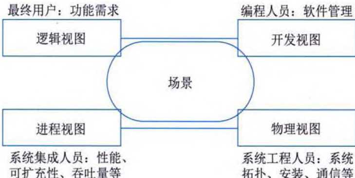  
图 12-1 “4+1” 视图模型  

(1) 逻辑视图。逻辑视图主要支持系统的功能需求, 即系统提供给最终用户的服务。在逻辑视图中, 系统分解成一系列的功能抽象, 这些抽象主要来自问题领域。这种分解不但可以用来进行功能分析, 而且可用作标识在整个系统的各个不同部分的通用机制和设计元素。在 OO技术中, 通过抽象、封装和继承, 可以用对象模型来代表逻辑视图, 用类图来描述逻辑视图。逻辑视图中使用的风格为面向对象的风格, 在设计中要注意保持一个单一的、内聚的对象模型贯穿整个系统。  

(2) 开发视图。开发视图也称为模块视图, 在 UML 中被称为实现视图, 它主要侧重于软件模块的组织和管理。开发视图要考虑软件内部的需求, 例如, 软件开发的容易性、软件复用和软件的通用性, 要充分考虑由于具体开发工具的不同而带来的局限性。开发视图通过系统 I/O 关系的模型图和子系统图来描述。  

(3) 进程视图。进程视图侧重于系统的运行特性, 主要关注一些非功能性需求, 例如, 系统的性能和可用性等。进程视图强调并发性、分布性、系统集成性和容错能力, 以及逻辑视图中的功能抽象如何适合进程结构等, 它也定义了逻辑视图中的各个类的操作具体是在哪一个线程中被执行的。进程视图可以描述成多层抽象, 每个级别分别关注不同的方面。  

(4)物理视图。物理视图在 UML 中被称为部署视图, 主要考虑如何把软件映射到硬件上,它通常要考虑到解决系统拓扑结构、系统安装和通信等问题。当软件运行于不同的物理节点上时, 各视图中的构件都直接或间接地对应于系统的不同节点上。因此, 从软件到节点的映射要有较高的灵活性, 当环境改变时, 对系统其他视图的影响最小化。  

(5) 场景。场景可以看作是那些重要系统活动的抽象, 它使 4 个视图有机联系起来, 从某种意义上说场景是最重要的需求抽象。场景视图对应 UML 中的用例视图。在开发软件架构时, 它可以帮助架构设计师找到构件及其相互关系。同时, 架构设计师也可以用场景来分析一个特  
定的视图，或描述不同视图的构件之间是如何相互作用的。场景可以用文本表示，也可以用图形表示。例如，图 12-2 是一个小型电话呼叫系统场景片段的图形描述，相应的文本表示如下:  

①小王的电话控制器检测和验证电话从挂机到摘机状态的转变，且发送一个消息以唤醒相应的终端对象。  

② 终端分配一定的资源，且通知控制器发出某种拨号音。  

③控制器接收所拨号码并传给终端。  

④ 终端使用编号计划分析号码。  

⑤当一个有效的拨号序列进入时，终端打开一个会话。  

  
图 12-2 本地呼叫场景的一个原型  

从以上分析可知, 逻辑视图和开发视图描述系统的静态结构, 而进程视图和物理视图描述系统的动态结构。对于不同的软件系统来说, 侧重角度也有所不同。例如, 对于 MIS 来说, 比较侧重于从逻辑视图和开发视图来描述系统; 而对于实时控制系统来说, 则比较注重于从进程视图和物理视图来描述系统。  

# 12.3 软件架构风格  

软件架构，即软件体系结构。软件体系结构设计的一个核心目标是重复的体系结构模式，即达到体系结构级的软件重用。也就是说，在不同的软件系统中，使用同一体系结构。基于这个目标，主要任务是研究和实践软件体系结构风格和类型问题。  

# 12.3.1 软件架构风格概述  

软件体系结构风格是描述某一特定应用领域中系统组织方式的惯用模式。体系结构风格定义一个系统家族，即一个体系结构定义一个词汇表和一组约束。词汇表中包含一些构件和连接件类型，而这组约束指出系统是如何将这些构件和连接件组合起来的。体系结构风格反映了领域中众多系统所共有的结构和语义特性，并指导如何将各个模块和子系统有效地组织成一个完整的系统。对软件体系结构风格的研究和实践促进对设计的重用，一些经过实践证实的解决方案也可以可靠地用于解决新的问题。例如，如果某人把系统描述为“客户/服务器”模式，则不必给出设计细节，我们立刻就会明白系统是如何组织和工作的。  
# 12.3.2 数据流体系结构风格  

数据流体系结构是一种计算机体系结构，直接与传统的冯·诺依曼体系结构或控制流体系结构进行了对比。数据流体系结构没有概念上的程序计数器：指令的可执行性和执行仅基于指令输入参数的可用性来确定，因此，指令执行的顺序是不可预测的，即行为是不确定的。数据流体系结构风格主要包括批处理风格和管道-过滤器风格。  

# 1. 批处理体系结构风格  

在批处理风格（如图 12-3 所示）的软件体系结构中，每个处理步骤是一个单独的程序，每一步必须在前一步结束后才能开始，并且数据必须是完整的，以整体的方式传递。它的基本构件是独立的应用程序，连接件是某种类型的媒介。连接件定义了相应的数据流图，表达拓扑结构。  

  
图 12-3 批处理体系结构风格  

# 2. 管道 - 过滤器体系结构风格  

当数据源源不断地产生, 系统就需要对这些数据进行若干处理 (分析、计算、转换等)。现有的解决方案是把系统分解为几个序贯的处理步骤, 这些步骤之间通过数据流连接, 一个步骤的输出是另一个步骤的输入。每个处理步骤由一个过滤器 (Filter) 实现, 处理步骤之间的数据传输由管道 (Pipe) 负责。每个处理步骤 (过滤器) 都有一组输入和输出, 过滤器从管道中读取输入的数据流, 经过内部处理, 然后产生输出数据流并写入管道中。因此, 管道 - 过滤器体系结构风格 (如图 12-4 所示) 的基本构件是过滤器, 连接件是数据流传输管道, 将一个过滤器的输出传到另一过滤器的输入。  

  
图 12-4 管道 - 过滤器体系结构风格  

# 12.3.3 调用/返回体系结构风格  

调用返回体系结构风格是指在系统中采用了调用与返回机制。利用调用 - 返回实际上是一  
种分而治之的策略，其主要思想是将一个复杂的大系统分解为若干子系统，以便降低复杂度，并且增加可修改性。程序从其执行起点开始执行该构件的代码，程序执行结束，将控制返回给程序调用构件。调用/返回体系结构风格主要包括主程序/子程序风格、面向对象风格、层次型风格以及客户端/服务器风格。  

# 1. 主程序 / 子程序风格  

主程序/子程序风格一般采用单线程控制，把问题划分为若干处理步骤，构件即为主程序和子程序。子程序通常可合成为模块。过程调用作为交互机制，即充当连接件。调用关系具有层次性，其语义逻辑表现为子程序的正确性取决于它调用的子程序的正确性。  

  
图 12-5 面向对象体系结构风格  

  
图 12-6 层次型体系结构风格  

# 3. 层次型体系结构风格  

# 4. 客户端 / 服务器体系结构风格  

# 2. 面向对象体系结构风格  

抽象数据类型概念对软件系统有着重要作用, 目前软件界已普遍转向使用面向对象系统。这种风格建立在数据抽象和面向对象的基础上, 数据的表示方法和它们的相应操作封装在一个抽象数据类型或对象中。这种风格的构件是对象, 或者说是抽象数据类型的实例 (如图 12-5 所示)。  

层次系统（如图 12-6 所示）的组成为一个层次结构，每一层为上层提供服务，并作为下层的客户。在一些层次系统中，除了一些精心挑选的输出函数外，内部的层接口只对相邻的层可见。在这样的系统中，构件在层上实现了虚拟机。连接件由决定层间如何交互的协议来定义，拓扑约束包括对相邻层间交互的约束。由于每一层最多只影响两层，同时只要给相邻层提供相同的接口，允许每层用不同的方法实现，这同样为软件重用提供了强大的支持。  

在 IT 发展过程中, 网络计算经历了从集中式计算模型到分布式计算模型的演变。在集中式计算技术时代, 广泛使用的是大型机 (或小型机) 计算模型。它是通过一台物理上与宿主机相连接的非智能终端来实现宿主机上的应用程序。在多用户环境中, 宿主机应用程序既负责与用户的交互, 又负责对数据的管理。集中式的系统使用户能共享贵重的硬件设备, 例如, 磁盘机、打印机和调制解调器等。但随着用户的增多, 对宿主机能力的要求增高, 而且开发人员必须为每个新的应用重新设计同样的数据管理构件。  

20 世纪 80 年代以后, 集中式结构逐渐被以 PC 为主的微机网络所取代。PC 和工作站的采  
用, 永远改变了协作计算模型, 导致了分布式计算模型的产生。一方面, 由于大型机系统固有的缺陷 (例如, 缺乏灵活性), 无法适应信息量急剧增长的需求, 并为整个企业提供全面的解决方案; 另一方面, 由于微处理器的日新月异, 其强大的处理能力和低廉的价格使微机网络迅速发展, 用户可以选择适合自己需要的工作站、操作系统和应用程序。  

# 1) 二层架构  

客户机/服务器（Client/Server，C/S）架构是基于资源不对等，且为实现共享而提出来的， 是20世纪90年代成熟起来的技术，C/S架构定义了工作站（客户应用程序）如何与服务器相 连，以实现数据和应用分布到多台计算机上。服务器负责有效地管理系统的资源，其主要任务 集中于对DBMS的管理和控制，以及数据的备份与恢复；客户应用程序的主要任务是提供用户 与数据库交互的界面，向服务器提交用户请求并接收来自服务器的信息，对存在于客户端的数 据执行应用逻辑要求。这是一种“胖客户机（fat client）、瘦服务器（thin server）”的架构，其 处理流程如图12\-7所示。  

  
图 12-7 C/S 架构的一般处理流程  

与集中式系统相比，C/S架构的优点主要在于，系统的客户应用程序和服务器构件分别运行在不同的计算机上，系统中每台服务器都可以适合各构件的要求，这对于硬件和软件的变化显示出极大的适应性和灵活性，而且易于对系统进行扩充和缩小。在C/S架构中，系统中的功能构件充分隔离，客户应用程序的开发集中于数据的显示和分析，而服务器的开发则集中于数据的管理，不必在每一个新的应用程序中都要对一个DBMS进行编码。将大的应用处理任务分布到许多通过网络连接的低成本计算机上，以节约大量费用。  

C/S 架构具有强大的数据操作和事务处理能力，模型思想简单，易被人们理解和接受。但随着企业规模的日益扩大，软件的复杂程度不断提高，C/S 架构逐渐暴露出以下缺点:  
(1) 开发成本较高。C/S 架构对客户端软硬件配置要求较高, 尤其是软件的不断升级, 对硬件要求不断提高, 增加了整个系统的成本。  

（2）客户端程序设计复杂。采用C/S架构进行软件开发，大部分工作量放在客户端的程序设计上，客户端显得十分庞大。  

(3) 用户界面风格不一, 使用繁杂, 不利于推广使用。  

(4) 软件移植困难。采用不同开发工具或平台开发的软件, 一般互不兼容, 不能或很难移植到其他平台上运行。  

(5) 软件维护和升级困难。采用 C/S 架构的软件要升级, 开发人员必须到现场为客户机升级, 每个客户机上的软件都需要维护。对软件的一个小小改动, 每一个客户端都必须更新。  

(6) 新技术不能轻易应用。因为一个软件平台及开发工具一旦选定, 不可能轻易更改。  

(7) 可扩展性差。C/S 架构是单一服务器且以局域网为中心的, 所以难以扩展至大型企业广域网或 Internet, 软硬件的组合和集成能力有限。客户机的负荷太重, 难以管理大量的客户机, 系统的性能容易变坏。  

(8) 系统安全性难以保证。因为客户端程序可以直接访问数据库服务器, 所以, 在客户端计算机上的其他程序也可想办法访问数据库服务器, 从而使数据库的安全性受到威胁。  

正是因为 C/S 架构有这么多缺点，因此，三层 C/S 架构应运而生。为了区分，把传统的 C/S 架构称为二层 C/S 架构。  

# 2) 三层 C/S 架构  

与二层 C/S 架构相比，在三层 C/S 架构中，增加了一个应用服务器。可以将整个应用逻辑驻留在应用服务器上，而只有表示层存在于客户机上。这种客户机称为瘦客户机（thin client）。三层 C/S 架构将应用系统分成表示层、功能层和数据层三个部分，如图 12-8 所示。  

  
图 12-8 三层 C/S 架构的一般处理流程  
(1) 表示层。表示层是系统的用户接口部分, 担负着用户与系统之间的对话功能。它用于检查用户从键盘等输入的数据, 显示输出的数据。为使用户能直观地进行操作, 通常使用图形用户界面, 操作简单、易学易用。在变更用户界面时, 只需改写显示控制和数据检查程序, 而不影响其他两层。检查的内容也只限于数据的形式和取值的范围, 不包括有关业务本身的处理逻辑。  

(2) 功能层。功能层也称为业务逻辑层, 是将具体的业务处理逻辑编入程序中。例如, 在制作订购合同时要计算合同金额、按照预定的格式配置数据、打印订购合同, 而处理所需的数据则要从表示层或数据层取得。  

(3) 数据层。数据层相当于二层 C/S 架构中的服务器, 负责对 DBMS 进行管理和控制。  

三层 C/S 架构对这三层进行明确分割，并在逻辑上使其独立。在二层 C/S 架构中，数据层作为 DBMS 已经独立出来，所以，三层 C/S 架构的关键是要将表示层和功能层分离成各自独立的程序，并且还要使这两层间的接口简洁明了。通常的做法是只将表示层配置在客户机中，如图 12-9（a）或图 12-9（b）所示。如果像图 12-9（c）所示的那样连功能层也放在客户机中，与二层 C/S 架构相比，其程序的可维护性要好得多，但是其他问题并未得到解决。客户机的负荷太重，其业务处理所需的数据要从服务器传给客户机，所以系统的性能容易变坏。  

  
图 12-9 三层 C/S 架构的物理部署  

如果将功能层和数据层分别放在不同的服务器中, 如图 12-9 (b) 所示, 则服务器之间也要进行数据传送。由于三层是分别放在各自不同的硬件系统上的, 所以灵活性很高, 能够适应客户机数目的增加和处理负荷的变动。例如, 在追加新业务处理时, 可以相应增加装载功能层的服务器 (应用服务器)。因此, 系统规模越大, 这种形态的优点就越显著。在三层 C/S 架构中, 中间件是最重要的构件。  

与传统的二层 C/S 架构相比，三层 C/S 架构具有以下优点:  

(1) 允许合理地划分三层的功能, 使之在逻辑上保持相对独立性, 从而使整个系统的逻辑结构更为清晰, 能提高系统的可维护性和可扩展性。  

(2) 允许更灵活、有效地选用相应的平台和硬件系统, 使之在处理负荷能力上与处理特性上分别适应于结构清晰的三层, 并且这些平台和各个组成部分可以具有良好的可升级性和开放性。  

(3) 系统的各层可以并行开发, 各层也可以选择各自最适合的开发语言, 使之能并行且高  
有效地进行开发，达到较高的性能价格比。对每一层的处理逻辑的开发和维护也会更容易些。  

(4) 利用功能层可以有效地隔离表示层与数据层, 未授权的用户难以绕过功能层而利用数据库工具或黑客手段非法访问数据层, 这就为严格的安全管理奠定了坚实的基础。  

但是，若三层 C/S 架构各层间的通信效率不高，即使分配给各层的硬件能力很强，其作为整体来说也达不到所要求的性能。此外，设计时必须慎重考虑三层间的通信方法、通信频度和数据量，这是三层 C/S 架构设计的关键问题。  

# 3) B/S 架构  

浏览器 / 服务器（Browser/Server, B/S）架构是三层 C/S 架构的一种实现方式，其具体结构为 “浏览器/Web 服务器/数据库服务器”。B/S 架构利用不断成熟的 WWW 浏览器技术，结合浏览器的多种脚本语言，用通用浏览器就实现了原来需要复杂的专用软件才能实现的强大功能，并节约了开发成本。从某种程度上来说，B/S 架构是一种全新的软件架构。  

在B/S架构中，除了数据库服务器外，应用程序以网页形式存放于Web服务器上，用户运行某个应用程序时，只需在客户端的浏览器中键入相应的网址，调用Web服务器上的应用程序，并对数据库进行操作，完成相应的数据处理工作，最后将结果通过浏览器显示给用户。基于B/S架构的软件，系统安装、修改和维护全在服务器端解决。用户在使用系统时，仅仅需要一个浏览器就可运行全部的模块，真正达到了“零客户端”的功能，很容易在运行时自动升级。  

但是，与 C/S 架构相比，B/S 架构也有许多不足之处，例如，缺乏对动态页面的支持能力，没有集成有效的数据库处理功能；安全性难以控制；采用 B/S 架构的系统在数据查询等响应速度上远远低于 C/S 架构；B/S 架构的数据提交一般以页面为单位，数据的动态交互性不强，不利于 OLTP 应用。  

# 12.3.4 以数据为中心的体系结构风格  

以数据为中心的体系结构风格主要包括仓库风格和黑板风格。  

# 1. 仓库体系结构风格  

仓库（repository）是存储和维护数据的中心场所。在仓库体系结构风格（如图 12-10 所示）中，有两种不同的构件：中央数据结构（说明当前数据的状态），以及一组对中央数据进行操作的独立构件，仓库与独立构件间的相互作用在系统中会有大的变化。这种风格的连接件即为仓库与独立构件之间的交互。  

  
图 12-10 仓库体系结构风格  

# 2. 黑板体系结构风格  

黑板体系结构风格（如图 12-11 所示）适用于解决复杂的非结构化问题，能在求解过程中  
综合运用多种不同的知识源，使得问题的表达、组织和求解变得比较容易。黑板系统是一种问题求解模型，是组织推理步骤、控制状态数据和问题求解的领域知识的概念框架。它将问题的解空间组织成一个或多个与应用相关的分级结构。分级结构的每一层信息由一个唯一的词汇来描述，它代表了问题的部分解。领域相关的知识被分成独立的知识模块，它将某一层次中的信息转换成同层或相邻层的信息。各种应用通过不同知识表达方法、推理框架和控制机制的组合来实现。  

  
图 12-11 黑板体系结构风格  

影响黑板系统设计的最大因素是应用问题本身的特性。支撑应用程序的黑板体系结构有许多相似的特征和构件。对于特定应用问题，黑板系统可通过选取各种黑板、知识源和控制模块的构件来设计，也可以利用预先定制的黑板体系结构的编程环境。黑板系统的传统应用是信号处理领域，如语音识别和模式识别。另一应用是松耦合代理数据共享存取。  

# 12.3.5 虚拟机体系结构风格  

虚拟机体系结构风格的基本思想是人为构建一个运行环境，在这个环境之上，可以解析与运行自定义的一些语言，这样来增加架构的灵活性。虚拟机体系结构风格主要包括解释器风格和规则系统风格。  

# 1. 解释器体系结构风格  

一个解释器通常包括完成解释工作的解释引擎，一个包含将被解释的代码的存储区，一个记录解释引擎当前工作状态的数据结构，以及一个记录源代码被解释执行进度的数据结构。  

具有解释器风格（如图 12-12 所示）的软件中含有一个虚拟机，可以仿真硬件的执行过程和一些关键应用。解释器通常被用来建立一种虚拟机以弥合程序语义与硬件语义之间的差异，其缺点是执行效率较低。典型的例子是专家系统。  

  
图 12-12 解释器体系结构风格  
   

# 2. 规则系统体系结构风格  

基于规则的系统（如图 12-13 所示）包括规则集、规则解释器、规则 / 数据选择器及工作内存。  

  
图 12-13 规则系统体系结构风格  

# 12.3.6 独立构件体系结构风格  

独立构件风格主要强调系统中的每个构件都是相对独立的个体，它们之间不直接通信，以降低耦合度，提升灵活性。独立构件风格主要包括进程通信和事件系统风格。  

# 1. 进程通信体系结构风格  

在进程通信结构体系结构风格中，构件是独立的过程，连接件是消息传递。这种风格的特点是：构件通常是命名过程，消息传递的方式可以是点到点、异步或同步方式及远程过程调用等。  

# 2. 事件系统体系结构风格  

事件系统风格（如图 12-14 所示）基于事件的隐式调用风格的思想，构件不直接调用一个过程，而是触发或广播一个或多个事件。系统中其他构件中的过程在一个或多个事件中注册，当一个事件被触发，系统自动调用在这个事件中注册的所有过程，这样，一个事件的触发就导致了另一模块中的过程的调用。  

  
图 12-14 事件系统体系结构风格  
从架构上说，这种风格的构件是一些模块，这些模块既可以是一些过程，又可以是一些事件的集合。过程可以用通用的方式调用，也可以在系统事件中注册一些过程，当发生这些事件时，过程被调用。  

基于事件的隐式调用风格的主要特点是事件的触发者并不知道哪些构件会被这些事件影响。 这使得不能假定构件的处理顺序，甚至不知道哪些过程会被调用，因此，许多隐式调用的系统 也包含显式调用作为构件交互的补充形式。  

支持基于事件的隐式调用的应用系统很多。例如，在编程环境中用于集成各种工具，在数据库管理系统中确保数据的一致性约束，在用户界面系统中管理数据，以及在编辑器中支持语法检查。例如在某系统中，编辑器和变量监视器可以登记相应Debugger 的断点事件。当$n$  

# 12.3.7 面向服务的架构风格  

迄今为止，对于面向服务的架构（Service-Oriented Architecture，SOA）还没有一个公认的 定义。许多组织从不同的角度和不同的侧面对SOA 进行了描述，较为典型的有以下三个：  

(1) W3C 的定义: SOA 是一种应用程序架构, 在这种架构中, 所有功能都定义为独立的服务, 这些服务带有定义明确的可调用接口, 能够以定义好的顺序调用这些服务来形成业务流程。  

(2) Service-architecture.com 的定义: 服务是精确定义、封装完善、独立于其他服务所处环境和状态的函数。SOA 本质上是服务的集合, 服务之间彼此通信, 这种通信可能是简单的数据传送, 也可能是两个或更多的服务协调进行某些活动。服务之间需要某些方法进行连接。  

(3) Gartner 的定义: SOA 是一种 C/S 架构的软件设计方法, 应用由服务和服务使用者组成, SOA 与大多数通用的 C/S 架构模型不同之处, 在于它着重强调构件的松散耦合, 并使用独立的标准接口。  

# 1. SOA 概述  

SOA 是一种在计算环境中设计、开发、部署和管理离散逻辑单元（服务）模型的方法。SOA 并不是一个新鲜事物，而只是面向对象模型的一种替代。虽然基于 SOA 的系统并不排除使用 OOD 来构建单个服务，但是其整体设计却是面向服务的。由于 SOA 考虑到了系统内的对象，所以虽然 SOA 是基于对象的，但是作为一个整体，它却不是面向对象的。  

SOA 系统原型的一个典型例子是 CORBA, 它已经出现很长时间, 其定义的概念与 SOA 相似。SOA 建立在 XML 等新技术的基础上, 通过使用基于 XML 的语言来描述接口, 服务已经转到更动态且更灵活的接口系统中, CORBA 中的 IDL 无法与之相比。图 12-15 描述了一个完整的 SOA 模型。  
   

  
图 12-15 SOA 模型示例  

在 SOA 模型中，所有的功能都定义成了独立的服务。服务之间通过交互和协调完成业务的整体逻辑。所有的服务通过服务总线或流程管理器来连接。这种松散耦合的架构使得各服务在交互过程中无须考虑双方的内部实现细节，以及部署在什么平台上。  

# 1) 服务的基本结构  

一个独立的服务基本结构如图 12-16 所示。  

  
图 12-16 单个服务内部结构  

从图 12-16 可以看出, 服务模型的表示层从逻辑层分离出来, 中间增加了服务对外的接口层。通过服务接口的标准化描述, 使得服务可以提供给任何异构平台和任何用户接口使用。这允许并支持基于服务的系统成为松散耦合、面向构件和跨技术实现的, 服务请求者很可能根本不知道服务在哪里运行、是由哪种语言编写, 以及消息的传输路径, 而是只需要提出服务请求, 然后就会得到答案。  

# 2) SOA 设计原则  

SOA 架构继承了来自对象和构件设计的各种原则，例如，封装和自我包含等。那些保证服务的灵活性、松散耦合和复用能力的设计原则，对 SOA 架构来说同样是非常重要的。关于服务，一些常见的设计原则如下:  

(1) 明确定义的接口。服务请求者依赖于服务规约来调用服务, 因此, 服务定义必须长时间稳定, 一旦公布, 不能随意更改; 服务的定义应尽可能明确, 减少请求者的不适当使用; 不要让请求者看到服务内部的私有数据。  

(2) 自包含和模块化。服务封装了那些在业务上稳定、重复出现的活动和构件, 实现服务的功能实体是完全独立自主的, 独立进行部署、版本控制、自我管理和恢复。  
(3) 粗粒度。服务数量不应该太多, 依靠消息交互而不是远程过程调用, 通常消息量比较大, 但是服务之间的交互频度较低。  

(4) 松耦合。服务请求者可见的是服务的接口, 其位置、实现技术、当前状态和私有数据等, 对服务请求者而言是不可见的。  

(5) 互操作性、兼容和策略声明。为了确保服务规约的全面和明确, 策略成为一个越来越重要的方面。这可以是与技术相关的内容, 例如, 一个服务对安全性方面的要求; 也可以是与业务有关的语义方面的内容, 例如, 需要满足的费用或者服务级别方面的要求, 这些策略服务的交互是非常重要的。  

# 3) 服务构件与传统构件  

服务构件架构（Service Component Architecture, SCA）是基于 SOA 思想描述服务之间组合和协作的规范，它用于描述使用 SOA 构建应用程序和系统的模型。它可简化使用 SOA 进行的应用程序开发和实现工作。SCA 提供了构建粗粒度构件的机制，这些粗粒度构件由细粒度构件组装而成。SCA 将传统中间件编程从业务逻辑分离出来，从而使程序员免受其复杂性的困扰。它允许开发人员集中精力编写业务逻辑，而不必将大量的时间花费在更为底层的技术实现上。  

SCA 服务构件与传统构件的主要区别在于，服务构件往往是粗粒度的，而传统构件以细粒度居多；服务构件的接口是标准的，主要是服务描述语言接口，而传统构件常以具体 API 的形式出现；服务构件的实现与语言是无关的，而传统构件常绑定某种特定的语言；服务构件可以通过构件容器提供 OoS 的服务，而传统构件完全由程序代码直接控制。  

# 2. SOA 的关键技术  

SOA 伴随着无处不在的标准, 为企业的现有资产或投资带来了更好的复用性。SOA 能够在最新的和现有的系统之上创建应用, 借助现有的应用产生新的服务, 为企业提供更好的灵活性来构建系统和业务流程。SOA 是一种全新的架构, 为了支持其各种特性, 相关的技术规范不断推出。与 SOA 紧密相关的技术主要有统一描述、发现和集成 (Universal Description Discovery and Integration, UDDI)、Web 服务描述语言 (Web Service Description Language, WSDL)、简单对象访问协议 (Simple Object Access Protocol, SOAP) 和表述性状态转移 (Representational State Transfer, REST) 等, 而这些技术都是以 XML 为基础发展起来的。  

# 1) UDDI  

UDDI 提供了一种服务发布、查找和定位的方法，是服务的信息注册规范，以便被需要该 服务的用户发现和使用它。UDDI 规范描述了服务的概念，同时也定义了一种编程接口。通过 UDDI 提供的标准接口，企业可以发布自己的服务供其他企业查询和调用，也可以查询特定服 务的描述信息，并动态绑定到该服务上。  

在 UDDI 技术规范中，主要包含以下三部分内容:  

(1) 数据模型。UDDI 数据模型是一个用于描述业务组织和服务的 XML Schema。  

(2) API。UDDI API 是一组用于查找或发布 UDDI 数据的方法，UDDI API 基于 SOAP。  

(3)注册服务。UDDI注册服务是SOA中的一种基础设施，对应着服务注册中心的角色。  
   

# 2) WSDL  

WSDL 是对服务进行描述的语言，它有一套基于XML 的语法定义。WSDL 描述的重点是服务，它包含服务实现定义和服务接口定义，如图 12-17 所示。  

  
图 12-17 基本服务描述  

采用抽象接口定义对于提高系统的扩展性很有帮 助。服务接口定义就是一种抽象的、可重用的定义， 行业标准组织可以使用这种抽象的定义来规定一些标 准的服务类型，服务实现者可以根据这些标准定义来 实现具体的服务。  

服务实现定义描述了给定服务提供者如何实现特  

定的服务接口。服务实现定义中包含对服务和端口的描述。一个服务往往会包含多个服务访问入口，而每个访问入口都会使用一个端口元素来描述。端口描述的是一个服务访问入口的部署细节，例如，通过哪个地址来访问，应当使用怎样的消息调用模式来访问等。  

# 3) SOAP  

SOAP 定义了服务请求者和服务提供者之间的消息传输规范。SOAP 用 XML 来格式化消息，用 HTTP 来承载消息。通过 SOAP，应用程序可以在网络中进行数据交换和远程过程调用（Remote Procedure Call，RPC）。SOAP 主要包括以下 4 个部分：  

(1) 封装。SOAP 封装定义了一个整体框架, 用来表示消息中包含什么内容, 谁来处理这些内容, 以及这些内容是可选的还是必须的。  

(2) 编码规则。SOAP 编码规则定义了一种序列化的机制, 用于交换系统所定义的数据类型的实例。  

(3) RPC 表示。SOAP RPC 表示定义了一个用来表示远程过程调用和应答的协议。  

(4) 绑定。SOAP 绑定定义了一个使用底层传输协议来完成在节点之间交换 SOAP 封装的约定。  

SOAP 消息基本上是从发送端到接收端的单向传输，但它们常常结合起来执行类似于请求/ 应答的模式。所有的 SOAP 消息都使用 XML 进行编码。SOAP 消息包括以下三个部分：  

(1) 封装（信封）。封装的元素名是 Envelope，在表示消息的 XML 文档中，封装是顶层元素，在 SOAP 消息中必须出现。  

(2) SOAP 头。SOAP 头的元素名是 Header, 提供了向 SOAP 消息中添加关于这条 SOAP 消息的某些要素的机制。SOAP 定义了少量的属性用来表明这项要素是否可选以及由谁来处理。SOAP 头在 SOAP 消息中可能出现, 也可能不出现。如果出现的话, 必须是 SOAP 封装元素的第一个直接子元素。  

(3) SOAP 体。SOAP 体的元素名是 Body, 是包含消息的最终接收者想要的信息的容器。SOAP 体在 SOAP 消息中必须出现且必须是 SOAP 封装元素的直接子元素。如果有头元素, 则 SOAP 体必须直接跟在 SOAP 头元素之后; 如果没有头元素, 则 SOAP 体必须是 SOAP 封装元素的第一个直接子元素。  
# 4) REST  

REST 是一种只使用 HTTP 和 XML 进行基于 Web 通信的技术，可以降低开发的复杂性， 提高系统的可伸缩性。它的简单性和缺少严格配置文件的特性，使它与 SOAP 很好地隔离开。 REST 从根本上来说只支持几个操作（POST、GET、PUT 和 DELETE），这些操作适用于所有 的消息。REST 提出了如下一些设计概念和准则：  

(1) 网络上的所有事物都被抽象为资源。  

(2) 每个资源对应一个唯一的资源标识。  

(3) 通过通用的连接件接口对资源进行操作。  

(4) 对资源的各种操作不会改变资源标识。  

(5) 所有的操作都是无状态的。  

# 3. SOA 的实现方法  

SOA 只是一种概念和思想, 需要借助于具体的技术和方法来实现它。从本质上来看, SOA 是用本地计算模型来实现一个分布式的计算应用, 也有人称这种方法为 “本地化设计, 分布式工作” 模型。CORBA、DCOM 和 EJB 等都属于这种解决方式, 也就是说, SOA 最终可以基于这些标准来实现。另外, 这些标准分别使用的 ORB、RPC 和远程方法调用 (Remote Method Invocation, RMI) 等技术, 感兴趣的同学可进一步阅读其他书籍学习, 此处不再赘述。  

从逻辑上和高层抽象来看，目前，实现SOA的方法也比较多，其中主流方式有Web Service、企业服务总线和服务注册表。  

# 1) Web Service  

在 Web Service（Web 服务）的解决方案中，一共有三种工作角色，其中服务提供者和服务请求者是必须的，服务注册中心是一个可选的角色。它们之间的交互和操作构成了SOA 的一种实现架构，如图 12-18 所示。  

(1) 服务提供者。服务提供者是服务的 所有者，该角色负责定义并实现服务，使用 WSDL 对服务进行详细、准确、规范的描述， 并将该描述发布到服务注册中心，供服务请求 者查找并绑定使用。  

  
图 12-18 Web Service 模型  

(2) 服务请求者。服务请求者是服务的使用者, 虽然服务面向的是程序, 但程序的最终使用者仍然是用户。从架构的角度看, 服务请求者是查找、绑定并调用服务, 或与服务进行交互的应用程序。服务请求者角色可以由浏览器来担当, 由人或程序（例如, 另外一个服务）来控制。  

(3) 服务注册中心。服务注册中心是连接服务提供者和服务请求者的纽带, 服务提供者在此发布他们的服务描述, 而服务请求者在服务注册中心查找他们需要的服务。不过, 在某些情况下, 服务注册中心是整个模型中的可选角色。例如, 如果使用静态绑定的服务, 则服务提供者可以把描述直接发送给服务请求者。  
   

Web Service 模型中的操作包括发布、查找和绑定等，可以单次或反复出现。  

(1)发布。为了使用户能够访问服务，服务提供者需要发布服务描述，以便服务请求者可以查找它。  

(2)查找。在查找操作中, 服务请求者直接检索服务描述或在服务注册中心查询所要求的服务类型。对服务请求者而言, 可能会在生命周期的两个不同阶段中涉及查找操作, 首先是在设计阶段, 为了程序开发而查找服务的接口描述; 其次是在运行阶段, 为了调用而查找服务的位置描述。  

(3) 绑定。在绑定操作中, 服务请求者使用服务描述中的绑定细节来定位、联系并调用服务, 从而在运行时与服务进行交互。绑定可以分为动态绑定和静态绑定。在动态绑定中, 服务请求者通过服务注册中心查找服务描述, 并动态地与服务交互; 在静态绑定中, 服务请求者已经与服务提供者达成默契, 通过本地文件或其他方式直接与服务进行绑定。  

在采用 Web Service 作为 SOA 的实现技术时，应用系统大致可以分为如下 6 个层次：底层传输层、服务通信协议层、服务描述层、服务层、业务流程层和服务注册层。  

(1) 底层传输层。底层传输层主要负责消息的传输机制，HTTP、Java 消息服务（Java Messaging Service，JMS）和 SMTP 都可以作为服务的消息传输协议，其中 HTTP 使用最广。  

(2) 服务通信协议层。服务通信协议层的主要功能是描述并定义服务之间进行消息传递所需的技术标准, 常用的标准是 SOAP 和 REST 协议。  

(3) 服务描述层。服务描述层主要以一种统一的方式描述服务的接口与消息交换方式, 相关的标准是 WSDL。  

(4) 服务层。服务层的主要功能是将遗留系统进行包装，并通过发布的 WSDL 接口描述来定位和调用处于服务层的服务。  

(5) 业务流程层。业务流程层的主要功能是支持服务发现, 服务调用和点到点的服务调用,并将业务流程从服务的底层调用抽象出来。相关的标准是 WSBPEL, 有关 WSBPEL 的详细知识见 10.5.4 小节。  

(6) 服务注册层。服务注册层的主要功能是使服务提供者能够通过 WSDL 发布服务定义,并支持服务请求者查找所需的服务信息。相关的标准是 UDDI。  

# 2) 服务注册表  

服务注册表（service registry）虽然也具有运行时的功能，但主要在SOA设计时使用。它提供一个策略执行点（Policy Enforcement Point, PEP），在这个点上，服务可以在SOA中注册，从而可以被发现和使用。服务注册表可以包括有关服务和相关构件的配置、依从性和约束文件。从理论上来说，任何帮助服务注册、发现和查找服务合约、元数据和策略的信息库、数据库、目录或其他节点都可以被认为是一个注册表。大多数商用服务注册产品支持服务注册、服务位置和服务绑定功能。  

(1) 服务注册。服务注册是指服务提供者向服务注册表发布服务的功能（服务合约），包括服务身份、位置、方法、绑定、配置、方案和策略等描述性属性。使用服务注册表实现SOA时，要限制哪些新服务可以向注册表发布、由谁发布以及谁批准和根据什么条件批准等，以便使服务能够有序地注册。  
(2) 服务位置。服务位置是帮助服务使用者查询已注册的服务, 寻找符合自身要求的服务。这种查找主要是通过检索服务合约来实现的, 在使用服务注册表实现 SOA 时, 需要规定哪些用户可以访问服务注册表, 以及哪些服务属性可以通过服务注册表进行暴露等。  

(3) 服务绑定。服务使用者利用查找到的服务合约来开发代码, 开发的代码将与注册的服务进行绑定, 调用注册的服务, 以及与它们实现互动。可以利用集成的开发环境自动将新开发的服务与不同的新协议、方案和程序间通信所需的其他接口绑定在一起。  

# 3）企业服务总线  

ESB 的概念是从 SOA 发展而来的，它是一种为进行连接服务提供的标准化的通信基础结构，基于开放的标准，为应用提供了一个可靠的、可度量的和高度安全的环境，并可帮助企业对业务流程进行设计和模拟，对每个业务流程实施控制和跟踪、分析并改进流程和性能。  

在一个复杂的企业计算环境中，如果服务提供者和服务请求者之间采用直接的端到端的交 互，那么随着企业信息系统的增加和复杂度的提高，系统之间的关联会逐渐变得非常复杂，形 成一个网状结构，这将带来昂贵的系统维护费用，同时也使得IT 基础设施的复用变得困难重 重。ESB 提供了一种基础设施，消除了服务请求者与服务提供者之间的直接连接，使得服务请 求者与服务提供者之间进一步解耦。  

ESB 是由中间件技术实现并支持 SOA 的一组基础架构，是传统中间件技术与 XML、Web Service 等技术结合的产物，是在整个企业集成架构下的面向服务的企业应用集成机制。具体来说，ESB 具有以下功能:  

(1) 支持异构环境中的服务、消息和基于事件的交互，并且具有适当的服务级别和可管理性。  

(2) 通过使用 ESB, 可以在几乎不更改代码的情况下, 以一种无缝的非侵入方式使现有系统具有全新的服务接口, 并能够在部署环境中支持任何标准。  

(3) 充当缓冲器的ESB（负责在诸多服务之间转换业务逻辑和数据格式）与服务逻辑相分离， 从而使不同的系统可以同时使用同一个服务，用不着在系统或数据发生变化时，改动服务代码。  

(4) 在更高的层次, ESB 还提供诸如服务管理和协议转换等功能。允许在多种形式下通过像 HTTP、SOAP 和 JMS 总线的多种传输方式, 主要是以网络服务的形式, 为发表、注册、发现和使用企业服务或界面提供基础设施。  

(5) 提供可配置的消息转换翻译机制和基于消息内容的消息路由服务, 传输消息到不同的目的地。  

(6) 提供安全和拥有者机制, 以保证消息和服务使用的认证、授权和完整性。  

在企业应用集成方面，与现存的、专有的集成解决方案相比，ESB 具有以下优势：  

(1) 扩展的、基于标准的连接。ESB 形成一个基于标准的信息骨架, 使得在系统内部和整个价值链中可以容易地进行异步或同步数据交换。ESB 通过使用 XML、SOAP 和其他标准, 提供了更强大的系统连接性。  

(2) 灵活的、服务导向的应用组合。基于 SOA, ESB 使复杂的分布式系统（包括跨多个应用、系统和防火墙的集成方案）能够由以前开发测试过的服务组合而成，使系统具有高度可扩展性。  
 

(3) 提高复用率, 降低成本。按照 SOA 方法构建应用, 提高了复用率, 简化了维护工作, 进而减少了系统总体成本。  

(4) 减少市场反应时间, 提高生产率。ESB 通过构件和服务复用, 按照 SOA 的思想简化应用组合, 基于标准的通信、转换和连接来实现这些优点。  

# 12.4 软件架构标准  

软件架构作为一个概念起源于 1968 年 Edsger Dijkstra 和 20 世纪 70 年代初 David Parnas 的研究, 直到 1990 年, 软件架构一词才得到广泛使用。计算机科学领域自形成就遇到了与复杂性相关的问题。早期开发人员通过选择正确的数据结构、开发算法和应用关注点的分离来解决复杂问题。伴随着软件密集型系统的出现, 学者开始重视软件架构标准的设计。IEEE 1471-2000 是软件架构领域的第一个针对 “软件密集型系统架构描述的推荐实现” 的正式标准, 侧重于软件密集型系统和更通用的软件系统, 例如信息系统、嵌入式系统等, 在软件开发、操作和演进中起着重要作用。为了达到软件架构标准, 降低软件复杂度, 以得到论域中较为简单的概念, IEEE 1471-2000 定义了以下软件架构标准要素之间的关系, 具体分为 5 个层次:  

(1)任务(Mission)。任务是指一种使用或操作, 是一个系统想要满足一名或多名利益相关者的目标, 为达成这个目标, 完成相对应的软件架构设计。这是软件架构标准设计的第一步,即需要明确软件的任务是什么, 从而根据任务来进行软件架构的设计。任务通常可以是为了更大的利益、为了更高的市场占有率或完善产品系列等, 这是软件架构标准中的第一层设计标准。  

(2) 环境 (Environment)、系统 (System) 以及架构 (Architecture)。一个完整的系统是由一系列组件组成的, 将这些组件组织在一起, 相互作用从而完成一个或者一些特殊的功能。在软件开发过程中, 系统是任何对其设计、构造、部署和演变有重要影响的组成, 包括单个应用程序、传统意义上的系统、子系统、产品线、产品系列、整个企业和其他利益。同时系统不可能单独存在, 它总是存在于一个环境之中。在软件架构标准中, 将系统范围之外的、对系统有影响、有交互的客观存在定义为环境, 有时也称为上下文。并且每一个系统都应该实现一种或多种的软件架构, 无论是否有意设计或者自发形成, 这是软件架构标准中为了完成任务所进行的第二层设计标准。  

(3) 利益相关者 (Stackholder)、架构说明 (Architecture Description) 以及原理 (Rationale)。一个系统拥有多个利益相关者, 并且系统架构也需要架构说明来进行描述, 从而满足不同利益相关者的利益, 从架构描述中可以识别出不同利益相关者的相关利益。同时在设计软件架构时, 软件架构工程师需要做出许多取舍以及选择, 需要给出选择或者不选择的理由, 以及架构设计是如何满足功能性需求和非功能性需求的, 这是软件架构标准第三层的设计标准。  

(4) 关注 (Concern)、关注点 (Viewpoint)、视图 (View)。一个系统的利益相关者对系统和与其有关的问题进行关注。一个关注点可能由一个或多个利益相关者持有。在整个生命周期中, 对系统的需求和要求以及实施和运行的考虑等都可能成为关注点。关注点可以通过多种形式表现出来, 例如与一个或多个利益相关者的需求、目标、期望、责任、要求、设计约束、假设、依赖性、质量属性、架构决策、风险或其他与系统有关的问题有关。不同的利益相关者其  
关注点不尽相同，有时甚至是矛盾的。站在不同的关注点，就会对系统架构形成不同的视图，视图和关注点是一一对应的关系。并且视图受关注点的制约：关注点确立了构建、解释和分析视图的规范。关注点的制约可以包括语言、符号、模型种类、设计规则，以及建模方法、分析技术和其他对视图的操作。  

(5) 关注点库 (Library Viewpoint)、模型 (Model)。关注点库中存放了前人针对各种系统、各种不同的利益相关者、各种不同的关注点总结出来的观察点，方便后人参考使用。  

Model, 可直译为模型, 它是用来表示视图的方法, 即使用图形化的表示, 将不同视图下的系统元素组织起来, 并将这些元素整体发挥的作用表现出来。  

IEEE 1471-2000 作为第一个软件架构设计的标准, 侧重于软件架构标准的描述, 而不是软件架构的组建过程。首先, IEEE 1471-2000 定义了软件架构元素的内容。其次, 它指出软件架构必须存在一个或多个视图, 这些视图必须能反映利益相关者的关注点。最后, 必须根据每个被认定为关键架构的原理, 来演示软件架构工程师考虑的权衡, 展示对于软件架构设计的取舍。通过对关键概念和术语的定义, 该标准为软件架构的实践提供了基础, 并作为未来架构发展的基础。其各个要素的关系如图 12-19 所示。  

  
图 12-19 IEEE 1471-2000 软件架构元素及要素间的关系  

2006年，ISO采纳了IEEE 1471-2000作为内部标准，然后IEEE与ISO一起修订，并经过多次修改，最终发布ISO/IEC/IEEE 42010：2022-Software, Systems and Enterprise Architecture Description，该标准是目前公认的软件架构标准。  
   

# 12.5 软件架构实现  

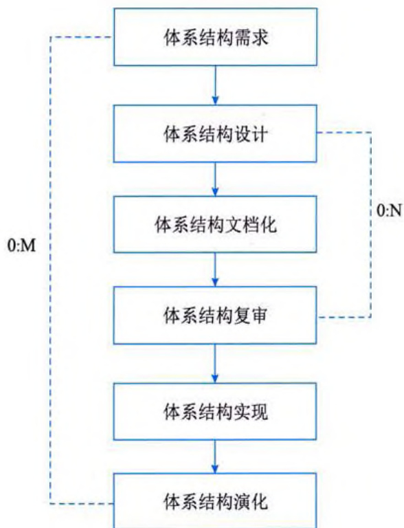  
图 12-20 基于架构的软件开发模型  

  
图 12-21 体系结构需求过程  

传统的软件开发过程从概念到实现可以划分为若干个阶段，包括问题定义、需求分析、软件设计、软件实现及软件测试等。如果采用传统的软件开发模型，软件体系结构的建立应位于需求分析之后、概要设计之前。  

传统软件开发模型存在开发效率不高、不能很好地支持软件重用等缺点。基于架构的软件开发模型（ABSDM）把整个基于体系结构的软件过程划分为体系结构需求、设计、文档化、复审、实现和演化等6个子过程，如图12-20所示。  

# 2. 标识构件  

# 12.5.1 体系结构需求  

需求是指用户对目标软件系统在功能、行 为、性能、设计约束等方面的期望。体系结构 需求受技术环境和体系结构设计师的经验影响。 需求过程主要是获取用户需求，标识系统中所 要用到的构件。体系结构需求过程如图12\-21 所示。如果以前有类似的系统体系结构的需求， 我们可以从需求库中取出，加以利用和修改， 以节省需求获取的时间，减少重复劳动，提高 开发效率。  

# 1. 需求获取  

体系结构需求一般来自三个方面，分别是 系统的质量目标、系统的商业目标和系统开发 人员的商业目标。软件体系结构需求获取过程 主要是定义开发人员必须实现的软件功能，使 得用户能完成他们的任务，从而满足业务上的 功能需求。与此同时，还要获得软件质量属性， 满足一些非功能需求。  

在图 12-21 中虚线框部分属于标识构件过程, 此过程为系统生成初始逻辑结构, 包含大致的构件。这一过程又可分为三步来实现。  

第一步：生成类图。生成类图的 CASE 工具有很多，例如 Rational Rose 2000 能自动生成  
类图。  

第二步：对类进行分组。在生成的类图基础上，使用一些标准对类进行分组可以大大简化类图结构，使之更清晰。一般地，与其他类隔离的类形成一个组，由概括关联的类组成一个附加组，由聚合或合成关联的类也形成一个附加组。  

第三步：把类打包成构件。把在第二步得到的类簇打包成构件，这些构件可以分组合并成更大的构件。  

# 3. 架构需求评审  

组织一个由不同代表（如分析人员、客户、设计人员、测试人员）组成的小组，对体系结构需求及相关构件进行仔细的审查。审查的主要内容包括所获取的需求是否真实反映了用户的要求，类的分组是否合理，构件合并是否合理等。必要时，可以在“需求获取一标识构件一需求评审”之间进行迭代。  

# 12.5.2 体系结构设计  

体系结构需求用来激发和调整设计决策，不同的视图被 用来表达与质量目标有关的信息。体系结构设计是一个迭代 过程，如果要开发的系统能够从已有的系统中导出大部分， 则可以使用已有系统的设计过程。软件体系结构设计过程如 图12\-22 所示。  

# 1. 提出体系结构模型  

在建立体系结构的初期，选择一个合适的体系结构风格是首要的。在这个风格基础上，开发人员通过体系结构模型，可以获得关于体系结构属性的理解。此时，虽然这个模型是理想化的（其中的某些部分可能错误地表示了应用的特征），但是，该模型为将来的实现和演化过程建立了目标。  

  
图 12-22 软件体系结构设计过程  

# 2. 映射构件  

把在体系结构需求阶段已标识的构件映射到体系结构中，将产生一个中间结构，这个中间结构只包含那些能明确适合体系结构模型的构件。  

# 3. 分析构件间的相互作用  

为了把所有已标识的构件集成到体系结构中，必须认真分析这些构件的相互作用和关系。  

# 4. 产生体系结构  

一旦决定了关键的构件之间的关系和相互作用，就可以在第2阶段得到的中间结构的基础上进行精化。  

# 5. 设计评审  

一旦设计了软件体系结构，必须邀请独立于系统开发的外部人员对体系结构进行评审。  
   

# 12.5.3 体系结构文档化  

绝大多数的体系结构都是抽象的，由一些概念上的构件组成。例如，层的概念在任何程序设计语言中都不存在。因此，要让系统分析员和程序员去实现体系结构，还必须要把体系结构进行文档化。在系统演化的每一个阶段，文档都是系统设计与开发人员的通信媒介，是为验证体系结构设计和提炼或修改这些设计（必要时）所执行预先分析的基础。  

体系结构文档化过程的主要输出结果是体系结构规格说明和测试体系结构需求的质量设计说明书这两个文档。这些文档是需求模型构件的精确的形式化的描述，作为用户和开发者之间的一个协约。软件体系结构文档的要求与软件开发项目中的其他文档是类似的。文档的完整性和质量是软件体系结构成功的关键因素。文档要从使用者的角度进行编写，必须分发给所有与系统有关的开发人员，且必须保证开发者手上的文档是最新的。  

# 12.5.4 体系结构复审  

从图 12-20 中可以看出, 体系结构设计、体系结构文档化和体系结构复审是一个迭代过程。从这个角度来说, 在分析一个主版本的软件体系结构之后, 要安排一次由外部人员 (用户代表和领域专家) 参加的复审。  

鉴于体系结构文档标准化，以及风险识别的现实情况，通常我们根据架构设计，搭建一个可运行的最小化系统用于评估和测试体系架构是否满足需要，是否存在可识别的技术和协作风险。  

复审的目的是标识潜在的风险，及早发现体系结构设计中的缺陷和错误，包括体系结构能 否满足需求、质量需求是否在设计中得到体现、层次是否清晰、构件的划分是否合理、文档表 达是否明确、构件的设计是否满足功能与性能的要求等。  

# 12.5.5 体系结构实现  

所谓“实现”就是要用实体来显示出一个软件体系结构，即要符合体系结构所描述的结构性设计决策，分割成规定的构件，按规定方式互相交互。体系结构的实现过程如图 12-23 所示。  

  
图 12-23 体系结构实现过程  

图 12-23 中的虚线框部分是体系结构的实现过程。整个实现过程是以复审后的文档化的体系结构说明书为基础的, 每个构件必须满足软件体系结构中说明的对其他构件的责任。这些决定即实现的约束是在系统级或项目范围内给出的, 每个构件上工作的实现者是看不见的。  

在体系结构说明书中，已经定义了系统中的构件与构件之间的关系。因为在体系结构层次上，构件接口约束对外唯一地代表了构件，所以可以从构件库中查找符合接口约束的构件，必要时开发新的满足要求的构件。然后，按照设计提供的结构，通过组装支持工具把这些构件的实现  
体组装起来，完成整个软件系统的连接与合成。  

最后一步是测试，包括单个构件的功能性测试和被组装应用的整体功能和性能测试。  

# 12.5.6 体系结构的演化  

在构件开发过程中，用户的需求可能还有变动。在软件开发完毕，正常运行后，由一个单位移植到另一个单位，需求也会发生变化。在这两种情况下，就必须相应地修改软件体系结构，以适应新的变化了的软件需求。体系结构演化过程如图 12-24 所示。  

体系结构演化是使用系统演化步骤去修改应用，以满足新的需求。主要包括以下6个步骤。  

# 1. 需求变化归类  

首先必须对用户需求的变化进行归类，使变 化的需求与已有构件对应。对找不到对应构件的 变动，要特别做好标记，在后续工作中，将创建 新的构件，以对应这部分变化的需求。  

  
图 12-24 体系结构演化过程  

# 2. 制订体系结构演化计划  

在改变原有结构之前，开发组织必须制订一个周密的体系结构演化计划，作为后续演化开发工作的指南。  

# 3. 修改、增加或删除构件  

在演化计划的基础上，开发人员可根据在第1步得到的需求变动的归类情况，决定是否修改或删除存在的构件、增加新构件。最后，对修改和增加的构件进行功能性测试。  

# 4. 更新构件的相互作用  

随着构件的增加、删除和修改，构件之间的控制流必须得到更新。  

# 5. 构件组装与测试  

通过组装支持工具把这些构件的实现体组装起来，完成整个软件系统的连接与合成，形成 新的体系结构。然后对组装后的系统整体功能和性能进行测试。  

# 6. 技术评审  

对以上步骤进行确认，进行技术评审。评审组装后的体系结构是否反映需求变动，符合用户需求。如果不符合，则需要在第2\~6步之间进行迭代。  

在原来系统上所作的所有修改必须集成到原来的体系结构中，完成一次演化过程。  
  

 

# 12.6 软件架构质量属性  

软件系统属性包括功能属性和质量属性，软件架构重点关注的是质量属性。架构的基本需求是在满足功能属性的前提下，关注软件系统质量属性。为了精确、定量地表达系统的质量属性，通常会采用质量属性场景的方式进行描述。  

在确定软件系统架构，精确描述质量属性场景后，就需要对系统架构进行评估。软件架构评估是在对架构分析、评估的基础上，对架构策略的选取进行决策。它也可以灵活地运用于软件架构评审等工作。  

# 12.6.1 质量属性概念  

软件系统的质量就是“软件系统与明确地和隐含地定义的需求相一致的程度”。更具体地说，软件系统质量是软件与明确叙述的功能和性能需求文档中明确描述的开发标准以及任何专业开发的软件产品都应该具有的隐含特征相一致的程度。根据 GB/T 25000.10—2016 的定义，从管理角度对软件系统质量进行度量，可将影响软件质量的主要因素划分为 6 种维度特性：功能性、可靠性、易用性、效率、维护性与可移植性。其中，功能性包括适合性、准确性、互操作性、依从性和安全性；可靠性包括容错性、易恢复性和成熟性；易用性包括易学性、易理解性和易操作性；效率包括资源特性和时间特性；维护性包括可修改性、可修改性、稳定性和易分析性；可移植性包括适应性、易安装性、一致性和可替换性。  

软件系统质量属性（Quality Attribute）是一个系统的可测量或者可测试的属性，用来描述系统满足利益相关者（Stakeholders）需求的程度。基于软件系统的生命周期，可以将软件系统的质量属性分为开发期质量属性和运行期质量属性两部分。  

# 1. 开发期质量属性  

开发期质量属性主要指在软件开发阶段所关注的质量属性，主要包含以下6个方面:  

(1) 易理解性: 指设计被开发人员理解的难易程度。  

(2) 可扩展性: 指软件因适应新需求或需求变化而增加新功能的能力, 也称为灵活性。  

(3) 可重用性: 指重用软件系统或某一部分的难易程度。  

(4) 可测试性: 指对软件测试以证明其满足需求规范的难易程度。  

(5) 可维护性: 当需要修改缺陷、增加功能、提高质量属性时, 识别修改点并实施修改的难易程度。  

(6) 可移植性: 将软件系统从一个运行环境转移到另一个不同的运行环境的难易程度。  

# 2. 运行期质量属性  

运行期质量属性主要指在软件运行阶段所关注的质量属性，主要包含以下7个方面:  

(1) 性能: 指软件系统及时提供相应服务的能力, 如速度、吞吐量和容量等的要求。  

(2) 安全性: 指软件系统同时兼顾向合法用户提供服务, 以及阻止非授权使用的能力。  

(3) 可伸缩性: 指当用户数和数据量增加时, 软件系统维持高服务质量的能力。例如, 通过增加服务器来提高能力。  
(4) 互操作性: 指本软件系统与其他系统交换数据和相互调用服务的难易程度。  

(5) 可靠性: 指软件系统在一定的时间内持续无故障运行的能力。  

(6) 可用性: 指系统在一定时间内正常工作的时间所占的比例。可用性会受到系统错误、恶意攻击和高负载等问题的影响。  

(7)健壮性: 指软件系统在非正常情况（如用户进行了非法操作、相关的软硬件系统发生了故障等）下仍能够正常运行的能力, 也称为鲁棒性或容错性。  

# 12.6.2 面向架构评估的质量属性  

为了评价一个软件系统，特别是软件系统的架构，需要进行架构评估。在架构评估过程中，评估人员所关注的是系统的质量属性。评估方法所普遍关注的质量属性有以下几种。  

# 1. 性能  

性能（Performance）是指系统的响应能力，即要经过多年长时间才能对某个事件做出响应，或者在某段时间内系统所能处理的事件的个数。经常用单位时间内所处理事务的数量或系统完成某个事务处理所需的时间来对性能进行定量的表示。性能测试经常要使用基准测试程序。  

# 2. 可靠性  

可靠性（Reliability）是软件系统在应用或系统错误面前，在意外或错误使用的情况下维持软件系统的功能特性的基本能力。可靠性是最重要的软件特性，通常用来衡量在规定的条件和时间内，软件完成规定功能的能力。可靠性通常用平均无故障时间（MTTF）和平均故障间隔时间（MTBF）来衡量。在失效率为常数和修复时间很短的情况下，MTTF 和 MTBF 几乎相等。可靠性可以分为两个方面。  

(1)容错。其目的是在错误发生时确保系统正确的行为，并进行内部“修复”。例如，在一个分布式软件系统中失去了一个与远程构件的连接，接下来恢复了连接。在修复这样的错误之后，软件系统可以重新或重复执行进程间的操作直到错误再次发生。  

(2)健壮性。这里说的健壮性是保护应用程序不受错误使用和错误输入的影响, 在发生意外错误事件时确保应用系统处于预先定义好的状态。值得注意的是, 和容错相比, 健壮性并不是指在错误发生时软件可以继续运行, 它只能保证软件按照某种已经定义好的方式终止执行。软件架构对软件系统的可靠性有巨大的影响。例如, 软件架构设计上通过在应用程序内部采用冗余机制, 或集成监控构件和异常处理, 以提升系统可靠性。  

# 3. 可用性  

可用性（Availability）是系统能够正常运行的时间比例，经常用两次故障之间的时间长度或在出现故障时系统能够恢复正常的速度来表示。  

# 4. 安全性  

安全性（Security）是指系统在向合法用户提供服务的同时能够阻止非授权用户使用的企图或拒绝服务的能力。安全性可根据系统可能受到的安全威胁类型来分类。安全性又可划分为机密性、完整性、不可否认性及可控性等特性。其中，机密性保证信息不泄露给未授权的用户、  
实体或过程；完整性保证信息的完整和准确，防止信息被非法修改；不可否认性是指信息交换 的双方不能否认其在交换过程中发送信息或接收信息的行为；可控性保证对信息的传播及内容 具有控制的能力，防止为非法者所用。  

# 5. 可修改性  

可修改性（Modifiability）是指能够快速地以较高的性价比对系统进行变更的能力。通常 以某些具体的变更为基准，通过考察这些变更的代价衡量可修改性。可修改性包含以下4个 方面。  

(1) 可维护性 (Maintainability)。这主要体现在问题的修复上: 在错误发生后 “修复” 软件系统。可维护性好的软件架构往往能做局部性的修改, 并能使这种修改对其他构件的负面影响最小化。  

(2) 可扩展性 (Extendibility)。这一点关注的是使用新特性来扩展软件系统, 以及使用改进版本方式替换构件并删除不需要或不必要的特性和构件。为了实现可扩展性, 软件系统需要松散耦合的构件。其目标是实现一种架构, 能使开发人员在不影响构件客户的情况下替换构件。支持把新构件集成到现有的架构中也是必要的。  

(3) 结构重组 (Reassemble)。这一点处理的是重新组织软件系统的构件及构件间的关系,例如通过将构件移动到一个不同的子系统来改变它的位置。为了支持结构重组, 软件系统需要精心设计构件之间的关系。理想情况下, 它们允许开发人员在不影响实现的主体部分的情况下灵活地配置构件。  

(4) 可移植性 (Portability)。可移植性使软件系统适用于多种硬件平台、用户界面、操作系统、编程语言或编译器。为了实现可移植, 需要按照硬件、软件无关的方式组织软件系统。可移植性是系统能够在不同计算环境下运行的能力, 这些环境可能是硬件、软件, 也可能是两者的结合。如果移植到新的系统需要做适当更改, 则该可移植性就是一种特殊的可修改性。  

# 6. 功能性  

功能性（Functionality）是系统完成所期望工作的能力。一项任务的完成需要系统中许多或 大多数构件的相互协作。  

# 7. 可变性  

可变性（Changeability）是指架构经扩充或变更而成为新架构的能力。这种新架构应该符合预先定义的规则，在某些具体方面不同于原有的架构。当要将某个架构作为一系列相关产品（例如，软件产品线）的基础时，可变性是很重要的。  

# 8. 互操作性  

作为系统组成部分的软件不是独立存在的，通常与其他系统或自身环境相互作用。为了支持互操作性，软件架构必须为外部可视的功能特性和数据结构提供精心设计的软件入口。程序和用其他编程语言编写的软件系统的交互作用就是互操作性的问题，这种互操作性也影响应用的软件架构。  
# 12.6.3 质量属性场景描述  

为了精确描述软件系统的质量属性，通常采用质量属性场景（Quality Attribute Scenario）作为描述质量属性的手段。质量属性场景是一个具体的质量属性需求，是利益相关者与系统的交互的简短陈述。  

质量属性场景是一种面向特定质量属性的需求。它由6部分组成:  

刺激源（Source）：指某个生成该刺激的实体（人、计算机系统或者任何其他刺激器）。  

刺激（Stimulus）：该刺激是当刺激到达系统时需要考虑的条件。  

环境（Environment）：该刺激在某些条件下发生。当激励 / 刺激产生时，系统可能处于过载或者运行状态，也可能是其他情况。  

制品（Artifact）：某个制品被激励。这可能是整个系统，也可能是系统的一部分。  

响应（Response）：该响应是在激励到达后所采取的行动。  

响应度量（Measurement）：当响应发生时，应当能以某种方式对其进行度量，以对需求进行测试。  

质量属性场景主要关注可用性、可修改性、性能、可测试性、易用性和安全性等6类质量属性，下面分别列表进行介绍。  

# 1. 可用性质量属性场景  

可用性质量属性场景所关注的方面包括系统故障发生的频率、出现故障时会发生什么情况、允许系统有多长时间正常运行、什么时候可以安全地出现故障、如何防止故障的发生以及发生故障时要求进行哪种通知。表 12-1 给出了详细描述。  

<table><tr><td>场景要素</td><td>可能的情况</td></tr><tr><td>刺激源</td><td>系统内部、系统外部</td></tr><tr><td>刺激</td><td>疏忽、错误、崩溃、时间</td></tr><tr><td>环境</td><td>正常操作、降级模式</td></tr><tr><td>制品</td><td>系统处理器、通信信道、持久存储器、进程</td></tr><tr><td>响应</td><td>系统应该检测事件，并进行如下一项或多项活动: ●将其记录下来通知适当的各方，包括用户和其他系统 ●根据已定义的规则禁止导致错误或故障的事件源 ●在一段预先指定的时间间隔内不可用，时间间隔取决于系统的关键程度在正常或降级模式下运行</td></tr><tr><td>响应度量</td><td>系统必须可用的时间间隔、可用时间、系统可以在降级模式下运行的时间间隔、故障修复时间</td></tr><tr></tr></table>  

# 2. 可修改性质量属性场景  

可修改性质量属性场景主要关注系统在改变功能、质量属性时需要付出的成本和难度，可  
修改性质量属性场景可能发生在系统设计、编译、构建、运行等多种情况和环境下，表 12-2 给出了详细描述。  

<table><tr><td>场景要素</td><td>可能的情况</td></tr><tr><td>刺激源</td><td>最终用户、开发人员、系统管理员</td></tr><tr><td>刺激</td><td>希望增加、删除、修改、改变功能、质量属性、容量等</td></tr><tr><td>环境</td><td>系统设计时、编译时、构建时、运行时</td></tr><tr><td>制品</td><td>系统用户界面、平台、环境或与目标系统交互的系统</td></tr><tr><td>响应</td><td>查找架构中需要修改的位置，进行修改且不会影响其他功能，对所做的修改进行测试， 部署所做的修改</td></tr><tr><td>响应度量</td><td>根据所影响元素的数量和修改需求难度等，度量修改该元素的人力成本、修改所需的时间、修改的资金成本</td></tr><tr></tr></table>  

# 3. 性能质量属性场景  

性能质量属性场景主要关注系统的响应速度，可以通过效率、响应时间、吞吐量、负载来客观评价性能的好坏，表 12-3 给出了详细描述。  

<table><tr><td>场景要素</td><td>可能的情况</td></tr><tr><td>刺激源</td><td>用户请求，其他系统触发等</td></tr><tr><td>刺激</td><td>定期事件到达；随机事件到达；偶然事件到达</td></tr><tr><td>环境</td><td>正常模式；超载（ overload）模式</td></tr><tr><td>制品</td><td>系统</td></tr><tr><td>响应</td><td>处理刺激；改变服务级别</td></tr><tr><td>响应度量</td><td>等待时间、期限、吞吐量、抖动、缺失率、数据丢失率</td></tr><tr></tr></table>  

# 4. 可测试性质量属性场景  

可测试性质量属性场景主要关注系统测试过程中的效率，发现系统缺陷或故障的难易程度 等，表12\-4 给出了详细描述。  

<table><tr><td>场景要素</td><td>可能的情况</td></tr><tr><td>刺激源</td><td>开发人员、增量开发人员、系统验证人员、客户验收测试人员、系统用户</td></tr><tr><td>刺激</td><td>已完成的分析、架构、设计、类和子系统集成；所交付的系统</td></tr><tr><td>环境</td><td>设计时、开发时、编译时、部署时</td></tr><tr><td>制品</td><td>设计、代码段、完整的应用</td></tr><tr><td>响应</td><td>提供对状态值的访问、提供所计算的值、准备测试环境</td></tr><tr><td>响应度量</td><td>已执行的可执行语句的百分比、如果存在缺陷出现故障的概率、执行测试的时间、测试 中最长依赖的长度、准备测试环境的时间</td></tr><tr></tr></table>  
# 5. 易用性质量属性场景  

易用性质量属性场景主要关注用户在使用系统时的容易程度，包括系统的学习曲线、完成操作的效率、对系统使用过程的满意程度等，表 12-5 给出了详细描述。  

<table><tr><td>场景要素</td><td>可能的情况</td></tr><tr><td>刺激源</td><td>最终用户</td></tr><tr><td>刺激</td><td>想要学习系统特性、有效使用系统、使错误的影响最低、适配系统、对系统满意</td></tr><tr><td>环境</td><td>系统运行时或配置时</td></tr><tr><td>制品</td><td>系统</td></tr><tr><td>响应</td><td>(1)系统提供以下一个或多个响应来支持“学习系统特性”： 帮助系统与环境联系紧密；界面为用户所熟悉；在不熟悉的环境中，界面是可以使用的 (2)系统提供以下一个或多个响应来支持“有效使用系统”： 数据和（或）命令的聚合；已输入的数据和（或）命令的重用；支持在界面中的有效导航； 具有一致操作的不同视图；全面搜索；多个同时进行的活动 (3)系统提供以下一个或多个响应来“使错误的影响最低”： 撤销；取消；从系统故障中恢复；识别并纠正用户错误；检索忘记的密码；验证系统资源 (4)系统提供以下一个或多个响应来“适配系统”： 定制能力；国际化 (5)系统提供以下一个或多个响应来使客户“对系统满意”：</td></tr><tr><td>响应度量</td><td>任务时间、错误数量、解决问题的数量、用户满意度、用户知识的获得、成功操作在总操 作中所占的比例、损失的时间/丢失的数据量</td></tr><tr></tr></table>  

# 6. 安全性质量属性场景  

安全性质量属性场景主要关注系统在安全性方面的要素，衡量系统在向合法用户提供服务的同时，阻止非授权用户使用的能力，表 12-6 给出了详细描述。  

<table><tr><th>场景要素</th><th>可能的情况</th></tr><tr><td>刺激源</td><td>正确识别、非正确识别或身份未知的个人或系统（来自内部或外部）；经过了授权/未授权访问了有限的资源或大量资源</td></tr><tr><td>刺激</td><td>试图显示数据、改变/删除数据、访问系统服务、降低系统服务的可用性</td></tr><tr><td>环境</td><td>在线或离线、联网或断网、连接有防火墙或者直接连到了网络</td></tr><tr><td>制品</td><td>系统服务、系统中的数据</td></tr><tr><td>响应</td><td>对用户身份进行认证；隐藏用户的身份；阻止对数据或服务的访问；允许访问数据或服务；授予或收回对访问数据或服务的许可；根据身份记录访问/修改或试图访问/修改数据/服务；以一种不可读的格式存储数据；识别无法解释的对服务的高需求；通知用户或另外一个系统，并限制服务的可用性</td></tr><tr><td>响应度量</td><td>用成功的概率表示，避开安全防范措施所需要的时间/努力/资源；检测到攻击的可能性；确定攻击或访问/修改数据或服务的个人的可能性；在拒绝服务攻击的情况下仍然获得服务的百分比；恢复数据/服务；被破坏的数据/服务和/或被拒绝的合法访问的范围</td></tr></table>  
  

# 第 13 章 系统设计  

系统设计是系统分析的延伸与拓展。系统分析阶段解决“做什么”的问题，而系统设计 阶段解决“怎么做”的问题。同时，它也是系统实施的基础，为系统实施工作做好铺垫。合 理的系统设计方案既可以保证系统的质量，也可以提高开发效率，确保系统实施工作的顺利 进行。  

系统设计阶段又称为物理设计阶段，它是信息系统开发过程中一个非常重要的阶段。其任务是根据系统规格说明书中规定的功能要求，考虑实际条件，具体设计实现逻辑模型的技术方案，也就是设计新系统的物理模型，为下一阶段的系统实施工作奠定基础。  

# 13.1 系统设计概述  

系统设计的目标是根据系统分析的结果，完成系统的构建过程。其主要目的是绘制系统的蓝图，权衡和比较各种技术和实施方法的利弊，合理分配各种资源，构建新系统的详细设计方案和相关模型，指导系统实施工作的顺利开展。  

系统设计的主要内容包括概要设计和详细设计。概要设计又称为系统总体结构设计，它是系统开发过程中很关键的一步，其主要任务是将系统的功能需求分配给软件模块，确定每个模块的功能和调用关系，形成软件的模块结构图，即系统结构图。在概要设计中，将系统开发的总任务分解成许多个基本的、具体的任务，而为每个具体任务选择适当的技术手段和处理方法的过程称为详细设计。根据任务的不同，详细设计又可分为多种，例如，网络设计、代码设计、输入/输出设计、处理流程设计、数据存储设计、用户界面设计、安全性和可靠性设计等。  

# 1. 网络设计  

网络设计的主要任务是, 根据系统的要求选择网络结构, 按照系统结构的划分, 安排网络和设备的分布, 然后根据物理位置考虑网络布线和设备的部署, 还要根据实际业务的要求划定各网络节点的权限、级别和管理方式等, 选择相应的系统软件和管理软件。有关网络设计的详细知识见 4.4.2 小节。  

# 2. 代码设计  

代码是用数字或字符来表示各种客观实体。在系统开发过程中，进行代码设计的主要目的是确保代码的唯一化、规范化和系统化。在进行代码设计时，首先需要考虑系统的编码问题，编码问题的关键在于分类，有了科学的分类方式后，系统要建立编码规范就相对容易。准确的分类是工作标准化、系列化、合理化的基础和保证，目前最常用的分类方法概括起来有两种，一种是线分类法，另一种是面分类法。线分类法是目前使用最多的一种方法，尤其是在手工处  
理的情况下几乎成了唯一的方法，其基本原理是：首先给定母项，母项下分若干子项，子项又可以分为更小的子项，最后落实到具体对象，分类的结果造成了一层套一层的线性关系。面分类法与线分类法不同，主要从面角度来考虑分类。  

编码是分类问题的一种形式化描述，如果分类问题解决得较好，编码问题就变成了一个简单的用什么样的字符来表示的问题。目前，常用的编码方式包括顺序码（例如，用001表示北京、002表示长沙）、数字码（例如，用纯数字来表示居民身份证号码）、字符码（例如，汉语拼音和英文等）和混合码（以数字和字符混合形式编码）。  

在进行代码设计时, 首先需要确定编码对象, 考察是否有标准代码 (例如, 国际标准、国家标准、部门标准或行业标准等), 如果有相应的标准代码, 则应该遵循这些标准代码; 然后, 需要确定代码的种类与类型, 考虑代码的检错功能; 最后, 编写代码表。代码设计是一个科学管理的问题, 应遵循唯一性、合理性、可扩展性、简单性、适用性、规范性和系统性等原则, 设计出一个好的代码方案对于系统的开发工作来说是一件极为有利的事情。  

# 3. 输入 / 输出设计  

输入设计的目的是确保向系统输入数据的完整性、正确性和一致性，其主要内容包括确定输入数据内容、输入方式设计、输入格式设计和检验方式设计。输出设计的目的是确保系统输出数据的完整性、正确性和一致性，其主要内容包括确定输出的内容、选择输出设备与介质，以及确定输出格式等。  

# 输入设计需要遵循以下原则:  

(1) 输入数据最少原则。在满足需求的前提下尽量提供较少的数据输入，数据的输入量越 少，出错的概率越低，花费的时间也越少。  

(2) 简单性原则。输入过程应尽量简单, 如以性别、出生日期等数据设计作为选择项。这样做一方面方便用户的使用, 节省输入时间: 另一方面可以降低出错的可能性。  

(3) 尽早验证原则。对输入数据的检验尽量接近数据的输入点, 及时发现输入中存在的错误, 以便能够尽早进行改正。  

(4) 少转换原则。输入数据尽量采用原始的数据格式，避免在数据转换过程中发生错误。  

系统输出一般包括中间输出和最终输出，用户关心的是系统的最终输出。最常用的最终输出方式有两种，一种是报表输出，另一种是图形输出。一般来说，对于普通用户或具体数据的管理者和查阅者，应该以报表方式给出详细的数据记录；对于企业的高层领导和宏观或综合管理部门，则应该使用图形方式给出比例或综合发展趋势的信息，可以通过曲线图、柱状图、饼状图等图形方式来呈现。  

# 4. 处理流程设计  

处理流程设计是系统详细设计的重要组成部分，它的主要目的是确定各个系统模块的内部结构，即内部执行过程，包括局部数据组织和控制流，以及每个具体加工过程和实施细则。有关处理流程设计的详细知识将在 13.2 节中介绍。  
 

# 5. 数据存储设计  

数据存储设计主要是根据数据处理要求、处理方式、存储的信息量大小、数据使用的频率和所能提供的设备条件等，选择数据存储的方式、存储介质、数据组织方式和记录格式，并估算数据的容量。一个好的数据存储设计应该充分体现系统的业务流程，充分满足组织的各级管理要求。同时，还应该使得后续的系统开发工作方便、快捷，系统开销小，且易于管理和维护。  

信息系统的主要目标是通过大量的数据获得管理所需要的信息，为了实现该目标，必须存储和管理大量的数据，因此，设计并建立一个良好的数据组织结构和数据库，使整个系统都可以迅速、方便、准确地存取和管理所需的数据，是衡量信息系统开发工作好坏的主要指标之一。数据存储设计直接影响到数据的存取效率、系统的实现效率和运行效率。数据存储设计主要包括两方面的工作：一是数据的统筹安排，例如，系统中设计多少个文件、数据文件如何分布、哪些数据是共享的、哪些是非共享的、哪些数据项应存放在一个文件中等；二是文件的数据结构设计，目前，大部分应用系统都使用关系数据库来存储数据，因此，数据结构设计的重点是关系数据库的设计，主要过程包括数据库的概念设计、逻辑设计和物理设计。有关数据库设计的详细知识见5.4节。  

# 6. 用户界面设计  

界面是系统与用户交互的最直接的层面，界面的好坏决定用户对系统的第一印象，而设计优良的界面能够引导用户自己完成相应的操作，起到向导的作用。同时，界面如同人的面孔，具有吸引用户的直接优势，设计合理的界面能给用户带来轻松愉悦的感受和成功的感觉。相反，由于界面设计的失败，让用户有挫败感，再实用强大的功能都可能在用户的畏惧与放弃中付诸东流。通常情况下，良好的用户界面设计需要遵循以下基本原则：  

(1) 置于用户控制之下。在定义人机交互方式时, 不强迫用户采用不必要的或者不情愿的方式来进行操作, 允许交互的中断和撤销。当用户操作技能等级提高时, 可以实现流水化的交互方式, 允许用户定制交互方式, 以便使用户界面与内部技术细节隔离, 允许用户和出现在屏幕上的对象直接进行交互。  

(2) 减轻用户的记忆负担。尽量减轻对用户记忆的要求, 创建有意义的默认设置, 定义一些符合用户直觉的访问途径, 适当定义一些快捷方式, 界面的视觉布局应该尽量与真实世界保持一致, 并能够以不断扩展的方式呈现信息。用户可以快速学习并使用系统, 尽量提供 “傻瓜式” 的操作界面, 方便用户使用。界面中各个元素的名称应该易懂, 用词准确, 避免模棱两可的字眼, 使用户能够做到 “望文知意”, 理想的情况是用户不用查阅帮助, 就能知道该界面元素的功能, 并正确地进行相关操作。  

(3) 保持界面一致性。用户应以一致的方式提供或获取信息, 所有可视信息的组织需要按照统一的设计标准, 在系列化的应用软件中需要保持一致性, 用户已经很熟悉的一些界面交互模型不到万不得已时, 不要随意进行修改。需要确保用户界面操作和使用的一致性, 例如, 所有窗口按钮的位置要一致、提示信息和界面元素的命名要一致、界面颜色和风格要一致等。用户界面的一致性可以使用户能够统一地对待系统的各个不同的功能界面, 以及系列化的系统,  
从而降低培训和支持成本。  

以上三条原则由著名用户界面设计专家 Theo Mandel 博士所创造，通常称之为人机交互的“黄金三原则”。另外，在设计用户界面时，还需要保证界面的合理性和独特性，有效进行组合，注重美观与协调：恰到好处地提供快捷方式，注意资源协调等。  

# 7. 安全性和可靠性设计  

安全性和可靠性设计的目的是确保系统的安全性和可靠性，对系统的运行环境和数据处理进行有效控制，保证系统安全、有效地运行。其主要内容包括系统运行环境的安全性分析和控制，如对管理结构的组织、硬件和系统软件、自然环境等方面的分析与必要的监督和控制等；还包括对数据处理的控制，例如，对输入内容和输入方式的控制、错误程序与异常处理等。  

# 13.2 处理流程设计  

处理流程设计的任务是设计出系统所有模块以及它们之间的相互关系，并具体设计出每个模块内部的功能和处理过程，为开发人员提供详细的技术资料。每个信息系统都包含了一系列核心处理流程，例如，OA 系统的考勤流程、在线教育平台系统的组卷和考试流程、网上购物系统的购物和支付流程、航空订票系统的订票和退票流程等，对这些处理流程的理解和实现将直接影响系统的功能和性能。因此，系统设计人员需要认真面对处理流程的设计，深入理解系统的核心处理流程，通过对业务流程的设计来对现实世界进行建模，及时完善和调整系统分析和设计过程中的遗漏和不合理之处。  

# 13.2.1 流程设计概述  

系统处理流程对应于现实世界中的真实业务过程，通过对业务流程的设计，可以对其进行建模，以便使用信息系统来取代传统的手工处理，提高业务处理的效率和准确性，降低业务处理成本。  

# 1. 流程  

ISO 9000 定义业务流程（Business Process）为一组将输入转化为输出的相互关联或相互作用的活动。流程具有目标性、内在性、整体性、动态性、层次性和结构性等特点。一般来说，流程包括 6 个基本要素，分别是输入资源、活动、活动的相互作用（结构）、输出结果、用户和价值。例如，在线教育平台系统中的“开通课程”流程，其 6 个要素如表 13-1 所示。  

<table><tr><td>要素名称</td><td>要素含义</td></tr><tr><td>输入资源</td><td>需要开通课程的注册用户名</td></tr><tr><td>活动</td><td>开通课程的业务逻辑（例如，用户名合法性判断、时间判断和费用计算等）</td></tr><tr><td>活动的相互作用</td><td>开通课程与其他活动（例如，在线测试等）流程的相互关系</td></tr><tr></tr></table>  
 

(续表)  

<table><tr><td>要素名称</td><td>要素含义</td></tr><tr><td>输出结果</td><td>开通课程成功后获取的短消息通知和电子邮件通知</td></tr><tr><td>用户</td><td>已交纳课程学习费用的注册用户</td></tr><tr><td>价值</td><td>用户可通过该流程实现学习课程的功能</td></tr><tr></tr></table>  

流程的概念包括流程定义和流程实例，其中流程定义是指对业务过程的形式化表示，它定义了过程运行中的活动和所涉及的各种信息，这些信息包括过程的开始和完成条件、构成过程的活动，以及这些活动间的切换规则、用户需要完成的任务、可能被调用的应用、工作流的引用和数据的定义等；流程实例也称为工作，是一个流程定义的运行实例，即一次具体的流程操作，例如，一次在线测试过程、一次在线支付过程等。流程设计人员可以通过流程定义工具来定义流程，流程定义工具可以是独立的软件，也可以是工作流管理系统的一部分。  

# 2. 工作流  

根据工作流管理联盟（Workflow Management Coalition, WFMC）的定义，工作流是一 类能够完全或者部分自动执行的业务过程，根据一系列过程规则、文档、信息或任务，在不 同的执行者之间传递和执行。简单地说，工作流就是一系列相互衔接、自动进行的业务活动 或任务，一个工作流包括一组活动（或任务）及它们的相互顺序关系，还包括流程和活动的 启动和终止条件，以及对每个活动的描述。工作流可以部分或全部模拟现实世界中的信息传 递。例如，在线教育平台系统中的开通课程流程，对应需要传递的信息就是课程申请单，员 工填写好课程申请单后可将其发送给上级主管审批，主管审批后可以转交给培训部门备案，培 训部门成功备案后可转交给财务部门，以便核算辅导老师工资。整个流程包括多个活动，不同 的用户可以执行不同的活动，每个活动均有其启动和终止条件，例如，培训部门备案的启动条 件是接收到已通过主管审批的课程申请单，而终止条件是成功记录课程信息，并将其转交给财 务部门。  

工作流管理是人与计算机共同工作的自动化协调、控制和通信，在信息化的业务过程中，通过在网络上运行相应的软件，使所有活动的执行都处于受控状态。在工作流管理下，可以对工作进行监控，并可以进行工作的指派。例如，如果将开通课程流程自动化，并构建一个软件模块来实现该功能，即可对开通课程工作流进行管理。  

# 3. 活动及其所有者  

活动是流程定义中的一个基本要素，一次活动可以改变流程处理数据的内容、流程的状态，并可能将流程推动到其他活动中去。活动可以由人来完成，也可以是系统自动进行处理，例如，通过时间等自动触发的活动。每个活动均有输入、处理和输出，例如，上级主管的审批活动，其输入是新创建的课程申请单，输出的是已通过审批的课程申请单或未通过审批的课程申请单。在输入和输出的转换过程中需要进行业务逻辑的判断，例如，课程类型为软考，则需要判断用户基础是否合适、时间是否合理，以及费用是否足够等。如果审批通过，则处理数据（课程申  
请单）的状态发生改变，由新建课程申请单转变为已审批课程申请单，通常在工作流管理系统中可以标注不同状态的数据。  

活动的所有者是流程参与者（包括人或其他系统）之一，他们有权决定该活动是否结束，当活动结束时，可以将活动推动到其他活动中（可能是下一个活动，也可能是前一个活动）。例如，在开通课程流程中，审批活动的参与者和所有者是部门主管，他们可以执行审批活动，如果课程申请单通过审批，可以将课程申请单传递给培训部门，以便执行下一个活动；也可以将课程申请单退回给咨询部门（创建课程申请单的员工），进行修改或者终止课程申请流程。  

活动的所有者是有权整体控制流程实例执行过程的参与者，通常活动的所有者是流程的发起人，他们对流程的各项活动都很关注，而且可以整体控制流程实例的执行，例如，开通课程流程中的创建课程申请单的员工。  

# 4. 工作项  

工作项代表流程实例中活动的参与者将要执行的工作，例如，在开通课程流程中，某员工创建的一张课程申请单即为一个工作项。工作流管理系统包括若干个工作项，一个参与者也可对应多个工作项。通常，在系统实现时，不同的工作项有不同的编号，可以通过编号来快速定位到某一工作项。  

# 13.2.2 工作流管理系统  

工作流管理系统（Workflow Management System, WFMS）通过软件定义、创建工作流，并管理其执行。它运行在一个或多个工作流引擎上，这些引擎解释对过程的定义，并与工作流的参与者相互作用，根据需要调用其他 IT 工具或应用。例如，将考勤管理、内部信息交流、工作日报或周报处理等工作流管理模块集成在一个软件中，即可得到 WFMS，这类 WFMS 即 OA 系统。  

# 1. WFMS 的基本功能  

WFMS 将业务流程中工作如何组织与协调的规则抽象出来，在 WFMS 的协助下，开发人员遵从一定的编程接口和约定，就可以开发出更具灵活性的事务处理系统，用户无须重新开发即可更改工作流程，以适应业务的变更。WFMS 的基本功能体现在以下几个方面:  

(1) 对工作流进行建模: 即定义工作流, 包括具体的活动和规则等, 所创建的模型是同时可以被人和计算机所 “理解” 的, 工作流对应现实世界的业务处理过程, 不能改变真实业务的处理逻辑。  

(2) 工作流执行: 遵循工作流模型来创建和执行实际的工作流, 即通过 WFMS 可以执行多个工作项。  

(3)业务过程的管理和分析: 监控和管理执行中的业务（工作流）, 例如, 进度完成情况和数据所处状态、工作分配与均衡情况等。  

# 2. WFMS 的组成  

工作流参考模型（Workflow Reference Model, WRM）包含6个基本模块，分别是工作流  
执行服务、工作流引擎、流程定义工具、客户端应用、调用应用和管理监控工具。这 6 个模块被认为是 WFMS 最基本的组成部分，WRM 同时也包括了这些模块之间的接口标准，包括工作流定义交换接口（接口一）、工作流客户端应用接口（接口二）、调用应用接口（接口三）、WMFS 互操作接口（接口四）和系统管理和监控接口（接口五），如图 13-1 所示。  

  
图 13-1 工作流参考模型  

(1) 工作流执行服务。工作流执行服务是 WFMS 的核心模块, 它的功能包括创建和管理流程定义, 创建、管理和执行流程实例。在执行上述功能的同时, 应用程序可能会通过编程接口与工作流执行服务交互, 一个工作流执行服务可能包含有多个分布式工作的工作流引擎。该模块还为每个用户维护一个活动列表, 告诉用户当前必须处理的任务, 可以通过电子邮件或者短消息的形式提醒用户任务的到达, 例如, 在开通课程流程中, 当新的课程申请到来时, 可以提示上级主管。  

(2) 工作流引擎。工作流引擎是为流程实例提供运行环境，并解释执行流程实例的软件模块，即负责流程处理的软件模块。  

(3) 流程定义工具。流程定义工具是管理流程定义的工具, 它可以通过图形方式把复杂的流程定义显示出来并加以操作。流程定义工具与工作流执行服务交互, 一般该模块为设计人员提供图形化的用户界面。通过流程定义工具, 设计人员可以创建新的流程或者改变现有流程, 在流程定义时, 可以指定各项活动的参与者的类型、活动之间的相互关系和传递规则等。  

（4）客户端应用。客户端应用是通过请求的方式与工作流执行服务交互的应用，也就是说， 是客户端应用调用工作流来执行服务。客户端应用与工作流执行服务交互，它是面向最终用户 的界面，可以将客户端应用设计为B/S架构或C/S架构。  

(5) 调用应用。调用应用是被工作流执行服务调用的应用, 调用应用与工作流执行服务交互。为了协作完成一个流程实例的执行, 不同的工作流执行服务之间进行交互, 调用应用  
用通常是工作流所携带数据的处理程序（常用的是电子文档的处理程序），它们在工作流执行过程中被调用，并向最终用户展示数据，这些应用程序的信息包括名称、调用方式和参数等。例如，在OA系统中，可以调用相关的程序来直接查看Word文档或者Excel表格数据等。  

(6) 管理监控工具。管理监控工具主要指组织机构和参与者等数据的维护管理和流程执行情况的监控, 管理监控工具与工作流执行服务交互。WFMS 通过管理监控工具提供对流程实例的状态查询、挂起、恢复和销毁等操作, 同时提供系统参数和系统运行情况统计等数据。用户可以通过图形或者图表的方式对系统数据进行汇总与统计, 并可随时撤销一些不合理的流程实例。  

为了降低这6个模块的耦合度，使得模块之间相互独立，可通过接口来进行连接和调用。 这6个模块之间可以通过以下5个接口进行交互：  

(1) 工作流定义交换接口（接口一）。用于在流程定义工具与执行服务之间交换工作流定义，当工作流定义发生改变时，其处理流程将发生变化，执行服务也应该相应进行调整。  

(2) 工作流客户端应用接口（接口二）。用于工作流客户端应用访问工作流引擎和工作列表，客户端应用是最终用户直接操作的界面，只要设计合理，可以实现多个不同的客户端应用调用同一个工作流引擎。  

(3) 调用应用接口 (接口三)。用于调用不同的应用系统, 例如, 在 OA 系统中调用 Doc 文档阅读器、PDF 文档阅读器或者计算器等。  

(4) WMFS 互操作接口（接口四）。用于不同的 WMFS 之间的互操作，例如，在线教育平台系统可以提供学员成绩，而用户空间系统允许学员在线查询成绩，这两个系统之间有所关联，在某些功能的实现上提供了互操作。  

(5) 系统管理和监控接口（接口五）。用于系统管理应用访问工作流执行服务。  

WRM 为 WFMS 的关键模块提供了功能描述，并描述了关键模块之间的交互，而且这个描述是独立于特定产品或技术的实现的。从功能的角度定义 5 个关键模块的交互接口，推动了信息交换的标准化，使得不同产品间的互操作成为可能。  

# 13.2.3 流程设计工具  

在处理流程设计过程中, 为了更清晰地表达过程规则说明, 陆续出现了一些用于表示处理流程的工具, 这些工具包括三类: 图形工具、表格工具和语言工具。其中常见的图形工具包括程序流程图 (Program Flow Diagram, PFD)、IPO 图、N-S 图 (盒图)、问题分析图、判定树, 表格工具包括判定表, 语言工具包括过程设计语言等。  

# 1. 程序流程图  

程序流程图用一些图框表示各种操作，它独立于任何一种程序设计语言，比较直观、清晰，易于学习掌握。但它也存在一些严重的缺点，例如，程序流程图所使用的符号不够规范，常常会使用一些习惯性用法，特别是表示程序控制流程的箭头可以不受任何约束，随意转移控制，这些现象显然是与软件工程化的要求相背离的。为了消除这些缺点，应对流程图所使用的符号  
做出严格定义，不允许人们随心所欲地画出各种不规范的流程图。为了更好地使用流程图描述结构化程序，必须对流程图进行限制。流程图中只能包括如图 13-2 所示的 5 种基本控制结构，任何复杂的程序流程图都应由这 5 种基本控制结构组合或嵌套而成。  

  
图 13-2 程序流程图的 5 种基本控制结构  

# 2. IPO 图  

IPO 图是由 IBM 公司发起并逐步完善的一种流程描述工具。系统分析阶段产生的数据流图经转换和优化后形成系统模块结构图的过程中将产生大量的模块，分析与设计人员应为每个模块写一份说明，此时即可用 IPO 图来对每个模块进行表述，IPO 图用来描述每个模块的输入、输出和数据加工。IPO 基本结构图的示例如图 13-3 所示。  

IPO 图是系统设计中重要的文档资料之一, 其主体是处理过程说明, 可以采用流程图、判定树、判定表、盒图、问题分析图或过程设计语言来进行描述。IPO 图中的输入、输出与功能模块、文件及系统外部项都需要通过数据字典来描述, 同时需要为其中的某些元素添加注释。  
# 3. N-S 图  

为避免流程图在描述程序逻辑时的随意性与灵活性，美国学者 I.Nassi 和 B.Shneiderman 在 1973 年提出了用方框代替传统的 PFD，通常把这种图称为 N-S 图或盒图。与 PFD 类似，在 N-S 图中也包括 5 种基本控制结构，分别是顺序型、选择型、当型循环（WHILE 循环型）、直到型循环（UNTIL 循环型）和多分支选择型，如图 13-4 所示，任何一个 N-S 图都是这 5 种基本控制结构相互组合与嵌套的结果。  

  
图 13-3 IPO 基本结构图  

在 N-S 图中，过程的作用域明确，N-S 图没有箭头，不能随意转移控制，而且容易表示嵌套关系和层次关系，并具有强烈的结构化特征。但是当问题很复杂时，N-S 图可能很大。  
   

  
图 13-4 N-S 图的 5 种基本控制结构  

# 4. 问题分析图  

问题分析图（Problem Analysis Diagram, PAD）是继 PFD 和 N-S 图之后, 又一种描述详细设计的工具, 它由日立公司于 1979 年提出, 也是一种支持结构化程序设计的图形工具。PAD 也包含 5 种基本控制结构, 并允许递归使用, 如图 13-5 所示。  

  
图 13-5 PAD 的 5 种基本控制结构  

PAD 的执行顺序是从左侧主干线的上端节点开始，自上而下依次执行；每遇到判断或循环，就自左而右进入下一层，从表示下一层的纵线上端开始执行，直到该纵线下端，再返回上一层的纵线的转入处；如此继续，直到执行到主干线的下端为止。可以以 PAD 为基础，按照一个机械的变换规则编写计算机程序。PAD 具有清晰的逻辑结构、标准化的图形，更重要的是，它引导设计人员使用结构化程序设计方法，从而提高程序的质量。  

# 5. 过程设计语言  

过程设计语言（Process Design Language, PDL）也称为结构化语言或伪代码（pseudo code），它是一种混合语言，采用自然语言的词汇和结构化程序设计语言的语法，用于描述处理过程，类似于编程语言。过程设计语言用于描述模块中算法和加工逻辑的具体细节，以便在开发人员之间比较精确地进行交流。  

过程设计语言的语法规则一般分为外层语法和内层语法。外层语法用于描述结构，采用与  
一般编程语言类似的关键字（例如，IF-THEN-ELSE、WIEL-DO 等），外层语法应当符合一般程序设计语言常用语句的语法规则；内层语法用于描述操作，可以采用自然语句（例如，英语和汉语等）中的一些简单的句子、短语和通用的数学符号来描述程序应执行的功能。  

过程设计语言仅仅是对算法或加工逻辑的一种描述，是不可执行的。使用过程设计语言，可以做到逐步求精，从比较概括和抽象的过程设计语言程序开始，逐步写出更详细、更精确的描述，其写法比较灵活。它使用自然语言来描述处理过程，不必考虑语法错误，有利于设计人员把主要精力放在描述算法和加工逻辑上。  

# 6. 判定表  

对于具有多个互相联系的条件和可能产生多种结果的问题, 用结构化语言描述显得不够直观和紧凑, 这时可以用以清楚、简明为特征的判定表 (Decision Table) 来描述。判定表采用表格形式来表达逻辑判断问题, 表格分成 4 个部分, 左上部分为条件说明, 左下部分为行动说明, 右上部分为各种条件的组合说明, 右下部分为各条件组合下相应的行动。在表的右上部分中列出所有条件, T 表示该条件取值为真, F 表示该条件取值为假, 空白表示这个条件无论取何值对动作的选择不产生影响, 在判定表右下部分中列出所有的处理动作, Y 表示执行对应的动作, 空白表示不执行该动作。判定表右半部分的每一列实质上是一条规则, 规定了与特定条件取值组合相对应的动作。  

例如，某批发公司本着薄利多销的原则制定了折扣策略，规定在与客户成交时，可根据不同情况对客户应交货款打一定折扣，表 13-2 为使用判定表描述的该公司的折扣策略。其中，C1 \~ C3 为条件，A1 \~ A4 为行动，1 \~ 8 为不同条件的组合，T 为条件满足，F 为不满足，Y 为该条件组合下的行动。例如，条件 4 表示若交易额在 50 000 元以上、最近 3 个月中有欠款且与本公司交易在 20 年以下，则可享受 5% 的折扣率。  

<table><tr><th>不同条件组合</th><th>1</th><th>2</th><th>3</th><th>4</th><th>5</th><th>6</th><th>7</th><th>8</th></tr><tr><th>条件和行动</th><td></td><td>T</td><td>T</td><td>T</td><td>F</td><td>F</td><td>F</td><td>F</td></tr><tr><th>C1: 每年交易额在 50 000 元以上</th><td>T</td><td>T</td><td>T</td><td>T</td><td>F</td><td>T</td><td>F</td><td>F</td></tr><tr><th>C2: 最近 3 个月无欠款</th><td>T</td><td>T</td><td>F</td><td>F</td><td>T</td><td>T</td><td>F</td><td>F</td></tr><tr><th>C3: 与本公司交易 20 年及以上</th><td>T</td><td>F</td><td>T</td><td>F</td><td>T</td><td>F</td><td>T</td><td>F</td></tr><tr><th>A1: 折扣率 15%</th><td>Y</td><td>Y</td><td></td><td></td><td></td><td></td><td></td><td></td></tr><tr><th>A2: 折扣率 10%</th><td></td><td></td><td>Y</td><td></td><td></td><td></td><td></td><td></td></tr><tr><th>A3: 折扣率 5%</th><td></td><td></td><td></td><td>Y</td><td></td><td></td><td></td><td></td></tr><tr><th>A4: 无折扣率</th><td></td><td></td><td></td><td></td><td>Y</td><td>Y</td><td>Y</td><td>Y</td></tr></table>  

# 7. 判定树  

判定树（Decision Tree）也是用来表示逻辑判断问题的一种常用的图形工具，它用树来表达不同条件下的不同处理流程，比用语言、表格的方式更为直观。判定树的左侧（称为树根）为加工名，中间是各种条件，所有的行动都列于最右侧。例如，与表 13-2 对应的判定树如图 13-6 所示。  
   

  
图 13-6 判定树描述的某公司折扣策略  

# 13.3 结构化设计  

结构化设计（Structured Design, SD）是一种面向数据流的方法，它以 SRS 和 SA 阶段所产生的数据流图和数据字典等文档为基础，是一个自顶向下、逐步求精和模块化的过程。SD 方法的基本思想是将软件设计成由相对独立且具有单一功能的模块组成的结构。软件设计可分为概要设计和详细设计两个阶段，其中概要设计的主要任务是确定软件系统的结构，对系统进行模块划分，确定每个模块的功能、接口和模块之间的调用关系；详细设计的主要任务是为每个模块设计实现的细节。  

# 13.3.1 模块结构  

系统是一个整体，它具有整体性的目标和功能，但这些目标和功能的实现又是由相互联系的各个组成部分共同工作的结果。人们在解决复杂问题时使用的一个很重要的原则，就是将它分解成多个小问题分别处理。在处理过程中，需要根据系统总体要求，协调各业务部门的关系。在SD中，这种功能分解就是将系统划分为模块，模块是组成系统的基本单位，它的特点是可以自由组合、分解和变换，系统中任何一个处理功能都可以看成一个模块。  

# 1. 信息隐蔽与抽象  

信息隐蔽原则要求采用封装技术，将程序模块的实现细节（过程或数据）隐藏起来，对于不需要这些信息的其他模块来说是不能访问的，使模块接口尽量简单。按照信息隐蔽原则，系统中的模块应设计成“黑盒”，模块外部只能使用模块接口说明中给出的信息，例如，操作和数据类型等。模块之间相对独立，这样既易于实现，也易于理解和维护。  

抽象原则要求抽取事物最基本的特性和行为，忽略非本质的细节，采用分层次抽象的方式可以控制软件开发过程的复杂性，有利于软件的可理解性和开发过程的管理。通常，抽象层次包括过程抽象、数据抽象和控制抽象。  

# 2. 模块化  

在 SD 方法中, 模块是实现功能的基本单位, 它一般具有功能、逻辑和状态三个基本属性,其中功能是指该模块 “做什么”, 逻辑用于描述模块内部 “怎么做”, 状态是指该模块使用时的环境和条件。在描述一个模块时, 必须按模块的外部特性与内部特性分别描述。模块的外部特  
性是指模块的模块名、参数表和给程序乃至整个系统造成的影响；模块的内部特性则是指完成其功能的程序代码和仅供该模块内部使用的数据。对于模块的外部环境（例如，需要调用这个模块的上级模块）来说，只需要了解这个模块的外部特性就足够了，不必了解它的内部特性。在软件设计阶段通常是先确定模块的外部特性，然后再确定它的内部特性。  

在 SD 方法中，系统由多个逻辑上相对独立的模块组成，在模块划分时需要遵循如下原则:  

(1) 模块的大小要适中。系统分解时需要考虑模块的规模, 过大的模块可能导致系统分解不充分, 其内部可能包括不同类型的功能, 需要进一步划分, 尽量使各个模块的功能单一; 过小的模块将导致系统的复杂度增加, 模块之间的调用过于频繁, 反而降低了模块的独立性。一般来说, 当一个模块的大小使其实现代码约 1\~2 页纸, 或者其实现代码行数约 50\~200 行时, 这种规模的模块易于实现和维护。  

(2) 模块的扇入和扇出要合理。一个模块的扇出是指该模块直接调用的下级模块的个数。扇出大表示模块的复杂度高, 需要控制和协调过多的下级模块。扇出过大一般是因为缺乏中间层次, 应该适当增加中间层次的控制模块。扇出太小时可以把下级模块进一步分解成若干个子功能模块, 或者合并到它的上级模块中去。一个模块的扇入是指直接调用该模块的上级模块的个数。扇入大表示模块的复用程度高。设计良好的软件结构通常顶层扇出比较大, 中间扇出较少, 底层模块则扇入大。一般来说, 系统的平均扇入和扇出系数为 3 或 4, 不应该超过 7, 否则会增大出错的概率。  

(3) 深度和宽度适当。深度表示软件结构中模块的层数, 如果层数过多, 则应考虑有些模块设计是否过于简单, 看能否适当合并。宽度是指软件结构中同一个层次上的模块总数的最大值, 一般说来, 宽度越大系统越复杂。对宽度影响最大的因素是模块的扇出。在系统设计时, 需要权衡系统的深度和宽度, 尽量降低系统的复杂性, 减少实施过程的难度, 提高开发和维护的效率。  

# 3. 耦合  

耦合表示模块之间联系的程度。紧密耦合表示模块之间联系非常强；松散耦合表示模块之间联系比较弱；非耦合则表示模块之间无任何联系，是完全独立的。模块的耦合类型通常分为7种，根据耦合度从低到高排序如表13-3所示。  

<table><tr><th>耦合类型</th><th>描述</th></tr><tr><td>非直接耦合</td><td>两个模块之间没有直接关系, 它们之间的联系完全是通过主模块的控制和调用来实现的</td></tr><tr><td>数据耦合</td><td>一组模块借助参数表传递简单数据</td></tr><tr><td>标记耦合</td><td>一组模块通过参数表传递记录信息 (数据结构)</td></tr><tr><td>控制耦合</td><td>模块之间传递的信息中包含用于控制模块内部逻辑的信息</td></tr><tr><td>外部耦合</td><td>一组模块都访问同一全局简单变量而不是同一全局数据结构, 而且不是通过参数表传递该全局变量的信息</td></tr><tr><td>公共耦合</td><td>多个模块都访问同一个公共数据环境, 公共的数据环境可以是全局数据结构、共享的通信区、内存的公共覆盖区等</td></tr><tr><td>内容耦合</td><td>包括: 一个模块直接访问另一个模块的内部数据; 一个模块不通过正常入口转到另一个模块的内部; 两个模块有一部分程序代码重叠; 一个模块有多个入口</td></tr></table>  
 

对于模块之间耦合的强度，主要依赖于一个模块对另一个模块的调用、一个模块向另一个模块传递的数据量、一个模块施加到另一个模块的控制的多少，以及模块之间接口的复杂程度。  

# 4. 内聚  

内聚表示模块内部各成分之间的联系程度，是从功能角度来度量模块内的联系，一个好的内聚模块应当恰好做目标单一的一件事情。模块的内聚类型通常也可以分为7种，根据内聚度从高到低排序如表13-4所示。  

<table><tr><td>内聚类型</td><td>描述</td></tr><tr><td>功能内聚</td><td>完成一个单一功能，各个部分协同工作，缺一不可</td></tr><tr><td>顺序内聚</td><td>处理元素相关，而且必须顺序执行</td></tr><tr><td>通信内聚</td><td>所有处理元素集中在一个数据结构的区域上</td></tr><tr><td>过程内聚</td><td>处理元素相关，而且必须按特定的次序执行</td></tr><tr><td>瞬时内聚（时间内聚）</td><td>所包含的任务必须在同一时间间隔内执行</td></tr><tr><td>逻辑内聚</td><td>完成逻辑上相关的一组任务</td></tr><tr><td>偶然内聚（巧合内聚）</td><td>完成一组没有关系或松散关系的任务</td></tr></table>  

一般说来, 系统中各模块的内聚越高, 则模块间的耦合就越低, 但这种关系并不是绝对的。耦合低使得模块间尽可能相对独立, 从而各模块可以单独开发和维护; 内聚高使得模块的可理解性和维护性大大增强。因此, 在模块的分解中应尽量减少模块的耦合, 力求增加模块的内聚, 遵循 “高内聚、低耦合” 的设计原则。  

# 5. 模块类型  

在系统结构图（Structure Chart, SC）中不能再分解的底层模块称为原子模块。如果一个系统的全部实际加工（数据计算或处理）都由底层的原子模块来完成，而其他所有非原子模块仅仅执行控制或协调功能，这样的系统就是完全因子分解的系统。如果 SC 是完全因子分解的，就是最好的系统。一般而言，在 SC 中存在 4 种类型的模块，如图 13-7 所示。  

  
表 13-4 模块的内聚类型  
图 13-7 SC 的 4 种模块类型  

(1) 传入模块。传入模块从下属模块中获取数据, 经过某些处理, 再将其传送给上级模块,如图 13-7 (a) 所示。  

(2) 传出模块。传出模块从上级模块中获取数据, 进行某些处理, 再将其传送给下属模块,如图 13-7(b) 所示。  
(3) 变换模块。变换模块也称为加工模块, 它从上级模块获取数据, 进行特定的处理, 然后转换成其他形式, 再传送回上级模块, 如图 13-7 (c) 所示。大多数计算模块（原子模块）都属于这一类。  

(4) 协调模块。协调模块是对所有下属模块进行协调和管理的模块, 如图 13-7 (d) 所示。在系统的 I/O 部分或数据加工部分可以找到这样的模块, 在一个好的 SC 中, 协调模块应在较高层出现。  

在实际系统中，有些模块属于上述某一种类型，也有些模块是上述几种类型的组合。  

# 13.3.2 系统结构图  

系统结构图也称为模块结构图，它是软件概要设计阶段的工具，反映系统的功能实现和模块之间的联系与通信，包括各模块之间的层次结构，即反映了系统的总体结构。在系统分析阶段，系统分析师可以采用 SA 方法获取由 DFD、数据字典和加工说明等组成的系统的逻辑模型；在系统设计阶段，系统设计师可根据一些规则，从 DFD 中导出系统初始的 SC。  

SC 的组成包括模块、模块之间的调用关系、模块之间的通信和辅助控制符号等 4 个部分。  

(1) 模块。在 SC 中, 模块用矩形框表示, 框中标注模块的名字; 对于已定义或者已开发的模块, 可以用双纵边矩形框表示, 如图 13-8 所示。  

  
图 13-8 模块的图形表示  

(2) 模块之间的调用关系。绘制方法是两个模块  

一上一下布局，以箭头相连，上面的模块是调用模块，箭头指向的模块是被调用的模块，例如图 13-9 中，“在线选课”模块调用“检索课程”模块。通常，箭头表示的连线可以用直线代替。  

(3) 模块之间的通信。模块间的通信以表示调用关系的长箭头旁边的短箭头表示, 短箭头的方向和名字分别表示调用模块和被调用模块之间信息的传递方向和内容。例如, 在图 13-9 中, “在线选课” 模块将 “课程名、学期” 信息传给 “检索课程” 模块, 经加工处理后, “检索课程” 模块将 “课程号、课程名、选修人数、教师姓名” 信息等再回传给 “在线选课” 模块。  

(4) 辅助控制符号。当模块A有条件地调用模块B时, 在箭头的起点标以菱形, 模块A反复调用模块C时, 在调用关系的连线上增加一个弧形的箭头, 如图13-10所示。在SC中, 条件调用时所依赖的判断条件和循环调用时所依赖的控制条件通常都无须注明。  

  
图 13-9 模块之间的调用和通信的图形表示  
图 13-10 条件调用和循环调用的图形表示  
   

常用的 SC 主要有变换型、事务型和混合型三种。  

# 1. 变换型 SC  

信息沿着输入通道进入系统，然后通过变换中心（也称为主加工）处理，再沿着输出通道离开系统，具有这一特性的信息流称为变换流。变换流对应的基本形态及其对应的 SC 如图 13-11 所示。  

  
图 13-11 基本变换流及其对应的 SC  

变换型 SC 可明显地分成输入、变换（主加工）和输出三大部分，它的功能是将输入的数据经过加工后输出，如图 13-12 所示。  

  
图 13-12 变换型 SC  

变换型系统在工作时, 首先主模块受到控制, 然后控制沿着结构逐层到达底层的输入模块,当底层模块输入数据 A 后, A 由下至上逐层传送, 逐步由物理输入 A 变成逻辑输入 C; 接着,在主控模块控制下, C 经中心变换模块转换成逻辑输出 D, D 再由上至下逐层传送, 逐步把逻辑输出 D 变成物理输出 E。这里的逻辑输入和逻辑输出分别为系统主处理的输入数据流和输出数据流, 而物理输入和物理输出是指系统输入端和系统输出端的数据。  

# 2. 事务型 SC  

信息沿着输入通道到达一个事务中心，事务中心根据输入信息（即事务）的类型在若干个动作序列（称为活动流）中选择一个来执行，这种信息流称为事务流，如图 13-13 所示。  
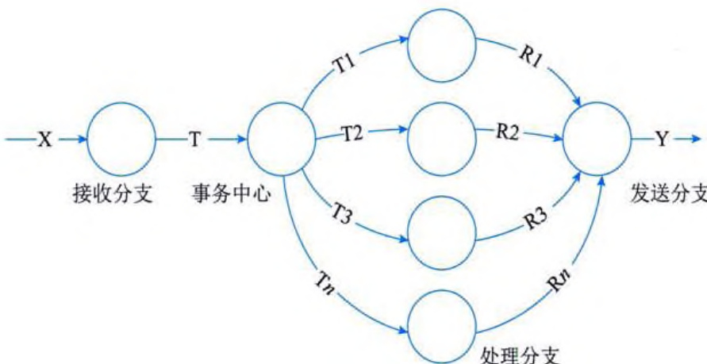  
图 13-13 事务流图  

由图 13-13 可以看出, 事务流有明显的事务中心, 各活动以事务中心为起点呈辐射状流出。事务型系统一般由三层组成, 即事务层、操作层和细节层, 它的功能是对接收的事务, 按其类型选择某一类事务处理, 如图 13-14 所示。  

  
图 13-14 事务型 SC  

在事务型 SC 中, 主模块将按事务的类型选择调用某一事务处理模块, 事务处理模块又调用若干个操作模块, 而每个操作模块又调用若干个细节模块。各个事务处理模块是并列的, 依赖于一定的选择条件, 分别完成不同的事务处理工作。不同的事务处理模块可以共享一些操作模块。同样, 不同的操作模块又可以共享一些细节模块。  

# 3. 混合型 SC  

在规模较大的系统中, 其 DFD 往往是变换型和事务型的混合结构, 如图 13-15 所示, 此时, 可把变换分析和事务分析应用在同一 DFD 的不同部分。例如, 可以以变换分析为主、事务分析为辅进行设计, 即先找出主处理, 设计出结构图的上层, 然后根据 DFD 各部分的结构特点, 适当选用变换分析或事务分析就可得出 SC 的某个初始化方案。  
   

  
图 13-15 混合型 DFD  

对于图 13-15 所示的混合型问题, 从整体上可以将其看作一个从 A 到 M 的变换型问题: 从 D 到 K 之间的变换是变换中心; 从 A 到 D 是传入分支, 具有事务型问题的特点; 从 K 到 M 是传出分支。因此, 该混合型问题结构图的上层可以由 “传入 D” 模块、“变换 D 成 K” 模块和 “传出 K” 模块组成。“传入 D” 模块的下层结构图由从传入分支映射得到的事务型问题结构图组成, “变换 D 成 K” 模块和 “传出 K” 模块的下层结构图可以按通常的变换型问题映射方法获得。经过转换得到的混合型 SC 如图 13-16 所示。  

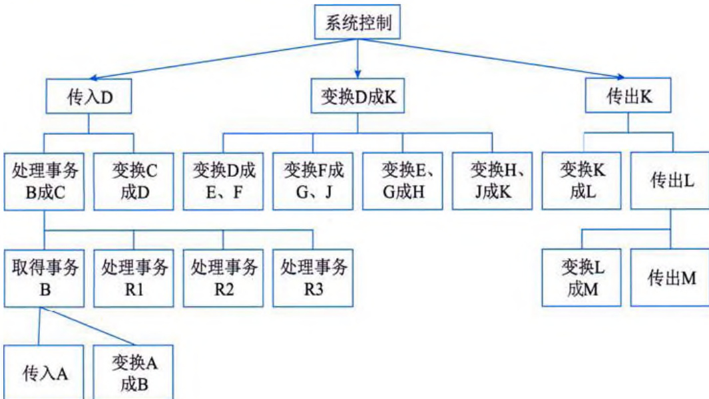  
图 13-16 混合型 SC  

# 13.4 面向对象设计  

OOD 是 OOA 方法的延续, 其基本思想包括抽象、封装和可扩展性, 其中可扩展性主要通过继承和多态来实现。在 OOD 中, 数据结构和在数据结构上定义的操作算法封装在一个对象之中。由于现实世界中的事物都可以抽象成对象的集合, 所以 OOD 方法是一种更接近现实世界、更自然的系统设计方法。  
# 13.4.1 设计软件类  

类封装了信息和行为，是面向对象的重要组成部分，它是具有相同属性、方法和关系的对象集合的总称。在系统中，每个类都具有一定的职责，职责是指类所担任的任务。一个类可以有多种职责，设计得好的类一般至少有一种职责。在定义类时，将类的职责分解为类的属性和方法，其中属性用于封装数据，方法用于封装行为。设计类是 OOD 中最重要的组成部分，也是最复杂和最耗时的部分。  

在系统设计过程中，类可以分为三种类型：实体类、控制类和边界类。  

# 1. 实体类  

实体类映射需求中的每个实体。实体类保存需要存储在永久存储体中的信息，例如，在线教育平台系统可以提取出学员类和课程类，它们都属于实体类。实体类通常都是永久性的，它们所具有的属性和关系是长期需要的，有时甚至在系统的整个生存期都需要。  

实体类是对用户来说最有意义的类，通常采用业务领域术语命名，一般来说是一个名词。在用例模型向领域模型的转化中，一个参与者一般对应于实体类。通常可以从SRS中的那些与数据库表（需要持久存储）对应的名词着手来找寻实体类。通常情况下，实体类一定有属性，但不一定有操作。  

# 2. 控制类  

控制类是用于控制用例工作的类，一般是由动宾结构的短语（“动词+名词”或“名词+动词”）转化来的名词，例如，用例“身份验证”可以对应于一个控制类“身份验证器”，它提供了与身份验证相关的所有操作。控制类用于对一个或几个用例所特有的控制行为进行建模，控制对象（控制类的实例）通常控制其他对象，因此，它们的行为具有协调性。  

控制类将用例的特有行为进行封装，控制对象的行为与特定用例的实现密切相关，当系统执行用例的时候，就产生了一个控制对象，控制对象经常在其对应的用例执行完毕后消亡。通常情况下，控制类没有属性，但一定有方法。  

# 3. 边界类  

边界类用于封装在用例内、外流动的信息或数据流。边界类位于系统与外界的交接处，包括所有窗体、报表、打印机和扫描仪等硬件的接口，以及与其他系统的接口。要寻找和定义边界类，可以检查用例模型，每个参与者和用例交互至少要有一个边界类，边界类使参与者能与系统交互。边界类是一种用于对系统外部环境与其内部运作之间的交互进行建模的类。常见的边界类有窗口、通信协议、打印机接口、传感器和终端等。实际上，在系统设计时，产生的报表都可以作为边界类来处理。  

边界类用于系统接口与系统外部进行交互，边界对象将系统与其外部环境的变更（例如，与其他系统的接口的变更、用户需求的变更等）分隔开，使这些变更不会对系统的其他部分造成影响。通常情况下，边界类可以既有属性也有方法。  
  

 

# 13.4.2 对象持久化与数据库  

在面向对象开发方法中，对象只能存在于内存中，而内存不能永久保存数据，如果要永久保存对象的状态，需要进行对象的持久化（persistent），对象持久化是把内存中的对象保存到数据库或可永久保存的存储设备中。在多层软件设计和开发中，为了降低系统的耦合度，一般会引入持久层（Persistencestence Layer），即专注于实现数据持久化应用领域的某个特定系统的一个逻辑层面，将数据用户和数据实体相关联，持久层的设计实现了数据处理层内部的业务逻辑和数据逻辑的解耦。  

目前, 关系数据库是使用最为广泛的数据库, 如 DB2、Oracle、SQL Server 等。关系数据库中存放的是关系数据, 即用二维表格表示的数据, 它是非面向对象的。对象和关系数据其实是业务实体的两种表现形式, 业务实体在内存中表现为对象, 在数据库中表现为关系数据。内存中的对象之间存在关联和继承关系, 而在数据库中, 关系数据无法直接表达多对多关联和继承关系。因此, 将对象持久化到关系数据库中, 需要进行对象 / 关系的映射 (Object/Relation Mapping, ORM), 这是一项非常重要且烦琐耗时的工作。  

在实际应用中，除了需要将内存中的对象持久化到数据库外，还需要将数据库中的关系数据再重新加载到内存中，以满足用户查询业务数据的需求。频繁地访问数据库，会对应用的性能造成很大影响，为了降低访问数据库的频率，可以将需要经常被访问的业务数据存放在缓存中，并且通过特定的机制来保证缓存中的数据与数据库中的数据同步。  

数据持久化技术封装了数据访问细节，为大部分业务逻辑提供面向对象的 API。通过持久化技术，可以减少访问数据库数据的次数，增加应用程序执行速度；其代码重用性高，能够完成大部分数据库操作；松散耦合，使持久化不依赖于底层数据库和上层业务逻辑实现，更换数据库时只需修改配置文件而不用修改代码。随着对象持久化技术的发展，诞生了越来越多的持久化框架，目前，主流的持久化技术框架包括 CMP、Hibrate、iBatis 和 JDO 等。  

# 1. CMP  

在 J2EE 架构中，容器管理持久化（Container-Managed Persistence，CMP）是由 EJB 容器来管理实体 EJB 的持久化，EJB 容器封装了对象 / 关系的映射和数据访问细节。CMP 和 ORM 的相似之处在于，两者都提供对象 / 关系映射服务，都将对象持久化的任务从业务逻辑中分离出来，区别在于 CMP 负责持久化实体 EJB 组件，而 ORM 负责持久化简单的 Java 对象（Plain Ordinary Java Object，POJO），它是普通的基于 Java Bean 形式的实体域对象。  

CMP 模式的优点在于它基于 EJB 技术, 是 SUN J2EE 体系的核心部分, 获得了业界的普遍支持, 包括各大厂商和开源组织等。如果选择它来进行企业级开发, 技术支持会非常完备, 同时其功能日趋完善, 包括了完善的事务支持、EJBQL 查询语言和透明的分布式访问等。CMP 的缺点在于开发的实体必须遵守复杂的 J2EE 规范, 而 ORM 没有类似要求, 其灵活性受到影响; 而且, CMP 只能运行在 EJB 容器中, 而普通 POJO 可以运行在任何一种 Java 环境中; 尽管遵循 J2EE 的规范, 但 EJB 的移植性比 ORM 要差。  
# 2. Hibrate  

Hubernetes 和 iBatis 都是 ORM 解决方案，不同的是两者各有侧重。有关 Hubernetes 的详细知识将在 16.3.2 小节中介绍。  

# 3. iBatis  

iBatis 提供 Java 对象到 SQL（面向参数和结果集）的映射实现，实际的数据库操作需要通过手动编写 SQL 实现，与 Hibrate 相比，iBatis 最大的特点就是小巧，上手较快。如果不需要太多复杂的功能，iBatis 是既可满足要求又足够灵活的最简单的解决方案。  

# 4. JDO  

Java 数据对象（Java Data Object, JDO）是 SUN 公司制定的描述对象持久化语义的标准 API，它是 Java 对象持久化的新规范。JDO 提供了透明的对象存储，对开发人员来说，存储数据对象完全不需要额外的代码（例如，JDBC API 的使用）。这些烦琐的例行工作已经转移到 JDO 产品提供商身上，使开发人员解脱出来，从而集中时间和精力在业务逻辑上。  

另外，JDO很灵活，因为它可以在任何数据底层上运行。JDBC 只能应用于关系型数据库，而 JDO 更通用，提供到任何数据底层的存储功能，包括关系型数据库、普通文件、XML 文件和对象数据库等，使得应用的可移植性更强。  

# 13.4.3 面向对象设计的原则  

对于OO系统的设计而言，在支持可维护性的同时，提高系统的可复用性是一个至关重要的问题，如何同时提高系统的可维护性和可复用性，是OOD需要解决的核心问题之一。在OOD中，可维护性的复用是以设计原则为基础的。常用的OOD原则包括开闭原则、里氏替换原则、依赖倒置原则、组合/聚合复用原则、接口隔离原则和最少知识原则等。这些设计原则都是面向复用的原则，遵循这些设计原则可以有效地提高系统的复用性，同时提高系统的可维护性。  

# 1. 开闭原则  

开闭原则是指软件实体应对扩展开放，而对修改关闭，即尽量在不修改原有代码的情况下进行扩展。此处的“实体”可以指一个软件模块、一个由多个类组成的局部结构或一个独立的类。  

应用开闭原则可扩展已有的系统，并为之提供新的行为，以满足对软件的新需求，使变化中的系统具有一定的适应性和灵活性。对于已有的软件模块，特别是最重要的抽象层模块不能再修改，这就使变化中的系统有一定的稳定性和延续性，这样的系统同时满足了可复用性与可维护性。在 OOD 中，开闭原则一般通过在原有模块中添加抽象层（例如，接口或抽象类）来实现，它也是其他 OOD 原则的基础，而其他原则是实现开闭原则的具体措施。  

# 2. 里氏替换原则  

里氏替换原则由芭芭拉·利斯科夫（Barbara Liskov）提出，其基本思想是，一个软件实体如果使用的是一个基类对象，那么一定适用于其子类对象，而且觉察不出基类对象和子类对象  
的区别，即把基类都替换成它的子类，程序的行为没有变化。反过来则不一定成立，如果一个软件实体使用的是一个子类对象，那么它不一定适用于基类对象。  

在运用里氏替换原则时, 尽量将一些需要扩展的类或者存在变化的类设计为抽象类或者接口, 并将其作为基类, 在程序中尽量使用基类对象进行编程。由于子类继承基类并实现其中的方法, 程序运行时, 子类对象可以替换基类对象, 如果需要对类的行为进行修改, 可以扩展基类, 增加新的子类, 而无须修改调用该基类对象的代码。  

# 3. 依赖倒置原则  

依赖倒置原则是指抽象不应该依赖于细节，细节应当依赖于抽象。换言之，要针对接口编程，而不是针对实现编程。在程序代码中传递参数时或在组合（或聚合）关系中，尽量引用层次高的抽象层类，即使用接口和抽象类进行变量类型声明、参数类型声明和方法返回类型声明，以及数据类型的转换等，而不要用具体类来做这些事情。为了确保该原则的应用，一个具体类应当只实现接口和抽象类中声明过的方法，而不要给出多余的方法，否则，将无法调用到在子类中增加的新方法。  

实现开闭原则的关键是抽象化，并且从抽象化导出具体化实现，如果说开闭原则是OOD 的目标的话，那么依赖倒置原则就是OOD 的主要机制。有了抽象层，可以使系统具有很好的灵活性，在程序中尽量使用抽象层进行编程，而将具体类写在配置文件中，这样，如果系统行为发生变化，则只需要扩展抽象层，并修改配置文件，而无须修改原有系统的源代码，在不修改的情况下扩展系统功能，满足开闭原则的要求。依赖倒置原则是COM、CORBA、EJB、Spring 等技术和框架背后的基本原则之一。  

# 4. 组合 / 聚合复用原则  

组合/聚合复用原则又称为合成复用原则, 是在一个新的对象中通过组合关系或聚合关系来使用一些已有的对象, 使之成为新对象的一部分, 新对象通过委派调用已有对象的方法达到复用其已有功能的目的。简单地说, 就是要尽量使用组合/聚合关系, 少用继承。  

在 OOD 中，可以通过两种基本方法在不同的环境中复用已有的设计和实现，即通过组合/ 聚合关系或通过继承。但首先应该考虑使用组合/ 聚合，组合/ 聚合可以使系统更加灵活，类与 类之间的耦合度降低，一个类的变化对其他类造成的影响相对较少；其次才考虑继承，在使用 继承时，需要严格遵循里氏替换原则，有效使用继承会有助于对问题的理解，降低复杂度，而 演用继承反而会增加系统构建和维护的难度，以及系统的复杂度。  

通过继承来进行复用的主要问题在于继承复用会破坏系统的封装性，因为继承会将基类的实现细节暴露给子类，由于基类的内部细节通常对子类来说是透明的，所以这种复用是透明的复用，又称为白盒复用。如果基类发生改变，那么子类的实现也不得不发生改变；从基类继承而来的实现是静态的，不可能在运行时发生改变，没有足够的灵活性；而且继承只能在有限的环境中使用（例如，如果类没有声明就不能被继承）。  

由于组合或聚合关系可以将已有的对象（也可称为成员对象）纳入到新对象中，使之成为新对象的一部分，新对象可以调用已有对象的功能，这样做可以使得成员对象的内部实现细节对于新对象是不可见的，因此，这种复用又称为黑盒复用。相对继承关系而言，其耦合度较低，  
成员对象的变化对新对象的影响不大，可以在新对象中根据实际需要有选择性地调用成员对象的操作。组合/聚合复用可以在运行时动态进行，新对象可以动态地引用与成员对象类型相同的其他对象。  

一般而言，如果两个类之间是 Has-A 的关系，则应使用组合或聚合；如果是 Is-A 关系，则可使用继承。Is-A 是严格的分类学意义上的定义，意思是一个类是另一个类的 “一种”。而Has-A 则不同，它表示某一个角色具有某一项责任。  

# 5. 接口隔离原则  

接口隔离原则是指使用多个专门的接口，而不使用单一的总接口。每个接口应该承担一种相对独立的角色，不多不少，不干不该干的事，该干的事都要干。这里的“接口”通常有两种不同的含义：一种是指一个类型所具有的方法特征的集合，仅仅是一种逻辑上的抽象；另一种是指某种语言具体的接口定义，有严格的定义和结构，例如，Java语言中的interface。对于这两种不同的含义，接口隔离原则的表达方式和含义都有所不同。  

如果将“接口”理解成一个类型所提供的所有方法的特征集合，这就是一种逻辑上的概念，接口的划分将直接带来类型的划分。在这种情况下，可以将接口理解成角色，一个接口就只是代表一个角色，每个角色都有它特定的一个接口，此时，接口隔离原则可以称为角色隔离原则。  

如果将“接口”理解成狭义的特定语言的接口，接口隔离原则表达的意思则是指接口仅仅 提供客户端需要的行为，客户端不需要的行为则隐藏起来，应当为客户端提供尽可能小的单独 的接口，而不要提供大的总接口。在面向对象编程语言中，如果需要实现一个接口，就需要实 现该接口中定义的所有方法。因此，大的总接口使用起来不一定方便，为了使接口的职责单一， 需要将大接口中的方法根据其职责不同，分别放在不同的小接口中，以确保每个接口使用起来 都较为方便，并都承担单一角色。  

# 6. 最少知识原则  

最少知识原则也称为迪米特法则（Law of Demeter），是指一个软件实体应当尽可能少地与其他实体发生相互作用。这样，当一个模块被修改时，就会尽量少地影响其他的模块，扩展会相对容易。这是对软件实体之间通信的限制，它要求限制软件实体之间通信的宽度和深度。  

最少知识原则可分为狭义原则和广义原则。在狭义原则中，如果两个类之间不必彼此直接通信，那么这两个类就不应当发生直接的相互作用；如果其中的一个类需要调用另一个类的某一个方法，可以通过第三者转发这个调用。狭义原则可以降低类之间的耦合，但是会在系统中增加大量的小方法并散落在系统的各个角落。它可以使一个系统的局部设计简化，因为每个局部都不会和远距离的对象有直接的关联，但是也会造成系统的不同模块之间的通信效率降低，使得系统的不同模块之间不容易协调。  

广义原则是指对对象之间的信息流量、流向和信息的影响的控制，主要是对信息隐藏的控制。信息的隐藏可以使各个子系统之间解耦，从而允许它们独立地被开发、优化、使用和修改，同时可以促进软件的复用。由于每个模块都不依赖于其他模块而存在，因此，每个模块都可以独立地在其他的地方使用。系统的规模越大，信息的隐藏就越重要，而信息隐藏的重要性也就越明显。  
 

最少知识原则的主要用途在于控制信息的过载。在将最少知识原则运用到系统设计中时， 要注意以下几点：  

(1) 在类的划分上, 应当尽量创建松耦合的类, 类之间的耦合度越低, 就越有利于复用。一个处在松耦合中的类一旦被修改, 不会对关联的类造成太大波动。  

(2) 在类的结构设计上, 每个类都应当尽量降低其属性和方法的访问权限。  

(3) 在类的设计上, 只要有可能, 一个类型应当设计成不变类。  

(4) 在对其他类的引用上, 一个对象对其他对象的引用应当降到最低。  

# 13.5 设计模式  

设计模式是前人经验的总结，它使人们可以方便地复用成功的设计和架构。当人们在特定 的环境下遇到特定类型的问题，采用他人已使用过的一些成功的解决方案，一方面可以降低分 析、设计和实现的难度，另一方面可以使系统具有更好的可复用性和灵活性。随着面向对象技 术的发展和广泛应用，设计模式不再是一个新兴名词，它已逐步成为系统架构设计师、系统分 析师、软件设计师和程序员所需掌握的基本技能之一。设计模式已广泛应用于面向对象系统的 设计和开发，成为面向对象领域的一个重要组成部分。  

# 13.5.1 设计模式概述  

模式起源于建筑业而非软件业，模式之父——美国加利福尼亚大学环境结构中心研究所所长克里斯托弗·亚历山大（Christopher Alexander）博士用了约20年的时间，对舒适型住宅和周边环境进行了大量的调查和资料收集工作，发现人们对舒适型住宅和城市环境存在着共同的认知规律。他把这些规律归纳为253个模式，对每一个模式都从模式可适用的前提条件、在特定条件下要解决的目标问题和对目标问题的求解方案三个方面进行描述，并给出了从用户需求分析到建筑环境结构设计，直至经典实例的过程模型。亚历山大给出模式的经典定义如下：每个模式都描述了一个在实际环境中不断出现的问题，然后描述了该问题的解决方案的核心，通过这种方式，可以无数次地使用那些已有的解决方案，无须再重复相同的工作。也就是说，模式是在特定环境中解决问题的一种方案。  

# 1. 软件模式与设计模式  

软件模式是将模式的一般概念用于软件开发领域，即软件开发的总体指导思路或参照样本。最早将模式引入软件领域的是埃里克·伽玛（Erich Gamma）博士等四人组（Gang of Four, GoF），他们在1994年归纳、发表了23种设计模式，旨在用模式来统一沟通OO方法在分析、设计和实现之间的鸿沟。  

软件模式包括设计模式、架构模式、分析模式和过程模式等，软件生存期的各个阶段都存在着被认同的模式。在软件模式领域，目前研究最为深入的是设计模式。设计模式是一套被反复使用、多数人知晓的、经过分类编目的、代码设计经验的总结，使用设计模式的目的是提高代码的可重用性，让代码更容易被他人理解，并保证代码可靠性。毫无疑问，这些设计模式已  
经在前人的系统中得以证实并广泛使用，它使代码编写真正实现工程化，将已证实的技术表述成设计模式，也会使新系统开发者更加容易理解其设计思路。每种设计模式都是对 13.4.3 小节中某一种或多种 OOD 原则的体现。  

# 2. 设计模式的关键元素  

设计模式包含模式名称、问题、目的、解决方案、效果、实例代码和相关设计模式等基本要素，其中的关键元素包括以下4个方面:  

(1) 模式名称。给模式取一个助记名, 用一两个词语来描述模式待解决的问题、解决方案和使用效果, 以便更好地理解模式并方便开发人员之间的交流。  

(2)问题。描述应该在何时使用模式, 即在解决何种问题时可使用该模式。有时, 在问题部分会包括使用模式必须满足的一系列先决条件。  

(3) 解决方案。描述设计的组成成分、它们之间的相互关系及各自的职责和协作方式。模式就像一个模板, 可应用于多种不同场合, 所以解决方案并不描述一个特定而具体的设计或实现, 而是提供一个问题的抽象描述和具有一般意义的元素组合 (类或对象组合)。  

(4) 效果。描述模式应用的效果以及使用模式时应权衡的问题, 即模式的优缺点。没有一种解决方案是完美的, 每种设计模式都具有自己的优点, 但也存在一些缺陷, 它们对于评价设计选择和理解使用模式的代价和好处具有重要意义。模式效果有助于选择合适的模式, 它不仅包括时间和空间的权衡, 还包括对系统的灵活性、可扩展性或可移植性的影响。  

# 13.5.2 设计模式分类  

根据目的和用途不同，设计模式可分为创建型（Creational）模式、结构型（Structural）模式和行为型（Behavioral）模式三种。创建型模式主要用于创建对象，结构型模式主要用于处理类或对象的组合，行为型模式主要用于描述类或对象的交互以及职责的分配。  

根据处理范围不同，设计模式可分为类模式和对象模式。类模式处理类和子类之间的关系，这些关系通过继承建立，在编译时刻就被确定下来，属于静态关系。对象模式处理对象之间的关系，这些关系在运行时刻变化，更具动态性。  

# 1. 创建型模式  

创建型模式对类的实例化过程（即对象的创建过程）进行了抽象，能够使软件模块做到与对象的创建和组织无关。创建型模式隐藏了对象是如何被创建和组合在一起的，以达到使整个系统独立的目的。创建型模式包括工厂方法模式、抽象工厂模式、原型模式、单例模式和建造者模式等。  

(1) 工厂方法（Factory Method）模式。工厂方法模式又称为虚拟构造器（Virtual Constructor）模式或多态模式，属于类的创建型模式。在工厂方法模式中，父类负责定义创建对象的公共接口，而子类则负责生成具体的对象，这样做的目的是将类的实例化操作延迟到子类中完成，即由子类来决定究竟应该实例化（创建）哪一个类。  

(2) 抽象工厂 (Abstract Factory) 模式。抽象工厂模式又称为 Kit 模式, 属于对象创建型模式。抽象工厂模式是所有形式的工厂模式中最为抽象和最具一般性的一种形态, 它提供了一个  
创建一系列相关或相互依赖对象的接口，而无须指定它们具体的类。在抽象工厂模式中，引入 了产品等级结构和产品族的概念。产品等级结构是指抽象产品与具体产品所构成的继承层次关 系；产品族是同一个工厂所生产的一系列产品，即位于不同产品等级结构且功能相关联的产品 组成的家族。当抽象工厂模式退化到只有一个产品等级结构时，即变成了工厂方法模式。  

(3) 原型 (Prototype) 模式。在系统开发过程中, 有时候有些对象需要被频繁创建, 原型模式通过给出一个原型对象来指明所要创建的对象的类型, 然后通过复制这个原型对象的办法, 创建出更多同类型的对象。原型模式是一种对象创建型模式, 用原型实例指定创建对象的种类, 并且通过复制这些原型创建新的对象。原型模式又可分为两种: 浅克隆和深克隆。浅克隆仅仅复制所考虑的对象, 而不复制它所引用的对象, 也就是其中的成员对象并不复制; 深克隆除了对象本身被复制外, 对象包含的引用也被复制, 即成员对象也被复制。  

(4) 单例 (Singleton) 模式。单例模式确保某一个类只有一个实例, 而且自行实例化并向整个系统提供这个实例, 这个类称为单例类, 它提供全局访问的方法。  

(5) 建造者 (Builder) 模式。建造者模式强调将一个复杂对象的构建与它的表示分离, 使得同样的构建过程可以创建不同的表示。建造者模式是一步一步地创建一个复杂的对象, 它允许用户只通过指定复杂对象的类型和内容就可以构建它们, 用户不需要知道内部的具体构建细节。建造者模式属于对象创建型模式。  

# 2. 结构型模式  

结构型模式描述如何将类或对象结合在一起形成更大的结构。结构型模式描述两种不同的事物，即类与类的实例（对象），据此可以将结构型模式分为类结构型模式和对象结构型模式。结构型模式包括适配器（Adapter）模式、桥接（Bridge）模式、组合（Composite）模式、装饰（Decorator）模式、外观（Facaade）模式、享元（Flyweight）模式和代理（Proxy）模式等。  

(1) 适配器模式。适配器模式将一个接口转换成客户希望的另一个接口, 从而使接口不兼容的那些类可以一起工作。适配器模式既可以作为类结构型模式, 也可以作为对象结构型模式。在类适配器模式中, 通过使用一个具体类将适配者适配到目标接口中; 在对象适配器模式中, 一个适配器可以将多个不同的适配者适配到同一个目标。  

(2) 桥接模式。桥接模式将抽象部分与它的实现部分分离, 使它们都可以独立地变化。它是一种对象结构型模式, 又称为柄体 (Handle and Body) 模式或接口 (Interface) 模式。桥接模式类似于多重继承方案, 但是多重继承方案往往违背了类的单一职责原则, 其复用性比较差, 桥接模式是比多重继承方案更好的解决方法。  

(3) 组合模式。组合模式又称为整体 - 部分 (Part-Whole) 模式, 属于对象的结构模式。在组合模式中, 通过组合多个对象形成树形结构以表示整体 - 部分的结构层次。组合模式对单个对象 (即叶子对象) 和组合对象 (即容器对象) 的使用具有一致性。  

(4) 装饰模式。装饰模式是一种对象结构型模式, 可动态地给一个对象增加一些额外的职责, 就增加对象功能来说, 装饰模式比生成子类实现更为灵活。通过装饰模式, 可以在不影响其他对象的情况下, 以动态、透明的方式给单个对象添加职责; 当需要动态地给一个对象增加功能, 这些功能可以再动态地被撤销时, 可使用装饰模式: 当不能采用生成子类的方法进行扩  
充时也可以使用装饰模式。  

(5) 外观模式。外观模式是对象的结构模式, 要求外部与一个子系统的通信必须通过一个统一的外观对象进行, 为子系统中的一组接口提供一个一致的界面, 外观模式定义了一个高层接口, 这个接口使得这一子系统更加容易使用。  

(6) 享元模式。享元模式是一种对象结构型模式, 通过运用共享技术, 有效地支持大量细粒度的对象。系统只使用少量的对象, 而这些对象都很相似, 状态变化很小, 对象使用次数增多。享元对象能做到共享的关键是区分内部状态和外部状态。内部状态存储在享元对象内部并且不会随环境改变而改变, 因此内部状态可以共享; 外部状态是随环境改变而改变的、不可以共享的状态, 享元对象的外部状态必须由客户端保存, 并在享元对象被创建之后, 在需要使用的时候再传入到享元对象内部, 外部状态之间是相互独立的。  

(7) 代理模式。代理模式是一种对象结构型模式, 可为某个对象提供一个代理, 并由代理对象控制对原对象的引用。代理模式能够协调调用者和被调用者, 能够在一定程度上降低系统的耦合度, 其缺点是请求的处理速度会变慢, 并且实现代理模式需要额外的工作。  

# 3. 行为型模式  

行为型模式是对在不同的对象之间划分责任和算法的抽象化，它不仅仅是关于类和对象的，而且是关于它们之间的相互作用的。行为型模式分为类行为模式和对象行为模式两种，其中类行为模式使用继承关系在几个类之间分配行为，而对象行为模式则使用对象的聚合来分配行为。行为型模式包括职责链（Chain of Responsibility）模式、命令（Command）模式、解释器（Interpreter）模式、迭代器（Iterator）模式、中介者（Mediator）模式、备忘录（Memento）模式、观察者（Observer）模式、状态（State）模式、策略（Strategy）模式、模板方法（Template Method）模式、访问者（Visitor）模式等。  

(1) 职责链模式。职责链模式是一种对象的行为型模式, 避免请求发送者与接收者耦合在一起, 让多个对象都有可能接收请求, 将这些对象连接成一条链, 并且沿着这条链传递请求, 直到有对象处理它为止。职责链模式不保证每个请求都被接受, 如果有一个请求没有明确的接收者, 那么就不能保证它一定会被处理。  

(2) 命令模式。命令模式是一种对象的行为型模式, 类似于传统程序设计方法中的回调机制, 它将一个请求封装为一个对象, 从而可用不同的请求对客户进行参数化; 对请求排队或者记录请求日志, 以及支持可撤销的操作。命令模式是对命令的封装, 将发出命令的责任和执行命令的责任分割开, 委派给不同的对象, 以实现发送者和接收者完全解耦, 提供更大的灵活性和可扩展性。  

(3) 解释器模式。解释器模式属于类的行为型模式, 描述了如何为语言定义一个文法, 如何在该语言中表示一个句子, 以及如何解释这些句子, 这里的 “语言” 是使用规定格式和语法的代码。解释器模式主要用在编译器中, 在应用系统开发中很少用到。  

(4) 迭代器模式。迭代器模式是一种对象的行为型模式, 提供了一种方法来访问聚合对象,而不用暴露这个对象的内部表示。迭代器模式支持以不同的方式遍历一个聚合对象, 复杂的聚合可用多种方法来进行遍历: 允许在同一个聚合上可以有多个遍历, 每个迭代器保持它自己的  
 

遍历状态，因此，可以同时进行多个遍历操作。  

(5) 中介者模式。中介者模式是一种对象的行为型模式, 通过一个中介对象来封装一系列的对象交互。中介者使得各对象不需要显式地相互引用, 从而使其耦合松散, 而且可以独立地改变它们之间的交互。中介者对象的存在保证了对象结构上的稳定, 也就是说, 系统的结构不会因为新对象的引入带来大量的修改工作。  

(6) 备忘录模式。备忘录模式确保在不破坏封装的前提下, 捕获一个对象的内部状态, 并在该对象之外保存这个状态, 这样可以在以后将对象恢复到原先保存的状态。备忘录模式提供了一种状态恢复的实现机制, 使得用户可以方便地回到一个特定的历史步骤。  

(7) 观察者模式。观察者模式又称为发布-订阅模式、模型-视图模式、源-监听器模式或从属者（Dependents）模式，是一种对象的行为型模式。它定义了对象之间的一种一对多的依赖关系，使得每当一个对象状态发生改变时，其相关依赖对象都得到通知并被自动更新。观察者模式的优点在于实现了表示层和数据层的分离，并定义了稳定的更新消息传递机制，类别清晰，抽象了更新接口，使得相同的数据层可以有各种不同的表示层。  

(8) 状态模式。状态模式是一种对象的行为型模式, 允许一个对象在其内部状态改变时改变它的行为, 对象看起来似乎修改了它的类。状态模式封装了状态的转换过程, 但是它需要枚举可能的状态, 因此, 需要事先确定状态种类, 这也导致在状态模式中增加新的状态类时将违反开闭原则, 新的状态类的引入将需要修改与之能够进行转换的其他状态类的代码。状态模式的使用必然会增加系统类和对象的个数。  

(9) 策略模式。策略模式是一种对象的行为型模式, 定义一系列算法, 并将每一个算法封装起来, 并让它们可以相互替换。策略模式让算法独立于使用它的客户而变化, 其目的是将行为和环境分隔, 当出现新的行为时, 只需要实现新的策略类。  

(10) 模板方法模式。模板方法模式是一种类的行为型模式, 用于定义一个操作中算法的骨架, 而将一些步骤延迟到子类中。模板方法模式使得子类可以不改变一个算法的结构即可重定义该算法的某些特定步骤, 其缺点是对于不同的实现, 都需要定义一个子类, 这会导致类的个数增加, 但是更加符合类职责的分配原则, 使得类的内聚性得以提高。  

(11) 访问者模式。访问者模式是一种对象的行为型模式, 用于表示一个作用于某对象结构中的各元素的操作, 它使得用户可以在不改变各元素的类的前提下定义作用于这些元素的新操作。访问者模式使得增加新的操作变得很容易, 但在一定程度上破坏了封装性。  

# 13.6 输入/输出原型设计  

系统输入/输出设计是与用户息息相关的，输入/输出设计对于系统的开发人员以及用户极为重要。系统输入/输出设计可以帮助开发人员更好地理解系统的需求和功能，从而确保系统的正确性和稳定性；可以使系统的代码更加清晰和易于维护，从而降低维护成本和风险；使系统更加灵活和可扩展，从而满足不同用户的需求和变化的市场需求；使系统更加易于使用和友好，从而提高用户的满意度和忠诚度；可以使开发人员更加高效地开发系统，从而降低开发成本和时间。  
# 13.6.1 输入设计  

系统输入设计是指在设计系统时，如何收集和处理用户输入的过程。以下是系统输入设计的一些关键考虑因素:  

(1) 用户需求: 了解用户的需求和期望, 以便设计出符合用户期望的输入方式。  

(2) 输入方式: 选择适合用户的输入方式, 例如使用键盘、鼠标、触摸屏、语音识别等。  

(3) 输入格式: 确定输入数据的格式, 例如文本、数字、日期、时间等。  

(4) 输入验证: 对输入数据进行验证, 确保数据的正确性和完整性。  

(5) 输入反馈: 提供及时的输入反馈, 例如错误提示、自动完成等。  

(6) 输入历史: 记录用户的输入历史, 以便用户快速输入相似的数据。  

(7) 输入安全: 确保输入数据的安全性, 例如防止恶意输入、保护用户隐私等。  

(8) 输入效率: 优化输入流程, 提高用户输入效率, 例如自动填充、快捷键等。  

综上所述，系统的输入设计是系统设计中非常重要的一环，它直接关系到系统的功能实现和用户体验。所以，在设计系统输入时，应当遵循以下7种设计原则：  

# 1. 确定输入数据的类型和格式  

在系统设计时, 首先需要确定输入数据的类型和格式。在设计系统的输入时, 首先需要确定输入数据的类型和格式。根据系统的需求, 输入数据可以是文本、数字、图像、音频等。例如, 电商网站的输入数据可能包括商品名称、价格、描述和图片等。  

图 13-17 是用户在商城购物下单并购买商品的时序图, 由于用户操作界面允许输入多种类型的数据, 因此在确定输入数据类型的同时, 还需要确定输入数据的格式。例如, 文本数据可以是纯文本、富文本、Markdown 等格式; 数字数据可以是整数、浮点数、百分数等格式; 图像数据可以是 JPEG、PNG、GIF 等格式; 音频数据可以是 MP3、WAV 等格式。  

  
图 13-17 商城下单时序图  
   

# 2. 确定输入数据的来源  

确定输入数据的来源是设计系统输入的另一个重要方面。输入数据可以来自用户输入、传感器采集、外部 API 调用等。例如，一个智能家居系统的输入数据可能来自温度传感器、湿度传感器、光线传感器等。  

# 3. 设计良好的输入界面  

在确定输入数据来源时，还需要考虑输入数据的实时性和准确性。例如，传感器采集的数据可能需要实时处理，而用户输入的数据可能需要进行验证和清洗。  

设计输入界面是系统输入设计的重要方面之一。输入界面需要根据系统的需求和用户体验进行设计。例如，在线购物网站的输入界面可能包括商品搜索框、商品分类下拉菜单、购物车等。  

在设计输入界面时，需要考虑以下几个方面:  

(1) 界面布局: 需要简洁明了, 易于用户操作。  

(2) 控件选择: 根据输入数据的类型和格式, 选择合适的控件, 例如文本框、下拉菜单、单选框、复选框等。  

(3) 输入提示: 为了方便用户输入, 需要提供输入提示, 例如自动补全、下拉提示等。  

(4) 错误提示: 为了避免用户输入错误数据, 需要提供错误提示, 例如数据格式错误、数据范围错误等。  

# 4. 设计系统输入验证机制  

为了保证输入数据的准确性和完整性，需要设计输入验证机制。输入验证机制可以对输入数据进行数据类型验证、数据格式验证、数据范围验证等。例如，一个电商网站的输入验证机制可能包括价格必须为数字、商品名称不能超过50个字符等。  

在设计输入验证机制时，需要考虑以下几个方面：  

(1) 验证规则：根据输入数据的类型和格式，确定验证规则。  

(2) 错误提示: 为了避免用户输入错误数据, 需要提供错误提示, 例如数据格式错误、数据范围错误等。  

(3)安全性: 为了避免恶意攻击, 需要对输入数据进行安全验证。  

# 5. 设计输入处理流程  

在输入数据进入系统之前，可能需要进行数据预处理、数据清洗、数据转换等操作。例如，智能家居系统的输入数据可能需要进行数据清洗，去除异常数据。  

在设计输入处理流程时，需要考虑以下几个方面：  

(1) 处理流程: 根据系统的需求和业务逻辑, 确定输入处理流程。  

(2)数据清洗: 为了保证数据的准确性和完整性, 需要进行数据清洗, 去除异常数据。  

(3) 数据转换: 为了方便系统处理, 需要对输入数据进行数据转换, 例如将文本数据转换为数字数据。  
# 6. 设计输入存储方案  

输入数据可能需要存储到数据库、文件系统、云存储等。在设计输入存储方案时，需要考 虑以下几个方面：  

(1) 存储方式: 根据系统的需求和数据量大小, 确定存储方式, 例如数据库、文件系统、云存储等。  

(2) 存储结构: 根据系统的需求和数据结构, 确定存储结构, 例如关系型数据库、非关系型数据库等。  

(3) 存储安全: 为了保护输入数据的安全性, 需要对存储数据进行加密、访问控制等操作。  

# 7. 设计输入安全机制  

为了保护输入数据的安全性，需要设计输入安全机制。输入安全机制可以对输入数据进行加密、访问控制、防止 SQL 注入等操作。例如，一个在线银行系统的输入安全机制可能包括用户身份验证、数据加密等。  

在设计输入安全机制时，需要考虑以下几个方面:  

(1) 访问控制: 为了保护输入数据的安全性, 需要对访问者进行身份验证和访问控制。  

(2) 数据加密: 为了保护输入数据的机密性, 需要对输入数据进行加密。  

(3) 防止 SQL 注入: 为了避免恶意攻击, 需要对输入数据进行防止 SQL 注入等操作。  

综上所述，系统的输入设计需要考虑输入数据的类型和格式、输入数据的来源、输入界面的设计、输入验证机制的设计、输入处理流程的设计、输入存储方案的设计、输入安全机制的设计等方面。在设计输入时，需要根据系统的需求和实际情况进行综合考虑。  

# 13.6.2 输出设计  

系统输出设计可以帮助开发人员和用户在生活和工作中更好地把握方向和目标，提高开发工作效率。系统的输出设计主要包括以下三个方面的内容：  

(1) 确定输出内容: 确定用户在使用信息方面的需求, 然后设计输出信息的内容、信息形式 (包括文字、图形、表格)、输出项目及数据结构、数据类型、位数及取值范围、数据的生成途径、完整性以及数据一致性等。  

(2) 选择输出设备与介质: 常见的输出设备有显示终端、打印机、绘图仪、磁带机、多媒体设备: 输出介质有纸张、磁带、磁盘、胶卷、光盘等。  

(3) 确定输出格式: 输出格式要满足使用者的要求和习惯, 做到格式清晰、美观、容易阅读和理解等。最终输出形式包括报表输出、图形输出等, 其输出形式需要根据系统分析和管理业务的需求来决定。  

例如，图 13-18 所示为某厂能耗综述，以报表的形式向用户展示，能够保证用户在观看体验上感觉更直观、更简洁。  

一般情况下，在进行输出设计时，针对企业具体业务人员比较适合采用报表的形式，针对企业高层领导、综合管理部门则适合用图形、图表方式来表示发展趋势，供企业领导决策使用。  
 

  
图 13-18 报表形式输出  

本期概述：天然气净化生产新样水单耗、燃料气单耗、蒸汽单耗达标，注意水单耗临近年度考核指标，电单耗超标。  

系统的输出设计主要关注如何向用户传达数据和信息，所以在针对系统输出设计方面要循 循下面7 条原则。  

# 1. 简洁性原则  

简洁性原则是指在设计系统输出时，应该尽量避免过多的冗余信息和复杂的设计，保持简 洁明了的风格。简洁的设计可以提高用户的使用体验，减少用户的学习成本和使用成本，同时 也可以提高系统的可维护性和可扩展性。  

# 2. 一致性原则  

一致性原则是指在设计系统输出时，应该保持一致的设计风格和交互方式，使用户在使用 系统时能够更加自然和流畅地进行操作。一致的设计可以提高用户的使用效率和满意度，同时 也可以减少用户的犯错率和学习成本。在系统设计中，保持输出一致性可以方便维护。如果系 统在不同的场合下产生的输出不一致，可能会导致维护人员难以理解系统的输出，从而增加维 护的难度和成本。例如，如果一个电子商务网站在不同的页面上展示的商品信息不一致，可能 会使用户感到困惑，导致用户不再信任该网站并选择去竞争对手网站购买商品。  

在某些行业中，输出的一致性是必要的，因为这些行业有特定的标准和法规要求。例如，在医疗保健行业，病人的医疗记录必须保持一致性，以确保医疗保健质量和安全。如果病人的医疗记录不一致，可能会对病人的健康造成威胁，也可能违反行业标准和法规要求。  

# 3. 可用性原则  

可用性原则是指在设计系统输出时，应该注重用户的使用体验和用户的需求，使系统能够 更加方便、易用和可靠。可用性的设计可以提高用户的满意度和忠诚度，同时也可以减少用户 的犯错率和使用成本。  

# 4. 可访问性原则  

可访问性原则是指在设计系统输出时，应该考虑到不同用户的需求和能力，使系统能够更  
加易于访问和使用。可访问性的设计可以提高系统的可用性和可达性，同时也可以促进社会的包容性和平等性。  

通过保持输出的可访问性，用户可以更容易地使用系统并且可以更好地理解输出结果，从而提高用户体验。如果系统的输出不容易访问，例如缺乏必要的标记和描述，用户可能会感到困惑和不满意，降低用户的满意度和信任度。  

保持输出的可访问性，可以提高系统的包容性，以满足所有用户的需求。例如，如果一个 电子商务网站提供多种语言的输出，那么这个网站可以吸引更多的客户，从而增加销售额。此 外，保持输出的可访问性可以帮助那些需要特殊帮助的用户，如视力障碍者、听力障碍者和运 动障碍者等。  

# 5. 可维护性原则  

可维护性原则是指在设计系统输出时，应该注重系统的可维护性和可扩展性，使系统能够更加易于维护和升级。可维护性的设计可以提高系统的稳定性和可靠性，同时也可以降低系统的维护成本和升级成本。  

# 6. 安全性原则  

安全性原则是指在设计系统输出时，应该注重系统的安全性和保密性。输出安全性指的是确保系统产生的输出不会被未授权的人员或系统访问或篡改，从而保护系统和用户的安全，使系统能够更加安全可靠地运行。安全的设计可以保护用户的隐私和数据安全，同时也可以防止系统被攻击和破坏。  

在某些行业中，保持输出安全性是必要的，因为这些行业有特定的法规要求。例如，在医疗 保健行业，病人的医疗记录必须保持机密性和安全性，以确保病人的隐私和医疗安全。如果未经 授权的人员或系统可以访问或篡改医疗记录，可能会违反行业法规，导致罚款或其他法律后果。  

# 7. 可扩展性原则  

可扩展性原则是指在设计系统输出时，应该注重系统的可扩展性和灵活性，使系统能够更加易于扩展和适应不同的需求。可扩展的设计可以提高系统的适应性和灵活性，同时也可以降低系统的开发成本和维护成本。  

# 13.6.3 良好的输入/输出的重要性  

在软件系统的输出界面中, 大多数最终效果的呈现就是界面效果。尽管黑白是经典的颜色, 但如果在设计中没有考虑其他颜色, 很容易带给用户视觉上的疲劳, 所以一般情况下会适当增加色彩和图像, 基于用户视觉上的感染力, 从而为他们减少一定的疲惫感。由于图形具有直观、形象的特点, 所以能够带给用户更加直接的体验, 在人机交互界面的设计中, 也能够增强软件系统的易理解性。当然, 在实际设计中, 因为不同用户对图形有感官上的偏好, 所以并不是颜色越多越好, 这就要求设计人员要具备一定的艺术细胞, 能够合理利用这些元素, 实现动静结合的效果。除此之外, 在界面效果设计中色彩的利用非常重要, 如果运用得当可以给人留下深刻的印象, 所以也需要最大程度发挥色彩的视觉组合, 从而创造出理想的界面效果。这就要求设计人员在设计时要提前分析色彩的属性, 从纯度、色相和明度去把握色彩的搭配, 这  
样才会带给用户不同的感觉，进一步提高软件界面的感染力，从而达到较为理想的界面效果。  

因此，在系统设计过程中，输入/输出设计是至关重要的。合理的输入/输出设计可以提高系统的性能，提高用户体验，满足合规要求，保障系统的安全性和数据一致性，提高系统的可维护性。  

输入/输出设计直接影响系统的性能，如果输入/输出设计不合理，可能会导致系统响应时间过长、数据处理速度慢、系统可用性降低等问题。如果系统的输入/输出不易使用，用户可能会感到困惑、不满意，从而降低用户满意度和信任度。并且，系统的输入/输出设计必须符合行业、政府机构、法规和标准的要求。例如，根据美国障碍者法案（ADA），所有网站都必须为有障碍者提供可访问性。  

# 13.7 人机交互设计  

系统的交互体验感是指系统在用户的使用、交流过程中强调互动、交互特性。交互体验贯穿用户浏览、点击等操作的各个过程，是至关重要的一环。系统人机交互设计是指设计人员将人类使用系统的方式、需求、认知特点等因素考虑在内，开发出易于理解、易于使用、易于操作的用户界面和交互方式。在系统设计中，人机交互设计是一个非常重要的环节。良好的人机交互设计可以提高用户满意度，减少培训和支持成本，提高系统的可用性和易用性，提高系统的生产力和效率，提高系统的竞争力。  

# 13.7.1 设计目标  

系统人机交互设计的目标是提高用户体验和效率，使用户能够轻松地使用系统完成任务。具体来说，系统人机交互设计的目标包括:  

(1) 切实满足用户的需求, 功能有用、内容齐全, 对用户有帮助。在任何场景中, 都要先确保产品的有用性, 这是用户体验的基础。  

(2) 产品容易上手和使用, 用户用起来易操作、易理解、易学习。易用性即 “用户使用成本”, 用户使用任何产品都是需要学习、精力、时间等成本的, 易用性就是要降低 “用户成本”。  

(3) 降低用户的错误率和学习成本, 使用用户能够更容易地掌握系统的使用方法。例如像市场上的商业 BI 类软件很多系统需要非常专业的知识水平才能使用, 无法通过改善优化人机交互的设计从而降低系统的使用门槛。  

# 13.7.2 用户体验五层模型  

良好的人际交互设计必须基于对用户需求和行为的深刻理解。在系统设计之前，设计人员 需要进行调研，了解用户的需求、期望、行为和偏好等信息。在设计人员与用户之间进行交互 时，需要时刻将用户放在第一位，考虑他们的需求和要求，并确保设计的系统能够满足这些需 求和要求。在理解用户行为方面，设计人员需要了解用户的使用习惯和行为模式，并确保系统 的设计与用户的期望一致。  

“用户体验”这个词最早被广泛认知是在20世纪90年代中期，它由设计师唐纳德·诺曼  
(Donald Norman) 提出。  

用户体验是用户在接触和使用产品过程中所建立的感受, 感受是主观的, 因此用户的体验也是主观的。用户体验的五层模型由杰西・詹姆斯・加勒特（Jesse James Garrett）在《用户体验要素》里提出。他认为用户体验包含五个要素, 可以用五层模型来体现, 包括表现层、框架层、结构层、范围层和战略层, 如图 13-19 所示。  

  
图 13-19 用户体验的五层模型  

# 1. 战略层  

战略层（Strategy）主要包括用户需求和产品目标。好的产品首先要有自己的战略定位，由 于个人属性的千差万别，要想用户体验良好，战略定位一定要基于某类固定需求的目标用户群 体展开，任何产品都不能覆盖到用户的方方面面。  

用户想要获得的就是“用户需求”，是来自外部的需求。为了确定用户需求，首先要确定产品的目标用户（Target User）。确定产品的目标用户有以下几个步骤：  

(1) 用户细分: 将用户分成较小的有共同需求的组 (人口统计学、消费心态档案等)。  

(2) 用户研究: 知道用户是谁 (问卷调查、访谈、实地考察、焦点小组、卡片分类等)。  

(3) 人物角色: 从用户研究中提取出可以成为样例的虚拟人物。  

通过使用以上几个步骤，能确定出用户的需求，确定出产品在战略层的内容。  

例如，电商用户需要在网络上购买到物美价廉的产品，所以电商系统的整体产品目标在于 构建一个C2C 电商平台。  

# 2. 范围层  

当把用户需求和网站目标转变成网站应该提供给用户什么样的内容和功能时，战略就变成了范围。根据范围层（Scope）的具体内容，可以将产品大致分为工具型和内容型，有的产品兼具工具型和内容型的特点。  

例如，在电商平台的功能中，需要与用户交互的功能包括搜索商品、查看详情、加入购物 车、结算、支付等。内容需求则包括海量的可供挑选的商品及商品的详情介绍，如何给用户推  
 

荐用户喜欢的商品等。  

# 3. 结构层  

在收集完用户需求并将其排列好优先级后，需要将这些分散的片段组成一个整体，这就是结构层（Structure），即创建产品功能和内容之间的关系。  

结构层分为交互设计和信息架构两大部分。  

交互设计是描述“可能的用户行为”，定义“系统如何配合与响应”这些用户行为。不要让用户去适应产品，而要让产品与用户互相适应，预测对方的下一步。  

信息架构是关注如何将信息表达给用户，着重于设计组织分类和导航结构，让用户容易找到需要的内容。  

交互设计应该至少包括概念模型和错误处理。  

信息架构有两种分类体系：从上到下和从下到上。其结构可以是层级结构、矩阵结构、自然结构和线性结构。一般来说，网站的信息架构多是以上几种结构的综合，以一种结构为主，其余结构为辅。  

例如，电商平台把搜索商品、查看详情、加入购物车、结算、支付等功能点组织在一起， 一步一步地引导用户买到想要的商品。平台中有海量的商品，通过商品分类、搜索、扫码、系 统推荐等方式可以帮助用户找到心仪的商品。通过大量完善和解决与用户的交互问题最终帮助 用户找到并购买心仪的商品。  

# 4. 框架层  

框架层（Skeleton）决定某个板块或按钮等交互元素应该放在页面的什么地方。结构层中形成了大量的需求，而在框架层中，我们要更进一步地提炼这些需求，确定详细的界面外观、导航和信息设计，使晦涩的结构变得清晰明确。  

在设计框架层的内容时要遵循两条原则：遵循用户日常使用习惯和恰当使用生活中的比喻。 框架层设计包含界面设计、导航设计和信息设计三个方面。  

(1) 界面设计为用户提供做某些事的能力。做界面设计时, 要选择合适的元素, 让用户一眼就能看到最重要的东西。  

(2) 导航设计给用户提供去某个地方的功能。做导航设计时, 要提供网页之间的跳转方法, 传达元素与内容之间的关系, 传达内容与页面之间的关系。  

(3) 信息设计是将想法传达给用户。信息设计是将各种设计元素聚合到一起, 来反映用户的思路, 支持他们完成任务和目标, 包括视觉、分组等各个方面。  

例如，在界面的什么位置放置用户常用的按钮、搜索栏等内容，底部放置导航栏，以符合 用户在与系统进行交互时的行为习惯。  

# 5. 表现层  

表现层（Surface）是用户所能看见的一切，包括字体的大小、导航栏的颜色、整体给人的感觉等。在这一层，内容、功能和美学汇集在一起产生一个最终设计，从而满足其他层面的所有要求。  
设计易用的界面是进行人机交互设计的核心之一。易用的界面应该简单、直观、一目了然， 让用户在不经过多次试验的情况下轻松找到他们所需的功能。在设计界面时，设计人员应该考 虑以下几点：  

(1) 界面元素的排布应该有逻辑性, 按照用户的思维方式排布。例如, 重要的功能应该放在显眼的位置。  

(2) 界面的字体、颜色等要合理搭配, 不应该过于花哨或刺眼。  

(3) 界面应该尽可能简洁, 只显示必要的信息, 避免用户在繁杂的界面中迷失。  

(4) 界面元素应该易于识别和操作, 例如, 按钮的形状和颜色应该具有可识别性。  

# 13.7.3 如何设计良好的人机交互  

# 1. 了解用户  

在设计系统时，首先要进行用户研究和需求分析。这包括以下几个关键步骤:  

(1) 用户群体划分: 明确系统的目标用户群体, 了解他们的特点、背景、技能水平以及使用场景等信息。  

（2）用户需求调研：通过调查问卷、用户访谈、焦点小组等方式，收集用户需求和期望， 了解他们对系统功能、界面和交互的需求。  

(3) 使用场景分析: 分析用户在不同使用场景下的行为模式、任务流程和需求差异, 为后续的人机交互设计提供依据。  

(4) 竞品分析: 研究类似系统的竞争对手, 了解他们的优点和不足, 为设计提供借鉴和改进的方向。  

通过以上步骤，可以深入了解用户的需求和使用习惯，为后续的人机交互设计提供指导和依据。  

# 2. 设计交互界面  

设计易用的界面是进行人机交互设计的核心之一。易用的界面应该简单、直观、一目了然，让用户在不经过多次试验的情况下轻松找到他们所需的功能。  

设计符合用户习惯的交互方式可以让用户更自然、轻松地使用系统。在设计交互方式时，应该考虑用户的习惯和喜好，并尽可能地遵循用户的思维方式。例如，现在的手机应用都采用了滑动、轻扫等手势操作，这些操作都符合用户的自然习惯。设计人员应该从以下几方面考虑:  

(1) 采用简单的操作方式, 避免用户需要学习新的技能或操作方式。  

(2) 采用自然的操作方式, 例如, 在设计桌面应用程序时, 可以采用类似 Windows 操作系统的图标、文件夹等元素, 这样可以让用户感到熟悉, 更容易上手。  

(3) 采用统一的操作方式, 避免使用不同的操作方式让用户感到混乱。  

# 3. 提供即时反馈机制  

提供即时反馈可以让用户更加容易地理解和掌握系统。在用户操作系统时，系统应该提供相应的反馈，让用户清楚地知道他们的操作是否有效，是否正在进行中或已完成。例如，在系  
统下载文件时，应该提供一个下载进度条，让用户了解下载进度。  

在设计反馈信息时，反馈信息应该准确、简洁，不应过于冗长，应通过明显的颜色、形状、 动画等特征，让用户容易辨认。反馈信息应与用户的操作具有相关性，例如，当用户删除一张 照片时，应该提供一个弹窗，提示用户确认是否删除。反馈时间应该及时，避免用户需要进行 额外的等待。另外需要注意，反馈机制应该适用于不同类型的用户，例如，对于视觉障碍者， 应该提供语音提示。  

# 4. 辅助功能  

前面提到应当为不同类型的用户设计不同的反馈机制，对于那些有视觉、听觉、肢体等方面障碍的人，应提供一些额外的功能。在进行人机交互设计时，应该考虑这些用户的需求，提供相应的辅助功能。例如，为了帮助视觉障碍者，可以提供语音提示、语音识别等功能。在设计辅助功能时，应该考虑辅助功能要易于使用，避免用户需要进行烦琐的设置；应该与系统的其他功能有相同的用户体验，避免用户需要进行额外的学习；辅助功能应该适用于多种障碍类型，例如，既适用于视觉障碍者，也适用于听觉障碍者。  

# 5. 用户测试  

进行用户测试是验证人机交互设计是否成功的重要手段。在设计系统时，应该进行多次 用户测试，收集用户反馈，并根据反馈改进设计。参与测试的用户应该具有代表性，包括不 同年龄、不同性别、不同文化背景的用户。测试应该涵盖不同的使用场景，例如，在设计手 机应用时，应该测试用户在不同的场景下使用应用。反馈应该详细、具体，以便于进行设计 改进。  

# 6. 迭代优化设计  

在进行人机交互设计时，不可能一步到位，需要不断迭代优化设计。进行用户测试后，会 收集到更详细、具体的改进方案。通过不断迭代优化，可以不断提高系统的易用性和用户体验， 满足用户需求，提高用户满意度。例如国内云计算平台在开发过程中，用户的反馈起到了非常 重要的作用，通过用户的评价反复完善自己的产品，是系统设计中必不可少的一环。  

# 7. 多语言支持  

随着全球化的发展，多语言支持已经成为系统设计的必要考虑因素之一。在设计系统时，需要考虑到不同国家和地区的语言和文化差异，并提供相应的语言支持。  

为不同语言提供翻译和本地化支持，可以让系统更加易用和符合用户需求，同时也可以扩大系统的用户群体。  

# 8. 与实际应用场景相结合  

在进行人机交互设计时，需要考虑实际应用场景。不同的应用场景需要设计不同的交互方式和界面布局，以便用户在特定场景下使用系统。例如，在移动设备上使用的应用程序需要设计相应的手势操作和界面布局，以适应小屏幕和移动操作的特点。  

在与实际应用场景相结合时，还需要考虑用户的需求和目标。例如，在商业领域中，系统  
应该设计简单、快速、直观的操作方式，以提高用户的工作效率和客户体验。  

在使用系统时，用户可能会遇到各种问题，需要提供相应的帮助和文档支持。在设计系统时，需要提供清晰、易懂的帮助文档和操作说明，以便用户更好地使用系统。  

帮助和文档支持包括在线帮助、操作手册、FAQ、视频教程等。通过提供丰富、易用的帮助和文档支持，可以帮助用户更好地理解系统和解决问题，提高用户体验。  

# 9. 适当地使用动画效果  

动画效果可以为用户提供更加生动、直观的交互体验。在设计系统时，可以适当使用动画效果来增加用户的参与感和体验感。例如，在转场动画中使用渐变效果可以让用户更加自然地过渡到下一个场景，在点击按钮时应用波纹效果可以让用户更加明确地感知到操作结果。  

然而，过多的动画效果也会影响用户的体验。因此，在使用动画效果时需要适度，不要过度渲染，同时要确保动画效果的流畅性和自然性。  

# 10. 适当地使用新理念和新技术  

人机交互设计是一个不断发展和进步的领域，需要与时俱进，参考先进的设计理念和技术。例如，近年来，人工智能、虚拟现实、增强现实等技术逐渐应用到人机交互设计中，提供了更加高级的交互方式和用户体验。  

参考先进的设计理念和技术可以不断拓展设计思路，提高设计水平，同时也可以提高系统的 功能和性能。  

例如：人机交互和人工智能是两个重要的领域，它们的结合可以创造出更为先进、智能的系统和应用。  

首先，人工智能技术可以在人机交互中发挥重要作用。通过机器学习、深度学习等技术， 可以使系统更好地理解用户的行为和需求，进而为用户提供更为个性化和精准的服务。例如， 通过分析用户的历史数据，系统可以根据用户的兴趣、偏好等因素推荐符合用户需求的内容或 服务，从而提高用户的满意度。另外，人工智能技术还可以帮助系统更好地理解和处理自然语 言。自然语言处理技术可以识别、理解和生成人类语言，从而实现更为自然、智能的交互方式。 例如，在智能客服中，人工智能技术可以通过自然语言处理识别用户的问题，并自动回答用户 的疑问，提高客服效率。人机交互和人工智能的结合还可以在许多其他领域发挥作用，如智能 家居、智能医疗、智慧城市等。通过人工智能技术的加入，可以让这些系统更加智能化和人性 化，为人类带来更加便利和高效的生活体验。  

但是，人机交互和人工智能的结合也面临一些挑战。首先是算法的可解释性问题。人工智能模型的黑盒性质使得难以解释模型的决策过程，这会影响人机交互的可靠性和可信度。其次是数据隐私和安全问题。人工智能模型需要大量的数据支持，但数据的收集和存储往往涉及用户隐私和安全问题，需要采取相应的保护措施。  

以上提到的人机交互设计原则和方法不是固定不变的，而是根据不同系统的需求和特点而 有所不同。因此，在设计系统时，需要结合具体情况灵活运用和调整，以确保最终的设计结果 能够达到用户的期望和需求。  

此外，在进行人机交互设计时，还需要注重用户隐私和数据安全。例如，在设计登录界  
  

 

面时，需要确保用户的账号和密码能够得到保护，防止用户信息泄露；在设计数据展示界面 时，需要考虑数据隐私和敏感性，避免未经授权的人员获取到数据。在系统设计中注重用户 隐私和数据安全，不仅可以提高用户的信任度和满意度，还可以保护用户的权益和系统的 安全。  

总之，人机交互设计是设计系统的重要组成部分，通过运用适当的交互设计原则和方法，可以设计出符合用户需求和习惯的易用、高效、安全、可靠的系统，提高用户体验和满意度，提高系统的竞争力和商业价值。  
  

# 第 14 章 软件实现与测试  

软件实 现阶段是将软件设计结果付诸实施的过程。这一阶段的任务包括计算机等设备的购 置、设备安装和调试、程序编写与调试等。这个阶段的特点是几个互相联系、互相制约的任务 同时展开，因此，必须精心安排、合理组织。软件实现是按实施计划分阶段完成的，每个阶段 应写出实施进展报告。  

软件实现时选用的程序设计方法、程序设计语言和程序设计风格会对系统的可靠性、可维护性和可复用性产生很大的影响。  

软件测试是软件开发生命周期中的重要阶段之一，旨在检查和验证软件系统的各个方面， 以确保其质量、可靠性和功能完整性。软件测试阶段是确保软件质量和稳定性的关键阶段，可 以帮助发现并修复潜在问题，从而为用户提供可靠的产品。  

软件测试是软件质量保证的主要手段之一，其目的就是在软件正式运行前，尽可能多地找出软件中潜在的各种错误和缺陷。  

# 14.1 软件实现概述  

在信息系统建设中，软件实现的主要任务是进行程序设计，就是把软件设计结果翻译成用某种程序设计语言书写的程序。作为软件生命周期过程的一个阶段，程序设计是对软件设计的进一步具体化。  

# 14.1.1 程序设计方法  

程序设计方法是软件工程方法学的主要内容之一，主要有结构化程序设计、面向对象程序设计和可视化程序设计。  

# 1. 结构化程序设计  

结构化程序设计采用自顶向下、逐步求精的设计方法和单入口、单出口的控制结构。在设计一个模块的实现算法时，先考虑整体后考虑局部，先抽象后具体，通过逐步细化，最后得到详细的实现算法。单入口、单出口的控制结构，使程序的静态结构和动态执行过程一致，具有良好的结构，增强了程序的可读性。  

1966 年, Bohm 和 Jacopini 证明了任何单入口、单出口、没有死循环的程序都能用三种基本的控制结构来构造, 这三种基本的控制结构是顺序结构、IF-THEN-ELSE 型分支结构 (选择结构) 和 DO-WILE 型循环结构。如果程序设计中只允许使用这三种基本的控制结构, 则称为经典的结构化方法; 如果还允许使用 DO-CASE 型多分支结构和 DO-UNTIL 型循环结构, 则称为扩展的结构化方法; 如果再加上允许使用 LEAVE (或 BREAK) 结构, 则称为修正的结构化方法。  
  

 

# 2. 面向对象程序设计  

面向对象程序设计（OOP）是面向对象方法学从诞生、发展到走向成熟的第一片领地，也是使面向对象方法最终落实的重要阶段。在一个比较理想的 OOP 程序中，问题域中有哪些值得注意的事物，程序中就有哪些对象；问题域中的事务之间是什么关系，程序中的对象之间就具有什么关系。在面向对象分析（OOA）和面向对象设计（OOD）理论出现之前，程序员要写一个面向对象的程序，首先要学会运用面向对象方法来认识问题域，所以，OOP 被看作是一门比较高深的技术。现在，在 “OOA → OOD → OOP” 的软件工程过程中，OOP 的分工就比较简单了。认识问题域和设计系统成分的工作已经在 OOA 和 OOD 实现，OOP 的工作就是用一种面向对象的程序设计语言把 OOD 模型中的每个成分书写下来。  

由于面向对象程序设计语言具有支持类、对象、继承、多态和消息通信等 OO 概念的机制， OOP 可以显著提高软件的可靠性、可维护性和可复用性。  

# 3. 可视化程序设计  

目前, 程动员可以利用程序设计工具所提供的各种控件, 像搭积木一样地构造应用程序的各种界面, 这种程序设计方法称为可视化程序设计 (Visual Programming, VP)。VP 最大的优点是程序员可以不用编写或只需编写很少的程序代码, 就能完成应用程序的设计, 从而极大地提高设计人员的工作效率。能进行 VP 的工具很多, 比较常用的有 Eclipse、VisualStudio 等。  

VP 是一种事件驱动的程序设计方法, 其基本概念包括表单、部件、属性、事件和方法等。表单是指进行程序设计时的窗口, 程序员主要通过在表单中放置各种部件来布置应用程序的运行界面; 部件是指组成程序运行界面的各种构件, 例如, 命令按钮、复选框、单选框和滚动条等; 属性是指部件的性质, 它说明部件在程序运行的过程中是如何显示的、部件的大小、显示在何处、是否可见和是否有效等; 事件是指对一个部件的操作, 例如, 用鼠标单击一个命令按钮时, 单击鼠标就称为一个事件 (Click 事件); 方法是指某个事件发生后要执行的具体操作, 也就是事件响应程序或事件处理程序。VP 的主要过程就是在表单中放置各种部件、定义事件的属性和编写事件响应程序等。  

# 14.1.2 程序设计语言与风格  

程序设计语言是人机通信的基本工具，其特点必然会影响人的思维和解题方式，会影响人 机通信的方式和质量，也会影响其他人阅读和理解程序的难易程度。因此，在进行程序设计之 前的一项重要工作，就是选择一种适当的程序设计语言。  

良好的程序设计语言能使程序员根据软件设计说明书完成程序设计时困难最少，可以减少所需要的程序测试量，并且可以得出更容易阅读和更容易维护的程序。  

# 1. 程序语言的选择  

为了使程序容易测试和维护, 以减少软件的总成本, 所选用的程序设计语言应该有理想的模块化机制, 以及可读性好的控制结构和数据结构; 为了便于调试和提高软件可靠性, 所选用的程序设计语言应该使编译程序能够尽可能多地发现程序中的错误; 为了降低软件开发和维护的成本, 所选用的程序设计语言应该有良好的独立编译机制。实际选择程序设计语言时, 还必  
须同时考虑实用方面的各种限制，例如，系统用户的要求、可以使用的编译程序、可以得到的 软件工具、工程规模、程序员的知识、软件可移植性要求和软件的应用领域等。  

# 2. 程序设计风格  

良好的程序设计风格可以提高程序的可理解性、可复用性、可扩展性和健壮性，不仅能明显减少维护或扩展的开销，而且有助于在新项目中移植和复用已有的程序代码。  

与可理解性相关的良好程序设计风格包括有意义的标识符、详细的注解和程序的视觉组织、清晰规范的数据说明和简单明了的语句构造，以及有效、合理、交互化与可视化的 I/O 设计等。与可复用性相关的良好程序设计风格包括提高功能的内聚、减小功能的规模、保持功能的一致性、将接口与实现分开、尽量不使用全局变量和利用继承机制等。与可扩展性相关的良好程序设计风格包括封装实现策略、利用多态性机制、避免使用多分支语句和精心设计公有服务等。与健壮性相关的良好程序设计风格包括预防用户的错误操作、检查参数的合法性、不要预先确定限制条件和先测试后优化等。  

# 14.1.3 编码规范  

应用编码规范对于软件本身和软件开发人员而言尤为重要，有以下几个原因：  

(1) 好的编码规范可以尽可能地减少一个软件的维护成本，并且几乎没有任何一个软件在其整个生命周期中均由最初的开发人员来维护。  

(2) 好的编码规范可以改善软件的可读性, 可以让开发人员尽快并彻底理解新的代码。  

(3)好的编码规范可以最大限度地提高团队开发的合作效率。  

(4) 长期的规范性编码还可以让开发人员养成好的编码习惯, 甚至锻炼出更加严谨的思维方式。  

编码规范一般会从命名规范、注释原则、编程风格规则和版本管理规则这四个方面来制定对应的要求。  

常见的编码规范有命名规范、格式化规范、注释规范、函数长度规范、错误处理规范、冗余代码规范和通用开发模式规范等。  

# 14.1.4 代码生成  

在实际软件开发过程中，关注的重点是软件业务功能的开发及怎样保证业务流程的正确性。对于重复性的代码编写会占据大量的时间和精力，比如用户认证、权限管理等模块中的结构，用户、角色、权限等模块都有类似的结构。这部分代码往往有固定的规律，可以使用代码生成器来自动生成，减少手工的重复劳动，同时能把更多的精力用在关注更核心的业务逻辑以及软件的优化上面。  

代码生成的实现步骤如下:  

(1) 准备模板：生成文件的模板文件。  

(2) 准备数据: 生成文件所需要的关键数据。  

(3) 定义合成机制: 使用数据置换模板中的占位符, 即生成新的文件的机制。  
   

(4) 遍历所有的数据文件，在遍历数据的同时加载所有的模板文件。  

(5) 模板 + 数据 = 生成的代码文件。  

# 14.1.5 代码重用  

软件重用可以分为三个层次，代码重用、设计结果重用和分析结果重用。其中，代码重用是对现有（已经写好的）代码进行重用，这些代码来自外部资源或过往项目，并用之开发新软件。程序员这样做是为了实现相同或相似的功能。然而，只有高质量的代码（无错或不复杂）才能被重用。  

开发快速、可靠和安全的软件始终需要大量编程技能和知识，因此，开发人员需要先分析应用程序的条件和要求，然后再进行代码重用。但是代码重用并不适合所有软件开发，因此开发人员有必要先评估重用条件，然后再进行代码重用。  

常用的实现代码重用的方法有:  

(1) 使用函数: 将代码抽象成函数, 这样只需在多个地方调用该函数即可。  

(2) 使用对象: 在软件中, 将复杂的代码封装成一个个对象, 这样代码就可以被重复使用。  

(3) 使用模块: 将代码抽象成模块, 这样使用者只需调用模块即可实现相同的功能, 提高了程序的可重用性。  

(4) 使用类: 利用面向对象的思想, 将代码封装成类, 通过继承和多态可以实现高度复用, 把代码封装成复用性高的单元。  

(5) 利用算法: 采用解构和分解组合算法可以减少代码重复使用的损耗。  

# 14.2 软件测试概述  

随着计算机技术的迅速发展和越来越广泛深入地应用于国民经济和社会生活的各个方面， 随着软件系统的规模和复杂性与日俱增，软件的生产成本和软件中存在的缺陷和故障造成的各 类损失也大大增加，甚至会带来灾难性的后果。软件质量问题已成为所有使用软件和开发软件 的人关注的焦点。  

测试是最有效的排除和防止软件缺陷与故障的手段，并由此促进了软件测试理论与技术实践的快速发展，新的测试理论、测试方法、测试技术手段在不断涌出，软件测试机构和组织也在迅速产生和发展，由此软件测试技术职业也同步完善和健全起来。  

在开发大型软件系统过程中，我们力求在每个阶段结束之前通过严格的技术审查，尽可能早地发现并纠正差错。如果在软件投入生产性运行之前，没有发现并纠正软件中的大部分差错，则这些差错终究会在生产过程中暴露出来，那时不仅改正这些差错的代价更高，而且往往会造成很恶劣的后果。测试的目的就是在软件投入生产运行之前，尽可能多地发现错误，而且无论怎样强调软件测试的重要性和它对软件可靠性的影响都是不过分的。  

# 14.2.1 软件测试的概念  

软件测试是一项技术型工作，同时，它也涉及一些人的心理因素。测试执行不佳的主要原  
因之一是大多数测试人员开始误解“测试”一词的定义，他们认为:  

(1) 软件测试的目标是软件能够正确地完成预期的功能。  

(2) 软件测试就是证明软件不存在错误的过程。  

(3) 软件测试就是建立 “软件做了其应该做的” 信息的过程。  

这些想法都是本末倒置的。软件测试应当是寻找软件的缺陷及漏洞，通过测试提高程序的价值、可靠性或质量。因此软件测试不应只是正向思维，也应该要逆向思维，甚至要发散思维。在测试开始时，测试人员应该假设程序中存在隐藏的错误，然后通过测试找到尽可能多的错误。软件测试就是通过不断地发现问题、解决问题来提高软件的质量。当然，软件测试的标准定义是软件测试使用手动或自动方式来进行或测试系统，其目的是测试其是否满足所需的要求或明确预期结果与实际结果之间的差异。  

IEEE 对软件测试的定义是：使用人工或自动的手段来运行或测量软件系统的过程，目的是检验软件系统是否满足规定的需求，并找出与预期结果之间的差异。软件测试的发展趋势如下:  

(1) 测试工作将进一步前移。软件测试不仅是单元测试、集成测试、系统测试和验收测试,还有对需求的精确性和完整性的测试,以及对系统设计的测试。  

(2) 软件架构师、开发工程师、质量保证人员、测试工程师的工作将更好地融合。  

(3) 测试职业将得到更充分的尊重。  

(4) 设置独立的软件测试部门将成为未来软件公司的共识。  

(5) 测试外包服务将快速增长, 和软件开发外包一样, 软件测试外包将呈现全球化的趋势。  

# 14.2.2 软件测试的基本问题  

软件测试的基本问题是验证功能的实现和可用性，检查程序的错误，最终目的是提高用户体验，以较少的人力、物力和时间找出软件中潜在的各种错误和缺陷，通过修正各种错误和缺陷提高软件质量，回避软件发布后由于潜在的软件缺陷和错误造成的隐患所带来的商业风险。  

同时，测试是以评价一个程序或者系统属性为目标的活动。测试是对软件质量的度量与评估，以验证软件的质量满足用户需求的程度，为用户选择和接收软件提供有力依据。  

# 14.2.3 软件测试的对象及目的  

软件测试的对象包括：源程序 / 目标代码；各开发阶段的文档（需求规格说明、概要设计说明、详细设计说明及其他相关文档）配置数据。  

软件测试的目的包括:  

(1) 从用户角度看的目的: 通过软件测试发现隐藏的错误和缺陷, 考虑是否可以接受该产品。  

(2) 从开发者角度看的目的: 表明软件产品不存在错误, 验证软件实现了所有用户的要求。  

(3) 从测试人员角度看的目的: 发现错误, 预测错误, 提供软件可靠性错误, 对软件做出评价。  

# 14.2.4 软件测试的原则  

软件测试的原则包括以下几个方面:  
 

(1) 测试用例的一个必要部分是预期输出和结果的定义。用例必须包括程序输入数据的两部分描述和输入数据下程序正确输出的准确描述。  

(2) 程序员应该避免测试他们自己的程序。因为程序员很难以一种 “破坏性” 的视角来审查自己的程序, 就如文档作者在编辑或校对自己的文档时一般无法找出错误的道理是一样的, 程序员也存在同样的问题。  

(3) 编写软件的组织不应当测试自己编写的软件。这类似于先前的一个论点, 即软件项目或编程组织是一个与单个程序员有相似心理的有机组织, 因此需要由更客观和独立的第三方进行测试。  

(4) 应当具有足够的耐心及细心检查每一个测试结果。  

(5) 测试用例不仅应基于有效和预期的输入, 而且还应基于通常不会执行的无效和意外输入。当程序以新的或意想不到的方式运行时, 软件产品中突然暴露出来的许多问题都会被发现。因此, 有必要对不可预见的和无效的输入情况进行测试。  

(6) 应避免重新设计测试用例。当软件需要重新测试时, 重新设计用例需要投入大量的工作, 所以测试用例的复用性及保留测试用例是有必要的。  

(7) 计划测试工作不应默认假定不会发现错误, 这是使用了不正确的软件测试定义的一个迹象。  

(8) 测试不要穷举。穷举是指测试时考虑所有可能的输入值, 若在测试过程中穷举所有数据组合需要耗费大量的时间。测试人员需要考虑程序逻辑的全覆盖, 并确保程序中使用的所有条件都是可能的, 并且以最少的用例达到最大的覆盖率。  

(9) 软件测试要尽早执行。软件生命周期包括软件开发、测试、维护的整个流程, 主要包括需求阶段、设计阶段、编码阶段、单元测试阶段、验收阶段和维修阶段。实践证明, 在大多数情况下, 需求分析阶段会出现缺陷, 但维修成本很低, 因此软件测试应尽快进行并贯穿整个软件生命周期。  

(10) 软件测试应追溯到需求。软件测试的目标是发现问题。当然, 满足用户的需求更为重要。  

# 14.3 软件测试方法  

按被测程序是否可见，可将软件测试方法分为黑盒测试（Black-box Testing）、白盒测试（White-box Testing）和灰盒测试（Gray-box Testing）；按是否需要执行被测程序，可将软件测试方法分为静态测试（Static Testing）和动态测试（Dynamic Testing）。  

# 14.3.1 按照被测程序是否可见分类  

# 1. 黑盒测试  

黑盒测试又叫功能测试、数据驱动测试或基于需求规格说明书的功能测试。该类测试注重于测试软件的功能性需求。在测试中，把程序看作一个不能打开的黑盒子，在完全不考虑程序  
内部结构和内部特性的情况下，在程序接口进行测试，它只检查程序功能是否按照需求规格说明书的规定正常使用，程序是否能适当地接收输入数据而产生正确的输出信息。黑盒测试着眼于程序外部结构，不考虑内部逻辑结构，主要针对软件界面和软件功能进行测试。  

黑盒测试是从用户的角度，从输入数据与输出数据的对应关系出发进行测试的。很明显，如果外部特性本身设计有问题或规格说明的规定有误，用黑盒测试方法是发现不了的。  

采用这种测试方法，测试工程师把测试对象看作一个黑盒子，完全不考虑程序内部的逻辑结构和内部特性，只依据程序的需求规格说明书检查程序的功能是否符合它的功能说明。测试工程师无须了解程序代码的内部构造，完全模拟软件产品的最终用户使用该软件，检查软件产品是否达到了用户的需求。黑盒测试方法能更好、更真实地从用户角度来考察被测系统的功能性需求实现情况。在软件测试的各个阶段，如单元测试、集成测试、系统测试及验收测试等阶段中，黑盒测试都发挥着重要作用，尤其在系统测试和确认测试中，其作用是其他测试方法无法取代的。  

黑盒测试方法着重测试软件的功能需求，是在程序接口上进行的测试，主要是为了发现以下错误:  

(1) 是否有功能错误, 是否有功能遗漏。  

(2) 是否能够正确地接收输入数据并产生正确的输出结果。  

(3) 是否有数据结构错误或外部信息访问错误。  

(4) 是否有程序初始化和终止方面的错误。  

从理论上讲, 黑盒测试只有采用穷举输入测试, 把所有可能的输入都作为测试情况来考虑, 才能查出程序中所有的错误。实际上测试情况有无穷多个, 人们不仅要测试所有合法的输入, 而且还要对那些不合法但可能的输入进行测试。这样看来, 完全测试是不可能的, 所以我们要进行有针对性的测试, 通过制定测试案例指导测试的实施, 保证软件测试有组织、按步骤、有计划地进行。黑盒测试行为必须能够加以量化, 才能真正保证软件质量, 而测试用例就是将测试行为具体量化的方法之一。具体的黑盒测试用例设计方法包括等价类划分法、边界值分析法、错误推测法、因果图法、判定表驱动法、正交试验设计法、功能图法和场景法等。  

# 2. 白盒测试  

白盒测试又称为结构测试、透明盒测试、逻辑驱动测试或基于代码的测试。白盒测试是一种测试用例设计方法，“盒子”指的是被测试的软件，“白盒”指的是盒子是可视的，即清楚盒子内部的东西以及里面是如何运作的。白盒测试法全面了解程序内部逻辑结构、对所有逻辑路径进行测试。白盒测试法是穷举路径测试。在使用这一方法时，测试者必须检查程序的内部结构，从检查程序的逻辑着手，得出测试数据。贯穿程序的独立路径数是天文数字。  

白盒测试的测试方法有代码检查法、静态结构分析法、静态质量度量法、逻辑覆盖法、基本路径测试法、域测试、符号测试、路径覆盖和程序变异。  

白盒测试法的覆盖标准有逻辑覆盖、循环覆盖和基本路径测试。其中，逻辑覆盖包括语句覆盖、判定覆盖、条件覆盖、判定/条件覆盖、条件组合覆盖和修改条件判断覆盖。这6种覆盖  
盖标准发现错误的能力呈由弱到强变化。  

(1)语句覆盖:每条语句至少执行一次。  

(2) 判定覆盖: 每个判定的每个分支至少执行一次。  

(3) 条件覆盖: 每个判定的每个条件应取到各种可能的值。  

(4) 判定 / 条件覆盖: 同时满足判定覆盖条件覆盖。  

(5) 条件组合覆盖: 每个判定中各条件的每一种组合至少出现一次。  

(6)修改条件判断覆盖: 每一个判断的所有可能结果都出现过、每一个判断中所有条件的所有可能结果都出现过、每一个进入点及结束点都执行过、判断中每一个条件都可以独立影响判断的结果。  

白盒测试的目的是通过检查软件内部的逻辑结构，对软件中的逻辑路径进行覆盖测试。在程序不同地方设立检查点，检查程序的状态，以确定实际运行状态与预期状态是否一致。  

白盒测试需要遵循的原则如下:  

(1) 一个模块中的所有独立路径至少被测试一次。  

(2) 所有逻辑值均需测试 true 和 false 两种情况。  

(3) 检查程序的内部数据结构, 保证其结构的有效性。  

(4) 在取值的上、下边界及可操作范围内运行所有循环。  

白盒测试“三步法”具体如下:  

- 第1步，根据代码的功能，人工设计测试用例进行基本功能测试。  

- 第2步，统计白盒覆盖率，为未覆盖的白盒单位设计测试用例，实现完整的白盒覆盖，比较理想的覆盖率是实现100%的语句、条件、分支、路径覆盖。  

- 第3步，自动生成大量的测试用例，捕捉“程序员未处理某些特殊输入”形成的错误。  

第1步的测试用例通常是比较容易获得的，因为文档会规定程序的基本功能，没有文档的，程序员在编程时也要想清楚程序的功能，这些基本功能就是基本测试用例。  

第2步是在第1步的基础上，检查未覆盖的白盒单位，由于未覆盖的逻辑单位通常对应未测试的等价类，因此第2步可以找出第1步所遗漏的测试用例。  

第3步用自动动态测试弥补第2步的固有缺陷。  

“三步法”尽量避免重复工作，将白盒测试方法和黑盒测试方法相结合，人工测试方法和自动测试方法相补充，如果第2步的覆盖率比较理想，那么基本上可以保证找出所有等价类。在开发过程允许的限度内，“三步法”已接近测试极限。  

白盒测试主要用在具有高可靠性要求的软件领域，例如，军工软件、航天航空软件、工业控制软件等。在选购白盒测试工具时应当主要考虑对开发语言的支持、代码覆盖的深度、嵌入式软件的测试和测试的可视化等。  

# 3. 灰盒测试  

灰盒测试是介于白盒测试与黑盒测试之间的一种测试，灰盒测试多用于集成测试阶段，不仅关注输出、输入的正确性，同时也关注程序内部的情况。灰盒测试不像白盒那样详细、完整，但又比黑盒测试更关注程序的内部逻辑，常常是通过一些表征性的现象、事件、标志来判断内  
部的运行状态。  

灰盒测试由方法和工具组成，这些方法和工具取材于应用程序的内部知识和与之交互的环 境，能够用于黑盒测试以增强测试效率、错误发现和错误分析的效率。  

然而，灰盒测试相对白盒测试更加难以发现并解决潜在问题，尤其在一个单一的应用中，白盒测试的内部细节可以完全掌握。灰盒测试结合了白盒测试和黑盒测试的要素。它考虑了用户端、特定的系统知识和操作环境。它在系统组件的协同性环境中评价应用软件的设计。灰盒测试由方法和工具组成，这些方法和工具取材于应用程序的内部知识和与之交互的环境，能够用于黑盒测试以增强测试效率、错误发现和错误分析的效率。灰盒测试涉及输入和输出，但使用关于代码和程序操作等通常在测试人员视野之外的信息设计测试。  

# 14.3.2 按照是否需要执行被测程序分类  

# 1. 静态测试  

静态测试是指不运行被测程序本身，仅通过分析或检查源程序的语法、结构、过程、接口等来检查程序的正确性，通过对需求规格说明书、软件设计说明书、源程序做结构分析、流程图分析、符号执行来发现错误。静态测试方法通过对程序静态特性的分析，找出欠缺和可疑之处，例如，不匹配的参数、不适当的循环嵌套和分支嵌套、不允许的递归、未使用过的变量、空指针的引用和可疑的计算等。静态测试结果可用于进一步查错，并为测试用例选取提供指导。  

静态测试包括代码检查、静态结构分析、代码质量度量等。它可以由人工进行，充分发挥人的逻辑思维优势，也可以借助软件工具自动进行。代码检查包括代码走查、桌面检查、代码审查等，主要检查代码和设计的一致性，代码对标准的遵循、可读性，代码的逻辑表达的正确性，代码结构的合理性等方面。通过代码检查可以发现违背程序编写标准的问题，程序中不安全、不明确和模糊的部分，找出程序中不可移植部分、违背程序编程风格的问题，包括变量检查、命名和类型审查、程序逻辑审查、程序语法检查和程序结构检查等内容。  

在实际使用中，代码检查比动态测试更有效率，能快速找到缺陷，发现30%\~70%的逻辑设计和编码缺陷。代码检查看到的是问题本身而非征兆。但是代码检查非常耗费时间，而且代码检查需要知识和经验的积累。代码检查应在编译和动态测试之前进行，在检查前，应准备好描述文档、程序设计文档、程序的源代码清单、代码编码标准和代码缺陷检查表等。静态测试具有发现缺陷早、降低返工成本、覆盖重点和发现缺陷的概率高的优点以及耗时长、不能测试依赖和技术能力要求高的缺点。  

# 2. 动态测试  

动态测试方法是指通过运行被测程序，检查运行结果与预期结果的差异，并分析运行效率、正确性和健壮性等性能。这种方法由三部分组成：构造测试用例、执行程序、分析程序的输出结果。  

动态测试的主要目的是确保软件在安装期间和之后都能正常运行，从而确保稳定的应用程序没有任何重大缺陷。  
   

# 14.3.3 自动化测试  

自动化测试（Automated Testing）指软件测试的自动化，在预设状态下运行应用程序或者系统，预设条件包括正常和异常，最后评估运行结果。自动化测试是将人为驱动的测试行为转化为机器执行的过程。  

常见的自动化测试包括单元自动化测试、接口自动化测试、UI自动化测试等。  

# 14.4 软件测试类型  

# 14.4.1 按测试对象划分  

# 1. 功能测试  

功能测试（Functional Testing）根据产品特性、操作描述和用户场景来测试产品的特征和可操作行为，以确定其满足设计需求。功能测试软件用来验证应用程序或网站是否能够为目标用户正常工作。选用合适的平台、浏览器和测试脚本来确保目标用户的体验足够好，就像应用程序是专门为该市场开发的一样。功能测试是根据功能要求对软件进行的测试，确保程序按照预期的方式运行，通过测试系统的所有特性和功能来确保程序与规范的一致性。  

功能测试又称为数据驱动测试，只需要考虑要测试的各种功能，不需要考虑整个软件的内部结构和代码。功能测试一般从软件产品的界面、架构出发，根据需求编写测试用例，输入期望结果和实际结果之间的对比，从而提出使产品更加贴近用户使用的要求。  

功能测试的6个步骤为:  

(1) 需求分析人员根据需求对功能进行预期编写。  

(2) 测试工程师在需求分析师给出的执行预期的基础上编写测试案例。  

(3) 测试工程师根据需求分析师给出的执行预期, 准备与预期结果相关的必要数据, 包括测试所需数据。  

(4) 测试工程师在测试用例的基础上执行测试用例。  

(5) 测试工程师对实际结果与预期结果是否一致，并给出报告报告。  

(6)需求分析人员根据测试工程师提供的报告来判断一个应用是否满足了用户的需要。  

# 2. 性能测试  

性能测试（Performance Testing）是指测试在不同的情况下软件响应的时间，检查系统是否满足需求规格说明书中规定的性能。性能测试通过自动化测试工具模拟多种正常、峰值以及异常负载条件来对系统的各项性能指标进行测试。  

性能测试又包括负载测试（Load Testing）、压力测试（Stress Testing）、并发测试、容量测试（Volume Testing）、可靠性测试等。注意，负载测试和压力测试可以结合进行。  

(1) 负载测试: 是在系统性能指标已经有一项或几项达到了瓶颈的情况下, 让它继续运行一段时间, 测试系统运行过程中各项性能指标。这是一种在已经达到了最大负载 (压力) 时进行的测试。  
(2) 压力测试: 从字面意思来讲, 就是给某物一定的压力, 比如用手按压桌子等。压力测试就是给被测系统不断地加压 (负载), 测试系统的各项性能指标, 直到系统的某些性能指标达到了瓶颈为止, 比如 CPU 的使用率达到了 100%。这个不断给系统施加压力的过程就称为压力测试。  

(3) 并发测试: 是一个负载测试和压力测试结合的过程, 即逐渐增加负载, 直到系统的瓶颈或者不能接受的性能点, 通过综合分析交易执行指标和资源监控指标来确定系统并发性能的过程。  

(4) 容量测试: 容量可以看作是系统性能指标中一个特定环境下的特定性能指标, 即设定的界限或极限值。容量测试的目的是通过测试, 预先分析出反映软件系统应用特征的某项指标的极限值 (如最大并发用户数、数据库记录数等), 系统在其极限值状态下没有出现任何软件故障或还能保持主要功能正常运行。  

(5) 可靠性测试: 是指为了满足软件的可靠性要求而进行的一系列设计、分析、测试等工作。其中, 确定软件可靠性要求是软件可靠性工程中要解决的首要问题。软件可靠性要求可以包括定性及定量要求。软件可靠性测试是在软件生存周期的系统测试阶段提高软件可靠性水平的有效途径。各种测试方法、测试技术都能发现软件中残存的导致软件失效的缺陷, 排除这些缺陷后, 一般来讲一定会实现软件可靠性的增长, 但是排除这些缺陷对可靠性的提高的作用却是不一样的。其中, 软件可靠性测试能最有效地发现对可靠性影响大的缺陷, 因此可以有效地提高软件的可靠性水平。软件可靠性测试也是评估软件可靠性水平、验证软件产品是否达到软件可靠性要求的重要且有效的途径。  

# 3. 安全测试  

安全测试是指有关验证应用程序的安全等级和识别潜在安全性缺陷的过程，主要是测试应用程序层的安全，包括以下两个层面。  

# 1) 应用程序本身的安全性  

一般来说，应用程序的安全问题主要是由软件漏洞导致的，这些漏洞可以是设计上的缺陷或是编程上的问题，甚至是企业开发人员预留的后门。  

# 2) 应用程序的数据安全  

应用程序的数据安全包括数据存储安全和数据传输安全两个方面。  

一般来说，对安全性要求不高的软件，其安全性测试可以混在单元测试、集成测试、系统测试里一起做。但对安全性有较高需求的软件，则必须做专门的安全测试，以便在软件出现问题之前预防并识别软件的安全问题。安全测试的主要目的是查找软件自身程序设计中存在的安全隐患，并检查应用程序对非法侵入的防范能力，根据安全指标的不同，测试策略也有所不同。  

软件系统安全测试是用来验证集成在软件内的保护机制是否能够在实际中保护系统免受非法侵入。通俗地说，软件系统的安全必须能够经受住正面的攻击，同时它也必须能够经受住侧面的和背后的攻击，才能保证软件的安全运行。所以对于企业来说，对软件进行安全测试，可以有效规避企业的安全风险，保证企业立于不败之地。  

安全测试是一个相对独立的领域，需要更多的专业知识，例如，对 Web 的安全测试需要熟  
   

悉各种网络协议、防火墙、CDN、各种操作系统的漏洞、路由器等相关知识。安全测试主要包括渗透测试、流量攻击、SOL 注入、跨域攻击等方面的测试。  

# 4. 兼容性测试  

兼容性测试（Compatibility Testing）主要是测试软件之间能否很好地运作，会不会相互影响，软件和硬件之间能否协调发挥出很好的效率来工作，会不会相互影响导致系统崩溃。  

兼容性测试的核心内容包括:  

(1) 测试软件能否在不同的操作系统平台上兼容。  

(2) 测试软件是否能在同一操作系统平台的不同版本上兼容。  

(3) 软件本身能否向前或向后兼容。  

(4) 测试软件能否与其他相关软件兼容。  

(5) 数据兼容性测试, 主要指数据能否共享。  

最常见的兼容性测试是浏览器的兼容性测试，不同浏览器在 .css、js 解析上的不同会导致页面显示的不同。  

# 5. 界面测试  

界面测试（UI Testing）主要测试用户界面的功能模块的布局是否合理、整体风格是否一致、各个控件的放置位置是否符合客户使用习惯，此外还要测试界面操作的便捷性、导航是否简单易懂、页面元素的可用性、界面中的文字是否正确、命名是否统一、页面是否美观、文字与图片组合是否完美等，即检查界面是否美观，从风格是否统一、布局是否合理、配色是否合适等方面来进行测试。  

# 6. 易用性测试  

易用性（Useability）是交互的适应性、功能性和有效性的集中体现，又叫用户体验测试。 易用性测试流程如下：  

(1) 根据项目需求, 结合通用的易用性要求, 裁剪出适合项目的易用性检查清单, 也就是易用性测试用例。  

(2) 项目组成员对易用性达成一致意见, 以保证软件的易用性水平。  

(3) 按 “软件易用性检查表” 逐一进行排查, 按正常bug操作流程进行操作管理, 尽早提交相关负责人。  

(4) 对照标准, 对所测软件的易用性进行合理的评估, 并记录到软件测试报告中。  

# 7. 稳定性测试  

稳定性测试（Endurance Testing）是通过长时间运行软件来测试软件是否会出现问题。软件稳定性测试的常用测试点包括:  

(1) 对软件进行多次测试, 长时间运行, 观察软件和系统是否正常运行。  

(2) 长时间对软件进行开启关闭, 观察软件和系统是否正常进行。  

(3) 软件长时间执行某个业务后切换到别的不同的业务操作是否受影响。  

(4) 软件长时间开启但是不执行任何操作, 然后检查能否正常执行业务操作。  
(5) 软件长时间对日常的用户数进行操作运行, 观察系统内存占用率是否越来越大, 可用内存是否减少, 内存是否溢出, 饱和运算内存是否占用过大、是否溢出等。  

# 14.4.2 按测试阶段划分  

# 1. 单元测试  

单元测试（Unit Testing）是指对软件中的最小可测试单元进行检查和验证。对于单元测试中的单元，要根据实际情况去判定其具体含义。例如，C语言中单元指一个函数，Java中单元指一个类，图形化的软件中单元可以指一个窗口或菜单等。总的来说，单元就是人为规定的最小的被测功能模块。单元测试是在软件开发过程中要进行的最低级别的测试活动，软件的独立单元将在与程序的其他部分相隔离的情况下进行测试。  

单元测试以白盒技术为主，黑盒技术为辅。单元测试一般由开发人员本身完成，并在开发组组长的监督下进行。在进行单元测试时使用的数据，通常不使用真实数据，当被测单元要求操纵大量数据，并且有很多单元都有这种需求时，可以考虑使用正式数据的一个较小的有代表性的样本。  

单元测试的相关规定如下:  

● 测试阶段：编码后或者编码前。  

● 测试对象：模块。  

● 测试人员：白盒测试工程师或开发人员。  

● 测试依据：代码、注释和详细文档。  

● 测试方法：白盒测试。  

● 测试内容：模块接口测试、局部数据测试、路径测试、错误处理测试、边界测试。  

# 2. 集成测试  

集成测试（Integration Testing）是指将软件集成起来后进行测试。集成测试又叫子系统测试、组装测试、部件测试等。集成测试主要是针对软件高层设计进行测试，一般来说是以模块和子系统为单位进行测试。  

集成测试包含的层次:  

(1) 模块内的集成, 主要是测试模块内各个接口间的交互集成关系。  

(2) 子系统内的集成, 测试子系统内各个模块间的交互关系。  

(3) 系统集成, 测试系统内各个子系统和模块间的集成关系。  

集成测试的相关规定如下:  

● 测试阶段：一般是单元测试之后。  

● 测试对象：模块间的接口。  

● 测试人员：白盒测试工程师或开发工程师。  

● 测试依据：单元测试的文档和概要设计文档。  

● 测试方法：黑盒测试、白盒测试以及灰盒测试。  

- 测试内容：模块之间数据传输、模块之间功能冲突、模块组装功能的正确性、全局数据结构、单模块缺陷对系统的影响。  
   

# 3. 系统测试  

系统测试（System Testing）是对整个系统的测试，将硬件、软件、操作人员看作一个整体，检验它是否有不符合系统说明书的地方。这种测试可以发现系统分析和设计中的错误，如安全测试是测试安全措施是否完善，能不能保证系统不受非法侵入；再如，压力测试是测试系统在正常数据量以及超负荷量（如多个用户同时存取）等情况下是否还能正常地工作。  

系统测试是将经过集成测试的软件，作为计算机系统的一个部分，与系统中其他部分结合起来，在实际运行环境下对计算机系统进行的一系列严格有效的测试，以发现软件潜在的问题，保证系统的正常运行。其目的是验证最终软件系统是否满足用户规定的需求。  

比较常见的、典型的系统测试包括恢复测试、安全测试、压力测试等。  

(1) 恢复测试。恢复测试作为一种系统测试, 主要关注导致软件运行失败的各种条件, 并验证其恢复过程能否正确执行。在特定情况下, 系统需具备容错能力。另外, 系统失效必须在规定时间段内被更正, 否则将会导致严重的经济损失。  

(2) 安全测试。安全测试用来验证系统内部的保护机制, 以防止非法侵入。在安全测试中, 测试人员扮演试图侵入系统的角色, 采用各种办法试图突破防线。因此系统安全设计的准则是要想方设法使侵入系统所需的代价更加昂贵。  

(3) 压力测试。压力测试是指在正常资源下使用异常的访问量、频率或数据量来执行系统。在压力测试中可执行以下测试:  

①如果平均中断数量是每秒一到两次，那么可设计特殊的测试用例，比如产生每秒十次中断。  

②输入数据量增加一个量级，确定输入功能将如何响应。  

③在虚拟操作系统下，产生需要最大内存量或其他资源的测试用例，或产生需要过量磁盘存储的数据。  

系统测试包括对功能、性能以及软件所运行的软硬件环境进行测试，方法包括回归测试和冒烟测试。这是检验系统是否确实能提供系统方案说明书中制定功能的有效方法。  

系统测试的相关规定如下:  

● 测试阶段：集成测试阶段之后。  

● 测试对象：整个系统（软件、硬件）。  

● 测试人员：黑盒测试工程师。  

● 测试依据：需求规格说明文档。  

● 测试方法：黑盒测试。  

● 测试内容：功能、界面、可靠性、易用性、性能、兼容性、安全性等。  

- 测试策略：性能测试、负载测试、强度测试、易用性测试、安全测试、配置测试、安装测试、文档测试、故障恢复测试、用户界面测试、恢复测试、分布测试、可用性测试。  

# 4. 验收测试  

验收测试（Acceptance Testing）是部署软件之前的最后一个测试操作，是在软件产品完成了单元测试、集成测试和系统测试之后、产品发布之前所进行的软件测试活动。它是技术测试  
的最后一个阶段，也称为交付测试。验收测试的目的是确保软件准备就绪，并且可以让最终用户将其用于执行软件的既定功能和任务。  

验收测试是向未来的用户表明系统能够像预定要求那样工作。经集成测试后，已经按照设计把所有的模块组装成一个完整的软件系统，接口错误也已经基本排除了，接着就应该进一步验证软件的有效性，这就是验收测试的任务，即软件的功能和性能如同用户所合理期待的那样。  

实施验收测试的常用策略有三种，分别是正式验收，非正式验收或 Alpha 测试，以及 Beta 测试。  

(1) 正式验收测试: 是一项管理严格的过程, 它通常是系统测试的延续。计划和设计这些测试的周密和详细程度不亚于系统测试。选择的测试用例应该是系统测试中所执行测试用例的子集。  

在某些组织中，开发组织（或其独立的测试小组）与最终用户组织的代表一起执行验收测试。在其他组织中，验收测试则完全由最终用户组织执行，或者由最终用户组织选择人员组成一个客观公正的小组来执行。  

(2) 非正式验收: 在非正式验收测试中, 执行测试过程的限定不像正式验收测试中那样严格。在此测试中, 确定并记录要研究的功能和业务任务, 但没有可以遵循的特定测试用例。测试内容由各测试员决定。这种验收测试方法没有正式验收测试那样组织有序, 而且更为主观。  

(3) Beta 测试: 相比于以上两种验收测试策略, Beta 测试需要的控制是最少的。在 Beta 测试中, 采用的细节多少、数据和方法完全由各测试员决定。各测试员负责创建自己的环境、选择数据, 并决定要研究的功能、特性或任务。各测试员负责确定自己对于系统当前状态的接受标准。Beta 测试由最终用户实施, 通常开发 (或其他非最终用户) 组织对其的管理很少或不进行管理。Beta 测试是所有验收测试策略中最主观的。  

Beta 测试是软件的多个用户在一个或多个用户的实际使用环境下进行的测试。开发者通常 不在测试现场，Beta 测试不能由程序员或测试员完成。  

验收测试确保软件准备就绪，按照项目合同、任务书、双方约定的验收依据文档，向软件购买者展示该软件系统满足原始需求。  

验收测试的相关规定如下:  

● 测试阶段：系统测试通过后。  

● 测试对象：整个系统（包括软件、硬件）。  

● 测试人员：主要是最终用户或者需求方。  

● 测试依据：用户需求、验收标准。  

● 测试方法：黑盒测试。  

● 测试内容：同系统测试（功能、各类文档等）。  

# 14.4.3 按被测软件划分  

# 1. App 测试  

App 测试是指对移动应用进行的测试，包括对移动应用的业务、兼容性、健壮性等一系列 需求的验证。  
 

App 测试的主要测试内容包括：逻辑测试、功能 /bug 测试、界面测试、兼容性测试、漏洞检查、压力测试、中断测试、弱网测试。  

# 2. Web 测试  

Web 测试是软件测试的一部分，是针对 Web 应用的一类测试。由于 Web 应用与用户直接相关，又通常需要承受长时间的大量操作，因此 Web 项目的功能和性能都必须经过可靠的验证。通过测试可以尽可能地多发现浏览器端和服务器端程序中的错误并及时加以修正，以保证应用的质量。由于 Web 具有分布、异构、并发和平台无关的特性，因而它的测试要比普通程序复杂得多。  

# 3. 物联网测试  

物联网（Internet of Things，IoT）测试是一种检查物联网设备的测试。现在，人们越来越需要更好、更快的服务，例如多重设备访问，创建、使用和共享数据等，以提供更大的洞察力和控制力。因此，物联网测试非常重要。  

物联网测试大致围绕安全、分析、设备、网络、处理器、操作系统、平台和标准进行。  

# 4. 车联网测试  

车联网（Vehicle-to-Everything，V2X）是以车辆为主体，依靠通信网络互连实现车与车（V2V）、车与人（V2P）、车与网（V2N）、车与基础设施（V2I）的互联互通、信息共享，进而达到保障交通安全、提高驾驶体验、拓展智能服务等目标。  

车联网中，车辆将与其他车辆以及路边基础设施进行通信，共享位置、速度、加速度，甚至防抱死制动系统激活信息。  

# 5. 大数据测试  

大数据测试通常是指对采用大数据技术的系统或应用的测试。大数据测试可以分为两个维度，一个维度是数据测试，另一个维度是大数据系统测试和大数据应用产品测试。  

大数据系统测试主要包括功能、基准、安全和可靠性测试。功能测试主要是对数据的采集和传输、数据的存储和管理、数据计算、数据的查询和分析，以及数据的可视化等功能的测试。基准测试主要用于对比和评估大数据框架组件的性能指标等。  

# 6. AI 测试  

AI 测试是对基于 AI 的应用系统的测试。与任何系统一样，基于 AI 的系统具有功能性和非功能性需求。某些传统的测试方法也会在 AI 软件测试中用到，例如在代码级的单元测试，以及 AI 系统的一些性能测试、可伸缩性测试、安全性测试等。  

由于 AI 系统与传统系统所采用的技术有很大不同, 如机器学习、逻辑程序、规则引擎、演绎分类器、神经网络等, 再加上 AI 系统的特点是不确定性和概率性、对大数据具有依赖性、随机性的输入/输出、难以预测所有应用场景、需要从过去的行为中不断自我学习等, 因此传统的方法和测试工具将不能满足 AI 测试的需要。  

AI 测试要面临很多挑战，例如，缺乏涵盖基于完整性的 AI 系统开发标准、缺乏高度集成  
的系统性测试、对 AI 交互系统如何导致故障的理解不深等。  

AI 系统的一些独特性（如算法、模型）有别于传统的测试需求，需要不同的测试，例如，算法的健壮性、模型评估、模型安全等测试。基于 AI 的系统具有一些独特的质量特征，例如适应性、自主性、演化、灵活性、偏差、性能、透明度、复杂性和不确定性，这些质量特征可用作测试检查项的基础，以确定需要测试的范围和类型。  

# 7. 小程序测试  

小程序测试与 App 测试的区别包括：①获取渠道不同，小程序测试一般可以直接从微信端 打开，而 App 测试需要下载安装；②测试时间长短不一样，小程序测试的开发周期和平台审核 周期都比较短，而 App 测试内容较多，需要的测试时间更长。  

从测试的内容及测试要点来看，涉及小程序的测试内容主要有以下几个方面:  

(1) 权限测试: 包括授权登录小程序测试、能够查看的数据及用户权限等。  

(2) UI 测试: 包括小程序页面展示是否准确、文字图片内容是否完善、界面的交互效果等。  

(3) 功能测试: 根据小程序的各个功能模块进行测试, 并对各个业务流程进行测试。  

(4) 兼容性测试: 对不同操作系统测试、分享测试等。例如, 目前很多小程序都只能生成分享程序图片的方式, 这就需要用户做好不同屏幕的兼容适配工作。  

(5) 其他测试: 例如网络测试、接口测试等。  

# 14.4.4 其他分类  

# 1. 回归测试  

回归测试是指修改了旧代码后重新进行测试，以确认修改没有引入新的错误或导致其他代码产生错误。自动回归测试将大幅降低系统测试、维护升级等阶段的成本。  

回归测试作为软件生命周期的一个组成部分，在整个软件测试过程中占有很大的比重，软件开发的各个阶段都会进行多次回归测试。在渐进和快速迭代开发中，新版本的连续发布使回归测试进行得更加频繁，而在极限编程方法中，更是要求每天都进行若干次回归测试。因此，通过选择正确的回归测试策略来改进回归测试的效率和有效性是很有意义的。  

回归测试需要时间、经费和人力来计划、实施和管理。为了在给定的预算和进度下，尽可能有效率和有效力地进行回归测试，需要对测试用例库进行维护并依据一定的策略选择相应的回归测试包。  

选择回归测试策略应该兼顾效率和有效性两个方面。常用的回归测试策略包括以下几种。  

# 1) 再测试全部用例  

选择基线测试用例库中的全部测试用例组成回归测试包，这是一种比较稳妥的测试方法，再测试全部用例具有最低的遗漏回归错误的风险，但测试成本最高。全部再测试几乎可以应用于任何情况，基本上不需要进行分析和重新开发，但是，随着开发工作的进展，测试用例不断增多，重复原先所有的测试将带来很大的工作量，往往超出了项目的预算和进度。  

# 2) 基于风险选择测试  

可以基于一定的风险标准来从基线测试用例库中选择回归测试包。首先运行最重要的、关  
键的和可疑的测试，而跳过那些非关键的、优先级别低的或者高稳定的测试用例，这些用例即便可能测试到缺陷，其严重性也仅有三级或四级。一般而言，测试顺序是从主要特征到次要特征。  

# 3) 基于操作剖面选择测试  

如果基线测试用例库的测试用例是基于软件操作剖面开发的，则测试用例的分布情况反映了系统的实际使用情况。回归测试所使用的测试用例个数可以由测试预算确定，回归测试可以优先选择那些针对最重要或最频繁使用功能的测试用例，释放和缓解最高级别的风险，有助于尽早发现那些对可靠性有最大影响的故障。这种方法可以在一个给定的预算下最有效地提高系统可靠性，但实施起来有一定的难度。  

# 4）再测试修改的部分  

当测试者对修改的局部化有足够的信心时，可以通过相依性分析识别软件的修改情况并分析修改产生的影响，将回归测试局限于被改变的模块和它的接口上。通常，一个回归错误一定涉及一个新的、修改的或删除的代码段。在允许的条件下，回归测试应尽可能地覆盖受到影响的部分。  

再测试全部用例的策略是最安全的策略，但已经运行过许多次的回归测试不太可能揭示新的错误，而且很多时候，由于时间、人员、设备和经费的原因，不允许选择再测试全部用例的回归测试策略，此时，可以选择适当的策略进行缩减的回归测试。  

在实际工作中，回归测试需要反复进行，当测试者一次又一次地完成相同的测试时，这些回归测试将变得非常令人厌烦，而在大多数回归测试需要手工完成的时候尤其如此，因此，需要通过自动测试来实现重复的和一致的回归测试。通过测试自动化可以提高回归测试效率。为了支持多种回归测试策略，自动测试工具应该是通用和灵活的，以便满足达到不同回归测试目标的要求。例如，安排新的测试者完成手工回归测试，分配更有经验的测试者开发新的测试用例，编写和调试自动测试脚本，做一些探索性的或Ad-Hoc测试（随机测试）。还可以在不影响测试目标的情况下，鼓励测试者创造性地执行测试用例，变化的输入、按键和配置有助于激励测试者揭示新的错误。  

# 2. 冒烟测试  

冒烟测试这一术语源自硬件行业，它是对一个硬件或硬件组件进行更改或修复后，直接给 设备加电，如果没有冒烟，则该组件就通过了测试。在软件中，冒烟测试这一术语描述的是在 将代码更改嵌入产品的源树之前对这些更改进行验证的过程。在检查了代码后，冒烟测试是确 定和修复软件缺陷的最经济有效的方法。冒烟测试设计用于确认代码中的更改会按预期运行， 且不会破坏整个版本的稳定性。  

冒烟测试的对象是每一个新编译的需要正式测试的软件版本。通过冒烟测试，在软件代码正式编译并交付测试之前，先尽量消除其表面的错误，减少后期测试的负担。冒烟测试的执行者是版本编译人员。因此可以说，冒烟测试是预测试。在实际的软件测试工作中，冒烟测试在软件研发的不同阶段有所不同，大体可以分为三类：  

(1) 形成集成测试版本以前: 验证各个单元能够成功执行, 并保证测试版本能够顺利集成。  
(2) 形成集成测试版本: 以保证新的或者更改过的代码不破坏集成版本的完成性和稳定性。  

(3) 后期预测试缺陷的修正: 针对每个缺陷所做的缺陷修正都要先在干净的链接环境中进行冒烟测试, 测试通过后才能更新相关软件版本。  

冒烟测试在软件生命周期中所占的时间比例较低，同时具有注重通过性、轻细节的特点， 因此经常被开发、测试人员所忽视。事实上，冒烟测试是软件测试过程中一个不可或缺的节点， 一个好的冒烟测试过程，对于软件测试效率的提升具有重要意义。  

# 14.5 软件测试的组织  

# 14.5.1 测试过程  

软件测试过程主要包括以下几个阶段:  

(1) 项目需求分析阶段: 项目需求是整个测试过程的前置条件, 也是任何一个测试工作开始前的第一步。所谓项目需求分析, 是指测试员分析和确定被测试的项目的测试工作安排, 也就是该项目需要测哪些模块, 什么样的结果是符合产品需求的预期结果。  

(2) 制订测试计划阶段: 测试计划制订阶段的主要任务就是编写完整的测试流程安排, 测试哪些模块, 用什么方法测试 (例如, 常见的冒烟测试、随机测试、黑盒测试、性能测试等), 以及不同测试阶段的测试人员的工作安排、工作目标等。这个阶段对测试主管的整体测试调控能力有很高的要求。  

(3)设计测试文档阶段: 这个阶段是整个软件测试的基础, 也是核心阶段。这个阶段的主要工作是参考项目的设计原型图、产品的设计需求和详细设计标准等编写测试用例。  

(4) 搭建测试环境阶段: 不同的产品对测试环境有着不同的要求。能做好软件测试工程师这门工作的一个指标就是能独立搭建项目的测试环境。  

(5) 执行测试阶段: 这个阶段就开始正式的测试工作了。一般包括单元测试、集成测试、系统测试、验收测试以及回归测试等。每个阶段对应了不同的测试具体执行细节。  

(6) 缺陷管理: 缺陷管理主要是用于收集、管理和沟通项目缺陷的过程, 重点考察的是缺陷的识别和缺陷的解决。这个阶段一般会用到一些系统化的缺陷管理工具。  

# 14.5.2 测试管理  

# 1. 配置管理  

软件测试配置管理一般应用过程方法和系统方法来建立软件测试管理体系，也就是把软件测试管理作为一个系统，对组成这个系统的各个过程加以识别和管理，以实现设定的系统目标。同时要使这些过程协同作用、互相促进，从而使它们的总体作用大于各个过程之和。软件测试配置管理的主要目标是在设定的条件限制下，尽可能发现和找出软件缺陷。测试配置管理是软件配置管理的子集，作用于测试的各个阶段。其管理对象包括软件测试计划、测试方案（用例）、测试版本、测试工具及环境、测试结果等。  

配置管理的目标：  
   

(1) 控制和审计测试活动的变更:  

(2) 在测试项目的里程碑建立相应的基线:  

(3) 记录和跟踪测试活动变更请求:  

(4)相应的软件测试活动或产品（work products）被标识、控制，并且是可用的。  

(1) 每个测试项目的配置管理责任明确:  

(2) 配置管理贯穿项目的整个测试活动:  

(3) 配置管理应用于所有的测试配置项, 包括支持工具:  

(4) 建立配置库和基线库 (baseline):  

(5) 定期评审基线库内容和测试配置项活动。  

# 2. 过程管理  

软件测试的过程管理并不仅限于测试阶段，所有的测试都是基于需求的，在需求分析阶段，测试团队要依据需求文档提取测试点。  

测试的过程管理的基本内容如下:  

(1) 测试项目启动阶段: 首先需要确定项目负责人, 即项目小组组长, 项目组长确定以后,才可以组建整个测试小组, 配合开发等部门开展工作; 其次要参加有关项目计划、分析和设计的会议, 获得必要的需求分析、系统设计文档, 以及相关产品/技术知识的培训和转移。  

(2) 测试计划阶段: 确定测试范围、测试策略和方法, 对风险、日程表、资源等进行分析和估计。  

(3) 测试设计阶段: 制定测试的技术方案, 设计测试用例, 选择测试工具, 编写测试脚本等。测试用例设计需要做好各项准备再开始进行, 最后还需要其他部门帮忙评审测试用例。  

(4) 测试执行阶段: 搭建相关的测试环境, 准备测试数据, 执行测试用例, 对发现的软件缺陷进行报告、分析、跟踪等。测试执行不涉及较高的技术性, 但它是测试的基础, 直接关系到测试的可靠性、客观性和准确性。  

(5) 测试结果的审查和分析阶段: 测试执行结束后, 需要对测试结果进行整体或综合的分析, 以确定软件产品质量的当前状态, 为产品的改进或发布提供数据和依据。从管理上讲, 需要组织好测试结果的评审和分析会议, 做好测试报告或质量报告的编写和评审。  

# 3. 缺陷管理  

软件缺陷有很多，从不同的角度可以将缺陷分为不同的种类。  

(1) 按照测试种类可以将软件缺陷分为界面类、功能类、性能类、安全性类、兼容性类等。  

(2) 按照缺陷的严重程度可以将缺陷划分为严重、一般、次要、建议。  

(3) 按照缺陷的优先级不同可以将缺陷划分为立即解决、高优先级、正常排队、低优先级。  

(4) 按照缺陷的发生阶段不同可以将缺陷划分为需求阶段缺陷、构架阶段缺陷、设计阶段缺陷、编码阶段缺陷、测试阶段缺陷。  

当测试人员发现软件中存在的缺陷之后，我们还需要对这些缺陷进行统一管理。  

(1) 确定缺陷优先级: 在评估缺陷的优先级时, 可以从单个或多个维度评估, 通常情况下  
可从影响范围和严重级别这两个常用的维度评估。  

(2) 及时同步缺陷状态: 按优先级安排好之后就可以制订修复计划并开始修复了。当修复完成时, 要及时将修复信息同步给相关的测试人员、用户, 这一过程可以借助缺陷管理软件来完成。  

# 4. 风险管理  

在软件的测试活动过程中，通过一系列风险控制活动对不确定因素进行及时识别、有效评估、积极应对，以保证软件测试活动的正常进行，从而达到价值交付。风险管理的主要内容如下:  

(1) 风险识别: 在风险识别阶段, 通过树立团队整体的风险意识, 大家一起讨论制定风险识别维度, 在对应的研发阶段, 利用一定的工具方法进行风险数据收集, 从而进行有效识别。  

(2) 风险评估: 通过有效描述风险, 明确风险类别后合理定义风险级别来评估风险, 以确认风险影响以及为后续的风险应对措施提供依据。  

(3) 风险应对: 在风险评估定级完成后, 进行对应的风险应对; 在实际的项目运作过程中, 根据不同的场景采用不同的应对措施。  

(4) 风险上报: 当超出个人或团队处理能力时, 需要进行风险上报, 一般风险级别为高以上类的风险 (比如涉及外部依赖类风险) 需要项目协调, 否则版本无法正常集成制作。通过面对面、电话沟通, 或者日报/周报的方式上报反馈。  

(5) 风险规避: 主要针对发生的概率较高, 具有严重负面影响的高优先级风险, 例如, 在临近版本发布时, 某些特性由于测试不充分, 波及不明确, 合入后对现有商用版本存在未知隐患, 则通过裁剪、调整特性合入周期来规避版本发布质量风险。  

(6) 风险转移: 指应对风险, 把责任外包给第三方, 例如, 在研发过程中, 对于新领域不熟悉, 但第三方存在成熟的技术, 可以通过购买服务、签约合同以及和第三方达成合作, 把风险转移给第三方。  

(7) 风险减轻: 指降低风险出现的概率和影响, 例如, 在临近版本发布时, 合入了故障,但该故障的波及范围较广, 测试又不充分, 经过分析故障影响, 回退合入故障, 来规避影响。  

(8) 风险接受: 针对低优先级的风险或者采取其他任何策略已无法应对的风险。  

# 14.6 软件部署  

软件部署环节是指将软件项目本身，包括配置文件、用户手册、帮助文档等进行收集、打包、安装、配置、发布的过程。在信息产业高速发展的时代，软件部署工作越来越重要。  

# 14.6.1 部署目标  

软件部署工作的目标具体如下:  

(1) 保障软件系统的正常运行和功能实现。  

(2) 简化部署的操作过程, 提高执行效率。  
 

(3) 必须满足软件用户在功能和非功能属性方面的个性化需求。  

(4)最重要的是要支持软件运行，满足用户需求，使得软件系统能够被直接使用。  

# 14.6.2 部署步骤  

# 1. 环境准备  

在目标机器上安装与软件相关的各种依赖项和运行环境，例如操作系统、数据库软件、网络配置等，以保证软件能够正常运行。  

# 2. 软件安装  

将软件程序的各个组件文件复制到目标机器指定的位置，并进行一些必要的配置，例如设置文件权限、添加注册表项等，以便软件能够正确地运行。  

# 3. 数据库和文件配置  

对于使用数据库和文件存储的软件，需要在目标机器上建立相应的数据库和文件存储位置，并进行配置，以便数据能够正确地存储和读取。  

# 4. 测试和验证  

在软件部署完成后，需要进行一系列的测试和验证工作，以确保软件能够正常运行，并发现和修复潜在的问题和漏洞。  
  

# 第 15 章 系统运行与维护  

信息系统在完成规划、分析、设计、开发、测试、交付后就给用户使用，系统便进入运行和维护阶段。系统运行和维护是一项长期工作，从大多数信息系统的实际情况看，系统运行与维护阶段占整个系统生命周期的比重为60%\~80%。  

在信息系统运行过程中，通常或多或少会出现在系统调试与测试阶段未发现的隐藏缺陷，抑或因用户提出新的特性需求所带来的系统功能的增强或扩展，即对系统实施改动，为此需要对系统进行科学的维护与管理，评价系统的工作质量和经济效益。  

作为系统分析师，需要掌握系统运行与维护的原理、方法与技术，以更好地为信息系统的运行和维护提供有力的支撑。  

系统运行和维护主要涉及系统的运行及故障处理、软件维护、系统实施及评价、遗留系统的处理、新旧系统的转换、系统的扩展等方面的内容。  

# 15.1 运维技术指标  

系统在完成开发并交付使用后系统就处于运行和维护阶段，在系统运行和维护过程中，难 免会因为系统本身的异常，抑或外部环境等因素导致系统出现这样或那样的问题，从而引发系 统业务的间断不可用或失效等。针对这些问题，需要制定必要的应对策略或措施以降低异常情 况发生的概率，提升用户的服务体验。比如，可通过一些可量化的指标来对系统的运行和维护 能力进行衡量，以便提升系统的运行和维护管理水平。  

在系统运行和维护中，可使用平均故障修复时间（MTTR）、平均故障间隔时间（MTBF）、 平均无故障时间（MTTF）和平均应答时间（Mean Time to Acknowledge，MTTA）等指标来帮 助运维部门开展管理工作。  

# 1. 平均故障修复时间  

MTTR 是指系统可修复故障的平均维修时间，即在给定时间（时间段）内所发生的一次或多次系统故障的累计维修时间相对于故障次数的平均值。这里的系统故障维修时间是指从系统故障发生时刻起到系统被维修并恢复至正常状态所花费的时间，其中包括故障通知、故障排查诊断、故障系统修复所需测试时间等。  

可以说，MTTR 对公司的利益有极大的影响。过长的 MTTR 意味着维修效率低下，有时会导致公司失去订单，或影响到与客户的关系。为缩短 MTTR，可采取提升运维团队能力的举措，如培训、故障处置演练等。另外，保持关键备件的备用量，做好有关异常情况应急预案的策划工作，都不失为有效的手段。  

另外，从系统维护角度看，MTTR 中的 R 除了表示维修外，也可以表示恢复、响应或解决。尽管所有这些指标都和系统重新回到正常状态有关，但它们是从不同维度诠释系统的修复能力。  
平均恢复时间是指设备或系统从故障中恢复所需的平均时间。这表示从系统因异常宕机到系统再次正常运行的整个过程持续的时间。这个指标表明系统异常恢复的速度。  

平均响应时间是指从系统出现导致系统功能异常的故障告警开始系统到从故障中恢复所需的平均时间。这个指标通常用在网络安全中，用以衡量运维团队或系统消除系统攻击的效率。  

平均解决时间是指系统出现故障后到完全解决系统故障为止所花费的平均时间，包括故障探测、问题诊断、研判，以及采取必要措施以避免此类故障再次发生所花费的时间。这个指标主要用于衡量发生意外事件并进行相应处置的反应能力。  

由于 MTTR 是衡量运维团队实施故障修复进度的管理指标，因此运维团队应尽力做到 MTTR 尽可能小，可以通过提高运维团队修复效率来实现。实际工作中，MTTR 可以采用如下 方式来估算，即：  

$$
MTTR = \text{给定时间段内消耗在系统修复上的总时间} / \text{维修次数}
$$  

例如，在一定时间周期内，系统出现了6次故障，并且将系统修复至完整功能所花费的总的维护时间为2h（120min），那么，MTTR估算为120/6=20min/次。可理解为平均每次维修时间为20min，即运维团队的故障平均恢复时间为20min。  

# 2. 平均故障间隔时间  

MTBF 是指系统两次故障之间的平均运行时间，即在给定周期内，系统发生一次或以上的故障之间累计运行时间相对故障次数的平均值。这里，每段系统运行时间从系统开始正常运行或故障恢复后开始计算，到下次故障发生为止。MTBF 用于衡量系统的可靠性。因此 MTBF 值越大，系统越可靠。  

MTBF 指标可作为运维团队研判何时进行系统升级或对硬件进行维护的参考。如在对系统进行预防性维护后 MTBF 有所提高，则表明系统的可靠性得到了提高。在某种意义上，MTBF 的增大也间接说明了维护能力的提升。  

由上可知，MTBF 是从一次故障到下一次故障之间经过的时间。理论上可按照如下方式计算:  

$$
MTBF=多次故障之间系统总运行时间/故障总数
$$  

例如，在一定周期内，系统累计运行了 1000h，期间发生了 2 次故障。因此，MTBF 为 $1000/2 = 500h/$ 次。此值表示系统平均每运行 500h 发生 1 次故障。跟踪并提升此指标值，则间接反映了系统可靠性的提升。  

需要说明的是，MTBF 用于表示系统可靠性，它仅反映系统意外发生导致业务中断的情况，不包括计划内维护所导致的系统退出服务时间。可通过改善预防性维护过程，进行故障根源剖析并制定有效避免方案，或进行例行健康检查等手段来提升 MTBF。  

# 3. 平均无故障时间  

MTTF 是指可更换或不可修理系统或部件提供正常功能的平均持续时间，即指多个同类系统或部件从开始正常运行起到出现故障为止所持续时间相对同种系统或部件数量的平均值。MTTF 用于衡量不可修复系统或部件的可靠性，表示系统在失效之前可以运行的时间。MTTF  
常用于衡量可更换或不可修理硬件寿命的。硬件MTTF 的历史数据可作为运维人员掌握硬件预 期使用寿命，有计划进行系统检查、维护工作的参考。  

MTTF 是系统可靠性的主要指标，MTTF 较短，意味着系统频繁宕机、业务中断。MTTF 可采用下述方式计算:  

$$
MTTF = \text{给定时间周期内系统可正常运行总时间} / \text{故障总数}
$$  

例如，系统持续运行 100h，期间发生 5 次故障。此情况下，MTTF 为 $100/5=20\mathrm{h}/$ 次。这意味着需要平均每 20h 进行一次业务中断或更换硬件部件等。  

# 4. 平均应答时间  

MTTA 是运维团队响应业务部门的投诉、业务中断或异常事件所花费的平均时间。MTTA 体现了告警管理系统的效率，以及运维团队的响应能力。运维团队通过优化流程，尽可能将MTTA 减至最短，可提升客户满意度，同时也降低运维成本。  

MTTA 是监视运维团队响应性的措施之一。如果运维团队对系统异常事件分析处置时间过长，说明运维团队事件研判效率不高。  

MTTA 可通过以下方式计算:  

MTTA = 给定时间周期内系统出现告警到告警确认之间累计的总时间 / 事件总数  

例如，某个系统发生了5次告警事件，这些事件从告警触发开始到确认之间所花费时间分别为6min、7min、9min、5min、8min。那么MTTA为(6+7+9+5+8)/5=7min/次。这意味着运维团队平均每7min应答1次。为进一步提升用户满意度，运维团队应优化异常事件处置流程，降低MTTA。  

综上所述，通过统计平均故障间隔时间（MTBF），可反映出系统运行的可靠程度；通过平均故障修复时间（MTTR）来度量系统的修复能力；依据平均无故障时间（MTTF）可确定系统或硬件的业务持续性或寿命；利用平均应答时间（MTTA），可跟踪运维团队的事件跟踪反应能力。  

# 15.2 系统运行管理  

系统运行管理的目的是对信息系统运行进行管控，记录其运行状态，进行必要的修改与扩展，使得信息系统更好地为管理和决策提供支持。其主要内容包括日常运行管理、系统运行情况记录、对系统运行情况的检查与评价等。完成这些工作是一个琐碎而细致的原始资料积累过程，不能忽视。  

# 15.2.1 系统用户管理  

系统用户管理是指管理用户的身份和权限，使用户在授权范围内对系统进行操作，防止非授权访问。用户管理的功能包括用户账号管理、权限管理、企业外部用户管理和用户安全审计。大量的统计数据表明，安全问题往往是从企业内部出现的，特别是用户身份的盗用，往往会造成一些重要数据的泄露或损坏。  
 

# 1. 统一用户管理  

在信息系统中，通常对用户进行统一的管理。例如，对于一个内部用户而言，身份识别管理的时间跨度从员工加入企业开始直到离开为止。进入企业后，新员工的资料就被添加到人力资源管理系统，系统会自动生成各种密码和授权，开始记录这名员工在企业里所做的任何访问活动。当员工离开时，网管只需将其从人力资源管理系统中删除，身份识别管理系统就会自动地将与该员工相关的授权全部删除。因此，进行统一的用户管理可以带来如下好处:  

(1) 用户使用更加方便。采用统一认证系统后, 用户只需要使用同一个用户名和密码就可以登录所有允许他登录的系统, 就能对各个应用系统进行访问。  

（2）安全控制力度得到加强。管理人员可以集中控制用户的访问范围和权限，并对用户 的行为进行审计。  

(3) 减轻管理人员的负担, 提高工作效率。管理人员可以通过一个统一的管理界面集中管理用户信息, 提高工作效率, 减少人为失误的可能性。  

# 2. 身份认证的方法  

目前，信息系统中的用户身份认证方式主要有以下4 种：  

(1) 用户名/密码方式。这种方式是最简单也是最常用的身份认证方法。但是, 其安全性不太好, 密码容易被猜测, 或者被驻留在计算机内存中的木马程序或网络中的监听设备截获。  

(2) 集成电路 (Integrated Circuit, IC) 卡认证。IC 卡是一种内置集成电路的芯片, 芯片中存有与用户身份相关的数据。IC 卡由专门的厂商通过专门的设备生产, 理论上是不可复制的硬件, 通过 IC 卡硬件不可复制性来保证用户身份不会被仿冒。但是, 由于每次从 IC 卡中读取的数据是静态的, 通过内存扫描或网络监听等技术, 还是很容易截取到用户的身份验证信息, 因此, IC 卡还是存在安全隐患。  

(3) 动态密码。动态密码技术是一种让用户密码按照时间或使用次数不断变化、每个密码只能使用一次的技术。它采用一种叫做动态令牌的专用硬件, 内置电源、密码生成芯片和显示屏, 密码生成芯片运行专门的密码算法, 根据当前时间或使用次数生成当前密码并显示在显示屏上。认证服务器也采用相同的算法计算当前的有效密码。二者进行对比验证, 从而实现用户身份认证。它采用 “一次一密码” 的方法, 即使黑客截获了一次密码, 也无法利用这个密码来仿冒合法用户的身份, 从而保证了用户身份的安全性。但是, 如果客户端硬件与服务器端程序的时间或次数不能保持良好的同步, 就有可能发生合法用户无法登录的问题。  

(4) USB Key 认证。它采用软硬件相结合、“一次一密码”的强双因子认证模式, 很好地解决了安全性与易用性之间的矛盾。USB Key 是一种 USB 接口的硬件设备, 它内置单片机或智能卡芯片, 可以存储用户的密码或数字证书, 利用其内置的密码算法实现对用户身份的认证。  

# 3. 用户安全审计  

用户安全审计的主要功能是收集、保护和分析用户安全审计数据，形成用户安全审计报告。 常见的用户安全审计报告包括如下内容：  
(1) 系统运行过程中通常会发生什么情况, 用户通常要登录访问哪些资源, 用户访问系统的时间分布特征等。利用这些基本信息发现和审核异常情况, 从而发现问题之所在。  

(2) 用户登录系统的时段记录, 审核个别用户在不寻常时间登录的情况。  

(3) 用户登录失败的记录, 审核某个账户在一段时间内多次登录失败的情况。  

# 15.2.2 网络资源管理  

网络资源是企业重要的IT基础设施，包括局站、机房、管道、光缆、电缆、传输设备、光/电路、交换、数据、动力、接入、时钟同步、基站等。随着信息化建设的深入，企业网络资源的规模不断扩大，网络资源的管理和维护任务也越来越困难，管理和维护工作的要求也越来越高。  

# 1. 网络资源管理的功能  

网络资源管理就是通过某种方式对网络资源进行调整，使网络能正常、高效地运行，可以把网络资源管理理解为广义的网络管理，而网络管理主要包括性能管理、故障管理、配置管理、计费管理和安全管理5项功能，这些功能提供了一个网络系统正常运行的基本保证。  

(1) 性能管理。在使用最少的网络资源和具有最小延迟的前提下, 确保网络能提供可靠、连接的通信能力, 并使网络资源的使用达到最优化的程度。性能管理有监测和控制两大功能,监测功能实现对网络中的活动进行跟踪, 控制功能实施相应调整来提高网络性能。  

(2) 故障管理。检测、定位和排除网络硬件和软件中的故障。当出现故障时，该功能确认故障，并记录故障，找出故障的位置并尽可能地排除这些故障。  

(3)配置管理。掌握和控制网络的状态,包括网络内各个设备的状态及其连接关系。配置管理的典型方法是,用逻辑图来描述所有的网络设备及其逻辑关系,并将网络的确切物理布局,以适当的比例映射到这个逻辑图上。用精心设计的各种图标来表示各种网络对象,而这些图标又往往涂上不同颜色表示相应设备的不同状态。  

(4) 计费管理。记录各用户和应用程序对网络资源的使用情况。计费管理提供计算一个特定网络或网段的运行成本的手段。  

(5)安全管理。对网络资源及其重要信息访问的约束和控制,包括验证网络用户的访问权限和优先级、检测和记录未授权用户企图进行的不应有的操作等。  

# 2. 网络资源管理系统  

资源管理系统的定位是管理网络资源数据和支持网络资源的设计与分配。资源管理可以对数据进行收集、分类、增删改、显示、存储和检索，保证数据的完整性和一致性，支撑其上的各类应用系统，支撑网管系统开通电路等。  

一般来说，网络资源管理系统应该对所有网络资源提供基于地图方式的查询、统计分析、 资料配置和维护等基础管理功能，并提供网络资源的物理路由图和逻辑拓扑图管理；提供对设 备的各种展开图、端子图等关联管理；提供网络资源的关联管理、资源调度和割接管理；提供 对光/电路的路由配置、光/电路由信息查询功能；提供完善的系统数据维护、安全管理、数据 基份与恢复、版本控制等方面的系统运行管理功能。  
  

 

# 15.2.3 软件资源管理  

软件资源就是指企业整个环境中运行的软件和文档。软件资源管理是指优化管理信息的收集，对企业所拥有的软件授权数量和安装地点进行管理。软件资源管理还包括软件分发管理，即通过网络把新软件分发到各个站点，并完成安装和配置工作。  

在项目管理中，软件资源可复用的程度是衡量企业软件能力成熟度的一个重要指标。有关软件能力成熟度的详细知识见7.4节。  

# 1. 软件构件管理  

软件构件是系统的一个可独立配置且具有可复用价值的单元，它驻留在计算机中，一般采用构件库的形式来进行管理。软件构件的有效利用离不开软件平台的支持，该平台包括构件的运行支撑环境、构件开发和组装环境、构件管理环境、基于构件的开发方法和开发过程等。  

# 2. 软件分发管理  

软件分发管理的支持工具可以自动完成软件部署的全过程，包括软件打包、分发、安装和配置等，甚至在特定的环境下可以根据不同事件的触发实现软件部署的回滚操作。在相应的管理工具支持下，软件分发管理可以自动化或半自动化地实现下列软件分发任务:  

(1) 软件部署。信息系统管理人员可将软件包部署至遍布网络系统的目标计算机, 对它们执行封装、复制、定位、推荐和跟踪。  

(2) 安全补丁分发。通过结合系统清单和软件分发, 安全修补程序管理功能能够显示计算机需要的重要系统和安全升级, 然后有效地分发这些升级。  

(3) 远程管理和控制。远程诊断工具可以帮助技术支持人员及时、准确地获得关键的系统信息，能够花费较少的时间诊断故障，并以远程方式解决问题。  

# 3. 文档管理  

软件文档也称文件，通常指一些记录的数据和数据媒体，它具有固定不变的形式，可被人和计算机阅读。软件文档的编制在软件开发工作中占有突出的地位和相当大的工作量。在整个软件生存期中，各种文档作为半成品或最终产品，会不断地被生成、修改或补充。  

# 15.3 系统故障管理  

在信息系统运行过程中，由于人力、技术、资源、管理等方面的限制，故障是难免的，即使是电信、金融等信息化工作相对领先的行业，也难以保证自己的信息业务可以高枕无忧。因此，如何进行有效的故障管理是系统运行与维护过程中一项非常重要的工作。  

故障管理的主要目标是尽可能快地恢复系统运行，尽量减少故障对业务运营的不利影响，以确保最好的服务质量和可用性。在故障管理中，影响度、紧迫性和优先级是描述故障的3个维度，它们相互联系又相互区别。故障管理包括故障监视、故障调查、故障排查、恢复处理和故障收尾5项基本活动。为了实现对故障流程的完善管理，需要对故障管理的整个流程进行跟  
踪，并做相应的处理记录。  

# 15.3.1 故障监视  

在信息系统运行过程中，不可避免会出现一些由于系统自身问题，或者是任何不符合标准的操作规程，已经发生或者可能发生的系统运行中止和服务质量下降的事件，这就是故障。故障监视是故障管理流程的第一项基础活动，大多数故障都是在故障监视活动中发现的。  

# 1. 设置待监视项目  

系统故障有很多类型。不同的系统故障有不同的特征，对系统和整个企业的业务影响程度 可能不同，处理解决的难易度也不同。在进行故障监视时要充分考虑故障的影响范围、紧迫性， 对影响较大的故障类别进行重点监视，借助先进的自动化监视管理工具，启动更多的系统监视 功能，或者投入更多的人力、物力和财力。这样，在相关部门发现故障时，才能尽快根据影响 程度设置故障处理的优先级，尽快进入管理流程。  

故障接触人员在故障监视过程中起着重要作用。为了在监视过程中尽快发现和应对故障，同时防止非规范操作扩大故障对系统和业务的影响，需要对各类故障的接触人员进行严格管理。应该针对不同的故障接触人员制定监视职责和相关操作手册，而故障接触人员应该严格按照规定执行操作和进行故障报告。同时，故障接触人员本身及其活动也应当作为监视的对象。  

# 2. 监视的内容和方法  

根据故障管理的实践，人员、操作规范性、系统硬件和软件是故障监视的重点内容。自然灾害因素由于难以预计和控制，需要进行相关风险分析，可采取容灾防范措施来应对。  

对系统硬件设备的监视包括各主机服务器及其主要部件、专门的存储设备、网络交换机、路由器等，主要采用管理监控工具，它们通常具有自动监测、跟踪和报警的功能。  

对软件的监视主要针对其应用性能、软件缺陷和变更需求。对软件的性能监控也可以借助一些管理监控工具；由于应用系统主要面向用户，软件缺陷通常由专门的测试工程师负责监视，或者在使用过程中由用户方发现并提出：变更需求是在用户使用和监视的过程中发现的。  

需要监视的人员包括系统操作员、系统开发工程师、用户、来访者，甚至包括系统所在机房的清洁工和运输公司的职工等。要对他们与系统接触过程中的行为进行跟踪和记录，预防或及早发现不规范操作带来的系统故障。  

# 15.3.2 故障调查  

故障调查就是收集故障信息、确定故障位置和调查故障原因的过程。  

# 1. 收集故障信息  

故障信息的收集方式分为自动收集和人工收集。通常，系统本身具有相应的故障信息收集 功能，可以通过专门的系统监控工具或系统日志等方式进行自动收集；另外，系统运行过程中 出现的故障会直接反映在系统的用户一方，或者由相关IT 部门在执行系统检查和维护时发现，  
 

这类故障信息的收集方式则属于人工收集。  

系统发生故障后，如果有必要则需要进行故障隔离，保留故障现场信息，以利于故障信息的收集工作。  

# 2. 确定故障位置  

在硬件设备方面，故障定位比较简单，也比较常见。计算机系统都配备了较完善的诊断测试手段，提供详细的故障维修指南，对大部分故障可以实现准确定位。对外围设备的故障检测应采用脱机检测与联机检测两种方式，以检查是哪种设备的哪个部分出现了故障；对于网络设备的故障，可以通过专门的命令或工具来进行测试和定位。  

在软件和数据方面，故障定位比较复杂，通常需要经过软件调试的过程，以准确定位错误的代码行。  

# 3. 调查故障原因  

故障原因调查一般是在故障经由初步支持没有得到解决时进行的。  

当用户、服务台员工和其他IT 部门人员发现某故障时，或者系统检测到某故障时，就将其 报告给服务台，服务台将基本信息输入故障数据库并报告给故障管理人员。故障管理人员根据 服务台提供的信息和故障数据库信息，判断此故障是否与已有故障相同或相似。如果相同或相 似，则更新故障信息和建立原故障的从属记录，并在必要时修改原故障的影响度和优先级；否 则，就创建新的故障记录。  

故障管理将给每个故障一个唯一的编号，记录一些基本的故障分析信息（例如，时间、症状、位置、用户和受影响的服务和硬件等），并补充其他故障信息（例如，与用户的交互信息和配置数据等）。故障管理需要判断故障是否严重，如果严重，就先向管理层报告并将有关情况告知用户，再采取进一步行动：如果不严重，就直接进入故障原因调查和分析。  

根据实践经验的总结和有关统计数据，导致信息系统故障的原因大致可以分为以下7类:  

(1) 按计划进行硬件、操作系统维护操作时引起的故障, 例如, 扩充硬盘和进行操作系统升级等。  

(2) 应用性故障, 例如, 应用软件的性能问题、缺陷和系统应用变更等。  

(3) 人为操作故障, 例如, 人员的误操作和不按规定的非标准操作引起的故障等。  

(4) 系统软件故障, 例如, 操作系统崩溃和数据库的各类故障等。  

(5) 系统硬件故障, 例如, 硬盘、网卡、路由器等设备的损坏。  

(6) 相关设备故障, 例如, 停电时 UPS 失效导致服务中断等。  

(7) 灾难和灾害, 例如, 火灾、地震、洪水和战争等。  

# 15.3.3 故障排查和恢复处理  

故障经过调查和记录，基本上能得到可以获取的故障信息，接下来就是排障的初步支持。其目的是能够尽可能快地恢复用户的正常工作，尽量避免或者减少故障对系统服务的影响。不能通过初步支持来解决的故障在经过故障调查和定位分析后进行故障信息更新，然后由技术支持小组根据更新后的故障信息、提议的权宜措施和解决方案以及有关的变更请求，来进一步解  
决故障并恢复服务，同时更新有关故障信息。  

# 1. 硬件设备故障的恢复  

主机故障需要启用系统备份进行恢复，对于比较重要的系统，一般采用冗余的结构，如主 备或双活，抑或以资源池方式提供保护。当系统出现故障时，就用一个备用的模块或另外处于 同等功能的主机，或资源池里的其他主机来顶替它并重新运行。  

当遇到线路故障或者网络连接问题时，需要利用备用电路或者改变通信路径等恢复方法。 针对系统其他相关设备的故障，应分析、查找设备有关技术与非技术上的故障原因，如有需要 应与供应商取得联系，进行设备维修、调换、更新后，使设备运行正常。  

# 2. 数据库故障的恢复  

数据库故障主要分为事务故障、系统故障和介质故障，不同故障的恢复方法也不同。当系统运行过程中发生故障，利用数据库后备副本和日志文件就可以将数据库恢复到故障前的某一致性状态。  

# 3. 应用软件故障的恢复  

信息系统中的应用软件由于设计不当，或者程序代码有误，都会造成系统故障。对于软件类故障的处理方法，通常是通过软件调试，找出错误的代码，然后进行修改和测试。为了提高系统的可靠性，也可以采取软件容错技术。  

# 15.3.4 故障收尾  

解决故障和恢复服务后，就到了故障收尾阶段。该阶段主要是基于上一阶段更新后的故障记录和已解决的故障，与用户一起确认故障是否被成功解决，并更新故障信息和故障记录。  

# 15.4 软件系统维护  

系统维护是系统运行过程中的重要一环，是保证系统正常运行，或为了改正错误或满足新需求而修改系统的活动，包括软件维护（程序维护）、数据维护、代码维护、设备维护，以及机构和人员的变动等。在整个信息系统的维护过程中，软件维护是最重要的工作，也是最难的工作。因此，本节只讨论软件维护的问题。  

# 15.4.1 软件维护概述  

在系统交付使用后，改变系统的任何工作都可以被称为维护。与硬件不同，软件系统在构建时就包含了变化，软件并不会老化或需要周期性的维护。软件维护是指在软件交付使用之后，直至软件被淘汰的整个时期内，为了改正错误或满足新的需求而修改软件的活动。软件的维护活动基于“软件是可维护的”这一基本前提。  

# 1. 软件维护性  

根据国家标准《系统与软件工程 系统与软件质量要求和评价（SOuaRE）第 10 部分：系统  
与软件质量模型》(GB/T 25000.10—2016)，软件维护性是指产品或系统能够被预期的维护人员修改的有效性和效率的程度。修改包括纠正、改进或软件对环境、需求和功能规格说明变化的适应。修改还包括那些由专业支持人员实施的，以及那些由业务或操作人员、最终用户实施的。维护性包括安装更新和安装升级。维护性可以被解释为便于维护活动的一种产品或系统固有能力，或者为了产品或系统维护的目标维护人员所经历的使用质量。  

GB/T 25000.10—2016 标准还规定了维护性的 6 个子特性:  

(1) 模块化。指由多个独立组件组成的系统或计算机软件, 其中一个或多个组件的变更对其他组件产生的影响最小的程度。  

(2) 可重用性。软件能够被用于多个系统或其他软件构建的程度。  

(3) 易分析性。可以评估预期变更（变更产品或系统的一个或多个部分）对产品或系统的 影响、诊断产品的缺陷或失效原因、识别待修改部分的有效性和效率的程度。  

(4) 易修改性。产品或系统可以被有效地、有效率地修改, 且不会引入缺陷或降低现有产品质量的程度。(注: 修改包括编码、设计、文档和验证的变更。模块化和易分析性会影响易修改性。)  

(5) 易测试性。能够为产品、系统或组件建立测试准则，并通过测试执行来确定测试准则是否被满足的有效性和效率的程度。  

(6) 维护性的依从性。产品或系统遵循与维护性相关的标准、约定或法规以及类似规定的程度。  

# 2. 可维护性度量  

人们一直期望对软件的可维护性做出定量度量，但要做到这一点并不容易。国家标准《系统与软件工程系统与软件质量要求与评价（SQuaRE）第23部分：系统与软件产品质量测量》(GB/T 25000.23—2019)具体规定了如何从软件的外部和内部两个方面来度量可维护性，但是，这些规定比较烦琐，实用性比较差。因此，下面从实用角度来介绍可维护性的度量方法。  

在软件外部，可以用MTTR来度量软件的可维护性，它指出处理一个有错误的软件需要花 费的平均时间。为此，需要详细记录分析问题需要的时间、确定改动方案的时间、执行改动费 费的时间、测试改动花费的时间，以及其他管理花费的时间。  

在软件内部，可以通过度量软件的复杂性来间接度量可维护性。与软件复杂性相关的因素有环路数、软件规模等。  

(1) 环路数。环路数是 McCabe 在 1976 年提出的, 因此也称为 McCabe 环路, 它基于一个程序模块的程序图中环路的个数来度量软件复杂性。环路数可以反映源代码结构的复杂度, 通过观察环路数的增长幅度, 可以比较多种维护方案的优劣, 选择对环路数影响最小的方案作为最优方案。  

(2) 软件规模。通常可以认为软件包含的构件越多, 软件就越复杂, 可维护性就越差。  

(3)其他因素。其他因素包括嵌套深度、系统用户数等。  

对于软件内部的可维护性，迄今还没有一个典型的、全面的、通用的模型，需要结合  
不同开发团队自身的经验，建立合适的经验模型。但毋庸置疑，软件良好的设计方法无疑对软件的可维护性有着积极的作用。比如模块化设计中模块划分的合理性，如模块的可分解性（Decomposability）、可组合性（Composability）、可理解性（Understandability）、可持续性（Continuity）和保护性（Protection）等，以及模块的高内聚和低耦合性等，在设计方面应审慎考量，并加以应用，以便为软件系统的后期维护提供帮助。  

# 3. 软件维护的分类  

在系统运行过程中，软件需要维护的原因是多样的。根据维护的原因不同，可以将软件维护分为以下4类:  

(1) 改正性维护。为了识别和纠正软件错误、改正软件性能上的缺陷、排除实施中的误使用, 应当进行的诊断和改正错误的过程称为改正性维护。  

(2) 适应性维护。在使用过程中, 外部环境 (新的硬、软件配置)、数据环境 (数据库、数据格式、数据输入/输出方式、数据存储介质) 可能发生变化。为使软件适应这种变化, 而去修改软件的过程称为适应性维护。  

(3)完善性维护。在软件的使用过程中, 用户往往会对软件提出新的功能与性能要求, 为了满足这些要求, 需要修改或再开发软件, 以扩充软件功能、增强软件性能、改进加工效率、提高软件的可维护性。这种情况下进行的维护活动称为完善性维护。  

(4) 预防性维护。预防性维护是指预先提高软件的可维护性、可靠性等, 为以后进一步改进软件打下良好基础。通常, 预防性维护可定义为 “把今天的方法学用于昨天的系统以满足明天的需要”。也就是说, 采用先进的软件工程方法对需要维护的软件或软件中的某一部分 (重新) 进行设计、编码和测试。  

# 15.4.2 软件维护的影响因素  

软件维护阶段占整个软件生命周期 60% 以上的时间, 因此, 分析影响软件维护的因素, 提高软件可维护性就显得十分重要。软件维护的影响因素很多, 主要有以下几个方面:  

(1) 业务因素。因为系统在线运行, 某些系统要保证 $7 \times 24h$ 运行, 维护人员必须寻找一种途径, 在不影响用户业务的情况下实现改动。  

(2) 理解的局限性。统计数据显示, 50%左右的软件维护工作量花在理解要修改的软件上。有时用户的理解也会出现问题, 约有超过半数的维护问题源自用户技能或理解的缺乏。同时, 维护人员也要具备一些人际技巧, 努力理解不同用户的思维方式, 以说服的方式处理掉一些问题。  

(3) 对待维护的优先级问题。有时开发商会倾向于维持现有系统的运行, 而客户更迫切地需要新功能, 甚至一个新系统。  

(4) 维护人员的积极性。通常, 维护人员被认为是第二阶层, 程序员大都认为设计和开发比维护工作更具技巧性和挑战性。  

(5) 测试的困难。测试人员很难预测设计或代码改动带来的影响, 使得测试很难做到充分。另外, 有些系统只能在测试环境或备份系统中进行测试, 上线后则不允许测试, 由于无法精确地再现真实环境, 也使得测试有一定的局限性。  
 

为尽可能地降低这些因素的影响，维护人员经常要在长期和短期目标之间进行权衡，决定什么时候牺牲质量来换取速度。除此之外，还可以从以下方面来提高软件的可维护性。  

# 1. 采用软件工程方法  

软件危机从某种意义上可以看成是软件维护的危机，由此诞生的软件工程也可以看成是提高软件可维护性的工程。软件工程的采用，使得软件开发过程进一步规范，强制性地产生了一系列的文档，这些文档从各个阶段、各个方面对软件的结构、原理加以说明，极大地丰富了维护所需的资源，增加了软件的可维护性。所以，对于维护人员来说，文档比程序源码更为重要。  

# 2. 注重可维护性的开发过程  

要在开发过程中提高软件的可维护性，必须从如何使软件易于分析、易于测试、易于修改出发进行考虑。具体如下:  

(1) 在需求分析阶段, 应该对将来要改进的和可能会修改的部分加以明确; 对软件的跨平台可移植性进行讨论, 形成解决方案。  

(2) 在设计阶段, 应该尽量遵循 “高内聚, 低耦合” 的设计原则, 对将来可能要修改的地方, 采用灵活的易于扩充的设计方案; 考虑跨平台可移植性的设计; 加大可复用构件的设计力度。  

(3) 在编码阶段, 应该采用科学的代码规范, 强化注释的力度, 保证注释的质量, 这一点对于将来的维护非常重要: 加大可复用构件的使用力度。  

(4) 在测试阶段, 一方面, 测试本质上是为了减少各种维护的工作量, 尤其是改正性维护,也就是说, 测试做好了, 以后的维护量就少了; 另一方面, 测试相关的文档 (包括测试计划、测试用例、测试报告等) 是维护后的回归测试的基础, 如果测试阶段的文档不全, 维护后几乎无法进行回归测试, 维护的质量也就无法保证。  

(5) 在维护阶段, 要有严格的配置管理, 每一次维护工作之后, 都要按照配置关联, 同步更新维护有关的系统文档和用户文档, 保证系统的一致性。同时, 在大的维护之后, 交付之前, 一定要及时做好用户的培训工作。否则, 就会使用户因为工作受挫折而产生不满。在实际工作中, 有些所谓的 “错误” 可能只是用户使用手册描述不清楚造成的。  

# 15.4.3 软件维护管理  

不管是哪种类型的维护，都需要类似开发的过程。从本质上说，维护过程是修改和压缩了的开发过程，但维护的范围更广，需要跟踪和控制的东西更多。维护的重点是保持对系统日常功能的控制和对系统改动的控制，完善现有可接受的功能，防止系统性能下降到不可接受的程度。  

# 1. 软件维护组织  

维护工作是需要相当大的投入的，关键行业的企业大都有自己的维护队伍。有实力的软件 企业应该建立专业的维护部门，除维护自有产品外，也可承接维护外包业务。对于大多数的中 小软件企业，虽然没有专门的维护组织，但非正式地明确责任却是非常必要的，需要指定维护 负责人，组建临时的维护小组，明确维护流程及各人的职责，可以专设维护配置员，也可由维  
护负责人兼任。  

如果同时有多个系统需要维护，可再设维护管理员，监督协调各维护小组。对于大型软件系统的维护，设置维护管理员是非常必要的，由他协调和同步各维护小组的工作。维护配置员则对维护活动需要的资源以及维护过程中产生的各种文档进行标识和配置。由于维护几乎必然会带来变动，因此，需要维护配置员至少做好变动控制，包括变动的时间、执行变动的人员、变动的内容、变动的结果、批准变动的人员、变动的通知范围和变动的级别等。  

# 2. 软件维护工作流程  

软件维护工作流程如图 15-1 所示。  

  
图 15-1 软件维护流程图  

用户首先以书面形式的维护申请报告向维护管理员提出维护申请。对于改正性维护，报告中必须完整描述出现错误的环境，包括输入/输出数据和其他系统状态信息；对于适应性维护和完善性维护，应在报告中提出简要的需求规格说明书。  

维护管理员根据用户提交的申请，召集相关的系统管理员对维护申请报告的内容进行审核和评价。如果情况属实，则编制维护报告，并将其提交给维护管理部门审批。维护管理部门基于整个系统，从合理性和技术可行性两个方面对维护要求进行分析和审查，并对修改所产生的影响做充分的估计。对于不妥的维护要求，在与用户协商后，予以修改或撤销。  

通过审批的维护报告，维护管理员要根据具体情况制订维护计划。对于改正性维护，先估计其缓急程度，如果维护要求十分紧急，严重影响系统的运行，则应立即安排并修改系统；如果问题不是很严重，则可与其他维护项目结合起来，从维护开发资源上统筹安排；对于适应性维护或完善性维护，高优先级的将被安排在维护计划中，低优先级的可作为一个新的项目来组织开发。  
   

维护管理员将维护计划下达给系统管理员。在真正执行维护工作之前，系统管理员要根据 单位的实际情况制订一个维护实施计划，计划维护工作中的具体实施步骤与细节。然后，由系 统管理员按实施计划进行具体的维护和修改工作。系统维护时，要对数据采取妥善的保护措施。 远程维护时，应事先通知相关人员。修改后应经过严格测试，以验证维护工作的质量。测试通 过后，再由用户和管理部门对其进行审核确认，不能完全满足要求的应返工进行修改。只有经 确认的维护成果才能对系统的相应文档进行更新，最后交付用户使用。  

需要说明的是，并非所有的维护活动都要完全按照上述流程进行。例如，如果需要维护的 软件系统支撑着客户的核心业务，必须7×24h运行，这样的系统一旦发生恶性软件问题（例 如，数据库崩溃等）时，维护组织就会以“救火队”的方式迅速展开维护，没有时间进行计划 评审，此时，软件开发商应派出技术过硬的维护小组，以最大限度地降低风险和损失。  

# 3.保存维护记录  

在维护活动中需要及时记录维护的有关信息，用于考察维护技术的有效性，估计软件的“优良”程度，确定维护的实际代价。同时，这些记录将作为后续评价活动的依据。  

维护记录的主要内容包括源代码行数、使用的开发语言、程序的安装日期、从安装至今程序运行的次数、从安装至今程序失效的次数、程序变动的标识、因变动而增加的源代码行数、因变动而删除的源代码行数、每个改动耗费的人·时数、程序改动的日期、修改者的姓名、维护需求表的标识、新维护需求是否源于以前的维护工作、维护类型、维护开始和完成日期、累计用于维护的人·时数、已完成的维护创造的直接和间接的效益等。  

对于每项维护工作，都要收集上述数据，可以基于这些数据建立起维护数据库。  

# 4. 评价维护活动  

如果缺乏有效的数据就无法评价维护活动，因此，需要在维护阶段保存维护记录，借助维护记录就可以对维护工作做一些定量的统计。可以从以下几个方面进行度量:  

(1) 每次程序运行平均失效的次数。  

(2) 用于每一类维护活动的总人・时数。  

(3) 平均每个程序、每种开发语言和每种维护类型所做的程序变动数。  

(4) 维护活动中增加或删除一条源代码花费的平均人·时数。  

(5) 以前维护工作引起的新维护占总维护需求的比例。  

(6) 维护需求表的平均周转时间。  

(7) 不同维护类型所占的百分比。  

度量结果可以作为以后调整维护工作的参考，对于合理规划维护工作量、优化资源分配、 针对性地强化对参与某类维护的人员的技术培训等方面可以起到积极作用。  

# 15.5 系统评价  

企业信息化是有风险的，信息系统规模越大，功能越复杂，风险也就越大。目前，在国内 的信息化建设项目中，绝大多数用户（业主）无法组织队伍对信息系统建设进行专业化管理，  
难以胜任从可行性分析、规划设计、招标、方案评审到工程验收全过程的管理与组织协调工作，建设方和承建方在信息系统建设过程中存在严重的信息不对称问题。要解决这个问题，就需要借助第三方的力量来对信息系统工程项目进行监控和管理，对信息系统进行审计和评价。  

# 15.5.1 信息系统建设  

信息系统工程的承建方（IT 企业）一般在技术方面有着巨大的优势，并且拥有与众多客户 打交道的能力与经验，对用户心理已经做了很好的分析。他们往往不顾自身实力而大胆向用户 承诺自己根本不可能完成的目标，或者为了自己的利益拼命推销用户根本就不需要的功能。于 是用户很容易被IT 供应商所描绘的美好前景打动，很快就做出了决策。在信息系统建设过 程中，建设方由于其自身技术力量的限制，只能任由承建方的“摆布”。另一方面，也有一些建设 方对信息系统的需求本来就是模糊的，或者无法清楚地表达自己的需求，在工程实施过程中或 工程完成之后一再追加需求，而不愿追加相应的费用，引起供求双方纠纷。  

针对以上问题，除了需要用户提高自身水平，厂商提高服务质量以外，引进监理机制，借助第三方的技术和经验来规范项目的实施，保障项目的进度和质量就非常必要。  

按照信息系统工程监理相关规定，对信息系统工程进行监理时，需要依法设立且具备相应资质的信息系统工程监理单位，其受业主单位委托，并依据国家有关法律法规、技术标准和信息系统工程监理合同，对信息系统工程项目实施监督管理。  

# 15.5.2 信息系统评价  

系统评价是对系统运行一段时间后的技术性能和经济效益等方面的评价，是对信息系统审计工作的延伸。评价的目的是检查系统是否达到了预期的目标，技术性能是否达到了设计的要求，系统的各种资源是否得到充分利用，经济效益是否理想，并指出系统的长处与不足，为以后系统的改进和扩展提供依据。  

# 1. 评价流程  

对于信息系统的评价，首先应该确定系统评价人员、评价对象、评价目标、评价指标和评价原则及策略等，制订相应的评价计划。无论是内部评价，还是外部评价，都要遵循以下工作程序:  

(1) 确定评价对象, 下达评价通知书, 组织成立评价工作组和专家咨询组。评价通知书应载明评价任务、评价目的、评价依据、评价人员、评价时间和有关要求等事项。  

(2) 拟定评价工作方案, 收集基础资料。工作方案是评价工作组进行评估活动的工作安排,其主要内容包括评价对象、评价目的、评价依据、评价项目负责人、评价工作人员及工作时间安排, 拟用评价方法、选用评价标准、准备评价资料和有关工作要求等。  

(3) 对评价对象实施评价, 征求专家意见和将意见反馈给企业, 撰写评价报告。评价工作组依据企业报送的资料进行基本评价。如果是企业内部进行评价, 可以只对部分内容进行评价, 根据企业委托的职责而定: 如果是外部评价, 则要有委托部门的指令, 按照计划行事。  

(4) 评价工作组将评价报告报送专家咨询组复核, 向委托人送达评价报告和选择公布评价结果, 建立评价项目档案。  

评价工作正式开始前，评价工作组可以按照评价基本要求，组织企业有关人员进行自测。  
企业自测带有自愿和预备性质，自测报告应该有完整的工作底稿备查。评价工作组取得的评价 结论应该与企业自测结论进行对照，及时对评价结论进行补充和修改，对评价工作组的评价结 论和企业自测结论相差较大的，要进行基础资料的核对，找出差异的原因。  

# 2. 评价指标  

信息系统的评价是一项难度很大的工作，它涉及多目标评价问题。目前，大部分的系统评 价还处于非结构化的阶段，只能对部分评价内容列出可度量指标，其他的还只能利用定性的方 法来考量。总体而言，可以从系统性能、效益、建设等方面进行评价。  

- 系统性能评价。信息系统的性能是指系统的各个组成部分，包括计算机硬件、软件、人员和各种规章制度，有机地结合在一起，作为一个整体对使用者所表现出来的特性。系统性能的好坏直接影响到系统的运行与维护，决定了运行和应用的长期效果，决定了系统的生命力。因此，系统性能评价是信息系统评价的主要内容。性能评价的指标体系一般包括可靠性、系统效率、可维护性、可扩充性、可移植性、实用性、适应性和安全保密性等。  

- 系统效益评价。系统效益评价是指对系统的经济效益和社会效益等做出评价。经济效益评价又称为直接效益评价，社会效益评价又称为间接效益评价。由于社会效益评价难度较大，一般以经济效益评价为主。与经济效益有关的指标包括系统投资额、系统运行维护费用、运行信息系统而带来的收益和投资回收期等。  

- 系统建设评价。系统建设评价分配在信息系统生命周期的各个阶段的阶段评审之中。在信息系统生命周期的不同阶段，系统评价的作用是不同的。例如，在系统规划阶段，重点关注如何识别满足业务目标的信息系统；在系统实现阶段，在于理解IT战略后，识别、开发或获取、实施信息系统解决方案，保持项目的方向。  

# 1）评价指标设计  

应根据效能评价的目标，构建和分解评价指标维度。评价指标设计应遵循但不限于下述方式:  

(1) 效率驱动方式: 基于信息系统支撑的业务分类角度设计评价指标。当评价重点关注信息系统对各类业务支撑效果与价值的情况时, 宜采用效率驱动方式。  

(2) 能力驱动方式: 基于支撑信息系统正常运行运转的能力（如组织管理能力、人力资金保障能力等）是否成熟、完善角度设计评价指标。当评价重点关注信息系统可以正常运转运行时，宜采用能力驱动方式。  

(3) 效果驱动方式: 基于信息系统运行产出物（如效率提升、成本降低等）角度设计评价指标。当评价目标重点关注信息系统运行整体效果时，宜采用效果驱动方式。  

(4) 效益驱动方式: 基于信息系统用户对象体验结果角度设计评价指标。当评价目标重点关注用户对信息系统运转运行的认可度、满意度时, 宜采用效益驱动方式。  

# 2）评价指标类型设计  

应在确定效能评价内容的基础上，结合指标数据的采集、来源渠道、覆盖范围和使用模式  
等，明确评价指标的操作、用途等类型属性。常用的评价指标类型有：  

(1) 静态指标与动态指标。  

(2) 定量指标与定性指标。  

(3) 原生指标与衍生指标。  

(4) 相关性指标与因果性指标。  

(5) 先见性指标与后见性指标。  

# 3) 评价指标权重设计  

评价指标权重设计使用的方法主要有主观赋权法、客观赋权法和组合赋权法。  

(1) 主观赋权法。当评价逻辑关系、重要性程度须体现指标制定者的评估意图、侧重点等主观考虑时, 宜采用主观赋权法。主观赋权法主要包括:  

- 专家调查法：通过问卷填写、调研访谈、头脑风暴等方式，由专家依据知识和经验，对评价指标重要程度进行判断、评估。  

- 层次分析法：依据各评价指标的相互关联影响以及隶属关系，明确评价指标在指标体系中的层级及重要性，形成多层次的评价模型，从最底层指标相对于上级以至最高层指标的重要性来确定权重。  

- 环比评分法：通过依次确定各评价指标的重要性系数来确定权重。  

- 因素成对比较法：通过评价指标成对比较，依据比较结果所反映的重要性来确定权重。  

(2) 客观赋权法。当评价指标拥有足够多的样本数据, 能够通过数据公式反映逻辑关系、重要性程度时, 宜采用客观赋权法。客观赋权法主要包括:  

- 主成分分析法：通过正交变换将一组可能存在相关性的变量转换为一组线性不相关的变量来确定权重。  

● 熵值法：通过计算评价指标的离散程度，并依据离散程度的大小来确定评价指标权重。  

- 变异系数法：通过变异系数来比较评价指标之间的重要性，借此确定权重。  

- 标准离差法：通过计算评价指标值的标准差，根据变异程度大小所对应的重要性程度来确定权重。  

- CRITIC法：通过计算不同指标权重方案中，单一评价指标的表现差异性以及指标间冲突性来确定权重。  

(3) 组合赋权法。当以上两种情形均存在时, 宜使用组合赋权法。组合赋权法, 即组合使用主观赋权法和客观赋权法, 它是基于指标数据之间的内在规律和主观经验对评价指标确定权重。  

# 3. 系统改进建议  

系统改进建议是系统评价的最后一个环节，它是评价的最终结果。应根据实际数据，结合事先制定的指标，给出相应的、合理的评价建议。  

在信息系统评价工作完成后，评价小组应根据相关评价指标，收集相应评价数据，然后根据这些指标和实际数据，检测开发过程中的缺陷，形成一个总的评价报告。评价报告是由评价工作组完成全部评价工作后，对信息系统的运行状况、效益状况和价值贡献等进行对比分析、  
 

客观判断，形成的综合结论的文本文件。  

评价报告由正文和附录两部分组成。正文的主要内容包括所评价的信息系统的基本情况描述、主要各项指标对比分析、评价结论、评价依据和评价方法等；附录包括有关评价工作的基础文件和数据资料。评价报告要维护被评价企业的商业秘密，必须客观、公正、准确地描述信息系统的实际状况和后续发展能力，并提出改进建议。  

# 15.6 遗留系统处置  

遗留系统（Legacy System）是指任何基本上不能进行修改和演化以满足新的变化了的业务需求的信息系统，它通常具有以下特点:  

(1) 系统虽然完成企业中许多重要的业务管理工作, 但仍然不能完全满足要求。一般实现业务处理电子化及部分企业管理功能, 很少涉及经营决策。  

(2) 系统在性能上已经落后, 采用的技术已经过时。例如, 多采用主机/终端形式或小型机系统, 软件使用汇编语言或第三代程序设计语言的早期版本开发, 使用文件系统而不是数据库。  

(3) 通常是大型的软件系统, 已经融入企业的业务运作和决策管理机制之中, 维护工作十分困难。  

(4) 没有使用现代信息系统建设方法进行管理和开发, 现在基本上已经没有文档, 很难理解。  

在企业信息系统升级改造过程中，如何处理和利用遗留系统，成为新系统建设的重要组成部分。处理恰当与否，直接关系到新系统的成败和开发效率。  

针对遗留系统的处理，需要进行全方位考量。首先要对它进行剖析，看它都有哪些利用价值，或哪些限制，抑或对业务的影响，以及响应程度大小等。然后根据分析结果，确定对它的处理策略，比如可以采取继续维护、某种形式的重构或替代策略，或者多策略并用。总的来说，遗留系统的处理，往往是多种策略的折中和权衡。  

可见，在遗留系统处置上，对遗留系统的整体评价，以及演化方式的选择是极为重要的环节。  

# 15.6.1 遗留系统的评价  

  
图 15-2 评价活动  

对遗留系统评价的目的是获得对遗留系统全面的理解，这 是遗留系统演化的基础和起点。评价主要涉及对遗留系统的技术水准、商业价值和与之关联的企业特征等方面进行考量，结 果作为对遗留系统选择处理策略的依据。评价方法由一系列活 动组成，如图15\-2所示。  

# 1. 启动评价  

评价是为了获得对遗留系统的足够深度的理解，从技术、  
业务和企业角度对系统的理解为系统处理策略提供了基础。开始评价前，需要了解以下问题:  

(1) 对企业来说, 遗留系统是至关重要的。在评价过程中, 可能会发现系统对企业的继续运作产生的影响不大。在这种情况下, 就没有必要考虑系统的演化问题。  

(2) 企业目标是什么。从战略观点来看, 系统分析师必须理解企业目标, 因为信息系统建设的目的就是把企业战略目标转化为信息系统的目标, 企业目标产生演化需求。  

(3) 演化需求是什么。演化需求来自企业目标和评价活动。需求必须是可见的, 以便决定现有系统是否能满足需求。  

(4)所期望的系统生命周期是多长。系统的生命周期由软件和硬件的服务能力决定, 一旦系统硬件或支撑软件过时, 系统的有效性就会受到限制。  

(5) 系统使用期限是多久。如果系统的使用期限只是短期的, 就没有必要花费成本来演化系统。相反, 如果系统将在相当长的时期内支持主要业务流程, 则必须进行演化。  

(6) 系统的技术状态如何。例如, 如果应用软件的技术状况很差, 则很难理解, 维护成本会很高。  

(7) 企业是否愿意改变。企业对改变的态度是遗留系统演化成功的关键因素之一。  

(8) 企业是否有能力承受演化。企业的技术成熟度、员工的素质和支撑工具的先进性等都是影响演化的因素。  

# 2. 业务价值评价  

业务价值评价的目标是判断遗留系统对企业的重要性。在多数情况下，重要业务流程的改 变意味着遗留系统现在仅仅具有外围价值，修改这种系统只需花费少许财力和物力。在其他情 况下，系统的业务价值很大，需要继续运行与维护。  

可以在概要和详细两个级别上进行遗留系统的业务价值评价。概要评价为更加详细的分析提供信息，包括向有关专家进行咨询、问卷调查，在问卷的基础上进行分析和评价；详细评价包括遗留系统不符合业务规范的风险分析，这种分析十分费时，最好由业务分析师来完成详细级的评价工作。  

# 3. 外部环境评价  

系统的外部技术环境是指硬件、支撑软件和企业 IT 基础设施的统一体。  

(1) 硬件。硬件评价可以采用概要级和详细级。概要评价把遗留系统作为一个整体, 提供硬件质量估算; 详细评价包括识别系统中的每个部件。在这两种情况下, 必须识别一系列特征, 用作评价的基础。特征的选择取决于要评价的系统, 系统的一些常见特征有供应商、维护成本、失效率、使用年限、功能和性能等。  

(2)支撑软件。系统的支撑软件环境由许多部分组成,可包括操作系统、数据库、事务处理程序、编译器、网络软件和应用软件等。一般来说,支撑软件是依赖于某个硬件的,应用软件依赖于系统软件。在评价过程中,必须考虑这种依赖性。  

(3) 企业 IT 基础设施。企业 IT 基础设施包括开发和维护系统的企业职责和运行该系统的企业职责（两者可能为同一个企业），这些基础设施难以评价，但对遗留系统的演化却起到关键作用。在评价中必须考虑以下问题：企业和使用者的类型、开发组织的技术成熟度、企业的培  
 

训过程、系统支持人员的技术水平、企业是否愿意改变等。  

# 4. 应用软件评价  

应用软件评价可以分为系统级和部件级。系统级评价把整个系统看作不可分割的“原子”，评价时不考虑系统的任何部分；部件级评价关注系统的每个子系统，考虑每个子系统的特征，包括复杂性、数据、文档、外部依赖性、合法性、维护记录、大小和安全性等指标。  

# 5. 分析评价结果  

评价活动将产生硬件、支撑软件、企业 IT 基础设施和应用软件的特征值矩阵。这些特征值体现了遗留系统当前的技术因素，其加权平均值代表了系统的技术水平，计算公式如下:  

$$
\mathrm { O R } = ( P _ { 1 } \mathrm { O R H } + P _ { 2 } \mathrm { O R S } + P _ { 3 } \mathrm { O A F } + P _ { 4 } \mathrm { O R A } ) / 4
$$  

其中，ORH 是硬件的评价值，ORS 是支撑软件的评价值，OAF 是企业 IT 基础设施的评价值，ORA 是应用软件的评价值，$P_{i}(1 \leqslant i \leqslant 4)$ 分别是它们的加权系数，即第 $i$ 个评价值对遗留系统的影响因子。把对技术水平的全面评价结果与业务评价进行比较，可以为系统演化提供第一手的资料。具体方法是按照业务评价分值和技术水平分值的情况，把评价结果分为 4 种类型，如图 15-3 所示。  

  
图 15-3 评价结果分析  

# 15.6.2 遗留系统的演化  

在图 15-3 中, 把对遗留系统的评价结果分列在坐标的 4 个象限内。对处在不同象限的遗留系统采取不同策略加以演化。  

# 1. 淘汰策略  

第三象限为低水平、低价值区，即遗留系统的技术含量较低，且具有较低的业务价值。对 这种遗留系统的演化策略为淘汰，即全面重新开发新的系统以代替遗留系统。完全淘汰是一种 极端性策略，一般是企业的业务产生了根本变化，遗留系统已经基本上不再适应企业运作的需 要；或者是遗留系统的维护人员、维护文档资料都丢失了。经过评价，发现将遗留系统完全淘 淀，开发全新的系统比改造旧系统从成本上考虑更合算。  
对遗留系统的完全淘汰是企业资源的根本浪费，系统分析师应该善于“变废为宝”，通过对遗留系统功能的理解和借鉴，可以帮助设计新系统，降低新系统开发的风险。  

# 2. 继承策略  

第四象限为低水平、高价值区，即遗留系统的技术含量较低，已经不能满足企业运作的功能或性能要求，但具有较高的商业价值，目前企业的业务尚紧密依赖该系统。这种遗留系统的演化策略称为继承。在开发新系统时，需要完全兼容遗留系统的功能模型和数据模型。为了保证业务的连续性，新老系统必须并行运行一段时间，再逐渐切换到新系统上运行。  

# 3. 改造策略  

第一象限为高水平、高价值区，即遗留系统的技术含量较高，本身还有极大的生命力。系统具有较高的业务价值，基本上能够满足企业业务运作和决策支持的需要。这种系统可能建成的时间还很短，这种遗留系统的演化策略称为改造。  

改造包括系统功能的增强和数据模型的改造两个方面。系统功能的增强是指在原有系统的基础上增加新的应用要求，对遗留系统本身不做改变；数据模型的改造是指将遗留系统的旧的数据模型向新的数据模型的转化。  

# 4. 集成策略  

第二象限为高水平、低价值区，即遗留系统的技术含量较高，但其业务价值较低，可能只完成某个部门（或子公司）的业务管理。这种系统在各自的局部领域里工作良好，但对于整个企业来说，存在多个这样的系统，不同的系统基于不同的平台、不同的数据模型，形成了一个个信息孤岛。对这种遗留系统的演化策略称为集成。有关企业应用集成的知识见6.8节。  

要注意的是，本节所介绍的遗留系统演化策略具有通用性。在实际工程项目中，遇到处理遗留系统的问题时，要具体情况具体分析，选择最佳的演化策略，既要保护用户的已有投资，又要保证系统能满足用户当前（甚至未来）的需求，且具有一定的先进性。  

# 15.7 新旧系统转换  

当新系统开发完毕投入运行，要取代现有系统时，就要进行系统转换。系统转换是指运用某种方式，由现有系统的工作方式向新系统工作方式的转换过程，也是系统设备、数据、人员等的转换过程。在系统转换时，必须协调新旧系统之间的关系，否则将造成紊乱与中断，从而导致一定的经济损失。在系统转换过程中，需要考虑多个方面的问题，包括成本、风险、应急措施和人员的培训等。  

在系统转换与交接之前，需要做好一些准备工作，包括数据准备、系统文档准备、人员培训和设备安装，以及系统试运行。系统试运行是指在系统没有正式转换之前所进行的试验运行，它是系统调试工作的延续。系统试运行时要输入各种真实数据，记录系统运行状况和产生的数据，比较现有系统与新系统输出的结果，同时对新系统的操作方式进行考查，测试系统运行、响应速度等性能指标。  
   

# 15.7.1 新旧系统的转换策略  

系统转换可分为两种情况，一种是现有信息系统被功能更强大的新系统所取代，例如，网络作业系统取代了单机系统，开放性系统取代了封闭性系统，标准化的系统取代了不规范的系统，更安全的系统取代了不太安全的系统，当然，最常见的还是系统功能与性能的提高；另一种是计算机信息系统取代了原有的手工作业系统。  

不管是哪一种情况，系统转换的工作量都比较大。系统转换本质上也是一个工程项目，也需要进行可行性分析和需求分析，需要制订项目管理计划。6.3.3 小节介绍的项目开发计划的各种要素同样适用于系统转换计划的制订。此外，现有系统从启用到被新系统取代，在其使用期间往往积累了大量珍贵的历史数据，其中许多历史数据都是新系统顺利启用所必需的。因此，系统转换计划应该包括从现有系统向新系统的数据迁移计划。有关数据转换和迁移的知识将在 15.7.2 小节中介绍。  

在实施新旧系统转换时，转换的策略通常有三种，如图 15-4 所示。  

  
(a) 直接转换策略  

  
(c) 分段转换策略  

  
(b) 并行转换策略  
图 15-4 系统转换的方式  

# 1. 直接转换策略  

直接转换就是在原有系统停止运行的某一时刻，新系统立即投入运行，中间没有过渡阶段。直接转换的示意图如图 15-4（a）所示。采用这种方式时，人力和费用最省，适用于新系统不太复杂或现有系统完全不能使用的场合，但是，新系统在转换之前必须经过详细而严格的测试，转换时应做好准备，万一新系统不能达到预期目的时，必须采取相应措施。  

直接转换的新系统是完全重构的系统，可能采用了全新的技术平台和软件来构建，或者用户业务和使用方式发生了剧烈变化，对原有系统只能进行淘汰处理。采用这种策略的优点是新系统能够非常灵活地适应业务需要，功能齐全、结构合理、系统稳定、扩展性强，整个信息系统的利用率比较高。采用这种策略也存在着一些问题，列举如下:  

(1) 新旧系统之间的转换代价比较大。  

(2) 由于需要一套比较完整的业务需求, 开发新系统的周期比较长, 一次性投资巨大, 未经广泛使用并证明是成熟可靠的新技术平台通常具有一定的技术风险。  

(3) 旧系统通常积累下了大量的业务数据, 必须将业务数据的录入、转换、检查以及在新系统中的重建作为重要的工作进行考虑, 尽量减小在新旧系统转换的时候对用户现有业务的冲击。  

(4) 需要考虑诸如维持新系统运行的日常开销, 由于使用习惯改变带来的学习时间、培训人员的成本等因素。  

# 2. 并行转换策略  

并行转换就是新系统和现有系统并行工作一段时间，经过这段时间的试运行后，再用新系  
统正式替换现有系统。在并行工作期间，手工处理和计算机处理系统并存，一旦新系统有问题就可以暂时停止而不会影响现有系统的正常工作。并行转换过程如图 15-4（b）所示。  

在并行转换的实施过程中，首先以现有系统的作业为正式作业，新系统的处理结果作为校核之用，经过一段时间的运行，在验证新系统处理准确可靠后，现有系统退出运行。根据系统的复杂程度和规模大小不同，并行运行的时间一般可在两三个月到一年之间。  

采用并行转换的风险较小，在转换期间还可同时比较新旧两个系统的性能，并让系统操作员和其他有关人员得到全面培训。因此，对于一些较大的信息系统，或处理过程复杂、数据重要的系统，并行转换是一种最常用的转换方式。但是，由于在并行运行期间，要两套班子或两种处理方式同时并存，人力和费用消耗较大，转换的周期长，并且难以控制新旧系统中的数据变化。这就要求做好转换计划并加强管理，在新旧系统验证吻合后要及时停止现有系统的运行。  

# 3. 分段转换策略  

分段转换策略也称为逐步转换策略，这种转换方式是直接转换方式和并行转换方式的结合，采取分期分批逐步转换，如图 15-4（c）所示。一般比较大的系统采用这种转换方式较为适宜，它能保证平稳运行，费用也不太高；或者现有系统比较稳定，能够适应自身业务发展需要，或新旧系统转换风险很大（例如，在线订票系统、银行的中间业务系统等），也可以采用分段转换策略。  

采用分段转换时，各子系统的转换次序及转换的具体步骤，均应根据具体情况灵活考虑。 通常可采用如下策略：  

(1) 按功能分阶段逐步转换。首先确定新系统中的一个主要的业务功能率先投入使用，在该功能运行正常后再逐步增加其他功能。  

(2) 按部门分阶段逐步转换。先选择系统中的一个合适的部门，在该部门运行新系统，获得成功后再逐步扩大到其他部门。这个首先运行新系统的部门可以是业务量较少的，这样比较安全可靠；也可以是业务最繁忙的，这样见效大，但风险也大。  

(3) 按机器设备分阶段逐步转换。先从简单的设备开始转换, 再推广到整个系统。例如,对于联机系统, 可先用单机进行批处理, 然后用终端实现联机系统。对于分布式系统, 可以先用两台计算机联网, 以后再逐步扩大范围, 最终实现分布式系统。  

分段转换策略的优点是，新旧系统的转换震动比较小，用户容易接受。但由于是采用渐进方式，导致新旧系统的转换周期过长，同时由于需求的变化，给新系统的稳定造成比较大的影响。而且，分段转换策略对系统的设计和实现都有一定的要求，在转换过程中，需要开发新旧系统之间的接口，还需要制订阶段性的转换目标和计划。  

# 15.7.2 数据转换和迁移  

数据转换和迁移是新旧系统转换交接的主要工作之一。为使数据能平滑迁移到新系统中，在新系统设计阶段就要尽量保留现有系统中合理的数据结构，这样才能尽可能降低数据迁移的工作量和转换难度。但是，由于新系统的引入，数据迁移工作是个必然的过程，现有系统中的  

 

数据可以通过定制开发的转换工具软件翻译为新系统可以接受的数据格式。  

数据转换和迁移工作的原则是数据不丢失。许多无法自动转换的数据，必要时通过手工方式补录进入新系统。数据迁移对系统切换乃至新系统的运行有着十分重要的意义。数据迁移的质量是新系统成功上线的重要前提，同时也是新系统今后稳定运行的有力保障。如果数据迁移失败，新系统将不能正常启用；如果数据迁移的质量较差，没能屏蔽全部的垃圾数据，对新系统将会造成很大的隐患，新系统一旦访问这些垃圾数据，可能会由这些垃圾数据产生新的错误数据，严重时还会导致系统异常。相反，成功的数据迁移可以有效地保障新系统的顺利运行，而且能够继承珍贵的历史数据。  

# 1. 数据迁移的方法  

系统转换时的数据迁移不同于从 OLTP 到数据仓库的数据抽取。后者主要将 OLTP 系统在上次抽取后所发生的数据变化同步到数据仓库，这种同步在每个抽取周期都要进行，一般以天为单位。而数据迁移是将需要的历史数据一次或分几次转换到新系统，其最主要的特点是需要在短时间内完成大批量数据的抽取、清洗和装载。  

数据迁移的主要方法大致有三种，分别是系统切换前通过工具迁移、系统切换前采用手工录入和系统切换后通过新系统生成。  

(1) 系统切换前通过工具迁移。在系统切换前, 利用 ETL 工具把现有系统中的历史数据抽取、转换, 并装载到新系统中去。这种方法是数据迁移最主要, 也是最快捷的方法。其实施的前提是, 历史数据可用并且能够映射到新系统中。这种迁移方式既可一次实现, 也可以分次实现。一次迁移的优点是迁移实施的过程短, 相对分次迁移, 迁移时涉及的问题少, 风险相对比较低。其缺点是工作强度比较大, 由于实施迁移的人员需要一直监控迁移的过程, 如果迁移所需的时间比较长, 工作人员会很疲劳。一次迁移的前提是新旧系统数据库差异不大, 在允许的宕机时间内可以完成所有数据量的迁移; 分次迁移可以将任务分开, 有效地解决了数据量大和宕机时间短之间的矛盾。但是分次切换导致数据多次合并, 增加了出错的概率, 同时为了保持整体数据的一致性, 分次迁移时需要对先切换的数据进行同步, 增加了迁移的复杂度。  

(2) 系统切换前采用手工录入。在系统切换前, 组织相关人员把需要的数据手工录入到新系统中。这种方法消耗的人力、物力比较大, 同时出错率也比较高。这种方法主要针对新旧系统数据结构存在特定差异的情况, 即对于新系统启用时必需的期初数据, 无法从现有的历史数据中得到。对于这部分期初数据, 就可以在系统切换前通过手工录入。  

(3) 系统切换后通过新系统生成。在系统切换后, 通过新系统的相关功能, 或为此专门开发的配套程序生成所需要的数据。通常根据已经迁移到新系统中的原始数据来生成所需要的结果数据。这种方法可以减少迁移的数据量。  

# 2. 数据迁移前的准备工作  

数据迁移的实施可以分为三个阶段，分别是数据迁移前的准备、数据转换与迁移和数据迁移后的校验。由于数据迁移的特点，大量的工作都需要在准备阶段完成，充分而周到的准备工作是完成数据迁移的主要基础。具体而言，要做好以下7个方面的工作：  
(1) 待迁移数据源的详细说明, 包括数据的存放方式、数据量和数据的时间跨度。  

(2) 建立新旧系统数据库的数据字典, 对现有系统的历史数据进行质量分析, 以及新旧系统数据结构的差异分析。  

(3) 新旧系统代码数据的差异分析。  

(4) 建立新旧系统数据库表的映射关系, 以及对无法映射字段的处理方法。  

(5) 开发或购买、部署 ETL 工具。  

(6) 编写数据转换的测试计划和校验程序。  

(7) 制定数据转换的应急措施。  

# 3. 数据转换与迁移  

在数据转换与迁移阶段，首先需要制定数据转换的详细实施步骤和流程，准备数据迁移环境。然后要做好业务上的准备，结束未处理完的业务事项，或将其告一段落。接下来使数据转换和迁移涉及的技术都得到充分测试，最后实施数据转换和迁移。  

数据转换与迁移程序大致可以分为抽取、转换与装载三个过程。数据抽取、转换是根据新旧系统数据库的映射关系进行的，转换步骤一般还要包含数据清洗的过程。数据清洗主要是针对源数据库中，对出现二义性、重复、不完整、违反业务或逻辑规则等问题的数据进行相应的清洗操作。在清洗之前需要进行数据质量分析，以找出存在问题的数据。数据装载是通过装载工具或自行编写的SOL程序将抽取、转换后的结果数据加载到目标数据库中。  

数据抽取前，需要做大量的准备工作，具体如下:  

(1) 针对目标数据库中的每张数据表, 根据映射关系中记录的转换加工描述, 建立抽取函数。该映射关系是准备阶段进行数据差异分析的结果。  

(2) 根据抽取函数的 SQL 语句进行优化。通常可以采用的优化方式有调整相关参数的设置、启动并行查询、采用优化器、创建临时表、对源数据表做分析和增加索引等。  

(3) 建立调度控制表, 包括 ETL 函数定义表 (记录抽取函数、转换函数、清洗函数和装载函数的名称和参数)、抽取调度表 (记录待调度的抽取函数)、装载调度表 (记录待调度的装载信息)、抽取日志表 (记录各个抽取函数调度的起始时间和结束时间, 以及抽取的正确或错误信息) 和装载日志表 (记录各个装载过程调度的起始时间和结束时间, 以及装载过程执行的正确或错误信息)。  

(4) 建立调度控制程序, 该调度控制程序根据抽取调度表动态调度抽取函数, 并将抽取的数据保存到文件中。  

数据转换的工作在 ETL 过程中主要体现为对源数据的清洗和代码数据的转换。数据清洗主要用于清洗源数据中的垃圾数据，可以分为抽取前清洗、抽取中清洗和抽取后清洗。ETL 对源数据主要采用抽取前清洗。对代码表的转换可以考虑在抽取前转换和在抽取过程中进行转换。具体转换操作如下:  

(1) 针对 ETL 涉及的源数据库中的数据表, 根据数据质量分析的结果, 建立数据抽取前的清洗函数。该清洗函数可由调度控制程序在数据抽取前进行统一调度, 也可分散到各个抽取函数中调度。  
 

(2) 针对 ETL 涉及的源数据库中的数据表, 根据代码数据差异分析的结果, 对需要转换的代码数据值进行转换。如果数据长度无变化或变化不大, 考虑对源数据表中引用的代码在抽取前进行转换。抽取前转换需要建立代码转换函数。代码转换函数由调度控制程序在数据抽取前进行统一调度。  

(3) 对新旧代码编码规则差异较大的代码, 考虑在抽取过程中进行转换。根据代码数据差异分析的结果, 调整所有涉及该代码数据的抽取函数。  

# 4. 数据迁移后的校验  

在数据迁移完成后，需要对迁移后的数据进行校验。数据迁移后的校验是对迁移质量的检查，同时数据校验的结果也是判断新系统能否正式启用的重要依据。可以通过以下两种方式对迁移后的数据进行校验:  

(1) 对迁移后的数据进行质量分析: 可以通过数据质量检查工具, 或编写有针对性的检查程序进行。对迁移后数据的校验有别于迁移前历史数据的质量分析, 主要是检查指标的不同。迁移后数据校验的指标主要包括完整性检查、一致性检查、总分平衡检查、记录条数检查和特殊样本数据的检查。  

(2) 新旧系统查询数据对比检查: 通过新旧系统各自的查询工具, 对相同指标的数据进行查询, 并比较最终的查询结果。先将新系统的数据恢复到现有系统迁移前一天的状态, 然后将最后一天发生在现有系统上的业务全部补充到新系统, 检查有无异常, 并和现有系统比较最终产生的结果。  

# 15.8 现有系统演进  

随着信息系统的运行和业务的发展, 对现有系统进行演进, 如对现有系统进行扩展升级等, 使其适应当前的应用情况, 就成为必然的, 也是经济的选择。而如果企业有多个应用系统, 可通过对这些系统进行集成, 使数据能在这些系统中共享。有关企业应用集成的知识, 在之前章节已有详细讨论, 此处不再赘述, 本节仅讨论系统的扩展问题, 以及扩展与集成的区别。  

# 1. 系统扩展  

系统的可扩展性是指将新的功能添加到系统中的能力。可扩展性可以分为动态可扩展性和静态可扩展性。动态可扩展性是指在系统运行的过程中，能够添加新的功能，而不会影响系统的其他部分；静态可扩展性是指在添加新的功能时，系统必须停止运行，当新功能添加之后，系统再重新启动。提高系统可扩展性的方法是在系统架构中减少构件之间的耦合。显然，如果在系统规划和设计时充分考虑了可扩展性的因素，在系统架构上进行了预留，则同类型业务的扩展就相对容易些。  

一般地, 当客户提出需求变更或增加新的功能时, 通常采用的方法首先就是对现有系统进行扩展, 以满足这种变化。扩展一般包括延伸型扩展和新建型扩展, 前者需要在理解扩展点附近的架构及代码的基础上, 以原有方式进行功能扩充; 后者则可能会完全另起炉灶, 在适应系统整体架构的前提下, 增加全新的功能。  
通过在基本软件基础上，引入第三方软件包并进行二次开发的方式，可以迅速对系统功能进行扩展。例如，引入具有手写签批功能的控件，可以立即得到支持领导手工批阅公文的功能扩展。但这种引入也是双刃剑，需要在引入前进行充分的研究和分析，确保其能满足目前的扩展需求外，还具有适度前瞻的特性。同时，要求引入详细的设计文档甚至是源码，以保证对引入包的可控性，避免过度依赖第三方技术支持，降低实施风险。  

# 2. 扩展与集成的比较  

系统扩展和集成分分别属于深度维护和广度维护活动，和开发过程类似，通常也需要经过需求分析、设计、编码、测试和实施的各环节来共同保证系统扩展和集成活动的最终成效。因此，需要分析人员、设计人员、编码人员、测试人员和实施人员参与其中，同时，也需要过程管理人员进行项目管理。此外，系统集成还特别需要组织的高层人员参与协调与沟通。  

系统扩展的重点在设计阶段，为达到平滑扩展，需要仔细研究扩展点附近的软件环境，要避免因扩展引起原有系统的不稳定或功能失效，要进行细致的回归测试；系统集成的重点在分析阶段，为达到无缝集成，需要仔细分析业务，尤其是业务关联点，避免过度耦合、深度介入，增加集成复杂度。另外，还需要组织的高层领导强势协调，强调全局观念，互相配合，方能顺利进行集成。  

在系统测试方面，系统扩展和集成的测试要进行全面的回归，不能“改头测头，改脚测脚”，系统集成尤其要重视接口的测试和全流程的测试。  
  
  
  
  

# 第16章 Web应用系统分析与设计  

Web 应用系统是指用户界面驻留在 Web 浏览器中的任意应用程序，它基于 Web 技术和 W3C 标准，通过一个用户界面（Web 浏览器或支持 Web 技术进行访问的可视化界面）提供 Web 特定的资源，如内容和服务等。随着新的 Web 平台、技术和标准不断演进，Web 应用的范围和复杂性千差万别，从小规模应用到大规模分布在 Internet、Intranet 和 Extranet 的企业应用，现在的 Web 应用系统提供了巨大的、各种各样的功能，并且有不同的特性和需求。Web 应用系统能使客户和商业公司具备在线商务处理、供应链集成、动态满足客户要求以及个性化服务等能力，系统的架构要求是健壮的、可伸缩的和可扩展的，可以提升性能并且能处理大量不可预知的商务交易负载。  

本章在介绍 Web 应用系统的基础上，从 Web 应用架构设计、Web 应用开发技术框架、Web 应用系统开发过程及测试等方面全面介绍 Web 应用系统开发的相关知识。  

# 16.1 Web 应用系统简介  

# 16.1.1 Web应用程序  

Web 应用程序是在 Web 浏览器中运行的软件。企业在远程交换信息和提供服务时使用 Web 应用程序，以方便、安全地与客户联系。购物车、产品搜索和筛选、即时消息和社交媒体新闻源等最常见的网站功能均设计为 Web 应用程序，这些应用程序允许用户在不安装或配置软件的情况下访问复杂的功能。  

Web 应用程序拥有多个优势，几乎所有大企业都将其作为向用户提供的产品和服务的一部分。以下是 Web 应用程序的一些最常见的优势。  

(1) 易于访问。可以从所有 Web 浏览器及各种个人和企业设备访问 Web 应用程序。位于不同地点的团队可以通过基于订阅的 Web 应用程序访问共享文档、内容管理系统和其他业务服务。  

(2) 开发高效。具体而言, Web 应用程序的开发过程相对简单, 且对企业而言具有成本效益。小型团队可以实现较短的开发周期, 使 Web 应用程序成为一种构建计算机程序的高效且经济的方法。此外, 由于同一版本适用于所有现代浏览器和设备, 因此开发人员无须为多个平台创建多个不同的迭代。  

(3) 使用简单。Web 应用程序无须用户下载, 易于访问, 同时使得最终用户无须进行维护和担心硬盘驱动器的容量问题。Web 应用程序可自动进行软件和安全更新, 这意味着它们始终是最新版本, 并且面临的安全漏洞风险更低。  

(4) 扩展性强。使用 Web 应用程序的企业可以在需要时添加用户, 而无须配备额外的基础设施或昂贵的硬件。此外, 绝大多数 Web 应用程序数据都存储在云中, 这意味着企业无须投资  
额外的存储容量来运行 Web 应用程序。  

目前可通过两种通用方法构建 Web 应用程序：在服务器上执行大部分应用程序逻辑的传统 Web 应用程序，以及在 Web 浏览器中执行大部分用户界面逻辑的单页应用程序（Single Page Web Application, SPA），后者主要使用 Web API 与 Web 服务器通信。也可以将两种方法混合使用，最简单的方法是在更大型的传统 Web 应用程序中托管一个或多个丰富 SPA 类子应用程序。  

# 16.1.2 Web应用特征  

新式 Web 应用程序比以往承载着更高的用户期望和要求。当今的 Web 应用需要能在全球任何地方、在任意时刻可用，需要能在任何设备或屏幕尺寸上使用。Web 应用程序必须具有安全性、灵活性和可缩放性，以便满足高峰需求。如今复杂方案的处理日益需要丰富的用户体验，这建立在使用 JavaScript 并通过 Web API 进行有效通信的客户端的基础之上。新式 Web 应用程序具有以下特征。  

# 1. 云托管和可扩展性  

由于低内存、高吞吐量的特点，新式 Web 应用程序需要针对云（包括公共云、私有云以及任何云）进行优化。Web 应用程序占用空间更小，因此在相同硬件上可托管更多此类应用。并且，使用即用即付云托管服务时仅需为极少数资源付费。更高的高吞吐量意味着，通过相同硬件上的一个应用，Web 应用系统可服务更多客户，进而降低服务器和托管基础设施所需的投入。  

# 2. 跨平台  

大部分新式 Web 应用具有跨平台性，可在 Linux、macOS 以及 Windows 系统上运行。此功能为开发和部署的应用带来了新的选择。Docker 容器（包括 Linux 和 Windows）可托管 Web 应用程序，从而使应用程序可利用容器和微服务的优势。  

# 3. 自动化测试  

自动化测试能够利用自动化测试工具和框架，通过编写脚本来模拟用户在 Web 页面上的操作，自动化执行测试用例，比较预期结果和实际结果，包括一系列日志信息以及测试报告的自动生成，验证 Web 应用程序的正确性、稳定性和性能等指标。Web 应用自动化测试是一种高效、准确、可重复的测试方法，可以帮助开发人员和测试人员快速发现和解决 Web 应用程序中的缺陷和问题，同时也可以提高测试效率、降低测试成本、缩短测试周期。  

# 4. 支持传统应用和 SPA  

传统 Web 应用程序涉及极少的客户端行为，而是依赖服务器执行该应用可能需要执行的所有导航、查询和更新。用户执行的每个新操作会被转换为新的 Web 请求，其结果是最终用户浏览器中的完整页面重载。经典模型视图控制器（MVC）框架通常采用此方式，其中每个新请求对应一个不同的控制器操作，这些操作会反过来作用于模型并返回一个视图。特定页面上的一些单独操作可使用 AJAX（异步 JavaScript 和 XML）功能改进，但该应用的总体体系结构使用  
了多个不同的 MVC 视图和 URL 终结点。此外，ASP.NET Core MVC 还支持 Razor Pages，这是一种组织 MVC 样式页的较为简单的方法。  

与之相反，单页应用程序（SPAs）涉及极少动态生成的服务器端页面负载（如有）。许多SPA 在一个静态 HTML 文件中进行初始化，此文件加载该应用启动和运行所需的 JavaScript 库。这些应用大量使用 Web API 处理数据需求，并提供更为丰富的用户体验。BlazorWebAssembly 提供了一种使用 .NET 代码生成 SPA 的方法，然后在客户端的浏览器中运行。  

# 5. 简单的开发和部署  

可使用简单的文本编辑器、命令行接口或者全功能开发环境（如 Visual Studio）编写 Web 应用程序。整体应用程序通常部署到单个终结点。可轻松将部署自动化，作为持续集成（CI）和持续交付（CD）管道的一部分。除传统的 CI/CD 工具外，Microsoft Azure 还集成了 git 存储库支持，并可在对特定 git 分支或标记作出更新时自动部署更新。Azure DevOps 提供了功能完备的 CI/CD 生成和部署管道，而 GitHub Actions 为在那里托管的项目提供了另一个选择。  

# 16.2 Web 应用架构设计  

# 16.2.1 Web应用架构设计原则  

Web 应用架构的设计原则可以帮助开发人员作出体系结构决策，构建简洁、可维护的应用程序。一般而言，在这些原则的指导下构建的应用程序各部分间可通过显式接口或消息传送系统进行通信，它们并非松散耦合的离散组件。以下为 Web 应用架构的通用设计原则。  

# 1. 分离关注点  

分离关注点是开发时的指导原则。此原则主张根据软件执行的工作类型将软件分离。例如， 假设应用程序中包含两个逻辑，其中一个逻辑标识要显示给用户的注意事项，另一个以特定方 式设置这些注意事项的格式，使其更加显眼。负责选择为哪些事项设置格式的行为应与负责设 置格式的行为区分开，因为这两种行为只是碰巧彼此相关联的独立关注点。  

从体系结构上来说，按此原则有逻辑地构建应用程序应将核心业务行为与基础结构及用户界面逻辑区分开。理想情况下，业务规则和逻辑应单独位于一个项目中，且该项目不依赖应用程序中的其他项目。此区分操作有助于确保该业务模型易于测试，且可在不与低级别实现详细信息紧密耦合的情况下逐步改进（如果基础结构问题取决于业务层中定义的抽象时，这也有帮助）。在应用程序体系结构的使用层背后，关注点分离是核心设计思想。  

# 2. 封装  

应用程序的不同部分应通过封装与应用程序中的其他部分进行隔离。只要不违反外部协定，应用程序的组件和分层应该能够在不中断其协作者的情况下调整其内部实现。正确使用封装有助于在应用程序设计中实现松散耦合及模块化，因为只要维持相同的接口，就可以用替代实现来替代对象和包。  
  

 

在类中实现封装的方式是限制对该类内部状态的外部访问权限。如果外部参与者想操作对象的状态，则应通过明确定义的函数（或属性 setter）来进行操作，而非直接访问该对象的私有状态。同样，应用程序组件和应用程序本身应公开明确定义的接口供协作者使用，而非让协作者直接修改其状态。通过此方法，只要公共协定得到维护，就可以不断改进应用程序的内部设计，而无须担心会中断协作者。  

可变全局状态与封装是对立的。不能依赖从一个函数中的可变全局状态获取的值在另一个函数中（甚至在同一个函数中）具有相同的值。理解可变全局状态问题是C#语言等编程语言支持不同范围规则的原因之一，从语句到方法再到类，这些规则被广泛使用。值得注意的是，对于依赖中央数据库在应用程序内部和应用程序之间进行集成的数据驱动的体系结构，它们本身选择依赖由数据库表示的可变全局状态。域驱动的设计和整洁的体系结构的一个重要考虑因素是如何封装对数据的访问，以及如何确保应用程序状态不会因直接访问其持久性格式而无效。  

# 3. 依赖关系反转  

  
图 16-1 直接依赖关系图  

应用程序中的依赖关系方向应该是抽象的方向，而不是实现详细信息的方向。大部分应用程序都是这样编写的：编译时依赖关系顺着运行时执行的方向流动，从而生成一个直接依赖项关系图。也就是说，如果类A调用类B的方法，类B调用C类的方法，则在编译时，类A将取决于类B，而类B又取决于类C，如图16-1所示。  

应用依赖关系反转原则后, 如图 16-2 所示,类 A 可以调用类 B 实现的抽象方法, 让类 A 可以在运行时调用类 B, 而类 B 又在编译时依赖于类  

A 控制的接口（典型的编译时依赖项发生反转）。运行时，程序执行的流程保持不变，但接口引入意味着可以轻松插入这些接口的不同实现。  

  
图 16-2 反转依赖关系图  

依赖项反转是生成松散耦合应用程序的关键一环，因为可以将实现详细信息编写为依赖并  
实现更高级别的抽象，而不是相反。因此，生成的应用程序的可测试性、模块化程度以及可维护性更高。遵循依赖关系反转原则可实现依赖关系注入。  

# 4. 显式依赖关系  

方法和类应显式要求正常工作所需的任何协作对象，一般将此称为显式依赖关系原则。通过类构造函数，类可以标识其实现有效状态和正常工作所需的内容。如果定义的类可供构造和调用，但仅在具备特定全局组件或基础结构组件时正常工作，则这些类对其客户端而言就不诚实。构造函数协定将告知客户端，它只需要指定的内容（如果类只使用无参数构造函数，则可能不需要任何内容），但随后在运行时，结果发现对象确实需要某些其他内容。  

若遵循显式依赖关系原则，类和方法就会诚实地告知客户端其需要哪些内容才能工作。遵 循此原则可以让代码更好地自我记录，并让代码协定更有利于用户，因为用户相信只要他们以 方法或构造函数参数的形式提供所需的内容，他们使用的对象在运行时就能正常工作。  

# 5. 单一责任  

单一责任原则适用于面向对象的设计，但也可被视为类似于分离关注点的体系结构原则。 它指出对象只应有一个责任，并且只能因为一个原因更改对象。具体而言，只在必须更新对象 执行其唯一责任的方式时才更改对象。遵循这一原则有助于生成更松散耦合和模块化的系统， 因为许多类型的新行为可以作为新类实现，而不是通过向现有类添加其他责任。添加新类始终 比更改现有类安全，因为还没有任何代码依赖于新类。  

在整体应用程序中，可以在高级别将单一责任原则应用于应用程序中的层。显示责任应位于UI项目中，而数据访问责任应位于基础结构项目中。业务逻辑应位于应用程序核心项目中，该项目易于测试，并且可以独立于其他责任进行逐步改讲。  

将此原则应用到应用程序体系结构及其逻辑终结点时, 将获得微服务。给定的微服务应具有单一责任。一般而言, 如果需要扩展系统的行为, 最好通过添加其他微服务来实现, 而不要向现有微服务添加责任。  

# 6. 避免自我重复  

应用程序应避免在多个位置指定与特定概念相关的行为，因为这种做法经常会导致出错。 有时，如果要求发生变化，则要求更改此行为。至少有一个行为实例可能无法更新，系统行为 可能不一致。  

请将逻辑封装在编程构造中，而不要重复该逻辑。让此构造成为针对此行为的单一权限，并让应用程序中需要此行为的任何其他部分都使用新的构造。避免将恰巧重复的行为绑定在一起。例如，只因为两个不同的常数具有相同的值，如果从概念上讲，两个常数是指不同的内容，则并不意味着只应使用一个常数。复制总是比耦合到错误的抽象更可取。  

# 7. 持久性无知  

持久性无知是指需要保持不变的类型，但其代码不受所选择的持久性技术的影响。在 .NET 中的这种类型有时被称为普通旧 CLR 对象（Plain Old CLR Object, POCO），因为这种类型无须继承特定的基类或实现特定的接口。持久性无感知非常有用，因为它可以让相  
同的业务模型以多种方式保持不变，让应用程序更加灵活。持久性选择可能会随着时间的推移而发生变化，从一种数据库技术变为另一种数据库技术，或除应用程序一开始具备的持久性形式之外还需要其他形式的持久性（例如，除相关数据库之外还需使用 Redis 缓存或 Azure Cosmos DB）。  

违反此原则的一些示例如下:  

(1) 必需的基类。  

(2) 必需的接口实现。  

(3)负责保存其自身的类（如活动记录模式）。  

(4) 所需的无参数构造函数。  

(5) 需要 virtual 关键字的属性。  

(6) 特定于持久性的必需特性。  

要求类具有上述任何特性或行为，会增加要保持不变的类型和持久性技术的选择之间的耦 合，从而增加将来采用新的数据访问策略的难度。  

# 8. 有界上下文  

有界上下文是领域驱动设计中的中心模式。它们可以将大型应用程序或组织分解为独立的概念模块，通过这种方式来解决复杂性问题。每个概念模块表示各自独立的上下文（因此有界），并且可以独立改进。理想情况下，每个有界上下文都能够为其中的概念自由选择它自己的名称，并对其自己的持久性存储具有独占访问权限。  

至少，各 Web 应用程序应努力成为自己的有界上下文，为其业务模型提供自己的持久性存储，而不是与其他应用程序共享数据库。有界上下文之间的通信通过编程接口进行，而不是通过共享数据库进行，这样可以引发业务逻辑和事件来响应发生的更改有界上下文会紧密映射到微服务，后者在理想情况下也作为其自己的单独有界上下文实现。  

# 16.2.2 Web应用架构分类  

Web 应用程序的体系结构可以根据软件开发和部署模式分为不同的类别。  

# 1. 整体式架构  

整体式架构是一种传统的软件开发模型（也称为 Web 开发架构），其中整个软件作为一段代码开发，运用传统的瀑布模型。这意味着所有组件都是相互依赖和互连的，并且每个组件都需要运行应用程序。若要更改或更新特定功能，需要重写并编译整个代码。  

由于整体架构将整个代码视为单个程序，因此构建新项目、应用框架、脚本和模板并对其进行测试变得简单易行，并且部署也很容易。但是，随着代码量越来越大，管理或进行更新变得困难；即使是很小的更改，也需要经历Web开发架构的整个过程。由于每个元素都是相互依赖的，因此扩展应用程序并不容易。而且它并不可靠，因为单点故障可能会使应用程序瘫痪。当开发人员想要构建轻量级应用程序并且预算紧张时，整体式架构将达到这一目的。但是，当开发团队在同一地点工作而不是远程分布时，使用整体模型是有意义的。  
# 2. 微服务架构  

微服务架构解决了在整体环境中遇到的几个挑战。在微服务架构中，代码被开发为松散耦 合的独立服务，通过RESTful API 进行通信。每个微服务都包含自己的数据库并运行特定的业 务逻辑，这意味着您可以轻松开发和部署独立的服务。  

由于它是松散耦合的，微服务架构提供了更新/修改和扩展独立服务的灵活性。开发变得简单高效，并实现持续交付。开发人员可以快速适应创新。对于高度可扩展和复杂的应用程序，微服务是一个不错的选择。但是，使用运行时实例部署多个服务是一项挑战。当服务数量增加时，管理它们的复杂性也会增加。此外，微服务需应用共享分区数据库。这意味着应确保受事务影响的多个数据库之间的一致性。  

# 3. 无服务器架构  

无服务器架构是开发软件应用程序的模型。在此结构中，底层基础结构的预配由基础结构 服务提供商管理。这意味着用户只需为正在使用的基础架构付费，而无须为空闲CPU 时间或未 使用的空间付费。无服务器计算降低了成本，因为资源仅在应用程序执行时被使用。扩展任务 由云提供商处理。此外，后端代码得到简化。它减少了开发工作和成本，并加快了上市时间。 多媒体处理、实时流媒体、聊天机器人CI 管道、物联网传感器消息等，是无服务器计算的一些 用例。在微服务架构中，可以使用AWS Lambda、API Gateway 和API Step Functions 执行无服 务器计算。  

在构建 Web 应用系统架构时，应根据系统需求与开发资源条件选择 Web 应用系统结构类型，图 16-3 详细展示了整体式架构和微服务架构的具体结构与区别。  

  
图 16-3 整体式架构和微服务架构  
 

# 1) 何时使用整体式体系结构  

整体式应用程序最适合要求非常简单的用例，该应用程序应处理有限的流量。这方面的一个例子是组织的内部税计算应用程序或类似的开放公共工具。在这些用例中，企业确信用户群和流量不会随着时间的推移呈指数级增长。在某些情况下，开发团队决定从整体式体系结构开始，然后横向扩展到分布式微服务体系结构。  

# 2）何时使用微服务架构  

微服务架构最适合复杂的用例，以及预计未来流量呈指数级增长的应用程序，如功能复杂的社交网络应用程序。典型的社交网络应用程序具有各种组件，如消息传递、实时聊天、实时视频流、图像上传、喜欢、共享功能等。在这种情况下，分别开发每个组件的同时需要牢记单一责任和关注点分离原则。选择整体式架构或微服务架构在很大程度上取决于实际的用例。  

# 16.2.3 Web应用架构模式  

# 1. B/S 架构  

B/S 架构的全称为 Browser/Server, 即浏览器 / 服务器结构。Cursor 指的是 Web 浏览器, 极少数事务逻辑在前端实现, 主要事务逻辑在服务器端实现。B/S 架构的系统无须特别安装, 只需要有 Web 浏览器即可。该体系结构基于请求 - 响应模型。客户端将请求发送到服务器以获取信息, 服务器对此进行响应。  

  
图 16-4 B/S 架构图  

B/S 架构一般分为三层：第一层是表现层，主要 完成用户和后台的交互及最终查询结果的输出功能； 第二层是逻辑层，主要是利用服务器完成客户端的 应用逻辑功能；第三层是数据层，主要是接受客户 端请求后独立进行各种运算。B/S 的架构图如图 16-4 所示。  

# 2. P2P 架构  

P2P架构是一种网络，是两个或多个客户端不 经过服务器而直接通信的架构。可能首先会使用服 务器，以让客户端间查找到对方，但在此之后就不 再需要服务器了。具体分两种不同的形式：一种是 完整连接拓扑架构，指的是每个客户端与其他客户 端之间都必须有连接，信息可以直接在用户间交换； 另一种是环形拓扑架构，指的是信息只有通过一个 或多个客户端才能传递的架构。P2P架构中的所有计  

算机都具有相同的权限。因此，即使某些计算机 / 节点出现故障，网络和通信仍然处于正常运行状态。P2P 的基本架构如图 16-5 所示。  
  
图 16-5 P2P 架构图  

# 3. MVC/MVP 架构  

MVC（Model-View-Controller）体系结构是一种软件体系结构模式，其中应用程序逻辑根据功能分为三个组件。这些组件称为:  

- 模型（model），表示数据在数据库中的存储方式:  

● 视图（view），用户可见的组件，例如输出或 GUI:  

- 控制器（controller），充当模型和视图之间接口的组件。  

MVC 体系结构不仅用于桌面应用程序, 还用于移动和 Web 应用程序。MVP (Model-View-Presenter) 模式是由 MVC 模式派生出的一种设计模式, 其中 Model 提供数据, View 负责显示, Controller/Presenter 负责逻辑的处理。MVP 从 MVC 演变而来, 通过表示器将视图与模型巧妙地分开。在该模式中, 视图通常由表示器初始化, 它呈现用户界面 (UI) 并接收用户所发出的命令, 但不对用户的输入做任何逻辑处理, 而是仅将用户输入转发给表示器。通常每个视图对应一个表示器, 但是也可能一个拥有较复杂业务逻辑的视图会对应多个表示器, 每个表示器完成该视图的一部分业务处理工作, 降低了单个表示器的复杂程度, 一个表示器也能被多个有着相同业务需求的视图复用, 增加单个表示器的复用度。表示器包含大多数表示逻辑, 用以处理视图, 以及与模型交互以获取或更新数据等。模型描述了系统的处理逻辑, 模型对于表示器和视图一无所知。在 MVP 里, Presentation 完全把 Model 和 View 进行了分离, 主要的程序逻辑在Presenter 里实现。Presenter 与具体的 View 是没有直接关联的, 而是通过定义好的接口进行交互, 从而使得在变更 View 时可以保持Presenter 不变。  
 

# 4. 微服务架构  

微服务是由以单一应用程序构成的小服务，自己拥有自己的进程与轻量化处理，服务依据业务功能设计，以全自动的方式部署，与其他服务使用 HTTP API 通信。同时服务会使用最小规模的集中管理（如 Docker）能力，服务可以用不同的编程语言与数据库等组件实现。微服务架构区别于传统的单体软件架构，是一种为了适应当前互联网后台服务的三高需求：高并发、高性能、高可用而产生的软件架构。与微服务相对的另一个概念是传统的单体式应用程序（Monolithic Application），其内部包含了所有需要的服务。而且各个服务功能模块有很强的耦合性，彼此相互依赖，很难拆分和扩容。在微服务架构中，不同的功能/任务被拆分为单独的模块/代码库，这些模块/代码库相互协同工作，形成一个整体的大型服务。与单体架构相比，这种特殊的架构有助于更轻松、更干净的应用程序维护、功能开发、测试和部署。微服务的架构如图 16-6 所示。  

  
图 16-6 微服务结构图  

微服务架构相对单体服务有很多优点，如技术异构性、隔离性、可扩展性、部署简单等。 但这种架构也存在一些缺点。微服务把单体应用拆分成很多小的分布式服务，不可避免地会存 在服务管理问题。为了克服微服务架构存在的缺点，一些技术概念相继被提出。  

# 1) 服务注册与发现  

微服务之间相互调用完成整体业务功能，如何在众多微服务中找到正确的目标服务地址，这就是所谓服务发现功能。常用的做法是服务提供方启动时把本服务的地址上报给服务注册中心，这就是服务注册。服务调用方订阅服务变更通知，动态接收服务注册中心推送的服务地址列表。  

# 2) 服务监控  

大型微服务架构的服务运维是一大挑战。服务运维人员需要实时掌握服务运行中的各种状态，一般需要控制面板监测服务的内存使用率、调用次数、健康状况等信息。这就需要系统有一套完备的服务监控体系，包括拓扑关系、监控（Metrics）、日志监控（Logging）、调用追踪（Trace）、告警通知、健康检查等。  

# 3) 服务容错  

任何服务都不能保证 100% 不出问题，生产环境复杂多变，服务运行过程中不可避免地会  
发生各种故障（宕机、过载等），工程师能够做的是在故障发生时尽可能降低影响范围、尽快恢复正常服务，因此需要引入熔断、隔离、限流和降级、超时机制等服务容错机制来保证服务持续可用性。  

# 16.3 Web 应用开发框架  

# 16.3.1 开发框架简介  

框架（Framework）是一组组件的综合，这些组件相互协作，为一类相关应用提供了可重 用的框架结构，描述了另一种重用架构知识的方式，支持细节设计和代码重用，如MMC、MS Script Engine、Spring、Struts 和 Hibernate 等。框架可以进行实例化，部分完成系统或者子系统， 并提供了构建系统的基本构建块，还为实现特定功能定义了适应点。在面向对象系统中，框架 通常由抽象类和具体类组成。  

使用 Web 应用框架的 Web 应用程序开发人员可以在一个通用功能已经实现的框架基础上开发具体的应用程序，使开发者可以集中精力开发系统所需的商业逻辑，从而降低系统开发的难度，提高 Web 应用开发的效率，使系统的可扩展性、可维护性和灵活性得到提高。例如，在新闻系统中，采用了 Struts、Spring 和 Hibrate 三个开发框架，实现了一个典型的 MVC 架构。  

# 16.3.2 Java EE开发框架  

基于 Java EE 的 Web 应用开发的框架很多，常用的有 Spring、Struts、Hibernate、WebWork 等，本节简要介绍如下几种框架。  

# 1. SSH  

SSH 是 Spring、Struts 和 Hibernate 的结合，是目前基于 Java EE 的企业级 Web 应用开源框架，其轻量级架构如图 16-7 所示。  

  
图 16-7 基于 Struts、Spring 和 Hibernate 的轻量级架构  
  

 

# 1) Spring  

Spring 框架是为了解决企业应用开发的复杂性而创建的开源框架，其主要优势之一就是分 层架构。分层架构允许使用者选择使用哪个组件，同时为J2EE 应用程序开发提供集成的框架。 Spring 框架易于使用并整合各类框架，能统一配置和部署、灵活并且可扩展、测试简单、开发成 本低。Spring 框架依赖注入机制，可以在运行期间为组件配置所需资源，而无须在编写组件代码 时就加以指定，从而在相当程度上降低了组件之间的耦合性。客户代码仅面向接口编程，而无须 知道实现类的具体名称。同时，开发人员可以很简单地通过修改配置文件来切换具体的底层实现 类，自定义组件并不需要实现框架指定的接口，易于将组件从Spring 框架中脱离，甚至不需要做 任何修改，方便转移到其他框架中去，使得组件间的依赖关系减少，极大改善了代码的可重用性。  

# 2) Struts  

Struts 是 Apache 软件组织负责开发的一个基于 MVC 模式的企业级 Web 应用架构的开源框架，主要采用 Java Server、JSP 和 XML 等技术来实现。Struts 把 Server、JSP、自定义标签和信息资源（Message Resources）整合到一个统一的框架中，使利用者在开发时减少自己的编码量，节约开发时间。Struts 中使用 Plugin 实现 Web 应用设计架构中的接口层，ActionServlet、Action和 ActionForm 等类实现抽象层，后台实现各种实现层的功能。Struts 框架中的模型、视图和控制器三部分通过 struts-config.xml 配置文件联系在一起。采用 Struts 框架可以加快开发速度、增强系统灵活性并降低系统的耦合性；使用标记能够把逻辑处理代码从页面中分离出来，简化页面开发：提高代码的可重用性。  

# 3) Hibrate  

Hubernetes 是开源对象关系映射框架, 对 JDBC 进行了非常轻量级的对象封装, 使 Java 程序员可以使用对象编程思维来操作数据库。Hubernetes 查询语言 (HQL) 被设计成 SQL 的一个轻量级面向对象扩展, 是对象和关系之间的桥梁。Hubernetes 也支持用原始 SQL 或基于 Java 的标准和示例查询表达查询。Hubernetes 使用 XML (.hbm.xml) 文件把 Java 类映射到表, 把 Java Bean 属性映射到数据库表。通过 JDBC 技术, 支持所有的 SOL 数据库管理系统。  

# 2. JSF  

JSF（Java Server Faces）是用于构建Web应用程序的标准Java框架，通过提供标准可扩展的用户界面组件、易配置的页面导航、方便的数据验证和转换、自动化Bean管理、事件处理、方便的错误处理以及内置对国际化的支持来加速Web应用开发。JSF中，Model是进行业务操作的部分，用来实现业务逻辑，一般使用JavaBean或EJB来建立复杂的企业应用；View是由JSF标签构成的JSP页面组成，通过一个字符串松耦合Controller，通过发送事件来间接调用Controller的逻辑；Controller主要包括FacesServ、配置文件和action处理器，其中FacesServ负责从客户端接收请求，执行一组合理步骤（重建组件树、应用请求值、处理验证、更新模型值、调用应用、呈现响应）来准备和派发响应。  

# 16.3.3 .NET开发框架  

.NET 框架是由微软开发的一个致力于敏捷软件开发、快速应用开发、平台无关性和网络透  
明化的软件开发平台，是一个可以构建、发布以及运行 Web 服务及其他应用程序的环境，它提供了托管执行环境、简化的开发和部署以及与各种编程语言的集成。.NET 框架的两个关键组件为 CLR 和 .NET 框架类库，其中，.NET 框架类库包括 ADO.NET、ASP.NET、Windows 窗体和 Windows Presentation Foundation（WPF）。  

# 16.3.4 Web层开发框架  

# 1. WebPage 3.0  

WebPage 3.0 是基于组件的、可视化的、轻量级的 Web 开发框架, 基于标准技术, 有极好的稳定性和可扩展性。WebPage 3.0 基于 MVC 模式, 重点关注 View 部分, 达到可视化开发和最大限度的重用, 主要使用 Java、JSP、Socket、HTML、JavaScript 和 XML 等技术。WebPage 3.0 开放组件设计接口, 可以自由开发能在 WebPage 3.0 中使用的组件, 而且开发组件非常简单, WebPage 3.0 能大大提高 Web 层的开发速度。  

# 2. AJAX 框架  

AJAX 作为重要的 Web 2.0 技术被广泛采用。随之也出现了很多 AJAX 框架，如 Prototype、iQuery、Mootools、DOJO、Ext JS 以及 Ajax.NET 和 AFAX 等。  

# 1) Prototype  

Prototype 是一个由 Sam Stephenson 创建的 JavaScript 类库, 它定义了 JavaScript 的面向对象扩展、DOM 操作 API 和事件等。Prototype 的特点是功能实用而且规模较小, 非常适合在中小型的 Web 应用中使用。开发 AJAX 应用需要编写大量的客户端 JavaScript 脚本, 而 Prototype 框架可以大大简化 JavaScript 代码的编写工作。同时, Prototype 具备兼容各个浏览器的特性, 使用该框架无须考虑浏览器兼容性的问题。  

# 2) iQuery  

jQuery 是由美国人 John Resig 在 2006 年创建的一种轻量级的免费 JavaScript 框架, 它为 Web 的 JavaScript 开发提供辅助功能。jQuery 语法设计简单, 使用方便, 用户可以更加方便地处理 HTML、DOM、Events, 实现动画效果, 并且它提供对 AJAX 的支持。jQuery 还兼容各种浏览器, 同时文档说明详细, 还有许多成熟的插件可供选择, 逐渐成为目前深受开发人员欢迎的 AJAX 开发框架之一。  

# 3) Mootools  

Mootools 是一款结构紧密的模块化 JavaScript 框架，最大特点是视觉效果和变换特性。MooTools 是一个简洁、模块化、面向对象的开源 JavaScript 框架，它能够帮助用户更快、更简单地编写可扩展和兼容性强的 JavaScript 代码。MooTools 跟 Prototype 类似，语法几乎完全一样，而且功能更强大，可以实现优雅且可定制的动画，同时具有完整的 API 文档以及丰富的范例。  

# 4) DOJO  

DOJO 是由 JavaScript 编写的开源工具包, 它的组件丰富, 是一个强大的面向对象 JavaScript 框架, 其目的是简化动态 Web 应用开发。开发人员使用其底层 API 和兼容层编写兼  
容的 JavaScript 和简化复杂脚本。DOJO 的事件系统、I/O API 和通用语言增强形成了强大的编程环境。DOJO 的包加载机制和模块化的库结构，能保持更好的扩展性，提高执行性能，减轻了用户开发的工作量，并保持一定的灵活性（用户可以自己编写扩展）。DOJO 目前支持 IE、Firefox、Safari、 Opera、Chrome、iOS 和 Android 浏览器，已经是众多开源框架的选择，包括 WebWork、Tapestry、Eclipse ATF、MyFaces。  

# 5) Ext JS  

Ext JS 是由 JackSlocum 开发的一种主要用于创建前端用户界面、与后台技术无关的前端开源 AJAX 框架，允许用户使用 AJAX、DHTML 和 DOM 脚本构建富交互的 Web 应用，且可用于 .NET、Java 和 PHP 等各种开发语言开发的应用中。Ext JS 是一个重量级的框架，它包含大量的 UI 元素。Ext JS 的 UI 组件模型和开发理念成型于 Yahoo 组件库 YUI 和 Java 平台上的 Swing，为开发者屏蔽了大量跨浏览器方面的处理。相对来说，Ext JS 开发者直接针对 DOM、W3C 对象模型开发 UI 组件轻松。  

# 6) AFLAX  

AFLAX 是基于 AJAX 的 “派生/合成” 式（derivative/composite）技术，是一种用于 Macromedia 公司 FlashTM 平台的 JavaScript 库，使开发人员能够将 JavaScript 和 Flash 进行结合，创建出 AJAX 类型应用。  

# 16.4 Web 应用系统开发  

Web 应用开发指的是通过 Web 技术构建 Web 应用程序的过程。构建阶段包括一系列的选择、编码、内容创建、集成、重构以及测试（考虑到测试的重要性，故单独在第 16.6 节对其进行介绍）活动，以构建出可以部署并交付给最终用户使用的 Web 应用。选择什么样的实现技术，是 Web 应用成功的一个关键因素，最基本的原则是从内容、表示、功能分开考虑，而且需要考虑架构中分布式以及与其他系统之间的交互。因此，需要了解各种技术的特点，这些技术适用什么样的架构，以及细粒度增量的部署。  

# 16.4.1 Web应用系统通信协议  

Web 上计算机之间通过特定的通信协议完成通信。通信协议是网络上所有设备（如 Web 服务器、计算机及交换机、路由器、防火墙等）之间通信规则的集合，规定了通信时信息必须采用的格式及其含义。Web 应用通信协议是 Web 应用开发的基础，常用的 Web 应用通信协议有 HTTP、MIME、RTP/RSTP 和 MMS 等。  

# 1. HTTP  

HTTP (HyperText Transfer Protocol, 超文本传输协议) 是基本的 Web 通信协议, 属于应用层的面向对象的协议, 是一个基于文本的无状态协议, 是运行在 TCP/IP 上的网络应用层协议, 是客户端浏览器与 Web 服务器之间的应用层通信协议。其基本功能是完成 Web 应用中必要的文件传输和基于 Web 的动态交互应用。  
HTTP 无连接、无状态，客户和服务器之间的交互不保留客户状态信息。对于交互型 Web 应用而言，需要借助一些其他技术来区分并发用户以及同一用户的相关联请求。一般情况下，通过 session（会话）来定义特定用户和服务器之间一定时间范围的相关 HTTP 请求。对 session 进行跟踪实现用户状态通常采用 URL 重写和 cookies 两种方法。  

# 2. RTP/RTSP  

RTP（Real-time Transport Protocol, 实时传送协议）是一个网络传输协议, 它是由 IETF 的多媒体传输工作小组 1996 年在 RFC 1889 中公布的。其详细说明了在 Internet 上传递音频和视频的标准数据包格式。RTP 一开始被设计为一个多播协议, 但后来被用在很多单播应用中。RTP 常用于流媒体系统（配合 RTCP）、视频会议和一键通（Push to Talk）系统（配合 H.323 或 SIP）, 使其成为 IP 电话产业的技术基础。RTP 是建立在用户数据报协议上的, 和 RTP 控制协议（RTCP）一起使用。  

RTSP（Real Time Streaming Protocol, 实时流传输协议）是 TCP/IP 体系中的一个应用层协议，定义了一对多应用程序如何有效地通过 IP 网络传送多媒体数据，用来控制音频或视频的实时发送，并允许同时控制多个流。RTSP 在体系结构上位于 RTP 和 RTCP 之上，使用 TCP 或 RTP 完成数据传输。  

# 3. SMTP 和 POP3  

SMTP（Simple Mail Transfer Protocol, 简单邮件传输协议）是一种提供可靠且有效的电子邮件传输的协议, 是建立在 FTP 文件传输服务上的一种邮件服务, 主要用于传输系统之间的邮件信息并提供与来信有关的通知。SMTP 设计基于以下通信模型: 针对用户的邮件请求, 发送 SMTP 与接收 SMTP 之间建立一个双向传送通道, 接收 SMTP 可以是最终接收者也可以是中间传送者, 即 “SMTP 邮件中继”。SMTP 是基于 TCP 服务的应用层协议, 用户直接使用的是用于编写和发送的客户端软件, 而 SMTP 服务器运行在远程的 Web 应用上。  

POP3（Post Office Protocol V3，邮局协议版本3）用于电子邮件的接收，它使用TCP的110端口。该协议规定了与POP3服务器进行对话的一系列命令和过程标准，它是因特网电子邮件的第一个离线协议标准，POP3允许用户从服务器上把邮件存储到本地主机上，同时根据客户端的操作删除或保存在邮件服务器上的邮件。POP3服务器接收的是用户发送至SMTP服务器的邮件。  

以上协议只是 Web 上一些常用的通信协议，除了这些协议以外，还有 RIP、NFS、DNS 协议等。  

# 16.4.2 Web应用系统数据存储  

# 1. 缓存系统  

缓存系统是一种本地数据存储，有助于快速访问应用程序服务器的数据，而不是每次都联系数据库。在传统设置中，数据存储在数据库中。当用户发出请求时，应用服务器会从数据库中请求该数据并将其呈现给用户。当再次请求相同的数据时，服务器应再次执行重复且耗时的相同过程。通过将此信息存储在临时缓存中，应用可以快速向用户呈现数据。  
缓存系统可以设计为如下4种模型:  

(1) 应用程序服务器缓存。应用程序服务器旁边的内存中缓存（对于具有单个节点的应用程序）。  

(2) 全局缓存。所有节点访问单个缓存空间。  

(3) 分布式缓存。缓存分布在节点上, 其中一致哈希函数用于将请求路由到所需的数据。  

(4) 内容交付网络 (CDN)。用于交付大量静态数据。  

# 2. 云存储  

云存储通过集群应用、网格技术或分布式文件系统等功能，网络中大量各种不同类型 的存储设备通过应用软件集合起来协同工作，共同对外提供数据存储和业务访问功能的一个系统，保证数据的安全性，并节约存储空间。简单来说，云存储就是将存储资源放到云上供使用者存取的一种新兴方案。使用者可以在任何时间、任何地方，通过任何可连网的装置连接到云上方便地存取数据。  

Amazon S3 是全球 Web 应用程序架构 AWS 环境中常用的云存储解决方案。Amazon Simple Storage Service（S3）是一种云存储服务，具有灵活性、经济高效、持久、安全的特点，并提供高可用性和高可扩展性。在 AWS 中，云存储单元称为 “存储桶”，其中存储对象。创建桶时，将部署在用户指定的地域。完成部署并将对象添加到存储桶后，用户可以选择存储类型以及版本控制、生命周期策略、存储桶策略等功能。AWS 负责一组对象的生命周期管理，包括 IAM 策略和数据保护。  

Azure Cloud Storage 是 Microsoft Azure 提供的另一种流行的云存储服务。Azure 存储最有优势的一点是具有 99.95% 正常运行时间的高可用性和高安全性。价格为 0.18 美元每吉字节每月，性价比很高。Azure 附带了全面的管理访问和开发人员工具堆栈，可帮助组织无缝协调整个业务运营。  

谷歌云存储是谷歌提供的云存储产品，价格为0.02美元每吉字节每月。它在多个地区可用，提供高耐用性，并可轻松与其他Google服务集成。  

# 3. CDN (CloudFront)  

内容交付网络（CDN）是安装在各个地理位置的服务器网络，用于更快、更好地向用户交付内容。用户的请求不是联系中央服务器，而是路由到存储内容的缓存版本的 CDN 服务器。因此，站点速度和性能得到提高，数据包丢失减少，服务器负载减少。它还支持受众细分和高级 Web 安全性。  

CloudFront 是一种流行的 CDN 服务，适用于 Web 应用程序架构 AWS。它充当分布式缓存，以提供更高的速度、低延迟和更好的客户体验。考虑到 AWS 的全球存在，CloudFront 为用户提供了更广泛的地域覆盖。CloudFront 与其他 AWS 服务（如 Amazon EC2、AWS Lambda、Amazon CloudWatch、Amazon S3 等）可以很好地集成，使开发人员的工作更轻松。它灵活、易于设置并提供高可扩展性，还具有弹性服务和分析功能，开发人员也可以控制对内容的访问。  

Azure CDN 是来自 Microsoft Azure 云平台的流行内容交付网络，易于配置和使用，并提供低延迟。  
谷歌的内容交付网络称为 Cloud CDN。它利用全球分布的边缘服务器在使用位置缓存内容，以高速交付内容。  

CloudFlare 是另一种流行的 CDN 服务。尽管 CloudFlare 主要提供强大的 DNS 服务，并且不是传统的内容交付网络，但它充当反向代理，通过其全球数据中心网络路由流量。  

# 4. 负载均衡器  

负载均衡器是一种服务，它根据可用性或预定义策略将流量负载分布在不同的服务器之间 来平衡流量负载。当负载均衡器中收到用户请求时，它会根据可用性和可伸缩性检索服务器的 运行状况，并将请求路由到最佳服务器。负载均衡器可以是硬件组件，也可以是软件程序。  

负载均衡可以通过如下两种方式完成:  

(1) TCP/IP 级别负载均衡，基于 DNS 的负载均衡。  

(2) 应用级负载均衡，基于应用负载的负载均衡。  

Web 系统设计中的负载均衡可以分为软件负载均衡和硬件负载均衡。软件负载均衡解决方案是指在一台或多台服务器相应的操作系统上安装一个或多个附加软件来实现负载均衡，它的优点是基于特定环境，配置简单，使用灵活，成本低廉，可以满足一般的负载均衡需求。软件负载均衡又分为四层负载均衡和七层负载均衡。四层负载均衡中性能较为突出的有 LVS 和 Haproxy 等，LVS 是在 Linux 内核层进行数据交换，高并发能力接近硬件负载均衡的水平。但四层交换也有其不足之处，如不能检测后端服务器存活情况，不支持正则动静分离。七层负载均衡中性能较优的有 Haproxy 和 Nginx 等，两者都支持虚拟主机，在负载均衡的同时都有保持 session 的方案，并且可以进行动静分离。但显而易见，其性能不如四层交换。因此，根据不同网站的需求在负载均衡上的部署方案也不同。硬件负载均衡解决方案是直接在服务器和外部网络间安装负载均衡设备，通常称之为负载均衡器，由于专门的设备完成专门的任务，独立于操作系统，整体性能得到极大提高，加上多样化的负载均衡策略，智能化的流量管理，可达到最佳的负载均衡需求。负载均衡器有多种多样的形式，除了作为独立意义上的负载均衡器外，有些负载均衡器集成在交换设备中，置于服务器与 Internet 链接之间，有些则以两块网络适配器将这一功能集成到 PC 中，一块连接到 Internet 上，一块连接到后端服务器群的内部网络上。一般而言，硬件负载均衡在功能、性能上优于软件方式，不过成本昂贵。常见的有 NetScaler、F5、Radware、Array 等商用的负载均衡器。  

# 5. 消息队列  

消息队列是一个缓冲区，它异步存储消息，并促进 Web 应用程序中不同服务之间的通信。 在当今的微服务环境中，软件是在更小、模块化和独立的构建块中开发的，这些构建块使用 RESTful API 相互通信。这些块之间的通信是使用消息队列协调的。软件组件连接到这些消息队 列的末端，以发送和接收消息并处理它们。消息队列提供精细的可伸缩性，简化解耦过程并提 高可靠性和性能。  

事件系统派遣机制设计可分为无独立派遣模块和有独立派遣模块两大类设计方式。基于消息队列的点对点模式属于有派遣模块设计方式类别中的一种，在该方式中，消息生产者生产消息并发送到消息队列（Queue）中，然后消息消费者从 Queue 中取出并且消费消息。消息被消息  
费以后，Queue 中不再有存储，所以消息消费者不可能消费到已经被消费的消息。Queue 支持存在多个消费者，但是对一个消息而言，只会有一个消费者可以消费。例如，外卖系统采用的 就是基于消息队列点对点模式的事件派遣机制。  

# 16.4.3 Web应用系统客户端技术  

Web 客户端的主要任务是通过浏览器来展现页面内容并实现与用户的交互, HTML 是信息展现的有效载体。为了提高客户端的功能性, 出现了脚本、DOM 等概念; 为了提高开发人员对信息展现格式的控制能力, 出现了 CSS 等技术。常用的客户端开发技术主要有 HTML、CSS 等基本开发技术, 客户端脚本、DHTML、DOM 等主要开发技术和 ActiveX、Applet 等扩充开发技术, 其开发的代码在客户端（主要是浏览器）中执行。Web 客户端开发的主要任务是设计与开发 Web 应用的 Web 页面, 通过设计格式、布局以实现数据的展现和用户交互。以下将简单分析 HTML、CSS 和 DOM 等一些客户端常用开发技术。  

# 1. HTML/HTML5  

HTML（HyperText Markup Language，超文本标记语言）是一种通用的标记语言，标记用符号“<”和“>”括起来。它简单易懂、易于实现，允许Web页面设计人员建立文本与图片相结合的复杂页面，这些Web页面可以被网上任何人浏览，而不管使用的是什么类型的计算机或浏览器。HTML定义了很多标记来表示不同的语义，如＜H1＞表示一级标题。  

# HTML 也有以下几个主要缺点:  

(1) 表现过于简单。HTML 文件将数据和数据的展示集中在一起, 形式较为简单, 尽管具有表达脚本、表格等功能, 但很难表达复杂的形式。  

(2) 链路容易中断。链宿地址改变后, 链源不能自动纠正。  

(3) 检索时所花的时间较长。检索到的内容针对性较差，返回的结果较多。  

(4) 扩展性差。HTML 的标记集合是固定的, 不允许用户自行定义他们自己的标识。由于网络技术发展得非常快, 不断有新的数据格式的文档产生, 这就要求要有一种比较灵活的标签机制才能满足网络信息不断发展的要求, 但 HTML 不允许用户根据需要来创建新的标记, 更无法表示许多特殊行业的数据。  

(5) 缺乏语义性。HTML 是一种标记技术, 不能很好地揭示信息内容的本质, 计算机无法知道各段文本的确切含义。HTML 在设计上是用来展示内容和手工浏览 Web 页面的, 不适合用作网络信息资源的自动化组织管理。  

这些缺点通过一系列扩展来进行解决，如采用 CSS、XHTML、XML 等。  

随着 Web 标准和技术的发展, 出现了 HTML 的新一代版本 HTML5。HTML5 不是为了内容展示, 而是为了支撑广泛的 Web 应用, 因此, 它支持新的元素、结构和语义。HTML5 是 Web 开发标准最巨大的飞跃, 它并非仅用来表示 Web 内容, 它的新使命是将 Web 带入一个成熟的应用平台, 在 HTML5 平台上, 视频、音频、图像、动画, 以及与计算机的交互都被标准化。HTML5 功能强大, 让内容创作者只要使用基于标准的 HTML5, 就能使页面使用可扩展图形、动画和多媒体。  
# 2. XML  

XML(eXtensible Markup Language, 可扩展标记语言) 是 W3C 制定的一种简单、跨平台的、依赖于内容的技术, 是目前处理结构化文档信息的有力工具。XML 文档可以是服务器端的文件,也可以是如 Web 服务环境中的计算机系统之间传输的数据。XML 的可扩展性强, 它是一种元语言, 可用于创建或定义其他个性化的标记语言, 如 RSS、MathML, 甚至 XSLT。XML 的标记可以自定义, 以提供更多的数据操作。  

Web 本身就是一个最大的分布式应用系统，因而，XML 技术在 Web 上的优势明显。Web 应用借助 XML 格式交换信息，能很好地解决分布式架构上的信息交换。XML 在 Web 应用服务器端应用很广。  

例如，信息标准化是解决“信息孤岛”的重要途径，也是不同的管理信息系统之间数据交换和互操作的基础。作为信息化标准的一项关键技术，在目前流行的可扩展标记语言（XML）、超文本标记语言（HTML）、通用标记语言（GML）、Web 服务描述语言（WSDL）中，XML 以开放的自我描述方式定义了数据结构，在描述数据内容的同时能突出对结构的描述，从而体现出数据之间的关系。这样组织的数据对于应用程序和用户都是友好的、可操作的。  

# 3. DHTML  

DHTML (Dynamic HTML, 动态 HTML) 是近年来 Web 发展进程中最具有实用性的创新之一, 它是无标准的, 是一种通过各种技术的综合发展而得以实现的概念, 这些技术包括 JavaScript、VBScript、DOM、Lavers 和 CSS 等。  

DHTML 就是当 Web 页面从 Web 服务器下载后无须再经过服务器的处理，而在浏览器中直接动态更新 Web 页面的内容、排版样式、动画等。例如，当鼠标指针移至文章段落中时，段落能够变成蓝色，或者当用户点击一个超链后会自动生成一个下拉式的子超链目录。  

基于 Web 2.0 的 Web 应用十分强调用户的体验与感受，AJAX 是目前广泛使用的表现层技术。借助于 AJAX，可以在用户单击按钮时，使用 JavaScript 和 DHTML 立即更新用户界面，并向服务器发出异步请求，以执行更新或查询数据库。当请求返回时，就可以使用 JavaScript 和 CSS 来相应地更新用户界面，而不是刷新整个页面。最重要的是，用户甚至不知道浏览器正在与服务器通信，Web 站点看起来是即时响应的。使用 AJAX 的最大优点就是能在不更新整个页面的前提下维护数据，这使得 Web 系统更为迅捷地回应用户动作，并避免了在网络上发送那些没有改变过的信息。  

进行 AJAX 开发时, 需要慎重考虑网络延迟。不给予用户明确的回应, 没有恰当的预读数据, 或者对 XMLHttpRequest 的不恰当处理, 都会使用户感到延迟, 这是用户不希望看到的,也是他们无法理解的。通常的解决方案是, 使用一个可视化的组件来告诉用户, 系统正在进行后台操作并且正在读取数据和内容。  

# 4. CSS  

CSS（Cascading Style Sheets，层叠样式表）是由W3C定义和维护的标准，是一种用来为结构化文档（如HTML文档或XML应用）添加样式（字体、间距和颜色等）的计算机语言。  

一个 Web 页面的读者和作者都可以使用 CSS 来决定文件的颜色、字体、排版等显示特性。  
CSS 最主要的目的是将文件的结构（用 HTML 或其他相关的语言写的）与文件的显示（CSS）分隔开来。CSS 还可以使用其他的显示方式，如声音（假如浏览器有阅读功能的话）或给盲人用的感受装置。此外，CSS 还可以与 XHTML、XML 或其他结构文件一起使用，唯一的条件是显示这种文件的浏览器能够接受 CSS 的功能。  

# 5. Flash/Flex 技术  

# 1) Flash  

Flash 是 Macromedia 公司（现已被 Adobe 收购）出品的动画制作程序，利用 Flash 可以制作出一种后缀名为 swf 的文件，其中包含了声音、图像和动画等。这种文件既可加入 HTML 中，又可单独作为页面使用。  

Flash 的优点是其生成的多媒体文件是矢量图，体积小，还可以边下载边播放，这样避免了用户长时间等待。而且，用 Flash 生成的文件是代码保护的，别人无法看到其源代码，还可以禁止下载。  

Flash 使用 ActionScript 编程语言进行编写。ActionScript 是 Macromedia 为 Flash 产品开发的,最初是一种简单的脚本语言, 其 3.0 版本是一种完全的面向对象编程语言, 语法和 JavaScript 很相似, 适用于 Flash 平台各种应用的开发, 从简单的动画, 到复杂的、富数据的、交互性的各种网页和 RIA 应用程序。  

# 2) Flex  

Flex 是 Macromedia 发布的展示服务的新版本, 根据 .xml 文件 (纯粹的 XML 描述文件和 ActionScript) 产生 .swf 文件, 再由 flash player 或者 shockwave player 解释执行, 以提供丰富的客户体验, 是重要的 RIA 技术。Flex 通过 Java 或者 .NET 等非 Flash 途径解释 .xml 文件组织组件 (component), 并生成相应的 .swf 文件。Flex 的 component 和 Flash 的 component 很相似, 但有所改进和增强。  

运用 Flash 完全可以做到 Flex 的效果。但是，Flash 天生是为了 designer（设计者）设计的，界面和 Flash 的动画概念和编写程序的开发人员格格不入。Flex 是为了吸引更多熟悉 JSP、ASP 和 PHP 等编程的 developer（开发者）而推出的，用更加规范和标准化的 .xml 描述界面。为了避免理解混乱，从 4.0 版本开始，Flex Builder 更名为 Flash Builder，而 Flex SDK 名称仍然不变，以明确 Flash Builder 是面向设计者的设计工具，而 Flex SDK 是面向开发者的开发语言或者说开发框架。  

# 6. DOM  

DOM（Document Object Model，文件对象模型）是W3C推荐的处理可扩展标记语言的标准编程接口，主要作用是建立Web页面与Script或程序语言沟通的桥梁。自从W3C建立了DOM标准（W3C DOM）之后，以及DOM和浏览器兼容之后，DOM在实际应用中被使用得越来越广泛。  

DOM 常用来和 JavaScript 交互, 即程序以 JavaScript 编写, 但使用 DOM 来存取页面及其元素。这两者之间的结合非常紧密, 甚至可以说, 如果没有 DOM, 人们在使用 JavaScript 时是不可想象的, 因为每解析一个节点一个元素都要耗费很多精力, DOM 本身是设计为一种独立的  
程序语言，以一致的API存取文件的结构表述。  

在和 JavaScript 进行交互时, DOM 主要用来解析 XML 文档, 当应用程序需要不断地导航、修改文档或随机地一次访问整个文档时, 一般就使用 DOM 来解析。在使用 DOM 进行解析时, 它在内存中构建起一棵完整的解析树, 借此实现对整个 XML 文档的全面、动态访问。也就是说, 它的解析是有层次的, 即将所有的 HTML 中的元素都解析成树上层次分明的节点, 然后可以对这些节点进行增加、删除、修改和查找等操作。  

# 7. JavaScript/AJAX  

# 1) JavaScript  

JavaScript 是一种广泛应用于 Web 客户端开发的脚本语言，其源代码以文本格式的字符代码发送给客户端浏览器，发往客户端后由浏览器解释运行。JavaScript 是一种动态、弱类型、基于原型的语言，内置支持类型，其语法类似 Java，一些名称和命名规范也借鉴 Java。常用于为 HTML 页面添加动态功能，操纵 Web 页面上的元素，以实现 Web 页面的客户端交互功能，制作特殊动态效果。例如，注册时用户输入信息的有效性验证、弹出的信息框、鼠标指针的文字跟随、渐隐渐现的图片等丰富 Web 页面表现的各种操作。因此，在 Web 页面设计中得到了广泛应用。  

但是，解释语言的弱点是安全性较差。而且，在 JavaScript 中，如果一条语句不被执行，那么后面的语句也无法执行。另外，由于每次重新载入都会重新解释，载入后有些代码还会延迟至运行时才解释，甚至多次解释。因此，在一定程度上速度较慢。  

# 2) AJAX  

AJAX（Asynchronous JavaScript and XML，异步 JavaScript 和 XML）是一种创建交互式 Web 应用的网页开发技术，它有机地利用了一系列相关技术。它的一些部分以前称作动态 HTML 和远程脚本（Remote Scripting）。技术上，AJAX 极大地发掘了 Web 浏览器的潜力，开启了大量新的可能性，目前广泛应用于 RIA 应用开发。典型的例子是，Google 在它著名的交互应用程序中使用了异步通信，如 Google 讨论组、Google 地图、Google 搜索建议、 Gmail 等。  

# 16.4.4 Web应用系统服务器端技术  

Web 服务器端的开发技术也是由静态向动态逐步发展完善起来的。Web 服务器端开发的代码在服务器（Web 服务器及扩展环境）端执行，主要有 CGI、ISAPI/NSAPI 等基本开发技术，PHP、ASP、ASP.NET、JSP 等高级开发技术和基于后台数据库的 ODBC、ADO、JDBC 等数据库连接技术。每种技术都有其特点，开发人员要根据需求和具体情况来决定使用哪种系统环境和开发技术。这些技术的主要任务是设计与开发应用程序，在处理用户交互的基础上实现既定的需求，为客户端提供动态生成的数据，实现数据源之间的交互与管理。  

# 1. CGI  

CGI（Common Gateway Interface，公共网关接口）是一种早期应用于 Web 应用的标准，用于 Web 服务器运行服务器端外部程序，称为 CGI 脚本，多用于动态生成 Web 内容。遵循这套接口标准，可以使用任何编程语言来编制 CGI 程序，而不受开发语言的限制，如 C、C++、  
VB、Delphi 等。与静态的 Web 获取不同，使用 CGI 可以创建程序，当用户发出请求时，Web 服务器将请求转到目标程序，执行程序后接收其输出，并将输出作为 HTTP 响应发回客户端。CGI 程序是独立的可执行程序，每次收到 CGI 请求时由 Web 服务器调用，服务器进程与 CGI 进程进行进程间通信。用于服务器端 CGI 编程的流行语言有 Perl。  

但CGI程序的开发效率和运行效率都不高，开发的难度较大，使用不方便，而运行时由于需要单独的进程，因此开销较大。  

# 2. PHP  

PHP（PHP: Hypertext Preprocessor, 超级文本预处理语言）是一种 HTML 内嵌式脚本语言，在服务器端执行。PHP 的语法混合了 C、Java、Perl 以及 PHP 独创的语法。它可以比 CGI 或者 Perl 更快速地执行动态 Web 页面。用 PHP 制作出的动态页面与其他的编程语言相比，执行效率比完全生成 HTML 标记的 CGI 要高许多，PHP 执行引擎还会将用户经常访问的 PHP 程序驻留在内存中，其他用户再一次访问这个程序时就不需要重新编译程序，直接执行内存中的代码即可。PHP 功能强大，几乎所有的 CGI 功能 PHP 都能实现，而且支持几乎所有流行的数据库以及操作系统。PHP 的优势主要表现在以下几方面：  

(1) 学习快速。PHP 是一种能快速学习、跨平台、有良好数据库交互能力的开发语言，让 UNIX/Linux 有了一种可以与 ASP 嫓美的资本。  

(2) 与 Apache 及其他扩展库紧密结合。PHP 可以与 Apache 以静态编译的方式结合起来,而与其他的扩展库也可以用这样的方式结合 (Windows 平台除外)。这种方式极大地利用了 CPU 和内存, 有效地利用了 Apache 高吞吐能力。同时, 外部的扩展也是静态联编, 从而达到最快的运行速度。由于与数据库的接口也使用了这样的方式, 因此使用本地化调用, 这也让数据库发挥了最佳效果。  

(3)良好的安全性。因为PHP本身的代码开放, 所以其代码在许多工程师手中进行检测,具有了公认的安全性能。此外, PHP为应用开发也提供了一些内置的安全性支持, 典型的如mysql real escape string函数。  

目前有很多基于 UNIX（或 Linux）服务器的 Web 应用使用 PHP 技术开发而成。  

# 3. ASP/ASP.NET  

ASP 和 ASP.NET 是基于 Windows 开发 Web 应用的重要且被广泛使用的技术。  

# 1) ASP  

ASP（Active Server Page，动态服务器页面）是微软开发的代替 CGI 脚本程序的一种嵌入式网页中的脚本，是可由服务器执行的服务器端脚本技术。ASP 可以与数据库和其他程序进行交互，是一种简单、方便的编程技术框架。微软把 ASP 描述为：“一个服务器的脚本环境，在这里可以生成和运行动态的、交互的、高性能的 Web 服务器应用程序”。ASP 的主要特性是能够把 HTML、脚本和组件等有机地组合在一起，形成一个能够在服务器上运行的应用程序，并把按用户要求专门制作的标准 HTML 页面送给客户端浏览器。  

ASP 的主要特性表现如下:  

(1) 利用 ASP 可以实现突破静态页面的一些功能限制, 实现动态页面技术。  
(2) ASP 文件包含在 HTML 代码所组成的文件中，易于修改和测试。  

(3) 服务器端的 ASP 解释程序会在服务器端执行 ASP 程序, 并将结果以 HTML 格式传送到客户端浏览器上。因此, 使用各种浏览器都可以正常浏览 ASP 所产生的页面。  

(4) ASP 提供了一些内置对象, 使用这些对象可以使服务器端脚本功能更强。例如, 可以从 Web 浏览器中获取用户通过 HTML 表单提交的信息, 并在脚本中对这些信息进行处理, 然后向 Web 浏览器发送信息。  

(5) ASP 可以使用服务端 ActiveX 组件来执行各种各样的任务, 如访问数据库和文件系统等。  

(6) 由于服务器是将 ASP 程序执行的结果以 HTML 格式传回客户端浏览器, 因此使用者不会看到 ASP 所编写的原始代码, 可防止 ASP 程序被窃取。  

# 2) ASP.NET  

ASP.NET 是用于动态 Web 应用构建的免费 Web 框架，包括很多开发 Web 应用所需的服务，作为 .NET Framework 的一部分提供，可以使用与公用语言运行时（CLR）兼容的任何语言编写应用程序。使用这些语言可以利用 CLR、类型安全和集成等优点。编写的代码在服务器端首次运行时进行编译，在服务器上运行。ASP.NET 作为 Web 服务器的一部分，处理浏览器发出的请求，处理已经映射到其上的文件扩展名，如 ..aspx、.ascx、.ashx 和 .asmx。使用 ASP.NET，一般以 IIS 作为服务器以提供完整的 Web 服务器功能。  

通用语言的基本库、消息机制和数据接口的处理都能无缝整合到 ASP.NET 的 Web 应用中。程序员可以选择一种或多种最适合的，只要是兼容.NETCLR 所支持的语言来编写程序，包括 C#、Visual Basic、JScript.NET、managed C++、J#, 其中 C# 在近些年更为常用。将来，多种程序语言协同工作的能力能使程序员现在基于 COM+ 开发的程序完整地向 ASP.NET 移植。  

# 4. Server  

Perl 是一种由 Java 编写的服务器端程序，可以动态生成 Web 页面，是 Java EE 的一部分。Perl 运行于支持 Java 的 Suite容器中，如 Java EE 的 Suite容器，在被调用后会被动态地载入容器，由容器解释执行。Perl 的 .java 文件先编译成 .class 文件，然后部署在 Server 容器。  

Perl 支持 Request/Response 模型，在服务器端接收 Web 客户端的请求并给出响应，一般 通过 HTTP 协议来完成。Perl 容器提供了侦听请求的服务，能把客户请求和响应信息包装在 特殊的 Request/Response 对象中，交给 Server 处理，然后由 Server 处理请求并通过 HTTP 协议 将响应通过容器转发到客户端。  

在基于 MVC 模式的 Web 应用中，Perl 充当控制器的角色，用来处理 HTTP 请求，管理应用的工作流程。Perl 通过用户所发送的 HTTP 请求，接收用户的输入事件，并把这些信号翻译成消息传递给封装了请求业务逻辑的 JavaBean 或 EJB 进行交互，最后激活 JSP。  

# Servlet 的主要优势如下:  

(1) Java 语言的优点。由于使用 Java 语言开发, 具有 Java 语言的所有特性, 如可移植性、内存自动回收、良好的面向对象特性、异常处理机制、包括联网支持在内的大量应用程序接口和易用性等内容。  
(2) 执行效率高。一个 Server 可以同时处理多个请求，每个请求将生成一个新的线程，多个客户能够在同一个进程中同时得到服务。  

(3) 构造的控制器功能强。 =$^{6}$ 为模块化的，每个模块执行一个特定的任务，也可以协同工作，构成功能更强的“ $^{6}$ 为模块化的“ $^{6}$ 为模块化的“  

# 5. JSP  

JSP（Java Server Page，Java 服务器页面）是一种将 Java 代码嵌入 HTML 页面中实现的服务器端 Web 开发技术，在服务器端进行解析，动态生成页面传递给客户端，使 Web 应用开发人员可以使用 HTML 和 XML 模板以及 Java 代码在服务器上建立动态内容。同时，它还是一种安全、快速并且与服务器平台无关的设计方法。JSP 是 Java EE 的一部分，本质上是一种高层的 Servlet，从使用的角度而言，与其他页面编写脚本有很大的相似性。  

在 JSP 中，HTML 代码主要负责描述信息的显示，而“<%”和“%>”之间的 Java 程序代码则用来描述处理逻辑。JSP 页面在服务器端进行初次请求时转换成neutral，然后编译成字节码进行执行，并将执行结果重新嵌入 HTML 代码中发送给浏览器。客户端浏览器不需要任何附加的软件支持。  

JSP 作为 Java EE 的部分，可以和 JavaScript、fefvet 或 EJB 结合使用。JSP 的优点突出，具体包括:  

(1) 使内容的生成和显示分离:  

(2) 生成可重用的组件:  

(3) 采用标签简化页面开发, 通过开发定制标签库, 实现了 JSP 技术的扩展:  

(4) 具有 Java 的优点, 包括健壮的存储管理和安全性, 可靠且移植方便等:  

(5) 企业产品多样性, 在 Java EE 平台内容中不仅包括管理复杂企业的应用程序, 而且包括事务管理技术和 pooling 资源管理技术。  

# 6. Perl/Ruby/Python  

# 1) Perl  

Perl 是一种自由且功能强大的脚本语言，最初的设计者为Larry Wall。Perl 借取了 C、sed、awk、shell scripting 以及很多其他编程语言的特性。其中，最重要的特性是它内部集成了正则表达式和巨大的第三方代码库 CPAN。从最初被当作一种在跨平台环境中书写可移植工具的高级语言开始，Perl 就已经被广泛地认为是一种工业级的强大工具，可以在任何地方用来完成工作。  

Perl 逐步发展成为一种功能齐全的程序设计语言，特别是在各种计算平台上，它被用作 Web 编程、数据库处理、XML 处理以及系统管理。它能够完成所有这些工作，同时仍然是处理小的日常工作的完美工具，这是它的设计初衷。Perl 快速而且特别有用。随着 Perl 的日益流行，Perl 实际上已经被所有 UNIX（包括 Linux）捆绑在一起作为标准部件发布，而且也被广泛用于 Windows 和几乎所有其他的操作系统。Amiga、BeOS、VMS、MVS 和 Apple Macintosh 等也只是 Perl 已经完成移植的平台的一小部分。  

# 2) Ruby  

Ruby 是 20 世纪 90 年代开发出的一种面向对象、解释型脚本语言，综合了 Perl、Python 和  
Java 等语言的特点, 语法简单, 擅长文本处理和系统管理等任务, 还有异常处理以及迭代器等构造, 这些特性使编程简单明了。Ruby on Rails (RoR) Web 应用框架出现后, Ruby 即被广泛应用于 Web 应用的开发中。  

# 3) Python  

Python 是一种面向对象、解释型计算机程序设计语言，也是一种功能强大而完善的通用型语言。它具有非常简捷而清晰的语法特点，适合完成各种高层任务，几乎可以在所有的操作系统中运行。Python 支持最新的 XML 技术，可用于 Web 应用的开发。  

Python 具有很多优秀脚本语言的特点: 解释的、面向对象的、内建的高级数据结构、支持模块和包、支持多种平台、可扩展, 还支持交互式或图形方式运行, 拥有众多的编程界面支持各种操作系统平台以及众多的各类函数库。与其他脚本语言相比, Python 程序员可以借助 Python 语言提供的 API, 使用 C 或者 C++ 来对 Python 进行功能性扩展, 从而既可以利用 Python 方便灵活的语法和功能, 又可以获得与 C 或者 C++ 几乎相同的执行性能。同时, Python 通过与 C 语言的有机结合有效解决了脚本语言执行慢的问题, 从而使脚本语言的应用范围得到了很大扩展。  

Python 在服务器端的编程可以通过 Web 应用服务器端开发框架加以支持，也可以通过 CGI 脚本编程。另外，也有使用 Python 的服务器和内容管理系统的实现。典型应用如 Google 的搜索引擎大量使用 Python; Zope 应用服务器和著名的 BT 下载工具 Bit Torrent 由 Python 编写。  

事实上, Python 也可以用于客户端编程。Web 浏览器中的插件提供对 DOM 模型的支持,也可以使用插件或转换成 JavaScript 等方式来支持 Python, 然后在页面中使用 `<script type="text/ python">`来替换 JavaScript 的使用方式 `<script language="javascript">` 即可。  

# 16.4.5 Web应用系统部署  

Web 应用的部署是把已经构建完成的 Web 应用发布到服务器上，通过对 Web 应用的运行环境进行配置，使得用户可以通过 Internet 访问该 Web 应用。Web 应用的部署一般包括打包、发布和评估。  

# 1. 部署粒度  

因为 Web 应用的开发是增量迭代进行的，所以部署也会在 Web 应用发布的过程中发生很多次。  

Web 应用发布以一种非常细粒度的方式完成，在测试完某个组件后，将新组件从预发布服 务器再发布到运行服务器。例如，发布对内容或功能的更正、演化列表中重要新条目，或对已 经部署了的 Web 应用的用户“现在”就要求的新内容或功能。  

在很多情况下，这种细粒度的发布方式可能并不合适。如果有很多不断发生的小变化，用户可能会感到困惑，而且集成错误的可能性和副作用也会增加。因此，除非是一个变化更正一个破坏性的错误时会进行这种细粒度的发布，其他在更新或变化影响不大的情况下，最好把一组变化打包进行发布。  

每个打包发布周期都为最终用户提供了一个具有可用功能和特性的 Web 应用增量。每个  
评估周期都为 Web 应用团队提供重要指导，并为下一个增量做出内容、功能、特征和方法的修改。  

Web 应用的部署不是一气呵成的，也需要经历一个渐进的过程。Web 应用不断升级的特点，使 Web 应用升级总是伴随着新旧版本兼容问题的风险，用户使用习惯突然改变而造成用户流失的风险，系统宕机的风险。为了避免这些风险，Web 应用的部署可以采用灰度发布的策略，其主要思想是把影响集中到一个点，然后再发散到一个面，出现意外情况后很容易就回退，然后把收集到的用户反馈作为 Web 应用修改的依据对 Web 应用需要修改的地方进行改进。  

# 2. 部署原则  

一个 Web 应用增量的部署代表 Web 工程项目的一个重要里程碑。一个 Web 应用的部署为最终用户提供了内容和功能以及立竿见影的收益，但是如果部署的计划不好、错误很多，而且执行效率不高，那么用户会很不满意。为了确保 Web 应用的顺利部署，Web 应用项目团队在准备交付一个增量时，应该遵循如下一些关键原则:  

(1) 管理客户对 Web 应用增量的期望。管理客户期望的首要问题是与客户进行有效沟通,客户通常并不希望看到团队承诺交付而又没有实现的内容, Web 应用项目团队不应该轻易对客户做出很可能完不成的承诺, 敏捷方法将便于内容和功能的增量交付, 为客户提供 Web 应用更早的反馈, 因此支持对客户期望的管理。  

(2) 安装与测试交付包。在部署前, 需要在不同的硬件平台、不同的浏览器配置和网络带宽以及不同的安全性设置下进行完整的测试。  

(3) 交付前建立支持制度。用户往往期望在出现问题时得到及时的反应和精确的信息, 所以应该计划支持, 准备支持过程和响应, 并且建立合适的记录保持机制, 这样 Web 应用团队才能够对支持请求的种类进行分类评估。  

(4) 先改正有缺陷的 Web 应用, 然后再交付。出于时间的考虑, 一些 Web 应用开发人员会交付一些质量很低下的增量, 这样是不妥的。Web 应用一方面为用户带来了巨大的便利性, 提高了用户的工作效率, 另一方面也为 Web 应用项目团队提供一些有用的反馈。当一个增量投入使用后, 应该鼓励最终用户对 Web 应用的特征、功能等方面的内容进行客观的评价, Web 应用开发人员收集并记录这些信息, 及时调整自身的开发计划以及改正 Web 应用中存在的问题与隐患, 进而更高效地开发出用户期望的产品。  

例如，某电子商务公司的主要业务是书籍、服装、家电和日用品的在线销售。随着公司业务发展和用户规模不断扩大，现有的网上交易系统无法正常处理日益增大的请求流量，公司决策层决定升级其网上交易系统。在确定使用基于负载均衡集群的系统升级方法后，李工给出了一个基于 LVS（Linux Virtual Server）的负载均衡集群实现方案。公司的系统分析师在对现有系统进行深入分析的基础上，认为以下两个实际情况对升级方案影响较大，需要对该方案进行改进：  

(1) 系统需要为在线购物提供购物车功能, 用来临时存放选中的产品。  

(2) 系统需要保证向所有的 VIP 用户提供高质量的服务。  

在实际应用中，通常会将传输层负载均衡方法与应用层负载均衡方法结合起来使用，以提  
高系统整体的性能、可用性和可靠性。第一种情况的描述说明系统需要提供应用会话数据支持。 通常采用会话服务器（Session Server）机制在服务器端存放应用会话数据。但需要注意的是， 应用会话数据大多数情况下是不可恢复的，因此采用支持应用会话数据容错的解决方案非常重要。第二种情况的描述要求保证特定用户的服务质量。当数据量不断增长时，由于在会话服务 器或缓存服务器，以及业务服务器和会话（或缓存）服务器之间可能会反复移动较大量的数据， 从而无法保证服务质量。因此，通常的做法是基于应用层负载均衡器实现客户端联系（Client Affinity），将某个客户端的所有请求转发到相同的服务器上，使得一个用户会话的所有请求被 同一服务器实例处理，从而保证服务质量。  

# 3. 部署环境  

Web 应用发布的软件系统主要包括操作系统软件和 Web 应用服务器软件两方面的内容。目前，几乎所有的操作系统都可以支持 Web 应用的发布，常见的用于 Web 应用发布的操作系统包括 Windows Server 系列、Linux 和各类 UNIX 等。Windows 家族产品中的其他操作系统如 Windows XP 也支持一定的 Web 应用发布能力，但一般只用作平时的开发测试及学习。可进行 Web 应用发布的服务器软件有 Apache、IIS、Websphere 及 Weblogic 等。其中，除 IIS 只能适用于 Windows 操作系统外，其他软件都可跨平台使用。  

应用服务器在基于 Web 的数据库应用系统中已经得到了广泛的应用。如今，各大主要软件厂商纷纷将应用服务器作为其电子商务平台的基础。由于应用服务器本身是一个正在不断发展的概念，不同的产品之间有很大的差别，但是其核心结构，以及需要解决的主要问题都是相近的，区别仅在于各个产品解决的具体方法不同。下面是应用服务器需要共同解决的部分问题:  

(1) 负载均衡。应用服务器实现负载均衡的方法很多, 如在应用服务器本身的实现上, 有基于进程的方式和基于线程的方式。  

(2) 数据库连接池。在应用服务器系统中, 一般都会采用数据库连接池的技术。  

(3) 高速缓存机制。为了提高性能, 许多应用服务器都采用了高速缓存机制。  

例如，某公司希望实现一个电子商务系统，要求该系统必须符合工业标准且支持多种操作平台。也就是欲选择一种应用服务器产品，该产品符合工业标准，支持多种操作平台，适合电子商务应用。要想做出正确的选择，必须能够对以下几个要求有正确的理解：  

(1) 符合工业标准, 主要是指应用服务器中采用的中间件技术符合工业标准, 如 J2EE、CORBA、XML 等。  

(2) 支持多种操作系统, 也就是能够在 Windows 系列、UNIX 系列等多种操作系统环境中使用, 基于 CORBA 和 J2EE 的都能够满足这个要求。而微软的 MTS 则只能够运用于 Windows 系列操作系统平台, 显然无法满足这个要求。  

(3) 适合电子商务应用, 根据电子商务的应用特点, 要求应用服务器能够提供诸如事务管理、组建容器等一系列适合分布式应用的技术。另外, 还应该具有高扩展性、伸缩性的特点, 以满足电子商务发展的业务扩展需要。  

根据上面的分析，结合各种主流应用服务器的特色，可以发现应用服务器产品中符合这些要求的比较多。比较适合的选择包括 BEA 的 WebLogic、IBM 的 Websphere、Sun 和 Netscape  
联合推出的产品 iPlanet Application Server 等。当然，类似 JBoss 这样的应用服务器也是正确的 选择。  

也可以选择 J2EE 应用服务器（如 WebLogic、Websphere 等），它支持多种操作系统，如 Windows、UNIX、Linux 等，同时也是工业标准。具体分析如下:  

(1) 数据库操作支持。JDBC 数据源, 通过缓冲数据库连接, 提供高效、可靠的数据库操作。  

(2) 安全性控制。J2EE 提供声明性安全控制, 用户在部署描述符中通过声明的方式来控制应用系统的安全性。例如, 可以控制如何进行身份认证, 控制哪些角色可以访问哪些资源或执行哪些操作等。  

(3) 事务控制。J2EE 应用服务器支持将事务控制交给容器自动管理, 或者利用 JTA 在代码中自己控制事务。  

(4) 与其他系统交互。基于 JCA 或者 JMS, 另外可以直接访问 CORBA 架件。  

# 4. 版本控制和 CMS  

版本控制和内容管理系统（CMS）在 Web 应用构建和部署活动中起着重要的作用。由于 Web 应用变更快且频繁，因此要使 Web 应用构建和部署成功，就必须在变更管理工具的辅助下管理好变更。版本控制和 CMS 的优点如下:  

(1) 版本控制和内容管理系统都是变更管理工具，而且和其他内容一致。  

(2) 确保所发布的内容正确，而且和其他内容一致。  

(3) 控制和跟踪内容的变更, 包括对谁可以做出变更进行强制的实现机制。  

(4) 检验实现了一个功能的正确版本及其和相关功能版本的正确对应。  

(5) 使 Web 工程团队在系统失败或崩溃时, 能快速重建 Web 应用。  

(6) 允许团队在最新版本遇到严重的、未预见的错误时, 回滚到前一个版本。  

随着 Web 应用的规模和复杂性的增加，构建和部署的每一步的全面版本控制和健壮 CMS 的要求也在增加。  

# 16.5 Web 应用系统测试  

Web 应用测试是保障 Web 应用高可靠性和高可用性的必要手段, 随着需求量与应用领域的不断扩大, 对 Web 应用的正确性、有效性、可用性和对 Web 服务器等方面都提出了越来越高的要求, 因此如何对 Web 应用进行有效的、系统的测试已经成为了 Web 应用开发的重要工作之一。Web 应用的测试、确认和验收是一项重要并且富有挑战性的工作, 它对测试人员也提出了更高的要求。Web 应用测试不但需要检查和验证 Web 应用是否按照设计的要求运行, 而且还要测试 Web 应用在不同客户端的浏览器上运行是否正确、显示是否合适、Web 应用是否符合用户的使用习惯、Web 应用是否能够满足并发量的要求等内容。更重要的是, 还要从最终用户的角度进行安全性和可用性等方面的测试。然而, Internet 和 Web 媒体的不可预见性使得测试 Web 应用变得非常困难。因此, 必须制作详细的测试计划, 设计切合实际的 Web 应用测试规程、认  
真仔细地执行测试操作才能最大限度地发挥 Web 应用测试的效能，尽可能地发现 Web 应用中存在的问题，最大限度地提高 Web 应用的质量。  

根据测试内容的不同，Web 应用测试主要包括功能测试、内容测试、性能测试、Web 页面测试、客户端兼容性测试、安全性测试等内容。  

# 16.5.1 Web应用测试概述  

Web 应用测试与传统软件测试一样, 主要目的是发现错误和缺陷。Web 应用具有多层体系结构, 客户、数据通信、硬件以及服务器之间依赖关系非常复杂, 每层内以及各层之间都有可能发生故障。例如, 客户端浏览器的版本、型号不同, 所采用的页面渲染技术也不同, 使得有些信息往往不能正常显示, 从而产生兼容性问题和显示故障; 服务器、数据库的负载能力有限, 在用户访问达到高峰时, 响应时间太长甚至不接受用户的访问等。要发现、分析进而排除这些故障, 通常需要进行多方面的测试, 以保证 Web 应用具有良好的功能、性能、兼容性和安全性。  

从测试角度看，与传统的软件测试相比，Web应用测试的特性和面临的挑战主要表现在以下方面:  

(1) 用户数量巨大, 并要求能提供对 Web 资源的跨平台全局访问, 需要有处理并发事务的能力, 因而需要进行多用户访问的性能测试。  

(2)“内容”中的错误通常只能靠人工完成；超文本结构中页面之间的链接关系要确保正确是一个很大的挑战；展示层的“软”需求（如艺术性）难以测试；全球性使得Web应用的可用性和多语言方面的测试难度更大。  

(3) Web 应用一般采用多层架构, 因此需要对测试结果进行综合分析, 以确定系统功能或性能缺陷存在的具体位置。  

(4) Web 应用中常常集成不同的软件, 如 Web 服务器、数据库、中间件服务器等, 以及第三方软件和框架, Web 应用的质量受所有这些第三方软件和组件及其交互的质量的影响, 测试也必须包括对第三方软件和组件及其集成和配置的测试。  

(5) Web 浏览器提供的导航, 如回退 (back)、前进 (forward) 和刷新 (refresh) 等按钮,也会经常引发各种错误。  

(6) 实现 Web 应用的不同种类技术的出现, 使得以适当的粒度定义和验证 Web 测试模型的各个组件变得非常困难, 充分建立组件间的关系也是一个大的难题。  

(7) 从运行机制上看, Web 应用具有分布式、动态性、多平台、交互式和超文本等特点,运行环境异构、自治, 要求针对其特性分别选择测试方法。为降低测试成本, 提高测试效率,需要一定的辅助工具以提高测试执行的自动化水平。而 Web 应用测试方法和工具的不成熟性, 使得测试面临错误、难以使用等问题。  

Web应用测试的诸多特性，使得不能仅用传统的方式来对Web应用进行测试。在Web应用整个生命周期的各个阶段，测试的侧重点有所不同。设计阶段测试的主要任务是：估算服务器端容量的规划是否合理，系统的安全设计是否合理，数据库设计是否合理，检查客户端设计的功能是否正确合理，检查系统的网络拓扑结构、容量设计是否合理。开发阶段测试的主要任务  
务是：代码测试及组件测试，检查设计的代码能否满足规格需求。运行阶段测试的主要任务是： 功能测试、性能测试、安全性测试、配置测试、兼容性测试及易用性测试。维护阶段测试的主 要任务是：根据维护的内容实施开发及运行阶段中的各个相关方面的测试。所有这些方面测试 的实施，对保证Web应用的质量及可靠性至关重要。  

Web应用的开发通常采用敏捷开发方式，可以不断调整以支持用户和客户多变的需求，并能够尽快投入市场。但这给测试带来了很大的压力：一旦Web应用发生了变化，必须进行回归测试，以便确定修改是否达到了预期的目的、检查修改是否损害了原有的正常功能；同时还需要补充新的测试用例来测试新的或被修改了的功能。  

# 16.5.2 Web应用测试过程  

传统的测试方法将测试分为单元测试、集成测试、系统测试和验收测试，而过程包括计划、 准备、执行和生成测试报告。传统的测试方法定义工作结果，如质量计划、测试测量、测试计 划、测试用例、测试度量、测试环境和测试报告等；还定义测试角色，如测试经理、测试顾问、 测试专家、工具专家等；还定义创建工作结果的详细步骤，如分析可用测试数据、准备或提供 测试数据。  

敏捷方法定义质量目标，然后根据团队自组织创建软件以满足这些质量目标。敏捷方法中开发团队协作和自治地寻找对问题的解决方案，测试不只是关于角色的，而是团队中紧密协作和可用能力的最佳使用。这说明，测试是一个集成开发活动，整个团队共同为质量负责，也因此共同进行测试。  

对于 Web 应用测试而言，由于其开发周期短，虽然也需要完成这些不同层次的测试和执行测试过程，但并非在时间上顺序执行，而更倾向于尽早开始测试，迭代地测试小的增量，而且通常选择一些最重要的工作结果。  

Web 应用测试更多采用敏捷开发方法。敏捷方法中单元测试用例由开发人员完成，其他测试工作由非开发人员完成。这就要求开发人员和测试人员之间需要有效的沟通和协调、相互理解，一旦有功能出现变化，这种变化可以立即被发现。另外，反馈、自动测试是短的开发周期和重构的前提。极限编程（XP）中结对编程、客户在场、持续集成和测试先行对 Web 应用测试和质量保证影响尤其大。特征驱动开发（FDD）并不使用结对编程，但是强调代码评审。但是，这两种方法都确保在编码开始时就采用静态质量保证技术。  

一些研究者给出了Web应用测试的一般过程，具体包括：功能测试、内容测试和评审、 Web 页面测试、导航测试、接口测试、配置测试、安全测试、性能测试等。测试主要包括以下 几个步骤：  

(1) 首先需要对被测试的 Web 应用进行需求分析, 即对所做的测试做一个简要的介绍, 包括描述测试的目标和范围, 所测试的目标需要实现一个什么样的功能, 总结基本文档、主要活动。  

(2) 定义测试策略和方法, 这里包括测试开始的条件、测试的类型、测试开始的标准以及所测试的功能、测试通过或失败的标准、结束测试的条件, 测试过程中遇到什么样的情况终止和怎么处理等。  
(3) 确定测试环境的要求 (包括软件和硬件方面), 选择合适的测试用例、选择合适的测试工具、决定执行测试的人员, 以及确定测试要做到何种程度 (测试的充分性)。  

(4) 针对测试的行为, 描述测试的细节, 包括测试用例列表、进度表、错误等级分析、对测试计划的总结、测试过程会出现的风险分析等。  

Web应用的测试，首先需要测试最终用户能够看到的内容和界面功能，随着测试的深入，再测试信息和功能架构以及导航方面的内容，最后测试的内容转到用户并不总是可见的测试技术能力，即Web应用基础设施及其安装与实现的问题。  

Web 页面测试验证用户界面的交互机制以及美学方面的内容, 目的是发现由于实现了糟糕的交互机制而导致的错误, 或者由于不小心而导致的遗漏、不一致或歧义性。  

性能测试包括一系列测试，设计这些测试用来评估 Web 应用的响应时间及可靠性如何受增长的用户通信量和功能复杂性的影响，用来查找哪些 Web 应用组件与性能下降有关等内容。  

安全性测试是将一系列测试合并起来，攻击 Web 应用及其环境中的弱点，目的是发现可能的安全漏洞。  

本节将主要论述 Web 系统测试中几个比较重要的方面，并详细分析其具体的操作内容。  

# 16.5.3 Web应用功能测试  

功能测试在整个测试过程中起着至关重要的作用，它结合 Web 应用规格说明的要求，保证 Web 应用在功能上能够达到预期的目标。只有满足功能需求的 Web 应用才可能是客户需要的，一个不满足功能要求的 Web 应用可以说是无用的 Web 应用。根据测试内容的不同，功能测试主要可以分为链接测试、表单测试、数据校验、Cookie 测试和数据库测试。  

# 1. 链接测试  

链接测试是 Web 应用所特有的测试，链接测试可分为三方面的内容：首先，所有链接是否按指示的那样确实链接到了该链接所指向的资源；其次，所链接的资源是否存在；最后，是否所有页面都能够被链接到，不存在孤立页面（所谓孤立页面是指没有链接指向该页面，只有知道正确的 URL 地址才能访问）。  

链接测试需要对整个 Web 应用的所有链接进行, 而一般的 Web 应用内的链接错乱复杂, 犹如一张大蜘蛛网, 稍有疏忽便有测试不完全的地方。因此, 引入链接自动化测试能够大幅提高链接测试的效率。现在已经有许多工具可以帮助测试人员进行链接测试, 如 Xenu Link Sleuth 和 HTML Link Validator。链接测试必须在集成测试阶段完成。也就是说, 在整个 Web 应用 (或增量) 的所有页面开发完成之后进行链接测试。  

# 2. 表单测试  

当包含表单元素的页面呈现给用户时，用户填写相关内容并提交到服务器，然后再由服务器端程序动态生成页面返回给用户，从而实现一次完整的交互过程。当用户使用表单元素进行各种操作时，必须校验用户提交给服务器的信息的正确性和有效性。例如，用户填写的出生日期与职业是否恰当，填写的所属省份与所在城市是否匹配等。如果使用了默认值，还要检验默认值的正确性。如果表单元素只能接受指定的某些值，则也要进行测试。例如，只能接受某些  
字符，测试时可以跳过这些字符，看是否会出现错误。也就是说，要测试这些程序，需要有数据正确性验证，对异常处理的验证，还需要验证服务器能正确解析和使用这些信息。  

交互测试一般要确保以下几方面的内容:  

(1) 对表单元素中的标识域给出正确标记，并且为用户显示地标识出强制域。  

(2) 对每项用户输入进行正确性和合法性检查。  

(3) 对用户输入错误时的异常处理机制进行检查。  

(4) 用户没有从下拉菜单或按钮组中进行选择时, 使用合适的默认项。  

(5) 浏览器 “后退” 等功能没有破坏输入到表单中的数据。  

在更具体的层次上，测试应该确保：①表单元素有合适的宽度和数据类型；②表单元素建立了合适的安全措施，防止用户输入的文本字符串长度大于某个预先定义的最大值；③对下拉菜单中所有合适的选项进行详细说明，并按照对最终用户有意义的方式排序；④浏览器“自动填充”特性不会导致数据输入错误；⑤Tab键或一些其他键能够使输入焦点在表单元素之间正确移动。  

# 3. 数据校验  

如果根据业务规则需要对用户输入进行一些正确性和合法性校验，需要保证这些校验功能正常工作。例如，省份的字段可以用一个有效列表进行校验。在这种情况下，需要验证列表完整而且程序正确调用了该列表。例如，在列表中添加一个测试值，确定系统能够接受这个测试值。  

在测试用户交互时，该项测试和交互测试可能会有一些重复。  

# 4. Cookies 测试  

Cookies 通常用来存储用户信息和用户在 Web 应用中的操作。当一个用户使用 Cookies 访问了某一个 Web 应用时，Web 服务器将发送关于这一用户的信息，并把该信息以 Cookies 的形式存储在客户端计算机上，这可以用来创建动态和自定义 Web 页面或者存储登录内容等信息。  

如果 Web 应用使用了 Cookies, 就必须检查 Cookies 是否能正常工作。测试的内容可包括 Cookies 是否起作用, 是否按预定的时间进行保存, 刷新 Web 页面对 Cookies 是否有影响、有什么影响等。如果在 Cookie 中保存了注册信息, 请确认该 Cookie 能够正常工作, 而且已对这些信息加密。如果使用 Cookies 来统计次数, 需要验证次数累计正确。关于 Cookies 的使用可以参考浏览器的帮助信息。  

可以通过采用 BrowserHistoryView 等测试工具进行该项测试。CursorHistoryView 是一个搜寻并显示出计算机中所有的 Cookies 档案的工具，它记录了是哪一个 Web 应用写入 cookies的，内容有什么，写入的时间日期及此 Cookies 的有效期限等信息。  

# 5. 数据库测试  

数据库测试包括测试实际内容及其完整性，以确保数据没有损坏且模式正确。从功能角度而言，在使用了数据库的 Web 应用中，一般可能发生两种错误：数据完整性错误和输出错误。数据完整性错误主要是由于用户提交的表单信息不正确而造成的，数据完整性错误是使错误的  
结果被保存下来或者使字段、记录、表和数据库中数据失效的任何错误。例如，可能漏掉了表中的记录，或者没有正确更新而导致数据过期等。而输出错误主要是由在数据提取和操作数据指令过程中发生的错误引起的。针对这两种情况，可分别进行测试。  

对数据库功能的测试可以依赖工具进行，常用的数据库测试工具有DBunit、QTP、DataFactory、Crash-me（MySQL 自带的测试数据库性能的工具）等。  

# 16.5.4 Web应用性能测试  

由于 Web 应用无法确定客户端用户对 Web 应用的访问情况，用户数目会处于不断变化之 中，而 Web 服务器的承载能力有限，并发数据量过大甚至超过服务器的承载能力，会导致 Web 应用阻寒甚至崩溃。  

# 1. 性能测试内容  

遇到关于性能测试的相关问题时，主要考虑的 Web 应用性能测试可以划分为速度测试、负载测试、压力测试、强度测试、并发测试、大数据量测试、配置测试和可靠性测试等。  

# 1) 速度测试  

速度测试包括网络连接速度测试和业务处理速度测试。  

用户连接到 Web 应用的速度根据上网方式和带宽的变化而变化。当下载一个程序时，用户可能需要等待比较长的时间，但如果只是访问一个页面，Web 应用响应时间太长（如超过 3s），就可能导致用户没有耐心等待而离开，所以要对 Web 应用进行连接速度测试。  

业务处理速度测试目前主要是针对关键业务进行手工测速，可以在多次测试的基础上求平 均值，可以与测试工具测得的响应时间等指标作对比分析。  

# 2）负载测试  

负载测试主要是确定在用户可接受的响应时间内，系统能够承担的并发用户的数量。由于 成千上万的用户可能在同一时刻访问同一个Web应用，为了保证系统的正常运行，必须测试在 最重的工作负载下Web应用的运行情况。负载级别可以是某个时刻同时访问Web应用的用户数 量，也可以是在线数据处理的数量。例如，Web应用能允许多少个用户同时在线，如果超过了 这个数量，Web应用是否能承受，会出现什么现象，Web应用能否处理大量用户对同一个页面 的请求等。  

可以通过脚本来生成成千上万的“虚拟用户”同时访问Web应用并与Web应用进行交互。这些虚拟用户执行各种典型任务，如浏览Web页面、购买商品、提交数据、搜索数据库等。在虚拟用户执行这些任务的同时，记录下服务器的响应时间。当测试执行完成以后，分析通过负载测试得到的数据，如在不同交互情况下的Web页面传送所需时间、Web页面传送出错信息等，经过一定的分析、计算、处理，得出Web应用能同时支持的用户数目、交互数目等，并尽可能找出多用户并发访问的瓶颈，最后以报告和图表的形式显示测试情况下Web应用的执行情况以及潜在问题存在的地方。  

多用户访问的瓶颈可能发生在 Web 服务器、Web 应用服务器或（和）数据库服务器上，要明确确定瓶颈所在并非易事。另外，要确定同时访问 Web 应用的用户数目并不容易。可以参考  
系统给出的参数结合实际情况进行估计，也可以选择有代表性的分布算法（如指数分布、常量分布、泊松分布等算法）来估计。  

图 16-8 显示了经统计而得到的 Web 应用负载、Web 应用响应时间与用户可能放弃的比例之间的关系。从图中可以看出，并发用户数目越多，Web 应用的响应时间越长，从而用户放弃执行该动作的可能性越大。因此，必须从 Web 应用的实际负载能力出发，确定合适的并发用户数目，以先保证服务质量，然后在系统性能稳定的范围内，再考虑为更多的用户提供优质服务。  

  
(a) Web应用响应时间与负载关系图  
图 16-8 多用户性能测试中部分数据关系图  

  
(b) 用户可能放弃的比例与Web应用响应时间关系图  

负载测试应该安排在 Web 应用部署以后，在实际的网络环境中进行测试。因为一个企业内部员工，特别是项目组人员总是有限的，而一个 Web 应用能同时处理的请求数量将远远超出这个限度。所以，只有部署之后，接受负载测试，其结果才是正确可信的。  

# 3) 压力测试  

压力测试是负载测试的延续，通过对 Web 应用不断加压，来发现其在什么条件下变得不可承受，查出 Web 应用对异常情况的抵抗能力，找出性能瓶颈，从而获得系统能提供的最大服务级别的测试。压力测试关注 Web 应用在大量并发用户、传送大量数据和大业务量的情况下的性能变化，关注 Web 应用能否长时间运行，响应是否太慢、系统是否崩溃、能否恢复等。  

在很多情况下，可能会有黑客或不法分子试图通过发送大量数据包来攻击服务器。出于安全的原因，测试人员应该知道当系统过载时，需要采取哪些措施，而不是简单地提升系统性能。  

压力测试的主要手段是通过产生模拟业务对被测试系统进行加压，具体如下:  

(1) 当正常的用户点击率为 “100/s” 时, 运行点击率为 “500/s” 的测试用例。  

(2) 定量地增长数据输入率, 检测对数据处理的反应能力。  

(3) 运行需要最大存储空间（或其他资源）的测试用例。  

(4) 运行可能导致操作系统崩溃或此版数据剧烈抖动的测试用例。  

一个好的压力测试必须能够提供产生压力的手段、能够对后台系统进行监控、能够对压力数据进行分析，并快速找出被测系统的瓶颈。当前流行的压力测试工具有 LoadRunner、WAS 和 WebLoad 等。  
# 4) 强度测试  

强度测试主要用于检查程序对异常情况的抵抗能力，检查系统在极限状态下运行时性能下降的幅度是否在允许的范围内。强度测试可以测试系统在超负荷情况下的表现，也可以测试系统在最差工作环境下的工作能力，或者验证系统在标准工作压力下的各种资源的最下限指标。  

# 5) 并发测试  

并发测试主要是指当测试多个用户同时访问同一个 Web 应用、同一个模块数据记录时是否存在线程同步问题、死锁或其他性能问题。其目的主要体现在：以真实的业务为依据，选择有代表性的、关键的业务操作设计测试案例，以评价系统的当前并发能力。  

在实际测试工作中一般都借助工具来模拟并发访问，如 LoadRunner。  

# 6) 大数据量测试  

大数据量测试主要测试运行数据量较大时或历史数据量较大时的性能情况，一般针对某些特殊的核心业务或一些日常比较常见的综合业务的测试。大数据量测试通常分为两种：①对某些存储、传输和统计查询等业务进行大数据量的测试；②与并发测试相结合的极限状态下的总和数据测试。主要测试运行数据量较大或历史数据量较大时 Web 应用的性能情况。  

由于大数据量测试一般在投产环境下进行，因此把它独立出来和疲劳强度测试一起进行， 一般在测试后期进行。  

大数据量测试分实时大数据量测试和极限状态下的测试。实时大数据量测试模拟用户工作时的实时大数据量，主要目的是测试用户较多或某些业务产生较大数据量时系统是否稳定；极限状态下的测试是指被测 Web 应用使用了一段时间后，数据已经积累到了一定程度时，再查看系统是否正常。  

# 7) 配置测试  

配置测试指通过测试找到系统各项资源的最优分配原则，为系统调优提供依据。配置的可 变性和不稳定性是Web 工程面临挑战的重要因素。硬件、操作系统、浏览器、存储容量、网络 通信速度和多种其他客户端因素对每个用户都是难以预测的。另外，某个用户的配置可能会有 规律的改变（如操作系统升级、新的ISP 和连接速度等），可能会导致客户端环境容易出错，这 些错误既微妙又重要。如果两个用户不是在相同的客户端配置工作，一个用户对Web 应用的印 象以及Web 应用的交互方式可能与另一个用户的体验有很大不同。  

配置测试不是检查每种可能的客户端配置，而是测试一组可能的客户端和服务器端配置，以确保用户在所有配置中的体验是一样的，并且将特定于特殊配置的错误分离出来。例如，可以通过不停地调整 Oracle 的内存参数来进行测试，使之达到较好的性能。配置测试本质上是和其他性能测试一起进行的。  

# 8) 可靠性测试  

软件可靠性是指在规定条件下，在规定时间内，软件无失效工作的概率。该概率受输入和使用以及其存在故障的影响，系统输入将确定是否会遇到存在的故障。而可靠性测试是指给系统增加一定业务压力的情况下，让系统运行一段时间，以此来检测系统是否稳定。  

Web 应用的可靠性测试的目的如下:  
 

(1) 通过在有使用代表性的环境中执行 Web 应用, 以证实 Web 应用需求是否正确实现。  

(2) 数据的准确性关系到 Web 应用可靠性评估的准确度, 通过数据采集、模型选择、模型拟合以及系统可靠性评估四个步骤, 为进行 Web 应用可靠性估计采集准确的数据。  

(3) 找出所有对 Web 应用可靠性影响较大的错误。  

# 2. 性能测试方法  

Web 应用的性能测试需要有良好的测试方法来保证。执行 Web 应用性能测试的方法有许多，它们各有优势，其中具有代表性的主要方法有虚拟用户方法和 WUS（Website Usage Signature，站点使用签名）方法。  

# 1) 虚拟用户方法  

虚拟用户方法通过模拟真实用户的行为来对待测 Web 应用施加预期工作负载，以测量待测系统的性能，如事务的响应时间、服务器的吞吐量等。它以真实用户平时生产环境下的“事务处理”（用户为完成一个商业业务而执行的一系列操作）作为负载的基本组成单位，用“虚拟用户”（模拟用户行为的测试脚本）来模拟真实用户。工作负载的信息（如并发虚拟用户数、商务处理的执行频率等）通过人工收集和分析系统的特征来获得。  

支持该方法的性能测试工具可用较少的硬件资源模拟出成百上千虚拟用户同时访问，并可模拟来自不同的地址、不同浏览器类型以及不同网络连接方式的请求，同时可实时监控相关性能指标，帮助测试人员分析测试结果。该方法易于实现和便于操作，已经为绝大多数主流的Web应用性能测试工具所采用，在实践中被证明是相当有效的。  

这种方法需要测试人员有相当高的专业技能，需要根据预期工作负载设计准确的测试场景，以较好地模拟工作负载进行测试。  

# 2) WUS 方法  

基于WUS的概念来设计测试场景，强调建立真实的负载。WUS是为了衡量测试负载和真 实负载之间的接近程度，是一系列能全面刻画负载的参数和测量指标的集合，包括每小时浏览 的页面、平均访问持续时间、每次访问平均浏览的页面以及页面请求分布等。这些参数可以从 日志文件中得到，即需要Web应用的运行日志，也就是说Web应用正常运作一段时间后才能进 行测试。参数同时也包括一些影响负载的客户端变量，如用户对站点的熟悉程度、对延迟的忍 耐程度和客户端连接速度等。  

此外，采用类似的 Web 应用的日志信息来模拟待测的 Web 应用工作负载方法，理论上也是可行的，只不过这个条件在现实测试环境中非常苛刻，基本上难以实现。  

# 16.5.5 Web应用安全性测试  

Web 应用运行在 Internet 上, 其安全性一直广受关注, Web 应用安全性测试则是一个复杂的主题。Web 应用安全性测试是对整个 Web 应用的安全防卫措施的有效性进行测试, 以揭露安全机制中的漏洞。通常的安全机制包括信息访问控制、用户身份校验以及对机密信息进行加密等, 同时要能根据用户的访问情况判断出该用户是正常的用户还是蓄意的破坏者。  

Web应用的安全性测试主要包括数据加密测试、用户身份验证测试、日志文件测试、脚本  
测试、Session 测试、备份与恢复测试等内容，遇到相关问题时可以根据本节所述方法进行实际操作。  

# 1. 数据加密测试  

数据加密测试是测试 Web 应用使用的关键数据是否经过了加密，所选择的加密算法是否合适等内容。  

# 2. 用户身份验证测试  

Web 应用中，用户身份验证直接关系到用户权利、隐私的安全，用户身份验证测试主要检查无效的用户名和密码能否登录，密码是否对大小写敏感，是否有验证次数的限制，是否存在不验证而直接进入 Web 应用的问题，是否存在不登录就可查看非会员页面和权限问题。  

# 3. 日志文件测试  

日志文件测试主要是检查 Web 运行的相关访问和状态信息是否写进了日志文件，是否可追踪等。此外，需测试 Web 应用执行过程中所产生的错误是否作为日志保留下来，供技术人员分析该错误是由系统实现漏洞引起的还是由于黑客攻击引起的。  

日志文件测试的主要测试内容如下:  

(1) 日志是否记录所有的事务处理。  

(2) CPU 的占有率是否很高。  

(3) 是否有例外的进程占用。  

(4) 是否记录失败的注册企图。  

(5) 是否记录被盗信用卡的使用。  

(6) 是否在每次事务完成的时候都进行保存。  

(7) 是否记录 IP 地址。  

(8) 是否记录用户名等。  

# 4. Session 测试  

Session 测试主要检查 Web 应用是否有超时的限制，也就是检查用户登录 Web 应用后在一定时间内没有点击任何页面，是否需要重新登录才能正常使用，检查超时后能否自动退出，退出之后，浏览器回退按钮是否可以回到登录页面等。  

# 5. 备份与恢复测试  

根据 Web 应用对安全性的要求可以采用多种备份与恢复手段, 如数据库增量备份、数据库完全备份、数据库差量备份和系统完全备份等。出于更高的安全性要求, 某些实时系统经常会采用双机热备或多机热备。除了对这些备份与恢复方式进行验证测试以外, 还要评估这种备份与恢复方式是否满足 Web 应用的安全性需求。  

# 6. 访问控制策略测试  

访问控制策略测试主要检查管理接口是否只有授权的管理员才允许进行访问，是否有完善的访问控制策略文档，文档中是否精确定义了每类用户可以访问的功能和内容，执行访问控制  
策略的代码结构是否严谨等。  

# 7. 安全漏洞测试  

为了避免或减少 Web 应用被攻击的可能性，需要测试并发现其中隐藏的跨站脚本、命令注入、SOL 注入等安全漏洞，这类测试可借助一些安全扫描工具来实现。  

# 8. TCP 端口测试  

开放不必要的端口，会给 Web 应用带来安全隐患。所以，在部署 Web 应用之前，要用端口扫描软件对部署环境进行 TCP 端口测试，确保只开启了必要的端口。  

# 9. 服务器端脚本漏洞检查  

服务器端的脚本漏洞检查是测试存在于服务器端的脚本是否有安全漏洞，没有经过授权能否在服务器端放置和编辑脚本。  

# 10. 防火墙测试  

防火墙测试是对防火墙功能和设置进行测试，以判断是否满足 Web 应用的安全需求。  

# 16.5.6 Web服务测试  

Web 服务在面向服务计算中得到了越来越广泛的使用，它通过在运行时动态发现和绑定服务来进行服务集成。这给 Web 服务测试，尤其是服务之间的交互测试，带来了巨大的挑战。  

# 1. Web 服务测试特性  

与传统软件测试相比，由于Web服务自身的特性，使其测试也具有不同特性，如表16-1所示。  

<table><tr><td>测试因素</td><td>Web服务测试</td></tr><tr><td>测试参与者</td><td>需要服务的提供者、代理和请求者共同参与到测试过程中</td></tr><tr><td>测试分布</td><td>分布、远程、多阶段</td></tr><tr><td>测试模型</td><td>不拥有服务代码（服务开发者除外），有限的测试模型（可控制性和可观测性低）</td></tr><tr><td>测试覆盖</td><td>除服务开发者拥有传统的覆盖范围外，服务提供者、服务集成者、服务请求者和服务 理可能只有黑盒覆盖范围</td></tr><tr><td>测试执行</td><td>在线、及时测试</td></tr><tr><td>测试客户端</td><td>需要构建测试客户端调用被测服务</td></tr><tr><td>测试预测</td><td>Web服务动态绑定，很难预测其实际运行情况，难以生成测试预测</td></tr><tr><td>回归测试</td><td>在线、基于运行时收集数据的测试；除服务的开发者和提供者外；服务请求者、服务集 成者和服务代理并不掌握服务的演化情况，回归测试需要额外的信息支持</td></tr><tr></tr></table>  

# 2. Web 服务测试内容  

根据 Web 服务架构和业务模型，Web 服务测试可分为三个层次: Web 服务基础设施的验证与确认、Web 服务独立测试以及 Web 服务集成测试。同时，测试组织和管理是 Web 服务测试的  
三个层次中都需解决的问题，对测试的系统性、有效性至关重要。  

# 1) Web 服务基础设施的验证与确认  

虽然标准化和开放性是 Web 服务的主要宗旨, 但与传统的应用系统相比, Web 服务中间件的稳定性和可靠性相对薄弱。一方面, 是由于 Web 服务的整个技术架构还尚未成为成熟的产业标准。在 W3C 联盟以及相关研究机构的大力支持下, 标准规范体系还处于不断发展和完善的过程中, 不同的标准之间的概念模型和表示体系可能互不兼容, 并进一步导致相关应用程序的不兼容。另一方面, Web 服务规范体系采用 XMI 作为基本的编码语言。由于 XMI 技术的简单、灵活、可伸缩、易定制, 基于 XML 数据描述和 XMI Schema 数据建模定义的 Web 服务的协议栈具有标准化和开放性的特点。同时, XMI 为描述性语言, 其通用性和灵活性为协议的可证明性提出了挑战。当 Web 服务用于高可信性或实时要求较高的应用中时, 需要更严格的验证方法。例如, SOAP RPC 是 Web 服务的基础和核心协议, 由于编码格式的不同, SOAP RPC 与传统的 DCE RPC 及 ONC RPC 采用了完全不同的消息映射和处理机制。SOAP 还处于完善过程中, 对于 SOAP 本身的验证还有待进一步加强。  

# 2) Web 服务独立测试  

Web 服务首先作为独立的功能节点发布，再通过工作流定义和解析动态集成为完整的业务 流程。Web 服务独立测试从以下三方面保证各服务节点的质量：①服务的实现应在功能、性能 等各方面与发布的服务描述相一致，为验证一致性，除服务提供者外，服务代理及用户都应在 一定的安全约束下，远程测试该服务；②由于服务发布的开放性，对于每个服务请求，可能可 存多个满足需求的服务描述，服务代理应根据一定的度量和评价标准，对多个服务进行测试、 比较和评估，并依照需求的满足程度排序；③在服务实现的演化过程中，应建立一定的机制来 支持对不同版本的跟踪及回归测试。  

# 3) Web 服务集成测试  

通过对服务流描述的解析，Web 服务可以动态地集成。Web 服务集成的描述、解析和执行 将是 Web 服务区别于其他分布式计算技术的主要特征。集成的 Web 服务测试就是在服务流描述 执行前，通过静态验证以及动态模拟的方法，确认服务描述能够正确地描述业务需求，能够由 服务中介正确解析，并能由所有服务节点正确执行。  
  

# 第 17 章 嵌入式系统分析与设计  

随着智能制造、物联网、人工智能等技术的快速发展，我国嵌入式系统产品需求在不断 增加，据统计，我国的嵌入式系统市场规模从2015年的1003亿元增长到2020年的6446 亿元，是2015年的6倍多，这么巨大的市场需求潜力，将会带动一大批从事嵌入式系统开 发的从业人员。嵌入式系统的快速增长，应用领域也在快速扩张，航空航天、汽车电子、交 通、通信、家用电器、电子、金融、网络、监控和工业自动化等领域尤其明显。嵌入式系统 是随着微电子技术、软件和传感器技术的发展而快速推进的，但其基本工作原理和特性是有 别于我们日常电子系统的。因此，嵌入式系统软件的分析与设计方法也应具备嵌入式系统的 特征。  

本章在介绍嵌入式系统基础上，从嵌入式数据库系统、嵌入式实时操作系统、嵌入式系统开发方法和系统验证等方面全面介绍了嵌入式系统开发相关知识。  

# 17.1 嵌入式系统概述  

嵌入式系统是一种以应用为中心，以计算机技术为基础，可以适应不同应用的功能、可靠性、成本、体积和功耗等方面的要求，集可配置、可裁减的软硬件于一体的专用计算机系统。它具有很强的灵活性，主要由嵌入式硬件平台、相关支撑硬件、嵌入式操作系统、支撑软件和应用软件组成。  

# 1. 嵌入式系统的特点  

归纳起来，典型的嵌入式系统具有以下特点：  

(1) 专用性强。嵌入式系统是针对具体应用的专门设计的系统, 其个性化很强, 软件和硬件结合紧密。一般要针对硬件进行软件的开发和移植, 根据硬件的变化和增减对软件进行修改。由于嵌入式系统用于完成某一特定任务, 整个系统与具体应用有机地结合在一起, 其寿命应满足整个系统生命周期。因此, 嵌入式产品一旦进入市场, 一般具有较长的生命周期。  

(2) 实时性强。很多嵌入式系统对外来事件要求在限定的时间内及时做出响应, 具有实时性。根据实时性的强弱, 通常将嵌入式系统分为实时嵌入式系统和非实时嵌入式系统, 其中大部分为实时嵌入式系统。  

(3) 软硬件依赖性强。嵌入式系统的专用性决定了其软硬件的互相依赖性很强, 两者必须协同设计, 以达到共同实现预定功能的目的, 并满足性能、成本和可靠性等方面的严格要求。  

(4) 专用处理器。嵌入式系统采用的处理器一般是为嵌入式特定目的而专门设计的嵌入式处理器。通常具有可靠性高、功耗低、体积小和集成度高等优点, 能够将许多在通用计算机上  
需要由板卡完成的任务和功能集成到芯片内部，从而有利于嵌入式系统的小型化和移动能力的 增强。  

(5) 多种技术紧密结合。嵌入式系统通常是计算机技术、半导体技术、电子技术、机械技术与各行业的具体应用相结合的产物。通用计算机技术也离不开这些技术，但它们相互结合的紧密程度不及嵌入式系统。  

(6) 系统透明性。嵌入式系统在形态上与通用计算机系统差异甚大。它的输入设备往往不是常见的鼠标和键盘之类的设备, 甚至没有输出装置, 用户可能根本感觉不到它所使用的设备中有嵌入式系统的存在, 即使知道, 也不必关心嵌入式系统的相关情况。  

(7) 系统资源受限。嵌入式系统为了达到结构紧凑、高可靠性和低成本的目的, 其存储容量、I/O 设备的数量和处理器的处理能力都比较有限。  

# 2. 嵌入式系统的组成  

嵌入式系统是一种嵌入对象体的结构中或带有执行装置的应用环境中的专用系统，它主要由5个核心功能部件组成，即传感器、处理单元（PE）、作动器、输入接口和输出接口。  

(1) 传感器。传感器将物理参数转换为待处理的电信号。例如, 热电偶是将热量转换为电信号的热传感器。  

(2) 处理单元 (PE)。数据处理单元 (或嵌入式计算机) 接收输入接口提供的数字数据, 对数据进行处理, 并决定执行某个输出功能。  

(3) 作动器。作动器从数据处理单元的输出接口接收电信号，并执行物理动作。继电器就是典型的作动器，当继电器被信号激活时，它将打开（或者关闭）某个开关。  

(4) 输入接口。实时计算机的输入接口将电信号转换成计算机能够处理的数字形式。传感器有可能嵌入了需要的转换器。  

(5) 输出接口。输出接口对实时计算机输出的二进制数据进行处理, 将其转换成作动器或其他输出设备需要的信号形式。其基本工作原理如图 17-1 所示。  

嵌入式系统的体系架构主要包括了硬件层、中间层、系统软件层和功能层。  

硬件层中包含嵌入式微处理器、存储器 (SDRAM、ROM、Flash 等)、通用设备接口和 I/O 接口 (A/D、D/A、I/O 等)。在一片嵌入式处理器基础上添加电源电路、时钟电路和存储器电路，就构成了一个嵌入式核心控制模块。其中操作系统和应用程序都可以固化在 ROM 中。  

  
图 17-1 嵌入式系统核心功能部件  

硬件层与软件层之间为中间层，也称为硬件抽  

象层（Hardware Abstract Layer，HAL）或板级支持包（Board Support Package，BSP），它将系统上层软件与底层硬件分离开来，使系统的底层驱动程序与硬件无关，上层软件开发人员无须  
关心底层硬件的具体情况，根据 BSP 层提供的接口即可进行开发。该层一般包含相关底层硬件的初始化、数据的输入 / 输出操作和硬件设备的配置功能。  

系统软件层由实时多任务操作系统（Real-Time Operation System, RTOS）、文件系统、图形用户接口（Graphic User Interface, GUI）、嵌入式数据库、网络系统及通用组件模块组成。RTOS 是嵌入式应用软件的基础和开发平台。  

功能层主要由实现某种或某几项任务而被开发运行于操作系统上的程序组成。  

如图 17-2 给出了一种嵌入式系统的软、硬件组成, 其中硬件部分包括嵌入式处理器、存储器和外部设备等硬件基础。软件部分可以分为三类, 分别是系统软件、应用支撑软件和应用软件。  

  
图 17-2 嵌入式计算机的组成  

# 3. 基于多核处理器的嵌入式系统  

目前, 多核处理器已被广泛应用于嵌入式系统中, 其低功耗、多线程并发等优势很好地满足了嵌入式系统需求。那么, 在嵌入式系统设计中, 如何选择适当的处理器体系结构, 是系统设计最为关注的焦点之一。目前, 流行的处理器结构包括单核结构、多处理器结构、超线程结构、多核结构、共享 Cache 的多核结构和采用超线程技术的多核结构 6 种, 如图 17-3 所示。  
  

  
第17章 嵌入式系统分析与设计  
(f) 采用超线程技术的多核结构  
图 17-3 六种处理器体系结构示意图  

这6种处理器体系结构的主要特点如下:  

(1) 单核结构。计算机中仅有一个物理处理器, 不支持应用软件的并行执行, 因为任何时间点上, CPU 都只能执行一个指令流。  

(2) 多处理器结构。支持真正意义上的并行执行, 因为多个线程或进程能够在多个处理器上同时执行。  

(3) 超线程结构 (SMT)。计算机中只有一个实际的物理处理器, 但从软件角度来看, 存在多个逻辑处理器, 支持操作系统和应用程序将多个线程调度到多个逻辑处理器上, 就像多处理器系统一样。从微体系结构的角度看, 逻辑处理器的指令是固定的, 并且在共享的执行资源上同时执行。  

(4) 多核结构。采用单芯片多处理器 (CMP) 的设计, 此种结构不是重用单个处理器中某些处理器资源, 而是在单个处理器芯片内实现两个或更多的 “执行核”。这些 “执行核” 都是相  
互独立的处理器，并具有自己的执行集合以及体系结构资源。  

(5) 共享 Cache 的多核结构。与多核结构的工作方式一致, 主要差别在于设计时将这些 “执行核” 设计成可共享片上的 Cache。  

(6) 采用超线程技术的多核结构。主要是将多核结构与超线程结构相结合, 从而将逻辑处理器的数量增加到 “执行核” 的两倍。  

多核技术的应用，在提高嵌入式系统运算能力之外，可大大降低系统功耗、体积和成本，但在系统确定性方面带来了不利因素。  

# 4. 安全攸关系统  

安全攸关系统也称为安全关键系统，是指其不正确的功能或者失效会导致人员伤亡、财产损失等严重后果的计算机系统，比如航空航天领域的飞行控制系统、汽车ECU系统等。安全攸关系统是一种安全性、可靠性要求很高的嵌入式系统，为了提高该系统的安全性、可靠性，在系统设计时，需要采用多种措施来提升系统能力。  

这里的安全性（Safetyv）是指单位时间内损失的期望值小于规定的概率。  

在嵌入式系统设计中，常用的可靠性、安全性设计模式包括三模块冗余模式（Triple Modular Redundancy Pattern, TMR）和监控 - 启动器模式（Monitor Initiator Pattern）。  

TMR 模式是一种用来增强嵌入式系统可靠性和安全性的模式。该模式特别适用于系统没有 fail-safe 状态。其基本原理是提供 3 个并行的运作通道，每个通道之间是相互独立的，通过表决器检查 3 个通道最终的结果，如果结果不一致，采用少数服从多数的原则对结果进行采纳。TMR 模式能够对系统中随机错误进行容错处理。  

监控-启动器模式适用于具有fail-safe状态的嵌入式系统。其基本原理是用一个独立的传感器监控系统是否要进入fail-safe状态。如果需要进入，则在系统的启动通道上让系统进入fail-safe状态。监控-启动器模式解决该问题的方式就是当系统出现错误时，直接将系统转到一个fail-safe状态，而不是像TMR那样要准备不停运转的三份冗余。监控-启动器模式只需要给系统额外增加一个传感器和监控器即可。  

当然，在嵌入式系统设计时，系统的完整性（Validity）、可用性（Availability）和可维护性（Maintainability）等指标也是非常重要的考虑因素。  

# 17.2 嵌入式数据库系统  

  
图 17-4 EDBMS 与其他软件的关系  

嵌入式数据库管理系统（Embedded Database Management System, EDBMS）是指嵌入式系统中用于存储、管理数据的数据库管理系统。它是一种对资源的要求相对有限的数据库管理系统，它与操作系统及其应用软件集成在一起，固化在嵌入式计算机上，可以支持与嵌入式系统的专门用途密切相关的应用。图 17-4 给出了 EDBMS 与  
其他软件的关系。最底层是嵌入式操作系统，如嵌入式 Linux、VxWorks 等，EDBMS 一般需要嵌入式操作系统支持，只有极个别的嵌入式数据库管理系统可以在没有操作系统的条件下运行。  

由于用到 EDBMS 的嵌入式系统多是移动信息设备, 如掌上电脑、手机、车载设备等, 因此, 嵌入式数据库也可被称为移动数据库或嵌入式移动数据库。嵌入式数据库是嵌入式系统的重要组成部分, 也成为对越来越多的个性化应用开发和管理而采用的一种必不可少的有效手段。  

与传统数据库相比，嵌入式数据库管理系统应具备以下特点：  

(1) 嵌入性。嵌入性是嵌入式数据库的基本特性。嵌入式数据库不仅可以嵌入其他的软件当中, 也可以嵌入硬件设备当中。  

(2) 实时性。实时性和嵌入性是分不开的。只有具有了实时性的数据库才能够第一时间得到系统的资源, 对系统的请求在第一时间内做出响应。但是, 并不是具有嵌入性就一定具有实时性。要想嵌入式数据库具有很好的实时性, 必须做很多额外的工作。  

(3) 移动性。移动性是目前国内提得比较多的一个说法, 这和目前国内移动设备的大规模应用有关。可以这么说, 具有嵌入性的数据库一定具有比较好的移动性, 但是具有比较好的移动性的数据库, 不一定具有嵌入性。  

(4) 伸缩性。伸缩性在嵌入式场合显得尤为重要。嵌入式场合硬件和软件的平台都是千差万别的, 基本都是客户根据需要自己选择的结果。  

# 1. 嵌入式数据库的分类  

目前, 大多数嵌入式数据库管理系统都是基于关系模型实现的系统。如果以结构模型 (关系结构、层次结构、网状结构) 为分类原则, 则不容易对现有的各种嵌入式数据库管理系统进行区分。因此, 在这里采用了一种以嵌入式数据库管理系统的功能侧重点为原则的分类方法。基于这种分类方法可以把嵌入式数据库管理系统分成嵌入式内存数据库管理系统、嵌入式实时数据库管理系统以及移动数据库管理系统三大类。三类数据库管理系统的侧重点如表 17-1 所示。  

<table><tr><td>类型</td><td>处理数据对象的性质</td><td>功能侧重点</td></tr><tr><td>嵌入式内存数据库管理系统</td><td>离散、简单的数据</td><td>数据库在内存中建立和管理</td></tr><tr><td>嵌入式实时数据库管理系统</td><td>连续的实时数据流</td><td>数据的实时存储和处理</td></tr><tr><td>移动数据库管理系统</td><td>远程数据</td><td>支持移动计算</td></tr><tr></tr></table>  

# 1) 嵌入式内存数据库管理系统  

嵌入式内存数据库管理系统的功能侧重点是解决如何在内存中建立和管理数据库的问题。 它所处理的数据对象是离散、简单的数据。在一定程度上，嵌入式内存数据库管理系统可以认 为是内存数据库管理系统在嵌入式系统上的实现。可以将它定义为：嵌入式内存数据库管理系 统是运行在嵌入式系统上的，可将数据库的主拷贝或工作版本驻留在内存中，依据内存地址对 其进行访问和管理的数据库管理系统。数据库的主拷贝或工作版本常驻内存是嵌入式内存数据 库的本质特征。  

从实际产品的角度看，嵌入式内存数据库管理系统和嵌入式实时数据库管理系统这两个概  
念之间有很大的交集。可以说所有的嵌入式实时数据库管理系统都是以嵌入式内存数据库管理系统为基础，但并不是所有的嵌入式实时数据库管理系统都是纯粹的内存数据库管理系统。有很多嵌入式实时数据库管理系统在运行时是采用内外存结合的两级存储模式。嵌入式内存数据库管理系统不一定都是嵌入式实时数据库管理系统，主要区别在于对确定的时间限制以及对请求的响应与处理上。  

嵌入式内存数据库管理系统适用于需要频繁进行数据存取的嵌入式系统。在这种嵌入式系统中使用嵌入式内存数据库管理系统一方面可以提高应用软件的开发效率，另一方面可以缩短数据的访问时间，提高应用软件的运行效率。典型的嵌入式内存数据库管理系统产品有 FineDB In-Memory、eXtremeDB、SolidDB 等。  

# 2) 嵌入式实时数据库管理系统  

嵌入式实时数据库管理系统的功能侧重点是解决如何实时存储和处理数据。它所处理的数据对象是连续的实时数据流。嵌入式实时数据库管理系统是一种可在嵌入式系统上运行的实时数据库管理系统。一方面，它的结构必须很精简，能够适应嵌入式系统内存较小、CPU处理能力较低的特点；另一方面，它有很强的实时性能，可以保证数据操作请求可以在限定的时间内完成。对于嵌入式实时数据库管理系统来说，数据的正确性不仅依赖于逻辑结果，也依赖于逻辑结果产生的时间。但嵌入式实时数据库管理系统在数据吞吐量、交互方式等方面没有很高的要求。  

嵌入式实时数据库管理系统可以认为是一个增强了实时处理能力的内存数据库管理系统。它除了和嵌入式内存数据库管理系统一样要管理物理内存之外，还要在并发控制机制等方面采用专门的技术，以使数据库管理系统能“实时”地响应数据请求。一个嵌入式实时数据库管理系统一般需要提供的功能包括存储空间管理、数据存取管理、数据安全性控制、事务并发控制、运行日志管理、实时数据转存、数据恢复。其作用是解决大量的、有严格时间要求的数据处理问题，支持这类数据的存储和快速查找。  

嵌入式实时数据库管理系统有许多应用系统, 如过程控制系统、电网监测系统、智能交通管理系统、网络管理系统等, 都需要实时地采集系统运行中的数据并加以处理, 以达到对系统进行控制和管理的目的。这些应用系统有以下共同特点: 一方面, 要维护大量的共享数据; 另一方面, 数据的采集和处理有很强的时间性, 要求在一定的时间内采集数据, 存储采集到的数据并处理它们, 然后根据处理的结果及时做出响应, 否则系统就会失败, 甚至带来灾难性的后果。同时, 它们所处理的数据往往是 “短暂” 的, 即只在一定的时间范围内有效, 超过这个时间范围则毫无意义。对于这样的量很大、时效性很强的数据, 仅基于嵌入式操作系统的文件系统已经很难进行存储和管理。因此, 产生了对嵌入式实时数据库管理系统的需求。典型的嵌入式内存数据库管理系统产品有 eXtremeDB、Empress、RDM 等。  

# 3) 移动数据库管理系统  

移动数据库管理系统的功能侧重点是支持移动计算。它处理的数据对象是远程数据的一个副本。移动数据库管理系统是一种与移动计算环境相适应的数据库管理系统。这种数据库管理系统与操作系统、应用程序集成在一起，在嵌入式系统上运行。它具有通过网络对移动计算环境中其他数据库管理系统的数据操作产生影响的能力。  
从数据库技术本身来看，在很多方面移动数据库系统是分布式数据库系统的推广，分布式数据库系统可被认为是移动数据库系统的一种特殊形式。因此，对于分布式数据库管理系统的许多研究成果可以直接应用在移动数据库管理系统中。尽管移动数据库系统和分布式数据库系统两者之间在许多方面是相同的，但是它们之间也存在着不少关键的差别。例如，分布式数据库系统是位置透明的，而移动数据库系统则是位置不透明的。它可以支持与位置相关的各种查询。再如，对分布式数据库管理系统来说，网络断接被认为是一种故障，而对于移动数据库管理系统来说，则认为是一种必须予以处理的正常情况。  

移动数据库管理系统的关键技术可以分为两类。一类是与通用数据库相同或基本相同的技术，如存储空间管理、数据存取管理、数据安全性控制、运行日志管理等；另一类是移动数据库系统专用的技术，或者其他类型的数据库也要使用，但为了适应移动数据库系统的需要做了许多改进和调整的技术，如数据库微型化、移动事务处理、数据的缓存与同步、数据广播、移动查询处理等。  

移动数据库管理系统的作用主要是解决移动计算环境下的数据管理问题。需要使用移动数据库管理系统的主要是掌上计算机（PDA）、车载设备、智能手机等一些移动信息设备。  

目前，已经有很多可供用户选择的移动数据库管理系统。其中有商用软件，也有开源的自由软件，如“小金灵”、OpenBASE Mini、ECODEASE、SQL Anywhere Studio、Oracle Lite、DB2 Eforallplace、SQL Server For Windows CE、RDBMS、iMobile Suite、PointBase、Berkeley DB、SOLite 等。  

# 2. 使用环境的特点  

嵌入式数据库系统是一个包含 EDBMS 在内的跨越移动通信设备、工作站或台式机，以及数据库服务器的综合系统，系统所具有的这个特点以及该系统的使用环境对 EDBMS 有着较大的影响，直接影响 EDBMS 的结构。其使用环境的特点可以简单归纳如下:  

(1) 设备随时移动性。嵌入式数据库主要用在移动信息设备上，设备的位置经常随使用者一起移动。  

(2) 网络频繁断接。移动设备或移动终端在使用过程中, 位置经常发生变化, 同时也受到使用方式、电源、无线通信和网络条件等因素的影响。因此, 一般并不持续保持网络连接, 而是经常主动或被动地间歇性断接和连接。  

(3) 网络条件多样化。由于移动信息设备位置的经常变化, 导致它们与数据库服务器在不同的时间可能通过不同的网络系统连接, 这些网络在带宽、通信代价、网络延迟和 QoS 等方面可能有所差异。  

(4) 通信能力不对称。由于受到移动设备的资源限制, 移动设备与服务器之间的网络通信能力是非对称的。移动设备的发送能力都非常有限, 使得数据库服务器到移动设备的下行通信带宽和移动设备到数据库服务器之间的上行带宽相差很大。  

# 3. 系统组成  

一个完整的 EDBMS 由若干子系统组成，包括数据库服务器、同步服务器、嵌入式数据库和连接网络等，如图 17-5 所示。  
   

(1) 嵌入式数据库。嵌入式数据库是一个功能独立的单用户数据库管理系统。它可以独立于同步服务器和主数据库管理系统运行, 对嵌入式系统中的数据进行管理, 也可以通过同步服务器连接到主服务器上, 对主数据库中的数据进行操作, 还可以通过多种方式进行数据同步。  

(2) 同步服务器。同步服务器是嵌入式数据库和主数据库之间的连接枢纽, 保证嵌入式数据库和主数据库中数据的一致性。  

(3) 数据库服务器。数据库服务器中的主数据库和 DMBS 可以采用 Oracle 或 Sybase 等大型通用数据库系统。  

(4) 连接网络。数据库服务器与同步服务器之间一般通过高带宽、低延迟的固定网络进行连接；根据设备具体情况不同，移动设备与同步服务器之间的连接可以是无线局域网、红外连接、通用串行线或公众网等。  

  
图 17-5 嵌入式数据库系统组成  

# 4. "小金灵" 移动数据库管理系统  

“小金灵”是由人大金仓信息技术公司开发的一款国产移动数据库管理系统。它已经在保险推销、食品卫生监督、炮兵指挥等领域得到广泛应用。“小金灵”移动数据库管理系统被称为KingBase Lite。它运行于移动信息设备上。从移动数据库应用程序开发者的角度看，KingBase Lite 是一组静态链接库，以这些静态链接库为主构成了一个用于开发数据库的应用程序开发工具包——DTK。通过 KingBase Lite，数据库应用程序可以存取和管理移动信息设备上的数据，或者通过同步服务器访问主数据库。其系统结构如图 17-6 所示。  

在“小金灵”移动数据库系统中，同步服务器被称为SyncServer。它在移动数据库和主数据库之间搭起了一座桥梁。一个 SyncServer 能够同时支持多个移动信息设备同多个数据服务器相连接。移动数据库中的数据是主数据库中某一数据子集的副本，用来保证移动信息设备同数据服务器之间的连接断开时应用程序能正常运行。  

KingBase Lite 可以通过串行接口、Internet、无线网等多种方式与 SyncServer 相连接。 SyncServer 采用数据同步机制进行数据复制，将移动数据库或主数据库的变化情况传输给对方， 以保持数据的松散一致。  
第17章 嵌入式系统分析与设计  

  
图 17-6 “小金灵”移动数据库管理系统系统结构图  

移动数据库应用程序通过 KingBase Lite 的应用程序接口对其进行调用。KingBase Lite 通过 SyncServer 的接口与其相连。SyncServer 则通过 ODBC 访问主数据库管理系统所提供的功能。 主数据库管理系统可以采用 Oracle、DB2 等数据库系统。  

# 17.3 嵌入式操作系统  

嵌入式操作系统（Embedded Operating System, EOS）是嵌入式系统不可或缺的核心软件。它是一种用途广泛的系统软件，负责嵌入式系统的全部软硬件资源分配、任务调度、控制、协调并行活动等工作。通常包括与硬件相关的底层驱动软件、系统内核、设备驱动接口、通信协议、图形界面、标准化浏览器等。  

# 17.3.1 嵌入式操作系统概述  

嵌入式操作系统是指运行在嵌入式系统上，支持嵌入式应用程序的操作系统，是用于控制 和管理嵌入式系统中的硬件和软件资源，提供系统服务的软件集合。嵌入式操作系统是嵌入式 软件的一个重要组成部分，它提高了嵌入式软件开发的效率和应用软件的可移植性。  

# 1. 嵌入式操作系统的分类  

嵌入式操作系统通常根据系统对时间的响应能力分为两类:  
 

(1) 嵌入式硬实时操作系统 (RTOS)。主要面向控制、通信等领域的操作系统。如WindRive 公司的 VxWorks、ATI 公司的 Nucleus 等, 国产的如天脉、瑞华等。  

(2) 嵌入式软实时操作系统。主要面向消费电子产品, 这类产品包括移动电话、机顶盒、电子书等, 操作系统包括Google公司的Android、Apple公司的iOS, 以及Microsoft公司的WinCE 等, 国产的如麒麟、鸿蒙、翼辉等。  

二者的特点比较如表 17-2 所示。  

<table><tr><td>特征</td><td>硬实时操作系统</td><td>软实时操作系统(在线系统)</td></tr><tr><td>响应时间</td><td>要求硬实时</td><td>软实时</td></tr><tr><td>峰值负载时性能</td><td>可预测</td><td>降低</td></tr><tr><td>节拍控制</td><td>环境</td><td>计算机</td></tr><tr><td>安全性</td><td>通常安全关键</td><td>非安全关键</td></tr><tr><td>数据文件规模</td><td>小或中等</td><td>大</td></tr><tr><td>冗余类型</td><td>主动</td><td>基于检查点的恢复</td></tr><tr><td>数据完整性</td><td>短期</td><td>长期</td></tr><tr><td>错误检测</td><td>自动</td><td>用户辅助</td></tr><tr></tr></table>  

当然，不同应用领域，对嵌入式操作系统存在不同要求，如果按不同的应用场景分类，有机器人操作系统（ROS）、智能终端操作系统、车载操作系统、机载操作系统和工业操作系统等。  

# 2. 嵌入式操作系统的特点  

与通用操作系统相比，EOS 主要有以下特点：  

(1) 微型化。EOS 的运行平台不是通用计算机, 而是嵌入式系统。这类系统一般没有大容量的内存, 几乎没有外存。因此, EOS 必须做得小巧, 以占用尽量少的系统资源。  

(2) 代码质量高。在大多数嵌入式应用中, 存储空间依然是宝贵的资源, 这就要求程序代码的质量要高, 代码要尽量精简。  

(3) 专业化。嵌入式系统的硬件平台多种多样, 处理器的更新速度快, 每种处理器都是针对不同应用领域专门设计的。因此, EOS 要有很好的适应性和移植性, 还要支持多种开发平台。  

(4) 实时性强。嵌入式系统广泛应用于过程控制、数据采集、通信、多媒体信息处理等要求实时响应的场合。因此, 实时性成为 EOS 的又一特点。  

(5) 可裁减和可配置。应用的多样性要求 EOS 具有较强的适应能力，能够根据应用的特点和具体要求进行灵活配置和合理裁减，以适应微型化和专业化的要求。  

# 3. 一般嵌入式操作系统的结构与组成  

与通用计算机系统上的操作系统一样，嵌入式操作系统一般采用层次化架构，以隔离用户与计算机系统的硬件，为用户提供了功能强大的虚拟计算机系统。它通常由硬件抽象层、调试代理、操作系统内核、文件系统和可配置组件（标准库、网络协议栈、设备驱动程序）等功  
第17章 嵌入式系统分析与设计  

能组成，并为应用软件提供标准的 API（Application Programming Interface）接口服务，如图 17-7 所示。为方便用户应用程序的开发和代码的复用，嵌入式系统通常还集成第三方提供的中间件软件，这些中间件面向特定的应用领域，具有特定业务逻辑，具有与平台无关、方便升级和易于移植等特性。  

针对不同的硬件平台，操作系统通常建立在一个抽象硬件层上，该抽象层位于底层硬件和内核之间，为内核提供各种方便移植的宏定义接口，在不同的平台间移植时，只需要修改宏定义即可。在硬件抽象层中，封装了与特定硬件有关的各种类型定义、数据结  

  
图 17-7 EOS 的一般层次结构  

构和各种接口。硬件抽象层提供的接口包括 I/O 接口、中断处理、异常处理、Cache 处理和对称多处理等。根据抽象程度的不同，硬件抽象层的结构可以分为以下三个级别:  

(1) 系统结构抽象层。该层抽象了 CPU 核的特征, 包括中断的传递、异常处理、上下文切换和 CPU 的启动等。  

(2) 处理器变种抽象层。该层抽象了 CPU 变种的特征, 如 Cache、内存管理部门、浮点处理器和片上部件 (包括存储器、中断控制器) 等。  

(3) 平台抽象层。该层抽象了不同平台的特征, 如片外器件定时器和 I/O 寄存器等。  

嵌入式操作系统都有一个内核，大多数内核都包含任务管理、存储管理、任务间通信、异常和中断管理。从内核结构看，内核包含调度器、内核对象和内核服务三个公共构件。其中，调度器是嵌入式操作系统的心脏，提供一组算法决定何时执行哪个任务；内核对象是特殊的内核构件，帮助创建嵌入式应用：内核服务是内核在对象上执行的操作或通用操作。  

# 4. 宏内核和微内核  

内核是操作系统的核心部分，它管理着系统的各种资源。内核可以看成连接应用程序和硬件的一座桥梁，是直接运行在硬件上的最基础的软件实体。目前，从内核结构来划分，可将内核分为宏内核（Monolithic Kernel）、微内核（Micro Kernel）和混合内核。  

(1)宏内核。宏内核管理着用户程序和硬件之间的系统资源，在宏内核架构中，用户服务和内核服务在同一空间中实现。也就是说，内核可以代表内核进程运行代码，就是通常的内核进程。当用户进程经过系统调用或者中断进入内核态时，内核也可以代表它运行代码。其优点是实时性高，用户程序可直接调用内核功能：结构比较简单，易于设计。缺点是代码耦合度高，缺少移植性。  

(2) 微内核。内核管理着所有的系统资源, 在微内核中用户服务和内核服务在不同的地址空间中实现。在应用程序和硬件的通信中, 内核仅提供极少的进程和内存管理服务, 而客户端程序和运行在用户空间的服务通过消息的传递来建立通信, 它们之间不会有直接的交互。其优点是结构清晰, 有利于协作开发; 有良好的移植性, 代码量非常少; 有相当好的伸缩性、扩展性。缺点是系统性能偏低。  

(3) 混合内核。混合内核的结构其实与微内核相似, 为了提高性能, 混合内核中会将一些  
原本微内核中运行在用户层的功能模块放回内核中，而不常用的，或者需要的时间很长的功能模块还是放在用户层。  

# 5. 实时性能指标  

嵌入式系统的实时性能是由硬件、实时操作系统（Real-Time Operating System, RTOS）和应用程序共同决定的。其中，RTOS 内核的性能起着关键作用。实时嵌入式操作系统和通用操作系统之间的功能有很多相似之处。例如，它们都支持多任务，支持软件和硬件的资源管理，以及都能为应用提供基本的操作系统服务。  

在评估实时嵌入式操作系统的设 计性能时，时间是最重要的一个性能指标，常用的时间性 能指标主要有如下几个：  

(1) 任务切换时间。任务切换时间也称为上下文切换时间, 是指 CPU 控制权由运行态的任务转移给另外一个就绪任务所需要的时间, 包括在进行任务切换时, 保存和恢复任务上下文所花费的时间, 以及选择下一个待运行任务的调度时间。该指标与微处理器的寄存器数目和系统结构有关。相同的操作系统在不同的微处理器上运行时, 所花费的时间可能不同, 如图 17-8 所示。  

  
图 17-8 任务切换的时序  

(2) 中断处理相关的时间指标。中断时序如图 17-9 所示。  

  
图 17-9 实时内核中断时序  
中断延迟时间是指从中断发生到系统获知中断的时间，主要受系统最大关中断时间的影响，关中断的时间越长，中断延迟也就越长。最大关中断时间包含两方面：一是内核最大关中断时间，即内核在执行临界区代码时关闭中断；二是应用关中断时间。关中断最大时间是这两种关中断时间的最大值。  

中断响应时间是指从中断发生到开始执行用户中断服务例程的时间；中断恢复时间是指用户中断服务例程结束回到被中断的代码之间的时间。对于可抢占式调度，中断恢复时间还要加上进行任务切换和恢复新的任务上下文的时间；任务响应时间是指从任务对应的中断产生到该任务真正开始运行的时间。  

(3) 系统响应时间。系统响应时间指系统在发出处理请求到系统做出应答的时间, 即调度延迟, 这个时间的大小主要由内核任务调度算法决定。  

# 17.3.2 多任务调度算法  

当开发多任务的嵌入式系统应用时, 许多普遍性的设计问题随之产生。因为系统的资源是有限的, 多个任务执行时, 共享和竞争相同的资源不可避免, 在可抢占的多任务环境中, 资源共享是任务优先级的一个函数, 任务的优先级越高, 则任务越重要。当访问共享资源时, 高优先级的任务先于较低优先级的任务。嵌入式系统中多个任务利用并发执行达到效率最大化, 任务之间协同工作也是实际应用的普遍要求。因此, 任务之间的通信和同步问题也是设计人员必须考虑的。  

# 1. 调度算法的分类  

调度算法根据其时限的性质（软时限还是硬时限）、周期性、可抢占性、静态或动态等准则，可以分为如下几类:  

(1) 软时限算法与硬时限算法。实时系统相当复杂, 任务优先级的确定与调度并非易事。实时系统大多综合了软实时和硬实时这两种需求, 软实时系统只要求任务尽快执行, 并不要求在某一特定时间内完成: 在硬实时系统中, 要求任务不但要正确无误执行, 而且还要准时完成。  

(2) 周期性与非周期性算法。周期性算法是指调度周期性的任务算法, 即每隔 $n$ 个时间单元会执行一次的任务。这 $n$ 个时间单元称为任务周期。非周期性任务是指任务请求处理器的时间是不能预期的。  

(3) 可抢占与非抢占算法。可抢占算法是指正在运行的任务可能被其他任务打断, 从而放弃 CPU, 让其他任务执行; 非抢占算法是指任务会一直运行到结束或者等待其他资源而被阻塞, 否则不会放弃 CPU。  

(4) 静态算法与动态算法。根据任务优先级确定的时机, 调度算法分为静态算法和动态算法两类。静态算法是指任务的优先级在设计时就被确定, 在任务运行的过程中不会再发生改变。通常, 静态调度算法中确定任务优先级的主要依据有执行时间、任务周期和任务的紧迫性。动态算法是指任务的优先级在运行的过程中动态确定, 并且会不断地发生变化和更新, 该类算法能够完全掌握系统中运行的任务和截止时间、运行时间、优先级, 以及到达时间等时间约束, 可以灵活地处理变化的系统情况。  
 

(5) 单处理器调度与多处理器调度算法。单处理器算法仅处理一个处理器的情况, 多处理器算法可以处理系统中有多个处理器的情况。多处理器算法又分为同质多处理系统和异质多处理系统两种情况。  

(6) 在线与离线调度算法。离线调度算法就是运行中使用的调度信息在系统运行之前就被确定, 运行的过程中不再变更, 离线调度算法具有确定性, 但缺少灵活性, 适用于那些能够预先知道运行特性, 且不易发生变化的应用类型; 在线调度算法是指系统运行的调度信息是运行过程中动态收集获取的, 如优先级驱动的调度等, 该类算法具有最大的灵活性。  

当前，大多数内核支持两种普遍的调度算法，即基于优先级的抢占调度和时间轮转调度 算法。  

- 基于优先级的抢占调度。优先级可以分为静态优先级和动态优先级。应用程序在执行的过程中各任务的优先级固定不变，称为静态优先级。在静态优先级系统中，各任务和它们的时间约束在程序编译时是已知的。应用程序在执行过程中各任务的优先级可以动态改变，称为动态优先级。基于优先级的抢占调度在任何时候运行的任务都是所有就绪任务中具有最高优先级的任务，任务在创建时被赋予了优先级，任务的优先级可以由内核的系统调用动态更改，这使得嵌入式应用对于外部事件的响应更加灵活，从而建立真正的实时响应系统。  

- 时间轮转调度算法。为每个任务提供确定份额的CPU执行时间。该调度算法在设计时，应该考虑的因素主要包括CPU的利用率、系统的I/O吞吐量、系统响应时间、公平性和截止时限的满足性等。  

# 2. 单调速率调度算法  

对于一个嵌入式实时系统，如果每个任务都能满足时限的要求，则称该系统是可调度的或该系统满足可调度性，也称该系统为健壮的系统（Robust System）。  

单调速率调度（Rate Monotonic Scheduling, RMS）算法是一个静态的固定优先级算法，任务的优先级与周期表现为单调函数关系，执行最频繁的任务优先级最高，即任务的周期越短，优先级就越高。RMS 是静态调度算法中最有效的算法，如果一组任务能够被任何一种静态调度算法所调度，则在 RMS 算法下一定是可调度的。RMS 算法做了如下假设:  

(1) 所有的任务都是周期性的。  

(2) 任务间不需要同步, 没有共享资源, 没有任务间的数据交换等问题。  

(3) 系统采用抢占式调度, 总是优先级最高且就绪的任务被执行。  

(4)任务的时限是其下一周期的开始。  

(5) 每个任务具有不随时间变化的定常时间。  

(6) 所有的任务具有同等重要的关键性级别。  

要使具有n个任务的实时系统中的所有任务都满足硬实时条件，必须使下述的RMS定理成立:  

$$
\sum _ { i } \frac { E _ { i } } { T _ { i } } \leqslant n \left( 2 ^ { \frac { 1 } { n } } - 1 \right)
$$  
式中，$E_{i}$是任务$i$的最长执行时间，$T_{i}$是任务$i$的执行周期。也就是说，$E_{i}/T_{i}$是任务$i$所需的CPU时间。基于RMS定理，要所有的任务满足硬实时条件，所有具有时间要求的任务总的CPU利用时间（或利用率）应当小于70%。通常，作为实时系统设计的一条原则，CPU利用率应当在60%～70%之间。  

任务的可调度性通过计算任务的 CPU 利用率, 然后将该利用率与一个可调度的 CPU 利用率上限进行比较而得到。对于实时系统, 普遍使用的可调度性分析方法是速率单调分析法 (Rate Monotonic Analysis, RMA), 该分析法是基于 RMS 定理提出的。例如, 表 17-3 是一个采样系统使用 RMA 进行分析的结果。  

<table><tr><td>周期性任务</td><td>执行时间</td><td>周期</td></tr><tr><td>任务1</td><td>20</td><td>100</td></tr><tr><td>任务2</td><td>25</td><td>150</td></tr><tr><td>任务3</td><td>50</td><td>300</td></tr></table>  

根据RMS定理，处理器利用率的计算如下:  

$$
\begin{array} { r l } { { \frac { 2 0 } { 1 0 0 } } + { \frac { 2 5 } { 1 5 0 } } + { \frac { 5 0 } { 3 0 0 } } \leqslant 3 ( 2 ^ { \frac { 1 } { 3 } } - 1 ) } \\ { \Rightarrow 5 3 . 3 3 \% \leqslant 7 7 . 9 8 \% } \end{array}
$$  

该问题的利用率是53.33%，低于理论边界77.98%，定理的条件满足。因此，系统是可调度的，即每个任务都满足时限的要求。  

# 3. 时间轮转调度  

在时间轮转调度方式中，当有两个或两个以上就绪任务具有相同的优先级，且该优先级是 就绪任务最高优先级时，调度程序会依次调度每个任务运行一个小的时间片，然后再调度另一个 个任务。每个任务运行完一个时间片，不管其是否停止或运行尚未结束，都要释放CPU 让下一 个任务运行，即相同优先级的任务会得到平等的执行权利，释放CPU 的任务被排到同优先级就 绪任务队列的尾部，等待下次调度。  

采用时间轮转调度算法时，时间片的大小选择至关重要，会影响系统的性能和效率。如果 时间片过大，时间轮转的调度就失去了意义；如果时间片过小，任务切换过于频繁，处理器的 开销大，用于任务运行的有效时间将降低。因此，对时间片的灵活调整有助于系统性能和效率 的提高，相同优先级的任务可以具有相同的时间片，不同优先级类别的任务可以具有不同的时 间片。  

通常，纯粹的时间轮转调度无法满足实时系统的要求。取而代之的是基于优先级的抢占式时间轮转调度，对于优先级相同的任务使用时间片获得相等的CPU执行时间。如图17-10所示，任务1、任务2和任务3具有相同的优先级，它们按照各自的时间片运行，任务2被更高优先级的任务4抢占，当任务4执行完毕后恢复任务2的执行。  
   

  
图 17-10 基于优先级的抢占式时间轮转调度  

# 4. 截止时间优先调度  

截止时间优先（Earliest Deadline First, EDF）调度算法是指进程的优先级随执行时限变化，即执行时限越靠近，则相对的优先级越高，系统中进程的优先级随时调整。EDF 是一种动态优先级调度算法，根据最大延迟最小化的思想，它基于如下基本定理。  

给定一组 $n$ 个独立的任务和一组任意的到达时间，任务可调度性的充分必要条件如下:  

$$
\sum _ { i } \frac { E _ { i } } { T _ { i } } \leqslant 1
$$  

式中，$E_{i}$是任务$i$的最长执行时间，$T_{i}$是任务$i$的执行周期。  

EDF 算法要求每个新的就绪任务到达时，都进入就绪任务队列，并根据它们的截止时间排序。如果一个新的已到达任务被插到队列的头部，则当前执行的任务会被抢占。例如，三个任务的抢占调度的情形如图 17-11 所示。  

  
图 17-11 基于截止时间优先调度算法的任务调度图  

当任务1到达时，它是系统中等待运行的唯一任务，因此立即得到执行。任务2在时间6到达，由于任务2的截止时间（20）早于任务1的截止时间（26），因此，任务2的优先级比任务1的更高，任务2抢占任务1的CPU得到执行。任务3在时间8到达，由于任务3的截止时间晚于任务2的截止时间，因此，任务2的优先级高于任务3，任务2继续运行，待任务2执行结束，任务3才能运行。任务3执行结束后，任务1才能继续运行，在时间24执行完毕。  
与静态优先级调度算法相比，EDF 算法的优点是其可调度性上限为 100%，即 CPU 的利用 率达到了最高。对于任何一组任务，如果 EDF 不能满足其调度性要求，则没有其他算法可以满 足这组任务的调度性要求。但在实时系统中，EDF 的实现难度较大，需要在运行中动态确定任 务优先级，具有较大的调度开销。  

# 5. 基于分区（partition）化的分区 APPS 调度算法  

分区 APPS（ARINC plus PPS scheduling）调度算法是一种满足综合化模块化航空电子系统（IMA）的嵌入式操作系统调度算法，是一种静态的任务调度算法，它将处理器时间资源划分成多个独立时间片资源，以供多个分区实体可独立享用自己的时间片资源。一个计算资源模块内的所有分区都能按事先规定的时间期限完成工作，则称此计算资源模块所有分区是可调度的。  

这里，分区在时间上具有严格的确定性。分区调度主要完成按固定的、基于周期的时间序列进行 CPU 资源的分配，每个分区按照主时间框架分配给它的分区窗口（一个或多个）被调度程序激活。对分区的特定设置而言，调度是固定的。  

分区调度原则如下:  

(1) 调度单元是分区。  

(2) 分区没有优先级。  

(3) 分区调度算法预先确定, 并按照固定周期重复执行, 在每个周期内至少为每个分区分配一个分区窗口。  

分区调度一般采用时间优先调度（TPS），即周期小分区被优先安排调度。TPS 必须解决分区时间资源的独立性，即确保分区时间隔离的有效性。图 17-12 给出了分区调度的时间调度表。  

  
图 17-12 分区调度示意图  

分区调度表主要属性包括: Windows ID（时间窗体的标识）、Partition（在时间窗体内被调度的分区标识）、Window offset（针对主时间框架的时间窗体启动时间）、Window Duration（本时间窗体执行的持续时间）。  

为了充分利用处理器时间，当 TPS 有闲置的时间片时，系统则会变为优先级调度，这种调度被称为 APPS。图 17-13 给出了 APPS 的调度时序。  
   

  
图 17-13 APPS 调度时序示意图  

# 17.3.3 优先级反转  

优先级反转是指由于资源竞争，低优先级的任务在执行，而高优先级的任务在等待的现象。当具有不同优先级的任务中存在相互依赖关系时，就可能发生优先级反转。例如，如图 17-14 所示，当系统内低优先级的任务 C 占用高优先级任务 A 要使用的资源时，任务 A 只好等待任务 C 执行完毕，并释放该资源后才能被调度执行。这时，如果有中优先级任务 B 进入就绪，剥夺了任务 C 的 CPU 使用权，使得系统只有先让 B 运行完毕，且任务 C 重新运行结束并释放资源后，任务 A 才能运行。  

  
图 17-14 无界优先级反转实例  

这样，任务A和任务B的优先级发生了反转。在这种情况下，高优先级任务的优先级实际上已经降到了低优先级的水平，从而发生优先级反转现象。在图17-4中，中优先级的任务抢占低优先级的任务，时间可能不确定，因此称为无界优先级反转。类似地，有界优先级反转的情况如图17-15所示。当一个较高优先级的任务请求一个较低优先级任务占有的资源时，较低优先级的任务却锁住了该资源，即使较高优先级的任务就绪，它也必须等待低优先级的任务释放资源后才能继续运行。在这种情况下，低优先级的任务占用资源的时间是已知的，因此称为有界优先级反转。  
  
图 17-15 有界优先级反转实例  

当优先级发生反转时, 某些任务的执行时间减少, 同时其他任务的执行时间延长, 导致任务错失时限, 进而引起时序反常。优先级反转是由不同优先级任务间的资源同步引起的, 在实际应用中是不可避免的, 但可以使用资源控制协议将其降到最低限度。解决优先级反转问题的常用方法主要有两种: 采用优先级继承协议与采用优先级天花板协议。  

# 1. 优先级继承协议  

为防止发生优先级的反转，多任务内核应允许动态改变任务的优先级。如果一个任务占有被高优先级任务所请求的资源，那么该任务的优先级会暂时提升到与被该任务阻塞的所有任务中优先级最高的任务同样的优先级水平，当该任务退出临界区时，再恢复到最初的优先级，这种方法称为优先级继承。目前，很多商业内核都具有优先级继承的功能。优先级继承协议规则如表 17-4 所示。  

<table><tr><td>协议规则号</td><td>描述</td></tr><tr><td>1</td><td>如果资源R在使用,则任务T被阻塞;如果资源R是空闲的,则资源R被分配给任务T</td></tr><tr><td>2</td><td>当较高优先级的任务T'请求资源R时,任务T的优先级被提升到T'的优先级等级</td></tr><tr><td>3</td><td>当任务T释放资源R后,返回到先前的优先级</td></tr><tr></tr></table>  

优先级继承的例子如图 17-16 所示。  

  
表 17-4 优先级继承协议规则  
图 17-16 优先级继承的实例  
 

在图 17-6 中, 任务 A 是高优先级的, 任务 C 是低优先级的。任务 C 首先获得共享资源 S,而任务 A 也请求该资源, 优先级继承协议要求任务 C 以任务 A 的优先级执行临界区, 这样, 任务 C 在执行临界区时, 其优先级比它本身的优先级高。这时, 中优先级的任务 B 不能抢占任务 C, 当任务 C 退出临界区时, 又恢复到原来的优先级, 使任务 A 仍为最高优先级的任务。这样,任务 A 便不会被中优先级的任务无限期阻塞。  

在优先级继承协议中，任务T进入临界区而阻塞了更高优先级的任务，则任务T将继承被阻塞任务的优先级，直到任务T退出临界区。优先级继承协议是动态的，一个不相关的较高优先级任务仍可进行任务抢占，这是基于优先级可抢占调度模式的本性，并且任务优先级在反转期间，被提升优先级的任务的优先级可以继续被提升，即优先级继承具有传递性。虽然在优先级继承协议中，任务的阻塞时间是有界的，但可能出现阻塞链，从而会加长阻塞时间，甚至造成死锁。  

# 2. 优先级天花板协议  

优先级继承协议具有死锁和阻塞链问题，而优先级天花板（Priority Ceiling）协议可以解决这些问题。  

优先级天花板是指控制访问临界资源的信号量的优先级天花板（简单地说，就是某个临界资源的优先级天花板），信号量的优先级天花板是所有使用该信号量的任务中具有最高优先级的任务的优先级。在任意时刻，一个运行系统的当前优先级天花板是此时所有正在使用的资源中具有最高优先级的优先级天花板。例如，系统中有3个资源正在使用，资源R1的优先级天花板为4，资源R2的优先级天花板为6，资源R3的优先级天花板为9，则系统当前的优先级天花板为9。  

在优先级天花板协议下，一个请求任务只可以被一个任务阻塞，不会发生传递阻塞（即产生阻塞链），也不会发生死锁。当一个任务 T 请求资源 R 时，其访问控制协议规则如表 17-5 所示。  

<table><tr><th>协议规则号</th><th>描述</th></tr><tr><td>1</td><td>如果资源 R 在使用,任务 T 不能获得所申请的资源 R,则任务 T 被阻塞</td></tr><tr><td>2</td><td>如果资源 R 空闲且任务 T 的优先级比当前优先级天花板高,即任务 T 的优先级高于所有当前被其他任务所获取的资源的优先级天花板,则资源 R 分配给任务 T (强迫资源访问次序);当任务 T 的优先级低于当前优先级天花板时,即使请求的资源 R 空闲时,任务 T 仍会被阻塞,即优先级天花板被阻塞</td></tr><tr><td>3</td><td>如果当前天花板属于任务 T 当前保持的资源之一,则空闲资源 R 分配给任务 T;反之,任务 T 被阻塞</td></tr><tr><td>4</td><td>任务 T 将按被分配的优先级执行,除非该任务在临界区执行过程中阻塞了其他高优先级的任务。如果任务 T 阻塞了高优先级的任务,则任务 T 将继承被它阻塞的具有最高优先级任务的优先级,并且按此优先级继续执行,直到它释放每个优先级天花板高于或等于任务 T 的优先级的资源,然后,恢复到原来的优先级</td></tr></table>  
# 17.4 嵌入式系统开发  

嵌入式系统的应用软件是面向特定用户和特定应用的软件系统，是实现嵌入式系统功能的关键。嵌入式系统用途广泛、种类繁多，因此，嵌入式应用软件也多种多样，应用软件的类型和开发难度也千差万别。近年来，随着嵌入式支撑软件的迅速发展，应用软件的开发条件、开发环境和开发效率都得到了极大的改善，同时也使得应用系统的功能不断增强。  

# 17.4.1 开发平台  

嵌入式系统的软件开发方法采用的不是通用的开发方法，而是交叉式开发方法，即软件在一个通用的平台上开发，而在另一个嵌入式目标平台上运行。这个用于开发嵌入式软件的通用平台称为宿主机系统，被开发的嵌入式系统称为目标机系统。  

# 1. 交叉开发环境  

如图 17-17 所示是一个典型的交叉平台开发环境，包含如下三个高度集成的部分:  

(1) 运行在宿主机和目标机上的强有力的交叉开发工具和实用程序。  

(2) 运行在目标机上的高性能、可裁剪的实时操作系统。  

(3) 连接宿主机和目标机的多种通信方式, 如以太网、USB、串口、ICE (In-Circuit Emulator, 在线仿真器) 或 ROM 仿真器等。  

  
图 17-17 典型交叉平台开发环境  

宿主机提供的基本开发工具是交叉编译器、交叉链接器和源代码调试器，作为目标机的嵌入式系统则可能提供动态装载器、链接装载器、监视器和调试代理等。在目标机和宿主机之间有一组连接，通过这组连接，程序代码映像从宿主机下载到目标机，这组连接同时也用来传输宿主机和目标机调试代理之间的信息。  

# 2. 交叉编译环境  

如图 17-18 所示是一个典型的交叉编译环境的示例，显示了如何使用开发工具处理各种输入文件，并产生最终目标文件的过程。  

在图 17-18 中, 交叉编译器将用户编写的 C/C++/Java 源代码文件根据目标机的 CPU 类型, 生成包含二进制代码和程序数据的目标文件。在此过程中, 交叉编译器会建立一个符号表, 包含所产生的目标文件中指向映像地址的符号名, 当建立重定位输出时, 编译器为每个相关的符号产生地址。  

通常，还可以使用归档器将这些目标文件收集到一起，形成一个库。最后，链接器将这些目标文件作为输入来产生一个可执行的映像。一般来说，用户会首先编辑一个链接脚本文  
件，用来指示链接器如何组合和重定位各个代码段，以便生成最终文件。此外，链接器还可以将多个目标文件组合成一个更大的重定位目标文件或一个共享目标文件。  

  
图 17-18 嵌入式系统的交叉编译环境  

在嵌入式系统中，一个目标文件通常包含通用信息（如文件尺寸、启动地址、代码段和数据段等具体信息）、机器体系结构特定的二进制指令和数据、符号表和重定位表，以及调试信息等。目前，嵌入式系统中常用的目标文件格式是通用对象文件格式（Common Object File Format, COFF）和可执行链接格式（Executable Linking Format, ELF）。另外，一些系统还需要专门的工具将上述格式转换成二进制代码格式才可使用。  

# 17.4.2 开发流程  

嵌入式软件的开发通常与嵌入式硬件紧密相关，其软件需求通常是由系统分配给软件的。系统设计完成后，嵌入式软件开发过程大体可以分为项目计划、需求分析、概要设计、详细设计、编码实现、下载、调试、固化、测试及运行等几个阶段，各个阶段不断反复，直到最终完成设计目标。与通用系统的开发类似，嵌入式软件的开发方法也可以采用软件工程中常见的开发模型，如瀑布模型和螺旋模型等。在开发过程中，设计人员可以根据具体应用的特点和设计目标，选用合适的分析与设计方法。  

# 1. 过程模型  

在嵌入式系统开发实践中, 形成了一些专门面向嵌入式系统开发的过程模型。例如, 嵌入式系统快速面向对象过程 (Rapid Object-Oriented Process for Embedded System, ROOPES) 是一个迭代的基于 UML 的过程模型; 无线互联网服务工程过程 (Wireless Internet Services Engineering Process, WISEP) 是一个用于无线互联网服务的专用领域的过程模型。这些模型能够很好地与特定的开发组织和约束条件 (例如, 应用领域和技术特点等) 相适应。  
在众多模型中，ROOPES 在实时嵌入式开发环境中得到了大量应用。ROOPES 模型的核心思想是螺旋式迭代。对于大多数嵌入式系统的开发，完全的瀑布模型和螺旋模型都是不适合的。因为系统开发的初期，有很长一段时间是开发和生产硬件，而且生产周期往往比较长，这就要求硬件的开发要先于软件开发，且所有的硬件需求在产品运行之前都必须清楚。完全迭代的解决方案在这种情况下是不可能清楚详细需求的。为此，ROOPES 提出了半螺旋式生命周期模型，如图 17-19 所示，它将瀑布模型和螺旋模型结合起来，进行适当裁剪来适应不同的项目。  

  
图 17-19 半螺旋过程模型  

在半螺旋模型中，需求分析和系统工程两个阶段在迭代之前进行，与瀑布模型的生命周期一样，仅进行一次。但是，比螺旋模型生命周期中的需求定义要完整得多，即系统整体的基本功能已经完成。在系统工程阶段，首先定义完整的高层架构；然后，定义架构的子系统，并进行软件和硬件的划分和功能分配。瀑布模型和半螺旋模型的主要差别在于螺旋部分，半螺旋模型要创建一系列的原型，原型的不同部分由不同的小组进行独立开发，然后在集成和测试阶段汇集到一起。  

# 2. 分析与设计方法  

分析与设计方法对于嵌入式系统成功开发具有十分重要的意义，这是因为良好的设计方法可以使设计人员清楚地了解他们所做工作的进度，确保不遗漏其中的任何一项工作；允许使用CASE 工具帮助设计人员进行工作，将整个过程分成几个可控的步骤进行。而且，良好的设计方法方便设计团队成员之间相互交流，通过定义全面的设计过程，团队里的每位成员可以很好地理解他们所要做的工作，以及完成分配给他们的任务时所达到的目标。  

目前，嵌入式系统常用的分析与设计方法主要有改进的结构化方法、面向对象的方法、基于构件的方法和基于模型的开发方法。  

(1) 改进的结构化方法。早期, 实时系统的设计方法主要是结构化设计方法, 在传统的结构化设计方法的基础上, 人们提出了很多针对实时系统的设计方法, 如实时结构化分析与设计  
(Real-Time Structured Analysis and Design, RTSAD)、实时系统设计方法 (Design Approach for Real-Time System, DARTS) 和并发实时系统设计方法 (Concurrent DARTS, CODARTS) 等。这些方法本质上是结构化方法和数据流分析方法等传统方法向实时软件开发领域的扩展。采用结构化方法的系统在复用性和可修改性等方面有较大的局限性。  

(2) 面向对象的方法。面向对象的实时系统设计方法在可复用性和可修改性等问题上具有明显的优势。采用 OOA 和 OOD 可以很好地对大型、复杂的实时系统进行分析与设计。目前, 已存在不少针对实时系统的面向对象方法。例如, OOD 方法侧重于对象划分和信息隐藏,但在多任务结构方面的处理能力明显不足; 实时的面向对象建模 (Real-time Object-Oriented Modeling, ROOM) 方法主要着重设计和实现阶段, 为描述对象的行为定义了一套文本和图形语言; 实时系统面向对象技术 (Object-Oriented Technology for Real-Time System, OOTRTS) 方法以 OMT 和融合方法 (Fusion Method) 为基础, 提出了对实时系统响应时间、时间段和并发的处理方法, 并具体提出了对并发、同步、通信、中断处理和硬件界面等方面的处理。OOTRTS 方法将软件开发的主要阶段很好地合并起来, 从规格说明到运行模型之间的过渡紧密自然, 还支持渐进式开发。  

(3) 基于构件的方法。构件具有清晰的接口和良好的复用机制, 日益成为提高嵌入式开发效率和改善嵌入式软件质量的一种重要手段。在嵌入式系统设计中, 实时内核、网络协议栈 (TCP/IP)、嵌入式 Web 服务器、嵌入式数据库、嵌入式 CORBA、数据压缩算法和视频处理算法等均可作为开发嵌入式系统的构件。CORBA、EJB、COM/DCOM 等主要的几类构件形式也都会逐步用来构造嵌入式系统。  

(4) 基于模型的开发方法 (Mode Based Development, MBD)。基于模型的开发方法主要作用于初期设计阶段, 可建立针对可执行模型的开发和集成框架, 可执行模型可用来描述受控对象和控制计算机系统的行为。嵌入式系统设计采用 MBD 时, 需要选择合适的建模语言以描述模型。常用的建模语言包括 UML、SysML 和 AADL 等。常用的建模工具包括 Rhapsody、SCADE、MATLAB、RTCASE 和 STUDIO 等。  

# 17.4.3 软硬件协同设计  

嵌入式系统设计不同于通用系统的软件设计，通常包含硬件设计和软件设计两方面，其中前端活动（如规格说明和系统架构）需要同时考虑硬件和软件两方面。  

# 1. 软硬件协同设计方法  

随着嵌入式系统功能日益强大、复杂度日益提高，系统设计所涉及的问题越来越多，难度也越来越大。同时，软件和硬件时间的界限也变得十分模糊，不再是截然分开的两个概念，“软件硬化”和“硬件软化”两种趋势同时存在，软件和硬件的相互影响和相互结合日趋紧密。因此，出现了软硬件协同设计的方法，即使用统一的方法和工具对软件和硬件进行描述、综合与验证，如图 17-20 所示。  

协同设计是一种在设计的最初阶段就将软件与硬件两方面结合起来权衡功能的分配，在软件与硬件的并行设计过程中实现软硬件的交互，以满足系统的功能与性能要求的设计方法。它  
  
图 17-20 软硬件协同设计方法  

的一个最主要的优点就是，设计时充分考虑到了现有的软硬件资源情况，在软硬件功能的设计和仿真中，软硬件相互支持，在设计开发的早期阶段，软硬件的互相结合可以及早地发现问题和解决问题，避免了开发后期反复修改带来的一系列问题，有利于降低系统成本，缩短开发周期。  

在协同设计过程中，对软硬件的划分要从系统的角度将软硬件完成的功能作均衡，以系统目标为设计标准，在系统的复杂度一定时，使软硬件结合达到更高的性能。软硬件划分好以后，软件和硬件的设计一直是保持并行的，在设计过程中两者交织在一起，互相支持，互相提供开发的平台。软硬件协同的方法可以使软件设计人员在硬件完成之前接触到硬件模块，从而更好地设计硬件的驱动、应用程序和操作系统等软件；同时，可以使硬件设计人员尽早接触软件，为软件设计人员提供高性能的硬件平台，减少设计中的盲目性。  

# 2. 协同设计工具  

嵌入式系统的协同设计离不开统一的分析与设计工具的支持。目前，嵌入式系统的协同设计工具可以分为两类：协同合成工具和协同模拟工具。主要的协同合成工具有POLIS、COSYMA 和 Chinook 等，协同模拟工具有 PTOLEMY 和 TSS 两种。在整个系统设计完成后，在统一框架下模拟不同种类的成分是必要的，协同模拟不仅进行功能检验，而且为用户提供各系统的性能信息，这有助于在系统的早期提出变更方案，不至于造成重大损失。  
   

# 17.4.4 系统分析与设计  

本节以一个多用途通用控制平台为例，对嵌入式系统的开发与设计过程进行描述。该平台是一个面向工业、企事业单位、生活社区和普通家庭用户，集成了移动通信、互联网技术、无线局域网和无线传感器网络等先进的网络技术，以及视频信息采集与处理技术的多用途控制平台。  

对于家庭用户来说，可以通过移动通信网络随时随地了解家中状况，可以远程控制家里的电器设备，并且设备出现了故障或紧急情况，该通用控制平台可以主动地通过手机或电话网通知用户或火警等相关部门。特别是出现火灾等极端状况时，控制平台可以启动有关设备进行扑救，同时将相关数据和现场图像或视频资料发送出去，提供给救援人员参考，以便协助救援。对于企业用户，该系统可以设置在仓库、车间和实验室等地点，并且多个平台设备之间可以共享数据和相互协作。  

# 1. 需求分析  

嵌入式系统一般都是面向产品开发的，对嵌入式系统进行需求分析是一项复杂而费时的工作。需求分析阶段最重要的成果之一就是系统规格说明书。对于不同的项目，该文档形式可以灵活变化，但基本包含物理尺寸、操作环境、存放环境、指示灯装置、无线电标准、无线电功率和频率、数据传输率、存储器、平均无故障时间、功耗、电源适配器、散热、系统复位、协议等内容。在进行需求分析时，可以采用 UML 进行需求描述。  

# 2. 系统架构设计  

嵌入式系统的架构由硬件架构和软件架构组成，随着嵌入式软件复杂度的日益提高，系统的响应速度和可靠性等重要指标不再仅由硬件架构所决定，软件架构的影响也逐步增大。描述系统如何实现规格说明中定义的功能是系统架构设计的主要目的。但是，在设计嵌入式系统的架构时，很难将软件和硬件完全分开。通常的处理方法是先考虑系统的软件架构，然后再考虑其硬件实现。系统架构的描述必须符合功能上和非功能上的需求，不仅要体现所要求的功能，还要满足成本、速度和功耗等非功能约束。  

软件架构的选择和设计在很大程度上取决于嵌入式系统的架构，主要考虑以下几点因素:  

(1) 系统的实时性要求。对于硬实时系统, 必须进行严格的时序分析。  

(2) 采用的设计模型。对于简单的中小型嵌入式系统, 可以采用 “先硬件后软件” 的方法; 对于复杂、大型嵌入式系统, 必须采用软硬件协同设计的方法, 还要充分考虑软件和硬件两方面的互相制约和影响。  

(3) 是否需要 EOS。对于复杂的或者日后需要继续开发和移植的系统，最好采用 EOS 来增强系统的可扩展性。  

在所有满足系统功能和性能要求的方案中，应该优先选用最简单的架构。  

# 3. 硬件子系统设计  

嵌入式系统的开发环境由4个部分组成，分别是目标硬件平台、EOS、编程语言和开发工具。其中，处理器和操作系统的选 择应当考虑更多的因素，避免错误的决策影响项目的进度。  

嵌入式系统设计的主要挑战是如何使互相竞争的设计指标同时达到最佳化。设计人员必须  
对各种处理器技术和 IC（Integrated Circuit，集成电路）技术的优缺点加以取舍。一般而言，处理器技术与 IC 技术无关。也就是说，任何处理器技术都可以使用任何 IC 技术来实现，但是最终器件的性能、一次性工程（Non-Recurring Engineering，NRE）成本、功耗和大小等指标会有很大的差异。通用的可编程技术提供了较大的灵活性，降低了 NRE 成本，建立产品样机与上市的时间较快；定制的技术能够提供较低的功耗、较好的性能、更小的体积和大批量生产时的低成本。根据这些原则，设计人员便可以对采用的处理器技术和处理器做出合理选择。  

一般地，全定制商用“通用处理器+软件”是大多数情况下都适用的一个选择。根据用户 的需求和项目的需要，选择合适的通用嵌入式处理器，选择时需要考虑处理器的速度、技术指 标、开发人员对处理器的熟悉程度、处理器的I/O功能是否满足系统的需求、处理器的调试、 处理器制造商的支持可信度和封装形式等指标。  

在硬件子系统的设计中, 首先, 将硬件划分为部件 (或模块), 并绘制部件连接框图; 其次, 对每个部件进行细化, 将系统分成更多可管理的小块, 可以被单独实现。通常, 系统的某些功能既可用软件实现也可用硬件实现, 没有一个统一的方法指导设计人员决定功能的软硬件分配, 但是可以根据系统约束清单, 在性能和成本之间进行权衡。  

嵌入式系统中接口电路的设计需要考虑的因素主要有电平匹配问题、驱动能力和干扰问题。设计时需要注意 I/O 端口、硬件寄存器、内存映射、硬件中断和存储器空间分配等方面。总之，硬件设计人员应该给软件设计人员更多、更详细的信息，便于进行软件设计和开发。  

# 4. 软件子系统设计  

根据需求分析阶段的规格说明文档，确定系统计算模型，然后，对软件部分进行分析与设计。嵌入式系统的软件设计需要根据应用的实时性要求、应用场景、可用资源情况等诸多约束，进行合理的任务划分，这直接影响软件设计的质量。其步骤如下:  

(1) 首先, 明确系统的实时性指标。究竟是软实时还是硬实时, 最坏情况下的实时时限是多少等, 以及确定任务大体的数目。任务划分的力度和数目的合理性直接决定着调度开销和任务之间的通信开销, 以及系统响应时间的重要决定因素, 这需要充分考虑极端情况下的各种因素。实时系统的软件应该尽可能简化, 过于复杂的软件设计会增加系统的复杂性, 从而降低可靠性。  

(2) 其次, 进行可调度性分析。对已经划分好的任务根据实现的功能特点进行分类, 识别出具有硬实时性要求的所有关键任务, 并给所有的任务赋予适当任务优先级, 根据每个任务执行的时间估计值在考虑调度开销余量的条件下进行粗略的可调度性分析, 从而确保所有关键任务都满足调度时限。根据分析结果再对所有的任务进行适当的分裂与重组。对于周期相同的所有任务的功能进行适当的组合形成一个单独的任务, 以降低事件分发机制的开销; 对于若干固定顺序执行的任务要合成一个单一任务, 避免同步开销; 将若干有相同的事件源触发的任务也合并成一个任务, 以减小事件分发机制的开销; 将计算密集型或以数据处理为主而不进行 I/O 操作的功能独立出来, 由一个优先级的任务来实现; 对任务之间的同步与互斥机制进行分析, 尽量避免大粒度的互斥锁。  

(3) 最后, 在具体的实现上, 根据系统特点确定任务的优先级。任务优先级分配的一般原则如下:  
   

- 与中断的关联性。凡是与中断服务程序相关联的任务应该安排尽量高的优先级，以保证及时处理异步事件，提高系统的实时响应能力。否则，CPU可能被其他优先级高的任务长期占用，使得第二次中断发生时，上一次中断还没有处理，从而产生信号丢失，甚至是外部设备失败。  

- 紧迫性。越是紧迫的任务对响应时间的要求就越是严格，对于所有的紧迫任务，根据它们响应时间的先后顺序，安排优先级。  

- 任务的频繁性。对于周期性的任务，执行越频繁，则周期越短，允许耽搁的时间也就越短，故相应的优先级也应该越高，以保证处理的及时性。并且，任务的处理时间越短，优先级也应越高。  

- 传递性。信息处理流程的前驱任务的优先级应该高于后继任务的优先级。例如，数据的采集任务优先级应高于数据处理任务的优先级。  

# 5. EOS 的选择  

在选择 EOS 时，也需要做如下多方面的考虑:  

(1) EOS 的功能。根据项目需要的 EOS 功能来选择 EOS 产品, 要考虑系统支持 EOS 的全部功能还是部分功能, 是否支持文件系统和人机界面, 是实时系统还是分时系统, 以及系统是否可裁减等因素。  

(2) 配套开发工具。有些 RTOS 只支持该系统供应商的开发工具。也就是说, 还必须向 EOS 供应商获取编译器和调试器等; 有些 EOS 使用广泛, 且有第三方工具可用, 因此选择的余地比较大。  

(3) EOS 的可移植性。EOS 到硬件的移植是一个重要的问题, 是整个系统能否按期完工的关键因素。因此, 要选择那些可移植性程度高的 EOS, 从而避免 EOS 难以向硬件移植而带来的种种困难, 加速系统的开发进度。  

(4) EOS 的内存需求。均衡考虑是否需要额外 RAM 或 EEPROM 来迎合 EOS 对内存的较大要求。有些 EOS 对内存的要求是目标相关的, 如 Tornado/VxWorks 等, 开发人员能按照应用需求分配所需的资源, 而不是为 EOS 分配资源。  

(5) EOS 附加软件包。EOS 是否包含所需的软件部件, 如网络协议栈、文件系统和各种常用外设的驱动等。  

(6) EOS 的实时性如何。有些 EOS 只能提供软实时性能，对于需要达到硬实时性能要求的系统就不适用；有些 EOS 既可满足软实时要求，又能满足硬实时要求，如 MS Windows CE 2.0 等。  

(7) EOS 的灵活性。EOS 是否具有可剪裁性, 即能否根据实际需要进行系统功能的剪裁。有些 EOS 具有较强的可剪裁性, 如嵌入式 Linux 和 ECos 等。  

# 6. 编程语言的选择  

对于嵌入式系统编程语言的选择，需要考虑通用性、可移植性、执行效率和可维护性等 方面。  

(1) 通用性。随着微处理器技术的不断发展, 其功能越来越专业, 种类越来越多, 但不同  
种类的微处理器都有自己专用的汇编语言。这就给系统开发人员造成了一个巨大的障碍，使系统编程更加困难，软件复用无法实现；而高级语言一般和具体机器的硬件结构联系较少，比较流行的高级语言对多数微处理器都有良好的支持，通用性较好。  

(2) 可移植性。由于汇编语言和具体的微处理器密切相关, 为某个微处理器设计的程序不能直接移植到另一个不同种类的微处理器上使用, 因此可移植性差; 高级语言对所有微处理器都是通用的, 因此程序可以在不同的微处理器上运行, 可移植性较好。这是实现软件复用的基础。  

(3) 执行效率。一般来说, 越是高级的语言, 其编译器和开销就越大, 应用程序也就越大、越慢。但单纯依靠低级语言 (如汇编语言) 来进行应用程序的开发, 带来的问题是编程复杂、开发周期长。因此, 存在一个开发时间和运行性能之间的权衡。  

(4) 可维护性。通常, 低级语言程序的可维护性不高。高级语言程序往往是模块化设计,各个模块之间的接口是固定的。因此, 当系统出现问题时, 可以很快地将问题定位到某个模块内, 并尽快得到解决。另外, 模块化设计也便于系统功能的扩展和升级。  

在嵌入式系统的分析与设计过程中，需要完成一系列的文档，如技术文件目录、技术任务书、技术方案报告、产品规格、技术条件、设计说明书、试验报告和总结报告等，这些文档对完成产品设计和维护相当重要，需要按照通用计算机系统开发的文档管理标准进行管理。  

# 17.4.5 低功耗设计  

嵌入式系统通常都是一些移动设备，不能像通用计算机系统那样，长期插接供电电源。因此，在进行嵌入式系统设计时，必须考虑其功耗问题。事实上，低功耗设计是嵌入式系统设计中的难点，是一个系统化的综合问题，必须从软件和硬件两方面全面考虑，才能真正有效地降低功耗。  

# 1. 基于硬件的低功耗设计  

对于常用的典型 CMOS 集成电路, 其功耗由静态功耗、静态漏电流功耗、内部短路功耗和动态功耗组成。通常, 在 CMOS 器件的整体功耗中, 动态功耗大约占 70% \~ 90%, 静态功耗与静态漏电流功耗一般不大于 2%, 内部短路功耗在 10% \~ 30% 之间。从硬件方面降低器件工作时的功耗, 主要从降低工作电压方面考虑。对于嵌入式系统设计人员来说, 基于硬件的低功耗设计应该从如下几方面考虑:  

(1) 板级电路低功耗设计。板级电路的低功耗设计主要围绕处理器的低功耗特性和外围芯片的工作特点。  

(2) 选择低功耗处理器。处理器是嵌入式系统不可缺少的核心部件, 选择处理器时除了参考其功能、性能、接口和指令集等指标外, 还应该考虑功耗特性, 在满足正常工作的前提下, 尽量选择低电压工作的处理器。  

(3) 总线的低功耗设计。对于嵌入式系统来说, 总线的宽度越宽, 功耗就越大, 在可能情况下, 应该优先选用低功耗的总线器件, 如低电压差分信号器件 (Low Voltage Differential Signal, LVDS)。  

(4) 接口驱动电路的设计。设计接口驱动电路时, 要选用静态电流低的外围芯片, 还要考  
虑上拉/下拉电阻的选取、悬空引脚的处理和缓冲器使用等。  

(5) 分区分时供电技术。嵌入式处理器的工作电压与外围芯片的工作电压通常不一致, 可以将它们分别划在不同的供电区域内, 并且可以部分关闭空闲区内的电源, 从而降低系统功耗。  

# 2. 基干软件的低功耗设计  

在嵌入式系统的设计过程中，通过软件的设计优化，可在一定程度上降低系统的功耗，主要的技术措施有如下几种:  

(1) 编译优化技术。对于实现同样的功能, 不同实现算法所消耗的时间不同; 使用的指令不同, 消耗功率也不同。编译器可以通过特定处理器单条指令的功耗基本开销、连续执行不同指令开销的估算模型进行优化。  

(2) 软件与硬件的协同设计。可以通过软件与硬件的功能再分配, 将用硬件实现的功能由软件实现, 从而减少硬件电路的规模, 进而达到降低功耗的目的。  

(3) 算法优化。对于软件实现的功能, 应尽量采用时间复杂度低的算法, 如快速傅立叶变换和快速排序算法等, 来降低算法执行时间, 从而降低功耗。  

# 17.5 嵌入式系统验证  

由于嵌入式系统大多数用于航空、航天、轨道交通等安全性、可靠性要求高的领域，其正确性直接关系人身、财产的安全。嵌入式系统开发完成后，如何证明系统正确设计并实现了用户要求，并且是安全、可靠的，这就需要进行嵌入式系统验证。  

# 17.5.1 嵌入式系统的验证与确认  

# 1. 验证和确认的定义  

嵌入式系统开发完成后, 是否达到预期目的, 需要进行验证 (Verification) 与确认 (Validation)工作。验证与确认是一个通用的概念, 在标准 EN 50129—2018 中, 验证与确认的定义如下:  

(1) 验证。通过提供客观证据，确认已满足了规定的要求。  

注 1:“验证”用于指定相应的状态。  

注 2：设计验证是指应用测试和评估等方法来评估设计是否符合规定的要求。  

注 3: 在开发的各个阶段进行验证, 检查过程和产品, 以确定是否符合该阶段开始时规定的要求。  

(2) 确认。通过提供客观证据, 确认对特定的预期用途或申请的要求已经得到满足。  

注 1:“确认”用于指定相应的状态。  

注 2: 确认的使用条件可以是真实的, 也可以是模拟的。  

注 3: 在设计和开发中, 确认涉及检查一个项目以确定是否符合用户需求的过程。  

注 4: 确认通常在开发的最后阶段，在定义的操作条件下执行，尽管它也可以在早期阶段执行。  
注5：如果有不同的预期用途，可以进行多个确认。  

从定义看，验证和确认都是认定。但是，验证表明的是满足规定要求，而确认表明的是满足预期用途或应用要求。简而言之，验证是“正确地做事”，确认是“做正确的事”。  

# 2. 验证和确认举例说明  

以电动汽车的国标 GB/T 39086—2020《电动汽车用电池管理系统功能安全要求及试验方法》为例，说明验证与确认的分析方法。  

本标准对于危害分析、测试等验证确认活动有着清晰的定义，是验证与确认的一个实践。下面从验证确认思路与系统开发的结合方面论述。  

(1) 标准明确定义了系统的安全目标, 包括安全完整性等级 (ASIL)、安全状态和 FTTI (即系统检测出故障到进入安全状态的时间指标), 如表 17-6 所示。  

<table><tr><th>序号</th><th>安全目标</th><th>ASIL</th><th>安全状态</th><th>FTTI</th></tr><tr><td>1</td><td>防止电池单体过充电导致热失控</td><td>C</td><td>断开高压回路</td><td>FTTI应根据电池系统制造商过充测试结果给出</td></tr><tr><td>2</td><td>防止电池单体过放电后再充电导致热失控</td><td>C</td><td>断开充电回路</td><td>FTTI应根据电池系统制造商过放后再充电的测试结果给出</td></tr><tr><td>3</td><td>防止电池单体过温导致热失控</td><td>C</td><td>断开高压回路</td><td>FTTI应根据电池系统制造商过温的测试结果给出</td></tr><tr><td>4</td><td>防止动力蓄电池系统过流导致热失控</td><td>C</td><td>断开高压回路</td><td>FTTI应根据电池系统制造商过流测试结果给出</td></tr></table>  

注：充电回路指动力蓄电池从外部吸收能量的回路，包括外部充电及内部充电（如整车新动能回收）  

(2) 以防止电池单体过温导致热失控为例, 其包括功能的一般要求、运行模式、FTTI 故障容错时间间隔定义、安全状态的进入和退出、告警和降级 5 个方面, 对这个安全功能进行了完整的定义。  

(3) 在规定系统的安全功能后, 对每个安全功能的验证方法也进行了规定。如过温保护的验证方法, 验证者根据标准的基本要求, 在模拟环境和真实环境设计各类相关的测试用例, 以验证所要求的安全功能。  

针对验证活动，GB/T 39086—2020 标准规定如下。  

防止电池单体过温导致热失控为例。  

测试目的:  

电池管理系统应监测电池单体温度，当电池单体温度值高于安全阈值时，使动力蓄电池系统在 FTTI 时间内进入安全状态，在电池单体过温故障退出、消除条件未满足时，不应退出安全状态。  

测试对象:  

测试对象为电池管理系统。  

测试要求:  

模拟环境下测试应满足如下要求:  
#  

①影响测试对象功能并与测试结果相关的所有设备都应处于正常运行状态。  

②测试应针对GB/T 39086 的7.3.2 小节规定的运行模式。  

③模拟电池单体温度信号进行测试。  

④模拟的电池单体温度信号，电池单体温度应至少包含低于安全阈值、达到安全阈值及高于安全阈值 3 个温度取值。  

⑤测试应对电池管理系统进入安全状态的过程（如安全阈值、时间、状态切换）进行监控。  

⑥测试应对电池管理系统退出安全状态的条件进行监控。  

真实环境下测试应满足如下要求:  

①影响测试对象功能并与测试结果相关的所有设备都应处于正常运行状态。  

②测试应针对GB/T 39086 的7.3.2 小节规定的运行模式。  

③测试对象所在的电池系统应以电池系统制造商许可的充放电倍率进行充放电，或者采用其他电池系统制造商推荐的电池单体加热方法，直到电池单体温度高于安全阈值。  

④测试应对电池管理系统进入安全状态的过程（如安全阈值、时间、状态切换）进行监控。  

⑤测试应对电池管理系统推出安全状态的条件进行监控。  

测试结束条件:  

当符合以下任一条件时，结束模拟环境下测试。  

①测试对象在故障容错时间间隔内进入安全状态，并无意外退出安全状态。  

②测试对象在故障容错时间间隔内进入安全状态，意外退出安全状态。  

③测试对象在故障容错时间间隔内未进入安全状态。  

当符合以下任一条件时，结束真实环境下测试。  

①测试对象在故障容错时间间隔内进入安全状态，并无意外退出安全状态。  

②测试对象在故障容错时间间隔内进入安全状态，意外退出安全状态。  

③测试对象在故障容错时间间隔内未进入安全状态。  

④测试对象所在电池系统发生漏液、泄气、起火或爆炸。  

测试通过准则:  

测试对象在故障容错时间间隔内进入安全状态，并无意外退出安全状态。  

(4) 在对安全功能的确认要求中, 明确了确认的各个前提条件, 对工作条件、失效模式、系统状态处于可监控状态。检查各种失效模式下导致过温后能否在 FTTI 时间内进入安全状态。  

针对确认活动，GB/T 39086—2020 标准规定应满足如下要求：  

①影响测试对象功能并与确认结果相关的所有设备都应处于正常运行状态。  

②确认应在整车层面进行，至少包含真实的电池系统、车辆的实际工况或者模拟车辆使用的工况。  

注1：车辆的实际工况至少包含危害分析和风险评估中最严苛工况。  

③确认应包含违背安全目标的典型失效模式。  

注 2：典型失效模式包含危害分析和风险评估中导出该安全目标的功能异常，如高温下充电。  

④确认应对动力蓄电池系统进入安全状态的过程（如安全阈值、时间和状态切换）进行监控。  
⑤确认应对动力蓄电池系统的状态进行监控。  

⑥确认应对动力蓄电池系统退出安全状态的条件进行监控。  

⑦确认结束后，应在确认环境温度下观察1个小时。  

从这个标准举例中，对危害分析、安全目标、验证方法、确认方法都进行了定义，实际验证与确认过程远比标准所要求的内容多得多，但从采用的方法上讲，这与验证与确认定义是一致的。  

当然，验证与确认还包括其他方面，如工具方法、人员能力、过程符合度。实际的工作中，总是利用有限的资源，开发符合系统规定要求的产品。如何利用有限资源，抓住关键，把验证与确认工作做到实处，确保系统的安全要求得以实现，系统的风险得到了控制。这就不是项目中的验证与确认人员能解决的、需要组织中的系统主管、技术经理等高层人员去解决。  

# 17.5.2 嵌入式系统软件的测试  

# 1. 软件测试概述  

通常，软件验证的方法主要包括评审（Review）、分析（Analysis）和测试（Testing）等三种方法。而软件测试是软件开发阶段中非常重要的一个过程，是软件验证工作的核心活动。传统的软件测试是基于过程的测试方法。  

软件测试存在多种分类方法，以测试过程中程序执行状态为依据可分为静态测试（Static Testing, ST）和动态测试（Dynamic Testing, DT）；以具体实现算法细节和系统内部结构的相关情况为依据可分黑盒测试、白盒测试和灰盒测试三类；从程序执行的方式来分类，可分为人工测试（Manual Testing, MT）和自动化测试（Automatic Testing, AT）。  

传统的软件验证与确认活动采用双 V 型的方法, 如图 17-21 所示。其中, 测试过程主要分为单元测试、集成测试、系统测试和验收测试等 4 个过程。  

  
图 17-21 嵌入式软件验证和确认的双 V 型方法  

但是，传统测试方法存在以下不可避免的问题：  

(1) 如果测试不够详尽, 那么 Bug 就会遗留在产品代码中并潜在地造成严重的问题。  

(2) 测试常常在代码编写完成之后进行。  

(3) 测人员对软件系统理解不够, 会漏掉一些重要内容未被测试到。  

(4) 文档优劣直接影响测试效果。文档和代码往往存在不一致的地方, 有可能造成未发现  
缺陷。  

(5) 如果缺乏自动化测试, 不能保证每次重复测试的一致性。  

(6) 传统的纠正错误的方法极有可能是在一个地方纠正了错误而又在别的地方引入了新的问题。  

# 2. 基于需求的软件测试方法  

民用航空飞行器的机载软件, 其安全性是非常重要的, 稍有不适将会引起机毁人亡的重大事故。为了提高机载软件安全性, 适航标准中针对机载软件的测试方法制定了详细的标准要求,即 DO-178B/C《机载系统和设备合格审定中的软件考虑》。DO-178B/C 是美国航空无线电技术委员会为支持含有数字计算机的机载系统和设备的研制工作而制定的软件开发准则, 是现行的适航标准。DO-178B/C 标准把软件生命周期分为软件计划过程、软件开发过程和软件综合过程,其中, 软件开发过程和软件综合过程又分别被细分为 4 个子过程, 如表 17-7 所示。  

<table><tr><td>软件生命周期过程</td><td>包含子过程</td><td>DO-178B/C章节</td></tr><tr><td>软件计划过程</td><td></td><td>第四章</td></tr><tr><td rowspan="4" colspan="1">软件开发过程</td><td>软件需求过程</td><td rowspan="4" colspan="1">第五章</td></tr><tr><td>软件设计过程</td></tr><tr><td>软件编码过程</td></tr><tr><td>集成过程</td></tr><tr><td rowspan="5" colspan="1">软件综合过程</td><td>软件验证过程</td><td>第六章</td></tr><tr><td>软件配置管理过程</td><td>第七章</td></tr><tr><td>软件质量保证过程</td><td>第八章</td></tr><tr><td>审定联络过程</td><td>第九章</td></tr><tr></tr></table>  

其中，软件验证过程规定了机载软件的验证与确认活动。它主要包含对软件产品和软件验证结果进行技术评估，以保证其正确性、合理性、完好性、一致性、无歧义性等特性的所有活动。软件验证依然是一项十分复杂的活动，DO-178B/C 中根据验证活动的分类，分别在 DO-178B/C 标准的附件 A 的表 A-3、A-4、A-5、A-6、A-7 列出了这些验证活动应该实现的目标。  

DO-178B/C 提出了基于需求的软件测试方法。将软件测试过程分为三种测试方法：软硬件集成测试、软件集成测试、低级需求的测试。软硬件集成测试是运行在目标机上的，软件集成测试和低级需求的测试环境没有要求。基于需求的软件测试过程见图 17-22 所示。  

软件测试可能是一个递进、迭代的过程，通过测试用例的开发可覆盖所有的软件需求，通过运行测试用例可覆盖所有软件代码，并且不断分析，如果有遗漏的需求或代码没有被覆盖，则要增加相应的测试，直到所有需求和代码都被覆盖为止。  

基于需求的覆盖率分析（TCA）：分析基于需求测试用例对软件需求的覆盖程度。基于结构的覆盖率分析（SCA）：分析基于需求测试用例对代码结构的覆盖程度。主要包括：①结构覆盖率分析在源代码上进行；②确认结构覆盖率已经达到软件级别要求的程度；③对A级软件，如果生成的目标码不能直接追溯到源代码，要进行目标码覆盖率分析（OCA）；④覆盖率标准满足  
  
图 17-22 基于需求的软件测试过程  
表 17-8 软件级别对应的结构覆盖分析  

100%TCA 和 SCA。  

DO-178B/C 关于不同等级的软件有不同的软件结构覆盖要求, 这在 DO-178B/C 表 A-7 验证过程结果的验证中有明确的要求, 摘录如表 17-8 所示。  

<table><tr><td>目 标</td><td>软件等级</td></tr><tr><td>改进条件/判定覆盖（Modified Condition/Decision Coverage，MCDC）</td><td>A</td></tr><tr><td>判定覆盖（Decision Coverage）</td><td>A，B</td></tr><tr><td>语句覆盖（Statement Coverage）</td><td>A，B，C</td></tr><tr></tr></table>  

语句覆盖是指程序中的每条语句都被调用过至少一次。  

判定覆盖是指程序中的每个入口、出口都被调用至少一次，并且程序中每个判定的每个可能结果都至少取到一次。  

改进条件/判定覆盖是指程序中的每个入口、出口都被调用至少一次，程序中每个条件的每个可能结果都至少被取到一次，程序中每个判定的每个可能结果都至少取到一次。判定中的每个条件都能够被显示地表达，此条件可独立影响判定结果。要让一个条件能独立影响判定结果，可以通过固定其他可能的条件，只更改这个条件来实现。  

软件结构覆盖可以在软件源代码或目标码上进行，使用软件覆盖工具进行分析一般需要先 对软件代码进行插桩修改，以记录软件运行的路径条件等信息，测试执行结束后将其传输至后台软件进行分析。后台软件分析覆盖数据，得出软件运行的覆盖结果。对这些覆盖结果还要进 行人工分析，分析代码结构没有被覆盖的原因。  
 

(1) 如果未覆盖代码有需求而无测试用例，则要增加测试用例。  

(2) 如果未覆盖代码无需求, 则要增加需求, 并设计相应测试用例。注意, 增加需求时应该提出问题报告以记录需求的缺失。  

(3) 如果是死代码, 即因为设计错误而永远无法被执行或使用的代码, 则要提出问题报告来删除。  

(4) 如果是未激活代码, 即不准备被运行或使用的代码, 或在特定硬件的配置条件下才会被执行的代码。则要给出分析描述这些代码是正确的, 并且这些代码不会被错误地执行到。  

根据A级软件要求，软件测试要满足100%MCDC覆盖的要求。100%覆盖即所有软件代码都要被测试所运行到，未运行到的代码也用上面所说的方法进行分析，并给出合理的分析结果。  

覆盖分析的工作可以在测试程序基本开发运行完成后，即测试的后期才执行。这时运行覆 盖可以得到较高的覆盖率，相对节省时间。另外，也可以和一般的测试同步进行，即从开始就 在两种代码上运行，这时检查代码的覆盖情况可以看出代码是否按预期运行，这对保证代码的 正确执行有好处，当然这种方法花费的人力和时间成本也是巨大的。这两种方法有利有弊，而 DO\-178B/C 并没有规定覆盖应该在哪个阶段开始进行，可以根据自己的需要选择，当然最终覆 盖结果是要求基于最终版代码的。  

# 3. 形式化方法  

形式化方法的本质是基于数学的方法来描述目标软件系统属性的一种技术。不同的形式化方法的数学基础是不同的，有的以集合论和一阶谓词演算为基础（如 Z 和 VDM），有的则以时态逻辑为基础。  

形式化方法需要形式化规约说明语言的支持。形式化方法的一个重要研究内容是形式规约 (Formal Specification, 也称形式规范或形式化描述), 它是对程序 “做什么” (what to do) 的数学描述, 是用具有精确语义的形式语言书写的程序功能描述, 它是设计和编制程序的出发点, 也是验证程序是否正确的依据。  

形式化方法的意义在于能帮助发现其他方法不容易发现的系统描述不一致、不明确或不完整的情况，有助于增加软件开发人员对系统的理解，因此形式化方法是提高软件系统，特别是安全攸关系统的安全性与可靠性的重要手段。  

针对不同的系统，需要采用不同的形式化方法，每种形式化方法都有不同的数学定义，可通过类型分析决定应用程序采用何种形式化方法。通常，形式化方法分为如下几类:  

(1) 面向对象的形式化方法, 通过定义状态和操作进行建模, 如 Z 语言、VDM、B、Object-Z 等方法。  

(2) 面向属性的形式化方法, 如 OBJ3、Larch 等方法。  

(3) 基于并发性的形式化方法, 如 CCS、ACP、CSP、LOTOS 等方法。  

(4) 基于实时性的形式化方法, 如 TRIO、RTOZ 等方法。  

如果根据描述方式，形式化方法还可划分为：模型描述的形式化方法，即模型描述的形式化方法通过构造一个数学模型来直接描述系统或程序；性质描述的形式化方法，即性质描述的形式化方法通过对目标软件系统中不同性质的描述来间接描述系统或程序。  
如果根据表达能力，形式化方法大致还可分为：模型方法、代数方法、进程代数方法、逻辑方法和网络模型方法等。  

# 17.5.3 基于系统的构件测试方法  

软件架构发展是基于软件构件思想的创立而快速发展起来的，构件软件测试是保障和提高构件软件可靠性的重要手段。构件化设计思想已被嵌入式系统广泛应用，由于嵌入式软件的开发成本是一般软件成本的三倍多，因此，解决嵌入式软件的重用、遗产软件继承等问题是摆在嵌入式系统开发人员面前的首要问题。基于系统的构件测试方法给软件重用的验证和确认提供了一种有效测试技术。  

基于系统构件的测试方法的测试对象是软件构件，与传统测试相比，测试对象上发生了较大变化，因此测试目的就有所不同。与传统测试方法相比，其测试目的发生了变化。传统测试目的是暴露软件中隐藏的错误和缺陷、验证软件是否正确实现用户需求。而基于构件的测试目的如下:  

(1) 是否按照需求规约构造高质量的构件。  

(2) 是否按照构件标准和构件模型构造构件。  

(3) 是否选择并部署适合系统的可重用构件。  

(4) 是否在系统中正确地复用构件。  

(5) 是否正确地修改或升级构件。  

由于目的的差异，给构件测试带来了众多不确定问题，主要表现在:  

(1) 异构性。实现语言的不同、采用的操作系统不同和体系结构多种多样问题。  

(2) 源代码不可得性。通常, 构件提供者是以二进制形式交付的, 构件无源代码。  

(3) 演化性。构件在不断升级、增减，其演化带来多版本的管理问题。  

(4)不确定。一个输入序列可能会有不同的执行路径，产生不同的结果。  

(5) 测试充分性准则难以确定。  

针对构件测试的开发过程，构件测试过程分为单元测试、集成测试、系统测试和回归测试。图 17-23 给出了构件开发过程和构件测试过程的对应关系。  

  
图 17-23 构件开发和构件测试过程的关系  

(1) 单元测试的主要目的是发现构件本身的错误, 其常用技术包括随机测试、等价类测试、边界值测试和接口变异测试等。测试任务包括:  

#  

- 使用白盒测试确认构件的内部逻辑、数据和程序结构。  

● 使用黑盒测试确认构件的外部功能、行为和接口。  

● 度量其性能。  

● 报告测试结果、程序错误和测试覆盖率。  

(2) 集成测试是发现构件与应用软件交互的错误, 其任务是:  

- 构件之间的通信和交互关系。  

● 需要关注的两个问题是构件的集成顺序和如何测试新集成的构件。  

- 选择合适的构件，就需要考虑构件是否符合系统需求、构件质量是否足够好、构件对系统其他部分是否有影响。  

(3) 系统测试是测试整个系统的功能与性能。  

(4) 回归测试的主要任务是:  

$\bullet$ 确定变化。构件规约、接口、设计、程序代码。  

$\bullet$ 分析变化影响。构件功能、接口、结构、行为。  

● 选择可复用的测试用例。  

● 增加新的测试用例。  

当然，基于系统的构件测试才刚刚起步，目前还没有比较实用的构件测试准则，仍然沿用传统软件测试的某些准则，如白盒测试、黑盒测试等，测试人员可根据实际情况提出自己的准则。  
  

# 第 18 章 移动应用系统分析与设计  

古人云：“学以致用”。一切技术都是因应用而生，为应用服务的，信息技术也不例外。系统分析与设计技术最终要为企业（本书中的“企业”泛指公司、工厂、政府机构、各类组织、各类事业单位等）信息化服务，企业信息化的广阔领域就是系统分析师的用武之地。因此，作为CIO的最佳候选人，系统分析师必须掌握有关企业信息化的基础知识，熟悉信息系统建设的基本方法和流程。企业要应对全球化市场竞争的挑战，特别是大型企业要实现跨地区、跨行业、跨所有制、跨国经营的战略目标，要实施技术创新战略、管理创新战略和市场开拓战略，要将企业工作重点转向技术创新、管理创新和制度创新的方向上来，信息化是必然的选择和必要的手段。  

本章在介绍移动应用平台基础概念的基础上，从移动应用开发环境、移动应用架构、移动应用开发方式和无代码开发等方面全面介绍了移动应用系统开发知识。  

# 18.1 移动应用平台概述  

目前，比较知名且稳定可用的移动开发平台有 EMAS、TMF、FinClip、APICloud、mPaaS、 EMOP。其中，mPaaS 和 EMAS 都是阿里巴巴推出的，TMF 是腾讯推出的，EMOP 是京东的产 品，它们共同的特点是产品大而全且涉及整个闭环流程，移动开发的全环节面面俱到。FinClip 和 APICloud 属于专注于做移动研发技术平台的公司，产品小而精，有自己独特的特点和优势。  

# 18.1.1 移动端应用开发平台  

# 1. EMAS  

EMAS 是阿里巴巴应用研发平台，是面向全端场景（移动 App、H5 应用、小程序、Web 应 用、PC 应用等）的一站式应用研发平台。EMAS 基于广泛的云原生技术（ Backend as a Service、 Serverless、DevOps、低代码等），致力于为企业、开发者提供一站式的应用研发运营管理服 务，涵盖开发、测试、运维、运营等应用全生命周期，其示意图如图 18-1 所示。由于 EMAS 和 mPaaS 都来源于阿里巴巴，而且较为类似，就放在一起讲解。mPaaS 是源于支付宝的移动开发 平台，为移动开发、测试、运营及运维提供云到端的一站式解决方案，能有效降低技术门槛、 减少研发成本、提升开发效率，协助企业快速搭建稳定高质量的移动应用。该产品优势如下：  

(1) 互联网级视觉体验。阿里巴巴 B-Design 设计体系输出, 提供企业级、高品质、差异化视觉界面和 Web/ 移动端组件资产输出, 帮助企业构建专属 VI 系统, 提供美而简单的数字体验。  

(2)现代化应用架构。组件化框架，小程序容器，只需10min即可从0到1搭建超级App。  

(3) 阿里巴巴 Mobile DevOps 最佳实践。基于阿里巴巴 Mobile DevOps 最佳实践的生产力和协同平台, 实现周粒度的版本迭代和产品交付。  
   

(4)“双十一”应用基础设施。千亿级API日调用，并发能力和稳定性经受多年“双十一”洪峰流量考验。  

(5) 亿级 App 用户运营工具方法论。超级 App 应用开放框架，互联互通阿里巴巴商业生态，10 亿级流量触达，驱动高质量增长。  

  
图 18-1 EMAS 示意图  

# 2. TMF  

TMF 是腾讯移动开发平台，整合了腾讯在移动产品中开发、测试、发布和运营的技术能力，为企业客户提供一站式、覆盖全生命周期的移动端技术平台，其示意图如图 18-2 所示。  

  
图 18-2 TMF 示意图  

# 3. FinClip  

FinClip 是小程序容器技术，相当于把几个巨头的小程序运行能力单独抽离出来，将面向未  
来式的开发模式精细化，通过 App 集成 FinClip 小程序 SDK 之后，让 App 能快速具备运行小程序的能力，从而能够实现 App 的解耦，实现模块化开发和动态热更新。该产品优势如下：  

(1) 小程序 SDK 保证了业务应用所需要的运行环境。宿主应用如果想与小程序进行数据交互, 必须通过 SDK 主动暴露的接口来启动。此外, 沙箱环境也能保证小程序的网络通信不被干扰或拦截。  

(2) 跨端开发和运行。App (iOS、Android)、计算机 (Windows、Mac、Linux、统信、麒麟)、电视、平板电脑、手表等设备，在集成 FinClip 小程序 SDK 后，都能快速获得运行小程序的能力，真正意义上实现跨端开发和运行。  

(3) 自研小程序开发工具。FinClip 自研小程序开发工具 FIDE, 任何人都可以通过 FIDE, 以 “极低的技术投入” 将小程序转为独立的 App, 并且获得一款可以 “安装在手机中的 App”。  

(4) 支持灰度发布。FinClip 可按地域、人群、时段等自定义标签进行应用投放, 满足企业产品的灰度发布, 运营活动 A/B 测试, 以及线上版本管理等多场景需求, 其优势图如图 18-3 所示。  

  
图 18-3 FinClip 优势图  

# 4. APICloud  

基于 MADP 构建一款应用时，企业可将 UI 设计、前端开发、后端开发等环节紧密衔接，减少大量重复性工作，并有效提升 30% \~ 60% IT 项目效率。  

APICloud 在多端技术领域有 4 个核心能力:  

(1) 跨平台引擎。历经近十年的发展, 跨平台技术和生态如今趋于稳定, 企业和开发者对跨平台技术已形成共识, 并大规模地应用到各种业务场景中。  

(2) 全流程开发工具。开发工具作为开发者的“灵魂伴侣”，伴随在开发者的整个职业生涯里。市面上有很多流行且成熟的工具可供多端开发进行使用，如 VSCode、Sublime、WebStorm 等。因多端技术 DSL 的个性化，如果能够提供“标准化 + 行业化 + 定制化”的全流程开发工具，包含完备的编码、调试和发布功能，则能让多端开发工作事半功倍，因此诸如微信和支付宝的小程序开发流程中，均提供了符合自己业务特色的 IDE。  
   

(3) 统一编译环境。多终端统一编译环境是一系列代码解析、语法分析、翻译、重构等工具的集合, 负责将 DSL 编译为目标编程语言, 如将 Less 编译为 CSS。在多端技术领域, 多端编译环境负责将 DSL 编译为可在 JS 引擎或者 Web 浏览器中执行的标准 JS 和 HTML 代码, 以及编译为符合微信或者支付宝等小程序技术标准的代码。  

编译成功的标准JS代码运行于跨平台App引擎中,实现App端功能;小程序代码可直接发布到微信或者支付宝小程序平台,实现小程序端功能;HTML代码则可作为Web端发布。由此达到一套代码可同时部署到App、小程序、H5端的目的。  

(4) 跨端 JS 架构。在大前端技术领域, 当需要解决重复性的问题时, 通常会考虑设计一个 DSL (Domain-Specific Language) 或者抽象出一个框架层, 专门来解决这些类似的问题。使用 DSL 后并不需要为特定终端编写多套代码, 还可以利用宿主语言的抽象能力, 确保各终端渲染效果的一致性以及对开发者的友好性。  

# 5. EMOP  

企业级移动研发平台结合“京东系”App研发的经验积累与最佳实践，为移动开发提供一 站式解决方案，可以帮助企业构建强大的移动中台，快速创建高质量的App、各类小程序等移 动终端产品，支持企业新业务开展。京东企业级移动研发平台对外开放，它是京东移动中台体 系产品化后的“代表作”，涵盖了需求、开发、测试、运维、运营五大领域，可提供企业移动开 发的“一站式”解决方案，实现了移动研发全生命周期的技术支撑。其具体有以下特点：  

(1) 支持四大开发框架。京东 EMOP 平台同时提供原生、跨端、H5、小程序四大成熟稳定功能强大的开发框架，可结合企业业务特点，协助企业进行深度多端开发及完善，实现一套服务多端输出，仅需一套代码，即可在 Android、iOS、H5、微信小程序等多端使用，有效提高开发协作效率。  

(2) 组件化方案实现高效解耦。该平台采用业内先进的模块化、组件化方案, 使模块具有高效解耦、并行开发、独立调试、快速构建、灵活集成和动态升级的能力。同时, 该平台多年来为内部所有 “京东系” App 和小程序的研发提供技术支撑, 还积累沉淀了丰富、成熟的技术组件与业务组件, 包括网络组件、扫码组件、图片与视频组件和分享组件等, 开箱即用, 灵活便捷, 可根据金融、电商等多场景按需匹配, 实现积木式快速搭建 App, 高效助力企业降本提效。  

(3) 提供 DevOps 持续交付能力。该平台支持完善的 DevOps 流程, 提供静态代码扫描、接口管理、持续集成、应用发布、移动配置、热修复等系统, 可帮助企业打通各团队流程壁垒, 使项目管理人员、开发人员和运维人员可以有效协作, 聚焦业务价值的持续交付。  

(4) 完善的、系统化的 App 性能监控能力。该平台支持实时展示多维度性能指标与数据趋势分析, 全方面掌控线上用户性能问题, 可精准定位 App 崩溃问题模块, 及时告警突发崩溃状况, 第一时间解决崩溃问题; 并通过热修复功能, 实现无须发版即可快速解决线上问题, 用户全程无体验: 多管齐下, 为应用性能提供全方位护航, 给用户带来良好的使用体验。  

(5) 提供智能运营分析能力。该平台还支持智能运营分析, 基于自动化、大数据实现精准化营销与用户互动, 有效降低运营成本, 提升用户活跃度与转化率, 包括消息推送、视频点 / 直播、用户反馈、智能客服等系统。  
# 18.1.2 移动端应用部署平台  

常见的移动端应用部署平台包括微信小程序、QQ 小程序、抖音小程序、支付宝小程序等， 如基于Android、iOS、嵌入式平台的App，网页游戏，网站等网页端应用，以及深度集成在手 机操作系统中，用户无须下载安装直接在手机上运行，可流畅的体验应用内容的快应用。  

# 1. 小程序部署平台  

下面将最为主流的两个小程序部署平台进行对比，即支付宝小程序与微信小程序。  

# 1) 开发基本没有差别  

从开发的角度考虑，微信小程序和支付宝小程序几乎没有差别。所以很多商家为了在 更多的平台推广自己的产品，请第三方公司设计的小程序可以直接在微信和支付宝使用。无论 设计哪个平台的小程序，两者通过简单的变化都可以迁移，因此两种小程序的整体构架是没有 区别的。但是，从前期开发的成本来说，都是微信平台提供的。所以在这方面支付宝占了好处， 而微信取得了先机。  

# 2) 设计逻辑不同  

支付宝小程序：功能性会比较复杂，商业属性更强。  

微信小程序：在产品设计逻辑上，微信小程序较为专注简约和直观，只提供了搜索功能及 坚排的最近使用微信小程序列表，更加照顾用户体验。  

# 3) 面向人群  

微信小程序：目前已经向群众开放，用户与开发者都能通过微信小程序获利。  

支付宝小程序：目前还处于公测期间，仅面向企业级用户，即反向拥有企业支付宝账号的 开发者开放小程序，暂不向个人开发者开放。  

# 4) 功能区别  

微信小程序到目前为止已开放众多服务功能，不论从小程序开发技术本身能够实现的各种 功能玩法，还是从微信小程序环境提供的生态构建、产品体系搭建、行业开放类目数量等方面， 微信小程序都更胜一筹，可接入的小程序分类也非常丰富。而支付宝基于支付的属性，在社交 功能上稍逊一筹，依托蚂蚁金服和芝麻信用，使商业领域延伸出的服务类小程序的金融信用的 能力更强，所以在安全支付和金融产品领域则更占优势。  

# 2. App 部署平台  

下面对最为主流的 App 部署平台——Android 系统与 iOS 系统进行对比。  

# 1) 开源和闭源  

苹果系统基于UNIX开发（收费），Android系统则基于类UNIX的Linux系统开发（免费）。前者闭源，仅苹果产品使用；后者开源，除内核外开放系统源代码，各厂商可进行深度定制。  

# 2) 硬件资源的使用效率不同  

苹果系统基于硬件资源做软件优化，根据系统需求做硬件匹配，使系统充分使用硬件资源，  
提升运行效率；而 Android 系统则不同，往往硬件配置得越高，厂商越不做系统的优化，使用效率低。  

# 3) 对应的扩展程序优化不同  

苹果系统对其 App 有着严格的审核机制，不符合标准的 App 禁止上架应用商店及提供下载 安装：Android 系统的应用软件缺乏监管，多数无法优化到位。  

# 4) 运行机制  

两个系统的运行机制不同，iOS 是沙盒运行机制，Android 是虚拟机运行机制。其主要区别在于，iOS 的沙盒运行机制有一个相对规整的分隔控制，相当于把每个应用程序放在自己的沙盒（即一个独立、安全、封闭的存储空间）里进行文件读取，每个沙盒相对独立，每个应用程序运行都在自己的沙盒里进行，相互之间不能互访和干扰。  

Android 系统中应用程序的运行则是在虚拟环境中进行的，运行方式是数据先传输到虚拟机，再由虚拟机传递到用户界面（简称 UI），程序之间可以互访，使得内存占用很大、消耗很快，增加垃圾文件的产生，程序运行越多内存占用越快，如此一来，手机就会越用越卡。  

# 5) 后台程序运行  

iOS 系统退出应用后无须手动清理后台，系统后台只会保留退出时的界面，实际上相当于已经关闭后台，腾出了内存空间，让手机保持流畅的状态。而 Android 系统打开应用退出后，还是会在后台运行，需要手动关闭，否则后台就一直在运行打开的所有程序，运行程序越多，占用内存就越多，处理器的工作量也越大，很大程度上影响了运行效率。  

# 6) 屏幕响应优先级  

两个系统对屏幕反应的优先级不同，iOS系统最先响应屏幕，用户触摸了屏幕之后，系统就会最优先去处理屏幕显示，即当前手机界面是哪个软件，系统就会优先提供资源让其快速反应，将处理器、运行系统空间进行集中利用，增强用户体验。  

Android 系统则是将和屏幕显示相关的处理放在第三层级响应，首先会激活应用、框架，然后才是屏幕。因此，优先级不同导致了 iOS 产品和 Android 产品在操控过程中表现的差异，这也是造成两个系统流畅度不同的因素之一。  

# 7) 系统开放性  

iOS 是闭源系统，对其 App 有着严格的审核机制，不符合标准的 App 禁止上架应用商店、禁止下载安装，从源头上杜绝了 “流/ml” 软件和适配性不佳的软件，系统漏洞极少，也难以被第三方软件进行破坏。  

Android 是开源系统，对其应用软件缺乏监管，极易受到权限破解及第三方程序破坏，尽管底层也加强了安全控制，但总体而言，安全性不如 iOS。  

所以，iOS 会比 Android 系统更安全、更流畅；不过由于 iOS 的封闭性，用户限制较多，如 不能定制用户界面等；而 Android 系统支持的软件非常丰富，可玩性比较高。  
# 18.2 移动应用开发环境  

# 18.2.1 App开发环境  

# 1. 安卓开发环境  

Android App 开发需要的开发环境包括 Java Development Kit（JDK）、Android SDK、Eclipse、Android Studio 等。  

# 1) JDK  

JDK 是 Java 的开发工具包, 是整个 Java 的核心。JDK 提供了编译、运行 Java 程序所需的各种工具和资源。有了 JDK, Java 开发者就可以编译和运行自己的 Java 程序。JDK 包含的 javac 指令是用来将 java 文件编译成 .class 文件的, 这是开发者需要的编译, 而用户 (只需要运行程序的人) 是不需要的。JDK 包含了 JRE。  

# 2) JRE  

JRE 是 Java 的运行环境, 它并不是一个开发环境, 所以没有包含任何开发工具 (如编译器和调试器), 只是针对使用 Java 程序的用户。通过 JRE, 用户可以运行自己的程序, 但是 Java 开发者不能编译自己的代码。JRE 包含了 JVM。  

# 3) JVM  

Java 虚拟机（Java Virtual Machine, JVM）是一种用于计算设备的规范，它是一个虚构出来的计算机，是通过在实际的计算机上仿真模拟各种计算机功能来实现的。JVM 是 JRE 的一部分，主要负责解释执行字节码文件。开发者写的 Java 源代码经过 Java.exe 编译成 JVM 能看懂的 .class 字节码文件，JVM 是可运行 .class 字节码文件的虚拟计算机。并且所有平台上的 JVM 向编译器提供相同的接口，而编译器只需要面向虚拟机，生成虚拟机能识别的代码，然后由虚拟机来解释执行。所以，JVM 实现了 Java “一次编译，多处运行” 的跨平台特性。  

# 4) Eclipse/IDEA  

Eclipse 是免费的，而且可以满足几乎所有的开发需求，经典的计算机应用界面和清晰的目 录结构很适合初学者。  

IDEA（IntelliJIDEA）是一个Java语言的开发集成环境，IntelliJ是业界公认的最优秀的Java开发工具，特别是智能代码助手。  

Eclipse 与IDEA 的主要区别如下:  

(1)IDEA 没有工作区, IntelliJ IDEA 一次只能处理一个项目, 但在 Eclipse 中, 可以同时处理多个项目。  

(2)IDEA 没有 Perspective, 这意味着不能在不同的工作空间布局之间手动切换以执行不同的任务。  

(3)IDEA 可以打开多个窗口，在IntelliJIDEA 中不能在单个项目中打开多个窗口，但可以 将任意数量的编辑器选项卡打开到单独的窗口中。  

(4) 代码格式化, IntelliJ IDEA 代码格式化规则与 Eclipse 大致相似, 但有一些细微差别。  
要导入 Eclipse Code Formatter 设置，需要转到文件 -> 设置 -> 编辑器 -> 代码样式 ->Java，然后选择导入方案 ->Eclipse XML Profile。  

# 5) Android Studio  

Android Studio 是谷歌推出的一个 Android 集成开发工具，基于 IntelliJ IAEA。类似 Eclipse ADT，Android Studio 提供了集成的 Android 开发工具用于开发和调试。  

# 2. iOS 开发环境  

iOS App 开发需要的开发环境包括 Xcode、iOS SDK、Objective-C 或 Swift 等。其中， Xcode 是苹果公司推出的一款集成开发环境，用于开发 macOS、iOS、iPadOS、watchOS 和 tvOS 应用程序；iOS SDK 是辅助开发 iOS App 的相关文档、API 必需资料、范例和工具的集合； Objective-C 是一种通用、高级、面向对象的编程语言；而 Swift 是苹果公司推出的一种新型编程语言，专门用于开发 iOS 和 macOS 的应用程序。  

# 1) Xcode  

Xcode 是运行在操作系统 macOS X 上的集成开发工具（IDE），由 Apple Inc 开发。Xcode 是开发 macOS 和 iOS 应用程序的最快捷的方式。Xcode 具有统一的用户界面设计，编码、测试、调试都在一个简单的窗口内完成。  

Xcode 同时也是一种语言。作为一种基于 XML 的语言，Xcode 可以设想各种使用场景。它提供了一种独立于工具的可扩展的方法来描述编译时组件的各方面。  

# 2) iOS SDK  

广义上的 SDK（Software Development Kit）是为特定的软件包、软件框架、硬件平台、操作系统等建立应用程序时所使用的开发工具的集合（在 iOS 项目中，SDK 也被称为库）。  

在 iOS 开发或 Android 开发中，不可避免会需要使用第三方工具提升产品的开发效率，如 用于消息推送的极光、用于第三方支付与登录的支付宝、微信等。但大多数商用产品都不会直 接给出源码，在开发 App 时就需要将这些第三方 SDK 集成在项目中。简单来说，SDK 就是提 供给开发者的一个工具，使其实现所需的功能。  

# 18.2.2 小程序开发环境  

小程序开发需要的技术包括: wxml, 与 HTML 网页的编程技术类似; wxss, 大部分和原先的 CSS 基本相同: is: json, 通过 ison 控制上下菜单栏、主次的页面展示顺序。  

此外，小程序运行在多种平台上：iOS/iPadOS 微信客户端、Android 微信客户端、Windows PC 微信客户端、Mac 微信客户端、小程序硬件框架和用于调试的微信开发者工具等。  

# 1. 微信开发者工具  

微信开发者工具基于nw.js，使用node.js、chromium 以及系统 API 来实现底层模块，使用 React、Redis 等前端技术框架来搭建用户交互层，实现同一套代码跨 Mac 和 Windows 平台使用。  

WXML（WeiXin Markup Language）是小程序框架设计的一套标签语言，用于构建出页面  
的结构。小程序渲染层的运行环境是一个 WebView，而 WebView 无法直接理解 WXML 标签，所以需要经过编译。  

微信开发者工具内置了一个二进制的 WXML 编译器，这个编译器接受 WXML 代码文件列表，处理完成之后输出 JavaScript 代码，这段代码是各个页面的结构生成函数。  

WXSS（WeiXin Style Sheets）是一套样式语言，用来决定 WXML 的组件应该怎么显示。为 了适应广大的前端开发者，WXSS 具有 CSS 的大部分特性。同时为了更适合开发微信小程序， WXSS 对 CSS 进行了扩充以及修改。  

微信客户端在运行小程序的逻辑层时只需要加载一个JS文件（即app-service.js），而小程序框架允许开发者将JavaScript代码写在不同的文件中，所以在代码上传之前，微信开发者工具会对开发者的JS文件做一些预处理，包括ES6转ES5和代码压缩（开发者可以选择关闭预处理操作），在服务器编译过程将每个JS文件的内容分别包裹在define域中，再按一定的顺序合并成app-service.is。其中，对于页面JS和app.is需要主动require。  

# 2. 模拟器  

小程序模拟器模拟小程序在微信客户端的逻辑和界面表现，方便开发者实时查看代码效果。 由于系统差异以及微信客户端特有的一些交互流程，少部分的API无法在模拟器上进行模拟， 但对于绝大部分的API均能够在模拟器上呈现出正确的状态。同时，微信开发者工具提供多种 机型尺寸以及自定义机型尺寸功能，方便开发者进行界面样式的机型适配。  

# 18.2.3 网页应用开发环境  

移动端网页应用的开发环境包括如下三种:  

(1) HTML5 开发工具, 如 DevExtreme。  

(2) 移动设备开发技术。设计在移动设备上运行良好的网站所需的一些主要技术, 如跨浏览器兼容性、移动设备设计等。  

(3) 移动端开发技术, 如 Native App、Hybrid App 等。  

# 18.3 移动应用架构  

应用架构是指按照某种规范和约束将业务能力进行拆分，并由不同应用（系统）承接的结构载体，从而能够实现将拆分后的应用以一种规律有序的方式进行连接并创造业务活动。应用架构分为以下两个不同的层次：企业级的应用架构和系统级的应用架构。  

企业级的应用架构起到了统一规划、承上启下的作用，向上承接了企业战略发展方向和业务模式，向下规划和指导企业各个IT系统的定位和功能。而系统级的应用架构则是在企业级应用架构的指导下，对单个系统进行设计和实现。应用架构设计可以帮助开发人员更好地理解和把握软件系统，从而更好地满足用户需求，提高软件质量，降低开发成本。  

移动应用的架构发展历史可以大致分为以下几个阶段。  
 

# 1. 单体应用阶段  

早期的移动应用开发采用单体应用架构，即所有功能模块都集成在一个应用程序中，是一种将所有业务场景的表示层、业务逻辑层和数据访问层放在一个工程中的应用架构模式。例如，开发一个进销存系统，可以将项目打包成war包并部署到服务器上，这样的war包涵盖了很多模块。  

单体应用架构模式的优点是：开发简单、部署简单、运维简单、性能稳定。但是，随着业务的发展，单体应用会变得越来越复杂，代码量也会越来越大，这样会导致开发效率低下、维护成本高。  

# 2. MVC 架构阶段  

随着移动应用市场的快速发展，MVC（Model-View-Controller）架构开始逐渐被应用到移动应用开发中。该架构将应用程序分为三层：模型层、视图层和控制器层，实现了代码解耦和代码复用，提高了应用的可扩展性和可维护性。同时，该架构也引入了一些新的问题，如控制器层可能会变得庞大而难以管理。  

MVC架构示意图如图18-4所示。下面举一个常见的例子来具体说明MVC各自的作用。例如，小时候玩的卡带式游戏机，Control是主机，一般来说买一个主机就行了，只要不坏，就能一直玩这一类的游戏。View则是电视机和游戏手柄，电视机可以独立工作，不管输入的是电视信号、影碟机信号还是游戏机信号，它只管显示，而且电视机决定了我们看到的效果是怎样的，如果想要一个尺寸更大的或者彩色的显示效果，只需要买个相应的电视机即可，手柄也是可以换的。Model则是游戏卡带，它决定了玩的是什么游戏，是魂斗罗还是超级玛丽，而且游戏机主机和电视机生产厂家永远也不知道在上面有可能会运行什么样的游戏。卡带中可能会有游戏代码和存储单元，都根据游戏的需要而设计。  

  
图 18-4 MVC 架构示意图  

MVC 主要的框架有 Spring、Struts ZF、.NET。以 SpringMVC 为例来解释 MVC 在 Spring 的工作流程中如何体现的。  

SpringMVC 是一个 MVC 的开源框架，SpringMVC=struts2+spring，相当于 Struts2 加上  
Spring 的整合。但是这里有一个疑惑，SpringMVC 和 Spring 是什么样的关系呢？有一个很好的解释是：SpringMVC 是 Spring 的一个后续产品，其实就是 Spring 在原有基础上，又提供了 Web 应用的 MVC 模块，可以简单地把 SpringMVC 理解为 Spring 的一个模块（类似 AOP、IOC 这样的模块），我们经常说 SpringMVC 和 spring 无缝集成，其实 SpringMVC 就是 Spring 的一个子模块，所以不需要同 Spring 进行整合。  

图 18-5 将前端的视图用 jsp 来代替, DAO 是 MVC 外的另一个层, 即数据持久层, 主要进行对数据库的操作。  

  
图 18-5 SpringMVC 示意图  

SpringMVC 的工作流程如下:  

(1) 用户发起请求到前端控制器 (DispatcherServert)。  

(2) 前端控制器请求处理器映射器（HandlerMapper）去查找处理器（Handle）：通过xml 配置或者注解进行查找。  

(3) 找到处理器映射器（HandlerMapper）后，向前端控制器返回执行链（HandlerExecutionChain）。  

(4) 前端控制器 (DispatcherServer) 调用处理器适配器 (HandlerAdapter) 去执行处理器 (Handler)。  

(5) 处理器适配器去执行 Handler。  
(6) Handler 执行完给处理器适配器返回 ModelAndView。  

(7) 处理器适配器向前端控制器返回 ModelAndView。  

(8) 前端控制器请求视图解析器 (View分辨率) 去进行视图解析。  

(9) 视图解析器向前端控制器返回 View。  

(10) 前端控制器对视图进行渲染。  

(11) 前端控制器向用户响应结果。  

下面是一个MVC架构案例。  

# 1) 项目背景  

微信是一款由中国腾讯公司开发的即时通信软件，于2011年发布。它在移动设备上提供了 各种功能，包括聊天、语音通话、朋友圈、支付等。微信是一个非常成功的移动应用，目前在 全球范围内拥有数十亿的用户。  

# 2) 技术栈  

微信移动应用的技术栈主要包括以下几方面:  

- Java。微信移动应用的后端使用Java语言进行开发。  

- Objective-C/Swift。微信移动应用的iOS客户端使用Objective-C或Swift进行开发。  

- Java/Kotlin。微信移动应用的Android客户端使用Java或Kotlin进行开发。  

- Node.is。微信支付和其他一些服务使用Node.is进行开发。  

- Mysql。微信移动应用的后端数据存储使用Mysql数据库。  

# 3) 功能模块  

微信移动应用的功能模块包括：用户可以在微信中发送和接收文本、图片、语音、视频等消息，并支持一对一和群聊；用户可以添加、删除和管理联系人，并查看联系人的详细信息；用户可以在朋友圈中发布文字、图片、视频等内容，并查看其他用户的动态、点赞和评论；用户可以在微信中进行支付和转账等操作；微信还提供了许多其他的功能，如扫一扫、公众号、小程序等。  

# 4) MVC架构的具体使用  

微信移动应用使用了 MVC 架构，将各个功能模块分为模型层（Model）、视图层（View）和控制器层（Controller）。以聊天模块为例，具体使用如下:  

- 模型层定义聊天消息、聊天记录等数据。在微信中，消息的数据结构包括消息类型、发送者、接收者、内容等。  

- 视图层展示聊天界面。在微信中，聊天界面展示了所有聊天消息，包括文本、图片、语音、视频等。  

- 控制器层实现消息的发送和接收，聊天记录的存储等逻辑。在微信中，聊天控制器负责发送和接收消息，并将消息存储到本地数据库中。  

通过 MVC 架构，微信实现了模块化开发，各个模块之间松散耦合，便于后续扩展和维护。例如，在聊天模块中，如果需要增加一个新的消息类型，只需要修改模型层的数据结构和控制  
器层的发送和接收逻辑，而不需要修改视图层的界面展示逻辑，这使得开发更加灵活和高效。  

# 5) 总结  

微信移动应用采用了 MVC 架构，将各个功能模块分为模型层、视图层和控制器层。通过 MVC 架构，微信实现了模块化开发，各个模块之间松散耦合，便于后续扩展和维护。微信移动应用的技术栈主要包括 Java、Objective-C/Swift、Java/Kotlin、Node.js 和 MySQL 等。微信移动应用的功能模块包括聊天模块、联系人模块、朋友圈模块、支付模块和其他模块。微信移动应用是一款非常成功的移动应用，为用户提供了丰富的功能和优秀的用户体验。  

# 3. MVP 阶段  

在 MVC 的设计中，将 View 和 Controller 的代码放到一起，这样会导致 Activity/Fragment 中的代码越来越多，所以开始分离 VC 中的代码。  

将 Activity/Fragment 中复杂的逻辑处理移至另外的一个类（Presenter）中，此时，Activity其实就是MVP 模式中的 View，负责 UI 元素的初始化，建立 UI 元素与Presenter 的关联（Listener 之类），同时自己也会处理一些简单的逻辑，复杂的逻辑交由Presenter 处理。  

模型（Model）层：用于封装与应用程序的业务逻辑相关的数据以及对数据的处理方法。模型层有对数据直接访问的权利，如访问数据库、获取网络数据。Model 不依赖 View 和 Presentation，也就是说，Model 不关心它是如何显示或者如何被操作。  

视图（View）层：负责显示数据，与用户进行交互。持有逻辑层的引用。在 Android 中体现为 Activity/Fragment。  

逻辑（Pra治理体系）层：负责逻辑处理，通过模型层获取数据，回显到UI层，响应用户的行为。  

MVP架构是一种软件设计模式，它 将应用程序分为三个层次，即Model、 View 和Presenter。Model 负责处理数据 和业务逻辑，View 负责显示用户界面， PRENTer 负责协调Model 和 View 之间的 交互。MVP架构的目的是降低View 和 Model 之间的耦合，提高代码的可测试性  

  
图 18-6 MVP 架构示意图  

下面是一个MVP架构案例。  

# 1) 项目背景  

美食家是一款以美食为主题的移动应用程序，该应用程序旨在为用户提供美食推荐、餐厅 预订、菜谱分享等服务。在该应用程序中，MVP（Model-View-Presenter）架构被用来实现代码 的模块化、可复用性和可测试性。  

# 2）架构设计  

在 MVP 架构中，应用程序被分为三个组件：模型（Model）、视图（View）和逻辑（Presenter）。在美食家应用程序中，这三个组件的具体实现如下:  
 

模型层：美食家应用程序的模型层被设计为一个数据仓库，负责处理数据逻辑和管理数据源。具体来说，该层包含了一个 SQLite 数据库和一个 Retrofit 库。SQLite 数据库被用来存储应用程序的本地数据，如用户信息、菜谱信息等。Retrofit 库被用来处理网络请求和 JSON 数据的解析。  

视图层：美食家应用程序的视图层被设计为一个UI层，负责展示数据和接收用户的操作。具体来说，该层包含了各种Android的UI组件，如TextView、EditText、ListView等。这些UI组件被用来展示美食信息、菜谱信息、用户信息等。  

逻辑层：美食家应用程序的逻辑层被设计为一个业务逻辑层，负责处理应用程序的业务逻辑。具体来说，该层通过调用模型层和视图层的 API 来实现业务逻辑。该层使用了 RxJava 和 Dagger2 框架，以实现响应式编程和依赖注入。  

# 3) 开发思路  

美食家应用程序的开发思路是将整个应用程序划分为多个功能模块，并将每个模块的代码分别实现在MVP架构的三个组件中。在每个组件中，使用接口来定义组件之间的交互，以实现代码的模块化和可复用性。同时，使用依赖注入来管理组件之间的依赖关系，以实现代码的可测试性。  

# 4) 功能模块  

美食家应用程序包含以下功能模块:  

(1) 用户注册、登录和个人信息管理。该模块包括用户注册、登录、修改个人信息等功能。  

(2) 美食推荐和搜索。该模块包括美食推荐、搜索美食等功能。  

(3) 餐厅预订和评论。该模块包括餐厅预订、取消预订、餐厅评论等功能。  

(4) 菜谱分享和收藏。该模块包括菜谱分享、收藏菜谱等功能。  

(5) 美食地图和导航。该模块包括美食地图、导航等功能。  

以上模块分别被实现在MVP架构的三个组件中，以实现代码的模块化、可复用性和可测试性。  

# 5) 总结  

美食家应用程序是一款使用了MVP架构的移动应用程序，该应用程序采用了模块化、可  

复用性和可测试性的开发思路，并实现了多个功能模块。同时，该应用程序的架构设计具有良好的可扩展性和可维护性，以满足应用程序的长期需求。  

# 4. MVVM 架构阶段  

  
图 18-7 MVVM 架构示意图  

MVVM (Model-View-ViewModel) 架构是在 MVC 架构的基础上发展起来的。MVVM 架构示意图如图 18-7 所示。该架构通过引入 ViewModel 层, 进一步解耦了视图和模型, 使每个组件的职责更加清晰明确。另外, MVVM 架构还引入了数据绑定和响应式编程的思想, 使得应用程序能够更加灵活地  
响应用户输入。MVC -> MVP -> MVVM 这几个软件设计模式是一步一步演化发展的，MVVM 是 MVP 的进一步发展与规范，MVP 隔离了 MVC 中的 M 与 V 的直接联系后，靠 Prenter 来中转，所以使用 MVP 时 P 是直接调用 View 的接口来实现对视图的操作的，这个 View 接口的东西一般来说是 showData、showLoading 等。M 与 V 已经隔离了，方便测试，但代码还不够优雅简洁，所以 MVVM 就弥补了这些缺陷。  

下面介绍一个MVVM架构案例。  

VUE.js 就是基于 MVVM 模式实现实出来的一套框架（基于 MVVM 架构的还包括：微信小程序、AngularJS、React）。  

VUE 是当前热门的前端框架之一，大部分的网站开发都将 VUE 作为首选。  

VUE 中使用了 MVVM 的思想, 如图 18-8 所示, 其中架构的组件如下:  

  
图 18-8 VUE 中的 MVVM 思想  

(1) Observer。数据监听器, 能够对数据对象的所有属性进行监听, 如有变动可拿到最新值并通知订阅者, 内部采用 SE5 的 Object#defineProperty 的 getter 和 setter 来实现。  

(2) Compile。指令解析器（v-for, v-if, …），它的作用是对每个元素节点的指令进行扫描和解析，根据指令模板替换数据，以及绑定相应的更新函数。  

(3) Watcher。订阅者, 作为连接 Observer 和 Compile 的桥梁, 能够订阅并收到每个属性变动的通知, 执行指令绑定的相应回调函数。  

(4)Dep。消息订阅器，内部维护了一个数组，用来收集订阅者（Watcher），数据变动触发notify 函数，再调用订阅者的update 方法。  

# 5. 微服务架构阶段  

近年来，随着移动应用规模的不断扩大和功能的复杂化，微服务架构逐渐成为了移动应用开发的趋势。该架构将应用程序分解为多个独立的服务，每个服务都可以独立部署和扩展，从而提高了应用的可伸缩性和容错性。同时，微服务架构也带来了一些新的挑战，例如，服务间通信和数据一致性等问题需要得到更好的解决。  

微服务本身的架构也经过很多次的演变，微服务架构演进历程主要经历了以下几个阶段。  

# 1) 基于服务实现模块化  

早期的服务化架构主要是将系统拆分为不同的模块并通过服务实现模块化，但服务本质上  
 

仍然是单体应用。  

# 2) 基于 SOA 的服务拆分  

随着 SOA 的兴起，微服务架构概念得以深入发展。服务化架构开始通过服务拆分来实现更小的服务颗粒度。同时，服务治理和服务注册中心等基础设施也得以快速发展。  

# 3) 基于容器和服务框架  

随着容器技术的成熟，微服务架构开始基于容器进行部署和管理，同时一批开源的服务框架和基础设施也应运而生，如 SpringCloud、Netflix OSS 等。SpringCloud 的微服务示意图如图 18-9 所示。  

  
图 18-9 SpringCloud 的微服务示意图  

# 4) 基于云原生的微服务架构  

在云原生技术的推动下，微服务架构已经从传统的部署方式转向了基于云平台的统一部署和运维。新的云原生技术如 Kubernetes 等，提供了更高效的容器编排、负载均衡和自动化部署等能力，大大简化了微服务架构的部署和管理。  

微服务是一种基于轻量级、面向服务、可独立部署和升级的分布式架构模式，随着企业业务和系统的复杂度不断提升和变化，微服务架构也在不断演进和完善。通过技术的创新、架构思想的转变，微服务架构已经成为各大企业建立基于云原生的分布式系统的首选架构。  

# 6. 微服务架构案例  

一个使用了微服务架构的知名案例是 Netflix。Netflix 是一个全球知名的在线流媒体平台，采用了微服务架构来构建其庞大的应用系统。以下是 Netflix 微服务架构的不同功能模块以及它们之间的关系。  

(1) 用户管理服务 (User Management Service)。用户管理服务负责处理用户注册、登录、  
账号管理等功能。它处理用户身份验证和授权，并维护用户的个人信息。这个服务与其他服务 进行通信，以验证用户的访问权限，并确保用户信息的一致性。  

(2) 视频流服务 (Video Streaming Service)。视频流服务是 Netflix 的核心服务之一, 负责流媒体内容的存储、编码、传输和分发。它处理视频的上传、编码、储存和转码, 并通过合适的协议将视频内容传输给用户。这个服务与用户管理服务进行交互, 以确保只有经过授权的用户可以访问视频内容。  

(3)推荐系统服务（Recommendation System Service）。推荐系统服务分析用户的观看历史、 评分、喜好等数据，并根据个性化算法生成推荐内容。它与用户管理服务和视频流服务进行通 信，获取用户信息和视频内容数据，从而生成针对每个用户的个性化推荐列表。  

(4)支付服务(Payment Service)。支付服务负责处理用户的订阅和付款操作。它与用户管理服务进行交互，验证用户的付款信息并处理订阅变更和付款事务。支付服务还与其他外部支付网关和服务进行集成，以完成支付操作。  

(5) 配置管理服务 (Configuration Management Service)。配置管理服务负责管理整个微服务架构中的配置信息。它存储各个微服务的配置参数, 如数据库连接信息、API 密钥等。其他服务可以通过调用配置管理服务来获取其所需的配置信息。  

这些不同的功能模块通过轻量级的通信机制（通常是基于 HTTP 的 RESTful API）进行交互。每个微服务运行在自己的进程中，独立部署和扩展。微服务之间通过 API 调用和消息传递进行通信，并通过服务注册和发现机制来实现集中管理。  

总的来说，Netflix 采用微服务架构将其庞大的应用系统划分为多个独立的服务，每个服务专注于一个特定的功能领域。这种架构使得 Netflix 能够实现高可用性、可扩展性和灵活性，并且不同功能模块之间的解耦性使得各个模块可以独立开发、部署和扩展。  

# 18.4 移动应用开发  

应用开发技术是指使用不同的编程语言和工具来创建和维护各种应用程序的技术。应用开发技术可以分为原生应用开发、混合应用开发和 Web 应用开发等类型，根据不同的平台和需求选择不同的技术方案。  

原生应用开发是指针对特定的操作系统（如 iOS 或 Android）使用原生编程语言（如 Objective-C 或 Java）来开发的应用程序，它们可以充分利用设备的硬件和软件功能，提供最佳的用户体验和性能，但是开发难度高，成本高，需要为不同的平台分别开发。  

混合应用开发是指使用网页技术（如 HTML5、CSS3、JavaScript）来开发的应用程序，它们可以在不同的平台上运行，具有跨平台的优势，同时也可以通过调用原生 API 来实现一些特定的功能，提高用户体验，但是性能可能不如原生应用，页面交互效果也有限。  

Web应用开发是指使用网页技术来开发的网站或网页，它们不需要下载安装，只需要通过浏览器访问即可，具有便捷性和易维护性的优势，但是用户体验可能不足，页面跳转迟钝或卡顿，功能也受到浏览器的限制。  
# 18.4.1 开发语言  

# 1. 常见开发 App 语言  

常见的开发 App 的语言包括:  

(1) 原生 App (Native App)。Android 中使用 Java/Kotlin 开发，iOS 中使用 Objective-C/ Swift 开发。其优势是效率高：不足是费用高。  

(2) Web App。使用 HTML/CSS/JS 编写, 运行在浏览器中, 封装为 App 安装文件, 在应用商店中上架。其优势为一套代码可以运行在两个平台: 不足为执行效率不如原生 App。  

(3) H5。使用 HTML/CSS/JS 编写, 运行在浏览器中, 不需要应用商店中上架, 也没有图标, 通过二维码在朋友圈中快速分享。其优势为一套代码可以运行在两个平台; 不足为执行效率不如原生 App。  

(4) 混合 / 混编 App (Hybrid App)。使用 HTML/CSS/JS/Native.jsotropic OC=>JS)。其优势为一套代码可以运行在两个平台, 还可以调用系统底层原生功能; 不足为执行效率不如原生 App。  

(5) 桥接 App (Bridged App)。桥接 App 只使用 JS 编写, 执行环境会把 JS 编译为 Java/OC, 在手机中运行时就是纯原生代码。其优势为一套代码可以运行在两个平台, 执行效率高; 不足为两个平台不能做到完全一样。  

(6) Flutter App。使用 Dart 语言开发, 直接在 Android/iOS 手机中的显卡里进行绘图。其优势为一套代码可以运行在两个平台, 执行效率高, 效果完全一样; 不足为全新的语言, Google 开发的进度比较慢。  

# 18.4.2 小程序开发方式  

以微信小程序举例, 即微信小程序原生开发、混合开发和第三方组件 (SDK) 开发。其中,微信小程序原生开发通常是指使用微信公众号平台提供的开发工具来进行开发, 混合开发是指将原生开发与第三方组件开发结合起来, 而第三方组件开发则是指使用第三方组件来开发微信小程序。微信小程序的开发技术主要包括 wxxml、wxss、js 和 json。其中, wxml 是小程序的模板语言, 类似于 HTML; wxss 是小程序的样式语言, 类似于 CSS; js 是小程序的逻辑语言, 类似于 JavaScript; json 是小程序的配置文件, 用于对当前小程序进行全局配置。此外, 微信小程序借鉴了很多前端开发的技术理念, 它用 React 实现了 “视觉组件”, 用 CMD 的 require 作为面向对象的 JavaScript, 用 Vue 实现了标签式逻辑与数据绑定。  

小程序开发方式有多种，主要有以下几种。  

# 1. 基于微信小程序框架开发  

使用微信提供的 API 进行小程序开发，新手友好，上手快，可以节省大量开发时间；小程序开发框架的目标是通过尽可能简单、高效的方式让开发者可以在微信中开发具有原生 App 体验的服务。微信团队为小程序提供的框架命名为 MINA。MINA 框架通过封装微信客户端提供的文件系统、网络通信、任务管理、数据安全等基础功能，对上层提供一整套 JavaScript API，让开发者方便地使用微信客户端提供的各种基础功能与能力，快速构建应用。  
# 2. 原生开发方式  

基于原生语言（如 Java、Object-C）开发，使用微信官方平台提供的 SDK 进行开发，能够实现更多高级功能，可以拥有更好的性能。  

# 3. 网页开发方式  

基于网页语言（如 HTML、CSS、JavaScript）开发，使用微信官方提供的API进行小程序开发，可以节省大量开发时间，小程序可以兼容不同平台，使用更方便。  

# 4. 跨平台开发方式  

基于跨平台语言（如 React Native、Weex）开发，可以节省大量开发时间，实现跨平台的功能，使用更方便。  

# 5. 云开发方式  

基于微信小程序云开发，可以节省大量开发时间，实现快速搭建开发小程序。微信云开发 是微信团队联合腾讯云推出的专业小程序开发服务。开发者可以使用云开发快速开发小程序、 小游戏、公众号网页等，并且原生打通微信开放能力。开发者无须搭建服务器，可免鉴权直接 使用平台提供的API 进行业务开发。只需使用平台提供的各项能力，即可快速开发业务。无须 管理证书、签名、秘钥，直接调用微信API。复用微信私有协议及链路，保证业务安全性。支 持环境共享，一个后端环境可开发多个小程序、公众号、网页等，便捷复用业务代码与数据。 支持按量计费模式，后端资源根据业务流量自动扩容，先使用后付费，无须支付闲置成本。  

# 18.4.3 原生App开发方式  

App 开发技术可以分为三大类: 原生应用 (Native Application, Native App)、Web 应用 (Web Application, Web App) 和混合应用 (Hybrid Application, Hybrid App)。其中, 原生应用是专门为特定手机平台开发的应用程序, 无法在其他平台运行。常用的开发技术有 Swift、OC、Java 等。Web App 多数使用 HTML 或 HTML5、CSS3、JavaScript 技术做 UI 布局, 使其在网站页面上实现传统的 C/S 架构软件功能, 服务端技术用 Java、PHP、ASP 等。混合应用是介于原生应用和 Web App 之间的一种应用类型, 它既可以像原生应用一样访问设备 API, 又可以像 Web App 一样使用 HTML5、CSS 和 JavaScript 等 Web 技术进行开发。  

开发 Native App 需要根据运行的手机系统采用不同的开发语言，开发安卓 App 需要熟悉 Java 语言，对于 Android 环境和机制要熟悉，学会搭建 Android 开发环境。此外，一些 App 的某些功能还可能涉及算法，需要有一定的数学基础，了解数据结构。  

# 1. Android 开发  

Android开发中使用的主要编程语言是Java，Java是核心。然而，学会Java还远远不够，还需要掌握一些UI设计、第三方类库调用、网络和数据库等方面的知识。此外还需具备以下条件:  

(1) 需求完整。需要制定完整的需求文档、功能文档、流程图和时序图，用于早期需求规划和交互设计。  
(2) 交互设计。UI 设计需设计出原型图和 App 基本完善的交互设计效果, 然后根据这些设计一个完整的 UI 界面。其中, 交互设计需要懂得很多人机操作的技巧和经验, 掌握 Axure 等交互工具的使用, UI 设计需要掌握 Photoshop 和 Illustrator。  

(3) 使用开发环境。例如, App 开发的 ADT。其基础是必须掌握 Java 语言, 熟悉 Android 环境和机制, 涉及的知识面较广, 请开发人员根据项目自行学习相关知识。  

# 2. iOS 开发  

iOS 开发需要掌握以下方面的知识:  

(1) 学习 Objective-C 和 Swift 编程语言。掌握苹果 App 开发的基本原理, 以及 Objective-C 和 Swift 语言的语法和特性。  

(2) 使用 Xcode 进行苹果 App 软件开发。包括如何进行调试, 如何使用苹果提供的模板, 以及如何使用 Storyboard 创建 UI 界面等。  

(3) 使用苹果的 Cocoa Touch 框架。掌握 iOS 应用开发的基本原理, 以及如何使用 Cocoa Touch 框架进行苹果 App 开发。  

(4) 学习如何使用苹果的硬件编程接口。如如何使用相机、蓝牙等硬件编程接口开发苹果 App。  

(5) 使用 CoreData 进行数据库管理。掌握 CoreData 的基本原理, 以及如何使用 CoreData 进行苹果 App 开发。  

(6) 学习如何使用 WebKit 框架进行苹果 App 开发。掌握 WebKit 的基本原理, 以及如何使用 WebKit 框架进行苹果 App 开发。  

此外，由于iOS 系统的封闭性，开发过程还需要注意以下几方面:  

(1) 苹果 App 软件开发过程中应该重视安全。例如, 注意编码规范, 使用高安全级别的编码, 以及保护用户的隐私。  

(2) 苹果软件开发过程中应该注意性能。例如, 尽量减少 App 的内存使用, 以及尽量减少 App 的网络使用。  

(3) iOS 软件开发过程中应该注意可维护性。例如, 尽量使用可维护的代码, 以及尽量使用可维护的架构。  

(4) 苹果应用开发过程中应该注意测试。例如, 尽量进行功能测试, 以及尽量进行性能测试。  

(5) iOS 开发过程中应该注意发布。例如, 准备发布时需要收集必要的信息, 以及需要准备发布需要的证书等。  

(6) iOS App 软件开发过程中应该注意版本更新。例如, 需要定期更新 App 的版本, 以及需要对 App 的新版本进行测试等。  

# 3. 安卓开发案例  

# 1) 项目背景  

滴滴出行是一款为用户提供出租车、快车、拼车等多种出行方式的应用。它于2012年由中国的一家公司推出，目前在全球范围内拥有数亿用户。滴滴出行的目标是通过技术创新，提高  
城市出行效率，改善城市居民的出行体验。  

# 2) 技术栈  

Java/Kotlin: 滴滴出行的安卓客户端使用 Java 或 Kotlin 进行开发; Node.js: 滴滴出行的后端服务使用 Node.js 进行开发; React: 滴滴出行的前端页面使用 React 进行开发; MySQL: 滴滴出行的数据库使用 MySQL 进行存储。  

# 3) 功能模块  

滴滴出行包含以下5个功能模块。车辆服务模块：用户可以通过滴滴出行预订出租车、快车、拼车等服务；顺风车模块：用户可以通过滴滴出行找到同路人，共享出行，减少交通拥堵；顺路送模块：用户可以通过滴滴出行找到同路人，共享快递、外卖等物品的配送服务；代驾模块：用户可以通过滴滴出行预订代驾服务，解决酒后驾车的问题；停车模块：用户可以通过滴滴出行查找附近的停车位，实现停车便利。  

# 4）架构思路  

滴滴出行采用了微服务架构，将各个功能模块分为独立的服务，通过API 进行通信。这样 做的好处是各个服务之间松散耦合，便于扩展和维护。  

在安卓客户端的开发中，滴滴出行采用了MVP架构，将各个功能模块分为模型层、视图层和控制器层。通过MVP架构，滴滴出行实现了模块化开发，各个模块之间松散耦合，便于后续扩展和维护。  

在安卓客户端的开发中，滴滴出行采用了敏捷开发的方法。敏捷开发是一种以迭代、循序渐进的方式进行开发的方法。在滴滴出行的开发中，每个开发周期一般为2周，每个开发周期结束后会进行一次迭代。在每个迭代中，会完成一些小的功能，或者对已有的功能进行优化和改进。这种方法可以让开发团队更加灵活地应对需求变化，同时也可以让产品更快上线，提高产品的迭代速度和质量。  

# 5) 总结  

滴滴出行是一款为用户提供出租车、快车、拼车等多种出行方式的应用。它采用了微服务架构，将各个功能模块分为独立的服务，通过API进行通信。在安卓客户端的开发中，滴滴出行采用了MVP架构和敏捷开发的方法。这种架构和方法可以让开发团队更加灵活地应对需求变化，同时也可以让产品更快上线，提高产品的迭代速度和质量。  

# 4. iOSApp 开发案例  

# 1）项目背景  

知乎是一家基于互联网的知识分享平台，于2011年成立。知乎的使命是为用户提供一个有价值、有深度、有意思的知识分享平台。知乎的iOS客户端是该平台的重要组成部分，为用户提供了丰富的功能和良好的用户体验。  

# 2) 技术栈  

知乎 iOS 客户端的技术栈主要包括以下几方面。Swift/Objective-C: 知乎 iOS 客户端使用 Swift 或 Objective-C 进行开发; MVVM 架构: 知乎 iOS 客户端采用了 MVVM 架构, 将各个功  
能模块分为模型层、视图层和视图模型层；RxSwift: 知乎 iOS 客户端采用了 RxSwift 响应式编程框架，使得代码更加简洁、清晰；Alamofire: 知乎 iOS 客户端采用了 Alamofire 网络请求框架，方便网络请求的管理；Kingfisher: 知乎 iOS 客户端使用了 Kingfisher 图片加载框架，提高了图片加载的效率和性能。  

# 3) 技术架构  

知乎 iOS 客户端采用了MVVM 架构，将各个功能模块分为模型层、视图层和视图模型层。 模型层负责数据的获取和处理，视图层负责展示数据和用户交互，视图模型层负责将模型层的 数据转换为视图层可用的数据格式，并将用户的操作反馈回模型层。MVVM 架构可以使代码更 加清晰、模块化，便于后续扩展和维护。  

# 4) 功能模块  

知乎 iOS 客户端的功能模块如下:  

首页：展示热门问题和关注的话题，推荐优秀回答和文章；问题：展示问题的基本信息和回答，用户可以关注问题、点赞或评论回答；话题：展示话题的基本信息和相关问题、回答，用户可以关注话题、提问或回答问题；个人中心：展示用户的个人信息、动态、收藏、提问等信息：消息中心：展示用户的消息、通知等信息。  

# 5) 开发方法  

在知乎 iOS 客户端的开发中，采用了敏捷开发的方法。敏捷开发是一种以迭代、循序渐进 的方式进行开发的方法。在知乎的开发中，每个开发周期一般为2 周，每个开发周期结束后会 进行一次迭代。在每个迭代中，会完成一些小的功能，或者对已有的功能进行优化和改进。这 种方法可以让开发团队更加灵活地应对需求变化，同时也可以让产品更快上线，提高产品的迭 代速度和质量。  

# 6) 总结  

知乎iOS客户端是一个基于MVVM架构，采用Swift/Objective-C、RxSwift、Alamofire、 Kingfisher等技术栈的知识分享应用。该应用为用户提供了丰富的功能和良好的用户体验。在开发中采用了敏捷开发的方法，可以让开发团队更加灵活地应对需求变化，同时也可以让产品更快上线，提高产品的迭代速度和质量。  

# 18.4.4 网页App开发方式  

iOS/Android 的内置浏览器是基于 webkit 内核的，很多 App 开发都是用 HTML 或 HTML5、CSS3、JavaScript 技术，服务端技术用 Java、PHP、ASP。相对来说，网页开发涉及的技术点较少。  

Web App 指采用 HTML5 缩写的 App, 不需要下载安装。类似于现在所说的轻应用。生存在浏览器中的应用, 可以说是触屏版的网页应用。Web 应用本质上是为移动浏览器设计的基于 Web 的应用, 它们是用普通 Web 开发语言开发的, 可以在各种智能手机浏览器上运行。  

Web App 开发即是一种框架型 App 开发模式（HTML5 App 框架开发模式），该开发具有跨平台的优势，该模式通常由 “HTML5 云网站 +App 应用客户端” 两部分构成，App 应用客户端只需安装应用的框架部分，而应用的数据则是每次打开 App 时，去云端取数据呈现给手机用户。  
HTML5 应用程序使用标准的 Web 技术，通常是 HTML5、JavaScript 和 CSS。这种只编写一次、可多处运行的移动开发方法构建的跨平台移动应用程序可以在多个设备上运行。虽然开发人员仅使用 HTML5 和 JavaScript 就能构建功能复杂的应用程序，但仍然存在一些重大的局限性，具体包括会话管理、安全离线存储以及访问原生设备功能等。  

下面介绍去哪儿网网页 App 案例。  

# 1) 项目背景  

该项目是一个名为“去哪儿”的旅游类网页App，主要功能包括用户注册、登录和个人信 息管理、景点查询和推荐、酒店预订和评论、路线规划和导航以及旅游攻略和分享。  

在该项目中，用户可以浏览各个城市的景点信息，查看酒店的位置和价格，规划旅游路线， 分享旅游经验和照片等。同时，用户可以对酒店和景点进行评论和评分，提供给其他用户参考。 在导航功能方面，该项目使用了百度地图API 来实现定位和导航功能。  

该项目在上线后获得了很好的用户反馈和口碑，并且在当地旅游市场上具有一定的知名度。  

# 2) 技术栈  

React Native 是 Facebook 公司开源的一款跨平台移动应用开发框架，它可以让开发者使 用 JavaScript 和 React 的语法来构建iOS 和 Android 应用程序。2015 年，Airbnb 公司开始使用 React Native 来开发其移动应用。在Airbnb 的成功案例中，React Native 开发周期较短，开发效 率高，同时能够实现良好的用户体验。因此，越来越多的公司开始使用 React Native 来开发他们 的移动应用。  

# 3) 项目开发周期  

该项目从2018年1月开始，历时约6个月。其中，前期需求分析与原型设计共计用时约1个月，开发周期为3个月，测试与上线用时约2个月。  

# 4）项目架构  

该项目采用 React Native 开发框架，同时使用 Redis 作为状态管理工具。前端 UI 框架使用了 Ant Design Mobile，后端采用 Node.js 和 Express 框架，数据库使用 MongoDB。在构建过程中，使用了 React Native CLI，代码托管在 GitHub 上，使用了 Travis CI 进行自动化构建和测试。  

# 18.4.5 混合App开发  

混合开发是一种结合原生和 HTML5 开发的技术，取长补短的一种开发模式。它主要以 JS+Native 两者相互调用为主，从开发层面实现 “一次开发，多处运行” 的机制，成为真正适合跨平台的开发。混合应用开发的原生代码部分利用 WebView 插件或者其他的框架为 HTML5 提供了一个容器，程序主要的业务实现、界面展示是利用 H5 相关的 Web 技术进行实现的。  

混合开发有以下优点：一次开发，多处运行；兼具了 Native App 良好用户体验的优势，也 兼具了 Web App 使用 HTML5 跨平台开发低成本的优势；可以集成第三方 SDK；可以使用原生 API；可以使用 Web 技术。  

混合开发也有以下缺点：性能不如原生应用；需要依赖 WebView：难以实现复杂交互效果。  
开发人员可以使用 Ionic、React Native、Flutter 等框架来进行混合开发。这些框架都有自己的特点和优势，开发人员可以根据自己的需求选择适合自己的框架。  

# 1. 混合应用开发方法  

在 Uber 混合应用程序中，原生代码部分利用了 HTML5 提供了一个容器，程序主要的业务实现、界面展示是利用 H5 相关的 Web 技术进行实现的。这种开发方法具有以下优点:  

(1) 跨平台。混合应用程序可以同时运行在多个操作系统和设备上, 如 Android 和 iOS 等,大大提高了应用程序的覆盖面和用户量。  

(2) 一次开发, 多处运行。混合应用程序可以通过 “一次开发, 多处运行” 的方式, 减少开发成本和维护成本, 提高开发效率。  

(3) 丰富的 Web 技术支持。混合应用程序可以使用 HTML、CSS、JavaScript 等丰富的 Web 技术，具有良好的可扩展性和可维护性。  

(4) 原生功能支持。混合应用程序可以利用原生代码部分提供的功能, 如调用摄像头、GPS 等硬件设备, 提供更好的用户体验。  

# 2. 混合 App 开发案例  

# 1) 开发背景  

Uber 是一家美国的科技公司，成立于2009 年，旨在通过移动互联网技术打造一种全新的 出行方式，提供便捷、高效、安全的打车服务。在Uber 成立初期，公司采用了传统的原生应 用程序开发方式，然而随着公司的快速发展和用户量的增加，Uber 在移动应用程序开发上遇到了 一些挑战，如不同操作系统的兼容性、应用程序体积过大等问题。为了解决这些问题，Uber 开始尝试采用混合应用开发模式，结合原生和HTML5 开发技术，实现“一次开发，多处运行” 的目标。  

# 2) 开发方法  

Uber 采用了混合应用开发模式，即结合原生和 HTML5 开发技术。在该项目中，原生代码部分利用了 WebView 插件为 HTML5 提供了一个容器，程序主要的业务实现、界面展示是利用 H5 相关的 Web 技术进行实现的。Uber 使用了 Ionic 框架来实现混合应用开发，Ionic 是一个基于 AngularJS 和 Cordova 的开源框架，提供了丰富的 UI 组件和工具，适用于移动应用程序的开发。  

# 3) 技术栈  

Uber 混合应用程序的技术栈主要包括以下几方面。  

Ionic 是一个基于 AngularJS 和 Cordova 的开源框架，提供了丰富的 UI 组件和工具，适用于移动应用程序的开发；AngularJS 是一个由 Google 开发的 JavaScript 框架，适用于 Web 应用程序的开发，具有强大的数据绑定和 MVC 架构支持；Cordova 是一个开源的移动应用程序开发框架，可以将 HTML、CSS 和 JavaScript 代码打包成原生应用程序并在多个平台上运行；Node.js 是一个基于 Chrome V8 引擎的 JavaScript 运行环境，适用于服务器端应用程序的开发；MongoDB 是一个基于文档的 NoSQL 数据库，适用于大数据量、高并发的应用程序。  
# 4) 项目架构  

Uber 混合应用程序的项目架构主要分为前端和后端两部分。前端采用 Ionic 框架，使用 HTML、CSS 和 JavaScript 等 Web 技术进行开发。后端使用 Node.js 和 MongoDB 进行开发，提供数据存储和业务逻辑处理等功能。在该项目中，原生代码部分利用了 HTML5 提供了一个容器，程序主要的业务实现、界面展示是利用 H5 相关的 Web 技术进行实现的。  

# 5) 功能模块  

Uber 混合应用程序的主要功能模块包括注册、登录和个人信息管理，打车服务和订单管理，地图定位和导航服务，支付和账单管理，评价和反馈服务。  

在该项目中，用户可以注册、登录并管理个人信息，使用地图定位和导航服务来请求打车 服务，查看和管理订单，使用支付功能进行在线支付，评价和反馈服务等。  

# 6) 总结  

Uber 混合应用程序采用了混合应用开发模式，结合原生和 HTML5 开发技术，实现 “一次开发，多处运行” 的目标。该项目的技术栈主要包括 Ionic 框架、AngularJS、Cordova、Node.js 和 MongoDB 等。在该项目中，原生代码部分利用了 WebView 插件为 HTML5 提供了一个容器，程序主要的业务实现、界面展示是利用 H5 相关的 Web 技术进行实现的。  

# 18.5 无代码开发  

# 18.5.1 无代码开发的发展阶段  

无代码开发的概念可以追溯到20世纪50年代的第一代编程语言。随着时间的推移，技术和工具的发展使得非专业开发人员也能参与软件开发过程。无代码开发的概念于2014年左右开始崭露头角，随着云计算和可视化开发工具的出现，无代码开发迅速发展，并在近年来得到了广泛应用。  

无代码开发经历了几个发展阶段。第一阶段是单一功能的代码生成工具，如报表生成工具和表单生成工具；第二阶段是面向业务的应用开发平台，如 PowerBuilder 和 Visual Basic 等；第三阶段是基于模型驱动的开发平台，如 Mendix 和 OutSystems 等；第四阶段是基于低代码开发平台和云计算的无代码开发平台，如 Salesforce 和 Airtable 等。  

无代码开发的应用领域非常广泛，包括企业级应用、移动应用、网站开发、物联网和人工智能等领域。无代码开发在这些领域中可以提高开发效率，降低开发成本，并且可以使非专业人员也能够参与开发。  

据市场研究公司 Gartner 的报告显示，到 2024 年，无代码开发平台市场规模将达到 27 亿美元。而且随着越来越多的企业和组织开始使用无代码开发平台，无代码开发市场的发展前景非常广阔。  

# 18.5.2 无代码开发的优劣  

无代码开发的主要优点是可以降低开发应用程序的技术门槛，使得非专业开发人员也可以  
快速构建应用程序。此外，无代码开发还可以提高开发效率，减少开发成本，缩短开发周期。 对于企业来说，无代码开发可以使其更快速地推出新产品或服务，提高业务效率和竞争力。  

然而，无代码开发也存在一些缺点。首先，无代码开发的灵活性和可扩展性有限，无法满足一些特殊的需求。其次，由于开发者无须编写代码，可能会导致应用程序的性能和安全性问题。最后，无代码开发的开发成本可能会高于传统的编码开发方式，因为开发者需要购买和使用无代码平台。  

加速应用开发：无代码开发平台提供了可视化的界面和组件，使开发过程更加快速和简单。无须编写代码，开发人员可以通过拖放组件、配置属性和规则来创建应用程序。  

降低技术门槛：无代码开发使非专业开发人员能够参与软件开发。无须精通编程语言和复杂的技术知识，任何人都可以通过简单的操作创建应用程序。  

可扩展性和可维护性：无代码开发平台提供了模块化和可重用的组件，使应用程序更易于扩展和维护。开发人员可以通过组合和定制现有组件来构建复杂的应用程序。  

限制自定义和灵活性：无代码开发平台通常提供了一系列预定义的组件和功能，可能无法满足某些特定需求。开发人员可能会受到平台限制，无法进行高度定制或实现特定的复杂功能。  

依赖第三方平台：无代码开发平台通常是基于特定的工具和框架构建的，开发人员需要依赖这些平台来创建和运行应用程序。这可能增加了一定的依赖性和风险。  

# 18.5.3 主流开发平台和测试平台  

主流无代码开发平台包括Airtable、Bubble、OutSystems、Mendix、AppSheet、Salesforce Lightning Platform 等。这些平台提供了可视化的界面、组件库和自定义规则，使开发人员能够轻松创建应用程序而无须编写代码。  

# 1.主流低代码开发平台  

目前，市场上存在许多无代码开发和低代码开发平台，以下是其中一些主流平台:  

(1) Airtable。一款基于云的电子表格和数据库平台，可以帮助用户轻松创建和管理数据。  

(2) Bubble。一款可视化编程平台，允许开发者通过拖放组件来创建 Web 应用程序。  

(3) Microsoft PowerApps。微软提供的一款低代码开发平台，可以帮助用户快速构建企业级应用程序。  

(4) Google App Maker。一款基于云的低代码开发平台，允许开发者轻松创建自定义应用程序。  

# 2. 主流无代码测试平台  

在无代码开发中，测试平台也是非常重要的。以下是一些主流的测试平台:  

(1) TestComplete。一款功能强大的自动化测试工具，可以帮助开发者轻松创建和运行测试脚本。  

(2) Ranorex Studio。一款易于使用的自动化测试工具，可以帮助开发者快速创建和运行测试脚本。  
# 18.5.4 无代码开发流程  

# 1. 无代码开发流程  

无代码开发流程具体包括:  

(1) 需求分析。确定应用的目标、功能和性能需求。  

(2) 界面设计。使用可视化编辑器创建界面布局和样式。  

(3) 逻辑实现。通过拖放组件、配置属性等方式实现功能逻辑。  

(4) 数据管理。设置数据库结构、API 调用等数据交互方式。  

(5) 测试与调优。对应用进行功能测试、性能优化等工作。  

(6)发布与维护。将应用发布到目标平台，进行后期维护和更新。  

# 2. 无代码开发案例  

无代码开发已经得到了越来越广泛的应用，下面是一些成功的无代码开发案例：  

(1) 联合国世界粮食计划署的 “数字家庭食品援助计划”。该项目旨在通过无代码开发平台来帮助难民和贫困家庭获得食品援助，使用无代码开发平台 Quick Base，创建了一个应用程序来跟踪和管理食品援助的分配和分发。  

(2) 沃尔玛的 OneOps 平台。沃尔玛使用无代码开发平台 OneOps 来创建和管理其云基础设施。使用该平台, 沃尔玛可以快速创建和部署应用程序, 并更轻松地进行容量规划和资源管理。  

(3) 布鲁克林公共图书馆的 BookMatch 应用程序。该应用程序是一个无代码开发的图书推荐平台, 为用户提供了个性化的书籍推荐服务; 使用无代码开发平台 Bubble 进行开发, 使开发团队能够快速创建和部署应用程序。  

(4) 雀巢的 Nespresso 应用程序。该应用程序是一个无代码开发的电商平台, 为用户提供了购买咖啡胶囊的便捷服务; 使用无代码开发平台 Mendix 进行开发, 使开发团队能够快速创建和部署应用程序。  

(5) 新加坡政府的业务快车平台。该平台是一个无代码开发的应用程序, 旨在帮助企业更快速地获得政府服务; 使用无代码开发平台 OutSystems 进行开发, 使开发团队能够快速创建和部署应用程序。  

这些无代码开发的成功案例证明了无代码开发的潜力和价值，可以帮助企业更快速地构建 应用程序，提高业务效率和竞争力。  

# 18.5.5 无代码开发案例：Zapier  

# 1. 项目背景  

Zapier 于 2011 年由 Wade Foster、Mike Knoop 和 Bryan Helmig 三名校友共同创立。他们认为软件应该连接人与人，而不是孤立存在。因此，Zapier 致力于将各种应用程序集成在一起，让人们可以轻松地自动完成任务。Zapier 成立于 2011 年，至今已有 10 多年的历史。  

# 2. 开发方法  

Zapier 采用无代码开发方法，用户通过可视化拖曳的方式创建自动化流程，无须编写任何  
代码。具体的开发流程如下:  

(1) 选择触发器。选择一个 “触发器应用” 和一个事件, 当事件被触发时, 自动化流程开始运行。例如, 选择 “每次收到新电子邮件” 这个触发器。  

(2) 选择动作。选择想要触发的 “动作应用” 和想要运行的动作。例如, 选择 “将新邮件添加到 Trello 看板” 这个动作。  

(3) 设置触发器和动作之间的映射关系。选择连接触发器事件和动作之间的参数。例如,选择将“邮件主题”作为Trello的“卡片标题”。  

(4) 命名和激活 Zap。为Zap命名, 然后激活它。一旦激活, Zap就会开始自动运行。每当触发器事件发生时, Zap就会执行相应的动作。  

(5) 管理和修改。随时可以停用、修改或删除 Zap, 也可以查看Zap的运行活动和历史记录的详细信息。  

(6) 添加订阅。如果需要, 可以添加高级订阅以执行更多的动作或更频繁的 Zap。  

(7) Zapier 开放平台。Zapier 有一个开放平台，允许第三方开发者创建自己的 Zap 模板与Zapier 的用户共享。  

# 3. 项目模块功能  

项目模块功能具体包括:  

(1) 触发器。选择触发器应用和事件，Zap 运行的起点。  

(2) 动作。选择动作应用和动作, 事件触发时会自动执行。  

(3) 搜索。搜索 Zap 模板以快速创建 Zap。  

(4) 连接器。3000 多个应用程序的连接器，支持各种应用集成。  

(5) Zap。通过拖曳触发器、动作和映射关系创建的自动化流程。  

(6) 模板。Zapier 开放平台上的 Zap 模板, 方便用户快速使用。  

(7) 订阅。添加高级订阅以获得更多 Zap 功能。  

(8) 分析。查看 Zap 运行数据, 优化 Zap。  

通过以上开发流程，Zapier 实现了 3000 多个应用程序之间的自动集成与工作流自动化，大大提高了用户的工作效率。这也使其成为无代码开发的典型案例。  
  

# 第19章 大数据处理系统分析与设计  

大数据处理系统是一种高效、综合的数据处理平台，旨在处理和分析海量数据。系统采用分布式存储技术，能够从多个数据源自动收集数据，提供数据预处理、清洗、去重、转换和压缩等一系列功能，提高数据质量和准确性。通过可视化技术，将数据呈现给用户，帮助用户更好地理解和发现规律和趋势。此外，系统还提供数据检索和查询功能，方便用户快速获取所需数据。最重要的是，系统采用数据挖掘和分析技术，对数据进行深入挖掘和分析，为用户提供决策支持和依据。大数据处理系统能够实现对海量数据的全面处理和分析，为各行各业的用户提供有力的数据支持和决策依据。  

本章主要从大数据处理系统的架构、开发框架、开发过程、系统测试等方面对大数据处理系统的分析和设计进行全面介绍。  

# 19.1 大数据处理系统概述  

大数据处理系统是一种用于处理大规模数据集的软件工具，它们能够利用分布式计算处理， 从各种来源（如传感器、社交媒体、移动设备和日志文件等）收集和存储大量数据，并且能够 以高效的方式处理这些数据，使得用户可以从中获取有价值的信息，帮助企业或组织快速进行 决策。大数据分析系统不仅包括处理数据，还包括分类、分析、可视化以及处理过程中的安全 性保障等方面。  

大数据处理系统在许多领域都有广泛的应用，包括商业智能、金融风险分析、市场营销、医疗保健、社交媒体分析等。这些系统帮助组织和企业从海量数据中提取有用的信息，支持数据驱动的决策和业务创新。  

# 19.2 大数据处理系统架构  

# 19.2.1 大数据处理系统架构原则  

大数据具有数据量大（Volume）、数据类型多样（Variety）、产生与处理速度快（Velocity）、价值高（Value）的“4V”特性，构建和设计大数据处理系统架构时应考虑大数据本身的特性。本节的原则旨在指导读者作出系统架构决策，构建高可用、可扩展的大数据处理系统。一般而言，在这些原则的指导下构建的处理系统能够满足业务的需求。以下为通用设计原则。  

# 1. 可扩展  

大数据处理系统架构的可扩展原则是指系统在设计时应考虑如何轻松容纳不断增长的数据  
 

量和处理能力需求。实现可扩展原则有两个关键要点:  

(1) 分布式环境。大数据处理系统需要在分布式计算环境中运行，在不同的计算节点之间分配任务、管理数据、网络和内存等资源，从而实现负载均衡。同时，分布式环境还支持横向扩展，即在数据增大时，处理系统能够按需快速和扩展计算资源和存储容量。  

(2) 模块化设计。在设计大数据处理系统时, 可以巧妙地把系统拆分为多个独立的模块, 便于单独设计、开发和维护, 这有利于提高系统的灵活性和可扩展性。每个模块应具备明确的功能和职责, 在需要扩展时可以简单地添加新模块或扩展现有模块。  

# 2. 可管理  

大数据处理系统架构的可管理原则是指通过设计和实现一组有效的管理策略和方法，以便在大数据环境下实现数据处理系统的高效管理和监控。这些策略和方法包括自动化管理、统一管理平台和可视化管理界面，从而简化管理过程、提高管理效率、增强系统的可靠性和稳定性、优化资源利用率。  

# 3. 数据安全  

在大数据处理系统架构中，数据安全原则是至关重要的，因为处理的数据量巨大，数据的安全性和隐私保护需要得到高度的重视。实现数据安全原则，可以从以下5个方面入手。  

(1) 数据加密。对数据进行加密可以确保即使数据被盗窃或未经授权访问, 数据也无法被读取。加密技术可以应用于数据存储、数据传输和数据处理等方面。例如, 使用对称加密算法来加密数据传输, 使用非对称加密算法来保护数据存储。  

(2) 访问控制。访问控制的目的是确保只有授权的用户可以访问数据。访问控制可以通过用户名和密码、访问令牌、生物识别技术等方式进行。大数据处理系统中需要为不同类型的用户分配不同的访问权限，如管理员、数据分析师、数据科学家等。  

(3)数据备份和恢复。在大数据处理系统中, 数据量巨大, 需要定期备份来确保数据在意外情况下不会丢失, 并且在数据意外丢失时可以进行数据恢复。  

(4)审计日志。审计日志可以记录系统中每个用户的操作, 以便在需要时进行审计和跟踪。审计日志可以用于识别潜在的安全问题和故障, 还可以用于满足监管和合规性要求。  

(5) 持续监控。通过对系统进行持续监控, 可以及时发现并解决安全问题, 从而降低潜在的风险。监控可以包括对系统的日志记录、访问模式、异常行为等方面的监控。  

# 4. 高性能  

大数据处理系统架构的高性能原则是指通过有效的架构设计和实现，提高系统的性能和吞吐量，从而能够快速高效地处理大量数据。实现高性能的方式包括数据分区、分布式计算、并行处理、内存计算。  

(1) 数据分区。数据分区是将大数据集分成多个小块，并将每个小块分配给不同的计算单元进行处理。数据分区可以提高系统的并行度和可扩展性，从而实现高性能和高吞吐量的处理。  

(2) 分布式计算。分布式计算是将计算任务分布到多个计算节点上执行, 每个节点可以独立完成一部分计算任务, 并将计算结果合并返回。分布式计算可以充分利用计算资源, 提高系  
统的并行度和计算效率。  

(3) 并行处理。并行处理是指将一个任务分成多个子任务，并在多个计算单元上同时执行这些子任务。并行处理可以充分利用计算资源，从而快速完成任务。  

(4) 内存计算。内存计算是指将数据存储在内存中进行计算, 可以避免磁盘 I/O 和网络传输带来的延迟, 从而大大提高计算效率。内存计算在处理大数据集时尤其有效, 可以快速对数据进行计算和分析。  

# 5. 高可用  

大数据处理系统架构的高可用原则是指通过一系列有效的技术和策略，保证系统在面对各种故障和异常情况时能够继续保持可用状态。这些原则包括数据冗余、自动故障转移、负载均衡等。  

(1)数据冗余。数据冗余是指将数据复制到多个节点或存储设备中，保证数据的可靠性和可用性。当一个节点或设备发生故障时，系统可以自动切换到其他节点或设备上继续工作，从而保证系统的可用性。  

(2) 自动故障转移。自动故障转移是指在一个节点或设备发生故障时, 系统可以自动切换到其他节点或设备上继续工作, 从而保证系统的可用性。这种方式可以通过一些专门的工具或框架来实现, 如 ZooKeeper、Keenalived、Pacemaker 等。  

(3) 负载均衡。负载均衡是指将工作任务分配到多个节点或计算单元上, 以平衡每个节点或计算单元的负载, 从而提高系统的可用性和性能。负载均衡也可以通过一些专门的工具或框架来实现, 如 Haproxv、Nginx、LVS 等。  

# 6. 稳定性  

数据处理系统架构的稳定性原则是指通过监控和预警、性能调优、故障排除和升级等一系列有效的技术和策略，保证系统能够在长时间运行和高负载情况下保持稳定和可靠。  

(1) 监控和预警。监控和预警是指对系统的各个组件进行实时监控, 并在出现异常情况时能够及时发出警报, 以便及时处理。通过监控和预警, 可以及时发现系统的问题并进行调整, 从而提高系统的稳定性。  

(2) 性能调优。性能调优是指通过优化系统的各个组件和配置参数, 以提高系统的性能和稳定性。这可以通过对系统进行定期性能测试和分析来实现, 找到系统的瓶颈并进行优化。  

(3) 故障排除。故障排除是指当系统出现故障或异常情况时, 能够快速发现和解决问题,可以通过建立故障排除机制和团队来实现, 使得问题能够快速定位和解决。  

(4) 升级和维护。升级和维护是指及时更新系统的各个组件和软件版本, 以保证系统的功能和性能不断提升。同时, 也需要定期对系统进行维护和修复, 以保证系统的长期稳定性和可靠性。  

# 19.2.2 大数据处理系统架构类型  

大数据处理系统的体系结构可以根据数据处理方式分为不同的类别。  

# 1. 批处理架构  

批处理架构是一种数据处理系统架构类型，它主要用于处理大规模数据的批量处理任务，  
该任务通常在离线模式下执行，具有较高的吞吐量和较低的实时性。批处理架构通常包括数据采集、数据存储、数据处理和数据输出等四个核心模块。  

在批处理架构中，数据采集模块主要负责将原始数据从不同来源收集到集中式存储中，常见的采集方式包括文件传输、日志收集和数据接口等。数据存储模块则是存储批处理任务所需的数据，包括原始数据、中间结果和最终结果等。常见的存储方式包括关系型数据库、分布式文件系统和 NoSQL 数据库等。数据处理模块是批处理架构的核心，它主要负责对原始数据进行加工、分析和处理，通常采用分布式计算技术，如 MapReduce、Spark 等。最后，数据输出模块将处理后的结果输出到指定的存储或数据仓库中，通常包括关系型数据库、NoSQL 数据库、分布式文件系统等。  

在批处理架构中，大数据集被划分为多个数据组，整个组在未来的时间进行处理。何时处理每个组可以用多种方式来确定，例如，它可以基于预定的时间间隔（如每5min处理已被收集的数据）或某些触发条件（如只要它包含5个数据元素或一旦它拥有超过1MB的数据则进行处理）。基于预定的时间间隔的批处理过程如图19-1所示。  

  
图 19-1 批处理过程  

批处理架构的优点在于能够处理大规模数据，具有较高的吞吐量和稳定性。同时，批处理任务通常在离线模式下执行，可以充分利用计算资源，提高计算效率。缺点在于实时性较差，无法满足对数据的实时分析和处理需求。  

# 2. 流处理架构  

流处理架构是指数据以连续的、无限制的方式流式处理，即每条新数据都会在到达时进行处理，而不是像批处理架构一样按照固定的时间间隔来处理。流处理过程如图 19-2 所示。  

  
图 19-2 流处理过程  

流处理架构可以快速处理实时数据，实现低延迟的数据处理和实时反馈。流处理架构通常使用类似 Apache Flink、Apache Storm 等开源流处理引擎来实现。在流处理架构中，数据可以被连续地读取、处理和输出，这样就可以对连续的数据流进行实时处理。流处理框架通常由两个主要组件组成：数据流和运算符。数据流表示无限制的数据集合，而运算符用于处理数据流。  
数据流和运算符通过流处理引擎进行管理和协调，以实现高效的数据处理。  

流处理架构的典型应用场景包括实时数据分析、实时监控和实时推荐等。流处理架构的优点在于其能够实时处理数据，快速响应用户请求，同时也能够适应数据变化的快速性。但是，流处理架构也有其局限性。例如，无法对历史数据进行处理，因为数据是无限制的，处理器可能会漏掉某些数据，而且流式处理还需要考虑并发性和一致性等问题。  

# 3. 混合架构  

混合系统架构是指同时使用批处理和流处理的架构。混合系统结合了批处理和流处理架构的优点，可以在需要时处理历史数据，同时也可以处理实时数据。混合系统架构可以使用像Apache Spark 这样的引擎来实现，该引擎同时支持批处理和流处理。  

在混合系统架构中，数据可以根据需要进行批处理或流处理。批处理通常用于处理历史数据或需要对数据进行全面分析的情况，而流处理通常用于实时处理和监控。在混合系统中，数据可以根据需要在不同的模式之间进行转换。  

混合系统架构的优点在于能够兼顾批处理和流处理架构的优点，可以处理历史数据和实时数据，并且能够快速响应用户请求。但是，混合系统架构需要在架构和数据处理上进行权衡，并且需要付出更多的管理和维护成本。  

# 19.2.3 大数据处理系统架构模式  

# 1. Lambda 架构  

Lambda架构是一种将批处理和流处理结合起来的大数据处理系统架构模式，它旨在解决传统批处理架构的延迟问题和流处理架构的准确性问题。Lambda架构是大数据平台里最成熟、最稳定的架构，它的核心思想是：将批处理作业和实时流处理作业分离，各自独立运行，资源互相隔离。图19-3展示了Lambda的基本架构。  

  
图 19-3 Lambda 架构图  

Lambda架构将数据流分为三个层次：批处理层（batch layer）、加速层（speed layer）和服务层（serving layer），这些层次各自具有不同的特性和用途。  

(1) 批处理层。批处理层主要负责所有的批处理操作, 支撑该层的技术以 Hive、SparkSQL 或 MapReduce 这类批处理技术为主。批处理层既可以存储整个数据集, 又能够计算出批处理的视图。由于此处的存储数据集不可被改变, 因此只能被追加。也就是说, 新的数据会不断地被传入, 而原有旧的数据则会始终保持不变。同时, 批处理层会通过对整个数据集的查询,  
或功能性计算，得出各种视图。查询这些视图时，虽然可以在整个数据集中低延迟地找到答案，但是其缺点是系统需要花费大量的时间进行计算。  

(2) 加速层。加速层使用流式计算技术实时处理当前数据, 支撑该层的技术以 Storm、Spark Streaming 或 Flink 等这类流处理技术为主。加速层区别于批处理层的地方在于, 尽管批处理层从开始就保留了所有数据, 但是加速层仅关心从最后一批视图完成以来到达的数据。也就是说, 加速层通过处理那些批处理视图尚未计入的最新数据查询, 来弥补计算视图时的高延迟。但是, 加速层的局限在于只能处理当前新生成的数据, 无法对全部历史数据进行操作, 因为流式计算只能针对当前产生的 “热数据” 进行处理。  

(3) 服务层。以批处理层处理的结果数据为基础, 对外提供低延时的数据查询和 ad-hoc 查询 (即席查询) 服务, 服务层可以认为是对批处理层数据访问能力上的延伸或增强。因为批处理本身是比较慢的, 无法支撑实时的查询请求, 从服务层的角度看, 批处理层的工作本质是一种 “预计算”, 即预先对大体量数据集进行处理, 得到相对较小的结果集, 然后由服务层接手, 提供实时的数据查询服务。服务层既可以使用包括关系型数据库在内的传统技术, 也可以使用 Kylin、Presto、Impala 或 Druid 等大数据 OLAP 产品。  

Lambda架构的优点在于能够同时支持批量处理和实时流处理，具有高吞吐量和处理多样化数据源的能力。同时，Lambda架构提供了实时数据处理的能力，使用户可以快速获得数据分析结果。但Lambda架构也存在一些缺点，如需要维护多个层次的数据存储和复杂的数据整合，增加了系统复杂性和维护成本。此外，由于数据需要同时存储在批处理层和速度层，会造成数据冗余和增加存储成本。同时，Lambda架构的实时性有限，无法应对对实时性要求极高的处理场景。Lambda架构适用于需要处理大量数据，需要同时支持批量处理和实时处理的场景，但也需要在系统复杂性和实时性等方面做出权衡。  

# 2. Kappa 架构  

随着 Flink 等流式处理引擎的不断完善, 流处理技术日益成熟。针对 Lambda 架构存在的不足, LinkedIn 的 Jay Kreps 结合实际经验和个人体会提出了 Kappa 架构。Kappa 架构的核心思想是通过改进流计算系统来解决数据全量处理的问题, 使得实时计算和批处理过程使用同一套代码。此外, Kappa 架构认为只有在有必要时才会对历史数据进行重复计算, 而如果需要重复计算时, Kappa 架构下可以启动很多个实例进行重复计算, 方式是通过上游重放完成 (从数据源拉取数据重新计算)。Kappa 架构就是基于流来处理所有数据的, 天然的流计算分布式特征, 注定了它的扩展性更好, 通过加大流计算的并发性, 加大流式数据的 “时间窗口”, 来统一批处理与流式处理两种计算模式。图 19-4 展示了 Kappa 的基本架构。  

  
图 19-4 Kappa 架构图  
Kappa 架构将数据流分为两个层次：流处理层和在线服务层。这些层次各自具有不同的特 性和用途。  

(1) 流处理层。该层级负责对实时流数据进行处理和计算, 并将计算结果存储到实时数据库或分布式文件系统中。在 Kappa 架构中, 流处理引擎采用无状态的流处理算法, 即不保存中间结果, 从而简化了数据处理逻辑和减少了计算成本。  

(2) 在线服务层。该层级负责存储流处理引擎处理后的实时数据和计算结果, 通常采用实时数据库或分布式文件系统。在Kappa架构中, 在线服务层既可以存储实时数据, 也可以存储历史数据。  

Kappa架构的优点是简化了系统架构和维护成本，提高了实时性和可伸缩性，同时能够对实时流数据进行处理和计算，并将计算结果存储到实时数据库或分布式文件系统中，适用于对实时性要求较高的场景。Kappa架构的缺点是无法支持批处理和离线分析，在一些场景下可能需要离线处理大量历史数据，同时由于Kappa架构只有一个流处理层，数据存储成本可能会较高，需要仔细考虑数据存储的策略。  

# 3. IOTA 架构  

IOTA 架构是一种新兴的大数据处理系统架构，它强调数据流的连续性和一致性，可以满足对数据一致性要求更高的场景。IOTA 的整体思路是设定标准数据模型，通过边缘计算技术把所有的计算过程分散在数据产生、计算和查询过程当中，以统一的数据模型贯穿始终，从而提高整体的计算效率，同时满足计算的需要，可以使用各种即时查询（Ad-hoc Query）来查询底层数据。图 19-5 展示了 IOTA 的基本架构。  

  
图 19-5 IOTA 架构图  

IOTA 整体技术结构分为以下几部分:  

(1) 通用数据模型 (Common Data Model)。贯穿整体业务始终的数据模型, 这个模型是整个业务的核心, 要使 SDK、cache、历史数据、查询引擎保持一致。对于用户数据分析来讲, 可以定义为 “主一谓一宾” 或者 “对象一事件” 这样的抽象模型来满足各种各样的查询。以大家熟悉的 App 用户模型为例, 用 “主一谓一宾” 模型描述就是 “X 用户一事件 1—A 页面  
(2018/4/11 20:00)”。当然, 根据业务需求的不同, 也可以使用 “产品一事件” “地点一时间” 模型等。模型本身也可以根据协议 (如 $protobuf$) 来实现 SDK 端定义, 中央存储的方式。此处的核心是, 从 SDK 到存储再到处理是统一的一个通用数据模型。  

(2) 边缘开发环境和边缘服务器 (Edge SDKs & Edge Servers)。这是数据的采集端, 不仅是过去简单的 SDK, 在复杂的计算情况下, 会赋予 SDK 更复杂的计算, 在设备端就转化为形成统一的数据模型来进行传送。例如, 对于智能 Wi-Fi 采集的数据, 从 AC 端就变为 “X 用户的 MAC 地址一出现—A 楼层 (2018/4/11 18:00)” 这种 “主一谓一宾” 结构, 对于摄像头会通过 Edge AI Server, 转化成为 “X 的 Face 特征一进入—A 火车站 (2018/4/11 20:00)”。也可以是上面提到的简单的 App 或者页面级别的 “X 用户一事件 1—A 面页 (2018/4/11 20:00)” , 对于 App 和 H5 页面来讲, 没有计算工作量, 只要求埋点格式即可。  

(3) 实时数据缓存区 (Real Time Data)。实时数据缓存区是为了达到实时计算的目的。海量数据接收不可能实时存入历史数据库, 那样会出现建立索引延迟、历史数据碎片文件等问题。因此, 需要一个实时数据缓存区来存储最近几分钟或者几秒钟的数据。该部分可以使用 Kudu 或者 HBase 等组件来实现。这部分数据会通过 Dumper 来合并到历史数据当中。此处的数据模型和 SDK 端数据模型是保持一致的, 都是通用数据模型。  

(4) 历史数据沉浸区 (Historical Data)。这部分是保存了大量的历史数据, 为了实现 Ad-hoc 查询, 将自动建立相关索引提高整体历史数据查询效率, 从而实现秒级复杂查询百亿条数据的反馈。例如, 可以使用 HDFS 存储历史数据, 此处的数据模型依然是与 SDK 端数据模型保持一致的通用数据模型。  

(5) 数据导入组件 (Dumper)。数据导入组件的主要工作就是把最近几秒钟或者几分钟的实时数据, 根据汇聚规则、建立索引, 存储到历史存储结构中, 可以使用 MapReduce、C、 Scala 来编写, 把相关的数据从 Realtime Data 区写入 Historical Data 区。  

(6)查询引擎（Query Engine）。提供统一的对外查询接口和协议（如 SQL JDBC），把实时数据和历史数据合并到一起查询，从而实现对于数据的即时查询。例如，常见的计算引擎可以使用 Presto、Impala、Clickhouse 等。  

(7) Realtime model feedback: 通过边缘计算技术, 在边缘端有更多的交互可以做, 可以通过在实时数据缓存区设定规则来对边缘 SDK 端进行控制。例如, 数据上传的频次降低、语音控制的迅速反馈, 某些条件和规则的触发, 等等。简单的事件处理, 将通过本地的 IoT 端完成。例如, 嫌疑犯的识别现在已经有很多摄像头本身带有此功能。  

# IOTA 大数据架构主要有如下几个特点:  

(1) 去 ETL 化。ETL 和相关开发一直是大数据处理的痛点, IOTA 架构通过通用数据模型的设计, 专注在某个具体领域的数据计算, 从而可以从 SDK 端开始计算, 中央端只做采集、建立索引和查询, 提高整体数据分析的效率。  

(2) 即时查询。鉴于整体的计算流程机制, 在手机端、智能 IOT 事件发生之时, 就可以直接传送到云端进入实时数据缓存区, 可以由前端的查询引擎来查询。此时, 用户可以使用各种各样的查询, 直接查到前几秒发生的事件, 而不用再等待 ETL 或者 Streaming 的数据研发和处理。  
(3)边缘计算。将过去统一到中央进行整体计算, 分散到数据产生、存储和查询端, 数据产生既符合通用数据模型。同时, 也给与实时数据模型反馈, 让客户端传送数据的同时马上进行反馈, 而不需要所有事件都要到中央端处理之后再进行下发。  

但 IOTA 架构需要对实时数据流和历史数据进行分别处理，增加了系统复杂度和开发难度； 数据流处理和批处理的结果可能存在一定的不一致性，需要通过其他机制进行数据同步和数据 一致性的保证；对于高并发、高吞吐量的场景，需要部署大量的计算节点和存储节点，需要更 高的硬件成本和管理成本；需要设计和实现适合自身业务场景的数据处理流程和数据访问接口， 对于非专业人员来说可能存在一定的难度。  

# 19.3 大数据处理系统开发  

大数据处理系统开发指的是通过大数据技术构建一个大数据处理系统的过程。  

定义了大数据处理系统的应用需求、选择了架构，并进行适量的设计后，即澄清了“什么”的问题，接下来就进入构建阶段，即“如何”实现这些设计。构建阶段包括一系列的选择、编码、内容创建、集成、重构以及测试活动，以构建出可以部署并交付给最终用户使用的大数据处理系统应用。选择什么样的实现技术，是大数据处理系统成功的一个关键因素，最基本的原则是从内容、表示、功能分开考虑，而且需要考虑架构中分布式及与其他系统之间的交互。因此，需要了解各种技术的特点以及这些技术适用于什么样的架构，以及细粒度增量的部署。  

大数据处理应用的实现技术与传统软件实现技术相比，最大的特性来自强大的数据管理能力，因此，本节从数据存储、数据管理、数据处理、数据分析几个方面来介绍大数据系统开发的实现技术，介绍大数据处理系统的一些常用的数据存储方案、常用的数据管理模式、常见的数据处理手段和数据分析方法。并简要说明大数据处理系统的部署需求及其运行环境。  

# 19.3.1 数据存储  

大数据处理系统以数据的分析处理作为核心功能，其首先必须具备强大的数据存储能力。数据存储的流程一般分为4个部分进行描述，分别是数据采集、数据清洗、数据转换和数据存储。当数据途经以上4个步骤之后，其规范性、完整性以及合理性会得到进一步的保证，后续大数据处理系统的数据分析功能才能够更好地完成。  

# 1. 数据采集  

在大数据处理系统中，数据采集都是一个非常重要的部分：主要负责数据的输入。大数据处理系统采集常用方法包括系统日志采集、利用 ETL 工具采集以及网络爬虫等。其中，日志文件是由数据源系统自动生成的记录文件，在 Web 服务器主要包括以下三种日志文件格式：公用日志文件格式、扩展日志格式和 IIS 日志格式；ETL 即数据抽取（Extract）、转换（Transform）、加载（Load）的过程；互联网爬虫则可以分为通用网络爬虫、聚焦网络爬虫、增量式网络爬虫和分布式网络爬虫。常用的大数据处理系统的数据采集主要分为以下三种采集模式。  
   

# 1) 离线采集  

在当前数据仓库的语境下，ETL 基本上就是数据采集的主要方式。在转换的过程中，需要 针对具体的业务场景对数据进行治理。例如，进行非法数据监测与过滤、格式转换与数据规 化、数据替换、保证数据完整性等。  

# 2) 实时采集  

实时采集主要用在考虑流处理的业务场景。例如，用于记录数据源执行的各种操作活动；再如，网络监控的流量管理、金融应用的股票记账和 Web 服务器记录的用户访问行为。在流处理场景中，数据采集会成为Kafka的消费者，就像一个水坝一般将上游源源不断的数据拦截住，然后根据业务场景做对应的处理（如去重、去噪、中间计算等），之后再写入对应的数据存储中。这个过程类似传统的ETL，但它是流式的处理方式，而非定时的批处理Job。这些工具均采用分布式架构，能满足每秒数百兆字节（MB）的日志数据采集和传输需求。  

# 3) 互联网采集  

Scribe 是 Facebook 开发的数据（日志）收集系统，又被称为网页蜘蛛、网络机器人。它是一种按照一定的规则，自动抓取万维网信息的程序或者脚本，它支持图片、音频、视频等文件或附件的采集。爬虫除了网络中包含的内容之外，对于网络流量的采集可以使用 DPI 或 DFI 等带宽管理技术进行处理。  

# 2. 数据清洗  

数据清洗，是整个数据分析过程中不可缺少的一个环节，其结果质量直接关系到模型效果和最终结论。在实际操作中，数据清洗通常会占据分析过程的 50% \~ 80% 的时间。在大数据处理系统中，数据分析作为最重要的一个模板之一，需要提供强大的算力和支持以供数据处理的准确性和可靠性。  

数据清洗的基本流程一共分为5个步骤，分别是数据分析、定义数据清洗的策略和规则、搜寻并确定错误实例、纠正发现的错误以及干净数据回流。  

# 1) 数据分析  

数据分析是数据清洗的前提和基础，通过人工检测或者计算机分析程序的方式对原始数据源的数据进行检测分析，从而得出原始数据源中存在的数据质量问题。  

# 2) 定义数据清洗的策略和规则  

根据数据分析出的数据源个数和数据源中的“脏”数据程度定义数据清洗策略和规则，并 选择合适的数据清洗算法。  

# 3) 搜寻并确定错误实例  

搜寻并确定错误实例步骤包括自动检测属性错误和检测重复记录的算法。手工检测数据集中的属性错误需要花费大量的时间、精力以及物力，并且该过程本身很容易出错，所以需要使用高效的方法自动检测数据集中的属性错误，主要检测方法有基于统计的方法、聚类方法和关联规则方法。  

检测重复记录的算法可以对两个数据集或者一个合并后的数据集进行检测，从而确定同一  
个现实实体的重复记录，即匹配过程。检测重复记录的算法有基本的字段匹配算法、递归字段
Pi配算法等。  

# 4) 纠正发现的错误  

根据不同的“脏”数据存在形式的不同，执行相应的数据清洗和转换步骤解决原始数据源中存在的质量问题。需要注意的是，对原始数据源进行数据清洗时，应该将原始数据源备份，以防需要撤销清洗操作。  

为了便于处理单数据源、多数据源以及单数据源与其他数据源合并的数据质量问题，一般 需要在各个数据源上进行数据转换操作，具体如下。首先，从原始数据源的属性字段中抽取值 （属性分离）。原始数据源的属性一般包含很多信息，这些信息有时需要细化成多个属性，便于 后续清洗重复记录。其次，确认并改正数据，确认并改正输入和拼写的错误，然后尽可能地使 该步骤自动化。若是基于字典查询拼写错误，则更利于发现拼写的错误。最后，进行标准化工 作，标准化主要是为了便于记录实例匹配和合并，应该将属性值转换成统一格式。  

# 5) 干净数据回流  

当数据被清洗后，干净的数据替代原始数据源中的“脏”数据，这样可以提高信息系统的 数据质量，还可避免将来再次抽取数据后进行重复的清洗工作。  

# 3. 数据转换  

将抽取出来的数据进行处理，并且将数据映射到仓库模型的维度（如时间、地点、产品等）和度量（如销售额、利润等）上。在这个过程中，需要进行数据清洗，如去除重复数据、数据类型转换等，以及数据规范化、合并、拆分等操作。  

数据转换的主要目的是将数据转换为可用格式，数据转换其实就是ETL过程的一部分。ETL从多个源中提取和转换数据是一个数据转换过程，并将其加载到数据仓库或其他目标系统中。在大数据处理系统中将数据转换的行为描述为6个步骤，分别是数据发现、数据映射、数据提取、代码生成、代码执行、数据审查。  

# 1) 数据发现  

在数据转换的第一步中，使用数据分析工具或手动分析脚本来分析数据。这有助于更好地理解数据的特征和结构，从而决定如何转换数据。  

# 2) 数据映射  

数据映射涉及定义如何映射、连接、聚合、修改或过滤每个字段以生成最终输出。它通常是在数据映射软件的帮助下进行的。数据映射通常是数据转换过程中最耗时、最昂贵的步骤。  

# 3) 数据提取  

在这一步中，数据是从原始来源中提取的。如上所述，来源可能有很大的差异，也可能包括结构化来源。  

# 4) 代码生成  

这一步涉及以 Python、R 或 SQL 等待语言生成可执行代码。可执行代码将根据定义的数据映射规则转换数据。  
 

# 5) 代码执行  

在此步骤中，生成的代码在数据上执行，以将其转换为所需格式。  

# 6) 数据审查  

在数据转换的最后一步中，检查输出数据是否符合转换要求。此步骤通常由数据的最终用户或业务用户执行。此步骤中发现的异常或错误将传达给数据分析师或开发人员。  

# 4. 数据存储  

数据存储是大数据处理系统的核心功能，只有提供安全稳定的数据存储能力，数据分析的结果才能得到有效的存储和收集。目前，大数据存储有两种方案可供选择：行存储和列存储。业界对两种存储方案有很多争执，关注的焦点是：谁能够更有效地处理海量数据，且兼顾安全、可靠、完整性。从目前发展情况看，关系数据库已经不适应这种巨大的存储量和计算要求，基本是淘汰出局。在已知的几种大数据处理软件中，Hadoop 的 HBase 采用列存储，MongoDB 是文档型的行存储，Lexst 是二进制型的行存储。  

在列存储方式下，存储空间中的下一个对象就从同一条记录的下一个属性转变为下一条记录的同一属性。虽然这种旋转了90度的存储方式并没有减少数据量，但会带来以下好处:  

(1) 大数据应用往往需要批量访问列数据（当用户主要关心同一属性的统计特性时），这时列存储方式的优势就会体现出来，列存储方式对属性的访问比行存储方式快很多。据有关报道，行存储方式的读取速度比行存储方式要快 50 \~ 100 倍。  

(2) 有利于提高数据的压缩比, 同类数据存储在一起有助于提高数据之间的相关性, 从而有利于实施高效压缩算法 (如行程压缩算法等)。  

行存储以一行记录为单位，列存储以列数据集合为单位，或称列族（Column Family）。行存储的读写过程是一致的，都是从第一列开始，到最后一列结束。列存储的读取是列数据集中的一段或者全部数据，写入时，一行记录被拆分为多列，每列数据追加到对应列的末尾处。  

行存储方式与列存储方式的对比如表 19-1 所示。  

<table><tr><td>比较对象</td><td>行存储方式</td><td>列存储方式</td></tr><tr><td>优点</td><td>写入效率高，保证数据完整性</td><td>读取过程没有冗余，适合数据定长的大 数据计算</td></tr><tr><td>缺点</td><td>数据读取有冗余现象，影响计算速度</td><td>缺乏数据完整性保证，写入效率低</td></tr><tr><td>改进</td><td>优化存储格式，保证能够在内存快速删 除冗余数据</td><td>多磁盘多线程并行读写（需要增加运营 成本和修改软件）</td></tr><tr></tr></table>  

从表 19-1 可以看出, 行存储的写入是一次完成的。如果这种写入建立在操作系统的文件系统上, 可以保证写入过程的成功或者失败, 数据的完整性因此可以确定。列存储由于需要把一行记录拆分成单列保存, 写入次数明显比行存储多, 再加上磁头需要在盘片上移动和定位花费的时间, 实际时间消耗会更大。所以, 行存储在写入上占有很大的优势。  

目前来说，Mysql 行存储的方式比较适合 OLTP 业务。列存储的方式比较适合 OLAP 业  
务，而 HBase 采用列族的方式平衡 OLTP 和 OLAP，支持水平扩展，如果数据量比较大，对性能要求没有那么高，并且对事务没有要求的话，HBase 也是个不错的选择。ES 默认对所有字段都建了索引，所以比较适合复杂的检索或全文检索。  

# 19.3.2 数据管理  

数据管理是系统中必不可少的非功能模块之一，主要负责系统数据整体的稳定性和安全性，同时提供一些系统的监控指标作为系统的功能情况进行反映。在大数据处理系统中，数据管理通常分为以下4部分，分别是元数据管理、数据关系图谱、数据安全和资源监控。良好的大数据处理系统会结合数据和系统进行统一管理，保证系统和数据两方面的安全性和稳定性。  

# 1. 元数据管理  

元数据就是描述数据的数据，它为系统的各类数据提供了上下文环境，使系统能够更好地了解、管理和使用数据。  

现在数据对于公司的决策十分重要, 随着业务的发展, 业务线会慢慢庞大起来, 随着开发人员的变更以及增多, 没有元数据治理, 很难保证数据质量, 这时候就需要元数据管理, 用来记录公司拥有什么数据, 数据在哪里、由谁负责, 数据中的值意味着什么, 数据的生命周期是什么, 哪些数据安全性和隐私性需要保护, 以及谁使用了数据, 用于什么业务目的, 数据的质量怎么样, 等等。  

元数据一般分为两类，分别是技术元数据和业务元数据。  

(1) 技术元数据是存储关于数据仓库系统技术细节的数据, 是用于开发和管理数据仓库使用的数据。对开发人员来说, 它有助于明确数据的存储、结构, 有助于厘清数据关系, 能够提升开发效率, 还有助于了解数据的来源和去向并进行分析, 支持数据血缘追溯和影响分析。  

(2) 业务元数据描述数据的业务含义、业务规则等, 可以为数据应用提供更好的服务。  

在大数据处理系统中，元数据管理主要分为以下7种管理方式。  

# 1) 数据源元数据  

数据源元数据主要是数据库模型设计文档、为综合统计分析平台提供数据的各种业务系统的 数据字典及数据接口文件等。数据源元数据的管理主要由相关人员对各类文档进行统一版本 的管理。  

# 2) ETL 规则元数据  

ETL 规则元数据中涉及数据源元数据、目标系统元数据、ETL 流程、源与目标的映射关系等元数据信息。数据源元数据包括业务系统元数据和数据仓库元数据等；目标系统元数据可能是数据仓库元数据、数据集市元数据等。ETL 规则元数据的管理主要由数据库开发人员根据各个模块的 ETL 过程以及过程运行的顺序，形成相关元数据管理文档进行统一管理。  

# 3) 数据仓库元数据  

制定数据仓库模型设计文档记录事实表、维度、属性、层次等信息，物理表与多维模型的映射关系等信息，对文档进行统一版本的管理。  
 

# 4) 报表元数据  

报表元数据包括对报表和报表中具体指标（度量）的描述信息等。报表元数据的管理：对数据集上可以计算的度量进行相关元数据的管理，包括详细设计文档中对各个表中度量的定义、描述等；对所有表和度量之间的关系进行严格的文档记录，包括度量的计算、度量之间的相互依赖关系，以及历史信息进行元数据管理。  

# 5) 接口文件格式元数据  

接口数据文件格式，包括接口数据文件的命名、传输周期、格式等说明信息。接口文件格式元数据主要与 ETL 规则元数据进行统一管理。  

# 6) 商业元数据  

系统中对各项指标的业务含义的描述性信息，在综合统计分析平台中，包括业务含义描述，主题的分析目标描述，报表指标的解释信息等。商业元数据的管理可以分解成数据仓库元数据的管理和报表示数据的管理。  

# 7) 其他元数据  

数据访问日志、数据装载日志等信息。数据访问日志记录数据库的访问信息，包括对数据库表的操作、锁、内存使用、I/O 使用等信息；数据装载信息记录每个 ETL 过程的抽取时间、操作人员、起始和截止时间、抽取涉及的表、操作行数等相关信息。其他元数据的管理：将元数据信息记录到日志，形成元数据文件进行统一管理。  

# 2. 数据关系图谱  

在大数据处理系统中，数据关系图谱主要记录了数据之间的关联关系和血缘关系。利用数据关系图谱中记录的知识和信息，可以快速得到数据之间的关系，进而在数据分析时更准确高效地分析出数据背后的价值。  

数据血缘关系和关联关系属于数据治理中的概念，是在数据溯源的过程中找到相关数据之间的联系，它是一种逻辑概念。  

数据治理里经常提到的一个词就是血缘分析，血缘分析是保证数据融合的一个手段，通过血缘分析实现数据融合处理的可追溯。大数据的数据血缘是指数据产生的链路。直白地说，就是数据是怎么来的，经过了哪些过程和阶段。  

任何的数据, 从产生、ETL 处理、加工、融合、流转, 到最终消亡, 数据之间自然会形成一种关系。可用人类社会中的人际关系来表达数据之间的这种关系, 称之为数据的血缘关系。  

从技术角度来讲，数据a通过ETL处理生成了数据b，那么，数据a与数据b具有血缘关系。不过与人类的血缘关系略有不同，数据血缘关系还具有一些个性化的特征。  

在数据的处理过程中, 从数据源头到最终的数据生成, 每个环节都可能会导致数据质量问题。例如, 数据源本身数据质量不高, 在后续的处理环节中如果没有进行数据质量的检测和处理, 那么这个数据信息最终流转到目标表时, 它的数据质量也是不高的。也有可能在某个环节的数据处理中, 对数据进行了一些不恰当的处理, 导致后续环节的数据质量变得糟糕。因此, 对于数据的血缘关系, 要确保每个环节都注意数据质量的检测和处理, 那么后续数据才会有优良的基因, 即有很高的数据质量。  
血缘关系包含以下4个基本特征:  

(1) 归属性。特定的数据归属特定的组织（或个人），数据具有归属性。  

(2) 多源性。同一个数据可以有多个来源, 一个数据可以是多个数据经过加工而生成的,而且这种加工过程可以是多个。  

(3) 可追溯性。数据的血缘关系, 体现了数据的生命周期, 体现了数据从产生到消亡的整个过程, 具备可追溯性。  

(4)层次性。数据的血缘关系是有层次的。对数据的分类、归纳、总结等进行描述的信息又形成了新的数据，不同程度的描述信息形成了数据的层次。  

一般来说，数据都归属于某个组织或者某个人，数据都有所有者。数据在不同的所有者之间流转、融合，形成所有者之间通过数据联系起来的一种关系，是数据血缘关系的一种，在层次结构中处在最上层。这种关系，清楚地表明了数据的提供者和需求者。  

数据库、表和字段，是数据的存储结构。不同类型的数据，有不同的存储结构。存储结构决定了血缘关系的层次结构。所以，不同类型数据的血缘关系层次结构有些差别。相比之下，结构化数据血缘关系的层次结构比较简单，对于非结构化数据，如以文件服务器存储的数据来说，血缘关系的层次结构会略有不同。不同层级数据的血缘关系，体现着不同的含义。所有者层次体现了数据的提供方和需求方，其他的层次则体现了数据的来龙去脉。通过不同层级的血缘关系，可以很清楚地了解数据的迁徙流转，为数据价值的评估、数据的管理提供依据。  

在关联关系领域，目前的大数据处理系统主要使用一些关联分析算法进行数据背后价值的挖掘和展示，这些算法使用适当的统计分析方法对收集来的大量数据进行分析，提取有用信息并形成结论，进而对数据加以详细研究和概括总结。这一过程也是质量管理体系的支持过程。在实用中，数据分析可帮助人们作出判断，以便采取适当行动。这种针对数据背后的价值进行发现的工作也称作数据挖掘。  

数据挖掘一般是指从大量的数据中通过算法搜索隐藏于其中信息的过程。数据挖掘通常与计算机科学有关，并通过统计、在线分析处理、情报检索、机器学习、专家系统（依靠过去的经验法则）和模式识别等诸多方法来实现上述目标。  

数据挖掘（Data Mining）是从大量的、不完全的、有噪声的、模糊的、随机的数据中提取隐含在其中的、人们事先不知道的、但又是潜在有用的信息和知识的过程。  

根据信息存储格式，用于挖掘的对象有关系数据库、面向对象数据库、数据仓库、文本数据源、多媒体数据库、空间数据库、时态数据库、异质数据库以及 Internet 等。  

# 3. 数据安全  

在大数据处理系统中，对数据和资源的请求必须严格遵守数据安全体系。一般将系统的 数据安全定义为：数据安全 = 认证 + 授权。  

认证主要是对用户的身份确认，如最简单的用户登录需要账户和密码；如登录 MySQL 需 要输入姓名和密码。例如，大数据中使用的kerberos 的认证框架的认证管理。  

授权是指用户可以访问的资源。例如，授权用户张三不能访问ods层的表，可以访问dwd层和dws层的表。又如，Java中基于角色的身份认证，基于角色的权限控制（Role-Based Access Control, RBAC）。再如，大数据中使用的Sentry和Ranger授权框架的权限管理。  
一般意义上的数据安全流程如下:  

(1) 数据的产生: 通过数据分级体系对敏感字段打标签。  

(2)数据的存储: 需要通过加密的方式存储相关数据, 避免直接存储原格式的数据。  

(3) 数据的使用: 包括一个独立的权限控制系统。  

(4)数据的传输:相关的申请与查询操作需要通过专门的API接口进行,并且有高安全等级的加密措施。  

(5)数据的展示: 在申请通过后, 根据申请人的安全等级, 展示对应等级的数据。  

(6) 数据的销毁: 敏感数据仅在 HDFS 上做逻辑删除是不够的, 需要配合物理删除同步清理敏感数据。  

使用传统的数据仓库进行举例，一般情况下，数据仓库部门对外开放的表是 ads 层，可能 由于需要可以申请 dwd 层的数据，但是ods 层的原始数据是不会对外开放的。对于这些对外开 放的表也会有安全等级的划分。表安全设置为4 个等级：  

- S4: 非业务核心表，删除对于其他计算任务无影响。  

- S3: 非业务核心表，但删除对于其他计算任务有一定的影响。  

- S2: 业务核心表，仅限本部门使用，删除对于其他部门使用无影响。  

● S1：业务核心表，删除对于其他部门使用有影响。  

在大数据领域的数据安全中，大数据安全分析工具最重要的功能特性包括5个因素，这些安全分析工具包括Cybereason、Fortscale、Hexis Cyber Solutions、IBM、LogRhythm、RSA和Splunk。这5个因素包括统一的数据管理、支持多种类型的数据（包括日志、安全漏洞和网络流）、可扩展的数据获取、专门针对信息安全的分析工具、合规报告。  

# 4. 资源监控  

大数据监控是指通过大数据技术手段获取、收集、分析数据，并能够准确分析信息，有效预测信息发展动态趋势。大数据监控主要围绕海量全网数据，大多数需要借助监测系统来协助分析数据。大数据运维监控的维度和主要监控项如表 19-2 所示。  

<table><tr><th>监控维度</th><th>主要监控项</th></tr><tr><td>底层基础监控</td><td>机房与网络(路由器、交换机等)、专线、服务器(CPU、内存、IO、磁盘、文件等)各 类型日常的基础监控</td></tr><tr><td>服务状态监控</td><td>各类型标准组件存活状态(从业务的 SLB、Nginx、Java、HDFS、Hive、ZK 等组件存活状态)</td></tr><tr><td>组件性能监控</td><td>每种组件的 Metrics 性能监控, 以 Hive 为例(QPS、RPC、Metastore Canary、connection 等)</td></tr><tr><td>Runtime 监控</td><td>顾名思义, 模拟客户端去不间断循环与各式组件发起基本请求与操作, 确认组件状态, 如每隔 5 分钟与 HDFS 交互, 完成新增、修改、删除、查询等基本操作, 并获得操作结果状态与响应时间</td></tr><tr><td>集群指标监控</td><td>集群的核心指标监控, 如文件大小分布、集群整体计算资源、集群整体存储资源等指标</td></tr><tr><td>任务状态监控</td><td>任务状态、任务占用资源、任务延迟等</td></tr><tr><td>趋势预测监控</td><td>存储与计算同比、环比上涨趋势, 小文件同比、环比上涨趋势, SLA 趋势预测</td></tr></table>  
其实，表 19-2 涉及的每个维度都包含很多监控项与监控指标，而针对不同的告警维度，它的监控对象也不尽相同，但总体来说，对于大数据监控，一般可分为资源监控和性能监控两方面。  

从监控的方式看，有些监控操作不断读取系统状态，如常见的CPU、内存，然后设定阈值触发告警动作；有些监控操作是需要有时序性的聚合统计，如HDFS存储增量，当增量斜率比平时高时触发告警动作；还有一些监控操作是需要和其他监控操作进行联动，同时满足条件才会触发告警动作。  

# 19.3.3 数据处理  

随着计算机的日益普及，在计算机应用领域中，数值计算所占比重很小，通过计算机数据处理进行信息管理已成为主要的应用。  

从数据类型角度，将大数据处理中的数据类型分为以下3种：结构化数据一般指关系数据库的数据，具有固定的数据模式；半结构化数据指具有一定的数据结构但数据模式不固定，如JSON、XML、HTML、日志文件：非结构化数据指图片、视频、文本、语音等。  

从大数据处理系统的数据处理方式来看, 将大数据处理中的处理方式分为两种类型, 即离线数据处理和实时数据处理。离线数据处理是利用离线同步工具通过定时任务将数据从数据源按照全量和增量形式同步到离线存储平台 Hive 中; 实时数据处理一般是埋点、日志数据、binlog 以及 nsq 消息等通过实时同步工具同步到 Kafka 平台中。  

# 1. 实时计算处理  

实时计算处理是当下大数据处理领域发展中最为关注的部分，实时计算处理主要用于处理流式数据。在大数据处理系统中实时流式处理问题的特点如下:  

(1) 数据源源不断的到来。  

(2) 数据需要尽快得到处理, 不能产生积压。  

(3) 处理之后的数据量依然巨大, 是 TB 级甚至 PB 级的数据量。  

(4) 处理的结果能够尽快展现。  

以上四个特点可以总结为：数据的收集 -> 数据的传输 -> 数据的处理 -> 数据的展现。  

其中，数据的处理一般涉及数据的聚合，数据的处理和展现能够在秒级或者毫秒级得到响应。针对这些问题目前形成了Flume+kafka+Storm/Spark+Hbase/Redis 的技术架构。  

一般来说，实时处理场景的数据从数据源产生后，它就立马交给流处理任务去处理。计算任务可以是Java编写，也可以是Python编写，不管是哪种流处理计算任务，它都需要7×24h不中断运行，才能保证数据的及时处理。  

处理得到的结果, 可以实时进行存储与更新, 从而让外部服务去做实时的调用与展示。因为数据源的数据是实时产生的, 所以从流处理任务的视角来看, 它一定是没有边界的。它实在在产生, 好像没有边界, 一直在流动过来。处理这种无界的数据称为实时处理。从传统意义上讲, 数据处理还可以分为流处理和批处理。  

处理这种实时数据时，一般会采用流处理的方式。所以，一般将离线批处理和实时流处理  
一起介绍。离线场景适合批处理运算，实时场景适合流处理运算。批处理运算其实是把这个数据拿到之后，先让整体数据通过第一个阶段的处理，得到最终的结果以后再送往下一个阶段进行处理。也就是说，采用批处理方式时，在任意一个时间点去观察，可以发现所有的数据一定同时处在某一个阶段。  

流处理方式则不同。流处理方式就和流水线的工人一样，第一个工人负责第一个阶段，第二个工人负责第二个阶段，以此类推。它们在等待数据传输过来，数据过来之后就开始处理，处理完成后马上将处理结果送给下一个阶段。然后继续等待新的数据传输进来。有数据之后就处理，处理完以后交给下一个阶段。每个阶段都是重复上述动作。采用流处理这种方式，在任意一个时间去观察，可能会发现多个阶段都会有数据存在。这是它们的不同之处。  

离线批处理和实时流处理的概念，大家一定要区分清楚。离线处理和实时处理，主要是针对数据是否有界。有界就是离线处理，无界就是实时处理。离线的数据适合批处理这种处理方式去做计算，实时数据适合流处理这种方式。  

典型的离线批处理场景有数据仓库、搜索与检索、图计算、数据分析，这些都属于离线场景。而实时处理场景，有实时数仓、实时数据分析、流上机器学习等，所有需要实时处理的任务都属于这个场景。  

# 2. 离线计算处理  

离线计算是大数据处理系统中使用最广泛最频繁的数据处理方式，由于大数据处理系统本身针对数据量十分庞大且较为复杂的处理流程，一般使用离线处理大批量的数据是较为合理的数据处理方式。大数据离线处理具有以下4个特点:  

(1) 数据量巨大且保存时间长。  

(2) 在大量数据上进行复杂的批量运算。  

(3) 数据在计算之前已经完全到位, 不会发生变化。  

(4) 能够方便地查询批量计算的结果。  

在大数据处理系统中，离线计算处理常常使用多台机器进行分布式处理，将多台机器处理得到的结果进行同步是必不可少的关键步骤。常用的离线同步工具有 sqoop、datax 以及自己写的同步程序。  

同步工具的基本原理为：工具一般可以抽象成 source->channel->sink 构成，以不同的插件形式组装成一个完整的同步工具。例如，MySQL source 插件、Hive sink 插件用于来读取 MySQL 以及插入 Hive，底层是调用 MySQL 和 Hive 的读写 API 完成操作，可自定义不同数据源的读写插件。channel 一般有内存和文件两种类型，在 source 和 sink 起到缓冲持久化作用，保证数据的可靠性。离线处理的过程可以在不同的节点上部署多个数据同步工具实现分布式多线程运行，以及大批量数据的导入导出，从而提升速度。  

与在线计算当前呈现出各种框架和架构不同，离线处理目前在技术上已经成熟，它使用 HDFS 存储数据，使用 MapReduce 做批量计算，计算完成的数据如需数据仓库的存储，直接存入 Hive，然后从 Hive 进行展现。  

离线计算处理主要还是利用 Hadoop 分布式存储 + 分布式运算的框架，可以对海量数据进行统计分析，解决单节点极限性。  
例如，通过编写 MapReduce 可以批量统计某个地域的车辆里程情况、道路等级，通过速度判断车型、车辆驾驶情况等，然后使用 Hive 做数据仓库，可以统计最近一年或者两年的数据，进行数据的建模以及历史数据的统计和分析。  

离线计算处理最大的优点就是可持续性，当数据存储后可以直接断网。即使网络中断也能完成这部分数据的处理。同时，离线计算处理的是有界的数据。  

# 3. 图计算处理  

关于图计算, 其实不能单从字面上去理解。所谓图计算的 “图 (Graph)”, 其实指的是种网络, 是一种适合表现事物之间关联关系的数据结构, 而非大众意义上的图片 (Image)。  

图计算目前广泛应用于公安系统和银行金融领域。通过社交网络分析，可以打击犯罪团伙，金融欺诈、信用卡盗剧等。通过人与人之间的关联关系推断，还可以用于理财产品推荐等场景。  

图的基本组成是顶点和边。根据边是否有方向, 图可以分为有向图和无向图。有向图的边从源顶点出发, 指向目标顶点。在无向图中, 一个顶点上边的数量叫作这个顶点的度。在有向图中, 一个顶点上出发的边的数量叫作这个顶点的出度, 汇集到一个顶点上的边的数量叫作这个顶点的入度。如果有向图中存在一些边构成闭合的环, 称为有环图, 反之为无环图。有环图上设计算法需要考虑终止条件, 否则算法可能会沿着环永远循环下去。如果两个顶点之间可以有多条平行边, 则称为多重图。如果存在自环, 即由一个顶点指向自己的边, 则称为伪图。Graphx 的图都是伪图。如果顶点和边是包括属性的, 称为属性图, 否则是非属性图。非属性图的作用不大。通常顶点和边至少有一个是包括属性的, Graphx 的图都是属性图。如果图的顶点被分成两个不同的子集, 边的源顶点始终来自其中一个子集, 目标顶点始终来自另外一个子集, 则这种图称为二分图。  

如果图的边是没有属性的，可以用稀疏的邻接矩阵进行表示。在 Graphx 中，用顶点属性表 VertexRDD 和边属性表 EdgeRDD 联合来表示图。  

常见的图算法大致可以分为以下3种:  

(1) 路径搜索算法, 如 DFS&BFS、最短路径、最小生成树、随机游走等。  

(2) 中心算法, 如 DegreeCentrality、ClosenessCentrality、BetweennessCentrality、PageRank 等。  

(3) 社群发现算法, 如 MeasuringAlgorithm、ComponentsAlgorithm、LabelPropagationAlgorithm、LouvainModularity Algorithm 等。  

目前在大数据领域，Spark 框架对于图的计算和处理能力较为优秀。在 Spark 框架下，除了支持批处理和流处理，也提供图计算功能，而图计算功能主要由 Spark GraphX 来提供。而近些年，图计算在大数据领域也得到越来越多的应用。  

# 19.3.4 数据分析  

大数据处理系统最重要的功能就是提供强大的数据分析能力，通过前文提到的数据存储、数据管理、数据处理步骤后，最后需要对得到的数据进行科学的分析和衡量，给出针对性的意见和方案。目前，大数据处理系统的数据分析给各行各业都提供了强大的信息支持，帮助很多行业实现了数字化和智能化的转型，加快了企业的发展，帮助企业更好地进行分析决策和解决问题。  
  

 

# 1. 机器学习  

机器学习使计算机能够从研究数据和统计信息中学习。而人工智能是一个宏大的愿景，目标是让机器像人类一样思考和行动，既包括增强人类脑力也包括增强人类体力的研究领域。一般将传统的机器学习分为以下3类:  

(1) 监督学习。监督学习是指给算法一个数据集, 并且给定正确答案。机器通过数据来学习正确答案的计算方法。  

(2) 非监督学习。非监督学习中, 给定的数据集没有 “正确答案”, 所有的数据都是一样的。无监督学习的任务是从给定的数据集中, 挖掘出潜在的结构。  

(3) 强化学习。强化学习主要由智能体(Agent)、环境(Environment)、状态(State)、动作>Action)、奖励(Reward)组成。智能体执行某个动作后, 环境将会转换到一个新的状态,对于该新的状态环境会给出奖励信号(正奖励或者负奖励)。随后, 智能体根据新的状态和环境反馈的奖励, 按照一定的策略执行新的动作。上述过程为智能体和环境通过状态、动作、奖励进行交互的方式。  

机器学习往往需要大量的数据样本作为支持，而大数据处理系统中可以获得大量的相关数据，将这些数据经过筛选和处理后投入预先设定好的机器学习算法中，就可以获得机器学习的结果，从而服务于行业内部后续的决策。  

# 2. 搜索推荐  

在大数据处理系统中，由于内部存储的数据十分庞大和复杂，整体搜索推荐的消耗不像传统的Web项目一样方便和快捷，针对大数据处理系统的搜索和推荐，需要引入专业的组件进行处理，常见的组件包含以下内容:  

(1) ElasticSearch。ElasticSearch 是一款非常强大的开源搜索引擎，具备非常多的功能，可以从海量数据中快速找到需要的内容。它是一个基于 Lucene 构建的开源、分布式、RESTful 搜索引擎。设计用于云计算中，能够达到实时搜索、稳定、可靠、快速，安装使用方便。支持通过 HTTP 使用 JSON 进行数据索引。Elasticsearch 结合 Kibana、Logstash、Beats，也就是 elastic stack（ELK），被广泛应用在日志数据分析、实时监控等领域。Elasticsearch 底层是基于 Lucene 来实现的，具有易扩展、高性能的优势。同时，ElasticSearch 提供了倒排索引的 API 和使用模式，所以擅长海量数据的搜索、分析和计算。  

(2) Apache Solr。Apache Solr 是一个基于 Lucene 的 Java5 开发的高性能、全文搜索服务器。Solr 是一个独立的企业搜索应用服务器, 目前很多企业使用 Solr 开源服务。它使用 XMLoverHttp 将文档添加到搜集中, 通过 HTTP 接收 XML/JSON 响应也可以查询集合。Apache Solr 中的资源是以 Document 为对象进行存储的。每个文档由一系列 Field 构成, 每个 Field 表示资源的一个属性。Solr 中的每个 Document 需要有能唯一标识其自身的属性, 默认情况下这个属性的名字是 id, 在 Schema 配置文件中使用 id 进行描述。  

Apache Solr 的主要功能包括高效灵活的缓存、垂直搜索、突出显示搜索结果、通过索引复制提高可用性、用于定义字段、键入和设置文本分析的强大数据模式集，以及基于 Web 的管理界面。  
(3) Nutch。Nutch 是 Apache 旗下的一个用 Java 实现的开源索引引擎项目, 通过 Nutch, 诞生了 Hadoop、TIKA、GORA 等开源框架。  

相对于那些商用的搜索引擎，Nutch 作为开放源代码搜索引擎将会更加透明，从而更值得大 家信赖。现在所有主要的搜索引擎都采用私有的排序算法，而不会解释为什么一个网页会排在 一个特定的位置。除此之外，有的搜索引擎依照网站所付的费用，而不是根据它们本身的价值 进行排序。与它们不同，Nutch 没有什么需要隐瞒，也没有动机去扭曲搜索的结果。Nutch 将尽 自己最大的努力为用户提供最好的搜索结果。它具备以下优势：可以对索引文件进行每秒上千 次的搜索，能够提供高质量的搜索结果，节约成本，以最小的成本运作。  

# 3. 数据可视化  

通过可视化将大数据处理系统的分析结果进行展示是必不可少的步骤，通过图表展示的内容可以帮助用户更加直观地进行分析和决策。在大数据领域一般使用下列可视化工具:  

(1)Silk。针对互动式表格或地图,Silk是一款比Tableau简单得多的数据可视化和分析工具。它只需点击几下鼠标,即可创建交互式地图和图形,为数据赋予活力。Silk还可以与多人协作处理可视化。  

(2) Tableau。一种可以制作散点图、柱状图、地图和其他内容的工具。Tableau 是一款数据可视化工具，主要侧重于商业智能。它可以创建图形、条形图、散点图及更多视图，不需要编程。它新发布的一款 Web 连接件，可以连接到数据库或 API，从而能够通过可视化呈现活动数据。  

(3) Datawrapper。一款开源工具, 可在几分钟内创建嵌入式图形。由于是开源的, 它会不断完善, 因为任何人都可以因为它贡献代码。它有一个出色的图形库, 用户可以浏览别人用Datawrapper能制作出的图形。  

(4) Chartio。Chartio 可以在浏览器中合并数据源、执行查询。只需通过点击就可以创建强大的仪表板。Chartio 的可视化查询语言让任何人都能从任何地方获取数据，没必要知道 SQL 或其他复杂的模型语言。它还可以调度安排 PDF 报告，从而可以导出仪表板，并以 PDF 文件的格式通过邮件发给任何人。Chartio 的另一个优点是，它常常不需要数据仓库。这意味着，可以更迅速地搭建并运行起来，实施成本会更低，更易于预测。  

# 19.3.5 系统部署  

大数据处理系统的部署是个复杂的过程，涉及内容众多，但无论如何都是以需求为导向的。 所以，首先需要从需求中抽取出影响点，如实际运行时大概的数据量，实时性要求，高可用方 面的要求，等等。进而依据上述要求来考虑硬件的选型、平台软件的版本选择、部署时组件的 配合以及组件自身针对业务形态进行的优化配置。  

一般来说，对于硬件往往是配置越高越好，但同时也关注效费比等经济性方面的问题。因此在进行大数据部署时也需要寻找一个经济上的均衡点，让硬件能最大限度地发挥其功能和性能。  

# 1. 部署分析  

大数据处理系统的部署需要针对以下几个特点进行分析：需求分析、模型设计、硬件规划、 软件规划。  
   

需求分析主要了解系统将来运行的上层业务的业务特点以及重点。一般来说，大数据的业务类型基本分为离线业务和在线业务。离线业务主要为 MapReduce，进行数据的分析、计算和处理；在线业务主要为 HBase，HBase 对外提供实时的数据查询业务。当然上层业务也可能基于 Hive 来处理，但 Hive 实质上还是基于 MapReduce。  

在需求分析的过程中能够了解系统业务运行时的数据量，分析数据模型，包括已有的数据量、后续单位时间内增加的数据量，以及系统投入使用后期望的数据保存时间等要求。  

模型设计主要基于系统总体的数据量等信息设计存储和计算模型。例如，考虑数据的存储方式是通过 HDFS 进行存储还是通过 HBase 进行存储，或者两者兼而有之。如果目标数据较为离散，并且只有存储的简单要求，一般单纯采用 HDFS 即可满足要求。如果目标数据存在外部查询用途，且实时性要求较高，则可以考虑采用 HBase 进行存储，通过 HBase 对外提供在线查询业务。通过不同的模型设计选择不同的部署方式和部署策略。  

硬件规划主要基于用户的需求进行硬件规划、部署设计，以及IP 地址的规划。需要考虑每 台服务器单节点的性能要求。例如，计算要求高，则CPU 和内存的配置要求也较高，同时在部 署设计上需要把计算节点独立出来，避免存储节点占用过多CPU，导致计算延迟。又如，存储 要求高，则需要加大磁盘的容量，在部署设计上可以多Node 节点分担文件读写压力，同时 将计算节点和DataNode 节点合并设置，以减少服务器数量。  

同时，在硬件的选取上也需要进行考量，市场上有各种类型的磁盘，性能上存在差异，所 以还要考虑磁盘类型的选择。一般来说选用sas盘较多，性能要求较低可考虑sata盘，性能要 求较高可考虑采用ssd盘。另外，还可以通过raid来辅助实现磁盘性能的提升以及高可靠性的 提升。  

再者，平台的整体部署离不开高性能网络的支撑，所以网络建议采用万兆网，既可以降低网络部署的复杂性，也可以提高可维护性。特殊情况下，也可以采用多网口绑定的方式，但是往往会大幅提高网络部署的复杂性。  

软件规划主要根据系统支持的业务，规划采用哪些组件来满足用户的功能要求，并且通过部署来实现业务的高可用，高可扩展。同时，在各个节点部署服务时，还要注意服务间的依赖关系。例如，HDFS 的 OJM 方式的 HA 实现，对 ZooKeeper 有依赖。  

# 2. 部署原则  

一个大数据处理系统增量的部署代表大数据项目的一个重要里程碑。一个合格的大数据处理系统的部署为最终用户提供了内容和功能以及立竿见影的收益，但是如果部署的计划不好、错误很多，而且执行效率不高，那么用户会很不满意，为了确保大数据处理系统的顺利部署，项目团队在准备交付一个增量时，应该遵循如下关键原则：  

(1) 生产环境和测试环境的隔离。系统环境分为生产环境和测试环境。其中生产环境用于实际运营, 承载真实业务数据和业务应用; 测试环境用于各种功能验证和性能测试等, 包括应用在上线前的功能验证。如把两个环境合用, 将带来很多不确定性, 测试环境容易对生产环境造成干扰, 影响生产环境正常业务的提供, 甚至测试环境中不成熟的应用和业务运行时可能对环境造成破坏性的影响。因此, 对两个环境进行物理隔离, 两者独立运行, 互不干扰, 防止因  
硬件资源的占用或者抢夺对运行造成不必要的影响。  

(2) 不同集群的隔离。为避免可能存在的机架断电导致集群数据丢失或者停止服务, 需要将属于同一个集群的不同节点分别部署到不同的机架上, 通过多个机架的方式提供对服务器的承载。每个集群都基于一套独立的HDFS运行, 这样从物理上和逻辑上与其他集群都进行了隔离。  

(3) 在线应用和离线应用的隔离。在大数据平台上运行的应用分为在线应用和离线应用两大类。为保证重点在线应用的正常运行, 需要单独规划 HBase 集群, 且该集群基于一套独立的 HDFS 运行, 从物理上和逻辑上与其他集群都进行隔离。  

(4) 不同在线应用的隔离。对于在线应用, 分为一般在线应用和重点在线应用, 重点在线应用基于一套独立的 HDFS 运行, 实现物理隔离, 用于存储重要的在线数据, 保证实时查询服务的持续提供。一般在线应用用于提供普通的 HBase 查询, 对实时性的要求低于重点在线应用, 所以可与离线应用部署在一个集群中。  

(5) 不同应用数据的隔离。集群中的数据都是基于 HDFS 进行存放的, 因此对于属于同一个集群内的应用的数据隔离, 可通过设置不同的 HDFS 目录存放的方式实现不同应用数据的隔离, 不同应用属于不同的用户, 不同的应用使用不同的目录, 然后通过对目录进行权限配置的方式进行隔离和共享。各个应用在自身所属的目录下设置子目录, 以及数据计算所需的输入 (如 Input) 和输出 (如 Output) 的目录名称等。  

# 3. 部署环境  

大数据处理系统主要是作为服务端提供服务进行使用，操作系统的选 择没有专门的限制和 要求。尽管Windows 家族产品中的其他操作系统（如Windows XP）也支持一定的Web 应用发 布能力，但一般只用作平时的开发测试及学习。一般大数据处理系统的操作系统主要还是在各 类UNIX（如Linux）上进行部署并提供服务。  

目前，主流的各类应用服务器在大数据处理系统的部署上已经得到了广泛的应用。如今，各大主要软件厂商纷纷将应用服务器作为其电子商务平台的基础。由于应用服务器本身是一个正在不断发展的概念，不同的产品之间有很大的差别，但是其核心结构，以及需要解决的主要问题都是相近的，区别仅在于各个产品解决的具体方法不同。下面是应用服务器共同需要解决的部分问题：  

(1) 集群规划。大数据处理系统需要多台服务器共同协作来实现功能的完成, 选择主从模式的服务器是集群规划的不二之选。如何将集群进行划分和规划是首先需要考虑的因素。  

(2) 网络配置。在大数据处理系统的部署中, 需要对集群节点进行网络配置。  

(3) 安全配置。大数据处理系统的机器一般选 Linux 作为操作系统。作为一个开放源代码的操作系统, Linux 服务器以其安全、高效和稳定的显著优势而得以广泛应用, 最重要的安全模块有 SELinux 和 iptables 或 firewallld。  

(4) 时间同步。大数据处理系统由于部署在各个节点上, 对于各个节点的时间同步有很高的要求。网络时间协议 (Network Time Protocol, NTP) 是用来使计算机时间同步化的一种协议, 它可以使计算机对其服务器或时钟源 (如石英钟、GPS 等) 做同步化, 也可以提供高精准度的  
时间校正，且可用加密确认的方式来防止恶毒的协议攻击。NTP 的目的是在无序的 Internet 环境中提供精确和健壮的时间服务。  

(5) SSH 登录。为了方便大数据处理系统在运行时具有安全性和高效性, 通常需要配置 SSH 认证。SSH 为 Secure Shell 的缩写, 由 IETF 的网络小组 (Network Working Group) 所制定。SSH 是建立在应用层基础上的安全协议, 也是目前较可靠, 专为远程登录会话和其他网络服务提供安全性的协议。利用 SSH 协议可以有效防止远程管理过程中的信息泄露问题。SSH 最初是 UNIX 系统上的一个程序, 后来又迅速扩展到其他操作平台。SSH 在正确使用时可弥补网络中的漏洞。SSH 客户端适用于多种平台, 几乎所有 UNIX 平台, 包括 HP-UX、Linux、AIX、Solaris、Digital UNIX、Irix, 以及其他平台, 都可运行 SSH。  

# 4. 版本控制  

版本控制工具在大数据处理系统的构建和部署活动中起着重要的作用。由于大数据处理系统的变更并不频繁，但是在变更的过程中需要注意数据的保存和任务的完成情况，版本控制工具的优点如下:  

(1) 版本控制和内容管理系统都是变更管理工具，而且和其他内容一致。  

(2) 能够确保所发布的内容正确, 而且和其他内容一致。  

(3) 控制和跟踪内容的变更, 包括对谁可以做出变更, 并进行强制的实现机制。  

(4) 检验实现了一个功能的正确版本及其和相关功能的版本的正确对应。  

(5) 保证新版本上线失败时可以快速回滚到历史版本。  

(6) 具有版本上线变更的历史记录, 具有强大的容错性。  

随着大数据处理系统的应用规模和复杂性的增加，需对构建和部署的每一步进行全面版本控制，保证数据的安全，任务的完整等要求也在增加。  

除了 Git、SVN 等版本控制工具外，目前大数据处理系统中最新提出的版本控制工具有DAGsHub、DVC、Pachvderm、lakeFS。  

# 19.4 大数据处理系统测试  

通过对大数据处理系统进行全面的测试，可以验证其功能、性能、可靠性和安全性，以确保系统能够有效地处理和分析海量数据，并提供准确和有价值的结果。测试可以帮助发现潜在的问题和缺陷，并为系统的优化和改进提供反馈和指导。  

根据测试内容的不同，大数据处理系统测试主要包括功能测试、性能测试、可靠性和容错性测试、安全性测试、兼容性测试等内容。  

# 19.4.1 测试特点  

与传统软件测试一样，大数据处理系统测试主要目的是发现错误和缺陷。由于大数据处理系统处理的是海量数据，因此测试需要模拟和处理大规模的数据集。测试数据的生成、存储和管理可能涉及数据生成工具、模拟器或真实数据的采集和处理。与传统软件测试相比，大数据  
处理系统测试具有一些独特的特点。  

从测试角度看，与传统的软件测试相比，大数据系统测试的特性和面临的挑战主要表现在以下方面:  

(1) 分布式环境。大数据处理系统通常部署在分布式环境中, 由多个节点组成。测试需要考虑分布式计算和存储的特点, 包括并行处理、数据分片、数据复制和分布式调度等。  

(2) 多样化的数据类型和格式。大数据处理系统涉及多种数据类型和格式, 如结构化数据、半结构化数据和非结构化数据。测试需要覆盖不同数据类型、格式的处理和分析场景。  

(3) 实时和批处理。大数据处理系统通常支持实时数据处理和批处理任务。测试需要分别针对实时和批处理模式进行测试，并考虑数据流和处理管道的正确性和效率。  

(4) 高性能和可扩展性。大数据处理系统追求高性能和可扩展性。测试需要评估系统在高负载和并发访问下的性能表现，并确定系统的扩展性和横向扩展能力。  

(5) 复杂的数据处理逻辑。大数据处理系统的数据处理逻辑可能非常复杂, 包括数据清洗、转换、聚合、查询、机器学习等操作。测试需要确保这些处理逻辑的正确性和一致性。  

# 19.4.2 测试过程  

传统的测试方法将测试分为单元测试、集成测试、系统测试和验收测试，而过程包括计划、准 备、执行和生成测试报告。传统测试方法定义工作结果，如质量计划、测试测量、测试计划、测试 用例、测试度量、测试环境和测试报告等，还定义测试角色，如测试经理、测试顾问、测试专家、 工具专家等，还定义创建工作结果的详细步骤，如分析可用测试数据、准备或提供测试数据。  

大数据测试也是测试，只是在一个特殊的场景、特殊的业务下的测试，测试技术和方法是一样的，测试步骤和流程也不会差别太大，但是它所采用的工具和技巧将会有很大差别。测试流程仍然要遵循如下流程:  

(1) 测试需求分析。因为大数据的特点, 数据的量大、性价比低, 因此前期的需求分析、数据分析极为重要, 否则选择错了数据源将可能直接影响最终的结果。因此, 对测试需求进行大量的评审、讨论、头脑风暴, 然后进行周密的设计, 共同促进项目往更合理的方向发展。  

(2) 测试计划和方案。测试计划和传统的测试计划是一样的。但是测试计划中划分测试重点格外重要, 否则在数据的海洋里, 测试将漫无目的, 会浪费很多时间。划分合理的测试重点、优先级, 对重要的数据进行优先测试很重要。  

(3) 测试用例分析和设计。需要对数据的提取、处理、存储和迁移等过程进行测试, 测试类型也分为功能测试、性能测试、安全性测试、可靠性、一致性测试等。大数据的用例设计, 尤为关注有效数据的设计, 100 条无效数据不如一条有效数据, 这个数据需要不断地分析、讨论而来, 最终将其固化在测试用例中。  

# 19.4.3 功能测试  

功能测试在整个测试过程中起着至关重要的作用，大数据处理系统的功能测试主要是验证系统是否按照需求规格和设计要求正确地执行各项功能。在具体的实施过程中，还需要关注如下几点。  
 

# 1. 数据提取测试  

在种类繁多、数据量巨大的数据中，提取有效数据、典型数据进行测试，本身就非常具有技术挑战，不仅要求测试工程师要有足够的敏感度，还要有足够的提取技巧及常用工具的使用技巧。  

此部分的功能测试，从数据源的提取方式、类型，数据有效性、性价比等方面进行测试。测试系统是否能够正确接收各种类型的数据输入，如结构化数据、半结构化数据和非结构化数据，以及输出符合要求的结果。以下是数据提取测试方面的考虑:  

(1)查询和过滤。测试系统的查询和过滤功能。验证系统能否根据用户给定的查询条件和过滤规则，准确地提取所需的数据，包括单一条件查询、多条件查询、范围查询等。  

(2) 数据分区和分片。测试系统在分布式环境下的数据分区和分片能力。验证系统在数据提取过程中是否能够正确地进行数据分区和分片，并保证数据的完整性和一致性。  

(3) 聚合和统计。测试系统的数据聚合和统计功能。验证系统能否根据用户需求进行数据的聚合和统计计算, 如计数、求和、平均值、最大值、最小值等。  

(4) 排序和分组。测试系统的数据排序和分组功能。验证系统能否根据用户指定的排序字段进行数据的排序，并根据用户指定的分组字段对数据进行分组。  

(5) 多表关联。测试系统的多表关联查询功能。验证系统能否对多个数据表进行关联查询,根据相关字段的关系获取相关联的数据。  

# 2. 数据处理测试  

大数据系统通过各种方式获取数据不是一件很难的事情，通过过滤获取了数据，然后进行数据的清洗、转换、集成才是比较核心的，因为大数据的数据量大、价值密度低的特点，所以数据处理就尤为重要，需要通过数据处理方式从大量低价值密度的数据中分析出有价值的数据。这部分需要测试系统的数据处理和计算能力是否符合要求，如数据清洗、数据转换、数据聚合、数据分析、数据挖掘等功能是否能够实现。  

数据处理测试的目标是确保系统能够按照要求进行数据处理和计算，这部分的功能测试可以从以下方面考虑:  

(1) 数据清洗和预处理。测试系统的数据清洗和预处理功能。验证系统能否对原始数据进行清洗、去重、缺失值处理、异常值处理等操作，以确保数据的准确性和一致性。  

(2) 数据转换和格式化。测试系统的数据转换和格式化功能。验证系统能否将数据按照特定的格式进行转换, 如数据类型转换、单位转换、日期格式化等。  

(3) 数据聚合和汇总。测试系统的数据聚合和汇总功能。验证系统能否根据用户的需求对数据进行聚合和汇总计算, 如求和、平均值、最大值、最小值等。  

(4) 数据分析和挖掘。测试系统的数据分析和挖掘功能。验证系统能否对大规模数据进行分析和挖掘, 如关联分析、聚类分析、分类和预测等。  

# 3. 数据存储测试  

数据提取、处理还是一个短时问题，数据存储则是一个长时问题，需要将大量可能无用或者处理后的短期有用的数据进行长时间存储，将会耗费大量的存储单元，这个过程还需要设  
计存储数据的多样化问题。提取的源数据、处理数据和存储数据需要在数据库中进行数据的一致性验证。因此这部分主要需要测试系统是否能够有效地存储和管理大量的数据，包括数据的备份、恢复、维护和安全保障等功能。以下是一些常见的大数据处理系统数据存储测试方面的考虑:  

(1) 存储容量和扩展性。测试系统的存储容量是否满足需求，并验证系统的存储扩展性。测试可以模拟大规模数据集，并逐步增加数据量，以评估系统的容量和扩展性。  

(2) 数据写入和读取。测试系统的数据写入和读取性能。通过模拟并发写入和读取操作,评估系统在高负载下的性能表现,包括写入和读取的吞吐量、响应时间和并发性能等指标。  

(3)数据冗余和备份。测试系统的数据冗余和备份机制。验证系统在节点故障或其他中断情况下的数据冗余和恢复能力，包括数据备份、恢复和一致性检查等。  

(4)数据一致性和完整性。测试系统的数据一致性和完整性。通过对分布式存储系统进行读写操作，并验证数据在不同节点间的一致性和完整性，以确保数据存储的准确性和可靠性。  

(5) 数据压缩和优化。测试系统的数据压缩和优化机制。评估系统在数据存储过程中的压缩率和性能表现, 以提高存储效率和节约存储空间。  

通过综合以上测试，可以确保大数据处理系统的数据存储功能符合需求，数据可靠、安全和高效地存储和管理。  

# 4. 数据迁移测试  

并不是所有的数据都是有效的，在一段时间之后，数据是需要进行迁移的，这样可以节省大量的线上服务资源。例如，某个网站上提供的用户分析数据，只提供了最近90天的数据用于访问，其他的数据就删除了吗？对于企业来说，数据就是财富，不会随便删除的，只是迁移了，存放在访问频率更低的存储介质中而已。  

数据迁移测试的目标是确保系统能够顺利地将数据从一个环境或存储位置迁移到另一个环境或存储位置，并评估系统在迁移过程中的性能和数据完整性。在实际操作中需要进行以下方面的考虑:  

(1) 数据导出和导入。测试系统的数据导出和导入功能。验证系统能否将数据从源环境或存储位置导出到目标环境或存储位置，并确保数据的完整性和准确性。  

(2) 数据格式和兼容性。测试系统在数据迁移过程中的数据格式和兼容性。验证系统能否适应不同数据格式和存储系统之间的数据迁移，确保数据能够正确被导入并解析。  

(3) 迁移速度和性能。测试系统在数据迁移过程中的速度和性能。评估系统在大规模数据迁移时的处理速度、吞吐量和迁移效率，确保迁移过程的及时性和高效性。  

(4) 数据一致性和完整性。测试系统在数据迁移过程中的数据一致性和完整性。验证系统在迁移过程中是否能够保持数据的一致性，确保数据迁移后的准确性和完整性。  

(5) 迁移监控和日志记录: 测试系统的迁移监控和日志记录功能。验证系统能否对迁移过程进行实时监控和记录关键操作日志, 以便进行迁移过程的追踪和故障排查。  

(6) 回滚和恢复: 测试系统的迁移回滚和数据恢复能力。验证系统能否在迁移失败或出现问题时进行迁移回滚, 并能够快速恢复到迁移前的状态。  

 

这部分主要的功能测试点是提供服务的数据和过期数据，测试能否自动完成迁移。另外， 对于功能集成和兼容性，需要测试系统是否能够与其他系统集成，如数据采集、数据仓库、数 据可视化等系统的集成是否顺畅和可靠，以及系统是否具有较好的兼容性；对于功能扩展和适 应性，需要测试系统的功能扩展和适应性是否健壮，是否可以根据用户需求和系统演化进行功 能扩展和定制化。  

除以上功能测试之外，其他的还有任务调度和控制测试，主要用于测试系统的任务调度和控制能力是否符合要求，如任务的提交、调度、监控和控制等功能是否可靠和高效；用户界面和交互测试，测试系统的用户界面和交互能力是否符合要求，如操作界面是否友好、交互流畅、数据展示是否直观和美观等方面。总的来说，在进行大数据处理系统的功能测试时，要根据系统的特点，考虑到各个方面，确保每个环节的正确性。  

# 19.4.4 性能测试  

大数据处理系统的性能测试是一种评估系统在处理大规模数据时性能表现的测试过程。它旨在确定系统在处理大数据量、高并发负载和复杂计算任务时的吞吐量、响应时间、资源利用率和可扩展性等关键性能指标。性能测试可以帮助发现系统的性能瓶颈、优化机会和系统架构改进点，以确保系统能够满足预期的性能要求。性能测试的主要目标包括:  

(1) 数据规模和负载。确定测试数据的规模和负载。测试数据应具有代表性，并能够模拟实际系统运行时的数据量和负载。  

(2) 吞吐量和响应时间。衡量系统的吞吐量和响应时间。通过模拟并发用户或并行任务，评估系统在高负载下的处理吞吐量和请求响应时间。  

(3) 扩展性和负载均衡。测试系统的扩展性和负载均衡能力。验证系统能否有效地扩展以处理更大规模的数据和更高的并发负载，并确保资源的均衡利用。  

(4) 并行处理和分布式计算。测试系统的并行处理和分布式计算性能。通过并行执行任务和利用分布式计算资源, 评估系统在处理大规模数据时的性能提升情况。  

(5) 高可用性和容错性。测试系统的高可用性和容错性。验证系统在节点故障或其他中断情况下的容错和故障恢复能力，以保证系统的可用性和稳定性。  

在进行性能测试时，需要定义明确的测试目标和指标，并使用适当的工具和技术来收集和 分析性能数据。可以采用负载测试工具和性能测试工具，如 ApacheJMeter 和 Gatling。同时， 还可以使用监控和诊断工具，如ApacheHadoop 的监控工具和日志分析工具，以及一些第三方 监控工具和分析工具。这些工具可以有效地测试和优化大数据处理系统的性能。  

# 19.4.5 可靠性和容错性测试  

大数据处理系统的可靠性和容错性测试是评估系统在发生故障或异常情况下的恢复能力和可靠性的过程。大数据处理系统中可能存在的故障包括计算节点故障、网络故障、存储故障等，这些故障可能导致数据丢失、任务失败或系统崩溃，因此需要进行可靠性和容错性测试。  

可靠性测试的主要目标是验证系统在正常和异常情况下的数据完整性和一致性。测试的内  
容包括数据备份和恢复、故障检测和修复、数据一致性验证等。测试可以模拟计算节点故障、网络故障、存储故障等故障场景，观察系统的反应和恢复能力，验证系统在面对故障时是否能够保证数据的完整性和可靠性。  

容错性测试的主要目标是验证系统在面对故障时的自动恢复能力。测试的内容包括节点故障、数据丢失、网络故障等故障场景下的任务执行和系统恢复。测试可以模拟节点故障、网络断开等故障情况，观察系统的恢复能力和自动故障转移机制，验证系统在发生故障时是否能够自动完成任务切换和恢复。  

以下是一些常见的可靠性和容错性测试方法和策略:  

(1) 故障注入测试。通过人为地引入故障和异常情况, 测试系统的容错能力和恢复机制。例如, 模拟节点故障、网络断开、资源耗尽等, 观察系统的行为和响应。这有助于验证系统在故障发生时是否能够正确处理, 并能够快速恢复或转移工作负载。  

(2) 容错恢复测试。测试系统在面对故障时的容错和恢复能力。通过模拟节点故障、数据丢失或其他故障情况，评估系统的容错机制和恢复策略。测试包括节点故障后的自动重启、数据备份和恢复、任务重新分配等。  

(3) 故障切换测试。测试系统在主节点或关键组件故障时的故障切换能力。通过模拟主节点或关键组件的故障, 验证系统是否能够自动切换到备用节点或组件, 并继续正常运行, 以保证系统的可用性和连续性。  

(4) 数据一致性测试。测试系统在分布式环境中的数据一致性保证。通过模拟数据冲突、并发写入等情况，验证系统在分布式存储和计算中的数据一致性机制，如分布式事务、副本同步等。  

(5) 容量和负载测试。测试系统在超出正常负载和容量限制时的表现。通过模拟高负载和大规模数据处理, 观察系统的资源利用情况、性能下降和性能瓶颈。测试可以帮助确定系统的容量需求, 并验证系统在负载峰值期间的稳定性和可用性。  

(6)自动化监控和恢复测试。测试系统的自动化监控和恢复机制。通过模拟故障和异常情况, 验证系统的监控能力和自动化恢复机制, 确保系统能够及时检测和恢复故障, 降低人工干预的需求。  

可靠性和容错性测试可以帮助评估系统的可靠性和容错性，发现系统中存在的故障和风险， 提高系统的可靠性和鲁棒性。测试结果可以为系统设计和部署提供指导，提高系统的稳定性和 可靠性，确保系统在面对故障和异常情况时能够快速、可靠地恢复。  

# 19.4.6 安全性测试  

大数据处理系统的安全性测试是为了评估系统在保护数据和防止安全威胁方面的能力。通过评估系统在安全方面的脆弱性和漏洞，以确保数据的保密性、完整性和可用性。在进行大数据处理系统的安全性测试时，应根据系统的安全需求和最佳实践制定测试计划。测试应该模拟真实的安全攻击和威胁，并使用合适的工具和技术进行测试。测试结果应进行详细记录和分析，并采取适当的纠正措施来修复发现的安全漏洞和问题。同时，持续的安全监控和更新是确保大数据处理系统安全性的关键。  
 

# 1. 访问控制测试  

访问控制测试是大数据处理系统安全性测试的重要方面之一，旨在验证系统的身份验证、授权和权限管理机制的有效性。以下是一些常见的访问控制测试方法和策略：  

(1) 用户认证测试。测试系统的用户身份验证机制, 验证系统是否能够正确验证用户的身份信息。测试包括使用正确的凭据进行认证以获得访问权限, 以及使用错误的凭据或无效的身份信息进行认证而被拒绝访问的情况。  

(2) 授权测试。测试系统的授权机制, 验证系统是否能够正确授权用户访问受限资源。测试包括在用户身份验证后, 系统是否正确地将相应的权限分配给用户, 以确保用户只能访问其授权范围内的数据和功能。  

(3) 权限管理测试。测试系统的权限管理机制, 验证系统是否能够有效地管理和维护用户的权限。测试包括创建、修改和删除用户权限, 验证系统是否能够正确执行这些操作, 并确保权限的变更能够及时生效。  

(4) 特权访问测试。测试系统对特权用户（如管理员）的访问控制机制。验证系统是否能够正确地限制特权用户的访问权限，以防止滥用权限和未授权的操作。  

(5) 角色和组管理测试。测试系统的角色和组管理机制, 验证系统是否能够正确管理用户角色和组的分配和授权。测试包括创建、修改和删除角色和组, 以及验证系统是否能够正确将权限应用于相关角色和组。  

(6) 多因素认证测试。测试系统的多因素认证机制, 验证系统是否支持使用多种认证因素 (如密码、生物特征、硬件令牌等) 进行身份验证。测试包括验证系统是否能够正确处理和验证多个因素, 并根据设置的策略进行适当的认证流程。  

(7) 会话管理测试。测试系统的会话管理机制, 验证系统是否能够正确管理用户会话, 并确保会话的安全性。测试包括测试会话超时设置、会话注销功能、会话令牌的有效性等。  

(8) 安全审计测试。测试系统的安全审计功能, 验证系统是否能够正确记录用户访问和操作的日志信息。测试包括检查系统日志是否包含必要的安全事件和审计信息, 并验证日志的完整性和可靠性。  

通过进行访问控制测试，可以评估系统的身份验证、授权和权限管理机制的安全性和有效 性，确保只有经过身份验证且获得授权的用户可以访问系统的敏感数据和功能。  

# 2. 数据保护测试  

数据保护测试是大数据处理系统安全性测试的重要方面之一，旨在验证系统在数据存储、传输和处理过程中的安全性措施。测试系统的数据保护机制，包括数据加密、数据脱敏和数据存储安全等。验证系统是否能够对敏感数据进行加密保护，对数据进行脱敏以防止敏感信息泄露，并确保数据在存储和传输过程中的安全性。  

数据保护测试可从以下几方面进行考虑:  

(1) 数据加密测试。测试系统对敏感数据的加密机制。验证系统是否能够对数据进行适当的加密保护, 包括数据传输时的加密 (如使用 SSL/TLS 协议), 以及数据存储时的加密 (如数据库加密、磁盘加密等)。测试包括验证加密算法的强度和正确实施。  
(2) 数据脱敏测试。测试系统对敏感数据的脱敏处理机制。验证系统是否能够对数据进行脱敏, 以减少敏感信息的风险。测试包括验证脱敏算法的有效性和正确实施, 以及确保脱敏后的数据仍能保持有用性。  

(3)数据备份和恢复测试。测试系统的数据备份和恢复机制。验证系统是否能够定期备份数据，并在数据丢失或系统故障时能够及时恢复数据。测试包括验证备份的完整性、恢复速度和数据一致性。  

(4) 数据访问控制测试。测试系统对数据访问的控制机制。验证系统是否能够限制对敏感数据的访问，包括验证用户权限、角色访问控制和访问审计等功能的有效性。  

(5) 数据传输安全测试。测试系统在数据传输过程中的安全性措施。验证系统是否能够通过安全协议（如 SSL/TLS）保护数据的传输，防止数据在传输过程中被篡改、窃取或泄露。  

(6) 数据完整性测试。测试系统对数据完整性的保护机制。验证系统是否能够检测和防止数据在存储和处理过程中的篡改或损坏。测试包括验证数据完整性校验算法的有效性和正确实施。  

(7) 数据销毁测试。测试系统对数据销毁的机制。验证系统是否能够安全地销毁敏感数据,以防止数据泄露。测试包括验证数据销毁的方法和过程,以及确保数据无法被恢复。  

(8) 第三方组件和服务测试。测试系统使用的第三方组件和服务的安全性。验证系统与第三方组件和服务之间的数据交互是否安全，并确保第三方组件和服务的安全性措施符合预期。  

通过进行数据保护测试，可以评估系统在数据存储、传输和处理过程中安全性措施的有效性，以确保敏感数据的安全性。  

# 3. 漏洞扫描和渗透测试  

使用漏洞扫描工具和渗透测试技术，评估系统的安全漏洞和弱点。发现系统中存在的潜在漏洞，并尝试模拟真实攻击，测试系统的抵御能力和安全响应机制。以下是漏洞扫描和渗透测试的主要步骤和策略:  

(1) 漏洞扫描。漏洞扫描是通过使用专门的漏洞扫描工具, 对大数据处理系统进行全面的自动化扫描, 以检测系统中存在的已知漏洞和弱点。扫描过程涉及对系统的网络和应用程序进行端口扫描、服务识别和漏洞扫描, 以发现系统的安全漏洞。  

(2) 渗透测试计划。在进行渗透测试之前, 制订详细的渗透测试计划。该计划应明确定义测试的目标、范围和方法, 包括测试的时间、地点、测试工具和技术等方面的考虑。  

(3) 渗透测试。渗透测试是模拟真实攻击的过程, 通过尝试获取未经授权的访问、获取敏感信息或对系统进行破坏等方式, 评估大数据处理系统的抵御能力。  

# 4. 弱密码测试  

测试系统中用户密码的强度和安全性。通过尝试使用弱密码进行身份验证，评估系统是否能够有效防止弱密码的使用，并提供必要的密码策略和强制要求。常见的弱密码测试方法如下:  

(1) 密码猜测。使用常见的密码猜测技术和工具, 尝试猜测用户账户的密码。包括使用常见密码（如 “123456” “password” 等）或基于用户信息（如用户名、生日、公司名等）的密码猜测。  
 

(2) 字典攻击。使用密码字典或密码破解工具, 尝试破解用户账户的密码。密码字典是一组常见密码和常见组合的列表, 用于尝试可能的密码组合。  

(3) 弱密码策略测试。评估系统中的密码策略是否足够强大和安全。测试包括检查密码最小长度要求、密码复杂性要求（包括大小写字母、数字和特殊字符的要求）、密码过期策略、密码重用限制等。  

(4)默认密码测试。检查系统中是否存在使用默认密码的账户或组件。默认密码往往是攻击者容易猜测到的,因此系统中任何使用默认密码的账户都会成为潜在的安全风险。  

(5) 账户锁定测试。测试系统对多次密码错误尝试的处理方式。验证系统是否能够正确地锁定账户，以防止暴力攻击和密码猜测。  

(6) 弱密码警告和加固建议。在测试过程中, 记录和报告系统中存在的弱密码, 并提供加固建议。这可以包括强制用户更改弱密码、增强密码复杂性要求、实施密码策略审计和培训等建议。  

通过进行弱密码测试，可以评估大数据处理系统中存在的弱密码风险，并提供相应的建议和措施，以加强密码安全性，减少潜在的安全威胁。  

# 5. 防火墙和网络安全测试  

根据测试系统的防火墙和网络安全配置，验证系统的防火墙设置是否正确，网络连接是否受到适当的保护，并确保系统对恶意网络攻击的抵御能力。  

# 6. 安全日志和监控测试  

通过测试系统的安全日志和监控机制，验证系统是否能够正确记录安全事件和日志信息，监控系统的安全状态，并能够及时检测和响应安全事件。  

可从以下几方面进行安全日志和监控测试:  

(1) 安全日志测试。测试系统是否正确地记录安全事件和活动信息，并生成相应的安全日志。测试包括验证日志记录是否完整、准确，并符合安全要求和最佳实践。  

(2) 日志分析。测试系统是否能够对安全日志进行分析和检测异常行为。包括使用日志分析工具和技术，检测潜在的安全事件、异常活动或攻击迹象。  

(3) 实时监控。测试系统是否能够实时监控关键的安全指标和事件。包括监控系统的网络流量、登录活动、文件访问、异常行为等, 以及实时报警和响应机制。  

(4) 事件响应测试。测试系统的安全事件响应机制。验证系统是否能够快速检测和响应安全事件, 包括通知相关人员、采取适当的应对措施和恢复系统功能。  

(5) 异常检测。测试系统的异常检测能力。验证系统是否能够检测和阻止异常的行为, 如异常登录尝试、未授权访问、数据泄露等。  

(6) 监控数据保护。测试系统中监控数据的保护机制。验证系统是否采取适当的措施来保护监控数据，包括数据的加密、访问控制和备份。  

(7) 安全审计。测试系统的安全审计功能。验证系统是否能够记录和跟踪敏感操作和配置更改，并提供可审计的报告和日志。  

通过进行安全日志和监控测试，可以评估大数据处理系统的安全事件记录和监控能力，发  
现潜在的安全漏洞和异常行为，并采取适当的措施来加强系统的安全性。  

# 7. 安全策略和合规性测试  

测试系统的安全策略和合规性要求。验证系统是否符合相关的安全标准、法规和合规要求，如 GDPR、HIPAA 等。  

# 8. 社会工程学测试  

通过模拟钓鱼攻击、欺骗和社交工程等手段，评估系统中用户的安全意识和应对能力。测试用户是否能够警惕潜在的安全威胁，并采取适当的行动来防止数据泄露或非法访问。  

# 19.4.7 兼容性测试  

大数据处理系统兼容性测试是指验证大数据处理系统与不同硬件、软件和环境组件之间的良好集成和互操作性的测试过程。这种测试的目的是确保大数据处理系统能够与各种相关组件无缝协作，并在不同环境下正确运行。兼容性测试主要关注以下方面。  

# 1. 硬件兼容性  

验证系统是否能够与不同类型的硬件设备（如服务器、存储设备、网络设备等）进行兼容。 测试包括验证系统与各种硬件设备的连接、通信和数据交换的稳定性和性能。通过进行硬件兼 容性测试，可以确保大数据处理系统能够与所需的硬件设备进行良好的集成和协作，从而提供 稳定性、可靠性和可扩展性。这样可以最大限度地利用硬件资源，以满足大规模数据处理的需 求，并确保系统在不同硬件环境下的正常运行。  

# 2. 操作系统兼容性  

测试系统是否能够与不同操作系统（如 Linux、Windows、UNIX 等）进行兼容。验证系统在不同操作系统上的安装、配置和运行是否正常，以及与操作系统相关的功能是否能正常工作。在进行操作系统兼容性测试时，以下是一些需要考虑的关键因素:  

(1) 操作系统支持。测试系统是否能够在目标操作系统上进行安装和运行。验证系统与所需操作系统版本的兼容性，并确保系统在不同操作系统环境下的正常运行。  

(2) 依赖软件和库的兼容性。测试系统所依赖的软件和库在目标操作系统上的兼容性。包括数据库管理系统、分布式文件系统、网络通信库等。验证系统与这些软件和库在目标操作系统上的集成和协作能力。  

(3) 系统配置和参数的兼容性。测试系统在不同操作系统环境下的配置和参数设置的兼容性。验证系统能否正确配置和管理操作系统相关的参数，并确保系统在各种操作系统配置下的正常运行。  

(4) 文件系统兼容性。测试系统在不同操作系统上对不同文件系统的支持和兼容性。验证系统能否正确读取、写入和处理不同文件系统（如 NTFS、ext4、HDFS 等）中的数据。  

(5) 系统资源管理。测试系统在不同操作系统环境下对系统资源（如内存、CPU、网络带宽等）的管理和利用的兼容性。验证系统能否充分利用操作系统提供的资源，以实现最佳的性能和可扩展性。  
 

(6) 安全性兼容性。测试系统在不同操作系统环境下的安全特性和机制的兼容性。验证系统能否与操作系统的安全策略、访问控制和认证机制进行良好集成，并保护数据的安全性。  

通过进行操作系统兼容性测试，可以确保大数据处理系统能够在不同操作系统环境下进行良好的集成和协作，以满足不同用户和组织的需求。这样可以扩大系统的适用范围，并提供灵活的部署选项，以满足多样化的操作系统环境要求。  

# 3. 数据库兼容性  

测试系统是否能够与不同数据库管理系统（如 MySQL、Oracle、MongoDB 等）进行兼容。 验证系统在与不同数据库系统进行数据交互、查询和处理时的兼容性和性能。在进行数据库兼 容性测试时，需要着重考虑以下几点：  

(1) 数据库支持。测试系统是否能够与目标数据库管理系统进行集成和交互。包括常见的关系型数据库（如 MySQL、Oracle、SQL Server 等）和非关系型数据库（如 MongoDB、Cassandra、HBase 等）。验证系统与这些数据库系统的兼容性，并确保数据的读取、写入和查询等功能正常工作。  

(2) 数据库连接和通信。测试系统与数据库之间的连接和通信是否稳定和可靠。验证系统能否正确建立与数据库的连接，并能够有效地传输和交换数据。  

(3) 数据库架构和模型的兼容性。测试系统对不同数据库架构和数据模型的兼容性。包括关系型数据库的表结构、索引和约束, 以及非关系型数据库的文档模型、键值对模型等。验证系统能否正确解析和处理不同数据库模型中的数据。  

(4) 数据库操作和查询的兼容性。测试系统对不同数据库操作和查询语言的兼容性。包括SQL语言以及特定数据库系统的扩展查询语言。验证系统能否正确解析和执行不同数据库系统的操作和查询语句，并返回正确的结果。  

(5) 数据迁移和同步的兼容性。测试系统在数据迁移和数据同步方面的兼容性。验证系统能否与不同数据库管理系统之间进行数据迁移和同步，并保持数据的一致性和完整性。  

(6) 数据库性能和优化的兼容性。测试系统在不同数据库管理系统下的性能和优化的兼容性。验证系统在与不同数据库系统进行大数据处理时的性能表现，并评估系统在不同数据库环境下的性能优化潜力。  

通过进行数据库兼容性测试，可以确保大数据处理系统能够与不同数据库管理系统进行良好的集成和协作，以满足不同数据存储和处理的需求。这样可以扩展系统的适用范围，并提供灵活的数据库选择，以适应多样化的数据管理和处理场景。  

# 4. 第三方组件兼容性  

测试系统是否能够与各种第三方组件和工具进行兼容，如数据集成工具、数据可视化工具、机器学习库等。验证系统与这些组件的集成是否正常，并能够无缝地进行数据交换和功能扩展。在进行第三方组件兼容性测试时，以下是一些需要考虑的关键因素:  

(1) 第三方组件支持。测试系统是否能够与所需的第三方组件进行集成和交互。这些组件可以是开源库、工具或框架, 用于数据处理、分析、可视化等。验证系统与这些组件的兼容性,并确保它们能够正确使用和调用系统提供的功能和接口。  
(2) 版本兼容性。测试系统与不同版本的第三方组件之间的兼容性。验证系统能否适应不同版本的组件，并与它们进行正确的集成和协作。包括检查系统是否支持所需的组件版本，并验证系统在与不同版本组件交互时的稳定性和功能性。  

(3) 接口兼容性。测试系统与第三方组件之间的接口兼容性。包括验证系统是否能够正确解析和处理组件提供的接口，并能够与组件进行数据传输和交互。测试还包括验证系统对组件的请求和响应的正确性和一致性。  

(4) 并发和并行处理的兼容性。测试系统与第三方组件在并发和并行处理方面的兼容性。 验证系统能否正确协调和管理与组件的并发和并行执行，以实现最佳的性能和可扩展性。  

(5) 配置和参数的兼容性。测试系统与第三方组件的配置和参数设置的兼容性。验证系统能否正确配置和管理组件所需的参数，并能够与组件一起协调和优化系统的运行。  

(6) 错误处理和异常情况的兼容性。测试系统与第三方组件在错误处理和异常情况下的兼容性。验证系统能否正确处理组件可能引发的错误和异常情况，并保持系统的稳定性和可靠性。  

通过进行第三方组件兼容性测试，可以确保大数据处理系统能够与各种第三方组件进行良好的集成和协作，以提供丰富的功能和扩展性。这样可以拓宽系统的功能范围，利用第三方组件的优势，以满足不同业务需求和数据处理任务的要求。  

# 5. 文件格式兼容性  

测试系统是否能够处理和解析不同的数据文件格式，如 CSV、JSON、Parquet 等。验证系统对这些文件格式的读取、写入和处理能力。  

# 6. API 兼容性  

测试系统的 API 与其他系统和应用程序进行集成时是否能够保持兼容。验证系统的 API 接口能否与其他系统的 API 进行正确通信和数据交换。  

# 7. 平台兼容性  

测试系统在不同部署平台上的兼容性，如云平台（如 AWS、Azure）、容器平台（如 Docker、Kubernetes）等。验证系统在这些平台上的安装、配置和运行是否正常。  
  

# 第 20 章 微服务系统分析与设计  

微服务系统是一类基于微服务架构风格的分布式系统，它将应用程序拆分成多个独立的小 型服务，每个服务都运行在独立的进程中，并采用轻量级通信协议进行通信。这些服务可以由 不同的团队开发、不同的编程语言编写，并且可以按需部署。微服务系统提供了高内聚、低耦 合的特性，使得每个服务都可以独立进行维护和升级，提高了系统的可伸缩性和可靠性。同时， 微服务系统还支持使用不同的数据库和存储系统，使得系统可以更灵活地适应不同的业务需求。 总之，微服务系统是一种灵活、可靠、可伸缩的分布式系统架构，适用于现代化应用程序的开 发和部署。  

本章主要从大数据处理系统的架构、开发框架、开发过程、系统测试等方面对微服务系统的分析和设计进行全面介绍。  

# 20.1 微服务系统概述  

# 20.1.1 微服务系统简介  

微服务是一种开发软件的架构和组织方法，它将大型应用程序拆分为一系列小型、自治的服务，每个服务都有自己的独立部署、运行和维护，并通过轻量级通信机制相互协作，从而形成一个整体的系统。  

随着国内外软件开发技术和软件架构的飞速发展以及高可用性通信网络的更新换代, 大多数 IT 应用程序都在向着分布式发展。分布式软件系统的发展在过去十年中迅速增长, 随后出现的 SOA (Service-Oriented Architecture, 面向服务的架构) 成为客户端 - 服务器体系结构最成功的表示形式之一, 它提供可重用的服务。虽然 SOA 致力于解决传统单体架构中系统庞大导致的开发效率、扩展性问题, 但是由于它仍然依赖于单片系统, 抽取的粒度较大, 系统间耦合性依然较高, 并不能很好地满足业务期望。  

微服务架构在 2011 年左右逐渐兴起, 打破了传统软件架构开发的模式, 其借鉴了一些分布式系统和领域驱动设计的理念, 注重将系统按业务领域进行划分, 从而实现松耦合、可扩展和可维护的架构。  

微服务系统拥有众多优势，越来越多的大型应用采用微服务架构开发。以下是采用微服务系统的一些常见优势。  

# 1) 独立性和自治性  

微服务系统将大型应用拆分为多个小型服务，每个服务都是独立的，可以对其中的每个组件服务进行开发、部署、运营和扩展，而不影响其他服务的功能。这种独立性和自治性使得团队可以独立开发、测试和部署各个服务，提高开发速度和灵活性。  
# 2) 弹性和可伸缩性  

微服务系统可以根据需求进行水平扩展，只需增加特定服务的实例数量，而不需要整体扩 展。这种弹性和可伸缩性使得系统能够更好地应对负载的变化，提供更好的性能和用户体验。  

# 3) 技术多样性  

微服务系统中的每个服务都可以使用不同的技术栈和编程语言进行开发，选择最适合特定 服务需求的工具和技术。这种技术多样性使得团队可以更灵活地选择和应用新技术，提高开发 效率和创新能力。  

# 4) 专用性  

微服务系统中的每项服务都是针对一组功能设计的，并专注于解决特定的问题。如果开发 人员逐渐将更多代码增加到一项服务中使得这项服务变得复杂，那么可以将其拆分成多项更小 的服务。这使得系统中的每个服务都能提供专用的能力，提供更好的性能。  

# 5）可组合性和可扩展性  

微服务系统的每个服务都可以独立开发和部署，可以通过组合不同的服务来构建不同的应用场景和功能。这种可组合性和可扩展性使得系统更易于扩展和演化，能够快速响应业务需求的变化。  

# 6) 容错性和可恢复性  

微服务系统中的每个服务都是自治的，即使某个服务发生故障，整个系统仍然可以继续运行。通过适当的设计和实施容错机制，可以提高系统的可靠性和可恢复性，减少单点故障的影响。  

# 1. 微服务系统与单体式系统  

在微服务架构被提出之前, 传统的 Web 开发方式为单体式开发。单体式系统表示一个应用程序内包含了所有需要的业务功能, 并且使用像主从式架构 (Client/Server) 或是多层次架构 (N-tier) 实现, 虽然它也能以分布式应用程序来实现, 但是在单体式系统内, 每个业务功能都是不可分割的。  

通过单体式架构，单体式系统中的所有进程紧密耦合，并可作为单项服务运行，这样的优点是开发简单、基本不会重复开发并且没有分布式管理和调用的消耗。但这也意味着，如果应用程序的一个进程遇到需求峰值，则必须扩展整个架构。随着代码库的增长，添加或改进单体式应用程序的功能变得更加复杂。这种复杂性限制了试验的可行性，并使实施新技术和试验变得困难。单体式架构增加了应用程序可用性的风险，因为许多依赖且紧密耦合的进程会扩大单个进程故障的影响。因此，使用微服务架构可以解决单体式系统的部分问题，表 20-1 总结了单体式系统与微服务系统之间的区别。  

<table><tr><th>维度</th><th>单体式系统</th><th>微服务系统</th></tr><tr><td>架构粒度</td><td>一个整体的应用程序, 所有功能和模块都集中在一起</td><td>多个小而自治的服务, 每个服务负责特定的业务功能</td></tr><tr><td>部署和扩展粒度</td><td>整体部署和扩展</td><td>每个服务独立部署和扩展</td></tr><tr><td>技术异构性</td><td>不支持</td><td>支持</td></tr></table>  
   

(续表)  

<table><tr><td>维度</td><td>单体式系统</td><td>微服务系统</td></tr><tr><td>数据管理</td><td>共享一个数据库</td><td>每个服务有自己的数据库</td></tr><tr><td>团队组织和协作</td><td>适合一个开发团队共同开发和维护</td><td>适合多团队协作，每个团队独立负责一 个或多个服务</td></tr><tr><td>可靠性和容错性</td><td>不支持</td><td>支持</td></tr><tr><td>开发难度</td><td>简单</td><td>复杂</td></tr></table>  

微服务系统与单体式系统各有优缺点，在实际应用中应根据应用场景的不同进行权衡选择。  

# 2. 微服务系统实现方式及平台  

微服务可以用不同的编程语言实现，也可以使用不同的基础设施。因此，最重要的技术选择是微服务之间的通信方式（同步、异步、UI集成）以及用于通信的协议（RESTful API、HTTP/HTTPS、消息队列、GraphQL 等）。基于微服务的架构和组织方式来创建微服务系统的实现方式有很多种，以下是常见的几种实现方式。  

# 1) 基于容器化技术  

使用容器化技术，如 Docker 或 Kubernetes，将每个微服务打包成独立的容器，每个容器运行一个服务。容器化技术提供了隔离性、可移植性和弹性扩展的能力，使得微服务可以独立部署和管理。  

# 2) RESTful API  

每个微服务通过 RESTful API 暴露自己的功能，并通过 HTTP 或 HTTPS 进行通信。服务之 间可以通过 API 进行数据交互和调用。  

# 3) 消息队列  

使用消息队列系统，如 Apache Kafka 或 RabbitMQ，实现微服务之间的异步通信。微服务可以通过发送和接收消息来进行解耦和协作，提高系统的弹性和可伸缩性。  

# 4) 服务注册与发现  

使用服务注册与发现的机制，如Netflix Eureka 或 Consul，实现微服务的动态发现和调用。 每个微服务在启动时向注册中心注册自己的地址和元数据，其他服务通过查询注册中心来获取 服务的位置信息。  

# 5) 服务网关  

使用服务网关，如Netflix Zuul 或 NGINX，作为微服务系统的入口和流量路由器。服务网关可以提供负载均衡、安全认证、请求转发和缓存等功能，简化客户端和服务之间的通信。  

# 6) 分布式数据库  

微服务系统中的每个服务可以有自己的数据库，但在某些情况下，可能需要共享数据或进 行数据一致性管理。使用分布式数据库，如 Apache Cassandra 或 MongoDB，可以实现数据的分 布式存储和管理。  
需要注意的是, 微服务系统的实现方式可以根据具体需求和技术栈的选择而有所不同。不同的组织和团队可能会选择不同的技术和工具来实现微服务系统, 因此在实施时需要根据具体情况进行评估和选择。目前, 一些平台和框架可以帮助微服务系统的实现, 主流的两个分别是 Spring Cloud 生态中的微服务框架 Netflix OSS 和 Kubernetes 生态系统。表 20-2 显示了 Kubernetes 生态与 Spring Cloud 生态中的微服务功能的比较。  

<table><tr><td>微服务功能</td><td>Spring Cloud&Netflix OSS</td><td>Kubernetes</td></tr><tr><td>配置管理</td><td>Spring Config Server、Netflix Archaius</td><td>Kubernetes ConfigMaps</td></tr><tr><td>服务发现</td><td>Spring Cloud Eureka</td><td>Kubernetes Services 和Ingress</td></tr><tr><td>负载平衡</td><td>Spring Cloud Ribbon</td><td>Kubernetes Service</td></tr><tr><td>API 网关</td><td>Spring Cloud Zuul</td><td>Kubernetes Service 和Ingress resources、Istio、Ambassador 提供 API 网关功能的解决方案</td></tr><tr><td>安全问题</td><td>Spring Cloud Security 通过 Spring Cloud Zuul 解决安全问题</td><td>Istio 能够通过 API 网关机制提供安全性</td></tr><tr><td>集中化日志记录</td><td>ELK 技术栈 (Elasticsearch、LogStash、Kibana)</td><td>EFK 技术栈 (Elasticsearch、Fluentd、Kibana)</td></tr><tr><td>集中的度量</td><td>Spring Spectator 和 Atlas</td><td>Heapster、Prometheus 和 Grafana</td></tr><tr><td>分布式跟踪</td><td>Spring Cloud Sneuth</td><td>Hawkular、Jaeger</td></tr><tr><td>弹性和容错性</td><td>Spring Hystrix、Turbine、Ribbon</td><td>Health check、service meshes</td></tr><tr><td>自动伸缩和自我修复</td><td>无</td><td>健康检查、自我修复和自动缩放</td></tr><tr><td>打包、部署和调度</td><td>Spring Boot、Apache Maven。Spring Cloud 系统没有真正的调度程序</td><td>Docker、Rkt、Kubernetes Scheduler 和 Deployment、Helm</td></tr><tr><td>作业管理</td><td>Spring Batch</td><td>Kubernetes Jobs 和 Scheduled Jobs</td></tr><tr><td>单例应用程序</td><td>Spring Cloud Cluster</td><td>Kubernetes Pods</td></tr></table>  

# 20.1.2 微服务系统特征  

随着互联网技术的快速发展, 新兴的系统和软件大多为分布式大型系统, 为了满足大型系统的需要, 采用微服务架构的微服务系统成为首选。这主要也与微服务系统的特征有关, 微服务系统具有以下特征, 每个特征都在一定程度上定义了微服务系统的本质和核心思想。  

# 1. 服务自治性  

微服务系统中的每个服务都是自治的，即每个服务都有自己独立的代码库、数据库和团队。 这种自治性使得每个服务能够独立开发、部署和运行，而不受其他服务的影响。例如，在一个 电子商务的微服务系统，其中包括订单服务、支付服务和库存服务。每个服务都是独立开发和 部署的，订单服务可以独立处理订单相关的逻辑，支付服务可以独立处理支付相关的逻辑，库 存服务可以独立处理库存相关的逻辑。  
   

# 2. 服务单一职责  

微服务系统中的每个服务应该专注于解决一个特定的业务问题，具有明确的职责范围。这 种单一职责的原则有助于保持服务的内聚性和可维护性。例如，在一个社交媒体的微服务系统 中，可以有用户服务、消息服务和推送服务。用户服务负责用户注册、登录和个人资料管理， 消息服务负责发送和接收消息，推送服务负责发送推送通知。  

# 3. 服务松耦合  

微服务系统中服务之间应该是松耦合的，即应尽量减少彼此之间的依赖关系。这种松耦合性使得服务能够独立演化和变更，而不会对整个系统造成波及。例如，在一个电子商务的微服务系统中，订单服务和库存服务之间可以通过异步消息进行通信，订单服务不需要直接依赖库存服务的实现细节，从而实现松耦合。  

# 4. 分布式部署  

微服务系统中的服务可以独立部署在不同的服务器或容器中，甚至可以跨多个数据中心进 行部署。这种分布式部署使得系统能够更好地应对高并发和大规模的需求。例如，在一个在线 游戏的微服务系统中，可以将用户认证服务部署在一个数据中心，游戏匹配服务部署在另一个 数据中心，以提供更好的性能和容错性。  

# 5. 技术异构性  

微服务系统中的每个服务可以使用不同的技术栈和工具，选择适合自身需求的最佳技术。 这种技术异构性使得团队可以灵活选择和使用最适合的技术，以满足各个服务的特定需求和技术要求。例如，在一个电商的微服务系统中，可以使用Java 编写用户服务，使用Python 编写推 荐服务，使用Go 编写支付服务。每个服务可以选择最适合自己的编程语言和框架，以满足其 性能、开发效率或特定领域的需求。  

# 6. 弹性和可伸缩性  

微服务系统具有弹性和可伸缩性，可以根据负载的变化自动调整和扩展服务的实例。这种 弹性和可伸缩性使得系统能够应对高峰时段和大规模流量的需求。例如，在一个电影订票的微 服务系统中，可以根据实时的票务需求自动增加或减少座位服务的实例数量，以满足用户的订 票请求。  

# 7. 独立演化和部署  

微服务系统中的每个服务都可以独立演化和部署，无须影响其他服务。这种独立演化和部署的能力使得系统能够更快速地推出新功能、修复错误和进行更新。例如，在一个新闻发布的微服务系统中，可以独立更新新闻推荐服务的算法，而无须停止其他服务的运行。  

这些特征共同定义了微服务系统的本质和核心思想，它们使得微服务系统具备高度的灵活性、可扩展性、可维护性和可靠性，适应了快速变化和复杂的业务需求。然而，也需要注意在设计和实施微服务系统时，充分考虑每个特征的权衡和挑战，以确保系统能够最大程度地发挥优势并避免潜在的问题。  
# 20.2 微服务系统架构  

# 20.2.1 微服务系统架构原则  

微服务架构设计是一种新兴的软件架构设计，已经在很多公司和组织中得到广泛应用。它通过将一个大型系统分解成小型、自治、独立的服务来降低系统的复杂度，提高开发效率和部署效率。微服务的优势在于它们能够扩展和维护，保持可靠性和高可用性，并且可以快速适应不断变化的业务需求。  

在微服务架构设计中，有一些重要的原则需要遵循，以确保系统的可靠性、可维护性、可伸缩性和高可用性。这些原则可以帮助团队设计出一个高效、稳定和安全的微服务系统，并确保系统能够快速适应不断变化的业务需求。当设计微服务系统时，应该始终思考如何实现这些原则，并在实践中不断优化和改进。这可以帮助团队更好地理解系统的需求和行为，并更好地满足业务需求。  

下面将介绍微服务架构设计的主要原则。  

# 1. 单一职责原则  

每个微服务应该只关注一个业务领域，只提供一个明确的功能。这有助于避免微服务之间的耦合。每个微服务应该专注于自己的功能，不应该尝试去做太多事情。如果一个微服务过于复杂，它可能会成为系统中的瓶颈，导致系统性能下降。  

单一职责原则有助于确保每个微服务都能够轻松地进行部署、测试和维护，并且可以在需要时进行快速扩展。如果一个微服务负责多个业务领域，那么它将需要处理更多的请求和数据，这会增加代码的复杂度，导致服务不可靠。  

例如，一个电商网站可能包括多个微服务，如订单、库存、支付、客户等。每个微服务 应该只关注一个业务领域，以确保它们不会相互干扰。订单服务只需要负责订单相关的功能， 库存服务只需要负责库存相关的功能，支付服务只需要负责支付相关的功能，客户服务只需 要负责客户相关的功能。这样每个微服务都可以专注于自己的职责，而不会干扰其他微服务 的运行。  

# 2. 隔离性原则  

微服务应该被设计为独立的进程，具有自己的数据库和其他资源。这可以确保一个服务的故障不会影响其他服务的正常运行。隔离性原则有助于确保每个微服务都能够独立运行，并且可以在需要时快速进行部署和替换。  

隔离性原则可以通过使用容器技术来实现。每个微服务可以被封装在一个容器中，容器可 以提供隔离的环境，确保每个微服务都可以独立运行，并且不会干扰其他微服务。例如，使用 Docker 等容器技术可以为每个微服务提供一个独立的虚拟机环境，并且能够在需要时快速创建 或销毁这些容器。  

隔离性原则还有助于确保微服务可以快速适应不断变化的业务需求。如果每个微服务都是独立的，那么在需要增加或修改功能时，只需要修改相应的微服务，而不需要影响其他微服务。  
 

这可以帮助团队更快地响应业务需求，并减少开发和部署的复杂度。  

# 3. 自治性原则  

每个微服务应该是自治的，具有自己的生命周期、状态和行为。自治性原则有助于确保每 个微服务都能够自主地进行管理和维护，而不需要依赖其他微服务或中央管理。自治性原则可 以通过将微服务分解为更小的、独立的组件来实现。每个组件都具有自己的生命周期和状态， 并且可以独立管理。例如，一个微服务可以包括多个组件，每个组件都有自己的状态和行为， 并且可以通过消息传递等机制进行通信。  

自治性原则有助于确保微服务可以快速适应不断变化的业务需求，并且可以在需要时快速 进行部署和替换。如果每个微服务都是自治的，那么在需要修改或增加功能时，只需要修改相 应的微服务，而不需要影响其他微服务。这可以帮助团队更快地响应业务需求，并减少开发和 部署的复杂度。  

# 4. 弹性原则  

微服务应该是弹性的，可以快速适应不断变化的负载和需求。弹性原则有助于确保系统具有高可用性和高可靠性，并且可以快速恢复故障。  

弹性原则可以通过使用自动化的扩展和缩放机制来实现。例如，使用自动化工具可以根据当前负载和需求来动态地增加或减少微服务实例的数量。这可以确保系统在高峰期仍然可以提供稳定的性能，并且在负载下降时能够节省资源和成本。  

弹性原则还可以通过实现容错和故障恢复机制来实现。例如，使用负载均衡和故障转移机制可以确保一个微服务出现故障时，其他微服务可以继续提供服务。这可以提高系统的可用性，并减少系统停机时间。  

# 5. 可观察性原则  

微服务应该是可观察的，可以收集和分析有关其状态和行为的数据。可观察性原则有助于 确保系统的健康状况和性能可以得到实时监控和调整，以满足业务需求。  

可观察性原则可以通过使用日志、指标和跟踪机制来实现。例如，使用日志记录微服务的活动和错误信息可以帮助开发人员了解系统的运行情况，并快速解决问题。使用指标收集系统的性能数据可以帮助团队了解系统的健康状况，并根据需要进行优化。使用跟踪机制可以帮助开发人员了解请求的完整路径，以便更好地理解系统的行为和性能。  

可观察性原则有助于确保团队可以快速检测和解决问题，并优化系统的性能和健康状况。 这可以提高系统的可靠性和稳定性，并减少停机时间和修复时间。  

# 6. 可测试性原则  

微服务应该是可测试的，可以进行自动化测试和集成测试。可测试性原则有助于确保每个微服务的功能和性能可以得到充分测试和验证，以确保系统的稳定性和可靠性。  

可测试性原则可以通过使用自动化测试工具和技术来实现。例如，使用单元测试和集成测试可以确保每个微服务的功能和性能得到充分测试和验证。使用持续集成和持续部署可以确保每次修改都能自动化地进行测试和部署。  
可测试性原则有助于确保系统的稳定性和可靠性，并减少开发和部署的复杂度。这可以帮助团队更快地响应业务需求，并提高开发人员的生产率和质量。  

# 7. 可维护性原则  

微服务应该是可维护的，可以进行快速维护和修改。可维护性原则有助于确保每个微服务可以快速适应不断变化的业务需求，并且可以快速进行修复和修改。  

可维护性原则可以通过使用标准化的API 和文档来实现。例如，使用RESTful API 和 OpenAPI 可以确保每个微服务都具有一致的接口和文档，并且可以快速理解和修改。使用规范化的命名和版本控制可以确保每个微服务的代码和配置都具有一致的结构和规范。  

可维护性原则有助于确保团队可以快速响应业务需求，并快速进行修复和修改。这可以提 高系统的可靠性和稳定性，并减少停机时间和修复时间。此外，可维护性原则还可以帮助团队 提高代码的可读性和可维护性，从而提高开发人员的生产力和效率。  

# 8. 安全性原则  

微服务应该是安全的，可以提供足够的保护和安全措施，以确保数据和系统的安全性。安 全性原则有助于确保每个微服务可以安全地处理和存储敏感信息，并且可以保护系统免受潜在 的安全威胁。  

安全性原则可以通过使用加密、认证和授权技术来实现。例如，使用 TLS/SSL 协议可以确 保数据在传输过程中得到加密保护。使用 OAuth2 和 OpenID Connect 可以确保用户身份得到认 证和授权，并且可以对不同级别的用户提供不同的权限和访问控制。  

安全性原则有助于确保团队可以保护系统和数据免受潜在的安全威胁，并确保系统的稳定 性和可靠性。这可以提高系统的可信度和用户的信任度，从而增加系统的价值和竞争力。  

# 9. 智能端点与简单消息传递原则  

在微服务系统中，服务之间的通信是不可避免的。传统的单体应用中，通常使用共享库或其他技术来实现代码的重用，但在微服务系统中，由于服务之间的隔离性和自治性，共享代码库变得不可行。因此，服务之间的通信成为了微服务系统中最重要的一环。  

智能端点与简单消息传递是微服务系统设计中的重要原则，用于处理服务之间的通信。智能端点指的是服务端点应该尽可能智能和独立，不依赖于其他服务或中心化的组件，而简单消息传递指的是服务之间的通信应该是简单的消息传递，避免复杂的请求-响应交互。  

通过使用智能端点和简单消息传递原则，可以实现服务之间的松耦合，并提高系统的可伸缩性和容错性。同时，使用智能端点可以避免服务之间的依赖关系，增加系统的灵活性和可移植性。使用简单消息传递可以减少服务之间的复杂性，简化服务的交互，从而提高系统的可维护性和可测试性。  

例如，一个电子商务网站有一个订单服务和一个库存服务，订单服务需要查询库存服务来确认某件商品是否有足够的库存量。使用智能端点和简单消息传递原则，订单服务可以发送一个简单的查询请求给库存服务，然后等待库存服务的响应。库存服务可以独立处理请求，并返回一个简单的响应，指示是否有足够的库存量。这种简单的请求 - 响应模式可以降低服务之间  
   

的复杂性，并使系统更容易维护和扩展。  

# 20.2.2 微服务系统架构模式  

微服务系统架构模式是一种针对分布式系统中的微服务架构设计的模式，它描述了如何将不同的微服务组合在一起来实现复杂的业务功能。在微服务架构中，每个微服务都是独立的、自治的，可以独立开发、部署和运行。使用不同模式开发的好处是可以根据实际业务场景进行系统设计，实现高度的可伸缩性和灵活性，从而满足不同的业务需求。  

以下将介绍聚合器微服务（Aggregator Microservice）、代理微服务（Proxy Microservice）、链式微服务（Chained Microservice）、分支微服务（Branch Microservice）、数据共享微服务（Shared Data Microservice）和异步消息微服务（Asynchronous Messaging Microservice）6种模式。  

# 1. 聚合器微服务  

随着微服务架构的流行，系统中的服务数量越来越多，服务之间的通信和数据处理变得越来越复杂。在这种情况下，聚合器微服务成为了一个重要的设计模式。它的主要目标是从多个服务或数据源中收集、处理和聚合信息，并将其转换为需要的数据格式。这种模式可以协调多个服务之间的通信和数据处理流程，提高系统的可扩展性和可维护性。  

聚合器微服务中的关键角色是聚合器（Aggregator）。聚合器可以是一个简单的 Web 页面，只将从多个微服务中检索到的数据进行展示，也可以由一个更高层级的微服务扮演聚合器的角色。聚合器可以理解为一个中心化的服务，它的主要功能是接收来自客户端的请求，按照业务逻辑将请求分发给后端的多个服务或数据源，最终将这些数据进行处理、聚合和转换，以生成需要的数据格式，并将其返回给客户端。  

聚合器微服务模式的示意图如图 20-1 所示。  

  
图 20-1 聚合器微服务模式示意图  

从图 20-1 可以看出, 聚合器微服务模式的关键在于聚合器的设计, 它将作为用户与系统中其他微服务交互的桥梁。在设计聚合器时, 通常需要具备以下几个功能:  

(1) 消息转发。聚合器作为消息处理的中心, 负责接收请求并将其转发给后端服务, 同时返回的数据也将由聚合器进行统一传递。  
(2) 数据聚合。在聚合器中, 需要能够根据业务需求对来自多个服务或数据源返回的数据进行聚合和转换, 以生成需要的数据格式。  

(3) 数据缓存。为了提高性能, 聚合器通常会使用缓存技术缓存聚合后的数据, 以减少后续重复请求的响应时间, 避免对于多个服务的高频调用。  

在聚合器微服务模式下，聚合器成为了服务调用的中心，这样设计可以带来以下几个优点:  

(1) 减少网络延迟。通过将多个微服务的调用聚合在一起, 可以减少网络传输和延迟时间。这意味着客户端可以更快地获得结果, 提高系统的响应速度和用户体验。  

(2) 减少微服务之间的依赖。在传统的微服务架构中, 一个服务可能需要调用多个其他服务才能完成一个请求, 这增加了服务之间的依赖关系和复杂性。聚合器微服务可以减少这种依赖性, 使每个服务更加独立和可复用。  

(3) 提高系统可靠性。聚合器微服务可以通过负载均衡和容错机制来提高系统的可靠性和稳定性，保证系统在高负载和异常情况下的正常运行。  

(4) 提高开发效率。聚合器微服务的设计可以使服务之间的通信和数据处理更加统一和直观, 从而减少开发人员的开发工作量, 提高开发效率和代码质量。  

# 2. 代理微服务  

代理微服务是一种微服务架构的设计模式，它提供了一种将客户端请求转发到后端服务的中间层，同时还可以实现一些常见的服务治理功能，如负载均衡、故障熔断、限流等。代理微服务可以有效地解耦客户端和后端服务之间的依赖关系，提高系统的可伸缩性和可维护性。  

代理微服务通常由两部分组成：代理网关和后端服务。代理网关是客户端和后端服务之间的中间层，负责接收和转发客户端请求，并在请求到达后端服务之前进行一些服务治理的操作。后端服务是实际处理请求的服务，它们可以是单独的微服务、容器、虚拟机或物理机器。代理微服务和聚合器微服务的区别在于，代理微服务中，代理仅委派请求，或者进行数据的转换工作，并不会从后端服务中聚合数据，但会根据业务需求的差别调用不同的微服务。  

代理微服务模式的示意图如图 20-2 所示。  

  
图 20-2 代理微服务模式示意图  
软考历年真题、章节练题、根据考点整理的考点练题：应用市场下载：软考真题abc  

 

代理微服务通常采用 HTTP 或 TCP 协议进行通信，其中 HTTP 协议更加常见。代理网关可以支持多种 HTTP 协议，如 HTTP/1.1、HTTP/2 和 WebSocket 等。客户端通过向代理网关发送 HTTP 请求来访问后端服务，代理网关则将请求转发到对应的后端服务。代理网关通常支持多种负载均衡算法，如轮询、随机、加权轮询等，以提高系统的可伸缩性和可用性。  

代理微服务的另一个重要功能是服务治理。服务治理是一种管理分布式系统中各个微服务 的方法，它包括负载均衡、故障熔断、限流、服务发现等功能。代理网关通常可以通过配置文 件或API接口来实现服务治理的功能。例如，可以通过配置文件设置各个后端服务的权重，实 现负载均衡；也可以通过API接口监控后端服务的健康状态，实现故障熔断；还可以通过限流 算法限制客户端请求的速率，防止系统被过度请求而崩溃。  

# 3. 链式微服务  

链式微服务将多个微服务连接在一起，形成一条微服务链。每个微服务负责完成特定的功能，同时将处理结果传递给下一个微服务，以实现复杂的业务逻辑。链式微服务模式可以使系统具有高可扩展性和灵活性，并促进了代码重用和模块化。  

在链式微服务模式中，每个微服务都是一个独立的服务单元，它们可以通过API调用相互通 通信。每个微服务都处理特定的任务，然后将结果传递给下一个微服务。每个微服务都可以有 自己的独立数据存储，但是也可以共享数据存储。  

在链式微服务中，收到请求后会在微服务中产生调用链，使后续服务进行下一步处理并等待返回结果。在后续的服务请求回传结果前，客户端会一直阻塞等待链式调用完成。  

链式微服务的示意图如 20-3 所示。  

  
图 20-3 链式微服务模式示意图  

链式微服务可以实现多种不同的应用程序场景。例如，它可以用于实现工作流程，将不同的微服务连接在一起，以处理工作流程中的各个阶段。它还可以用于实现电子商务网站，其中订单处理、库存管理和支付处理等任务可以由不同的微服务完成。链式微服务还可以用于实现大型数据分析应用程序，其中数据处理和分析任务可以由多个微服务完成，这些微服务可以按需进行动态扩展。  
# 4. 分支微服务  

分支微服务是链式微服务的扩展。在分支微服务中，多个微服务将被组织在一起，形成不同的分支结构，每个分支代表一种可能的业务场景或决策路径，并通过链式调用相应请求。这种模式使得应用程序可以根据不同的条件和事件来采取不同的行动，从而实现更灵活和个性化的业务逻辑。  

在分支微服务模式中，每个分支都是一个独立的微服务单元，它们根据输入数据和条件来确定应该采取的下一步行动。每个分支可以选择执行一个或多个微服务，或者跳转到另一个分支，以响应不同的业务场景或决策路径。分支微服务可以是串联的，也可以是并行的，具体取决于应用程序的设计和需求。  

分支微服务的示意图如 20-4 所示。  

  
图 20-4 分支微服务模式示意图  

分支微服务可以用于实现多种不同的应用程序场景。例如，在电子商务网站中，可以使用 分支微服务来处理订单流程，根据不同的付款方式或送货地址选择不同的流程。在金融服务应 用程序中，可以使用分支微服务来决定是否批准贷款或投资申请，根据不同的信用评分和风险 评估。在物流和运输应用程序中，可以使用分支微服务来确定最佳路线和交通方式，以根据不 同的货物和目的地确定最佳的路线选择。  

# 5. 数据共享微服务  

数据共享微服务提供了一种在不同微服务之间共享数据的方法。通过共享数据，不同的微 服务可以更加高效地协同工作，实现更强大的业务逻辑和功能。  

在传统的单体应用程序中，数据通常是在应用程序内部共享的，因为应用程序内部的所有组件都可以访问相同的数据。但是，在微服务架构中，每个微服务都是独立的，并且有自己的数据库和数据模型，因此实现数据共享变得更加复杂。数据共享微服务模式解决了这个问题，通过将数据访问和管理集中在一个或多个微服务中，来实现在不同微服务之间共享数据的目的。  
   

数据共享微服务的示意图如 20-5 所示。  

  
图 20-5 数据共享微服务模式示意图  

数据共享微服务可以使用多种技术和方法来实现。其中一种方法是使用共享数据库，即将数据存储在单独的数据库中，并让多个微服务共享该数据库，如图 20-5 中的 Service C 和 Service D。这种方法可能会导致并发问题和数据一致性问题，因此需要采取一些措施来确保数据的安全性和正确性，如使用事务和锁定机制。另一种方法是使用数据代理服务，即在微服务之间添加一个代理层，用于管理和协调数据的共享。这个代理层可以是一个专门的数据代理微服务，也可以是一个数据共享框架，如 Apache Kafka 或 Apache Flink 等。这种方法可以更好地控制数据的共享和访问，同时也可以提供更好的性能和可扩展性。  

数据共享微服务可以用于实现多种不同的应用程序场景。例如，在电子商务网站中，可以 使用数据共享微服务来共享产品信息和库存数据，以便多个微服务可以共享相同的数据源，并 保持数据的一致性。在金融服务应用程序中，可以使用数据共享微服务来共享客户和账户信息， 以便多个微服务可以共享相同的客户数据，并实现更复杂的业务逻辑。  

# 6. 异步消息微服务  

异步消息微服务是一种基于消息传递的微服务架构，其设计的目的是解决分布式系统中的异步通信需求。在传统的同步通信模式中，当服务A向服务B发送请求时，服务A必须等待服务B的响应才能继续执行。这种模式的缺点是，如果服务B出现了故障或者响应时间过长，那么服务A就会一直处于等待状态，从而导致整个系统的性能下降。  

相比之下，异步消息通信模式允许服务A向服务B发送消息，而不需要等待服务B的响应。当服务B处理完消息后，可以向服务A发送响应，也可以将响应发送给另一个服务，或者将响应写入数据库中，等等。这种模式的好处是，由于请求发送后服务A不需要等待响应，因此可以立即继续执行其他任务，从而提高整个系统的性能和吞吐量。  

异步消息微服务的示意图如 20-6 所示。  
第20章 微服务系统分析与设计  

  
图 20-6 异步消息微服务模式示意图  

在异步消息微服务架构中，每个微服务都可以充当消息的生产者和消费者。当一个微服务 需要处理某些任务时，它可以将消息发送到消息队列中，然后另一个微服务从队列中获消息 并处理。这种模式的好处是，可以将不同的任务分配给不同的微服务处理，从而提高系统的可 伸缩性和灵活性。  

为了实现异步消息通信模式，异步消息微服务通常使用消息队列作为消息传递的中介。消息队列是一种支持异步通信模式的消息传递机制，它允许发送者将消息发送到队列中，而不需要等待接收者的响应。接收者可以随时从队列中获消息并进行处理。消息队列还具有许多高级功能，如消息持久化、消息过期、消息重试、消息路由等，这些功能都可以更好地管理和处理消息。  

异步消息微服务架构的另一个核心概念是事件驱动架构（Event-Driven Architecture, EDA）。在事件驱动架构中，系统中的各个组件都可以充当事件的生产者和消费者，它们之间通过消息队列进行通信。当一个事件发生时，它会被发送到消息队列中，然后订阅了该事件的组件会从队列中获取事件并进行处理。这种架构可以实现高度松耦合的系统设计，从而提高系统的可维护性和扩展性。  

总的来说, 异步消息微服务是一种基于消息传递和事件驱动的微服务架构, 它可以实现高性能、可伸缩和可靠的分布式系统。通过使用消息队列作为消息传递的中介, 异步消息微服务架构可以实现异步通信模式, 从而提高系统的性能和吞吐量。同时, 事件驱动架构可以实现高度松耦合的系统设计, 从而提高系统的可维护性和扩展性。异步消息微服务已经被广泛应用于各种场景, 如电子商务、金融、物联网等领域, 它是构建现代分布式系统的重要技术之一。  

# 20.3 微服务系统开发  

微服务系统开发是一种基于分布式架构的应用程序开发模式，将一个大型的单体应用程序  
  

拆分成多个小型的、相对独立的服务，每个服务可以独立部署、扩展和维护。每个服务负责一个特定的业务功能，通过服务间的通信和协作，实现整个应用程序的功能。这种模式可以带来更高的灵活性、可扩展性和可维护性，从而更好地满足不同应用程序的需求。微服务系统开发适用于大型的、复杂的应用程序，如电子商务网站、社交媒体平台、金融服务系统等。在微服务系统开发中，需要使用适当的编程语言、框架和工具进行开发，并考虑与其他微服务的交互和数据共享。同时，需要确保服务的可用性、可靠性和安全性，包括服务注册、服务发现、负载均衡、故障处理等方面的处理。微服务系统开发需要对应用程序进行分析和拆分，确定每个微服务的功能和接口，并确定它们之间的依赖关系。最终，需要对每个微服务进行单元测试、集成测试和端到端测试，以确保其功能和性能符合预期，并使用自动化部署和容器化管理技术进行部署和扩展。  

# 20.3.1 容器化和自动化部署  

容器化和自动化部署是微服务系统开发中非常重要的技术和工具，可以提高开发、测试、部署等方面的效率和可靠性。容器化技术可以将应用程序及其依赖的环境打包成一个可移植的容器，使得应用程序在不同的环境中都可以快速部署和运行，同时也提高了应用程序的可移植性和可扩展性。常用的容器化技术有 Docker 和 Kubernetes。自动化部署技术可以帮助开发人员快速、可靠地将应用程序部署到不同的环境中，提高开发效率和可靠性。常用的自动化部署技术有 Ansible 和 Jenkins。  

# 1. Docker  

Docker 是一种轻量级的虚拟化容器技术，它可以将应用程序及其依赖的库和工具打包成一个可移植的 Docker 镜像，从而实现快速部署和运行。Docker 可以在不同的操作系统和平台上运行，具有高度的可移植性和灵活性。下面将详细介绍 Docker 的原理、特点、优缺点以及在微服务系统开发中的应用场景。  

Docker 基于 Linux 内核提供的容器技术, 使用 Linux 的命名空间、控制组和联合文件系统等特性实现容器的隔离和资源限制。Docker 通过 Dockerfile 定义镜像的构建过程, 从而生成 Docker 镜像。Docker 镜像包含了应用程序及其依赖的库和工具, 可以通过 Docker Hub 等在线仓库分享和获取。Docker 通过 Docker Engine 提供了一套易于使用的命令行工具和 API 接口, 可以方便地创建、管理和运行 Docker 容器。Docker 容器可以与宿主机共享内核, 从而实现高效的虚拟化。  

# Docker 的特点如下:  

(1) 轻量级。Docker 容器非常轻量级，可以在秒级内启动和停止，具有高度的可移植性和灵活性。  

(2) 快速部署和运行。通过容器化, 可以将应用程序及其依赖的库和工具打包成一个可移植的镜像文件, 从而实现快速的部署和运行。  

(3) 隔离性。Docker 容器之间具有隔离性，每个容器都有自己的命名空间、文件系统和网络等资源。  
(4) 可扩展性。Docker 容器可以很容易地进行横向扩展和纵向扩展, 从而实现高可用性和高性能。  

(5) 易于管理。Docker 提供了一套易于使用的命令行工具和 API 接口, 可以方便地创建、管理和运行 Docker 容器。  

# 2. Kubernetes  

Kubernetes（简称 K8s）是一个开源的容器编排平台，用于自动化部署、扩展和管理容器化应用程序。它最初由 Google 开发，并于 2014 年开源，现已成为一个大型的开源社区项目。Kubernetes 的设计目标是实现跨主机集群的自动化部署、扩展和管理，以及提供容错和自修复机制，从而帮助企业构建可靠、高效、灵活的容器化应用程序。  

Kubernetes 的架构包括 Master 和 Node 两部分。Master 负责管理整个集群的状态，并决策在集群中的 Node 上如何部署容器：而 Node 则是集群中的工作节点，负责运行和管理容器。  

Kubernetes 的核心概念包括 Pod、Service、Volume 和 Namespace 等。Pod 是 Kubernetes 的最小调度单元，它包含一个或多个紧密耦合的容器，并共享一个网络命名空间和存储卷；Service 用于定义一组 Pod 的访问入口，为 Pod 提供一个固定的 IP 地址和 DNS 名，并支持负载均衡和服务发现等功能；Volume 用于为 Pod 提供持久化存储，例如将容器中的数据保存到本地磁盘或云存储中；Namespace 用于将集群划分为多个虚拟集群，以便不同的用户或团队可以独立管理其应用程序。  

Kubernetes 支持多种容器运行时，包括 Docker、Containerd 和 CRI-O 等。它还提供了许多 功能强大的特性，如自动扩展、自动修复、滚动更新、批处理作业、调度器等，可以帮助企业 更好地管理和运行容器化应用程序。Kubernetes 还支持可扩展的插件机制，使得企业可以根据 自己的需求进行自定义扩展和集成。它还提供了广泛的 API 和 CLI 工具，使得用户可以通过多 种方式管理和操作 Kubernetes 集群。  

# 3. Jenkins  

Jenkins 是一个流行的自动化构建和持续集成工具，与微服务密切相关。在微服务架构中，由于系统中的不同服务是相互独立的，因此需要一种可靠的方式来构建、测试和部署这些服务，以确保它们可以顺利地运行在生产环境中。Jenkins 是这方面的一个非常好的选择。  

Jenkins 具有很多功能，如可以自动化构建、测试和部署应用程序，可以检查代码质量、生成报告，也可以与各种版本控制系统集成，以及与其他自动化工具进行整合。这些功能对于微服务开发非常有用，因为它们可以帮助开发人员快速构建、测试和部署服务，同时也可以保证代码质量和系统稳定性。  

在微服务系统中，Jenkins 可以用于实现持续集成和持续交付的流程。持续集成是指将开发人员的代码集成到共享代码库中，并进行自动化测试，以确保代码质量和稳定性。持续交付是指将代码部署到生产环境中，以便用户可以使用最新的功能和修复错误的版本。使用 Jenkins，可以轻松实现这些流程，并确保系统的质量和稳定性。  

与微服务相关的 Jenkins 插件包括 Docker、Kubernetes 和 GitLab 等。Docker 插件可以用于构建、测试和部署 Docker 镜像，从而使服务的部署更加容易。Kubernetes 插件可以用于在  
Kubernetes 集群上部署和管理服务，这对于微服务架构是非常有用的。GITLab 插件可以用于将代码集成到 GitLab 版本控制系统中，并进行自动化测试和部署。  

# 20.3.2 服务注册和发现  

微服务架构中，服务的注册与发现是非常关键的一环。在一个分布式的系统中，服务的数量可能会很多，服务之间的依赖关系也可能很复杂，如果没有一个好的服务注册与发现机制，就会导致服务之间的相互调用变得非常麻烦，同时也不利于系统的扩展和维护。  

服务注册与发现的基本原理是：服务提供者将自己的服务注册到注册中心，服务消费者从注册中心中获取服务的相关信息，然后通过该信息来调用服务提供者。这样就实现了服务提供者和服务消费者之间的解耦，同时也可以保证服务的高可用性和扩展性。下面介绍常用的微服务服务注册和服务发现技术。  

# 1. Consul  

Consul 是一款分布式的服务注册与发现工具，它主要用于构建分布式系统。它提供了服务发现、健康检查、KV 存储、多数数据中心等功能。Consul 通过将服务注册到自己的中心注册表中，并提供查询接口来管理服务，从而使得服务可以被发现和访问。同时，Consul 具有强大的故障转移功能，可以快速地发现故障并自动重新分配负载。  

# Consul 主要有以下几个功能:  

(1) 服务注册。Consul 客户端将服务的元数据注册到 Consul 服务器中。服务注册包括服务名称、服务地址、端口号等元数据信息。  

(2) 服务发现。客户端可以通过 Consul 查询 API 可用的服务。查询 API 可以返回健康的服务的列表, 包括它们的元数据信息, 如服务地址和端口号。服务发现可以通过 DNS 或 HTTP 等多种方式实现。  

(3) 健康检查。Consul 允许客户端定义健康检查脚本, 以定期检查服务是否正常运行。如果检查失败, 则服务将被标记为不可用, 并日 Consul 将从可用服务列表中删除该服务。  

(4) 多数据中心。Consul 支持多个数据中心的部署, 这意味着它可以在不同的地理位置部署, 从而实现更好的可用性和容错性。  

(5) KV 存储。Consul 提供了分布式的 KV 存储, 用于存储配置数据和共享数据等。客户端可以读取、写入和删除 KV 数据, 并监视数据的更改。  

Consul 与微服务的联系非常紧密。微服务架构中有大量的服务需要被注册和发现，Consul 是用于管理和发现这些服务的工具之一。通过 Consul，开发人员可以快速注册和发现服务，同时也能够监测它们的健康状态，从而实现更好的可用性和容错性。  

# 2. ZooKeeper  

ZooKeeper 是一个分布式的开源协调服务，由 Apache 开发和维护，被广泛应用于构建高可用性和可扩展性系统。ZooKeeper 提供了一个分布式协调服务，用于处理分布式应用程序中的协作问题，如分布式锁、选举和配置管理等。  

ZooKeeper 的主要特点是高可用性、高性能和严格一致性。它采用了集群方式运行，每个  
节点都是对等的，可以同时处理读写请求。ZooKeeper 采用 ZAB（ZooKeeper Atomic Broadcast）协议来保证数据的一致性，这是一种原子广播协议，可以保证在 ZooKeeper 集群中所有节点的数据是一致的。  

ZooKeeper 的数据模型类似于文件系统，但是 ZooKeeper 中的数据是存储在内存中的。ZooKeeper 中的数据结构称为 Znode，每个 Znode 都可以存储一些数据，同时可以包含一些子节点。ZooKeeper 提供了一组 API 来访问和管理 Znode，可以通过这些 API 来实现分布式锁、分布式选举、配置管理等功能。  

ZooKeeper 还提供了一些高级功能，如 Watches 机制和 ACL（Access Control List）权限控制。Shares 机制允许客户端在 Znode 发发生变化时接收通知，从而实现数据的实时更新。ACL 权限控制可以帮助管理员控制 ZooKeeper 集群中的数据访问权限，从而保证数据的安全性。  

在微服务系统中，ZooKeeper 通常用于服务注册和服务发现。服务注册是指服务实例在启动时将自己的信息（如 IP 地址、端口号）注册到 ZooKeeper 中，而服务发现则是指客户端从 ZooKeeper 中查询服务信息，并通过负载均衡算法选择一个合适的服务实例进行调用。通过使用 ZooKeeper，可以实现服务的动态扩展和缩减，从而提高系统的可伸缩性和可靠性。  

# 3. Eureka  

Eureka 是 Netflix 公司开发的一款基于 REST 的服务治理框架，用于服务注册和发现。 Eureka 包含两个组件：Eureka Server 和 Eureka Client。  

Eureka Server 是服务注册中心，用于接收各个微服务实例的注册请求，并维护一个服务实例清单，供其他服务使用。Eureka Server 的工作机制是：每个微服务在启动时，会向 Eureka Server 注册自己，同时定时发送心跳包以保持与 Eureka Server 的通信。如果一个服务在一定时间内没有发送心跳包，Eureka Server 会将其视为不可用，从而剔除该服务实例。  

Eureka Client 是服务提供方，用于将自身服务注册到 Eureka Server，并从 Eureka Server 获取其他服务的注册信息。Eureka Client 在启动时，会向 Eureka Server 获取注册表，并周期性地从 Eureka Server 更新注册表信息。当需要调用其他服务时，Eureka Client 会根据注册表信息获取可用的服务实例，进行负载均衡，然后发起请求。  

Eureka 在微服务架构中起到了重要的服务注册和发现的作用，使得微服务之间的调用更加方便和高效。同时，Eureka 还提供了丰富的插件机制，可以与其他服务治理组件（如 Ribbon、Hystrix 等）无缝集成，提供更加完整的微服务解决方案。  

# 4. Etc  

Etcd 是一个分布式的、高可用的键值存储系统，它主要用于分布式系统中的元数据管理和配置共享。Etcd 最初由 CoreOS 公司开发，是 CNCF（Cloud Native Computing Foundation，云原生计算基金会）的一个孵化项目，现在已经成为 Kubernetes 集群的默认数据存储和服务发现组件。Etcd 是一个基于 Raft 协议实现的分布式存储系统，可以提供高可用的数据存储和读取服务。在 Etcd 中，数据是以键值对（key-value）的形式存储的，它支持基本的 CRUD（增删改查）操作，同时还提供了一些高级的功能，如事务操作、监听机制等。  

Etcd 的工作原理是，每个节点都存储一份完整的数据，数据通过 Raft 协议进行同步，保证  
了数据的一致性和高可用性。当某个节点故障时，Etcd 会自动进行故障转移，将失效节点上的 数据迁移到其他健康的节点上，保证系统的可用性和数据的完整性。  

EtcD 的特点包括如下:  

(1) 高可用性。Etcd 使用 Raft 协议进行分布式存储，可以保证数据的一致性和高可用性。  

(2) 快速响应。Etcd 使用 Go 语言开发, 具有高效的性能和快速的响应能力。  

(3)可靠性。Etcd提供了强大的事务机制，保证了数据的可靠性和一致性。  

(4) 灵活性。Etcd 支持监听机制, 可以及时捕捉到数据变化, 支持多种数据格式, 包括 JSON、protobuf 等。  

在微服务架构中，Etcd 通常用作服务注册中心和配置中心，实现服务的注册和发现、配置的共享和更新。当新的服务注册到 Etcd 中时，Etcd 会自动更新服务列表，并通知已经注册的服务。通过 Etcd，微服务可以灵活地进行扩容和缩容，保证系统的高可用性和可伸缩性。  

# 20.3.3 服务通信  

微服务通信技术是微服务系统中至关重要的一部分，它涉及微服务之间的通信方式、协议、数据格式等方面。微服务通信技术的选择需要考虑多种因素，如服务之间的调用频率、数据传输的大小、实时性要求、安全性要求等。  

在微服务通信技术中，主要有同步调用、异步调用两种模式。同步调用是指客户端调用服务提供者时，必须等待服务提供者响应后才能继续执行。同步调用的优点是简单直接、易于实现和调试，缺点是容易出现阻塞和延迟。异步调用是指客户端调用服务提供者时，不需要等待服务提供者响应，而是先返回一个异步处理的结果，等到服务提供者响应后再回调通知客户端。异步调用的优点是能够提高响应速度和吞吐量，缺点是实现和调试较为复杂。下面介绍两种模式下的一些通信技术。  

# 1. HTTP/REST  

HTTP（Hypertext Transfer Protocol）是一种用于在网络上进行数据通信的协议，常用于客户端和服务器之间的通信。REST（Representational State Transfer）是一种基于 HTTP 协议的软件架构风格，用于构建分布式系统。在微服务架构中，IITP/REST 是一种常用的通信技术。  

HTTP 是一个请求 - 响应协议，客户端向服务器发送请求，服务器返回相应的响应。HTTP 请求通常由请求方法、请求 URL、请求头部、请求正文 4 部分组成，响应也通常由状态码、响应头部、响应正文 3 部分组成。  

# HTTP 有以下特点:  

(1) 简单易用。HTTP 使用简单，易于学习和使用。  

(2) 无状态。HTTP 是无状态的, 服务器不会保留客户端的任何状态信息, 每个请求都是独立的。  

(3) 可扩展。HTTP 是可扩展的, 可以通过自定义头部等方式扩展协议。  

REST 架构是一种基于 HTTP 的架构风格，它定义了一组约束和规范，用于构建分布式系统。REST 架构的核心是资源，每个资源通过唯一的 URI 来表示，客户端通过 HTTP 请求对资  
源进行操作，服务器返回对应的响应。  

REST 架构具有以下特点:  

(1) 资源定位。REST 架构中, 每个资源通过唯一的 URI 进行定位。  

(2) 统一接口。REST 架构中，客户端和服务器使用统一的接口，包括 HTTP 方法、URI 和媒体类型等。  

(3) 无状态。REST 架构同样是无状态的, 服务器不会保留任何客户端状态信息。  

(4) 可缓存。REST 架构中, 服务器可以对响应进行缓存, 以提高性能。  

HTTP/REST 在微服务架构中的使用主要有以下优点:  

(1) 简单易用。HTTP 使用简单，易于学习和使用，能够降低系统的复杂度。  

(2) 语言无关性。HTTP/REST 是基于标准协议和格式的, 不受编程语言限制, 可以方便地实现跨语言通信。  

(3) 易于扩展。HTTP/REST 是可扩展的, 可以通过自定义头部等方式扩展协议, 满足不同应用的需求。  

(4) 可缓存。HTTP/REST 支持缓存, 可以减轻服务器的压力, 提高系统性能。  

(5) 跨平台支持。HTTP/REST 支持多种平台, 包括 Web、移动设备和桌面应用等  

# 2. qRPC  

gRPC 是一个高性能、开源的远程过程调用（Remote Procedure Call, RPC）框架，最初由 Google 开发。gRPC 基于 HTTP/2 协议设计，支持多种编程语言和平台，提供强类型、IDL（Interface Description Language，接口定义语言）驱动、基于消息的通信模型，以及多种编解码器，使得 gRPC 在微服务架构中广泛应用。  

gRPC 通过定义服务接口和消息格式来实现远程过程调用。使用 ProtoBuf 作为 IDL, 定义了服务接口和消息格式, ProtoBuf 是一种语言无关、平台无关、可扩展的序列化和反序列化数据的格式, 支持多种编程语言。  

在 gRPC 中，服务端实现特定的服务接口，客户端可以通过 gRPC 框架生成的代码来远程调用服务。gRPC 框架负责将客户端的请求编码成 ProtoBuf 格式，通过 HTTP/2 发送到服务端，服务端收到请求后解码并处理请求，并将响应编码成 ProtoBuf 格式发送回客户端。gRPC 使用 HTTP/2，可以支持多路复用、流控、头部压缩等特性，提高网络传输的效率和性能。同时，gRPC 也支持 TLS/SSL 加密传输，保障通信的安全性。  

在使用 gRPC 的过程中，需要根据服务的需求选择不同的通信方式，gRPC 提供了如下 4 种不同的通信方式:  

(1) Unarg RPC。单一请求和响应模式，类似传统的 HTTP 请求和响应模式。  

(2) Server Streaming RPC。一次请求，多次响应模式。  

(3) Client Streaming RPC。多次请求，一次响应模式。  

(4) Bidirectional Streaming RPC。双向流模式，可以在同一个连接上进行双向流式通信。  

除了以上通信方式，gRPC 还提供了拦截器（Interceptor）机制，可以在请求和响应的过程中添加自定义的拦截器，实现自定义的业务逻辑和过滤器。同时，gRPC 还支持服务发现和负载  
 

均衡，可以通过集成第三方服务发现组件，实现服务注册和发现的功能。  

在微服务架构中，gRPC 可以实现不同服务之间的高效通信，提高服务之间的耦合度，提高系统的可靠性和可维护性。同时，gRPC 的跨语言特性也可以满足多语言开发的需求，适用于各种规模的项目。  

# 3. Thrift  

Apache Thrift 是一种可伸缩、跨语言的远程过程调用（RPC）框架，它允许不同语言编写的客户端和服务器进行无缝交互。Thrift 最初由 Facebook 开发并开源，现在是 Apache 软件基金会的顶级项目之一。  

Thrift 框架包含三个主要部分: IDL、编译器和运行时库。开发人员首先使用 IDL 定义 API 接口, 然后使用 Thrift 编译器生成客户端和服务器的代码, 最后使用 Thrift 运行时库将客户端和服务器链接起来。  

Thrift 支持多种语言，包括 Java、C++、Python、PHP、Ruby、Perl 和 C# 等，这使得 Thrift 非常适合分布式系统的开发。Thrift 不仅可以在同一语言的不同应用程序之间进行通信，还可以 在不同语言的应用程序之间进行通信。这种跨语言的通信方式极大地提高了应用程序的灵活性 和可扩展性。  

Thrift 的运行时库提供了各种传输协议和序列化格式，包括二进制、JSON 和压缩格式等。Thrift 支持多种传输协议，如 TCP、HTTP、Websocks 和 UNIX 域套接字等，同时支持多种安全协议，如 SSL/TLS 和 Kerberos 等。这些传输协议和安全协议的支持使得 Thrift 可以在各种网络环境和安全需求下进行部署和使用。  

Thrift 的高性能是其最大的优势之一。Thrift 使用二进制协议进行通信，这种协议相对于文本协议而言更为紧凑和高效。此外，Thrift 的客户端和服务器都可以使用异步方式进行通信，这种方式可以大大提高系统的吞吐量和响应性能。  

# 4. Kafka  

Kafka 是一种高吞吐量的分布式消息队列系统, 最初由 LinkedIn 开发, 现在由 Apache 维护。它被设计用于处理大量的数据流, 可以在多个客户端之间进行可靠的数据传输。Kafka 使用发布订阅模型, 消息发布者 (producer) 将消息发送到特定的主题 (topic) 中, 而消息订阅者 (consumer) 则从主题中读取消息。  

Kafka 是一个分布式系统，它的核心设计原则是可扩展性和容错性。它使用分区和副本的概念来实现这些特性。主题被分为多个分区（partition），每个分区在多个服务器上有多个副本（replica）。这种设计提供了容错能力，即使某些服务器宕机，仍然可以从其他服务器中获取数据。  

Kafka 的架构主要包括以下几个组件:  

(1) Broker。Kafka 的服务器节点, 每个 Broker 负责处理一个或多个分区。多个 Broker 可以组成一个 Kafka 集群。  

(2) Topic。消息的类别, 消息发布者将消息发布到一个特定的主题中, 消息订阅者则从主题中获消息。一个主题可以分为多个分区, 每个分区可以在多个 Broker 中拥有副本。  
(3) Partition。一个主题可以被分成多个分区，每个分区都是有序的消息序列。分区可以跨越多个 Broker。  

(4) Producer。消息发布者, 将消息发送到一个或多个主题中。  

(5) Consumer。消息订阅者，从一个或多个主题中读取消息。  

(6) Consumer Group。一个消费者组由多个消费者组成，它们共同消费一个或多个主题中的消息。  

Kafka 支持多种编程语言和协议, 如 Java、Python、Go 和 REST API 等。它还支持多种安全性特性, 如 SSL/TLS、SASL 等。Kafka 适用于大规模的、实时的、可扩展的数据处理场景,如日志收集、指标监控、流处理等。  

# 20.3.4 安全与权限管理  

微服务系统中的安全与权限问题是不可避免的，因此需要采取一些技术来确保系统的安全性和可靠性。下面是一些常用的微服务安全与权限技术。  

# 1. OAuth2  

OAuth2 是一种常用的授权协议，被广泛应用于互联网、移动应用等各种场景中。它定义了一 种授权机制，允许第三方应用通过代表用户向授权服务器申请访问资源的权限，而不需要直 接获取用户的用户名和密码。这种机制提高了安全性和用户隐私保护，并使得多个应用之间可 以方便地共享用户的资源。  

OAuth2 协议包含四个角色：资源所有者（用户）、客户端（第三方应用）、授权服务器和 资源服务器。其中，资源所有者拥有资源（如用户信息、照片、视频等）；客户端向授权服务器 请求授权，以访问资源；授权服务器验证客户端的合法性，并返回访问令牌；资源服务器用访 问令牌验证客户端的访问请求，以授权访问。  

OAuth2 协议定义了 4 种授权模式:  

(1) 授权码模式 (Authorization Code Grant)。用于 Web 应用程序的授权流程, 将授权码作为临时访问令牌, 用于获取访问令牌。  

(2) 密码模式 (Resource Owner Password Credentials Grant)。适用于受信任的客户端（如本地应用程序），客户端直接通过用户凭据向授权服务器申请访问令牌。  

(3) 客户端模式 (Client Credentials Grant)。适用于客户端自身访问资源, 客户端直接通过客户端凭据向授权服务器申请访问令牌。  

(4) 隐式授权模式 (Implicit Grant)。适用于移动应用程序或 Web 应用程序, 将访问令牌直接从授权服务器发送到客户端, 而不需要授权码。  

OAuth2 协议还包括访问令牌的类型和范围的定义, 如授权码、刷新令牌、访问令牌、令牌类型、过期时间等。这些机制使得 OAuth2 成为一种强大而灵活的授权协议, 广泛应用于互联网、移动应用、API 管理等各种场景中。  

# 2. JWT  

JWT（JSON Web Token）是一种基于 JSON 格式的轻量级的认证和授权机制。它可以在不  
同系统之间安全地传递信息并验证身份。JWT 在认证和授权方面具有广泛的应用，尤其是在微 服务系统中常常被用作API 鉴权和保护。  

JWT 由三部分组成：头部（Header）、载荷（Payload）和签名（Signature）。头部包含关于 JWT 的元数据，通常包含算法和类型信息。载荷包含需要传递的用户信息，如用户 ID 和角色 等。签名用于验证消息是否被篡改，可以保证消息的完整性和真实性。  

JWT 的使用过程大致如下: 当用户登录成功后, 服务器将用户信息组成 Payload 部分, 并通过特定算法生成 Token, 然后将 Token 发送给客户端。客户端之后每次请求时需要在请求头部携带该 Token, 服务器可以从 Token 中解析出用户信息并进行鉴权。  

JWT 具有以下优点:  

(1) 跨语言支持。JWT 是基于 JSON 格式的, 可以被多种编程语言解析和生成。  

(2) 可扩展性。Payload 可以包含任意数量的键值对, 可以扩展为更复杂的认证和授权机制。  

(3) 无状态。服务器不需要保存 Token 或 Session 等信息, 只需要验证 Token 的完整性即可。  

(4) 可靠性。使用签名可以保证消息的完整性和真实性，避免了数据被篡改的风险。  

(5) 可移植性。JWT 可以在不同的平台之间传递，不需要做额外的转换。  

在微服务系统中，JWT 通常被用于 API 鉴权和保护，可以作为一种轻量级的认证和授权机制。JWT 可以在不同的服务之间传递用户信息，避免了 Session 等机制带来的复杂性。同时，由于 JWT 的无状态特性，使得它更适合微服务架构的无状态特点。  

# 3. TLS/SSL  

TLS（Transport Layer Security）和SSL（Secure Sockets Layer）是一组用于保护网络通信的 协议，TLS 是SSL 的升级版。它们通过加密通信内容和验证通信双方身份来保护网络通信的安 全性。  

TLS 和 SSL 的加密通信方式是使用公钥加密技术和对称加密技术相结合的方式来实现的。公钥加密技术用于验证通信双方的身份和交换对称密钥，对称加密技术用于加密通信内容。具体流程如下:  

(1) 客户端发送连接请求到服务器端。  

(2) 服务器端发送公钥证书给客户端, 客户端验证证书的合法性。如果证书合法, 客户端使用公钥加密生成对称密钥并发送给服务器端。  

(3) 服务器端使用私钥解密获取对称密钥, 双方都持有对称密钥用于加密通信内容。  

TLS/SSL 的安全性还体现在以下方面:  

(1) 数据完整性。TLS/SSL 使用消息认证码（MAC）来保证数据完整性，防止中间人攻击和数据篡改。  

(2) 加密。TLS/SSL 使用对称加密技术对通信内容进行加密，使得数据在传输过程中不容易被窃听和篡改。  

(3) 身份验证。TLS/SSL 通过数字证书进行身份验证，确保通信双方的真实身份。  

(4) 向后兼容。TLS/SSL 可以向后兼容 SSL 和早期版本的 TLS 协议，使得现有的应用程序  
可以无缝迁移到 TLS/SSL 环境下。  

# 4. API 网关  

API 网关是一个在微服务架构中非常重要的组件，它作为所有请求的入口，可以对请求进行验证、转发、路由、限流、负载均衡、缓存、监控等多种操作。API 网关作为整个系统的入口，所有外部请求都会经过它。API 网关的主要作用是将请求转发到后端的微服务，同时对请求进行校验、鉴权、限流、缓存等操作，以保证系统的安全性和可靠性。API 网关通过配置路由表，将请求路由到不同的微服务上，并将请求进行转换和转发。同时，API 网关还可以提供一些通用的功能，如缓存、负载均衡、服务发现和监控等。  

使用 API 网关的优势主要有以下几点:  

(1) 简化系统架构。API 网关可以将多个微服务组合成一个统一的接口, 从而简化了系统架构, 提高了系统的可维护性。  

(2) 提高系统可靠性。API 网关可以通过限流、降级和缓存等机制，保证系统的可靠性和稳定性。  

(3) 提高系统安全性。API 网关可以对请求进行校验和鉴权, 从而保证系统的安全性。  

(4) 提高系统性能。API 网关可以通过缓存、负载均衡和服务发现等机制, 提高系统的性能和可扩展性。  

# 20.3.5 运维监控  

微服务系统的运维与监控是保证系统稳定性和高可用性的重要方面，因此需要使用一些工具和技术来管理、监控和调试系统。本节将介绍微服务运维监控技术的相关概念和常用工具。  

微服务系统的运维监控技术主要包括以下几方面:  

(1) 应用性能监控 (Application Performance Monitoring, APM)。APM 是一种对应用程序进行实时性能监控、分析和管理的技术。它可以实时收集应用程序的运行数据，分析应用程序的性能指标，从而为开发和运维团队提供关于应用程序性能的深入见解和洞察力。  

(2) 日志管理 (Log Management)。日志管理是指对应用程序产生的日志进行收集、存储、分析和检索。通过收集和分析应用程序日志，可以帮助开发和运维人员快速定位应用程序的问题和错误，并进行故障排查。  

(3) 事件管理 (Event Management)。事件管理是指在微服务系统中收集、处理和管理事件, 包括应用程序的错误、警告、通知等事件。通过事件管理, 可以及时发现和解决问题, 确保应用程序的稳定性和可用性。  

(4) 配置管理 (Configuration Management)。配置管理是指对微服务系统中的配置文件、代码、环境等进行管理和更新。通过配置管理，可以确保微服务系统的各个组件之间的协调和一致性。  

# 1. Prometheus  

Prometheus 是一款开源的监控和告警工具，最初由 SoundCloud 公司开发。它采用基于 pull 的方式，从被监控的应用中获取指标数据，并通过一系列规则进行聚合、存储和展示。  
Prometheus 支持多种数据模型，如时间序列数据模型、标签数据模型等，使得用户可以更加方便地对不同种类的数据进行管理和处理。Prometheus 包含 4 个核心组件: Prometheus Server、Client Library、Push Gateway 和 Alertmanager。  

Prometheus Server 是 Prometheus 的核心组件，它负责从各种数据源（如应用、主机、数据库等）中拉取指标数据，并将其存储到本地的时间序列数据库中。同时，Prometheus Server 还提供了一个 HTTP API，允许用户查询和聚合数据，并通过内置的表达式语言 PromQL 对数据进行过滤和计算。  

Client Library 是一组用于收集指标数据的库，支持多种编程语言，如 Go、Java、Python 等。它提供了丰富的 API，允许开发者在应用程序中埋点，从而收集各种指标数据，如计数器、直方图、摘要等。  

Push Gateway 是 Prometheus 的一个可选组件，它允许应用程序主动将指标数据推送到Prometheus Server，而不是等待 Server 拉取。Push Gateway 适用于一些短周期的任务，如批处理作业等。  

Alertmanager 是 Prometheus 的告警管理器，它负责接收 Prometheus Server 发送的告警通知，并根据一些预定义的规则进行分组和筛选，最终将告警发送给指定的接收者，如邮件、短信、Slack 等。  

除了以上4个核心组件，Prometheus 还提供了一些插件和工具，如 Grafana、PushProx 等， 使得用户可以更加灵活地使用和扩展Prometheus。  

# 2. Grafana  

Grafana 是一款开源的数据可视化和监控平台，它支持多种数据源，包括 InfluxDB、Prometheus、Graphite 等，通过数据查询和可视化的方式，帮助用户更好地理解数据和监控系统。  

Grafana 提供了丰富的面板和图表类型，支持用户自定义的查询语言，并提供了报警功能。 用户可以通过配置数据源和仪表板，来监控和可视化各种指标，如CPU 和内存使用率、网络流 量、磁盘空间、应用程序性能等。  

# Grafana 具有以下几个特点:  

(1) 数据源支持广泛。Grafana 支持多种数据源, 包括 InfluxDB、Prometheus、Graphite、Elasticsearch 等。用户可以根据需要选择不同的数据源。  

(2) 数据可视化灵活。Grafana 提供了多种面板和图表类型, 用户可以根据需要自由组合,如折线图、柱状图、表格、仪表盘等。用户还可以自定义查询语言, 对数据进行灵活处理。  

(3) 报警功能完善。Grafana 提供了丰富的报警功能，用户可以设置报警规则并通过邮件、Slack 等方式接收报警通知。  

(4) 可扩展性强。Grafana 是一个开源的平台, 用户可以通过编写插件和扩展来满足特定的需求, 如新增面板和图表类型、定制报警规则等。  

Grafana 在微服务架构中的应用, 可以帮助开发人员和运维人员实现对服务的监控和可视化, 如监控服务的响应时间、CPU 和内存使用率、网络流量等指标, 以及在发生故障时及时发出报警通知。同时, Grafana 还支持多租户和 RBAC 等特性, 使得在多团队和多应用场景下进行  
服务监控更加便捷和安全。  

# 3. ELK Stack  

ELK Stack 是一个开源的日志管理解决方案，它由三个独立的开源工具组成: Elasticsearch、Logstash 和 Kibana。这三个工具都由 Elastic 公司维护和支持。  

Elasticsearch 是一个分布式的全文搜索和分析引擎，它可以存储和搜索大量的数据，并提供复杂的分析和搜索功能。  

Logstash 是一个用于收集、过滤、转换和输出日志数据的工具。它可以从不同的数据源中收集日志数据，并进行一系列的处理和转换，最终输出到目标存储或分析系统。  

Kibana 是一个用于可视化和分析数据的工具。它提供了直观的图形界面，用户可以通过它来查看、搜索、分析和分享数据，也可以创建自定义的可视化图表和仪表板。  

ELK Stack 的工作流程如下:  

(1) Logstash 通过 input 插件从各种数据源中获取数据, 如文件、网络、数据库等。  

(2) Logstash 通过 filter 插件对数据进行处理和转换, 如删除字段、修改字段、增加标记等。  

(3) Logstash 将处理后的数据发送到 Elasticsearch 进行存储和索引。  

(4) Kibana 通过 Elasticsearch 的 API 来查询和检索数据，并将数据可视化呈现给用户。  

# ELK Stack 的优点包括:  

(1) 开源免费。ELK Stack 是完全开源的，用户可以免费使用和部署。  

(2) 灵活性和可扩展性。ELK Stack 的每个组件都可以在多个节点上运行，并且可以根据需要进行扩展和部署。  

(3) 大数据处理。ELK Stack 适用于处理大量的日志数据和时间序列数据。  

(4) 实时性。ELK Stack 能够处理实时数据, 可以快速处理和分析大量的实时数据。  

ELK Stack 的应用场景如下:  

(1) 日志管理和分析。ELK Stack 可以用于收集、处理和分析各种类型的日志数据，帮助用户快速定位和解决问题。  

(2) 监控和警报。ELK Stack 可以监控各种类型的系统指标和性能数据，提供实时的监控和警报功能。  

(3) 业务分析和数据挖掘。ELK Stack 可以帮助用户对业务数据进行分析和挖掘，提供实时的可视化和分析功能。  

(4) 安全分析和威胁检测。ELK Stack 可以用于分析和检测各种类型的安全事件和威胁, 提供实时的威胁情报和分析功能。  

# 4. Zipkin  

Zipkin 是一个分布式的应用程序追踪系统，可以帮助开发人员监测和解决复杂微服务应用中的问题。Zipkin 可以跟踪请求的路径，并显示请求在不同微服务之间的传递时间。它可以提供关于应用性能和行为的详细信息，包括请求的响应时间、错误率和吞吐量等。  

Zipkin 的架构主要由以下组件构成:  

(1) Collector。收集服务调用信息，将其发送到存储后端。  
 

(2) Storage。存储和检索服务调用信息。  

(3) API。允许用户查询和检索跟踪信息。  

(4) UI。展示跟踪数据和生成可视化图表。  

Zipkin 使用一种名为 Span 的数据结构来表示单个操作的信息。每个 Span 包含了操作的名称、起始时间、结束时间、调用时间、操作 ID、父 ID 等信息。Zipkin 还支持将 Span 组成树状结构，以便更好地理解微服务之间的调用关系。  

Zipkin 支持多种传输协议，包括 HTTP 和 Kafka。它还支持多种存储后端，包括 MySQL、Cassandra 和 Elasticsearch 等。此外，Zipkin 还提供了丰富的 API 和 UI，以便用户可以方便地查询和检索跟踪信息。  

在微服务应用中，Zipkin 可以帮助开发人员快速定位和解决问题。通过跟踪请求的路径，开发人员可以很容易地确定请求在哪些微服务中出现了问题，从而可以快速地诊断和解决问题。此外，Zipkin 还可以为应用性能和行为提供有价值的数据，帮助开发人员优化应用的性能和稳定性。  

# 20.4 微服务系统测试  

微服务架构的采用使得软件开发和交付过程更加敏捷，但也带来了新的挑战。其中之一就是如何有效地测试微服务系统。微服务系统的分布式特性和服务之间的通信使得传统的测试方法和工具无法直接应用。因此，有必要深入研究微服务系统测试的特点和方法，以提高系统质量和可靠性。  

微服务系统测试是针对微服务架构的应用程序进行测试的过程，通过微服务系统测试能够提供重要的质量保证。由于微服务系统的复杂性和分布式特性，需要针对微服务系统的特点设计针对性的、详尽的测试计划，并切实地使用合适的工具完成测试，以保证最大限度发挥测试的效能。  

根据测试内容的不同，将微服务系统测试分为微服务系统测试特点、过程、功能测试、性能测试以及安全性测试几部分内容进行介绍。  

# 20.4.1 测试特点  

微服务系统通过将应用程序拆分为一组独立的、自治的服务，每个服务负责一个特定的业务功能，这种分布式架构使得应用程序更具灵活性、可扩展性和可维护性。但随着微服务架构的广泛应用，微服务系统测试作为关键的质量保证手段，面临着一系列独特的挑战。  

与传统软件测试一样，微服务系统测试的主要目的是尽可能地发现错误。而微服务系统中 分布式的服务会带来服务间的交互和通信、网络延迟、数据一致性等各方面的故障，需要通过 微服务系统测试来尽早、尽可能地发现和分析这些问题，从而改进系统排除故障。  

从测试角度看，与传统的软件测试相比，微服务系统测试的特性和面临的挑战主要表现在以下一些方面。  

# 1. 分布式测试  

微服务系统由多个独立的服务组成，这些服务可能分布在不同的主机、容器或云平台上。  
因此，测试人员需要面对分布式环境下的挑战。这包括服务间的交互和通信的测试、跨服务的集成测试、网络延迟和容错性测试等。分布式测试需要考虑服务之间的依赖关系、消息传递和数据一致性等因素，以确保系统在分布式环境下的功能和性能。  

# 2. 服务自治性  

微服务系统的核心思想是将应用程序拆分为独立的服务单元，每个服务具有自己的业务 逻辑和数据存储。这种自治性使得每个服务能够独立部署、扩展和更新。然而，服务的自治 性也给测试带来了挑战。每个服务都需要进行单元测试和集成测试，以确保其功能与其他服务 的协同工作。自治性测试需要重点关注服务接口的正确性、服务间的依赖关系和集成测试的有 效性。  

# 3. 异步通信和消息传递  

微服务系统通常采用异步通信和消息队列来实现服务间的解耦和灵活性。这种异步通信机制使得消息的处理变得复杂，需要确保消息的正确传递、顺序和一致性。测试人员需要开发测试策略和工具，验证消息的发布、订阅和处理的正确性，以及确保消息队列的稳定性和可靠性。  

# 4. 数据一致性  

微服务系统的数据存储通常是分布式的，每个服务维护自己的数据副本。这带来了数据一致性的挑战，即如何确保不同服务之间数据的一致性和同步。测试人员需要设计测试用例和策略，验证数据在服务间的复制、更新和同步过程中的一致性，以确保数据的完整性和准确性。  

# 5. 故障恢复和弹性  

微服务系统具有弹性和容错能力，能够在服务故障或不可用时进行快速恢复和弹性扩展。测试人员需要模拟故障情况，测试系统的容错性和弹性扩展机制。这包括故障注入测试、负载测试和故障恢复测试，以验证系统在不同故障条件下的表现和可靠性。  

综上所述，微服务系统测试的侧重点是确保服务的自治性和独立性、服务间的正确交互和数据一致性、系统的功能和性能，以及系统的弹性和容错能力，因此微服务系统测试不能仅使用传统的软件系统测试方式进行，需要针对微服务系统开发生命周期中的每个阶段进行分析，设计不同的测试重点。在开发阶段，需要重点测试每个服务的独立单元，验证其功能和逻辑的正确性，并通过模拟依赖以确保每个服务能够独立运行和测试。在集成阶段需要测试不同服务之间的接口和交互，确保消息传递、数据一致性和依赖关系的正确性，还需要验证异步消息的发布、订阅和处理过程，确保消息的正确传递。在系统测试阶段，需要进行功能测试、性能测试、容错性测试和安全性测试。在部署和运维阶段，需要进行部署验证来确保部署过程的正确性和可靠性，进行监控和日志测试验证系统在运行时的可观察性和故障排查能力，以及运维支持。以上各个环节中的测试都是保证微服务系统可靠性的必要环节。  

微服务系统测试的侧重点是确保服务的自治性和独立性、服务间的正确交互和数据一致性、系统的功能和性能，以及系统的弹性和容错能力。挑战包括分布式环境下的测试、异步通信的验证、数据一致性的保证，以及故障恢复和弹性扩展的测试。测试人员需要使用合适的工具和技术，开发相应的测试策略，以应对这些挑战并确保微服务系统的质量和可靠性。  
 

# 20.4.2 测试过程  

微服务系统测试与传统系统测试过程相似，一般包括测试计划制订、测试环境搭建、测试 用例设计、测试执行和结果分析等阶段。  

# 1. 测试计划制订  

在这个阶段，测试团队需要与开发团队和业务团队紧密合作，明确测试目标、范围和计划。根据微服务系统的架构和功能需求，制定测试策略、测试方法和资源分配计划。此外，还需要确定测试环境和测试数据的需求，并与相关团队进行协调。  

微服务系统的软件开发和交付过程更加敏捷，开发周期更短，支持更灵活的需求变更。因 此，对微服务系统的测试工作会进行反复迭代，并在开发的各个过程中的测试方案设计都有不 同的侧重点。  

# 2. 测试环境搭建  

微服务系统测试环境需要模拟真实的生产环境，并包含各个服务的部署和配置。测试团队 需要搭建适当的测试环境，包括运行时环境、数据库和消息队列等组件的设置和连接。同时， 还需要确保测试环境的可靠性、一致性和可重复性，以便进行多次测试。  

# 3. 测试用例设计  

测试用例设计是微服务系统测试的核心任务之一。在这个阶段，测试团队需要分析需求文档、接口文档和架构设计，编写针对每个服务和功能的测试用例。测试用例应涵盖正常流程、异常流程、边界条件和性能测试等方面，以全面覆盖系统的功能和需求。  

# 4. 测试执行  

在测试执行阶段，测试团队根据测试计划和测试用例，执行各类测试，包括单元测试、集成测试、系统测试和性能测试等。测试团队需要使用适当的工具和技术，模拟真实的使用场景、用户行为和系统负载，以验证系统的功能、性能和可靠性。  

# 5. 结果分析  

在测试执行后，测试团队需要对测试结果进行分析和评估。根据测试结果，发现和记录问题、缺陷和性能瓶颈，并及时与开发团队进行沟通和修复。同时，测试团队还需要生成测试报告，汇总测试用例、发现的问题和测试覆盖率等信息，以便后续的决策和改进。  

但与传统测试不同的是，微服务系统涉及多个独立的服务，在测试计划制订时需要关注服 务间的协同工作和集成情况，包括接口通信、消息传递和数据一致性等方面。  

# 20.4.3 功能测试  

功能测试是整个测试过程中至关重要的部分，是用来确保系统的各个功能模块按照需求规 格和设计要求正常工作的关键测试活动。功能测试最重要的是能确保系统的各个功能模块能够 正确地执行其预期功能，通过验证每个微服务的功能需求，可以确保系统在不同场景下的功能 完整性，满足用户的期望和需求。  
通过功能测试，可以及早发现和识别系统中的功能缺陷和逻辑错误，这些缺陷可能包括功能未实现、功能不正确或不一致的情况，通过及时发现并修复这些缺陷，可以提高系统的质量和可靠性。  

功能测试可以验证系统在正常和异常情况下的稳定性，通过模拟不同的用户操作和使用场景，测试人员可以评估系统的稳定性和可靠性，并确保系统在面对各种情况时不会崩溃或产生不可预期的行为。  

功能测试还可以验证系统与外部系统和组件的集成和兼容性。微服务系统通常需要与其他服 务、数据库、消息队列等进行交互，功能测试可以确保系统与这些外部依赖的正常通信和协作。  

根据测试目标的不同，功能测试分为正常功能测试、异常功能测试、数据一致性测试、异步通信和消息传递测试、接口和集成测试、用户界面测试等。  

# 1. 正常功能测试  

测试系统各个服务中的各个功能模块在正常情况下的功能是否正确。测试人员需要编写测试用例来验证系统的各个功能点是否按照预期工作。例如，对于一个电子商务系统，正常功能测试可能包括注册、登录、浏览商品、添加到购物车、下订单等功能的测试。  

# 2. 异常功能测试  

测试系统在异常情况下各个服务中的功能是否能够正确处理。这种测试旨在验证系统对于 非法输入、异常操作或错误条件的处理是否符合预期。例如，测试人员可以模拟输入错误的用 户名和密码进行登录，或者尝试购买超过库存量的商品，以验证系统是否能够适当地处理这些 异常情况。  

# 3. 数据一致性测试  

微服务系统中的数据通常分布在不同的服务中，因此测试人员需要验证数据在服务之间的传递、同步和一致性。这包括确保数据在不同服务之间的正确传递和更新，以及验证系统能够正确处理数据一致性问题。  

# 4. 异步通信和消息传递测试  

微服务系统的服务解耦和灵活性通常是通过异步通信和消息队列来实现的。在不同服务中需要接收和发布消息等操作，测试人员需要开发测试策略和工具，验证消息的发布、订阅和处理的正确性，以及确保消息队列的稳定性和可靠性。  

# 5. 接口和集成测试  

微服务系统由多个服务组成，各个服务通过接口进行交互。因此，接口和集成测试非常重要。测试人员需要验证每个服务的接口是否正确暴露，并确保服务之间的协作和交互正常工作。例如，测试人员可以模拟发送请求和接收响应，验证接口的正确性和数据的正确传递。  

# 6. 用户界面测试  

用户界面是用户与微服务系统进行交互的主要方式，因此测试人员需要验证用户界面的正确性和可用性。这包括测试用户界面的布局、样式、用户输入验证、交互操作等方面，以确保  
 

用户界面的正常功能和友好性。  

总结起来，微服务系统功能测试的目标在于验证系统的功能完整性、发现功能缺陷、确保系统的可用性和兼容性。主要的测试内容包括正常功能测试、异常功能测试、数据一致性测试、异步通信和消息传递测试、接口和集成测试、用户界面测试等。通过全面覆盖这些测试内容，可以确保微服务系统的功能正常、稳定日可靠。  

# 20.4.4 性能测试  

微服务系统比传统的单体式系统更灵活，更适应大型系统的开发，但由于分布式带来了更多的通信等消耗，因此，微服务系统的性能测试是十分重要的。它可以帮助开发团队和运维团队了解系统的性能特征，并为系统的性能优化提供参考。针对微服务系统进行性能测试的目标是评估系统在预期负载下的性能和响应时间，以及发现系统在高负载情况下的性能瓶颈和可扩展性问题。  

性能测试的具体内容包括以下几方面。  

# 1. 负载测试  

负载测试是模拟实际用户或并发请求对系统施加的负载，并评估系统在这种负载下的性能表现。测试人员可以逐渐增加并发用户数、请求的频率、负载量或者事务复杂性，以确定系统的吞吐量和响应时间，常用的负载测试方法有增量负载测试、峰值负载测试、长时间负载测试、脉冲负载测试等。  

# 2. 压力测试  

压力测试是在系统的极限条件下进行的测试，以确定系统在超出正常使用情况下的性能表现。测试人员可以通过将负载压力加大到系统的极限，观察系统是否能够正常工作、保持稳定，并评估其在压力下的响应时间和性能指标。  

# 3. 并发性测试  

并发性测试旨在评估系统在处理多个并发请求时的性能。测试人员可以模拟多个并发用户同时访问系统，以验证系统在并发场景下的性能表现，包括并发请求的响应时间、资源的利用率和系统的稳定性。  

# 4. 延迟测试  

延迟测试用于测量系统处理请求所需的时间，包括请求的发送、处理和响应时间。通过测量不同操作的延迟时间，测试人员可以识别系统中的瓶颈和性能瓶颈，并进行性能优化。  

# 5. 吞吐量测试  

吞吐量测试用于评估系统在特定时间内能够处理的请求数量。测试人员通过逐渐增加并发请求的数量，确定系统的吞吐量上限，并观察系统在不同负载下的吞吐量变化。  

# 6. 性能指标监测与分析  

在性能测试过程中，测试人员需要监测和收集系统的性能指标，如响应时间、吞吐量、并发用户数、CPU 和内存使用率等。通过对这些指标的分析，可以发现系统的瓶颈和性能问题，  
并采取相应的优化措施。  

# 7. 可扩展性测试  

可扩展性测试旨在评估系统在不同负载下的可扩展性和性能表现。测试人员可以模拟增加服务器节点或调整系统资源配置，以验证系统的可扩展性，并确定系统的水平扩展能力。  

在微服务系统开发的整个生命周期中，性能测试的重要性不可忽视。通过性能测试，团队可以发现和解决潜在的性能问题，确保系统在高负载下仍能提供良好的性能和用户体验。此外，性能测试还为团队提供了数据和见解，支持系统的优化和性能调整，以提升系统的可用性和可靠性。  

# 20.4.5 容错性测试  

与传统的系统测试不同，微服务系统具有弹性和容错能力，能够在服务故障或不可用时进行快速恢复和弹性扩展。因此，为测试微服务系统的容错能力，测试人员需要模拟故障情况，测试系统的容错性和弹性扩展机制。针对微服务系统的容错性测试是一项重要的测试活动，旨在验证系统在出现故障或异常情况时的容错能力和恢复能力。  

容错性测试可以评估系统在面对故障和异常情况时的稳定性和可用性，确保系统能够正常运行并提供可靠的服务。通过容错性测试，可以验证系统在故障期间是否能够提供良好的用户体验，如错误提示、友好的界面反馈等。不仅如此，容错性测试还可以验证系统在异常情况下对数据的保护和完整性，确保数据不会丢失或损坏。通过容错性测试也可以验证系统在故障恢复过程中的自动恢复能力，如故障切换、重启等。  

针对微服务系统的容错性测试内容包括以下几方面:  

# 1. 异常输入测试  

针对各个微服务接口和组件进行输入验证测试，包括输入边界值、非法输入、异常情况等， 以确保系统能够正确处理并防范潜在的安全漏洞。异常输入测试还可以测试输入的有效性、完 整性和合法性，以及系统对错误输入的处理方式和错误提示的准确性。  

# 2. 服务宕机测试  

模拟某个微服务不可用的情况，观察系统对于宕机服务的容错处理能力，如是否能够快速切换到备用服务，是否能够正确处理服务不可用的异常情况等。同时，测试服务宕机对整个系统的影响，包括其他微服务的依赖性、功能性和性能表现。  

# 3. 故障注入测试  

通过人为引入故障，如网络中断、数据库故障、硬件故障等，测试系统在故障发生时的容错和恢复能力。同时测试系统在故障发生时是否能够正确识别和记录故障，以及是否能够采取适当的措施进行故障恢复，如自动重启、故障切换等。  

# 4. 异常负载测试  

通过增加系统的负载或模拟异常负载情况，以评估系统在高负载或超载条件下的容错能力和性能表现。可以测试系统在负载压力下的稳定性、可用性和响应时间，以及系统在达到极限  
   

负载时的恢复能力。  

# 5. 回滚和恢复测试  

测试系统在出现故障或异常情况后的回滚和恢复过程，包括数据库回滚、服务重启等。通过回滚恢复测试确保系统能够正确回滚到之前的稳定状态，并能够在最短时间内恢复正常运行。  

容错性测试方法的选择应根据系统的特点和预期的容错需求。测试人员需要设计合适的容错性测试方案，并使用适当的工具和技术来模拟真实的故障和异常情况，以评估微服务系统的容错能力和恢复能力。在测试过程中，需要记录和分析系统在不同故障场景下的表现，并及时修复和改进系统中发现的容错问题。  

容错性测试的目标是确保微服务系统能够正确处理各种故障和异常情况，保持系统的稳定 性和可用性。通过有效的容错性测试，可以减少系统因故障而导致的停机时间、数据损失以及 用户体验的下降，提高系统的可靠性和用户满意度。  

总之，微服务系统的容错性测试对于确保系统的稳定性、可用性和可靠性至关重要。通过模 拟各种故障和异常情况，测试系统在这些情况下的反应和处理能力，以及故障恢复的自动化程度。 这样可以及早发现并解决容错性问题，提高系统的容错能力，并为用户提供稳定可靠的服务。  

# 20.4.6 安全性测试  

微服务系统通常由多个服务组成，每个服务可能运行在不同的环境中，并通过网络进行通信。这种分布式架构使得系统更加复杂，也增加了安全风险。微服务系统处理大量的数据和交互，包括用户信息、敏感数据等，因此系统的安全性至关重要。安全漏洞可能导致数据泄露、未授权访问、拒绝服务等问题，对系统的可信度和用户信任产生负面影响。  

通过安全性测试，可以识别和修复系统中的安全漏洞和弱点，以降低系统受到各种攻击的风险，如跨站脚本攻击（XSS）、SQL 注入、身份验证漏洞等。安全性测试可以确保系统能够正确地处理和保护用户数据，防止数据泄露、篡改或未经授权的访问。  

另外，不同行业和地区有各自的合规要求和数据保护法规，如 GDPR、HIPAA 等。安全性测试可以帮助确保系统符合这些合规要求，并避免法律和法规方面的风险。  

微服务系统安全性测试涵盖多方面的内容，旨在评估系统在安全性方面的强度和抵抗能力。 下面是微服务系统安全性测试的一些主要内容。  

# 1. 身份认证与授权测试  

身份认证与授权测试需要验证系统的用户身份认证机制，包括用户名密码、多因素认证等，并确保认证过程的安全性和可靠性。还需要测试系统的授权机制，验证用户在不同角色和权限下的访问控制是否有效，避免未授权访问。  

# 2. 输入验证与过滤测试  

输入验证与过滤测试包括测试系统对用户输入的处理方式，确保输入数据的合法性、完整性和准确性；以及检查系统是否对输入数据进行适当的验证和过滤，以防止常见的安全漏洞，如跨站脚本攻击（XSS）、SOL 注入等。  
# 3. 数据保护测试  

数据保护测试需要确保系统对于存储和传输的数据采取了适当的保护措施，如加密、数据脱敏等，还需要验证系统对敏感数据的处理方式，包括存储、访问和传输过程中的保护措施。  

# 4. 安全配置测试  

安全配置测试主要检查系统的安全配置，包括数据库、服务器、网络等，以确保系统的配 置符合安全最佳实践，并防范潜在的攻击。同时需要测试系统的默认配置，以避免安全漏洞由 于默认配置的不安全而产生。  

# 5. 漏洞扫描与渗透测试  

通过使用自动化工具或手动方式对系统进行漏洞扫描，以发现潜在的安全漏洞。进行渗透测试需要模拟真实攻击场景，评估系统的抵御能力和恢复能力。  

# 6. 日志和监控测试  

通过测试确保系统具有完善的日志记录功能，记录关键操作和事件，以便进行安全审计和故障排查。同时验证系统的监控功能，及时发现异常行为和潜在的安全问题，并采取相应的应对措施。  

# 7. 应急响应测试  

通过模拟安全事件和攻击，测试系统的应急响应机制和漏洞修复过程，同时验证系统在安全事件发生时的恢复能力和应急处理流程。  

这些测试内容旨在评估微服务系统在安全性方面的强度，并发现和解决潜在的安全漏洞和 弱点。通过全面且系统的安全性测试，可以确保微服务系统在面对各种安全威胁和攻击时能够 保持稳定、安全和可靠的运行。需要注意的是，针对微服务系统的安全性测试应该是一个持续 的过程，而非一次性的活动。随着系统的演进和不断变化的安全威胁，安全性测试需要定期进 行，以确保系统的持续安全性。  
  

# 第21章 信息物理系统分析与设计  

信息物理系统从一定程度上体现了嵌入式系统和物联网的进一步深化，通过与互联网或者网上可搜集的数据和服务的相互结合，实现更加具有广泛性、创新性和应用性的新物理空间，从而淡化了物理世界与信息世界的界限，让信息物理系统能够在真正意义上发挥它的作用。信息物理系统通过3C（Computer、Communication、Control）技术的有机融合与深度协作，实现大型工程系统的实时感知、动态控制和信息服务。信息物理系统能够实现计算、通信与物理系统的一体化设计，可使系统更加可靠、高效、实时协同，具有重要而广泛的应用前景。信息物理系统的发展促进了智能化和自动化技术的进步，为人们提供了更智能、更高效、更可靠的系统和服务。  

本章在介绍信息物理系统基本概念的基础上，从信息物理系统架构、信息物理系统技术框架、信息物理系统开发技术、控制系统与网络通信及系统应用场景等方面全面介绍信息物理系统开发的相关知识。  

# 21.1 信息物理系统概述  

随着互联网的迅猛发展, 物联网 IoT (Internet of Things) 愈来愈深入人类社会工作生活的方方面面。IoT, 顾名思义, 即万物相连的互联网, 是互联网的延伸和扩展, 是将各种信息传感设备与网络结合起来而形成的一个更大网络, 实现任何时间、任何地点, 人、机、物的互联互通。信息物理系统或赛博物理系统 (Cyber-Physical System, CPS) 作为物联网的演进, 引起了国内外相关科研机构、政府部门和社会的广泛关注。2006 年, 美国科学院将 CPS 列为重要研究项目。2007 年, 美国总统科学技术顾问委员会提出了美国信息技术领域的 8 个重要领域, 其中 CPS 居首位。我国对 CPS 研究也非常重视, 在《国家重点基础研究发展规划、国家重大科学研究计划 2010 年重要支持方向》中包含了物联网演进的内容。应用需求、科学技术创新和理论研究的深入一起催生了 CPS 的出现。CPS 正广泛应用于重要基础设施的监测与控制、国防武器系统、环境监控、智能家居与生活辅助、航天与空间系统、自动驾驶系统、医疗监控、机器人系统、自动飞行员电子设备、智能电网、交通物流系统等诸多领域。尤其是《中国制造 2025》指出, 基于 CPS 的智能装备、智能工厂等智能制造正在引领制造方式变革, 要围绕控制系统、工业软件、工业网络、工业云服务和工业大数据平台等, 加强 CPS 研发与应用。《国务院关于深化制造业与互联网融合发展的指导意见》也明确提出, 构建 CPS 参考模型和综合技术标准体系, 建设测试验证平台和综合验证试验床, 支持开展兼容适配、互联互通和互操作测试验证等工作。  

可见，物联网、CPS 系统正在人类社会工业化和信息化演进过程中发挥着愈来愈重要的作用。  
  

# 1. 物联网简介  

物联网（IoT）是新一代信息技术的重要组成部分，物联网的核心和基础仍然是互联网，其用户端延伸和扩展到了更广泛的物理实体，满足它们之间信息交换和通信的需求。因此，物联网也可以说是，通过射频识别、红外感应器、全球定位系统、激光扫描器等信息传感设备，按约定协议将任何物理实体与互联网相连接，满足彼此之间信息交换和通信的要求，以达到对物理实体的智能化识别、定位、跟踪、监控和管理目的的一种网络。例如，通过各种传感器等装置与技术，实时采集任何需要监控、互动的物体或过程的信息，如声、光、热、电、力学、化学、生物、位置等信息，再通过各类可能的网络进行信息传递，实现物与物、物与人的信息互通，以及对物和过程的智能化感知、识别和管理。  

信息处理是物联网的基本功能，具体体现如下:  

(1) 信息获取。主要是信息感知、识别。信息感知是指对事物属性状态及其变化方式的捕获: 信息识别指能把所感受到的事物状态用一定方式表示出来。  

(2) 信息传送。指信息的发送、传输、接收的通信过程, 即把获取的事物状态等信息从时间 (或空间) 上的一点传送到另一点。  

(3) 信息处理。指信息的加工过程, 即由已有或感知的信息产生新的信息的过程, 如制定决策的过程。  

(4) 信息施效。指信息发挥效用的过程, 它有多种表现式, 如通过改变物理对象的状态, 使其处于与预先设计的状态一致。  

本质上，物联网具有整体感知、可靠传输和智能处理的基本特征。具体表现如下:  

(1) 整体感知。可以利用射频识别、二维码、智能传感器等感知设备捕获物体的各类信息。  

(2) 可靠传输。通过对有线网络、无线网络的融合, 将物体的信息实时、准确地传送, 以便信息交流、分享。  

(3) 智能处理。使用各种智能技术, 对感知和传送的数据、信息进行分析处理, 实现监测与控制智能化。  

# 2. CPS 简介  

CPS 是将计算资源与物理资源紧密结合的产物, CPS 的影响将远远超越 20 世纪的 IT 革命,就像 Internet 改变了人与人交互的方式一样, CPS 的出现改变了人与物理世界交互的方式。  

CPS 是一个涉及计算、网络和物理实体的复杂系统，通过3C技术使得它们有机融合与深度协作，通过人机交互接口与物理实体交互，使信息空间以远程、可靠、实时、安全、智能化、协作的方式操控一个物理实体。也就是说，CPS 通过集成先进的感知、计算、通信、控制等信息技术和自动控制技术，构建了物理空间与信息空间中人、机、物、环境、信息等要素相互映射、实时交互、高效协同的复杂系统，实现系统内资源配置和运行的按需响应、快速迭代、动态优化。  

本质上，CPS 就是以实时、可靠、安全的网络为支撑，实现一套在信息（Cyber）空间与物理（Physical）空间之间基于数据流动的状态感知、实时分析、科学决策、精准控制和执行的闭环赋能体系，解决生产制造、应用服务过程中的复杂性和不确定性问题，提高资源配置  
效率, 实现资源优化。其中, 状态感知是通过不同种类传感器感知物质世界的运行状态; 实时分析是通过工业软件实现数据、信息、知识的转化; 科学决策是通过大数据平台实现异构系统数据的流动与知识的分享; 精准控制和执行是通过控制器、执行器等机械硬件实现对决策的反馈响应。从微观角度来讲, 通常 CPS 是通过在物理系统中嵌入计算与通信内核, 实现计算过程 (Computation Processes) 与物理过程 (Physical Processes) 的一体化。计算过程与物理过程通过反馈循环方式相互作用, 实现嵌入式计算机与网络对物理过程可靠、实时和高效的监测、协调与控制。从宏观角度而言, CPS 可理解为, 由运行在不同时间和空间范围的异步、异构系统组成的具备感知、决策和控制等能力的混合系统。各个子系统之间通过基于有线或无线通信技术组成的网络相互协调工作, 做到对物理系统的实时感知、远程协调、精确控制等。  

CPS 系统物理、信息空间关系如图 21-1 所示。  

  
图 21-1 CPS 系统物理、信息空间关系  

# 3. CPS 与物联网关系  

通过前述可知，CPS 是计算、通信与物理过程的综合。CPS 系统的构建使得物理系统具有计算、通信、精确控制、远程合作和自治等能力，并通过互联网络组成各种自治控制系统和信息服务系统，实现物理空间与虚拟空间的有机协调。  

CPS 与物联网有类似的能力，但 CPS 更强调循环反馈，要求系统能够在感知物理世界之后通过通信与计算再对物理世界起到反馈控制作用。物联网可以看作 CPS 的一种简约应用，或者说，CPS 让物联网的定义和概念明晰起来。  

# 21.2 信息物理系统架构  

# 21.2.1 CPS分层架构  

CPS 可划分三级，即单元级、系统级、系统之系统级（System of Systems, SoS）。它们之间是一种递进、扩展关系。单元级 CPS 可通过组合与集成，如通过 CPS 总线等互连成为更高级 CPS（即系统级 CPS）。系统级 CPS 可通过工业云、工业大数据等平台构建成 SoS 级 CPS（即系统之系统级 CPS），以提供如企业级层面的数字化运营等服务。CPS 系统三级模型如图 21-2 所示。  
  

第21章 信息物理系统分析与设计  

  
图 21-2 CPS 系统三级模型  

# 1. 单元级  

单元级 CPS 是具有不可分割性的 CPS 最小单元。单元级 CPS 可以是一个部件或一个产品，通过特定硬件（如具备传感、控制功能的机械臂、传动轴承等）和软件（如嵌入式软件等）构成的 “感知-分析-决策-执行” 数据闭环系统，具备可感知、可计算、可交互、可延展、自决策的功能。单元级典型应用如智能轴承、智能机器人、智能数控机床等。单元级 CPS 示例如图 21-3 所示。  

  
图 21-3 单元级 CPS 示例  

# 2. 系统级  

系统级 CPS 是由单元级的 CPS 和跨越不同单元级 CPS 的网络共同构成的有机组合体, 其中多个 CPS 最小单元（即单元级 CPS）通过工业网络（如工业现场总线、工业以太网等）连接在一起, 实现更大范围、更宽领域的数据自动流动, 以构成智能生产线、智能车间、智能工厂, 从而实现多个单元级 CPS 的互联互通和互操作, 进一步提高制造资源优化配置的广度、深度和精度。系统级 CPS 示例如图 21-4 所示。  

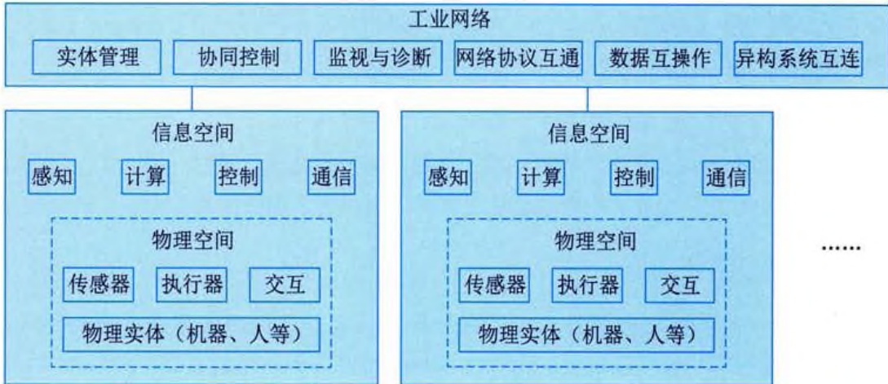  
图 21-4 系统级 CPS 示例  
# 3. 系统之系统级  

SoS 级 CPS 是由多个系统级 CPS 通过 CPS 智能服务平台有机融合在一起的组合体。换言之，通过 CPS 智能服务平台对若干系统级 CPS 的工作状态进行统一监测、实时分析、集中管控，利用数据融合、分布式计算、大数据分析技术对多个系统级 CPS 的生产计划、运行状态、生命周期估计等进行统一监管，实现企业级远程监测诊断、供应链协同、预防性维护等，通过大数据平台，实现跨系统、跨平台的互联互通和互操作，促成多源异构数据的集成、交换和共享的闭环自动流动，在全局范围内实现信息全面感知、深度分析、科学决策和精准执行，以实现更大范围内的资源优化配置，避免资源浪费。系统之系统级 CPS 示例如图 21-5 所示。  

  
图 21-5 系统之系统级 CPS 示例  

可以说，SoS 级 CPS 是基于大数据平台，通过丰富开发工具、开放应用接口、共享数据资源等方式加速了各类工业 App 和平台软件的出现，以提供更多增值服务。  

# 21.2.2 CPS典型系统构成  

通常 CPS 由一些基本功能单元组成, 这些基本功能单元包括传感器 (Sensor)、执行器 (Actuator) 和决策控制单元 (Decision-making Control Unit) 等。传感器是一种嵌入式设备, 能够监测、感知外界信号、物理条件 (如光、热) 或化学组成 (如烟雾等): 执行器是一种嵌入式  
设备，能够接收控制指令并对受控对象施加控制作用；决策控制单元是一种逻辑控制设备，能够根据用户定义的语义规则生成控制逻辑。  

CPS 从逻辑上划分为决策层、网络层和物理层。决策层通过语义逻辑运算等方式实现用户、感知和控制系统之间的逻辑耦合；网络层通过网络传输处理等过程连接 CPS 在不同空间、时间的子系统：物理层是 CPS 与物理实体的接口，实现感知与控制计算。  

CPS 基本部件基于反馈循环控制机制执行 CPS 最基本的监测与控制功能。传感器与执行器是物理和信息空间的枢纽，决策控制单元根据控制规则触发监测任务。传感器将感知信息反馈给决策控制单元，决策控制单元将其作为控制规则算法的输入经过计算得到控制指令。执行器根据控制指令操控物理对象。  

CPS 可以是运行在不同时间和空间范围的闭环系统，而且感知、决策和控制执行子系统大多不在同一地理位置。逻辑上紧密耦合的基本功能单元依托于强大计算资源和数据库的网络基础设施（如 Internet、数据库、知识库服务器、传输网络等）构成了 CPS 完整系统，通过它实现本地或者远程监测和控制物理实体。  

在实际应用中，通常将大量传感器以无线通信方式自组织成网络（传感器网络），协同完成对物理环境或物理对象的监测感知。传感器网络对感知数据做进一步的数据融合处理，将得到的信息通过网络基础设施传递给决策控制单元；决策控制单元与执行器通过网络层实现对物理机构的控制。  

# 21.2.3 CPS特点  

CPS 通过打通两大空间（信息空间和物理空间），在数据闭环自动流动的四个过程（状态感知、实时分析、科学决策、精准执行）中实现物理系统的业务功能。  

(1) CPS 控制系统通常是封闭系统, 网络内部各个独立的子系统或者设备难以通过开放总线或者互联网进行互联, 其通信距离很短, 通信功能比较弱。  

(2) CPS 采用分布式应用系统进行构建, 通常系统复杂度高, 规模庞大。CPS 对网络内部设备的远程协调能力、自治能力、控制对象的种类和数量, 特别是网络规模, 远远超过现有工控网络。  

(3) 海量运算是 CPS 接入设备的普遍特征。接入设备通常具有强大的计算能力。  

(4) 感知是 CPS 的基础。自然界中各种物理量的变化绝大多数是连续的, 或者说是模拟的, 而信息空间数据则具有离散性。从物理空间到信息空间的信息流动, 需要经过一系列处理,如通过各种类型传感器将物理量转换为模拟量, 再通过 ADC（模数转换器）变成数字量, 才可被信息空间所接收。  

(5) CPS 应用广泛性。CPS 涵盖了诸多领域, 小到智能家庭网络, 大至工业控制系统乃至智能交通系统等国家级甚至世界级应用。值得一提的是, CPS 催生了众多具有计算、通信、控制、协同和自治性设备的出现。而它们的出现反过来又推动了 CPS 的发展。  

另外，CPS 具有与传统的实时嵌入式系统和监控与数据采集系统（Supervisory Control And Data Acquisition Systems，SCADA）不同的特质。主要体现在如下几方面:  

(1) 全局虚拟 (Globally Virtual)、局部物理 (Locally Physical) 性。局部物理世界发生的  
感知和操作，可以通过虚拟网络被安全、可靠、实时地观察和控制。  

(2) 深度嵌入性 (Deeply Embedded)。嵌入式传感器与执行器, 是将计算嵌入物理部件, 甚至可能嵌入物质里, 使物理设备具备计算、通信、控制、远程协作和自治等能力, 尤其是将计算作为物理对象的一部分。  

(3) 事件驱动 (Event Driven)性。物理环境和对象状态的变化构成 CPS 事件, 形成 “事件 → 感知 → 决策 → 控制” 的闭环过程, 最终改变物理对象状态。  

(4) 以数据为中心 (Data-Centric)。CPS 各个层级的部件与子系统都围绕数据融合 (Data Fusion) 向上提供服务, 数据沿着从物理世界接口到用户的路径上不断提炼、抽象, 用户最终得到全面的、精确的事件信息。  

(5) 时间关键（Time-Critical）性。物理世界的时间是不可逆转的，应用可能对 CPS 的时间性（Timeliness）提出严格要求，信息获取和提交的实时性影响用户的判断与决策，尤其是在重要基础设施领域。  

(6) 安全关键 (Security/Safety-Critical) 性。CPS 的系统规模与复杂性对信息系统安全提出更高要求。主要是防范恶意攻击, 如通过计算进程对物理进程 (控制) 的严重威胁, CPS 用户被动暴露隐私等问题。CPS 安全性需要同时考虑系统自身的安全性 (Safety)、外部攻击下的安全性 (Security), 以及用户隐私 (Privacy)。  

(7) 异构 (Heterogeneous) 性。CPS 包含了许多功能与结构各异的子系统, 各个子系统之间需要通过有线或无线的通信方式相互协调工作。为此, CPS 也被称为混合系统 (Hybrid Systems) 或者系统的系统 (System of Systems)。  

(8) 高可信赖 (Highly Dependable) 性。物理世界不是完全可预测和可控的, 对于意想不到的情况, 应保证 CPS 鲁棒性 (Robustness); 同时系统应满足可靠性 (Reliability)、效率 (Efficiency)、可扩展性 (Scalability) 和适应性 (Adaptability) 等要求。  

(9) 高度自主性 (Highly Autonomous)。CPS 部件与子系统通常具备自组织 (Self-organizing)、自配置 (Self-configuration)、自维护 (Self-maintenance)、自优化 (Self-optimization) 和自保护 (Self-protecting) 能力，支持 CPS 完成自感知 (Self-sensing)、自决策 (Self-determination) 和自控制 (Self-control)。  

(10) 领域相关性 (Domain-Specific)。CPS 与领域强相关, 与工程应用领域密不可分, CPS 应用于诸如汽车、石油化工、航空航天、制造业、民用基础设施等领域, 需要满足不同领域对系统容错、安全、集中控制等方面的差异化诉求。  

# 21.3 信息物理系统技术框架  

# 21.3.1 CPS技术概况  

技术上，CPS 涉及核心技术和支撑技术两类。CPS 核心技术主要有虚实融合控制、智能装备、MBD（Model Based Definition，基于模型定义）、数字孪生、现场总线、工业以太网、CAX（Computer Assisted X），MES（Manufacturing Execution System，制造执行系统），ERP（Enterprise Resource Planning，企业资源计划），PLM（Product Lifecycle Management，产品生  
命周期管理），CRM（Customer Relationship Management，客户关系管理），SCM（Supply Chain Management，供应链管理）等基础技术。CPS支撑技术主要有智能感知、嵌入式软件、数据库、人机交互、中间件、软件定义网络（Software Defined Network, SDN）、物联网、大数据等方面技术，提供对CPS应用的支撑。  

# 21.3.2 CPS核心技术  

总体来说，CPS 包含四大方面核心技术，即感知和自动控制、工业软件、工业网络、工业云和智能服务平台相关技术。  

(1) 感知和自动控制。感知和自动控制是 CPS 实现的硬件支撑。其主要有智能感知技术和虚实融合控制技术。  

(2) 工业软件。工业软件固化了 CPS 计算和数据流程的规则, 是 CPS 的核心。其主要涉及嵌入式软件技术、MBD 技术、CAx/MES/ERP 软件技术等。  

(3) 工业网络。工业网络是工业监测和控制数据等在人、机、物之间传输的网络载体, 其采用的接入技术主要有现场总线技术、工业以太网技术、无线技术、SDN 等。  

(4) 工业云和智能服务平台。工业云和智能服务平台是 CPS 数据汇聚和支撑上层应用解决方案的基础, 对外提供资源管控和能力服务。其采用的主要技术有边缘计算技术、雾计算技术、大数据分析技术等。  

# 21.3.3 CPS支撑技术  

CPS 是处于物理、生物、工程和信息科学的交叉领域的新学科。CPS 的理论技术体系可以分层划分为感知与控制技术、传输理论与技术、支撑理论与技术和应用技术。其中，最重要的是计算理论与技术、网络传输技术、传感器网络与普适感知技术等。  

# 1. 计算理论与技术  

计算理论与技术是CPS实现的根本基础。主要的计算技术包括普适计算（Pervasive Ubiquitous Computing）、嵌入式计算（Embedded Computing）、分布式计算（Distributed Computing）和云计算（Cloud Computing）、移动计算（Mobile Computing）、自律计算（Autonomic Computing）和可信计算（Trusted Computing）等。普适计算体现了赛博（或信息）空间与物理空间的融合，与CPS从设计目的到工作模式都非常相似；嵌入式计算与控制结合在一起，通过嵌入物理系统，实现“环境智能化”；分布式计算是将复杂的问题分配给若干计算机来解决，实现了计算资源共享和计算负载的均衡；云计算是分布式计算模式的创新，将计算、数据和应用等资源作为服务通过网络提供给租户；自律计算也称为自主计算，通过自配置、自恢复、自优化和自保护机制，解决物理环境的不确定性和不可控因素对CPS的不利影响；移动计算实现了可移动计算机或其他智能信息设备在无线环境下的数据传输和资源共享；可信计算在计算和通信系统中广泛采用基于硬件的安全模块解决计算的安全问题。  

# 2. 网络传输技术  

以计算机和通信技术为基础的传输网络是实现 CPS 功能的重要基础设施。下一代互联网  
(Next Generation Internet, NGI)、下一代网络 (Next Generation Network, NGN) 或 5G 移动通信网络为 CPS 实施发挥重要支撑作用。作为 NGI 核心的 IPv6 技术, 提供了丰富的地址资源,使大量物理对象的网络化互联成为可能; NGN/5G 网络能够提供高可靠、低时延、大连接等通信服务能力, 为 CPS 在数据、语音和视频多媒体应用方面提供强有力支撑。  

# 3. 传感器网络与普适感知技术  

大量的传感器以无线通信的方式自组织成的网络为无线传感器网络（Wireless Sensor Networks，WSN），以协作方式感知、采集和处理物理对象的信息。WSN 涉及网络协议、能量管理、数据融合、安全等方面技术。嵌入式传感器与传感器网络技术的成熟与广泛应用使对物理环境无处不在的感知（即普适感知）成为现实。  

此外，在CPS环境下，还出现了一种新的传感器网络技术，即WSAN（Wireless Sensor and Actuator Network），传感器和执行器融合的网络技术。可以说，WSN是一个被动的信息采集基础设施，而WSAN除了是一个被动的信息采集基础设施外，也兼具操控物理对象的能力，体现了WSAN的主动性特征。  

# 21.3.4 协议标准  

# 1. 协议栈模型  

典型网络协议栈如图 21-6 所示，包括 OSI 模型（即 7 层网络协议模型）或 5 层网络协议模型。  

  
(a) 7 层网络协议模型  
(b) 5 层网络协议模型  
图 21-6 网络协议栈  

应用层：实现特定应用功能的协议，如 HTTP、DNS 等。  

表示层：完成数据的表示、安全、压缩等功能。  

会话层：完成会话的建立、管理、终止功能。会话，对应主机进程，是指本地主机与远程主机正在进行的会话。  

传输层：定义传输数据的协议端口号，实现传输数据流控和差错校验等功能，如 TCP、UDP 协议等。  

网络层：完成数据包转发的寻址工作，实现数据包在不同网络之间转发的路径选择等功能，  
如ICMP、IGMP、IP（IPv4、IPv6）等。  

数据链路层：将比特组合成字节，以及数据帧，用 MAC 地址访问介质，完成逻辑连接建立、硬件地址寻址、差错校验等功能。  

物理层：完成物理连接的建立、维护、断开功能，执行通信信道上的原始比特流传输。  

根据基本通信过程，物联网（人、机、物之间）通信一般遵循上述OSI模型（即7层网络协议模型）或5层网络协议模型，对于某些特殊通信场景，根据应用需要，对上述标准协议栈分层进行了灵活的取舍、合并或变通。  

# 2. CPS 相关协议  

CPS 相关协议分类如表 21-1 所示。  

<table><tr><td>协议分层</td><td>相关协议</td></tr><tr><td>应用层</td><td>MQTT、CoAP、HTTP、FTP、DDS等</td></tr><tr><td>网络层、传输层</td><td>IPv4、IPv6、TCP、LoWPAN等</td></tr><tr><td rowspan="5" colspan="1">数据链路层、物理层</td><td>近距离通信：NFC/RFID、Bluetooth等 远距离蜂窝通信：GSM、GPRS、WCDMA、LTE、5G等 远距离非蜂窝通信：ZigBee、Wi-Fi、Z-Wave等 有线通信：MBus、USB、RS232、RS485、Ethernet等</td></tr><tr></tr><tr></tr><tr></tr></table>  

注：上述协议所运行的物理载体包括RFID读写器、传感器、可穿戴设备、红外设备、RFID标签、Beacon、摄像头等。  

# 1) RFID  

RFID（Radio Frequency Identification）通过无线电信号识别特定目标并读写相关数据，而无须在识别系统与特定目标之间建立机械或光学接触的通信技术。其采用微波，工作频率在1\~100GHz范围，适用于短距离识别通信。也就是说，RFID是一种无接触自动识别技术，利用射频信号及其空间耦合传输特性，实现对静止或移动中物品的自动识别。  

RFID 系统由两个部分组成, 即电子标签和阅读器。电子标签由收发天线、AC/DC 电路、解调电路、逻辑控制电路、存储器和调制电路组成。分为无源电子标签 (Passive Tag), 对应无源 RFID 系统; 半无源电子标签 (Semi-passive Tag), 对应于半无源 RFID 系统; 有源电子标签 (Active Tag), 对应于有源 RFID 系统。阅读器是将标签中的信息读出, 或将标签所需要存储的信息写入标签的装置。根据使用的结构和技术不同, 阅读器可以是读/写装置, 是 RFID 系统信息控制和处理中心。阅读器 (问答器) 可放置在一固定地点, 如入口/出口、销售网点、仓库、货栈、大商场: 阅读器同样可在移动的范围中使用。  

# 2) NFC  

NFC 是一种新兴通信技术，是由非接触式射频识别技术 RFID 演化而来，基于 NFC 通信技术的设备（如手机）可在彼此靠近的情况下进行数据交换。具体来说，NFC 是一种短距高频的无线电技术，NFCIP-1 标准规定 NFC 的通信距离为 10cm 以内，运行频率为 13.56MHz，传输速度有 106kb/s、212kb/s、424kb/s 三种。  
 

NFC 工作模式分为被动模式和主动模式。被动模式中 NFC 发起设备（也称为主设备）需要供电设备，主设备利用供电设备的能量来提供射频场，并将数据发送到 NFC 目标设备（也称作从设备），传输速率需在 106kb/s、212kb/s 或 424kb/s 中选择其中一种。从设备不产生射频场，所以可以不需要供电设备，而是利用主设备产生的射频场转换为电能，为从设备的电路供电，接收主设备发送的数据，并且利用负载调制技术，以相同的速度将从设备数据传回主设备。因此工作模式下从设备不产生射频场，而是被动接收主设备产生的射频场，所以被称作被动模式。此模式下,NFC 主设备可以检测非接触式卡或 NFC 目标设备，与之建立连接。主动模式中，发起设备和目标设备在向对方发送数据时，都必须主动产生射频场，所以称为主动模式，它们都需要供电设备来提供产生射频场的能量。这种通信模式是对等网络通信的标准模式，可以获得非常快速的连接速率。  

NFC 系统工作形态主要有点对点形式、读卡器形式和模拟卡片形式。两个 NFC 设备采用点对点形式可以交换数据。例如，具有 NFC 功能的数字相机、手机之间可以利用 NFC 技术进行无线互连，实现虚拟名片或数字相片等数据交换。读卡器形式是 NFC 设备作为非接触读写器使用。例如，支持 NFC 的手机在与标签交互时充当读写器，可以读写支持 NFC 数据格式标准的标签。NFC 非接触读卡器可从展览信息电子标签、电影海报、广告页面等读取相关信息。另外，支持 NFC 的手机还可以支持公交车站点信息、旅游景点地图信息的获取，提高人们旅游交通的便捷性。模拟卡片形式是将具有 NFC 功能的设备模拟成一张标签或非接触卡，如支持 NFC 的手机可以作为门禁卡、银行卡等来使用。这种形式的 NFC 应用于商场、交通等非接触性移动支付当中，用户仅需把自身的手机或者其他有关的电子设备贴近读卡器，同时输入相应密码则可完成交易。  

# 3) Bluetooth 和 BLE  

蓝牙（Bluetooth）是一种短距离无线通信技术，它采用短波长、超高频无线电波进行通信，可实现固定设备、移动设备和楼宇个人域网之间的短距离数据交换（使用2.4\~2.485GHz的ISM波段的UHF无线电波），主要用于音频流，同时也是许多无线互连设备通信的重要手段。其低功耗、短距离通信特点，使得其在个域网（PAN）和物联网部署中得到青睐。作为蓝牙技术的另一选项，低能耗蓝牙（Bluetoothwith Low Energy，BLE）是为低功耗IoT设备互连而优化的蓝牙升级版。正如其名，BLE比标准蓝牙节省能量。例如，BLE可用于个人消费者的健康、健美跟踪系统、智能家居设备等，也可用于商业方面，如商场导航等。  

# 4) ZigBee  

ZigBee 也被称为 HomeRF Lite、RF-EasyLink 或 fireFly 无线电技术。简单来说, ZigBee 是一种高可靠的无线通信网络, 类似于 CDMA 和 GSM 网络。ZigBee 数传模块类似于移动网络基站, 其通信距离可从标准的 75m, 延伸到几百米, 乃至几公里。基于 ZigBee 的无线数传网络可由多达 65 535 个无线数传模块组成, 在整个网络范围内, 每个 ZigBee 数传模块之间可以相互通信。ZigBee 网络适用于工业现场自动化控制数据传输, 具有组网简单、使用方便、工作可靠、价格低等特点。实际应用中, 每个 ZigBee 网络节点不仅本身可以作为监控对象, 即对其所连接的传感器直接进行数据采集和监控, 还可以自动中继其他网络节点转发来的数据。此外,  
ZigBee 网络节点还可在自己信号覆盖的范围内，和多个不承担网络数据中继任务的孤立节点建立无线连接。  

作为一种无线通信技术，ZigBee 可工作在 2.4GHz（全球流行）、868MHz（欧洲流行）和 915 MHz（美国流行）3 个频段上，分别具有最高 250kb/s、20kb/s 和 40kb/s 的传输速率，它的传输距离通常为 10 \~ 75m。ZigBee 具有如下优势:  

(1) 低功耗。ZigBee 传输速率低, 发射功率仅为 $1\mathrm{mW}$, 而且采用了休眠模式, 因此 ZigBee 设备非常省电。据估算, ZigBee 设备仅靠两节 5 号电池就可以维持长达 6 个月到 2 年的使用时间。  

(2) 成本低。ZigBee 模块初始成本约 40 元, 随着规模应用, 价格有望降到 $10 \sim 20$ 元。另外, ZigBee 协议免专利费。  

(3) 时延短。通信时延和从休眠状态激活的时延都较短, 典型的搜索设备时延为 30ms, 休眠激活时延为 15ms, 活动设备信道接入时延为 15ms。因此, ZigBee 技术适用于对时延要求苛刻的无线控制场合, 如工业控制场合。  

(4) 网络容量大。单个星形结构 ZigBee 网络最多可以容纳 254 个从设备和一个主设备, 单个区域内可同时存在多至 100 个 ZigBee 网络。  

(5)可靠。采取了碰撞避免策略, 同时为需要固定带宽的通信业务预留了专用时隙, 避免数据发送的竞争和冲突。MAC层采用带确认的数据传输模式, 每个发送的数据包都必须等待接收方的确认。如果传输过程中出现问题则进行重发。  

(6) 安全。ZigBee具备基于循环冗余校验（CRC）的数据包完整性检查功能，同时支持鉴权和认证，采用了 AES-128 加密算法，保证数据传输的安全性。  

总的来说，ZigBee 是一种低速短距离传输无线协议，采用 IEEE 802.15.4 标准规范的媒体访问层与物理层。ZigBee 也是一种 Mesh 网络协议，主要面向建筑或家庭自动化应用，是 IoT 应用最流行的协议之一。作为一种短距离、低功耗协议，ZigBee 可用来将通信范围扩展到多种设备之间。它比 BLE 有更长的通信距离，但有较低的数据传送速率。可以说，ZigBee 是一种灵活且具有自组织能力、超低功耗的通信协议。  

# 5) LoRa 和 LoRaWAN  

长距离通信协议 LoRa（Long Range）是一种专用于无线电调制解调的技术，LoRa 融合了数字扩频、数字信号处理和前向纠错编码技术，它本身是一种非蜂窝无线通信技术，提供长距离通信能力，同时具备低功耗、安全数据传输能力。  

在 LoRaWAN 网络中所有设备可以是异步的，并在只有可用数据时才进行传输。针对不同应用场景，LoRaWAN 定义了三种节点运行模式，分别是 Class A（ALL）、Class B（Beacon）、Class C（Continuously Listening）。  

Class A 模式主要提供低功耗上行连接，处于 Class A 模式的节点可以在任意时间发起上行 数据传输，并只在传输结束时打开两个下行接收窗口，此时接收来自网关的确认信息。Class A 模式下，网关无法主动连接到节点，当无数据传输时，节点处于休眠状态，因此该模式下节点 能耗最低。  

Class B 模式采用的是节点与网关的周期性连接，LoRa 网关节点周期性向普通 LoRa 节点广  
播信标帧，保持节点与网关时间同步。  

Class C 模式采用的是节点与网关的持续性连接，LoRa 节点始终处于唤醒状态，因此能耗最高。  

三种网络模式中, Class A 是所有 LoRa 网络都必须支持的模式, 也是最常用的网络模式。在实际应用中对这三种模式的选择, 其实就是在网络灵活性、可用性和节能之间寻找一个平衡。Class A 最节能, 但灵活性相对较低。例如, 下行数据传输只能依赖于上行数据的时间。Class C 最耗电, 同时上行和下行数据发送最灵活。  

LoRa 作为广泛使用的低功耗广域网技术 (Low Power Wide Area Network, LPWAN), 为低功耗物联网设备提供了可靠的连接方案, 相比于 Wi-Fi、蓝牙、ZigBee 等传统无线局域网, LoRa 可以实现更远距离的通信, 有效扩展了网络的覆盖范围; 而相比于移动蜂窝网络, LoRa 具有更低的硬件部署成本和更长的节点使用寿命, 单个 LoRa 节点可以在电池供电的情况下连续工作数年。LoRa 具有低数据率、远距离和低功耗的性质, 因此非常适合与室外的传感器及其他物联网设备进行通信或数据交互。  

考虑到 LoRa 在覆盖距离、部署成本等方面的巨大优势，LoRa 主要应用在智能仪表（如智能水表、智能电表）、智慧城市、智能交通数据采集、野生动物监控等众多物联网场景中。例如，LoRa 通信模块与传统的水质传感器进行连接，从而使用户可以数十公里外远程监控饮用水在输送过程中的水质变化情况。而在某些场景中，通过广泛部署 LoRa 网关，实现 LoRa 网络全覆盖，为智慧运输、智能农业、智慧路灯等具体应用提供通信支持。  

# 6) LPWAN  

LPWAN 是低功耗广域网，其特点在于极低功耗，长距离以及海量连接，适用于物联网万物互联的场景。LPWAN 填补了常见通信技术（如 Wi-Fi、Bluetooth、4G/5G 等）的空白，即通信距离长、能耗低、通信速率低。LPWAN 虽然通信速率不高，但是依然能够满足大部分 CPS 通信的需求，其超低功耗的特点是它得以青睐的原因。  

LPWAN 兼具短距离无线网络低功耗和蜂窝网络超大覆盖范围的优点，覆盖范围广、通信能耗低。因此，对于分布在大范围区域内的低功耗物联网设备来说，LPWAN 是最佳的连接选择。  

在 LPWAN 网络中，物联网设备可以随意部署或移动，而不影响其通信，因此 LPWAN 可以满足智能城市中的诸多应用，如智能化计量、家庭自动化、可穿戴电子、物流、环境监测等，LPWAN 正好迎合了这些应用交换数据量少，交换频率也不高的特点。再如，还应用于智能交通、工厂、农业、采矿等领域，LPWAN 具有传统蜂窝网络和传统无线技术所不具备的特点（相比于蜂窝网络来说功耗更低，相比于传统无线网覆盖更广），同时由于其独特的设计，使得 LPWAN 通常能在更低的信噪比下工作，从而更好满足这些复杂环境的联网诉求。  

LPWAN 技术按工作频段不同, 可分为授权频段 (License Band) 和非授权频段 (Unlicense Band) 两类。采用授权频段技术的为 3GPP (3rd Generation Partnership Project) 主导的 NB-IoT (Narrow Band IoT), 其采用现有蜂窝网络的基础硬件, 通过系统升级来实现。至于非授权频段, 支持厂家较为普遍, 大部分不属于电信领域的 ICT 厂商, 主要的代表技术有 LoRa、SigFox 等。它们都采用了 ISM 频段 (Industrial Scientific Medical Band), 这是一种各国开放给工业、科学及  
医学机构使用的频段，其无须许可证及费用。  

# 7) 蜂窝移动通信  

蜂窝移动通信是众所周知且应用最广的一种物联网应用通信手段。它可为物联网设备提供远距离的通信。  

作为早期的蜂窝通信技术标准之一，GSM 是由欧洲电信标准组织 ETSI 制订的一个数字移动通信标准。它的空中接口采用时分多址技术，属于 2G 移动通信技术。GPRS 是 GSM 移动电话用户可签约使用的一种移动数据业务，属于第二代移动通信中的数据传输技术。GPRS 可说是 GSM 的延续。和以往在频道连续传输数据的方式不同，GPRS 是以分组（Packet）式来传输数据的。GPRS 传输速率可提升至 56kb/s，甚至 114kb/s。  

随着通信技术的发展，2G/3G蜂窝通信技术逐渐淡出人们生活，但4G/5G作为当今主流的通信技术，它们可为人们提供更高速度、更高质量、更可靠、更安全的通信服务，因此更适用于很多物联网部署的场景，不过其成本、功耗相对较高。  

下面简单介绍蜂窝移动通信的几个演进阶段。所有的蜂窝移动通信（Cellular Mobile Communication）是采用蜂窝无线组网方式，在终端和网络设备之间建立无线通道，实现移动用户之间或移动用户和数据网络之间的通信。其主要特征是终端的移动性，并具有越区切换和跨本地网自动漫游的能力。蜂窝移动通信经历了2G、3G、4G、5G等几个阶段。  

2G 技术年代比较久远，2G 的出现标志着数字通信的开始，2G 又叫 GSM（Global System for Mobile Communications），即全球移动通信系统。通过 2G 网络，用户可以打电话，发短信。之后就是 GPRS，又称作是 2.5G，它是 GSM 的延续，同时它的传输速率相比 2G 有了提升。  

蜂窝通信发展到 3G，用户的数据传输速率更高，一般可以达到几百 kb/s，3G 用户可以视频通话，同时也可以用手机看电视。在 3G 阶段，国内不同运营商使用了不同的标准，它们分别是 CDMA2000、WCDMA 和 TD-SCDMA。其中，联通的 WCDMA 演进技术 HSPA+ 可以支持最高 42Mb/s 的传输速率，主要用于大部分视频数据传输领域。  

3G 当中的 HSPA+ 技术虽然可以用于视频数据的传输, 但是如果想要传输高清的视频数据, 就有一些吃力了。到了 4G, 它的数据传输速率就更高了, 用户可以用手机进行看视频、听音乐等一系列多媒体业务。同时在 4G 网络中, 需要说明的就是 4G 的不同等级, 也就是 LTE-Cat, 它指的是终端设备接入 4G 网络所支持的不同速率等级。在 4G 网络中, 设计者使用不同的等级方式来规定某个设备所能达到的最高传输速率。在 4G 开始提供业务时, 常见的各种终端设备使用的是 Cat.4 等级, 后来所使用的 4G 设备基本都是 Cat.6 等级。另外, 在物联网领域, 使用比较多的是 Cat.1 等级终端, 此等级的大部分终端设备应用于低功耗广域网场景, 尽管 Cat.4 及更高版本的解决方案支持高速率, 但是对于物联网终端设备来说, 这些模组成本偏高。因此, Cat.1 等级就成了使用 4G 网络（LTE 网络）最具有性价比的等级。Cat.1 支持高达 10Mb/s 的终端下行链路速率, 从而能够将更低功耗和更低成本的 IoT 设备连接到 LTE 网络。  

5G 网络是第五代移动通信网络，5G 的理论峰值速率可以达到 10Gb/s。同时 5G 定义了三大应用场景：增强型移动互联网业务（Enhanced Mobile Broadband, eMBB）对应的就是 10Gb/s 的速率，海量连接的物联网业务（Massive Machine Type Communication, mMTC）对应的是每平方公里 1 百万设备连接数，超高可靠性与超低时延业务（Ultra Reliable & Low Latency  
Communication, uRLLC) 对应的是 1ms 时延。在这三大场景当中, eMBB 场景与用户的关联性比较大, 它能给用户提供大带宽的上网速率。另外两个场景就与物联网、CPS 的关联度比较大, 海量连接与超低时延能够帮助物联网、CPS 系统实现万物互连、实时控制的目标。  

# 8) Ethernet  

Ethernet 在 1980 年由 IEEE 组织完成标准的制定, 即形成 IEEE 802.3 标准。此 Ethernet 标准规范定义了数据传输协议, 以及 Ethernet 产品（如接口卡、线缆等规格等）建造技术细节等。  

传输速率方面，早期典型 Ethernet 支持 10Mb/s 传输速率，随后发展至支持 Fast Ethernet（最高支 100Mb/s 传输速率）、Gigabit Ethernet（最高支持 1Gb/s 传输速率）等更高传输速率的标准。另外，10Gb/s 甚至 40Gb/s 和 100Gb/s 等传输速率的 Ethernet 标准也问世了，但这些标准目前主要还是赋能企业组织，或 IT/CT 运营商等用户群。网线方面，主要包括 Cat.5、Cat.5e、Cat.6 等线缆规格。Cat.5 类线缆主要用于 10Mb/s 和 100Mb/s 速率的 Ethernet 通信；Cat.5e/Cat.6 类线缆支持 1Gb/s 速率的 Ethernet 通信。随后采用光纤实现设备互连，光纤包括单模和多模光纤。  

# 9) RS-232  

RS-232 属于串行通信接口之一，也是个人计算机上的通信接口之一，是电子工业协会（Electronic Industries Association，EIA）所制定的异步传输标准接口。  

RS-232 是一种串行通信标准，通常用于两个互连设备的异步通信。它定义了设备之间通信链路的电气和物理特性，信号电平、时序、通信数据格式等。通常 RS-232 接口以 9 个引脚（DB-9）或 25 个引脚（DB-25）的形态出现。  

# 10) RS-485  

RS-485 又名 TIA-485-A、ANSI/TIA/EIA-485 或 TIA/EIA-485。RS-485 是另一种串行通信协议标准，该标准由电信行业协会和电子工业联盟定义。  

RS-485 是一种差分总线通信协议，允许多个设备共享同一通信链路，支持双向全双工数据收发机制，提供更高通信速率，且抗干扰能力强，支持长达1200m距离的通信，使得使用该标准的通信设备可在远距离以及复杂电子噪声环境下进行有效通信。  

作为一种用于长距离通信设备之间串行通信的协议，RS-485 尤其适用于工业应用领域，如 工业自动化、建筑自动化、HVAC（Heating Ventilation Air-Conditioning）系统等。  

# 11) USB  

USB(Universal Serial Bus)是一种通用串行总线协议标准, 通常用作计算机和周边设备 (如键盘、鼠标、存储、打印机等) 之间互连的协议。  

USB 传输速率可高达 480Mb/s（USB 2.0）或 5Gb/s（USB 3.0），相对传统的串口速率有质的飞跃。USB 接口支持即插即用和热插拔功能，USB 接口设备无须关电，即可实现插拔。扩展性强，可通过 USB 集线器将一个 USB 接口扩展成多个接口。另外，USB 的低功耗设计有效降低设备功耗，更加环保。  

USB 速度快，扩展性强，使用方便等特点使得其成为工业计算机和外围设备互连的常用方式之一。  
# 12) AMOP  

高级消息队列协议（Advanced Message Queuing Protocol, AMQP），是一种开放的标准 协议，更多用于面向消息的中间件。通过它可实现系统之间消息互操作要求，同时兼具安全性和可靠性，而且无论系统有无消息中介（Broker）或平台，甚至是面向更远距离的通信环境， 或是基于通信服务质量（QoS）较差的网络，抑或在通信双方非同时可达的交互系统场景下， 均可提供通信服务。  

具体而言，AMQP 是一个二进制协议，具有多信道、协商式、异步、安全、跨平台、中立、 高效等特点。AMQP 通常分为三层，即模拟层、会话层和传输层。模型层定义了一套命令，客 户端应用可以利用这些命令来实现其业务功能；会话层负责将命令从客户端应用传递给服务器， 再将服务器应答回传至客户端应用，会话层为这个传递过程提供可靠性、同步机制和错误处理； 传输层提供帧处理、信道复用、错误检测和数据表示。  

在 AMQP 应用中也可进行变通处理。例如，可将传输层替换成任意传输协议，但保持AMOP 中与客户端应用程序相关的功能不变：或可变通使用其他高层协议中的会话层。  

# 13) CoAP  

受限应用协议（Constrained Application Protocol, CoAP）是 IETF RESTful 环境工作组于 2013 年推出的一种协议，是基于 HTTP 的 IoT 设备通信协议。CoAP 利用 UDP 建立安全通信连接，支持数据在多节点之间传送。例如，经常用于 M2M 通信场景。CoAP 更适用于物联网环境中受限设备之间的通信。这些设备通常具有低带宽、低可用性，甚至低功耗等特点。  

CoAP 具有如下特点: ①采用 Web 协议架构实现 M2M 通信需求; ②基于 UDP 通信, 具有可选的可靠性保证能力 (如支持可靠传输、数据重传等), 支持单播和组播方式信息交互; ③采用异步消息交换; ④轻量级头部设计, 解析复杂度低; ⑤支持 URI 和 Content-Type; ⑥支持简单的数据缓存和代理功能; ⑦采用无状态的 HTTP 映射, 可构建代理服务器, 使用 HTTP 协议访问 CoAP 资源, 或基于 CoAP 实现简单 HTTP 接口; ⑧支持 DTLS (Datagram Transport Layer Security) 协议。  

# 14) DDS  

DDS（Data Distribution Service）是对象管理组织（Object Management Group，OMG）为实时系统开发的一种数据分发服务。OMG 把 DDS 看作是以数据为中心互连的中间件协议和 API 标准。它集成系统部件，提供低延时数据互连，同时具有极高可靠性和可伸缩能力，以满足关键业务或任务的 IoT 应用需要。作为一种 M2M 的标准，它基于 Publish-Subscribe 模式来为 CPS 应用提供高性能、高伸缩性的实时数据交互服务。  

具体而言，DDS 是一种以数据为中心建立连接的中间件协议。它把系统的部件集中在一起， 提供一种低时延、高可靠、可扩展的数据互通服务架构。DDS 给出了面向分布式应用通信和集 成的以数据中心化为特征的订阅发布（Data-Centric Publish-Subscribe，DCPS）模型。它提供高 效的API 接口和通信规约（通信流程和QoS），使得信息在提供者和使用者之间高效传送，即 将正确的信息在正确的时间高效、稳定地传送至正确的地方。  

DDS 数据中心化确保所有消息包含上下文信息，以便接收消息的应用能正确理解消息含  
义。DDS 数据中心化，本质上是 DDS 掌握该存储什么数据，如何控制共享数据，而无须应用关注这些细节。DDS 逻辑上把本地存储的数据看作全局数据空间的数据，实际上，由 DDS 实现对远端节点数据的更新。但对应用来说，使用 API 访问全局数据如同访问本地内存数据一样。  

DDS 协议从机制上将发布者和订阅者进行解耦，保证发布者只关注发布内容，订阅者仅关 注自身关心的信息。  

DDS 以中间件方式提供, 将操作系统、网络传输、底层数据格式定义的细节对应用进行屏蔽, 为跨操作系统、编程语言、跨处理器架构的不同应用提供一致的接口定义和 API 来进行信息交互。至于底层数据传送格式、订阅者 / 发布者发现、连接建立、通信可靠性、底层协议实现方式、传输模式选择、QoS 控制、安全保证等均交由 DDS 中间件进行管理。应用只需要通过订阅、发布以主题 (Topic) 名标识的主题进行通信。应用订阅可指定时间、内容过滤器, 获取自身关心的主题数据的子集。  

另外，DDS 服务可按域进行划分，不同 DDS 域彼此独立，不同 DDS 域主题数据不共享。  

DDS 作为一种数据中心化中间件，特别适合工业 IoT/CPS 场景，满足企业或关键任务的 IoT 应用的需要。  

# 15) LwM2M  

LwM2M（Light weight Machine to Machine）是一种轻量机器间通信协议，用于传感器网络/M2M通信环境的设备管理。此通信协议特别适用于远程设备管理，IoT或M2M应用环境中的遥感服务，尤其是对于那些处理能力和存储能力有限的低功耗设备来说，此通信协议是极佳选择。  

具体地，LwM2M 提供设备管理和服务使能的能力以实现对 Cellular IoT 网络中设备的管控。基于 3GPP 标准，可在 NB IoT、Cat-M1、GSM IoT（EC-GSMIoT）上提供 LPWA（Low Power Wide Area）功能，为低成本、简化设计的设备带来增强覆盖和长电池寿命的优势。在 Cellular IoT 网络中，SCEF（Service Capability Exposure Function）网元可为管理设备提供安全的服务和 3GPP 标准 API 接口，主要包括支持 NIDD（Non-IP Data Delivery）、CP（Communication Patterns）、MONTE（Monitoring Event）和 Triggering，以及其他增强特性等。LwM2M 1.0 提供 UDP、SMS 传输绑定服务；在 LwM2M 1.1 中，引入更高效的数据格式，优化的消息交互模式，基于 OSCORE（Object Security for Constrained Restful Environments）的应用层安全保障机制，为 Non-IP 设备在通信质量差、带宽低的网络（如 NB IoT 等）中通信增强了性能和安全性。  

总的来说，LwM2M 支持 UDP、SMS、Non-IP 传输绑定服务；支持基于 LPWAN（如 CIoT、LoRaWAN 等）网络来提供 M2M 通信能力；提升检索和更新多重对象资源的能力；支持 JSON 使用 CBOR 串行化的 SenML；支持基于 TCP/TLS 的防火墙和 NAT 穿越能力；支持基于 OSCORE 的应用层安全保障机制；支持增强的 LwM2M 客户端注册序列控制机制；支持增强系统引导（Bootstrapping）能力，允许系统增量升级；提供扩展 LwM2M 命令，增强资源实例级访问能力；提升 PKI（Public Key Infrastructure）部署能力；提供丰富的 M2M 通信的数据类型。  

# 16) MOTT  

消息队列遥测传输协议（Message Queuing Telemetry Transport, MQTT）是一种 C/S 模式的  
发布/订阅消息传输协议。MQTT 起初是一种专门为 M2M、移动应用通信而设计的协议，后来成为物联网主流开源协议。当前MQTT 不再强调其消息排队特征，主要在于它满足 M2M 通信要求的 Publish-Subscribe 架构。其简单的报文发送机制方便受限设备之间通信，特别适合低带宽环境，或者是网络质量不高的通信场景。此协议是在程序空间受限，抑或因带宽限制，或不可靠连接所致的无线网络延迟等不确定的网络环境下设备通信的首选。  

例如，在智能家居方面，MQTT 应用于智能温控、照明控制、视频监控，以及家用电器的远程遥控等，提升人们的居住品质；在工业自动化方面，MQTT 应用于连接机器、传感器等，实现对工业过程的实时监控；在智慧农业方面，MQTT 应用于监测土壤墒情、天气信息、庄稼生长态势等，帮助农民优化灌溉、农情管理等过程；在智慧医疗方面，MQTT 应用于连接医疗设备、传感器，如血糖监测仪、心率监测仪等，实现对病人的远程监测，提升病人医疗体验，降低医疗费用等；在智慧交通方面，MQTT 应用于连接汽车和交通运输系统，实时跟踪和监测交通工具的运行状态，提升交通参与者安全感，协助交警疏导道路交通流量等。  

MQTT 采用开放型架构设计，具有协议简单易实现，支持基于 QoS 的数据传送机制，具有占用较小软件空间（轻量化）、开销低节省传输带宽、承载的数据无关性、耗电量低等特点，同时支持持续会话感知能力等。  

MQTT 消息采用二进制消息格式进行编码，减少通信数据长度，提升通信效率。MQTT 消息通信模型是基于主题（Topic）和订阅（Subscription）来建立。主题是发布消息和订阅消息的字符串，采用分层结构，可包含多级。订阅用来指定哪个客户（Client）关注并接收哪个主题的消息。如图 21-7 所示，当客户订阅了一个主题，实际上就是客户告知消息中介（Broker）它关心此主题的消息。随后，消息中介保持跟踪此订阅，当获知有其他客户发布此主题的消息后，就将其转发至订阅者客户。  

  
图 21-7 MOTT 基本通信模型  

另外，在基本的主题和订阅架构上，MQTT 还提供通配符选项，也就是在订阅时采用通配符可一次订阅多个主题，提升了消息通信的灵活性和可扩展性。主题通配符包含两类，一类是单级（Single-level）通配符，即在一个主题层级上进行通配；另一类是多级（Multi-level）通配符，即在主题指定位置后多个层级进行通配。在消息 QoS 控制上，MQTT 消息通信 QoS 级别的选择直接影响消息最终传递效果。MQTT 支持三种 QoS 级别：QoS 0、QoS 1 和 QoS 2。QoS 0 是 “最多一次”（at most once）消息传送级别，即消息允许丢失，不进行消息传送确认；QoS 1 是 “至少一次”（at least once）消息传送级别，即消息不能丢失，但可允许多次交付；QoS 2 是 “仅有一次”（exactly once）消息传送级别，即消息不能丢失，也不允许多次交付。  

值得注意的是，消息传送 QoS 级别越高，带来的消息传送延迟和网络流量增大。因此，应根据实际传送消息重要程度选择适合的 QoS 等级。  

除了 QoS 级别控制外，MQTT 还提供消息持久性保证能力，确保在网络或服务器异常下消息的可靠性。关于消息持久性能力，MOTT 提供三类消息持久性选项，即非持久性（Non-persistent）、  
队列型持久性（Queued persistent）和确认型持久性（Persistent with acknowledgment）。非持久性选 项，即消息不在系统中缓存。此选项适用于非关键类消息传递，或遗失消息容易再发生的场景。 队列型持久性选项，即在消息无法通知到订阅者时进行队列缓存，以便随后再通知。此选项适 用于订阅者不经常在线，或当订阅者可达后需要接收其离线时已发送的所有订阅消息的情况。 确认型持久性选项，即发送给订阅者的消息需得到其确认。此选项适用于需要消息订阅者确认 被发送的订阅消息已接收的情形。  

在消息持久性级别的选择上，需要权衡消息传递性能和存储能力。待传送消息越持久，消息中介所需要的存储和处理资源越多。因此，选择合适的持久性级别极为重要。  

再者，在安全性上，MQTT 支持 TLS 加密体制来保证消息在 MQTT 客户和消息中介之间传递的安全性。MQTT 可从多方面保证其部署的安全性，如采取通信加密、实施强身份认证、应用访问控制等策略保证消息收发的安全性。  

总之，MQTT 是一种轻量化、高效的通信协议，其简单的 Publish/Subscribe 消息模型，保证了设备和系统间通信灵活性。MOTT 在物联网 /M2M 通信场景中得到广泛应用。  

# 17) Wi-Fi  

Wi-Fi 属于 IEEE 802.11 标准的无线局域网技术。Wi-Fi 是已在家庭、商业、工业建筑内广泛使用的 IoT（Internet of Things）协议。它提供数据快速传输，大数据量处理能力。它特别适用于短、中距离 LAN 环境。而且，Wi-Fi 有多个系列标准供设备组网选择，尤其是 802.11n 更适合家庭和商业建筑内通信。然而，许多 Wi-Fi 标准，包括常用的 802.11n 在内，尽管都可在 IoT 环境下使用，但功耗都相对较高，这也就导致它不太适合在某些对功耗敏感的场合下使用。另外，Wi-Fi 的距离受限、扩展能力低等也限制了它的使用。  

随着 Wi-Fi 技术的发展, 先后推出了一系列标准, 如表 21-2 所述, 2.4GHz 频段支持的标准有 802.11b/g/n/ax, 5GHz 频段支持的标准有 802.11a/n/ac/ax。其中, 802.11n/ax 两个标准可同时支持 2.4GHz 和 5GHz 频段, 兼容双频工作。  

<table><tr><td>Wi-Fi版本</td><td>Wi-Fi标准</td><td>发布时间</td><td>最高速率</td><td>工作频段</td></tr><tr><td>Wi-Fi7</td><td>IEEE802.11be</td><td>2022年</td><td>30Gb/s</td><td>2.4GHz,5GHz,6GHz</td></tr><tr><td>Wi-Fi6</td><td>IEEE802.11ax</td><td>2019年</td><td>11Gb/s</td><td>2.4GHz或5GHz</td></tr><tr><td>Wi-Fi5</td><td>IEEE802.11ac</td><td>2014年</td><td>1Gb/s</td><td>5GHz</td></tr><tr><td>Wi-Fi4</td><td>IEEE802.11n</td><td>2009年</td><td>600Mb/s</td><td>2.4GHz或5GHz</td></tr><tr><td>Wi-Fi3</td><td>IEEE802.11g</td><td>2003年</td><td>54Mb/s</td><td>2.4GHz</td></tr><tr><td>Wi-Fi2</td><td>IEEE802.11b</td><td>1999年</td><td>11Mb/s</td><td>2.4GHz</td></tr><tr><td>Wi-Fi1</td><td>IEEE802.11a</td><td>1999年</td><td>54Mb/s</td><td>5GHz</td></tr><tr><td>Wi-Fi0</td><td>IEEE802.11</td><td>1997年</td><td>2Mb/s</td><td>2.4GHz</td></tr><tr></tr></table>  

就 Wi-Fi 网络来说，可有两种组网模式，分别是基础结构模式（Infrastructure Mode）和自组织模式（Ad Hoc Mode）。在基础结构模式中，至少包含一个无线接入点（AP）和若干无线  
终端设备（STA），它们组成基本服务集合（Basic Service Set, BSS）。自组织模式是无中心的， 又称为点到点（Peer to Peer）模式，整个网络无固定基础结构，每个节点或终端设备都是移动 的，可以理解为临时组成的网络，彼此都能以任意方式动态保持与其他节点或终端设备的联系， 不同终端设备之间可以直接通信。  

典型 Wi-Fi 网络通常由基本服务单元、分配系统（Distribution System, DS）、扩展服务单元（Extended Service Set, ESS）等组成。  

就协议来讲，IEEE 802.11 只负责终端设备所使用的无线介质上的寻址（Addressing）。另外，IEEE 802.11 不直接涉及分配系统，只约定了分配系统应提供的服务（Service）。针对 Wi-Fi 无线局域网，定义了9种服务。其中，5种服务属于分配系统的任务，它们分别是建立关联（Association）、取消关联（Disassociation）、分配（Distribution）、集成（Integration）和再关联（Re-association）；4种服务属于终端设备或站点（STA）的任务，它们分别是鉴权（Authentication）、取消鉴权（De-authentication）、隐私（Privacy）和MAC 数据传输（MSDU Delivery）。  

# 18) XMPP  

可扩展消息传送和存在状态协议（Extensible Messaging and Presence Protocol, XMPP）是一种相对简单的协议，XMPP 基于 TCP，采用 XML 消息提供服务，在 XML 流内采用异步通信机制。一个 XML 流就如同一个信封，封装两个实体之间交互的 XML 信息。XML 流承载 XML 段，每个 XML 段包含要交互的具体信息。XMPP 支持基本 XML 流层处理；支持通道 TLS 方式加密；支持基于 SASL（Simple Authentication and Security Layer）的强认证模式；支持消息中内嵌网络可用性信息；支持 Presence 订阅的双向授权；支持提供在线（Presence）联系者列表服务：XMPP 支持结构化可扩展数据在网络中多实体之间实时传送。  

XMPP 协议（RFC3920）类似 SMTP 协议，提供不同设备之间的通信服务。  

作为一种简单的通信方式，基于 XMPP 协议工作的设备充当客户端，以唯一名字与其他设备（客户端）通信。它们之间需要通过 XMPP 服务器提供中转路由服务。XMPP 设备基于 XMPP 的消息通信模式如图 21-8 所示。  

  
图 21-8 XMPP 设备基于 XMPP 消息通信模式  

还有另外一种复杂的通信架构，即在不同设备（如 XMPP 客户端、SMS 客户端、SMTP 客户端等）之间加入 XMPP 网关，实现不同类型设备互联互通。系统中增加的 XMPP 网关实现 XMPP 协议域与 SMS（Short Message Service）域、SMTP（Simple Message Transfer Protocol）域的互通，即实现不同协议的转换。也就是说，作为一种桥梁，XMPP 是一种理想的支撑协议，它为不同设备协议之间连接提供通用服务。XMPP 网关终结客户端到服务端的协议会话，并发起到目标设备的协议会话，需要的话，可能还涉及必要的协议转换。不同类型设备基于 XMPP 的消息互通模式如图 21-9 所示。  
   

  
图 21-9 不同类型设备基于 XMPP 消息互通模式  

XMPP 主要用于人与人之间实时通信，如 XMPP 可提供组消息通信或多用户聊天室服务。 针对多方通信，除了提供文本信息外，还提供语音、图像、视频数据。当前，XMPP 以轻量中 间件方式广泛应用于 M2M 通信领域，如应用于面向消费者的环境（如智能电器）等。  

# 19) Z-Wave  

Z-Ware 是一种基于低功耗无线频率技术构建的无线 Mesh 网络通信协议, 通过网状网络和消息确认机制实现双向通信。类似于 Bluetooth、Wi-Fi, Z-Ware 可支持物联网设备加密通信, 保证物联网环境数据通信的安全性。它常用于家庭自动化产品、安全系统、能源管理等领域。  

Z-Wave 协议工作在 800\~900MHz 频段。Z-Wave 物理 (PHY) 层和 MAC 层采用 ITU-T G.9959 全球无线电标准, 它采用 GFSK 调制和曼彻斯特编码, 支持 AES 128 加密、IPv6 和多通道操作, 提供小数据包的传输, 吞吐量通常为 9.6kb/s、40kb/s、100kb/s。为便于认证和鉴权, 每个 Z-Wave 网络规划一个网络 ID, 其中联网设备配置节点 ID 加以标识。Z-Wave 联网设备之间通信距离一般为 30\~100m。由于墙壁和其他高密度建筑材料限制覆盖范围, 一般最佳部署方式是将 Z-Wave 设备进行分组, 每组限制在较小范围内（如 15m）, 以保证较佳信号覆盖。  

# Z-Wave 设备分为主控设备（Controller）和从设备（Slave）两类。  

Z-Ware 主控设备可作为一个中心点 (Hub)，负责以下工作：①建立和维护 Z-Wave 网络；②在 Z-Wave 网络内增加或去配对 (Un-pairing) Z-Wave 节点设备；③控制外部设备（如智能手机、计算机等）与 Z-Wave 节点设备之间的通信。需要说明的是，Z-Wave 网络仅允许指派一个主控制节点，此节点的唯一的 ID 用作所在 Z-Wave 网络的 Home ID。此 ID 用于绑定归属此 Z-Wave 网络的所有设备，以形成 Mesh 网络。  

Z-Wave 从设备是实际的 Z-Wave 兼容设备, 如智能恒温控制器、运动传感器、智能门锁、智能开关、可视门铃等。一个 Z-Wave 网络最多可附着 232 个从节点设备。在 Z-Wave 网络内部, 通过采用源路由网状网络技术, 可通过中间 Z-Wave 设备将数据送达目标设备。数据在 Z-Wave 网络中转最多支持 4 跳 (Hop)。Z-Wave 中每个设备均可作为终端节点或中转 (路由) 节点来为其他设备转发数据。也就是说, 每个设备接收到数据后, 如数据目的是本节点的就直接处理; 如果作为路由节点, 则将数据转发至目标设备或距离最近的联网设备。可见, 通过采用 Mesh 技术架构, 使得 Z-Wave 网络的通信范围由点到点扩展到更大范围, 从而使得数据从一个节点分发至另一节点, 甚至多个中间节点, 最终到达目标节点。  

另外, 随着技术演进和应用驱动, 推出了 Z-Wave 的升级版, 即 Z-Wave plus。尽管 Z-Wave plus 的核心技术与 Z-Wave 的相同, 但在性能、可用性等方面有不少改良。主要体现在: 覆盖范围由原来的 $30 \sim 100$m 提升至 $100 \sim 150$m; 功耗降低近 $50\%$: 带宽提升近 $250\%$: 与 Z-Wave  
兼容设备配近（Pairing）处理更方便：设备自愈或容错能力更强等。  

# 20) MBus  

MBus（M meter Bus）是一种仪表总线技术协议，其主要特点是经由两条无极性传输线来同时 供电和传输串行数据，主要用于工业、市政、家庭等场景。利用MBus 系统，可大大简化系统 的布线和连接，且具有结构简单、造价低廉、可靠性高等优点。  

基于 MBus 构建的系统通常由 MBus 作为物理层, 对线缆连接、传输位 (Bit) 表示、总线扩展、电气特性等支持方式进行规范和约束。在数据链路层, 由 IEC 870 作为参考标准, 来提供数据链路层的控制; 在网络层实现寻址扩展等功能; 在应用层, 由 EN1434-3 标准提供对数据结构 (Data Structure)、数据类型 (Data Type)、动作 (Action) 等的定义。  

MBus 常用于各类仪表或装置的能耗等计量类智能管理系统。基于 MBus 构成的智能管理系统通常由主机（主站）、MBus 总线、从机（终端数据或信号采集子站）等组成。MBus 系统的主机或主站（Master）最多可读取 250 个从机或子站（计量设备）的数据。这些计量设备包括热力表、水表、电表、燃气表等。  

MBus 总线连接方式如图 21-10 所示。MBus 系统一般由主机、从机、集中器和两线制总线等组成，通过总线连接主机和各类仪表或装置，实现仪表或装置的数据采集功能。MBus 采用主从式半双工通信方式通信，即主叫/应答方式通信，只有处于中心位置的主机发出询问后，从机才可向主机传输数据。通过这种方式实现主机对从机数据的采集。  

  
图 21-10 MBus 总线连接方式  

# 21.4 信息物理系统开发技术  

CPS 关键技术涉及感知和自动控制、工业软件、工业网络，以及工业云和智能服务平台诸 多方面，它们对CPS 系统运行提供不可或缺的支撑。  

# 21.4.1 感知和控制相关技术  

CPS 使用到的感知和自动控制技术主要包括智能感知技术和虚实融合控制技术。  

# 1. 智能感知技术  

CPS 系统主要使用的智能感知技术是传感器技术。传感器是一种检测装置，能感受到被测量的信息，并能将检测感受到的信息，按一定规律变换成为电信号或其他所需形式的信息输出，以满足信息的传输、处理、存储、显示、记录和控制等要求。  
   

RFID 是最常用的一种传感器, 即射频识别传感器。其主要包括感应式电子晶片或近接卡、感应卡、非接触卡、电子标签、电子条码等。RFID 系统一般由电子标签 (Tag)、读写器 (Reader)、计算机网络及数据处理系统 (RFID 中间件或应用软件) 三大部分组成。  

# 2. 虚实融合控制技术  

  
图 21-11 虚实融合控制分层  

CPS 虚实融合控制是建立在状态感知的基础上, 采用一种多层 “感知 - 分析 - 决策 - 执行” 循环模型实现对物理实体的控制。感知往往是实时进行的, 并向更高层次同步或即时反馈。虚实融合控制分层如图 21-11 所示, 包括嵌入控制、虚体控制、集控控制和目标控制 4 个层次。  

(1) 嵌入控制。嵌入控制主要针对物理实体进行控制。通过嵌入式软件, 从传感器、仪器、仪表或在线测量设备采集被控对象和环境的参数信息而实现 “感知”, 通过数据处理来 “分析” 被控对象和环境状态, 通过控制目标、控制规则或模型计算而 “决策”, 向执行器发出控制指令而 “执行”。周而复始地进行 “感知-分析-决策-执行” 的循环, 最终实现控制目标。  

(2) 虚体控制。虚体控制是指在信息空间进行的控制计算, 主要针对信息虚体进行控制。虚体控制非必须, 但通常很重要, 一是在嵌入式软  

硬件中实现复杂计算不如在“大”计算环境（如云计算）成本低、效率高；二是需要同步跟踪物理实体的状态（感知信息），通过控制目标、控制逻辑或模型计算而向嵌入控制层发出控制指令。  

(3) 集控控制。在物理空间, 一个生产系统往往由多个物理实体构成。例如, 一条生产线会有多个物理实体, 并通过物流或能流连接在一起。在信息空间内, 主要通过 CPS 总线方式实现信息虚体的集成和控制。  

(4) 目标控制。对于生产而言, 从实际生产的测量结果或追溯信息中收集产品数据, 通过即时比对研判生产是否达标。产品数字孪生的工程提供实体的控制参数、控制文件或控制指示, 属于 “目标” 级控制。  

# 21.4.2 工业软件相关技术  

工业软件是指专用于工业领域，为提高工业企业研发、制造、生产、服务与管理水平以及 工业产品使用价值的软件。工业软件通过应用集成使得机械化、电气化、自动化的生产系统具 备数字化、网络化、智能化特征，以实现为工业领域提供面向产品全生命周期的网络化、协同 化、开放式的产品设计、制造和服务环境的目的。CPS 涉及的工业软件技术主要有嵌入式软件  
技术、MBD 技术、CAx/MES/ERP 软件技术等。  

# 1. 嵌入式软件技术  

嵌入式软件可细分为操作系统、嵌入式数据库和开发工具、应用软件等。嵌入式软件技术主要通过把特定软件嵌入在工业装备或工业产品之中，或被植入硬件产品或生产设备的嵌入式系统中，达到自动化、智能化地控制、监测、管理各种设备的目的。嵌入式软件技术是实现CPS功能的载体，其融入CPS控制、通信、计算、感知等环节。例如，嵌入式软件应用于生产设备，可完成生产过程的数据采集、装置控制、数据通信、信息显示等功能。  

# 2. MBD 技术  

基于模型定义技术（Model Based Definition, MBD）是采用一种集成的全三维数字化产品描述方法来完整表达产品的结构信息、几何形状信息、三维尺寸标注和制造工艺信息等的技术，它将三维实体模型作为生产制造过程的依据，改变传统以工程图纸为主，而以三维实体模型为辅的制造方法。通过 MBD 技术，支撑了 CPS 系统的产品数据在制造各环节的流动。基于 MBD 的生产过程如图 21-12 所示。  

  
图 21-12 基于 MBD 的生产过程  

相比传统制造，在MBD制造模式下，产品工艺数据、检验检测数据的形式与类型发生了很大变化。工艺部门通过三维数字化工艺设计与仿真，依据基于MBD的三维产品设计数模建立三维工艺模型，生成零件加工、部件装配动画等多媒体工艺数据。检验部门通过三维数字化检验，依据基于MBD的三维产品设计数模、三维工艺模型，可完成三维检验模型的建立和检验计划的制订工作。  

# 3. CAX/MES/ERP 软件技术  

CAx 是 CAD、CAM、CAE、CAPP、CAS、CAT、CAI 等各项技术统称。CAx 实际上是把多元化的计算机辅助技术集成起来，彼此协同工作，从产品研发、设计、生产、流通等各个环节对产品全生命周期进行管理，实现对生产和管理过程的智能化、网络化管理和控制。  

CAx 软件是 CPS 信息虚体的载体。信息虚体的原始要素定义，信息虚体之间接口的定义，都是通过 CAX 软件来实现的。通过 CAX 软件，CPS 信息虚体融入制造流程之中，以达到从供应链管理、产品设计、生产管理、企业管理等多个维度，提升 “物理世界” 中的工厂/车间的生产效率、优化生产过程的目的。  

MES 是满足大规模定制需求, 实现柔性排程和调度的关键, 其主要操作对象是 CPS 信息虚体。通过对信息虚体的操控, 以网络化和扁平化的形式对企业生产计划进行 “再计划”, “指示” 生产设备 “协同” 或 “同步” 动作, 对产品生产过程进行及时响应: 基于当前实时状态数据对  
生产过程进行即时调整、更改或干预等实现生产过程智能化管控。与此同时，信息虚体的相关 数据通过MES 收集整合形成工厂的业务数据，再通过工业大数据的分析整合，使其在全产业链 可视，进而达到企业生产最优化、流程最简化、效率最大化、成本最低化和质量最优化的目的。  

ERP 是以市场和客户需求为导向，以实现企业内外资源优化配置，尽可能避免生产经营过程中无谓的劳动和资源浪费，实现信息流、物流、资金流、价值流和业务流的有机集成和提高客户满意度为目标，以计划与控制为主线，以网络和信息技术为平台，集客户、市场、销售、采购、计划、生产、财务、质量、服务、信息集成和业务流程重组等功能为一体，面向供应链管理的现代企业管理思想和方法。  

# 21.4.3 网络相关技术  

经典的工业控制网络具有明晰的层级结构，信息从现场设备层，向上经由多个层级流入企业层。尽管这一模式得到广泛认可，但其中的数据流动并不顺畅。由于每层的功能要求不尽相同，这就导致了各层往往采用不同的网络技术，使得不同层级之间兼容性较差。CPS 中的工业网络技术将颠覆传统的分层模型的自动化控制层级，取而代之的是基于分布式的全新范式。由于各种智能设备的引入，设备可以相互连接，彼此对外提供网络服务，每层都拥有更多的嵌入式智能/响应式控制的预测分析，每层都可以使用虚拟化控制功能的云计算技术。与传统工业控制系统基于分层的结构不同，在CPS 工业网络中，高层次CPS 是由低层次CPS 灵活组合，互连而成的。  

CPS 网络从技术角度来看, 主要涉及工业异构异质网络的互联互通和即插即用。由于不同的网络在传输速率、通信协议、数据格式等方面的差异, 异构异质网络的融合具有高度复杂性。在 CPS 网络中, 将一些设备作为边缘网关, 发挥连接异构网络的作用, 同时采用统一的通信机制与数据互操作机制, 使得数据在不同网络间传输和交换, 实现设备之间互联互通。此外, 为了适应柔性制造, 小批量产品定制化需求, CPS 应是灵活组合的。相应地, 工业网络也应是柔性的, 即插即用的, 从而做到资源合理配置, 以及生产效率的极大提高。  

CPS 网络的实现, 在接入技术上, 主要采用有线网络 (如现场总线技术和工业以太网技术)、无线网络和基于有线无线网络形成的柔性灵活的工厂网络; 从网络类型来分, 既有各种智能设备组成的专用协议局域网, 也有基于通用 TCP/IP 的公共互联网。  

# 1. 现场总线技术  

现场总线技术是计算机、网络通信、超大规模集成电路、仪表和测试、过程控制和生产管理等现代高科技迅猛发展的综合产物，主要解决工业现场的智能化仪器仪表、控制器、执行机构等现场设备间的数据传递，以及这些现场控制设备和高级控制系统之间的信息传递问题。现场总线作为工厂数字通信网络的基础，打通了生产过程现场及控制设备之间及其与更高控制管理层次之间的联系。因此，现场总线的内涵现在已远远不是指这一根通信线或一种通信标准。总线在自动控制系统中的应用使得工业自动化控制技术正在向智能化、网络化和集成化方向发展，为自控设备与系统开拓了更为广阔的领域。现场总线控制系统主要有全数字化、开放型互联、可操作性、可互用性、现场设备智能化、系统结构高分散性、对现场环境可适应性等优势。  
# 2. 工业以太网技术  

当前广泛使用的工业以太网技术有十余种，如 EtherCAT、EthernetPowerlink 等。这些工业以太网技术，基本上都是各家厂商基于 IEEE 802.3（Ethernet）百兆网增加实时特性来实现的。工业以太网提供了一个无缝集成到新的多媒体世界的途径。  

另外, IEEE 802 标准组织对实时以太网 TSN 进行标准化, 以满足工业环境中时间敏感需求。 TSN 实现了一个标准的开放式网络基础设施, 可支持不同厂商设备之间的互操作和集成能力。 同时, TSN 还可支持与制造应用中的其他网络互通, 可实现企业内部信息系统网络与生产控制 系统网络的无缝融合。  

# 3. 无线技术  

无线技术，由于其节省线路布放与维护成本，组网简单（常支持自组织组网，而且无须考虑线长、节点数等限制），被广泛应用于工业生产场景中，如基于 IEEE 802.15.4 的 WirelessHART 与 ISA100.11a 技术，被用于资产管理、过程测量与控制、HMI 等方面，尤其是在某些不适宜有线布放环境（如高温、腐蚀环境）下，无线几乎是唯一选择。Wi-Fi 和 ZigBee 也是工厂内非生产环境中会使用的无线局域网技术，前者侧重于高速率，后者侧重于低功耗。此外，移动宽带技术 LTE、5G，低功率广域无线技术 NB-IoT、LTE-M、LoRa 等也在工业企业中得到应用。  

# 4. SDN  

为了适应柔性生产需求，单元级CPS需要进行灵活重构。例如，智能机器可在不同的系统级CPS（如生产线）间迁移和转换，并实现即插即用，这就要求工厂网络具备柔性灵活组网能力。而基于软件定义网络（SDN）的敏捷网络即可满足这一要求。它采用管理平面与业务平面分离，可以提供网络资源灵活编排。具体而言，基于业务系统（如制造执行系统MES）的需求，在SDN控制器配置下，实现快速的网络重组，对各网络设备进行适应性网络资源调度，使得业务数据按需转发，有效支撑柔性制造和生产自组织。  

# 21.4.4 服务平台相关技术  

服务平台通过边缘计算技术、雾计算技术、大数据分析技术等进行数据加工处理，形成对外提供数据服务的能力，并在数据服务基础上提供个性化和专业化智能服务。  

# 1. 边缘计算  

边缘计算是指基于融合网络、计算、存储、应用核心能力的开放平台，在靠近物或数据源头的网络边缘就近提供智能服务，进而实现行业数字化在敏捷连接、实时业务处理、数据优化、应用智能、安全与隐私保护等方面的关键需求。  

对于 SoS 级 CPS 来说, 其每个 CPS 组成均具有计算和通信功能, 通过每个 CPS 的边缘计算, 数据在边缘侧就能得以应用, 更适合实时数据分析和智能化处理要求。边缘计算聚焦实时、短周期数据分析, 具有安全、快捷、易于管理等优势, 更好地支撑 CPS 单元实时智能化处理与执行, 同时使计算资源得到更加有效的利用。  
   

# 2. 雾计算  

通常，CPS 是一种复杂控制系统，局域型 CPS 内每个 CPS 组成单元也需要进行协同计算、协同控制。雾计算，可理解为一种分布式计算。通过雾计算，可将数据、数据处理和应用程序集中在网络边缘设备中，数据存储及处理仅依赖本地设备，而非远端服务器。在 CPS 中应用雾计算，通过智能路由器等设备和技术手段，在不同设备之间构建数据传输带，有效减少大范围网络流量，缓解数据中心的计算负荷。雾计算不仅可以解决联网设备自动化问题，更关键的是，还能有效降低网络数据传输带宽要求。  

# 3. 大数据分析  

大数据分析技术给全球工业带来深刻变革，它赋能企业的研发、生产、运营、营销等方式， 挖掘企业潜能，给企业带来发展新机遇。工业大数据的典型应用有产品创新、产品故障诊断与 预测、工业企业供应链优化和产品精准营销等诸多方面。工业云和智能服务平台可以通过大数据 分析来实现上述创新。例如，有效分析产品大数据，通过系统地收集研发数据并加以分析建 模来优化、控制和稳定产品研发质量，以此来实现产品创新；有效分析高频、海量的运维数据 以确定产品的工作状态，发现零部件更换与维护的规律，把事后发现问题、解决问题转变为事 先避免问题。再如，对来自社交网络的商业大数据分析，可以从中观察到人们复杂的社会行为 模式，通过数据挖掘，找到用户的产品使用习惯、喜好和真实诉求，以调整优化产品，一来为 客户提供更贴合的产品与服务，二来商家获得更好的市场回报，实现商家和用户双赢。  

# 21.5 控制系统与网络通信  

在 CPS 系统中，自动控制无处不在。而控制过程的执行，往往又离不开通信的支撑。  

自动控制，即通过自动化方法实现对垂直领域（Vertical Domain），或者说是，特定工业领域或企业组织的生产或业务过程、设备、系统的控制。其主要控制功能包括物理量测量、测量结果比较、对测量误差和预期误差的计算，以及为避免后续误差而采取的过程校正能力等。参与控制过程的物理设备或装置，即 SCAT（Sensor, Controller, Actuator, Transmitter）功能单元，包括传感器、控制器、执行器、数据传输设备等。  

由前面介绍可知，CPS 系统是一种包含由物理部件、计算部件等构成的交互网络的系统。CPS 控制应用，即控制物理过程的应用，在实施控制时遵循一定的控制模型，如开环（Open-loop）控制、闭环（Closed-loop）控制、顺序（Sequence）控制、批量（Batch）控制。  

为 CPS 应用控制行为提供的通信服务，往往需要是超可靠、高可用的，在某些情况下，甚至是超低端到端时延的，如智能制造、智能电网、能源自动化等领域。  

# 1. 自动控制系统行为模式  

自动控制系统行为模式包括以下几个方面:  

(1) 开环控制。其显著特点是对控制的输出缺乏反馈。也就是说, 向执行机构或执行器发出指令后, 就视为受控制干预的过程输出符合预期或在可接受范围内。这种控制方式, 忽略环境因素对过程或执行器的影响。此控制模式, 通常适用于对控制的输出无特别要求, 或者是控  
制的输出结果如何对过程整体执行无特别影响或可容忍的场合等。  

(2) 闭环控制。其特点是对过程的控制带有反馈能力。这样即使环境的变化对过程产生影响, 或执行机构随着时间的推移, 执行效果出现偏差, 它都可通过反馈方式予以监视并对其施加干预。这种控制方式, 是通过感知过程输出, 如对输出过程进行测量, 并将测量结果反馈至控制器来实现的。  

(3) 顺序控制。即按照固定的顺序逐步执行的过程, 或按照既定的逻辑有序执行的过程,如基于系统状态和输入而执行不同行为的过程。顺序控制可看作开环控制和闭环控制的扩展,它将若干开环或闭环过程串联起来, 整个顺序控制过程通常产生若干输出实例。  

(4) 批量控制。即批处理过程, 是指利用一个或以上设备, 对输入的有限数量的材料按照事先预定的处理行为进行加工的控制过程。  

# 2. 控制系统通信要求  

自动控制系统中的通信可以从两方面来刻画，即周期性和确定性。最常见的有周期性、确定性通信，非周期性、确定性通信，非确定性通信三种。  

# 1) 周期性  

周期性（Periodicity）是指通信数据的传输间隔是重复的，如传输每30ms发生一次，又如位置的周期性变化或物理量重复检测等。在自动控制系统中，多数周期性通信间隔往往是相当短的。有一种数据传输方式是触发开始传输后，就持续进行，直到发出停止指令为止。  

非周期传输，比如由某一突发事件触发的数据传输，此类事件可以是控制系统或用户定义的任何事件。通常有如下几种事件类型：  

(1) 过程事件。例如, 过程设定门限值 (如温度、压力、水位等门限值), 有超越门限值之上的事件, 有回落门限值以下的事件。  

(2) 诊断事件。指示自动化设备或模块功能异常的事件, 如供电缺相、短路、超高温诊断事件。  

(3) 维护事件。指示自动化设备可能存在故障隐患需要检修的预警事件等。  

多数事件，特别是告警（如设备故障、过程执行出现异常等），是需要确认的。告警作为一种特殊的事件，需要通知控制器或运维人员进行响应，而且响应往往需要在很短时间内完成。例如，告警在预设的时间内未得到确认，告警需要重发，或触发相应的故障响应动作。  

# 2) 确定性通信  

确定性通信（Determinism）是指消息发送和接收之间的延时时间是稳定的或在一定范围内。就确定性通信来说，此通信时延限制在一个给定的阈值内。更进一步讲，对于周期的确定性通信来说，通信时延的变化是有更严格要求的。  

# 3. 控制系统类型和通信模式之间关系  

控制系统类型和通信模式之间存在一定的对应关系。  

开环控制系统，通常存在一个或若干消息发往执行器，这些消息可以是周期性或非周期性两种模式。但往往是需要采用确定性的通信，即典型的需要获取来自信息接收者执行行为的响应。  
   

闭环控制系统，使用周期性和非周期性通信模式进行通信。闭环控制通常用于连续的过程控制，此过程有严格的时间控制要求，如印刷过程控制等。在闭环控制系统中通信不论是周期性还是非周期性，但都需要是确定性通信。  

另外，出于维护目的的设备状态，测量值记录的通信归为非周期性通信模式。在这种通信中，发送的日志信息打上时间戳即可，就不强制采用确定性通信模式。  

事实上，垂直领域应用场景繁多，呈现多样化通信服务需求。为方便通信网络建模和降低网络复杂度，需要对通信业务类型和通信模式进行识别。  

整体来看，在工业应用环境中主要有三种典型的业务类型或通信模式：  

(1) 确定性周期通信 (Deterministic Periodic Communication, DPC), 即周期性通信, 并对传输时间有严格要求。  

(2) 确定性非周期通信 (Deterministic Aperiodic Communication, DAC)。通信未预设确定的发送时间, 如事件驱动的行为指令下发。  

(3) 非确定性通信 (Non-Deterministic Communication, NDC)。除了上述两种类型通信之外的其他通信, 如周期性非实时、非周期非实时的通信。  

在一些特殊场景中，业务控制过程有多样化通信需求，通信服务可能会是上述三种通信模 式的综合。  

# 21.6 CPS 应用分析与设计  

# 21.6.1 工业设计系统  

# 1. 需求分析  

通常在产品及工艺设计、生产线或工厂设计过程中，借助仿真分析手段来提高设计精度。 但实际产品研制中，由于缺少足够的实际数据为设计人员提供支撑，致使在设计、分析、仿真 过程中不能有效模拟真实环境，从而影响了设计精度。  

为此，需要建立实际应用与设计之间的信息交互平台，使得在设计过程中可以直接提取真实数据，通过对数据进行分析处理来直接指导设计与仿真，最后形成更优化的设计方案，提高设计精度，降低研制成本。  

# 2. 解决方案设计  

随着CPS 不断发展，在产品及工艺设计、生产线或工厂设计过程中，企业流程正在发生深刻变化，研发设计过程中的试验、制造、装配都可以在虚拟空间中进行仿真，并实现迭代、优化和改进。通过基于仿真模型的“预演”，可及早发现设计中的问题，减少或避免实际生产、建造过程中设计方案的更改，缩短产品设计到生产转化的时间，同时也有利于产品可靠性与成功率的提升。  

# 1）产品及工艺设计  

通常为了更好地满足设计目标，需要通过基于产品应用环境进行产品使用性能的仿真。例如，针对机械产品进行结构强度仿真、机械动力学仿真、热力学仿真等。传统的仿真系统各自  
独立，在仿真过程中不能完整描述产品的综合应用环境，而CPS很好地解决了此问题。  

在进行产品研发设计过程中，通过将已有的相关经验设计数据或者试验数据等进行采集， 建立结构、动力、热力等异构仿真系统组成的综合仿真平台，将数据及仿真模型以软件的形式 加以集成，实现更全面、真实的产品使用工况仿真，同时结合产品设计规范、设计知识库等信 息，形成以某一目标的优化设计算法，通过数据驱动形成产品优化设计方案，实现产品设计与 产品使用的高度协同。在产品工艺设计方面，为了使产品的制造工艺设计更加精准、高效，需 要对实际制造工艺的具体参数（如机加工中刀具的切削参数、电机功率参数等）进行采集，在 软件系统或平台中将工艺参数、工艺设计方案、工艺模型等进行信息组织和融合，并考虑不同 的工艺参数对产品制造质量/效率、产品制造设备可承受力等方面的影响来建立关联模型，进 而基于模型并依据工艺设计目标和制造现场实际条件，以及已有工艺方案、工艺规范，以实时 采集的工艺数据进行仿真，最终形成制造工艺优化方案。  

# 2) 生产线设计  

在生产线设计方面，首先建立产品生产线初步方案，初步形成产品的制造工艺路线，基于此工艺路线，采集实际和试验所生成的工时数据、物流运输数据、工装和工具配送数据等信息，并在软件系统中基于工艺路线建立生产线中的人、机械、物料等生产要素与生产线产能之间的信息模型。在此过程中，综合考虑生产线中不同设备、不同软件系统、不同网络通信协议之间的集成，根据生产线建设环境、能源等现有条件，结合系统采集的工时、运输等数据来分析计算出合理的设备布局、人员布局、工装工具物料布局、车间运输布局，建立生产线生产模型，进行生产线生产仿真，依据仿真结果优化生产线的设计方案。同时，将生产线的管理系统通过开放对外数据传递接口，与企业管理系统、行业云平台及服务平台进行集成，做到生产线设计与企业、行业的协同，进而实现生产上下游的良性互动。  

# 21.6.2 生产制造系统  

# 1. 需求分析  

生产制造是制造业的核心环节，也是制造企业将用户需求变成实际产品、实现产品价值的 重要过程。但是，传统生产制造模式中的生产设备分散，而且特殊设备处于高危区域中，这给 生产设备操作、监测、管理带来不便。此外，设备与设备之间不具备通信能力，使得生产制造 过程缺乏协同性，出现设备闲置或不足的现象，进而导致生产资源及生产能力分配不合理甚至 浪费。再者，数据传导渠道和工具的缺乏，也使得生产制造过程中的状态、数据、信息难以传 递和分析。总之，生产过程的管理和控制缺乏数据信息等决策依据，就可能导致管理者决策出 现偏差和任务执行欠妥当等问题发生。这样会造成资源调度和生产规划的不合理，并阻碍生产 制造效率和质量的提高。为解决上述问题，可利用CPS 打破生产过程的信息孤岛，通过不同设 备互联互通，对生产过程进行监控，有序管理和调度各种生产资源，达到资源和制造协同，实 现“制造”到“智造”的升级。  

# 2. 解决方案设计  

CPS 从生产制造环节的应用需求出发，对生产制造环节进行优化，解决资源优化配置问题。  
CPS 通过软硬件配合完成物理实体与环境、物理实体（包括设备、人等）之间的感知、分析、决策和执行的协同互动。设备在统一接口协议或接口转化标准下互连，形成具有高效通信、精确控制、远程协调能力的网络。通过实时感知分析物理实体数据信息，并将分析结果提炼为知识、规则，再保存至知识库、规则库中。知识库和规则库中内容，一方面用来帮助企业建立精准、全面的生产图景，让企业根据所呈现的信息及时掌握生产现场的情况变化并做出准确的判断和快速的应对；另一方面可将知识库和规则库中的内容，基于一定规则分析转化为设备输入信息，通过网络实现设备自主控制，做到资源合理优化配置，最终实现智能生产的目标。  

# 1) 设备管理  

CPS 将无处不在的传感器、智能硬件、控制系统、计算设施、信息终端、生产装置通过不同接入方式（如串口、以太网、工业总线等接口）连接成一个智能网络，进而构建起设备网络平台或云平台。基于此平台，在一定的生产布局和组织方式下，企业、人、设备、服务之间能够互联互通，整个系统具备广泛的自组织、状态采集和感知能力，通过数据和信息的自动流转，实现对设备的实时监控和模拟仿真。另外，通过数据的集成、共享和协同，实现对工序、设备进行实时优化控制或配置，做到各组成单元能够根据工作任务自行集结成一种超柔性组织结构，最优和最大限度地开发、整合和利用各类信息资源。  

# 2) 生产管理  

基于CPS 对生产过程进行重构，在生产管理过程中集成工业软件，构建工业云平台对生 产过程数据进行管理，打通生产管理人员、设备之间信息通信通道，将车间人员生产活动、设 备运行状态等转换为实时数据信息，再对这些数据信息进行收集和传输，以及对这些信息进行 实时处理分析，最后形成对生产制造环节的智能决策，并根据决策信息和管理层意志形成反馈 及时调优制造过程。这样通过CPS 系统对生产计划、资源管理、生产调度各环节进行管理和控 制，保障整个生产环节处于有序可控的状态。  

# 3) 柔性制造  

  
图 21-13 柔性制造系统  

CPS 的数据驱动和异构集成能力为应对生产现场的快速变化提供可能。柔性制造的要求就是能够根据快速变化的需求变更生产, 因此, CPS 契合了柔性制造的要求, 为企业柔性制造提供了有力的支撑。CPS 对整个制造过程的设备、环境等数据信息进行采集并存储, 对各种加工程序和参数配置进行监控, 为相关的生产人员和管理人员提供可视化的管理指导, 方便设备、人员及时做出调整, 体现了整个制造过程的柔性。可以说, 在整个制造过程中, CPS 结合 CAX、MES、自动控制、云计算、数控机床、工业机器人、RFID 射频识别等先进技术或设备, 实现整个智能工厂信息的整合和业务协同, 为企业的柔性制造提供了有力的技术支撑。柔性制造系统如图 21-13 所示。  
# 21.6.3 产品服务系统  

# 1. 需求分析  

伴随着新工业革命的到来，先进制造模式和技术不断深化，用户在高精度和制造高效率方面的需求越来越突出，这带来的是装备越来越智能化，产品模块集成化程度越来越高，生产过程的精密性、自动化、数字化、智能化程度越来越高。企业在大幅度提高生产效率的同时也面临着装备运行复杂、使用难度日益增大的困扰，这些无疑对企业的管理和服务带来巨大挑战。  

对装备应用企业来讲，企业的目标是通过较低成本投入能够高效生产出高品质产品。为此， 需要将传统的集中式控制向分布式控制转变，装备进入制造企业作为企业经营要素，需要与关 联的其他装备、相关软件等要素进行有机融合，并配合基于大数据的先进管理方式方可实现前 述目标。但是庞大多样智能装备和产品融入企业生产中，必然会产生各类海量的多样化、碎片 化信息，并且分散到各环节，这必然会给传统制造模式下运营管理、维护等方面带来严峻挑战。 对制造企业来说，装备的复杂性、装备故障原因的多样性，增加了自身和使用者故障解决的周 期和成本，特别是大型复杂的协同运行环境中，各装备的维护活动难以独立进行，更加大了系 统管理、维护、故障处理的难度和复杂度，同时也加重了企业的负担。  

企业的智能化服务要求，促使传统企业管理转型，企业需要保证装备在协同优化、健康管理、远程诊断、智能维护、共享服务等方面高效应用。为满足这些需求，可利用CPS数据驱动、虚实映射、系统自治等能力来为企业赋能。  

# 2. 解决方案设计  

通过在装备自身或相关要素搭载具有感知、分析、控制能力的智能系统，采用适合频度对人、机、物等数据进行感知、分析和控制，运用工业大数据、机器学习、PHM（Prognostic Health Management）、人工智能等技术手段，帮助企业解决装备健康监测、预防维护等问题，实现“隐形数据-显性数据-信息-知识”的循环优化。通过将不同的“小”智能系统按需集成，构建一个面向群体或装备的SoS工业数据分析与信息服务平台，对群体装备间的相关多源信息进行大数据分析、挖掘，实现群体之间数据和知识的共享优化，解决远程诊断、协同优化、共享服务等问题，同时通过云端的知识挖掘、积累、组织和应用，构建具有自成长能力的信息空间，实现“数据-知识-应用-数据”的转换。通过CPS按需形成本地与远程相互协作、个体与个体、个体与群体、群体与系统的相互协同的一体化工业云服务体系，更好地服务于生产，实现智能装备的协同优化，进而实现企业用户经济性、安全性和高效性经营目标的达成。  

# 1) 健康管理  

将 CPS 与装备管理相结合，通过应用建模、仿真测试、验证等技术手段建立装备健康评估模型，在数据融合的基础上搭建具备感知网络的智能应用平台，实现装备虚拟健康管理。通过智能分析平台对装备运行状态进行实时的感知与监测，并实时应用健康评估模型进行分析预演及评估，将运行决策和维护建议反馈到控制系统，为装备最优使用和及时维护提供自主认知、学习、记忆、重构的能力，实现装备健康管理。如图 21-14 所示为某型船舶健康监测管理 CPS 系统。  
   

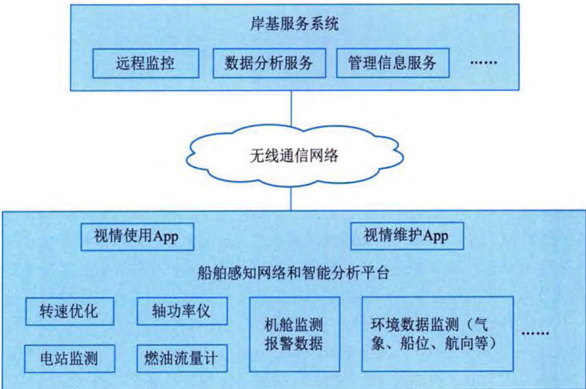  
图 21-14 某型船舶健康监测管理 CPS 系统  

# 2）智能维护  

为了对装备进行智能维护，可采用应用建模、仿真测试及验证等技术手段，基于装备虚拟健康的预测性智能维护模型，构建装备智能维护 CPS 系统。此系统通过采集装备各种实时运行数据，并将相关的多源数据加以融合，基于此再进行装备性能、安全、状态等特性分析，预测装备潜在的异常状态，并提前对异常状态采取恰当的预测性维护。  

装备智能维护 CPS 系统突破传统的阈值报警和穷举式专家知识库模式，依据各装备实际活动产生的数据进行综合分析和研判，提前发现并及时处理问题隐患，从而延长装备正常运行时间。  

# 3) 远程征兆性诊断  

传统的装备售后服务模式下，装备发生故障时需要等待服务人员到现场进行维修，这极大程度影响生产进度，特别是大型复杂制造系统的组件装备发生故障时，维修周期长，更是增加了维修成本。在 CPS 应用下，当装备发生故障时，远程专家可以调取装备的报警信息、日志文件等数据，在虚拟的设备健康诊断模型中进行故障推演，实现远程的故障诊断并及时快速地解决故障，从而减少停机时间并降低维修成本。如图 21-15 所示为 CPS 在预防维护中的应用。  

  
图 21-15 基于 CPS 的装备故障预防维护系统  
# 4）协同优化  

CPS 通过搭建感知网络和智能云分析平台，构建装备的全生命周期核心信息模型，并按照既定的能效、安全、效率、健康度等目标，通过对核心部件和过程特征等在虚拟空间进行预测推演，为装备使用提供辅助决策以实现装备的最佳应用。  

以飞机运营为例，在运营中，对乘客人数、飞行时间、飞行过程环境数据、降落数据、机场数据等数据进行采集，并同步共享给相关方（如飞机设计与制造部门等），多方相互协同通过飞机虚拟仿真模型推演出最优方案，以指导飞机操作人员安全驾驶飞机，保证航空运营商提供最优路线方案给地勤运营系统等。如图 21-16 所示为 CPS 在航空运营管理方面的应用。  

  
图 21-16 基于 CPS 的运营管理系统  

# 5）共享服务  

通过在云端构建一个面向群体装备的工业数据分析与信息服务平台，将单一智能装备的信 息与知识进行共享，处于运行状态的智能装备可以利用自身的感知和运算能力帮助其他智能装 备进行分析运算，智能装备可依据云端群体知识进行活动优化。以船舶为例，将要开始某个具 体航线活动的船舶可以向该区域内其他船舶提出信息请求，接收请求的船舶可以利用自身的感 知与运算能力进行分析运算并将结果告知前者。这样，前者可以据此选择航线、设定航速、躲 避气象灾害等，从而实现“我为人人，人人为我”的和谐共享的航运生态。  

# 21.6.4 产业链协同系统  

# 1. 需求分析  

工业体系产业链上，设计者、生产者和使用者相互之间密不可分，生产者为使用者提供符合设计者要求的产品，三者之间既合作又竞争。在市场压力和资金压力下，制造企业势必会采取产线升级、管理信息化等措施提高生产效率，降低生产成本。无论设备制造企业如何提升制造端的智能化，其成本最终依然会转移给用户企业。对于现金流同样紧张的用户企业来说，任何生产要素的投入都是不少资金的占用，这无疑会增加用户企业的经营风险。那么如何能在三者之间进行平衡，照顾到各自的关切，是亟待解决的问题。  
 

# 2. 解决方案设计  

通过 CPS 能力建设，实现 CPS 在制造业全产业链的创新应用，可给制造业带来新的思路， 这样一来，生产者不只是生产产品，还是创造用户价值，打消用户在生产过程中的顾虑，让设 计者和制造者通过提供服务的方式参与到使用者企业的再生产过程中，合力协同共创产业融合 的分享型价值链。  

通过运用感知和自动控制硬件及工业软件，将传统产业链中设计者、生产者和使用者的装备、人和环境等接入工业网络。再通过工业网络实现装备设计数据、装备生产数据、装备运行数据、设计活动数据、生产活动数据、使用活动数据、内环境和外环境数据的异构融合，形成工业大数据，再将工业大数据按安全性和隐私性要求存储在私有工业云或公有工业云中，作为后续数据分析、策略制定的依据。  

在数据服务平台的映射层，实现装备的设计个体空间、生产个体空间和运行个体空间的映射，设计、生产、使用过程中人类管理活动行为的映射，以及环境空间的映射，并从智能组网、集群协同、活动协同和环境协同等不同维度构建可供认知利用的群体空间、活动空间和环境空间。  

在数据服务平台的认知层，分别用以数据驱动和机器学习为主要手段的行为认知方式，以机理模型和数据增强为主要手段的启发认知方式，以群体行为认知和群体启发认知为主要手段的群体认知方式，构建知识发现、知识交互和知识融合的平台，并通过知识的推演、预测，建立推演空间和预测空间。  

在数据服务平台的服务层，对环境提供状态感知、自主学习、持续演进和智能决策的支撑服务，并将工业软件和感知控制硬件作为载体运用在设计端、生产端和使用端。  

在装备端，通过知识成长的核心智能装备建设以及模型移植的CPS智能胶囊实现，共同完成“智能装备”的构建。在人与装备之间的协同优化方面，通过机器自主学习的视情设计和视情生产实现，满足敏捷设计、柔性制造等供给侧的优化需求，完成“智能制造”。在人与环境之间的协同优化方面，通过工业智能技术，突破人类工程师的局限性，实现安全、健康、高效、环保的视情使用和视情管理，完成“智能管理”。  

总之，通过CPS 的能力建设，实现制造业全产业链的信息融合和价值共创，将设计者、生 产者和使用者的单调角色转变为新价值创造的共同参与者，并通过新型价值链的创建推动传统 产业链转型，这样从根本上调动生产流程中各个参与者的积极性和创造力。  

# 1）无人装备  

众所周知，船舶、飞机等重型装备普遍操作难度大，安全性要求高，一旦发生意外就会造 成严重后果，这就对操作人员的能力和经验提出了极高要求。以船舶为例，传统模式下，培养 一个优秀的船员需要5～10年，市场上迫切需要一种智能化船舶解决方案，一方面可快速提高 船员的技能水平，另一方面又可降低操控船舶对船员经验的依赖程度。  

CPS 很好地解决了上述装备智能化问题, 如图 21-17 所示, 通过装备状态感知和实时计算,学习装备操控过程知识, 并通过行为认知和启发认知不断地迭代, 增强决策正确率, 逐渐实现物的智能代替人的智慧。建立无人智能设备, 同时构建 CPS 智能子系统, 在同类型的装备上如法炮制, 实现设备智能化规模效应。  
  

第21章 信息物理系统分析与设计  

  
图 21-17 CPS 在装备智能化方面的应用  

# 2）产业链互动  

在以市场需求为导向的产业链中，需要设计者、生产者共同参与到使用者的活动之中，利用工业网络构建融合设计、生产和使用的信息空间，并通过机器学习和群体认知等手段，快速分析产品的使用状况，预测用户的需求变化和市场趋势，提供设计修改建议和生产维修计划辅助决策知识，智能优化配置资源，及时处理用户需求。同时，通过 CPS 让用户参与到产品的设计、生产过程中来，共同实现敏捷设计和柔性生产，贴身服务的多赢局面。基于 CPS 的产业链联动系统如图 21-18 所示。  

  
图 21-18 基于 CPS 的产业链联动系统  
# 第 22 章 系统分析师论文写作要点  

# 22.1 写作注意事项  

系统分析师的论文题目对于考生具有较大难度，一方面，考生需要掌握论文题目中系统分析设计的专业知识；另一方面，论文的撰写需要结合考生自身的项目经历。因此，如何将自己的项目经历和专业知识进行有机结合，将专业知识的理论和专业知识的工程相结合，撰写出一篇高质量的系统分析师论文，对考生来说具有比较大的挑战。  

论文试题是系统分析师考试的重要组成部分，论文试题既不是考知识点，也不是考一般的分析和解决问题的能力，而是考查考生在系统分析设计方面的经验和综合能力，以及表达能力。根据考试大纲，论文试题的考核目的包括如下:  

(1) 检查考生是否具有参加系统分析设计工作的实践经验。原则上, 完全不具备实践经验的人是很难胜任系统分析师的工作的, 更不能够取得高级工程师的资格。  

(2) 检查考生分析问题与解决问题的能力, 特别是考生的独立工作能力。在实际工作中,由于情况千变万化, 作为系统分析师, 应能把握系统的关键因素, 发现和分析问题, 根据系统的实际情况提出架构设计方案。  

(3) 检查考生的表达能力。由于文档是系统的重要组成部分, 并且在系统开发过程中还要编写不少工作文档和报告, 文档的编写能力很重要。系统分析师作为项目组的技术骨干, 要善于表达自己的思想。在这方面要注意抓住要点, 突出重点, 用词准确, 使论文内容易读, 易理解。  

考生在备考过程中，可以采用一些方法提升备考的效率。  

# 1. 加强学习  

根据自身经验的多少，可以采取不同的学习方法。  

(1) 经验丰富的应考人员。主要是将自己的经验进行整理, 从技术、管理、经济方面等多个角度对自己做过的项目进行归纳、剖析、抽象和升华, 在总结的基础上, 结合专业知识和关键技术进行分类和梳理。  

(2) 经验欠缺的在职开发人员。可以通过阅读、学习、整理单位现有的文档、案例, 同时参考历届考题进行学习。思考别人是如何站在系统分析师角度考虑问题的, 同时可以采取临摹的方式提高自己的写作能力和思考能力。这类人员学习的重心应放在自己欠缺的方面, 力求全面把握。  

(3) 学生。学生的特点是有充足的时间用于学习, 但缺点是实践经验相对较少, 对于这类考生来说, 论文考试的难度比较大。从撰写的论文分析, 学生在系统分析师的考试中, 论文的内容容易空洞而不切实际。因此, 作为学生考生, 要想更好地完成论文题目, 就需要大量地阅读相关文章和论文范文, 把别人的直接经验变为自己的间接经验, 并进行强化练习。  
# 2. 平时积累  

与其他考试不同，全国计算机技术与软件专业技术资格（水平）考试中的高级资格考试靠临场突击是行不通的。考试时间不长，可功夫全在平时，正所谓“台上1分钟，台下10年功”。实践经验丰富的考生还应该对以前做过的项目进行一次盘点，对每个项目中采用的方法与技术、架构设计手段等进行总结。这样，临场时可以将不同项目中和论题相关的经验和教训糅合在一个项目中表述出来，笔下可写的东西就多了。  

还有, 自己做过的项目毕竟是很有限的, 要大量参考其他项目的经验或多和同行交流。也可多读网站、博客上介绍架构设计方面的文章, 从多个角度去审视这些系统的架构, 从中汲取经验, 也很有好处。要多和同行交流, 互通有无, 一方面对自己做过的项目进行回顾; 另一方面, 也学学别人的长处, 往往能收到事半功倍的效果。  

总之，经验越多，可写的素材就越丰富，写出高质量论文的可能性越大。平时归纳总结了，临场搬到试卷上就驾轻就熟了。  

# 3. 提高打字速度  

考生要针对机考的特定环境进行针对性的打字练习，逐步熟悉键盘布局和符号的具体位置，通过不断练习，考生可以形成肌肉记忆，提高打字速度和准确率。  

在具体机考过程中，主要提供了中文（简体）-微软拼音输入法、中文（简体）-极点五笔输入法和中文（简体）-搜狗拼音输入法。考生可以选择自己熟悉的输入法来提高文字输入速度。  

在写作过程中，掌握常用的写作快捷键可以大大提高文字操作效率，包括复制、粘贴、剪切、撤销等常用操作。  

# 4. 以不变应万变  

论文试题的考核内容都是系统分析设计中的共性问题，即通用性问题，是与具体的应用领域无关的问题。把握了这个规律，就有以不变应万变的办法。所谓不变，就是考生所参与开发的软件项目不变。考生应该在考前总结最近所参与的最有代表性的项目。不管论文的题目为何，项目的概要情况和考生所承担的角色是不必改变的，如果觉得有多个项目可以选，那就应该检查所选项目的规模是否能够证明自己的实力，或项目是否已年代久远（一般需要在近3年内做的项目）。要应对万变，就要靠平时的全面总结和积累。  

# 22.2 如何解答试题  

如果做好了充分的论文准备，平时按照既有格式进行了练习，则临场就可以从容自如。如果试题与准备的内容出入很大，那也不要紧张，选定自己把握最大的论题，按平时的速度写下去。  

# 22.2.1 论文解答步骤  

根据论文答题的一般步骤，本节给出一个通用的框架，考生可根据考试现场题目的情况和自己的实际进行解答，不必拘泥于本框架的约束。  
   

# 1. 时间分配  

下面给出论文答题各步骤的时间分配。  

试题选择 3 分钟

论文构思 12 分钟

写摘要 15 分钟

正文撰写 80 分钟

检查修改 10 分钟  

# 2. 试题选择  

在试题选择时要注意:  

(1) 选择自己最熟悉的, 最有把握的题目。  

(2) 不要忘记选择题号和填写考号。  

# 3. 论文构思  

在论文构思时要注意:  

(1) 构思论点（主张）和下过功夫的地方。  

(2) 将构思的项目内容与论点相结合。  

(3)决定写入摘要的内容。  

(4)划分章节, 把内容写成简单草稿 (几字带过, 无须丰富细节)。  

(5) 大体字数分配。  

# 4. 写摘要  

写摘要时要注意:  

用语简洁、明快，阐述自己的论点。  

# 5. 正文撰写  

正文撰写时要注意:  

(1) 按草稿进行构思、追忆项目素材（包括收集的素材）进行编写。  

(2) 控制好内容篇幅。  

(3) 与构思有出入的地方, 注意不要前后矛盾。  

# 6. 检查修改  

检查修改主要是检查有无遗漏、有无错别字等。  

# 22.2.2 论文解答实例  

本节给出系统分析师考试中的实际论文题目以及面向该题目应如何进行写作的要点陈述，以帮助考生对论文考试有更直观的认识。  

试题 论软件需求获取方法及应用  
需求获取（Requirement Discovery，RD）是一个确定和理解不同类用户需要和约束的过程。 需求获取是否科学、充分对所获取的结果影响很大，直接决定了系统开发的目标和质量。由于 大部分用户无法完整地描述需求，也不可能看到系统的全貌，因此在需求获取中，系统分析师 需要与用户进行有效沟通和合作才能成功。系统分析师根据要获取的信息内容和信息来源采用 不同的需求获取技术，并且熟练地在实践中运用它，进而获得用于描述系统活动的特定软件需 求，构建系统开发目标和质量要求。  

请围绕“软件需求获取方法及应用”论题，依次对以下三个问题进行论述。  

(1) 简要叙述你所参与的软件开发项目以及你所承担的主要工作。  

(2) 详细说明在系统分析中有哪些需求获取方法, 不同需求获取方法各自有哪些特点。  

(3)结合你所参与的项目, 具体阐述如何根据需求内容采用不同的需求获取方法获取软件需求。  

# 1. 例题分析  

主题：在系统分析中，如何选择正确的需求获取方法来获取软件系统需求。  

(1) 开发项目的概要, 包括项目的背景、发起单位、目的、项目周期、交付的产品等。  

(2) 项目在系统设计方面的情况。  

(3)“我”的角色和担任的主要工作。  

# 问题2要点:  

(1) 在系统分析过程中, 正确理解用户需求的重要性。  

(2) 不同的需求获取方法有哪些特点，分别适用于哪些应用场景。  

问题3要点:  

(1) 所参与项目中需要获取哪些需求。  

(2) 不同的需求分别选用了哪些需求获取手段, 其选择的依据是什么。  

(3) 不同需求获取手段在实际场景中的应用效果如何。  

# 2. 答案结构示例  

例题写作的结构大致如表 22-1 所示。  

<table><tr><th>过程</th><th>字数</th><th>是否必要</th></tr><tr><td>(1)摘要</td><td>300~400</td><td>√</td></tr><tr><td>(2)项目概要 ●开发项目的概要 ●开发的体制和“我”担任的工作 ●项目在系统设计方面的情况</td><td>400~600</td><td>√</td></tr><tr><td>(3)正确理解用户需求的重要性</td><td>100~200</td><td>√</td></tr><tr><td>(4)常见的需求获取方法的特点及其适用场景</td><td>800~1200</td><td>√</td></tr><tr><td>(5)针对实际需求如何选择需求获取方法</td><td>400~500</td><td>√</td></tr><tr><td>(6)实际采用的需求获取方法效果如何</td><td>200~300</td><td>√</td></tr><tr><td>(7)总结</td><td>100~200</td><td></td></tr></table>  
   

# 22.3 论文写作方法  

两个小时内写出一篇近3000字的文章不是一件容易的事情。根据以往的经验，考生在写作过程中必须逻辑清晰，并且要保持一定的撰写速度，才可以在有限的时间内较好地完成论文写作。下面针对如何撰写好摘要和论文的正文部分分别进行说明。  

# 22.3.1 如何写好摘要  

按照考试评分标准: “摘要应控制在 300 \~ 400 字, 凡是没有写论文摘要, 摘要过于简略,或者摘要中没有实质性内容的论文将扣 5 \~ 10 分。”如果论文写得辛辛苦苦, 而摘要被扣分,那就太不划算了。而且, 如果摘要的字数少于 120 字, 论文将被 “给予不及格”。  

下面是摘要的几种写法，供考生参考:  

(1) 本文讨论……系统项目的……（论文主题）。该系统……（项目背景、简单功能介绍）。在本文中首先讨论了……（技术、方法、工具、措施、手段），最后……（不足之处 / 如何改进、特色之处、发展趋势）。在本项目的开发过程中，我担任了……（作者的工作角色）。  

(2) 根据……需求（项目背景），我所在的……组织了……项目的开发。该项目……（项目背景、简单功能介绍）。在该项目中，我担任了……（作者的工作角色）。我通过采取……（技术、方法、工具、措施、手段），使该项目圆满完成，得到了用户们的一致好评。但现在看来，……（不足之处/如何改进、特色之处、发展趋势）。  

(3)……年……月, 我参加了……项目的开发, 担任……(作者的工作角色)。该项目……(项目背景、简单功能介绍)。本文结合作者的实践, 以……项目为例, 讨论……(论文主题), 包括……(技术、方法、工具、措施、手段)。  

(4)……是……(“戴帽子”, 讲论文主题的重要性)。本文结合作者的实践, 以……项目为例, 讨论……(论文主题), 包括……(技术、方法、工具、措施、手段)。在本项目的开发过程中, 我担任了……(作者的工作角色)。  

摘要应该概括地反映正文的全貌，要引入入胜，要给人一个良好的印象。一般来说，不要在摘要中“戴帽子”，如果觉得字数可能不够，如少于300字，则可适当加50字左右的“戴帽子”内容。“技术、方法、工具、措施、手段”就是指论文正文中论述的技术、方法、工具、措施、手段，可把每个方法（技术、工具、措施、手段）的要点用一两句话进行概括，写在摘要中。  

在写摘要时，千万不要只谈大道理而不牵涉具体内容，否则，就变成了“摘要中没有实质性内容”。  

# 22.3.2 如何写好正文  

关于正文部分的写作，首先应做到字数合宜。正文的字数要求为2000～3000字。作者建议，论文正文的最佳字数为2500字左右。另外，考生可以从写作技巧和可能涉及的关键技术层面做好应考准备。下面介绍一些写作技巧。  
# 1. 以自我为中心  

由于论文考核的是考生作为系统分析师对系统的认知能力，因此在写法上要使阅卷专家信服，只是把自己做过的事情罗列出来是不够的。考生必须清楚地说明针对具体项目自己所做事情的由来、遇到的问题、解决方法和实施效果。因此，不要夸耀自己所参加的工程项目，体现实力的是考生做了些什么。下面几个建议可供读者参考：  

(1) 体现实际经验, 不要罗列课本上的内容。  

(2) 条理性地说明实际经验。  

(3) 写明项目开发体制和规模。  

(4) 明确 “我” 的工作任务和所起的作用。  

(5) 以 “我” 在项目中的贡献为重点说明。  

(6) 以 “我” 的努力（怎样做出贡献的）为中心说明。  

# 2. 站在系统分析师的角度  

很多考生由于平时一直是跟程序打交道，甚至根本就没有从事过系统分析工作。因此，在思考问题上，往往单纯地从程序实现方面考虑。事实上，论文考核的是以考生作为分析师的角度对系统的认知能力，要求全面、详尽地考虑问题。因此，这类考生在论文上的落败也就在所难免。  

例如，如果要写有关开发模型选择的论文，考生就要从全局的角度把握各种开发模型（特别是主流开发模型）的优点及缺点，使用开发模型进行开发的方法和过程，特别是关注选择某个开发模型的原因，而不是专注于某个具体的实现细节。  

# 3.忠实于论点  

忠实于论点首先是建立在正确理解题意的基础上，因此要仔细阅读论文试题要求。为了完全符合题意，要很好地理解关于试题背景的说明。然后根据正确的题意提取论点加以阐述。阐述时要绝对服从论点，回答试题的问题，就试题的问题进行展开，不要节外生枝，化自身为困境。也不要偏离论点，半天讲不到点子上去，结果草草收场。根据作者参加阅卷和辅导的情况来看，这往往是大多数考生最容易出错的地方。  

# 4. 条理清晰. 开门见山  

作为一篇文章，单有内容，组织不好也会影响得分，论文的组织一定要条理清晰。题目选定后，要迅速整理自己所掌握的素材，列出提纲，即打算谈几方面，每方面是怎么做的，收效如何，简明扼要地写在草稿纸上。注意，千万不要试图覆盖论文题目的全部内涵而不懂装懂，以专家的姿态高谈阔论，而是要将侧重点放在汇报考生自己在项目中所做的与论题相关的工作上，所以提纲不要求全面，关键要列出自己做过的工作。  

接下来就是开始正式写作正文，要让专家在短时间内了解考生的论文内容并认可考生的能力，必须把握好主次关系。一般来说，第一部分的项目概述对评卷专家掌握整个论文非常重要。考生要学会用精练的语句说明项目的背景、意义、规模、开发过程，以及自己的角色等，让评卷专家对自己所做的项目产生兴趣。  
# 5. 标新立异．要有主见  

设想一下，如果评卷专家看了考生的论文有一种深受启发，耳目一新的感觉，结果会怎么样？考生想不通过都难。所以，论文中虽然不要刻意追求新奇，但也不要拘泥于教科书或常规的思维，一定要动脑筋写一些个人的见识和体会。  

# 6. 首尾一致  

在正文的写作中, 要做到开头与结尾间互相呼应, 术语的意思忌途中变卦。因为术语若与论文试题的提法不一致, 导致论文内部不一致, 阅卷专家就会怀疑考生是否如所说的那样, 甚至认为考生有造假嫌疑, 从而影响论文得分。因此, 考生在论文准备阶段就应该注意这方面的锻炼。  

此外，与首尾一致相关的一些注意事项，如错别字、漏字等情形也要仔细检查。如果在论文写完后还有时间的话，要做一些必要的修正，这也是合格论文的必备条件之一。  

# 22.3.3 摘要和正文的关系  

在拿到论文考题时, 很多考生产生的一个问题就是究竟是先写摘要还是先写正文。其实,没有一种固定的法则, 需要根据考生的实际情况来决定。如果考生的写作速度比较快, 而又自信对论文的把握比较好, 则可以先写正文, 后写摘要。这样, 便于正文的正常发挥, 正文写完了, 归纳出摘要是水到渠成的事情。但是, 这种方法的缺点是万一时间不够, 来不及写摘要,损失就比较大了, 结果论文写得很辛苦, 因为摘要没有写而不及格; 如果考生的写作速度比较慢, 担心最后没有时间写摘要, 则可先写摘要, 后写正文, 在摘要的指导下写正文。这样做的好处是万一后面时间不足, 可以简单地对正文进行收尾, 从而避免 “有尾无头” 的情况发生,而不会影响整个论文的质量。但它的缺点是可能会限制正文的发挥, 使正文只能在摘要的圈子里进行扩写。  

另外，还要注意的一个问题是，正文不是摘要的延伸，而是摘要的扩展。摘要不是正文的部分，而是正文的抽象。因此，不要把正文“接”着摘要写。  

# 22.4 常见问题及解决办法  

在撰写论文时，经常出现的问题有以下几种:  

(1) 走题。有些考生一看到试题的标题, 不认真阅读试题的 3 个问题, 就按照三段论的方式写论文, 这样往往就导致走题。同一个主题, 试题所问的 3 个问题可以完全不一样, 因此, 需要按照试题的问题来组织内容。因为考查的侧重点不一样, 同一篇文章, 在一次考试中会得高分, 但在另一次考试中就会不及格。  

(2) 字数不够。按照考试要求, 摘要需要 $300 \sim 400$ 字, 正文需要 $2000 \sim 3000$ 字。一般来说, 摘要需要写 $350$ 字以上, 正文需要写 $2500$ 字左右。  

(3) 字数偏多。如果摘要超过 350 字, 正文超过 3000 字, 则字数太多。实际考试时, 因为时间限制, 几乎没有时间来写这么长的论文。所以, 读者在平常练习写作时, 要严格按照考试  
要求的时间进行写作。  

(4) 摘要归纳欠妥。摘要是一篇文章的总结和归纳, 是用来检查考生概括、归纳和抽象能力的。写摘要的标准是 “读者不看正文, 就知道文章的全部内容”。在摘要中应该简单地包括正文的重点词句。在摘要中尽量不要加一些 “帽子性” 语句, 而是要把正文的内容直接 “压缩” 就可以了。  

(5)文章深度不够。文章所涉及的措施（方法、技术）太多，但都没有深入。有些文章把主题项目中所使用的措施（方法、技术）一一列举，而因为受到字数和时间的限制，每个措施（方法、技术）都是蜻蜓点水式的描述，既没有特色，也没有深度。在撰写论文时，选择自己觉得有特色的2\~3个措施（方法、技术）进行深入展开讨论就可以了，不要企图面面俱到。  

(6) 缺少特色, 泛泛而谈。所采取的措施 (方法、技术) 没有特色, 泛泛而谈, 把书刊杂志上的知识点进行罗列, 可信性不强。系统分析师考试论文实际上就是经验总结, 所以一般不需要讲理论, 只要讲自己在某个项目中是如何做的就可以了。所有措施 (方法、技术) 都应该紧密结合主题项目, 在阐述措施 (方法、技术) 时, 要以主题项目中的具体内容为例。  

(7)文章口语化太重。系统分析师在写任何正式文档时, 都要注意使用书面语言。特别是在文章中不要到处都是 “我”, 虽然论文强调真实性 (即作者自身从事过的项目), 而且前文也强调了 “以我为中心” 的重要性, 但是, 任何一个稍微大一点的项目都不是一个人能完成的,而是集体劳动的结晶。因此, 建议使用 “我们” 来代替一些 “我”。  

(8)文字表达能力太差。有些文章的措施（方法、技术）不错，且能紧密结合主题项目，但由于考生平时写得少，文字表达能力比较差。建议这些考生平时多读文章，多写文档。  

(9)文章缺乏主题项目。这是一个致命缺点, 系统分析师考试论文一定要说明作者在某年某月参加的某个具体项目的开发情况, 并指明作者在该项目中的角色。因为每个论文试题的第一个问题一般就是 “简述你参与开发过的项目” (也有个别情况除外), 所以, 考生不能笼统地说 “我是做银行软件的” “我负责航天软件开发” 等, 而要具体说明是什么项目, 简单介绍该项目的背景和功能。  

(10) 论文项目年代久远。一般来说, 主题项目应该是考生在近三年完成的。  

(11) 整篇文章从一、二、三的大标题到 1、2、3 的小标题, 太死板, 让人感觉压抑。在论文中, 虽然可以用数字来标识顺序, 使文章显得更有条理, 但如果全文充满数字条目, 则显得太死板, 会影响最后得分。  

(12)文章结构不够清晰, 段落太长。这也与考生平常的训练有关, 有些不合格的文章如果把段落调整一下, 则是一篇好文章。另外, 一般来说, 每个自然段最好不要超过8行, 否则会使阅卷专家产生疲劳的感觉, 从而可能会影响得分。  

# 22.5 论文评分标准  

评卷专家究竟根据什么标准来判断一篇论文的得分，这是考生十分关心的一个问题。系统分析师考试的论文试题评分标准如下:  

(1) 论文满分是 75 分, 论文评分可分为优良、及格与不及格 3 个档次。评分的分数如下:  
①45分及45分以上为及格，其中，$60\sim75$分为优良。  

② $0 \sim 44$ 分为不及格。  

(2) 具体评分时, 对照下述 5 方面进行评分:  

①切合题意（30%）。无论是论文的技术部分、理论部分还是实践部分，都需要切合写作要点中的一个主要方面或者多方面进行论述。可分为非常切合、较好地切合与基本上切合3档。  

②应用深度与水平（20%）。可分为有很强的、较强的、一般的与较差的独立工作能力4档。  

③实践性（20%）。可分为如下4档：有大量实践和深入的专业级水平与体会；有良好的实践与切身体会和经历：有一般的实践与基本合适的体会：有初步实践与比较肤浅的体会。  

④表达能力（15%）。可从逻辑清晰、表达严谨、文字流畅和条理分明等方面分为3档。  

⑤综合能力与分析能力（15%）。可分为很强、比较强和一般3档。  

(3)下述情况的论文, 需要适当扣 $5 \sim 10$ 分。  

①摘要没有控制在300\~400字，没有写论文摘要，摘要过于简略，或者摘要中没有实质性内容的论文。  

②字迹比较澄清，其中有不少字难以辨认的论文。  

③确实属于过分自我吹嘘或自我标榜、夸大其词的论文。  

④内容有明显错误和漏洞的，按同一类错误每类扣一次分。  

⑤内容仅属于大学生或研究生实习性质的项目，并且其实际应用水平相对较低的论文。  

(4)下述情况之一的论文, 不能给予及格分数。  

①虚构情节、文章中有较严重的不真实或者不可信的内容出现的论文。  

②没有项目开发的实际经验、通篇都是浅层次纯理论的论文。  

③所讨论的内容与方法过于陈旧，或者项目的水准非常低下的论文。  

④内容不切题意，或者内容相对空洞、基本上是泛泛而谈且没有较深入体会的论文。  

⑤正文与摘要的篇幅过于短小的论文（如正文少于1200字）。  

⑥文理很不通顺、错别字很多、条理与思路不清晰、字迹过于涤草等情况相对严重的论文。  

(5)下述情况, 可考虑适当加分 (可考虑加 $5 \sim 10$ 分)。  

①有独特的见解或者有着很深入的体会，相对非常突出的论文。  

②起点很高，确实符合当今信息系统发展的新趋势与新动向，并能加以应用的论文。  

③内容翔实、体会中肯、思路清晰、非常切合实际的优秀的论文。  

④项目难度很高，或者项目完成的质量优异，或者项目涉及国家重大信息系统工程且作者本人参加并发挥重要作用，并且能正确按照试题要求论述的论文。  
